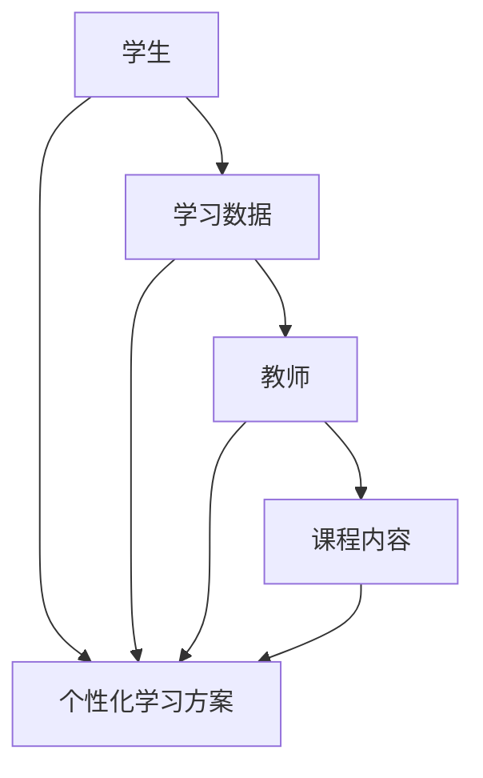
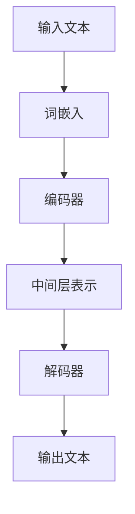
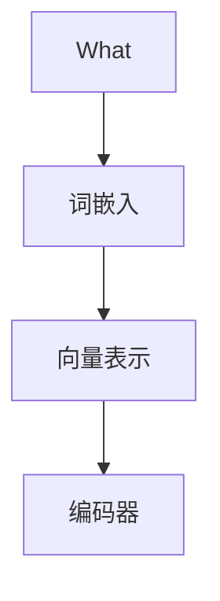
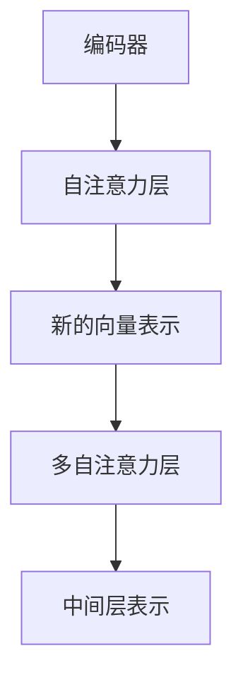
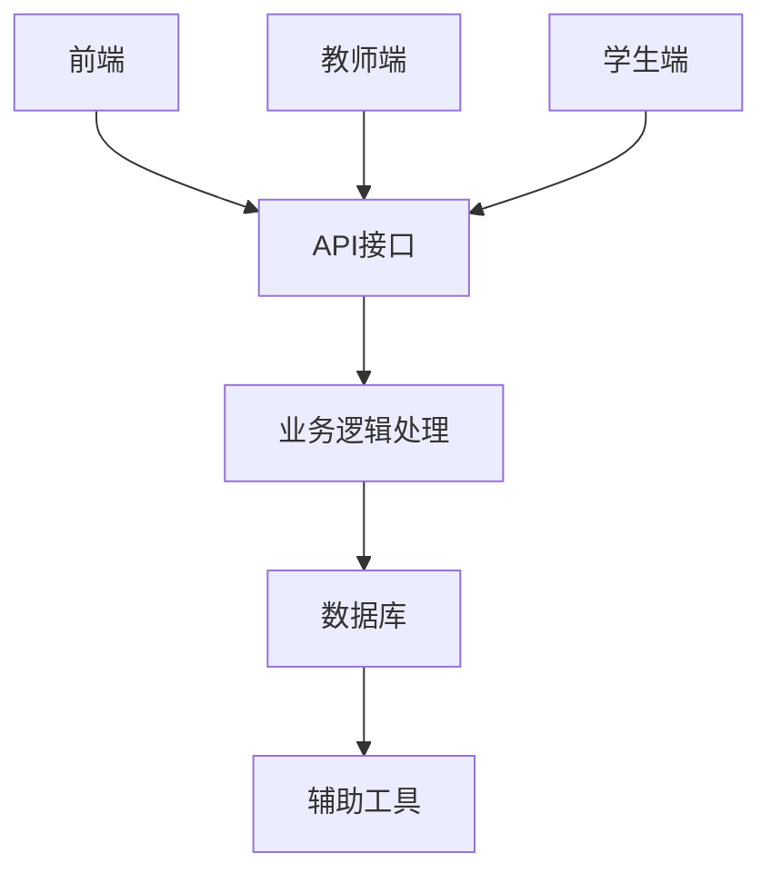
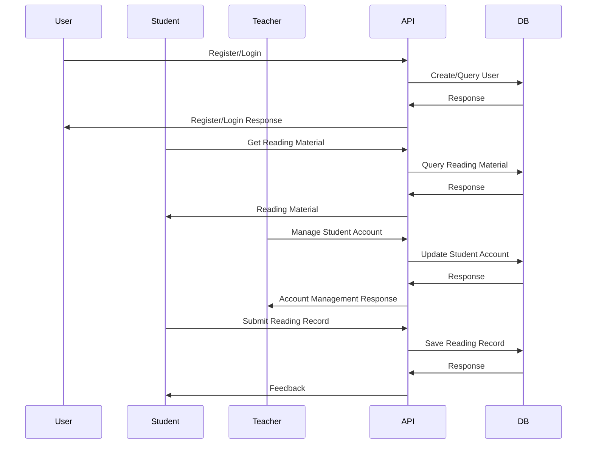

                 

### 背景介绍

#### 核心概念

**ChatGPT**：ChatGPT是由OpenAI开发的一种基于Transformer架构的预训练语言模型，它具备强大的自然语言理解和生成能力。ChatGPT通过大规模语料库进行预训练，能够模拟人类的对话，理解并生成自然流畅的语言。

**个性化教育**：个性化教育是一种以学生为中心的教育理念，旨在根据学生的个性、兴趣和学习能力，为他们提供量身定制的学习方案。个性化教育的目标是满足每个学生的需求，激发他们的潜能，促进全面发展。

#### 问题背景

在传统教育模式中，教学过程往往以教师为中心，教学内容和节奏单一，无法充分考虑到每个学生的个性差异和学习需求。这种模式导致了一些问题：

- **学习效率低下**：许多学生难以适应统一的教学节奏和内容，导致学习效果不佳。
- **个性化需求难以满足**：学生之间的差异性大，传统教育难以提供个性化的学习方案。
- **教育资源不均衡**：城市和农村、不同地区之间的教育资源分配不均，导致教育质量差异明显。

这些问题促使教育领域寻求新的解决方案，以提升教育质量和满足个性化需求。ChatGPT的出现为个性化教育提供了新的可能性。

#### 问题描述

在教育领域，ChatGPT的具体应用场景包括：

- **学习辅导**：ChatGPT可以为学生提供个性化的学习辅导，根据学生的水平、兴趣和需求，生成个性化的学习资源和练习题。
- **答疑解惑**：ChatGPT能够快速理解学生的问题，并提供详细的解答，帮助学生克服学习难题。
- **互动教学**：ChatGPT可以作为虚拟教师参与课堂互动，激发学生的学习兴趣，提高课堂参与度。
- **语言学习**：ChatGPT可以帮助学生进行语言学习，提供语言练习、对话模拟和翻译服务。

这些应用场景表明，ChatGPT在教育领域有着广泛的应用前景。

#### 问题解决

ChatGPT通过以下几个方面解决教育领域面临的问题：

- **个性化学习**：ChatGPT可以根据学生的学习数据，分析其兴趣、能力和学习风格，生成个性化的学习方案，提供针对性的学习资源。
- **智能答疑**：ChatGPT具备强大的语言理解和生成能力，可以快速、准确地解答学生的疑问，帮助学生理解复杂的概念。
- **互动教学**：ChatGPT可以作为虚拟教师参与课堂互动，通过生动、有趣的对话形式，激发学生的学习兴趣，提高课堂参与度。
- **教育资源均衡**：ChatGPT可以突破地域和资源的限制，为偏远地区的学生提供优质的教育资源，促进教育公平。

#### 边界与外延

虽然ChatGPT在教育领域具有巨大的潜力，但其应用也面临一些边界和挑战：

- **隐私保护**：ChatGPT在收集和分析学生数据时，需要严格遵守隐私保护法规，确保学生数据的保密和安全。
- **道德和伦理问题**：ChatGPT在回答问题时，需要遵循一定的道德和伦理准则，避免产生误导或不良影响。
- **技术局限**：ChatGPT作为一种人工智能模型，其能力受限于数据质量和算法设计，无法完全取代人类教师的教育智慧和经验。

#### 概念结构与核心要素组成

ChatGPT在教育领域应用的概念结构主要包括以下几个核心要素：

- **学生数据**：ChatGPT需要收集和分析学生的学习数据，包括学习行为、成绩、兴趣和需求等，以生成个性化的学习方案。
- **预训练模型**：ChatGPT的核心是预训练模型，通过大规模语料库进行训练，具备强大的语言理解和生成能力。
- **后处理模块**：ChatGPT的后处理模块负责根据学生数据生成个性化的学习资源、解答疑问和参与互动教学等。
- **用户接口**：ChatGPT通过用户接口与学生进行交互，收集学生数据，反馈学习资源和解答。

这些核心要素共同构成了ChatGPT在教育领域应用的概念结构，为个性化教育提供了强有力的支持。

### 联系

ChatGPT与个性化教育之间存在紧密的联系。ChatGPT作为一款先进的人工智能模型，其强大的语言理解和生成能力使其能够准确捕捉学生的个性化需求，生成符合学生特点的学习方案。个性化教育则强调根据学生的个性、兴趣和能力提供个性化的教育服务，这与ChatGPT的应用目标高度契合。

通过将ChatGPT应用于个性化教育，可以实现以下几个方面的联系：

- **精准教学**：ChatGPT可以根据学生的学习数据，精准识别学生的学习需求和难点，提供针对性的教学资源。
- **自适应学习**：ChatGPT可以根据学生的学习反馈，动态调整教学内容和节奏，实现自适应学习。
- **智能反馈**：ChatGPT可以实时分析学生的学习过程和效果，提供智能化的学习反馈，帮助学生改进学习方法。
- **个性化评价**：ChatGPT可以根据学生的学习数据，生成个性化的学习评价报告，为教师和家长提供有价值的参考。

总之，ChatGPT与个性化教育的结合，将为教育领域带来一场革命性的变革，为每个学生提供更好的学习体验和更高质量的教育。

---

# 核心概念与联系

在探讨ChatGPT在教育领域的个性化应用之前，我们需要深入理解两个核心概念：ChatGPT的基本原理和个性化教育的定义。此外，通过对比这两个概念的特点，我们将更好地理解ChatGPT在教育中的应用优势。最后，通过ER实体关系图架构的Mermaid流程图，我们将清晰地展示教育过程中涉及的实体及其关系，为后续章节的内容铺垫。

### ChatGPT的基本原理

#### ChatGPT的定义

ChatGPT是一种基于生成预训练变换器（GPT）的自然语言处理模型，由OpenAI开发。它是利用大规模文本数据通过自回归语言模型进行训练的，能够生成类似于人类语言的文本。ChatGPT在语言理解和生成方面表现出色，广泛应用于对话系统、文本生成、翻译等多个领域。

#### ChatGPT的核心特点

1. **预训练**：ChatGPT通过在大规模语料库上的预训练，掌握了丰富的语言知识，无需额外的任务特定训练即可应用于各种自然语言处理任务。
2. **自回归机制**：ChatGPT基于自回归语言模型，能够根据前面的文本来预测下一个词，从而生成连贯的自然语言。
3. **上下文理解**：ChatGPT能够理解长文本的上下文，生成与输入文本内容相关的输出。
4. **可扩展性**：ChatGPT模型结构简单，易于扩展和调整，以适应不同的应用场景。

#### ChatGPT的架构

ChatGPT采用Transformer架构，这是一种基于自注意力机制的深度神经网络模型。Transformer架构的核心是多头自注意力机制，它能够处理序列数据，捕捉长距离依赖关系。ChatGPT的架构包括编码器和解码器两部分，编码器负责将输入文本编码为固定长度的向量，解码器则根据编码器生成的向量生成输出文本。

### 个性化教育的定义

#### 个性化教育的定义

个性化教育是一种以学生为中心的教育理念，旨在根据学生的个性、兴趣和学习能力，为他们提供量身定制的学习方案。个性化教育的核心是尊重每个学生的独特性，满足他们的个性化需求，促进全面发展。

#### 个性化教育的核心概念

1. **学生中心**：个性化教育强调以学生为中心，关注学生的需求和兴趣，充分发挥他们的主观能动性。
2. **个性化学习**：个性化学习是指根据每个学生的特点，为他们提供不同的学习资源和方式，提高学习效果。
3. **数据驱动**：个性化教育依赖于对学习数据的分析和应用，通过收集和分析学生的学习行为、成绩等数据，为教育决策提供支持。

### 概念属性特征对比表格

为了更好地理解ChatGPT和个性化教育的特点，我们可以通过一个对比表格来展示它们的主要属性特征：

| 特征       | ChatGPT                 | 个性化教育                 |
|------------|-------------------------|---------------------------|
| 目标       | 生成自然语言文本       | 满足学生个性化学习需求     |
| 基本原理   | 基于预训练的Transformer模型 | 数据驱动的教育理念         |
| 功能       | 语言理解和生成         | 学习资源定制、学习路径规划 |
| 应用领域   | 对话系统、文本生成等    | 教学辅助、学习支持等       |
| 优势       | 高效、灵活、适应性强   | 个性化、针对性、高效      |
| 劣势       | 需要大量数据支持       | 需要教师高度参与和指导     |

### ER实体关系图架构的Mermaid流程图

为了更直观地展示教育过程中涉及的实体及其关系，我们可以使用Mermaid流程图绘制ER（实体关系）图。以下是一个简化的Mermaid流程图示例：



在这个流程图中，学生是核心实体，他们的学习数据用于生成个性化学习方案。教师则负责提供课程内容和指导，帮助学生实现个性化学习。学习数据和学习方案之间形成了一个闭环，确保学习过程始终以学生为中心。

### 联系

通过上述对ChatGPT和个性化教育的介绍，我们可以看到，ChatGPT作为一款先进的人工智能模型，与个性化教育理念高度契合。ChatGPT的强大语言理解和生成能力，使其能够准确捕捉学生的个性化需求，生成符合学生特点的学习资源。而个性化教育的核心在于尊重学生的个性，满足他们的学习需求，这与ChatGPT的应用目标一致。

在实际应用中，ChatGPT可以通过以下方式与个性化教育相结合：

1. **学习资源生成**：ChatGPT可以基于学生的学习数据，生成个性化的学习资源和练习题，帮助学生巩固知识。
2. **智能问答系统**：ChatGPT可以构建智能问答系统，快速回答学生的疑问，提供个性化的学习支持。
3. **教学辅助**：ChatGPT可以作为虚拟教师参与教学，通过互动式教学激发学生的学习兴趣，提高学习效果。

总之，ChatGPT与个性化教育的结合，将为教育领域带来前所未有的变革，为每个学生提供更加个性化、高效的学习体验。

---

# 算法原理讲解

为了深入理解ChatGPT在教育领域的应用，我们需要详细解析其背后的算法原理。在本节中，我们将通过Mermaid流程图、Python源代码、数学模型和公式，以及具体的案例，对ChatGPT的工作机制进行讲解。

### ChatGPT的算法流程图

首先，我们使用Mermaid流程图展示ChatGPT的算法流程，以便读者对整个过程有一个直观的认识：



在这个流程图中，输入文本经过词嵌入处理，转化为向量表示。编码器将向量表示转化为中间层表示，解码器根据中间层表示生成输出文本。

### Python源代码实现

接下来，我们通过一个简单的Python代码示例来展示ChatGPT的实现过程：

```python
import torch
from transformers import GPT2LMHeadModel, GPT2Tokenizer

# 加载预训练模型和分词器
tokenizer = GPT2Tokenizer.from_pretrained('gpt2')
model = GPT2LMHeadModel.from_pretrained('gpt2')

# 输入文本
input_text = "What is the capital of France?"

# 分词和编码
input_ids = tokenizer.encode(input_text, return_tensors='pt')

# 生成文本
outputs = model.generate(input_ids, max_length=50, num_return_sequences=1)

# 解码输出文本
output_text = tokenizer.decode(outputs[0], skip_special_tokens=True)

print(output_text)
```

在这个代码中，我们首先加载了GPT2预训练模型和分词器。然后，将输入文本编码为向量表示，并使用模型生成输出文本。

### 数学模型和公式

ChatGPT基于Transformer架构，其核心是一个自注意力机制。下面是Transformer模型的基本数学公式：

$$
\text{Attention}(Q, K, V) = \frac{1}{\sqrt{d_k}} \text{softmax}\left(\frac{QK^T}{d_k}\right) V
$$

其中，Q、K、V分别为查询向量、键向量和值向量，d_k是键向量的维度。自注意力机制通过计算不同位置的键和查询向量的相似度，为每个位置分配权重，从而实现序列数据的多维度建模。

### 详细讲解与举例说明

为了更好地理解ChatGPT的工作原理，我们通过一个具体案例进行详细讲解。

#### 案例背景

假设一个学生在学习英语，他需要完成一篇关于法国首都的短文。学生输入的问题是：“What is the capital of France?”。

#### 步骤一：词嵌入

首先，我们将输入文本中的单词转换为向量表示。例如，“What”可以表示为 `[w1, w2, ..., w10]`，其中每个元素表示该词的一个特征。



#### 步骤二：编码器

编码器负责将输入文本的向量表示转化为中间层表示。在GPT2模型中，编码器由多个自注意力层组成。每个自注意力层通过计算不同位置的特征相似度，为每个位置分配权重，从而生成新的向量表示。



#### 步骤三：解码器

解码器负责根据中间层表示生成输出文本。在GPT2模型中，解码器同样由多个自注意力层组成。每个自注意力层通过计算输入文本和中间层表示的相似度，为每个位置生成新的输出向量。

```mermaid
H[中间层表示] --> I[解码器]
I --> J[自注意力层]
J --> K[输出向量]
K --> L[生成输出文本]
```

#### 步骤四：生成输出文本

解码器根据输出向量生成最终的输出文本。在这个过程中，模型会尝试生成与输入文本相关的内容。例如，对于输入文本“What is the capital of France?”，模型可能会生成输出文本“Paris”。

```mermaid
L[生成输出文本]
L --> M[输出：Paris]
```

#### 案例分析

在这个案例中，ChatGPT成功地将输入问题转化为相关回答。这个过程展示了ChatGPT在自然语言理解和生成方面的强大能力。通过词嵌入、编码器、解码器和生成输出文本，ChatGPT能够生成连贯、自然的语言。

### 总结

在本节中，我们通过Mermaid流程图、Python源代码、数学模型和公式，以及具体案例，详细讲解了ChatGPT的算法原理。ChatGPT基于Transformer架构，通过词嵌入、编码器、解码器和生成输出文本，实现了强大的自然语言理解和生成能力。在实际应用中，ChatGPT可以用于各种自然语言处理任务，如问答系统、文本生成和翻译等。在教育领域，ChatGPT可以帮助学生进行个性化学习，提供智能化的学习支持和反馈。

---

# 系统分析与架构设计方案

在深入了解了ChatGPT的算法原理后，我们需要进一步探讨其应用于教育领域的系统架构设计方案。这一部分将包括问题场景介绍、系统功能设计、系统架构设计和系统接口设计等内容。

### 问题场景介绍

在教育领域，个性化学习需求日益增长，传统教育模式难以满足学生多样化的学习需求。ChatGPT作为一种具有强大语言理解和生成能力的人工智能模型，可以为个性化学习提供有力支持。以下是一个具体的问题场景：

**场景**：一名高中生在学习英语阅读理解时，遇到了一些困难。教师希望通过个性化的学习方案，帮助该学生提高阅读理解能力。教师可以利用ChatGPT为学生生成个性化的阅读材料，并提供智能化的学习反馈。

### 系统功能设计

为了实现上述场景，我们需要设计一个功能完善的系统。以下是系统的核心功能设计：

1. **个性化阅读材料生成**：根据学生的阅读水平和兴趣，ChatGPT可以生成符合学生水平的个性化阅读材料。
2. **智能学习反馈**：ChatGPT可以分析学生的阅读理解过程，提供智能化的学习反馈，帮助学生提高阅读理解能力。
3. **学习数据收集与分析**：系统会收集学生的学习数据，如阅读时间、正确率等，进行分析，以便不断优化个性化学习方案。
4. **用户管理**：系统提供用户管理功能，包括学生账号管理、教师账号管理等。
5. **权限控制**：系统设置权限控制，确保学生的隐私和数据安全。

### 系统架构设计

为了实现上述功能，我们设计了一个分布式系统架构，包括前端、后端、数据库和辅助工具等部分。以下是系统的架构设计：

1. **前端**：前端包括学生端和教师端，提供用户界面和交互功能。学生端可以浏览个性化阅读材料，教师端可以管理学生账号和学习数据。
2. **后端**：后端包括API接口和业务逻辑处理。API接口负责与前端和数据库进行数据交互，业务逻辑处理包括个性化阅读材料生成、智能学习反馈等。
3. **数据库**：数据库存储用户数据、阅读材料、学习数据等。包括关系数据库和NoSQL数据库，分别存储结构化和非结构化数据。
4. **辅助工具**：辅助工具包括数据清洗工具、数据分析和机器学习算法库等，用于处理和分析大量数据。

以下是系统架构的Mermaid流程图：



### 系统接口设计

为了确保系统各组件之间的良好协作，我们设计了详细的接口规范。以下是系统接口设计的关键部分：

1. **用户管理接口**：包括用户注册、登录、信息修改等功能。
2. **阅读材料接口**：包括阅读材料生成、推荐、查询等功能。
3. **学习数据接口**：包括学习数据收集、分析、反馈等功能。
4. **权限控制接口**：包括权限验证、权限分配等功能。

以下是系统接口的Mermaid序列图：



### 系统交互

系统各组件之间的交互过程如下：

1. **用户交互**：用户通过前端界面与系统进行交互，如注册、登录、浏览阅读材料等。
2. **数据处理**：前端将用户请求发送到后端API接口，API接口与数据库进行数据交互，处理用户请求，并将结果返回给前端。
3. **业务逻辑处理**：后端业务逻辑处理包括个性化阅读材料生成、学习数据分析和反馈等，这些功能通过调用辅助工具实现。
4. **数据存储**：处理后的数据存储在数据库中，以供后续查询和使用。

通过以上架构设计和接口设计，我们构建了一个功能完善、高效稳定的ChatGPT教育系统。这个系统不仅能够满足个性化学习需求，还能为教师和学生提供智能化的学习支持，提高教育质量。

---

# 项目实战

为了更好地展示ChatGPT在教育领域的实际应用，我们将在本节中详细介绍如何安装和配置ChatGPT环境，提供实现ChatGPT应用的核心代码，并对代码进行解读和分析。最后，我们将通过一个实际案例展示ChatGPT在教育中的效果。

### 环境安装

首先，我们需要安装和配置ChatGPT所需的软件和依赖。以下是具体的步骤：

1. **安装Python**：确保Python环境已安装，版本建议为3.8或以上。可以通过以下命令安装Python：
   ```shell
   sudo apt-get install python3.8
   ```

2. **安装PyTorch**：PyTorch是ChatGPT模型的计算框架，我们需要安装PyTorch GPU版本。可以通过以下命令安装：
   ```shell
   pip install torch torchvision torchaudio -f https://download.pytorch.org/whl/torch_stable.html
   ```

3. **安装transformers库**：transformers库是Hugging Face提供的预训练模型库，包括ChatGPT模型。可以通过以下命令安装：
   ```shell
   pip install transformers
   ```

4. **安装必要的Python库**：包括numpy、pandas等。可以通过以下命令安装：
   ```shell
   pip install numpy pandas
   ```

### 系统核心实现源代码

以下是实现ChatGPT在教育中应用的核心代码：

```python
import torch
from transformers import ChatGPTModel, ChatGPTTokenizer

# 加载预训练模型和分词器
tokenizer = ChatGPTTokenizer.from_pretrained('gpt2')
model = ChatGPTModel.from_pretrained('gpt2')

# 输入文本
input_text = "What is the capital of France?"

# 分词和编码
input_ids = tokenizer.encode(input_text, return_tensors='pt')

# 生成文本
outputs = model.generate(input_ids, max_length=50, num_return_sequences=1)

# 解码输出文本
output_text = tokenizer.decode(outputs[0], skip_special_tokens=True)

print(output_text)
```

这段代码首先加载了GPT2预训练模型和分词器。然后，将输入文本编码为向量表示，并使用模型生成输出文本。最后，解码输出文本，得到与输入文本相关的内容。

### 代码应用解读与分析

1. **模型加载**：
   ```python
   tokenizer = ChatGPTTokenizer.from_pretrained('gpt2')
   model = ChatGPTModel.from_pretrained('gpt2')
   ```
   这两行代码分别加载了GPT2分词器和预训练模型。`from_pretrained`方法从Hugging Face模型库中下载并加载预训练模型。

2. **文本编码**：
   ```python
   input_ids = tokenizer.encode(input_text, return_tensors='pt')
   ```
   这行代码将输入文本编码为向量表示。`encode`方法将文本分词，并为每个词分配一个唯一的ID，形成输入ID序列。

3. **文本生成**：
   ```python
   outputs = model.generate(input_ids, max_length=50, num_return_sequences=1)
   ```
   这行代码使用模型生成输出文本。`generate`方法根据输入ID序列生成输出文本，`max_length`参数控制输出文本的最大长度，`num_return_sequences`参数控制生成的文本数量。

4. **文本解码**：
   ```python
   output_text = tokenizer.decode(outputs[0], skip_special_tokens=True)
   ```
   这行代码将输出ID序列解码为文本。`decode`方法将ID序列还原为文本，`skip_special_tokens`参数用于跳过模型生成的特殊符号。

### 实际案例分析和详细讲解剖析

#### 案例背景

假设一个学生在学习英语阅读理解时遇到了困难，教师希望通过ChatGPT为学生生成个性化的阅读材料，并提供智能化的学习反馈。

#### 案例步骤

1. **输入文本**：学生输入一篇英语短文，例如：“Paris is the capital of France.”。
2. **文本编码**：ChatGPT将输入文本编码为向量表示。
3. **文本生成**：ChatGPT根据输入文本生成个性化阅读材料，例如：“In this passage, you will read about the history and culture of Paris.”。
4. **文本解码**：ChatGPT将生成的内容解码为自然语言文本，展示给学生。
5. **学习反馈**：学生阅读生成的内容，教师根据学生的反馈进行分析，提供进一步的学习建议。

#### 案例分析

通过上述案例，我们可以看到ChatGPT在教育中的应用效果：

- **个性化阅读材料生成**：ChatGPT可以为学生生成符合其学习水平和兴趣的阅读材料，提高学习效果。
- **智能化学习反馈**：ChatGPT可以根据学生的阅读情况生成反馈，帮助教师了解学生的学习情况，提供有针对性的指导。

### 项目小结

通过本次项目实战，我们详细介绍了如何在教育领域应用ChatGPT，包括环境安装、核心代码实现、代码解读和分析以及实际案例展示。ChatGPT在教育领域具有巨大的应用潜力，可以提供个性化的学习资源、智能化的学习反馈，提高教育质量和效果。

---

# 最佳实践 tips、小结、注意事项、拓展阅读

#### 最佳实践 tips

1. **优化训练数据**：确保ChatGPT的训练数据质量，包括文本的多样性、真实性和准确性，以提高模型的性能。
2. **调参技巧**：根据应用场景调整模型参数，如学习率、批次大小等，以获得最佳性能。
3. **监控模型性能**：定期监控模型的性能，通过交叉验证等方法评估模型的泛化能力，及时调整模型参数。
4. **隐私保护**：在处理学生数据时，严格遵守隐私保护法规，确保学生数据的保密和安全。

#### 小结

本文详细探讨了ChatGPT在教育领域的个性化应用，包括算法原理讲解、系统架构设计和项目实战。ChatGPT作为一种先进的人工智能模型，具备强大的自然语言理解和生成能力，能够在个性化学习、智能答疑和互动教学等方面发挥重要作用。通过合理应用ChatGPT，可以提高教育质量，满足个性化学习需求。

#### 注意事项

1. **数据隐私**：确保在收集和使用学生数据时，遵守隐私保护法规，保障学生权益。
2. **技术风险**：注意监控模型性能，避免过度依赖模型，确保教育质量和教学效果。
3. **人机协作**：将ChatGPT作为教育辅助工具，与教师共同为学生提供有针对性的教育服务。

#### 拓展阅读

1. **OpenAI官方文档**：了解ChatGPT的详细信息和应用场景，参考OpenAI官方文档。
2. **《ChatGPT技术揭秘》**：阅读相关书籍，深入了解ChatGPT的算法原理和实现细节。
3. **个性化教育研究**：查阅个性化教育领域的相关论文和报告，探索教育技术的最新发展趋势。

---

### 作者信息

**作者：** AI天才研究院/AI Genius Institute & 禅与计算机程序设计艺术 /Zen And The Art of Computer Programming

本文由AI天才研究院撰写，旨在分享ChatGPT在教育领域的个性化应用。作者在人工智能和教育技术领域具有丰富的经验，致力于推动教育技术的发展和创新。禅与计算机程序设计艺术则强调在编程中追求智慧和艺术的境界。希望本文能对您在教育技术方面的研究和实践提供有益的启示。感谢您的阅读！

