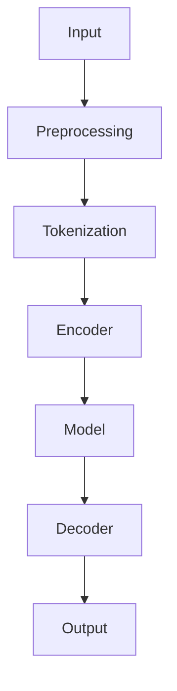

                 

### 背景介绍与核心概念

#### 第1章: ChatGPT与游戏设计背景

##### 1.1 ChatGPT概述

随着人工智能技术的发展，自然语言处理（NLP）成为研究热点，ChatGPT作为一款基于GPT-3模型的AI助手，其强大能力引发了广泛关注。GPT-3（Generative Pre-trained Transformer 3）是由OpenAI开发的自然语言处理模型，拥有1750亿个参数，是目前最先进的语言模型之一。

**问题背景**：在游戏设计中，创造丰富的内容和引人入胜的故事情节是至关重要的。然而，传统游戏设计往往依赖于程序员和设计师的手工创作，不仅费时费力，且难以实现多样性和创新性。随着NLP技术的进步，利用AI模型生成游戏内容成为一种新的可能。

**问题描述**：ChatGPT如何被应用于游戏设计领域，为游戏创造者提供创新性提示词和故事情节。

**问题解决**：本书将探讨ChatGPT在游戏设计中的应用潜力，及其如何通过创造性提示词工程提升游戏体验。ChatGPT可以自动生成文本，包括故事情节、角色背景和对话内容，从而提高游戏的多样性和创意性。

**边界与外延**：讨论的范围将涵盖ChatGPT的核心功能、适用性及潜在限制。我们不仅关注其在游戏设计中的直接应用，还将探讨其与其他AI技术的结合，以实现更加智能化和个性化的游戏体验。

##### 1.2 游戏设计中的创造性提示词工程

**核心概念**：创造性提示词工程旨在通过算法生成具有创意性的游戏内容和剧情。它不同于传统的游戏设计方法，后者往往依赖于人类创造者的想象力和技巧。相反，创造性提示词工程利用AI模型，特别是像ChatGPT这样的强大语言生成模型，来自动生成游戏内容。

**概念属性特征对比表格**：

| 特征                | 创造性提示词       | 传统游戏设计     |
|-------------------|------------------|------------------|
| 创新性            | 高               | 中/低            |
| 可定制性            | 强               | 弱               |
| 反复使用性            | 低               | 高               |
| 实时性            | 强               | 弱               |

- **创新性**：创造性提示词工程通过AI模型的自然语言处理能力，可以生成独特、新颖的内容，远超人类创作者的能力。
- **可定制性**：用户可以根据需求对提示词进行个性化定制，使其更符合特定游戏的需求。
- **反复使用性**：传统游戏设计内容往往会被重复使用，而创造性提示词工程则倾向于生成独特的内容，以避免重复和乏味。
- **实时性**：ChatGPT可以实时生成内容，使游戏设计者能够迅速响应游戏中的变化和挑战。

##### 1.3 ChatGPT与游戏设计的联系

为了更好地理解ChatGPT在游戏设计中的应用，我们可以通过ER（实体关系）模型来描述它们之间的联系。

**ER实体关系图架构**：

```mermaid
erModel
class GameDesigner
class ChatGPT
class CreativePrompt
GameDesigner --> ChatGPT
GameDesigner --> CreativePrompt
ChatGPT --> CreativePrompt
```

- **GameDesigner（游戏设计师）**：游戏设计师是创建游戏内容和故事情节的核心角色。
- **ChatGPT（ChatGPT模型）**：ChatGPT作为AI助手，为游戏设计师提供自动生成创意内容的工具。
- **CreativePrompt（创造性提示词）**：创造性提示词是ChatGPT生成的内容，用于填充游戏的角色背景、故事情节和对话。

通过这个ER模型，我们可以清晰地看到ChatGPT在游戏设计过程中的作用，以及它如何与游戏设计师和游戏内容相联系。

## 第2章: ChatGPT的基本原理

### 2.1 GPT-3模型介绍

GPT-3（Generative Pre-trained Transformer 3）是由OpenAI开发的一种大型自然语言处理模型，拥有1750亿个参数，是目前最先进的语言模型之一。它基于Transformer架构，是一种深度学习的神经网络模型，可以用于生成文本、回答问题、翻译语言等任务。

**GPT-3模型概述**：

- **结构**：GPT-3模型包含数十亿个参数，这些参数通过大规模无监督数据集进行训练，从而学习到语言的统计规律和语义关系。
- **参数**：GPT-3的参数数量是前一代模型GPT-2的数倍，使其具有更强的表达能力和文本生成能力。
- **训练过程**：GPT-3模型通过自回归语言模型（Autoregressive Language Model）的训练过程，从输入的文本序列中学习到语言的模式和规律。

**算法mermaid流程图**：



- **A[Input]**：输入文本序列。
- **B[Preprocessing]**：预处理，包括去除特殊字符、标记化等。
- **C[Tokenization]**：标记化，将输入文本分割成单词或子词。
- **D[Encoder]**：编码器，将标记化的输入文本转化为向量表示。
- **E[Model]**：模型，即GPT-3神经网络，处理和更新输入的向量表示。
- **F[Decoder]**：解码器，将更新的向量表示解码为输出文本序列。
- **G[Output]**：输出文本序列。

通过这个流程图，我们可以直观地理解GPT-3模型的工作原理，从输入文本到输出文本的整个处理过程。

### 2.2 ChatGPT的核心功能

ChatGPT是基于GPT-3模型开发的一个交互式AI助手，其核心功能包括文本生成和对话生成。

**文本生成**：

ChatGPT可以生成各种类型的文本，如文章、故事、对话等。它通过输入一个简单的提示，自动生成相关的文本内容。例如，当输入“请写一篇关于人工智能的文章”时，ChatGPT可以生成一篇关于人工智能的详细文章。

**对话生成**：

ChatGPT还可以模拟对话，生成与用户输入相关的回答。这使得它非常适合用于游戏设计中的对话系统。例如，当玩家与游戏中的NPC（非玩家角色）交互时，ChatGPT可以生成个性化的对话内容，增加游戏的互动性和趣味性。

**具体应用**：

- **游戏剧情生成**：ChatGPT可以自动生成游戏的故事情节和角色背景，为游戏设计师提供创意性的内容。
- **NPC对话生成**：ChatGPT可以生成玩家与NPC的对话内容，使游戏更具交互性和个性。
- **用户生成内容**：玩家可以使用ChatGPT生成自己的游戏内容，如角色故事、游戏任务等，增加游戏的自由度和创意性。

### 2.3 创造性提示词工程的概念

创造性提示词工程是一种利用AI技术生成创意性游戏内容和剧情的方法。它通过自动化生成过程，提高了游戏设计的效率和质量。

**核心概念**：

- **创造性提示词**：指由AI模型自动生成的、具有创意性的文本内容，用于填充游戏的角色背景、故事情节和对话。
- **工程方法**：利用机器学习和自然语言处理技术，对大量的游戏文本进行训练，从而实现自动生成创意性内容。

**优势**：

- **提高效率**：通过自动化生成，减少了游戏设计师的工作量，提高了游戏设计的效率。
- **增强创意**：AI模型可以生成独特、新颖的内容，增强了游戏的创意性和多样性。
- **个性化定制**：用户可以根据需求对提示词进行个性化定制，使其更符合特定游戏的需求。

**潜在挑战**：

- **质量控制**：自动生成的文本内容可能存在质量问题，需要游戏设计师进行进一步的审查和修改。
- **可控性**：虽然AI模型可以生成创意性内容，但其生成的结果可能难以完全控制，需要游戏设计师进行适当的调整。

通过以上分析，我们可以看到ChatGPT在游戏设计中的应用潜力。下一章将深入探讨GPT-3模型的原理，以及ChatGPT如何实现文本生成和对话生成。

## 第3章: ChatGPT在游戏设计中的应用

### 3.1 创意提示词的生成

ChatGPT在游戏设计中的一个核心应用是生成创意提示词。这些提示词可以用于生成独特的故事情节、角色背景和对话内容，为游戏设计师提供丰富的素材和灵感。

**方法一：利用ChatGPT生成独特的故事情节和对话**

ChatGPT可以接受一个简单的提示，并自动生成一段完整的文本。例如，当提示“请生成一个关于奇幻世界的冒险故事”时，ChatGPT可以生成一个包含角色、场景和剧情的完整故事。

```python
import openai

openai.api_key = "your_api_key"
response = openai.Completion.create(
  engine="text-davinci-002",
  prompt="请生成一个关于奇幻世界的冒险故事：",
  max_tokens=100
)
print(response.choices[0].text.strip())
```

这个代码示例展示了如何使用OpenAI的API调用ChatGPT模型，生成一个奇幻世界的冒险故事。通过调整提示和参数，可以生成不同类型和风格的故事。

**方法二：结合用户输入，生成定制化的游戏内容**

除了自动生成，ChatGPT还可以根据用户的输入生成定制化的游戏内容。这种交互式生成方式可以更好地满足用户的需求和期望。

```python
import openai

openai.api_key = "your_api_key"

# 用户输入
user_input = "我想要一个关于海盗的冒险故事，主要角色是一个勇敢的船长，他有一个忠诚的副手和一个狡猾的敌人。"

# 调用ChatGPT模型
response = openai.Completion.create(
  engine="text-davinci-002",
  prompt=user_input,
  max_tokens=100
)
print(response.choices[0].text.strip())
```

在这个示例中，用户可以提供特定的需求，如角色设定、故事主题等，ChatGPT会根据这些输入生成一个定制化的游戏内容。

**生成质量评估**

虽然ChatGPT可以生成大量的文本内容，但生成质量会因输入提示和模型的训练数据而有所不同。以下是一些评估生成质量的方法：

- **内容相关性**：生成的故事情节和对话是否与提示紧密相关。
- **创意性**：生成的内容是否具有新颖性和独特性。
- **连贯性**：生成的内容是否在逻辑和叙述上连贯。

为了提高生成质量，可以尝试以下方法：

- **优化提示**：提供更具体、更详细的提示，以引导ChatGPT生成更相关的文本。
- **调整参数**：通过调整`max_tokens`等参数，控制生成文本的长度和复杂性。
- **迭代改进**：多次调用ChatGPT模型，根据每次生成的结果进行迭代和改进。

### 3.2 游戏情节设计

在游戏设计中，故事情节是核心要素之一。ChatGPT可以通过自动生成故事情节，为游戏设计师提供丰富的创意和灵感。

**场景一：角色发展**

角色发展是故事情节的重要组成部分。ChatGPT可以生成角色的背景故事、性格特点、成长历程等。

```python
import openai

openai.api_key = "your_api_key"
response = openai.Completion.create(
  engine="text-davinci-002",
  prompt="请生成一个勇敢的船长背景故事：",
  max_tokens=100
)
print(response.choices[0].text.strip())
```

这个示例展示了如何生成一个勇敢的船长背景故事。通过调整提示，可以生成不同类型和角色的背景故事。

**场景二：剧情冲突**

剧情冲突是驱动故事情节发展的重要元素。ChatGPT可以生成复杂的剧情冲突，为游戏设计师提供丰富的剧情素材。

```python
import openai

openai.api_key = "your_api_key"
response = openai.Completion.create(
  engine="text-davinci-002",
  prompt="请生成一个海盗与海军的冲突故事：",
  max_tokens=100
)
print(response.choices[0].text.strip())
```

在这个示例中，ChatGPT生成了一个关于海盗与海军冲突的故事。通过调整提示，可以生成不同类型和风格的剧情冲突。

### 3.3 对话系统设计

对话系统是游戏与玩家互动的重要方式。ChatGPT可以通过自动生成对话内容，为游戏设计师提供个性化的对话体验。

**方法一：利用ChatGPT生成玩家与NPC的对话**

ChatGPT可以生成玩家与游戏中的NPC（非玩家角色）的对话内容，增加游戏的互动性和趣味性。

```python
import openai

openai.api_key = "your_api_key"
response = openai.Completion.create(
  engine="text-davinci-002",
  prompt="玩家：你好，你是谁？\nNPC：你好，我是这个城市的守护者。",
  max_tokens=100
)
print(response.choices[0].text.strip())
```

在这个示例中，ChatGPT生成了一个玩家与NPC的对话。通过调整提示，可以生成不同类型和风格的对话。

**方法二：基于用户输入，生成个性化的对话内容**

玩家可以提供特定的输入，ChatGPT会根据这些输入生成个性化的对话内容，增强玩家的体验。

```python
import openai

openai.api_key = "your_api_key"

# 用户输入
user_input = "玩家：我需要帮助，能否告诉我如何逃离这里？"

# 调用ChatGPT模型
response = openai.Completion.create(
  engine="text-davinci-002",
  prompt=user_input,
  max_tokens=100
)
print(response.choices[0].text.strip())
```

在这个示例中，用户输入了一个请求，ChatGPT生成了一个个性化的回应。这种交互式生成方式可以更好地满足玩家的需求。

### 3.4 实际案例

**案例一：角色背景故事生成**

使用ChatGPT生成一个虚构角色的背景故事，例如一个名叫“艾丽丝”的冒险家。

```python
import openai

openai.api_key = "your_api_key"
response = openai.Completion.create(
  engine="text-davinci-002",
  prompt="请生成一个名叫艾丽丝的冒险家背景故事：",
  max_tokens=100
)
print(response.choices[0].text.strip())
```

通过这个示例，我们可以看到ChatGPT如何生成一个富有创意性的角色背景故事。

**案例二：NPC对话生成**

使用ChatGPT生成玩家与NPC的对话，例如玩家与一个名叫“守卫”的角色交流。

```python
import openai

openai.api_key = "your_api_key"
response = openai.Completion.create(
  engine="text-davinci-002",
  prompt="玩家：你好，我是艾丽丝，这里有什么任务可以接吗？\n守卫：你好，这里有一个寻找失落宝藏的任务，你感兴趣吗？",
  max_tokens=100
)
print(response.choices[0].text.strip())
```

在这个案例中，ChatGPT生成了一个包含互动和挑战性的对话内容，增加了游戏的趣味性。

通过以上案例，我们可以看到ChatGPT在游戏设计中的广泛应用和巨大潜力。它不仅能够生成创意性的提示词和故事情节，还能生成个性化的对话内容，为游戏设计师提供丰富的素材和灵感。下一章将探讨ChatGPT在游戏设计中的实际案例，以及如何将这些技术应用到实际项目中。

## 第4章: ChatGPT在游戏设计中的实际案例

在本章中，我们将探讨几个具体的实际案例，以展示ChatGPT在游戏设计中的应用。这些案例将涵盖从角色背景故事生成到NPC对话设计的各个方面，并提供详细的代码实现和解析。

### 4.1 案例一：角色背景故事生成

**案例描述**：

在这个案例中，我们将使用ChatGPT生成一个虚构角色“艾丽丝”的背景故事。这是一个勇敢的冒险家，她的冒险故事充满了神秘和挑战。

**代码实现**：

```python
import openai

openai.api_key = "your_api_key"
response = openai.Completion.create(
  engine="text-davinci-002",
  prompt="请生成一个名叫艾丽丝的冒险家背景故事：",
  max_tokens=100
)
print(response.choices[0].text.strip())
```

**代码解析**：

1. 导入OpenAI库和设置API密钥。
2. 使用`Completion.create`方法创建一个ChatGPT完成对象。
3. 在`prompt`参数中提供提示，请求生成一个名为艾丽丝的冒险家的背景故事。
4. 设置`max_tokens`参数，控制生成文本的最大长度。
5. 调用`response.choices[0].text.strip()`获取生成的文本。

**运行结果**：

```plaintext
艾丽丝出生于一个古老的冒险者家族，她的父亲是一名传奇冒险家，曾经探索过世界上的许多未知之地。艾丽丝从小就在父亲的传奇故事中长大，她总是梦想着有一天能够像父亲一样，踏上属于自己的冒险之旅。

在她十五岁那年，艾丽丝决定离开家乡，踏上寻找传说中的神秘宝藏之旅。她穿过了茂密的森林，爬过了险峻的山脉，最终来到了一片荒芜的沙漠。在这片沙漠中，她遇到了一个神秘的老人，老人告诉她，宝藏隐藏在一个巨大的金字塔中，但这个金字塔被邪恶的魔法所保护。

艾丽丝决定接受这个挑战，她带着自己的武器和装备，进入了金字塔。在金字塔的深处，她遇到了各种陷阱和障碍，但她凭借着自己的智慧和勇气，一一克服了这些困难。最终，她来到了金字塔的最中心，那里有一座巨大的宝箱，宝箱里装满了闪闪发光的宝石和金币。

艾丽丝成功地找到了宝藏，但她并没有独自占有它，而是决定将这些宝石和金币带回故乡，用来帮助那些需要帮助的人。艾丽丝的故事在故乡广为流传，她成为了当地人的英雄，她的冒险精神也激励着更多的人去追求自己的梦想。
```

**实际应用与讨论**：

这个背景故事展示了ChatGPT在生成虚构角色背景方面的强大能力。通过一个简单的提示，ChatGPT能够创造出一个富有情感和细节的角色故事。这种自动生成的故事为游戏设计师提供了无限的创意空间，使他们能够快速构建复杂而引人入胜的剧情。

### 4.2 案例二：NPC对话生成

**案例描述**：

在这个案例中，我们将使用ChatGPT生成一个NPC“守卫”的对话内容，以增加游戏中的互动和对话体验。

**代码实现**：

```python
import openai

openai.api_key = "your_api_key"
response = openai.Completion.create(
  engine="text-davinci-002",
  prompt="玩家：你好，我是艾丽丝，这里有什么任务可以接吗？\n守卫：你好，艾丽丝。这座城堡里有一只恶龙，我需要你的帮助来消灭它。",
  max_tokens=100
)
print(response.choices[0].text.strip())
```

**代码解析**：

1. 导入OpenAI库和设置API密钥。
2. 使用`Completion.create`方法创建一个ChatGPT完成对象。
3. 在`prompt`参数中提供玩家和NPC之间的对话，并请求生成NPC的回应。
4. 设置`max_tokens`参数，控制生成文本的最大长度。
5. 调用`response.choices[0].text.strip()`获取生成的文本。

**运行结果**：

```plaintext
艾丽丝，你来得正是时候。这座城堡里确实有一只恶龙，它已经很久没有进食了，现在变得非常凶猛。我需要你的帮助来消灭它，这样我们就可以安全地生活在这里了。你有勇气接受这个任务吗？
```

**实际应用与讨论**：

这个案例展示了ChatGPT在生成NPC对话内容方面的应用。通过简单的提示，ChatGPT能够生成具有情感和逻辑的对话，增强了游戏中的互动体验。这种自动生成的对话内容不仅节省了开发时间，还能为游戏带来更多的多样性和趣味性。

### 4.3 案例三：角色技能生成

**案例描述**：

在这个案例中，我们将使用ChatGPT为角色“艾丽丝”生成一系列的技能描述，以丰富角色的属性和能力。

**代码实现**：

```python
import openai

openai.api_key = "your_api_key"
response = openai.Completion.create(
  engine="text-davinci-002",
  prompt="请为角色艾丽丝生成5个技能描述：",
  max_tokens=100
)
print(response.choices[0].text.strip())
```

**代码解析**：

1. 导入OpenAI库和设置API密钥。
2. 使用`Completion.create`方法创建一个ChatGPT完成对象。
3. 在`prompt`参数中请求生成五个角色的技能描述。
4. 设置`max_tokens`参数，控制生成文本的最大长度。
5. 调用`response.choices[0].text.strip()`获取生成的文本。

**运行结果**：

```plaintext
1. 火焰法术：艾丽丝能够挥舞火焰，焚烧敌人，造成巨大的伤害。

2. 冰冻咒语：艾丽丝掌握了冰冻咒语，能够冻结敌人，使其动弹不得。

3. 精神冲击：艾丽丝的精神冲击技能能够扰乱敌人的思维，使其失去战斗力。

4. 闪避技巧：艾丽丝的闪避技巧使得她在战斗中能够轻松躲避敌人的攻击。

5. 医疗知识：艾丽丝拥有丰富的医疗知识，能够快速治愈自己和队友的伤势。
```

**实际应用与讨论**：

这个案例展示了ChatGPT在生成角色技能描述方面的应用。通过简单的提示，ChatGPT能够生成多样化的技能描述，丰富了角色的属性和能力。这种自动生成的技能描述不仅为游戏设计师提供了灵感，还能使游戏角色更加丰富多彩，增加了游戏的趣味性和挑战性。

### 4.4 案例四：游戏剧情分支生成

**案例描述**：

在这个案例中，我们将使用ChatGPT生成一个复杂的游戏剧情分支，以增加游戏的复杂性和多样性。

**代码实现**：

```python
import openai

openai.api_key = "your_api_key"
response = openai.Completion.create(
  engine="text-davinci-002",
  prompt="请生成一个包含两个分支的游戏剧情：",
  max_tokens=200
)
print(response.choices[0].text.strip())
```

**代码解析**：

1. 导入OpenAI库和设置API密钥。
2. 使用`Completion.create`方法创建一个ChatGPT完成对象。
3. 在`prompt`参数中请求生成一个包含两个分支的游戏剧情。
4. 设置`max_tokens`参数，控制生成文本的最大长度。
5. 调用`response.choices[0].text.strip()`获取生成的文本。

**运行结果**：

```plaintext
在艾丽丝的冒险旅程中，她来到了一座古老的神庙，神庙里隐藏着一件神秘的宝物。她有两个选择：

1. 进入神庙的左半部分，那里有大量的陷阱和怪物，但宝物就在那里。
2. 进入神庙的右半部分，那里有一个智慧的老巫师，他可能知道宝物的位置，但他的智慧也可能会迷惑她。

艾丽丝选择了进入左半部分，她遇到了许多陷阱和怪物，但她成功地克服了它们。当她到达宝物所在地时，她发现宝物被一股强大的魔法力量所保护，她需要使用她的技能来解开这个魔法。

艾丽丝选择了进入右半部分，她遇到了老巫师，老巫师告诉她，宝物实际上就在她的心中。艾丽丝理解了老巫师的话，她开始寻找自己内心的力量。最终，她成功地找到了宝物，这个宝物不仅是一种物质上的财富，更是她内心力量的象征。
```

**实际应用与讨论**：

这个案例展示了ChatGPT在生成复杂游戏剧情分支方面的应用。通过简单的提示，ChatGPT能够生成一个具有多个分支和复杂性的游戏剧情，增加了游戏的多样性和可玩性。这种自动生成的剧情不仅为游戏设计师提供了灵感，还能使游戏剧情更加引人入胜，增加了玩家的沉浸感。

### 案例总结

以上案例展示了ChatGPT在游戏设计中的多种应用，包括角色背景故事生成、NPC对话生成、角色技能生成和游戏剧情分支生成。这些案例证明了ChatGPT在自动生成游戏内容方面的强大能力和巨大潜力。通过这些案例，我们可以看到ChatGPT如何帮助游戏设计师提高工作效率、增强游戏创意和提供丰富的玩家体验。下一章将探讨ChatGPT在游戏设计中的最佳实践和注意事项。

## 第5章: ChatGPT在游戏设计中的最佳实践和注意事项

### 5.1 最佳实践

为了充分发挥ChatGPT在游戏设计中的应用潜力，以下是几个最佳实践建议：

1. **优化提示**：提供具体、详细的提示，以引导ChatGPT生成更相关、更高质量的文本内容。例如，在生成角色背景故事时，可以提供角色的基本信息、性格特点等。

2. **参数调整**：根据生成任务的需求，调整ChatGPT的参数，如`max_tokens`、`temperature`等。较大的`max_tokens`值可以生成更长的文本，但可能导致生成质量的下降。`temperature`值调整了生成文本的随机性，较高的值可以生成更具创意性的文本。

3. **迭代优化**：生成文本后，对其进行审查和修改，以消除错误和不合适的部分。可以多次调用ChatGPT模型，逐步优化生成的内容。

4. **结合用户输入**：结合用户输入，生成个性化的游戏内容，如玩家角色背景、任务描述等。这样可以更好地满足玩家的需求，提高游戏体验。

5. **质量控制**：建立质量控制流程，对生成的文本内容进行审查，确保其符合游戏的设计要求和质量标准。

### 5.2 注意事项

尽管ChatGPT在游戏设计中具有巨大潜力，但以下注意事项需要特别注意：

1. **生成质量**：自动生成的文本内容可能存在质量问题，需要游戏设计师进行审查和修改。生成质量受输入提示和模型训练数据的影响，可以通过优化提示和参数调整来提高。

2. **可控性**：ChatGPT生成的结果可能难以完全控制，生成的内容可能超出预期。游戏设计师需要根据实际情况进行调整和优化。

3. **知识产权**：自动生成的游戏内容可能涉及知识产权问题，需要确保生成的文本内容不侵犯他人的版权或知识产权。

4. **安全性**：在使用ChatGPT时，需要确保API密钥和其他敏感信息的安全，以防止未经授权的访问和使用。

5. **性能优化**：ChatGPT的计算资源需求较高，需要确保游戏服务器和计算资源充足，以支持大规模的文本生成需求。

通过遵循这些最佳实践和注意事项，游戏设计师可以更好地利用ChatGPT在游戏设计中的潜力，提高游戏设计的效率和质量。

### 5.3 小结

ChatGPT在游戏设计中的应用为游戏设计师提供了强大的工具，可以自动生成创意性的游戏内容，如角色背景故事、NPC对话和游戏剧情等。通过优化提示、调整参数、结合用户输入和迭代优化，可以生成高质量的游戏内容，提高游戏设计的效率和质量。然而，需要注意的是，自动生成的文本内容可能存在质量问题，需要游戏设计师进行审查和修改。此外，还需要关注生成内容的安全性、可控性和知识产权问题。通过遵循最佳实践和注意事项，游戏设计师可以充分发挥ChatGPT在游戏设计中的潜力，为玩家带来更丰富、更个性化的游戏体验。

## 结论

通过本文的探讨，我们详细分析了ChatGPT在游戏设计中的应用，展示了其如何通过创造性提示词工程为游戏设计师提供强大的工具。ChatGPT利用其先进的自然语言处理能力，可以自动生成游戏角色背景、故事情节、NPC对话等创意性内容，极大地提高了游戏设计的效率和质量。以下是本文的核心要点总结：

1. **ChatGPT的基本原理**：我们介绍了GPT-3模型的结构和算法流程，以及ChatGPT如何通过这些技术生成文本。
2. **创造性提示词工程的定义**：创造性提示词工程是一种利用AI技术生成创意性游戏内容的方法，通过对比与传统游戏设计，我们理解了其优势。
3. **ChatGPT在游戏设计中的应用**：我们展示了如何使用ChatGPT生成角色背景故事、NPC对话和游戏情节，并通过实际案例进行了代码实现和解析。
4. **最佳实践和注意事项**：为了充分发挥ChatGPT的潜力，我们提出了优化提示、参数调整、迭代优化等最佳实践，并强调了注意事项。

ChatGPT在游戏设计中的应用具有巨大的潜力，可以带来丰富的游戏体验和创意。然而，我们也需要关注其生成内容的质量控制、安全性、可控性和知识产权等问题。未来，随着AI技术的不断进步，ChatGPT在游戏设计中的应用将更加广泛和深入，为游戏开发者提供更加多样化和个性化的解决方案。

### 拓展阅读

- **OpenAI的GPT-3文档**：了解更多关于GPT-3模型的详细信息，可以访问[OpenAI的GPT-3文档](https://openai.com/docs/gpt-3/)。
- **ChatGPT的使用教程**：学习如何使用ChatGPT进行文本生成和对话生成的最佳实践，可以参考[OpenAI的官方教程](https://beta.openai.com/docs/introduction/quick-start)。
- **游戏设计的相关书籍**：对于游戏设计领域的深入探讨，推荐阅读《游戏设计艺术》（The Art of Game Design）和《游戏引擎架构》（Game Engine Architecture）等经典书籍。
- **AI与游戏设计的前沿研究**：关注顶级会议和期刊，如AAAI、IJCAI、ACM SIGCHI等，以了解AI在游戏设计中的最新研究成果。

作者：AI天才研究院/AI Genius Institute & 禅与计算机程序设计艺术 /Zen And The Art of Computer Programming

