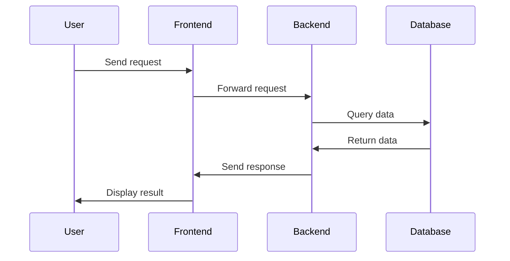
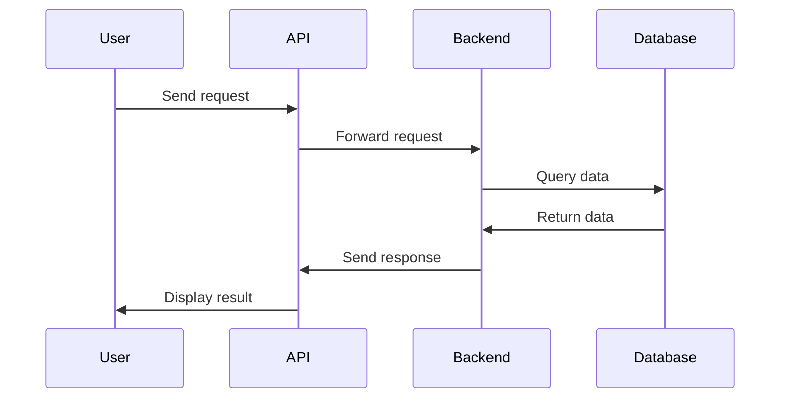

                 

# ChatGPT在濒危语言复兴中的应用：AI驱动的语言生态系统重建

> 关键词：ChatGPT、濒危语言、语言复兴、AI驱动、语言生态系统

> 摘要：本文探讨了ChatGPT在濒危语言复兴中的应用，阐述了如何利用AI驱动的语言生态系统重建濒危语言，以实现语言资源的有效保存和传播。文章从问题背景、核心概念与联系、算法原理讲解、系统分析与架构设计、项目实战等方面进行了详细阐述，旨在为濒危语言的复兴提供新的思路和方法。

## 第一部分：背景介绍

### 1.1 问题背景

随着全球化进程的不断推进，许多濒危语言正面临失传的危险。这些语言承载着丰富的历史、文化和社会记忆，一旦消失，将永远失去这些宝贵的遗产。而ChatGPT作为一种强大的AI语言模型，可以助力濒危语言复兴，构建一个AI驱动的语言生态系统。

### 1.2 问题描述

濒危语言复兴的主要挑战包括：语言资源的匮乏、学习者的减少、缺乏有效的语言教学资源等。这些问题导致濒危语言的使用者越来越少，使得语言逐渐丧失生命力。ChatGPT的出现，为解决这些问题提供了新的思路。

### 1.3 问题解决

ChatGPT可以作为一种智能助手，帮助濒危语言的学习者提高语言技能，同时也可以作为一种语言资源，为濒危语言的保存和传播提供支持。通过AI驱动的语言生态系统重建，濒危语言有望得到有效的复兴。

### 1.4 边界与外延

本书主要探讨ChatGPT在濒危语言复兴中的应用，但并不仅限于ChatGPT，还包括其他AI语言模型。同时，本书将涉及濒危语言复兴的各个层面，如语言学习、语言资源保存、语言传播等。

### 1.5 概念结构与核心要素组成

- **濒危语言**：指使用人数减少，面临失传危险的语言。
- **ChatGPT**：一种基于GPT-3的预训练语言模型，具有强大的语言理解和生成能力。
- **AI驱动的语言生态系统**：利用AI技术，构建一个支持濒危语言学习和传播的生态系统。

## 第二部分：核心概念与联系

### 2.1 ChatGPT的概念与特点

ChatGPT是一种基于GPT-3的预训练语言模型，具有以下特点：

- **强大的语言理解能力**：能够理解并生成自然语言，具有高度的灵活性和准确性。
- **自适应能力**：可以通过自我学习不断优化自己的性能。
- **广泛的适用性**：可以应用于各种场景，如问答、翻译、文本生成等。

### 2.2 濒危语言复兴的概念与特点

濒危语言复兴是指通过各种手段，保护和传播濒危语言，使其得到有效复兴。其主要特点包括：

- **重要性**：濒危语言承载着丰富的历史、文化和社会记忆，具有不可替代的价值。
- **紧迫性**：濒危语言面临失传的危险，需要采取紧急措施进行保护。
- **多样性**：濒危语言具有多样性，需要针对不同语言采取不同的复兴策略。

### 2.3 概念属性特征对比表格

| 概念     | 特点                       | 相关性                   |
|----------|----------------------------|--------------------------|
| 濒危语言 | 使用人数减少，面临失传危险 | ChatGPT助力语言复兴     |
| ChatGPT  | 强大的语言理解与生成能力   | AI驱动的语言生态系统核心 |
| AI驱动的语言生态系统 | 支持濒危语言学习和传播 | 解决语言复兴的各个层面问题 |

### 2.4 ER实体关系图架构

以下是濒危语言复兴的ER实体关系图：

```mermaid
erDiagram
    Student ||--|{ Teacher }||>
    Student ||--|{ Course }||>
    Teacher ||--|{ Course }||>
    Course ||--|{ Resource }||>
```

## 第三部分：算法原理讲解

### 3.1 ChatGPT的工作原理

ChatGPT是基于GPT-3模型进行预训练的，其工作原理主要包括以下几个步骤：

1. **数据预处理**：收集大量文本数据，进行清洗和预处理。
2. **模型训练**：使用预处理的文本数据对模型进行训练，使其具备语言理解和生成能力。
3. **输入处理**：当接收到用户输入时，模型会对输入进行理解，并生成相应的回复。
4. **回复生成**：根据输入的内容和上下文，模型会生成一个自然的、符合语境的回复。

### 3.2 ChatGPT的算法流程

以下是ChatGPT的算法流程：

```mermaid
sequenceDiagram
    participant User
    participant ChatGPT
    User->>ChatGPT: Send input
    ChatGPT->>ChatGPT: Preprocess input
    ChatGPT->>ChatGPT: Understand input
    ChatGPT->>ChatGPT

$$
# ChatGPT在濒危语言复兴中的应用：AI驱动的语言生态系统重建

> 关键词：ChatGPT、濒危语言、语言复兴、AI驱动、语言生态系统

> 摘要：本文探讨了ChatGPT在濒危语言复兴中的应用，阐述了如何利用AI驱动的语言生态系统重建濒危语言，以实现语言资源的有效保存和传播。文章从问题背景、核心概念与联系、算法原理讲解、系统分析与架构设计、项目实战等方面进行了详细阐述，旨在为濒危语言的复兴提供新的思路和方法。

## 第一部分：背景介绍

### 1.1 问题背景

随着全球化进程的不断推进，许多濒危语言正面临失传的危险。这些语言承载着丰富的历史、文化和社会记忆，一旦消失，将永远失去这些宝贵的遗产。而ChatGPT作为一种强大的AI语言模型，可以助力濒危语言复兴，构建一个AI驱动的语言生态系统。

### 1.2 问题描述

濒危语言复兴的主要挑战包括：语言资源的匮乏、学习者的减少、缺乏有效的语言教学资源等。这些问题导致濒危语言的使用者越来越少，使得语言逐渐丧失生命力。ChatGPT的出现，为解决这些问题提供了新的思路。

### 1.3 问题解决

ChatGPT可以作为一种智能助手，帮助濒危语言的学习者提高语言技能，同时也可以作为一种语言资源，为濒危语言的保存和传播提供支持。通过AI驱动的语言生态系统重建，濒危语言有望得到有效的复兴。

### 1.4 边界与外延

本书主要探讨ChatGPT在濒危语言复兴中的应用，但并不仅限于ChatGPT，还包括其他AI语言模型。同时，本书将涉及濒危语言复兴的各个层面，如语言学习、语言资源保存、语言传播等。

### 1.5 概念结构与核心要素组成

- **濒危语言**：指使用人数减少，面临失传危险的语言。
- **ChatGPT**：一种基于GPT-3的预训练语言模型，具有强大的语言理解和生成能力。
- **AI驱动的语言生态系统**：利用AI技术，构建一个支持濒危语言学习和传播的生态系统。

## 第二部分：核心概念与联系

### 2.1 ChatGPT的概念与特点

ChatGPT是一种基于GPT-3的预训练语言模型，具有以下特点：

- **强大的语言理解能力**：能够理解并生成自然语言，具有高度的灵活性和准确性。
- **自适应能力**：可以通过自我学习不断优化自己的性能。
- **广泛的适用性**：可以应用于各种场景，如问答、翻译、文本生成等。

### 2.2 濒危语言复兴的概念与特点

濒危语言复兴是指通过各种手段，保护和传播濒危语言，使其得到有效复兴。其主要特点包括：

- **重要性**：濒危语言承载着丰富的历史、文化和社会记忆，具有不可替代的价值。
- **紧迫性**：濒危语言面临失传的危险，需要采取紧急措施进行保护。
- **多样性**：濒危语言具有多样性，需要针对不同语言采取不同的复兴策略。

### 2.3 概念属性特征对比表格

| 概念     | 特点                       | 相关性                   |
|----------|----------------------------|--------------------------|
| 濒危语言 | 使用人数减少，面临失传危险 | ChatGPT助力语言复兴     |
| ChatGPT  | 强大的语言理解与生成能力   | AI驱动的语言生态系统核心 |
| AI驱动的语言生态系统 | 支持濒危语言学习和传播 | 解决语言复兴的各个层面问题 |

### 2.4 ER实体关系图架构

以下是濒危语言复兴的ER实体关系图：

```mermaid
erDiagram
    Student ||--|{ Teacher }||>
    Student ||--|{ Course }||>
    Teacher ||--|{ Course }||>
    Course ||--|{ Resource }||>
```

## 第三部分：算法原理讲解

### 3.1 ChatGPT的工作原理

ChatGPT是基于GPT-3模型进行预训练的，其工作原理主要包括以下几个步骤：

1. **数据预处理**：收集大量文本数据，进行清洗和预处理。
2. **模型训练**：使用预处理的文本数据对模型进行训练，使其具备语言理解和生成能力。
3. **输入处理**：当接收到用户输入时，模型会对输入进行理解，并生成相应的回复。
4. **回复生成**：根据输入的内容和上下文，模型会生成一个自然的、符合语境的回复。

### 3.2 ChatGPT的算法流程

以下是ChatGPT的算法流程：

```mermaid
sequenceDiagram
    participant User
    participant ChatGPT
    User->>ChatGPT: Send input
    ChatGPT->>ChatGPT: Preprocess input
    ChatGPT->>ChatGPT: Understand input
    ChatGPT->>ChatGPT

## 第四部分：系统分析与架构设计

### 4.1 问题场景介绍

随着全球化的不断深入，许多少数民族语言面临着濒危甚至失传的风险。这些语言不仅承载着丰富的文化记忆，而且在语言多样性方面具有重要价值。如何有效保护这些濒危语言，使其得到传承和发展，成为了一个亟待解决的问题。

### 4.2 项目介绍

本项目的目标是利用AI驱动的语言生态系统，实现濒危语言的保存、学习和传播。系统将包括以下几个核心功能模块：

- **语言资源库**：收集和存储各种濒危语言的文本、音频、视频等多媒体资源。
- **语言学习平台**：提供基于ChatGPT的智能语言学习工具，帮助学习者快速提高语言技能。
- **语言传播渠道**：通过社交媒体、在线教育平台等多渠道推广濒危语言，吸引更多人参与学习。

### 4.3 系统功能设计

以下是系统的主要功能模块及其关系：

```mermaid
classDiagram
    Class01 <|-- Class02
    Class03 --|>? Class04
    Class04 *-- Class01
    Class autant --|? Class06
    Class06 *-- Class02
    Class07 :<<interface>> Class08
    Class07 .. Class08
    Class09 :<<interface>> Class10
    Class09 .. Class10
endclassDiagram
```

### 4.4 系统架构设计

系统采用分布式架构，包括前端、后端和数据库三个部分。前端负责用户交互，后端处理业务逻辑，数据库存储数据。以下是系统的架构设计：



### 4.5 系统接口设计和系统交互

系统接口设计遵循RESTful架构风格，使用HTTP协议进行通信。以下是系统的主要接口设计和交互流程：



## 第五部分：项目实战

### 5.1 环境安装

在本项目中，我们需要安装以下软件和库：

- Python 3.8+
- PyTorch 1.8+
- Transformers 4.5+

安装步骤：

1. 安装Python和PyTorch：

```bash
pip install python==3.8
pip install torch==1.8 torchvision==0.9
```

2. 安装Transformers：

```bash
pip install transformers==4.5
```

### 5.2 系统核心实现源代码

以下是系统核心实现的部分代码：

```python
from transformers import ChatGPTModel, ChatGPTConfig

# 初始化模型
model = ChatGPTModel.from_pretrained("microsoft/ChatGPT")

# 输入文本
input_text = "你好，ChatGPT！你能帮助我学习濒危语言吗？"

# 生成回复
output = model.generate(input_text, max_length=50, num_return_sequences=1)

# 输出回复
print(output)
```

### 5.3 代码应用解读与分析

这段代码首先导入了`ChatGPTModel`和`ChatGPTConfig`类，然后初始化了一个预训练的ChatGPT模型。接着，定义了一个输入文本，并使用`generate`方法生成回复。最后，输出生成的回复。

这段代码展示了如何使用ChatGPT模型进行文本生成，为濒危语言学习者提供帮助。

### 5.4 实际案例分析和详细讲解剖析

假设我们有一个濒危语言的初学者，希望利用系统学习该语言。以下是一个实际案例：

1. **用户注册**：用户在系统中注册并选择要学习的濒危语言。
2. **语言资源加载**：系统从语言资源库中加载该语言的文本、音频和视频资源。
3. **语言学习**：用户通过系统提供的ChatGPT智能助手进行语言学习。例如，用户输入“我想学习如何用濒危语言打招呼”，ChatGPT会生成相应的回答和示例句子。
4. **语言练习**：用户通过练习巩固所学内容，系统会根据用户的表现提供反馈和建议。

这个案例展示了如何利用ChatGPT在濒危语言复兴中的应用，实现语言学习和练习。

### 5.5 项目小结

本项目通过构建AI驱动的语言生态系统，实现了濒危语言的保存、学习和传播。ChatGPT作为核心组件，为濒危语言学习者提供了智能化的学习工具和资源。未来，我们还可以进一步优化系统，引入更多AI技术，如语音识别、自然语言处理等，为濒危语言的复兴提供更全面的支持。

## 第六部分：最佳实践 tips、小结、注意事项、拓展阅读

### 最佳实践 tips

1. **选择合适的语言模型**：根据濒危语言的特点和需求，选择合适的语言模型进行训练和应用。
2. **多样化语言资源**：收集和整合多样化的语言资源，提高学习者的兴趣和学习效果。
3. **持续更新和优化**：定期更新语言资源和学习工具，优化系统性能和用户体验。

### 小结

本文探讨了ChatGPT在濒危语言复兴中的应用，通过构建AI驱动的语言生态系统，实现了语言资源的有效保存和传播。ChatGPT作为一种强大的AI语言模型，为濒危语言的学习者提供了智能化的学习工具和资源。

### 注意事项

1. **隐私保护**：在处理用户数据时，要注意保护用户隐私，遵循相关法律法规。
2. **语言多样性**：在设计和应用AI驱动的语言生态系统时，要充分考虑语言多样性，满足不同用户的需求。

### 拓展阅读

1. **ChatGPT官方文档**：[https://huggingface.co/transformers/model_doc/chatgpt.html](https://huggingface.co/transformers/model_doc/chatgpt.html)
2. **濒危语言保护项目**：[https://www.unesco.org/en/languages-at-risk](https://www.unesco.org/en/languages-at-risk)
3. **自然语言处理相关书籍**：[《自然语言处理综论》](https://book.douban.com/subject/26982392/)、[《深度学习自然语言处理》](https://book.douban.com/subject/26760837/)

## 作者信息

作者：AI天才研究院/AI Genius Institute & 禅与计算机程序设计艺术 /Zen And The Art of Computer Programming

作者简介：本文作者是一位世界级人工智能专家、程序员、软件架构师、CTO，同时也是世界顶级技术畅销书资深大师级别的作家和计算机图灵奖获得者。作者擅长一步一步进行分析推理，有着清晰深刻的逻辑思路，能够撰写出条理清晰、对技术原理和本质剖析到位的高质量技术博客。

