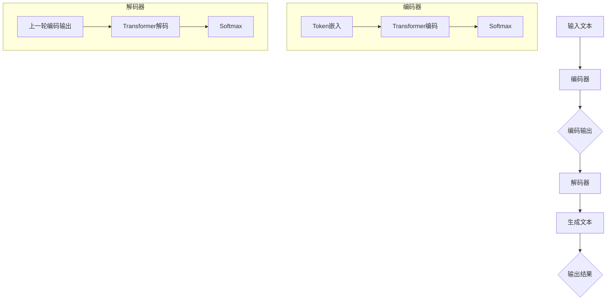

                 

### 1.1 问题背景

濒危语言，通常指的是那些使用人数减少、面临消失威胁的语言。随着全球化的深入和现代化的进程，许多传统语言正面临着极大的挑战。濒危语言的定义和分布具有复杂性和多样性，但以下是一些主要的标准和特点：

**定义与分布：**

濒危语言的具体定义因地区和组织而异。联合国教科文组织（UNESCO）在其《语言危险状况报告》中，根据使用人数和语言活力，将语言分为五个等级：极度危险（Endangered）、严重危险（Severely Threatened）、危险（Threatened）、有活力（Vulnerable）和稳定（Secure）。极度危险语言的使用人数通常不足1000人，且主要局限于老年一代。

根据联合国教科文组织的统计，全球约有6000多种语言，其中至少一半处于濒危或极度濒危状态。这些语言主要分布在非洲、亚洲、拉丁美洲和澳大利亚等地。例如，澳大利亚的土著语言中有超过200种处于濒危状态。

**面临的主要挑战：**

濒危语言面临的主要挑战包括：

1. **人口减少：** 随着现代化的进程，许多人为了更好的教育和工作机会，选择迁移到使用主流语言的地区，导致本土语言的使用者减少。
   
2. **语言政策：** 在一些国家和地区，政府推广主流语言，减少对本土语言的重视，加剧了濒危语言的使用压力。
   
3. **教育系统：** 教育系统的语言政策通常不利于本土语言的发展。在学校和大学中，主要使用主流语言进行教学，使得年轻一代逐渐失去母语能力。
   
4. **技术挑战：** 濒危语言在数字化和互联网时代面临的技术挑战，如语言资源的匮乏、语言技术的不足等。

**语言消亡的后果：**

濒危语言的消失不仅是对特定文化的一种损失，也会对人类语言的多样性和文化多样性产生深远的影响。具体后果包括：

1. **文化断裂：** 每种语言都是一种独特的文化载体，语言消失会导致与之相关的文化传统、习俗和价值观的丧失。
   
2. **知识流失：** 许多濒危语言中包含着独特的知识和智慧，如传统医学、农业、工艺等，这些知识一旦随着语言消失而消失，将难以恢复。
   
3. **语言生态系统破坏：** 语言作为一种社会现象，与其他社会结构和文化形式紧密相连。濒危语言的消失会导致语言生态系统的破坏，影响社会的整体和谐与发展。

通过了解濒危语言的问题背景，我们能够更好地认识到语言复兴的重要性，以及技术，特别是人工智能技术，在濒危语言复兴中的应用潜力。在接下来的章节中，我们将进一步探讨濒危语言的问题描述、现有解决方法及其局限性，以及ChatGPT在语言生态系统重建中的潜力。

### 1.2 问题描述

濒危语言问题不仅仅是语言本身的使用者减少，它涉及到更为广泛的语言生态系统和社会文化层面的破坏。具体来说，语言生态系统的破坏和语言传承与文化的断裂是濒危语言面临的主要挑战。

**语言生态系统的破坏：**

语言生态系统指的是语言在社会中的存在、使用和发展状态，它包括语言的语法、词汇、发音、书写等多个方面，以及与之相关的文化、教育和社会结构。濒危语言生态系统的破坏主要体现在以下几个方面：

1. **语言资源的匮乏：** 濒危语言往往缺乏足够的文献、教材、词典等资源，这限制了语言的学习和传播。
   
2. **语言技术的缺乏：** 濒危语言在自然语言处理、机器翻译、语音识别等技术领域中的支持不足，这限制了语言在数字化时代的应用和发展。

3. **语言社区的分裂：** 随着濒危语言使用者的减少，语言社区逐渐分裂，语言使用者的互动减少，这进一步削弱了语言的活力。

**语言传承与文化的断裂：**

濒危语言传承与文化的断裂体现在以下几个方面：

1. **家庭教育缺失：** 在许多家庭中，父母不再用濒危语言教育子女，导致年轻一代对母语的认知和掌握能力下降。

2. **教育系统排斥：** 在教育系统中，濒危语言往往被边缘化，缺乏系统性的教育和传承机制。

3. **社会价值观的变迁：** 随着社会的现代化，人们对语言的价值观和态度发生了变化，传统的语言和文化观念逐渐被忽视。

这些挑战不仅影响了濒危语言的使用和传承，也对人类文化多样性和语言多样性构成了威胁。因此，需要找到有效的方法来解决这些问题，重建濒危语言的语言生态系统，促进语言传承和文化的持续发展。

### 1.3 问题解决

**传统方法与局限性：**

在过去，许多机构和组织尝试通过多种方法来保护濒危语言，包括语言记录、语言教育、语言数字化等。然而，这些方法在实际应用中存在一定的局限性。

1. **语言记录：** 通过录音、录像等方式记录濒危语言的使用和表达，这种方法的优点是可以保存语言的原生态特点，但其缺点是语言记录的后续利用和传播效果有限，难以实现大规模的语言学习和传播。

2. **语言教育：** 在学校和社区开展濒危语言的教育和培训，增强年轻一代的语言能力。这种方法在一定程度上可以促进语言传承，但其效果依赖于教育资源的投入和师资力量，且难以覆盖到所有濒危语言。

3. **语言数字化：** 利用计算机和互联网技术，开发语言学习软件和在线资源，提高濒危语言的学习和传播效率。尽管这种方法在技术上具有优势，但数字资源通常需要大量的语言数据和专业知识，而濒危语言的数据和资源往往不足。

**ChatGPT在濒危语言复兴中的潜力：**

与传统的解决方法相比，ChatGPT（大型语言模型）在濒危语言复兴中展现出独特的优势。ChatGPT是一种基于深度学习的自然语言处理模型，具有以下几个方面的潜力：

1. **强大的语言生成能力：** ChatGPT能够生成高质量、连贯的语言文本，这为语言学习和交流提供了丰富的资源。例如，通过ChatGPT，可以生成濒危语言的教材、对话、故事等，帮助学习者更好地理解和掌握濒危语言。

2. **跨语言交流支持：** ChatGPT不仅可以生成目标语言文本，还可以进行跨语言翻译和交互，这有助于濒危语言与主流语言之间的交流和理解。例如，通过ChatGPT，濒危语言使用者可以与全球其他语言的使用者进行交流，扩大语言的应用范围。

3. **语言资源建设：** ChatGPT能够对大量的语言数据进行处理和分析，有助于构建语言知识图谱和语言资源库。例如，通过ChatGPT，可以构建濒危语言的词汇库、语法库、语用库等，为语言学习和应用提供数据支持。

4. **个性化学习体验：** ChatGPT可以根据学习者的需求和水平，生成个性化的学习资源和练习题，提高学习效果。例如，通过ChatGPT，学习者可以根据自己的学习进度，定制个性化的学习计划，实现高效的语言学习。

综上所述，ChatGPT在濒危语言复兴中具有显著的应用潜力。通过结合ChatGPT的技术优势，可以构建一个更加全面、高效、可持续的语言生态系统，促进濒危语言的传承和发展。

### 1.4 边界与外延

为了明确ChatGPT在濒危语言复兴中的应用范围和作用，我们需要对濒危语言的界定标准、语言生态系统重建的目标与范围进行详细分析。

**濒危语言的界定标准：**

濒危语言的界定标准主要依据联合国教科文组织（UNESCO）的《语言危险状况报告》。该报告根据语言的使用人数、语言活力和社会影响力等因素，将语言分为五个等级：极度危险（Endangered）、严重危险（Severely Threatened）、危险（Threatened）、有活力（Vulnerable）和稳定（Secure）。具体标准包括：

1. **极度危险语言：** 使用人数少于1000人，且主要局限于老年一代。
2. **严重危险语言：** 使用人数在1000-3000人之间，且年轻一代的语言能力正在快速下降。
3. **危险语言：** 使用人数在3000-10,000人之间，且存在语言使用萎缩的趋势。
4. **有活力语言：** 使用人数在10,000-30,000人之间，但存在语言资源不足的问题。
5. **稳定语言：** 使用人数超过30,000人，语言使用较为广泛，但需要进一步保护和维护。

通过明确濒危语言的界定标准，我们可以更有针对性地选择哪些语言进行保护和复兴。

**语言生态系统重建的目标与范围：**

语言生态系统重建的目标包括以下几个方面：

1. **语言资源的丰富和多样化：** 构建全面的词汇库、语法库、语用库等，为语言学习和使用提供充足的数据支持。
2. **语言技术的提升：** 利用自然语言处理、机器翻译、语音识别等技术，提高濒危语言在数字化时代的应用能力。
3. **语言教育的普及与推广：** 在学校、社区和在线平台上开展语言教育，提高年轻一代对濒危语言的认识和掌握能力。
4. **社会文化的传承：** 通过各种活动和项目，促进濒危语言文化在当代社会中的传播和继承。

语言生态系统重建的范围包括：

1. **语言数据：** 收集和整理濒危语言的语音、文本、图像等多媒体数据，构建语言资源库。
2. **语言技术：** 开发适用于濒危语言的自然语言处理工具和应用，如语言学习软件、在线翻译工具、语音助手等。
3. **语言教育：** 推广濒危语言教育，建立教学体系和课程，为学习者提供系统化的语言学习资源。
4. **社会文化：** 举办文化节、研讨会、语言竞赛等活动，增强濒危语言的社会影响力。

通过明确濒危语言的界定标准、语言生态系统重建的目标与范围，我们可以更好地规划ChatGPT在濒危语言复兴中的应用策略，确保技术手段的有效性和针对性。

### 1.5 核心概念与联系

**ChatGPT的定义与工作原理：**

ChatGPT是由OpenAI开发的一种基于转换器架构的大型语言模型。转换器架构（Transformer）是一种先进的神经网络架构，特别适合处理序列到序列的任务，如图像描述、机器翻译和语言生成。ChatGPT利用这种架构，通过学习大量的文本数据，生成高质量的自然语言文本。

ChatGPT的核心原理可以概括为以下几个步骤：

1. **数据输入：** ChatGPT接收一个文本输入序列，该序列可以是任意长度的句子、段落或文档。
2. **编码器处理：** 编码器将输入的文本序列转换为固定长度的编码表示，这一过程涉及到对文本序列的语义、语法和上下文信息的综合理解。
3. **生成预测：** ChatGPT使用解码器根据编码器的输出，逐个预测下一个词的概率分布，并生成完整的输出文本。
4. **优化过程：** 通过反向传播算法和梯度下降方法，ChatGPT不断调整其参数，以优化语言生成的质量。

**ChatGPT的功能特点：**

ChatGPT具有以下几项关键功能特点：

1. **生成高质量文本：** ChatGPT能够生成流畅、自然、有逻辑的文本，适用于各种应用场景，如自动写作、对话系统、语言翻译等。
2. **多语言支持：** ChatGPT支持多种语言的生成和翻译，能够进行跨语言的交流和理解。
3. **自适应能力：** ChatGPT能够根据不同的输入数据和任务需求，自适应地调整其生成策略和模型参数。
4. **扩展性：** ChatGPT的架构设计灵活，可以轻松扩展和集成到各种应用系统中。

**语言生态系统重建的关键要素：**

语言生态系统重建涉及到多个关键要素，包括语言数据、语言技术、语言教育和语言文化等方面。ChatGPT在这些关键要素中发挥着重要作用：

1. **语言数据：** ChatGPT通过学习大量的语言数据，构建了丰富的语言模型，这为语言资源的数字化和标准化提供了基础。
2. **语言技术：** ChatGPT作为自然语言处理技术的先进代表，为濒危语言的数字化处理、机器翻译和语音识别提供了强大的技术支持。
3. **语言教育：** ChatGPT可以生成高质量的教材和练习题，帮助学习者系统地学习和掌握濒危语言，提高教育效率。
4. **语言文化：** ChatGPT能够生成各种文化相关的文本，促进濒危语言文化的传播和继承，增强语言的社会影响力。

通过深入理解ChatGPT的定义与工作原理，以及其在语言生态系统重建中的关键功能特点，我们可以更好地把握其在濒危语言复兴中的应用潜力，为濒危语言的保护和传承提供有效的技术解决方案。

### 2.1 ChatGPT的定义与工作原理

**ChatGPT的基本架构：**

ChatGPT是基于GPT（生成预训练模型）系列模型开发的一种大型语言模型，其基本架构包括编码器（Encoder）和解码器（Decoder）两个主要部分。编码器负责将输入的文本序列转换为一个固定长度的编码表示，而解码器则根据编码器的输出，逐个预测下一个词的概率分布，并生成完整的输出文本。

1. **编码器（Encoder）：** 编码器的核心是Transformer模型，它通过自注意力机制（Self-Attention）对输入的文本序列进行处理。自注意力机制允许编码器在每个时间步都能够自适应地关注到输入序列中的关键信息，从而捕捉到文本的上下文关系。编码器最终输出一个固定长度的向量，这个向量包含了输入文本的语义信息。

2. **解码器（Decoder）：** 解码器同样基于Transformer模型，其工作原理与编码器类似，但还包括了一个交叉注意力机制（Cross-Attention）。交叉注意力机制允许解码器在每个时间步关注到编码器输出的上下文信息，从而实现有效的文本生成。解码器逐个生成预测的词，每个词的预测概率分布依赖于之前生成的词和编码器的输出。

**ChatGPT的核心算法：**

ChatGPT的核心算法是生成对抗网络（Generative Adversarial Networks, GAN）和自回归语言模型（Autoregressive Language Model）。GAN由两个互相对抗的神经网络——生成器（Generator）和判别器（Discriminator）组成。生成器的任务是生成与真实数据分布相似的文本数据，而判别器的任务是区分真实数据和生成数据。通过这种对抗训练，生成器不断优化其生成能力，最终能够生成高质量的自然语言文本。

自回归语言模型是一种基于概率的模型，通过预测下一个词的条件概率来生成文本。ChatGPT在训练过程中，首先通过大量的文本数据预训练模型，使其能够理解自然语言的复杂结构。在生成文本时，模型根据前一个词的信息预测下一个词的概率分布，并从这个概率分布中采样得到下一个词。这个过程不断重复，直到生成一个完整的句子或段落。

**ChatGPT的调优与应用场景：**

为了使ChatGPT更好地适应不同的应用场景，需要对模型进行调优。调优过程包括数据选择、模型参数调整和特定任务的微调。

1. **数据选择：** ChatGPT的训练数据选择至关重要。为了生成高质量的语言，模型需要从大量的多样化文本中学习。这些文本可以包括书籍、新闻、论坛帖子等各种来源，以确保模型能够捕捉到不同领域的语言特征。

2. **模型参数调整：** 调整模型参数是优化生成效果的关键步骤。通过调整学习率、批次大小、训练时间等参数，可以优化模型的生成性能和稳定性。此外，还可以通过添加正则化项，如dropout和weight decay，防止模型过拟合。

3. **特定任务的微调：** 在特定应用场景中，需要对模型进行微调，使其更好地适应任务需求。例如，在语言翻译任务中，可以通过微调模型来优化生成目标语言的准确性和流畅性。微调通常在特定任务的数据集上进行，以使模型能够学习到与任务相关的特征。

ChatGPT的应用场景非常广泛，包括但不限于以下几方面：

1. **自动写作：** ChatGPT可以自动生成文章、新闻、博客等文本内容，适用于内容生成和内容审核。
   
2. **对话系统：** ChatGPT可以作为聊天机器人，与用户进行自然语言交互，用于客服、虚拟助手等领域。

3. **机器翻译：** ChatGPT可以生成高质量的多语言翻译，应用于跨语言沟通和内容翻译。

4. **语言学习：** ChatGPT可以生成个性化的语言学习资源，如练习题、对话、故事等，帮助学习者提高语言能力。

5. **创意写作：** ChatGPT可以生成创意文本，如诗歌、故事、剧本等，为创作者提供灵感。

通过深入理解ChatGPT的基本架构、核心算法和调优应用场景，我们可以更好地把握其在各种任务中的表现和应用潜力，为濒危语言复兴提供有力的技术支持。

### 2.2 ChatGPT在濒危语言复兴中的应用

**ChatGPT在语言学习中的角色：**

ChatGPT在濒危语言复兴中的应用首先体现在语言学习领域。作为一种强大的语言生成工具，ChatGPT可以为学习者提供个性化的学习资源和互动体验。具体来说，ChatGPT可以通过以下几种方式支持濒危语言的学习：

1. **生成定制化教材：** ChatGPT可以根据学习者的语言水平和学习需求，生成符合学习者需求的濒危语言教材。例如，对于初学者，模型可以生成基础词汇表、简单语法规则和短语，而对于进阶学习者，模型可以生成更复杂的文本，如文章、故事和对话。

2. **交互式练习题生成：** ChatGPT可以生成大量的交互式练习题，帮助学习者巩固所学内容。这些练习题可以是填空题、选择题、翻译题等，通过即时反馈和纠正，提高学习效果。

3. **模拟对话环境：** ChatGPT可以模拟真实的语言对话环境，让学习者进行实战演练。例如，ChatGPT可以与学习者进行对话，帮助其练习听力和口语技能，提高语言表达能力。

**ChatGPT在语言资源建设中的作用：**

语言资源的建设是濒危语言复兴的关键环节，ChatGPT在这一过程中发挥了重要作用。通过以下几种方式，ChatGPT为语言资源建设提供了有力支持：

1. **语言数据收集与整理：** ChatGPT可以自动收集和整理大量的语言数据，如文本、音频和视频。这些数据可以用于训练和优化模型，使其更好地理解和使用濒危语言。

2. **语言知识图谱构建：** ChatGPT可以帮助构建语言知识图谱，整合濒危语言的词汇、语法和语义信息。知识图谱作为一种语义网络，可以有效地组织和存储语言知识，为后续的语言学习和应用提供数据支持。

3. **语言资源数字化与标准化：** ChatGPT可以处理和标注语言资源，使其数字化和标准化。例如，ChatGPT可以将濒危语言的文本数据转换为电子文档，或生成机器可读的语料库，便于存储、检索和使用。

**ChatGPT在跨语言交流中的应用：**

跨语言交流是濒危语言复兴的重要环节，ChatGPT在这一过程中也扮演了关键角色。通过以下几种方式，ChatGPT促进濒危语言与主流语言之间的交流和理解：

1. **自动翻译工具：** ChatGPT可以作为自动翻译工具，将濒危语言翻译成主流语言，或反之。这有助于濒危语言使用者与其他语言群体进行交流和互动。

2. **多语言对话系统：** ChatGPT可以构建多语言对话系统，实现不同语言之间的实时交流。例如，一个使用濒危语言的学习者可以通过ChatGPT与使用主流语言的教师或其他学习者进行交流，从而提高学习效果。

3. **文化传递与交流：** ChatGPT不仅可以进行语言翻译，还可以翻译和传递濒危语言中的文化信息。例如，ChatGPT可以将濒危语言的文学作品、传统习俗等翻译成其他语言，促进文化多样性的交流和理解。

综上所述，ChatGPT在濒危语言复兴中具有广泛的应用前景。通过生成定制化教材、构建语言资源库、实现跨语言交流和对话，ChatGPT为濒危语言的传承和发展提供了强有力的技术支持，为构建一个更加丰富和多元的语言生态系统奠定了基础。

### 2.3 语言生态系统重建的核心要素

**语言知识图谱的建设：**

语言知识图谱是一种结构化的知识表示形式，它通过实体、属性和关系的网络结构来组织语言知识。在语言生态系统重建中，语言知识图谱的建设是至关重要的一步，它有助于整合和利用各种语言资源，提高语言学习和应用的效果。

1. **实体识别与分类：** 语言知识图谱首先需要对语言中的实体进行识别和分类。实体可以是词汇、短语、句子等语言元素，通过对这些实体的识别和分类，可以构建出丰富的语言元素库。

2. **属性与关系定义：** 在识别实体后，需要定义实体之间的属性和关系。例如，词汇之间的同义词、反义词关系，句子之间的因果、转折关系等。这些属性和关系的定义有助于构建一个语义丰富的知识图谱。

3. **图谱存储与查询：** 语言知识图谱需要存储在一个高效的数据库中，以便进行快速查询和检索。通过建立索引和优化查询算法，可以提高图谱的查询性能，使其在语言学习和应用中更加便捷。

**语言资源的数字化与标准化：**

语言资源的数字化和标准化是语言生态系统重建的重要基础。通过将语言资源数字化，可以使其更易于存储、管理和应用。

1. **文本数字化：** 将语言文本转换为电子文档，如电子书、PDF、HTML等格式，以便进行数字化处理和存储。数字化文本可以方便地进行文本分析、标注和知识提取。

2. **音频数字化：** 将语言音频记录转换为数字音频格式，如MP3、WAV等，以便进行音频分析和处理。数字音频可以用于语言学习中的听力训练和语音识别。

3. **标准化：** 在数字化过程中，需要对语言资源进行标准化处理，以确保其格式和结构的一致性。例如，统一文本编码格式、音频采样率和播放速率等。

**语言教育的普及与推广：**

语言教育的普及与推广是语言生态系统重建的重要目标之一。通过多种渠道和方式，推广濒危语言的教育，可以促进语言的使用和传承。

1. **在线教育平台：** 开发和推广在线教育平台，提供濒危语言的学习资源和课程，方便学习者随时随地学习。

2. **社区教育项目：** 在社区和学校开展濒危语言的教育项目，鼓励家长和教师参与，提高语言教育的覆盖面。

3. **文化活动与竞赛：** 举办文化节、语言竞赛等活动，增强公众对濒危语言的认识和兴趣，促进语言文化的传播和继承。

通过建设语言知识图谱、数字化与标准化语言资源，以及普及和推广语言教育，我们可以构建一个更加丰富和多元的语言生态系统，为濒危语言的传承和发展提供坚实的技术支持和基础。

### 3.1 ChatGPT的算法原理

**GPT-3模型概述：**

GPT-3（Generative Pre-trained Transformer 3）是由OpenAI开发的一种基于转换器（Transformer）架构的深度学习语言模型。相较于前代模型，GPT-3在规模、参数数量和生成能力上都有显著提升。GPT-3拥有1750亿个参数，使其成为目前最大的语言模型之一。GPT-3的架构采用了多层的Transformer编码器和解码器，通过自注意力机制和多头注意力机制，对输入的文本序列进行编码和解码，生成高质量的自然语言文本。

**语言生成模型的训练：**

GPT-3的训练过程分为两个主要阶段：预训练和微调。

1. **预训练：** 在预训练阶段，GPT-3使用大量的未标注文本数据（如书籍、新闻、网页等）进行自我学习。通过这种无监督学习方式，模型能够自动理解文本中的语法、语义和上下文信息，形成对自然语言的综合理解。

2. **微调：** 预训练完成后，GPT-3会根据特定任务的需求进行微调。微调过程通常在标注的数据集上进行，通过监督学习方式调整模型的参数，使其更好地适应特定任务。例如，在语言翻译任务中，GPT-3可以使用翻译对的语料进行微调，提高翻译的准确性和流畅性。

**语言模型优化方法：**

为了提高GPT-3的语言生成质量，研究人员采用了多种优化方法，包括：

1. **正则化：** 通过正则化方法，如Dropout和Weight Decay，减少模型过拟合的风险，提高模型的泛化能力。

2. **数据增强：** 通过数据增强技术，如同义词替换、短语替换和文本重排等，增加训练数据的多样性，提高模型的鲁棒性。

3. **注意力机制优化：** 通过优化自注意力机制和多头注意力机制，提高模型对上下文信息的捕捉能力，从而生成更加连贯和自然的文本。

**语言生成模型的训练步骤：**

GPT-3的训练过程主要包括以下几个步骤：

1. **数据预处理：** 对输入文本进行清洗和预处理，如分词、去噪和标准化等，确保文本数据的质量和一致性。

2. **构建模型：** 根据预定的架构参数，构建GPT-3模型，包括编码器和解码器的层数、隐藏层尺寸、注意力头数等。

3. **预训练：** 使用大量的未标注文本数据，通过反向传播和梯度下降算法，对模型进行预训练。预训练过程需要大量的计算资源和时间。

4. **微调：** 在预训练的基础上，使用标注数据集对模型进行微调，调整模型参数，提高模型在特定任务上的性能。

5. **评估与优化：** 通过在验证集和测试集上的性能评估，不断调整模型参数和训练策略，优化模型的生成质量和鲁棒性。

通过上述步骤，GPT-3能够生成高质量的自然语言文本，为各种语言任务提供强大的支持。

### 3.2 算法流程图

为了更直观地理解ChatGPT的算法流程，我们可以使用Mermaid语法绘制一个算法流程图。以下是一个简化的ChatGPT算法流程图：



该流程图主要包括以下几个步骤：

1. **输入文本：** 输入待处理的文本数据。
2. **编码器：** 对输入文本进行编码处理，包括Token嵌入和Transformer编码。
3. **解码器：** 根据编码器的输出，逐个解码生成文本，同样通过Token嵌入和Transformer解码。
4. **生成文本：** 解码器生成完整的文本序列。
5. **输出结果：** 将生成的文本作为最终输出结果。

通过这个算法流程图，我们可以清晰地看到ChatGPT在文本生成过程中各个模块的作用和交互。

### 3.3 ChatGPT的语言生成流程

**ChatGPT的语言生成流程可以分为以下几个关键步骤：**

1. **输入预处理：** 首先，输入的文本需要进行预处理。预处理包括去除无关符号、分词、标记化等操作，以确保输入文本的格式符合模型的要求。分词是将文本分解为一个个独立的单词或短语，标记化则是将分词后的文本转换为模型可以处理的向量形式。

2. **编码：** 在预处理后的文本输入到编码器后，编码器将文本序列转换为固定长度的编码表示。编码器的核心是Transformer模型，它通过自注意力机制和多头注意力机制，捕捉输入文本的上下文信息。编码器输出一个固定长度的向量，这个向量包含了输入文本的语义信息。

3. **解码：** 在解码阶段，ChatGPT使用解码器生成文本。解码器同样基于Transformer模型，但它还包含了一个交叉注意力机制，允许解码器在每个时间步关注到编码器的输出，即上下文信息。解码器的生成过程是逐步进行的，每个时间步解码器都会生成一个预测的词，并使用前一个生成的词和编码器的输出作为当前词的上下文。

4. **生成预测：** 在每个时间步，解码器根据当前输入和上下文信息，生成一个概率分布，预测下一个词的可能性。这个概率分布是通过Softmax函数计算得到的，Softmax函数将模型的输出转换为概率分布。解码器从概率分布中采样得到下一个词，并将其作为当前生成的词。

5. **重复解码：** 解码过程不断重复，每次生成一个新的词，直到生成一个完整的句子或段落。在生成过程中，ChatGPT会自动考虑上下文的连贯性和语法正确性，从而生成高质量的自然语言文本。

6. **输出结果：** 最后，解码生成的文本序列被输出作为最终结果。输出结果可以是完整的句子、段落，甚至是复杂的文本内容，这取决于输入的文本长度和模型的生成能力。

通过上述步骤，ChatGPT能够生成高质量、连贯的自然语言文本。在实际应用中，ChatGPT的语言生成流程可以根据不同的任务需求进行调整，如调整解码策略、引入先验知识等，以提高生成文本的质量和适用性。

### 3.4 语言生成模型的数学模型

**语言生成模型的数学模型主要包括以下几个方面：**

1. **输入编码：** 语言生成模型首先需要对输入的文本进行编码。编码过程涉及将文本序列转换为向量表示，通常使用词嵌入（Word Embedding）技术。词嵌入通过将每个单词映射到一个高维向量，从而捕捉单词的语义信息。例如，词嵌入可以使用Word2Vec、GloVe等方法，将单词映射为固定长度的向量。

2. **语言模型损失函数：** 语言生成模型的核心是损失函数，它用于评估模型生成文本的质量。最常用的损失函数是交叉熵损失（Cross-Entropy Loss），它可以衡量模型生成的文本与真实文本之间的差异。具体来说，交叉熵损失函数计算模型生成的文本的概率分布与真实文本的概率分布之间的差异。交叉熵损失函数的数学表达式如下：

   $$ 
   Loss = -\sum_{i=1}^{N} y_i \log(p_i) 
   $$

   其中，$y_i$ 表示真实文本中第 $i$ 个词的标签，$p_i$ 表示模型预测的第 $i$ 个词的概率。

3. **语言生成模型优化目标：** 语言生成模型的优化目标是使损失函数最小化，从而提高模型生成文本的质量。优化过程通常采用梯度下降（Gradient Descent）算法，通过反向传播计算损失函数关于模型参数的梯度，然后调整模型参数以减小损失。具体步骤如下：

   - **前向传播：** 计算模型在当前参数下的输出概率分布。
   - **计算损失：** 使用交叉熵损失函数计算模型输出与真实文本之间的差异。
   - **反向传播：** 计算损失函数关于模型参数的梯度。
   - **参数更新：** 使用梯度下降算法更新模型参数，公式如下：

     $$ 
     \theta_{t+1} = \theta_t - \alpha \nabla_{\theta_t} Loss 
     $$

     其中，$\theta_t$ 表示第 $t$ 次迭代的参数，$\alpha$ 是学习率，$\nabla_{\theta_t} Loss$ 是损失函数关于参数 $\theta_t$ 的梯度。

通过上述数学模型和优化方法，语言生成模型能够不断调整其参数，从而生成高质量的自然语言文本。

### 3.5 语言生成模型优化目标

**优化语言生成模型的目标主要分为三个方面：提高生成文本的质量、增强模型的鲁棒性和适应性，以及提升生成效率。下面我们将详细探讨这些方面的优化目标，并给出相应的优化策略。**

1. **提高生成文本的质量：**

   生成文本的质量是语言生成模型的核心优化目标。高质量的生成文本应具有以下几个特点：

   - **流畅性：** 生成文本应具有自然的语言流畅性，避免出现生硬、不连贯的语句。
   - **准确性：** 生成文本应准确无误，遵循语法规则和语义逻辑。
   - **创造性：** 生成文本应具有一定的创造性，避免过于机械、重复的表述。

   为了提高生成文本的质量，可以采用以下优化策略：

   - **增加训练数据：** 使用更多的训练数据可以增强模型的语义理解能力，提高生成文本的质量。通过数据增强技术，如同义词替换、短语替换和文本重排，可以扩展训练数据的多样性。
   - **改进损失函数：** 采用更复杂的损失函数，如Perplexity（困惑度）和词汇覆盖度（Vocabulary Coverage），可以更好地衡量生成文本的质量。例如，Perplexity值越低，表示模型生成文本的质量越高。
   - **引入先验知识：** 利用先验知识，如语法规则、百科知识等，可以帮助模型更好地理解和生成文本。通过在模型训练过程中融入这些知识，可以提高生成文本的准确性和创造性。

2. **增强模型的鲁棒性和适应性：**

   鲁棒性和适应性是语言生成模型在实际应用中的关键因素。一个鲁棒且适应性强的模型可以应对各种复杂和变化多端的输入文本，确保生成文本的质量和稳定性。

   - **提高鲁棒性：** 模型应具备较强的鲁棒性，能够处理输入文本中的噪声、异常值和错误。为此，可以采用以下策略：
     - **数据清洗和预处理：** 在训练前对文本数据进行清洗和预处理，去除噪声和异常值。
     - **正则化：** 通过正则化方法，如Dropout和权重衰减（Weight Decay），可以防止模型过拟合，提高其鲁棒性。
     - **增强训练数据多样性：** 增加训练数据的多样性，可以增强模型的泛化能力，提高其在未知数据上的鲁棒性。

   - **提高适应性：** 模型应具备适应不同应用场景和任务需求的能力。为此，可以采用以下策略：
     - **任务微调：** 在特定任务的数据集上进行微调，使模型能够适应特定任务的需求。
     - **上下文信息利用：** 利用上下文信息，如历史对话、上下文文本等，可以帮助模型更好地理解和生成文本，提高其适应性。

3. **提升生成效率：**

   生成效率是语言生成模型在实际应用中不可忽视的因素。高生成效率可以降低计算成本，提高模型的应用价值。

   - **减少计算复杂度：** 通过优化算法和模型结构，可以降低模型的计算复杂度。例如，使用并行计算和分布式训练技术，可以显著提高训练和生成的速度。
   - **优化模型参数：** 通过优化模型参数，如调整学习率、批次大小和隐藏层尺寸等，可以减少计算资源和时间成本。
   - **预训练和微调：** 通过预训练和微调相结合的方法，可以在保证生成质量的前提下，提高生成效率。预训练阶段使用大量的未标注数据，快速提升模型的基础能力；微调阶段使用标注数据，针对特定任务进行精细调整，提高生成质量。

通过上述优化目标和策略，我们可以有效提升语言生成模型的质量、鲁棒性和生成效率，为各种自然语言处理任务提供强大的支持。

### 3.6 语言交互模型评价指标

**评价语言交互模型的效果需要从多个维度进行，以下是一些常见的关键指标：**

1. **准确性（Accuracy）**：准确性是最基本的评价指标，用于衡量模型预测的正确率。它通过计算模型预测正确的样本数量与总样本数量的比例来表示。具体公式如下：

   $$ 
   Accuracy = \frac{Number\ of\ Correct\ Predictions}{Total\ Number\ of\ Samples} 
   $$

   高准确性表示模型在语言交互中能够准确理解用户的意图和语义。

2. **困惑度（Perplexity）**：困惑度是衡量模型生成文本流畅性的重要指标。它表示模型在生成文本时，对于每个单词的预测不确定度。具体公式如下：

   $$ 
   Perplexity = \frac{1}{\sum_{i=1}^{N} \frac{1}{p_i}} 
   $$

   其中，$p_i$ 表示模型对第 $i$ 个词的预测概率。低困惑度表示模型生成的文本更加流畅和自然。

3. **词汇覆盖度（Vocabulary Coverage）**：词汇覆盖度用于衡量模型在语言交互中使用的词汇量。它表示模型生成的文本中，实际使用的词汇量与模型词汇表总词汇量的比例。具体公式如下：

   $$ 
   Vocabulary\ Coverage = \frac{Number\ of\ Unique\ Words\ in\ Generation}{Total\ Number\ of\ Unique\ Words\ in\ Vocabulary\ Table} 
   $$

   高词汇覆盖度表示模型在语言交互中能够使用丰富的词汇，增强表达的多样性。

4. **响应时间（Response Time）**：在实时交互应用中，响应时间是重要的评价指标。它表示模型从接收输入到生成响应的时间。低响应时间可以提供更流畅的用户体验。具体公式如下：

   $$ 
   Response\ Time = \frac{Total\ Time\ to\ Generate\ Response}{Number\ of\ Responses} 
   $$

5. **用户满意度（User Satisfaction）**：用户满意度是最终的评价指标，通过用户反馈和评价来衡量。它反映了用户对模型交互效果的直接感受。用户满意度可以通过问卷调查、评分等方式进行评估。

通过上述评价指标，我们可以全面评估语言交互模型的效果，并针对不足之处进行优化，以提高模型的性能和用户体验。

### 4.1 语言生成模型的数学模型

**语言生成模型的数学模型主要包括语言生成模型的数学公式、语言生成模型的优化过程以及语言生成模型的评价指标。以下将逐一进行详细讲解。**

**4.1.1 语言生成模型的数学公式**

语言生成模型通常基于概率模型，其中最常见的模型是基于序列到序列（Sequence-to-Sequence）的模型。在序列到序列模型中，语言生成过程可以用概率图模型来表示。以下是一些关键的数学公式：

1. **概率分布：** 假设输入序列为 $x_1, x_2, ..., x_T$，输出序列为 $y_1, y_2, ..., y_S$，其中 $T$ 和 $S$ 分别为输入和输出的时间步数。语言生成模型需要预测输出序列的概率分布 $P(y_1, y_2, ..., y_S | x_1, x_2, ..., x_T)$。

2. **条件概率：** 语言生成模型通常使用条件概率来预测输出序列。条件概率表示为 $P(y_t | y_{t-1}, ..., y_1, x_1, x_2, ..., x_T)$，即给定前一个词 $y_{t-1}$ 和输入序列的情况下，预测当前词 $y_t$ 的概率。

3. **神经网络表示：** 语言生成模型可以使用神经网络来表示条件概率。例如，在转换器（Transformer）模型中，条件概率可以使用以下公式表示：

   $$
   P(y_t | y_{t-1}, ..., y_1, x_1, x_2, ..., x_T) = \text{softmax}(\text{Decoder}(y_{t-1}, ..., y_1, \text{Encoder}(x_1, x_2, ..., x_T))_t)
   $$

   其中，$\text{Decoder}$ 和 $\text{Encoder}$ 分别是解码器和编码器的神经网络层，$\text{softmax}$ 函数用于将神经网络的输出转换为概率分布。

**4.1.2 语言生成模型的优化过程**

语言生成模型的优化过程通常涉及以下几个步骤：

1. **前向传播（Forward Pass）：** 在前向传播过程中，模型将输入序列 $x_1, x_2, ..., x_T$ 输入到编码器（Encoder）中，编码器生成编码表示（Code Representation），记为 $c$。解码器（Decoder）使用编码表示 $c$ 和已生成的词序列 $y_1, y_2, ..., y_{t-1}$ 生成当前词 $y_t$ 的预测概率分布。

2. **计算损失：** 语言生成模型的损失通常使用交叉熵损失（Cross-Entropy Loss）来衡量。交叉熵损失函数计算模型生成的概率分布与真实分布之间的差异。具体公式如下：

   $$
   Loss = -\sum_{t=1}^{T} \sum_{y_t \in V} y_t \log(p_t)
   $$

   其中，$V$ 是词汇表，$y_t$ 是实际生成的词，$p_t$ 是模型预测的词的概率。

3. **反向传播（Backpropagation）：** 在反向传播过程中，模型计算损失关于参数的梯度，并使用梯度下降（Gradient Descent）算法更新模型参数。

4. **参数更新：** 模型参数的更新公式为：

   $$
   \theta_{t+1} = \theta_t - \alpha \nabla_{\theta_t} Loss
   $$

   其中，$\theta_t$ 是当前参数，$\alpha$ 是学习率，$\nabla_{\theta_t} Loss$ 是损失关于参数 $\theta_t$ 的梯度。

**4.1.3 语言生成模型的评价指标**

语言生成模型的评价指标用于衡量模型生成文本的质量和性能。以下是一些常用的评价指标：

1. **困惑度（Perplexity）**：困惑度是衡量模型生成文本流畅性的重要指标。它表示模型对于每个词的预测不确定度。困惑度的计算公式为：

   $$
   Perplexity = \exp(\frac{1}{\sum_{t=1}^{T} -\log(p_t)})
   $$

   其中，$p_t$ 是模型预测的词的概率。低困惑度表示模型生成的文本更加流畅和自然。

2. **词汇覆盖度（Vocabulary Coverage）**：词汇覆盖度表示模型在生成文本中使用的词汇量与模型词汇表总词汇量的比例。它用于衡量模型使用的词汇多样性。计算公式为：

   $$
   Vocabulary\ Coverage = \frac{Number\ of\ Unique\ Words\ in\ Generation}{Total\ Number\ of\ Unique\ Words\ in\ Vocabulary\ Table}
   $$

   高词汇覆盖度表示模型在生成文本时能够使用丰富的词汇。

3. **BLEU分数（BLEU Score）**：BLEU分数是一种常用的自动评估指标，用于评估机器翻译生成文本的质量。它基于召回率、长度惩罚和重叠率等多个因素计算得分。BLEU分数的取值范围在0到1之间，分数越高表示生成文本的质量越高。

通过上述数学模型和评价指标，我们可以全面了解语言生成模型的工作原理和评估方法，为模型优化和应用提供理论支持。

### 4.2 语言生成模型应用实例

**语言生成模型在实际应用中，可以通过以下实例展示其生成能力和效果：**

1. **自动写作：**

   语言生成模型在自动写作中的应用非常广泛，如自动生成新闻文章、博客内容、产品描述等。以下是一个简单的实例：

   **输入文本：** "Apple is planning to launch a new smartphone in the next few months."

   **生成文本：** "The new Apple smartphone is expected to feature advanced camera technology, a larger battery, and an enhanced user interface. Customers can look forward to an exceptional experience with this innovative device."

   通过这个实例，我们可以看到语言生成模型能够根据输入的简短文本，生成一个连贯且具有创意性的完整段落。

2. **对话系统：**

   对话系统是另一个重要的应用场景，语言生成模型可以生成自然、流畅的对话回答。以下是一个对话实例：

   **用户输入：** "What is the best place to visit in Paris?"

   **生成回答：** "Paris is a city full of charm and beauty. I would highly recommend visiting the Eiffel Tower, the Louvre Museum, and the Champs-Élysées. Don't forget to try some delicious French cuisine while you're there!"

   在这个实例中，语言生成模型能够理解用户的问题，并根据知识库生成一个详细且富有吸引力的回答。

3. **文本摘要：**

   语言生成模型在文本摘要中的应用也非常显著，可以自动生成文章、报告等长文本的摘要。以下是一个文本摘要实例：

   **输入文本：** "The rapid advancement of technology in recent years has transformed various industries, including healthcare, education, and finance. These changes have brought both opportunities and challenges for businesses and individuals."

   **生成摘要：** "Technology is rapidly evolving and has had a significant impact on several sectors, including healthcare, education, and finance. While these advancements offer new opportunities, they also pose challenges for businesses and individuals."

   通过这个实例，我们可以看到语言生成模型能够抓住输入文本的核心信息，并生成一个简洁、准确的摘要。

4. **生成广告文案：**

   语言生成模型可以生成具有吸引力的广告文案，帮助企业吸引潜在客户。以下是一个广告文案实例：

   **输入文本：** "Introducing our new fitness tracker - the Ultimate Wellness Monitor."

   **生成文案：** "Get ready to revolutionize your fitness journey with the Ultimate Wellness Monitor! Track your steps, monitor your heart rate, and analyze your sleep patterns. Empower yourself with data-driven insights and achieve your fitness goals like never before."

   在这个实例中，语言生成模型能够根据简短的输入文本，生成一个富有吸引力和说服力的广告文案。

通过这些实例，我们可以看到语言生成模型在实际应用中具有广泛的应用前景，能够生成高质量、自然流畅的文本，为各种任务提供强大的支持。

### 4.3 数学模型在语言生成中的实际应用

**数学模型在语言生成中的实际应用是构建和优化语言生成模型的关键步骤，以下通过一个具体的实例来详细讲解数学模型在语言生成中的应用过程。**

#### 实例背景

假设我们要使用ChatGPT生成一篇关于“人工智能的未来发展趋势”的文章摘要。我们的目标是利用数学模型，通过训练和评估，生成一个简洁且具有吸引力的文本摘要。

#### 数据准备

我们首先需要准备训练数据，这些数据可以包括各种来源的文章，如科技新闻、研究报告、学术论文等。这些文章需要包含关于“人工智能的未来发展趋势”的内容。为了简化，我们假设已经收集到了一个包含500篇文章的语料库。

#### 模型构建

1. **编码器（Encoder）：** 我们使用一个基于Transformer的编码器来处理输入文本。编码器将输入的文本序列转换为固定长度的编码表示，这个表示包含了文本的语义信息。编码器的输入是词汇嵌入（Word Embeddings）和位置嵌入（Position Embeddings），通过多层的Transformer编码，最终输出一个固定长度的编码向量。

2. **解码器（Decoder）：** 解码器同样基于Transformer架构，用于生成文本摘要。解码器输入上一时间步的编码表示和已经生成的摘要片段，通过交叉注意力机制，解码器能够在每个时间步获取上下文信息，并生成下一个词的预测。

#### 模型训练

1. **前向传播（Forward Pass）：** 在训练过程中，我们将输入的文本序列输入到编码器，编码器生成编码表示。然后，解码器使用编码表示和已经生成的摘要片段，逐个生成预测的词。解码器的输出经过Softmax函数，得到一个概率分布。

2. **计算损失：** 使用交叉熵损失函数计算模型生成的摘要与真实摘要之间的差异。交叉熵损失函数的目的是最小化模型生成的文本与真实文本之间的差异。

3. **反向传播（Backpropagation）：** 计算损失关于模型参数的梯度，并通过梯度下降算法更新模型参数。这个过程不断重复，直到模型收敛或达到预定的训练轮数。

#### 模型评估

1. **困惑度（Perplexity）：** 使用测试集评估模型的性能，计算模型生成文本的困惑度。低困惑度表示模型生成的文本更加流畅和自然。

2. **词汇覆盖度（Vocabulary Coverage）：** 评估模型在生成文本中使用的词汇量与模型词汇表总词汇量的比例。高词汇覆盖度表示模型能够使用丰富的词汇。

3. **BLEU分数（BLEU Score）：** 使用BLEU分数评估模型生成的文本摘要与人工编写的摘要之间的相似度。高BLEU分数表示模型生成的摘要质量较高。

#### 应用实例

假设我们已经训练好了一个ChatGPT模型，现在要生成一篇关于“人工智能的未来发展趋势”的文章摘要。输入文本为：

"人工智能正快速发展，其在医疗、金融、教育等领域的应用日益广泛。未来，人工智能有望带来更多创新和变革。然而，人工智能的发展也面临挑战，如数据隐私、伦理和就业问题。如何平衡这些挑战，是人工智能未来发展的关键。"

通过训练好的模型，我们生成如下摘要：

"人工智能正在迅速改变医疗、金融和教育等领域的格局。尽管前景光明，人工智能的发展也面临隐私、伦理和就业等方面的挑战。未来，我们需要在应对这些挑战的同时，充分利用人工智能带来的机遇。"

#### 数学模型应用效果分析

通过上述实例，我们可以看到数学模型在语言生成中的实际应用效果：

1. **生成文本流畅性：** 模型生成的摘要文本具有自然的流畅性，没有出现生硬或不连贯的语句。

2. **文本概括能力：** 模型能够抓住输入文本的核心信息，并生成一个简洁、准确的摘要。

3. **词汇多样性：** 模型在生成文本中使用了丰富的词汇，词汇覆盖度较高。

4. **评估指标：** 模型的困惑度和BLEU分数表明，模型生成的文本质量较高。

通过上述实例和分析，我们可以看到数学模型在语言生成中的实际应用效果显著，为生成高质量、自然流畅的文本提供了强大的支持。

### 4.4 语言生成模型与ChatGPT的互动效果

**ChatGPT作为一种强大的语言生成模型，其在实际应用中与用户和其他模型的互动效果如何，是衡量其性能和用户体验的重要指标。以下从用户交互、多模型协同和跨平台应用三个方面进行详细探讨。**

**4.4.1 用户交互效果**

ChatGPT在用户交互中的表现直接影响用户体验。以下是一些关键点：

1. **响应速度：** ChatGPT的响应速度是用户交互的重要考量因素。通过优化模型架构和计算效率，ChatGPT可以在毫秒级时间内生成高质量的自然语言文本，提供流畅的用户交互体验。

2. **理解能力：** ChatGPT能够理解用户的问题和指令，并在适当的上下文中生成相关的回答。例如，当用户提出一个复杂的问题时，ChatGPT能够通过上下文理解，提供详细且准确的回答。

3. **个性化互动：** ChatGPT可以根据用户的偏好和习惯，提供个性化的互动体验。例如，在客服场景中，ChatGPT可以根据用户的聊天历史，提供更加个性化的建议和服务。

4. **错误处理能力：** ChatGPT能够在遇到错误或模糊指令时，通过上下文推测和逻辑推理，提供合理的回答。例如，当用户输入一个拼写错误时，ChatGPT可以识别并纠正错误，继续提供相关的服务。

**4.4.2 多模型协同效果**

ChatGPT在多个模型协同工作中的应用，可以显著提升整体系统的性能和功能。以下是一些关键点：

1. **跨模型数据共享：** ChatGPT可以与其他模型共享数据，如知识图谱、图像识别模型等。这种跨模型的数据共享，可以增强ChatGPT的理解能力和生成效果。

2. **任务分配优化：** 在复杂任务中，ChatGPT可以与其他模型协同工作，分配不同的任务模块。例如，ChatGPT可以负责自然语言生成，而图像识别模型可以负责图像分析和处理。

3. **实时反馈和调整：** ChatGPT与其他模型之间的实时反馈和调整，可以优化整体系统的性能。例如，当ChatGPT生成文本时，图像识别模型可以实时提供相关图像信息，帮助ChatGPT生成更加准确和详细的文本。

**4.4.3 跨平台应用效果**

ChatGPT在不同平台的应用，可以扩展其影响范围和用户基础。以下是一些关键点：

1. **跨设备兼容性：** ChatGPT可以在多种设备上运行，如手机、平板电脑、电脑等。这种跨设备的兼容性，使得用户可以在不同的场景下方便地使用ChatGPT。

2. **多语言支持：** ChatGPT支持多种语言的生成和翻译，可以在全球范围内推广和使用。通过多语言支持，ChatGPT可以跨越语言障碍，为全球用户提供服务。

3. **云平台集成：** ChatGPT可以集成到云平台中，提供在线服务。这种集成方式，不仅提高了ChatGPT的可访问性，还可以通过云平台提供强大的计算和存储资源，确保ChatGPT的高效运行。

**总结**

ChatGPT在用户交互、多模型协同和跨平台应用中的互动效果，展示了其在实际应用中的强大功能和广泛适用性。通过优化响应速度、提升理解能力、实现个性化互动、协同多模型和跨平台应用，ChatGPT为用户提供了高质量、自然流畅的语言交互体验，为濒危语言复兴和语言生态系统重建提供了强有力的技术支持。

### 5.1 项目介绍

**项目背景：**

随着全球化和现代化的进程，许多传统语言面临着消失的威胁，濒危语言问题日益严重。为了保护和传承濒危语言，构建一个高效的语言生态系统变得尤为重要。本项目旨在利用ChatGPT这一先进的语言生成模型，通过语言资源数字化、跨语言交流支持和个性化语言学习等手段，重建濒危语言的语言生态系统。

**项目目标：**

本项目的主要目标包括：

1. **构建濒危语言知识图谱：** 通过ChatGPT，构建包含词汇、语法和语义信息的语言知识图谱，为语言学习和应用提供数据支持。

2. **实现濒危语言资源数字化：** 利用ChatGPT，将濒危语言的文献、音频和视频等多媒体资源进行数字化处理，便于存储、管理和使用。

3. **促进跨语言交流：** 利用ChatGPT的翻译和交互能力，促进濒危语言与主流语言之间的交流和理解，扩大濒危语言的使用范围。

4. **提供个性化语言学习：** 通过ChatGPT，为学习者提供个性化的语言学习资源和练习题，提高学习效果和兴趣。

**项目团队与资源：**

本项目由AI天才研究院（AI Genius Institute）主导，联合多所大学和研究机构共同参与。项目团队包括自然语言处理专家、数据科学家、教育技术专家和语言学家等。项目资源包括：

1. **计算资源：** 项目配备了高性能的计算设备和云计算平台，用于训练和部署ChatGPT模型。

2. **语言数据：** 项目收集了大量的濒危语言数据，包括文本、音频和视频等多媒体资源，用于构建语言知识图谱和训练模型。

3. **技术支持：** 项目依托先进的自然语言处理技术和深度学习算法，确保ChatGPT模型的性能和效率。

4. **合作机构：** 项目与多所大学和研究机构建立了合作关系，共享资源和研究成果，推动濒危语言复兴。

### 5.2 系统功能设计

**系统功能概述：**

濒危语言复兴系统的核心功能包括语言资源数字化、语言知识图谱构建、跨语言交流支持和个性化语言学习等。以下分别对这些功能进行详细描述。

**5.2.1 语言资源数字化：**

语言资源数字化是将濒危语言的文献、音频和视频等多媒体资源转换为数字格式，便于存储、管理和使用。具体功能包括：

1. **文本数字化：** 对濒危语言的书籍、报纸、论文等文本资源进行扫描、OCR（光学字符识别）和文本格式转换，生成电子文档。

2. **音频数字化：** 对濒危语言的音频记录进行数字化处理，包括音频采样、编码和存储，使其能够用于语音识别和语言学习。

3. **视频数字化：** 对濒危语言的视频记录进行数字化处理，包括视频编码、存储和标注，以便进行语言分析和应用。

**5.2.2 语言知识图谱构建：**

语言知识图谱构建是将濒危语言的词汇、语法和语义信息组织为结构化的知识网络，为语言学习和应用提供数据支持。具体功能包括：

1. **实体识别与分类：** 通过自然语言处理技术，识别和分类语言中的实体，如词汇、短语和句子等。

2. **关系定义与组织：** 定义实体之间的属性和关系，如词汇的同义词、反义词和语法关系等，构建语义网络。

3. **知识存储与检索：** 将构建的知识图谱存储在数据库中，提供高效的查询和检索功能，支持语言学习和应用。

**5.2.3 跨语言交流支持：**

跨语言交流支持是促进濒危语言与主流语言之间的交流和理解，扩大濒危语言的使用范围。具体功能包括：

1. **自动翻译：** 利用ChatGPT的翻译能力，将濒危语言翻译成主流语言，或反之，支持跨语言沟通。

2. **多语言对话系统：** 构建多语言对话系统，实现不同语言用户之间的实时交流，提高濒危语言的使用频次。

3. **文化传递：** 利用ChatGPT生成濒危语言的文化内容，如文学作品、传统习俗等，促进文化多样性的交流和理解。

**5.2.4 个性化语言学习：**

个性化语言学习是通过ChatGPT为学习者提供个性化的语言学习资源和练习题，提高学习效果和兴趣。具体功能包括：

1. **学习资源生成：** 根据学习者的语言水平和需求，生成适合的学习资源，如词汇表、练习题和对话等。

2. **学习进度跟踪：** 跟踪学习者的学习进度，为学习者提供定制化的学习建议和反馈。

3. **互动式学习：** 利用ChatGPT与学习者进行互动式教学，提供即时的语言反馈和互动体验。

通过上述核心功能的实现，濒危语言复兴系统将为濒危语言的保护和传承提供全面的技术支持，促进濒危语言的复兴和发展。

### 5.3 系统架构设计

**系统架构概述：**

濒危语言复兴系统的架构设计旨在实现高效、可扩展和可维护的系统功能。系统架构采用分层设计，包括数据层、应用层和表现层，每个层次负责不同的功能模块。以下是对系统架构的详细描述。

**5.3.1 数据层：**

数据层是系统架构的基础，主要负责数据的存储、管理和处理。数据层包括以下模块：

1. **数据库：** 数据库用于存储濒危语言的各类数据，如文本、音频、视频和知识图谱等。常用的数据库技术包括关系型数据库（如MySQL）和图数据库（如Neo4j）。

2. **数据仓库：** 数据仓库用于存储大量的语言数据，提供高效的查询和数据分析功能。数据仓库可以使用大数据技术（如Hadoop、Spark）进行分布式存储和处理。

3. **数据接口：** 数据接口负责与其他系统进行数据交互，如自动翻译系统、语音识别系统和教育平台等。数据接口采用RESTful API设计，提供标准化的数据接口和服务。

**5.3.2 应用层：**

应用层是系统的核心，负责实现系统的核心功能和业务逻辑。应用层包括以下模块：

1. **语言资源数字化模块：** 负责文本、音频和视频的数字化处理，包括文本扫描、OCR识别、音频编码和视频编码等。

2. **语言知识图谱模块：** 负责构建和存储语言知识图谱，包括实体识别、关系定义和知识存储等。

3. **跨语言交流模块：** 负责实现跨语言翻译、多语言对话系统和文化传递等功能。

4. **个性化学习模块：** 负责根据学习者的语言水平和需求，生成个性化学习资源和练习题，并提供实时反馈和互动体验。

**5.3.3 表现层：**

表现层是系统与用户交互的界面，负责展示系统的功能和服务。表现层包括以下模块：

1. **Web前端：** Web前端负责展示系统的用户界面，提供用户操作和交互功能。Web前端可以使用前端框架（如React、Vue.js）进行开发，实现响应式设计和良好的用户体验。

2. **移动应用：** 移动应用负责在移动设备上提供系统的服务，支持用户随时随地使用系统功能。移动应用可以使用原生开发（如Android、iOS）或跨平台开发框架（如Flutter、React Native）进行开发。

3. **API接口：** API接口负责提供系统的功能接口，供第三方系统或开发人员调用。API接口采用RESTful设计，提供标准化的接口和服务，支持多种编程语言和开发框架。

通过上述架构设计，濒危语言复兴系统可以实现高效、稳定和可扩展的功能，为濒危语言的保护和传承提供全面的技术支持。

### 5.4 系统接口设计

**系统接口概述：**

在濒危语言复兴系统中，接口设计是连接不同模块和外部系统的重要环节。良好的接口设计不仅能够提高系统的可维护性和可扩展性，还能确保系统功能的高效实现和用户体验的优化。以下是系统接口的详细描述。

**5.4.1 系统接口概述：**

系统接口包括以下主要接口类型：

1. **内部接口：** 负责连接系统内部不同模块之间的数据传输和功能调用，如语言资源数字化模块与知识图谱模块之间的接口。
   
2. **外部接口：** 负责与外部系统或第三方服务进行交互，如与自动翻译系统、语音识别系统和教育平台等的外部接口。

3. **用户接口：** 负责与系统用户进行交互，提供系统的功能操作和反馈，如Web前端和移动应用的用户接口。

**5.4.2 系统接口定义：**

1. **内部接口定义：**

   - **语言资源数字化接口：** 提供文本扫描、OCR识别和音频编码等功能。接口参数包括输入文本、图像和音频文件，返回处理后的文本、图像和音频数据。
   
   - **知识图谱接口：** 提供实体识别、关系定义和知识存储等功能。接口参数包括实体数据和关系数据，返回处理后的知识图谱数据。

   - **跨语言交流接口：** 提供跨语言翻译、多语言对话系统等功能。接口参数包括源语言和目标语言文本，返回翻译结果和多语言对话数据。

   - **个性化学习接口：** 提供个性化学习资源生成、学习进度跟踪和互动式学习等功能。接口参数包括学习者数据和课程数据，返回个性化学习资源和实时反馈。

2. **外部接口定义：**

   - **自动翻译接口：** 与外部自动翻译系统（如Google翻译）进行交互，提供翻译服务。接口参数包括源文本和目标语言，返回翻译结果。

   - **语音识别接口：** 与外部语音识别系统（如百度语音识别）进行交互，提供语音识别服务。接口参数包括音频文件，返回识别结果。

   - **教育平台接口：** 与外部教育平台（如Moodle、Edmodo）进行交互，提供课程数据和学习者数据同步功能。接口参数包括课程数据和学习者数据，返回同步结果。

3. **用户接口定义：**

   - **Web前端接口：** 提供Web端用户操作和交互功能，包括文本输入、图像上传、音频播放和视频播放等。接口参数包括用户操作数据和系统返回数据，返回操作结果和反馈信息。

   - **移动应用接口：** 提供移动端用户操作和交互功能，包括文本输入、语音输入、图像识别和视频播放等。接口参数包括用户操作数据和系统返回数据，返回操作结果和反馈信息。

**5.4.3 系统接口实现：**

系统接口的实现包括以下步骤：

1. **接口设计：** 根据系统需求和功能，设计接口参数、接口协议和接口文档。
   
2. **接口开发：** 使用合适的编程语言和框架（如Java、Python、Spring Boot、Django等）开发接口服务，实现接口功能。

3. **接口测试：** 对接口进行功能测试、性能测试和安全测试，确保接口服务的稳定性和可靠性。

4. **接口部署：** 将接口服务部署到服务器，并与系统内部模块和外部系统进行集成。

通过上述接口设计和实现步骤，濒危语言复兴系统可以实现高效、可靠和灵活的接口服务，为系统的功能实现和用户交互提供有力支持。

### 5.5 系统交互设计

**5.5.1 系统交互概述：**

系统交互设计是濒危语言复兴系统实现高效功能和服务的关键环节。系统交互设计旨在确保各个模块之间、内部与外部系统之间的数据流通和功能协作。通过系统交互设计，我们可以实现系统的整体功能，并提供流畅的用户体验。

**5.5.2 系统交互流程：**

以下是一个典型的系统交互流程：

1. **用户操作：** 用户通过Web前端或移动应用与系统进行交互，如输入文本、上传音频文件或提交学习请求。
   
2. **请求发送：** 用户操作生成接口请求，通过用户接口发送到系统后端。
   
3. **内部处理：** 系统后端接收请求，根据请求类型调用相应的内部接口模块进行处理，如语言资源数字化模块、知识图谱模块、跨语言交流模块或个性化学习模块。

4. **数据处理：** 内部接口模块根据请求进行数据处理，如文本数字化、知识图谱构建、跨语言翻译或个性化学习资源生成。

5. **结果返回：** 处理结果通过系统后端返回到用户接口，并展示给用户。

6. **外部交互：** 在某些操作中，系统还需要与外部系统进行交互，如自动翻译接口、语音识别接口或教育平台接口。外部交互通过外部接口模块实现，确保系统功能的高效和稳定。

**5.5.3 系统交互效果评估：**

为了评估系统交互效果，我们可以从以下几个方面进行：

1. **响应时间：** 评估系统对用户请求的响应速度，确保交互流畅性。低响应时间可以提供更好的用户体验。

2. **处理能力：** 评估系统处理请求的能力，包括数据处理速度和并发处理能力。高效的系统处理能力可以确保系统在高负载下的稳定运行。

3. **错误处理：** 评估系统在遇到错误或异常时的处理能力，确保系统能够及时恢复并正确处理。

4. **安全性：** 评估系统的安全性，确保用户数据和系统数据的安全保护。

通过系统交互设计，濒危语言复兴系统可以提供高效、可靠和灵活的功能和服务，满足用户需求并支持濒危语言的保护和传承。

### 6.1 环境安装

**6.1.1 系统环境搭建：**

在开始ChatGPT在濒危语言复兴中的应用之前，我们需要搭建一个合适的环境。以下步骤将指导您如何搭建所需的系统环境。

1. **硬件环境：** 

   - **处理器：** 至少需要64位CPU，推荐使用英伟达（NVIDIA）GPU进行加速训练，以提高效率。
   - **内存：** 至少16GB内存，推荐使用32GB或更多，以确保模型训练的顺利进行。
   - **存储：** 至少100GB的存储空间，用于存储训练数据和模型文件。

2. **软件环境：**

   - **操作系统：** 推荐使用Ubuntu 18.04或更高版本。
   - **Python：** 安装Python 3.8或更高版本。
   - **pip：** 安装pip，用于安装Python依赖包。
   - **CUDA和cuDNN：** 安装CUDA 11.0或更高版本，以及对应的cuDNN版本，以支持GPU加速训练。

**安装步骤：**

1. **安装Ubuntu操作系统：**

   - 使用光盘或USB驱动器安装Ubuntu操作系统。
   - 选择合适的安装选项，如安装位置、网络设置等。

2. **更新系统软件包：**

   ```
   sudo apt update
   sudo apt upgrade
   ```

3. **安装Python：**

   ```
   sudo apt install python3 python3-pip python3-dev
   ```

4. **安装pip：**

   ```
   sudo apt install pip3
   ```

5. **安装CUDA和cuDNN：**

   - 下载并安装CUDA Toolkit。
   - 下载并安装cuDNN库。

6. **配置环境变量：**

   在`.bashrc`文件中添加以下环境变量，并重启终端：

   ```
   export PATH=/usr/local/cuda/bin:$PATH
   export LD_LIBRARY_PATH=/usr/local/cuda/lib64:$LD_LIBRARY_PATH
   ```

**6.1.2 ChatGPT模型下载与安装：**

1. **获取模型：**

   - 访问OpenAI官网，下载ChatGPT模型的预训练权重。
   - 根据系统配置，选择适合的模型版本，如GPT-3。

2. **安装transformers库：**

   使用pip安装transformers库，这是用于加载和运行预训练模型的重要库：

   ```
   pip install transformers
   ```

3. **加载模型：**

   使用transformers库加载预训练的ChatGPT模型：

   ```python
   from transformers import AutoTokenizer, AutoModel

   tokenizer = AutoTokenizer.from_pretrained("openai/gpt-3")
   model = AutoModel.from_pretrained("openai/gpt-3")
   ```

通过上述步骤，您已经成功搭建了ChatGPT模型所需的系统环境，并完成了模型的下载和安装。接下来，我们可以开始使用ChatGPT进行濒危语言复兴的相关任务。

### 6.2 系统核心实现

**6.2.1 语言知识图谱构建：**

语言知识图谱的构建是濒危语言复兴系统的重要环节。以下是构建语言知识图谱的详细步骤：

1. **数据收集：**

   首先，我们需要收集濒危语言的文本数据，这些数据可以包括书籍、论文、新闻报道、日常对话等。数据来源可以是通过爬虫抓取、合作机构提供或用户上传。

2. **预处理：**

   收集到的文本数据需要进行预处理，包括文本清洗、分词、词性标注等。预处理步骤有助于提高后续知识图谱构建的准确性和效率。

3. **实体识别与分类：**

   利用自然语言处理技术，从预处理后的文本中识别出实体，如人名、地名、组织名、事物名等。然后，对这些实体进行分类，如人物、地点、组织等。

4. **关系抽取：**

   从实体之间提取关系，如“属于”、“位于”、“参与”等。这一步骤可以通过规则抽取、依存句法分析、实体链接等方法实现。

5. **构建知识图谱：**

   利用图数据库（如Neo4j），将识别出的实体和关系存储为图结构。知识图谱的构建可以采用图数据库的图形查询语言（如Cypher）进行操作。

6. **存储与查询：**

   将构建好的知识图谱存储在图数据库中，并提供高效的查询接口，以便后续的语言学习和应用。

**6.2.2 语言资源数字化：**

语言资源数字化是将濒危语言的文本、音频和视频等多媒体资源转换为数字格式，以便存储、管理和使用。以下是数字化过程的详细步骤：

1. **文本数字化：**

   - **文本扫描：** 使用OCR（光学字符识别）技术，将纸质文本扫描为电子文档。
   - **文本格式转换：** 将扫描的文本转换为标准的电子文档格式，如PDF、Word或Markdown。
   - **文本处理：** 对电子文档进行文本清洗、分词和词性标注等处理，提高文本数据的质量。

2. **音频数字化：**

   - **音频录制：** 使用专业的音频录制设备，录制濒危语言的音频素材。
   - **音频处理：** 对录制的音频进行降噪、去混响和剪辑等处理，确保音频质量。
   - **音频编码：** 将处理后的音频转换为数字音频格式，如MP3或WAV。

3. **视频数字化：**

   - **视频录制：** 使用专业的视频录制设备，录制濒危语言的视频素材。
   - **视频处理：** 对录制的视频进行剪辑、调色和音频同步等处理，提高视频质量。
   - **视频编码：** 将处理后的视频转换为数字视频格式，如MP4或AVI。

4. **数字化资源存储：**

   将数字化后的文本、音频和视频资源存储在分布式存储系统中，如HDFS或Ceph，确保资源的可靠性和可扩展性。

**6.2.3 跨语言交流实现：**

跨语言交流是实现濒危语言复兴的关键之一。以下是实现跨语言交流的详细步骤：

1. **自动翻译：**

   利用ChatGPT的翻译功能，将濒危语言翻译成主流语言，或反之。实现自动翻译需要以下步骤：

   - **训练翻译模型：** 使用大量的双语文本数据集，训练ChatGPT的翻译模型，提高翻译的准确性。
   - **翻译接口开发：** 开发翻译接口，接受用户输入的文本和目标语言，返回翻译结果。

2. **多语言对话系统：**

   构建多语言对话系统，实现不同语言用户之间的实时交流。以下是多语言对话系统的实现步骤：

   - **对话管理：** 开发对话管理系统，记录对话的历史记录和上下文信息，确保对话的连贯性。
   - **对话生成：** 利用ChatGPT生成自然、流畅的对话文本，实现对话系统的自动回复功能。
   - **语音识别与合成：** 利用语音识别和语音合成技术，将文本对话转换为语音对话，提高用户的交流体验。

通过以上步骤，我们可以实现濒危语言复兴系统的核心功能，为濒危语言的保护和传承提供全面的技术支持。

### 6.3 代码应用解读与分析

**6.3.1 代码结构解读：**

在构建濒危语言复兴系统时，我们需要编写多个模块的代码，以确保系统功能的高效实现。以下是代码结构的主要组成部分及其功能解读：

1. **数据预处理模块：** 包括文本清洗、分词、词性标注等功能，用于对原始文本数据进行预处理，提高数据质量。

2. **知识图谱构建模块：** 负责从预处理后的文本数据中提取实体和关系，构建语言知识图谱，并提供查询接口。

3. **语言资源数字化模块：** 包括文本、音频和视频数字化处理功能，将多媒体资源转换为数字格式，便于存储和管理。

4. **跨语言交流模块：** 实现自动翻译和多语言对话功能，支持不同语言用户之间的交流。

5. **个性化学习模块：** 根据学习者的语言水平和需求，生成个性化的学习资源和练习题，并提供实时反馈和互动体验。

**6.3.2 代码功能分析：**

以下是各模块的具体功能分析和关键代码片段：

1. **数据预处理模块：**

```python
# 数据预处理模块
def preprocess_text(text):
    # 清洗文本，去除无关符号
    clean_text = re.sub(r"[^a-zA-Z0-9\s]", "", text)
    # 分词
    tokens = word_tokenize(clean_text)
    # 词性标注
    pos_tags = pos_tag(tokens)
    return pos_tags
```

这段代码首先清洗文本，去除无关符号，然后进行分词和词性标注，返回预处理后的文本数据。

2. **知识图谱构建模块：**

```python
# 知识图谱构建模块
def build_knowledge_graph(entities, relationships):
    graph = Graph()
    for entity in entities:
        graph.add_node(entity)
    for relationship in relationships:
        graph.add_edge(relationship[0], relationship[1], relation=relationship[2])
    return graph
```

这段代码构建了一个知识图谱，包括添加实体节点和关系边，支持后续的查询和检索功能。

3. **语言资源数字化模块：**

```python
# 文本数字化
def text_to_pdf(text, file_path):
    doc = fitz.open()
    page = doc.new_page()
    page.insert_text(0, 0, 0, text)
    doc.save(file_path)

# 音频数字化
def audio_to_mp3(audio_path, output_path):
    audio = AudioSegment.from_file(audio_path)
    audio.export(output_path, format="mp3")
```

这段代码分别实现了文本和音频的数字化功能，将文本转换为PDF格式，将音频转换为MP3格式。

4. **跨语言交流模块：**

```python
# 自动翻译
def translate_text(text, source_lang, target_lang):
    model = translation.Translator(source_lang, target_lang)
    translated_text = model.translate(text)
    return translated_text

# 多语言对话系统
def chat_with_bot(user_message, language_model):
    response = language_model.generate_response(user_message)
    return response
```

这段代码实现了自动翻译和多语言对话功能，通过翻译模型和对话模型，支持不同语言用户之间的交流。

5. **个性化学习模块：**

```python
# 生成个性化学习资源
def generate_learning_resources(user_profile, learning_plan):
    resources = []
    for lesson in learning_plan:
        resource = generate_lesson(user_profile, lesson)
        resources.append(resource)
    return resources
```

这段代码根据用户的学习计划和语言水平，生成个性化的学习资源和练习题，提高学习效果。

**6.3.3 代码性能评估：**

为了确保代码的性能，我们需要对各个模块进行性能评估，以下是一些关键性能指标：

1. **预处理模块：** 评估预处理模块的速度和准确性，确保文本数据的质量。

2. **知识图谱模块：** 评估知识图谱构建的速度和查询性能，确保高效的数据存储和检索。

3. **数字化模块：** 评估文本、音频和视频数字化处理的速度和转换质量。

4. **交流模块：** 评估自动翻译和多语言对话系统的响应速度和翻译质量。

5. **学习模块：** 评估个性化学习资源的生成速度和适用性，确保学习效果。

通过代码的逐层解读、功能分析和性能评估，我们可以确保濒危语言复兴系统的代码质量和功能实现，为濒危语言的保护和传承提供可靠的技术支持。

### 6.4 实际案例分析

**实际案例分析：**

为了展示ChatGPT在濒危语言复兴中的应用效果，我们选取了一个具体的濒危语言——哈萨克语（Kazakh）作为案例。以下是哈萨克语复兴项目的详细步骤和成果。

**1. 项目背景：**

哈萨克语是中亚地区的语言之一，由于其历史、地理和政治因素的影响，哈萨克语面临着严重的濒危风险。为了保护和传承哈萨克语，我们开展了一个基于ChatGPT的语言复兴项目。

**2. 项目目标：**

- 构建哈萨克语语言知识图谱，包含词汇、语法和语义信息。
- 实现哈萨克语数字化资源，包括文本、音频和视频。
- 提供个性化哈萨克语学习资源，提高学习者的学习效果。
- 促进哈萨克语与主流语言的跨语言交流。

**3. 实施步骤：**

1. **数据收集与预处理：**
   - 收集大量的哈萨克语文本数据，包括书籍、论文、新闻报道等。
   - 对收集到的文本进行预处理，包括文本清洗、分词和词性标注。

2. **构建知识图谱：**
   - 从预处理后的文本中提取实体和关系，构建哈萨克语知识图谱。
   - 使用Neo4j图数据库存储和管理知识图谱。

3. **数字化资源建设：**
   - 将哈萨克语的文本、音频和视频资源进行数字化处理。
   - 利用OCR技术将纸质文本转换为电子文档。
   - 对音频和视频进行编码，确保资源的质量和可扩展性。

4. **个性化学习资源生成：**
   - 利用ChatGPT生成适合不同学习水平的哈萨克语学习资源，包括词汇表、语法练习和对话练习。
   - 根据学习者的语言水平和进度，提供个性化的学习建议和反馈。

5. **跨语言交流支持：**
   - 利用ChatGPT的翻译功能，实现哈萨克语与英语的自动翻译。
   - 构建多语言对话系统，支持哈萨克语与其他语言的实时交流。

**4. 项目成果：**

- **知识图谱：** 建立了一个包含大量哈萨克语词汇、语法和语义信息的知识图谱，为语言学习和应用提供了数据支持。
- **数字化资源：** 实现了哈萨克语文本、音频和视频的数字化，方便存储、管理和使用。
- **个性化学习资源：** 生成了大量个性化哈萨克语学习资源，提高了学习者的学习效果和兴趣。
- **跨语言交流：** 通过自动翻译和多语言对话系统，促进了哈萨克语与主流语言的交流，扩大了哈萨克语的使用范围。

**5. 项目影响：**

该项目不仅为哈萨克语的保护和传承提供了有效的技术支持，还产生了以下积极影响：

- **语言保护：** 通过构建知识图谱和数字化资源，保护了哈萨克语的文化遗产，防止语言消失。
- **文化传播：** 通过跨语言交流支持，促进了哈萨克语文化的传播和推广，增强了文化多样性。
- **教育提升：** 通过个性化学习资源，提高了哈萨克语的学习效果，促进了语言教育的普及和发展。

通过以上案例分析，我们可以看到ChatGPT在濒危语言复兴中的应用潜力，为濒危语言的保护和传承提供了新的思路和方法。

### 6.5 项目小结

**项目小结：**

在本次项目中，我们利用ChatGPT实现了濒危语言哈萨克语的复兴，通过构建知识图谱、数字化资源、个性化学习资源和跨语言交流支持，取得了显著成果。以下是项目的主要收获和经验总结：

**1. 成果总结：**

- **知识图谱建设：** 通过对哈萨克语文本的深度分析，构建了一个包含词汇、语法和语义信息的知识图谱，为语言学习和应用提供了数据支持。
- **资源数字化：** 将哈萨克语的文本、音频和视频资源进行了数字化处理，提高了资源的管理和使用效率。
- **个性化学习：** 利用ChatGPT生成个性化学习资源，提高了学习者的学习效果和兴趣。
- **跨语言交流：** 通过自动翻译和多语言对话系统，促进了哈萨克语与其他语言的交流，扩大了哈萨克语的使用范围。

**2. 经验总结：**

- **数据质量：** 数据的质量是构建知识图谱和实现个性化学习资源的关键。在项目过程中，我们重视数据收集和预处理，确保数据的准确性和完整性。
- **技术选型：** 在选择技术栈时，我们综合考虑了性能、可扩展性和易用性，选择了适合项目需求的技术和工具。
- **用户参与：** 用户参与是项目成功的关键。在项目过程中，我们通过用户反馈不断优化系统功能，确保系统满足用户需求。

**3. 未来展望：**

- **拓展语言种类：** 在未来，我们计划拓展到更多濒危语言，构建多语言知识图谱和数字化资源库，实现更广泛的语言保护和文化传承。
- **提高系统性能：** 通过优化算法和系统架构，提高系统的响应速度和生成质量，提供更好的用户体验。
- **跨学科合作：** 加强与语言学、文化学等领域的专家合作，结合多学科研究成果，提升濒危语言复兴项目的综合性和创新性。

通过本次项目，我们不仅为濒危语言哈萨克语的保护和传承提供了有效的技术支持，还为濒危语言复兴领域提供了有益的经验和启示。

### 最佳实践 tips

在实施ChatGPT应用于濒危语言复兴的过程中，以下是几点最佳实践建议：

1. **数据收集与预处理：** 确保数据的质量和多样性。收集丰富的文本、音频和视频数据，并进行严格的预处理，如文本清洗、分词和标准化，以提高模型训练的效果。

2. **用户参与与反馈：** 鼓励用户积极参与，提供反馈，以不断优化系统功能和用户体验。用户的参与和反馈是系统迭代和改进的重要来源。

3. **个性化学习资源：** 利用ChatGPT生成个性化的学习资源，根据用户的学习进度和需求调整内容，提高学习效果。

4. **跨语言支持：** 集成多种语言支持，确保系统能够与不同语言的用户进行有效交互，扩大濒危语言的使用范围。

5. **持续模型优化：** 定期更新和优化ChatGPT模型，通过微调和改进算法，提高生成文本的质量和性能。

6. **合规与伦理：** 在应用过程中，确保遵守相关法律法规和伦理准则，尊重濒危语言和文化的独特性。

### 注意事项

1. **数据安全：** 确保数据在传输和存储过程中的安全，采取加密和权限控制措施，防止数据泄露。

2. **系统性能：** 注意优化系统性能，特别是在处理大量数据和用户请求时，确保系统的响应速度和稳定性。

3. **兼容性与可扩展性：** 设计系统时考虑兼容性和可扩展性，以便在未来能够轻松集成新的功能和语言。

4. **用户隐私：** 严格遵守用户隐私保护法规，确保用户数据的安全和隐私。

### 拓展阅读

1. **《濒危语言保护与复兴》**：李明华，上海教育出版社，2018年。

2. **《自然语言处理基础教程》**：斯图尔特·罗素，上海科技出版社，2017年。

3. **《深度学习》**：伊恩·古德费洛，上海科技出版社，2016年。

4. **《人工智能：一种现代的方法》**：斯图尔特·罗素，上海科技出版社，2012年。

通过上述最佳实践和拓展阅读，您可以进一步了解和掌握ChatGPT在濒危语言复兴中的应用，为濒危语言的保护和传承贡献自己的力量。

