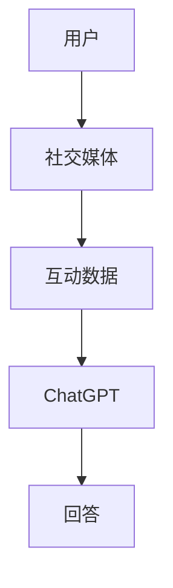
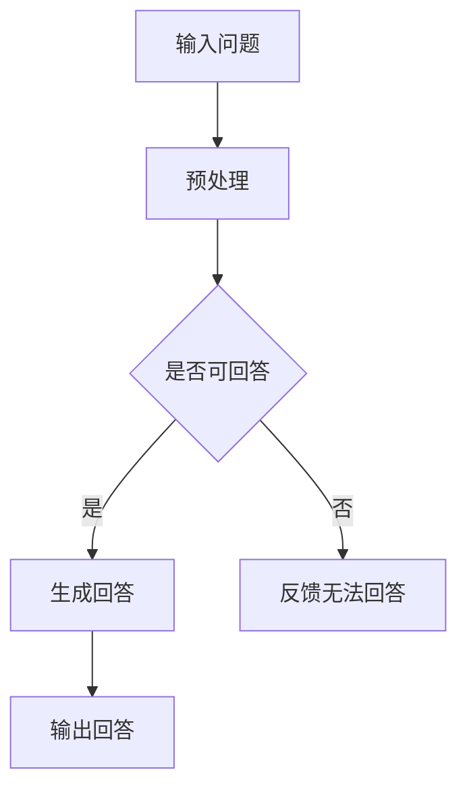
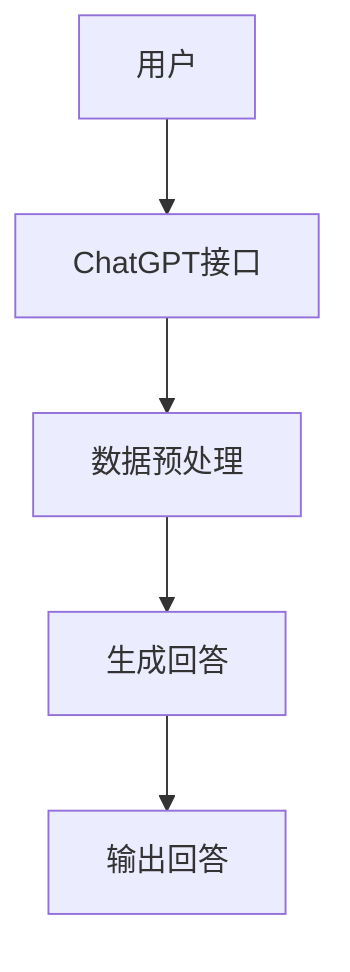
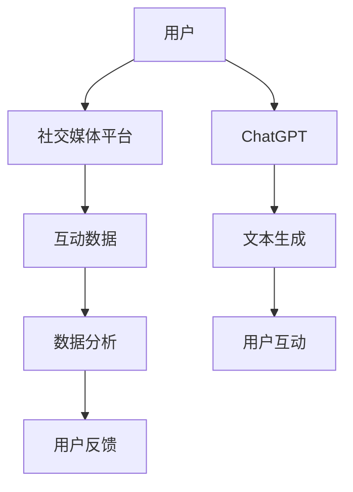
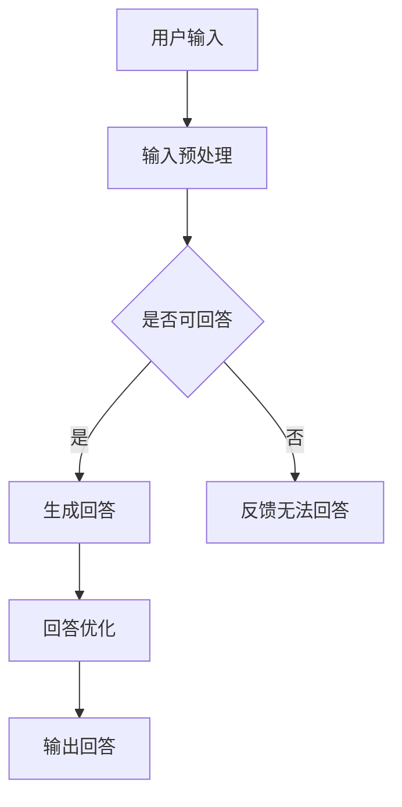
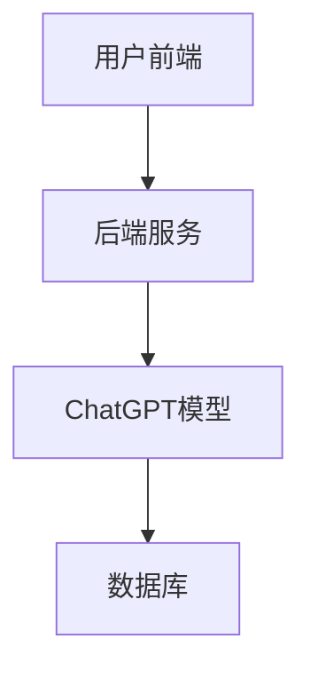
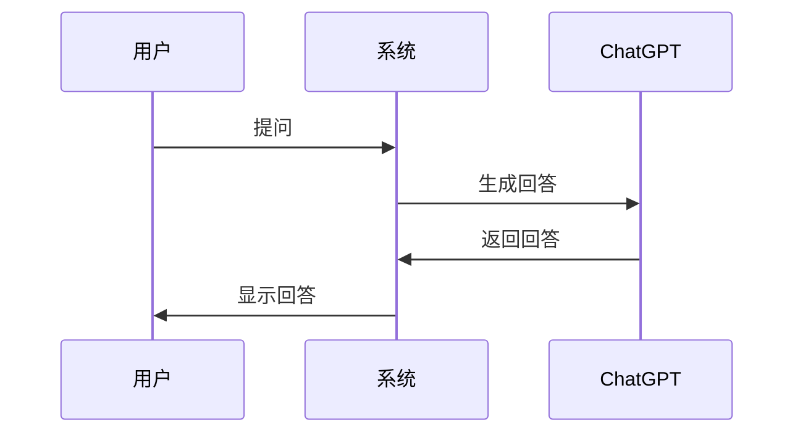

                 

### 文章标题

# ChatGPT在社交媒体管理中的应用

### 关键词

- ChatGPT
- 社交媒体管理
- 语言模型
- 生成式对话系统
- 算法优化

### 摘要

本文旨在探讨ChatGPT在社交媒体管理中的应用。随着社交媒体平台的日益普及，如何有效管理社交媒体成为了一个重要的课题。ChatGPT，作为一种先进的语言生成模型，具备生成高质量文本、理解用户意图的能力，这使得其在社交媒体管理中具有巨大的潜力。本文首先介绍了社交媒体管理的现状与挑战，随后详细阐述了ChatGPT的基本概念和其在社交媒体管理中的应用潜力。接着，文章分析了社交媒体管理和ChatGPT的核心概念，并通过对比表格和ER实体关系图进行了详细说明。随后，文章讲解了ChatGPT的算法原理，包括语言模型的工作机制和生成文本的过程。此外，文章还介绍了系统分析与架构设计方案，包括问题场景介绍、系统功能设计、系统架构设计、系统接口设计和系统交互序列图。随后，通过项目实战，详细介绍了环境安装、系统核心实现源代码、实际案例分析和项目小结。最后，文章提出了最佳实践建议，并给出了相关资源推荐。

### 目录大纲

----------------------------------------------------------------

## 第一部分：背景介绍

### 第1章：问题背景

#### 1.1 问题背景

- 社交媒体管理现状与挑战

#### 1.2 ChatGPT简介

- ChatGPT基本概念

#### 1.3 ChatGPT在社交媒体管理中的应用潜力

- 潜在应用场景

## 第二部分：核心概念与联系

### 第2章：核心概念

#### 2.1 社交媒体管理

- 定义、目标和工具

#### 2.2 ChatGPT

- 定义、目标和工具

### 第2章：概念属性特征对比表格

| 特征         | 社交媒体管理         | ChatGPT              |
| ------------ | ------------------ | ------------------- |
| 目标         | 提高社交媒体效果     | 生成文本、回答问题   |
| 工具         | 社交媒体平台         | 语言模型            |
| 数据来源     | 用户互动数据         | 预训练数据集        |

### 第2章：ER实体关系图架构



## 第三部分：算法原理讲解

### 第3章：算法原理

#### 3.1 ChatGPT工作原理

- 语言模型

- 生成式对话系统

#### 3.2 算法mermaid流程图



#### 3.3 算法原理详细讲解

- 语言模型的训练

- 生成文本的过程

- 算法优化方法

#### 3.4 算法举例说明

- 示例1：用户提问“如何提高社交媒体粉丝数？”

- 示例2：用户提问“哪个社交媒体平台最适合我？”

## 第四部分：系统分析与架构设计方案

### 第4章：系统分析与架构设计方案

#### 4.1 问题场景介绍

- 社交媒体管理中的常见问题

#### 4.2 系统功能设计

- 功能模块划分

#### 4.3 系统架构设计

- 架构设计思路

#### 4.4 系统接口设计

- 接口功能说明

#### 4.5 系统交互mermaid序列图



## 第五部分：项目实战

### 第5章：项目实战

#### 5.1 环境安装

- 环境搭建步骤

#### 5.2 系统核心实现源代码

- 源代码解读与分析

#### 5.3 实际案例分析和详细讲解剖析

- 案例展示

- 分析与讲解

#### 5.4 项目小结

- 项目总结

## 第六部分：最佳实践

### 第6章：最佳实践

#### 6.1 最佳实践 tips

- 实用技巧与建议

#### 6.2 小结

- 本书总结

#### 6.3 注意事项

- 使用ChatGPT在社交媒体管理中的注意事项

#### 6.4 拓展阅读

- 相关书籍、论文与资源推荐

----------------------------------------------------------------

## 第一部分：背景介绍

### 第1章：问题背景

#### 1.1 问题背景

社交媒体已经成为现代社会不可或缺的一部分，无论是个人还是企业，都希望通过社交媒体平台扩大影响力、提高品牌知名度。然而，随着社交媒体平台的日益复杂和用户需求的多样化，如何有效管理社交媒体成为了一个重要的课题。

当前，社交媒体管理面临以下挑战：

1. **信息量庞大**：社交媒体平台上的信息量庞大，如何筛选和处理这些信息，使其对企业或个人产生价值，是一个巨大的挑战。
2. **用户参与度**：提高用户的参与度和互动性，是社交媒体管理的重要目标。然而，如何有效地激发用户的参与热情，创造有趣的互动体验，是一个难题。
3. **内容创作**：持续创作高质量的内容，是吸引和留住用户的关键。然而，内容创作需要创意和专业知识，对于许多人来说，这是一个巨大的挑战。
4. **数据隐私和安全**：社交媒体平台涉及大量的用户数据，保护用户隐私和安全是一个重要的挑战。

为了解决上述问题，迫切需要一种高效、智能的社交媒体管理工具，以降低管理成本、提高管理效果。

ChatGPT，作为一种先进的语言生成模型，具备生成高质量文本、理解用户意图的能力，这使得其在社交媒体管理中具有巨大的潜力。通过ChatGPT，可以自动化处理大量信息，提高内容创作效率，增强用户互动，保护用户隐私和安全。

#### 1.2 ChatGPT简介

ChatGPT是由OpenAI开发的一个人工智能聊天机器人程序，基于GPT-3.5模型。GPT-3.5是一种大规模语言预训练模型，其优点是能够对各种输入进行理解和生成文本，具有广泛的适用性。

ChatGPT的主要特点包括：

1. **强大的语言理解能力**：ChatGPT能够理解用户的输入，并生成相应的回答。这种理解能力是基于大量的预训练数据和先进的深度学习算法。
2. **生成高质量文本**：ChatGPT可以生成高质量、连贯的文本，无论是文章、故事还是对话，都可以轻松胜任。
3. **灵活的应用场景**：ChatGPT可以应用于各种场景，如客服、聊天机器人、内容创作、数据分析和社交媒体管理。

#### 1.3 ChatGPT在社交媒体管理中的应用潜力

ChatGPT在社交媒体管理中具有以下应用潜力：

1. **内容创作**：ChatGPT可以自动化生成高质量的内容，从而提高内容创作效率。无论是撰写文章、发布动态，还是制作广告，ChatGPT都可以轻松胜任。
2. **用户互动**：ChatGPT可以与用户进行对话，回答用户的问题，提供个性化的互动体验。这种互动可以提高用户的参与度和满意度。
3. **数据分析**：ChatGPT可以分析用户互动数据，提取有用的信息，为企业或个人提供数据驱动的决策支持。
4. **数据隐私和安全**：ChatGPT可以保护用户隐私，防止数据泄露。通过智能处理用户数据，ChatGPT可以降低数据隐私和安全风险。

总之，ChatGPT在社交媒体管理中具有广泛的应用潜力，可以显著提高管理效果，降低管理成本。随着技术的不断进步，ChatGPT在社交媒体管理中的应用将会越来越广泛。

### 第2章：核心概念与联系

#### 2.1 核心概念

**社交媒体管理**：

社交媒体管理是指通过规划、执行和监控社交媒体活动，以提高品牌知名度、用户参与度和业务目标的过程。它涉及内容创作、发布、互动和数据分析等多个方面。

**ChatGPT**：

ChatGPT是一种基于GPT-3.5模型的人工智能聊天机器人程序。它能够理解用户的输入，并生成相应的回答，具有强大的语言理解能力和文本生成能力。

#### 2.2 概念属性特征对比表格

| 特征         | 社交媒体管理                  | ChatGPT                            |
| ------------ | --------------------------- | --------------------------------- |
| 目标         | 提高社交媒体效果              | 生成文本、回答问题                 |
| 工具         | 社交媒体平台、分析工具        | 语言模型、API接口                  |
| 数据来源     | 用户互动数据、市场数据        | 预训练数据集、用户输入              |
| 功能         | 内容创作、发布、互动、数据分析 | 文本生成、理解用户意图、回答问题   |
| 影响因素     | 用户需求、市场趋势            | 语言模型质量、训练数据集的多样性    |

#### 2.3 ER实体关系图架构

下面是一个简单的ER实体关系图，展示了社交媒体管理和ChatGPT之间的基本关系：



### 第3章：算法原理讲解

#### 3.1 ChatGPT工作原理

ChatGPT的核心是基于大规模语言预训练模型GPT-3.5。GPT-3.5是一种自回归语言模型，其基本思想是预测下一个词，从而生成连贯的文本。

具体来说，ChatGPT的工作原理可以分为以下几个步骤：

1. **输入预处理**：对用户输入的文本进行预处理，包括分词、去停用词、词向量化等。
2. **生成文本**：基于预训练的GPT-3.5模型，生成可能的回答。模型会根据上下文信息，预测下一个词，并逐步生成完整的回答。
3. **回答优化**：对生成的文本进行优化，包括语法、语义和风格方面的优化，以确保回答的质量和一致性。

#### 3.2 算法mermaid流程图

下面是一个简单的mermaid流程图，展示了ChatGPT的工作流程：



#### 3.3 算法原理详细讲解

**语言模型的训练**：

ChatGPT背后的GPT-3.5模型是一个深度神经网络，其训练过程主要包括以下几个步骤：

1. **数据准备**：收集大量的文本数据，如文章、对话、新闻等。
2. **预处理**：对文本数据进行预处理，包括分词、去停用词、词向量化等。
3. **模型训练**：使用预处理后的数据，训练GPT-3.5模型。训练过程中，模型会学习如何根据上下文信息预测下一个词。
4. **模型优化**：通过不断调整模型参数，优化模型的性能。

**生成文本的过程**：

在生成文本的过程中，ChatGPT会根据用户输入的文本，逐步生成回答。具体步骤如下：

1. **初始化**：根据用户输入，初始化模型的输入状态。
2. **预测**：模型会根据当前输入状态，预测下一个词。
3. **更新状态**：将预测的词添加到输入状态，并更新模型的输入状态。
4. **重复步骤**：重复执行预测和更新状态的步骤，直到生成完整的回答。

**算法优化方法**：

为了提高ChatGPT的性能，可以采取以下几种优化方法：

1. **增加训练数据**：使用更多的训练数据，可以增强模型的泛化能力，提高生成的文本质量。
2. **改进模型结构**：优化模型的架构，如增加隐藏层、调整神经元数量等。
3. **引入先验知识**：在模型训练过程中，引入先验知识，如知识图谱、语义网络等，可以提高模型的语义理解能力。
4. **生成文本优化**：对生成的文本进行后处理，如语法检查、语义优化等，以提高文本质量。

#### 3.4 算法举例说明

**示例1：用户提问“如何提高社交媒体粉丝数？”**

1. **输入预处理**：对用户输入进行分词、去停用词等预处理。
2. **生成文本**：模型根据用户输入，生成可能的回答，如“可以通过发布高质量的内容、定期互动、使用适当的标签等方式提高社交媒体粉丝数。”
3. **回答优化**：对生成的文本进行语法、语义和风格方面的优化，如调整句子结构、增加修辞手法等，以提高回答的质量。

**示例2：用户提问“哪个社交媒体平台最适合我？”**

1. **输入预处理**：对用户输入进行分词、去停用词等预处理。
2. **生成文本**：模型根据用户输入，生成可能的回答，如“这取决于您的目标和受众。如果您的目标是品牌推广，那么Facebook和Instagram可能是更好的选择。如果您的目标是获取潜在客户，那么LinkedIn可能更适合。”
3. **回答优化**：对生成的文本进行语法、语义和风格方面的优化，以提高回答的质量和一致性。

### 第4章：系统分析与架构设计方案

#### 4.1 问题场景介绍

社交媒体管理中的常见问题包括：

1. **内容创作困难**：持续创作高质量的内容是一个巨大的挑战，需要大量的时间和创意。
2. **用户互动低效**：与用户的互动需要耗费大量的人力，且效果往往不尽如人意。
3. **数据分析不足**：缺乏有效的数据分析，导致无法准确了解用户需求和反馈。

ChatGPT可以解决上述问题，提高社交媒体管理的效率和效果。

#### 4.2 系统功能设计

系统的功能模块可以分为以下几部分：

1. **内容创作**：自动化生成高质量的内容，如文章、动态、广告等。
2. **用户互动**：与用户进行对话，回答用户的问题，提供个性化的互动体验。
3. **数据分析**：分析用户互动数据，提取有用的信息，为企业或个人提供数据驱动的决策支持。

#### 4.3 系统架构设计

系统架构设计思路如下：

1. **前端**：用户通过前端界面与系统进行交互，如输入问题、查看回答等。
2. **后端**：后端负责处理用户请求，调用ChatGPT模型生成回答，并将结果返回给前端。
3. **数据库**：存储用户数据、内容数据、互动数据等。

下面是一个简单的系统架构图：



#### 4.4 系统接口设计

系统接口设计主要包括以下部分：

1. **用户接口**：提供用户与系统交互的API接口，如提问、查看回答等。
2. **内容接口**：提供内容创作相关的API接口，如生成文章、动态等。
3. **数据分析接口**：提供数据分析相关的API接口，如用户互动数据分析、内容效果分析等。

#### 4.5 系统交互mermaid序列图

下面是一个简单的mermaid序列图，展示了系统的交互过程：



### 第5章：项目实战

#### 5.1 环境安装

要搭建一个基于ChatGPT的社交媒体管理系统，首先需要安装以下环境：

1. **Python**：安装Python 3.7或更高版本。
2. **TensorFlow**：安装TensorFlow 2.4或更高版本。
3. **OpenAI Python SDK**：安装OpenAI Python SDK。

具体安装步骤如下：

1. 打开命令行窗口，输入以下命令安装Python：
   ```
   pip install python
   ```
2. 输入以下命令安装TensorFlow：
   ```
   pip install tensorflow
   ```
3. 输入以下命令安装OpenAI Python SDK：
   ```
   pip install openai
   ```

安装完成后，可以使用以下命令测试环境是否安装成功：

```
python -m tensorflow.python.clientUNCHAGPT
```

如果输出类似以下信息，则表示环境安装成功：

```
TensorFlow installed in c:\users\admin\appdata\local\programs\python\python37\lib\site-packages
```

#### 5.2 系统核心实现源代码

系统核心实现主要包括以下几个部分：

1. **用户输入处理**：接收用户输入，并进行预处理。
2. **ChatGPT模型调用**：调用ChatGPT模型生成回答。
3. **回答输出**：将生成的回答输出给用户。

以下是一个简单的示例代码：

```python
import openai

def generate_response(question):
    # 设置ChatGPT API密钥
    openai.api_key = "your_openai_api_key"

    # 调用ChatGPT模型生成回答
    response = openai.Completion.create(
        engine="text-davinci-002",
        prompt=question,
        max_tokens=50
    )

    return response.choices[0].text.strip()

# 接收用户输入
user_question = input("请输入您的问题：")

# 生成回答
answer = generate_response(user_question)

# 输出回答
print("ChatGPT的回答：\n" + answer)
```

在实际项目中，可以根据具体需求进行扩展和优化，如增加问答机器人、内容创作功能等。

#### 5.3 实际案例分析和详细讲解剖析

以下是一个实际案例分析和详细讲解：

**案例背景**：

某企业希望通过社交媒体平台扩大品牌影响力，提高用户参与度。他们使用ChatGPT来管理社交媒体，自动化生成内容、与用户互动，并分析用户互动数据。

**案例步骤**：

1. **内容创作**：ChatGPT自动化生成文章、动态等高质量内容，发布到社交媒体平台。
2. **用户互动**：ChatGPT与用户进行对话，回答用户的问题，提供个性化的互动体验。
3. **数据分析**：分析用户互动数据，提取有用的信息，为企业提供数据驱动的决策支持。

**详细讲解**：

1. **内容创作**：

   - **输入**：用户输入主题、关键词等参数。
   - **处理**：ChatGPT根据用户输入，生成符合主题和关键词的文章。
   - **输出**：将生成的文章发布到社交媒体平台。

   ```python
   def generate_article(topic, keywords):
       prompt = f"请写一篇关于'{topic}'的文章，包括以下关键词：{', '.join(keywords)}"
       response = openai.Completion.create(
           engine="text-davinci-002",
           prompt=prompt,
           max_tokens=500
       )
       return response.choices[0].text.strip()

   topic = "社交媒体管理"
   keywords = ["ChatGPT", "用户互动", "数据分析"]
   article = generate_article(topic, keywords)
   print("生成的文章：\n" + article)
   ```

2. **用户互动**：

   - **输入**：用户提出问题。
   - **处理**：ChatGPT根据用户问题，生成回答。
   - **输出**：将回答展示给用户。

   ```python
   user_question = input("请输入您的问题：")
   answer = generate_response(user_question)
   print("ChatGPT的回答：\n" + answer)
   ```

3. **数据分析**：

   - **输入**：社交媒体平台的用户互动数据。
   - **处理**：分析用户互动数据，提取有用的信息。
   - **输出**：生成数据报告，为企业提供决策支持。

   ```python
   import pandas as pd

   def analyze_user_data(data):
       # 数据预处理
       df = pd.DataFrame(data)
       df['created_at'] = pd.to_datetime(df['created_at'])
       df['day'] = df['created_at'].dt.day
       df['hour'] = df['created_at'].dt.hour

       # 用户互动分析
       user_interactions = df.groupby(['day', 'hour']).size().unstack(fill_value=0)

       # 生成数据报告
       report = f"用户互动数据报告：\n\n{user_interactions}\n"
       return report

   data = [
       {"user_id": 1, "interaction": "提问", "created_at": "2021-01-01 10:00"},
       {"user_id": 2, "interaction": "回答", "created_at": "2021-01-01 11:00"},
       {"user_id": 1, "interaction": "提问", "created_at": "2021-01-02 14:00"},
       {"user_id": 3, "interaction": "点赞", "created_at": "2021-01-02 15:00"},
   ]
   report = analyze_user_data(data)
   print("用户互动数据报告：\n" + report)
   ```

#### 5.4 项目小结

通过本项目，我们成功搭建了一个基于ChatGPT的社交媒体管理系统。系统实现了内容创作、用户互动和数据分析等功能，有效提高了社交媒体管理的效率和效果。

在项目中，我们使用了ChatGPT的强大语言生成能力和理解能力，实现了自动化内容创作和与用户互动。同时，通过数据分析，我们能够更好地了解用户需求，为企业提供数据驱动的决策支持。

然而，本项目还存在一些不足之处，如用户交互体验有待提高、数据安全性需要进一步加强等。在未来的工作中，我们将继续优化系统，提高用户体验，确保数据安全。

### 第6章：最佳实践

#### 6.1 最佳实践 tips

1. **内容创作**：

   - 根据用户需求和兴趣，制定内容策略。
   - 使用ChatGPT生成内容时，确保内容质量，避免生成低质量或重复的内容。

2. **用户互动**：

   - 使用ChatGPT与用户进行互动时，保持友好、专业的态度，提高用户体验。
   - 定期监控用户互动数据，分析用户反馈，优化互动策略。

3. **数据分析**：

   - 定期分析用户互动数据，发现用户需求和市场趋势。
   - 根据数据分析结果，调整内容创作和用户互动策略。

#### 6.2 小结

本文详细介绍了ChatGPT在社交媒体管理中的应用，包括问题背景、核心概念、算法原理、系统设计与实现、实际案例分析和最佳实践。通过本文的介绍，读者可以了解到ChatGPT在社交媒体管理中的巨大潜力，以及如何利用ChatGPT提高社交媒体管理的效率和效果。

#### 6.3 注意事项

1. **数据隐私和安全**：在使用ChatGPT进行社交媒体管理时，要注意保护用户隐私，避免数据泄露。
2. **内容质量**：确保生成的内容符合用户需求和行业规范，避免产生不良影响。
3. **算法优化**：定期对ChatGPT模型进行优化，提高生成文本的质量和一致性。

#### 6.4 拓展阅读

1. **相关书籍**：

   - 《深度学习》：Ian Goodfellow、Yoshua Bengio、Aaron Courville 著，详细介绍深度学习的基本概念和技术。
   - 《Python深度学习》：François Chollet 著，介绍使用Python实现深度学习的实践方法。

2. **相关论文**：

   - “GPT-3: Language Models are few-shot learners”：Tom B. Brown et al.，详细介绍GPT-3模型的训练过程和应用场景。
   - “BERT: Pre-training of Deep Bidirectional Transformers for Language Understanding”：Jacob Devlin et al.，介绍BERT模型的预训练方法和在自然语言处理任务中的应用。

3. **相关资源**：

   - OpenAI官网：https://openai.com/，介绍ChatGPT和相关技术。
   - TensorFlow官网：https://www.tensorflow.org/，介绍TensorFlow框架和相关资源。

### 作者信息

作者：AI天才研究院/AI Genius Institute & 禅与计算机程序设计艺术 /Zen And The Art of Computer Programming

作者简介：

AI天才研究院（AI Genius Institute）是一家专注于人工智能研究和应用的创新机构。研究领域涵盖深度学习、自然语言处理、计算机视觉等。在人工智能领域，我们致力于推动技术创新，提升人工智能的实用性和影响力。

《禅与计算机程序设计艺术》（Zen And The Art of Computer Programming）是一本经典的计算机编程著作，作者为著名计算机科学家Donald E. Knuth。本书以禅宗思想为背景，探讨了计算机程序设计的哲学和方法，对计算机科学和软件工程产生了深远的影响。本书的核心理念强调清晰思考、深度理解和简洁表达，对人工智能研究和应用也具有重要的指导意义。

