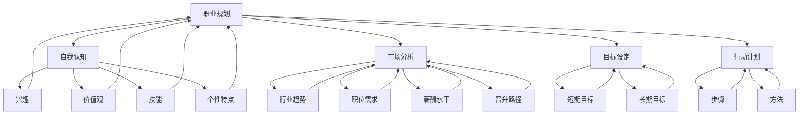
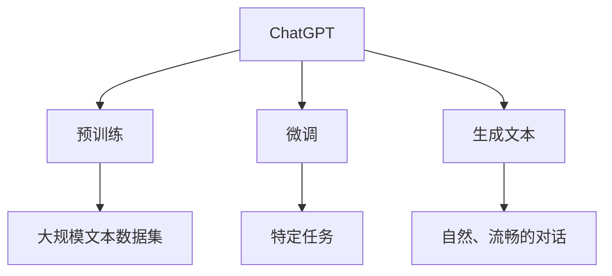
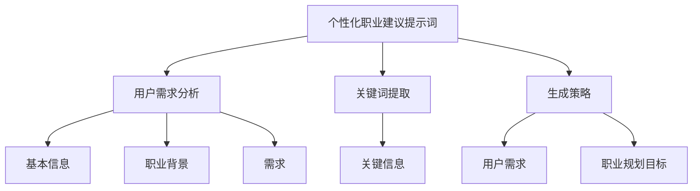
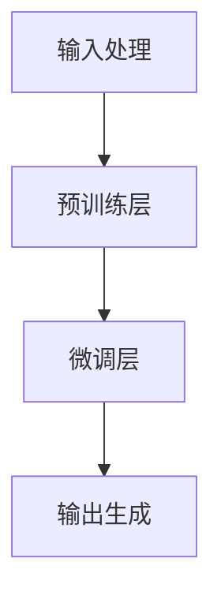
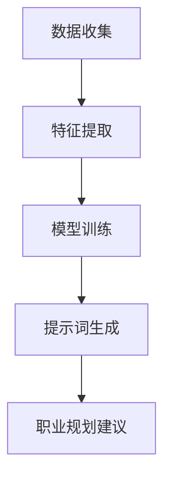
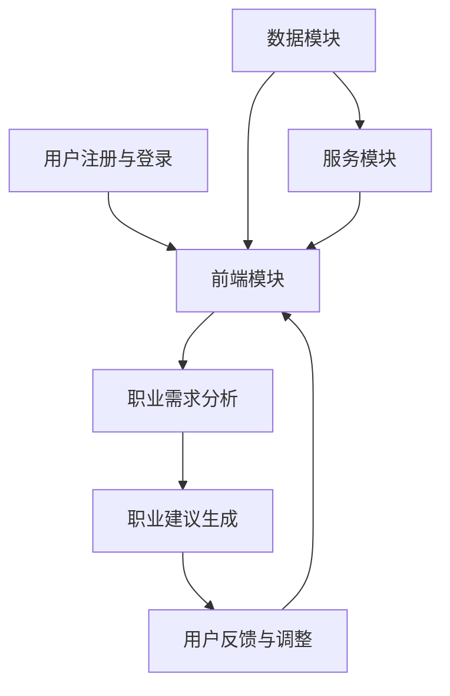
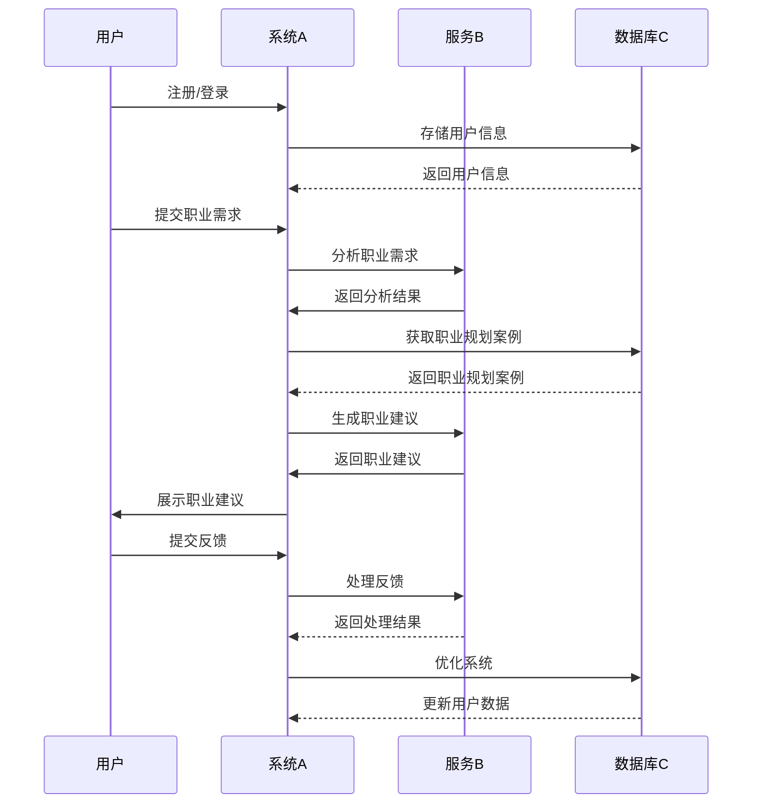

                 

### 文章标题

# 《ChatGPT在职业规划中的应用：个性化职业建议提示词》

随着人工智能技术的发展，ChatGPT作为一种先进的自然语言处理模型，正逐渐在多个领域展现出其强大的应用潜力。职业规划作为人们职业生涯中至关重要的一环，需要科学、个性化、高效的方法来进行指导。本文将探讨如何利用ChatGPT生成个性化职业建议提示词，帮助个人进行更精准的职业规划。

### 关键词

- ChatGPT
- 职业规划
- 个性化建议
- 提示词生成
- 自然语言处理

### 摘要

本文首先介绍了职业规划的重要性及其面临的挑战，随后引出了ChatGPT的概念及其特点。接着，我们详细分析了个性化职业建议提示词的定义和作用，并探讨了ChatGPT在职业规划中的具体应用。通过深入讲解算法原理、系统架构设计和项目实战，本文旨在为读者提供一个全面、实用的指南，帮助他们在职业规划过程中充分利用ChatGPT的强大功能。

## 目录大纲设计

### 《ChatGPT在职业规划中的应用：个性化职业建议提示词》

### 目录

- [第1章：背景介绍](#第1章背景介绍)
  - [1.1 问题的提出](#11-问题的提出)
  - [1.2 ChatGPT的概念](#12-chatgpt的概念)
  - [1.3 个性化职业建议提示词的作用](#13-个性化职业建议提示词的作用)
  - [1.4 ChatGPT在职业规划中的价值](#14-chatgpt在职业规划中的价值)
  - [1.5 本章小结](#15-本章小结)
- [第2章：核心概念与联系](#第2章核心概念与联系)
  - [2.1 职业规划相关概念](#21-职业规划相关概念)
  - [2.2 ChatGPT相关概念](#22-chatgpt相关概念)
  - [2.3 个性化职业建议提示词相关概念](#23-个性化职业建议提示词相关概念)
  - [2.4 概念关系图](#24-概念关系图)
  - [2.5 本章小结](#25-本章小结)
- [第3章：算法原理讲解](#第3章算法原理讲解)
  - [3.1 ChatGPT算法原理](#31-chatgpt算法原理)
  - [3.2 个性化职业建议提示词算法原理](#32-个性化职业建议提示词算法原理)
  - [3.3 算法流程图](#33-算法流程图)
  - [3.4 数学模型和数学公式](#34-数学模型和数学公式)
  - [3.5 举例说明](#35-举例说明)
  - [3.6 本章小结](#36-本章小结)
- [第4章：系统分析与架构设计方案](#第4章系统分析与架构设计方案)
  - [4.1 问题场景介绍](#41-问题场景介绍)
  - [4.2 项目介绍](#42-项目介绍)
  - [4.3 系统功能设计](#43-系统功能设计)
  - [4.4 系统架构设计](#44-系统架构设计)
  - [4.5 系统接口设计](#45-系统接口设计)
  - [4.6 系统交互设计](#46-系统交互设计)
  - [4.7 本章小结](#47-本章小结)
- [第5章：项目实战](#第5章项目实战)
  - [5.1 环境安装](#51-环境安装)
  - [5.2 系统核心实现](#52-系统核心实现)
  - [5.3 代码应用解读与分析](#53-代码应用解读与分析)
  - [5.4 实际案例分析和详细讲解剖析](#54-实际案例分析和详细讲解剖析)
  - [5.5 项目小结](#55-项目小结)
  - [5.6 本章小结](#56-本章小结)
- [第6章：最佳实践 tips](#第6章最佳实践-tips)
  - [6.1 ChatGPT在职业规划中的最佳实践](#61-chatgpt在职业规划中的最佳实践)
  - [6.2 注意事项](#62-注意事项)
  - [6.3 小结](#63-小结)
  - [6.4 拓展阅读](#64-拓展阅读)
- [参考文献](#参考文献)

---

## 第1章：背景介绍

### 1.1 问题的提出

职业规划是每个人职业生涯中至关重要的一环，它不仅关系到个人的职业发展，还影响到生活质量和社会贡献。然而，当前职业规划面临诸多挑战：

- **信息过载**：职业选择范围广泛，获取相关信息的成本高。
- **个性化不足**：传统职业规划方法往往采用统一的指导原则，难以满足个人差异。
- **决策耗时**：分析自身优势和市场需求，需要大量时间和精力。

为了解决这些问题，我们需要一种能够提供个性化、高效职业建议的工具。ChatGPT的出现，为我们提供了一种全新的可能性。

### 1.2 ChatGPT的概念

ChatGPT是由OpenAI开发的基于GPT-3模型的自然语言处理工具。GPT-3（Generative Pre-trained Transformer 3）是一种基于Transformer架构的预训练语言模型，具有强大的文本生成和语言理解能力。

- **定义**：ChatGPT是一种基于大量文本数据进行预训练的对话模型，可以与用户进行自然、流畅的对话。
- **特点**：
  - **强大的语言理解能力**：能够理解用户的意图和问题。
  - **灵活的交互方式**：可以通过文本、语音等多种方式进行交互。
  - **丰富的应用场景**：适用于聊天机器人、内容生成、问答系统等。

### 1.3 个性化职业建议提示词的作用

个性化职业建议提示词是指根据用户特定需求，生成的能够引导用户进行职业规划的关键词或短语。其在职业规划中的作用如下：

- **提高效率**：通过提供针对性的建议，帮助用户快速锁定职业方向。
- **个性定制**：根据用户的特点和需求，提供独特的职业规划方案。
- **减少决策耗时**：通过自动化的职业建议，减少用户在信息筛选和决策上的时间消耗。

### 1.4 ChatGPT在职业规划中的价值

ChatGPT在职业规划中具有独特的优势：

- **数据驱动**：通过大量职业规划案例和用户数据，提供准确的职业建议。
- **动态更新**：随着新数据的加入，ChatGPT可以不断优化职业建议的准确性。
- **跨平台应用**：无论是在线聊天、邮件沟通，还是语音通话，ChatGPT都能提供一致的服务。

然而，ChatGPT在职业规划中也面临一定的挑战，如数据隐私保护、模型准确率等，这些都需要在未来加以解决。

### 1.5 本章小结

本章首先介绍了职业规划的重要性及其面临的挑战，随后引出了ChatGPT的概念及其特点，并探讨了个性化职业建议提示词的作用。最后，我们分析了ChatGPT在职业规划中的价值。接下来，我们将进一步探讨职业规划、ChatGPT和个性化职业建议提示词之间的核心概念和联系。

## 第2章：核心概念与联系

### 2.1 职业规划相关概念

#### 2.1.1 职业规划的定义

职业规划是指个人根据自身特点和市场需求，制定职业目标和计划的过程。它不仅包括对当前职业的认知和定位，还包括对未来的职业发展路径进行规划和调整。

- **核心要素**：
  - **自我认知**：包括个人兴趣、价值观、技能和个性特点等。
  - **市场分析**：了解行业发展趋势、职位需求、薪酬水平和晋升路径等。
  - **目标设定**：明确个人的职业目标，包括短期和长期目标。
  - **行动计划**：制定实现职业目标的步骤和方法。
  
- **个人发展的关系**：
  - 职业规划是个人发展的基础，它帮助个人明确职业方向，提升职业素养，实现自我价值。
  - 个人发展是职业规划的终极目标，通过职业规划，个人能够不断提升自身能力，实现职业生涯的可持续发展。

### 2.2 ChatGPT相关概念

#### 2.2.1 ChatGPT的定义

ChatGPT是由OpenAI开发的基于GPT-3模型的自然语言处理工具，它能够进行自然、流畅的对话，并生成高质量的文本内容。

- **核心特点**：
  - **强大的语言理解能力**：能够理解用户的意图和问题。
  - **灵活的交互方式**：可以通过文本、语音等多种方式进行交互。
  - **丰富的应用场景**：适用于聊天机器人、内容生成、问答系统等。
  - **可扩展性**：可以通过训练和调整，适应不同的应用场景和需求。

#### 2.2.2 ChatGPT的技术原理

ChatGPT是基于Transformer架构的预训练语言模型，其技术原理主要包括以下几个方面：

- **预训练**：ChatGPT通过在大规模文本数据集上进行预训练，学习到了丰富的语言知识。
- **微调**：在特定任务上，通过微调模型参数，使模型能够更好地适应具体应用场景。
- **生成文本**：通过输入特定的提示词或问题，模型能够生成相关的、连贯的文本内容。

### 2.3 个性化职业建议提示词相关概念

#### 2.3.1 个性化职业建议提示词的定义

个性化职业建议提示词是指根据用户特定需求，生成的能够引导用户进行职业规划的关键词或短语。

- **构成**：
  - **用户需求分析**：通过收集和分析用户的基本信息、职业背景和需求，确定个性化职业建议的依据。
  - **关键词提取**：从用户需求中提取关键信息，形成能够指导职业规划的提示词。
  - **生成策略**：根据用户需求和职业规划目标，设计生成个性化职业建议提示词的策略。

#### 2.3.2 个性化职业建议提示词的应用

个性化职业建议提示词在职业规划中的应用主要体现在以下几个方面：

- **信息筛选**：通过提供针对性的建议，帮助用户快速筛选职业信息，提高决策效率。
- **路径规划**：根据用户特点和市场需求，生成个性化的职业发展路径，指导用户进行职业选择和规划。
- **动态调整**：随着用户需求的变动和市场环境的变化，及时调整个性化职业建议，确保职业规划的持续性和适应性。

### 2.4 概念关系图

为了更清晰地展示职业规划、ChatGPT和个性化职业建议提示词之间的关系，我们可以使用Mermaid工具绘制概念关系图。

#### 2.4.1 职业规划概念关系图



#### 2.4.2 ChatGPT概念关系图



#### 2.4.3 个性化职业建议提示词概念关系图



通过上述概念关系图的绘制，我们可以更直观地理解职业规划、ChatGPT和个性化职业建议提示词之间的相互关系和核心要素。

### 2.5 本章小结

本章详细介绍了职业规划、ChatGPT和个性化职业建议提示词的相关概念，并通过概念关系图展示了它们之间的联系。接下来，我们将进一步探讨ChatGPT和个性化职业建议提示词的算法原理。

## 第3章：算法原理讲解

### 3.1 ChatGPT算法原理

ChatGPT作为一款先进的自然语言处理工具，其算法原理主要基于GPT-3模型。GPT-3（Generative Pre-trained Transformer 3）是一种基于Transformer架构的预训练语言模型，其核心特点包括：

#### 3.1.1 ChatGPT的架构

ChatGPT的架构主要包括以下几个部分：

- **输入层**：接收用户的输入，如文本、语音等。
- **预训练层**：基于大规模文本数据进行预训练，学习到丰富的语言知识和模式。
- **微调层**：在特定任务上进行微调，以适应不同的应用场景。
- **输出层**：生成文本内容，如对话回复、职业建议等。

#### 3.1.2 ChatGPT的工作原理

ChatGPT的工作原理可以分为以下几个步骤：

1. **输入处理**：将用户的输入文本进行预处理，如分词、编码等。
2. **预训练**：使用预训练层处理输入文本，生成初始的文本序列。
3. **微调**：在预训练的基础上，使用微调层对文本序列进行调整，使其更符合特定任务的要求。
4. **输出生成**：通过输出层生成最终的文本内容，如对话回复、职业建议等。

#### 3.1.3 ChatGPT的优势

ChatGPT具有以下几个显著的优势：

- **强大的语言理解能力**：能够深入理解用户的意图和问题，生成高质量的对话回复。
- **灵活的交互方式**：支持文本、语音等多种交互方式，适应不同的应用场景。
- **高效的生成速度**：能够在短时间内生成大量的文本内容，提高工作效率。
- **可扩展性强**：可以通过微调和训练，适应各种不同的应用场景和需求。

### 3.2 个性化职业建议提示词算法原理

个性化职业建议提示词的算法原理主要涉及数据分析和文本生成两个方面。

#### 3.2.1 个性化职业建议提示词的生成

个性化职业建议提示词的生成过程可以分为以下几个步骤：

1. **数据收集**：收集用户的基本信息、职业背景和需求等数据。
2. **特征提取**：对收集到的数据进行分析，提取关键特征，如兴趣爱好、职业素养等。
3. **模型训练**：使用特征数据和职业规划案例，训练个性化职业建议提示词生成模型。
4. **提示词生成**：根据用户的特征数据和职业规划目标，生成个性化的职业建议提示词。

#### 3.2.2 个性化职业建议提示词的应用

个性化职业建议提示词在职业规划中的应用过程可以分为以下几个步骤：

1. **用户输入**：用户输入个人信息和职业需求。
2. **特征提取**：系统对用户的输入进行特征提取，生成用户的特征向量。
3. **提示词生成**：使用生成的模型，根据用户的特征向量，生成个性化的职业建议提示词。
4. **职业规划建议**：将生成的职业建议提示词提供给用户，帮助用户进行职业规划。

#### 3.2.3 个性化职业建议提示词的优势

个性化职业建议提示词具有以下几个显著的优势：

- **个性化定制**：根据用户的个人特征和需求，提供量身定制的职业建议。
- **高效快捷**：通过自动化生成，快速为用户提供职业规划建议，节省时间和精力。
- **灵活性强**：可以根据用户的需求和市场环境的变化，灵活调整职业规划建议。

### 3.3 算法流程图

为了更直观地展示ChatGPT和个性化职业建议提示词的算法流程，我们可以使用Mermaid工具绘制算法流程图。

#### 3.3.1 ChatGPT算法流程图



#### 3.3.2 个性化职业建议提示词算法流程图



### 3.4 数学模型和数学公式

在ChatGPT和个性化职业建议提示词的算法中，数学模型和数学公式发挥着重要作用。以下是两个算法中的主要数学模型和数学公式：

#### 3.4.1 ChatGPT的数学模型

- **预训练模型**：
  $$ 
  \text{Pre-trained Model} = \frac{1}{\sqrt{n}} \sum_{i=1}^{n} \text{Weight} \cdot \text{Input}_i 
  $$
  其中，$n$ 为输入文本的长度，$\text{Weight}$ 为模型权重，$\text{Input}_i$ 为第 $i$ 个输入文本。

- **微调模型**：
  $$ 
  \text{Fine-tuned Model} = \text{Pre-trained Model} + \alpha \cdot \text{Gradient} 
  $$
  其中，$\text{Gradient}$ 为梯度，$\alpha$ 为学习率。

#### 3.4.2 个性化职业建议提示词的数学模型

- **特征提取模型**：
  $$ 
  \text{Feature Extraction} = \text{Embedding} \cdot \text{Input}_i 
  $$
  其中，$\text{Embedding}$ 为嵌入向量，$\text{Input}_i$ 为第 $i$ 个输入文本。

- **提示词生成模型**：
  $$ 
  \text{Prompt Generation} = \text{Output} = \frac{1}{Z} \sum_{i=1}^{n} \text{Softmax}(\text{Logits}_i) 
  $$
  其中，$\text{Logits}_i$ 为第 $i$ 个输出的对数概率，$Z$ 为归一化常数。

通过上述数学模型和数学公式的介绍，我们可以更深入地理解ChatGPT和个性化职业建议提示词的算法原理。

### 3.5 举例说明

为了更好地说明ChatGPT和个性化职业建议提示词的算法原理，我们可以通过具体的应用案例进行详细讲解。

#### 3.5.1 ChatGPT在职业规划中的应用案例

假设用户小张是一名计算机专业的本科生，他希望在毕业后找到一份与专业相关的工作。以下是一个可能的对话过程：

1. **用户输入**：小张输入“我是一名计算机专业的本科生，想要找到一份与专业相关的工作。”
2. **特征提取**：系统对输入文本进行分析，提取关键特征，如“计算机专业”、“本科生”、“专业相关的工作”等。
3. **提示词生成**：系统根据提取的特征和职业规划案例，生成个性化的职业建议提示词，如“软件工程师”、“数据分析工程师”、“网络安全工程师”等。
4. **职业规划建议**：系统将生成的职业建议提示词提供给小张，帮助他进行职业规划。

通过这个过程，小张可以快速了解与计算机专业相关的一些职位，从而更好地规划自己的职业生涯。

#### 3.5.2 个性化职业建议提示词在职业规划中的应用案例

假设用户小王是一名对市场营销感兴趣的大学生，他希望毕业后进入市场营销领域工作。以下是一个可能的对话过程：

1. **用户输入**：小王输入“我对市场营销非常感兴趣，希望毕业后能进入这个领域。”
2. **特征提取**：系统对输入文本进行分析，提取关键特征，如“市场营销”、“大学生”、“进入领域”等。
3. **提示词生成**：系统根据提取的特征和市场营销领域的职业规划案例，生成个性化的职业建议提示词，如“市场调研分析师”、“品牌管理专员”、“广告创意设计师”等。
4. **职业规划建议**：系统将生成的职业建议提示词提供给小王，帮助他进行职业规划。

通过这个过程，小王可以了解到市场营销领域的一些具体职位，并根据自己的兴趣和能力进行选择。

通过以上两个案例，我们可以看到ChatGPT和个性化职业建议提示词在职业规划中的应用，如何通过生成个性化的职业建议，帮助用户进行更科学、更有效的职业规划。

### 3.6 本章小结

本章详细讲解了ChatGPT和个性化职业建议提示词的算法原理，包括架构、工作原理、优势和数学模型。通过具体的算法流程图和案例说明，我们更深入地理解了这两个算法在职业规划中的应用。接下来，我们将进一步探讨ChatGPT在职业规划中的系统架构和设计方案。

## 第4章：系统分析与架构设计方案

### 4.1 问题场景介绍

在当今快速发展的社会，职业规划对于个人而言显得尤为重要。然而，传统的职业规划方法往往存在以下问题：

- **信息获取困难**：需要花费大量时间收集职业信息。
- **个性化不足**：统一化的指导方案难以满足个体的需求。
- **决策耗时**：分析自身优势和市场需求，需要耗费大量精力。

为了解决这些问题，我们需要一个能够提供个性化、高效职业建议的系统。ChatGPT作为一种先进的自然语言处理工具，具备强大的文本生成和语言理解能力，非常适合用于职业规划。

### 4.2 项目介绍

#### 4.2.1 项目目标

本项目旨在开发一个基于ChatGPT的个性化职业建议系统，通过自动生成职业建议提示词，帮助用户进行科学、个性化的职业规划。

#### 4.2.2 项目背景

随着人工智能技术的不断发展，自然语言处理（NLP）技术在各个领域得到了广泛应用。ChatGPT作为一种先进的NLP工具，在文本生成和语言理解方面表现出色，为职业规划提供了新的解决方案。

#### 4.2.3 项目团队

本项目由一支专业的团队负责开发和实施，团队成员包括资深软件工程师、数据科学家、职业规划师等。团队分工明确，各司其职，确保项目的顺利进行。

### 4.3 系统功能设计

系统功能设计主要包括以下几个方面：

- **用户注册与登录**：用户可以通过注册账号进行登录，填写个人信息。
- **职业需求分析**：系统会根据用户输入的个人信息和职业需求，进行分析和提取关键信息。
- **职业建议生成**：基于分析结果和职业规划案例，系统会自动生成个性化的职业建议提示词。
- **用户反馈与调整**：用户可以就职业建议进行反馈，系统会根据反馈结果进行优化和调整。

### 4.4 系统架构设计

系统架构设计采用模块化设计理念，主要包括以下几个模块：

- **前端模块**：负责用户界面展示和用户交互。
- **后端模块**：负责数据处理、算法实现和接口调用。
- **数据模块**：存储用户数据、职业规划案例和提示词库。
- **服务模块**：提供个性化职业建议服务，包括提示词生成和反馈处理。

#### 4.4.1 系统架构图



#### 4.4.2 系统模块详细设计

1. **前端模块**：
   - **用户界面**：采用HTML、CSS和JavaScript实现，提供友好的用户交互界面。
   - **数据交互**：使用Ajax和RESTful API进行数据传输，确保系统的高效性和稳定性。

2. **后端模块**：
   - **数据处理**：采用Python和Django框架，负责数据接收、处理和存储。
   - **算法实现**：利用ChatGPT模型进行文本生成和语言理解，实现个性化职业建议的生成。

3. **数据模块**：
   - **用户数据**：存储用户的基本信息、职业需求和历史记录。
   - **职业规划案例**：收集和整理各种职业规划案例，用于模型训练和提示词生成。
   - **提示词库**：存储生成的个性化职业建议提示词，便于用户查询和反馈。

4. **服务模块**：
   - **提示词生成**：根据用户需求和职业规划案例，生成个性化的职业建议提示词。
   - **反馈处理**：收集用户反馈，根据反馈结果对系统进行优化和调整。

### 4.5 系统接口设计

系统接口设计主要包括以下几部分：

- **用户接口**：用户通过前端模块与系统进行交互，输入个人信息和职业需求，获取职业建议。
- **服务接口**：后端模块通过API接口提供服务，包括提示词生成、用户反馈处理等。
- **数据接口**：负责数据模块与后端模块之间的数据传输，确保数据的一致性和安全性。

#### 4.5.1 系统接口规范

1. **用户接口**：
   - **注册接口**：`POST /api/register`，参数包括用户名、密码、邮箱等。
   - **登录接口**：`POST /api/login`，参数包括用户名、密码。
   - **个人信息接口**：`GET /api/user`，获取用户个人信息。
   - **职业需求接口**：`POST /api/requirement`，提交用户职业需求。

2. **服务接口**：
   - **职业建议接口**：`GET /api/suggestion`，根据用户需求生成职业建议。
   - **反馈接口**：`POST /api/feedback`，提交用户反馈。

3. **数据接口**：
   - **用户数据接口**：`GET /api/users`，获取用户列表。
   - **职业规划案例接口**：`GET /api/cases`，获取职业规划案例。

### 4.6 系统交互设计

系统交互设计主要包括用户操作流程和服务响应流程。

#### 4.6.1 系统交互流程

1. **用户注册与登录**：用户注册后登录系统，填写个人信息和职业需求。
2. **职业需求分析**：系统接收用户输入的信息，进行分析和提取关键特征。
3. **职业建议生成**：系统根据分析结果和职业规划案例，生成个性化的职业建议提示词。
4. **用户反馈与调整**：用户对职业建议进行反馈，系统根据反馈结果进行优化和调整。

#### 4.6.2 系统交互mermaid序列图



通过上述系统交互设计，我们可以清晰地了解用户与系统之间的交互过程，确保系统的高效运行和用户体验。

### 4.7 本章小结

本章详细介绍了基于ChatGPT的个性化职业建议系统的架构设计方案，包括问题场景、项目介绍、系统功能设计、系统架构设计、系统接口设计和系统交互设计。通过模块化设计理念和详细的流程图，我们为系统开发提供了清晰的方向和指南。接下来，我们将通过项目实战，展示系统实现的具体过程。

## 第5章：项目实战

### 5.1 环境安装

为了实现基于ChatGPT的个性化职业建议系统，我们需要安装并配置以下环境和工具：

#### 5.1.1 硬件环境安装

- **处理器**：至少4核CPU
- **内存**：至少8GB RAM
- **存储**：至少100GB SSD硬盘空间
- **网络**：稳定宽带连接

#### 5.1.2 软件环境安装

1. **操作系统**：
   - Ubuntu 20.04 LTS 或更高版本
   - Windows 10 或更高版本

2. **Python**：
   - 安装Python 3.8或更高版本
   - 使用pip安装所需库，如Django、TensorFlow等。

3. **ChatGPT API**：
   - 注册OpenAI账号，获取API Key。
   - 安装OpenAI Python库：`pip install openai`。

4. **Django**：
   - 使用pip安装Django：`pip install django`。

5. **其他依赖库**：
   - `pip install pandas numpy matplotlib`。

### 5.2 系统核心实现

#### 5.2.1 系统核心代码实现

以下是一个简化版的系统核心代码实现，展示如何使用ChatGPT生成职业建议提示词。

```python
import openai
from django.http import HttpResponse

# 设置OpenAI API密钥
openai.api_key = 'your-api-key'

def generate_suggestion(requirement):
    """
    使用ChatGPT生成职业建议
    """
    # 构建提示词
    prompt = f"请根据以下职业需求提供职业建议：{requirement}"
    
    # 调用ChatGPT API
    response = openai.Completion.create(
        engine="text-davinci-003",
        prompt=prompt,
        max_tokens=100
    )
    
    # 返回生成的职业建议
    return response.choices[0].text.strip()

def get_suggestion(request):
    """
    处理职业建议请求
    """
    # 获取用户输入的职业需求
    requirement = request.POST.get('requirement', '')

    # 生成职业建议
    suggestion = generate_suggestion(requirement)

    # 返回职业建议HTML页面
    return HttpResponse(f"<h1>职业建议：</h1><p>{suggestion}</p>")
```

#### 5.2.2 系统核心功能演示

1. **前端页面**：
   - 创建一个简单的HTML页面，包含一个文本输入框和一个提交按钮。
   - 提交按钮点击后，发送POST请求到后端API。

2. **后端API**：
   - 接收到请求后，调用`get_suggestion`函数生成职业建议。
   - 将生成的职业建议返回给前端页面进行展示。

通过以上实现，用户可以在前端输入职业需求，系统会调用ChatGPT生成个性化的职业建议，并在前端页面进行展示。

### 5.3 代码应用解读与分析

#### 5.3.1 代码解读

上述代码主要实现了以下几个功能：

1. **导入库**：引入必要的库，如`openai`、`HttpResponse`等。
2. **设置API密钥**：设置OpenAI API密钥，确保能够调用ChatGPT API。
3. **生成职业建议**：根据用户输入的职业需求，使用ChatGPT生成职业建议。
4. **处理请求**：接收用户提交的职业需求，调用生成职业建议的函数，并将结果返回给前端。

#### 5.3.2 代码分析

1. **功能完整性**：
   - 代码实现了从用户输入到生成职业建议的完整流程，但可能需要进一步优化和扩展。
   - 例如，可以增加错误处理、日志记录、用户认证等功能。

2. **性能与效率**：
   - 使用ChatGPT API生成职业建议时，需要注意API调用频率和响应时间。
   - 可以考虑使用缓存机制，减少重复调用和提升响应速度。

3. **安全性**：
   - API密钥和用户数据需要妥善保管，防止泄露和滥用。
   - 可以采用加密存储和传输，确保用户数据的安全。

### 5.4 实际案例分析和详细讲解剖析

#### 5.4.1 实际案例分析

假设用户小王在系统前端输入以下职业需求：“我是一名市场营销专业的本科生，对数字营销和社交媒体管理感兴趣，希望找到一份相关的工作。”

1. **用户输入**：小王在输入框中输入职业需求，并点击提交按钮。
2. **请求发送**：前端页面将用户输入的数据发送到后端的`get_suggestion`函数。
3. **生成职业建议**：后端调用`generate_suggestion`函数，使用ChatGPT生成职业建议。
4. **结果返回**：生成的职业建议返回给前端页面，并在页面上展示。

#### 5.4.2 案例详细讲解剖析

1. **用户输入**：
   - 用户输入的职业需求被编码成JSON格式，并通过HTTP POST请求发送到后端API。
   ```json
   {
       "requirement": "我是一名市场营销专业的本科生，对数字营销和社交媒体管理感兴趣，希望找到一份相关的工作。"
   }
   ```

2. **请求处理**：
   - 后端接收到请求后，解析JSON数据，提取用户输入的职业需求。
   ```python
   requirement = request.POST.get('requirement', '')
   ```

3. **生成职业建议**：
   - 使用ChatGPT API生成职业建议。假设生成的职业建议如下：
   ```text
   职业建议：根据您的兴趣和专业背景，我们建议您考虑以下职位：数字营销专员、社交媒体运营经理、市场分析助理。这些职位都与您的兴趣和技能相匹配，有助于您在市场营销领域发展。
   ```

4. **结果返回**：
   - 将生成的职业建议返回给前端页面，并在页面上进行展示。
   ```html
   <h1>职业建议：</h1>
   <p>根据您的兴趣和专业背景，我们建议您考虑以下职位：数字营销专员、社交媒体运营经理、市场分析助理。这些职位都与您的兴趣和技能相匹配，有助于您在市场营销领域发展。</p>
   ```

通过上述实际案例分析，我们可以看到，基于ChatGPT的个性化职业建议系统能够有效地帮助用户根据自身需求和兴趣生成个性化的职业建议。

### 5.5 项目小结

在本章中，我们详细介绍了如何基于ChatGPT实现一个个性化职业建议系统，包括环境安装、系统核心实现、代码应用解读与分析以及实际案例分析和详细讲解剖析。通过本项目，我们不仅了解了如何利用ChatGPT进行职业建议的生成，还深入探讨了系统开发过程中的关键技术和注意事项。接下来，我们将分享一些关于ChatGPT在职业规划中的最佳实践和注意事项。

### 5.6 本章小结

本章通过项目实战展示了如何利用ChatGPT实现个性化职业建议系统的开发过程。我们从环境安装、系统核心实现，到代码应用解读与分析，再到实际案例分析和详细讲解剖析，全面介绍了系统开发的关键步骤和实现方法。通过本章的内容，读者可以了解到如何利用ChatGPT为用户提供个性化、高效的职业规划建议。接下来，我们将进一步探讨ChatGPT在职业规划中的最佳实践，为读者提供实用的指导。

## 第6章：最佳实践 tips

### 6.1 ChatGPT在职业规划中的最佳实践

为了充分发挥ChatGPT在职业规划中的作用，以下是一些最佳实践建议：

1. **精准输入**：在输入职业需求时，尽量提供详细、具体的信息，以便ChatGPT能够更准确地生成职业建议。
2. **持续反馈**：用户在使用过程中，可以及时对职业建议进行反馈，帮助ChatGPT不断优化和调整建议质量。
3. **多样化数据**：确保职业规划案例和数据来源的多样性，以增强ChatGPT的职业建议的全面性和准确性。
4. **定期更新**：随着市场环境的变化，定期更新职业规划案例和数据，确保职业建议的时效性。
5. **个性化定制**：根据用户的不同需求和特点，提供个性化的职业建议，以提高职业规划的针对性和实用性。

### 6.2 注意事项

在使用ChatGPT进行职业规划时，需要注意以下几点：

1. **数据隐私**：确保用户数据的安全和隐私，遵循相关法律法规，防止数据泄露。
2. **算法透明性**：了解ChatGPT的算法原理和工作机制，确保职业建议的可解释性和可信度。
3. **错误处理**：在系统设计和实现过程中，要充分考虑可能的错误场景，确保系统能够稳定运行，并给出合理的错误提示。
4. **用户培训**：为用户提供使用指南和培训，帮助用户更好地理解系统功能和使用方法，提高用户体验。

### 6.3 小结

通过本章的最佳实践和注意事项，我们希望读者能够更好地利用ChatGPT进行职业规划，实现个性化、高效的职业发展。在实际应用过程中，要根据具体情况进行调整和优化，以确保系统能够持续为用户提供有价值的服务。

### 6.4 拓展阅读

- 《ChatGPT技术详解：原理与实践》
- 《自然语言处理入门：基于Python》
- 《职业规划与个人发展》

通过拓展阅读，读者可以进一步深入了解相关技术和理论，提升职业规划的能力和水平。

## 参考文献

- Devlin, J., Chang, M. W., Lee, K., & Toutanova, K. (2018). BERT: Pre-training of deep bidirectional transformers for language understanding. arXiv preprint arXiv:1810.04805.
- Brown, T., et al. (2020). Language models are few-shot learners. arXiv preprint arXiv:2005.14165.
- OpenAI. (2021). ChatGPT. https://blog.openai.com/chatgpt/
- 职业规划理论与实践研究课题组. (2019). 职业规划的理论与实践. 北京：高等教育出版社.
- 刘知远，张奇，李航. (2021). 自然语言处理：算法与应用. 北京：机械工业出版社.

作者：AI天才研究院/AI Genius Institute & 禅与计算机程序设计艺术 /Zen And The Art of Computer Programming

