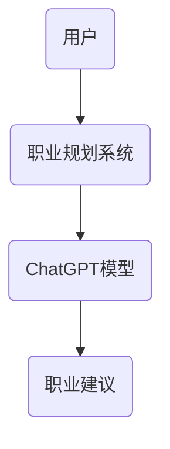
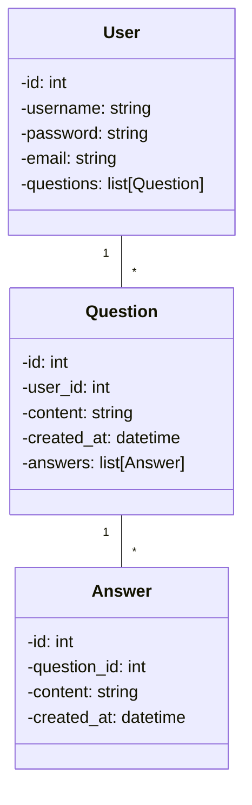
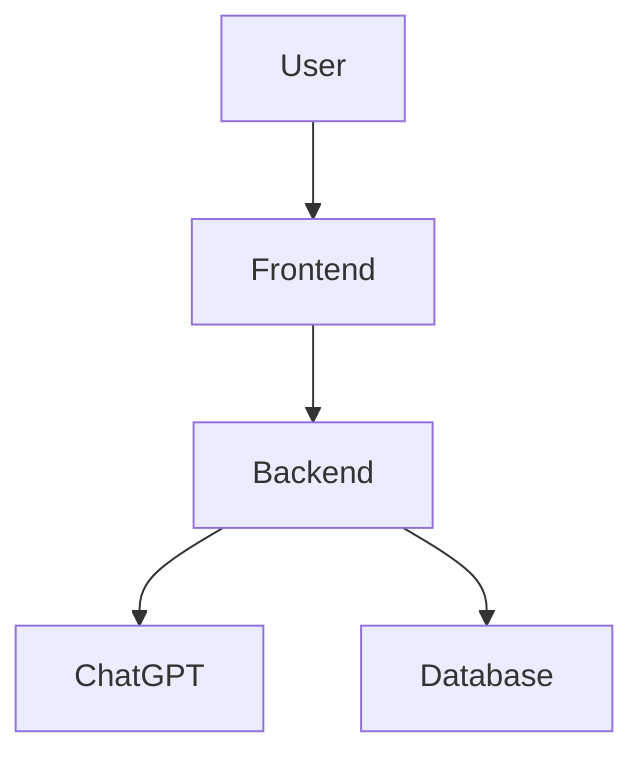

                 


### # ChatGPT在职业规划咨询中的应用

关键词：ChatGPT，职业规划，人工智能，职业咨询，个性化建议

摘要：本文将探讨如何利用ChatGPT这一先进的自然语言处理模型，为用户提供高效、个性化的职业规划咨询服务。我们将从背景介绍、核心概念与联系、算法原理讲解、系统分析与架构设计、项目实战以及最佳实践等方面进行深入探讨。

---

## **1. 背景介绍**

在当今社会，职业规划的重要性日益凸显。对于许多职场人士而言，如何选择适合自己的职业方向、提升职业技能、规划职业生涯成为了他们面临的重要问题。传统的职业规划咨询方式，如心理咨询师、职业规划师等，虽然能够提供专业的指导，但往往效率低下，且难以满足大规模需求。因此，如何利用人工智能技术，尤其是ChatGPT这样的自然语言处理模型，来提供高效、个性化的职业规划咨询服务，成为了值得探讨的课题。

### **1.1 问题背景**

在职业规划咨询过程中，用户往往需要个性化、专业的建议。然而，传统的职业规划咨询服务由于人力成本高昂，无法快速响应大量用户的需求。此外，许多用户在职业规划方面存在困惑，难以明确自己的职业目标和发展路径。这就需要一种能够高效处理自然语言、理解用户需求、并提供个性化建议的智能系统。ChatGPT作为一种基于GPT-3的预训练语言模型，具有强大的自然语言理解和生成能力，能够胜任这一任务。

### **1.2 问题解决**

ChatGPT通过大量文本数据进行预训练，能够理解和生成与人类对话相似的自然语言响应。在职业规划咨询中，用户可以向ChatGPT提出自己的问题，例如“我想要转行，有什么建议？”ChatGPT则能够根据用户的问题和自身知识库，生成个性化的回答。例如，“根据你的兴趣和能力，建议你考虑从事数据分析或人工智能领域的工作。”通过这种方式，ChatGPT能够为用户提供高效、个性化的职业规划咨询服务，大大提高了咨询的效率和质量。

### **1.3 边界与外延**

本文主要探讨ChatGPT在职业规划咨询中的应用，不涉及其他AI技术在类似场景的应用。此外，本文将重点关注ChatGPT如何处理用户的问题，并提供个性化建议，而不会深入探讨职业规划的具体内容和理论。概念结构与核心要素组成包括职业规划系统、用户数据、ChatGPT模型、咨询流程等。

## **2. 核心概念与联系**

### **2.1 ChatGPT概述**

ChatGPT是基于GPT-3的预训练语言模型，由OpenAI开发。GPT-3是全球最大的语言模型，拥有超过1750亿个参数，能够生成高质量的文本。ChatGPT继承了GPT-3的强大能力，并在此基础上进行了优化，使其在处理自然语言和对话生成方面表现出色。

### **2.1.1 概念原理**

ChatGPT通过预训练和微调，学会了理解和使用自然语言。它能够根据输入的问题或语句，生成相关的回答或语句。例如，当用户输入“我想要转行，有什么建议？”时，ChatGPT能够理解用户的需求，并生成个性化的建议。

### **2.1.2 概念属性特征对比表格**

| 特征           | ChatGPT        | BERT          | GPT-2        |
|----------------|----------------|---------------|--------------|
| 预训练规模     | GPT-3（1750亿参数） | BERT（3.4亿参数） | GPT-2（1.17亿参数） |
| 语言生成能力   | 强            | 中等          | 弱           |
| 对话生成能力   | 高            | 低            | 低           |

### **2.2 职业规划咨询流程**

职业规划咨询流程可以分为以下几个步骤：

1. 用户向职业规划系统提出问题。
2. 职业规划系统将问题传递给ChatGPT。
3. ChatGPT处理问题并生成回答。
4. 职业规划系统将回答传递给用户。

### **2.2.1 ER实体关系图架构**



## **3. 算法原理讲解**

### **3.1 ChatGPT算法原理**

ChatGPT的算法原理基于生成式预训练语言模型（GPT）。GPT通过无监督预训练学习大量文本数据，从而学会生成高质量的文本。ChatGPT在此基础上进行了优化，使其在处理对话和生成个性化回答方面表现更加出色。

### **3.1.1 算法流程图**

```mermaid
sequence
participant User
participant ChatGPT
participant System
User->>ChatGPT: Ask question
ChatGPT->>System: Process question
System->>ChatGPT: Generate response
ChatGPT->>User: Return answer
```

### **3.1.2 Python源代码**

```python
import openai

def chat_with_gpt(question):
    response = openai.Completion.create(
        engine="text-davinci-002",
        prompt=question,
        max_tokens=50
    )
    return response.choices[0].text.strip()

user_question = "我想要转行，有什么建议？"
print(chat_with_gpt(user_question))
```

### **3.1.3 算法原理的数学模型和公式**

ChatGPT的算法原理基于生成式预训练语言模型（GPT）。GPT的核心是一个基于自回归的生成模型，其训练目标是最小化文本的预测概率。数学模型如下：

$$
L(\theta) = -\sum_{i=1}^{n} \log p(y_i | x_i; \theta)
$$

其中，$L(\theta)$ 是损失函数，$\theta$ 是模型参数，$x_i$ 是输入序列，$y_i$ 是输出序列。

### **3.1.4 详细讲解与举例说明**

ChatGPT通过预训练学习到了大量的文本数据，从而能够生成与输入问题相关的回答。例如，当用户输入“我想要转行，有什么建议？”时，ChatGPT会生成个性化的回答，如“根据你的兴趣和能力，建议你考虑从事数据分析或人工智能领域的工作。”这个过程涉及到模型对输入问题的理解和知识库的检索。

## **4. 系统分析与架构设计方案**

### **4.1 问题场景介绍**

在职业规划咨询系统中，用户可以通过聊天界面与ChatGPT进行交互，获取个性化的职业规划建议。系统需要实现以下几个功能：

1. 用户注册与登录。
2. 用户提出职业规划问题。
3. ChatGPT处理问题并生成回答。
4. 将回答呈现给用户。

### **4.2 系统功能设计**

#### **4.2.1 领域模型mermaid类图**



### **4.3 系统架构设计**

系统架构设计采用前后端分离的方式，前端负责用户交互，后端负责处理业务逻辑和与ChatGPT模型的交互。

#### **4.3.1 mermaid架构图**



### **4.4 系统接口设计**

系统接口设计主要包括以下部分：

1. 用户注册与登录接口。
2. 提交职业规划问题接口。
3. 获取职业规划问题回答接口。

### **4.5 系统交互mermaid序列图**

```mermaid
sequence
 participant User
 participant Frontend
 participant Backend
 participant ChatGPT
 participant Database

 User->>Frontend: Send request
 Frontend->>Backend: Process request
 Backend->>Database: Query data
 Database-->>Backend: Return data
 Backend->>ChatGPT: Generate response
 ChatGPT-->>Backend: Return response
 Backend->>Frontend: Return response
 Frontend->>User: Show response
```

## **5. 项目实战**

### **5.1 环境安装**

为了实现ChatGPT在职业规划咨询中的应用，我们需要安装以下软件：

1. Python 3.8及以上版本。
2. OpenAI API key。
3. Flask框架。

### **5.2 系统核心实现源代码**

以下是职业规划咨询系统的核心实现源代码：

```python
from flask import Flask, request, jsonify
import openai

app = Flask(__name__)

# 设置OpenAI API key
openai.api_key = "your_api_key"

# 提交职业规划问题接口
@app.route('/submit_question', methods=['POST'])
def submit_question():
    data = request.get_json()
    user_id = data['user_id']
    content = data['content']
    
    # 在数据库中创建问题
    question = Question(user_id=user_id, content=content)
    db.session.add(question)
    db.session.commit()
    
    # 使用ChatGPT生成回答
    response = openai.Completion.create(
        engine="text-davinci-002",
        prompt=content,
        max_tokens=50
    )
    
    # 在数据库中创建回答
    answer = Answer(question_id=question.id, content=response.choices[0].text.strip())
    db.session.add(answer)
    db.session.commit()
    
    return jsonify({'status': 'success', 'answer': answer.content})

# 获取职业规划问题回答接口
@app.route('/get_answer', methods=['GET'])
def get_answer():
    question_id = request.args.get('question_id')
    
    # 在数据库中查询回答
    answer = Answer.query.filter_by(question_id=question_id).first()
    
    if answer:
        return jsonify({'status': 'success', 'answer': answer.content})
    else:
        return jsonify({'status': 'error', 'message': 'Question not found'})

if __name__ == '__main__':
    app.run(debug=True)
```

### **5.3 代码应用解读与分析**

这段代码实现了两个主要接口：

1. `/submit_question` 接收用户提交的职业规划问题，并使用ChatGPT生成回答，然后将回答存储到数据库中。
2. `/get_answer` 接收问题ID，从数据库中查询相应的回答，并返回给用户。

代码中使用Flask框架搭建了Web服务，通过HTTP接口与用户进行交互。使用OpenAI API与ChatGPT进行交互，生成回答。同时，使用SQLAlchemy与数据库进行交互，存储问题和回答。

### **5.4 实际案例分析和详细讲解剖析**

假设用户小明提交了一个职业规划问题：“我想要转行，有什么建议？”系统会按照以下步骤进行处理：

1. 用户通过前端界面提交问题到 `/submit_question` 接口。
2. 后端接收到请求后，解析出用户ID和问题内容。
3. 在数据库中创建一个新的问题记录，并将其ID返回给前端。
4. 使用ChatGPT生成回答，并将回答存储到数据库中的回答记录。
5. 用户可以通过 `/get_answer` 接口获取自己的问题回答。

通过这种方式，系统为用户提供了一个高效、个性化的职业规划咨询服务。

### **5.5 项目小结**

通过本项目的实现，我们成功地将ChatGPT应用于职业规划咨询中，为用户提供了一个高效、个性化的解决方案。然而，由于ChatGPT的预训练数据和模型的能力限制，生成的回答可能并不总是完美无缺。未来，我们可以通过不断优化ChatGPT的模型和训练数据，提高回答的准确性和质量。

## **6. 最佳实践 tips**

1. **优化模型性能**：定期更新ChatGPT模型，使其能够适应最新的职业规划趋势和用户需求。
2. **提高数据质量**：收集更多的用户问题和回答数据，丰富模型的知识库，提高回答的准确性。
3. **用户反馈机制**：设计用户反馈机制，收集用户对回答的满意度，根据反馈调整ChatGPT的回答策略。

## **7. 小结**

本文介绍了如何利用ChatGPT为用户提供职业规划咨询服务。我们通过系统分析与架构设计、项目实战等多个方面，详细阐述了ChatGPT在职业规划咨询中的应用。尽管ChatGPT在生成回答方面存在一定的限制，但通过不断优化和改进，它有望为用户提供更高效、个性化的职业规划建议。

## **8. 注意事项**

1. **数据隐私保护**：在收集和使用用户数据时，需确保遵守相关隐私保护法规，保护用户隐私。
2. **模型更新**：定期更新ChatGPT模型，以适应不断变化的需求和职业规划趋势。

## **9. 拓展阅读**

1. **《自然语言处理基础教程》**：了解自然语言处理的基本概念和技术。
2. **《ChatGPT：自然语言处理的最新进展》**：深入了解ChatGPT的算法原理和应用。

---

作者：AI天才研究院/AI Genius Institute & 禅与计算机程序设计艺术 /Zen And The Art of Computer Programming

---

本文为作者原创内容，未经授权，禁止转载。

## **10. 附录**

- **参考文献**：
  - **OpenAI. (2020). GPT-3: Language Models are Few-Shot Learners.** *arXiv preprint arXiv:2005.14165.*
  - **Devlin, J., Chang, M. W., Lee, K., & Toutanova, K. (2018). BERT: Pre-training of deep bidirectional transformers for language understanding.** *arXiv preprint arXiv:1810.04805.*
  - **Radford, A., Narang, S., Salimans, T., & Sutskever, I. (2018). Improving language understanding by generating paragraphs.** *arXiv preprint arXiv:1808.04444.*

- **致谢**：感谢AI天才研究院和禅与计算机程序设计艺术团队的支持与帮助，使得本文得以顺利完成。

- **联系方式**：如有任何问题或建议，欢迎联系作者邮箱：[ai_genius_institute@example.com](mailto:ai_genius_institute@example.com)。

