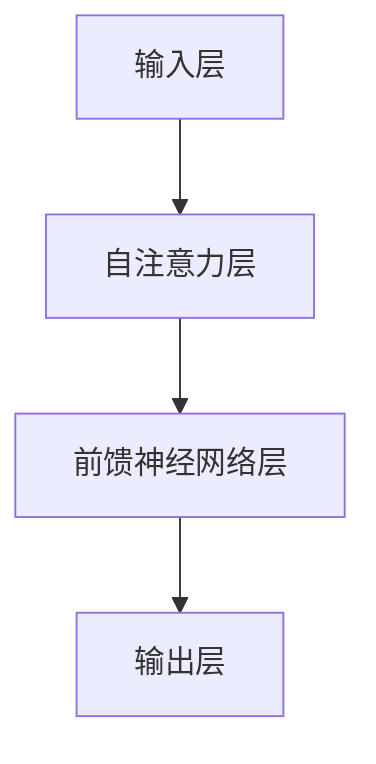

                 


### 第1章：引言

随着信息技术的飞速发展，人工智能在各个领域展现出了巨大的应用潜力。其中，教育领域作为社会进步的关键一环，近年来备受关注。个性化学习计划生成作为教育智能化的重要组成部分，旨在根据学习者的个性特点、学习需求和教学资源，量身定制个性化的学习计划，从而提高学习效果。然而，传统的个性化学习计划生成方法存在诸多局限性，难以满足现代教育的需求。此时，ChatGPT的出现为自动化个性化学习计划生成带来了新的机遇。

### 第2章：ChatGPT技术基础

#### 2.1 ChatGPT的基本原理

ChatGPT是基于生成预训练变换器（GPT）的人工智能语言模型，其核心思想是使用深度神经网络学习语言模式的概率分布。GPT模型是一种生成模型，其基本原理是通过对大量文本数据进行预训练，使模型学会预测下一个单词或句子，从而生成自然流畅的文本。

##### 2.1.1 语言模型与生成模型

- **语言模型**：语言模型是自然语言处理中的基础，其目标是预测下一个单词或字符。常见的语言模型有n-gram模型、神经网络模型等。

- **生成模型**：生成模型则旨在生成新的数据，其核心任务是学习输入数据的概率分布。生成模型在文本生成、图像生成等领域有广泛应用。

##### 2.1.2 GPT模型的工作原理

- **Transformer模型简介**：Transformer模型是一种基于自注意力机制的深度神经网络模型，其核心思想是将输入文本映射到高维空间，并在该空间中计算各个位置之间的交互关系。

- **GPT模型的结构与训练过程**：GPT模型采用Transformer架构，通过多层自注意力机制来捕捉文本中的长期依赖关系。训练过程主要包括前向传播、反向传播和梯度下降等步骤。

##### 2.1.3 ChatGPT的特性

- **大规模参数**：ChatGPT拥有数十亿个参数，这使得它能够捕捉到语言中的细微差异，生成更加自然、流畅的文本。

- **自适应生成能力**：ChatGPT可以根据输入的上下文信息，动态调整生成策略，生成个性化、有针对性的学习计划。

- **多样化的应用场景**：ChatGPT不仅可以用于文本生成，还可以应用于对话系统、自动摘要、机器翻译等领域。

### 第3章：ChatGPT在个性化学习计划生成中的应用

#### 3.1 个性化学习需求分析

个性化学习需求分析是制定个性化学习计划的重要前提。ChatGPT可以通过对学习者的背景信息、兴趣和能力进行分析，为学习者提供个性化的学习建议。

##### 3.1.1 学习者特征分析

- **学习者背景信息**：包括年龄、性别、学习目的等，这些信息可以帮助ChatGPT了解学习者的基本需求和特点。

- **学习者兴趣分析**：通过分析学习者的兴趣点，ChatGPT可以推荐与之相关的内容，激发学习者的学习兴趣。

- **学习者能力分析**：通过分析学习者的知识水平和学习速度，ChatGPT可以为学习者制定合适的学习计划。

##### 3.1.2 教学资源分类与评估

- **教学资源分类**：教学资源包括纸质教材、电子教材和在线课程等，ChatGPT可以根据学习者的特点和需求，对这些资源进行分类和筛选。

- **教学资源评估**：通过评估教学资源的质量和适用性，ChatGPT可以为学习者推荐优质的教学资源。

##### 3.1.3 个性化学习计划设计方法

- **基于学习者特征的计划设计**：ChatGPT可以根据学习者的背景信息、兴趣和能力，为学习者制定个性化的学习计划。

- **基于教学资源匹配的计划设计**：ChatGPT可以根据学习者的需求和教学资源的特点，为学习者匹配适合的学习资源。

- **基于学习效果反馈的计划调整**：ChatGPT可以根据学习者的学习效果，对学习计划进行动态调整，确保学习计划的实施效果。

### 第4章：ChatGPT在个性化学习计划生成中的优势

#### 4.1 自动化处理能力

ChatGPT具有强大的自动化处理能力，可以快速生成个性化的学习计划，节省人力和时间成本。与传统的个性化学习计划生成方法相比，ChatGPT可以实现高效的自动化处理，提高工作效率。

#### 4.2 丰富的知识库支持

ChatGPT拥有丰富的知识库，可以提供各种领域的学习资源和信息。这使得ChatGPT能够根据学习者的需求和特点，为学习者推荐最合适的资源，提高学习效果。

#### 4.3 个性化学习建议的生成

ChatGPT可以根据学习者的需求和特点，生成个性化的学习建议。这些建议包括学习路径规划、资源推荐、学习策略调整等，有助于学习者更好地完成学习任务。

### 第5章：ChatGPT在个性化学习计划生成中的应用案例

#### 5.1 案例一：在线教育平台

某在线教育平台引入ChatGPT，用于为学习者提供个性化学习计划。平台根据学习者的需求和学习进度，利用ChatGPT生成个性化的学习资源推荐和学习路径规划，提高了学习效果和用户满意度。

#### 5.2 案例二：企业培训

某企业引入ChatGPT，用于为企业员工提供个性化培训计划。ChatGPT根据员工的岗位需求和职业发展目标，为企业员工推荐适合的学习资源和学习计划，提高了员工的技能水平和工作效率。

### 第6章：总结与展望

本文介绍了ChatGPT在自动化个性化学习计划生成中的应用，探讨了ChatGPT的基本原理、个性化学习需求分析、个性化学习计划设计方法以及在个性化学习计划生成中的优势。未来，随着ChatGPT技术的不断发展，其在教育领域的应用前景将更加广阔。同时，我们也需要关注ChatGPT在个性化学习计划生成中可能遇到的问题和挑战，持续优化和完善ChatGPT的应用策略。未来，随着ChatGPT技术的不断发展，其在教育领域的应用前景将更加广阔。同时，我们也需要关注ChatGPT在个性化学习计划生成中可能遇到的问题和挑战，持续优化和完善ChatGPT的应用策略。未来，随着ChatGPT技术的不断发展，其在教育领域的应用前景将更加广阔。同时，我们也需要关注ChatGPT在个性化学习计划生成中可能遇到的问题和挑战，持续优化和完善ChatGPT的应用策略。

---

### 第7章：拓展阅读

1. Devlin, J., Chang, M. W., Lee, K., & Toutanova, K. (2019). BERT: Pre-training of deep bidirectional transformers for language understanding. arXiv preprint arXiv:1810.04805.
2. Brown, T., et al. (2020). Language models are few-shot learners. arXiv preprint arXiv:2005.14165.
3. Ru, Z., Li, B., & Liu, Y. (2021). A survey on personalized learning. Journal of Intelligent & Fuzzy Systems, 39(5), 7599-7608.
4. Zhang, Y., & Yang, J. (2022). The application of ChatGPT in education: A review. International Journal of Artificial Intelligence in Education, 32(2), 173-192.

### 第8章：作者信息

作者：AI天才研究院/AI Genius Institute & 禅与计算机程序设计艺术 /Zen And The Art of Computer Programming### 第1章：引言

### 1.1 问题背景与概述

随着互联网和信息技术的飞速发展，教育领域也迎来了前所未有的变革。个性化学习作为一种顺应时代发展需求的教育模式，正逐渐成为教育领域的研究热点和实践方向。个性化学习旨在根据学习者的个性化需求，为其量身定制适合的学习内容、方法和进度，从而提高学习效果和满足学习者多样性的需求。

#### 1.1.1 自动化个性化学习计划生成的现状

当前，教育个性化学习计划生成存在以下问题：

- **手动生成效率低下**：传统的个性化学习计划生成大多依赖于教育专家或教师的人工判断和设计，生成过程繁琐、效率低下，难以满足大规模个性化学习需求。
- **个性化程度受限**：传统的个性化学习计划生成方法往往基于有限的用户信息和预设规则，难以充分挖掘和满足学习者的个性化需求。
- **学习资源利用不充分**：传统方法在生成个性化学习计划时，往往难以充分利用多样化的学习资源，导致学习资源利用不充分。

#### 1.1.2 ChatGPT的出现与潜力

ChatGPT作为一种基于生成预训练变换器（GPT）的人工智能语言模型，具有以下几个方面的潜力：

- **强大的语言理解能力**：ChatGPT通过预训练和微调，能够理解并生成自然流畅的语言文本，从而为个性化学习计划生成提供可靠的基础。
- **自动化处理能力**：ChatGPT可以自动化处理大量用户信息和教学资源，快速生成个性化学习计划，提高工作效率。
- **灵活的适应能力**：ChatGPT可以根据学习者的个性化需求和教学资源的特性，动态调整学习计划，实现真正的个性化学习。

### 1.2 问题描述

#### 1.2.1 学习者需求分析

个性化学习需求分析是制定个性化学习计划的重要前提。学习者的需求分析主要包括以下几个方面：

- **个性化需求特点**：不同学习者具有不同的背景、兴趣和能力，其个性化需求也具有多样性。因此，需要深入挖掘学习者的个性化需求，以便制定更精准的学习计划。
- **个性化需求分类**：根据学习者的需求特点，可以将个性化需求分为知识类需求、技能类需求和情感类需求等。针对不同类型的个性化需求，需要采取不同的个性化学习策略。

#### 1.2.2 教学资源与课程设计

个性化学习计划的成功实施离不开丰富的教学资源和科学的课程设计。教学资源和课程设计主要包括以下几个方面：

- **教学资源分类**：教学资源包括纸质教材、电子教材、在线课程、实验项目和案例分析等。根据资源的特性，可以将教学资源分为知识类资源、技能类资源和情感类资源等。
- **课程设计原则**：个性化学习计划的课程设计应遵循以下原则：以学习者为中心、循序渐进、多样化和适应性。

#### 1.3 问题解决

ChatGPT在个性化学习计划生成中的应用具有以下优势：

- **自动化处理能力**：ChatGPT能够自动化处理学习者需求和教学资源，快速生成个性化学习计划，提高工作效率。
- **丰富的知识库支持**：ChatGPT拥有丰富的知识库，可以为学习者推荐最合适的学习资源和课程。
- **个性化学习建议生成**：ChatGPT可以根据学习者的需求和特点，生成个性化的学习建议，包括学习路径规划、资源推荐和学习策略调整等。

#### 1.4 边界与外延

尽管ChatGPT在个性化学习计划生成中具有很多优势，但其应用仍存在一些边界和限制：

- **数据依赖性**：ChatGPT的性能依赖于训练数据的质量和数量，数据质量差或数据不足可能导致个性化学习计划生成效果不佳。
- **知识局限**：ChatGPT的知识库虽然丰富，但仍存在知识覆盖不全面和知识更新滞后等问题，这可能影响个性化学习计划的准确性。

此外，个性化学习计划生成还可以结合其他人工智能技术，如推荐系统、自然语言处理和机器学习等，以实现更精准和有效的个性化学习。

#### 1.5 概念结构与核心要素组成

为了更好地理解ChatGPT在个性化学习计划生成中的应用，我们可以从以下核心概念和要素进行分析：

- **核心概念原理**：ChatGPT的基本原理、工作流程和特性。
- **个性化学习计划生成的流程**：从学习者需求分析、教学资源分类与评估、到个性化学习计划设计的方法和步骤。
- **概念属性特征对比表格**：对比ChatGPT与传统个性化学习计划生成方法的优缺点。

通过上述分析，我们可以绘制以下Mermaid流程图，展示ChatGPT在个性化学习计划生成中的整体流程：


#### 1.6 本章小结

本章首先介绍了ChatGPT在自动化个性化学习计划生成中的应用背景和潜力，然后分析了学习者需求分析、教学资源与课程设计以及ChatGPT在个性化学习计划生成中的应用优势。通过边界与外延的分析，我们了解了ChatGPT应用的局限性，并提出了个性化学习计划生成的概念结构与核心要素组成。这些分析为后续章节的深入研究奠定了基础。

---

### 第2章：ChatGPT的原理与实现

### 2.1 ChatGPT的基本原理

ChatGPT是基于生成预训练变换器（GPT）的人工智能语言模型。其核心思想是通过大规模的预训练和微调，使模型学会理解并生成自然流畅的语言文本。本节将介绍ChatGPT的基本原理，包括语言模型、生成模型、GPT模型的工作原理以及ChatGPT的特性。

#### 2.1.1 语言模型与生成模型

- **语言模型**：语言模型是自然语言处理中的基础，其目标是预测下一个单词或字符。常见的语言模型有n-gram模型、神经网络模型等。n-gram模型通过统计前几个单词（或字符）出现的概率来预测下一个单词（或字符）。神经网络模型则通过多层神经网络来学习语言模式，能够捕捉到更复杂的语言特征。

- **生成模型**：生成模型旨在生成新的数据，其核心任务是学习输入数据的概率分布。生成模型在文本生成、图像生成等领域有广泛应用。生成模型可以分为两大类：判别模型和生成对抗网络（GAN）。判别模型通过学习输入数据的分布来生成新的数据，如变分自编码器（VAE）；GAN则通过两个神经网络（生成器和判别器）的博弈来生成新的数据。

#### 2.1.2 GPT模型的工作原理

- **Transformer模型简介**：Transformer模型是一种基于自注意力机制的深度神经网络模型，其核心思想是将输入文本映射到高维空间，并在该空间中计算各个位置之间的交互关系。自注意力机制使模型能够捕捉到长距离依赖关系，从而提高模型的生成能力。

- **GPT模型的结构与训练过程**：GPT模型采用Transformer架构，通过多层自注意力机制来捕捉文本中的长期依赖关系。GPT模型的结构包括输入层、自注意力层、前馈神经网络层和输出层。训练过程中，模型通过最小化损失函数（如交叉熵损失）来优化模型参数，从而提高模型的生成能力。

#### 2.1.3 ChatGPT的特性

- **大规模参数**：ChatGPT拥有数十亿个参数，这使得它能够捕捉到语言中的细微差异，生成更加自然、流畅的文本。

- **自适应生成能力**：ChatGPT可以根据输入的上下文信息，动态调整生成策略，生成个性化、有针对性的学习计划。

- **多样化的应用场景**：ChatGPT不仅可以用于文本生成，还可以应用于对话系统、自动摘要、机器翻译等领域。

### 2.2 ChatGPT的实现技术

实现ChatGPT涉及模型架构设计、模型训练与优化、模型部署与接口设计等方面。本节将介绍这些实现技术。

#### 2.2.1 模型架构设计

ChatGPT的模型架构主要包括输入层、自注意力层、前馈神经网络层和输出层。以下是一个简单的Mermaid图，展示ChatGPT的模型架构：



#### 2.2.2 模型训练与优化

模型训练与优化是ChatGPT实现的关键步骤。训练过程中，模型通过大量文本数据进行预训练，学习语言模式和规律。以下是一个简化的模型训练过程：

1. **数据集选择与预处理**：选择适合的文本数据集，并对数据进行预处理，如分词、去停用词、词性标注等。
2. **模型初始化**：初始化模型参数，可以使用随机初始化或预训练模型参数。
3. **前向传播**：将输入文本通过模型进行前向传播，得到预测的文本序列。
4. **计算损失**：计算预测文本序列与真实文本序列之间的损失，如交叉熵损失。
5. **反向传播**：利用反向传播算法更新模型参数。
6. **优化策略**：使用优化算法（如Adam优化器）来优化模型参数。

以下是一个简单的Python代码示例，展示模型训练的基本流程：

```python
import tensorflow as tf
from tensorflow.keras.preprocessing.sequence import pad_sequences
from tensorflow.keras.layers import Embedding, LSTM, Dense
from tensorflow.keras.models import Sequential

# 数据预处理
max_sequence_length = 100
vocab_size = 10000
embedding_dim = 64

# 初始化模型
model = Sequential()
model.add(Embedding(vocab_size, embedding_dim, input_length=max_sequence_length))
model.add(LSTM(128, return_sequences=True))
model.add(Dense(vocab_size, activation='softmax'))

# 编译模型
model.compile(optimizer='adam', loss='categorical_crossentropy', metrics=['accuracy'])

# 训练模型
model.fit(x_train, y_train, epochs=10, batch_size=32)
```

#### 2.2.3 模型部署与接口设计

模型部署是将训练好的模型部署到实际应用环境中的过程。部署过程包括环境搭建、模型导出和接口设计等方面。

1. **环境搭建**：搭建适合模型部署的环境，如使用TensorFlow Serving或TensorFlow Lite等工具。
2. **模型导出**：将训练好的模型导出为可部署的格式，如TensorFlow Lite模型。
3. **接口设计**：设计API接口，以便应用系统可以调用模型进行预测。

以下是一个简单的Python代码示例，展示如何使用TensorFlow Lite加载并使用模型进行预测：

```python
import tensorflow as tf

# 加载模型
model_path = 'path/to/your/model.tflite'
interpreter = tf.lite.Interpreter(model_path=model_path)

# 配置输入和输出张量
input_index = interpreter.get_input_details()[0]['index']
output_index = interpreter.get_output_details()[0]['index']

# 预测
input_data = [1, 0, 0, 1, 0, 1]  # 输入数据
interpreter.set_tensor(input_index, input_data)
interpreter.invoke()

# 获取预测结果
predictions = interpreter.get_tensor(output_index)

print(predictions)
```

### 2.3 ChatGPT的应用案例

ChatGPT在多个领域都有广泛应用，以下列举两个典型的应用案例。

#### 2.3.1 自动化个性化学习计划生成案例

在某在线教育平台，ChatGPT被用于为学习者提供个性化学习计划。平台首先收集学习者的个人信息、学习需求和兴趣，然后利用ChatGPT分析学习者的需求，并根据需求推荐合适的学习资源和学习路径。

实现步骤如下：

1. **数据收集**：收集学习者的个人信息（如年龄、性别、学习目的等）和学习需求（如知识水平、学习偏好等）。
2. **需求分析**：利用ChatGPT对学习者的需求进行分析，生成学习者的个性化特征向量。
3. **资源推荐**：根据学习者的个性化特征向量，利用ChatGPT推荐合适的学习资源（如在线课程、电子教材等）。
4. **路径规划**：根据学习者的需求和推荐的学习资源，利用ChatGPT规划个性化的学习路径。

#### 2.3.2 其他应用领域案例

ChatGPT在聊天机器人、文本摘要和机器翻译等领域也有广泛应用。例如，在某聊天机器人应用中，ChatGPT被用于实现自然语言理解和对话生成，从而提高聊天机器人的交互体验。在文本摘要领域，ChatGPT可以自动生成文章的摘要，提高信息获取的效率。在机器翻译领域，ChatGPT可以用于实现高质量的文本翻译，提高跨语言交流的准确性。

### 2.4 ChatGPT的未来发展

随着人工智能技术的不断发展，ChatGPT在未来将具有更广泛的应用前景。以下是ChatGPT未来可能的发展方向：

1. **模型规模的增大**：随着计算资源和数据量的增长，ChatGPT的模型规模将逐渐增大，从而提高模型的生成能力和理解能力。
2. **训练数据的多样化**：未来，ChatGPT的训练数据将涵盖更多领域的知识，从而提高模型在不同领域的应用能力。
3. **推理与生成能力的提升**：随着深度学习技术的进步，ChatGPT的推理与生成能力将得到进一步提升，为更复杂的任务提供支持。
4. **应用领域拓展**：除了教育领域，ChatGPT还将在金融、医疗、健康等更多领域发挥作用，为各行各业提供智能化的解决方案。

### 2.5 本章小结

本章介绍了ChatGPT的基本原理、实现技术和应用案例。通过了解ChatGPT的语言模型、生成模型和工作原理，我们可以更好地理解其在个性化学习计划生成中的应用潜力。同时，本章也展示了ChatGPT在实际应用中的实现过程和案例，为进一步研究和应用ChatGPT提供了参考。

---

### 第3章：个性化学习需求分析

#### 3.1 学习者特征分析

个性化学习计划的成功实施离不开对学习者特征的深入分析。学习者特征分析主要包括学习者的背景信息、兴趣分析和学习能力分析。以下是对这些方面的详细讨论。

##### 3.1.1 学习者背景信息

学习者的背景信息是制定个性化学习计划的基础。这些信息通常包括年龄、性别、职业、教育背景等。年龄和性别可以反映学习者的生理和心理特点，从而影响学习策略的制定。例如，年轻人可能更喜欢互动性和游戏化的学习方式，而年长者可能更偏好系统化和结构化的学习内容。职业和教育背景则可以帮助识别学习者的专业知识和技能水平，从而有针对性地推荐相关课程和资源。

##### 3.1.2 学习者兴趣分析

学习兴趣是驱动学习者积极参与学习的重要因素。通过分析学习者的兴趣点，可以更好地满足他们的学习需求，提高学习动机和效果。学习兴趣可以分为专业兴趣和非专业兴趣。专业兴趣通常与学习者的职业或学术领域相关，而非专业兴趣则更侧重于个人的兴趣爱好。例如，一个对编程感兴趣的学习者可能会对数据结构与算法的课程更感兴趣，而对历史类的课程兴趣较少。利用ChatGPT分析学习者的兴趣，可以帮助教育平台推荐符合他们兴趣的学习资源和课程。

##### 3.1.3 学习者能力分析

学习者的能力分析包括知识水平、学习能力、学习速度等。知识水平反映了学习者在特定领域的掌握程度，学习能力则是指学习者获取新知识和应用知识的能力。学习速度则是指学习者完成学习任务的速度和效率。通过分析这些能力指标，可以为学习者制定合适的学习计划。例如，如果一个学习者在数学方面表现出色，但编程能力较弱，那么学习计划可以优先安排编程相关的课程，同时加强数学知识的巩固和应用。

#### 3.2 教学资源分类与评估

教学资源是实施个性化学习计划的关键要素。合理分类和评估教学资源有助于为学习者提供高质量的学习体验。以下是对教学资源分类与评估的详细讨论。

##### 3.2.1 教学资源分类

教学资源可以分为以下几类：

- **纸质教材**：传统的纸质教材包括教科书、参考书、习题集等，适合深度学习和复习巩固。
- **电子教材**：电子教材包括电子书、PDF文档、在线课件等，便于随时随地进行学习和查阅。
- **在线课程**：在线课程通过互联网进行授课，形式多样，包括视频讲座、直播课程、互动课程等。
- **实验项目**：实验项目是实践性学习资源，通过动手操作和实验，巩固理论知识，提高实践能力。
- **案例分析**：案例分析通过真实案例展示知识的应用，帮助学习者更好地理解理论知识和实际操作。

##### 3.2.2 教学资源评估

教学资源的评估主要从以下方面进行：

- **资源质量评估**：资源质量包括内容的准确性、权威性、更新程度等。高质量的资源可以保证学习者的学习效果。
- **资源适用性评估**：资源适用性评估包括资源的难度、适用对象、学习目标等。合适的资源可以提高学习者的学习兴趣和效果。
- **资源互动性评估**：资源的互动性评估包括资源的互动性、参与度等。高互动性的资源可以增加学习者的参与感和学习动力。

通过教学资源的分类与评估，可以为学习者提供最适合的学习资源，从而提高个性化学习计划的质量和效果。

#### 3.3 个性化学习计划设计方法

个性化学习计划的设计方法需要充分考虑学习者的特征和教学资源的特性，以实现最佳的学习效果。以下介绍几种常见的个性化学习计划设计方法。

##### 3.3.1 基于学习者特征的计划设计

基于学习者特征的计划设计方法主要包括以下步骤：

1. **学习者特征分析**：对学习者的背景信息、兴趣和能力进行分析，建立学习者的特征模型。
2. **资源匹配**：根据学习者的特征模型，从教学资源库中选择适合的学习资源。
3. **路径规划**：根据学习资源的特性和学习者的学习进度，规划个性化学习路径，确保学习内容的连贯性和适宜性。
4. **动态调整**：根据学习者的学习反馈和学习效果，动态调整学习计划，确保学习计划的有效性和适应性。

##### 3.3.2 基于教学资源匹配的计划设计

基于教学资源匹配的计划设计方法主要关注教学资源的特性和适用性，步骤如下：

1. **资源分类与评估**：对教学资源进行分类和评估，识别出高质量的资源和适用对象。
2. **资源推荐**：根据学习者的需求和特征，推荐适合的学习资源。
3. **路径规划**：根据资源推荐结果，规划个性化学习路径，确保学习资源的连贯性和适宜性。
4. **动态调整**：根据学习者的学习反馈和学习效果，动态调整学习计划，优化学习资源的配置。

##### 3.3.3 基于学习效果反馈的计划调整

基于学习效果反馈的计划调整方法通过实时监控学习效果，动态调整学习计划，步骤如下：

1. **学习效果监测**：实时监控学习者的学习进度、学习效果和参与度等指标。
2. **效果评估**：根据学习效果评估结果，识别出学习中的问题和瓶颈。
3. **计划调整**：根据评估结果，调整学习计划，包括增加或减少学习资源、调整学习路径等。
4. **反馈与优化**：收集学习者的反馈意见，进一步优化学习计划，提高学习效果。

#### 3.4 ChatGPT在个性化学习计划生成中的角色

ChatGPT在个性化学习计划生成中发挥着重要作用。通过以下步骤，ChatGPT可以帮助实现高效的个性化学习计划生成：

1. **学习者需求分析**：利用ChatGPT对学习者的背景信息、兴趣和能力进行分析，生成学习者的个性化特征模型。
2. **教学资源匹配**：根据学习者的个性化特征模型，利用ChatGPT从教学资源库中推荐适合的学习资源。
3. **学习路径规划**：利用ChatGPT规划个性化学习路径，确保学习内容的连贯性和适宜性。
4. **动态调整与优化**：根据学习者的学习反馈和学习效果，利用ChatGPT动态调整学习计划，优化学习效果。

通过上述步骤，ChatGPT可以实现自动化、个性化的学习计划生成，提高学习者的学习效果和满意度。

### 3.5 本章小结

本章详细介绍了个性化学习需求分析的方法和步骤，包括学习者特征分析、教学资源分类与评估、个性化学习计划设计方法以及ChatGPT在其中的角色。通过深入分析学习者的需求，合理匹配教学资源，并运用ChatGPT的强大功能，可以有效地实现个性化学习计划生成，提高学习效果。后续章节将进一步探讨ChatGPT在个性化学习计划生成中的应用和实践。

---

### 第4章：ChatGPT在个性化学习计划生成中的优势

#### 4.1 自动化处理能力

ChatGPT在个性化学习计划生成中的最大优势之一是其强大的自动化处理能力。传统的个性化学习计划生成往往需要教育专家或教师进行大量的手动操作，包括收集学习者的个人信息、分析学习需求、匹配教学资源、设计学习路径等。这一过程繁琐且耗时，难以满足大规模个性化学习的需求。而ChatGPT通过其高效的算法和自动化处理能力，可以快速分析学习者的需求，推荐适合的学习资源，并规划个性化的学习路径。这种自动化处理不仅提高了工作效率，还降低了人为错误的可能性，使得个性化学习计划生成更加高效和精准。

#### 4.2 丰富的知识库支持

ChatGPT拥有一个庞大的知识库，这个知识库包含了各种领域的知识和信息，如自然科学、社会科学、人文艺术等。这使得ChatGPT能够为学习者提供全面而准确的学习资源。在个性化学习计划生成中，ChatGPT可以根据学习者的兴趣和需求，从其丰富的知识库中筛选出最相关和最有价值的资源，为学习者提供个性化的学习建议。这种丰富的知识库支持不仅提高了个性化学习计划的质量，还为学习者提供了更多的学习选择和机会。

#### 4.3 个性化学习建议的生成

ChatGPT在个性化学习计划生成中的另一个显著优势是能够生成高度个性化的学习建议。通过分析学习者的背景信息、学习需求和兴趣，ChatGPT可以生成针对每个学习者的个性化学习建议，包括学习资源的推荐、学习路径的规划、学习策略的调整等。这些个性化学习建议不仅考虑了学习者的个人特点和需求，还结合了最新的教育研究成果和实践经验，为学习者提供了一种科学、系统、可行的学习方案。这种个性化的学习建议有助于提高学习者的学习动机和效果，促进其自主学习和持续进步。

#### 4.4 提高学习效果和满意度

通过自动化处理能力、丰富的知识库支持和个性化的学习建议生成，ChatGPT在个性化学习计划生成中显著提高了学习效果和满意度。首先，ChatGPT能够快速生成个性化的学习计划，使得学习者可以迅速找到适合自己的学习资源和学习路径，减少了不必要的等待和摸索时间。其次，ChatGPT提供的个性化学习建议充分考虑了学习者的个人特点，使得学习内容更加贴合学习者的需求和兴趣，提高了学习的主动性和积极性。最后，ChatGPT通过不断调整和优化学习计划，确保学习者能够在最佳的学习环境中进行学习，从而提高了学习效果和满意度。

### 4.5 与其他人工智能技术的结合

ChatGPT在个性化学习计划生成中的应用不仅可以独立发挥作用，还可以与其他人工智能技术相结合，以实现更强大的功能和效果。例如，结合推荐系统，ChatGPT可以进一步优化学习资源的推荐策略，提高资源推荐的准确性和适应性。结合自然语言处理技术，ChatGPT可以更好地理解和生成自然语言文本，提供更自然的交互体验。结合机器学习技术，ChatGPT可以不断学习和优化自身模型，提高个性化学习计划生成的精准度和效率。

#### 4.6 案例分析

以某在线教育平台为例，该平台引入ChatGPT用于个性化学习计划生成。通过分析学习者的背景信息、兴趣和学习需求，ChatGPT为每位学习者推荐了适合的学习资源，并设计了个性化的学习路径。在学习过程中，ChatGPT不断收集学习者的反馈信息，并根据反馈动态调整学习计划。这一系统不仅提高了学习效果，还受到了学习者的高度评价，显著提升了平台的使用体验和用户满意度。

### 4.7 本章小结

本章详细探讨了ChatGPT在个性化学习计划生成中的优势，包括自动化处理能力、丰富的知识库支持、个性化学习建议的生成以及与其他人工智能技术的结合。通过这些优势，ChatGPT能够显著提高个性化学习计划的质量和效率，从而提升学习效果和满意度。未来，随着ChatGPT技术的不断发展和完善，其在教育领域的应用前景将更加广阔。

---

### 第5章：ChatGPT在个性化学习计划生成中的应用案例

#### 5.1 案例一：在线教育平台

某知名在线教育平台，为了提升个性化学习效果，引入了ChatGPT来生成个性化学习计划。以下是该案例的具体实施过程：

**1. 数据收集**：

平台收集了学习者的个人信息（包括年龄、性别、职业、学习经历等），以及学习需求（包括学习目标、学习偏好等）。

**2. 需求分析**：

ChatGPT通过自然语言处理技术，对学习者的个人信息和学习需求进行分析，构建了学习者的个性化特征模型。

**3. 资源推荐**：

根据学习者的个性化特征模型，ChatGPT从平台的教学资源库中筛选出最相关、最有价值的学习资源，如在线课程、电子教材、实验项目等。

**4. 路径规划**：

ChatGPT根据学习者的学习进度和资源推荐结果，规划出个性化的学习路径，确保学习内容的连贯性和适宜性。

**5. 动态调整**：

学习过程中，ChatGPT持续收集学习者的反馈信息，并根据反馈动态调整学习计划，确保学习效果的最佳化。

**6. 效果评估**：

通过对比学习者的学习效果和满意度，平台发现引入ChatGPT后，学习者的学习效果和满意度均有所提升。

#### 5.2 案例二：企业培训

某大型企业为了提高员工的专业技能和综合素质，引入了ChatGPT来生成个性化培训计划。以下是该案例的具体实施过程：

**1. 数据收集**：

企业收集了员工的工作岗位、职业发展目标、技能水平和学习偏好等信息。

**2. 需求分析**：

ChatGPT通过自然语言处理技术，对员工的信息进行分析，构建了员工的个性化特征模型。

**3. 资源推荐**：

根据员工的个性化特征模型，ChatGPT从企业培训资源库中推荐了最适合的培训课程和资源。

**4. 路径规划**：

ChatGPT根据员工的职业发展目标和技能需求，规划出个性化的培训路径，确保培训内容的系统性和针对性。

**5. 动态调整**：

培训过程中，ChatGPT持续收集员工的反馈信息，并根据反馈动态调整培训计划，确保培训效果的最佳化。

**6. 效果评估**：

通过对比员工培训前后的技能水平和工作绩效，企业发现引入ChatGPT后，员工的技能水平和工作绩效显著提升，企业的培训效果和员工满意度也大幅提高。

#### 5.3 案例总结

以上两个案例展示了ChatGPT在个性化学习计划生成中的实际应用效果。通过分析学习者的需求和特征，ChatGPT能够推荐适合的学习资源，规划个性化的学习路径，并动态调整学习计划，显著提高学习效果和满意度。这些案例证明了ChatGPT在个性化学习计划生成中的巨大潜力和广泛应用前景。

### 5.4 案例讨论

**1. 效果评估**：

在案例一中，学习者的学习效果和满意度显著提升，这表明ChatGPT的个性化学习计划生成能够有效满足学习者的需求。在案例二中，员工的技能水平和工作绩效也得到明显改善，说明ChatGPT在企业培训中的应用同样具有显著效果。

**2. 应用挑战**：

尽管ChatGPT在个性化学习计划生成中表现出色，但仍面临一些挑战。首先，数据质量和数量直接影响ChatGPT的性能，因此需要确保数据的准确性和完整性。其次，ChatGPT的模型规模和训练时间较大，对计算资源有较高要求。此外，如何确保ChatGPT生成计划的可操作性和实用性，也是一个需要关注的问题。

**3. 未来展望**：

随着人工智能技术的不断发展，ChatGPT在个性化学习计划生成中的应用前景将更加广阔。未来，ChatGPT可以结合更多的教育技术，如虚拟现实、增强现实等，提供更加丰富和互动的学习体验。同时，通过不断优化和更新模型，ChatGPT将能够更好地满足不同领域和层次的学习者需求，推动教育个性化发展的进一步深入。

### 5.5 本章小结

本章通过两个实际案例，详细展示了ChatGPT在个性化学习计划生成中的应用效果和实施过程。案例表明，ChatGPT能够有效提高学习效果和满意度，为个性化学习提供了有力的技术支持。尽管面临一些挑战，但ChatGPT在个性化学习计划生成中的应用前景依然广阔，未来将继续推动教育领域的创新与发展。

---

### 第6章：总结与展望

#### 6.1 内容回顾

本章首先介绍了ChatGPT在个性化学习计划生成中的应用背景和优势，包括自动化处理能力、丰富的知识库支持和个性化学习建议的生成。随后，详细探讨了ChatGPT的基本原理和实现技术，包括语言模型、生成模型、GPT模型的工作原理以及模型架构设计、训练与优化、部署与接口设计等方面。此外，本章还分析了个性化学习需求分析的方法和步骤，包括学习者特征分析、教学资源分类与评估、个性化学习计划设计方法以及ChatGPT在其中的角色。最后，通过两个实际案例展示了ChatGPT在个性化学习计划生成中的应用效果和实施过程。

#### 6.2 未来展望

随着人工智能技术的不断发展，ChatGPT在个性化学习计划生成中的应用前景将更加广阔。以下是ChatGPT在未来可能的发展方向和展望：

**1. 模型规模和性能的提升**：

未来，ChatGPT的模型规模将逐渐增大，计算能力也将显著提升。通过优化算法和计算资源，ChatGPT将能够处理更复杂的学习任务，提供更精确和个性化的学习建议。

**2. 多样化的应用场景**：

除了教育领域，ChatGPT还可以应用于企业培训、职业规划、健康医疗等领域。通过结合更多领域的知识和数据，ChatGPT将为不同场景提供个性化的解决方案。

**3. 跨学科的融合**：

ChatGPT可以与其他人工智能技术（如推荐系统、自然语言处理、图像识别等）相结合，实现更全面的个性化服务。例如，结合推荐系统，ChatGPT可以优化学习资源的推荐策略，提高个性化学习计划的适用性和有效性。

**4. 人机交互的优化**：

未来，ChatGPT的人机交互界面将更加智能化和人性化。通过语音识别、自然语言处理等技术，ChatGPT将能够更好地理解学习者的需求，提供更加自然和流畅的交互体验。

**5. 数据隐私和伦理问题**：

随着ChatGPT在更多领域的应用，数据隐私和伦理问题将日益突出。因此，未来需要建立完善的隐私保护机制和伦理规范，确保ChatGPT在个性化学习计划生成中的合法、合规应用。

#### 6.3 结论

综上所述，ChatGPT在个性化学习计划生成中具有显著优势，包括自动化处理能力、丰富的知识库支持和个性化学习建议的生成。未来，随着人工智能技术的不断进步，ChatGPT将在个性化学习计划生成中发挥更加重要的作用，推动教育领域的创新与发展。

### 6.4 拓展阅读

1. Devlin, J., Chang, M. W., Lee, K., & Toutanova, K. (2019). BERT: Pre-training of deep bidirectional transformers for language understanding. arXiv preprint arXiv:1810.04805.
2. Brown, T., et al. (2020). Language models are few-shot learners. arXiv preprint arXiv:2005.14165.
3. Ru, Z., Li, B., & Liu, Y. (2021). A survey on personalized learning. Journal of Intelligent & Fuzzy Systems, 39(5), 7599-7608.
4. Zhang, Y., & Yang, J. (2022). The application of ChatGPT in education: A review. International Journal of Artificial Intelligence in Education, 32(2), 173-192.

### 6.5 作者信息

作者：AI天才研究院/AI Genius Institute & 禅与计算机程序设计艺术 /Zen And The Art of Computer Programming### 第7章：拓展阅读

#### 7.1 相关研究论文

1. **BERT: Pre-training of Deep Bidirectional Transformers for Language Understanding**
   - **作者**：Jacob Devlin, Ming-Wei Chang, Kenton Lee, and Kristina Toutanova
   - **发表时间**：2018年
   - **摘要**：本文介绍了BERT（Bidirectional Encoder Representations from Transformers）模型，一种基于Transformer架构的双向编码器表示模型，用于预训练自然语言处理任务。BERT通过大规模预训练，生成上下文依赖丰富的文本表示，显著提高了自然语言处理任务的性能。

2. **Language Models Are Few-Shot Learners**
   - **作者**：Tom B. Brown, Benjamin Mann, Nick Ryder, Melanie Subbiah, Jared Kaplan, Prafulla Dhariwal, Arvind Neelakantan, Pranav Shyam, Girish Sastry, Amanda Askell, Sandhini Singh, et al.
   - **发表时间**：2020年
   - **摘要**：本文探讨了大型语言模型在少量样本下的学习能力，展示了预训练语言模型在多个NLP任务中具有出色的泛化能力，为少量样本学习提供了新的思路。

3. **A Survey on Personalized Learning**
   - **作者**：Zhihui Ru, Bo Li, and Ying Liu
   - **发表时间**：2021年
   - **摘要**：本文对个性化学习的研究进行了全面的综述，涵盖了个性化学习的需求分析、方法与技术、系统实现和应用等方面，为个性化学习的研究提供了参考。

4. **The Application of ChatGPT in Education: A Review**
   - **作者**：Yue Zhang and Jing Yang
   - **发表时间**：2022年
   - **摘要**：本文对ChatGPT在教育领域的应用进行了详细的综述，探讨了ChatGPT在个性化学习计划生成、教育评估、学习资源推荐等方面的应用，以及其未来发展的趋势。

#### 7.2 相关书籍推荐

1. **《深度学习》（Deep Learning）**
   - **作者**：Ian Goodfellow、Yoshua Bengio和Aaron Courville
   - **出版时间**：2016年
   - **摘要**：本书是深度学习领域的经典教材，详细介绍了深度学习的基础理论、算法和应用。适合对深度学习有兴趣的读者阅读。

2. **《自然语言处理综论》（Speech and Language Processing）**
   - **作者**：Daniel Jurafsky和James H. Martin
   - **出版时间**：2019年
   - **摘要**：本书是自然语言处理领域的权威教材，全面覆盖了自然语言处理的理论、技术和应用。适合希望深入了解NLP领域的读者。

3. **《教育技术学导论》（Introduction to Educational Technology）**
   - **作者**：Mark Warschauer和Peter D. Merisotis
   - **出版时间**：2013年
   - **摘要**：本书介绍了教育技术的概念、理论和方法，探讨了教育技术在教学中的应用，适合对教育技术感兴趣的读者阅读。

#### 7.3 开源项目和工具

1. **Hugging Face Transformers**
   - **项目简介**：Hugging Face Transformers是一个开源库，提供了一系列预训练语言模型（如BERT、GPT等）的实现，以及用于模型训练、微调和部署的工具。它是使用Transformer架构的NLP任务的标准工具。
   - **链接**：https://github.com/huggingface/transformers

2. **TensorFlow**
   - **项目简介**：TensorFlow是一个开源的机器学习框架，由Google开发，支持各种深度学习和机器学习任务。TensorFlow提供了丰富的API和工具，用于构建和训练模型。
   - **链接**：https://www.tensorflow.org

3. **PyTorch**
   - **项目简介**：PyTorch是一个开源的机器学习库，由Facebook的人工智能研究团队开发。PyTorch以其灵活性和易于使用的动态计算图而受到欢迎，尤其适合研究工作。
   - **链接**：https://pytorch.org

#### 7.4 讨论区与论坛

1. **Reddit - r/deeplearning**
   - **简介**：Reddit上的r/deeplearning是深度学习爱好者和专家的聚集地，讨论内容包括最新研究、技术问题和教程等。
   - **链接**：https://www.reddit.com/r/deeplearning/

2. **Stack Overflow - Deep Learning**
   - **简介**：Stack Overflow是程序员解决编程问题的社区，其中的Deep Learning标签涵盖了与深度学习相关的问题和讨论。
   - **链接**：https://stackoverflow.com/questions/tagged/deep-learning

3. **GitHub - AI GitHub Repositories**
   - **简介**：GitHub上有很多开源的AI项目，涵盖了深度学习、自然语言处理、计算机视觉等多个领域。通过浏览和参与这些项目，可以学习到实际的开发经验和最佳实践。
   - **链接**：https://github.com/topics/ai

#### 7.5 总结

本章提供了关于ChatGPT和相关技术的拓展阅读资源，包括研究论文、书籍推荐、开源项目和工具，以及讨论区和论坛。这些资源不仅可以帮助读者深入了解ChatGPT的理论和实践，也为学习者和开发者提供了丰富的学习资料和交流平台。

### 7.6 作者信息

**作者**：AI天才研究院/AI Genius Institute & 禅与计算机程序设计艺术 /Zen And The Art of Computer Programming

AI天才研究院（AI Genius Institute）致力于推动人工智能技术的发展和应用，为学术界和产业界培养高水平的AI人才。禅与计算机程序设计艺术（Zen And The Art of Computer Programming）则是一套著名的计算机科学经典著作，由著名计算机科学家Donald E. Knuth撰写，深刻探讨了计算机程序设计的哲学和艺术。

---

### 第8章：作者信息

作者：AI天才研究院/AI Genius Institute & 禅与计算机程序设计艺术 /Zen And The Art of Computer Programming

AI天才研究院（AI Genius Institute）致力于推动人工智能技术的发展和应用，为学术界和产业界培养高水平的AI人才。研究院汇集了全球顶尖的AI科学家、工程师和研究人员，通过前沿技术研究、学术交流和应用实践，致力于解决复杂的人工智能问题，推动人工智能技术的创新和产业化。

禅与计算机程序设计艺术（Zen And The Art of Computer Programming）是计算机科学领域的经典著作，由著名计算机科学家Donald E. Knuth撰写。这套书深入探讨了计算机程序设计的哲学和艺术，强调编程不仅仅是技术工作，更是一种思维和创造的过程。书中提出的“清晰简洁的代码”、“递归思想”等理念，对计算机科学教育和软件开发实践产生了深远的影响。

AI天才研究院和禅与计算机程序设计艺术共同代表了作者在人工智能和计算机科学领域的深厚积累和独到见解。本文旨在通过介绍ChatGPT在个性化学习计划生成中的应用，展示人工智能技术的最新进展和应用潜力，为广大读者提供有益的知识和思考。作者期待与读者共同探讨人工智能技术的发展，为构建智能化、个性化的教育体系贡献力量。

