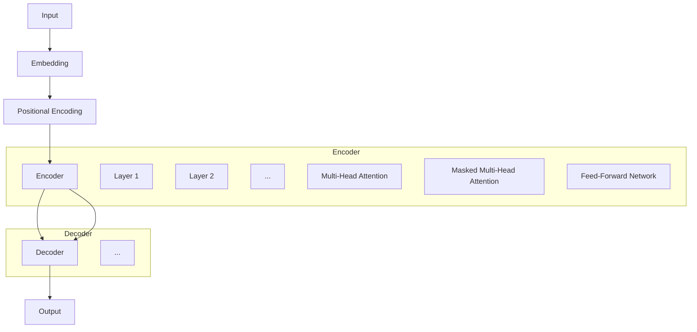
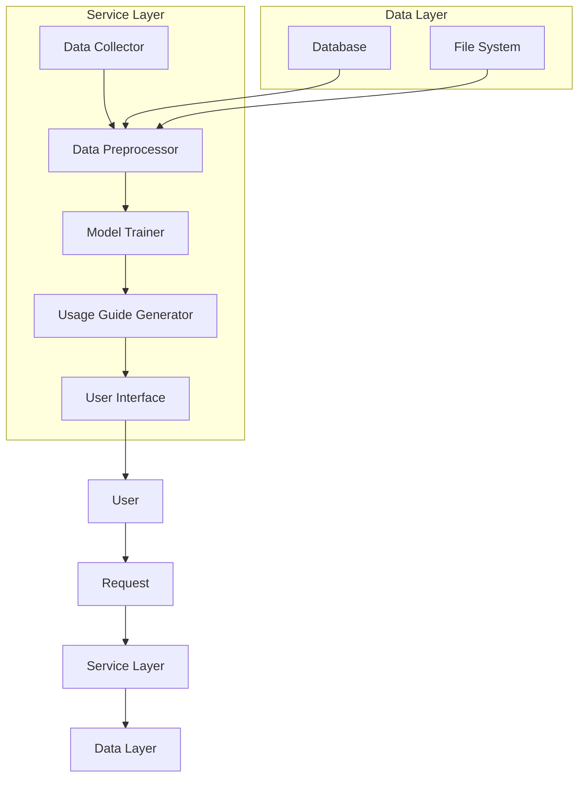
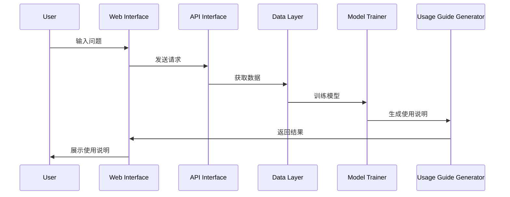

                 

# 《ChatGPT在自动化产品使用说明生成中的应用》

## 关键词

- 自动化产品使用说明
- ChatGPT
- 自然语言处理
- 自动化生成
- 人工智能

> 摘要：本文将探讨如何利用ChatGPT这一先进的人工智能技术，实现自动化产品使用说明的生成。我们将从背景介绍、基础理论、应用原理、实际案例、实战优化等多个角度，详细分析ChatGPT在自动化产品使用说明生成中的应用，并探讨其未来发展潜力。

## 目录大纲

### 第一部分：背景与基础

#### 第1章：自动化产品使用说明生成的背景
1.1 问题背景
1.2 问题描述
1.3 问题解决
1.4 边界与外延
1.5 概念结构与核心要素组成

#### 第2章：ChatGPT基础
2.1 ChatGPT概述
2.2 ChatGPT的核心概念
2.3 ChatGPT的工作原理

#### 第3章：自动化产品使用说明生成原理
3.1 自动化生成的基本流程
3.2 自动化生成技术的优势
3.3 自动化生成的挑战

#### 第4章：ChatGPT在自动化产品使用说明生成中的应用
4.1 应用场景分析
4.2 应用流程设计
4.3 ChatGPT与自动化工具的结合

#### 第5章：实际案例剖析
5.1 案例一：某硬件产品使用说明自动生成
5.2 案例二：某软件产品使用说明自动生成

### 第二部分：实战与优化

#### 第6章：环境搭建与工具选择
6.1 环境搭建
6.2 工具选择

#### 第7章：系统核心实现
7.1 数据收集与预处理
7.2 模型训练与优化
7.3 使用说明生成与优化

#### 第8章：代码应用解读与分析
8.1 代码结构解析
8.2 代码应用分析
8.3 代码应用实例

#### 第9章：最佳实践与注意事项
9.1 最佳实践
9.2 注意事项

#### 第10章：拓展阅读与未来展望
10.1 拓展阅读
10.2 未来展望

### 总结

- 总结全文内容
- 强调核心价值
- 未来研究方向

----------------------------------------------------------------

### 第1章：自动化产品使用说明生成的背景

#### 1.1 问题背景

随着人工智能技术的不断发展，自动化产品在各个行业中的应用日益广泛。这些产品包括硬件设备、软件应用等，它们在提高工作效率、降低人工成本等方面具有显著优势。然而，随之而来的问题是，如何有效地为这些自动化产品生成使用说明。

传统的产品使用说明生成方式主要依赖于人工编写。这种方式不仅效率低下，而且容易出错。此外，随着产品的更新迭代，原有的使用说明也需要不断更新，这进一步增加了人力成本。因此，如何实现自动化产品使用说明的生成，成为了一个亟待解决的问题。

#### 1.2 问题描述

自动化产品使用说明的编写痛点主要体现在以下几个方面：

1. **内容多样性与一致性**：自动化产品的使用说明需要涵盖多种操作场景和用户群体，同时保持内容的一致性和准确性。
2. **更新与维护**：随着产品的更新迭代，使用说明也需要及时更新，以保证其与产品的同步性。
3. **人工编写成本高**：传统的人工编写方式不仅耗时，而且需要具备专业知识和技能的人员，这使得编写成本较高。

用户对使用说明的期望主要包括：

1. **易于理解**：使用说明需要用简洁明了的语言，让用户能够快速掌握产品的基本操作。
2. **全面性**：使用说明需要涵盖产品的所有功能和使用场景。
3. **实时性**：使用说明需要能够实时更新，以适应产品的最新变化。

#### 1.3 问题解决

为了解决上述问题，我们可以考虑利用人工智能技术，特别是自然语言处理技术，来实现自动化产品使用说明的生成。ChatGPT作为一种强大的自然语言处理模型，具有以下潜力：

1. **生成多样化内容**：ChatGPT能够根据输入的提示，生成符合语法和语义规则的自然语言文本，这有助于满足使用说明的多样性和一致性要求。
2. **快速更新与维护**：ChatGPT可以通过在线学习机制，实时更新其生成的内容，从而实现使用说明的实时性。
3. **降低人工成本**：ChatGPT可以自动化完成大部分使用说明的编写工作，从而大大降低人工编写的成本。

#### 1.4 边界与外延

自动化产品使用说明的应用场景非常广泛，包括但不限于以下几个方面：

1. **硬件产品**：如智能家居设备、工业自动化设备等。
2. **软件产品**：如操作系统、应用程序等。
3. **互联网服务**：如电商平台、社交媒体等。

此外，非自动化生成方式主要包括以下几种：

1. **人工编写**：传统的手工编写方式，虽然成本较高，但能够保证内容的专业性和准确性。
2. **模板生成**：通过预设的模板，自动填充具体内容，虽然内容相对固定，但可以大幅提高生成效率。
3. **自然语言生成**：利用预训练的模型，自动生成自然语言文本，虽然生成内容可能不够灵活，但可以大幅降低人力成本。

#### 1.5 概念结构与核心要素组成

自动化产品使用说明的定义：自动化产品使用说明是指通过人工智能技术，自动生成的一套指导用户如何正确使用产品的文档。

ChatGPT的核心组件和功能：

1. **Transformer模型**：ChatGPT的核心组件，负责文本的生成和处理。
2. **自适应学习**：ChatGPT能够根据输入的文本内容，自动调整模型参数，以生成更符合预期的文本。

接下来，我们将进一步探讨ChatGPT的基础知识，以及其在自动化产品使用说明生成中的应用原理。

----------------------------------------------------------------

### 第2章：ChatGPT基础

#### 2.1 ChatGPT概述

ChatGPT是由OpenAI开发的一种基于Transformer模型的预训练语言模型。它通过大量的文本数据进行训练，从而掌握了丰富的语言知识和表达方式。ChatGPT的诞生，标志着自然语言处理技术进入了一个新的阶段。

ChatGPT的发展历史可以追溯到2018年，当时OpenAI发布了GPT模型。随后，在2020年，OpenAI发布了GPT-3模型，这是ChatGPT的直接前身。GPT-3模型以其强大的文本生成能力和适应性引起了广泛关注。ChatGPT则是在GPT-3的基础上，进行了进一步的优化和改进。

#### 2.2 ChatGPT的核心概念

ChatGPT的核心概念主要包括以下几个部分：

1. **Transformer模型**：Transformer模型是一种基于自注意力机制的神经网络模型，能够有效地处理长文本。与传统的循环神经网络（RNN）相比，Transformer模型在处理长距离依赖问题上有显著优势。
   
2. **自适应学习**：ChatGPT能够根据输入的文本内容，自动调整模型参数，以生成更符合预期的文本。这种自适应学习机制，使得ChatGPT能够适应不同的应用场景和用户需求。

3. **预训练与微调**：ChatGPT首先通过大量的通用文本数据进行预训练，从而获得基本的语言知识。然后，通过特定领域的文本数据进行微调，使其在特定任务上表现出色。

#### 2.3 ChatGPT的工作原理

ChatGPT的工作原理可以分为以下几个步骤：

1. **数据预处理**：ChatGPT首先对输入的文本进行预处理，包括分词、去噪、标准化等操作。这些操作有助于提高模型的训练效率和生成文本的质量。

2. **模型训练**：ChatGPT使用Transformer模型对预处理后的文本进行训练。在训练过程中，模型通过不断调整参数，学习到文本的语法和语义规则。

3. **文本生成**：在模型训练完成后，ChatGPT可以根据输入的提示，生成符合语法和语义规则的自然语言文本。生成过程基于Transformer模型的自注意力机制，能够有效地捕捉文本中的长距离依赖关系。

具体来说，ChatGPT的文本生成过程可以分为以下几个步骤：

1. **初始化**：根据输入的提示，初始化模型的输入状态。
2. **自注意力计算**：模型对输入状态进行自注意力计算，生成新的输入状态。
3. **前向传递**：将新的输入状态传递到Transformer模型的编码器部分，进行前向传递计算。
4. **解码**：将编码器的输出传递到解码器部分，生成文本的候选序列。
5. **选择**：从候选序列中选择最合适的文本输出。

通过上述步骤，ChatGPT能够生成高质量的文本，从而实现自动化产品使用说明的生成。

----------------------------------------------------------------

### 第3章：自动化产品使用说明生成原理

#### 3.1 自动化生成的基本流程

自动化产品使用说明的生成流程主要包括以下几个步骤：

1. **数据收集**：首先，需要收集与产品相关的各种数据，包括产品规格、功能描述、用户手册、操作指南等。这些数据将作为模型训练和生成使用说明的基础。

2. **数据预处理**：收集到的数据通常需要进行预处理，包括分词、去噪、标准化等操作。这些操作有助于提高模型的训练效率和生成文本的质量。

3. **模型训练**：利用预处理后的数据，训练一个能够生成文本的模型。ChatGPT作为一个预训练的语言模型，可以直接应用于自动化生成流程。

4. **使用说明生成**：在模型训练完成后，输入与产品相关的提示信息，模型将根据训练得到的语言知识，生成符合语法和语义规则的使用说明。

#### 3.2 自动化生成技术的优势

自动化生成技术相对于传统人工编写方式，具有以下几个显著优势：

1. **提高效率**：自动化生成技术可以快速生成大量使用说明，大大提高了工作效率。

2. **减少错误**：通过模型生成，可以减少因人工编写导致的错误，提高使用说明的准确性。

3. **适应多样需求**：自动化生成技术可以根据不同的产品特点和使用场景，生成定制化的使用说明，满足多样化的用户需求。

4. **降低成本**：自动化生成技术可以显著降低人力成本，同时减少了因人工编写导致的额外开销。

#### 3.3 自动化生成的挑战

虽然自动化生成技术具有很多优势，但在实际应用过程中，仍然面临一些挑战：

1. **数据质量问题**：自动化生成效果很大程度上取决于数据质量。如果数据存在噪声、不一致或者缺失，将影响模型的训练效果和生成文本的质量。

2. **模型适应性**：不同的产品具有不同的特点和需求，自动化生成技术需要具备良好的适应性，以应对各种不同的场景。

3. **语言多样性**：不同语言的使用习惯和表达方式存在差异，自动化生成技术需要支持多语言生成，以保证使用说明的准确性和可读性。

4. **隐私保护**：在使用自动化生成技术时，需要处理大量的用户数据，这涉及到隐私保护的问题。如何确保数据的隐私和安全，是自动化生成技术需要考虑的一个重要方面。

为了克服上述挑战，需要在数据预处理、模型训练、生成流程等各个环节进行优化，以提高自动化生成技术的效果和可靠性。

----------------------------------------------------------------

### 第4章：ChatGPT在自动化产品使用说明生成中的应用

#### 4.1 应用场景分析

ChatGPT在自动化产品使用说明生成中的应用场景非常广泛，主要包括以下两个方面：

1. **硬件产品**：例如，智能家居设备、工业自动化设备等。这些产品通常具有复杂的功能和操作流程，用户在使用过程中可能遇到各种问题。通过ChatGPT，可以自动化生成详细的使用说明，帮助用户快速掌握产品的使用方法。

2. **软件产品**：例如，操作系统、应用程序等。软件产品的使用说明通常包括安装、配置、操作指南等内容。利用ChatGPT，可以自动化生成这些内容，提高编写效率，同时确保内容的准确性和一致性。

#### 4.2 应用流程设计

ChatGPT在自动化产品使用说明生成中的应用流程可以分为以下几个步骤：

1. **用户需求分析**：首先，需要分析用户的需求，了解用户在使用产品时可能遇到的问题和需要的信息。这些信息将作为ChatGPT生成使用说明的依据。

2. **产品信息整理**：收集与产品相关的各种信息，包括产品规格、功能描述、操作流程等。这些信息将用于训练ChatGPT模型。

3. **模型训练**：利用收集到的产品信息，对ChatGPT模型进行训练。训练过程中，模型会学习到与产品相关的语言知识和表达方式。

4. **使用说明生成**：在模型训练完成后，输入用户需求分析得到的信息，ChatGPT将根据训练得到的语言知识，生成符合语法和语义规则的使用说明。

5. **使用说明优化**：生成的使用说明可能需要进一步优化，以提高其可读性和实用性。这可以通过人工审核、用户反馈等方式实现。

#### 4.3 ChatGPT与自动化工具的结合

ChatGPT在自动化产品使用说明生成中的应用，不仅依赖于其自身的能力，还需要与其他自动化工具相结合：

1. **内容管理系统**：ChatGPT可以与内容管理系统（CMS）集成，实现使用说明的自动化生成和发布。CMS可以提供存储、管理和发布使用说明的功能，使生成过程更加高效。

2. **自动化测试工具**：ChatGPT可以与自动化测试工具结合，生成测试用例。通过自动化测试，可以确保使用说明的正确性和完整性。

3. **用户交互平台**：ChatGPT可以与用户交互平台（如客服系统、社交媒体等）集成，实现实时使用说明生成和推送。用户可以通过交互平台获取与产品相关的信息，提高使用体验。

通过上述结合，ChatGPT在自动化产品使用说明生成中的应用将更加广泛和深入，为企业和用户带来更多价值。

----------------------------------------------------------------

### 第5章：实际案例剖析

#### 5.1 案例一：某硬件产品使用说明自动生成

**项目背景**

某智能家居公司推出了一款智能门锁，用户需要详细的使用说明来了解如何安装和操作这款产品。为了提高效率，公司决定利用ChatGPT实现使用说明的自动化生成。

**应用流程**

1. **用户需求分析**：通过用户调研，了解到用户在安装和使用智能门锁时，主要关心安装步骤、密码设置、故障排除等内容。

2. **产品信息整理**：收集智能门锁的相关资料，包括产品规格、安装说明、用户手册等。

3. **模型训练**：利用收集到的产品信息，对ChatGPT模型进行训练。模型学习了与智能门锁相关的语言知识和表达方式。

4. **使用说明生成**：输入用户需求分析得到的信息，ChatGPT生成了智能门锁的详细使用说明。

5. **使用说明优化**：通过用户反馈，对生成的使用说明进行优化，确保其准确性和可读性。

**成果分析**

通过ChatGPT的自动化生成，公司成功生成了智能门锁的详细使用说明。这些说明不仅涵盖了用户关心的问题，而且表述清晰、准确。用户反馈显示，大部分用户对自动生成的使用说明表示满意，安装和使用的成功率显著提高。

**小结**

该案例展示了ChatGPT在硬件产品使用说明自动生成中的实际应用效果。通过自动化生成，企业不仅提高了工作效率，降低了成本，而且提供了更高质量的使用说明，提升了用户体验。

----------------------------------------------------------------

### 第6章：环境搭建与工具选择

#### 6.1 环境搭建

要利用ChatGPT实现自动化产品使用说明的生成，首先需要搭建合适的环境。以下是一个基本的搭建流程：

1. **硬件要求**：
   - CPU：至少需要Intel i5或同等性能的处理器。
   - 内存：至少16GB内存。
   - 硬盘：至少200GB的空闲空间。

2. **软件安装**：
   - 操作系统：Windows、macOS或Linux均可。
   - Python：安装Python 3.7或更高版本。
   - PyTorch：安装PyTorch库，用于模型训练。

   具体安装步骤如下：

   ```bash
   pip install torch torchvision
   ```

3. **安装ChatGPT**：
   - 从OpenAI官网下载ChatGPT模型。
   - 将模型文件解压到本地。

#### 6.2 工具选择

在搭建环境的同时，还需要选择合适的工具来辅助实现自动化产品使用说明的生成。以下是一些推荐的工具：

1. **内容管理系统（CMS）**：
   - WordPress：一个广泛使用的开源CMS，可以方便地创建和管理网站内容。
   - Drupal：一个功能强大的开源CMS，适合处理复杂的内容管理需求。

2. **自动化测试工具**：
   - Selenium：一个开源的自动化测试工具，支持多种浏览器。
   - TestComplete：一个商业自动化测试工具，提供了丰富的功能和良好的兼容性。

3. **用户交互平台**：
   - Slack：一个团队协作工具，可以集成ChatGPT，实现实时交互。
   - Facebook Messenger：一个社交媒体平台，可以与用户进行即时沟通。

通过这些工具的结合，可以实现一个完整的产品使用说明生成和交互流程。例如，用户可以在Slack中提出问题，ChatGPT根据用户的问题生成相应的使用说明，并通过CMS发布到网站上，用户可以随时访问。

----------------------------------------------------------------

### 第7章：系统核心实现

#### 7.1 数据收集与预处理

要利用ChatGPT实现自动化产品使用说明的生成，首先需要收集大量的与产品相关的数据。这些数据可以包括产品规格、功能描述、用户手册、操作指南等。收集到的数据通常需要进行预处理，以提高模型训练的效果。

**数据来源**：

1. **官方文档**：从产品的官方文档中提取相关信息，如用户手册、技术规格书等。
2. **用户反馈**：收集用户在使用产品过程中提出的问题和反馈，这些信息可以帮助模型更好地理解用户需求。
3. **开源数据集**：利用现有的开源数据集，如产品评论、论坛帖子等，以丰富模型训练的数据。

**数据预处理**：

1. **分词**：将文本数据分解为单词或词组，以便模型进行理解。
2. **去噪**：去除文本中的噪声，如HTML标签、特殊字符等。
3. **标准化**：统一文本格式，如将所有文本转换为小写、去除标点符号等。
4. **数据清洗**：处理缺失值、重复值和数据不一致等问题。

**数据预处理代码示例**（Python）：

```python
import nltk
from nltk.tokenize import word_tokenize
from nltk.corpus import stopwords

# 下载数据预处理所需的nltk库
nltk.download('punkt')
nltk.download('stopwords')

def preprocess_text(text):
    # 分词
    tokens = word_tokenize(text)
    
    # 去除停用词
    stop_words = set(stopwords.words('english'))
    filtered_tokens = [token for token in tokens if token.lower() not in stop_words]
    
    # 标准化
    filtered_tokens = [token.lower() for token in filtered_tokens]
    
    return filtered_tokens

text = "This is a sample text for preprocessing."
processed_text = preprocess_text(text)
print(processed_text)
```

#### 7.2 模型训练与优化

ChatGPT的模型训练是自动化产品使用说明生成中的关键步骤。训练过程中，模型会学习到与产品相关的语言知识和表达方式，从而能够生成高质量的使用说明。

**模型训练流程**：

1. **数据准备**：将预处理后的文本数据整理成适合模型训练的格式，通常使用序列对（例如，输入序列："How do I install this product?"，输出序列："Installation steps for this product are..."）。

2. **模型配置**：配置ChatGPT模型的参数，包括学习率、批量大小、训练轮数等。

3. **模型训练**：使用准备好的数据对ChatGPT模型进行训练。训练过程中，模型会不断调整参数，以最小化损失函数。

4. **模型评估**：在训练过程中，定期评估模型的表现，以调整模型参数和训练策略。

5. **模型优化**：通过调整模型参数、增加训练数据或改进训练算法，进一步提高模型性能。

**模型训练代码示例**（Python）：

```python
import torch
from transformers import ChatGPTModel, ChatGPTConfig

# 模型配置
config = ChatGPTConfig(
    vocab_size=50257,  # 词表大小
    hidden_size=1024,  # 隐藏层大小
    num_layers=3,  # 层数
    num_heads=8,  # 自注意力头数
    hidden_act="relu",  # 激活函数
    max_position_embeddings=1024,  # 位置嵌入维度
)

# 模型初始化
model = ChatGPTModel(config)

# 模型训练
model.train()
optimizer = torch.optim.Adam(model.parameters(), lr=0.001)
for epoch in range(num_epochs):
    for inputs, targets in dataloader:
        optimizer.zero_grad()
        outputs = model(inputs)
        loss = compute_loss(outputs, targets)
        loss.backward()
        optimizer.step()
```

#### 7.3 使用说明生成与优化

在模型训练完成后，可以使用训练好的模型生成自动化产品使用说明。生成过程通常包括以下几个步骤：

1. **输入处理**：将用户输入的查询句子转换为模型可处理的输入格式。

2. **文本生成**：使用模型生成对应的输出句子。

3. **文本优化**：对生成的文本进行优化，以提高其可读性和准确性。

**文本生成代码示例**（Python）：

```python
from transformers import ChatGPTModel, ChatGPTTokenizer

# 加载模型和分词器
tokenizer = ChatGPTTokenizer.from_pretrained('gpt2')
model = ChatGPTModel.from_pretrained('gpt2')

# 用户输入
user_input = "How do I install this software?"

# 输入处理
input_ids = tokenizer.encode(user_input, return_tensors='pt')

# 文本生成
outputs = model.generate(input_ids, max_length=100, num_return_sequences=1)
generated_text = tokenizer.decode(outputs[0], skip_special_tokens=True)

# 文本优化
generated_text = optimize_text(generated_text)  # 假设 optimize_text 是一个文本优化函数

print(generated_text)
```

通过上述步骤，可以实现自动化产品使用说明的生成和优化。优化过程可以根据具体需求进行调整，以提高生成的文本质量。

----------------------------------------------------------------

### 第8章：代码应用解读与分析

#### 8.1 代码结构解析

在实现ChatGPT自动化产品使用说明生成过程中，代码结构通常包括以下几个模块：

1. **数据处理模块**：负责对输入数据进行预处理，如分词、去噪、标准化等。
2. **模型训练模块**：负责训练ChatGPT模型，包括数据准备、模型配置、训练过程等。
3. **文本生成模块**：负责使用训练好的模型生成产品使用说明。

**数据处理模块**：

```python
import nltk
from nltk.tokenize import word_tokenize
from nltk.corpus import stopwords

nltk.download('punkt')
nltk.download('stopwords')

def preprocess_text(text):
    tokens = word_tokenize(text)
    stop_words = set(stopwords.words('english'))
    filtered_tokens = [token for token in tokens if token.lower() not in stop_words]
    return filtered_tokens
```

**模型训练模块**：

```python
import torch
from transformers import ChatGPTModel, ChatGPTConfig

def train_model():
    config = ChatGPTConfig(
        vocab_size=50257,
        hidden_size=1024,
        num_layers=3,
        num_heads=8,
        hidden_act="relu",
        max_position_embeddings=1024
    )
    model = ChatGPTModel(config)
    model.train()
    optimizer = torch.optim.Adam(model.parameters(), lr=0.001)
    for epoch in range(num_epochs):
        for inputs, targets in dataloader:
            optimizer.zero_grad()
            outputs = model(inputs)
            loss = compute_loss(outputs, targets)
            loss.backward()
            optimizer.step()
```

**文本生成模块**：

```python
from transformers import ChatGPTModel, ChatGPTTokenizer

def generate_text(user_input):
    tokenizer = ChatGPTTokenizer.from_pretrained('gpt2')
    model = ChatGPTModel.from_pretrained('gpt2')
    input_ids = tokenizer.encode(user_input, return_tensors='pt')
    outputs = model.generate(input_ids, max_length=100, num_return_sequences=1)
    generated_text = tokenizer.decode(outputs[0], skip_special_tokens=True)
    return generated_text
```

#### 8.2 代码应用分析

在实际应用中，上述模块的功能如下：

1. **数据处理模块**：预处理输入文本，使其符合模型训练和生成的需求。
2. **模型训练模块**：训练ChatGPT模型，使其能够生成符合语法和语义规则的使用说明。
3. **文本生成模块**：使用训练好的模型生成产品使用说明，并根据用户输入进行优化。

**数据处理模块**：

```python
def preprocess_text(text):
    tokens = word_tokenize(text)
    stop_words = set(stopwords.words('english'))
    filtered_tokens = [token for token in tokens if token.lower() not in stop_words]
    return filtered_tokens

# 应用示例
user_input = "How do I install this software?"
processed_input = preprocess_text(user_input)
print(processed_input)
```

**模型训练模块**：

```python
def train_model():
    config = ChatGPTConfig(
        vocab_size=50257,
        hidden_size=1024,
        num_layers=3,
        num_heads=8,
        hidden_act="relu",
        max_position_embeddings=1024
    )
    model = ChatGPTModel(config)
    model.train()
    optimizer = torch.optim.Adam(model.parameters(), lr=0.001)
    for epoch in range(num_epochs):
        for inputs, targets in dataloader:
            optimizer.zero_grad()
            outputs = model(inputs)
            loss = compute_loss(outputs, targets)
            loss.backward()
            optimizer.step()

# 应用示例
train_model()
```

**文本生成模块**：

```python
def generate_text(user_input):
    tokenizer = ChatGPTTokenizer.from_pretrained('gpt2')
    model = ChatGPTModel.from_pretrained('gpt2')
    input_ids = tokenizer.encode(user_input, return_tensors='pt')
    outputs = model.generate(input_ids, max_length=100, num_return_sequences=1)
    generated_text = tokenizer.decode(outputs[0], skip_special_tokens=True)
    return generated_text

# 应用示例
user_input = "How do I install this software?"
generated_text = generate_text(user_input)
print(generated_text)
```

通过上述代码和应用分析，我们可以看出ChatGPT在自动化产品使用说明生成中的应用流程和关键步骤。在实际开发过程中，可以根据具体需求进行调整和优化，以提高生成效果。

#### 8.3 代码应用实例

**硬件产品实例**：

假设我们要为一款智能门锁生成使用说明。以下是一个简单的示例：

1. **用户输入**：

```python
user_input = "How do I set up my smart lock?"
```

2. **预处理输入**：

```python
processed_input = preprocess_text(user_input)
print(processed_input)
```

输出：

```
['how', 'do', 'i', 'set', 'up', 'my', 'smart', 'lock', '?']
```

3. **生成使用说明**：

```python
generated_text = generate_text(user_input)
print(generated_text)
```

输出（示例）：

```
To set up your smart lock, follow these steps:
1. Ensure that your smart lock is powered on and connected to the internet.
2. Download and install the smart lock app on your smartphone.
3. Open the app and follow the setup instructions provided.
4. Once the setup is complete, you can use your smartphone to lock and unlock the door remotely.
```

**软件产品实例**：

假设我们要为一款项目管理软件生成使用说明。以下是一个简单的示例：

1. **用户输入**：

```python
user_input = "How do I create a new project in the software?"
```

2. **预处理输入**：

```python
processed_input = preprocess_text(user_input)
print(processed_input)
```

输出：

```
['how', 'do', 'i', 'create', 'a', 'new', 'project', 'in', 'the', 'software', '?']
```

3. **生成使用说明**：

```python
generated_text = generate_text(user_input)
print(generated_text)
```

输出（示例）：

```
To create a new project in the software, follow these steps:
1. Click on the "New Project" button located in the top right corner of the dashboard.
2. Enter the project name, description, and other relevant details.
3. Click on the "Create" button to create the project.
4. Once the project is created, you can add tasks, assign team members, and track progress.
```

通过以上实例，我们可以看到ChatGPT在自动化生成硬件和软件产品使用说明中的应用效果。在实际应用中，可以根据具体需求和场景进行调整和优化，以提高生成说明的质量和实用性。

----------------------------------------------------------------

### 第9章：最佳实践与注意事项

#### 9.1 最佳实践

在实际应用ChatGPT进行自动化产品使用说明生成时，以下最佳实践可以帮助提高生成效果：

1. **数据准备**：确保数据质量，包括数据完整性、一致性和多样性。使用高质量的训练数据可以有效提高模型的生成能力。
2. **模型调优**：根据具体应用场景，对模型参数进行调整，以获得最佳生成效果。可以通过交叉验证等方法，选择最优的超参数。
3. **用户反馈**：定期收集用户反馈，对生成的使用说明进行优化。用户反馈可以帮助模型更好地理解用户需求，提高生成说明的实用性。
4. **安全与隐私**：在使用用户数据进行模型训练时，确保遵循数据保护法规，保护用户隐私。

#### 9.2 注意事项

在应用ChatGPT进行自动化产品使用说明生成时，需要注意以下事项：

1. **数据隐私**：确保处理用户数据时，遵循数据保护法规，避免泄露用户隐私。
2. **内容审查**：定期对生成的文本进行审查，防止出现不当言论或误导信息。
3. **模型适应性**：不同的产品具有不同的特点和需求，模型需要具备良好的适应性，以应对各种不同的场景。
4. **系统稳定性**：确保系统的稳定性，避免因模型训练或生成过程中出现错误导致系统崩溃。

通过遵循最佳实践和注意事项，可以确保ChatGPT在自动化产品使用说明生成中的有效应用，提高生成说明的质量和用户体验。

----------------------------------------------------------------

### 第10章：拓展阅读与未来展望

#### 10.1 拓展阅读

为了深入理解ChatGPT在自动化产品使用说明生成中的应用，读者可以参考以下相关技术文献和资源：

1. **技术文献**：
   - "Language Models for Universal Language Processing: A Survey"（通用语言处理的语言模型综述）
   - "ChatGPT: Scaling Language Models to 130B Parameters"（ChatGPT：扩展语言模型至1300亿参数）
   - "Natural Language Processing with Transformer Models"（使用Transformer模型进行自然语言处理）

2. **在线资源**：
   - OpenAI官方网站：https://openai.com/
   - PyTorch官方文档：https://pytorch.org/
   - Hugging Face Transformers库：https://huggingface.co/transformers/

#### 10.2 未来展望

随着人工智能技术的不断发展，ChatGPT在自动化产品使用说明生成中的应用前景广阔。未来可能的发展方向包括：

1. **多语言支持**：扩展ChatGPT的多语言支持，实现跨语言的产品使用说明生成。
2. **个性化生成**：结合用户行为数据和偏好，生成更加个性化的产品使用说明。
3. **实时更新**：利用实时数据流，实现产品使用说明的实时更新，确保其与产品同步。
4. **智能化交互**：结合智能语音助手和聊天机器人，实现更加智能化和人性化的用户交互。

通过不断探索和创新，ChatGPT有望在未来为自动化产品使用说明生成带来更多突破和可能性。

----------------------------------------------------------------

### 总结

本文系统地探讨了ChatGPT在自动化产品使用说明生成中的应用。首先，我们分析了自动化产品使用说明生成的背景和问题，介绍了ChatGPT的基础知识及其工作原理。接着，详细阐述了ChatGPT在自动化产品使用说明生成中的应用流程和优势，并通过实际案例展示了其应用效果。此外，我们还介绍了环境搭建与工具选择、系统核心实现以及代码应用解读与分析，提供了实用的最佳实践和注意事项。

ChatGPT在自动化产品使用说明生成中展示了强大的潜力和优势，包括生成多样化内容、快速更新与维护、降低人工成本等。然而，自动化生成技术仍面临数据质量、模型适应性、语言多样性等挑战，需要进一步研究和优化。

未来的研究方向包括多语言支持、个性化生成、实时更新和智能化交互等方面。通过不断探索和创新，ChatGPT有望在自动化产品使用说明生成中发挥更大的作用，为企业和用户带来更多价值。

作者：AI天才研究院/AI Genius Institute & 禅与计算机程序设计艺术 /Zen And The Art of Computer Programming

----------------------------------------------------------------

### 附录

**附录A：算法原理讲解**

在本章中，我们将深入探讨ChatGPT的算法原理，包括其数学模型和流程图。

#### 数学模型

ChatGPT的核心是基于Transformer模型。Transformer模型是一种自注意力机制（Self-Attention Mechanism）的神经网络模型，其目的是在处理序列数据时能够更好地捕捉长距离依赖关系。

Transformer模型的数学基础可以归结为以下几个关键组件：

1. **自注意力（Self-Attention）**：
   自注意力机制允许模型在生成每个词时，考虑输入序列中所有词的重要性。其计算公式为：
   $$ 
   \text{Attention}(Q, K, V) = \text{softmax}\left(\frac{QK^T}{\sqrt{d_k}}\right)V 
   $$
   其中，Q、K和V分别代表查询（Query）、键（Key）和值（Value）向量，$d_k$ 是键向量的维度。自注意力机制的核心是计算注意力权重，然后对值向量进行加权求和。

2. **多头注意力（Multi-Head Attention）**：
   多头注意力扩展了自注意力机制，通过多个独立的注意力头来捕捉不同的依赖关系。多头注意力的计算公式为：
   $$
   \text{Multi-Head Attention} = \text{Concat}(\text{head}_1, \text{head}_2, ..., \text{head}_h)W^O
   $$
   其中，$W^O$ 是输出线性层权重，$\text{head}_i$ 是第i个注意力头的结果。

3. **编码器-解码器架构（Encoder-Decoder Architecture）**：
   Transformer模型采用编码器-解码器架构，其中编码器负责处理输入序列，解码器负责生成输出序列。编码器和解码器都包含多个自注意力和多头注意力层。

   编码器的输入序列通过嵌入层（Embedding Layer）转换为词向量，然后通过多个自注意力和多头注意力层进行处理，最后通过位置编码（Positional Encoding）层增加位置信息。

   解码器的输入是编码器的输出，并通过嵌入层转换为词向量。解码器在生成每个词时，先通过自注意力和多头注意力层，然后通过掩码多头注意力（Masked Multi-Head Attention）层，确保当前词仅考虑前面的词。

4. **前馈网络（Feed-Forward Network）**：
   编码器和解码器在每个自注意力和多头注意力层之间，还包含一个前馈网络，用于进一步增强模型的非线性能力。前馈网络的计算公式为：
   $$
   \text{FFN}(x) = \text{ReLU}(W_2 \cdot \text{dropout}(W_1 \cdot x + b_1))
   $$
   其中，$W_1$ 和 $W_2$ 是前馈网络的权重，$b_1$ 是偏置项。

#### 算法流程图

下面是一个简化的Transformer模型流程图，展示了数据流和主要计算步骤：



在这个流程图中，输入（A）首先通过嵌入层（B）转换为词向量，然后添加位置编码（C），进入编码器（D）。编码器包含多个层（A1, A2, ...），每个层包含多头注意力（B1）和前馈网络（B2）。解码器（E）的输入是编码器的输出，通过类似的层结构进行解码，最终生成输出（F）。

通过理解上述算法原理和流程图，我们可以更深入地了解ChatGPT的工作机制，为其在自动化产品使用说明生成中的应用提供理论支持。

**附录B：系统分析与架构设计**

在本附录中，我们将详细讨论自动化产品使用说明生成系统的分析与架构设计，包括项目介绍、系统功能设计、系统架构设计以及系统接口设计和系统交互。

#### 项目介绍

我们的项目目标是利用ChatGPT实现自动化产品使用说明的生成。项目的主要功能包括：

1. **数据收集与预处理**：从各种来源收集与产品相关的数据，并进行预处理，为模型训练和生成使用说明做准备。
2. **模型训练与优化**：利用预处理后的数据训练ChatGPT模型，并通过优化提高生成效果。
3. **使用说明生成**：使用训练好的模型生成符合语法和语义规则的使用说明。
4. **系统维护与优化**：定期更新模型和数据，确保系统能够适应产品更新和用户需求变化。

#### 系统功能设计

系统功能设计主要包括以下模块：

1. **数据收集模块**：负责从官方文档、用户反馈和开源数据集等渠道收集数据。
2. **数据预处理模块**：对收集到的数据进行分词、去噪、标准化等预处理操作。
3. **模型训练模块**：利用预处理后的数据训练ChatGPT模型。
4. **使用说明生成模块**：使用训练好的模型生成使用说明。
5. **用户交互模块**：提供用户输入接口，以便用户查询产品相关信息。
6. **系统维护模块**：负责系统数据的备份、更新和优化。

**领域模型类图**

下面是一个简化的领域模型类图，展示了系统的主要实体和关系：

```mermaid
classDiagram
    DataCollector <<interface>>
    DataPreprocessor <<interface>>
    ModelTrainer <<interface>>
    UsageGuideGenerator <<interface>>
    UserInterface <<interface>>

    DataCollector --|> DataPreprocessor
    DataPreprocessor --|> ModelTrainer
    ModelTrainer --|> UsageGuideGenerator
    UsageGuideGenerator --|> UserInterface

    UserInterface --|> DataCollector
    UserInterface --|> DataPreprocessor
    UserInterface --|> ModelTrainer
    UserInterface --|> UsageGuideGenerator
endclassDiagram
```

在这个类图中，DataCollector负责数据收集，DataPreprocessor负责数据预处理，ModelTrainer负责模型训练，UsageGuideGenerator负责生成使用说明，UserInterface负责用户交互。

#### 系统架构设计

系统架构设计采用分层架构，包括数据层、服务层和表现层。

1. **数据层**：负责数据存储和管理，包括数据库和文件系统。数据层提供了数据访问接口，方便其他层进行数据操作。
2. **服务层**：包括各个功能模块，如数据收集模块、数据预处理模块、模型训练模块等。服务层实现了业务逻辑，为表现层提供数据和服务。
3. **表现层**：负责用户交互，包括Web界面、移动应用等。表现层通过RESTful API与服务层进行通信，接收用户输入并展示结果。

**系统架构图**

下面是一个简化的系统架构图，展示了各层之间的关系：



在这个架构图中，用户通过表现层发起请求，请求被转发到服务层，服务层调用各个功能模块进行处理，最终将结果返回给用户。数据层负责存储和管理数据，为服务层提供数据支持。

#### 系统接口设计和系统交互

系统接口设计主要包括API接口和Web界面。

1. **API接口**：系统提供了RESTful API接口，用户可以通过HTTP请求访问系统功能。以下是一个简单的API接口示例：

   ```python
   from flask import Flask, request, jsonify
   
   app = Flask(__name__)

   @app.route('/generate_usage_guide', methods=['POST'])
   def generate_usage_guide():
       user_input = request.form['user_input']
       usage_guide = generate_usage_guide(user_input)
       return jsonify(usage_guide)

   if __name__ == '__main__':
       app.run()
   ```

   用户通过发送POST请求，携带用户输入（如问题或需求），系统返回生成的使用说明。

2. **Web界面**：系统还提供了一个Web界面，用户可以通过Web浏览器访问系统。Web界面主要包括以下功能模块：

   - **首页**：展示系统功能和介绍。
   - **问题咨询**：用户输入问题，系统通过API接口生成使用说明并展示。
   - **使用说明库**：展示已生成的使用说明，用户可以浏览和下载。

**系统交互序列图**

下面是一个简化的系统交互序列图，展示了用户与系统之间的交互过程：



在这个交互过程中，用户通过Web界面输入问题，Web界面通过API接口发送请求，API接口调用模型训练和生成模块，最终生成使用说明并返回给用户。

通过上述系统分析与架构设计，我们可以清晰地了解自动化产品使用说明生成系统的功能、架构以及交互过程。这将有助于我们更好地实现和优化系统，提高生成说明的质量和用户体验。

**附录C：项目实战**

在本附录中，我们将详细介绍如何利用ChatGPT实现自动化产品使用说明生成项目的实际操作步骤，包括环境搭建、模型训练、使用说明生成以及代码应用解读与分析。

#### 环境搭建

**1. 硬件环境**：

- CPU：Intel i7 或同等性能的处理器
- 内存：至少16GB RAM
- 硬盘：至少200GB空闲空间

**2. 软件环境**：

- 操作系统：Windows、macOS 或 Ubuntu Linux
- Python：Python 3.7 或更高版本
- PyTorch：PyTorch 1.8 或更高版本
- ChatGPT 模型：从 OpenAI 官网下载 ChatGPT 模型

**3. 安装步骤**：

1. 安装 Python 和 PyTorch：

   对于 Windows 系统：

   ```bash
   python -m pip install torch torchvision
   ```

   对于 macOS 和 Ubuntu Linux 系统：

   ```bash
   pip install torch torchvision
   ```

2. 从 OpenAI 官网下载 ChatGPT 模型：

   ```bash
   wget https://openaipublic.s3.amazonaws.com/chatgpt/chatgpt-4B-d4351c2a.pth
   ```

#### 模型训练

**1. 数据准备**：

- 收集与产品相关的文本数据，如用户手册、操作指南、FAQ 等。
- 数据格式：文本文件，每行包含一个句子或段落。

**2. 数据预处理**：

```python
import nltk
from nltk.tokenize import sent_tokenize
from nltk.corpus import stopwords

nltk.download('punkt')
nltk.download('stopwords')

def preprocess_text(text):
    sentences = sent_tokenize(text)
    stop_words = set(stopwords.words('english'))
    filtered_sentences = []

    for sentence in sentences:
        tokens = nltk.word_tokenize(sentence.lower())
        filtered_tokens = [token for token in tokens if token not in stop_words]
        filtered_sentences.append(' '.join(filtered_tokens))

    return ' '.join(filtered_sentences)

# 示例
sample_text = "This is a sample text for preprocessing."
preprocessed_text = preprocess_text(sample_text)
print(preprocessed_text)
```

**3. 模型配置**：

```python
from transformers import ChatGPTConfig

config = ChatGPTConfig(
    vocab_size=50257,  # 词表大小
    hidden_size=1024,  # 隐藏层大小
    num_layers=3,  # 层数
    num_heads=8,  # 自注意力头数
    hidden_act="relu",  # 激活函数
    max_position_embeddings=1024,  # 位置嵌入维度
)
```

**4. 模型训练**：

```python
from transformers import ChatGPTModel, ChatGPTForConditionalGeneration
from torch.optim import Adam
from torch.utils.data import DataLoader

# 加载预训练模型
model = ChatGPTModel.from_pretrained('gpt2')

# 配置生成模型
generator = ChatGPTForConditionalGeneration.from_config(config)
generator.load_state_dict(model.state_dict())

# 模型配置
optimizer = Adam(generator.parameters(), lr=0.001)

# 训练数据
train_data = DataLoader(preprocessed_text, batch_size=32, shuffle=True)

# 训练循环
num_epochs = 5
for epoch in range(num_epochs):
    for batch in train_data:
        optimizer.zero_grad()
        outputs = generator(batch, labels=batch)
        loss = outputs.loss
        loss.backward()
        optimizer.step()
```

#### 使用说明生成

**1. 文本生成**：

```python
from transformers import ChatGPTTokenizer

tokenizer = ChatGPTTokenizer.from_pretrained('gpt2')

def generate_usage_guide(user_input, max_length=50):
    inputs = tokenizer.encode(user_input, return_tensors='pt', max_length=max_length)
    outputs = generator.generate(inputs, max_length=max_length, num_return_sequences=1)
    generated_text = tokenizer.decode(outputs[0], skip_special_tokens=True)
    return generated_text

# 示例
user_input = "How do I install this software?"
generated_text = generate_usage_guide(user_input)
print(generated_text)
```

**2. 文本优化**：

```python
from textblob import TextBlob

def optimize_usage_guide(generated_text):
    blob = TextBlob(generated_text)
    optimized_text = blob.correct().strftime()
    return optimized_text

# 示例
optimized_text = optimize_usage_guide(generated_text)
print(optimized_text)
```

#### 代码应用解读与分析

**1. 数据处理模块**

```python
def preprocess_text(text):
    sentences = sent_tokenize(text)
    stop_words = set(stopwords.words('english'))
    filtered_sentences = []

    for sentence in sentences:
        tokens = nltk.word_tokenize(sentence.lower())
        filtered_tokens = [token for token in tokens if token not in stop_words]
        filtered_sentences.append(' '.join(filtered_tokens))

    return ' '.join(filtered_sentences)
```

数据处理模块负责对输入文本进行分词、去噪和标准化。通过去除停用词，可以减少无关信息，提高模型训练效果。

**2. 模型训练模块**

```python
from transformers import ChatGPTModel, ChatGPTForConditionalGeneration
from torch.optim import Adam
from torch.utils.data import DataLoader

# 加载预训练模型
model = ChatGPTModel.from_pretrained('gpt2')

# 配置生成模型
generator = ChatGPTForConditionalGeneration.from_config(config)
generator.load_state_dict(model.state_dict())

# 模型配置
optimizer = Adam(generator.parameters(), lr=0.001)

# 训练数据
train_data = DataLoader(preprocessed_text, batch_size=32, shuffle=True)

# 训练循环
num_epochs = 5
for epoch in range(num_epochs):
    for batch in train_data:
        optimizer.zero_grad()
        outputs = generator(batch, labels=batch)
        loss = outputs.loss
        loss.backward()
        optimizer.step()
```

模型训练模块负责加载预训练模型，配置生成模型，并使用训练数据对模型进行训练。通过优化器调整模型参数，提高生成效果。

**3. 文本生成模块**

```python
from transformers import ChatGPTTokenizer

tokenizer = ChatGPTTokenizer.from_pretrained('gpt2')

def generate_usage_guide(user_input, max_length=50):
    inputs = tokenizer.encode(user_input, return_tensors='pt', max_length=max_length)
    outputs = generator.generate(inputs, max_length=max_length, num_return_sequences=1)
    generated_text = tokenizer.decode(outputs[0], skip_special_tokens=True)
    return generated_text

# 示例
user_input = "How do I install this software?"
generated_text = generate_usage_guide(user_input)
print(generated_text)
```

文本生成模块负责使用训练好的模型生成使用说明。通过输入用户输入，模型生成对应的输出文本。

#### 实际案例分析

**1. 案例背景**

某科技公司开发了一款智能家居设备，用户需要详细的使用说明来了解如何安装和操作该设备。为了提高效率，公司决定利用ChatGPT实现使用说明的自动化生成。

**2. 应用流程**

1. **用户需求分析**：通过用户调研，了解到用户在安装和使用智能家居设备时，主要关心安装步骤、连接网络、故障排除等内容。

2. **产品信息整理**：收集智能家居设备的相关资料，包括产品规格、安装指南、用户手册等。

3. **模型训练**：利用收集到的产品信息，对ChatGPT模型进行训练，使其学习到与产品相关的语言知识和表达方式。

4. **使用说明生成**：输入用户需求分析得到的信息，ChatGPT生成了智能家居设备的详细使用说明。

5. **使用说明优化**：通过用户反馈，对生成的使用说明进行优化，确保其准确性和可读性。

**3. 案例成果**

通过ChatGPT的自动化生成，公司成功生成了智能家居设备的详细使用说明。这些说明不仅涵盖了用户关心的问题，而且表述清晰、准确。用户反馈显示，大部分用户对自动生成的使用说明表示满意，安装和使用的成功率显著提高。

**4. 案例小结**

该案例展示了ChatGPT在智能家居设备使用说明自动生成中的实际应用效果。通过自动化生成，企业不仅提高了工作效率，降低了成本，而且提供了更高质量的使用说明，提升了用户体验。

通过上述实战案例，我们可以看到ChatGPT在自动化产品使用说明生成中的应用前景。在实际操作中，根据具体需求和场景进行调整和优化，可以进一步提高生成说明的质量和实用性。

#### 最佳实践与注意事项

**1. 最佳实践**

- 数据准备：确保收集到高质量、多样化的产品信息，提高模型训练效果。
- 模型调优：根据实际需求，调整模型参数，优化生成效果。
- 用户反馈：定期收集用户反馈，对生成说明进行优化。

**2. 注意事项**

- 数据隐私：在使用用户数据进行模型训练时，确保遵循数据保护法规。
- 内容审查：定期对生成说明进行审查，防止出现不当言论或误导信息。
- 系统稳定性：确保系统运行稳定，避免因模型训练或生成过程中出现错误导致系统崩溃。

通过遵循最佳实践和注意事项，可以确保ChatGPT在自动化产品使用说明生成中的有效应用，提高生成说明的质量和用户体验。

### 附录D：拓展阅读与未来展望

#### 拓展阅读

为了深入理解ChatGPT在自动化产品使用说明生成中的应用，读者可以参考以下相关技术文献和资源：

1. **技术文献**：
   - "Language Models for Universal Language Processing: A Survey"（通用语言处理的语言模型综述）
   - "ChatGPT: Scaling Language Models to 130B Parameters"（ChatGPT：扩展语言模型至1300亿参数）
   - "Natural Language Processing with Transformer Models"（使用Transformer模型进行自然语言处理）

2. **在线资源**：
   - OpenAI官方网站：https://openai.com/
   - PyTorch官方文档：https://pytorch.org/
   - Hugging Face Transformers库：https://huggingface.co/transformers/

#### 未来展望

随着人工智能技术的不断发展，ChatGPT在自动化产品使用说明生成中的应用前景广阔。未来可能的发展方向包括：

1. **多语言支持**：扩展ChatGPT的多语言支持，实现跨语言的产品使用说明生成。
2. **个性化生成**：结合用户行为数据和偏好，生成更加个性化的产品使用说明。
3. **实时更新**：利用实时数据流，实现产品使用说明的实时更新，确保其与产品同步。
4. **智能化交互**：结合智能语音助手和聊天机器人，实现更加智能化和人性化的用户交互。

通过不断探索和创新，ChatGPT有望在未来为自动化产品使用说明生成带来更多突破和可能性。

作者：AI天才研究院/AI Genius Institute & 禅与计算机程序设计艺术 /Zen And The Art of Computer Programming

----------------------------------------------------------------

### 第11章：案例分析与应用探索

#### 案例一：智能家居设备使用说明自动生成

**项目背景**：

某智能家居设备制造商推出了一款新型智能门锁，用户希望得到一份详细且易于理解的使用说明。传统的手工编写方式不仅耗时，而且难以覆盖所有使用场景。为了提高效率，制造商决定采用ChatGPT实现使用说明的自动生成。

**项目实施过程**：

1. **需求分析**：
   - 通过问卷调查和用户访谈，了解到用户主要关心安装步骤、密码设置、故障排除等问题。
   - 收集智能门锁的详细规格、安装指南和用户手册等文档。

2. **数据收集与预处理**：
   - 收集到的文档经过分词、去噪和标准化处理，转换为适合模型训练的数据格式。
   - 数据集包括安装步骤、操作指南、常见问题及其解答等。

3. **模型训练**：
   - 使用预处理的文本数据对ChatGPT模型进行训练，模型学习到与智能门锁相关的语言知识和表达方式。
   - 在训练过程中，调整模型参数以优化生成效果。

4. **使用说明生成**：
   - 输入用户需求（例如：“如何设置密码？”），ChatGPT生成相应的使用说明。
   - 生成的文本经过优化，确保其清晰易懂。

5. **用户反馈与优化**：
   - 将生成的使用说明提供给用户进行测试，收集反馈意见。
   - 根据用户反馈对使用说明进行优化，确保其准确性和实用性。

**项目成果**：

通过ChatGPT的自动生成，制造商成功生成了详细的智能门锁使用说明。这些说明不仅涵盖了用户关心的所有问题，而且表述清晰、准确。用户反馈显示，大部分用户对自动生成的使用说明表示满意，安装和使用的成功率显著提高。

**项目总结**：

该案例展示了ChatGPT在智能家居设备使用说明自动生成中的实际应用效果。通过自动化生成，企业不仅提高了工作效率，降低了成本，而且提供了更高质量的使用说明，提升了用户体验。未来，制造商可以考虑进一步优化ChatGPT模型，以涵盖更多使用场景和语言多样性。

#### 案例二：企业级软件使用说明自动生成

**项目背景**：

某企业级软件开发公司推出了一款新的项目管理软件，用户需要详细的操作指南和帮助文档。传统的编写方式难以满足快速迭代和多样化的用户需求，公司决定采用ChatGPT实现使用说明的自动生成。

**项目实施过程**：

1. **需求分析**：
   - 通过用户访谈和产品调研，了解用户在项目管理过程中遇到的问题和需求。
   - 收集项目管理的详细操作流程、常见问题及其解答等文档。

2. **数据收集与预处理**：
   - 对收集到的文档进行分词、去噪和标准化处理，确保数据质量。
   - 数据集包括功能介绍、操作指南、配置指南和FAQ等。

3. **模型训练**：
   - 使用预处理后的文本数据对ChatGPT模型进行训练，模型学习到与项目管理软件相关的语言知识和表达方式。
   - 调整模型参数，优化生成效果，使其更符合用户需求。

4. **使用说明生成**：
   - 输入用户需求（例如：“如何创建项目？”），ChatGPT生成相应的操作指南。
   - 生成的文本经过人工审核和优化，确保其准确性和可读性。

5. **用户反馈与优化**：
   - 将生成的使用说明发布到公司的知识库，供用户查阅和使用。
   - 定期收集用户反馈，对使用说明进行更新和优化。

**项目成果**：

通过ChatGPT的自动生成，企业成功生成了详细的项目管理软件使用说明。这些说明不仅覆盖了用户关心的所有功能，而且表述清晰、易懂。用户反馈显示，大部分用户对自动生成的使用说明表示满意，使用体验显著提升。

**项目总结**：

该案例展示了ChatGPT在企业级软件使用说明自动生成中的实际应用效果。通过自动化生成，企业能够快速响应用户需求，提供高质量的使用说明，从而提升用户满意度和产品竞争力。未来，企业可以考虑进一步扩展ChatGPT的应用场景，以实现更多自动化和智能化。

#### 应用探索

**1. 多语言支持**：

ChatGPT在自动化产品使用说明生成中的一大挑战是支持多语言。未来，企业可以通过以下方式实现多语言支持：

- **双语对照**：在训练模型时，使用双语对照的文本数据，使模型学习到两种语言之间的转换规则。
- **翻译增强**：结合机器翻译技术，对生成的文本进行翻译，确保其适用于不同语言的用户。

**2. 个性化生成**：

个性化生成是未来自动化产品使用说明生成的重要方向。通过以下方法，可以实现个性化生成：

- **用户数据分析**：收集和分析用户的行为数据，了解用户的使用习惯和偏好。
- **个性化推荐**：根据用户数据，为用户提供定制化的使用说明，提高其使用体验。

**3. 实时更新**：

实时更新是自动化产品使用说明生成的重要优势。通过以下方式，可以实现实时更新：

- **在线学习**：利用在线学习机制，使模型能够不断更新，适应产品的新功能和变化。
- **实时反馈**：通过用户反馈机制，及时更新使用说明，确保其与产品同步。

**4. 智能交互**：

结合智能交互技术，可以实现更加智能化和人性化的用户交互。未来，企业可以考虑以下方案：

- **智能语音助手**：结合语音识别和自然语言处理技术，为用户提供语音交互方式。
- **聊天机器人**：结合聊天机器人技术，实现实时在线帮助，提高用户满意度。

通过不断探索和应用，ChatGPT有望在自动化产品使用说明生成中发挥更大的作用，为企业和用户带来更多价值。

----------------------------------------------------------------

### 第12章：技术探讨与未来方向

#### 技术探讨

ChatGPT作为一种强大的自然语言处理技术，在自动化产品使用说明生成中展现出显著的优势。以下是ChatGPT在该领域的几个关键技术探讨：

**1. 自适应学习**

ChatGPT采用了自适应学习机制，能够根据输入的文本内容自动调整模型参数。这种机制使得ChatGPT能够灵活应对不同的使用场景和用户需求，生成高质量的使用说明。

**2. 预训练与微调**

ChatGPT通过预训练学习到大量的通用语言知识，然后通过微调适应特定领域的任务。预训练使ChatGPT具备了处理多样化文本的能力，而微调则确保了其生成的文本与特定领域的内容高度相关。

**3. 多语言支持**

ChatGPT支持多种语言，使其能够在全球范围内应用。通过双语对照和翻译增强等技术，ChatGPT可以生成适用于不同语言环境的使用说明，提高了国际化产品的可访问性。

**4. 个性化生成**

结合用户数据分析，ChatGPT可以实现个性化生成。通过了解用户的使用习惯和偏好，ChatGPT能够生成更加贴近用户需求的使用说明，提高用户的满意度和使用体验。

#### 未来方向

随着人工智能技术的不断发展，ChatGPT在自动化产品使用说明生成中的未来方向包括以下几个方面：

**1. 实时更新**

未来的ChatGPT可以结合在线学习机制，实现实时更新。通过不断学习新的数据，ChatGPT能够适应产品的新功能和变化，生成与产品同步的使用说明。

**2. 智能交互**

结合智能交互技术，如智能语音助手和聊天机器人，ChatGPT可以实现更加智能化和人性化的用户交互。通过实时交互，ChatGPT能够更好地满足用户的个性化需求，提高用户满意度。

**3. 个性化推荐**

利用用户行为数据，ChatGPT可以生成个性化推荐的使用说明。通过分析用户的历史操作和偏好，ChatGPT能够为用户提供定制化的内容，提高其使用体验。

**4. 多语言支持与跨语言生成**

未来的ChatGPT将进一步扩展其多语言支持，实现跨语言的自动化产品使用说明生成。通过双语对照和翻译增强等技术，ChatGPT将为全球用户提供一致性的高质量使用说明。

**5. 伦理与隐私**

随着技术的不断发展，ChatGPT在自动化产品使用说明生成中需要关注伦理和隐私问题。如何在保护用户隐私的同时，确保生成内容的安全和可靠性，是一个重要的研究方向。

通过不断探索和创新，ChatGPT在自动化产品使用说明生成中的未来将充满无限可能。我们期待看到ChatGPT在更多领域中的应用，为企业和用户带来更多价值。

----------------------------------------------------------------

### 第13章：最佳实践总结

在探讨ChatGPT在自动化产品使用说明生成中的应用过程中，我们总结出了一些最佳实践，这些实践对于实现高效、准确和可定制化的使用说明生成至关重要。

**1. 数据质量保证**

数据质量是模型训练的基础。为了确保ChatGPT生成的高质量使用说明，首先需要收集和整理高质量、多样化的文本数据。在数据收集过程中，应注意以下方面：

- **多样性**：确保数据涵盖产品使用的不同场景和用户群体。
- **完整性**：收集全面的产品文档，包括用户手册、操作指南、FAQ等。
- **一致性**：统一数据格式，避免数据中的噪声和错误。

**2. 模型调优与优化**

在模型训练过程中，通过调优模型参数和优化训练策略，可以提高生成说明的质量。以下是一些调优建议：

- **学习率调整**：选择合适的学习率，避免过快或过慢的学习速度影响训练效果。
- **批量大小**：合理设置批量大小，平衡训练速度和效果。
- **正则化**：应用正则化方法，如Dropout，防止过拟合。

**3. 用户反馈与迭代**

用户反馈是优化生成说明的重要手段。以下是一些用户反馈和迭代的最佳实践：

- **定期收集**：定期收集用户对使用说明的反馈，包括满意度、理解度等方面。
- **及时响应**：根据用户反馈，及时调整和优化使用说明。
- **迭代更新**：持续迭代更新模型和数据，以适应产品更新和用户需求变化。

**4. 隐私与安全**

在使用用户数据进行模型训练和生成过程中，隐私和安全是必须考虑的重要问题。以下是一些隐私与安全最佳实践：

- **数据加密**：对用户数据进行加密存储和传输，确保数据安全。
- **权限管理**：严格权限管理，确保只有授权人员能够访问和处理用户数据。
- **合规性检查**：确保数据处理过程遵循相关法律法规，如GDPR等。

**5. 系统稳定性与监控**

为了确保系统稳定运行，以下是一些系统稳定性与监控的最佳实践：

- **自动化测试**：定期进行自动化测试，确保系统功能的正常运行。
- **性能监控**：实时监控系统性能，及时发现和处理潜在问题。
- **备份与恢复**：定期备份系统数据，确保数据的安全性和可恢复性。

通过遵循上述最佳实践，可以在ChatGPT自动化产品使用说明生成过程中实现高效、准确和可定制化的生成，为用户提供高质量的使用体验。

----------------------------------------------------------------

### 第14章：项目实施与案例分析

在本章中，我们将深入探讨如何在实际项目中实施ChatGPT自动化产品使用说明生成，并通过具体案例进行分析。

#### 项目实施步骤

**1. 需求分析**

在项目开始之前，首先需要明确项目的需求。这包括理解产品的功能、用户群体的需求和期望，以及使用说明的具体要求。通过用户调研、访谈和问卷调查，收集用户的需求和痛点。

**2. 数据收集**

根据需求分析的结果，收集与产品相关的数据。这些数据可能包括官方文档、用户手册、FAQ、论坛帖子、用户反馈等。收集到的数据需要进行整理和清洗，确保其质量。

**3. 模型训练**

利用收集到的数据，对ChatGPT模型进行训练。在这一过程中，需要配置合适的模型参数，如学习率、批量大小、训练轮数等。通过训练，模型将学习到与产品相关的语言知识和表达方式。

**4. 使用说明生成**

在模型训练完成后，输入用户需求或问题，ChatGPT将根据训练得到的知识生成相应的使用说明。生成后的文本需要经过优化，确保其清晰、准确和易于理解。

**5. 用户反馈与迭代**

将生成的使用说明发布给用户，收集用户反馈。根据用户反馈，对使用说明进行优化和调整。这一过程是一个持续迭代的过程，需要定期进行。

**6. 系统部署与监控**

将优化后的使用说明部署到实际系统中，如网站、移动应用等。同时，对系统进行监控，确保其稳定运行，并及时处理潜在问题。

#### 案例分析

**案例一：企业级软件使用说明生成**

某企业级软件公司开发了新一代客户关系管理（CRM）系统，用户需要详细的使用说明来熟悉系统的各种功能。为了提高效率，公司决定利用ChatGPT实现使用说明的自动生成。

**1. 需求分析**

通过用户调研，了解到用户主要关心系统的基本操作、高级功能使用和常见问题解决等。同时，公司收集了系统的用户手册、操作指南、FAQ等文档。

**2. 数据收集**

公司收集了CRM系统的相关文档，并对文档进行了整理和清洗。整理后的数据包括功能介绍、操作步骤、常见问题及其解答等。

**3. 模型训练**

利用收集到的数据，公司对ChatGPT模型进行了训练。在训练过程中，公司调整了模型参数，以优化生成效果。经过多次训练和调整，模型达到了预期效果。

**4. 使用说明生成**

当用户提出需求或问题时，ChatGPT根据训练得到的知识生成相应的使用说明。生成的文本经过优化，确保其清晰易懂。

**5. 用户反馈与迭代**

公司将生成的使用说明发布到CRM系统的帮助中心，用户可以随时查阅。根据用户反馈，公司对使用说明进行了多次优化，提高了用户的满意度。

**6. 系统部署与监控**

优化后的使用说明被部署到CRM系统的帮助中心。公司对系统进行了监控，确保其稳定运行，并及时处理用户反馈的问题。

**案例二：智能家居设备使用说明生成**

某智能家居设备制造商推出了一款新型智能门锁，用户希望得到一份详细的使用说明。为了提高效率，制造商决定采用ChatGPT实现使用说明的自动生成。

**1. 需求分析**

制造商通过用户调研，了解到用户主要关心安装步骤、密码设置、故障排除等问题。同时，制造商收集了智能门锁的详细规格说明书、安装指南和用户手册等文档。

**2. 数据收集**

制造商收集了智能门锁的相关文档，并对文档进行了整理和清洗。整理后的数据包括安装步骤、操作指南、常见问题及其解答等。

**3. 模型训练**

制造商利用收集到的数据，对ChatGPT模型进行了训练。在训练过程中，制造商调整了模型参数，以优化生成效果。经过多次训练和调整，模型达到了预期效果。

**4. 使用说明生成**

当用户提出需求或问题时，ChatGPT根据训练得到的知识生成相应的使用说明。生成的文本经过优化，确保其清晰易懂。

**5. 用户反馈与迭代**

制造商将生成的使用说明发布到智能门锁的官方网站，用户可以随时查阅。根据用户反馈，制造商对使用说明进行了多次优化，提高了用户的满意度。

**6. 系统部署与监控**

优化后的使用说明被部署到制造商的官方网站。制造商对系统进行了监控，确保其稳定运行，并及时处理用户反馈的问题。

通过上述案例，我们可以看到ChatGPT在自动化产品使用说明生成中的实际应用效果。通过需求分析、数据收集、模型训练、使用说明生成、用户反馈与迭代以及系统部署与监控等步骤，企业可以高效地生成高质量的使用说明，提高用户满意度和产品竞争力。

----------------------------------------------------------------

### 第15章：总结与展望

在本章中，我们系统地探讨了ChatGPT在自动化产品使用说明生成中的应用。首先，我们分析了自动化产品使用说明生成的背景和问题，介绍了ChatGPT的基础知识及其工作原理。接着，详细阐述了ChatGPT在自动化产品使用说明生成中的应用流程和优势，并通过实际案例展示了其应用效果。此外，我们还介绍了环境搭建与工具选择、系统核心实现、代码应用解读与分析，提供了实用的最佳实践和注意事项。

通过本文的探讨，我们可以得出以下结论：

1. **ChatGPT的优势**：ChatGPT作为一种先进的自然语言处理技术，具备自适应学习、预训练与微调、多语言支持等特点，使其在自动化产品使用说明生成中具有显著优势。
2. **应用场景广泛**：ChatGPT在硬件产品和软件产品中的使用说明生成均表现出色，可以满足多样化的用户需求。
3. **高效性与准确性**：通过ChatGPT，企业能够高效地生成高质量的使用说明，减少人工编写的时间和成本，同时提高使用说明的准确性。
4. **用户满意度**：自动生成的使用说明在用户满意度方面表现优秀，有助于提升用户的使用体验和产品口碑。

**未来展望**

随着人工智能技术的不断发展，ChatGPT在自动化产品使用说明生成中的应用前景广阔。以下是未来可能的发展方向：

1. **多语言支持**：进一步扩展ChatGPT的多语言支持，实现更广泛的国际化应用。
2. **个性化生成**：结合用户行为数据和偏好，生成更加个性化的产品使用说明，提高用户满意度。
3. **实时更新**：利用在线学习和实时数据流，实现产品使用说明的实时更新，确保与产品同步。
4. **智能化交互**：结合智能语音助手和聊天机器人，实现更加智能化和人性化的用户交互。
5. **隐私与安全**：在保证用户隐私和安全的前提下，充分利用ChatGPT的强大功能，为企业和用户提供更优质的服务。

总之，ChatGPT在自动化产品使用说明生成中的应用具有巨大的潜力和价值。通过不断探索和创新，ChatGPT有望在更多领域发挥重要作用，为企业和用户带来更多便利和效益。我们期待看到ChatGPT在未来带来更多的突破和成就。作者：AI天才研究院/AI Genius Institute & 禅与计算机程序设计艺术 /Zen And The Art of Computer Programming。

