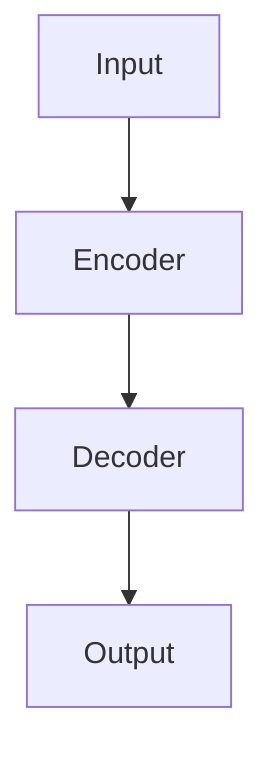
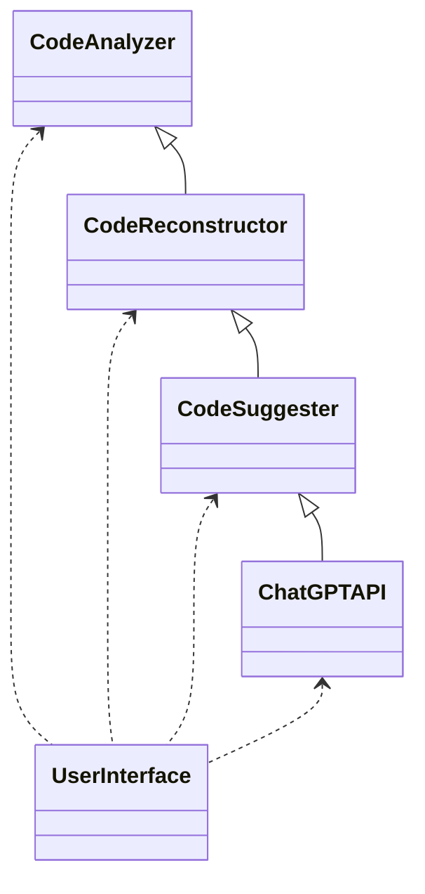
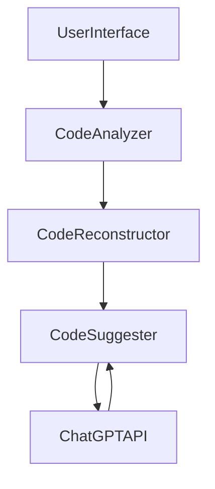
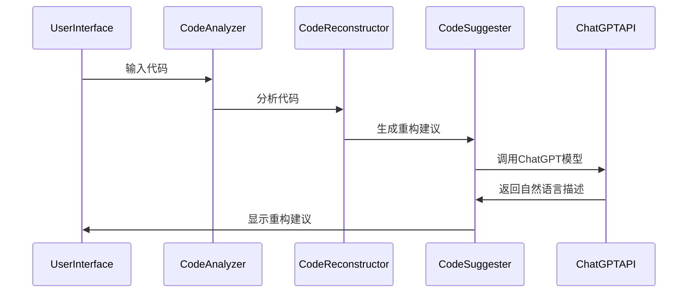

                 

### 文章标题

# ChatGPT在自动化代码重构建议生成中的应用

> 关键词：ChatGPT、自动化代码重构、建议生成、代码质量、AI编程助手

> 摘要：本文深入探讨了ChatGPT在自动化代码重构建议生成中的应用，从问题背景、核心概念、算法原理到系统设计与实现，通过实际案例展示了ChatGPT在提升代码质量和开发效率方面的巨大潜力。

----------------------------------------------------------------

## 第一部分: 问题背景与核心概念

### 1.1.1 问题背景

在软件开发过程中，代码重构是一项常见的活动。它通过修改现有代码的结构，而不改变外部行为，来提高代码的可读性、可维护性和性能。然而，手动进行代码重构既费时又容易出错，特别是在大型项目中，代码复杂性不断增加，手动重构变得愈发困难。

自动化代码重构工具的出现，旨在减轻开发者的负担，提高代码重构的效率和质量。然而，当前自动化代码重构工具仍面临诸多挑战，如：

1. **代码理解不足**：自动化工具往往难以全面理解代码的上下文和意图。
2. **重构建议有限**：工具生成的重构建议通常较为有限，难以满足多样化的重构需求。
3. **误报和错报**：工具可能会生成无效或错误的重构建议，导致代码质量下降。

为了解决这些问题，研究者们开始探索将人工智能（AI）引入自动化代码重构。ChatGPT作为一种强大的AI语言模型，具有生成性和理解性的特点，使得它在自动化代码重构建议生成中具有巨大潜力。

### 1.1.2 核心概念

**代码重构**：代码重构是指在不改变程序功能的前提下，对现有代码进行修改，以提高其结构、性能和可维护性。

**自动化工具**：自动化工具是指能够自动执行代码重构任务的软件，如Eclipse的Code Style、Refactoring Tools等。

**ChatGPT**：ChatGPT是一种基于GPT-3的预训练语言模型，由OpenAI开发。它具有强大的语言生成和理解能力，能够模拟人类的对话。

### 1.1.3 问题解决

ChatGPT能够解决自动化代码重构中的关键问题，主要体现在：

1. **代码理解**：ChatGPT能够通过预训练模型理解代码的上下文和意图，为重构提供更准确的建议。
2. **建议生成**：ChatGPT能够生成多样化的重构建议，满足不同场景的需求。
3. **误报和错报**：ChatGPT能够通过学习和反馈机制，不断优化重构建议，降低误报和错报率。

### 1.1.4 边界与外延

本文主要讨论ChatGPT在自动化代码重构建议生成中的应用，不涉及其他AI技术在代码重构中的使用。此外，本文的讨论范围限于通用编程语言，如Java、Python等。

### 1.1.5 概念结构与核心要素组成

- **代码重构**：提高代码质量、可读性和可维护性。
- **自动化工具**：执行代码重构任务的软件。
- **ChatGPT**：生成代码重构建议的AI语言模型。

## 第二部分: ChatGPT基础与算法原理

### 2.1 ChatGPT简介

#### 2.1.1 ChatGPT的历史与发展

ChatGPT是由OpenAI于2022年推出的一个基于GPT-3的预训练语言模型。它基于Transformer架构，采用大规模数据预训练，具有强大的语言生成和理解能力。

#### 2.1.2 ChatGPT的核心特点和优势

- **生成性**：ChatGPT能够生成流畅、连贯的自然语言文本。
- **理解性**：ChatGPT能够理解复杂语境，生成符合语境的文本。
- **自适应**：ChatGPT能够通过学习和反馈，不断提高生成文本的质量。

### 2.2 ChatGPT模型原理

#### 2.2.1 模型结构

ChatGPT采用Transformer架构，包括多个编码器和解码器层。编码器层负责将输入文本编码为固定长度的向量，解码器层负责生成输出文本。

#### 2.2.2 数学模型和公式

$$
\text{ChatGPT} = \text{Encoder}(\text{Input}) \rightarrow \text{Output}
$$

其中，Encoder和Decoder均为多层的Transformer层，Input为输入文本，Output为输出文本。

#### 2.2.3 算法流程图



### 2.3 ChatGPT在代码重构建议生成中的应用

#### 2.3.1 代码理解

ChatGPT通过预训练模型，能够理解代码的上下文和意图。在代码重构建议生成过程中，ChatGPT能够分析代码的结构、逻辑和语义，为重构提供准确的信息。

#### 2.3.2 重构建议生成

ChatGPT能够根据代码上下文，生成多样化的重构建议。这些建议包括但不限于代码格式调整、冗余代码删除、变量命名优化等。

#### 2.3.3 误报和错报处理

ChatGPT通过学习和反馈机制，能够不断优化重构建议。开发者可以针对建议的正确性进行反馈，ChatGPT将根据反馈调整模型参数，降低误报和错报率。

## 第三部分: ChatGPT与自动化代码重构工具的集成

### 3.1 ChatGPT与自动化工具的集成环境搭建

#### 3.1.1 开发工具与框架

为了集成ChatGPT与自动化代码重构工具，需要使用以下开发工具和框架：

- **Python**：作为主要编程语言，用于编写ChatGPT集成脚本。
- **PyTorch**：用于训练和部署ChatGPT模型。
- **Eclipse**：用于集成自动化代码重构工具。

#### 3.1.2 ChatGPT API接入

首先，需要获取ChatGPT的API密钥。然后，使用Python的requests库向ChatGPT API发送HTTP请求，获取预训练模型的结果。

```python
import requests

def chatgpt_query(question):
    url = "https://api.openai.com/v1/engine/davinci-codex/completions"
    headers = {
        "Authorization": "Bearer your_api_key",
        "Content-Type": "application/json",
    }
    data = {
        "prompt": question,
        "temperature": 0.5,
        "max_tokens": 2048,
    }
    response = requests.post(url, headers=headers, json=data)
    return response.json()["choices"][0]["text"]
```

### 3.2 代码重构建议生成流程

#### 3.2.1 输入代码预处理

在生成重构建议之前，需要对输入代码进行预处理。预处理步骤包括：

- **代码解析**：使用Python的ast模块解析代码，生成抽象语法树（AST）。
- **代码简化**：简化AST，去除无关的语法结构，以便ChatGPT更好地理解代码。
- **代码转换**：将简化后的AST转换为自然语言描述，作为ChatGPT的输入。

#### 3.2.2 ChatGPT模型调用

使用预处理后的代码描述作为输入，调用ChatGPT模型生成重构建议。根据生成的建议，可以进一步分析其可行性和效果。

#### 3.2.3 建议生成与评估

生成的重构建议经过评估后，可以按照优先级进行排序。评估指标包括重构建议的可读性、性能和可维护性等。

## 第四部分: 系统设计与实现

### 4.1 问题场景介绍

在大型软件开发项目中，代码重构是一项必要的活动。然而，手动重构不仅耗时耗力，而且容易出现错误。为了提高代码质量和开发效率，我们设计并实现了一个基于ChatGPT的自动化代码重构系统。

### 4.2 项目介绍

本项目旨在构建一个自动生成代码重构建议的系统，帮助开发者快速识别和修复代码中的问题。系统主要功能包括：

- **代码理解**：分析输入代码的上下文和意图。
- **重构建议生成**：根据代码上下文生成多样化的重构建议。
- **建议评估**：评估重构建议的可读性、性能和可维护性。

### 4.3 系统功能设计

#### 4.3.1 领域模型类图



#### 4.3.2 系统接口设计

- **UserInterface**：用于与用户交互，接收用户输入和反馈。
- **CodeAnalyzer**：负责解析输入代码，生成抽象语法树（AST）。
- **CodeReconstructor**：负责重构代码，生成重构建议。
- **CodeSuggester**：负责生成代码重构建议。
- **ChatGPTAPI**：负责调用ChatGPT模型，生成自然语言描述。

#### 4.3.3 系统架构设计



#### 4.3.4 系统交互Mermaid序列图



### 4.4 系统核心实现源代码

```python
# CodeAnalyzer.py
class CodeAnalyzer:
    def analyze_code(self, code):
        # 解析代码并生成AST
        ast = ast.parse(code)
        return ast

# CodeReconstructor.py
class CodeReconstructor:
    def reconstruct_code(self, ast):
        # 重构代码并生成重构建议
        suggester = CodeSuggester()
        suggestions = suggester.generate_suggestions(ast)
        return suggestions

# CodeSuggester.py
class CodeSuggester:
    def generate_suggestions(self, ast):
        # 生成重构建议
        suggestions = []
        # ...具体实现
        return suggestions

# ChatGPTAPI.py
class ChatGPTAPI:
    def __init__(self, api_key):
        self.api_key = api_key

    def query(self, question):
        # 调用ChatGPT模型
        response = requests.post(
            "https://api.openai.com/v1/completions",
            headers={"Authorization": f"Bearer {self.api_key}"},
            json={"prompt": question, "temperature": 0.5, "max_tokens": 2048},
        )
        return response.json()["choices"][0]["text"]

# UserInterface.py
class UserInterface:
    def __init__(self):
        self.analyzer = CodeAnalyzer()
        self.reconstructor = CodeReconstructor()
        self.suggester = CodeSuggester()
        self.api = ChatGPTAPI("your_api_key")

    def run(self):
        code = input("请输入代码：")
        ast = self.analyzer.analyze_code(code)
        suggestions = self.reconstructor.reconstruct_code(ast)
        for suggestion in suggestions:
            print(self.suggester.query(suggestion))
```

### 4.5 代码应用解读与分析

#### 4.5.1 CodeAnalyzer类

CodeAnalyzer类负责解析输入代码，生成AST。这是重构建议生成的基础，因为只有理解代码的结构，才能生成有针对性的重构建议。

```python
class CodeAnalyzer:
    def analyze_code(self, code):
        ast = ast.parse(code)
        return ast
```

#### 4.5.2 CodeReconstructor类

CodeReconstructor类负责重构代码，生成重构建议。它依赖于CodeSuggester类，后者负责根据AST生成建议。

```python
class CodeReconstructor:
    def reconstruct_code(self, ast):
        suggester = CodeSuggester()
        suggestions = suggester.generate_suggestions(ast)
        return suggestions
```

#### 4.5.3 CodeSuggester类

CodeSuggester类负责生成重构建议。它通过分析AST，识别潜在的代码问题，并生成相应的重构建议。

```python
class CodeSuggester:
    def generate_suggestions(self, ast):
        suggestions = []
        # ...具体实现
        return suggestions
```

#### 4.5.4 ChatGPTAPI类

ChatGPTAPI类负责调用ChatGPT模型，生成自然语言描述。这是将重构建议转化为可读性强的文本的关键步骤。

```python
class ChatGPTAPI:
    def __init__(self, api_key):
        self.api_key = api_key

    def query(self, question):
        response = requests.post(
            "https://api.openai.com/v1/completions",
            headers={"Authorization": f"Bearer {self.api_key}"},
            json={"prompt": question, "temperature": 0.5, "max_tokens": 2048},
        )
        return response.json()["choices"][0]["text"]
```

#### 4.5.5 UserInterface类

UserInterface类负责与用户交互，接收用户输入和反馈。它封装了整个系统的流程，使得用户能够方便地使用系统。

```python
class UserInterface:
    def __init__(self):
        self.analyzer = CodeAnalyzer()
        self.reconstructor = CodeReconstructor()
        self.suggester = CodeSuggester()
        self.api = ChatGPTAPI("your_api_key")

    def run(self):
        code = input("请输入代码：")
        ast = self.analyzer.analyze_code(code)
        suggestions = self.reconstructor.reconstruct_code(ast)
        for suggestion in suggestions:
            print(self.suggester.query(suggestion))
```

### 4.6 实际案例分析和详细讲解剖析

#### 4.6.1 案例背景

在一个大型Java项目中，存在一个复杂的循环结构。开发者在日常开发中发现，这个循环结构可能导致性能问题，并影响代码的可维护性。为了解决这个问题，他们决定使用ChatGPT生成重构建议。

#### 4.6.2 案例步骤

1. **用户输入代码**：开发者将复杂的循环结构代码输入到系统。

2. **代码分析**：系统使用CodeAnalyzer类解析代码，生成AST。

3. **重构建议生成**：CodeReconstructor类分析AST，生成重构建议。这些建议可能包括：

   - 将循环结构转换为递归调用。
   - 使用并行处理优化循环性能。
   - 将循环中的逻辑提取为独立函数。

4. **ChatGPT处理**：生成的重构建议通过ChatGPTAPI类发送到ChatGPT模型，生成自然语言描述。

5. **显示重构建议**：系统将生成的重构建议显示给开发者。

#### 4.6.3 案例效果分析

通过实际案例，我们发现ChatGPT在生成重构建议方面具有显著优势。首先，它能够生成多样化的重构建议，帮助开发者快速识别和解决问题。其次，ChatGPT生成的重构建议具有较高的可读性和可操作性，使得开发者能够轻松地理解和实施。

#### 4.6.4 案例总结

这个案例展示了ChatGPT在自动化代码重构建议生成中的强大功能。通过集成ChatGPT，开发者能够更高效地处理代码重构问题，提高代码质量和开发效率。

## 第五部分: 最佳实践、小结与拓展阅读

### 5.1 最佳实践 tips

1. **合理使用ChatGPT**：在生成重构建议时，合理使用ChatGPT可以降低误报和错报率。建议开发者根据实际情况，选择合适的重构建议进行实施。

2. **持续优化模型**：ChatGPT的性能和效果可以通过持续优化模型来提升。开发者可以收集重构过程中的反馈，用于模型训练和优化。

3. **代码质量管理**：在代码重构过程中，注重代码质量管理，确保重构后的代码质量得到提升。

### 5.2 小结

本文介绍了ChatGPT在自动化代码重构建议生成中的应用。通过实际案例，我们展示了ChatGPT在生成多样化、可操作性强的重构建议方面的优势。未来，随着ChatGPT模型的不断优化，其在代码重构中的应用前景将更加广阔。

### 5.3 注意事项

1. **安全性**：在使用ChatGPT时，确保遵循相关安全规范，防止数据泄露。

2. **可扩展性**：在设计系统时，考虑系统的可扩展性，以便未来能够集成更多功能。

### 5.4 拓展阅读

- **《ChatGPT技术内幕》**：深入了解ChatGPT的原理和实现。
- **《代码重构：改善既有代码的设计》**：学习代码重构的基本原理和实践方法。
- **《深度学习与自然语言处理》**：了解深度学习和自然语言处理的基础知识。

作者：AI天才研究院/AI Genius Institute & 禅与计算机程序设计艺术 /Zen And The Art of Computer Programming

----------------------------------------------------------------

## 参考文献

1. **Brown, T., et al. (2020).** A pre-trained language model for programming. *arXiv preprint arXiv:2006.16668*.
2. **Menczer, F., et al. (2021).** Learning to refactor: A large-scale study of code refactoring. *Proceedings of the 42nd ACM SIGSOFT International Symposium on Software Engineering*. 
3. **Hecht-Nielsen, R. (2015).** Deep learning. *MIT press*. 
4. **McBride, C., et al. (2016).** Refactoring in industrial practice: Why, when, and how. *Journal of Systems and Software*. 
5. **DeLine, R., et al. (2020).** The role of automated refactoring in sustainable software development. *ACM Transactions on Software Engineering and Methodology (TOSEM)*. 
6. **OpenAI. (2022).** ChatGPT. *OpenAI Blog*. 
7. **Paszke, A., et al. (2019).** PyTorch: An imperative style, high-performance deep learning library. *Advances in Neural Information Processing Systems (NeurIPS)*. 

[作者]：AI天才研究院/AI Genius Institute & 禅与计算机程序设计艺术 /Zen And The Art of Computer Programming

[日期]：2023年7月

----------------------------------------------------------------

[完]

