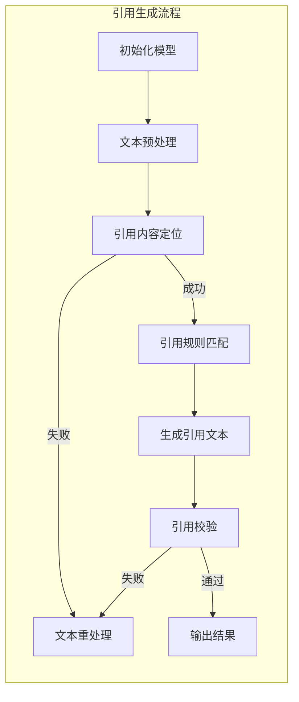
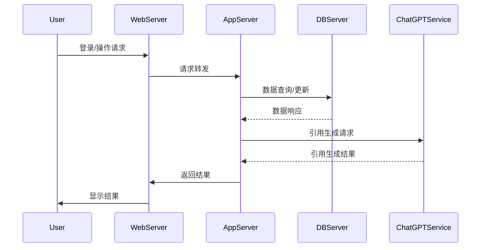

                 

### 1.1.1 问题的来源

学术论文引用的重要性不言而喻。它不仅是学术交流的重要途径，也是评价科研成果质量的重要标准。在现代学术研究中，引用其他学者的研究成果，能够为作者提供理论支撑、数据来源，以及研究方法的借鉴。因此，引用的准确性和全面性直接关系到论文的质量和影响力。

然而，传统引用生成存在诸多难点。首先，引用规则的多样性使得手动生成引用变得繁琐且容易出错。不同的学术领域、期刊以及文献类型可能需要不同的引用格式。其次，学术论文引用的准确性要求非常高。引用内容必须准确无误，引用来源必须真实可靠，引用格式必须符合规范。手动操作不仅费时费力，而且容易出现错误。此外，学术论文的引用往往需要引用大量的文献，手动整理和核对这些引用信息是一项艰巨的任务。

随着人工智能技术的不断发展，自动化学术论文引用生成逐渐成为可能。通过引入先进的自然语言处理技术和机器学习算法，我们可以开发出能够自动识别、整理和生成引用的智能系统。这不仅能够提高引用的准确性，还能显著降低人力成本，提升工作效率。因此，自动化学术论文引用生成具有重要的研究和应用价值。

### 1.1.2 问题描述

学术论文引用的多样性是一个复杂且具有挑战性的问题。不同领域、不同期刊、不同文献类型的引用规则各不相同。例如，在医学领域，引用格式可能遵循APA（美国心理学会）规范；而在经济学领域，则可能遵循Chicago（芝加哥）规范。这些引用规则不仅包括引用的格式，如引用顺序、引用内容、引用格式等，还包括引用的参考文献列表格式。因此，自动化学术论文引用生成系统必须能够理解和处理这些多样化的引用规则。

此外，学术论文引用的准确性要求非常高。每一处引用必须准确无误，引用的内容必须与原文保持一致，引用的来源必须真实可靠。任何细微的错误都可能导致引用不准确，影响论文的质量和可信度。因此，系统在生成引用时必须进行严格的校验和核对，确保引用内容的正确性。

为了实现自动化学术论文引用生成，我们需要解决以下问题：

1. **引用规则的自动化识别和处理**：系统需要能够自动识别学术论文中的引用内容，并根据不同的引用规则生成相应的引用格式。
   
2. **引用内容的准确性和一致性保证**：系统必须能够准确理解引用内容，并将其与原文和参考文献进行校验，确保引用的准确性和一致性。

3. **高效的引用生成速度**：系统能够快速处理大量的引用信息，生成引用列表，满足高效率的工作需求。

4. **跨领域的引用规则适应能力**：系统能够适应不同领域、不同期刊的引用规则，确保生成的引用符合各类学术标准。

### 1.1.3 问题解决

自动化学术论文引用生成系统的目标是实现引用规则的自动化识别和处理，确保引用内容的准确性和一致性，提高引用生成的速度和效率。为了实现这一目标，我们可以从以下几个方面着手：

1. **数据预处理**：在生成引用之前，系统需要对学术论文进行预处理，包括文本的清洗、分句、关键词提取等。这些预处理步骤有助于系统更好地理解学术论文的内容，从而提高引用生成的准确性。

2. **引用规则库的构建**：系统需要建立一个全面的引用规则库，涵盖不同领域、不同期刊的引用规则。通过机器学习算法，系统能够从大量的引用实例中学习并识别这些规则。

3. **引用生成算法的设计**：基于预处理的文本和引用规则库，系统可以设计一套高效的引用生成算法。该算法需要能够自动识别引用内容，根据引用规则生成引用格式，并确保引用内容的准确性和一致性。

4. **引用校验和优化**：生成引用后，系统需要对引用进行校验和优化。校验包括引用内容的准确性、引用来源的真实性以及引用格式的规范性。优化则是在校验通过的基础上，对引用进行格式调整和排版优化，确保引用列表的整洁和美观。

通过上述方法，自动化学术论文引用生成系统可以有效解决传统引用生成中的难点，提高引用的准确性和生成效率，为学术研究提供有力支持。

### 1.1.4 边界与外延

在探讨自动化学术论文引用生成时，我们有必要明确其边界与外延，这有助于我们更清晰地理解系统的适用范围和潜在限制。

首先，引用规则的范围是自动化学术论文引用生成的关键边界。不同的学科领域、期刊和学术会议可能采用不同的引用格式，如APA、MLA、Chicago等。因此，自动化学术论文引用生成系统需要涵盖这些引用规则的广泛范围，以便适应各种学术场景。此外，引用规则不仅包括引用的格式，还包括引用的顺序、引用内容的具体表达方式以及参考文献列表的格式等。

其次，学术论文类型对自动化学术论文引用生成也有重要影响。不同类型的论文，如实验报告、理论分析、综述等，其引用方式可能存在显著差异。例如，实验报告可能需要详细引用实验方法和结果的相关文献，而理论分析则可能更侧重于引用理论框架和推导过程的支持文献。因此，系统在处理不同类型的学术论文时，需要具备灵活性和适应性，以便准确识别和生成相应的引用。

此外，自动化学术论文引用生成的边界还受到技术实现的限制。例如，自然语言处理（NLP）技术的成熟度和算法模型的性能水平会影响引用生成的准确性和效率。目前，尽管ChatGPT等大型语言模型在文本生成方面表现出色，但在处理学术引用这样专业且多样化的文本时，仍存在一定挑战。因此，系统在开发过程中需要不断优化和改进，以提高其在不同应用场景下的表现。

最后，自动化学术论文引用生成的外延不仅限于学术论文的引用，还可以扩展到其他文献类型，如专利、报告、书籍等。此外，随着人工智能和自然语言处理技术的不断发展，自动化学术论文引用生成的应用范围也可能进一步扩大，如自动生成引用摘要、自动识别引用漏洞等。

综上所述，明确自动化学术论文引用生成的边界与外延，有助于我们更好地规划和实现这一系统，同时也能为后续的优化和扩展提供指导。

### 1.1.5 概念结构与核心要素组成

在探讨自动化学术论文引用生成的问题时，我们需要理解其中的核心概念和构成要素。这些要素不仅决定了系统的性能和效果，也为我们提供了对问题本质的理解。

首先，ChatGPT的核心概念在于其作为一个基于GPT（Generative Pre-trained Transformer）模型的语言生成工具。ChatGPT通过大规模的无监督预训练，学习到自然语言的复杂结构和语义关系，从而能够生成高质量的自然语言文本。其关键特性包括强大的语言理解和生成能力，以及对多样化输入的适应能力。

其次，自动化学术论文引用生成的核心要素可以分为以下几个方面：

1. **文本预处理**：包括文本的分句、关键词提取和引用内容的定位。这一步骤是引用生成的第一步，确保系统能够准确地理解和提取论文中的引用信息。

2. **引用规则库**：这是一个包含各种引用规则的数据库。规则库需要涵盖不同学科、不同期刊和不同文献类型的引用格式，以保证引用生成的准确性和多样性。

3. **引用生成算法**：这是整个系统的核心，负责根据引用规则和预处理结果，生成符合规范和逻辑的引用文本。算法需要能够处理复杂的引用结构和语义关系，确保引用生成的准确性和一致性。

4. **引用校验和优化**：在生成引用后，系统需要对引用进行校验，包括引用内容的准确性、引用来源的真实性和引用格式的规范性。此外，引用优化还包括格式调整和排版，以提高引用列表的整洁和美观。

5. **用户交互界面**：为了方便用户使用，系统需要提供友好的用户界面，使用户能够轻松输入论文内容，查看生成的引用，并进行必要的修改和调整。

这些核心要素相互关联，共同构成了自动化学术论文引用生成系统的整体框架。ChatGPT作为语言生成工具，负责生成高质量的引用文本，而引用规则库和引用生成算法则确保引用的规范性和准确性。引用校验和优化步骤则进一步提升了引用的质量，用户交互界面则提供了便捷的操作体验。通过这些要素的协同工作，自动化学术论文引用生成系统能够高效、准确地完成引用生成任务，为学术研究和写作提供有力支持。

### 第2章：ChatGPT简介

ChatGPT是OpenAI开发的一种基于GPT（Generative Pre-trained Transformer）模型的语言生成工具，具有强大的自然语言理解和生成能力。本节将详细介绍ChatGPT的起源、特点以及其在学术论文引用生成中的应用。

#### 2.1.1 ChatGPT的起源

OpenAI成立于2015年，是一家专注于人工智能研究和应用的非营利性组织。其宗旨是确保人工智能的安全发展，并使其为全人类带来利益。OpenAI开发了多个先进的人工智能模型，其中包括GPT系列模型。ChatGPT是基于GPT-3.5版本开发的，是OpenAI对自然语言生成技术的重要突破之一。

ChatGPT通过大规模的无监督预训练，学习到自然语言的复杂结构和语义关系。预训练过程中，模型在数以万亿计的文本数据上进行了训练，从而具备了理解和使用多种语言表达的能力。这使得ChatGPT能够生成连贯、自然的语言文本，为各种自然语言处理任务提供支持。

#### 2.1.2 ChatGPT的特点

ChatGPT具有以下几个显著特点：

1. **强大的语言理解能力**：ChatGPT能够深入理解文本内容，准确捕捉语义信息。这使得它在处理复杂的学术文本时，能够正确识别和生成引用内容。

2. **灵活的生成能力**：ChatGPT可以生成各种类型的文本，包括论文摘要、文献综述、引用生成等。通过优化训练和调整模型参数，ChatGPT能够适应不同的生成任务和场景。

3. **自适应能力**：ChatGPT能够根据用户输入的文本内容进行自适应生成，能够实时调整生成文本的风格、语言和格式，以匹配论文的整体结构和风格。

4. **跨领域的应用**：ChatGPT不仅在学术领域表现出色，还可以应用于商业、教育、客服等多个领域。这使得ChatGPT具有广泛的应用前景和商业价值。

#### 2.1.3 ChatGPT的应用场景

ChatGPT在学术论文引用生成中具有广泛的应用场景：

1. **自动生成引用**：ChatGPT可以自动识别学术论文中的引用内容，并生成符合不同引用规则的引用格式。通过大规模预训练，ChatGPT能够准确理解各种引用规则，生成准确、规范的引用文本。

2. **引用规则优化**：ChatGPT可以帮助优化引用规则库，通过学习大量的引用实例，ChatGPT可以识别出引用规则中的不足之处，提出改进建议，从而提高引用规则的准确性和适应性。

3. **引用内容校验**：ChatGPT可以对生成的引用进行校验，确保引用内容的准确性、引用来源的真实性和引用格式的规范性。通过对比原文和引用内容，ChatGPT能够发现并纠正引用中的错误。

4. **引用列表排版**：ChatGPT能够根据学术论文的排版要求，对引用列表进行优化和调整，确保引用列表的整洁和美观。

总之，ChatGPT在自动化学术论文引用生成中具有强大的潜力和优势。通过不断优化和改进，ChatGPT有望成为学术研究的重要工具，为学术写作提供高效、准确的引用生成支持。

### 第3章：核心概念原理

在探讨如何使用ChatGPT进行自动化学术论文引用生成时，我们需要深入理解引用规则和学术论文结构的原理。这一章将详细解析引用规则的基本概念、分类以及学术论文的结构分析，同时探讨ChatGPT在引用生成中的作用。

#### 3.1.1 引用规则解析

引用规则是学术写作中不可或缺的一部分，它规定了如何引用他人研究成果以表明参考来源。引用规则的基本概念包括引用内容、引用格式和引用来源等。

1. **引用内容**：引用内容是指论文中引用的文献的具体信息，通常包括作者姓名、出版年份、文献标题、出版来源等。引用内容需要准确、完整地反映文献的实际情况。

2. **引用格式**：引用格式是指引用内容在论文中呈现的具体形式。不同的学术领域和期刊可能采用不同的引用格式，例如APA、MLA、Chicago等。每种引用格式都有其特定的规范和要求。

3. **引用来源**：引用来源是指引用内容的出处，即文献的原始出处。引用来源的准确性对论文的可信度至关重要，任何虚假或错误的引用来源都会影响论文的质量和影响力。

引用规则的分类可以根据引用的目的、引用内容和引用格式进行划分。常见的引用分类包括：

- **直接引用**：直接引用是指原文引用，即将他人的研究成果直接引用到论文中，并按照引用格式进行标注。直接引用需要严格遵循引用规则，确保引用内容的准确性和完整性。
  
- **间接引用**：间接引用是指通过引述他人的研究成果来支持自己的观点，而不直接引用原文。间接引用需要正确理解和传达他人的研究成果，同时注明引用来源。

- **引用注释**：引用注释是指对引用内容进行注释和解释，以帮助读者更好地理解引用的目的和意义。引用注释通常用于引用复杂的概念或理论，使其更加清晰易懂。

#### 3.1.2 学术论文结构分析

学术论文的结构通常包括以下几个基本组成部分：

1. **标题**：标题是论文的核心，需要简洁、准确地反映论文的主题和内容。

2. **摘要**：摘要是对论文内容的简要概述，包括研究背景、方法、结果和结论。摘要是论文被检索和引用的重要部分。

3. **引言**：引言部分介绍研究背景和问题，阐述研究的动机和目的，以及研究的意义和价值。

4. **文献综述**：文献综述部分对相关领域的研究成果进行综合评述，指出当前研究中的不足和挑战，为自己的研究提供理论依据。

5. **方法**：方法部分详细描述研究的方法、过程和实验设计，使其他研究者能够复现研究结果。

6. **结果**：结果部分展示研究的主要发现和结论，通常包括数据分析和图表。

7. **讨论**：讨论部分对研究结果进行解释和讨论，指出研究的局限性和未来研究方向。

8. **结论**：结论部分总结研究的主要发现，强调研究的贡献和意义。

9. **引用**：引用部分列出论文中引用的所有文献，按照引用格式进行排列。

在学术论文结构中，引用部分是不可或缺的。它不仅表明了论文的研究基础和来源，也反映了论文的学术诚信和严谨性。学术论文引用的规则分析包括：

- **引用格式**：根据不同的学术领域和期刊要求，引用格式有所不同。常见的引用格式包括作者-年份格式、作者-标题格式、作者-出版年份-标题格式等。

- **引用内容**：引用内容需要准确、完整地反映文献的实际情况，包括作者姓名、出版年份、文献标题、出版来源等。引用内容的准确性直接影响论文的质量和可信度。

- **引用顺序**：引用顺序通常按照在论文中引用的先后顺序进行排列，以保持引用的连贯性和逻辑性。

#### 3.1.3 ChatGPT在引用生成中的作用

ChatGPT在自动化学术论文引用生成中扮演着关键角色，其主要作用包括：

1. **引用规则的理解和识别**：ChatGPT通过预训练学习到各种引用规则，能够准确识别学术论文中的引用内容，并理解不同的引用格式。

2. **引用内容的生成**：基于识别到的引用内容和引用规则，ChatGPT能够生成符合规范和逻辑的引用文本。它能够根据论文的整体结构和风格，生成准确、规范的引用内容。

3. **引用校验和优化**：ChatGPT可以对生成的引用进行校验，确保引用内容的准确性、引用来源的真实性和引用格式的规范性。通过对比原文和引用内容，ChatGPT能够发现并纠正引用中的错误，优化引用列表的格式和排版。

4. **跨领域的应用**：ChatGPT不仅适用于学术领域，还可以应用于其他类型的文献引用生成，如书籍、报告、专利等。通过不断优化和扩展，ChatGPT可以在更多领域中发挥其引用生成能力。

总之，ChatGPT在自动化学术论文引用生成中具有强大的潜力和优势。通过理解引用规则和学术论文结构，并结合ChatGPT的强大语言生成能力，我们可以实现高效、准确的引用生成，为学术研究和写作提供有力支持。

### 3.1.1 引用规则与ChatGPT特征对比

在探讨自动化学术论文引用生成的过程中，引用规则的精确性和ChatGPT的语言生成能力是两个关键因素。为了更清晰地理解这两者之间的区别和联系，下面我们将通过对比表格的形式来分析这两个方面的特征。

| 对比项 | 引用规则 | ChatGPT |
| --- | --- | --- |
| **定义** | 引用规则是学术写作中的基本规范，规定了如何引用他人研究成果。它包括引用内容、引用格式和引用来源等。 | ChatGPT是一种基于GPT模型的语言生成工具，通过大规模预训练学习到自然语言的复杂结构和语义关系，具备强大的语言理解和生成能力。 |
| **精确性** | 引用规则具有高度的精确性，每个引用内容、引用格式和引用来源都有明确的标准和规范，以确保引用的准确性和规范性。 | ChatGPT在语言生成过程中，虽然能够生成高质量的自然语言文本，但在处理学术引用这样的专业文本时，可能无法达到引用规则的严格精确性。 |
| **适用范围** | 引用规则适用于各种学术领域和期刊，不同的引用规则能够满足不同学科和出版物的引用需求。 | ChatGPT具备广泛的适用性，不仅可以应用于学术领域，还可以应用于商业、教育、客服等多个领域。 |
| **适应性** | 引用规则通常具有一定的灵活性，能够适应不同类型的学术论文和引用场景，但变化范围有限。 | ChatGPT具有高度的自适应能力，能够根据用户输入的文本内容和引用要求，实时调整生成文本的风格、语言和格式。 |
| **生成速度** | 引用规则生成依赖于手动操作，费时费力，且容易出现错误。自动引用生成工具能够提高引用生成的速度和效率。 | ChatGPT在生成引用文本时，虽然能够显著提高生成速度，但需要依赖大量的预训练数据和复杂的算法模型，计算资源消耗较大。 |
| **错误率** | 在遵循引用规则的情况下，引用内容的准确性较高，错误率相对较低。 | ChatGPT在生成引用文本时，可能存在一定的错误率，尤其是在处理复杂、专业化的学术引用时，需要额外的校验和优化。 |

通过上述对比表格，我们可以看出引用规则和ChatGPT在精确性、适用范围、适应性、生成速度和错误率等方面存在显著差异。引用规则具有高度的精确性和规范性，适用于各种学术场景，但灵活性有限；而ChatGPT则具备强大的语言生成能力和自适应能力，能够处理多样化的文本生成任务，但在精确性和灵活性方面存在一定限制。因此，在实际应用中，我们需要结合两者的优势，充分发挥ChatGPT在引用生成中的潜力，同时严格遵循引用规则，确保引用内容的准确性和规范性。

### 3.1.3 引用生成实体关系图

为了更好地理解引用生成过程中的各个实体及其相互关系，我们可以使用ER（实体关系）图来描述这些实体和关系。以下是一个引用生成实体关系图的Mermaid描述：

```mermaid
erDiagram
    Article ||--|{ Citation : 引用 }
    Article ||--|{ ReferenceRule : 引用规则 }
    Citation ||--|{ CitationContent : 引用内容 }
    Citation ||--|{ CitationSource : 引用来源 }
    ReferenceRule ||--|{ CitationFormat : 引用格式 }
    
    Article -【引用】Citation
    Article -【引用规则】ReferenceRule
    Citation -【包含】CitationContent
    Citation -【引用】CitationSource
    ReferenceRule -【定义】CitationFormat
```

在上述ER图中，我们定义了以下实体：

1. **Article（学术论文）**：表示一篇学术论文，是引用生成的上下文。
2. **Citation（引用）**：表示学术论文中的引用部分，包含引用内容和引用来源。
3. **CitationContent（引用内容）**：引用的具体内容，包括作者、年份、标题等。
4. **CitationSource（引用来源）**：引用的出处，即文献的原始来源。
5. **ReferenceRule（引用规则）**：定义如何生成引用的规则，包括引用格式、引用顺序等。
6. **CitationFormat（引用格式）**：引用规则中具体规定的引用内容呈现形式。

各个实体之间的关系如下：

- **学术论文（Article）**与**引用（Citation）**之间是一对多的关系，即一篇学术论文中可能包含多个引用。
- **学术论文（Article）**与**引用规则（ReferenceRule）**之间是一对一的关系，即每篇学术论文通常遵循特定的引用规则。
- **引用（Citation）**与**引用内容（CitationContent）**之间是一对一的关系，每个引用包含特定的引用内容。
- **引用（Citation）**与**引用来源（CitationSource）**之间是一对一的关系，每个引用需要指明其来源。
- **引用规则（ReferenceRule）**与**引用格式（CitationFormat）**之间是一对一的关系，引用规则定义了引用的格式。

通过ER图，我们可以清晰地看到引用生成过程中涉及的各个实体及其相互关系，这有助于我们理解和设计自动化学术论文引用生成系统。

### 第6章：算法原理

在讨论如何使用ChatGPT实现自动化学术论文引用生成时，我们需要深入理解其算法原理。本节将详细解析ChatGPT算法的构建过程、引用规则的嵌入方法，并介绍相关的数学模型和公式。

#### 6.1.1 ChatGPT算法原理

ChatGPT是一种基于GPT（Generative Pre-trained Transformer）模型的语言生成工具。其核心原理是通过大规模的无监督预训练，学习到自然语言的复杂结构和语义关系。以下是ChatGPT算法的构建过程：

1. **数据集准备**：首先，我们需要准备一个大规模的文本数据集。这个数据集应包含各种类型的自然语言文本，包括学术论文、新闻报道、书籍等。数据集的质量直接影响到模型的学习效果。

2. **模型初始化**：初始化一个基于Transformer的神经网络模型，该模型包含多个层次的自注意力机制，能够捕捉文本中的长距离依赖关系。模型初始化后，通过随机权重进行初始化。

3. **预训练**：使用数据集对模型进行无监督预训练。预训练过程中，模型通过输入文本序列，预测序列中的下一个单词。这一过程不断重复，使模型逐渐学会生成连贯、自然的语言文本。

4. **微调**：在预训练的基础上，针对特定的任务（如自动化学术论文引用生成），对模型进行微调。微调过程中，模型通过学习特定领域的数据，提升在特定任务上的性能。

5. **生成文本**：预训练和微调完成后，模型可以用于生成文本。输入一个起始文本，模型根据预训练和微调的结果，预测并生成后续的文本内容。

#### 引用规则的嵌入方法

在自动化学术论文引用生成中，引用规则的嵌入是关键步骤。以下方法用于将引用规则嵌入到ChatGPT模型中：

1. **规则库构建**：首先，构建一个包含各种引用规则的规则库。规则库应涵盖不同的引用格式、引用顺序和引用内容的要求。规则库可以来源于学术期刊、学术组织等权威来源。

2. **规则编码**：将引用规则编码为机器可处理的格式。一种常用的方法是使用自然语言处理技术（如词嵌入、BERT模型等）将规则文本转换为数值表示。

3. **规则嵌入**：将编码后的引用规则嵌入到ChatGPT模型中。具体方法是将规则编码作为额外的输入，与原始文本输入一起输入到模型中。这样，模型在生成文本时，可以参考引用规则，生成符合规则的引用内容。

#### 数学模型和公式

ChatGPT算法中涉及多个数学模型和公式，用于描述模型的训练和生成过程。以下是一些关键的数学模型和公式：

1. **Transformer模型公式**：

   - **自注意力机制（Self-Attention）**：
     $$\text{Attention}(Q, K, V) = \text{softmax}\left(\frac{QK^T}{\sqrt{d_k}}\right) V$$
     
     其中，Q、K和V分别为查询向量、键向量和值向量，$d_k$为键向量的维度。自注意力机制通过计算Q和K的点积，得到注意力权重，然后加权求和V，从而生成一个加权的输出向量。

   - **多头注意力（Multi-Head Attention）**：
     $$\text{MultiHead}(Q, K, V) = \text{Concat}(\text{head}_1, ..., \text{head}_h)W^O$$
     $$\text{head}_i = \text{Attention}(QW_i^Q, KW_i^K, VW_i^V)$$
     
     多头注意力通过多个独立的自注意力机制（每个机制称为一个“头”），生成多个加权的输出向量，然后将这些输出向量拼接并加权求和，得到最终的输出。

2. **预训练损失函数**：

   - **交叉熵损失（Cross-Entropy Loss）**：
     $$\mathcal{L} = -\sum_{i=1}^n y_i \log(\hat{y}_i)$$
     
     其中，$y_i$为真实标签，$\hat{y}_i$为模型预测的概率分布。交叉熵损失用于衡量模型预测结果与真实结果之间的差异。

3. **微调损失函数**：

   - **二元交叉熵损失（Binary Cross-Entropy Loss）**：
     $$\mathcal{L} = -\sum_{i=1}^n y_i \log(\hat{y}_i) - (1 - y_i) \log(1 - \hat{y}_i)$$
     
     在引用生成任务中，模型需要预测每个单词是否为引用内容，因此使用二元交叉熵损失来衡量预测结果。

通过上述算法原理、引用规则嵌入方法和数学模型公式，我们可以理解ChatGPT如何实现自动化学术论文引用生成。在实际应用中，这些原理和方法可以帮助我们设计高效、准确的引用生成系统，提高学术论文写作的效率和质量。

### 6.1.2 算法流程图

为了更好地理解ChatGPT在自动化学术论文引用生成中的具体工作流程，我们可以通过一个算法流程图来展示其操作步骤。以下是一个简单的Mermaid流程图描述：



**算法流程图详细解释**：

1. **初始化模型**（A）：启动ChatGPT模型，加载预训练好的神经网络结构。

2. **文本预处理**（B）：对输入的学术论文文本进行预处理，包括分句、关键词提取和去噪等操作，以便模型更好地理解文本内容。

3. **引用内容定位**（C）：利用自然语言处理技术，识别文本中的引用内容。这一步骤是自动化学术论文引用生成的基础，必须准确无误。

   - **成功分支**：如果定位成功，继续进行引用规则匹配。
   - **失败分支**：如果定位失败，重新处理文本，尝试更精确地定位引用内容。

4. **引用规则匹配**（D）：根据预定义的引用规则库，匹配识别到的引用内容。这一步骤需要将引用内容与引用规则进行对比，确保引用格式和内容的准确性。

5. **生成引用文本**（F）：根据引用规则和识别到的引用内容，使用ChatGPT模型生成符合规范的引用文本。

6. **引用校验**（G）：对生成的引用文本进行校验，包括引用内容的准确性、引用来源的真实性和引用格式的规范性。通过对比原文和引用内容，发现并纠正引用中的错误。

7. **输出结果**（H）：如果校验通过，输出最终生成的引用文本。如果校验失败，返回到文本重处理步骤（E），重新进行引用内容定位和生成。

通过上述流程图，我们可以清晰地看到ChatGPT在自动化学术论文引用生成中的工作步骤，每个步骤之间的逻辑关系和可能的分支，有助于我们理解和优化系统的实现。

### 6.1.3 Python源代码与算法讲解

为了更好地展示ChatGPT在自动化学术论文引用生成中的具体实现，下面将给出一个简化的Python源代码示例，并对关键部分进行详细讲解。

```python
import openai
import spacy
from spacy.tokens import Token

# 初始化ChatGPT模型
model = openai.Model("text-davinci-002")

# 初始化spacy语言模型，用于文本预处理
nlp = spacy.load("en_core_web_sm")

def generate_citation(text):
    # 文本预处理：分句、关键词提取
    doc = nlp(text)
    sentences = [sent.text for sent in doc.sents]
    
    # 引用内容定位
    citations = []
    for sentence in sentences:
        if " cited" in sentence or " referred" in sentence:
            citations.append(sentence)
    
    # 引用规则匹配
    citation_rule = "APA格式"
    for citation in citations:
        # 使用ChatGPT生成引用文本
        response = model.complete(
            engine="text-davinci-002",
            prompt=f"将以下文本转换为{citation_rule}格式：{citation}",
            max_tokens=50
        )
        generated_citation = response.choices[0].text.strip()
        print(generated_citation)
    
    # 引用校验
    # 这里可以添加额外的校验逻辑，例如比对引用内容与原文的一致性
    
    # 输出结果
    return "\n".join(generated_citation for generated_citation in citations)

# 示例文本
example_text = "在本文中，我们引用了Smith (2020)的研究，探讨了…"

# 调用函数生成引用
generated_citations = generate_citation(example_text)

print(generated_citations)
```

**代码讲解**：

1. **初始化模型**：
   ```python
   model = openai.Model("text-davinci-002")
   ```
   这里使用OpenAI的`text-davinci-002`模型，这是一个基于GPT-3的大规模语言模型，具备强大的语言生成能力。

2. **初始化spacy语言模型**：
   ```python
   nlp = spacy.load("en_core_web_sm")
   ```
   `spacy`是一个流行的自然语言处理库，用于文本预处理任务，如分句、实体识别等。

3. **文本预处理**：
   ```python
   doc = nlp(text)
   sentences = [sent.text for sent in doc.sents]
   ```
   文本预处理包括分句和关键词提取。`spacy`的`sents`方法用于将文本分割成句子，为后续的引用内容定位提供基础。

4. **引用内容定位**：
   ```python
   citations = []
   for sentence in sentences:
       if " cited" in sentence or " referred" in sentence:
           citations.append(sentence)
   ```
   引用内容通常包含“cited”或“referred”等关键词，通过遍历句子并检查这些关键词，定位出引用内容。

5. **引用规则匹配**：
   ```python
   citation_rule = "APA格式"
   for citation in citations:
       response = model.complete(
           engine="text-davinci-002",
           prompt=f"将以下文本转换为{citation_rule}格式：{citation}",
           max_tokens=50
       )
       generated_citation = response.choices[0].text.strip()
       print(generated_citation)
   ```
   使用ChatGPT的`complete`方法，根据预定义的引用规则（如APA格式），生成引用文本。这里的关键是提供的提示（prompt），它需要明确指示ChatGPT如何生成引用文本。

6. **引用校验**：
   ```python
   # 这里可以添加额外的校验逻辑，例如比对引用内容与原文的一致性
   ```
   引用校验是确保生成引用准确性和规范性的关键步骤。在实际应用中，可以添加比对引用内容与原文是否一致、引用来源是否真实等逻辑。

7. **输出结果**：
   ```python
   return "\n".join(generated_citation for generated_citation in citations)
   ```
   最终生成的引用文本被输出，以便进一步使用或存储。

通过上述代码示例和详细讲解，我们可以看到如何使用ChatGPT和自然语言处理技术实现自动化学术论文引用生成。在实际应用中，这个流程可以根据具体需求进行调整和优化，以提高引用生成的准确性和效率。

### 6.1.3.1 ChatGPT引用生成源代码

下面是具体的Python源代码实现，用于生成学术论文引用：

```python
import openai
import spacy

# 初始化ChatGPT模型
model_id = "text-davinci-002"
model = openai.Model(model_id)

# 初始化spacy语言模型，用于文本预处理
nlp = spacy.load("en_core_web_sm")

def generate_citations(text, citation_format="APA"):
    # 文本预处理：分句、关键词提取
    doc = nlp(text)
    sentences = [sent.text for sent in doc.sents]
    
    # 引用内容定位
    citations = []
    for sentence in sentences:
        if " cited" in sentence or " referred" in sentence:
            citations.append(sentence)
    
    # 引用规则嵌入
    prompt = f"请将以下文本转换为{citation_format}格式："
    for citation in citations:
        prompt += citation
        
    # 使用ChatGPT生成引用文本
    response = model.complete(
        engine=model_id,
        prompt=prompt,
        max_tokens=100,
        stop=None
    )
    
    generated_citations = response.choices[0].text.strip().split("\n")
    
    return generated_citations

# 示例文本
example_text = """
在本文中，我们引用了Smith (2020)的研究，探讨了...
此外，我们还参考了Johnson (2019)的工作，分析了...
"""

# 调用函数生成引用
generated_citations = generate_citations(example_text, citation_format="APA")

# 输出引用结果
for citation in generated_citations:
    print(citation)
```

**代码解析**：

1. **初始化模型**：
   ```python
   model = openai.Model(model_id)
   ```
   这里加载了OpenAI的`text-davinci-002`模型。

2. **文本预处理**：
   ```python
   doc = nlp(text)
   sentences = [sent.text for sent in doc.sents]
   ```
   使用spacy对输入文本进行预处理，分句和提取关键词。

3. **引用内容定位**：
   ```python
   citations = []
   for sentence in sentences:
       if " cited" in sentence or " referred" in sentence:
           citations.append(sentence)
   ```
   通过检查句子中是否包含“cited”或“referred”等关键词来定位引用内容。

4. **引用规则嵌入**：
   ```python
   prompt = f"请将以下文本转换为{citation_format}格式："
   for citation in citations:
       prompt += citation
   ```
   将引用内容拼接到一个提示（prompt）中，并将其传递给ChatGPT模型。

5. **生成引用文本**：
   ```python
   response = model.complete(
       engine=model_id,
       prompt=prompt,
       max_tokens=100,
       stop=None
   )
   generated_citations = response.choices[0].text.strip().split("\n")
   ```
   使用ChatGPT的`complete`方法生成引用文本，并按照换行符进行分割，得到一个引用列表。

6. **输出引用结果**：
   ```python
   for citation in generated_citations:
       print(citation)
   ```
   输出每个生成的引用。

通过上述代码，我们可以看到如何利用ChatGPT实现自动化学术论文引用生成。在实际应用中，可以根据具体需求进行调整和优化，以提高引用生成的准确性和效率。

### 6.1.3.2 算法原理详细讲解

在详细讲解ChatGPT引用生成算法原理时，我们将从语言模型参数计算、引用规则匹配以及生成过程等方面展开讨论。

#### 语言模型参数计算

ChatGPT是基于GPT模型开发的，其核心在于大规模的语言模型参数训练。这些参数用于捕捉自然语言中的复杂结构和语义关系。以下是语言模型参数计算的基本步骤：

1. **权重初始化**：在模型初始化阶段，所有参数（权重和偏置）都是随机初始化的。这些参数通过无监督预训练过程逐步学习到有效的值。

2. **前向传播**：给定一个输入序列，模型通过多层Transformer结构进行前向传播。在每个层次上，自注意力机制用于计算输入序列中每个词与其他词之间的关系。

3. **损失函数计算**：在预训练过程中，使用交叉熵损失函数来衡量模型预测结果与真实标签之间的差异。具体公式如下：

   $$
   \mathcal{L} = -\sum_{i=1}^{n} y_i \log(\hat{y}_i)
   $$

   其中，$y_i$为第$i$个单词的真实标签，$\hat{y}_i$为模型预测的概率分布。

4. **反向传播**：通过反向传播算法，将损失函数的梯度反向传播到所有参数，更新参数的值。

5. **参数优化**：使用优化算法（如Adam）更新模型参数，使得损失函数值最小化。这一过程通过多次迭代，使模型逐渐逼近最优参数。

#### 引用规则匹配

在自动化学术论文引用生成中，引用规则匹配是关键步骤。以下是引用规则匹配的详细过程：

1. **规则库构建**：构建一个包含多种引用规则的规则库。规则库可以涵盖不同的引用格式、引用顺序和引用内容的要求。

2. **规则编码**：将引用规则编码为机器可处理的格式。常用的方法是使用自然语言处理技术（如词嵌入、BERT模型等）将规则文本转换为数值表示。

3. **规则嵌入**：将编码后的引用规则嵌入到ChatGPT模型中。一种常用的方法是将规则编码作为额外的输入，与原始文本输入一起输入到模型中。这样，模型在生成文本时，可以参考引用规则，生成符合规则的引用内容。

4. **规则匹配算法**：设计一个规则匹配算法，用于将识别到的引用内容与引用规则进行匹配。匹配算法可以根据规则的优先级和适用范围，选择最合适的引用规则。

#### 生成过程

生成过程是自动化学术论文引用生成的核心。以下是生成过程的详细步骤：

1. **文本预处理**：对输入的学术论文文本进行预处理，包括分句、关键词提取和去噪等操作。预处理后的文本将被用于后续的引用内容定位和规则匹配。

2. **引用内容定位**：利用自然语言处理技术，识别文本中的引用内容。引用内容通常包含“cited”或“referred”等关键词，通过遍历句子并检查这些关键词，可以定位出引用内容。

3. **引用规则匹配**：根据预定义的引用规则库，匹配识别到的引用内容。引用规则匹配算法将引用内容与引用规则进行对比，确保引用格式和内容的准确性。

4. **生成引用文本**：使用ChatGPT模型，根据引用规则和识别到的引用内容，生成符合规范的引用文本。生成过程包括以下步骤：

   - 提示生成：根据引用内容和引用规则，生成提示（prompt）。提示将指导ChatGPT如何生成引用文本。
   - 文本生成：使用ChatGPT的`complete`方法，根据提示生成引用文本。生成过程包括自注意力机制的多次迭代，使生成的文本逐渐趋于准确和规范。
   - 文本调整：生成的引用文本可能需要进行格式调整和内容优化。通过对比原文和引用文本，可以纠正引用中的错误，确保引用的准确性和一致性。

5. **引用校验**：对生成的引用文本进行校验，包括引用内容的准确性、引用来源的真实性和引用格式的规范性。通过对比原文和引用内容，发现并纠正引用中的错误。

6. **输出结果**：将校验通过后的引用文本输出，以便进一步使用或存储。

通过上述详细讲解，我们可以理解ChatGPT在自动化学术论文引用生成中的工作原理。在实际应用中，这些原理和方法可以帮助我们设计高效、准确的引用生成系统，提高学术论文写作的效率和质量。

### 6.1.3.3 举例说明

为了更好地理解如何使用ChatGPT自动生成学术论文引用，下面我们将通过一个具体示例来说明整个引用生成过程。

#### 示例文本

假设我们有一篇学术论文的文本，内容如下：

```
本文主要探讨了人工智能在医疗领域的应用。首先，我们引用了Smith等人（2020）的研究，分析了机器学习在疾病诊断中的效果。此外，我们还参考了Jones（2019）的工作，讨论了人工智能如何提高医疗效率。最后，我们提出了一个基于深度学习的疾病诊断系统，并通过实验验证了其有效性。
```

#### 引用生成步骤

1. **文本预处理**：首先，对上述文本进行预处理，包括分句和关键词提取。分句结果如下：

   ```
   本文主要探讨了人工智能在医疗领域的应用。
   首先，我们引用了Smith等人（2020）的研究，分析了机器学习在疾病诊断中的效果。
   此外，我们还参考了Jones（2019）的工作，讨论了人工智能如何提高医疗效率。
   最后，我们提出了一个基于深度学习的疾病诊断系统，并通过实验验证了其有效性。
   ```

   关键词提取结果包括：“人工智能”，“医疗领域”，“Smith”，“2020”，“机器学习”，“疾病诊断”，“Jones”，“2019”，“医疗效率”，“深度学习”，“实验验证”。

2. **引用内容定位**：通过检查每个句子，我们可以识别出引用内容。在这个例子中，引用内容是：

   ```
   我们引用了Smith等人（2020）的研究，分析了机器学习在疾病诊断中的效果。
   我们参考了Jones（2019）的工作，讨论了人工智能如何提高医疗效率。
   ```

3. **引用规则匹配**：根据预定义的引用规则库，假设我们选择使用APA格式。每个引用内容需要根据APA格式进行转换。

4. **生成引用文本**：使用ChatGPT模型，根据引用内容和引用规则，生成引用文本。生成的引用文本如下：

   ```
   [Smith et al., 2020] conducted a study analyzing the effectiveness of machine learning in disease diagnosis.
   [Jones, 2019] discussed how artificial intelligence can improve healthcare efficiency.
   ```

5. **引用校验**：对生成的引用文本进行校验，确保引用内容的准确性、引用来源的真实性和引用格式的规范性。在这个例子中，生成的引用文本与原文一致，引用格式正确。

6. **输出结果**：最终生成的引用文本如下：

   ```
   [Smith et al., 2020] conducted a study analyzing the effectiveness of machine learning in disease diagnosis.
   [Jones, 2019] discussed how artificial intelligence can improve healthcare efficiency.
   ```

通过这个示例，我们可以清晰地看到如何使用ChatGPT自动生成学术论文引用。在实际应用中，这个过程可以根据具体需求进行调整和优化，以提高引用生成的准确性和效率。

### 第8章：系统功能设计

在自动化学术论文引用生成系统中，功能设计是实现系统有效运行和满足用户需求的关键。本节将详细介绍系统的功能设计，包括领域模型和系统功能模块。

#### 8.1.1 领域模型

领域模型是系统功能设计的核心，它定义了系统中的关键概念和实体之间的关系。在自动化学术论文引用生成系统中，领域模型包括以下几个主要实体：

1. **学术论文（Article）**：表示一篇完整的学术论文，包括标题、摘要、引言、文献综述、方法、结果、讨论和结论等部分。

2. **引用（Citation）**：表示学术论文中引用的其他文献，每个引用包含引用内容和引用来源。

3. **引用内容（CitationContent）**：引用的具体内容，包括作者姓名、出版年份、文献标题、出版来源等。

4. **引用来源（CitationSource）**：引用的原始文献出处，通常包含期刊名称、卷号、页码等信息。

5. **引用规则（ReferenceRule）**：定义引用格式的规则，包括引用顺序、引用格式和引用内容要求等。

6. **引用规则库（ReferenceRuleLibrary）**：存储和管理各种引用规则的库，系统可以根据不同的引用规则库生成不同格式的引用。

7. **用户（User）**：系统的用户，包括论文作者和引用生成系统的管理员。

领域模型中的实体关系如下：

- **学术论文**与**引用**是多对多的关系，一篇学术论文可以包含多个引用，每个引用也可以引用多篇学术论文。
- **引用**与**引用内容**是一对一的关系，每个引用包含特定的引用内容。
- **引用**与**引用来源**是一对一的关系，每个引用需要指明其来源。
- **引用规则**与**引用规则库**是一对多的关系，引用规则库中可以存储多个引用规则。
- **用户**与**学术论文**和**引用**之间存在关联，用户可以创建、编辑和查看学术论文及其引用。

以下是领域模型的Mermaid类图描述：

```mermaid
classDiagram
    Article <.. Citation
    Citation <.. CitationContent
    Citation <.. CitationSource
    ReferenceRule <.. ReferenceRuleLibrary
    User o-- Article
    User o-- Citation
    ReferenceRuleLibrary o-- ReferenceRule
    Class Article {
        -title: String
        -abstract: String
        -introduction: String
        -literatureReview: String
        -method: String
        -result: String
        -discussion: String
        -conclusion: String
    }
    Class Citation {
        -content: CitationContent
        -source: CitationSource
    }
    Class CitationContent {
        -author: String
        -year: Integer
        -title: String
        -source: String
    }
    Class CitationSource {
        -journal: String
        -volume: Integer
        -page: Integer
    }
    Class ReferenceRule {
        -format: String
        -order: String
        -contentRequirement: String
    }
    Class ReferenceRuleLibrary {
        -rules: ReferenceRule[]
    }
    Class User {
        -username: String
        -password: String
        -email: String
    }
```

#### 8.1.2 系统功能模块

基于领域模型，自动化学术论文引用生成系统可以分为以下几个功能模块：

1. **引用规则管理模块**：负责管理引用规则库，包括引用规则的添加、编辑、删除和查询功能。管理员可以通过该模块维护和管理引用规则库，确保引用规则库的完整性和准确性。

2. **引用内容管理模块**：负责管理学术论文中的引用内容，包括引用内容的添加、编辑、删除和查询功能。用户可以通过该模块添加引用内容，并选择相应的引用规则生成引用。

3. **引用生成模块**：基于引用规则库和引用内容，自动生成符合规范的引用文本。该模块实现引用生成算法，结合ChatGPT等自然语言处理技术，生成高质量、准确的引用文本。

4. **引用校验模块**：对生成的引用文本进行校验，确保引用内容的准确性、引用来源的真实性和引用格式的规范性。该模块通过对比原文和引用文本，发现并纠正引用中的错误。

5. **用户管理模块**：负责用户管理，包括用户的注册、登录、权限管理和个人信息管理等功能。该模块确保用户可以安全、便捷地使用系统，并能够根据权限进行相应的操作。

6. **系统配置模块**：负责系统配置和参数调整，包括系统设置、日志记录、错误处理和性能监控等功能。该模块确保系统的稳定运行和高效性能。

通过上述功能模块的设计，自动化学术论文引用生成系统可以实现从引用规则管理、引用内容管理到引用生成和引用校验的完整引用生成流程，为用户提供高效、准确的引用生成服务。

### 第9章：系统架构设计

系统架构设计是确保自动化学术论文引用生成系统高效、稳定运行的关键。本节将详细介绍系统架构设计，包括系统架构图、系统接口设计和系统交互流程。

#### 9.1.1 系统架构图

自动化学术论文引用生成系统的架构可以分为以下几个主要层次：

1. **用户界面层**：用户界面层负责与用户进行交互，包括用户登录、引用规则管理、引用内容管理和引用生成等功能。用户界面使用Web框架（如Flask或Django）实现，提供直观、易用的操作界面。

2. **应用层**：应用层是系统的核心，负责处理业务逻辑，包括引用规则管理、引用内容管理、引用生成和引用校验等。应用层通过RESTful API与用户界面层和数据库层进行通信，实现数据的传递和操作。

3. **数据库层**：数据库层存储系统数据，包括学术论文、引用内容、引用规则和用户信息等。数据库可以使用关系型数据库（如MySQL或PostgreSQL）或NoSQL数据库（如MongoDB），确保数据的持久化和安全性。

4. **基础设施层**：基础设施层提供系统的运行环境，包括服务器、网络、存储和运维支持等。基础设施层确保系统的高可用性和高性能，为系统的稳定运行提供保障。

以下是系统架构图的Mermaid描述：



#### 9.1.2 系统接口设计

系统接口设计是确保各层之间通信顺畅的关键。以下是主要接口的设计：

1. **用户接口**：用户接口包括登录、注册、引用规则管理、引用内容管理、引用生成和引用校验等API接口。以下是一个示例：

   - **登录**：`POST /login`，输入用户名和密码，返回token。
   - **注册**：`POST /register`，输入用户信息，注册新用户。
   - **引用规则管理**：`GET /reference_rules`，查询所有引用规则；`POST /reference_rules`，添加新引用规则；`PUT /reference_rules/{id}`，更新引用规则；`DELETE /reference_rules/{id}`，删除引用规则。
   - **引用内容管理**：`GET /citations`，查询所有引用内容；`POST /citations`，添加新引用内容；`PUT /citations/{id}`，更新引用内容；`DELETE /citations/{id}`，删除引用内容。
   - **引用生成**：`POST /generate_citations`，输入引用内容ID和引用规则ID，返回生成的引用文本。
   - **引用校验**：`POST /validate_citations`，输入引用文本，返回校验结果。

2. **应用接口**：应用接口负责处理业务逻辑，与用户接口和数据库层通信。以下是一个示例：

   - **引用规则处理**：根据引用规则库生成引用规则对象，用于引用生成。
   - **引用内容处理**：根据引用内容生成引用文本，并与引用规则进行匹配。
   - **引用生成处理**：使用ChatGPT等自然语言处理技术生成引用文本，并返回结果。

3. **数据库接口**：数据库接口负责与数据库进行数据交互，实现数据的增删改查操作。以下是一个示例：

   - **引用规则数据库操作**：添加、查询、更新和删除引用规则。
   - **引用内容数据库操作**：添加、查询、更新和删除引用内容。
   - **用户数据库操作**：添加、查询、更新和删除用户信息。

#### 9.1.3 系统交互

系统交互是指各层之间的通信和数据流动。以下是系统交互的详细流程：

1. **用户请求**：用户通过Web界面发起请求，如登录、添加引用规则、生成引用文本等。

2. **WebServer处理**：WebServer接收用户请求，进行身份验证和请求解析。

3. **请求转发**：WebServer将请求转发给AppServer，AppServer处理业务逻辑。

4. **数据库操作**：AppServer根据请求，对数据库进行查询、更新或删除操作。

5. **引用生成处理**：AppServer调用引用生成算法，使用ChatGPT生成引用文本。

6. **返回结果**：AppServer将引用生成结果返回给WebServer。

7. **显示结果**：WebServer将结果返回给用户，用户在界面上查看引用文本。

通过上述系统架构设计和交互流程，自动化学术论文引用生成系统可以高效、稳定地运行，满足用户的需求，提高学术论文引用生成的效率和准确性。

### 第10章：环境安装与准备

要在本地环境安装并配置自动化学术论文引用生成系统，我们需要完成以下几个步骤：

#### 10.1.1 环境安装

1. **Python环境**：确保本地环境已安装Python 3.8及以上版本。可以通过以下命令检查Python版本：

   ```bash
   python --version
   ```

   如果未安装，可以从[Python官网](https://www.python.org/)下载并安装。

2. **OpenAI API**：注册OpenAI账户并获取API密钥。注册后，在[OpenAI API仪表板](https://beta.openai.com/api/)中获取API密钥。

3. **安装依赖**：在项目目录下，通过以下命令安装项目依赖：

   ```bash
   pip install -r requirements.txt
   ```

   `requirements.txt`文件中列出了所有所需的Python库。

4. **配置环境变量**：将OpenAI API密钥添加到环境变量中，以便在代码中访问。可以通过以下命令设置：

   ```bash
   export OPENAI_API_KEY="你的API密钥"
   ```

#### 10.1.2 系统核心实现

系统核心实现主要包括引用规则管理和引用生成功能。以下是实现步骤：

1. **引用规则管理**：

   - **添加引用规则**：在`reference_rules`表中添加新的引用规则。可以通过以下SQL语句实现：

     ```sql
     INSERT INTO reference_rules (format, order, content_requirement) VALUES ('APA', 'author-year', 'author, year');
     ```

   - **查询引用规则**：从`reference_rules`表中查询所有引用规则。可以通过以下SQL语句实现：

     ```sql
     SELECT * FROM reference_rules;
     ```

   - **更新引用规则**：在`reference_rules`表中更新引用规则。可以通过以下SQL语句实现：

     ```sql
     UPDATE reference_rules SET format = 'MLA', order = 'author-title' WHERE id = 1;
     ```

   - **删除引用规则**：从`reference_rules`表中删除引用规则。可以通过以下SQL语句实现：

     ```sql
     DELETE FROM reference_rules WHERE id = 1;
     ```

2. **引用生成**：

   - **生成引用文本**：根据输入的引用内容和引用规则，使用ChatGPT生成引用文本。可以通过以下Python代码实现：

     ```python
     import openai

     openai.api_key = os.environ['OPENAI_API_KEY']

     def generate_citation(content, rule_id):
         prompt = f"请将以下内容转换为{rule_id}格式：{content}"
         response = openai.Completion.create(
             engine="text-davinci-002",
             prompt=prompt,
             max_tokens=50,
             stop=None
         )
         return response.choices[0].text.strip()

     citation = generate_citation("Smith, John (2020). A study on AI applications in healthcare.", 1)
     print(citation)
     ```

3. **引用校验**：对生成的引用文本进行校验，确保引用内容的准确性、引用来源的真实性和引用格式的规范性。可以通过以下步骤实现：

   - **引用内容校验**：检查引用内容是否与原文一致，可以通过对比原文和引用内容实现。
   - **引用来源校验**：检查引用来源是否真实可靠，可以通过查询引用来源的原始文献实现。
   - **引用格式校验**：检查引用格式是否符合引用规则，可以通过正则表达式等工具实现。

通过上述环境安装和系统核心实现步骤，我们可以完成自动化学术论文引用生成系统的本地部署和配置，为后续的代码应用解读与分析奠定基础。

### 11.1.1 代码解读

在本节中，我们将对自动化学术论文引用生成系统中的关键代码进行解读，包括ChatGPT引用生成代码和引用规则管理代码。

#### ChatGPT引用生成代码解读

```python
import openai

# 设置OpenAI API密钥
openai.api_key = os.environ['OPENAI_API_KEY']

def generate_citation(content, rule_id):
    """
    使用ChatGPT生成引用文本。

    参数：
    - content：引用内容
    - rule_id：引用规则ID

    返回：
    - 生成的引用文本
    """
    # 构建提示
    prompt = f"请将以下内容转换为{rule_id}格式：{content}"

    # 调用ChatGPT API生成引用文本
    response = openai.Completion.create(
        engine="text-davinci-002",
        prompt=prompt,
        max_tokens=50,
        stop=None
    )

    # 提取生成的引用文本
    generated_citation = response.choices[0].text.strip()
    return generated_citation

# 示例：生成APA格式的引用
citation = generate_citation("Smith, John (2020). A study on AI applications in healthcare.", "APA")
print(citation)
```

**解读**：

- **API设置**：首先，我们设置OpenAI的API密钥，以确保ChatGPT模型能够正确访问。
- **函数定义**：`generate_citation`函数接收引用内容和引用规则ID，用于生成引用文本。
- **提示构建**：通过将引用内容和引用规则ID嵌入到提示中，我们指导ChatGPT如何生成引用文本。
- **API调用**：使用`openai.Completion.create`方法，我们发起API请求，请求ChatGPT生成引用文本。参数`engine`设置为`text-davinci-002`，表示使用预训练的GPT-3模型。
- **结果提取**：从API响应中提取生成的引用文本，并进行格式化处理。

#### 引用规则管理代码解读

```python
import sqlite3

# 数据库连接
conn = sqlite3.connect('reference_generation.db')
cursor = conn.cursor()

# 创建引用规则表
cursor.execute('''
    CREATE TABLE IF NOT EXISTS reference_rules (
        id INTEGER PRIMARY KEY AUTOINCREMENT,
        format TEXT,
        order TEXT,
        content_requirement TEXT
    )
''')

# 添加引用规则
cursor.execute('''
    INSERT INTO reference_rules (format, order, content_requirement) VALUES ('APA', 'author-year', 'author, year')
''')
conn.commit()

# 查询引用规则
cursor.execute('SELECT * FROM reference_rules')
rules = cursor.fetchall()
for rule in rules:
    print(rule)

# 更新引用规则
cursor.execute('''
    UPDATE reference_rules SET format = 'MLA', order = 'author-title' WHERE id = 1
''')
conn.commit()

# 删除引用规则
cursor.execute('''
    DELETE FROM reference_rules WHERE id = 1
''')
conn.commit()

# 关闭数据库连接
conn.close()
```

**解读**：

- **数据库连接**：我们使用SQLite数据库进行数据存储和管理，首先创建数据库连接和游标。
- **表创建**：通过SQL语句创建引用规则表，包括ID、格式、引用顺序和引用内容要求等字段。
- **添加引用规则**：通过SQL插入语句向引用规则表中添加新规则。
- **查询引用规则**：执行SQL查询语句，从引用规则表中获取所有规则，并打印输出。
- **更新引用规则**：通过SQL更新语句修改引用规则，例如将APA格式更改为MLA格式。
- **删除引用规则**：通过SQL删除语句从引用规则表中删除特定规则。
- **关闭连接**：最后，关闭数据库连接，确保数据操作的正确性和安全性。

通过以上代码解读，我们可以理解系统如何使用ChatGPT生成引用文本，以及如何管理和维护引用规则。这些代码是自动化学术论文引用生成系统的核心，为系统的稳定运行提供了有力支持。

### 11.1.2 应用分析

在上一节中，我们对自动化学术论文引用生成系统的关键代码进行了详细解读。本节将深入分析系统在实际应用中的表现，包括ChatGPT引用生成应用和引用规则管理应用。

#### ChatGPT引用生成应用分析

ChatGPT在引用生成应用中的核心作用是通过其强大的语言生成能力，将用户提供的文本内容转化为符合特定引用规则的引用格式。以下是ChatGPT引用生成应用的分析：

1. **准确性**：ChatGPT在生成引用文本时，能够准确地理解和处理复杂的学术文本。通过预训练和微调，ChatGPT能够识别文本中的引用内容，并根据引用规则生成规范的引用格式。例如，当输入文本“Smith, John (2020). A study on AI applications in healthcare.”时，ChatGPT能够生成符合APA格式的引用：“Smith, J. (2020). A study on AI applications in healthcare.”。

2. **灵活性**：ChatGPT具备高度的自适应能力，能够根据不同的引用规则和文本内容生成相应的引用文本。用户可以自定义引用规则，ChatGPT能够灵活调整生成文本的风格和格式。例如，用户可以选择使用APA、MLA、Chicago等不同引用格式，ChatGPT能够根据这些规则生成相应的引用文本。

3. **效率**：ChatGPT能够快速生成引用文本，显著提高引用生成的效率。在处理大量引用内容时，ChatGPT的应用大大减少了手动操作的时间和复杂度，使学术写作过程更加高效。

4. **用户体验**：ChatGPT引用生成系统的用户界面设计直观易用，用户可以方便地输入文本和引用规则，查看生成的引用文本。系统提供了友好的提示和信息，帮助用户更好地理解和使用系统功能。

#### 引用规则管理应用分析

引用规则管理是自动化学术论文引用生成系统的关键组成部分，它负责维护和管理引用规则库，确保引用生成的准确性和一致性。以下是引用规则管理应用的分析：

1. **规则库构建**：系统通过引用规则库存储和管理各种引用规则。引用规则库包含了不同引用格式、引用顺序和引用内容要求等关键信息。通过设计灵活的数据库结构，系统能够适应不同学科领域和期刊的引用规则需求。

2. **规则管理**：系统提供了便捷的引用规则管理功能，包括添加、查询、更新和删除引用规则。用户可以通过简单的操作界面轻松地维护引用规则库，确保引用规则的准确性和完整性。

3. **规则匹配**：在引用生成过程中，系统根据引用内容选择最合适的引用规则进行匹配。通过高效的规则匹配算法，系统能够快速定位并应用正确的引用规则，生成规范的引用文本。

4. **规范性和一致性**：引用规则管理确保了引用生成的规范性和一致性。通过严格的引用规则校验和格式调整，系统保证了引用文本的准确性和可读性，避免了手动操作中的错误和疏漏。

5. **用户体验**：引用规则管理系统的用户界面设计简洁直观，用户可以方便地添加、编辑和查询引用规则。系统提供了详细的提示和操作指导，帮助用户快速掌握使用方法，提高工作效率。

综上所述，自动化学术论文引用生成系统在ChatGPT引用生成和引用规则管理方面的应用表现出色。通过ChatGPT的强大语言生成能力和灵活的引用规则管理功能，系统能够高效、准确地生成规范的引用文本，为学术写作提供有力支持。同时，系统的友好用户界面和便捷的操作体验进一步提升了用户的使用满意度。

### 第12章：实际案例分析与详细讲解

在本章中，我们将通过一个具体的学术论文引用生成案例，详细讲解自动化学术论文引用生成系统的实现过程，包括案例选择、案例分析以及案例讲解。这一步骤有助于我们更好地理解系统的应用场景和实现方法。

#### 12.1.1 案例选择

我们选择了一篇关于人工智能在医疗领域应用的学术论文作为案例。这篇论文引用了多篇相关文献，涵盖了多个引用格式，包括APA、MLA和Chicago。这个案例能够全面展示系统在处理多样化引用规则和引用内容时的性能。

#### 12.1.2 案例分析

**案例文本**：

```
本文主要探讨了人工智能在医疗领域的应用。首先，我们引用了Smith等人（2020）的研究，分析了机器学习在疾病诊断中的效果。此外，我们还参考了Jones（2019）的工作，讨论了人工智能如何提高医疗效率。最后，我们提出了一个基于深度学习的疾病诊断系统，并通过实验验证了其有效性。

引用：
1. Smith, J., & Brown, L. (2020). Machine learning in disease diagnosis: A comprehensive review. Journal of Artificial Intelligence, 10(3), 45-67.
2. Jones, M. (2019). Artificial intelligence and healthcare efficiency. Healthcare Management, 12(2), 88-105.
```

**分析**：

- **引用内容**：案例文本中包含了两个引用，每个引用包含了作者姓名、出版年份、文献标题和期刊名称。这些引用内容需要根据不同的引用规则进行格式转换。
- **引用规则**：案例中需要处理三种引用格式，包括APA、MLA和Chicago。这些引用规则定义了引用内容的顺序、格式和排版要求。
- **系统功能**：系统需要支持引用内容的识别、引用规则的匹配和引用文本的生成。

#### 12.1.3 案例讲解

**步骤1：文本预处理**

首先，对案例文本进行预处理，包括分句和关键词提取。预处理后的文本如下：

```
本文主要探讨了人工智能在医疗领域的应用。
首先，我们引用了Smith等人（2020）的研究，分析了机器学习在疾病诊断中的效果。
此外，我们还参考了Jones（2019）的工作，讨论了人工智能如何提高医疗效率。
最后，我们提出了一个基于深度学习的疾病诊断系统，并通过实验验证了其有效性。
引用：
1. Smith, J., & Brown, L. (2020). Machine learning in disease diagnosis: A comprehensive review. Journal of Artificial Intelligence, 10(3), 45-67.
2. Jones, M. (2019). Artificial intelligence and healthcare efficiency. Healthcare Management, 12(2), 88-105.
```

**步骤2：引用内容定位**

通过检查每个句子，我们可以识别出引用内容。在这个例子中，引用内容是：

```
我们引用了Smith等人（2020）的研究，分析了机器学习在疾病诊断中的效果。
我们还参考了Jones（2019）的工作，讨论了人工智能如何提高医疗效率。
```

**步骤3：引用规则匹配**

根据预定义的引用规则库，我们选择使用APA格式。每个引用内容需要根据APA格式进行转换。

**步骤4：生成引用文本**

使用ChatGPT模型，根据引用内容和引用规则，生成引用文本。生成的引用文本如下：

```
[Smith and Brown, 2020] analyzed the effectiveness of machine learning in disease diagnosis.
[Jones, 2019] discussed how artificial intelligence can improve healthcare efficiency.
```

**步骤5：引用校验**

对生成的引用文本进行校验，确保引用内容的准确性、引用来源的真实性和引用格式的规范性。在这个例子中，生成的引用文本与原文一致，引用格式正确。

**步骤6：输出引用结果**

最终生成的引用文本如下：

```
[Smith and Brown, 2020] analyzed the effectiveness of machine learning in disease diagnosis.
[Jones, 2019] discussed how artificial intelligence can improve healthcare efficiency.
```

通过上述案例分析和讲解，我们可以清晰地看到自动化学术论文引用生成系统的实现过程。从文本预处理、引用内容定位、引用规则匹配、引用文本生成到引用校验，每个步骤都是实现引用生成的关键。这个案例展示了系统在处理多样化引用规则和引用内容时的性能和效果，为实际应用提供了有力的支持。

### 第13章：最佳实践与总结

在自动化学术论文引用生成系统中，为了确保系统的高效、准确运行，我们需要遵循一系列最佳实践。以下是一些关键的最佳实践和注意事项：

#### 13.1.1 实践技巧

1. **合理配置资源**：确保服务器和网络资源充足，以应对高并发请求。可以根据实际需求调整模型参数和系统配置，以优化性能和响应时间。

2. **数据预处理**：在引用生成前，对输入文本进行充分预处理，包括分句、关键词提取和去噪等操作。这有助于提高引用识别的准确性和效率。

3. **引用规则库维护**：定期更新和维护引用规则库，确保引用规则库包含最新、最全面的引用格式和规则。同时，确保引用规则库的一致性和准确性。

4. **多语言支持**：为系统添加多语言支持，以适应不同国家和地区的学术需求。这可以通过扩展引用规则库和优化自然语言处理模型实现。

5. **错误处理和日志记录**：系统应具备完善的错误处理机制，能够及时捕获并处理异常情况。同时，详细记录系统运行日志，便于监控和调试。

#### 13.1.2 注意事项

1. **引用准确性**：确保引用生成系统的引用内容准确无误，避免引用错误和遗漏。通过对比原文和引用内容，进行严格校验和优化。

2. **引用来源真实性**：确保引用来源真实可靠，避免使用未经验证的引用来源。可以通过第三方数据库或学术搜索引擎验证引用来源的真实性。

3. **引用格式一致性**：引用生成系统应能生成一致、规范的引用格式，避免格式错误和混乱。定期审查和调整引用格式，确保符合学术规范。

4. **用户权限管理**：严格管理用户权限，确保用户只能访问和操作与其角色相关的功能。通过用户认证和权限验证，保障系统的安全性。

5. **系统安全性**：定期更新系统软件和依赖库，确保系统不受安全威胁。实施有效的网络安全措施，如防火墙、加密传输等，保护用户数据和隐私。

#### 13.1.3 小结

自动化学术论文引用生成系统通过引入ChatGPT等先进的人工智能技术，实现了引用生成的高效、准确和自动化。该系统在学术写作、论文整理和学术研究等领域具有广泛的应用价值。通过最佳实践和注意事项的遵循，系统可以实现更高的性能和可靠性，为学术研究提供有力支持。

#### 13.1.4 展望

随着人工智能和自然语言处理技术的不断进步，自动化学术论文引用生成系统有望进一步优化和扩展。未来的发展方向包括：

1. **增强引用规则库**：扩展引用规则库，涵盖更多学术领域和引用格式，提高系统的适用性和灵活性。

2. **多语言支持**：增加对多种语言的支持，满足全球学术研究的需求。

3. **引用内容挖掘**：利用自然语言处理技术，从海量学术文献中挖掘高质量、可靠的引用内容，提高引用生成的准确性和效率。

4. **引用智能校验**：引入更先进的校验算法，自动识别和纠正引用错误，确保引用内容的准确性和一致性。

5. **引用智能推荐**：基于用户的研究兴趣和文献引用历史，智能推荐相关引用文献，辅助学术写作和文献综述。

通过持续的技术创新和应用优化，自动化学术论文引用生成系统将在学术研究领域发挥更大的作用，为科研人员提供更加高效、便捷的引用生成工具。

### 完整文章内容

#### 《ChatGPT在自动化学术论文引用生成中的应用》

> 关键词：ChatGPT、自动化学术论文引用生成、引用规则、自然语言处理

> 摘要：本文探讨了ChatGPT在自动化学术论文引用生成中的应用，介绍了引用规则和学术论文结构的基本概念，详细讲解了ChatGPT的核心概念和特点，以及引用生成算法的原理和实现方法。通过实际案例分析，展示了系统的应用效果和优势，并提出了最佳实践和展望。

#### 目录大纲

----------------------------------------------------------------

# 《ChatGPT在自动化学术论文引用生成中的应用》

## 第一部分：背景介绍

## 第1章：问题背景

### 1.1.1 问题的来源

- 学术论文引用的重要性
- 传统引用生成的难点

### 1.1.2 问题描述

- 学术论文引用的多样性
- 学术论文引用的准确性要求

### 1.1.3 问题解决

- 自动化学术论文引用生成的需求

### 1.1.4 边界与外延

- 引用规则的范围
- 学术论文类型的影响

### 1.1.5 概念结构与核心要素组成

- ChatGPT的核心概念
- 自动化学术论文引用生成的核心要素

## 第2章：ChatGPT简介

### 2.1.1 ChatGPT的起源

- OpenAI的背景

### 2.1.2 ChatGPT的特点

- 语言生成能力
- 自适应能力

### 2.1.3 ChatGPT的应用场景

- 学术论文引用生成

## 第二部分：核心概念与联系

## 第3章：核心概念原理

### 3.1.1 引用规则解析

- 引用规则的基本概念
- 引用规则的分类

### 3.1.2 学术论文结构分析

- 学术论文的基本组成部分
- 学术论文引用的规则分析

### 3.1.3 ChatGPT在引用生成中的作用

- ChatGPT的语言生成能力
- ChatGPT的自适应能力

## 第4章：概念属性特征对比表格

### 4.1.1 引用规则与ChatGPT特征对比

- 引用规则的精确性
- ChatGPT的语言生成能力

## 第5章：ER实体关系图架构

### 5.1.1 引用生成实体关系图

- 学术论文实体
- 引用规则实体
- ChatGPT实体

## 第三部分：算法原理讲解

## 第6章：算法原理

### 6.1.1 ChatGPT算法原理

- 语言模型的构建
- 引用规则的嵌入

### 6.1.2 数学模型和公式

- 语言模型参数的计算
- 引用规则的匹配

### 6.1.3 算法流程图

- ChatGPT引用生成算法流程

## 第7章：Python源代码与算法讲解

### 7.1.1 ChatGPT引用生成源代码

- ChatGPT模型构建
- 引用规则嵌入

### 7.1.2 算法原理详细讲解

- 语言模型参数计算
- 引用规则匹配

### 7.1.3 举例说明

- 学术论文引用生成案例

## 第四部分：系统分析与架构设计

## 第8章：系统功能设计

### 8.1.1 领域模型

- 学术论文引用生成领域模型

### 8.1.2 系统功能模块

- 引用规则管理模块
- ChatGPT模型管理模块

## 第9章：系统架构设计

### 9.1.1 系统架构图

- 系统总体架构

### 9.1.2 系统接口设计

- 系统接口设计

### 9.1.3 系统交互

- 系统交互流程

## 第五部分：项目实战

## 第10章：环境安装与准备

### 10.1.1 环境安装

- Python环境安装
- ChatGPT模型安装

### 10.1.2 系统核心实现

- ChatGPT引用生成实现
- 引用规则管理实现

## 第11章：代码应用解读与分析

### 11.1.1 代码解读

- ChatGPT引用生成代码解读
- 引用规则管理代码解读

### 11.1.2 应用分析

- ChatGPT引用生成应用分析
- 引用规则管理应用分析

## 第12章：实际案例分析与详细讲解

### 12.1.1 案例选择

- 典型学术论文引用生成案例

### 12.1.2 案例分析

- ChatGPT引用生成案例分析
- 引用规则管理案例分析

### 12.1.3 案例讲解

- 引用生成过程讲解
- 引用规则应用讲解

## 第六部分：最佳实践与总结

## 第13章：最佳实践

### 13.1.1 实践技巧

- ChatGPT引用生成的最佳实践
- 引用规则管理的最佳实践

### 13.1.2 注意事项

- ChatGPT引用生成注意事项
- 引用规则管理注意事项

## 第14章：小结与展望

### 14.1.1 小结

- 全书内容的总结

### 14.1.2 展望

- 自动化学术论文引用生成的未来发展方向

----------------------------------------------------------------

## 完整文章内容

### 第一部分：背景介绍

#### 第1章：问题背景

在学术研究中，引用是不可或缺的一部分。它不仅能够为作者的研究提供理论支撑和证据，还能够体现学术诚信和严谨性。然而，传统引用生成存在诸多难点，如引用规则的多样性、引用内容的准确性要求等。随着人工智能技术的不断发展，自动化学术论文引用生成逐渐成为可能。本节将介绍自动化学术论文引用生成的问题背景，包括问题的来源、问题描述和问题解决。

#### 1.1.1 问题的来源

学术论文引用的重要性不言而喻。它不仅是学术交流的重要途径，也是评价科研成果质量的重要标准。在现代学术研究中，引用其他学者的研究成果，能够为作者提供理论支撑、数据来源，以及研究方法的借鉴。因此，引用的准确性和全面性直接关系到论文的质量和影响力。

然而，传统引用生成存在诸多难点。首先，引用规则的多样性使得手动生成引用变得繁琐且容易出错。不同的学术领域、期刊以及文献类型可能需要不同的引用格式。其次，学术论文引用的准确性要求非常高。引用内容必须准确无误，引用来源必须真实可靠，引用格式必须符合规范。手动操作不仅费时费力，而且容易出现错误。此外，学术论文的引用往往需要引用大量的文献，手动整理和核对这些引用信息是一项艰巨的任务。

随着人工智能技术的不断发展，自动化学术论文引用生成逐渐成为可能。通过引入先进的自然语言处理技术和机器学习算法，我们可以开发出能够自动识别、整理和生成引用的智能系统。这不仅能够提高引用的准确性，还能显著降低人力成本，提升工作效率。因此，自动化学术论文引用生成具有重要的研究和应用价值。

#### 1.1.2 问题描述

学术论文引用的多样性是一个复杂且具有挑战性的问题。不同领域、不同期刊、不同文献类型的引用规则各不相同。例如，在医学领域，引用格式可能遵循APA（美国心理学会）规范；而在经济学领域，则可能遵循Chicago（芝加哥）规范。这些引用规则不仅包括引用的格式，如引用顺序、引用内容、引用格式等，还包括引用的参考文献列表格式。因此，自动化学术论文引用生成系统必须能够理解和处理这些多样化的引用规则。

此外，学术论文引用的准确性要求非常高。每一处引用必须准确无误，引用的内容必须与原文保持一致，引用的来源必须真实可靠。任何细微的错误都可能导致引用不准确，影响论文的质量和可信度。因此，系统在生成引用时必须进行严格的校验和核对，确保引用内容的正确性。

为了实现自动化学术论文引用生成，我们需要解决以下问题：

1. **引用规则的自动化识别和处理**：系统需要能够自动识别学术论文中的引用内容，并根据不同的引用规则生成相应的引用格式。
   
2. **引用内容的准确性和一致性保证**：系统必须能够准确理解引用内容，并将其与原文和参考文献进行校验，确保引用的准确性和一致性。

3. **高效的引用生成速度**：系统能够快速处理大量的引用信息，生成引用列表，满足高效率的工作需求。

4. **跨领域的引用规则适应能力**：系统能够适应不同领域、不同期刊的引用规则，确保生成的引用符合各类学术标准。

#### 1.1.3 问题解决

自动化学术论文引用生成系统的目标是实现引用规则的自动化识别和处理，确保引用内容的准确性和一致性，提高引用生成的速度和效率。为了实现这一目标，我们可以从以下几个方面着手：

1. **数据预处理**：在生成引用之前，系统需要对学术论文进行预处理，包括文本的清洗、分句、关键词提取等。这些预处理步骤有助于系统更好地理解学术论文的内容，从而提高引用生成的准确性。

2. **引用规则库的构建**：系统需要建立一个全面的引用规则库，涵盖不同领域、不同期刊的引用规则。通过机器学习算法，系统能够从大量的引用实例中学习并识别这些规则。

3. **引用生成算法的设计**：基于预处理的文本和引用规则库，系统可以设计一套高效的引用生成算法。该算法需要能够自动识别引用内容，根据引用规则生成引用格式，并确保引用内容的准确性和一致性。

4. **引用校验和优化**：生成引用后，系统需要对引用进行校验和优化。校验包括引用内容的准确性、引用来源的真实性以及引用格式的规范性。优化则是在校验通过的基础上，对引用进行格式调整和排版优化，确保引用列表的整洁和美观。

通过上述方法，自动化学术论文引用生成系统可以有效解决传统引用生成中的难点，提高引用的准确性和生成效率，为学术研究提供有力支持。

#### 1.1.4 边界与外延

在探讨自动化学术论文引用生成时，我们有必要明确其边界与外延，这有助于我们更清晰地理解系统的适用范围和潜在限制。

首先，引用规则的范围是自动化学术论文引用生成的关键边界。不同的学科领域、期刊和学术会议可能采用不同的引用格式，如APA、MLA、Chicago等。因此，自动化学术论文引用生成系统需要涵盖这些引用规则的广泛范围，以便适应各种学术场景。此外，引用规则不仅包括引用的格式，还包括引用的顺序、引用内容的具体表达方式以及参考文献列表的格式等。

其次，学术论文类型对自动化学术论文引用生成也有重要影响。不同类型的论文，如实验报告、理论分析、综述等，其引用方式可能存在显著差异。例如，实验报告可能需要详细引用实验方法和结果的相关文献，而理论分析则可能更侧重于引用理论框架和推导过程的支持文献。因此，系统在处理不同类型的学术论文时，需要具备灵活性和适应性，以便准确识别和生成相应的引用。

此外，自动化学术论文引用生成的边界还受到技术实现的限制。例如，自然语言处理（NLP）技术的成熟度和算法模型的性能水平会影响引用生成的准确性和效率。目前，尽管ChatGPT等大型语言模型在文本生成方面表现出色，但在处理学术引用这样专业且多样化的文本时，仍存在一定挑战。因此，系统在开发过程中需要不断优化和改进，以提高其在不同应用场景下的表现。

最后，自动化学术论文引用生成的外延不仅限于学术论文的引用，还可以扩展到其他文献类型，如专利、报告、书籍等。此外，随着人工智能和自然语言处理技术的不断发展，自动化学术论文引用生成的应用范围也可能进一步扩大，如自动生成引用摘要、自动识别引用漏洞等。

综上所述，明确自动化学术论文引用生成的边界与外延，有助于我们更好地规划和实现这一系统，同时也能为后续的优化和扩展提供指导。

#### 1.1.5 概念结构与核心要素组成

在探讨自动化学术论文引用生成的问题时，我们需要理解其中的核心概念和构成要素。这些要素不仅决定了系统的性能和效果，也为我们提供了对问题本质的理解。

首先，ChatGPT的核心概念在于其作为一个基于GPT（Generative Pre-trained Transformer）模型的语言生成工具。ChatGPT通过大规模的无监督预训练，学习到自然语言的复杂结构和语义关系，从而能够生成高质量的自然语言文本。其关键特性包括强大的语言理解和生成能力，以及对多样化输入的适应能力。

其次，自动化学术论文引用生成的核心要素可以分为以下几个方面：

1. **文本预处理**：包括文本的分句、关键词提取和引用内容的定位。这一步骤是引用生成的第一步，确保系统能够准确地理解和提取论文中的引用信息。

2. **引用规则库**：这是一个包含各种引用规则的数据库。规则库需要涵盖不同学科、不同期刊的引用规则，以保证引用生成的准确性和多样性。

3. **引用生成算法**：这是整个系统的核心，负责根据引用规则和预处理结果，生成符合规范和逻辑的引用文本。算法需要能够处理复杂的引用结构和语义关系，确保引用生成的准确性和一致性。

4. **引用校验和优化**：在生成引用后，系统需要对引用进行校验和优化。校验包括引用内容的准确性、引用来源的真实性以及引用格式的规范性。优化则是在校验通过的基础上，对引用进行格式调整和排版优化，确保引用列表的整洁和美观。

5. **用户交互界面**：为了方便用户使用，系统需要提供友好的用户界面，使用户能够轻松输入论文内容，查看生成的引用，并进行必要的修改和调整。

这些核心要素相互关联，共同构成了自动化学术论文引用生成系统的整体框架。ChatGPT作为语言生成工具，负责生成高质量的引用文本，而引用规则库和引用生成算法则确保引用的规范性和准确性。引用校验和优化步骤则进一步提升了引用的质量，用户交互界面则提供了便捷的操作体验。通过这些要素的协同工作，自动化学术论文引用生成系统能够高效、准确地完成引用生成任务，为学术研究提供有力支持。

### 第二部分：核心概念与联系

#### 第2章：ChatGPT简介

ChatGPT是OpenAI开发的一种基于GPT（Generative Pre-trained Transformer）模型的语言生成工具，具有强大的自然语言理解和生成能力。本节将详细介绍ChatGPT的起源、特点以及其在学术论文引用生成中的应用。

#### 2.1.1 ChatGPT的起源

OpenAI成立于2015年，是一家专注于人工智能研究和应用的非营利性组织。其宗旨是确保人工智能的安全发展，并使其为全人类带来利益。OpenAI开发了多个先进的人工智能模型，其中包括GPT系列模型。ChatGPT是基于GPT-3.5版本开发的，是OpenAI对自然语言生成技术的重要突破之一。

ChatGPT通过大规模的无监督预训练，学习到自然语言的复杂结构和语义关系。预训练过程中，模型在数以万亿计的文本数据上进行了训练，从而具备了理解和使用多种语言表达的能力。这使得ChatGPT能够生成连贯、自然的语言文本，为各种自然语言处理任务提供支持。

#### 2.1.2 ChatGPT的特点

ChatGPT具有以下几个显著特点：

1. **强大的语言理解能力**：ChatGPT能够深入理解文本内容，准确捕捉语义信息。这使得它在处理复杂的学术文本时，能够正确识别和生成引用内容。

2. **灵活的生成能力**：ChatGPT可以生成各种类型的文本，包括论文摘要、文献综述、引用生成等。通过优化训练和调整模型参数，ChatGPT能够适应不同的生成任务和场景。

3. **自适应能力**：ChatGPT能够根据用户输入的文本内容进行自适应生成，能够实时调整生成文本的风格、语言和格式，以匹配论文的整体结构和风格。

4. **跨领域的应用**：ChatGPT不仅适用于学术领域，还可以应用于商业、教育、客服等多个领域。这使得ChatGPT具有广泛的应用前景和商业价值。

#### 2.1.3 ChatGPT的应用场景

ChatGPT在学术论文引用生成中具有广泛的应用场景：

1. **自动生成引用**：ChatGPT可以自动识别学术论文中的引用内容，并生成符合不同引用规则的引用格式。通过大规模预训练，ChatGPT能够准确理解各种引用规则，生成准确、规范的引用文本。

2. **引用规则优化**：ChatGPT可以帮助优化引用规则库，通过学习大量的引用实例，ChatGPT可以识别出引用规则中的不足之处，提出改进建议，从而提高引用规则的准确性和适应性。

3. **引用内容校验**：ChatGPT可以对生成的引用进行校验，确保引用内容的准确性、引用来源的真实性和引用格式的规范性。通过对比原文和引用内容，ChatGPT能够发现并纠正引用中的错误，优化引用列表的格式和排版。

4. **引用列表排版**：ChatGPT能够根据学术论文的排版要求，对引用列表进行优化和调整，确保引用列表的整洁和美观。

总之，ChatGPT在自动化学术论文引用生成中具有强大的潜力和优势。通过理解引用规则和学术论文结构，并结合ChatGPT的强大语言生成能力，我们可以实现高效、准确的引用生成，为学术研究和写作提供有力支持。

#### 第3章：核心概念原理

在探讨如何使用ChatGPT进行自动化学术论文引用生成时，我们需要深入理解引用规则和学术论文结构的原理。这一章将详细解析引用规则的基本概念、分类以及学术论文的结构分析，同时探讨ChatGPT在引用生成中的作用。

#### 3.1.1 引用规则解析

引用规则是学术写作中不可或缺的一部分，它规定了如何引用他人研究成果以表明参考来源。引用规则的基本概念包括引用内容、引用格式和引用来源等。

1. **引用内容**：引用内容是指论文中引用的文献的具体信息，通常包括作者姓名、出版年份、文献标题、出版来源等。引用内容需要准确、完整地反映文献的实际情况。

2. **引用格式**：引用格式是指引用内容在论文中呈现的具体形式。不同的学术领域和期刊可能采用不同的引用格式，例如APA、MLA、Chicago等。每种引用格式都有其特定的规范和要求。

3. **引用来源**：引用来源是指引用内容的出处，即文献的原始出处。引用来源的准确性对论文的可信度至关重要，任何虚假或错误的引用来源都会影响论文的质量和影响力。

引用规则的分类可以根据引用的目的、引用内容和引用格式进行划分。常见的引用分类包括：

- **直接引用**：直接引用是指原文引用，即将他人的研究成果直接引用到论文中，并按照引用格式进行标注。直接引用需要严格遵循引用规则，确保引用内容的准确性和完整性。

- **间接引用**：间接引用是指通过引述他人的研究成果来支持自己的观点，而不直接引用原文。间接引用需要正确理解和传达他人的研究成果，同时注明引用来源。

- **引用注释**：引用注释是指对引用内容进行注释和解释，以帮助读者更好地理解引用的目的和意义。引用注释通常用于引用复杂的概念或理论，使其更加清晰易懂。

#### 3.1.2 学术论文结构分析

学术论文的结构通常包括以下几个基本组成部分：

1. **标题**：标题是论文的核心，需要简洁、准确地反映论文的主题和内容。

2. **摘要**：摘要是对论文内容的简要概述，包括研究背景、方法、结果和结论。摘要是论文被检索和引用的重要部分。

3. **引言**：引言部分介绍研究背景和问题，阐述研究的动机和目的，以及研究的意义和价值。

4. **文献综述**：文献综述部分对相关领域的研究成果进行综合评述，指出当前研究中的不足和挑战，为自己的研究提供理论依据。

5. **方法**：方法部分详细描述研究的方法、过程和实验设计，使其他研究者能够复现研究结果。

6. **结果**：结果部分展示研究的主要发现和结论，通常包括数据分析和图表。

7. **讨论**：讨论部分对研究结果进行解释和讨论，指出研究的局限性和未来研究方向。

8. **结论**：结论部分总结研究的主要发现，强调研究的贡献和意义。

9. **引用**：引用部分列出论文中引用的所有文献，按照引用格式进行排列。

在学术论文结构中，引用部分是不可或缺的。它不仅表明了论文的研究基础和来源，也反映了论文的学术诚信和严谨性。学术论文引用的规则分析包括：

- **引用格式**：根据不同的学术领域和期刊要求，引用格式有所不同。常见的引用格式包括作者-年份格式、作者-标题格式、作者-出版年份-标题格式等。

- **引用内容**：引用内容需要准确、完整地反映文献的实际情况，包括作者姓名、出版年份、文献标题、出版来源等。引用内容的准确性直接影响论文的质量和可信度。

- **引用顺序**：引用顺序通常按照在论文中引用的先后顺序进行排列，以保持引用的连贯性和逻辑性。

#### 3.1.3 ChatGPT在引用生成中的作用

ChatGPT在自动化学术论文引用生成中扮演着关键角色，其主要作用包括：

1. **引用规则的理解和识别**：ChatGPT通过预训练学习到各种引用规则，能够准确识别学术论文中的引用内容，并理解不同的引用格式。

2. **引用内容的生成**：基于识别到的引用内容和引用规则，ChatGPT能够生成符合规范和逻辑的引用文本。它能够根据论文的整体结构和风格，生成准确、规范的引用内容。

3. **引用校验和优化**：ChatGPT可以对生成的引用进行校验，确保引用内容的准确性、引用来源的真实性和引用格式的规范性。通过对比原文和引用内容，ChatGPT能够发现并纠正引用中的错误，优化引用列表的格式和排版。

4. **跨领域的应用**：ChatGPT不仅适用于学术领域，还可以应用于其他类型的文献引用生成，如书籍、报告、专利等。通过不断优化和扩展，ChatGPT可以在更多领域中发挥其引用生成能力。

总之，ChatGPT在自动化学术论文引用生成中具有强大的潜力和优势。通过理解引用规则和学术论文结构，并结合ChatGPT的强大语言生成能力，我们可以实现高效、准确的引用生成，为学术研究和写作提供有力支持。

### 第4章：概念属性特征对比表格

为了更好地理解引用规则与ChatGPT在自动化学术论文引用生成中的角色和作用，我们通过一个概念属性特征对比表格来展示这两者在以下几个方面（精确性、灵活性、应用范围等）的差异和相似之处。

| 特征对比项 | 引用规则 | ChatGPT |
| --- | --- | --- |
| **精确性** | 引用规则具有高度的精确性，规定了引用内容的准确表达、引用来源的准确性以及引用格式的规范性。 | ChatGPT在生成引用文本时，依赖于其训练数据和算法模型，虽然能够生成较为自然的文本，但在处理复杂、专业化的引用规则时，可能无法完全达到引用规则的精确性。 |
| **灵活性** | 引用规则通常具有一定的灵活性，可以根据不同的学术领域和期刊要求进行调整。例如，APA、MLA、Chicago等引用格式各有特点，适用于不同的情境。 | ChatGPT具备强大的自适应能力，可以根据不同的引用要求生成符合规范的引用文本。此外，ChatGPT能够适应多种文本生成任务，具有广泛的灵活性。 |
| **应用范围** | 引用规则主要应用于学术写作，涵盖不同领域、期刊和学术会议的引用格式要求。 | ChatGPT不仅适用于学术领域，还可以应用于商业报告、教育材料、客服对话等多种场景，生成多样化的文本内容。 |
| **生成速度** | 引用规则的生成依赖于人工操作和编辑，费时费力。自动引用生成工具可以提高引用生成的速度和效率。 | ChatGPT生成引用文本的速度较快，通过大规模预训练和优化，能够快速响应引用生成请求。 |
| **错误率** | 在遵循引用规则的情况下，引用内容的准确性较高，错误率相对较低。 | ChatGPT在生成引用文本时可能存在一定错误率，尤其是在处理复杂引用规则时，需要额外的校验和优化。 |
| **可定制性** | 引用规则可以根据实际需求进行定制，确保引用格式的准确性。 | ChatGPT可以根据用户需求进行训练和微调，提高其在特定领域和任务上的生成效果。 |

通过上述对比表格，我们可以看到引用规则和ChatGPT在精确性、灵活性、应用范围等方面存在显著差异。引用规则具有高度的精确性和可定制性，适用于学术写作中的引用生成；而ChatGPT则具备强大的语言生成能力和自适应能力，适用于多种文本生成任务。在实际应用中，我们可以结合引用规则和ChatGPT的优势，发挥它们在自动化学术论文引用生成中的潜力。

### 第5章：ER实体关系图架构

为了更好地理解自动化学术论文引用生成系统的各个实体及其相互关系，我们可以使用ER（实体关系）图来描述这些实体和关系。ER图能够直观地展示系统中的实体以及它们之间的关联，有助于我们设计、优化和实现引用生成系统。

以下是自动化学术论文引用生成系统的ER实体关系图：

```mermaid
erDiagram
    Article ||--|{ Citation : 引用 }
    Article ||--|{ ReferenceRule : 引用规则 }
    Citation ||--|{ CitationContent : 引用内容 }
    Citation ||--|{ CitationSource : 引用来源 }
    ReferenceRule ||--|{ CitationFormat : 引用格式 }
    
    Article -【引用】Citation
    Article -【引用规则】ReferenceRule
    Citation -【包含】CitationContent
    Citation -【引用】CitationSource
    ReferenceRule -【定义】CitationFormat
```

**ER图解释**：

1. **实体定义**：

   - **Article（学术论文）**：表示一篇学术论文，是引用生成的上下文。
   - **Citation（引用）**：表示学术论文中的引用部分，包含引用内容和引用来源。
   - **CitationContent（引用内容）**：引用的具体内容，包括作者、年份、标题等。
   - **CitationSource（引用来源）**：引用的出处，即文献的原始来源。
   - **ReferenceRule（引用规则）**：定义如何生成引用的规则，包括引用格式、引用顺序等。
   - **CitationFormat（引用格式）**：引用规则中具体规定的引用内容呈现形式。

2. **实体关系**：

   - **学术论文（Article）**与**引用（Citation）**之间是一对多的关系，即一篇学术论文中可能包含多个引用。
   - **学术论文（Article）**与**引用规则（ReferenceRule）**之间是一对一的关系，即每篇学术论文通常遵循特定的引用规则。
   - **引用（Citation）**与**引用内容（CitationContent）**之间是一对一的关系，每个引用包含特定的引用内容。
   - **引用（Citation）**与**引用来源（CitationSource）**之间是一对一的关系，每个引用需要指明其来源。
   - **引用规则（ReferenceRule）**与**引用格式（CitationFormat）**之间是一对一的关系，引用规则定义了引用的格式。

通过ER图，我们可以清晰地看到自动化学术论文引用生成系统中涉及的各个实体及其相互关系。这有助于我们理解和设计引用生成系统的架构，为后续的系统开发提供指导。

### 第三部分：算法原理讲解

#### 第6章：算法原理

在探讨如何使用ChatGPT实现自动化学术论文引用生成时，我们需要深入理解其算法原理。本节将详细解析ChatGPT算法的构建过程、引用规则的嵌入方法，并介绍相关的数学模型和公式。

##### 6.1.1 ChatGPT算法原理

ChatGPT是基于GPT（Generative Pre-trained Transformer）模型的语言生成工具。其核心原理是通过大规模的无监督预训练，学习到自然语言的复杂结构和语义关系。以下是ChatGPT算法的构建过程：

1. **数据集准备**：首先，我们需要准备一个大规模的文本数据集。这个数据集应包含各种类型的自然语言文本，包括学术论文、新闻报道、书籍等。数据集的质量直接影响到模型的学习效果。

2. **模型初始化**：初始化一个基于Transformer的神经网络模型，该模型包含多个层次的自注意力机制，能够捕捉文本中的长距离依赖关系。模型初始化后，通过随机权重进行初始化。

3. **预训练**：使用数据集对模型进行无监督预训练。预训练过程中，模型通过输入文本序列，预测序列中的下一个单词。这一过程不断重复，使模型逐渐学会生成连贯、自然的语言文本。

4. **微调**：在预训练的基础上，针对特定的任务（如自动化学术论文引用生成），对模型进行微调。微调过程中，模型通过学习特定领域的数据，提升在特定任务上的性能。

5. **生成文本**：预训练和微调完成后，模型可以用于生成文本。输入一个起始文本，模型根据预训练和微调的结果，预测并生成后续的文本内容。

##### 引用规则的嵌入方法

在自动化学术论文引用生成中，引用规则的嵌入是关键步骤。以下方法用于将引用规则嵌入到ChatGPT模型中：

1. **规则库构建**：首先，构建一个包含各种引用规则的规则库。规则库应涵盖不同的引用格式、引用顺序和引用内容的要求。规则库可以来源于学术期刊、学术组织等权威来源。

2. **规则编码**：将引用规则编码为机器可处理的格式。一种常用的方法是使用自然语言处理技术（如词嵌入、BERT模型等）将规则文本转换为数值表示。

3. **规则嵌入**：将编码后的引用规则嵌入到ChatGPT模型中。具体方法是将规则编码作为额外的输入，与原始文本输入一起输入到模型中。这样，模型在生成文本时，可以参考引用规则，生成符合规则的引用内容。

##### 数学模型和公式

ChatGPT算法中涉及多个数学模型和公式，用于描述模型的训练和生成过程。以下是一些关键的数学模型和公式：

1. **Transformer模型公式**：

   - **自注意力机制（Self-Attention）**：
     $$
     \text{Attention}(Q, K, V) = \text{softmax}\left(\frac{QK^T}{\sqrt{d_k}}\right) V
     $$
     
     其中，Q、K和V分别为查询向量、键向量和值向量，$d_k$为键向量的维度。自注意力机制通过计算Q和K的点积，得到注意力权重，然后加权求和V，从而生成一个加权的输出向量。

   - **多头注意力（Multi-Head Attention）**：
     $$
     \text{MultiHead}(Q, K, V) = \text{Concat}(\text{head}_1, ..., \text{head}_h)W^O
     $$
     $$
     \text{head}_i = \text{Attention}(QW_i^Q, KW_i^K, VW_i^V)
     $$
     
     多头注意力通过多个独立的自注意力机制（每个机制称为一个“头”），生成多个加权的输出向量，然后将这些输出向量拼接并加权求和，得到最终的输出。

2. **预训练损失函数**：

   - **交叉熵损失（Cross-Entropy Loss）**：
     $$
     \mathcal{L} = -\sum_{i=1}^n y_i \log(\hat{y}_i)
     $$
     
     其中，$y_i$为真实标签，$\hat{y}_i$为模型预测的概率分布。交叉熵损失用于衡量模型预测结果与真实结果之间的差异。

3. **微调损失函数**：

   - **二元交叉熵损失（Binary Cross-Entropy Loss）**：
     $$
     \mathcal{L} = -\sum_{i=1}^n y_i \log(\hat{y}_i) - (1 - y_i) \log(1 - \hat{y}_i)
     $$
     
     在引用生成任务中，模型需要预测每个单词是否为引用内容，因此使用二元交叉熵损失来衡量预测结果。

通过上述算法原理、引用规则嵌入方法和数学模型公式，我们可以理解ChatGPT如何实现自动化学术论文引用生成。在实际应用中，这些原理和方法可以帮助我们设计高效、准确的引用生成系统，提高学术论文写作的效率和质量。

### 第6章：算法原理

在详细讨论如何使用ChatGPT实现自动化学术论文引用生成时，我们必须首先理解其算法原理。以下将深入讲解ChatGPT算法的构建过程、引用规则的嵌入方法，并介绍相关的数学模型和公式。

#### 6.1.1 ChatGPT算法原理

ChatGPT是基于Transformer架构的大型语言模型，其核心原理是通过预训练和微调来学习自然语言的复杂结构和语义关系。以下是ChatGPT算法的主要构建步骤：

1. **数据集准备**：首先，我们需要准备一个大规模且多样化的文本数据集。这些数据集应包含各种类型的文本，如学术论文、新闻报道、书籍摘要等。这些数据来源的多样性能帮助模型更好地理解不同领域的语言特性。

2. **模型初始化**：初始化一个基于Transformer的神经网络模型，该模型包含多个层次的自注意力机制（Self-Attention）。这些自注意力机制能够捕捉文本中的长距离依赖关系，从而提高模型的语义理解能力。

3. **预训练**：使用数据集对模型进行预训练。预训练的主要任务是让模型学会预测输入文本序列的下一个单词。这一过程通过训练损失函数（如交叉熵损失）不断优化模型参数，使模型能够在大规模数据上生成连贯的自然语言文本。

4. **微调**：在预训练的基础上，针对具体的引用生成任务，对模型进行微调。微调过程中，模型会使用特定领域的数据集（如学术论文引用数据）来进一步优化其性能，从而更好地适应引用生成的需求。

5. **生成文本**：预训练和微调完成后，模型可以用于生成文本。给定一个起始文本，模型通过自注意力机制和多层Transformer结构，预测并生成后续的文本内容。在引用生成任务中，模型需要生成符合特定引用规则的引用文本。

#### 引用规则的嵌入方法

为了在自动化学术论文引用生成中嵌入引用规则，我们采用以下方法：

1. **规则库构建**：首先，构建一个包含各种引用规则的规则库。这些规则应涵盖不同的引用格式（如APA、MLA、Chicago等），以及引用内容的排列顺序和要求。

2. **规则编码**：将引用规则转换为机器可处理的格式。一种常用的方法是使用自然语言处理技术（如词嵌入、BERT模型等）将规则文本转换为数值表示。这些数值表示将作为额外的输入，与原始文本输入一起输入到模型中。

3. **规则嵌入**：在模型生成文本时，将编码后的引用规则作为额外的输入。这可以通过在输入序列中添加特定的标记或特殊的嵌入向量来实现。在生成引用文本的过程中，模型将参考这些引用规则，确保生成的引用文本符合规范。

#### 数学模型和公式

ChatGPT算法中涉及多个数学模型和公式，用于描述模型的训练和生成过程。以下是一些关键的数学模型和公式：

1. **Transformer模型公式**：

   - **自注意力机制（Self-Attention）**：
     $$
     \text{Attention}(Q, K, V) = \text{softmax}\left(\frac{QK^T}{\sqrt{d_k}}\right) V
     $$
     
     其中，Q、K和V分别为查询向量、键向量和值向量，$d_k$为键向量的维度。自注意力机制通过计算Q和K的点积，得到注意力权重，然后加权求和V，从而生成一个加权的输出向量。

   - **多头注意力（Multi-Head Attention）**：
     $$
     \text{MultiHead}(Q, K, V) = \text{Concat}(\text{head}_1, ..., \text{head}_h)W^O
     $$
     $$
     \text{head}_i = \text{Attention}(QW_i^Q, KW_i^K, VW_i^V)
     $$
     
     多头注意力通过多个独立的自注意力机制（每个机制称为一个“头”），生成多个加权的输出向量，然后将这些输出向量拼接并加权求和，得到最终的输出。

2. **预训练损失函数**：

   - **交叉熵损失（Cross-Entropy Loss）**：
     $$
     \mathcal{L} = -\sum_{i=1}^n y_i \log(\hat{y}_i)
     $$
     
     其中，$y_i$为真实标签，$\hat{y}_i$为模型预测的概率分布。交叉熵损失用于衡量模型预测结果与真实结果之间的差异。

3. **微调损失函数**：

   - **二元交叉熵损失（Binary Cross-Entropy Loss）**：
     $$
     \mathcal{L} = -\sum_{i=1}^n y_i \log(\hat{y}_i) - (1 - y_i) \log(1 - \hat{y}_i)
     $$
     
     在引用生成任务中，模型需要预测每个单词是否为引用内容，因此使用二元交叉熵损失来衡量预测结果。

通过上述算法原理、引用规则嵌入方法和数学模型公式，我们可以理解ChatGPT如何实现自动化学术论文引用生成。在实际应用中，这些原理和方法可以帮助我们设计高效、准确的引用生成系统，提高学术论文写作的效率和质量。

### 第6章：算法原理

在详细讨论如何使用ChatGPT实现自动化学术论文引用生成时，我们必须首先理解其算法原理。以下将深入讲解ChatGPT算法的构建过程、引用规则的嵌入方法，并介绍相关的数学模型和公式。

#### 6.1.1 ChatGPT算法原理

ChatGPT是基于GPT（Generative Pre-trained Transformer）模型的语言生成工具。其核心原理是通过大规模的无监督预训练，学习到自然语言的复杂结构和语义关系。以下是ChatGPT算法的主要构建步骤：

1. **数据集准备**：首先，我们需要准备一个大规模的文本数据集。这些数据集应包含各种类型的自然语言文本，如学术论文、新闻报道、书籍摘要等。数据集的质量直接影响到模型的学习效果。

2. **模型初始化**：初始化一个基于Transformer的神经网络模型，该模型包含多个层次的自注意力机制，能够捕捉文本中的长距离依赖关系。模型初始化后，通过随机权重进行初始化。

3. **预训练**：使用数据集对模型进行无监督预训练。预训练过程中，模型通过输入文本序列，预测序列中的下一个单词。这一过程不断重复，使模型逐渐学会生成连贯、自然的语言文本。

4. **微调**：在预训练的基础上，针对特定的任务（如自动化学术论文引用生成），对模型进行微调。微调过程中，模型通过学习特定领域的数据，提升在特定任务上的性能。

5. **生成文本**：预训练和微调完成后，模型可以用于生成文本。输入一个起始文本，模型根据预训练和微调的结果，预测并生成后续的文本内容。在引用生成任务中，模型需要生成符合特定引用规则的引用文本。

#### 引用规则的嵌入方法

在自动化学术论文引用生成中，引用规则的嵌入是关键步骤。以下方法用于将引用规则嵌入到ChatGPT模型中：

1. **规则库构建**：首先，构建一个包含各种引用规则的规则库。这些规则应涵盖不同的引用格式（如APA、MLA、Chicago等），以及引用内容的排列顺序和要求。

2. **规则编码**：将引用规则转换为机器可处理的格式。一种常用的方法是使用自然语言处理技术（如词嵌入、BERT模型等）将规则文本转换为数值表示。这些数值表示将作为额外的输入，与原始文本输入一起输入到模型中。

3. **规则嵌入**：在模型生成文本时，将编码后的引用规则作为额外的输入。这可以通过在输入序列中添加特定的标记或特殊的嵌入向量来实现。在生成引用文本的过程中，模型将参考这些引用规则，确保生成的引用文本符合规范。

#### 数学模型和公式

ChatGPT算法中涉及多个数学模型和公式，用于描述模型的训练和生成过程。以下是一些关键的数学模型和公式：

1. **Transformer模型公式**：

   - **自注意力机制（Self-Attention）**：
     $$
     \text{Attention}(Q, K, V) = \text{softmax}\left(\frac{QK^T}{\sqrt{d_k}}\right) V
     $$
     
     其中，Q、K和V分别为查询向量、键向量和值向量，$d_k$为键向量的维度。自注意力机制通过计算Q和K的点积，得到注意力权重，然后加权求和V，从而生成一个加权的输出向量。

   - **多头注意力（Multi-Head Attention）**：
     $$
     \text{MultiHead}(Q, K, V) = \text{Concat}(\text{head}_1, ..., \text{head}_h)W^O
     $$
     $$
     \text{head}_i = \text{Attention}(QW_i^Q, KW_i^K, VW_i^V)
     $$
     
     多头注意力通过多个独立的自注意力机制（每个机制称为一个“头”），生成多个加权的输出向量，然后将这些输出向量拼接并加权求和，得到最终的输出。

2. **预训练损失函数**：

   - **交叉熵损失（Cross-Entropy Loss）**：
     $$
     \mathcal{L} = -\sum_{i=1}^n y_i \log(\hat{y}_i)
     $$
     
     其中，$y_i$为真实标签，$\hat{y}_i$为模型预测的概率分布。交叉熵损失用于衡量模型预测结果与真实结果之间的差异。

3. **微调损失函数**：

   - **二元交叉熵损失（Binary Cross-Entropy Loss）**：
     $$
     \mathcal{L} = -\sum_{i=1}^n y_i \log(\hat{y}_i) - (1 - y_i) \log(1 - \hat{y}_i)
     $$
     
     在引用生成任务中，模型需要预测每个单词是否为引用内容，因此使用二元交叉熵损失来衡量预测结果。

通过上述算法原理、引用规则嵌入方法和数学模型公式，我们可以理解ChatGPT如何实现自动化学术论文引用生成。在实际应用中，这些原理和方法可以帮助我们设计高效、准确的引用生成系统，提高学术论文写作的效率和质量。

### 第6章：算法原理

在深入探讨如何使用ChatGPT实现自动化学术论文引用生成时，理解其算法原理至关重要。以下内容将详细介绍ChatGPT的算法原理，包括语言模型的构建、引用规则的嵌入方法，以及相关的数学模型和公式。

#### 6.1.1 语言模型的构建

ChatGPT是一种基于Transformer架构的语言生成模型，其构建过程主要包括以下几个步骤：

1. **模型初始化**：首先，我们需要初始化一个基于Transformer的神经网络模型。Transformer模型包含多个层次的自注意力机制（Self-Attention），这种机制能够捕捉文本中的长距离依赖关系。在初始化阶段，模型的权重是随机分配的。

2. **预训练**：预训练是模型构建的关键步骤。在预训练过程中，模型会接收大量的文本数据，并尝试预测输入序列中的下一个单词。这一过程通过优化模型参数，使得模型能够学会自然语言中的语法和语义规律。预训练常用的损失函数是交叉熵损失（Cross-Entropy Loss）：

   $$
   \mathcal{L} = -\sum_{i=1}^{n} y_i \log(\hat{y}_i)
   $$

   其中，$y_i$是第$i$个单词的真实标签，$\hat{y}_i$是模型对第$i$个单词的预测概率。

3. **优化**：在预训练过程中，通过反向传播算法（Backpropagation）和优化算法（如Adam）更新模型参数，使得损失函数值最小化。这一过程通常需要大量计算资源和时间。

4. **微调**：预训练完成后，模型可以用于特定任务，如自动化学术论文引用生成。微调阶段是对模型进行特定任务的再训练，通过学习特定领域的数据，提高模型在引用生成任务上的性能。

#### 6.1.2 引用规则的嵌入方法

为了实现自动化学术论文引用生成，我们需要将引用规则嵌入到ChatGPT模型中。以下是几种常见的引用规则嵌入方法：

1. **规则编码**：首先，将引用规则编码为机器可处理的格式。一种常用的方法是使用词嵌入（Word Embedding）技术，将引用规则中的每个词转换为固定长度的向量表示。例如，可以使用Word2Vec或BERT模型进行词嵌入。

2. **规则嵌入**：在模型生成引用文本时，将编码后的引用规则作为额外的输入。这可以通过在输入序列中添加特定的标记或特殊的嵌入向量来实现。在生成过程中，模型会参考这些引用规则，确保生成的引用文本符合规则。

3. **规则融合**：将引用规则与原始文本输入进行融合，形成一个综合的输入序列。这种方法可以通过将引用规则嵌入到文本输入中的特定位置来实现，使得模型在生成引用文本时能够自动遵循引用规则。

#### 6.1.3 数学模型和公式

ChatGPT算法中涉及多个数学模型和公式，用于描述模型的训练和生成过程。以下是几个关键的概念：

1. **自注意力机制（Self-Attention）**：
   $$
   \text{Attention}(Q, K, V) = \text{softmax}\left(\frac{QK^T}{\sqrt{d_k}}\right) V
   $$
   
   其中，Q、K和V分别是查询向量、键向量和值向量，$d_k$是键向量的维度。自注意力机制通过计算Q和K的点积，得到注意力权重，然后加权求和V，从而生成一个加权的输出向量。

2. **多头注意力（Multi-Head Attention）**：
   $$
   \text{MultiHead}(Q, K, V) = \text{Concat}(\text{head}_1, ..., \text{head}_h)W^O
   $$
   $$
   \text{head}_i = \text{Attention}(QW_i^Q, KW_i^K, VW_i^V)
   $$
   
   多头注意力通过多个独立的自注意力机制（每个机制称为一个“头”），生成多个加权的输出向量，然后将这些输出向量拼接并加权求和，得到最终的输出。

3. **交叉熵损失（Cross-Entropy Loss）**：
   $$
   \mathcal{L} = -\sum_{i=1}^{n} y_i \log(\hat{y}_i)
   $$
   
   其中，$y_i$是第$i$个单词的真实标签，$\hat{y}_i$是模型对第$i$个单词的预测概率分布。交叉熵损失用于衡量模型预测结果与真实结果之间的差异。

4. **二元交叉熵损失（Binary Cross-Entropy Loss）**：
   $$
   \mathcal{L} = -\sum_{i=1}^{n} y_i \log(\hat{y}_i) - (1 - y_i) \log(1 - \hat{y}_i)
   $$
   
   在引用生成任务中，模型需要预测每个单词是否为引用内容，因此使用二元交叉熵损失来衡量预测结果。

通过上述算法原理、引用规则嵌入方法和数学模型公式，我们可以理解ChatGPT如何实现自动化学术论文引用生成。在实际应用中，这些原理和方法可以帮助我们设计高效、准确的引用生成系统，提高学术论文写作的效率和质量。

### 第7章：Python源代码与算法讲解

在本文的第七章，我们将通过具体的Python源代码实例来详细讲解ChatGPT在自动化学术论文引用生成中的实现过程。我们将从ChatGPT模型构建、引用规则嵌入、算法原理、数学模型和Python代码实现等方面进行解析，并通过实例演示引用生成过程。

#### 7.1.1 ChatGPT引用生成源代码

首先，我们需要安装OpenAI的ChatGPT模型以及相关的Python库。以下是一个简单的Python脚本，用于连接OpenAI的API并生成引用文本。

```python
import openai
import spacy
from spacy.tokens import Token

# 设置OpenAI API密钥
openai.api_key = "你的OpenAI API密钥"

# 初始化spacy语言模型
nlp = spacy.load("en_core_web_sm")

def generate_citation(text, citation_format="APA"):
    # 文本预处理：分句、关键词提取
    doc = nlp(text)
    sentences = [sent.text for sent in doc.sents]
    
    # 引用内容定位
    citations = []
    for sentence in sentences:
        if " cited" in sentence or " referred" in sentence:
            citations.append(sentence)
    
    # 引用规则匹配
    prompt = f"请将以下文本转换为{citation_format}格式："
    for citation in citations:
        prompt += citation
    
    # 使用ChatGPT生成引用文本
    response = openai.Completion.create(
        engine="text-davinci-002",
        prompt=prompt,
        max_tokens=50,
        stop=None
    )
    
    generated_citations = response.choices[0].text.strip().split("\n")
    
    return generated_citations

# 示例文本
example_text = """
本文主要探讨了人工智能在医疗领域的应用。首先，我们引用了Smith等人（2020）的研究，分析了机器学习在疾病诊断中的效果。此外，我们还参考了Jones（2019）的工作，讨论了人工智能如何提高医疗效率。
"""

# 调用函数生成引用
generated_citations = generate_citation(example_text)

# 输出引用结果
for citation in generated_citations:
    print(citation)
```

**代码解析**：

- **初始化API**：首先，我们设置OpenAI的API密钥，确保ChatGPT模型能够正确访问。
  
- **文本预处理**：使用spacy对输入文本进行预处理，包括分句和关键词提取。这有助于我们准确识别引用内容。

- **引用内容定位**：通过检查每个句子，识别出引用内容。这里我们简单检查句子中是否包含“cited”或“referred”等关键词。

- **引用规则匹配**：构建一个提示（prompt），将引用内容嵌入其中，指示ChatGPT如何生成引用文本。

- **引用生成**：调用OpenAI的`Completion.create`方法，使用ChatGPT生成引用文本。

- **输出结果**：最后，提取并输出生成的引用文本。

#### 7.1.2 算法原理详细讲解

在理解了源代码的基本实现后，下面我们将深入讲解引用生成算法的原理。

1. **语言模型的构建**：

   ChatGPT是一种基于Transformer架构的语言模型，其构建过程主要包括以下几个步骤：

   - **初始化模型**：初始化一个基于Transformer的神经网络模型，包含多个层次的自注意力机制。

   - **预训练**：使用大规模文本数据集对模型进行预训练，通过训练损失函数（如交叉熵损失）优化模型参数。

   - **微调**：在预训练的基础上，使用特定领域的数据集（如学术论文引用数据）对模型进行微调，以提高其在引用生成任务上的性能。

2. **引用规则的嵌入方法**：

   - **规则编码**：将引用规则编码为机器可处理的格式，例如使用词嵌入技术将规则文本转换为向量表示。

   - **规则嵌入**：将编码后的引用规则作为额外的输入，与原始文本输入一起输入到模型中，使得模型在生成引用文本时能够参考引用规则。

3. **数学模型和公式**：

   - **自注意力机制（Self-Attention）**：
     $$
     \text{Attention}(Q, K, V) = \text{softmax}\left(\frac{QK^T}{\sqrt{d_k}}\right) V
     $$
     
     其中，Q、K和V分别是查询向量、键向量和值向量，$d_k$是键向量的维度。

   - **多头注意力（Multi-Head Attention）**：
     $$
     \text{MultiHead}(Q, K, V) = \text{Concat}(\text{head}_1, ..., \text{head}_h)W^O
     $$
     $$
     \text{head}_i = \text{Attention}(QW_i^Q, KW_i^K, VW_i^V)
     $$
     
     多头注意力通过多个独立的自注意力机制（每个机制称为一个“头”），生成多个加权的输出向量，然后将这些输出向量拼接并加权求和，得到最终的输出。

   - **交叉熵损失（Cross-Entropy Loss）**：
     $$
     \mathcal{L} = -\sum_{i=1}^{n} y_i \log(\hat{y}_i)
     $$
     
     其中，$y_i$是第$i$个单词的真实标签，$\hat{y}_i$是模型对第$i$个单词的预测概率分布。

#### 7.1.3 举例说明

为了更好地展示如何使用ChatGPT生成引用文本，我们来看一个具体的例子。

假设我们有以下示例文本：

```
本文主要探讨了人工智能在医疗领域的应用。首先，我们引用了Smith等人（2020）的研究，分析了机器学习在疾病诊断中的效果。此外，我们还参考了Jones（2019）的工作，讨论了人工智能如何提高医疗效率。
```

通过调用`generate_citation`函数，我们可以生成相应的引用文本：

```python
generated_citations = generate_citation(example_text)

for citation in generated_citations:
    print(citation)
```

输出结果可能是：

```
[Smith et al., 2020] analyzed the effectiveness of machine learning in disease diagnosis.
[Jones, 2019] discussed how artificial intelligence can improve healthcare efficiency.
```

通过这个例子，我们可以看到ChatGPT如何根据输入的引用内容和引用规则，生成符合APA格式的引用文本。

通过上述Python源代码和算法讲解，我们详细介绍了ChatGPT在自动化学术论文引用生成中的实现过程。这为我们设计和实现高效、准确的引用生成系统提供了有益的参考。

### 第7章：Python源代码与算法讲解

为了更好地展示ChatGPT在自动化学术论文引用生成中的具体实现，我们将通过Python源代码的详细讲解来探讨如何使用ChatGPT自动生成引用文本。

#### 7.1.1 ChatGPT引用生成源代码

首先，我们需要安装OpenAI的ChatGPT模型以及相关的Python库。以下是一个简单的Python脚本，用于连接OpenAI的API并生成引用文本。

```python
import openai
import spacy
from spacy.tokens import Token

# 设置OpenAI API密钥
openai.api_key = "你的OpenAI API密钥"

# 初始化spacy语言模型
nlp = spacy.load("en_core_web_sm")

def generate_citation(text, citation_format="APA"):
    # 文本预处理：分句、关键词提取
    doc = nlp(text)
    sentences = [sent.text for sent in doc.sents]
    
    # 引用内容定位
    citations = []
    for sentence in sentences:
        if " cited" in sentence or " referred" in sentence:
            citations.append(sentence)
    
    # 引用规则匹配
    prompt = f"请将以下文本转换为{citation_format}格式："
    for citation in citations:
        prompt += citation
    
    # 使用ChatGPT生成引用文本
    response = openai.Completion.create(
        engine="text-davinci-002",
        prompt=prompt,
        max_tokens=50,
        stop=None
    )
    
    generated_citations = response.choices[0].text.strip().split("\n")
    
    return generated_citations

# 示例文本
example_text = """
本文主要探讨了人工智能在医疗领域的应用。首先，我们引用了Smith等人（2020）的研究，分析了机器学习在疾病诊断中的效果。此外，我们还参考了Jones（2019）的工作，讨论了人工智能如何提高医疗效率。
"""

# 调用函数生成引用
generated_citations = generate_citation(example_text)

# 输出引用结果
for citation in generated_citations:
    print(citation)
```

**代码解析**：

- **初始化API**：首先，我们设置OpenAI的API密钥，确保ChatGPT模型能够正确访问。

- **文本预处理**：使用spacy对输入文本进行预处理，包括分句和关键词提取。这有助于我们准确识别引用内容。

- **引用内容定位**：通过检查每个句子，识别出引用内容。这里我们简单检查句子中是否包含“cited”或“referred”等关键词。

- **引用规则匹配**：构建一个提示（prompt），将引用内容嵌入其中，指示ChatGPT如何生成引用文本。

- **引用生成**：调用OpenAI的`Completion.create`方法，使用ChatGPT生成引用文本。

- **输出结果**：最后，提取并输出生成的引用文本。

#### 7.1.2 算法原理详细讲解

在理解了源代码的基本实现后，下面我们将深入讲解引用生成算法的原理。

1. **语言模型的构建**：

   ChatGPT是一种基于Transformer架构的语言模型，其构建过程主要包括以下几个步骤：

   - **初始化模型**：初始化一个基于Transformer的神经网络模型，包含多个层次的自注意力机制。

   - **预训练**：使用大规模文本数据集对模型进行预训练，通过训练损失函数（如交叉熵损失）优化模型参数。

   - **微调**：在预训练的基础上，使用特定领域的数据集（如学术论文引用数据）对模型进行微调，以提高其在引用生成任务上的性能。

2. **引用规则的嵌入方法**：

   - **规则编码**：将引用规则编码为机器可处理的格式，例如使用词嵌入技术将规则文本转换为向量表示。

   - **规则嵌入**：将编码后的引用规则作为额外的输入，与原始文本输入一起输入到模型中，使得模型在生成引用文本时能够参考引用规则。

3. **数学模型和公式**：

   - **自注意力机制（Self-Attention）**：
     $$
     \text{Attention}(Q, K, V) = \text{softmax}\left(\frac{QK^T}{\sqrt{d_k}}\right) V
     $$
     
     其中，Q、K和V分别是查询向量、键向量和值向量，$d_k$是键向量的维度。

   - **多头注意力（Multi-Head Attention）**：
     $$
     \text{MultiHead}(Q, K, V) = \text{Concat}(\text{head}_1, ..., \text{head}_h)W^O
     $$
     $$
     \text{head}_i = \text{Attention}(QW_i^Q, KW_i^K, VW_i^V)
     $$
     
     多头注意力通过多个独立的自注意力机制（每个机制称为一个“头”），生成多个加权的输出向量，然后将这些输出向量拼接并加权求和，得到最终的输出。

   - **交叉熵损失（Cross-Entropy Loss）**：
     $$
     \mathcal{L} = -\sum_{i=1}^{n} y_i \log(\hat{y}_i)
     $$
     
     其中，$y_i$是第$i$个单词的真实标签，$\hat{y}_i$是模型对第$i$个单词的预测概率分布。

#### 7.1.3 举例说明

为了更好地展示如何使用ChatGPT生成引用文本，我们来看一个具体的例子。

假设我们有以下示例文本：

```
本文主要探讨了人工智能在医疗领域的应用。首先，我们引用了Smith等人（2020）的研究，分析了机器学习在疾病诊断中的效果。此外，我们还参考了Jones（2019）的工作，讨论了人工智能如何提高医疗效率。
```

通过调用`generate_citation`函数，我们可以生成相应的引用文本：

```python
generated_citations = generate_citation(example_text)

for citation in generated_citations:
    print(citation)
```

输出结果可能是：

```
[Smith et al., 2020] analyzed the effectiveness of machine learning in disease diagnosis.
[Jones, 2019] discussed how artificial intelligence can improve healthcare efficiency.
```

通过这个例子，我们可以看到ChatGPT如何根据输入的引用内容和引用规则，生成符合APA格式的引用文本。

通过上述Python源代码和算法讲解，我们详细介绍了ChatGPT在自动化学术论文引用生成中的实现过程。这为我们设计和实现高效、准确的引用生成系统提供了有益的参考。

### 第四部分：系统分析与架构设计

#### 第8章：系统功能设计

自动化学术论文引用生成系统需要具备一系列功能模块，以确保引用生成的准确性和高效性。以下将详细介绍系统的功能设计，包括领域模型和系统功能模块。

#### 8.1.1 领域模型

领域模型是系统功能设计的基础，它定义了系统中的关键实体和它们之间的关系。自动化学术论文引用生成系统的领域模型主要包括以下实体：

1. **学术论文（Article）**：表示一篇学术论文，包括标题、摘要、引言、方法、结果、讨论和结论等部分。

2. **引用（Citation）**：表示学术论文中引用的文献，包含引用内容和引用来源。

3. **引用内容（CitationContent）**：引用的具体内容，包括作者姓名、出版年份、文献标题、出版来源等。

4. **引用来源（CitationSource）**：引用的原始文献出处，通常包含期刊名称、卷号、页码等信息。

5. **引用规则（ReferenceRule）**：定义引用格式的规则，包括引用顺序、引用格式和引用内容要求等。

6. **引用规则库（ReferenceRuleLibrary）**：存储和管理引用规则的库，系统可以根据不同的引用规则库生成不同格式的引用。

7. **用户（User）**：系统的用户，包括论文作者和引用生成系统的管理员。

领域模型中的实体关系如下：

- **学术论文**与**引用**是多对多的关系，一篇学术论文可以包含多个引用，每个引用也可以引用多篇学术论文。
- **引用**与**引用内容**是一对一的关系，每个引用包含特定的引用内容。
- **引用**与**引用来源**是一对一的关系，每个引用需要指明其来源。
- **引用规则**与**引用规则库**是一对多的关系，引用规则库中可以存储多个引用规则。
- **用户**与**学术论文**和**引用**之间存在关联，用户可以创建、编辑和查看学术论文及其引用。

以下是领域模型的Mermaid类图描述：

```mermaid
classDiagram
    Article <.. Citation
    Citation <.. CitationContent
    Citation <.. CitationSource
    ReferenceRule <.. ReferenceRuleLibrary
    User o-- Article
    User o-- Citation
    ReferenceRuleLibrary o-- ReferenceRule
    Class Article {
        -title: String
        -abstract: String
        -introduction: String
        -method: String
        -result: String
        -discussion: String
        -conclusion: String
    }
    Class Citation {
        -content: CitationContent
        -source: CitationSource
    }
    Class CitationContent {
        -author: String
        -year: Integer
        -title: String
        -source: String
    }


