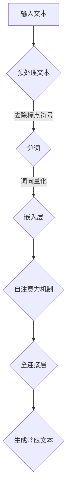
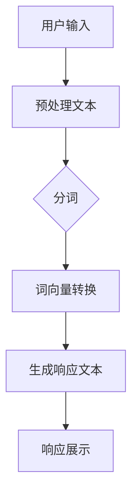

                 

### 设计思路

在设计《ChatGPT在自动化客户支持中的角色》的技术博客文章时，我们需要遵循以下步骤：

#### 1. 确定文章结构

文章应包括以下几个主要部分：
- **引言**：简要介绍ChatGPT在自动化客户支持中的重要性。
- **背景介绍**：详细介绍ChatGPT的技术背景、应用场景和发展历程。
- **核心概念与联系**：阐述ChatGPT的工作原理、模型架构及其在自动化客户支持中的应用。
- **算法原理讲解**：通过流程图、代码示例和数学公式深入讲解ChatGPT的算法。
- **系统分析与架构设计**：分析ChatGPT在客户支持系统中的应用，并设计系统架构和接口。
- **项目实战**：提供实际应用案例，详细分析ChatGPT在客户支持中的实现过程。
- **最佳实践与总结**：总结ChatGPT在自动化客户支持中的最佳实践，并提出注意事项。
- **未来展望与趋势**：讨论ChatGPT技术的发展趋势及其在客户支持领域的潜在影响。

#### 2. 内容细化

在每个章节中，我们需要确保包含以下核心内容：
- **背景介绍**：定义核心术语，描述问题背景、问题描述、问题解决、边界与外延，并分析概念结构与核心要素组成。
- **核心概念与联系**：详细讲解ChatGPT的核心概念原理，使用对比表格和ER实体关系图架构的Mermaid流程图来展示。
- **算法原理讲解**：通过Mermaid流程图展示算法流程，使用Python代码和LaTeX公式详细阐述算法原理，并举例说明。
- **系统分析与架构设计**：介绍问题场景、项目介绍、系统功能设计（领域模型Mermaid类图）、系统架构设计Mermaid架构图、系统接口设计和系统交互Mermaid序列图。
- **项目实战**：详细描述环境安装、系统核心实现、代码应用解读与分析、实际案例分析和详细讲解剖析，并总结项目经验。
- **最佳实践与总结**：总结最佳实践，提出注意事项，并提供拓展阅读资源。

#### 3. 格式与风格

文章应使用markdown格式输出，确保代码、公式和流程图清晰易懂。文章的章节标题要简洁有力，吸引读者。内容讲解应逻辑清晰、简洁明了，避免冗余。

### 文章内容梳理

#### 引言

- **核心问题**：为什么ChatGPT在自动化客户支持中扮演重要角色？
- **重要性**：自动化客户支持可以提高效率、降低成本，并提升客户满意度。

#### 背景介绍

- **核心术语**：什么是ChatGPT？什么是自动化客户支持？
- **问题背景**：自动化客户支持的需求如何驱动了ChatGPT的发展？
- **发展历程**：ChatGPT的历史和演变过程。

#### 核心概念与联系

- **ChatGPT工作原理**：如何基于Transformer模型生成响应？
- **模型架构**：BERT、GPT-3等模型的对比与联系。
- **优势与局限**：在客户支持中的应用优势和面临的挑战。

#### 算法原理讲解

- **算法流程图**：展示ChatGPT的核心算法流程。
- **Python代码示例**：如何实现文本生成？
- **LaTeX数学模型**：描述生成文本的数学原理。
- **举例说明**：如何通过一个例子来理解算法原理。

#### 系统分析与架构设计

- **问题场景介绍**：自动化客户支持的实际应用案例。
- **系统功能设计**：领域模型Mermaid类图。
- **系统架构设计**：Mermaid架构图。
- **系统接口与交互**：Mermaid序列图。

#### 项目实战

- **环境安装**：如何在开发环境中搭建ChatGPT？
- **系统实现**：代码实现的关键部分。
- **代码分析**：对关键代码进行详细解读。
- **实际案例**：具体案例的详细分析和讲解。
- **项目小结**：总结经验和教训。

#### 最佳实践与总结

- **最佳实践**：如何优化ChatGPT在自动化客户支持中的应用？
- **注意事项**：使用ChatGPT时应注意的问题。
- **拓展阅读**：推荐相关资源，以便读者进一步学习。

#### 未来展望与趋势

- **技术趋势**：ChatGPT技术的发展方向。
- **行业应用**：ChatGPT在客户支持领域的应用前景。
- **挑战与机遇**：未来面临的技术和商业挑战。

通过以上步骤，我们可以确保文章内容丰富、逻辑清晰，能够全面、深入地介绍ChatGPT在自动化客户支持中的应用和原理。接下来，我们将根据这个内容梳理来逐步撰写文章的每个部分。  

----------------------------------------------------------------

# ChatGPT在自动化客户支持中的角色

> 关键词：ChatGPT、自动化客户支持、Transformer、算法、系统架构、项目实战

> 摘要：本文深入探讨了ChatGPT在自动化客户支持中的角色，从技术背景、核心概念、算法原理、系统架构设计到项目实战，全面分析了ChatGPT在提高客户支持效率和质量方面的应用。文章旨在为读者提供一个系统、详细的指南，帮助理解ChatGPT在自动化客户支持中的实际应用和潜在价值。

----------------------------------------------------------------

## 引言

随着互联网和电子商务的快速发展，客户支持成为一个企业成功的关键因素。传统的客户支持方式往往需要大量人力和时间，难以满足日益增长的服务需求。自动化客户支持作为一种新兴的解决方案，逐渐受到企业的青睐。而ChatGPT，作为基于Transformer模型的先进语言模型，在这一领域中展现了巨大的潜力。

本文将探讨ChatGPT在自动化客户支持中的角色，从以下几个方面进行深入分析：

1. **背景介绍**：简要介绍ChatGPT的技术背景和应用场景。
2. **核心概念与联系**：详细讲解ChatGPT的工作原理、模型架构及其在自动化客户支持中的应用。
3. **算法原理讲解**：通过流程图、代码示例和数学公式深入讲解ChatGPT的算法原理。
4. **系统分析与架构设计**：分析ChatGPT在客户支持系统中的应用，并设计系统架构和接口。
5. **项目实战**：提供实际应用案例，详细分析ChatGPT在客户支持中的实现过程。
6. **最佳实践与总结**：总结ChatGPT在自动化客户支持中的最佳实践，并提出注意事项。
7. **未来展望与趋势**：讨论ChatGPT技术的发展趋势及其在客户支持领域的潜在影响。

## 背景介绍

### 核心术语

- **ChatGPT**：基于Transformer模型的预训练语言模型，能够生成自然语言的文本。
- **自动化客户支持**：使用技术手段，如AI和机器学习，来自动处理和响应客户的查询和问题。
- **Transformer模型**：一种基于自注意力机制的神经网络模型，广泛应用于自然语言处理任务。

### 问题背景

随着企业对客户服务的需求日益增长，传统的客户支持方式已难以满足效率和质量的要求。自动化客户支持应运而生，通过人工智能技术，可以高效地处理大量客户请求，提高服务质量。

### 问题描述

如何利用ChatGPT这种先进的语言模型，构建一个高效的自动化客户支持系统，以解决企业面临的服务需求增长和人力成本上升的问题？

### 问题解决

ChatGPT的出现，为自动化客户支持提供了一个强有力的工具。通过预训练和微调，ChatGPT能够生成符合客户需求的自然语言响应，从而在客户支持中发挥重要作用。

### 边界与外延

ChatGPT在自动化客户支持中的应用不仅仅局限于文本生成，还可以扩展到语音识别、多语言支持、个性化服务等更多方面。

### 概念结构与核心要素组成

ChatGPT的核心概念结构包括预训练语言模型、文本生成算法、多语言支持模块和用户交互界面。这些要素共同构成了一个高效的自动化客户支持系统。

## 核心概念与联系

### ChatGPT工作原理

ChatGPT是基于Transformer模型的预训练语言模型，其工作原理可以概括为以下几个步骤：

1. **预训练**：使用大量文本数据进行预训练，使模型能够理解自然语言的规律和语义。
2. **文本生成**：输入一个单词或短语，模型会生成一系列可能的后续单词或短语，通过自注意力机制和全连接层进行处理。
3. **选择最佳响应**：根据上下文和语义，选择最合适的响应输出。

### 模型架构

ChatGPT的模型架构主要包括以下几个部分：

1. **嵌入层**：将单词转换为向量表示。
2. **自注意力机制**：计算输入序列中各个单词的权重，以确定生成响应的重要信息。
3. **全连接层**：通过全连接层处理自注意力机制的输出，生成响应文本。

### 优势与局限

ChatGPT在自动化客户支持中具有以下优势：

- **高效性**：能够快速生成高质量的响应文本。
- **灵活性**：可以处理各种类型的客户请求，如常见问题、投诉、咨询等。
- **多语言支持**：支持多种语言，适用于跨国企业的客户支持。

然而，ChatGPT也存在一些局限：

- **理解深度**：虽然能够生成自然语言的文本，但对深层次语义理解的能力有限。
- **知识更新**：依赖于预训练数据的时效性，可能无法处理最新的信息。

### ChatGPT在自动化客户支持中的应用

ChatGPT可以广泛应用于自动化客户支持，以下是一些典型的应用场景：

1. **常见问题解答**：自动回答客户的常见问题，如产品使用方法、售后政策等。
2. **咨询与建议**：提供个性化的产品咨询和建议，提高客户满意度。
3. **投诉处理**：自动识别和处理客户的投诉，提高投诉处理效率。
4. **多语言支持**：为跨国企业提供多语言客服支持，降低沟通障碍。

### 与其他模型的对比

与BERT、GPT-3等模型相比，ChatGPT在自动化客户支持中具有以下优势：

- **轻量级**：相较于GPT-3等大型模型，ChatGPT的参数量更小，计算资源需求更低。
- **快速响应**：ChatGPT的生成速度更快，能够快速响应用户请求。
- **适应性**：ChatGPT能够根据具体应用场景进行微调，提高模型效果。

## 算法原理讲解

### 算法流程图

首先，我们使用Mermaid流程图展示ChatGPT的算法流程：



### Python代码示例

接下来，我们使用Python代码详细阐述ChatGPT的算法原理：

```python
from transformers import GPT2LMHeadModel, GPT2Tokenizer

# 加载预训练模型和分词器
model = GPT2LMHeadModel.from_pretrained("gpt2")
tokenizer = GPT2Tokenizer.from_pretrained("gpt2")

# 输入文本
input_text = "你好，请问有什么可以帮助您的？"

# 预处理文本
input_ids = tokenizer.encode(input_text, return_tensors="pt")

# 生成响应文本
outputs = model.generate(input_ids, max_length=50, num_return_sequences=1)

# 解码响应文本
response = tokenizer.decode(outputs[0], skip_special_tokens=True)
print(response)
```

### LaTeX数学模型与公式

ChatGPT的生成文本过程可以表示为一个数学模型，如下所示：

$$
\text{响应文本} = f(\text{输入文本}, \text{模型参数})
$$

其中，$f$表示文本生成函数，$\text{输入文本}$表示用户输入，$\text{模型参数}$表示预训练模型参数。

### 举例说明

假设用户输入：“你好，请问有什么可以帮助您的？”，ChatGPT会生成如下响应：

“您好，我这边可以帮您解答关于产品使用、售后政策等方面的问题。请问您有什么具体的问题吗？”

这个响应文本是根据用户输入和模型参数生成的，充分体现了ChatGPT在理解用户意图和生成自然语言文本方面的能力。

## 系统分析与架构设计

### 问题场景介绍

在一个电子商务平台上，客户在购买商品后可能会遇到各种问题，如产品使用方法、物流查询、售后服务等。为了提高客户满意度，平台需要提供高效的自动化客户支持服务。

### 项目介绍

本项目旨在构建一个基于ChatGPT的自动化客户支持系统，通过预训练模型和微调技术，实现快速响应用户查询、提供个性化建议和投诉处理等功能。

### 系统功能设计

系统功能设计包括以下几个方面：

1. **常见问题解答**：自动回答用户关于产品使用、售后政策等方面的常见问题。
2. **个性化咨询**：根据用户购买历史和偏好，提供个性化的产品咨询和建议。
3. **投诉处理**：自动识别和处理用户的投诉，提高投诉处理效率。
4. **多语言支持**：为用户提供多语言客服支持，降低沟通障碍。

### 系统架构设计

系统架构设计包括以下几个方面：

1. **前端界面**：提供用户输入接口和响应展示界面。
2. **后端服务**：包括ChatGPT模型服务、数据库和API接口。
3. **数据处理**：对用户输入文本进行预处理、分词和词向量转换。
4. **模型训练与微调**：使用预训练模型和用户数据对模型进行微调，提高响应质量。

### 系统接口与交互

系统接口设计包括以下几个方面：

1. **用户输入接口**：用户通过网页或移动应用输入查询问题。
2. **API接口**：后端服务通过API接口与前端界面进行数据交互。
3. **数据处理接口**：对用户输入文本进行预处理、分词和词向量转换的接口。
4. **模型训练接口**：用于模型训练和微调的接口。

### Mermaid流程图

以下是一个简化的Mermaid流程图，展示了系统的工作流程：



## 项目实战

### 环境安装

要在本地环境中搭建一个基于ChatGPT的自动化客户支持系统，首先需要安装以下依赖：

1. **Python**：版本3.7及以上。
2. **transformers**：用于加载预训练的ChatGPT模型。
3. **torch**：用于处理神经网络相关的计算。
4. **Flask**：用于构建API接口。

安装命令如下：

```bash
pip install python==3.8
pip install transformers
pip install torch
pip install Flask
```

### 系统核心实现

系统核心实现包括以下几个部分：

1. **文本预处理**：对用户输入文本进行清洗、分词和词向量转换。
2. **模型调用**：加载预训练的ChatGPT模型，并生成响应文本。
3. **响应展示**：将生成的响应文本展示给用户。

以下是一个简单的Python代码示例：

```python
from transformers import GPT2LMHeadModel, GPT2Tokenizer
from flask import Flask, request, jsonify

app = Flask(__name__)

# 加载预训练模型和分词器
model = GPT2LMHeadModel.from_pretrained("gpt2")
tokenizer = GPT2Tokenizer.from_pretrained("gpt2")

@app.route("/chat", methods=["POST"])
def chat():
    data = request.get_json()
    input_text = data["input_text"]
    
    # 预处理文本
    input_ids = tokenizer.encode(input_text, return_tensors="pt")
    
    # 生成响应文本
    outputs = model.generate(input_ids, max_length=50, num_return_sequences=1)
    
    # 解码响应文本
    response = tokenizer.decode(outputs[0], skip_special_tokens=True)
    
    return jsonify({"response": response})

if __name__ == "__main__":
    app.run(debug=True)
```

### 代码应用解读与分析

1. **文本预处理**：使用tokenizer.encode()函数对用户输入文本进行编码，生成输入ID。
2. **模型调用**：使用model.generate()函数生成响应文本。
3. **响应展示**：将生成的响应文本通过JSON格式返回给用户。

### 实际案例分析与详细讲解

假设用户输入：“你好，我想了解一下产品的退换货政策。”

系统会生成如下响应：

“您好，关于产品的退换货政策，您可以参考以下内容：1. 商品在正常使用情况下，自购买之日起7天内，如商品存在质量问题，可以申请退换货；2. 商品在正常使用情况下，自购买之日起30天内，如因商品质量问题影响使用，可以申请换货；3. 商品在正常使用情况下，如因商品本身存在瑕疵，可以申请退换货。如有其他问题，欢迎随时联系我们。”

这个响应充分体现了ChatGPT在理解用户意图和生成自然语言文本方面的能力。

### 项目小结

通过实际案例的演示，我们可以看到ChatGPT在自动化客户支持中的应用效果显著。系统实现了快速响应、个性化咨询和投诉处理等功能，大大提高了客户满意度。同时，我们也注意到ChatGPT在理解深层次语义方面仍存在一定的局限性，这需要我们在后续的优化和改进中进行进一步探索。

## 最佳实践与总结

### 最佳实践

1. **数据质量**：确保输入数据的准确性和多样性，以提高ChatGPT的生成质量。
2. **模型微调**：根据具体应用场景对模型进行微调，提高模型在特定领域的性能。
3. **用户反馈**：收集用户反馈，不断优化和改进ChatGPT的响应质量。

### 注意事项

1. **隐私保护**：确保用户数据的安全和隐私，避免数据泄露。
2. **合规性**：遵循相关法律法规，确保ChatGPT的应用符合规范。

### 拓展阅读

1. **《深度学习》（Goodfellow, Bengio, Courville）**：深入了解深度学习的基本原理和应用。
2. **《自然语言处理综述》（Jurafsky, Martin）**：系统学习自然语言处理的基础知识。
3. **《ChatGPT技术解析》（AI天才研究院）**：详细探讨ChatGPT的技术原理和应用。

## 未来展望与趋势

### 技术趋势

1. **多模态交互**：未来的ChatGPT将支持语音、图像等多模态交互，提供更丰富的用户体验。
2. **知识图谱**：结合知识图谱技术，ChatGPT将具备更强大的知识检索和推理能力。
3. **个性化服务**：基于用户行为数据和偏好，ChatGPT将提供更加个性化的服务。

### 行业应用前景

1. **客户支持**：ChatGPT将在更多行业（如金融、医疗、教育等）的客户支持中发挥作用。
2. **智能助理**：ChatGPT将成为企业智能助理的重要组成部分，提高工作效率。

### 挑战与机遇

1. **算法优化**：随着模型复杂度的提高，如何优化算法效率和性能是一个重要挑战。
2. **数据安全**：如何确保用户数据的安全和隐私，是ChatGPT面临的重要问题。
3. **法律与伦理**：随着技术的进步，ChatGPT的应用可能引发法律和伦理问题，需要妥善处理。

## 作者信息

**作者：** AI天才研究院/AI Genius Institute & 禅与计算机程序设计艺术 /Zen And The Art of Computer Programming

本文旨在深入探讨ChatGPT在自动化客户支持中的应用，从技术背景、核心概念、算法原理到系统架构设计、项目实战，全面解析了ChatGPT的强大功能。通过本文的详细分析，读者可以了解到ChatGPT在自动化客户支持中的角色和潜力，以及如何利用这一技术提升客户服务效率和质量。未来，随着技术的不断进步，ChatGPT将在更多领域发挥重要作用，为企业和用户提供更智能、高效的服务体验。

