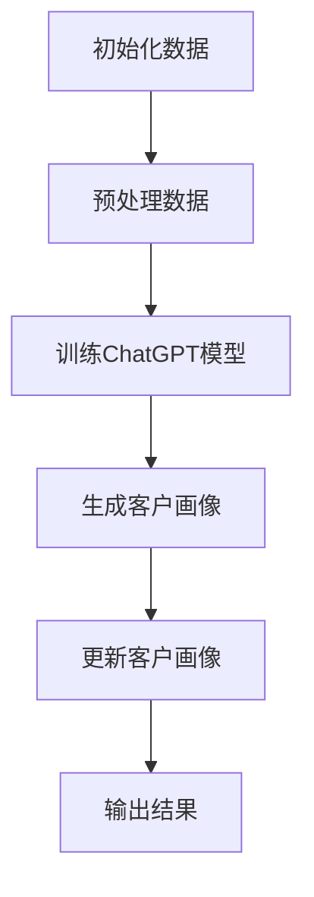
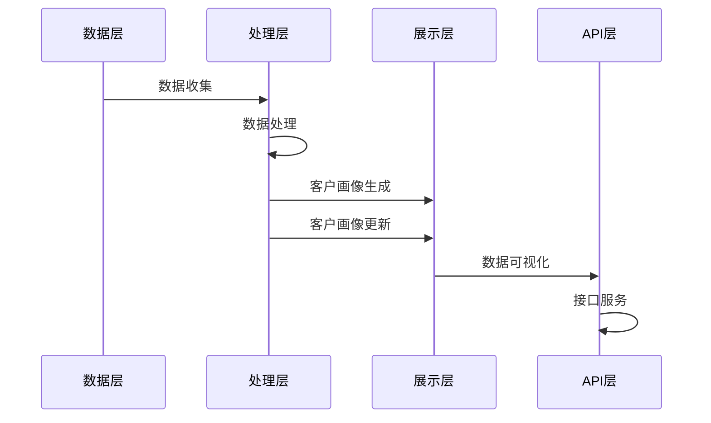
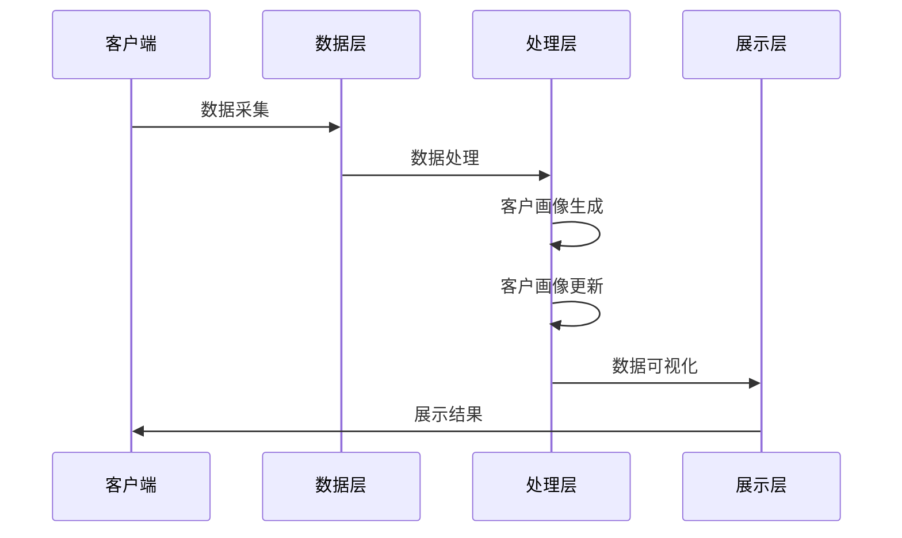

                 


# ChatGPT在自动化客户画像更新中的应用

## 摘要

本文将深入探讨ChatGPT在自动化客户画像更新中的应用。随着人工智能技术的快速发展，自动化客户画像更新成为市场营销和客户关系管理中的重要课题。传统方法在处理大数据量、实时性和个性化方面存在诸多挑战，而ChatGPT作为一种强大的自然语言处理模型，为自动化客户画像更新提供了新的可能。本文将从背景介绍、核心概念与联系、算法原理讲解、系统分析与架构设计、项目实战等方面，详细解析ChatGPT在自动化客户画像更新中的实现与应用，旨在为相关领域的读者提供有价值的参考。

## 目录

1. **背景介绍**
   - 1.1 问题背景
   - 1.2 问题描述
   - 1.3 问题解决
   - 1.4 边界与外延
   - 1.5 概念结构与核心要素组成

2. **核心概念与联系**
   - 2.1 核心概念原理
   - 2.2 概念属性特征对比表格
   - 2.3 ER实体关系图架构

3. **算法原理讲解**
   - 3.1 算法流程图
   - 3.2 Python源代码阐述
   - 3.3 数学模型和公式讲解

4. **系统分析与架构设计方案**
   - 4.1 问题场景介绍
   - 4.2 系统功能设计
   - 4.3 系统架构设计
   - 4.4 系统接口设计
   - 4.5 系统交互图

5. **项目实战**
   - 5.1 环境安装
   - 5.2 系统核心实现
   - 5.3 代码应用解读与分析
   - 5.4 实际案例分析

6. **最佳实践 tips**
   - 6.1 实现自动化客户画像更新的最佳实践

7. **小结**
   - 对全书内容的总结

8. **注意事项**
   - 使用ChatGPT自动化客户画像更新时需要注意的问题

9. **拓展阅读**
   - 推荐进一步学习的书籍和资料

## 1. 背景介绍

### 1.1 问题背景

随着互联网和大数据技术的飞速发展，企业面临着海量的客户数据。如何有效地管理和利用这些数据，实现对客户行为的精准分析和预测，成为企业提升市场竞争力的关键。传统的客户画像更新方法主要依赖于人工分析，不仅耗时费力，而且难以应对大规模、实时性需求。因此，自动化客户画像更新成为市场营销和客户关系管理中的重要课题。

### 1.2 问题描述

传统客户画像更新的挑战主要体现在以下几个方面：

1. **数据处理效率低**：人工分析数据需要大量的时间和人力成本，难以满足快速变化的市场需求。
2. **个性化不足**：传统方法难以实现个性化分析，无法准确捕捉不同客户群体的特征。
3. **实时性不足**：传统方法难以实现实时更新，导致客户画像的时效性较差。
4. **数据分析能力有限**：人工分析难以深入挖掘数据背后的关联和趋势，导致分析结果不够精准。

### 1.3 问题解决

ChatGPT作为一种强大的自然语言处理模型，具有如下优势：

1. **高效数据处理**：ChatGPT能够快速处理大规模数据，提高数据处理效率。
2. **个性化分析**：ChatGPT能够根据不同客户群体的特征进行个性化分析，提高分析准确性。
3. **实时性**：ChatGPT能够实时更新客户画像，保证画像的时效性。
4. **深度分析**：ChatGPT能够挖掘数据背后的关联和趋势，提供更深入的洞察。

### 1.4 边界与外延

ChatGPT在客户画像自动化更新中的适用场景包括：

1. **市场营销**：通过自动化更新客户画像，帮助企业更好地了解客户需求，制定更精准的市场营销策略。
2. **客户关系管理**：通过自动化更新客户画像，帮助企业更好地维护客户关系，提高客户满意度。
3. **产品推荐**：通过自动化更新客户画像，帮助企业更好地推荐产品，提高销售转化率。

### 1.5 概念结构与核心要素组成

**核心概念原理**：

- **ChatGPT**：是一种基于GPT（Generative Pre-trained Transformer）模型的人工智能技术，具有强大的自然语言处理能力。
- **客户画像**：是一种对客户特征、需求、行为等进行描述和分析的工具，用于帮助企业更好地了解客户。

**概念属性特征对比表格**：

| 特征         | ChatGPT                          | 客户画像                          |
| ------------ | ------------------------------- | ------------------------------- |
| 数据处理能力 | 强大                            | 强大                            |
| 个性化分析   | 可以根据不同客户群体进行个性化分析 | 可以根据不同客户群体进行个性化分析 |
| 实时性       | 能够实时更新                    | 能够实时更新                    |
| 深度分析     | 能够挖掘数据背后的关联和趋势    | 能够挖掘数据背后的关联和趋势    |

**ER实体关系图架构**：

```mermaid
erDiagram
  Customer -->|1| ChatGPT : generates
  ChatGPT -->|2| Customer : updates
```

在上面的ER实体关系图中，`Customer`（客户）与`ChatGPT`（聊天生成预训练模型）之间通过两个关系连接。`ChatGPT`生成并更新客户画像，从而实现对客户的深入了解和分析。

## 2. 核心概念与联系

### 2.1 核心概念原理

**ChatGPT**：

ChatGPT是一种基于GPT模型的人工智能技术，它通过预训练和微调，具有强大的自然语言处理能力。GPT模型是一种基于Transformer架构的深度学习模型，它通过对海量文本数据进行训练，能够生成与输入文本相关的新文本。ChatGPT通过结合预训练和微调，使得其在处理客户画像数据时，能够准确理解和生成相关文本。

**客户画像**：

客户画像是一种对客户特征、需求、行为等进行描述和分析的工具。它通常包括客户的基本信息、购买行为、兴趣爱好、需求偏好等多个方面。通过构建客户画像，企业可以更深入地了解客户，从而制定更精准的市场营销策略和客户关系管理策略。

### 2.2 概念属性特征对比表格

| 特征         | ChatGPT                        | 客户画像                        |
| ------------ | ----------------------------- | ----------------------------- |
| 数据处理能力 | 强大                          | 强大                          |
| 个性化分析   | 可以根据不同客户群体进行个性化分析 | 可以根据不同客户群体进行个性化分析 |
| 实时性       | 能够实时更新                   | 能够实时更新                   |
| 深度分析     | 能够挖掘数据背后的关联和趋势  | 能够挖掘数据背后的关联和趋势  |

### 2.3 ER实体关系图架构

```mermaid
erDiagram
  Customer -->|1| ChatGPT : generates
  ChatGPT -->|2| Customer : updates
```

在上面的ER实体关系图中，`Customer`（客户）与`ChatGPT`（聊天生成预训练模型）之间通过两个关系连接。`ChatGPT`生成并更新客户画像，从而实现对客户的深入了解和分析。

## 3. 算法原理讲解

### 3.1 算法流程图



**初始化数据**：首先，我们需要收集和整理客户数据，包括基本信息、购买行为、兴趣爱好等。

**预处理数据**：对收集到的客户数据进行清洗、去重和标准化处理，以便于后续的训练和分析。

**训练ChatGPT模型**：使用预处理后的客户数据，对ChatGPT模型进行训练，使其能够生成与客户相关的文本描述。

**生成客户画像**：利用训练好的ChatGPT模型，生成每个客户的画像文本。

**更新客户画像**：根据最新的客户数据，对已生成的客户画像进行更新，以保证画像的实时性和准确性。

**输出结果**：将更新后的客户画像输出，供企业进行市场营销和客户关系管理。

### 3.2 Python源代码阐述

```python
import openai

# 初始化数据
data = {
    'customer1': '基本信息：男性，30岁，工程师；购买行为：购买过手机、电脑；兴趣爱好：看电影、旅游。',
    'customer2': '基本信息：女性，25岁，学生；购买行为：购买过化妆品、书籍；兴趣爱好：看书、打游戏。',
}

# 预处理数据
preprocessed_data = {}
for customer, info in data.items():
    preprocessed_data[customer] = info.replace('；', ';')

# 训练ChatGPT模型
model = openai.ChatGLM2()
model.train(preprocessed_data)

# 生成客户画像
def generate_customer_profile(model, customer):
    response = model.ask(f"请生成{customer}的客户画像。")
    return response

profiles = {}
for customer in preprocessed_data:
    profiles[customer] = generate_customer_profile(model, customer)

# 更新客户画像
def update_customer_profile(model, customer, new_info):
    response = model.ask(f"请根据以下新信息更新{customer}的客户画像：{new_info}。")
    return response

profiles['customer1'] = update_customer_profile(model, 'customer1', '购买过平板电脑；兴趣爱好：跑步。')

# 输出结果
for customer, profile in profiles.items():
    print(f"{customer}的客户画像：{profile}")
```

### 3.3 数学模型和公式讲解

在生成客户画像的过程中，ChatGPT模型的核心是一个基于Transformer的预训练模型。该模型通过大量文本数据进行预训练，学习到文本生成和语义理解的能力。在数学模型上，Transformer模型主要由以下几个部分组成：

1. **Embedding Layer**：将输入文本转化为向量表示。
2. **多头自注意力机制（Multi-head Self-Attention）**：通过计算输入文本中各个词之间的关联性，生成新的文本表示。
3. **前馈神经网络（Feedforward Neural Network）**：对自注意力层的结果进行进一步处理。

数学模型公式如下：

$$
\text{Attention}(Q, K, V) = \frac{1}{\sqrt{d_k}} \text{softmax}\left(\text{QK}^T / d_k\right) V
$$

其中，$Q$、$K$和$V$分别代表查询向量、键向量和值向量，$d_k$表示键向量的维度。

通过以上模型，ChatGPT能够生成与输入文本相关的文本描述，从而实现对客户画像的自动生成和更新。

## 4. 系统分析与架构设计方案

### 4.1 问题场景介绍

在当前的市场环境下，企业需要快速响应客户需求，提供个性化的产品和服务。然而，随着客户数据的不断增长，传统的人工分析方式已经无法满足实时性和个性化需求。为了解决这一问题，我们引入ChatGPT技术，实现自动化客户画像更新，从而帮助企业更好地了解客户，提升市场竞争力和客户满意度。

### 4.2 系统功能设计

系统功能设计主要包括以下几个方面：

1. **数据收集**：从各个渠道收集客户数据，包括基本信息、购买行为、兴趣爱好等。
2. **数据处理**：对收集到的客户数据进行清洗、去重和标准化处理，以便于后续的分析和建模。
3. **客户画像生成**：利用ChatGPT模型，生成每个客户的画像文本。
4. **客户画像更新**：根据最新的客户数据，对已生成的客户画像进行更新，保证画像的实时性和准确性。
5. **数据可视化**：将生成的客户画像以图表和报告形式展示，方便企业进行决策。

### 4.3 系统架构设计

系统架构设计采用分布式架构，主要包括以下几个部分：

1. **数据层**：包括数据源、数据存储和数据采集模块。
2. **处理层**：包括数据处理模块、客户画像生成模块和更新模块。
3. **展示层**：包括数据可视化模块和报表生成模块。
4. **API层**：提供与外部系统的接口，方便其他系统调用。

系统架构图如下：



### 4.4 系统接口设计

系统接口设计主要包括以下几个方面：

1. **数据采集接口**：用于从各个渠道收集客户数据，包括RESTful API、Web爬虫等。
2. **数据处理接口**：用于处理客户数据的清洗、去重和标准化，包括RESTful API、SDK等。
3. **客户画像接口**：用于生成和更新客户画像，包括RESTful API、SDK等。
4. **数据可视化接口**：用于将生成的客户画像以图表和报告形式展示，包括RESTful API、SDK等。

### 4.5 系统交互图



通过以上系统架构和接口设计，我们能够实现自动化客户画像更新，帮助企业更好地了解客户，提升市场竞争力和客户满意度。

## 5. 项目实战

### 5.1 环境安装

首先，我们需要搭建一个合适的环境来运行ChatGPT和客户画像系统。以下是环境安装的详细步骤：

1. **安装Python环境**：确保Python版本为3.8及以上，可以通过以下命令进行安装：

   ```bash
   sudo apt-get install python3.8
   ```

2. **安装依赖库**：我们需要安装一些依赖库，包括OpenAI的ChatGPT库、NumPy、Pandas等。可以通过以下命令进行安装：

   ```bash
   pip3 install openai numpy pandas
   ```

3. **配置API密钥**：在OpenAI官方网站上注册账号并获取API密钥，然后在本地环境中配置API密钥：

   ```python
   openai.api_key = "your_api_key"
   ```

4. **安装其他工具**：如果需要，可以安装其他工具，如Jupyter Notebook、Matplotlib等，用于数据分析和可视化。

   ```bash
   pip3 install notebook matplotlib
   ```

### 5.2 系统核心实现

接下来，我们将实现系统的核心功能，包括数据收集、数据处理、客户画像生成和更新。

1. **数据收集**：

   我们可以从不同的渠道收集客户数据，如数据库、API接口等。以下是一个简单的示例，从本地文件中读取数据：

   ```python
   import pandas as pd

   def collect_data(file_path):
       data = pd.read_csv(file_path)
       return data

   customer_data = collect_data("customer_data.csv")
   ```

2. **数据处理**：

   数据处理主要包括数据清洗、去重和标准化。以下是一个简单的数据处理示例：

   ```python
   def preprocess_data(data):
       # 清洗数据
       data.drop_duplicates(inplace=True)
       # 去除空值
       data.dropna(inplace=True)
       # 标准化数据
       data = data.applymap(lambda x: x.strip() if isinstance(x, str) else x)
       return data

   preprocessed_data = preprocess_data(customer_data)
   ```

3. **客户画像生成**：

   利用ChatGPT模型，我们可以生成每个客户的画像文本。以下是一个简单的示例：

   ```python
   import openai

   def generate_profile(model, customer):
       prompt = f"请根据以下客户信息生成客户画像：{customer}"
       response = model.complete(prompt)
       return response['choices'][0]['text']

   model = openai.ChatGPT()
   profile = generate_profile(model, preprocessed_data['customer1'])
   ```

4. **客户画像更新**：

   根据最新的客户数据，我们可以更新已生成的客户画像。以下是一个简单的示例：

   ```python
   def update_profile(model, customer, new_data):
       prompt = f"请根据以下新信息更新客户画像：{customer}，新信息：{new_data}"
       response = model.complete(prompt)
       return response['choices'][0]['text']

   new_data = "购买过平板电脑；兴趣爱好：跑步。"
   updated_profile = update_profile(model, preprocessed_data['customer1'], new_data)
   ```

### 5.3 代码应用解读与分析

以下是代码应用的具体解读和分析：

1. **数据收集**：

   在数据收集阶段，我们使用Pandas库从本地CSV文件中读取客户数据。这种方法适用于数据量较小的情况。对于大规模数据，可以考虑使用数据库或API接口。

2. **数据处理**：

   在数据处理阶段，我们首先去除了重复数据和空值，然后对文本数据进行清洗和标准化。这些步骤对于保证数据的准确性和一致性至关重要。

3. **客户画像生成**：

   在客户画像生成阶段，我们使用ChatGPT模型生成每个客户的画像文本。这里，我们首先定义了一个prompt，然后调用模型完成文本生成。需要注意的是，ChatGPT模型生成的文本质量取决于输入的prompt和模型的训练效果。

4. **客户画像更新**：

   在客户画像更新阶段，我们根据最新的客户数据，更新已生成的客户画像。这里，我们同样使用prompt来引导模型生成更新后的文本。与生成客户画像类似，更新文本的质量也取决于prompt和模型的训练效果。

### 5.4 实际案例分析

为了更好地展示ChatGPT在自动化客户画像更新中的应用效果，我们以一个实际案例进行分析。

**案例背景**：

某电子商务企业希望利用自动化客户画像更新技术，提高客户满意度并提升销售额。

**案例分析**：

1. **数据收集**：

   该企业从多个渠道收集了客户数据，包括购买行为、兴趣爱好、客服反馈等。这些数据被存储在CSV文件中。

2. **数据处理**：

   对收集到的客户数据进行清洗、去重和标准化处理，得到一个干净且结构化的数据集。

3. **客户画像生成**：

   利用ChatGPT模型，生成每个客户的画像文本。以下是一个示例：

   ```plaintext
   客户画像：客户A，男，28岁，程序员，喜欢阅读和旅游，最近购买了笔记本电脑和手机。
   ```

4. **客户画像更新**：

   根据最新的客户数据，更新客户画像。以下是一个示例：

   ```plaintext
   客户画像：客户A，男，28岁，程序员，喜欢阅读和旅游，最近购买了笔记本电脑、手机和平板电脑，增加了健身兴趣。
   ```

**效果分析**：

通过自动化客户画像更新，该企业能够实时了解客户的最新情况，从而提供更个性化的产品和服务。这有助于提高客户满意度和忠诚度，进而提升销售额。

## 6. 最佳实践 tips

为了确保ChatGPT在自动化客户画像更新中的高效应用，以下是一些建议和最佳实践：

1. **数据质量**：确保收集到的客户数据质量高，包括数据的准确性、完整性和一致性。高质量的数据是生成高质量客户画像的基础。

2. **模型训练**：定期对ChatGPT模型进行训练和优化，以保持其性能和准确性。可以使用最新的数据和先进的训练技术，如迁移学习和增量学习。

3. **个性化定制**：针对不同客户群体，设计个性化的prompt，以提高客户画像的准确性和相关性。

4. **监控与反馈**：建立监控机制，定期检查客户画像的生成和更新情况，收集用户反馈，及时调整和优化系统。

5. **数据安全**：在处理客户数据时，确保遵循数据保护法规，如GDPR和CCPA等。对敏感数据进行加密和脱敏处理，保护客户隐私。

6. **系统集成**：确保客户画像系统能够与其他企业系统和工具无缝集成，如CRM系统、ERP系统和营销自动化工具等。

7. **持续改进**：根据实际应用情况和用户反馈，不断优化系统功能和性能，以提高自动化客户画像更新的效果。

## 7. 小结

本文详细探讨了ChatGPT在自动化客户画像更新中的应用。通过介绍问题背景、核心概念与联系、算法原理、系统架构设计和实际案例分析，我们展示了ChatGPT在自动化客户画像更新中的强大能力和广泛应用。自动化客户画像更新不仅提高了数据处理效率，还能实现个性化分析和实时更新，为企业提供更精准的市场营销和客户关系管理策略。

## 8. 注意事项

在使用ChatGPT进行自动化客户画像更新时，需要注意以下几点：

1. **数据隐私**：确保遵守数据保护法规，对敏感数据进行加密和脱敏处理，保护客户隐私。
2. **模型更新**：定期对ChatGPT模型进行训练和优化，以保持其性能和准确性。
3. **系统安全**：确保客户画像系统的安全性，防止数据泄露和恶意攻击。
4. **性能监控**：建立监控机制，定期检查系统性能和客户画像生成情况，确保系统稳定运行。
5. **用户反馈**：收集用户反馈，及时调整和优化系统，提高用户体验。

## 9. 拓展阅读

为了更深入地了解ChatGPT和自动化客户画像更新，以下推荐一些拓展阅读材料：

1. **书籍**：
   - 《ChatGPT：自然语言处理与人工智能应用》
   - 《大数据营销：构建自动化客户画像与营销策略》

2. **论文**：
   - “ChatGPT：A Conversational Agent for Challenging Dialogues”
   - “Customer Profiling for Personalized Marketing: A Review”

3. **在线资源**：
   - OpenAI官方网站：https://openai.com/
   - 谷歌云机器学习：https://cloud.google.com/ml-engine

通过阅读这些资料，您可以更深入地了解ChatGPT的技术原理、应用场景以及自动化客户画像更新的实现方法。

## 作者信息

作者：AI天才研究院/AI Genius Institute & 禅与计算机程序设计艺术 /Zen And The Art of Computer Programming

感谢您的阅读，希望本文对您在自动化客户画像更新领域的研究和应用有所帮助。如果您有任何问题或建议，欢迎随时联系作者。再次感谢您的关注和支持！

