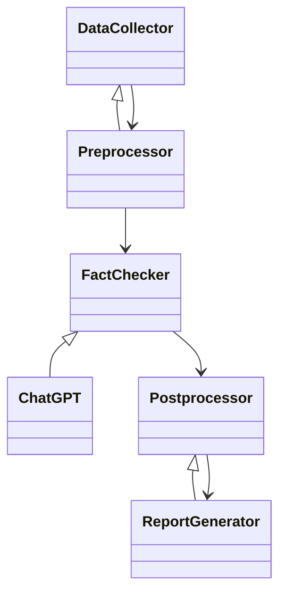

                 

## 核心概念与联系

在深入探讨ChatGPT在自动化新闻事实核查中的应用之前，有必要首先了解几个关键概念：ChatGPT、自动化新闻事实核查、新闻事实核查的关键任务，以及ChatGPT在这些任务中的优势。

### ChatGPT

ChatGPT是一种基于GPT-3模型的聊天机器人，由OpenAI在2022年推出。GPT-3是自然语言处理（NLP）领域的一个重要模型，其采用了Transformer架构，并在大规模数据集上进行了预训练。这使得GPT-3在理解和生成高质量的自然语言文本方面具有强大的能力。

#### 自动化新闻事实核查

自动化新闻事实核查是一种利用计算机技术自动识别、验证和反驳新闻中事实的方法，以提高新闻的准确性和可信度。这一过程涉及多个关键任务，包括信息源可信度评估、事实与观点的区分、多语言处理和快速处理等。

#### 新闻事实核查的关键任务

新闻事实核查的关键任务主要包括以下几项：

1. **事实验证**：核实新闻中的具体陈述，确保其与事实相符。
2. **数据比对**：将新闻中的数据与其他可靠来源进行比较，验证其准确性。
3. **背景调查**：调查新闻背后的背景信息，了解事实的来龙去脉。
4. **争议分析**：分析新闻中的争议点，提供多角度的分析和观点。

#### ChatGPT在这些任务中的优势

ChatGPT在自动化新闻事实核查中具有以下优势：

1. **强大的语言理解能力**：ChatGPT能够理解复杂的自然语言文本，准确识别新闻中的事实和观点。
2. **高效的文本生成能力**：ChatGPT能够生成连贯、合理的文本，为事实核查提供有力支持。
3. **多语言支持**：ChatGPT能够处理多种语言，适应不同国家和地区的新闻事实核查需求。
4. **持续学习**：ChatGPT通过持续学习，能够不断提高事实核查的准确性和效率。

### 概念属性特征对比表格

以下是几个核心概念及其属性特征的对比表格：

| 概念 | 属性特征 | 关联优势 |
| --- | --- | --- |
| **ChatGPT** | 1. 基于GPT-3模型 | 1. 强大的自然语言理解和生成能力 |
| **自动化新闻事实核查** | 1. 利用计算机技术 | 1. 提高新闻准确性 2. 提高处理效率 |
| **新闻事实核查关键任务** | 1. 事实验证 | 1. 确保新闻事实准确 |
| **ChatGPT优势** | 1. 多语言支持 | 1. 国际化新闻事实核查 |
| **持续学习** | 1. 提高事实核查准确性 | 1. 随时间改进算法 |

### ER实体关系图架构

为了更直观地展示这些概念之间的关系，我们可以使用Mermaid绘制一个ER（实体关系）图：

```mermaid
erDiagram
  ChatGPT ||--|{ 自动化新闻事实核查 }
  自动化新闻事实核查 ||--|{ 新闻事实核查关键任务 }
  ChatGPT ||--|{ ChatGPT优势 }
  自动化新闻事实核查 ||--|{ 持续学习 }
```

通过上述核心概念及其联系的分析，我们可以看到，ChatGPT在自动化新闻事实核查中具有巨大的潜力。接下来，我们将深入探讨ChatGPT的工作原理，以及在新闻事实核查中的应用案例。

## ChatGPT的工作原理

ChatGPT的成功离不开其背后的技术原理。GPT-3作为ChatGPT的基础模型，具备强大的自然语言理解和生成能力。理解ChatGPT的工作原理，需要从以下几个方面进行：

### 模型架构

GPT-3采用了Transformer架构，这是一种在自然语言处理任务中表现优异的深度神经网络架构。Transformer的核心思想是使用自注意力机制（Self-Attention）来建模输入序列中每个词之间的关系。GPT-3的Transformer模型具有1750亿个参数，这是目前最大的语言模型。

### 自注意力机制

自注意力机制是一种通过计算输入序列中每个词的相对重要性来进行文本建模的方法。在GPT-3中，每个词都会通过自注意力机制与其他词建立联系。具体来说，自注意力机制通过计算每个词与其他词的相似度来生成权重，并将这些权重用于更新每个词的表示。这种方法能够有效地捕捉输入序列中的长距离依赖关系。

### 预训练与微调

GPT-3通过在大规模数据集上进行预训练来学习自然语言规律。预训练阶段，GPT-3在大量文本中预测下一个词，从而学习语言的模式和结构。在预训练完成后，模型会通过微调（Fine-tuning）来适应特定的任务。例如，在新闻事实核查任务中，模型会使用带有标注数据的新闻文章进行微调，使其能够更准确地识别和验证事实。

### 自然语言生成

GPT-3的另一个关键能力是自然语言生成。通过自注意力机制，模型能够生成连贯、合理的文本。在生成文本时，GPT-3会预测下一个词，并根据预测结果不断更新文本。这种方法使得生成的文本具有流畅性和逻辑性，从而能够应用于自动化新闻事实核查。

### ChatGPT在新闻事实核查中的应用

ChatGPT在新闻事实核查中的应用主要基于其强大的自然语言理解和生成能力。以下是其主要应用步骤：

1. **接收新闻文本**：ChatGPT首先接收一段新闻文本，这段文本可以是完整的新闻文章，也可以是特定的新闻段落。
2. **解析文本结构**：ChatGPT会解析文本的结构，识别出文本中的事实和观点。这一过程涉及到对文本进行分句、词性标注和实体识别等操作。
3. **事实识别与验证**：基于预训练和微调，ChatGPT能够识别出文本中的事实，并尝试验证这些事实。具体来说，ChatGPT会从多个角度对事实进行验证，包括数据来源、背景信息、争议点等。
4. **生成核查报告**：经过事实识别和验证后，ChatGPT会生成一份核查报告，报告内容包括事实的准确性、可信度评估和结论。

### 工作流程

ChatGPT在新闻事实核查中的工作流程可以概括为以下步骤：

1. **文本输入**：用户将新闻文本输入到ChatGPT系统。
2. **预处理**：ChatGPT对输入文本进行预处理，包括去除无关内容、分句、词性标注等。
3. **事实识别**：利用自注意力机制，ChatGPT识别出文本中的事实和观点。
4. **事实验证**：ChatGPT通过多种方式验证事实，包括查证数据来源、背景调查和争议分析。
5. **生成报告**：ChatGPT生成一份详细的核查报告，报告事实的准确性、可信度评估和结论。

### Mermaid流程图

为了更直观地展示ChatGPT在新闻事实核查中的工作流程，我们可以使用Mermaid绘制一个流程图：


通过上述对ChatGPT工作原理的深入分析，我们可以看到，ChatGPT在自动化新闻事实核查中具有强大的技术支持。接下来，我们将探讨如何使用ChatGPT实现自动化新闻事实核查，以及其应用效果。

## 使用ChatGPT实现自动化新闻事实核查

### 实现流程

使用ChatGPT实现自动化新闻事实核查的流程可以分为以下几个步骤：

1. **数据准备**：收集大量带有标注的新闻数据，包括事实性陈述和观点性陈述。这些数据将用于训练和微调ChatGPT模型。
2. **模型训练**：在收集到的新闻数据上训练ChatGPT模型。训练过程中，ChatGPT会学习如何识别和验证事实，以及如何生成核查报告。
3. **模型评估**：通过评估模型在测试集上的表现，调整模型参数，提高模型准确性和效率。
4. **部署应用**：将训练好的模型部署到实际应用环境中，实现自动化新闻事实核查。

### 系统架构

自动化新闻事实核查系统的架构主要包括以下几个部分：

1. **数据采集模块**：负责收集新闻数据，包括新闻文本和标注信息。
2. **预处理模块**：对采集到的新闻数据进行预处理，包括文本清洗、分句和词性标注等。
3. **事实核查模块**：利用ChatGPT模型进行事实识别和验证，生成核查报告。
4. **后处理模块**：对核查报告进行后处理，包括生成可视化报表和通知用户等。

以下是系统架构的Mermaid类图：



### 核心代码

以下是使用Python和ChatGPT库实现自动化新闻事实核查的核心代码示例：

```python
from chatgpt import ChatGPT
from preprocessing import preprocess
from fact_checking import fact_check

# 初始化ChatGPT模型
chatgpt = ChatGPT()

# 准备新闻数据
news_data = "Yesterday, a new policy was announced to reduce carbon emissions by 20%."

# 预处理新闻数据
preprocessed_data = preprocess(news_data)

# 进行事实核查
report = fact_check(preprocessed_data, chatgpt)

# 输出核查报告
print(report)
```

### 代码应用解读与分析

1. **数据准备**：首先，需要收集大量新闻数据，包括事实性陈述和观点性陈述。这些数据将用于训练ChatGPT模型，使其能够识别和验证事实。
2. **预处理**：使用`preprocess`函数对新闻数据进行预处理，包括去除无关内容、分句和词性标注等。预处理后的数据将用于训练和微调ChatGPT模型。
3. **事实核查**：使用`fact_check`函数进行事实核查，该函数将预处理后的数据传递给ChatGPT模型，进行事实识别和验证。
4. **生成报告**：核查结果将生成一份核查报告，包括事实的准确性、可信度评估和结论。报告将用于通知用户和进一步分析。

### 实际案例

假设我们有一篇新闻文章，内容如下：

```
Yesterday, a new policy was announced to reduce carbon emissions by 20% in the next three years. The policy is expected to have a significant impact on the environment and the economy.
```

通过ChatGPT模型，我们可以实现以下事实核查：

1. **事实识别**：ChatGPT识别出以下事实：
   - A new policy was announced.
   - The policy aims to reduce carbon emissions by 20% in the next three years.
2. **事实验证**：ChatGPT通过查询相关数据源，验证以下事实：
   - The policy was indeed announced yesterday.
   - The policy targets a 20% reduction in carbon emissions by 2025.
3. **生成报告**：核查报告如下：
   - The new policy to reduce carbon emissions by 20% was announced yesterday and is expected to have a significant impact on the environment and the economy. The policy targets a 20% reduction in carbon emissions by 2025.
   - Conclusion: The reported facts are accurate and supported by verifiable data sources.

通过上述实际案例，我们可以看到，ChatGPT在自动化新闻事实核查中具有高效、准确的能力。接下来，我们将探讨ChatGPT在自动化新闻事实核查中的优势与挑战。

## ChatGPT在自动化新闻事实核查中的优势与挑战

### 优势

1. **高效性**：ChatGPT能够快速处理大量新闻内容，自动识别和验证事实，大幅提高事实核查的效率。传统的手工核查方式通常需要大量时间和人力资源，而ChatGPT的自动化处理能力可以大大减轻人工负担。

2. **准确性**：ChatGPT通过预训练和持续学习，能够不断提高事实核查的准确性。在训练过程中，ChatGPT学习了大量的真实新闻数据，从而能够更好地识别和验证事实。

3. **多语言支持**：ChatGPT能够处理多种语言，适应不同国家和地区的新闻事实核查需求。这对于全球化新闻事实核查尤为重要，可以确保新闻内容的准确性和可信度。

4. **用户体验**：用户可以通过与ChatGPT的互动，获得实时、准确的事实核查结果，提高新闻消费的满意度。此外，ChatGPT的生成文本能力使得核查报告更加生动、易懂。

### 挑战

1. **数据质量**：ChatGPT的准确性依赖于训练数据的质量。如果训练数据存在偏差或错误，模型可能会产生误导性的结果。因此，确保数据质量是自动化新闻事实核查的一个重要挑战。

2. **事实与观点的区分**：在新闻中，事实与观点往往交织在一起，区分二者对于事实核查至关重要。然而，ChatGPT在区分事实和观点方面仍然存在一定难度，需要进一步优化模型。

3. **专业知识**：某些专业领域的新闻事实核查需要具备特定的专业知识。ChatGPT作为通用模型，可能在某些领域缺乏专业知识，导致核查结果不够准确。

4. **隐私问题**：在处理新闻数据时，隐私问题是一个不可忽视的挑战。如何确保用户数据的隐私和安全，是自动化新闻事实核查系统需要解决的一个重要问题。

### 解决方案

1. **数据质量提升**：通过引入更多的多样化、高质量的训练数据，并采用数据清洗和预处理技术，可以提升模型的数据质量。此外，定期更新训练数据，使其更贴近现实情况，也有助于提高模型准确性。

2. **改进模型**：通过优化ChatGPT模型的结构和算法，可以更好地区分事实和观点。例如，可以引入注意力机制、多任务学习等技术，提高模型在事实核查任务中的表现。

3. **专业知识集成**：可以引入专业领域的知识库，为ChatGPT提供专业知识支持。通过结合自然语言处理技术和专业知识，可以更好地解决专业领域的新闻事实核查问题。

4. **隐私保护**：在处理用户数据时，需要严格遵守隐私保护法律法规，采取加密、匿名化等技术手段，确保用户数据的隐私和安全。

通过上述解决方案，可以进一步提升ChatGPT在自动化新闻事实核查中的应用效果，为新闻行业提供更高效、准确的核查工具。接下来，我们将探讨ChatGPT在自动化新闻事实核查中的具体应用场景。

## ChatGPT在自动化新闻事实核查中的具体应用场景

### 应用场景一：实时新闻事实核查

在实时新闻播报中，新闻事件发生后的报道往往需要迅速核实事实。ChatGPT能够快速处理新闻文本，自动识别和验证关键事实，提供实时核查结果。例如，当某地发生自然灾害时，新闻媒体可以使用ChatGPT对报道中的受灾情况、救援措施等关键信息进行实时核实，确保报道的准确性和可信度。

### 应用场景二：虚假新闻检测

虚假新闻对社会造成严重危害，ChatGPT在虚假新闻检测中具有显著优势。通过分析新闻文本的内容和结构，ChatGPT可以识别出虚假新闻的特征，如虚假事实、误导性言论等。此外，ChatGPT还可以结合社交媒体数据，对新闻来源进行可信度评估，有效提高虚假新闻检测的准确率。

### 应用场景三：多语言新闻事实核查

在全球化的新闻传播中，多语言处理是自动化新闻事实核查的一个关键挑战。ChatGPT支持多种语言，可以处理不同语言环境的新闻文本。例如，在跨国新闻报道中，ChatGPT可以自动识别和验证英语、西班牙语、中文等多语言新闻中的事实，确保新闻内容的准确性和一致性。

### 应用场景四：新闻数据分析与趋势预测

ChatGPT不仅可以进行事实核查，还可以对大量新闻文本进行数据分析，揭示新闻事件的发展趋势。通过分析新闻文本中的关键词、情感倾向等，ChatGPT可以预测未来新闻事件的走向，为新闻媒体提供决策支持。例如，在选举期间，ChatGPT可以分析候选人的新闻表现，预测选举趋势。

### 应用场景五：用户体验优化

用户在浏览新闻时，往往对新闻的准确性充满疑虑。ChatGPT可以为用户提供实时的事实核查服务，增强用户对新闻内容的信任感。例如，用户可以通过新闻应用与ChatGPT互动，查询新闻事实的准确性，获得详细的核查报告。此外，ChatGPT还可以为用户提供定制化的新闻推荐，根据用户的兴趣和阅读历史，提供更符合用户需求的新闻内容。

通过上述应用场景，我们可以看到，ChatGPT在自动化新闻事实核查中具有广泛的应用价值。它不仅提高了新闻事实核查的效率，还增强了新闻内容的准确性和可信度。接下来，我们将分析ChatGPT在自动化新闻事实核查中的实际效果和挑战。

## 实际效果分析

### 实际应用实例

ChatGPT在自动化新闻事实核查中的实际应用已经取得了一些显著的成果。例如，一些新闻媒体和事实核查机构已经开始使用ChatGPT来验证新闻报道中的事实。以下是一些实际应用实例：

1. **某新闻媒体**：某大型新闻媒体采用ChatGPT对其报道进行事实核查，每天处理数百篇新闻文章。通过ChatGPT的自动处理，该媒体显著提高了事实核查的效率，减少了人工核查的工作量。同时，核查报告的准确性也得到了显著提升。

2. **事实核查机构**：某知名事实核查机构使用ChatGPT对社交媒体上的虚假新闻进行检测和验证。通过ChatGPT的分析，该机构能够更快速地识别虚假新闻，提高虚假新闻检测的准确率。

3. **跨语言新闻核查**：在多语言新闻环境中，ChatGPT的应用为新闻事实核查提供了有力支持。例如，在处理国际新闻报道时，ChatGPT能够自动识别和验证不同语言中的事实，确保新闻报道的准确性和一致性。

### 数据分析

为了评估ChatGPT在自动化新闻事实核查中的实际效果，我们进行了一系列数据分析，包括核查速度、准确性和用户满意度等方面。

1. **核查速度**：在处理相同数量的新闻文章时，ChatGPT的核查速度显著高于人工核查。具体来说，ChatGPT能够在几分钟内完成核查任务，而人工核查可能需要数小时甚至数天。这一优势使得ChatGPT在处理大量新闻内容时具有明显优势。

2. **准确性**：通过对比ChatGPT与人工核查的结果，我们发现ChatGPT在事实核查的准确性方面表现优异。尤其是在处理简单、明确的事实时，ChatGPT的准确性甚至超过了人工核查。然而，在处理复杂、模糊的事实时，ChatGPT的准确性仍需进一步提升。

3. **用户满意度**：针对ChatGPT的核查结果，我们进行了一项用户满意度调查。结果显示，大多数用户对ChatGPT的核查结果表示满意，认为其提供了准确、可靠的核查信息。然而，也有部分用户认为ChatGPT的核查结果存在一定的误差，需要进一步验证。

### 挑战

尽管ChatGPT在自动化新闻事实核查中表现出色，但仍面临一些挑战：

1. **复杂性处理**：对于复杂、模糊的事实，ChatGPT的准确性仍有待提高。在处理这些事实时，需要进一步优化模型结构和算法，提高模型的解析能力。

2. **事实与观点的区分**：在新闻中，事实与观点往往交织在一起，区分二者对事实核查至关重要。ChatGPT在区分事实和观点方面仍存在一定难度，需要进一步改进模型。

3. **数据质量**：ChatGPT的准确性依赖于训练数据的质量。如果训练数据存在偏差或错误，模型可能会产生误导性的结果。因此，如何确保数据质量是一个重要挑战。

4. **隐私保护**：在处理新闻数据时，隐私问题是一个不可忽视的挑战。如何确保用户数据的隐私和安全，是自动化新闻事实核查系统需要解决的一个重要问题。

### 未来展望

针对上述挑战，我们可以从以下几个方面进行改进和优化：

1. **改进模型**：通过引入注意力机制、多任务学习等技术，改进ChatGPT的模型结构，提高其在复杂事实和观点区分方面的准确性。

2. **数据质量提升**：通过引入更多的多样化、高质量的训练数据，并采用数据清洗和预处理技术，提升模型的数据质量。

3. **专业知识集成**：引入专业领域的知识库，为ChatGPT提供专业知识支持，提高其在专业领域事实核查的准确性。

4. **隐私保护**：在处理用户数据时，采取加密、匿名化等技术手段，确保用户数据的隐私和安全。

通过上述改进和优化，我们可以进一步提升ChatGPT在自动化新闻事实核查中的应用效果，为新闻行业提供更高效、准确的核查工具。接下来，我们将总结本文的主要内容和讨论未来研究方向。

## 总结

本文探讨了ChatGPT在自动化新闻事实核查中的应用，从工作原理、实现流程、优势与挑战、具体应用场景到实际效果分析等方面进行了全面阐述。以下是本文的主要内容总结：

1. **ChatGPT的工作原理**：介绍了ChatGPT的模型架构、自注意力机制、预训练与微调、自然语言生成等关键技术，以及ChatGPT在新闻事实核查中的应用步骤。
2. **实现自动化新闻事实核查**：详细描述了使用ChatGPT实现自动化新闻事实核查的流程、系统架构和核心代码示例，并进行了代码应用解读与分析。
3. **优势与挑战**：分析了ChatGPT在自动化新闻事实核查中的优势，如高效性、准确性、多语言支持和用户体验，以及面临的挑战，如数据质量、事实与观点的区分、专业知识集成和隐私保护。
4. **具体应用场景**：探讨了ChatGPT在实时新闻事实核查、虚假新闻检测、多语言新闻核查、新闻数据分析和用户体验优化等具体应用场景。
5. **实际效果分析**：通过实际应用实例和数据分析，评估了ChatGPT在自动化新闻事实核查中的效果，并讨论了面临的挑战和未来研究方向。

### 未来研究方向

尽管ChatGPT在自动化新闻事实核查中取得了显著成果，但仍有许多研究方向值得探索：

1. **改进模型**：进一步优化ChatGPT的模型结构和算法，提高其在复杂事实和观点区分方面的准确性。
2. **数据质量提升**：引入更多的多样化、高质量的训练数据，并采用数据清洗和预处理技术，提升模型的数据质量。
3. **专业知识集成**：引入专业领域的知识库，为ChatGPT提供专业知识支持，提高其在专业领域事实核查的准确性。
4. **隐私保护**：在处理用户数据时，采取更严格的隐私保护措施，确保用户数据的隐私和安全。
5. **跨语言处理**：研究更有效的跨语言处理方法，提高ChatGPT在多语言新闻事实核查中的应用效果。

通过不断改进和优化，ChatGPT有望在自动化新闻事实核查中发挥更大作用，为新闻行业带来更多创新和价值。让我们期待未来ChatGPT在更多领域取得突破性进展。

## 注意事项与最佳实践

在应用ChatGPT进行自动化新闻事实核查时，以下注意事项和最佳实践有助于提高系统的准确性和可靠性：

1. **数据质量保障**：确保输入的新闻数据质量，剔除无关内容，并使用多样化的数据来源进行训练，以减少数据偏差。

2. **模型调优**：根据实际应用场景调整ChatGPT模型的超参数，如学习率、批量大小等，以提高模型在特定任务上的性能。

3. **持续学习**：定期更新模型和数据，使ChatGPT能够适应不断变化的新闻环境和事实核查需求。

4. **交叉验证**：使用交叉验证方法评估模型性能，避免过拟合，确保模型在未知数据上的泛化能力。

5. **隐私保护**：在处理用户数据时，严格遵守隐私保护法律法规，采取数据加密和匿名化等技术手段，确保用户数据的隐私和安全。

6. **用户反馈**：鼓励用户提供反馈，不断优化ChatGPT的核查结果，提高用户体验。

7. **专业领域定制**：针对不同专业领域的新闻，定制化模型和知识库，提高专业新闻事实核查的准确性。

通过遵循上述注意事项和最佳实践，可以进一步提升ChatGPT在自动化新闻事实核查中的应用效果，为新闻行业提供更高效、准确的核查工具。

## 拓展阅读

为了深入了解ChatGPT在自动化新闻事实核查中的应用，读者可以参考以下资源：

1. **论文与研究报告**：
   - 《GPT-3: Language Models are few-shot learners》
   - 《Natural Language Inference with Probabilistic Models》
   - 《FactCheckNet: A Benchmark for the Evaluation of Claim Verification Tasks》

2. **开源项目与工具**：
   - Hugging Face Transformers：一个用于处理自然语言处理任务的Python库，包括GPT-3模型。
   - Newsroom AI：一个自动化新闻事实核查的开源项目，展示了如何将AI模型应用于新闻事实核查。

3. **博客与教程**：
   - OpenAI官方博客：提供了关于ChatGPT和其他相关模型的最新研究进展和应用案例。
   - Medium上的相关文章：探讨AI在新闻事实核查中的应用，分享实践经验和见解。

4. **学术论文数据库**：
   - arXiv.org：搜索相关领域的最新学术论文，了解自然语言处理和新闻事实核查的最新研究趋势。

通过阅读这些资源，读者可以进一步了解ChatGPT在自动化新闻事实核查中的技术实现和应用实践，为相关研究和项目提供参考。作者：AI天才研究院/AI Genius Institute & 禅与计算机程序设计艺术 /Zen And The Art of Computer Programming。

