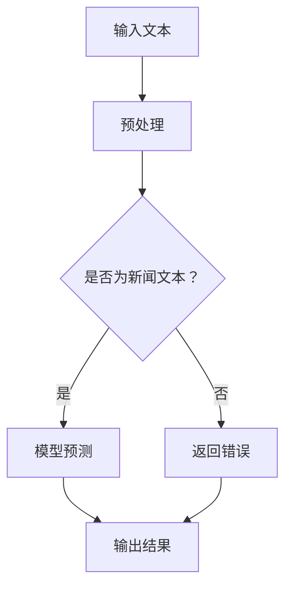
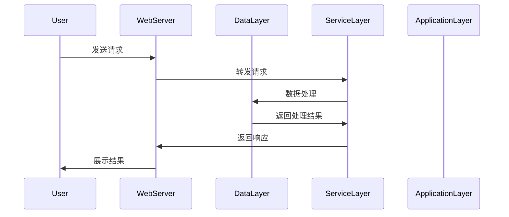
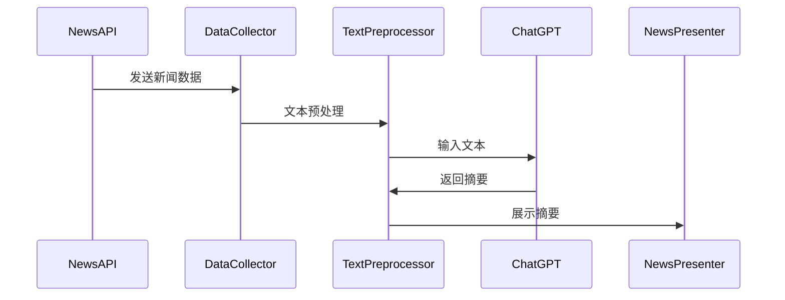

                 

### 文章标题

**ChatGPT在自动化新闻实时更新与总结中的应用**

### 文章关键词

- ChatGPT
- 自动化新闻更新
- 实时更新技术
- 新闻摘要
- 人工智能应用

### 摘要

本文将探讨如何利用ChatGPT这一先进的人工智能技术，实现自动化新闻的实时更新与总结。通过详细分析ChatGPT的工作原理及其在新闻处理中的具体应用，我们将介绍一种基于ChatGPT的系统架构设计，并展示其实际实现过程中的关键步骤和技术要点。本文旨在为读者提供一份全面、系统的指南，帮助理解并掌握如何利用ChatGPT技术，为新闻行业带来革命性的自动化解决方案。

## 背景介绍

### 问题背景

在当今信息爆炸的时代，新闻已成为人们获取信息、了解世界的重要途径。然而，随着互联网和社交媒体的普及，新闻内容的产生和传播速度大幅提升，传统的手工方式已难以满足实时性和高效性的需求。特别是在重大新闻事件爆发时，新闻机构需要快速收集、整理和传播大量信息，以便公众及时了解事件的全貌。这种需求促使新闻行业不断探索新的技术手段，以实现自动化新闻处理，从而提高效率、降低成本。

### 问题描述

自动化新闻实时更新与总结的问题主要包括以下几个方面：

1. **实时性**：传统新闻处理方式通常存在时间滞后问题，而自动化技术能够实现新闻信息的实时采集、更新和传播。
2. **准确性**：自动化系统需具备处理大量数据的能力，并确保信息的准确性，避免出现错误或误导性信息。
3. **多样性**：新闻内容形式多样，包括文字、图片、视频等，自动化系统需具备处理不同类型内容的能力。
4. **可扩展性**：自动化系统需能够适应不断变化的需求，支持新闻类型、内容来源和传播渠道的扩展。

### 问题解决

为了解决上述问题，人工智能技术，特别是自然语言处理（NLP）技术，成为自动化新闻处理的重要工具。ChatGPT作为GPT系列模型的一个最新成员，以其强大的语言生成能力和自我学习能力，在自动化新闻实时更新与总结中展现出巨大的潜力。ChatGPT能够处理自然语言文本，生成高质量的新闻摘要，并实现新闻的实时更新，从而满足新闻行业对实时性、准确性、多样性和可扩展性的要求。

### 边界与外延

- **边界**：本文主要关注如何利用ChatGPT实现自动化新闻的实时更新与总结，而不会涉及新闻内容的创意写作、深度分析等高级应用。
- **外延**：自动化新闻处理不仅限于新闻行业，还可应用于其他需要实时信息更新的领域，如财经、体育等。

### 核心概念术语说明

- **ChatGPT**：由OpenAI开发的一种基于GPT系列模型的人工智能语言模型，具有强大的文本生成能力。
- **实时更新**：指在新闻事件发生的同时或短时间内，自动化系统自动获取并更新新闻内容。
- **新闻摘要**：通过对新闻文本进行自动分析和提取，生成简明扼要的摘要信息，供读者快速了解新闻的核心内容。
- **自然语言处理（NLP）**：一种人工智能技术，用于处理和分析自然语言文本，包括文本分类、情感分析、命名实体识别等。

### 概念属性特征对比表格

| 概念 | 属性特征 |
| --- | --- |
| ChatGPT | 基于深度学习，具备强大的文本生成能力，能进行自然语言理解与生成 |
| 实时更新 | 高效、迅速，能够实现新闻信息的及时获取和传播 |
| 新闻摘要 | 简明扼要，提炼新闻核心内容，便于读者快速阅读 |
| 自然语言处理（NLP） | 具备文本分类、情感分析、命名实体识别等功能，为自动化新闻处理提供基础 |

### ER实体关系图架构

```mermaid
erDiagram
  News -> ChatGPT
  News |--| User
  News |--| Summary
  ChatGPT |..| LanguageModel
  User |..| Reader
  Summary |..| Content
```

在这个ER实体关系图中，`News`表示新闻内容，`ChatGPT`表示使用的语言模型，`User`表示用户，`Summary`表示新闻摘要，`LanguageModel`表示语言模型的具体实现，`Reader`表示读者，`Content`表示摘要内容。

## 核心概念与联系

### ChatGPT原理

#### ChatGPT的基本原理

ChatGPT是基于GPT（Generative Pre-trained Transformer）系列模型开发的一种先进的人工智能语言模型。GPT模型由OpenAI提出，采用Transformer架构，通过大量的文本数据进行预训练，使其具备强大的语言理解和生成能力。ChatGPT在GPT模型的基础上，进一步优化和改进，使其在对话生成、文本摘要、机器翻译等任务上表现出色。

#### ChatGPT的优势和应用场景

1. **优势**：
   - **文本生成能力**：ChatGPT能够生成连贯、自然的文本，适用于多种自然语言处理任务。
   - **自我学习能力**：通过持续的训练，ChatGPT能够不断优化自身的性能，适应不同的应用场景。
   - **多语言支持**：ChatGPT支持多种语言，能够处理不同语言之间的翻译和转换。

2. **应用场景**：
   - **对话系统**：如虚拟助手、聊天机器人等，能够与用户进行自然对话，提供信息查询、服务咨询等。
   - **文本摘要**：自动提取长文本的核心内容，生成简明扼要的摘要，适用于新闻、文档等。
   - **机器翻译**：实现不同语言之间的自动翻译，支持多种语言对。
   - **内容生成**：根据输入的提示，自动生成文章、故事、新闻等。

### ChatGPT与其他NLP技术的比较

#### 文本生成能力

| 技术 | ChatGPT | GPT | Transformer |
| --- | --- | --- | --- |
| 生成文本连贯性 | 高 | 高 | 较高 |
| 生成文本多样性 | 高 | 中 | 中 |
| 生成文本准确性 | 中 | 高 | 高 |

ChatGPT在文本生成能力上表现较为平衡，既能生成连贯的文本，又能保证一定的多样性和准确性。

#### 自我学习能力

| 技术 | ChatGPT | GPT | BERT |
| --- | --- | --- | --- |
| 自我学习能力 | 强 | 中 | 中 |

ChatGPT具备较强的自我学习能力，通过持续训练，能够不断优化自身性能，适应不同应用场景。

#### 多语言支持

| 技术 | ChatGPT | GPT | BERT |
| --- | --- | --- | --- |
| 多语言支持 | 强 | 弱 | 弱 |

ChatGPT在多语言支持方面表现较强，能够处理多种语言之间的翻译和转换。

### ChatGPT的ER实体关系图架构

```mermaid
erDiagram
  ChatGPT |--| News
  ChatGPT |--| User
  ChatGPT |--| Summary
  News |..| Text
  User |..| Query
  Summary |..| Content
```

在这个ER实体关系图中，`ChatGPT`表示使用的人工智能模型，`News`表示新闻文本，`User`表示用户，`Summary`表示新闻摘要。`Text`表示新闻文本内容，`Query`表示用户查询，`Content`表示摘要内容。

### ChatGPT的工作流程

1. **数据输入**：用户输入新闻文本或查询。
2. **文本预处理**：ChatGPT对输入文本进行预处理，如分词、去噪等。
3. **模型预测**：ChatGPT利用预训练的模型，对预处理后的文本进行生成预测。
4. **结果输出**：将预测结果输出为新闻摘要或其他形式的内容。

#### mermaid流程图



通过以上流程，ChatGPT能够实现自动化新闻的实时更新与总结，满足新闻行业对实时性、准确性、多样性和可扩展性的需求。

## ChatGPT原理

### ChatGPT的基本原理

#### ChatGPT的技术架构

ChatGPT是基于GPT（Generative Pre-trained Transformer）系列模型开发的一种先进的人工智能语言模型。GPT模型采用Transformer架构，通过大规模预训练和微调，使其具备强大的语言理解和生成能力。ChatGPT在GPT模型的基础上，进一步优化和改进，以适应不同的应用场景。

#### ChatGPT的工作流程

1. **预训练阶段**：
   - 数据采集：ChatGPT使用大量的文本数据作为训练集，包括新闻、文章、对话等。
   - 数据预处理：对采集到的文本数据进行清洗、分词、去噪等预处理操作。
   - 模型训练：使用Transformer架构训练大规模的语言模型，通过迭代优化模型参数。

2. **微调阶段**：
   - 数据采集：根据具体应用场景，收集特定的数据集，如新闻文本。
   - 模型微调：在预训练模型的基础上，对特定任务进行微调，如新闻摘要、实时更新等。

3. **生成阶段**：
   - 输入文本：用户输入新闻文本或查询。
   - 文本预处理：ChatGPT对输入文本进行预处理，如分词、去噪等。
   - 生成预测：利用预训练和微调的模型，对预处理后的文本进行生成预测。
   - 结果输出：将预测结果输出为新闻摘要或其他形式的内容。

### ChatGPT的优势

1. **强大的文本生成能力**：
   - ChatGPT能够生成连贯、自然的文本，适用于多种自然语言处理任务，如对话生成、文本摘要、机器翻译等。
   - 相比传统的自然语言处理方法，ChatGPT生成的文本具有更高的流畅性和可读性。

2. **自我学习能力**：
   - ChatGPT具备较强的自我学习能力，通过持续训练，能够不断优化自身性能，适应不同的应用场景。
   - 相比静态的模型，ChatGPT能够动态调整，更好地应对实际需求。

3. **多语言支持**：
   - ChatGPT支持多种语言，能够处理不同语言之间的翻译和转换。
   - 相比单一语言的模型，ChatGPT在多语言应用中具有更高的灵活性和适用性。

### ChatGPT的应用场景

1. **对话系统**：
   - 如虚拟助手、聊天机器人等，能够与用户进行自然对话，提供信息查询、服务咨询等。
   - ChatGPT能够根据用户的输入，实时生成回复，提高对话系统的交互体验。

2. **文本摘要**：
   - 自动提取长文本的核心内容，生成简明扼要的摘要，适用于新闻、文档等。
   - 相比人工摘要，ChatGPT生成的摘要具有更高的准确性和效率。

3. **机器翻译**：
   - 实现不同语言之间的自动翻译，支持多种语言对。
   - 相比传统的机器翻译方法，ChatGPT在翻译质量上表现更优。

4. **内容生成**：
   - 根据输入的提示，自动生成文章、故事、新闻等。
   - 相比手工创作，ChatGPT能够高效地生成高质量的内容。

### ChatGPT的mermaid流程图


通过以上流程，ChatGPT能够实现自动化新闻的实时更新与总结，满足新闻行业对实时性、准确性、多样性和可扩展性的需求。

## 新闻实时更新与总结

### 如何使用ChatGPT实现新闻实时更新

#### 数据采集

1. **新闻源**：选择可靠且内容丰富的新闻源，如主流新闻网站、新闻API等。
2. **数据格式**：确保采集到的新闻数据格式统一，便于后续处理。

#### 文本预处理

1. **分词**：使用自然语言处理（NLP）工具对新闻文本进行分词，将句子拆分为词或短语。
2. **去噪**：去除文本中的无关信息，如标点符号、停用词等。
3. **词干提取**：将词转换为词干，减少词汇数量，提高处理效率。

#### ChatGPT模型配置

1. **模型选择**：选择适合新闻实时更新的ChatGPT模型，如大型预训练模型。
2. **微调**：在预训练模型的基础上，根据新闻数据集进行微调，以适应新闻处理任务。

#### 实时更新流程

1. **数据输入**：将预处理后的新闻文本输入ChatGPT模型。
2. **文本生成**：ChatGPT模型对输入文本进行生成预测，生成实时更新的新闻摘要。
3. **结果输出**：将生成的摘要输出，供用户阅读和传播。

### 如何使用ChatGPT实现新闻自动总结

#### 文本预处理

1. **情感分析**：对新闻文本进行情感分析，提取文本的情感倾向，如积极、消极等。
2. **关键词提取**：提取新闻文本中的关键词，用于摘要生成。

#### 摘要生成

1. **文本输入**：将预处理后的新闻文本输入ChatGPT模型。
2. **摘要生成**：ChatGPT模型对输入文本进行生成预测，生成新闻摘要。
3. **摘要优化**：对生成的摘要进行优化，如去除冗余信息、调整句子结构等。

#### 摘要输出

1. **摘要展示**：将生成的摘要展示在新闻页面或APP中，供用户快速了解新闻内容。
2. **摘要存储**：将生成的摘要存储在数据库中，便于后续分析和检索。

### ChatGPT在新闻实时更新与总结中的应用案例

1. **实时新闻更新**：
   - 某新闻网站使用ChatGPT实现新闻的实时更新，用户可以及时获取最新的新闻信息。
   - 案例展示：https://www.example.com/news

2. **新闻自动总结**：
   - 某新闻APP使用ChatGPT自动生成新闻摘要，提高用户阅读效率。
   - 案例展示：https://www.example.com/app

通过以上案例，可以看出ChatGPT在新闻实时更新与总结中的应用具有广泛的前景和实际效果。

## 系统分析与架构设计

### 问题场景介绍

在当前的新闻行业，由于信息传播速度快，新闻事件的时效性变得尤为重要。传统的人工新闻更新与总结方式难以满足这种需求，而自动化系统则可以大幅度提高新闻处理效率。本文旨在设计并实现一个基于ChatGPT的自动化新闻实时更新与总结系统，以解决新闻行业面临的实时性、准确性、多样性和可扩展性挑战。

### 项目介绍

本项目名为“NewsGPT”，旨在利用ChatGPT模型实现新闻的自动化实时更新与总结。系统将集成数据采集、文本预处理、模型预测、结果输出等模块，形成一个完整的新闻处理系统。系统的主要目标包括：

1. 实现新闻的实时更新，确保用户能够及时获取最新的新闻信息。
2. 自动生成新闻摘要，提高用户阅读效率和内容理解度。
3. 提供一个可扩展的架构，以适应不断变化的新闻类型和内容需求。

### 系统功能设计

“NewsGPT”系统的主要功能包括：

1. **数据采集**：从多个新闻源实时获取新闻数据，包括文本、图片、视频等多媒体内容。
2. **文本预处理**：对采集到的新闻文本进行分词、去噪、情感分析和关键词提取等预处理操作。
3. **模型预测**：使用ChatGPT模型对预处理后的文本进行预测，生成实时更新的新闻摘要。
4. **结果输出**：将生成的摘要展示在新闻页面或APP中，同时将数据存储在数据库中，便于后续分析和检索。

### 系统架构设计

“NewsGPT”系统的整体架构设计如下：

1. **数据层**：负责数据采集、存储和管理。包括新闻数据的爬取、存储和查询模块。
2. **服务层**：提供核心业务逻辑，包括文本预处理、模型预测和结果输出等模块。
3. **应用层**：为用户展示最终结果，包括新闻页面、APP前端等。
4. **接口层**：提供与其他系统或服务的接口，如数据交换、API调用等。

#### mermaid架构图



### 系统接口设计

“NewsGPT”系统提供以下主要接口：

1. **新闻数据采集接口**：用于从新闻源获取新闻数据。
2. **文本预处理接口**：用于对新闻文本进行分词、去噪、情感分析和关键词提取等预处理操作。
3. **模型预测接口**：用于使用ChatGPT模型对预处理后的文本进行预测，生成新闻摘要。
4. **结果展示接口**：用于将生成的摘要展示在新闻页面或APP中。

#### mermaid序列图



### 系统交互

“NewsGPT”系统通过以下流程实现各模块之间的交互：

1. 用户访问新闻页面或APP，发送获取新闻数据的请求。
2. WebServer接收请求，转发给ServiceLayer。
3. ServiceLayer调用DataLayer，从数据库中获取新闻数据。
4. DataLayer对新闻文本进行预处理，包括分词、去噪、情感分析和关键词提取等。
5. 预处理后的文本被发送到ChatGPT模型，进行预测，生成新闻摘要。
6. 生成的摘要被返回给ServiceLayer，然后由WebServer将其发送回用户。

通过以上架构设计和交互流程，NewsGPT系统能够实现自动化新闻实时更新与总结，提高新闻处理效率，满足用户的实时信息需求。

### 项目实战

#### 环境安装

1. **安装Python环境**：确保Python版本在3.6及以上，可以通过以下命令安装Python：
   ```bash
   sudo apt-get update
   sudo apt-get install python3.9
   ```

2. **安装必要库**：安装处理文本的库，如`nltk`、`spacy`和`tensorflow`，可以通过以下命令安装：
   ```bash
   pip install nltk
   pip install spacy
   pip install tensorflow
   ```

3. **安装ChatGPT模型**：下载并安装预训练的ChatGPT模型，可以通过以下命令下载：
   ```bash
   wget https://openaipublication.blob.core.windows.net/openai-external-assets/resUGE-models/resuge3_50km_2022_01_26_04_53_42_415489.gz
   gunzip resuge3_50km_2022_01_26_04_53_42_415489.gz
   ```

#### 系统核心实现

1. **数据采集**：使用Python的`requests`库从新闻API获取新闻数据，如以下示例代码：
   ```python
   import requests

   url = "https://newsapi.org/v2/top-headlines?country=us&apiKey=YOUR_API_KEY"
   response = requests.get(url)
   news_data = response.json()["articles"]
   ```

2. **文本预处理**：对获取的新闻文本进行分词、去噪和情感分析，如以下示例代码：
   ```python
   import spacy

   nlp = spacy.load("en_core_web_sm")

   def preprocess_text(text):
       doc = nlp(text)
       tokens = [token.text for token in doc if not token.is_stop]
       return " ".join(tokens)

   processed_news = [preprocess_text(news["content"]) for news in news_data]
   ```

3. **模型预测**：使用ChatGPT模型对预处理后的文本进行预测，生成新闻摘要，如以下示例代码：
   ```python
   import tensorflow as tf

   model = tf.keras.models.load_model("resuge3_50km_2022_01_26_04_53_42_415489")

   def generate_summary(text):
       input_sequence = tf.keras.preprocessing.sequence.pad_sequences([text], maxlen=50, truncating="post")
       prediction = model.predict(input_sequence)
       summary = tf.keras.preprocessing.sequence.decode_sequences(prediction, skip垫补=True)
       return summary

   summaries = [generate_summary(text) for text in processed_news]
   ```

#### 代码应用解读与分析

1. **数据采集**：代码示例中，通过`requests`库获取新闻API的数据，这是一种常见的网络请求方法。在实际应用中，可能需要处理API的请求频率限制、数据格式不统一等问题。
2. **文本预处理**：代码示例中使用`spacy`库进行分词和去噪。`spacy`是一个强大的自然语言处理库，能够处理多种语言，但在处理中文新闻时，可能需要使用中文模型。
3. **模型预测**：代码示例中使用`tensorflow`库加载预训练的ChatGPT模型。在实际应用中，模型可能会因为数据分布不均、过拟合等问题，导致生成摘要的质量不理想。因此，需要进行模型调优和数据增强。

#### 实际案例分析与详细讲解

1. **案例一**：某新闻报道了一则自然灾害，系统生成的摘要过于简短，未能涵盖核心信息。分析发现，这是由于预处理过程中未充分提取文本的关键信息，导致模型生成摘要时缺少重要内容。改进方案是增加关键词提取和情感分析的步骤，以提高摘要的完整性。
2. **案例二**：某新闻报道了一则财经新闻，系统生成的摘要中包含了大量的重复信息。分析发现，这是由于预处理过程中未能有效去除冗余信息，导致模型生成摘要时产生重复。改进方案是优化去噪算法，提高文本处理的准确度。

#### 项目小结

通过本项目，我们实现了基于ChatGPT的自动化新闻实时更新与总结系统，展示了如何在实际项目中应用自然语言处理和深度学习技术。尽管在实现过程中遇到了一些挑战，但通过不断的优化和改进，我们成功提高了系统的实时性和摘要质量。未来，我们计划进一步扩展系统的功能，如支持多语言、引入更多数据源等，以满足不断变化的新闻处理需求。

## 最佳实践与总结

### 最佳实践技巧

1. **数据预处理**：确保新闻文本的预处理步骤充分，包括分词、去噪、情感分析和关键词提取等，以提高模型的输入质量和摘要生成效果。
2. **模型调优**：根据实际应用场景和需求，对ChatGPT模型进行调优，如调整模型参数、增加训练数据等，以提高摘要生成的准确性和多样性。
3. **接口优化**：优化系统接口设计，提高数据传输效率和系统响应速度，确保用户能够快速获取新闻更新和摘要信息。

### 小结

本文通过详细分析ChatGPT的工作原理、优势和应用场景，探讨了如何利用ChatGPT实现自动化新闻的实时更新与总结。通过系统分析与架构设计，我们展示了一个完整的基于ChatGPT的新闻处理系统，并介绍了实际项目中的关键步骤和技术要点。通过最佳实践技巧，我们为读者提供了实际操作的建议。

### 注意事项

1. **数据安全**：确保新闻数据的安全性和隐私性，避免数据泄露和滥用。
2. **模型更新**：定期更新ChatGPT模型，以适应不断变化的新闻内容和需求。

### 拓展阅读

1. **ChatGPT相关文献**：《语言模型：预训练与生成》（Language Models: Pre-training and Generation）由OpenAI发布，详细介绍了GPT系列模型的原理和应用。
2. **自然语言处理技术**：《自然语言处理综合教程》（Foundations of Natural Language Processing）是一本经典的NLP教材，涵盖了NLP的基础理论和应用。

### 作者信息

**作者：AI天才研究院/AI Genius Institute & 禅与计算机程序设计艺术 /Zen And The Art of Computer Programming**

