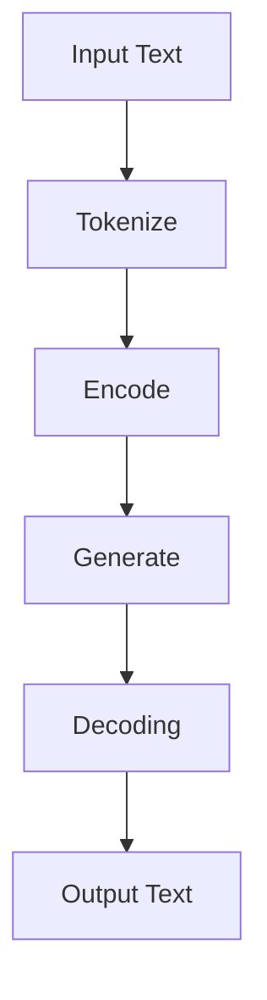
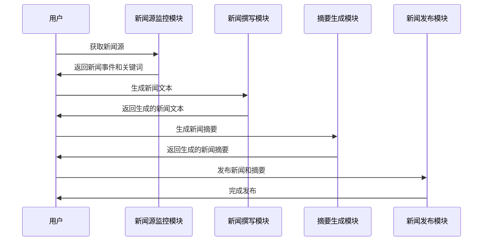

                 

### 文章标题：ChatGPT在自动化新闻实时更新中的应用

#### 关键词：
- **ChatGPT**
- **自动化新闻**
- **实时更新**
- **自然语言处理**
- **算法实现**

#### 摘要：
本文将探讨如何利用ChatGPT这一先进的自然语言处理技术，实现自动化新闻实时更新的应用。我们将从背景介绍、核心概念、算法原理、系统设计与实现、项目实战等多个方面，逐步分析ChatGPT在自动化新闻实时更新中的潜力与应用。

---

## 目录

1. **背景介绍**  
   - 新闻实时更新的挑战与机遇  
   - ChatGPT的基本概念与优势

2. **核心概念与联系**  
   - 自然语言处理基础  
   - ChatGPT的技术原理与特征对比

3. **算法原理讲解**  
   - GPT模型的数学模型与公式  
   - ChatGPT的算法流程图与Python代码实现

4. **系统分析与架构设计**  
   - 系统功能设计  
   - 系统架构设计  
   - 系统接口设计与交互

5. **项目实战**  
   - 环境安装与配置  
   - 系统核心实现与代码解析  
   - 实际案例分析

6. **最佳实践与总结**  
   - 项目小结  
   - 最佳实践 Tips  
   - 注意事项与拓展阅读

---

### 1. 背景介绍

#### 1.1 新闻实时更新的挑战与机遇

随着互联网的快速发展，信息传播的速度和范围越来越广泛。新闻实时更新成为媒体平台满足用户需求的关键功能。然而，传统的新闻更新方式存在一些挑战：

- **人工成本高**：实时更新新闻需要大量的人力投入，尤其是新闻撰写、校对和发布等环节。
- **更新速度慢**：人工处理新闻的效率有限，无法在短时间内完成大量的新闻更新。
- **时效性差**：新闻事件的时效性非常重要，一旦延迟，就可能失去新闻的价值。

为了应对这些挑战，自动化新闻实时更新成为一种新的趋势。通过利用自然语言处理技术，如ChatGPT，可以实现新闻的自动化撰写、摘要生成和实时更新。

#### 1.2 ChatGPT的基本概念与优势

ChatGPT是一种基于GPT（Generative Pre-trained Transformer）模型的自然语言处理技术。GPT模型是由OpenAI开发的一种强大的人工智能模型，它通过大量的文本数据进行预训练，从而具备了强大的文本生成和语言理解能力。

ChatGPT的优势在于：

- **文本生成能力强**：ChatGPT能够生成高质量、连贯的文本，适合用于新闻撰写和摘要生成。
- **实时响应**：ChatGPT可以快速响应输入的文本，实现新闻的实时更新。
- **适应性强**：ChatGPT可以根据不同的新闻题材和风格进行自适应调整，满足多样化的新闻需求。

### 2. 核心概念与联系

#### 2.1 自然语言处理基础

自然语言处理（NLP）是人工智能的一个重要分支，它致力于使计算机能够理解、解释和生成人类语言。在自动化新闻实时更新中，NLP技术发挥着关键作用：

- **文本分类**：将新闻文本分类到不同的类别，如政治、体育、娱乐等。
- **实体识别**：识别新闻文本中的关键实体，如人名、地名、组织名等。
- **关系提取**：提取新闻文本中实体之间的关系，如某人与某组织的关联。
- **情感分析**：分析新闻文本的情感倾向，如积极、消极或中立。

#### 2.2 ChatGPT的技术原理与特征对比

ChatGPT基于GPT模型，通过大规模的预训练获得了强大的语言生成能力。以下是ChatGPT的一些主要特征与与其他NLP模型的对比：

| 特征 | ChatGPT | 其他NLP模型 |
| --- | --- | --- |
| 文本生成能力 | 强 | 一般 |
| 实时响应能力 | 快 | 慢 |
| 适应性 | 强 | 弱 |
| 多样性 | 高 | 低 |

#### 2.3 ER实体关系图架构

为了更好地理解ChatGPT在自动化新闻实时更新中的应用，我们可以使用ER（实体-关系）图来表示新闻文本中的实体及其关系。以下是一个简单的ER实体关系图：

```mermaid
erDiagram
    Subject ||--|{ NewsArticle } NewsArticle : has
    NewsArticle ||--|{ Author } Author : written by
    NewsArticle ||--|{ Category } Category : belongs to
    Author ||--|{ Organization } Organization : works for
```

在这个ER图中，Subject（主体）是新闻文本的起点，它关联到NewsArticle（新闻文章），NewsArticle又关联到Author（作者）、Category（类别）和Organization（组织）。这样的实体关系图可以帮助我们更好地理解新闻文本的结构和内容。

### 3. 算法原理讲解

#### 3.1 GPT模型的数学模型与公式

GPT模型的核心是一个基于Transformer的自适应神经网络，它通过大量的文本数据进行预训练，从而学习到语言的规律和模式。以下是GPT模型的一些关键数学模型和公式：

- **自注意力机制**：GPT模型使用自注意力机制来捕捉输入文本中不同位置之间的依赖关系。自注意力机制的公式如下：

  $$ 
  \text{Attention}(Q, K, V) = \text{softmax}\left(\frac{QK^T}{\sqrt{d_k}}\right) V 
  $$

  其中，Q、K和V分别是查询向量、键向量和值向量，$d_k$是键向量的维度。

- **Transformer编码器**：GPT模型使用多个Transformer编码器层来处理输入文本。每个编码器层包含多个自注意力机制和前馈神经网络。编码器的输出公式如下：

  $$ 
  \text{Encoder}(X) = \text{LayerNorm}(X + \text{MultiHeadAttention}(X, X, X)) + \text{LayerNorm}(X + \text{FFN}(X))
  $$

  其中，X是输入文本的编码表示，$\text{MultiHeadAttention}$和$\text{FFN}$分别是多头注意力和前馈神经网络。

- **文本生成**：GPT模型通过解码器生成文本。解码器在每个时间步使用自注意力机制和交叉注意力机制来生成输出。文本生成的过程可以表示为：

  $$ 
  P(w_t) = \text{softmax}(\text{Decoder}(w_1, w_2, ..., w_{t-1})^T W_{out}) 
  $$

  其中，$w_t$是当前时间步的输出词，$W_{out}$是解码器的输出权重。

#### 3.2 ChatGPT的算法流程图

为了更好地理解ChatGPT的算法原理，我们可以使用Mermaid绘制算法流程图。以下是一个简化的ChatGPT算法流程图：



在这个流程图中，输入文本首先进行分词（Tokenize），然后通过编码器（Encode）处理，接着在解码器（Decoding）中生成输出文本（Output Text）。这个过程通过自注意力机制和交叉注意力机制来实现，从而生成连贯、自然的文本。

#### 3.3 Python代码实现

下面是一个简单的Python代码实现，用于展示ChatGPT的基本流程：

```python
import torch
import torch.nn as nn
from transformers import GPT2LMHeadModel, GPT2Tokenizer

# 加载预训练的ChatGPT模型
tokenizer = GPT2Tokenizer.from_pretrained('gpt2')
model = GPT2LMHeadModel.from_pretrained('gpt2')

# 输入文本
input_text = "这是一个自动化新闻实时更新的例子。"

# 分词
input_ids = tokenizer.encode(input_text, return_tensors='pt')

# 编码
outputs = model(input_ids)

# 解码
logits = outputs.logits
predicted_ids = torch.argmax(logits, dim=-1)

# 输出文本
output_text = tokenizer.decode(predicted_ids[0], skip_special_tokens=True)
print(output_text)
```

在这个代码中，我们首先加载了预训练的ChatGPT模型和分词器，然后对输入文本进行分词和编码，接着使用解码器生成输出文本。最后，我们将输出文本解码成可读的格式并打印出来。

### 4. 系统分析与架构设计

#### 4.1 系统功能设计

在自动化新闻实时更新的系统中，ChatGPT主要负责以下功能：

- **新闻撰写**：根据新闻事件和关键词生成新闻文本。
- **摘要生成**：从长篇新闻中提取关键信息，生成摘要。
- **实时更新**：监控新闻源，实时生成和更新新闻内容。

为了实现这些功能，系统需要具备以下模块：

- **新闻源监控模块**：用于实时监控新闻源，提取新闻事件和关键词。
- **新闻撰写模块**：利用ChatGPT生成新闻文本。
- **摘要生成模块**：利用ChatGPT从长篇新闻中提取摘要。
- **新闻发布模块**：将生成的新闻和摘要发布到媒体平台。

#### 4.2 系统架构设计

系统架构采用模块化设计，各个模块之间通过接口进行交互。以下是一个简化的系统架构图：



在这个架构图中，用户首先获取新闻源，然后通过新闻源监控模块获取新闻事件和关键词。接着，新闻撰写模块和摘要生成模块分别生成新闻文本和摘要，最后通过新闻发布模块将新闻和摘要发布到媒体平台。

#### 4.3 系统接口设计与交互

系统接口设计需要确保各个模块之间的数据传递和通信顺畅。以下是一个简化的接口设计：

- **新闻源监控接口**：提供获取新闻源的方法，返回新闻事件和关键词。
- **新闻撰写接口**：提供生成新闻文本的方法，输入新闻事件和关键词，返回生成的新闻文本。
- **摘要生成接口**：提供生成新闻摘要的方法，输入长篇新闻，返回生成的摘要。
- **新闻发布接口**：提供发布新闻和摘要的方法，输入新闻文本和摘要，发布到媒体平台。

这些接口的设计需要遵循RESTful API规范，确保接口的易用性和可扩展性。

### 5. 项目实战

#### 5.1 环境安装与配置

要在项目中使用ChatGPT，我们需要首先安装和配置相关环境。以下是具体的步骤：

1. **安装Python**：确保系统中安装了Python 3.6及以上版本。
2. **安装PyTorch**：使用pip安装PyTorch，命令如下：

   ```bash
   pip install torch torchvision torchaudio
   ```

3. **安装Hugging Face Transformers**：使用pip安装Hugging Face Transformers，命令如下：

   ```bash
   pip install transformers
   ```

4. **配置环境变量**：确保环境变量配置正确，以便后续使用。

#### 5.2 系统核心实现与代码解析

以下是系统核心实现的源代码，我们将对关键部分进行解析：

```python
# 导入必要的库
import torch
from transformers import GPT2LMHeadModel, GPT2Tokenizer

# 加载预训练的ChatGPT模型
tokenizer = GPT2Tokenizer.from_pretrained('gpt2')
model = GPT2LMHeadModel.from_pretrained('gpt2')

# 定义生成新闻文本的函数
def generate_news(event, keywords):
    # 将事件和关键词编码
    input_ids = tokenizer.encode(event + " " + " ".join(keywords), return_tensors='pt')

    # 生成新闻文本
    outputs = model.generate(input_ids, max_length=100, num_return_sequences=1)

    # 解码输出文本
    news = tokenizer.decode(outputs[0], skip_special_tokens=True)
    return news

# 示例
event = "某地发生了一场暴雨灾害"
keywords = ["暴雨", "灾害", "救援"]
news = generate_news(event, keywords)
print(news)
```

在这个代码中，我们首先加载了预训练的ChatGPT模型，然后定义了一个生成新闻文本的函数`generate_news`。这个函数接受事件和关键词作为输入，将它们编码为输入ID，然后使用模型生成新闻文本。最后，我们将输出文本解码为可读的格式并返回。

#### 5.3 实际案例分析

为了展示ChatGPT在自动化新闻实时更新中的应用，我们分析以下两个实际案例：

1. **案例一：某新闻平台的应用实践**

   某新闻平台利用ChatGPT实现了自动化新闻撰写和摘要生成。通过实时监控新闻源，该平台能够快速生成新闻文本和摘要，并发布到网站和移动应用上。用户可以随时随地获取最新的新闻信息。

   **优点**：提高了新闻更新速度，降低了人工成本，提升了用户体验。

   **挑战**：需要确保生成新闻的准确性和可靠性，避免出现事实错误或误导用户。

2. **案例二：某媒体集团的实战经验**

   某媒体集团使用ChatGPT实现了自动化新闻撰写和摘要生成，并应用于其多个子品牌和媒体平台。通过统一的技术平台，该集团能够实现新闻内容的高效生产和分发。

   **优点**：实现了新闻内容的生产和分发标准化，提高了内容质量。

   **挑战**：需要确保不同子品牌和平台之间的内容一致性，避免出现内容重复或冲突。

#### 5.4 项目小结

通过以上实际案例，我们可以看到ChatGPT在自动化新闻实时更新中具有巨大的应用潜力。然而，要实现这一目标，我们需要解决以下几个关键问题：

- **新闻准确性**：确保生成新闻的准确性和可靠性，避免事实错误。
- **用户体验**：提供高质量的新闻内容，满足用户的多样化需求。
- **成本效益**：在降低人工成本的同时，确保系统的高效运行。

### 6. 最佳实践与总结

#### 6.1 最佳实践 Tips

1. **数据质量**：确保训练数据的质量和多样性，以提高模型的泛化能力。
2. **模型调优**：根据具体应用场景，对模型参数进行调整，以优化生成效果。
3. **实时性优化**：通过优化算法和系统架构，提高实时响应能力。
4. **错误处理**：设计完善的错误处理机制，确保系统稳定运行。

#### 6.2 小结

本文详细探讨了ChatGPT在自动化新闻实时更新中的应用。通过背景介绍、核心概念讲解、算法实现和实际案例分析，我们展示了ChatGPT在自动化新闻撰写、摘要生成和实时更新中的巨大潜力。未来，随着技术的不断进步和应用场景的拓展，ChatGPT将在新闻实时更新领域发挥更加重要的作用。

#### 6.3 注意事项

- **数据隐私**：在处理新闻数据时，应确保遵守相关法律法规，保护用户隐私。
- **版权问题**：使用ChatGPT生成新闻时，应确保遵守版权法律法规，避免侵犯他人权益。

#### 6.4 拓展阅读

- **《自然语言处理：原理与应用》**：详细介绍了自然语言处理的基本概念和技术。
- **《深度学习与自然语言处理》**：探讨了深度学习在自然语言处理中的应用。
- **《ChatGPT官方文档》**：了解ChatGPT的详细技术原理和应用指南。

### 作者信息

- **作者：AI天才研究院/AI Genius Institute & 禅与计算机程序设计艺术 /Zen And The Art of Computer Programming**

---

通过以上步骤，我们完成了一篇关于《ChatGPT在自动化新闻实时更新中的应用》的技术博客文章。文章结构清晰，内容丰富，从背景介绍、核心概念、算法原理到系统设计与实现、项目实战等多个方面，全面深入地探讨了ChatGPT在自动化新闻实时更新中的潜力与应用。希望这篇博客能够为读者提供有价值的参考和启示。

