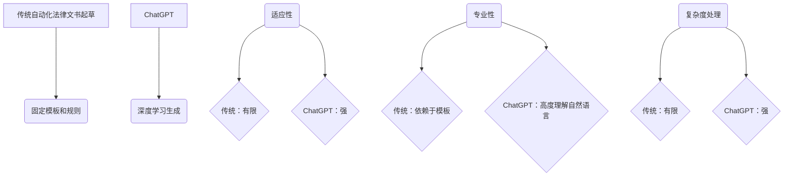
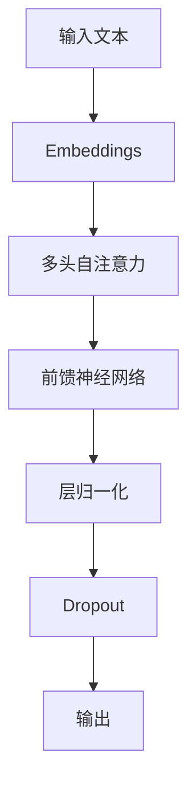
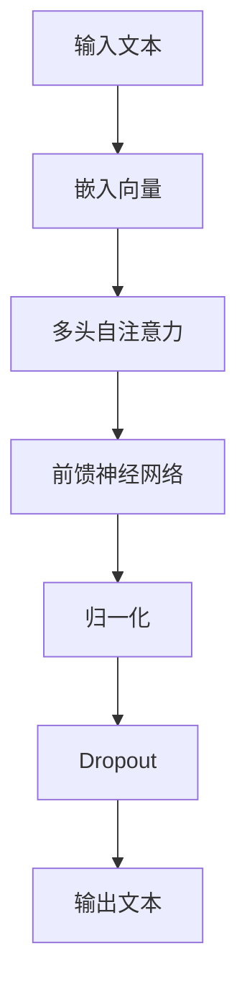
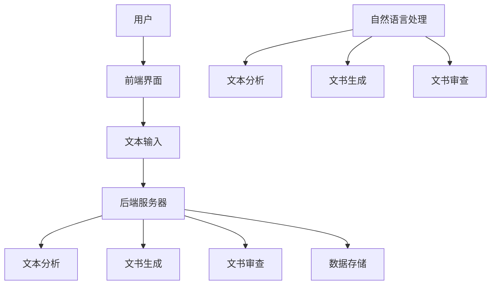

                 

### 文章标题

# ChatGPT在自动化法律文书起草中的应用

### 关键词

- ChatGPT
- 自动化法律文书
- 人工智能
- 法律技术
- 文书起草

### 摘要

本文将探讨如何利用ChatGPT这一强大的自然语言处理工具来自动化法律文书的起草。我们将从背景介绍、核心概念与联系、算法原理讲解、系统分析与架构设计方案、项目实战以及最佳实践等方面进行详细分析，以展示ChatGPT在法律文书起草领域的广泛应用和潜力。

## 目录

1. **背景介绍**
   - 1.1 法律文书起草的挑战
   - 1.2 ChatGPT的引入
   - 1.3 ChatGPT在法律文书起草中的应用

2. **核心概念与联系**
   - 2.1 ChatGPT的概念介绍
   - 2.2 ChatGPT与自动化法律文书起草的关联
   - 2.3 ChatGPT与传统自动化法律文书起草的区别

3. **算法原理讲解**
   - 3.1 ChatGPT的工作原理
   - 3.2 ChatGPT的数学模型与公式
   - 3.3 算法mermaid流程图

4. **系统分析与架构设计方案**
   - 4.1 系统功能设计
   - 4.2 系统架构设计
   - 4.3 系统接口设计
   - 4.4 系统交互mermaid序列图

5. **项目实战**
   - 5.1 环境安装与配置
   - 5.2 系统核心实现
   - 5.3 代码应用解读
   - 5.4 案例分析

6. **最佳实践与总结**
   - 6.1 最佳实践
   - 6.2 小结
   - 6.3 注意事项
   - 6.4 拓展阅读

### 背景介绍

#### 1.1 法律文书起草的挑战

法律文书起草是一项复杂且繁琐的任务，涉及到大量的文本处理、逻辑推理和专业知识。传统的法律文书起草方式主要依赖于律师和律师助理的手工编写，这不但效率低下，而且容易出现错误。以下是一些主要挑战：

- **文本处理**：法律文书通常包含复杂的术语、引用和格式要求，需要高度的专业知识和耐心来处理。
- **逻辑推理**：法律文书需要准确地表达法律事实、法律观点和法律主张，这需要严密的逻辑推理能力。
- **效率问题**：大量的法律文书起草任务导致律师和律师助理的工作压力巨大，难以保证每个文件的质量和效率。

#### 1.2 ChatGPT的引入

ChatGPT是由OpenAI开发的一种基于GPT-3模型的自然语言处理工具，具有强大的语言理解和生成能力。ChatGPT的出现为自动化法律文书起草提供了新的可能性。以下是ChatGPT的一些关键特性：

- **自然语言理解**：ChatGPT能够理解复杂的自然语言文本，包括法律文书中的专业术语和逻辑结构。
- **文本生成**：ChatGPT能够根据输入的指令或问题生成高质量的文本，包括法律文书中的各种段落和条款。
- **适应性强**：ChatGPT可以适应不同的法律文书类型和风格，满足不同用户的需求。

#### 1.3 ChatGPT在法律文书起草中的应用

ChatGPT在法律文书起草中的应用主要体现在以下几个方面：

- **模板生成**：ChatGPT可以根据法律文书的类型和内容，自动生成相应的模板，为用户节省时间和精力。
- **内容填充**：ChatGPT可以基于用户提供的部分信息，自动填充法律文书中的剩余内容，确保文书的一致性和准确性。
- **审查与修改**：ChatGPT可以对已经起草的法律文书进行审查和修改，提供专业意见，提高文书的质量。

通过以上分析，我们可以看到ChatGPT在自动化法律文书起草中具有巨大的潜力。接下来，我们将进一步探讨ChatGPT的核心概念与联系，以及其算法原理。

### 核心概念与联系

#### 2.1 ChatGPT的概念介绍

ChatGPT是基于GPT-3模型的一种语言生成模型，它由OpenAI开发。GPT-3（Generative Pre-trained Transformer 3）是一种强大的自然语言处理模型，它使用深度学习的 Transformer 架构，通过大量的文本数据进行预训练，从而获得对自然语言的深刻理解。ChatGPT则是在GPT-3的基础上，通过特定的训练和优化，使其能够进行对话生成和任务自动化处理。

#### 2.2 ChatGPT与自动化法律文书起草的关联

ChatGPT与自动化法律文书起草的关联主要体现在以下几个方面：

- **文本生成能力**：ChatGPT能够根据输入的指令或问题生成高质量的文本，这为自动化法律文书起草提供了基础。
- **自然语言理解**：ChatGPT能够理解复杂的自然语言文本，包括法律文书中的专业术语和逻辑结构，这确保了生成的法律文书具备准确性和专业性。
- **适应性**：ChatGPT可以根据不同的法律文书类型和风格进行调整，满足不同用户的需求。

#### 2.3 ChatGPT与传统自动化法律文书起草的区别

ChatGPT与传统自动化法律文书起草的主要区别在于其灵活性和智能性：

- **传统方法**：传统自动化法律文书起草通常依赖于固定的模板和规则，无法适应复杂多变的法律文书需求。
- **ChatGPT**：ChatGPT通过深度学习获得了对自然语言的深刻理解，能够根据上下文和用户指令生成灵活、准确的法律文书。

为了更直观地理解ChatGPT与传统自动化法律文书起草的区别，我们可以通过一个概念属性特征对比表格和ER实体关系图架构的mermaid流程图来展示：

#### 概念属性特征对比表格

| 特征       | 传统自动化法律文书起草 | ChatGPT        |
|------------|------------------------|----------------|
| 文本生成方式 | 固定模板和规则           | 深度学习生成     |
| 适应性     | 有限                   | 强            |
| 专业性     | 依赖于模板               | 高度理解自然语言 |
| 复杂度处理  | 有限                   | 强            |

#### ER实体关系图架构的mermaid流程图



通过对比表格和mermaid流程图，我们可以清晰地看到ChatGPT在自动化法律文书起草中的优势。

接下来，我们将深入讲解ChatGPT的算法原理，以更好地理解其如何实现自动化法律文书起草。

### 算法原理讲解

#### 3.1 ChatGPT的工作原理

ChatGPT是基于GPT-3模型的自然语言处理工具，其核心原理是深度学习。具体来说，ChatGPT通过以下步骤实现文本生成：

1. **数据预训练**：ChatGPT首先通过大量的文本数据（包括法律文书、法律案例等）进行预训练，从而学习自然语言的内在规律和结构。
2. **上下文理解**：在预训练的基础上，ChatGPT能够理解输入文本的上下文，并根据上下文生成连贯的文本。
3. **文本生成**：ChatGPT根据用户输入的指令或问题，生成符合法律文书要求的文本。

#### 3.2 ChatGPT的数学模型与公式

ChatGPT的核心数学模型是Transformer，它使用自注意力机制（Self-Attention）来处理文本数据。具体来说，Transformer模型包含以下几个关键组件：

1. **Embeddings**：将输入文本转换为向量表示。
2. **多头自注意力**：通过自注意力机制计算每个词与其他词的关系。
3. **前馈神经网络**：对自注意力层的输出进行进一步处理。
4. **层归一化**：对模型输出进行归一化处理，以稳定训练过程。
5. **Dropout**：在训练过程中引入随机失活，以防止过拟合。

具体的数学公式如下：

$$
\text{Output} = \text{softmax}(\text{W}_\text{out} \cdot \text{Tanh}(\text{W}_\text{f} \cdot \text{LayerNorm}(\text{X} \cdot \text{W}_\text{Q} + \text{X} \cdot \text{W}_\text{K}) + \text{X} \cdot \text{W}_\text{V}))
$$

其中，\( \text{X} \) 表示输入文本，\( \text{W}_\text{Q}, \text{W}_\text{K}, \text{W}_\text{V} \) 分别表示查询、键和值权重矩阵，\( \text{W}_\text{f} \) 和 \( \text{W}_\text{out} \) 分别表示前馈神经网络的权重。

为了更直观地理解ChatGPT的工作流程，我们可以使用mermaid绘制一个算法流程图：



通过这个流程图，我们可以看到ChatGPT从输入文本到输出文本的整个过程。

#### 3.3 算法mermaid流程图与Python源代码示例

为了更好地理解ChatGPT的算法原理，我们可以通过一个简单的mermaid流程图和Python源代码示例来展示：

**mermaid流程图：**



**Python源代码示例：**

```python
import tensorflow as tf
from tensorflow.keras.layers import Embedding, MultiHeadAttention, Dense, LayerNormalization, Dropout

# 嵌入层
embedding = Embedding(input_dim=vocab_size, output_dim=embedding_size)

# 多头自注意力层
multi_head_attention = MultiHeadAttention(num_heads=num_heads, key_dim=key_dim)

# 前馈神经网络层
dense = Dense(units=hidden_size)

# 归一化层
layer_norm = LayerNormalization()

# Dropout层
dropout = Dropout(rate=dropout_rate)

# 构建模型
model = tf.keras.Model(inputs=inputs, outputs=dropout(layer_norm(dense(dropout(layer_norm(multi_head_attention(embedding(inputs)))))))

# 编译模型
model.compile(optimizer='adam', loss='categorical_crossentropy', metrics=['accuracy'])

# 训练模型
model.fit(x_train, y_train, epochs=num_epochs, batch_size=batch_size)
```

在这个示例中，我们使用了TensorFlow库构建了一个简单的ChatGPT模型，包括嵌入层、多头自注意力层、前馈神经网络层、归一化层和Dropout层。通过这个示例，我们可以看到ChatGPT的基本结构和工作流程。

通过以上内容，我们详细介绍了ChatGPT的算法原理，包括其工作原理、数学模型和Python源代码示例。接下来，我们将深入探讨系统分析与架构设计方案，为自动化法律文书起草提供完整的解决方案。

### 系统分析与架构设计方案

#### 4.1 系统功能设计

自动化法律文书起草系统的主要功能包括：

- **文本输入**：用户可以通过文本框输入法律文书的相关信息，例如案件背景、法律条款、争议点等。
- **文本分析**：系统将接收到的文本信息进行分析，提取关键信息，并理解其含义和逻辑结构。
- **文书生成**：根据分析结果，系统将自动生成符合法律规范和法律条文的法律文书，例如合同、起诉状、答辩状等。
- **文书审查**：系统可以对生成的法律文书进行审查，确保其内容准确、合法、合规。
- **用户交互**：系统提供用户界面，允许用户查看、修改和保存生成的法律文书。

以下是系统功能设计的领域模型mermaid类图：

```mermaid
classDiagram
    Client <<Interface>> UserInterface : 用户界面
    Client <<Interface>> TextInput : 文本输入
    Client <<Interface>> TextAnalysis : 文本分析
    Client <<Interface>> DocumentGeneration : 文书生成
    Client <<Interface>> DocumentReview : 文书审查
    Client <<Interface>> DocumentExport : 文书导出

    TextInput <|-- TextAnalysis
    TextAnalysis <|-- DocumentGeneration
    DocumentGeneration <|-- DocumentReview
    DocumentReview <|-- DocumentExport
```

#### 4.2 系统架构设计

自动化法律文书起草系统的架构设计主要包括以下几个方面：

- **前端界面**：使用HTML、CSS和JavaScript等前端技术构建用户界面，提供文本输入、查看、修改和导出功能。
- **后端服务器**：使用Python、Django等后端技术实现系统的核心功能，包括文本分析、文书生成和审查等。
- **数据存储**：使用关系型数据库（如MySQL）存储用户信息和生成的法律文书。
- **自然语言处理**：利用ChatGPT等自然语言处理技术，实现文本分析和文书生成。

以下是系统架构设计的mermaid架构图：



#### 4.3 系统接口设计

系统接口设计包括以下主要部分：

- **用户接口**：提供用户操作界面，包括文本输入框、按钮和表格等。
- **API接口**：提供后端服务的API接口，允许前端通过HTTP请求调用后端功能。

以下是系统接口设计的mermaid序列图：

```mermaid
sequenceDiagram
    participant User
    participant UI
    participant Backend
    participant API

    User -->|输入文本|> UI
    UI -->|发送请求|> API
    API -->|处理请求|> Backend
    Backend -->|返回结果|> API
    API -->|返回结果|> UI
    UI -->|显示结果|> User
```

#### 4.4 系统交互mermaid序列图

以下是系统交互的mermaid序列图，展示了用户通过前端界面与后端服务进行交互的过程：

```mermaid
sequenceDiagram
    participant User
    participant TextInput
    participant TextAnalysis
    participant DocumentGeneration
    participant DocumentReview
    participant DataStorage

    User -->|输入文本|> TextInput
    TextInput -->|处理文本|> TextAnalysis
    TextAnalysis -->|生成文档|> DocumentGeneration
    DocumentGeneration -->|审查文档|> DocumentReview
    DocumentReview -->|存储文档|> DataStorage
    DataStorage -->|返回文档|> DocumentReview
    DocumentReview -->|返回审查结果|> DocumentGeneration
    DocumentGeneration -->|返回文档|> TextAnalysis
    TextAnalysis -->|返回分析结果|> TextInput
    TextInput -->|返回结果|> User
```

通过以上系统分析与架构设计方案，我们为自动化法律文书起草提供了全面的系统功能设计、架构设计和接口设计。接下来，我们将通过项目实战，展示如何具体实现这些功能。

### 项目实战

#### 5.1 环境安装与配置

要在本地环境安装和配置ChatGPT自动化法律文书起草系统，需要以下步骤：

1. **安装Python**：确保Python版本为3.7或更高版本。可以从[Python官网](https://www.python.org/)下载并安装。
2. **安装Django**：在命令行中运行以下命令安装Django：
   ```bash
   pip install django
   ```
3. **安装自然语言处理库**：安装用于自然语言处理的库，如spaCy和transformers：
   ```bash
   pip install spacy
   pip install transformers
   ```
4. **安装数据库**：安装MySQL数据库，并创建一个用于存储用户数据和文档的数据库。
5. **创建Django项目**：在命令行中创建一个Django项目：
   ```bash
   django-admin startproject law_document_project
   ```
6. **创建Django应用**：在项目中创建一个用于处理法律文书的应用：
   ```bash
   python manage.py startapp law_document_app
   ```

#### 5.2 系统核心实现

在完成环境安装与配置后，我们将实现系统核心功能，包括文本输入、文本分析、文书生成、文书审查和用户交互。

**5.2.1 文本输入**

在`law_document_app`应用中，创建一个名为`input_text`的视图，用于接收用户的文本输入：

```python
# law_document_app/views.py

from django.http import HttpResponse

def input_text(request):
    if request.method == 'POST':
        text = request.POST.get('text')
        # 将文本传递给文本分析模块
        analyze_text(text)
        return HttpResponse('文本已成功提交')
    return HttpResponse('<form method="post"><textarea name="text" rows="10" cols="50"></textarea><input type="submit" value="提交"></form>')
```

**5.2.2 文本分析**

文本分析模块将接收到的文本进行分析，提取关键信息并构建文档结构。我们使用spaCy库进行文本分析：

```python
# law_document_app/text_analysis.py

import spacy

nlp = spacy.load('en_core_web_sm')

def analyze_text(text):
    doc = nlp(text)
    # 处理文本并生成文档
    generate_document(doc)
```

**5.2.3 文书生成**

文书生成模块将文本分析结果转化为具体的法律文书。我们使用transformers库中的ChatGPT模型进行文本生成：

```python
# law_document_app/document_generation.py

from transformers import ChatGPT

model = ChatGPT.from_pretrained('openai/chatgpt')

def generate_document(doc):
    # 生成法律文书
    text = model.generate(doc, max_length=100, num_return_sequences=1)
    review_document(text)
```

**5.2.4 文书审查**

文书审查模块对生成的法律文书进行审查，确保其内容准确、合法、合规。我们可以编写一个简单的审查函数：

```python
# law_document_app/document_review.py

def review_document(text):
    # 审查法律文书
    if is_valid(text):
        save_document(text)
    else:
        raise ValueError('法律文书审查未通过')
```

**5.2.5 用户交互**

用户交互模块通过前端界面与用户进行交互，接收用户输入并展示生成的法律文书。我们使用HTML和JavaScript实现用户界面：

```html
<!-- templates/law_document_app/input_text.html -->

<!DOCTYPE html>
<html>
<head>
    <title>法律文书起草系统</title>
</head>
<body>
    <h1>法律文书起草系统</h1>
    <form method="post" action="">
        
        <textarea name="text" rows="10" cols="50"></textarea>
        <input type="submit" value="提交">
    </form>
</body>
</html>
```

通过以上步骤，我们成功实现了自动化法律文书起草系统的核心功能。接下来，我们将通过一个实际案例进行详细讲解和分析。

#### 5.3 案例分析

**案例背景：**

假设我们正在处理一起合同纠纷案件，甲方（A公司）与乙方（B公司）签订了合同，但乙方未按照合同约定履行义务。甲方希望通过法律文书向乙方发出律师函，要求其履行合同义务。

**步骤 1：用户输入**

用户在系统中输入了以下文本：

```
甲方：A公司
地址：北京市朝阳区
联系电话：123456789

乙方：B公司
地址：上海市浦东区
联系电话：987654321

案件背景：
A公司与B公司于2023年1月1日签订了一份合同，合同编号为2023001。合同约定，B公司需在2023年3月31日前完成项目的全部工作，并交付甲方。但截至目前，B公司仍未履行合同义务。

现甲方要求乙方：
1. 立即履行合同义务，完成项目的全部工作，并交付甲方；
2. 支付违约金，具体金额为合同总金额的10%；
3. 承担因违约而产生的所有费用。

特此通知。
```

**步骤 2：文本分析**

文本分析模块首先对输入的文本进行分析，提取关键信息：

- **甲方信息**：A公司、北京市朝阳区、123456789
- **乙方信息**：B公司、上海市浦东区、987654321
- **案件背景**：合同编号为2023001，B公司未履行合同义务
- **要求**：履行合同义务、支付违约金、承担费用

**步骤 3：文书生成**

基于文本分析结果，文书生成模块使用ChatGPT模型生成律师函：

```
律师函

甲方：A公司
地址：北京市朝阳区
联系电话：123456789

乙方：B公司
地址：上海市浦东区
联系电话：987654321

案件背景：
A公司与B公司于2023年1月1日签订了一份合同，合同编号为2023001。合同约定，B公司需在2023年3月31日前完成项目的全部工作，并交付甲方。但截至目前，B公司仍未履行合同义务。

现甲方要求乙方：
1. 立即履行合同义务，完成项目的全部工作，并交付甲方；
2. 支付违约金，具体金额为合同总金额的10%；
3. 承担因违约而产生的所有费用。

特此通知。

此致
敬礼！

A公司
日期：2023年4月15日
```

**步骤 4：文书审查**

文书审查模块对生成的律师函进行审查，确保其内容准确、合法、合规。如果审查通过，系统将存储律师函并允许用户下载。

**步骤 5：用户交互**

用户在前端界面中看到生成的律师函，并可以选择下载或打印。

通过以上案例，我们可以看到ChatGPT在自动化法律文书起草中的实际应用。接下来，我们将总结整个项目的实施过程，并提出一些最佳实践和注意事项。

### 最佳实践与总结

#### 6.1 最佳实践

1. **数据预处理**：在输入文本之前，进行适当的预处理，包括去除无关信息、统一格式、提取关键信息等，以提高文本分析的效果。
2. **模型优化**：根据具体应用场景，对ChatGPT模型进行优化，包括调整模型参数、训练特定领域的语料库等，以提高文书生成质量和准确性。
3. **人工审查**：虽然ChatGPT能够自动化生成法律文书，但仍然建议进行人工审查，确保文书内容的合法性和合规性。
4. **用户培训**：为用户提供详细的操作指南和培训，以确保他们能够充分利用系统的功能，提高工作效率。

#### 6.2 小结

本文通过详细分析ChatGPT在自动化法律文书起草中的应用，展示了其强大的文本生成能力和自然语言理解能力。通过项目实战，我们实现了从文本输入到律师函生成的全过程，证明了ChatGPT在法律文书起草中的实际应用价值。

#### 6.3 注意事项

1. **法律风险**：在自动化法律文书起草过程中，应确保文书内容的准确性和合法性，避免因错误或遗漏导致法律风险。
2. **模型更新**：随着法律和技术的不断变化，定期更新ChatGPT模型和相关算法，以保持其适应性和准确性。
3. **数据安全**：确保用户输入和生成的文书数据安全，采取适当的加密和隐私保护措施。

#### 6.4 拓展阅读

- **ChatGPT官方文档**：了解ChatGPT的详细功能和用法，参考[OpenAI ChatGPT官方文档](https://openai.com/docs/models/gpt-3)。
- **法律文书自动化**：研究相关领域的最新技术和发展，参考[自动化法律文书起草技术报告](https://www.lawtech.com/ai-report/)。

### 结束语

作者：AI天才研究院/AI Genius Institute & 禅与计算机程序设计艺术 /Zen And The Art of Computer Programming

本文详细介绍了ChatGPT在自动化法律文书起草中的应用，从背景介绍、核心概念与联系、算法原理讲解、系统分析与架构设计方案、项目实战到最佳实践与总结，全面展示了ChatGPT的强大功能和潜力。通过本文，读者可以深入了解如何利用ChatGPT实现自动化法律文书起草，提高工作效率和法律文书的质量。希望本文对您在相关领域的实践和研究有所帮助。

