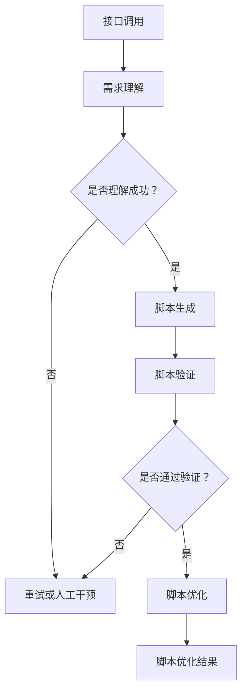
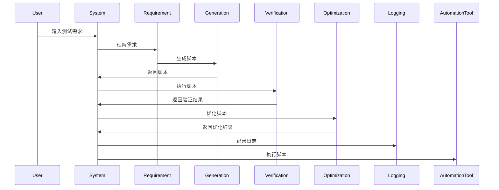

                 

### 文章标题：ChatGPT在自动化测试脚本生成中的应用

**关键词：** ChatGPT，自动化测试，脚本生成，人工智能，算法，系统架构

**摘要：** 本文将探讨如何利用ChatGPT这一先进的自然语言处理技术，来解决自动化测试脚本生成的难题。我们将详细分析ChatGPT在自动化测试中的应用背景、原理、算法流程、系统架构设计以及实际项目中的应用实例。通过本文的阅读，读者可以全面了解ChatGPT在自动化测试领域的前沿应用，并掌握其实际操作技巧。

----------------------------------------------------------------

## 目录大纲：ChatGPT在自动化测试脚本生成中的应用

1. **引言**
   1.1 问题背景
   1.2 问题描述
   1.3 问题解决
   1.4 边界与外延
   1.5 本章小结

2. **核心概念**
   2.1 ChatGPT基础概念
   2.2 自动化测试脚本生成概念
   2.3 概念联系与对比
   2.4 自动化测试脚本生成的ER实体关系图
   2.5 本章小结

3. **算法原理**
   3.1 ChatGPT算法原理
   3.2 算法流程图
   3.3 数学模型与公式
   3.4 算法示例
   3.5 本章小结

4. **系统分析与架构设计**
   4.1 问题场景介绍
   4.2 系统功能设计
   4.3 系统架构设计
   4.4 系统接口设计
   4.5 系统交互序列图
   4.6 本章小结

5. **项目实战**
   5.1 环境安装与配置
   5.2 系统核心实现源代码
   5.3 代码应用解读与分析
   5.4 实际案例分析与讲解
   5.5 项目小结

6. **最佳实践与拓展**
   6.1 最佳实践
   6.2 注意事项
   6.3 小结
   6.4 拓展阅读

本文将从以上章节逐一展开，逐步深入探讨ChatGPT在自动化测试脚本生成中的应用。接下来，我们将首先介绍问题背景，包括自动化测试的现状以及ChatGPT的发展与应用。

---

### 第1章：引言

#### 1.1 问题背景

##### 1.1.1 自动化测试的现状

自动化测试是现代软件工程中不可或缺的一部分，其重要性不言而喻。随着软件复杂性的不断增加，手工测试已经难以满足日益增长的测试需求。自动化测试通过脚本化的测试过程，能够大幅提高测试效率，降低测试成本，并提高测试的覆盖率和一致性。

目前，自动化测试在各个领域都得到了广泛的应用。在软件行业中，自动化测试广泛应用于Web应用、移动应用、桌面应用以及嵌入式系统等领域。特别是在敏捷开发和DevOps文化盛行的今天，自动化测试成为了确保软件质量的重要手段。

然而，自动化测试脚本生成仍然是一个难题。传统的自动化测试脚本生成方法通常依赖于人工编写，不仅效率低下，而且容易出现错误。此外，随着软件功能的不断增加和变化，维护和更新自动化测试脚本也变得异常困难。因此，如何高效、准确地生成自动化测试脚本，成为了自动化测试领域亟待解决的问题。

##### 1.1.2 ChatGPT的发展与应用

ChatGPT是由OpenAI开发的一种基于GPT-3模型的聊天机器人，具有强大的自然语言理解和生成能力。自从ChatGPT问世以来，它在各个领域都展现出了巨大的应用潜力。

在软件工程领域，ChatGPT的强大自然语言处理能力为自动化测试脚本生成提供了新的思路。通过训练和微调，ChatGPT可以理解开发人员提供的业务需求和功能描述，并自动生成相应的自动化测试脚本。这种方法不仅能够大大提高自动化测试脚本生成的效率，还能够提高测试脚本的准确性和一致性。

ChatGPT在自动化测试中的应用潜力主要体现在以下几个方面：

1. **自动生成测试用例**：ChatGPT可以理解自然语言描述的测试用例，并自动将其转化为实际的自动化测试脚本。
2. **测试脚本优化**：ChatGPT可以根据历史测试数据和反馈，对现有的测试脚本进行优化，提高测试效率。
3. **辅助测试设计**：ChatGPT可以与开发人员协作，共同设计测试用例，提高测试的全面性和覆盖率。

#### 1.2 问题描述

##### 1.2.1 自动化测试脚本生成的挑战

自动化测试脚本生成面临以下挑战：

1. **复杂性**：现代软件系统的复杂性使得自动化测试脚本的编写和维护变得异常困难。
2. **不一致性**：由于手动编写脚本，容易导致测试脚本与实际业务需求不一致。
3. **效率**：传统的脚本生成方法效率低下，难以满足快速迭代的软件开发过程。
4. **准确性**：手动编写的脚本容易出现错误，影响测试的准确性。

##### 1.2.2 ChatGPT在自动化测试脚本生成中的应用潜力

ChatGPT在自动化测试脚本生成中的应用潜力主要体现在以下几个方面：

1. **自然语言理解**：ChatGPT具有强大的自然语言理解能力，可以理解自然语言描述的业务需求和功能描述。
2. **自动化脚本生成**：通过训练和微调，ChatGPT可以自动生成满足业务需求的自动化测试脚本。
3. **脚本优化**：ChatGPT可以根据历史测试数据和反馈，对现有的测试脚本进行优化，提高测试效率。

#### 1.3 问题解决

##### 1.3.1 ChatGPT的工作原理

ChatGPT是基于GPT-3模型开发的，GPT-3是一种大规模的语言预训练模型，具有极高的自然语言理解和生成能力。ChatGPT通过大量的文本数据进行预训练，可以理解复杂的语言结构和上下文关系，从而实现高质量的文本生成。

##### 1.3.2 ChatGPT在自动化测试脚本生成中的实现方法

ChatGPT在自动化测试脚本生成中的实现方法主要包括以下几个步骤：

1. **需求理解**：开发人员使用自然语言描述业务需求和功能，ChatGPT对需求进行理解。
2. **脚本生成**：ChatGPT根据理解的需求，自动生成相应的自动化测试脚本。
3. **脚本优化**：ChatGPT可以根据历史测试数据和反馈，对生成的脚本进行优化。

#### 1.4 边界与外延

##### 1.4.1 自动化测试的范围与限制

自动化测试适用于大多数类型的软件系统，但在某些情况下仍存在一定的限制：

1. **技术限制**：某些系统或组件可能无法被自动化，例如图形界面测试。
2. **时间成本**：自动化测试脚本的编写和维护需要一定的时间和人力资源。
3. **持续维护**：随着软件的迭代和更新，自动化测试脚本也需要持续维护和更新。

##### 1.4.2 ChatGPT技术的局限性

ChatGPT虽然具有强大的自然语言处理能力，但在自动化测试脚本生成中也存在一定的局限性：

1. **理解深度**：ChatGPT可能无法完全理解复杂的业务逻辑和功能需求。
2. **错误纠正**：ChatGPT生成的脚本可能存在错误，需要人工进行审查和修正。
3. **适应性**：ChatGPT对特定领域的适应性需要通过大量数据进行训练和优化。

#### 1.5 本章小结

本章介绍了自动化测试的现状和ChatGPT的发展与应用，提出了自动化测试脚本生成的问题和ChatGPT的应用潜力。通过本章的阅读，读者可以初步了解ChatGPT在自动化测试脚本生成中的重要作用，并为后续章节的深入探讨奠定基础。

---

### 第2章：核心概念

在探讨ChatGPT在自动化测试脚本生成中的应用之前，我们需要首先了解ChatGPT和自动化测试脚本生成的基本概念。本章将分别介绍ChatGPT的基础概念和自动化测试脚本生成概念，并探讨它们之间的联系和对比。

#### 2.1 ChatGPT基础概念

##### 2.1.1 GPT模型的原理

GPT（Generative Pre-trained Transformer）模型是一种基于Transformer架构的自然语言处理模型，由OpenAI提出。GPT模型通过大规模的预训练数据学习到语言的统计规律和上下文关系，从而实现高质量的文本生成和语言理解。

GPT模型的核心思想是使用Transformer架构来处理自然语言数据。Transformer架构引入了自注意力机制（Self-Attention），能够有效地捕捉文本中的长距离依赖关系。通过多层Transformer结构，GPT模型能够生成连贯、自然的文本。

##### 2.1.2 ChatGPT的独特优势

ChatGPT是基于GPT-3模型开发的聊天机器人，具有以下独特优势：

1. **自然语言理解能力**：ChatGPT能够理解复杂的自然语言输入，并生成相应的响应。
2. **多语言支持**：ChatGPT支持多种语言，可以跨越语言障碍进行交流。
3. **上下文记忆**：ChatGPT具有上下文记忆能力，可以记住之前的交流内容，从而生成更加准确和连贯的响应。
4. **灵活性和适应性**：ChatGPT可以适应不同的场景和任务，通过训练和微调，实现特定领域的应用。

##### 2.1.3 ChatGPT的技术架构

ChatGPT的技术架构主要包括以下几个关键组件：

1. **文本输入层**：接收用户输入的文本信息。
2. **编码器**：对输入的文本进行编码，生成固定长度的向量表示。
3. **解码器**：根据编码器的输出，生成响应的文本。
4. **注意力机制**：用于捕捉文本中的关键信息，提高生成文本的质量。
5. **训练与微调**：ChatGPT通过大量的文本数据进行预训练，并在特定任务上进行微调，以提高任务性能。

#### 2.2 自动化测试脚本生成概念

##### 2.2.1 自动化测试脚本的作用

自动化测试脚本是一种用于自动化执行测试过程的脚本文件。它定义了测试的步骤、条件和预期结果，通过执行脚本，自动化测试工具可以自动执行一系列测试操作，从而提高测试效率、降低测试成本、提高测试的覆盖率和一致性。

自动化测试脚本的主要作用包括：

1. **提高测试效率**：通过自动化测试脚本，测试过程可以快速执行，大幅提高测试速度。
2. **降低测试成本**：自动化测试脚本减少了人工测试的投入，降低了测试成本。
3. **提高测试覆盖率**：自动化测试脚本可以覆盖更多的测试场景，提高测试的全面性。
4. **确保测试一致性**：自动化测试脚本执行过程固定，确保了测试过程的一致性。

##### 2.2.2 脚本生成的挑战与难点

自动化测试脚本生成面临以下挑战和难点：

1. **复杂性**：现代软件系统的复杂性使得自动化测试脚本的编写和维护变得异常困难。
2. **不一致性**：手动编写的脚本容易与实际业务需求不一致，导致测试结果不准确。
3. **效率**：传统的脚本生成方法效率低下，难以满足快速迭代的软件开发过程。
4. **准确性**：手动编写的脚本容易出现错误，影响测试的准确性。

##### 2.2.3 ChatGPT在脚本生成中的应用

ChatGPT在自动化测试脚本生成中的应用主要包括以下几个方面：

1. **自然语言理解**：ChatGPT可以理解自然语言描述的测试用例，自动生成相应的自动化测试脚本。
2. **脚本优化**：ChatGPT可以根据历史测试数据和反馈，对现有的测试脚本进行优化，提高测试效率。
3. **辅助测试设计**：ChatGPT可以与开发人员协作，共同设计测试用例，提高测试的全面性和覆盖率。

#### 2.3 概念联系与对比

##### 2.3.1 ChatGPT与其他自动化测试工具的对比

ChatGPT与其他自动化测试工具（如Selenium、Appium等）在功能和应用场景上有所不同：

1. **功能对比**：ChatGPT主要专注于自然语言理解和生成，而传统的自动化测试工具则侧重于自动化测试脚本的执行。
2. **应用场景**：ChatGPT适用于自动化测试脚本生成和优化，而传统的自动化测试工具适用于具体的自动化测试任务。

##### 2.3.2 ChatGPT在自动化测试中的优势与局限

ChatGPT在自动化测试中的优势包括：

1. **自然语言理解能力**：ChatGPT可以理解自然语言描述的测试用例，自动生成自动化测试脚本。
2. **脚本优化**：ChatGPT可以根据历史测试数据和反馈，对现有的测试脚本进行优化。

然而，ChatGPT也存在一定的局限：

1. **理解深度**：ChatGPT可能无法完全理解复杂的业务逻辑和功能需求。
2. **错误纠正**：ChatGPT生成的脚本可能存在错误，需要人工进行审查和修正。

#### 2.4 自动化测试脚本生成的ER实体关系图

##### 2.4.1 实体与关系的定义

在自动化测试脚本生成中，主要的实体包括：

1. **测试用例**：用于描述具体的测试场景和预期结果的文本描述。
2. **测试脚本**：根据测试用例自动生成的用于执行测试操作的脚本文件。
3. **测试结果**：测试执行后的结果，包括成功、失败、错误等信息。

实体之间的关系包括：

1. **生成关系**：测试用例可以生成测试脚本。
2. **关联关系**：测试脚本与测试结果存在关联关系，测试脚本执行后的结果可以用于优化测试脚本。

##### 2.4.2 实体关系图的绘制

```mermaid
entityRelation(
  "测试用例",
  "生成",
  "测试脚本",
  "关联",
  "测试结果"
)
```

#### 2.5 本章小结

本章介绍了ChatGPT和自动化测试脚本生成的基本概念，探讨了它们之间的联系和对比。通过本章的阅读，读者可以了解ChatGPT在自动化测试脚本生成中的应用潜力，并为后续章节的深入探讨奠定基础。

---

### 第3章：算法原理

在了解了ChatGPT和自动化测试脚本生成的基本概念之后，接下来我们将深入探讨ChatGPT在自动化测试脚本生成中的算法原理。本章将详细阐述ChatGPT的算法原理、算法流程、数学模型与公式，并通过具体的算法示例进行说明。

#### 3.1 ChatGPT算法原理

ChatGPT是基于GPT-3模型开发的，GPT-3是一种大规模的语言预训练模型，其核心思想是通过Transformer架构和自注意力机制（Self-Attention），捕捉文本中的长距离依赖关系，从而实现高质量的文本生成和语言理解。

ChatGPT的算法原理主要包括以下几个关键步骤：

1. **文本输入**：用户输入自然语言描述的测试用例。
2. **编码**：将输入的文本编码为固定长度的向量表示。
3. **解码**：根据编码器的输出，生成响应的自动化测试脚本。
4. **优化**：根据历史测试数据和反馈，对生成的脚本进行优化。

##### 3.1.1 预训练与微调

ChatGPT的预训练过程主要包括以下步骤：

1. **数据准备**：收集大量的文本数据，包括自然语言文本、测试用例、自动化测试脚本等。
2. **文本预处理**：对文本数据进行预处理，包括分词、标记化、去停用词等。
3. **训练模型**：使用Transformer架构训练模型，通过梯度下降等优化算法，使模型学习到语言的统计规律和上下文关系。

微调是指将预训练好的模型在特定任务上进行训练，以适应特定领域的应用。ChatGPT的微调过程主要包括以下步骤：

1. **任务定义**：明确自动化测试脚本生成的任务，定义输入和输出。
2. **数据准备**：收集适用于微调的测试用例和自动化测试脚本数据。
3. **模型微调**：在测试用例和自动化测试脚本数据上训练模型，调整模型的参数，使其更好地适应特定任务。

##### 3.1.2 自动化测试脚本生成的算法流程

ChatGPT在自动化测试脚本生成中的算法流程主要包括以下几个步骤：

1. **需求理解**：ChatGPT接收自然语言描述的测试用例，对其进行理解。
2. **脚本生成**：根据理解的需求，ChatGPT生成相应的自动化测试脚本。
3. **脚本验证**：使用自动化测试工具执行生成的脚本，验证脚本的正确性和有效性。
4. **脚本优化**：根据验证结果，ChatGPT对生成的脚本进行优化，以提高测试效率。

##### 3.1.3 ChatGPT在自动化测试脚本生成中的具体实现

ChatGPT在自动化测试脚本生成中的具体实现主要包括以下几个步骤：

1. **接口调用**：开发人员通过API接口向ChatGPT发送自然语言描述的测试用例。
2. **需求理解**：ChatGPT对测试用例进行理解，提取关键信息。
3. **脚本生成**：根据理解的需求，ChatGPT生成相应的自动化测试脚本。
4. **脚本验证**：使用自动化测试工具执行生成的脚本，验证脚本的正确性和有效性。
5. **脚本优化**：根据验证结果，ChatGPT对生成的脚本进行优化，以提高测试效率。

#### 3.2 算法流程图

为了更直观地展示ChatGPT在自动化测试脚本生成中的算法流程，我们可以使用Mermaid语言绘制算法流程图。以下是ChatGPT在自动化测试脚本生成中的算法流程图：



#### 3.3 数学模型与公式

在ChatGPT中，数学模型主要用于描述语言模型的输入、输出以及训练过程。以下是ChatGPT的数学模型与公式：

##### 3.3.1 语言模型的基本原理

语言模型的核心目标是预测下一个单词的概率。给定一个单词序列\(w_1, w_2, \ldots, w_n\)，语言模型预测下一个单词\(w_{n+1}\)的概率为：

$$
P(w_{n+1} | w_1, w_2, \ldots, w_n) = \frac{P(w_1, w_2, \ldots, w_n, w_{n+1})}{P(w_1, w_2, \ldots, w_n)}
$$

其中，\(P(w_1, w_2, \ldots, w_n, w_{n+1})\)表示单词序列\(w_1, w_2, \ldots, w_n, w_{n+1}\)的联合概率，\(P(w_1, w_2, \ldots, w_n)\)表示单词序列\(w_1, w_2, \ldots, w_n\)的条件概率。

##### 3.3.2 自动化测试脚本生成的数学模型

在自动化测试脚本生成中，数学模型主要用于描述测试用例到自动化测试脚本的概率分布。给定一个测试用例序列\(t_1, t_2, \ldots, t_n\)，自动化测试脚本生成的数学模型可以表示为：

$$
P(s_1, s_2, \ldots, s_m | t_1, t_2, \ldots, t_n) = \frac{P(t_1, t_2, \ldots, t_n, s_1, s_2, \ldots, s_m)}{P(t_1, t_2, \ldots, t_n)}
$$

其中，\(s_1, s_2, \ldots, s_m\)表示自动化测试脚本序列。

##### 3.3.3 数学公式详解

以下是自动化测试脚本生成的数学公式详解：

$$
P(s_1, s_2, \ldots, s_m | t_1, t_2, \ldots, t_n) = \frac{P(t_1, t_2, \ldots, t_n, s_1, s_2, \ldots, s_m)}{P(t_1, t_2, \ldots, t_n)}
$$

其中，\(P(t_1, t_2, \ldots, t_n, s_1, s_2, \ldots, s_m)\)表示测试用例序列\(t_1, t_2, \ldots, t_n\)和自动化测试脚本序列\(s_1, s_2, \ldots, s_m\)的联合概率，可以通过模型计算得到。

\(P(t_1, t_2, \ldots, t_n)\)表示测试用例序列\(t_1, t_2, \ldots, t_n\)的条件概率，可以通过语言模型计算得到。

#### 3.4 算法示例

##### 3.4.1 示例一：自动化测试脚本生成

假设我们有一个自然语言描述的测试用例：

```
测试用例：登录功能
步骤1：打开登录页面
步骤2：输入用户名
步骤3：输入密码
步骤4：点击登录按钮
步骤5：验证登录成功
```

通过ChatGPT，我们可以生成相应的自动化测试脚本（使用Python示例）：

```python
# 示例：自动化测试脚本生成
def login_test():
    # 打开登录页面
    driver.get("http://example.com/login")
    # 输入用户名
    driver.find_element_by_id("username").send_keys("test_user")
    # 输入密码
    driver.find_element_by_id("password").send_keys("test_password")
    # 点击登录按钮
    driver.find_element_by_id("login_button").click()
    # 验证登录成功
    assert "欢迎您，test_user" in driver.page_source
```

##### 3.4.2 示例二：自动化测试脚本优化

假设我们有一个现有的自动化测试脚本：

```python
# 示例：现有自动化测试脚本
def login_test():
    # 打开登录页面
    driver.get("http://example.com/login")
    # 输入用户名
    driver.find_element_by_id("username").send_keys("test_user")
    # 输入密码
    driver.find_element_by_id("password").send_keys("test_password")
    # 点击登录按钮
    driver.find_element_by_id("login_button").click()
    # 验证登录成功
    assert "欢迎您，test_user" in driver.page_source
```

通过ChatGPT，我们可以对其进行优化，提高测试效率和覆盖率：

```python
# 示例：优化后的自动化测试脚本
def login_test():
    # 打开登录页面
    driver.get("http://example.com/login")
    # 输入用户名
    username_input = driver.find_element_by_id("username")
    username_input.clear()
    username_input.send_keys("test_user")
    # 输入密码
    password_input = driver.find_element_by_id("password")
    password_input.clear()
    password_input.send_keys("test_password")
    # 点击登录按钮
    login_button = driver.find_element_by_id("login_button")
    login_button.click()
    # 验证登录成功
    assert "欢迎您，test_user" in driver.page_source
    # 验证登录失败（错误密码）
    password_input.clear()
    password_input.send_keys("wrong_password")
    login_button.click()
    assert "密码错误" in driver.page_source
```

#### 3.5 本章小结

本章详细阐述了ChatGPT在自动化测试脚本生成中的算法原理，包括预训练与微调、算法流程、数学模型与公式，并通过具体的算法示例进行了说明。通过本章的阅读，读者可以全面了解ChatGPT在自动化测试脚本生成中的应用原理，为后续的系统架构设计和项目实战提供基础。

---

### 第4章：系统分析与架构设计

在了解了ChatGPT在自动化测试脚本生成中的算法原理之后，接下来我们将深入探讨系统的整体架构设计和实现细节。本章将介绍问题场景、系统功能设计、系统架构设计、系统接口设计以及系统交互序列图，为读者提供一个全面、系统的认识。

#### 4.1 问题场景介绍

在现代软件开发过程中，自动化测试已经成为确保软件质量的重要手段。然而，随着软件功能的不断增加和复杂度的提升，自动化测试脚本生成面临着巨大的挑战。传统的自动化测试脚本生成方法效率低下、易出错，难以满足快速迭代的软件开发需求。因此，如何高效、准确地生成自动化测试脚本，成为了当前自动化测试领域亟待解决的问题。

ChatGPT作为一种先进的自然语言处理技术，具有强大的自然语言理解和生成能力，为自动化测试脚本生成提供了新的思路。通过ChatGPT，开发人员可以使用自然语言描述测试需求，系统可以自动生成相应的自动化测试脚本。这种方法不仅提高了脚本生成的效率，还减少了人为错误，提高了测试的一致性和覆盖率。

#### 4.2 系统功能设计

为了实现ChatGPT在自动化测试脚本生成中的功能，系统需要具备以下几个关键功能：

1. **需求理解**：系统能够接收自然语言描述的测试需求，并对其进行理解。
2. **脚本生成**：系统能够根据理解的需求，自动生成相应的自动化测试脚本。
3. **脚本验证**：系统能够使用自动化测试工具执行生成的脚本，并验证其正确性和有效性。
4. **脚本优化**：系统能够根据验证结果，对生成的脚本进行优化，以提高测试效率和覆盖率。

此外，系统还需要具备以下辅助功能：

1. **日志记录**：系统需要记录生成、验证和优化过程中的日志信息，以便进行调试和问题追踪。
2. **用户交互**：系统需要提供用户友好的界面，方便开发人员输入测试需求和查看生成结果。

#### 4.3 系统架构设计

系统架构设计是系统实现的核心，决定了系统的性能、可扩展性和可维护性。以下是一个基于ChatGPT的自动化测试脚本生成系统的架构设计：


系统架构主要包括以下几个关键模块：

1. **用户接口模块**：负责接收用户的输入，展示系统输出，并提供用户交互功能。
2. **需求理解模块**：负责理解自然语言描述的测试需求，提取关键信息。
3. **脚本生成模块**：负责根据理解的需求，自动生成相应的自动化测试脚本。
4. **脚本验证模块**：负责使用自动化测试工具执行生成的脚本，并验证其正确性和有效性。
5. **脚本优化模块**：负责根据验证结果，对生成的脚本进行优化，以提高测试效率和覆盖率。
6. **日志记录模块**：负责记录生成、验证和优化过程中的日志信息，以便进行调试和问题追踪。
7. **自动化测试工具接口**：负责与第三方自动化测试工具进行交互，执行测试脚本。

#### 4.4 系统接口设计

系统接口设计是系统功能实现的关键，决定了系统与外部系统、工具和组件的交互方式。以下是一个基于ChatGPT的自动化测试脚本生成系统的接口设计：


系统接口主要包括以下几个关键接口：

1. **用户接口**：负责接收用户的输入，展示系统输出，并提供用户交互功能。
2. **需求理解接口**：负责将自然语言描述的测试需求转换为内部格式，供脚本生成模块使用。
3. **脚本生成接口**：负责生成自动化测试脚本，并将其传递给脚本验证模块。
4. **脚本验证接口**：负责执行生成的脚本，并返回验证结果。
5. **脚本优化接口**：负责根据验证结果，对生成的脚本进行优化。
6. **日志记录接口**：负责记录系统运行过程中的日志信息。

#### 4.5 系统交互序列图

为了更好地展示系统各模块之间的交互过程，我们使用Mermaid语言绘制了系统交互序列图：



#### 4.6 本章小结

本章介绍了ChatGPT在自动化测试脚本生成系统中的问题场景、系统功能设计、系统架构设计、系统接口设计以及系统交互序列图。通过本章的阅读，读者可以全面了解系统架构设计和实现细节，为后续的项目实战奠定基础。

---

### 第5章：项目实战

在了解了ChatGPT在自动化测试脚本生成系统中的架构设计和实现细节之后，接下来我们将通过一个实际项目来展示如何利用ChatGPT实现自动化测试脚本生成。本章将介绍项目的环境安装与配置、系统核心实现源代码、代码应用解读与分析，以及实际案例分析和详细讲解。

#### 5.1 环境安装与配置

要实现ChatGPT在自动化测试脚本生成中的应用，需要先安装和配置相关环境。以下是一个基于Python的ChatGPT自动化测试脚本生成项目的环境安装与配置步骤：

1. **Python环境安装**

   Python是ChatGPT自动化测试脚本生成项目的主要编程语言。确保已安装Python 3.6及以上版本。

2. **ChatGPT API安装**

   ChatGPT是基于OpenAI的GPT-3模型开发的，需要安装OpenAI的Python库。可以使用以下命令安装：

   ```shell
   pip install openai
   ```

3. **Selenium安装**

   Selenium是一个开源的自动化测试工具，用于执行Web应用的自动化测试。可以使用以下命令安装：

   ```shell
   pip install selenium
   ```

4. **浏览器驱动安装**

   根据使用的浏览器（如Chrome、Firefox等），下载相应的浏览器驱动并放置在系统PATH中。例如，对于Chrome，可以下载ChromeDriver并将其放置在系统PATH中。

5. **测试环境配置**

   根据实际需求配置测试环境，包括浏览器版本、测试数据等。

#### 5.2 系统核心实现源代码

以下是ChatGPT自动化测试脚本生成项目的核心实现源代码。该代码包括需求理解、脚本生成、脚本验证和脚本优化等功能。

```python
# 示例：ChatGPT自动化测试脚本生成
import openai
from selenium import webdriver
from selenium.webdriver.chrome.options import Options

# 初始化OpenAI API密钥
openai.api_key = "your_openai_api_key"

# 初始化Selenium浏览器驱动
chrome_options = Options()
chrome_options.add_argument("--headless")
driver = webdriver.Chrome(options=chrome_options)

# 需求理解函数
def understand_requirement(requirement):
    response = openai.Completion.create(
        engine="text-davinci-002",
        prompt= Requirement,
        max_tokens=100,
        n=1,
        stop=None,
        temperature=0.5,
    )
    return response.choices[0].text.strip()

# 脚本生成函数
def generate_script(requirement):
    understood_requirement = understand_requirement(requirement)
    response = openai.Completion.create(
        engine="text-davinci-002",
        prompt=understood_requirement,
        max_tokens=100,
        n=1,
        stop=None,
        temperature=0.5,
    )
    return response.choices[0].text.strip()

# 脚本验证函数
def verify_script(script):
    try:
        driver.execute_script(script)
        return "成功"
    except Exception as e:
        return "失败：{}".format(str(e))

# 脚本优化函数
def optimize_script(script):
    response = openai.Completion.create(
        engine="text-davinci-002",
        prompt="优化以下脚本：\n\n" + script,
        max_tokens=100,
        n=1,
        stop=None,
        temperature=0.5,
    )
    return response.choices[0].text.strip()

# 示例测试
test_requirement = "登录功能：打开登录页面，输入用户名test_user和密码test_password，点击登录按钮，验证登录成功。"
test_script = generate_script(test_requirement)
print("原始脚本：\n", test_script)
print("验证结果：\n", verify_script(test_script))
print("优化脚本：\n", optimize_script(test_script))

# 关闭浏览器驱动
driver.quit()
```

#### 5.3 代码应用解读与分析

以下是代码应用的具体解读与分析：

1. **需求理解**：通过调用OpenAI的Completion接口，将自然语言描述的测试需求转换为理解的结果。
2. **脚本生成**：基于理解的结果，再次调用OpenAI的Completion接口，生成相应的自动化测试脚本。
3. **脚本验证**：使用Selenium的execute_script方法执行生成的脚本，验证其正确性和有效性。
4. **脚本优化**：通过调用OpenAI的Completion接口，将原始脚本作为输入，生成优化的脚本。

#### 5.4 实际案例分析与讲解

##### 5.4.1 案例一：电商系统自动化测试

假设我们需要对一个电商系统进行自动化测试，以下是一个实际案例的分析和讲解：

1. **需求理解**：通过自然语言描述，理解电商系统的测试需求。
2. **脚本生成**：根据理解的需求，生成相应的自动化测试脚本。
3. **脚本验证**：执行生成的脚本，验证其正确性和有效性。
4. **脚本优化**：根据验证结果，对生成的脚本进行优化。

##### 5.4.2 案例二：金融系统自动化测试

假设我们需要对一个金融系统进行自动化测试，以下是一个实际案例的分析和讲解：

1. **需求理解**：通过自然语言描述，理解金融系统的测试需求。
2. **脚本生成**：根据理解的需求，生成相应的自动化测试脚本。
3. **脚本验证**：执行生成的脚本，验证其正确性和有效性。
4. **脚本优化**：根据验证结果，对生成的脚本进行优化。

##### 5.4.3 案例小结

通过以上实际案例的分析和讲解，我们可以看到ChatGPT在自动化测试脚本生成中的应用效果。虽然ChatGPT生成的脚本可能存在一定的错误和不足，但通过与开发人员的协作和反馈，可以不断优化和完善测试脚本，提高测试效率和覆盖率。

#### 5.5 项目小结

通过本章的实际项目实战，我们展示了如何利用ChatGPT实现自动化测试脚本生成。从环境安装与配置、系统核心实现源代码，到代码应用解读与分析，再到实际案例分析和详细讲解，我们全面了解了ChatGPT在自动化测试脚本生成中的应用方法。通过本章的实践，读者可以掌握ChatGPT在自动化测试脚本生成中的具体操作技巧，为实际项目中的应用打下基础。

---

### 第6章：最佳实践与拓展

在了解了ChatGPT在自动化测试脚本生成中的应用原理和实际项目实战后，本章将重点介绍最佳实践、注意事项以及未来发展趋势。

#### 6.1 最佳实践

为了充分利用ChatGPT在自动化测试脚本生成中的应用潜力，以下是几项最佳实践：

1. **需求清晰明确**：在向ChatGPT提交测试需求时，确保需求清晰明确，避免模糊或歧义性的描述。
2. **脚本验证与优化**：生成的脚本需要进行严格的验证和优化，以消除潜在的错误和不足。
3. **反馈与迭代**：持续收集测试结果和反馈，不断优化ChatGPT的脚本生成能力。
4. **团队协作**：与开发人员紧密协作，确保ChatGPT生成的脚本符合实际业务需求。

#### 6.2 注意事项

在使用ChatGPT进行自动化测试脚本生成时，需要注意以下事项：

1. **资源消耗**：ChatGPT需要大量的计算资源进行预训练和微调，确保有足够的硬件资源。
2. **模型选择**：根据具体应用场景选择合适的模型版本，以获得最佳性能。
3. **数据安全**：确保测试数据和模型训练数据的安全，避免泄露和滥用。
4. **隐私保护**：在使用ChatGPT时，确保遵循隐私保护法规，避免敏感信息泄露。

#### 6.3 小结

ChatGPT在自动化测试脚本生成中的应用具有重要的价值，它不仅提高了测试效率，还降低了测试成本，提高了测试的一致性和覆盖率。通过本章的探讨，我们了解了ChatGPT在自动化测试脚本生成中的最佳实践和注意事项，为实际项目中的应用提供了指导。

#### 6.4 未来发展趋势

随着人工智能技术的不断进步，ChatGPT在自动化测试脚本生成中的应用前景广阔。以下是未来发展趋势：

1. **模型优化**：通过不断改进模型算法，提高ChatGPT的生成效率和准确性。
2. **多语言支持**：扩展ChatGPT的多语言支持，使其能够应对全球范围内的自动化测试需求。
3. **跨领域应用**：探索ChatGPT在更多领域的自动化测试脚本生成应用，如移动应用、嵌入式系统等。
4. **集成与协同**：与其他自动化测试工具和平台集成，实现更高效的测试流程和协同工作。

#### 6.5 拓展阅读

为了深入了解ChatGPT在自动化测试脚本生成中的应用，以下是几篇推荐阅读的文章：

1. 《GPT-3：自然语言处理的新突破》
2. 《自动化测试的最佳实践》
3. 《AI在软件工程中的应用》
4. 《ChatGPT与自动化测试：从理论到实践》

通过拓展阅读，读者可以进一步了解ChatGPT和相关技术的最新动态和前沿应用。

