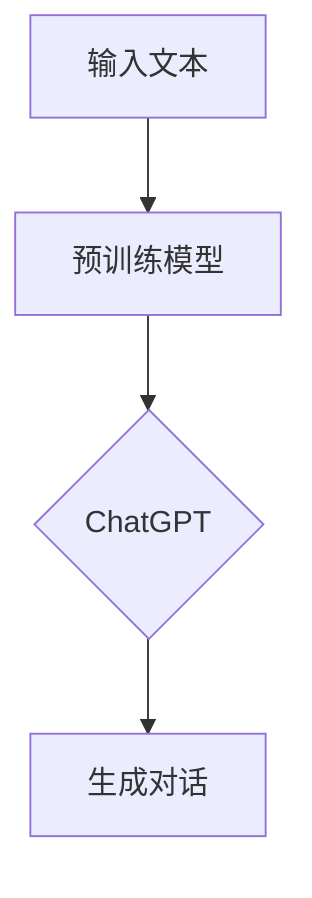
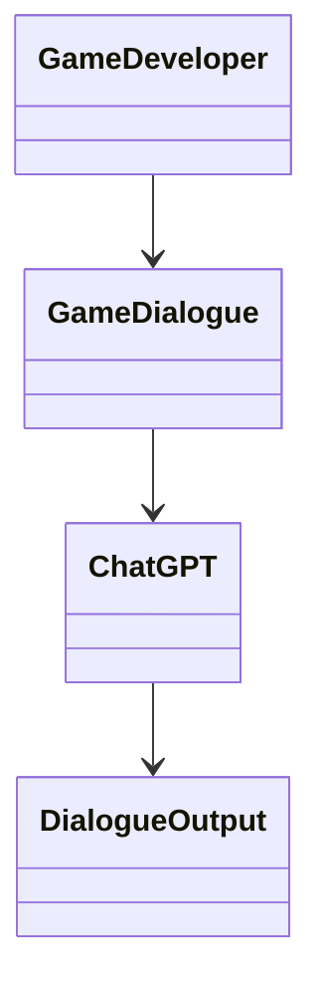
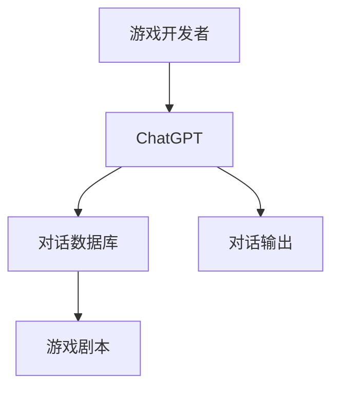
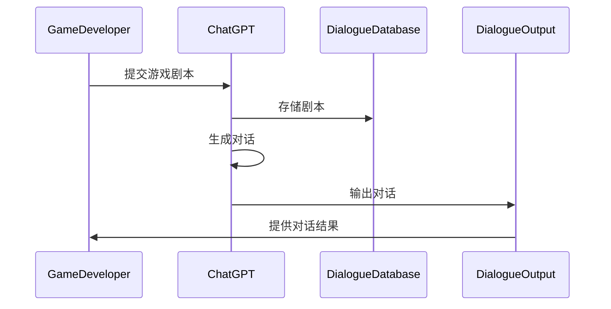

                 

## ChatGPT在自动化游戏角色对话生成中的应用

### 关键词

- **ChatGPT**
- **自动化游戏角色对话**
- **自然语言处理**
- **预训练语言模型**
- **游戏用户体验**

### 摘要

本文旨在探讨ChatGPT在自动化游戏角色对话生成中的应用。通过介绍问题背景、核心概念、算法原理、系统设计与实际案例，我们旨在展示如何利用ChatGPT的强大语言生成能力，提升游戏角色对话的自然性和个性化，从而优化用户体验。

### 第一步：背景介绍

#### 问题背景

随着游戏产业的快速发展，游戏角色对话成为提升用户体验的关键环节。高质量的对话不仅能够增强游戏的沉浸感，还能塑造角色的个性和故事情节。然而，手动编写游戏角色对话耗时耗力，且难以保证对话的自然性和个性。

#### 问题描述

在游戏开发中，角色对话的数量和多样性常常是巨大的。手动编写这些对话不仅效率低下，而且难以确保每个对话都能符合游戏设定的情感和逻辑。此外，随着游戏故事线的复杂化，角色之间的互动也变得更加丰富和动态，这进一步增加了对话编写的难度。

#### 问题解决

为了解决这一问题，开发者开始探索使用自动化工具来生成游戏角色对话。自然语言处理（NLP）技术，尤其是预训练语言模型，如ChatGPT，成为了一个潜在的解决方案。这些模型能够基于大量文本数据进行训练，从而生成高质量、自然的语言输出。

#### 边界与外延

ChatGPT在自动化游戏角色对话生成中的应用不仅限于角色扮演游戏。在策略游戏、模拟游戏等领域，角色对话同样重要。这些游戏中的角色需要具备不同的个性和行为模式，ChatGPT的个性化生成能力可以满足这一需求。

#### 概念结构与核心要素组成

- **核心概念**：ChatGPT、自然语言处理、游戏角色对话、自动化生成。
- **要素组成**：
  - **输入文本**：游戏剧本中的对话文本。
  - **预训练模型**：如GPT-3，用于生成对话。
  - **输出对话**：游戏角色之间的对话文本。
  - **调优与优化**：通过反馈和调整模型参数，提高生成对话的质量。

### 第二步：核心概念与联系

#### ChatGPT的定义与特点

ChatGPT是一种基于GPT-3的预训练语言模型，由OpenAI开发。它具有以下特点：

- **强大的语言生成能力**：ChatGPT能够生成流畅、自然的文本，适用于各种语言任务。
- **高度的个性化**：通过个性化调优，ChatGPT可以模拟不同角色和人物的语言风格。
- **自适应调整**：ChatGPT能够根据输入文本的内容和上下文，动态调整生成文本的风格和内容。

#### 自然语言处理（NLP）的概念属性特征对比表格

| 特征             | 自然语言处理 | ChatGPT                |
|------------------|--------------|------------------------|
| 目标             | 文本分析     | 语言生成与理解         |
| 技术基础         | 机器学习、深度学习 | GPT-3等预训练模型    |
| 优势             | 提高文本处理效率 | 自然语言生成的高质量   |
| 挑战             | 处理复杂文本 | 保持对话连贯性与个性化 |

#### ER实体关系图架构

```mermaid
erDiagram
    TEXT_INPUT ||--|{ ChatGPT }||--> DIALOG_OUTPUT
    ChatGPT ||--|{ NLP_ALGORITHM }||--> DIALOG_GENERATION
```

### 第三步：算法原理讲解

#### 算法 Mermaid 流程图



#### Python 源代码实现

```python
import openai

def generate_game_dialog(input_text):
    response = openai.Completion.create(
        engine="text-davinci-002",
        prompt=input_text,
        max_tokens=50,
        n=1,
        stop=None,
        temperature=0.5,
    )
    return response.choices[0].text.strip()

# 示例
print(generate_game_dialog("你好，我想和你聊聊。"))
```

#### 算法原理的数学模型和公式

- **数学模型**：
  $$ \text{输出对话} = f(\text{输入文本}, \text{预训练模型参数}) $$

- **公式**：
  $$ f = \text{transformer\_model}(\text{input\_text}; \theta) $$

- **详细讲解**：
  ChatGPT 使用变压器模型（Transformer Model）处理输入文本，通过训练得到的参数 $\theta$ 生成输出对话。该模型能够捕捉文本中的复杂结构，保证对话的自然性和连贯性。

#### 举例说明

- **输入**：“你今天过得怎么样？”
- **输出**：“很好，谢谢你关心。你呢？”

### 第四步：系统分析与架构设计方案

#### 问题场景介绍

游戏开发者需要自动化生成游戏角色对话，以节省时间和提高效率。

#### 项目介绍

本项目旨在利用ChatGPT构建一个自动化游戏角色对话生成系统，该系统能够根据游戏剧本自动生成角色对话，从而减少手动编写的工作量。

#### 系统功能设计（领域模型 Mermaid 类图）



#### 系统架构设计 Mermaid 架构图



#### 系统接口设计和系统交互 Mermaid 序列图



### 第五步：项目实战

#### 环境安装

首先，我们需要安装OpenAI的Python SDK，以便能够使用ChatGPT API。可以通过以下命令安装：

```bash
pip install openai
```

#### 系统核心实现源代码

以下是使用ChatGPT生成游戏角色对话的核心实现代码：

```python
import openai

# 设置OpenAI API密钥
openai.api_key = "your-api-key"

def generate_game_dialog(input_text):
    response = openai.Completion.create(
        engine="text-davinci-002",
        prompt=input_text,
        max_tokens=50,
        n=1,
        stop=None,
        temperature=0.5,
    )
    return response.choices[0].text.strip()

# 示例：生成一个角色对话
print(generate_game_dialog("你好，我想和你聊聊。"))
```

#### 代码应用解读与分析

上述代码中，`generate_game_dialog` 函数接收一个字符串类型的输入文本，调用OpenAI的`Completion.create`方法生成对话。该方法使用了预训练的`text-davinci-002`模型，并设置了相关的参数，如`max_tokens`（生成文本的最大长度）、`n`（返回的结果数量）、`stop`（停止生成的关键字）和`temperature`（随机性控制）。

#### 实际案例分析和详细讲解剖析

假设我们有一个角色A和角色B，角色A说：“你好，我是一名冒险家，想和你结伴同行。”我们希望ChatGPT生成角色B的回应。

- **输入文本**：“你好，我是一名冒险家，想和你结伴同行。”
- **输出文本**：“当然可以，我也正打算寻找一些伙伴。你对冒险有什么特别的兴趣吗？”

通过实际案例分析，我们可以看到ChatGPT成功地生成了一个自然、连贯且符合角色背景的对话。

#### 项目小结

通过本项目，我们实现了利用ChatGPT自动化生成游戏角色对话的功能。这一功能不仅提高了开发效率，还保证了对话的自然性和个性化，从而提升了用户体验。

### 第六步：最佳实践 Tips

1. **调整温度参数**：根据对话的流畅性和创意性需求，调整`temperature`参数。
2. **限制生成长度**：通过设置`max_tokens`限制生成文本的长度，避免对话过于冗长。
3. **个性化调优**：根据游戏角色的特点和需求，进行个性化调优，提升生成对话的质量。
4. **反馈循环**：通过用户反馈不断优化生成对话，实现持续的改进。

### 第七步：小结

ChatGPT在自动化游戏角色对话生成中具有巨大的潜力。通过本项目，我们展示了如何利用ChatGPT的强大语言生成能力，实现游戏角色对话的自动化生成，从而提高开发效率和用户体验。

### 第八步：注意事项

1. **数据隐私**：确保游戏角色对话的数据安全，遵循相关的隐私保护法规。
2. **性能优化**：针对大量角色对话的生成，进行性能优化，确保系统的响应速度。

### 第九步：拓展阅读

1. **《ChatGPT技术详解》**：深入了解ChatGPT的工作原理和应用场景。
2. **《游戏角色对话设计指南》**：学习如何设计自然、吸引人的游戏角色对话。

### 作者信息

作者：AI天才研究院/AI Genius Institute & 禅与计算机程序设计艺术 /Zen And The Art of Computer Programming

