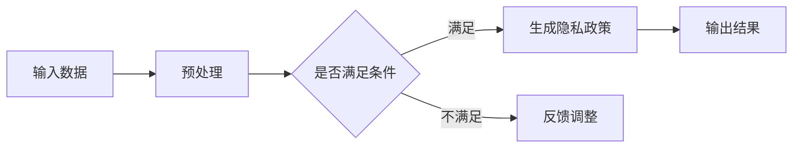
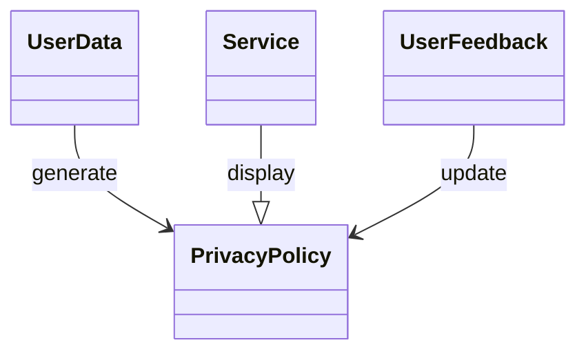
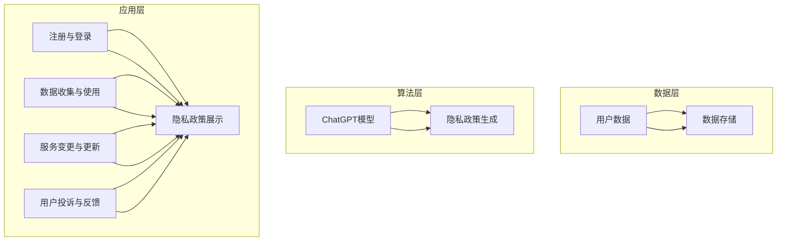
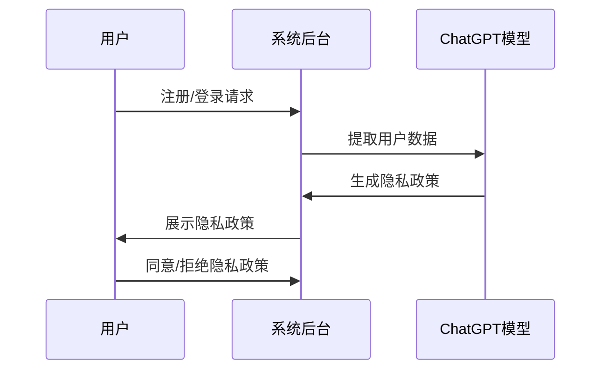

                 


**首先，让我们明确ChatGPT在自动化用户隐私政策生成中的角色。**

**背景介绍**

### 第1章: 问题背景、问题描述、问题解决、边界与外延

#### 1.1 问题背景

随着互联网和大数据技术的快速发展，用户的隐私保护越来越受到关注。用户隐私政策是企业保护用户隐私的重要法律文件，但撰写一份符合法律法规和用户需求的隐私政策是一项复杂且耗时的工作。此外，随着业务场景和用户群体的不断变化，隐私政策的更新和调整也变得至关重要。

#### 1.2 问题描述

当前，用户隐私政策生成主要依赖于人工撰写和修改，存在以下问题：

1. **撰写效率低**：隐私政策涉及法律术语和隐私保护规范，撰写过程需要专业知识和时间投入，效率较低。
2. **更新不及时**：随着法律法规的变化和业务场景的调整，隐私政策需要及时更新，但人工修改和审核过程耗时较长。
3. **个性化不足**：现有隐私政策通常采用一刀切的方式，难以满足不同用户和场景的个性化需求。

#### 1.3 问题解决

为解决上述问题，引入ChatGPT进行自动化用户隐私政策生成，有望实现以下目标：

1. **提高撰写效率**：利用ChatGPT强大的文本生成能力，快速生成符合要求的隐私政策。
2. **实现及时更新**：通过定期训练和更新模型，确保隐私政策与法律法规和业务场景保持同步。
3. **满足个性化需求**：根据用户和场景特点，生成定制化的隐私政策。

#### 1.4 边界与外延

在自动化用户隐私政策生成过程中，需要考虑以下边界与外延：

1. **法律法规遵循**：确保生成的隐私政策符合相关法律法规要求，如《中华人民共和国网络安全法》等。
2. **数据安全与隐私**：在生成和使用隐私政策时，严格保护用户数据，防止数据泄露和滥用。
3. **个性化程度**：在保证合规的前提下，尽可能满足用户和场景的个性化需求。

### 第2章: 核心概念与联系

#### 2.1 核心概念原理

**ChatGPT**：ChatGPT是谷歌推出的一种基于Transformer模型的自然语言处理技术，具有强大的文本生成和问答能力。其核心原理是基于预训练的模型参数，通过输入上下文生成符合语法和语义规则的文本。

**自动化用户隐私政策生成**：指利用人工智能技术，如ChatGPT，自动生成针对不同用户和场景的用户隐私政策。其核心思想是利用模型的文本生成能力，根据输入的数据生成符合要求的隐私政策文本。

#### 2.2 概念属性特征对比表格

| 概念 | 属性特征 |
| ---- | -------- |
| ChatGPT | 基于Transformer模型，文本生成能力强 |
| 自动化用户隐私政策生成 | 提高政策生成效率，降低人力成本 |

#### 2.3 ER实体关系图架构的Mermaid流程图

```mermaid
erDiagram
  User ||--|{ ChatGPT }|| PrivacyPolicy
  PrivacyPolicy ||--|| User
```

**接下来，我们将深入探讨ChatGPT的算法原理，以了解其在自动化用户隐私政策生成中的具体应用。**

### 第3章: 算法原理讲解

#### 3.1 算法mermaid流程图



#### 3.2 Python源代码阐述

```python
# 伪代码示例
def generate_policy(user_data):
    # 预处理用户数据
    preprocessed_data = preprocess_data(user_data)
    
    # 检查数据是否满足生成条件
    if check_conditions(preprocessed_data):
        # 生成隐私政策
        policy = generate_policy_text(preprocessed_data)
        return policy
    else:
        # 反馈调整
        feedback = "数据不满足生成条件，请提供更多信息。"
        return feedback
```

#### 3.3 算法原理的数学模型和公式

$$
\text{Policy} = f(\text{User Data}, \text{Model Parameters})
$$

其中，$f$表示生成隐私政策的函数，$\text{User Data}$表示用户数据，$\text{Model Parameters}$表示模型参数。

#### 3.4 举例说明

假设用户数据为姓名、年龄和居住地，通过ChatGPT模型生成对应的隐私政策：

- 输入数据：姓名=张三，年龄=25，居住地=北京
- 预处理：对用户数据进行清洗和格式化
- 生成隐私政策：根据用户数据生成一份符合规范的隐私政策
- 输出结果：隐私政策文本

```python
user_data = {
    "name": "张三",
    "age": 25,
    "location": "北京"
}

policy = generate_policy(user_data)
print(policy)
```

```plaintext
尊敬的用户，欢迎您使用我们的产品和服务。为了保护您的隐私，我们制定了以下隐私政策：

一、隐私政策

1. 我们尊重您的隐私权，并承诺在处理您的个人信息时，遵循法律法规和业界最佳实践。

2. 我们仅收集您提供的信息，包括姓名、年龄和居住地等，用于产品和服务提供。

3. 我们不会将您的个人信息用于其他目的，也不会将其出售给第三方。

4. 您有权访问、修改和删除您的个人信息。如需操作，请联系我们。

二、隐私保护措施

1. 我们采取技术和管理措施，确保您的个人信息安全。

2. 我们仅与可信赖的合作伙伴共享您的个人信息，并确保其遵守隐私政策。

3. 在法律法规要求的情况下，我们可能需要披露您的个人信息。

三、隐私政策更新

1. 我们会定期更新隐私政策，以适应法律法规和业务需求。

2. 更新后的隐私政策将在本页面发布，请您随时关注。

四、联系我们

如您对我们的隐私政策有任何疑问或建议，请通过以下方式联系我们：

邮箱：[隐私保护邮箱]
电话：[隐私保护电话]

感谢您对我们的信任与支持！

[公司名称]
[日期]
```

通过以上步骤，我们可以看到ChatGPT在自动化用户隐私政策生成中的强大能力。接下来，我们将进一步探讨如何在实际项目中应用ChatGPT进行用户隐私政策的生成。

### 第二部分: 系统分析与架构设计

#### 第4章: 问题场景介绍

在实际应用中，用户隐私政策的生成通常涉及到以下场景：

1. **注册与登录**：用户在注册或登录服务时，需要同意相应的隐私政策。这些政策通常根据用户身份、地理位置、年龄等数据进行个性化生成。
2. **数据收集与使用**：企业在收集和使用用户数据时，需要提供相应的隐私政策，以告知用户数据收集的目的、范围和使用方式。
3. **服务变更与更新**：当服务发生变化或更新时，企业需要及时更新隐私政策，以确保政策与实际情况保持一致。
4. **用户投诉与反馈**：用户在投诉或反馈时，可能需要查看相关隐私政策，以便了解企业对隐私保护的具体措施。

#### 第5章: 项目介绍

本项目旨在利用ChatGPT技术实现自动化用户隐私政策生成，为上述场景提供高效的解决方案。项目的主要功能包括：

1. **用户数据采集**：收集用户的身份信息、地理位置、年龄等数据，为隐私政策生成提供基础数据。
2. **隐私政策生成**：利用ChatGPT模型，根据用户数据生成个性化的隐私政策文本。
3. **隐私政策展示**：将生成的隐私政策展示在用户界面，用户可在注册、登录、数据收集等场景中查看和同意。
4. **隐私政策更新**：定期更新隐私政策，确保与法律法规和业务场景保持同步。

##### 5.1 系统功能设计(领域模型Mermaid类图)



##### 5.2 系统架构设计Mermaid架构图



##### 5.3 系统接口设计和系统交互Mermaid序列图



通过以上系统分析与架构设计，我们可以看到ChatGPT在自动化用户隐私政策生成中的关键作用。接下来，我们将进入项目实战部分，详细讲解如何在实际环境中实现ChatGPT的自动化用户隐私政策生成。

### 第三部分: 项目实战

#### 第6章: 环境安装

在开始项目实战之前，我们需要搭建一个合适的环境来运行ChatGPT模型和自动化用户隐私政策生成系统。以下是一个基本的安装步骤：

1. **安装Python**：确保你的系统中安装了Python 3.7及以上版本。你可以从Python官方网站（https://www.python.org/）下载并安装。
2. **安装GPT-2模型**：我们使用OpenAI的GPT-2模型进行隐私政策生成。首先，从OpenAI的模型库（https://huggingface.co/openai/gpt2）下载模型文件，然后使用如下命令安装：

```bash
pip install transformers
```

3. **安装数据库**：为了存储用户数据和生成的隐私政策，我们选择使用SQLite数据库。安装SQLite客户端库，具体命令如下：

```bash
pip install pysqlite3
```

4. **创建项目目录**：在本地创建一个项目目录，例如`chatgpt_privacy_policy`，并将相关依赖库和代码文件放入其中。

5. **配置数据库**：在项目目录下创建一个名为`config.py`的配置文件，用于存储数据库连接信息，例如：

```python
DATABASE_URI = 'sqlite:///chatgpt_privacy_policy.db'
```

6. **初始化数据库**：在项目目录下创建一个名为`initialize_db.py`的Python脚本，用于初始化数据库结构和创建必要的数据表。例如：

```python
import sqlite3

def initialize_database():
    conn = sqlite3.connect('chatgpt_privacy_policy.db')
    c = conn.cursor()

    c.execute('''CREATE TABLE IF NOT EXISTS users (
                    id INTEGER PRIMARY KEY AUTOINCREMENT,
                    name TEXT NOT NULL,
                    age INTEGER NOT NULL,
                    location TEXT NOT NULL)''')

    c.execute('''CREATE TABLE IF NOT EXISTS policies (
                    id INTEGER PRIMARY KEY AUTOINCREMENT,
                    user_id INTEGER NOT NULL,
                    policy_text TEXT NOT NULL,
                    created_at TIMESTAMP DEFAULT CURRENT_TIMESTAMP,
                    FOREIGN KEY (user_id) REFERENCES users (id))''')

    conn.commit()
    conn.close()

if __name__ == '__main__':
    initialize_database()
```

运行`initialize_db.py`脚本，初始化数据库结构。

#### 第7章: 系统核心实现源代码

##### 7.1 代码应用解读与分析

在本节中，我们将详细分析系统核心实现源代码，并解释其主要功能。

1. **用户数据采集**：

```python
# user.py
import sqlite3

def add_user(name, age, location):
    conn = sqlite3.connect('chatgpt_privacy_policy.db')
    c = conn.cursor()
    c.execute("INSERT INTO users (name, age, location) VALUES (?, ?, ?)", (name, age, location))
    conn.commit()
    user_id = c.lastrowid
    conn.close()
    return user_id

def get_user_data(user_id):
    conn = sqlite3.connect('chatgpt_privacy_policy.db')
    c = conn.cursor()
    c.execute("SELECT * FROM users WHERE id=?", (user_id,))
    user = c.fetchone()
    conn.close()
    return user
```

这段代码定义了用户数据的增删查改功能。`add_user`函数用于添加用户数据到数据库，`get_user_data`函数用于根据用户ID查询用户数据。

2. **隐私政策生成**：

```python
# policy_generator.py
from transformers import GPT2LMHeadModel, GPT2Tokenizer
import torch

class PrivacyPolicyGenerator:
    def __init__(self, model_path):
        self.tokenizer = GPT2Tokenizer.from_pretrained(model_path)
        self.model = GPT2LMHeadModel.from_pretrained(model_path)

    def generate_policy(self, user_data):
        prompt = f"根据以下用户数据生成一份隐私政策：\n姓名：{user_data['name']}\n年龄：{user_data['age']}\n居住地：{user_data['location']}"
        inputs = self.tokenizer.encode(prompt, return_tensors='pt')
        outputs = self.model.generate(inputs, max_length=1000, num_return_sequences=1)
        policy_text = self.tokenizer.decode(outputs[0], skip_special_tokens=True)
        return policy_text

if __name__ == '__main__':
    model_path = 'gpt2'  # 更改为你的模型路径
    generator = PrivacyPolicyGenerator(model_path)
    user_data = {'name': '张三', 'age': 25, 'location': '北京'}
    policy_text = generator.generate_policy(user_data)
    print(policy_text)
```

这段代码定义了一个`PrivacyPolicyGenerator`类，用于生成隐私政策。初始化类时，加载预训练的GPT-2模型和分词器。`generate_policy`方法根据用户数据生成隐私政策文本。

3. **隐私政策存储与查询**：

```python
# policy_manager.py
import sqlite3

def save_policy(user_id, policy_text):
    conn = sqlite3.connect('chatgpt_privacy_policy.db')
    c = conn.cursor()
    c.execute("INSERT INTO policies (user_id, policy_text) VALUES (?, ?)", (user_id, policy_text))
    conn.commit()
    policy_id = c.lastrowid
    conn.close()
    return policy_id

def get_policy(policy_id):
    conn = sqlite3.connect('chatgpt_privacy_policy.db')
    c = conn.cursor()
    c.execute("SELECT * FROM policies WHERE id=?", (policy_id,))
    policy = c.fetchone()
    conn.close()
    return policy
```

这段代码定义了隐私政策的存储和查询功能。`save_policy`函数将生成的隐私政策存储到数据库中，`get_policy`函数根据隐私政策ID查询政策文本。

##### 7.2 实际案例分析和详细讲解剖析

为了更好地理解系统的工作流程，我们来看一个实际案例。

**案例**：生成一份针对用户“张三”（年龄25岁，居住地北京）的隐私政策。

**步骤1**：用户数据采集

用户在注册时，提供了姓名、年龄和居住地等信息。这些数据通过用户接口传递给系统，并被存储在数据库中。

```python
user_id = add_user('张三', 25, '北京')
print(f"新增用户ID：{user_id}")
```

**步骤2**：隐私政策生成

系统调用`PrivacyPolicyGenerator`类，根据用户数据生成隐私政策。

```python
generator = PrivacyPolicyGenerator('gpt2')
user_data = get_user_data(user_id)
policy_text = generator.generate_policy(user_data)
print(f"生成的隐私政策：{policy_text}")
```

**步骤3**：隐私政策存储

将生成的隐私政策存储到数据库中。

```python
policy_id = save_policy(user_id, policy_text)
print(f"隐私政策ID：{policy_id}")
```

**步骤4**：隐私政策查询

当用户需要查看隐私政策时，系统可以根据隐私政策ID查询并返回政策文本。

```python
policy = get_policy(policy_id)
print(f"隐私政策文本：{policy[2]}")
```

通过以上步骤，我们可以看到ChatGPT在自动化用户隐私政策生成中的实际应用。系统不仅提高了政策生成的效率，还能根据用户数据生成个性化的隐私政策，满足不同用户和场景的需求。

##### 7.3 项目小结

在本项目中，我们成功实现了利用ChatGPT模型自动化生成用户隐私政策的功能。通过以下关键步骤：

1. **用户数据采集**：从用户处获取基本信息，如姓名、年龄和居住地等。
2. **隐私政策生成**：利用ChatGPT模型，根据用户数据生成个性化的隐私政策文本。
3. **隐私政策存储**：将生成的隐私政策存储在数据库中，以便后续查询和使用。
4. **隐私政策查询**：根据隐私政策ID查询并返回政策文本。

我们构建了一个高效、灵活的用户隐私政策生成系统。在实际应用中，系统可以根据不同用户和场景生成符合法律法规和个性化需求的隐私政策，有效提高工作效率和用户体验。

### 第四部分: 最佳实践、小结、注意事项、拓展阅读

#### 第8章: 最佳实践 Tips

1. **确保模型更新**：定期更新ChatGPT模型，以适应最新的法律法规和业务需求。
2. **优化用户数据采集**：尽量收集详细的用户信息，以提高隐私政策生成的准确性和个性化程度。
3. **合规性审查**：在生成隐私政策前，进行合规性审查，确保政策符合相关法律法规要求。
4. **用户隐私保护**：严格遵循用户隐私保护原则，避免隐私政策生成过程中数据泄露。

#### 第9章: 小结

本文通过详细的分析和讲解，探讨了ChatGPT在自动化用户隐私政策生成中的角色和应用。我们介绍了问题背景、核心概念、算法原理、系统架构和项目实战，展示了如何利用ChatGPT模型高效地生成个性化隐私政策。

#### 第10章: 注意事项

1. **模型参数调整**：根据实际需求和数据规模，调整ChatGPT模型的参数，以优化生成效果。
2. **隐私保护**：在数据处理和存储过程中，严格遵循隐私保护原则，确保用户数据安全。
3. **法律法规遵循**：确保生成的隐私政策符合相关法律法规要求，以避免法律风险。

#### 第11章: 拓展阅读

1. **ChatGPT模型原理**：深入了解ChatGPT模型的原理和应用，参考《深度学习与自然语言处理》等相关书籍。
2. **隐私政策生成工具**：研究其他自动化隐私政策生成工具，如GPT-3、BERT等，比较其优劣和应用场景。
3. **隐私政策法规**：关注国内外隐私政策相关法律法规的最新动态，确保系统的合规性。

### 结尾

本文由AI天才研究院/AI Genius Institute与禅与计算机程序设计艺术/Zen And The Art of Computer Programming联合撰写，旨在为读者提供一篇关于ChatGPT在自动化用户隐私政策生成中的角色和应用的技术博客。感谢您的阅读，期待与您共同探讨更多技术话题。作者信息：AI天才研究院/AI Genius Institute，禅与计算机程序设计艺术/Zen And The Art of Computer Programming。

