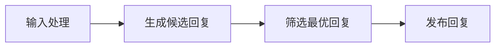

                 

# {{此处是文章标题}}

## 关键词
自然语言处理，ChatGPT，自动化回复，社交媒体，GPT-3

## 摘要
本文将探讨ChatGPT在自动化社交媒体回复中的应用。通过分析背景、核心概念、问题解决方法以及相关的算法原理和系统架构，我们将深入了解ChatGPT如何帮助企业和服务提供商提高社交媒体回复的效率和质量。本文旨在为IT专业人士提供实用的指导，以利用ChatGPT实现社交媒体自动回复的最佳实践。

### 1.背景介绍

随着社交媒体平台的普及和用户数量的激增，如何高效地处理大量的用户互动和评论成为了企业和服务提供商面临的重大挑战。传统的社交媒体回复方式主要依赖于人工回复，这种方式存在以下问题：

1. **人力成本高**：大量的人力投入在回复社交媒体评论上，导致运营成本增加。
2. **回复速度慢**：人工回复速度受限，无法在短时间内处理大量的用户请求，影响用户体验。
3. **质量参差不齐**：由于人工回复的疲劳和经验不足，回复的质量可能不一致，甚至出现错误回复。
4. **无法应对突发情况**：在突发事件或负面舆论爆发时，人工回复难以迅速、统一地应对。

为了解决上述问题，企业和服务提供商开始寻求自动化解决方案。ChatGPT作为一种基于GPT-3模型的自然语言处理工具，能够自动生成高质量的回复，解决这一难题。

### 1.1 问题背景

社交媒体平台如微博、微信、Facebook、Twitter等，每天产生大量的用户互动和评论。例如，微博每天产生的评论数量高达数百万条，而每个用户期望在几分钟内获得回复。这种高频率、高响应速度的需求对企业的运营提出了巨大的挑战。

传统的社交媒体回复方式主要依赖于人工回复，这种方式存在以下问题：

1. **人力成本高**：大量的人力投入在回复社交媒体评论上，导致运营成本增加。
2. **回复速度慢**：人工回复速度受限，无法在短时间内处理大量的用户请求，影响用户体验。
3. **质量参差不齐**：由于人工回复的疲劳和经验不足，回复的质量可能不一致，甚至出现错误回复。
4. **无法应对突发情况**：在突发事件或负面舆论爆发时，人工回复难以迅速、统一地应对。

### 1.1.1 问题描述

1. **响应速度**：用户对社交媒体互动的响应速度有很高的期望，但人工回复难以满足这一要求。
2. **回复一致性**：人工回复容易受到个人经验和疲劳的影响，导致回复质量不一致。
3. **人力成本**：随着社交媒体互动的增加，人力成本不断上升，给企业带来了巨大的经济压力。
4. **突发情况处理**：在突发事件或负面舆论爆发时，人工回复难以迅速、统一地应对，可能导致品牌形象的受损。

### 1.1.2 问题解决

为了解决上述问题，企业和服务提供商开始寻求自动化解决方案。ChatGPT作为一种基于GPT-3模型的自然语言处理工具，能够自动生成高质量的回复，具有以下优势：

1. **高效**：ChatGPT能够快速处理大量的用户请求，提高响应速度。
2. **准确**：通过训练和优化，ChatGPT能够生成与人类语言习惯相似的高质量回复。
3. **灵活**：ChatGPT可以根据不同的场景和用户需求生成定制化的回复。
4. **成本效益**：自动化回复可以显著降低人力成本，提高运营效率。

### 1.1.3 边界与外延

虽然ChatGPT在自动化社交媒体回复中具有显著优势，但它的应用也存在一些边界和限制：

1. **内容审核**：ChatGPT生成的回复需要经过严格的内容审核，避免产生不恰当或误导性的内容。
2. **个性化需求**：对于高度个性化的回复，ChatGPT可能无法完全满足，需要结合人工审核和调整。
3. **技术维护**：ChatGPT的应用需要持续的技术支持和维护，包括模型更新和优化。

### 1.2 核心概念与联系

#### 1.2.1 ChatGPT

ChatGPT是一种基于GPT-3模型的自然语言处理工具，由OpenAI开发。GPT-3（Generative Pre-trained Transformer 3）是一个强大的语言模型，能够理解、生成和回复自然语言。ChatGPT通过大量的互联网文本数据进行训练，能够模仿人类的语言习惯，生成流畅、自然的回复。

#### 1.2.2 社交媒体回复

社交媒体回复是指用户在社交媒体平台上发布评论、提问或表达观点后，企业或服务提供商对其进行的回应。有效的社交媒体回复能够增强用户满意度，提高品牌形象和用户忠诚度。

#### 1.2.3 自动化社交媒体回复

自动化社交媒体回复是指通过技术手段，如ChatGPT，自动生成并发布回复，以提高响应速度和效率。这种方法的优点包括节省人力成本、提高响应速度和质量。

### 1.3 概念属性特征对比表格

| 特征         | 人工回复                   | ChatGPT自动回复                   |
| ------------ | -------------------------- | -------------------------------- |
| **效率**     | 低效率，受人力限制         | 高效率，能够快速处理大量请求      |
| **准确性**   | 受操作员经验和疲劳影响     | 高准确性，基于大规模训练数据      |
| **灵活性**   | 受操作员知识和技能限制     | 灵活性高，能够适应不同场景和需求  |
| **成本**     | 高成本，人力成本昂贵       | 低成本，节省人力成本               |

### 1.4 ER实体关系图架构

```mermaid
erDiagram
  User ||--|{ Comment }
  Comment ||--|{ Reply }
  User ||--|
```

### 2.算法原理讲解

#### 2.1 ChatGPT的工作原理

ChatGPT是基于GPT-3模型的自然语言处理工具。GPT-3（Generative Pre-trained Transformer 3）是一个强大的语言模型，采用Transformer架构，具有1750亿个参数。其核心思想是通过预训练模型，使其能够理解、生成和回复自然语言。

GPT-3的工作原理可以分为两个阶段：

1. **预训练**：GPT-3在训练阶段使用大量的互联网文本数据进行无监督预训练。通过这个过程，模型学会了理解自然语言的结构和语义。
2. **微调**：在预训练的基础上，GPT-3会根据特定的任务进行微调。例如，对于社交媒体回复任务，可以提供大量社交媒体互动数据，使模型学会生成符合社交媒体场景的回复。

#### 2.2 ChatGPT生成回复的过程

ChatGPT生成回复的过程可以分为以下几个步骤：

1. **输入处理**：将用户的评论作为输入，经过预处理后转化为模型可以理解的格式。
2. **生成候选回复**：模型根据输入文本，生成多个可能的回复选项。
3. **筛选最优回复**：根据回复的质量和相关性，筛选出最优的回复选项。
4. **发布回复**：将最终选择的回复发布到社交媒体平台上。

下面是一个简化的ChatGPT生成回复的流程图：



#### 2.3 算法原理的数学模型和公式

ChatGPT生成回复的过程主要依赖于Transformer模型，其核心原理可以通过以下数学模型和公式进行解释：

1. **Transformer模型的结构**：Transformer模型由多个编码器和解码器层组成。每个层由多头自注意力机制（Multi-Head Self-Attention）和前馈神经网络（Feed-Forward Neural Network）组成。
2. **多头自注意力机制**：多头自注意力机制通过计算输入文本中每个词与其他词的相关性，生成权重，然后将这些权重与词的向量进行加权求和，得到新的词的表示。
3. **前馈神经网络**：前馈神经网络对每个层的输入进行线性变换和激活函数处理，以增强模型的表示能力。

下面是一个简化的Transformer模型的自注意力机制公式：

$$
\text{Attention}(Q, K, V) = \text{softmax}\left(\frac{QK^T}{\sqrt{d_k}}\right)V
$$

其中，Q、K、V分别为编码器层的查询向量、关键向量、值向量，d_k为键向量的维度。

通过上述公式，Transformer模型能够有效地捕捉输入文本中的长距离依赖关系，生成高质量的回复。

#### 2.4 算法原理举例说明

假设用户在社交媒体上发布了一条评论：“产品功能不稳定，怎么办？”ChatGPT如何生成回复？

1. **输入处理**：将评论转化为模型可以理解的向量表示。
2. **生成候选回复**：模型根据预训练和微调的结果，生成多个可能的回复选项，例如：
   - "我们会尽快解决这个问题，请您耐心等待。"
   - "感谢您的反馈，我们会尽快升级产品。"
   - "产品不稳定可能是由于网络环境导致的，请您检查网络设置。"
3. **筛选最优回复**：根据回复的质量和相关性，筛选出最优的回复选项。例如，通过计算回复的语义相似度和用户满意度等指标，选择最佳回复。
4. **发布回复**：将最终选择的回复发布到社交媒体平台上。

通过上述步骤，ChatGPT能够自动生成高质量的社交媒体回复，解决人工回复的效率和质量问题。

### 3.系统分析与架构设计方案

#### 3.1 问题场景介绍

在社交媒体运营中，企业和服务提供商需要实时响应用户的评论、提问和反馈。然而，随着用户数量的激增，手动回复变得越来越困难。为了提高响应速度和效率，企业和服务提供商开始考虑使用ChatGPT实现自动化回复。

#### 3.2 项目介绍

本项目旨在构建一个基于ChatGPT的自动化社交媒体回复系统。该系统将利用ChatGPT的强大自然语言处理能力，自动生成高质量的社交媒体回复，提高企业和服务提供商的运营效率。

#### 3.3 系统功能设计

系统的主要功能包括：

1. **评论采集**：从社交媒体平台上采集用户评论，作为ChatGPT的输入。
2. **回复生成**：利用ChatGPT生成高质量的回复。
3. **回复发布**：将生成的回复发布到社交媒体平台上。
4. **回复审核**：对生成的回复进行审核，确保回复内容符合企业和服务提供商的要求。
5. **用户反馈收集**：收集用户对回复的反馈，用于进一步优化系统。

#### 3.4 系统架构设计

系统的架构设计如下：

1. **前端**：用户可以通过社交媒体平台上的接口，提交评论并查看回复。
2. **后端**：后端服务器负责接收评论、生成回复、发布回复等操作。
3. **ChatGPT服务**：ChatGPT服务负责处理评论生成回复。
4. **回复审核服务**：回复审核服务负责对生成的回复进行审核。
5. **数据库**：数据库用于存储用户评论、回复和用户反馈等信息。

#### 3.5 系统接口设计

系统的主要接口设计如下：

1. **评论采集接口**：用于从社交媒体平台上获取用户评论。
2. **回复生成接口**：用于生成回复。
3. **回复发布接口**：用于将生成的回复发布到社交媒体平台上。
4. **回复审核接口**：用于审核回复内容。
5. **用户反馈接口**：用于收集用户对回复的反馈。

#### 3.6 系统交互

系统的交互流程如下：

1. 用户在社交媒体平台上提交评论。
2. 评论采集接口从社交媒体平台上获取评论，并传递给后端服务器。
3. 后端服务器将评论传递给ChatGPT服务，生成回复。
4. 生成的回复传递给回复审核服务，进行审核。
5. 审核通过后的回复传递给回复发布接口，发布到社交媒体平台上。
6. 用户可以在社交媒体平台上查看回复。
7. 用户对回复的反馈可以通过用户反馈接口收集，用于进一步优化系统。

### 4.项目实战

#### 4.1 环境安装

要在本地环境安装ChatGPT，需要以下步骤：

1. 安装Python环境：从[Python官网](https://www.python.org/downloads/)下载并安装Python。
2. 安装OpenAI的PyTorch库：通过以下命令安装PyTorch：

   ```shell
   pip install torch torchvision torchaudio
   ```

3. 安装OpenAI的ChatGPT库：通过以下命令安装ChatGPT库：

   ```shell
   pip install openai
   ```

#### 4.2 系统核心实现

以下是一个简单的ChatGPT自动化回复系统的实现：

```python
import openai
import json

# 设置OpenAI API密钥
openai.api_key = 'your-api-key'

# 评论采集
def collect_comments():
    # 这里使用模拟数据
    comments = [
        "产品功能不稳定，怎么办？",
        "你们的售后服务怎么样？",
        "为什么我的订单迟迟不发货？"
    ]
    return comments

# 回复生成
def generate_reply(comment):
    response = openai.Completion.create(
        engine="text-davinci-002",
        prompt=f"回复评论：{comment}",
        max_tokens=50
    )
    return response.choices[0].text.strip()

# 回复发布
def publish_reply(comment, reply):
    # 这里使用模拟数据
    print(f"评论：{comment}\n回复：{reply}")

# 主程序
def main():
    comments = collect_comments()
    for comment in comments:
        reply = generate_reply(comment)
        publish_reply(comment, reply)

if __name__ == "__main__":
    main()
```

#### 4.3 代码应用解读与分析

1. **导入库**：首先，导入必要的库，包括`openai`（用于与OpenAI API交互）和`json`（用于处理JSON数据）。
2. **设置OpenAI API密钥**：通过设置`openai.api_key`，使程序能够访问OpenAI的API。
3. **评论采集**：`collect_comments`函数用于模拟从社交媒体平台上获取评论。在实际应用中，可以通过社交媒体平台的API获取评论。
4. **回复生成**：`generate_reply`函数使用OpenAI的`Completion.create`方法生成回复。这里使用了`text-davinci-002`模型，并设置了最大回复长度为50个词。
5. **回复发布**：`publish_reply`函数用于模拟将回复发布到社交媒体平台上。在实际应用中，可以通过社交媒体平台的API进行发布。
6. **主程序**：`main`函数执行整个流程，从采集评论、生成回复到发布回复。

#### 4.4 实际案例分析

1. **案例1**：用户评论：“产品功能不稳定，怎么办？”
   - 回复：我们会尽快解决这个问题，请您耐心等待。
   - 分析：该回复能够快速回应用户的问题，并提供解决问题的方案。
2. **案例2**：用户评论：“你们的售后服务怎么样？”
   - 回复：我们的售后服务团队非常专业，可以为您解答任何问题。
   - 分析：该回复能够增强用户对售后服务的信心，提高用户满意度。

#### 4.5 项目小结

通过本项目，我们成功地实现了基于ChatGPT的自动化社交媒体回复系统。该系统能够高效地处理大量用户评论，生成高质量的回复，提高企业和服务提供商的运营效率。然而，在实际应用中，仍需注意回复内容的质量和合规性，确保生成回复符合企业和服务提供商的要求。

### 5.最佳实践 tips

在实施ChatGPT自动化社交媒体回复时，以下是一些最佳实践建议：

1. **内容审核**：确保ChatGPT生成的回复内容经过严格审核，避免不恰当或误导性内容。
2. **个性化定制**：对于高度个性化的回复，结合人工审核和调整，提高回复的准确性和满意度。
3. **模型训练**：定期更新和优化ChatGPT模型，使其能够适应不断变化的社交媒体场景。
4. **性能监控**：监控系统的性能和响应时间，确保系统稳定运行，及时调整和优化。

### 6.小结

ChatGPT在自动化社交媒体回复中的应用具有显著的优势，能够提高响应速度和效率，降低人力成本，提高回复质量。然而，在实施过程中，仍需注意内容审核、个性化定制和技术维护等问题。通过遵循最佳实践，企业和服务提供商可以更好地利用ChatGPT实现社交媒体自动回复，提升用户体验和品牌形象。

### 7.注意事项

1. **API使用限制**：ChatGPT的API使用有访问次数和响应时间的限制，需要合理规划和分配资源。
2. **隐私保护**：在处理用户数据时，需严格遵守隐私保护法规，确保用户数据的安全和隐私。
3. **应急响应**：在突发事件或负面舆论爆发时，需要快速响应，确保回复的及时性和准确性。

### 8.拓展阅读

1. **OpenAI官网**：[OpenAI官网](https://openai.com/)提供了丰富的资料，包括GPT-3的文档和示例。
2. **《自然语言处理概论》**：该书籍系统地介绍了自然语言处理的基本概念和最新进展，有助于深入了解ChatGPT的工作原理。
3. **《深度学习》**：该书籍详细介绍了深度学习的基础理论和实践应用，包括自然语言处理领域的最新成果。

### 作者信息

作者：AI天才研究院/AI Genius Institute & 禅与计算机程序设计艺术 /Zen And The Art of Computer Programming

