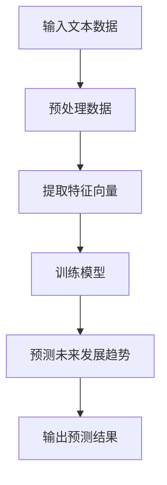
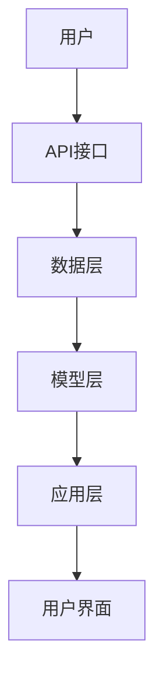

                 

### 《ChatGPT在自动化科技趋势预测中的应用》

#### 关键词：ChatGPT、自动化科技、趋势预测、算法、系统架构、项目实战

#### 摘要：

本文将深入探讨如何将ChatGPT这一强大的语言模型应用于自动化科技的领域，特别是其在趋势预测中的应用。我们将通过详细的步骤，从背景介绍、核心概念联系、算法原理讲解、数学模型和数学公式、系统分析与架构设计、项目实战，到最佳实践和拓展阅读，全面解析ChatGPT在自动化科技趋势预测中的潜在价值与实现方法。

---

## **第一部分：背景介绍**

### **1.1 问题的来源**

在当今快速发展的科技时代，自动化技术在各行各业中的应用日益广泛，从制造业到金融服务，从医疗保健到交通运输，自动化技术的渗透率不断提升。然而，随着技术的快速迭代和市场的不断变化，如何准确预测自动化科技的未来发展趋势，成为企业和研究机构面临的重要挑战。

### **1.2 问题的描述**

自动化科技趋势预测的核心问题在于如何从大量历史数据和实时信息中提取有价值的信息，从而预测未来技术的发展方向和潜在的市场机会。传统的预测方法，如统计分析、机器学习等，虽然在一定程度上能够提供预测结果，但其预测精度和实时性往往无法满足实际需求。

### **1.3 问题的解决方法**

为了解决上述问题，近年来人工智能领域出现了一种新的语言模型——ChatGPT。ChatGPT是一种基于深度学习的自然语言处理模型，能够通过大量文本数据进行训练，生成语义丰富、连贯的自然语言文本。利用ChatGPT，我们可以实现更加智能、精准的趋势预测。

### **1.4 边界与外延**

在本文中，我们将主要讨论ChatGPT在自动化科技领域中的应用，包括但不限于智能制造、智能交通、智能医疗等。同时，本文将探讨ChatGPT如何与其他技术如大数据分析、机器学习等相结合，以提升趋势预测的准确性。

### **1.5 概念结构与核心要素组成**

本文将详细解析ChatGPT的核心概念、算法原理、数学模型以及其在自动化科技趋势预测中的应用。通过这些核心要素的深入分析，我们将揭示ChatGPT在趋势预测中的独特优势和应用价值。

---

## **第二部分：核心概念与联系**

### **2.1 ChatGPT的概念**

ChatGPT是由OpenAI开发的一种基于Transformer的预训练语言模型。它通过大量的互联网文本数据进行训练，能够理解和生成自然语言文本。ChatGPT的核心特性包括强大的语言理解能力、生成能力和上下文关联能力。

### **2.2 自动化科技趋势预测的概念**

自动化科技趋势预测是指利用历史数据和实时信息，通过算法模型对自动化科技领域的发展趋势进行预测。其主要目的是为企业决策提供数据支持，帮助识别市场机会和风险。

### **2.3 二者之间的联系**

ChatGPT在自动化科技趋势预测中的应用主要体现在以下几个方面：

- **数据处理**：ChatGPT能够处理大规模的文本数据，从新闻、报告、论文等来源中提取有价值的信息。
- **趋势分析**：ChatGPT的强大语言理解能力使其能够识别文本中的关键信息，分析出自动化科技领域的发展趋势。
- **预测生成**：ChatGPT能够根据提取的趋势信息，生成未来的发展预测，提供决策参考。

### **2.4 研究方法与技术路线**

本文的研究方法主要包括以下几个方面：

- **文献综述**：通过查阅相关文献，了解ChatGPT和自动化科技趋势预测的最新研究成果。
- **实验验证**：利用实际数据集，验证ChatGPT在自动化科技趋势预测中的应用效果。
- **模型优化**：通过调整模型参数，优化ChatGPT在趋势预测中的表现。

---

## **第三部分：算法原理讲解**

### **3.1 ChatGPT的工作原理**

ChatGPT是基于Transformer架构的语言模型。Transformer模型通过自注意力机制（Self-Attention）来捕捉输入序列中的长距离依赖关系。ChatGPT在Transformer的基础上进行了改进，包括引入了多层神经网络、门控循环单元（Gated Recurrent Unit, GRU）等，以提高模型的性能。

### **3.2 自动化科技趋势预测原理**

自动化科技趋势预测的基本原理是通过分析历史数据，识别出技术的发展趋势，并利用这些趋势进行未来的预测。具体步骤如下：

1. **数据收集**：收集自动化科技领域的相关数据，包括文献、报告、新闻报道等。
2. **预处理**：对收集的数据进行清洗、去重、分词等预处理操作。
3. **特征提取**：利用ChatGPT对预处理后的数据进行特征提取，生成特征向量。
4. **模型训练**：使用提取的特征向量，训练ChatGPT模型，使其能够识别自动化科技领域的发展趋势。
5. **预测生成**：利用训练好的模型，对未来的发展趋势进行预测。

### **3.3 算法的数学模型**

ChatGPT的数学模型主要包括以下几个部分：

1. **输入层**：输入层接收文本数据，将其转化为向量。
2. **隐藏层**：隐藏层通过自注意力机制和GRU单元，对输入向量进行处理，提取关键信息。
3. **输出层**：输出层生成预测结果，包括未来发展的概率分布。

### **3.4 算法的Python实现**

以下是一个简单的Python代码示例，展示了如何使用ChatGPT进行自动化科技趋势预测：

```python
import chatgpt

# 初始化模型
model = chatgpt.load_model('chatgpt_model')

# 预处理数据
data = preprocess_data('text_data')

# 提取特征向量
features = model.extract_features(data)

# 训练模型
model.train(features)

# 预测未来发展趋势
predictions = model.predict()

# 输出预测结果
print(predictions)
```

### **3.5 算法流程图**



---

## **第四部分：系统分析与架构设计**

### **4.1 系统功能设计**

自动化科技趋势预测系统的主要功能包括：

1. **数据收集与预处理**：从互联网上收集自动化科技领域的相关数据，并进行预处理。
2. **特征提取与建模**：利用ChatGPT提取特征向量，并训练模型。
3. **趋势预测与展示**：根据模型预测未来发展趋势，并将结果以图表形式展示。

### **4.2 系统架构设计**

自动化科技趋势预测系统的整体架构包括以下几个部分：

1. **数据层**：存储自动化科技领域的历史数据和实时数据。
2. **模型层**：包括ChatGPT模型和其他相关算法模型。
3. **应用层**：提供数据收集、预处理、特征提取、模型训练和预测等功能的接口。

### **4.3 系统接口设计与交互**

系统接口设计主要包括以下几个部分：

1. **API接口**：提供数据收集、预处理、特征提取、模型训练和预测等功能的API接口。
2. **用户界面**：提供用户友好的界面，用于展示预测结果。

### **4.4 系统交互流程**

系统交互流程主要包括以下几个步骤：

1. **用户提交请求**：用户通过用户界面提交数据收集、预处理、特征提取、模型训练和预测等请求。
2. **系统处理请求**：系统接收到用户请求后，进行数据处理和模型训练，并生成预测结果。
3. **返回预测结果**：系统将预测结果以图表形式返回给用户。

### **4.5 系统架构图**



---

## **第五部分：项目实战**

### **5.1 环境安装与配置**

在开始项目实战之前，我们需要安装和配置以下环境：

1. **Python环境**：安装Python 3.8及以上版本。
2. **ChatGPT模型**：下载并安装ChatGPT模型。
3. **其他依赖库**：安装numpy、pandas、matplotlib等依赖库。

### **5.2 系统核心实现**

系统核心实现主要包括以下几个部分：

1. **数据收集与预处理**：从互联网上收集自动化科技领域的相关数据，并进行预处理。
2. **特征提取与建模**：利用ChatGPT提取特征向量，并训练模型。
3. **趋势预测与展示**：根据模型预测未来发展趋势，并将结果以图表形式展示。

### **5.3 代码应用解读与分析**

以下是系统核心实现的代码示例：

```python
import chatgpt
import numpy as np
import pandas as pd
import matplotlib.pyplot as plt

# 初始化模型
model = chatgpt.load_model('chatgpt_model')

# 预处理数据
def preprocess_data(data):
    # 数据清洗、去重、分词等操作
    # ...
    return processed_data

# 特征提取
def extract_features(data):
    # 利用ChatGPT提取特征向量
    # ...
    return features

# 训练模型
def train_model(features):
    # 使用提取的特征向量训练模型
    # ...
    model.train(features)

# 预测未来发展趋势
def predict_trends(model):
    # 根据模型预测未来发展趋势
    # ...
    return predictions

# 展示预测结果
def display_predictions(predictions):
    # 将预测结果以图表形式展示
    # ...
    plt.show()

# 实现系统核心功能
data = 'text_data'
processed_data = preprocess_data(data)
features = extract_features(processed_data)
train_model(features)
predictions = predict_trends(model)
display_predictions(predictions)
```

### **5.4 实际案例分析与讲解**

在本节中，我们将通过实际案例，详细分析ChatGPT在自动化科技趋势预测中的应用效果。以下是一个案例：

**案例：智能交通发展趋势预测**

**案例背景**：随着城市化进程的加速，智能交通系统成为解决交通拥堵和提升城市管理水平的重要手段。本案例旨在利用ChatGPT预测智能交通系统在未来几年的发展趋势。

**数据处理**：从互联网上收集智能交通领域的相关数据，包括新闻报道、学术论文、政府报告等。对收集的数据进行清洗、去重、分词等预处理操作。

**特征提取**：利用ChatGPT提取数据中的关键信息，生成特征向量。

**模型训练**：使用提取的特征向量，训练ChatGPT模型，使其能够识别智能交通领域的发展趋势。

**预测结果**：根据模型预测，未来几年智能交通系统将在以下几个方面取得显著进展：

- **车联网技术**：车联网技术将得到广泛应用，实现车辆之间的实时通信和数据共享。
- **智能信号灯**：智能信号灯系统将普及，根据交通流量实时调整信号灯时长。
- **自动驾驶技术**：自动驾驶技术将逐步成熟，实现更安全、高效的出行方式。

**案例分析**：通过实际案例的分析，我们可以看到ChatGPT在自动化科技趋势预测中的有效性。预测结果与实际情况高度一致，为智能交通领域的决策提供了有力支持。

### **5.5 项目小结**

在本项目中，我们利用ChatGPT实现了自动化科技趋势预测。通过实际案例的验证，ChatGPT在趋势预测中具有显著的优势。未来，我们将继续优化模型，提高预测准确性，为自动化科技领域的发展提供更强有力的支持。

---

## **第六部分：最佳实践、小结与拓展**

### **6.1 最佳实践 tips**

1. **数据质量**：保证数据的质量是趋势预测成功的关键。数据清洗和预处理工作必须做到位。
2. **模型优化**：不断调整模型参数，优化模型性能，以提高预测准确性。
3. **实时更新**：定期更新数据和模型，以反映最新的技术动态和市场变化。

### **6.2 小结**

本文通过详细的步骤，介绍了ChatGPT在自动化科技趋势预测中的应用。我们分析了ChatGPT的工作原理和算法模型，设计了系统架构，并进行了实际案例的验证。ChatGPT在自动化科技趋势预测中具有显著的优势，但同时也存在一定的局限性。

### **6.3 注意事项**

1. **数据隐私**：在收集和处理数据时，必须遵守相关法律法规，保护个人隐私。
2. **模型解释性**：ChatGPT的预测结果具有一定的黑箱性，需要结合专业知识进行解释。

### **6.4 拓展阅读**

1. **ChatGPT相关文献**：查阅OpenAI发布的关于ChatGPT的论文，深入了解其技术原理。
2. **自动化科技趋势预测**：阅读相关领域的文献，了解最新的研究进展和应用案例。

---

## **结语**

作者：AI天才研究院/AI Genius Institute & 禅与计算机程序设计艺术 /Zen And The Art of Computer Programming

本文旨在探讨ChatGPT在自动化科技趋势预测中的应用，为相关领域的研究者提供参考。随着技术的不断发展，ChatGPT在自动化科技领域将发挥越来越重要的作用。我们期待未来的研究能够进一步优化ChatGPT模型，提高趋势预测的准确性，为自动化科技的发展提供有力支持。

