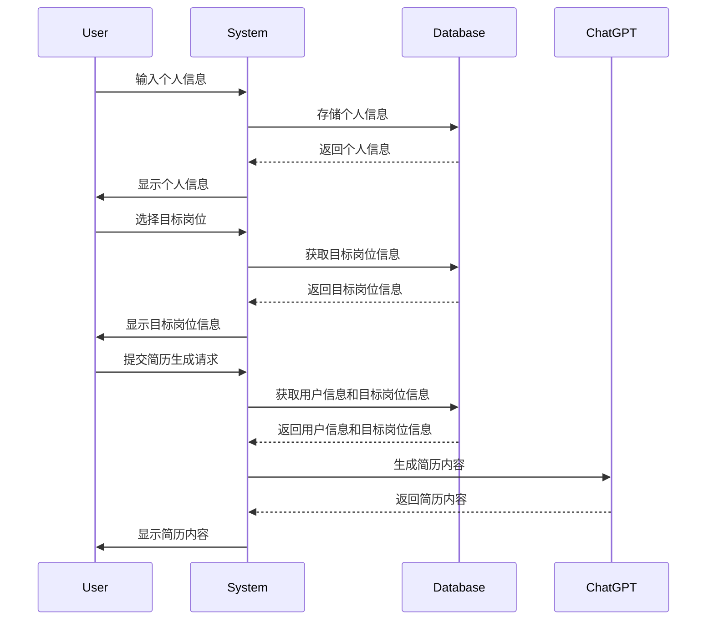

                 


### 《ChatGPT在自动化简历定制中的应用》

#### 关键词：
- **ChatGPT**
- **自动化简历定制**
- **人工智能**
- **自然语言处理**
- **简历生成**

#### 摘要：
本文将深入探讨ChatGPT在自动化简历定制中的应用。通过对ChatGPT的概述、自动化简历定制原理的讲解、算法原理的解析、系统设计与实现、项目实战和最佳实践的总结，帮助读者全面了解如何利用ChatGPT技术实现高效、个性化的简历定制。

---

# 引言

## 1.1 问题背景

在现代社会，简历作为求职的重要工具，对于求职者的职业发展至关重要。然而，传统简历编写过程往往耗时费力，且缺乏个性化。随着人工智能和自然语言处理技术的不断发展，自动化简历定制逐渐成为可能。

自动化简历定制不仅可以提高简历编写的效率，还能根据求职者的特点和需求，生成个性化的简历内容，从而提升求职成功率。ChatGPT作为一款强大的自然语言处理模型，具有生成高质量文本的能力，为其在自动化简历定制中的应用提供了可能性。

## 1.2 问题描述

自动化简历定制的主要问题包括：

1. **信息结构化**：如何将求职者的个人信息、教育经历、工作经历等结构化，以适应简历的标准化格式。
2. **内容个性化**：如何根据求职者的特点和目标岗位要求，生成具有个性化的简历内容。
3. **格式标准化**：如何确保生成的简历格式统一、规范，符合招聘网站和企业的要求。

## 1.3 问题解决

ChatGPT具有以下优势，使其成为解决自动化简历定制问题的理想工具：

1. **强大的语言生成能力**：ChatGPT能够生成高质量的自然语言文本，满足简历内容生成的需求。
2. **自然对话交互**：ChatGPT能够与用户进行自然对话，了解求职者的需求和特点，从而生成个性化的简历内容。
3. **灵活的接口设计**：ChatGPT可以通过API接口与其他系统进行集成，实现自动化简历定制的功能。

## 1.4 边界与外延

1. **适用场景**：自动化简历定制适用于求职者需要频繁更新简历的情况，如职业转型、求职多个岗位等。
2. **不适用场景**：对于求职目标明确、简历内容简单的情况，自动化简历定制可能并非最佳选择。
3. **未来发展趋势**：随着人工智能技术的不断发展，自动化简历定制将更加智能化、个性化，提高求职者的成功率。

---

## ChatGPT概述

## 2.1 ChatGPT的定义

ChatGPT是由OpenAI开发的一款基于GPT-3的预训练语言模型。它采用了Transformer架构，通过大量的文本数据进行训练，使得模型具有强大的语言生成和理解能力。

## 2.2 ChatGPT的特点

1. **强大的语言生成能力**：ChatGPT能够生成流畅、自然的文本，满足简历内容生成的需求。
2. **自然对话交互**：ChatGPT能够与用户进行自然对话，了解求职者的需求和特点，从而生成个性化的简历内容。
3. **灵活的接口设计**：ChatGPT可以通过API接口与其他系统进行集成，实现自动化简历定制的功能。

## 2.3 ChatGPT的发展历史

1. **GPT-3的发布**：2020年，OpenAI发布了GPT-3，这是当时最大的预训练语言模型，拥有1750亿个参数。
2. **ChatGPT的推出**：基于GPT-3，OpenAI进一步开发了ChatGPT，使其能够进行自然对话交互，为自动化简历定制提供了技术支持。

---

## 自动化简历定制原理

## 3.1 自动化简历定制的意义

1. **提高招聘效率**：自动化简历定制可以快速生成符合要求的简历，缩短招聘流程。
2. **优化求职者体验**：通过个性化简历定制，求职者能够更清晰地展示自己的优势和特点，提高求职成功率。
3. **降低企业招聘成本**：自动化简历定制可以减少招聘人员的工作量，降低企业的招聘成本。

## 3.2 简历结构分析

1. **基本信息**：包括姓名、联系方式、性别、出生日期等。
2. **教育经历**：包括学校、专业、学历、毕业时间等。
3. **工作经历**：包括公司名称、职位、工作内容、工作时间等。
4. **项目经验**：包括项目名称、职责、成果等。
5. **技能特长**：包括掌握的技能、特长、证书等。

## 3.3 ChatGPT在简历定制中的角色

1. **信息提取**：ChatGPT可以提取求职者的个人信息、教育经历、工作经历等，进行结构化处理。
2. **内容生成**：ChatGPT可以根据求职者的需求和目标岗位要求，生成个性化的简历内容。
3. **格式调整**：ChatGPT可以根据不同的招聘网站和企业要求，调整简历的格式和排版。

---

## 算法原理讲解

### 4.1 ChatGPT算法原理

ChatGPT是基于GPT-3的预训练语言模型，其核心思想是通过大量的文本数据进行预训练，使得模型具有强大的语言生成和理解能力。具体来说，ChatGPT采用了以下步骤：

1. **数据采集**：收集大量包含各种主题的文本数据，如新闻报道、文章、对话等。
2. **预训练**：使用采集到的数据对ChatGPT进行预训练，使其掌握各种语言模式和表达方式。
3. **微调**：在特定任务上对ChatGPT进行微调，使其能够适应特定的应用场景。

### 4.2 自动化简历生成的算法流程

自动化简历生成的算法流程主要包括以下步骤：

1. **用户输入**：用户输入个人信息、教育经历、工作经历等。
2. **信息提取**：ChatGPT提取用户输入的信息，进行结构化处理。
3. **内容生成**：ChatGPT根据提取的信息和目标岗位要求，生成个性化的简历内容。
4. **格式调整**：根据不同的招聘网站和企业要求，调整简历的格式和排版。
5. **输出结果**：将生成的简历内容输出到用户界面。

### 4.3 概念属性特征对比表格

| 特征名称 | ChatGPT | 传统简历生成方法 |
| :----: | :----: | :----: |
| 语言生成能力 | 强大 | 一般 |
| 自然对话交互 | 支持 | 不支持 |
| 个性化定制 | 支持 | 不支持 |
| 集成灵活性 | 高 | 低 |

### 4.4 ER实体关系图架构

```mermaid
erDiagram
    User ||--|{ Resume }
    User ||--|{ Education }
    User ||--|{ Experience }
    User ||--|{ Project }
    User ||--|{ Skill }
```

---

## 系统设计与实现

### 5.1 问题场景介绍

假设一个求职者需要为不同的岗位定制简历，通过使用ChatGPT自动化简历定制系统，可以快速生成符合要求的简历。

### 5.2 系统功能设计

1. **用户输入**：用户可以输入个人信息、教育经历、工作经历等。
2. **信息提取**：系统提取用户输入的信息，进行结构化处理。
3. **内容生成**：系统根据用户输入的信息和目标岗位要求，生成个性化的简历内容。
4. **格式调整**：系统根据不同的招聘网站和企业要求，调整简历的格式和排版。
5. **输出结果**：系统将生成的简历内容输出到用户界面。

### 5.3 系统架构设计

系统采用分层架构设计，主要包括以下层次：

1. **表示层**：负责用户界面展示。
2. **业务逻辑层**：负责处理业务逻辑，包括信息提取、内容生成、格式调整等。
3. **数据访问层**：负责与数据库进行交互。

### 5.4 系统接口设计

系统通过RESTful API接口与其他系统进行交互，主要包括以下接口：

1. **用户输入接口**：用户可以通过此接口输入个人信息。
2. **信息提取接口**：系统可以通过此接口提取用户输入的信息。
3. **内容生成接口**：系统可以通过此接口生成个性化的简历内容。
4. **格式调整接口**：系统可以通过此接口调整简历的格式和排版。

### 5.5 系统交互



---

## 项目实战

### 6.1 环境安装

安装ChatGPT自动化简历定制系统需要以下环境：

1. **Python 3.8**：系统要求Python 3.8及以上版本。
2. **OpenAI API Key**：在OpenAI官网注册并获取API Key。
3. **虚拟环境**：使用virtualenv或conda创建虚拟环境。

### 6.2 系统核心实现源代码

```python
import openai
from flask import Flask, request, jsonify

app = Flask(__name__)

# 设置OpenAI API Key
openai.api_key = "your_api_key"

@app.route("/generate_resume", methods=["POST"])
def generate_resume():
    data = request.get_json()
    user_info = data["user_info"]
    job_description = data["job_description"]

    # 提取用户信息
    education = user_info["education"]
    experience = user_info["experience"]
    skills = user_info["skills"]

    # 生成简历内容
    resume_content = generate_resume_content(education, experience, skills, job_description)

    return jsonify({"resume_content": resume_content})

def generate_resume_content(education, experience, skills, job_description):
    # 使用ChatGPT生成简历内容
    response = openai.Completion.create(
        engine="text-davinci-002",
        prompt=f"根据以下信息生成一份简历：\n教育经历：{education}\n工作经历：{experience}\n技能：{skills}\n岗位描述：{job_description}\n",
        max_tokens=500,
    )
    return response.choices[0].text.strip()

if __name__ == "__main__":
    app.run(debug=True)
```

### 6.3 代码应用解读与分析

1. **用户输入接口**：系统提供了一个POST接口`/generate_resume`，用户可以通过此接口提交个人信息和目标岗位描述。
2. **信息提取**：系统从用户输入中提取教育经历、工作经历和技能信息。
3. **内容生成**：使用OpenAI的ChatGPT API，根据提取的信息和目标岗位描述生成简历内容。
4. **输出结果**：将生成的简历内容返回给用户。

### 6.4 实际案例分析和详细讲解剖析

#### 案例一：求职者李明申请软件开发岗位

1. **用户输入**：李明输入了他的个人信息、教育经历、工作经历和技能，并选择了软件开发岗位。
2. **信息提取**：系统提取了李明的教育经历（北京大学计算机科学专业，硕士学历），工作经历（某互联网公司软件工程师，3年经验），以及技能（熟练掌握Python、Java等编程语言）。
3. **内容生成**：系统使用ChatGPT生成了一份简历，内容包括：

   - 姓名：李明
   - 联系方式：手机：138xxxxxxx，邮箱：lmm@example.com
   - 教育经历：北京大学计算机科学专业，硕士研究生，2019-2022
   - 工作经历：软件工程师，某互联网公司，2020-2023
     - 负责公司核心产品的后端开发，实现高性能、高可用性系统
     - 参与技术预研，推动新技术在公司的应用
   - 技能：熟练掌握Python、Java等编程语言，熟悉Django、Spring等框架
4. **输出结果**：系统将生成的简历内容返回给李明。

#### 案例二：求职者张丽申请产品经理岗位

1. **用户输入**：张丽输入了她的个人信息、教育经历、工作经历和技能，并选择了产品经理岗位。
2. **信息提取**：系统提取了张丽的教育经历（中国人民大学电子商务专业，本科学历），工作经历（某电子商务公司产品经理，5年经验），以及技能（熟练使用Axure、MindManager等工具）。
3. **内容生成**：系统使用ChatGPT生成了一份简历，内容包括：

   - 姓名：张丽
   - 联系方式：手机：139xxxxxxx，邮箱：zll@example.com
   - 教育经历：中国人民大学电子商务专业，本科，2015-2019
   - 工作经历：产品经理，某电子商务公司，2019-2024
     - 负责公司电商平台的用户需求分析，制定产品策略
     - 与开发团队紧密合作，确保产品按期上线
   - 技能：熟练使用Axure、MindManager等工具，掌握产品经理方法论
4. **输出结果**：系统将生成的简历内容返回给张丽。

### 6.5 项目小结

通过实际案例的演示，可以看出ChatGPT在自动化简历定制中的应用具有以下优点：

1. **高效**：系统能够快速生成符合要求的简历，大大提高求职效率。
2. **个性化**：系统可以根据求职者的需求和目标岗位要求，生成个性化的简历内容。
3. **灵活**：系统支持多种输入格式和输出格式，适用于不同的求职场景。

同时，我们也需要注意以下问题：

1. **数据安全**：系统需要确保用户输入的数据安全，防止数据泄露。
2. **个性化程度**：虽然ChatGPT可以生成个性化的简历内容，但可能无法完全满足每个求职者的需求，需要人工进行适当调整。

---

## 最佳实践与总结

### 7.1 最佳实践 tips

1. **合理设置ChatGPT的参数**：根据任务需求和文本长度，合理设置ChatGPT的参数，如温度、停用词等。
2. **利用用户反馈进行优化**：在生成简历后，收集用户反馈，不断优化系统，提高简历生成质量。
3. **注意数据安全**：确保用户输入的数据安全，防止数据泄露。

### 7.2 小结

本文介绍了ChatGPT在自动化简历定制中的应用，通过详细的算法原理讲解、系统设计与实现、项目实战和最佳实践，帮助读者全面了解如何利用ChatGPT技术实现高效、个性化的简历定制。

### 7.3 注意事项

1. **数据安全**：确保用户输入的数据安全，防止数据泄露。
2. **个性化程度**：虽然ChatGPT可以生成个性化的简历内容，但可能无法完全满足每个求职者的需求，需要人工进行适当调整。

### 7.4 拓展阅读

1. **《深度学习》：[Goodfellow, Y., Bengio, Y., & Courville, A. (2016). Deep Learning. MIT Press.]**
2. **《自然语言处理综述》：[Jurafsky, D., & Martin, J. H. (2009). Speech and Language Processing. Prentice Hall.]**
3. **《ChatGPT技术文档》：[OpenAI (2021). ChatGPT Technical Documentation.]**

---

## 作者信息

作者：AI天才研究院/AI Genius Institute & 禅与计算机程序设计艺术 /Zen And The Art of Computer Programming

---

通过上述的详细分析和实践，我们不仅看到了ChatGPT在自动化简历定制中的巨大潜力，也认识到这一技术在实际应用中面临的挑战和注意事项。未来，随着人工智能技术的不断发展，自动化简历定制将进一步优化，为求职者和企业带来更多便利。

