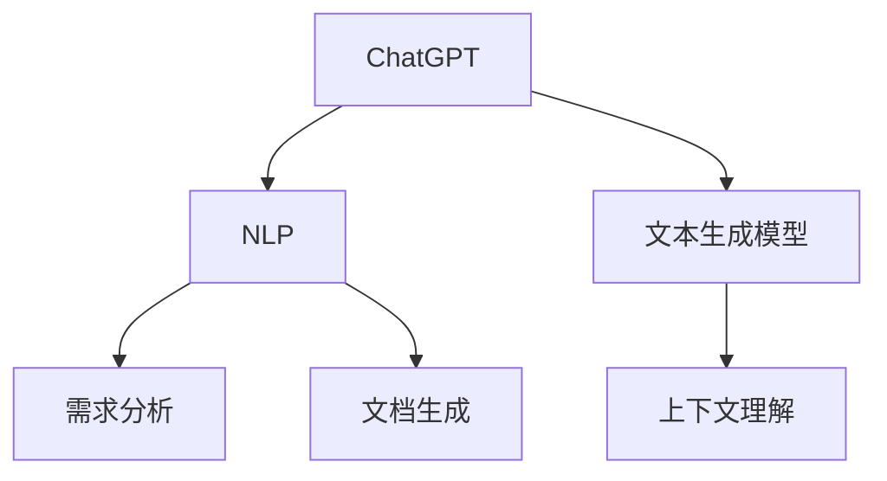
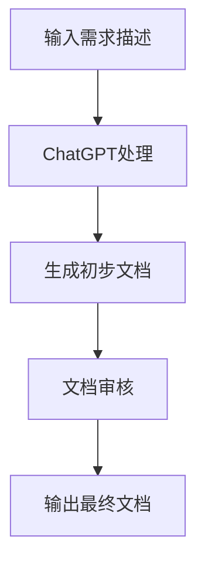
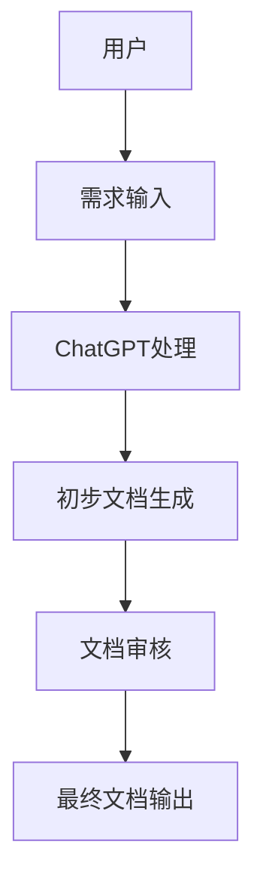
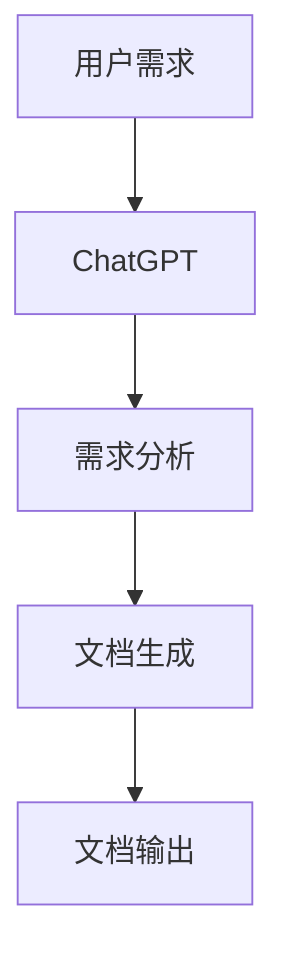
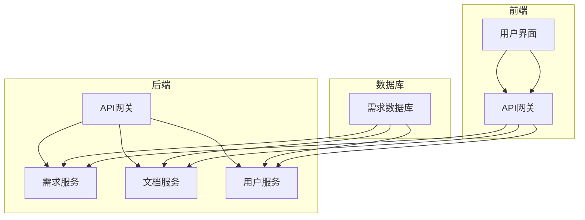
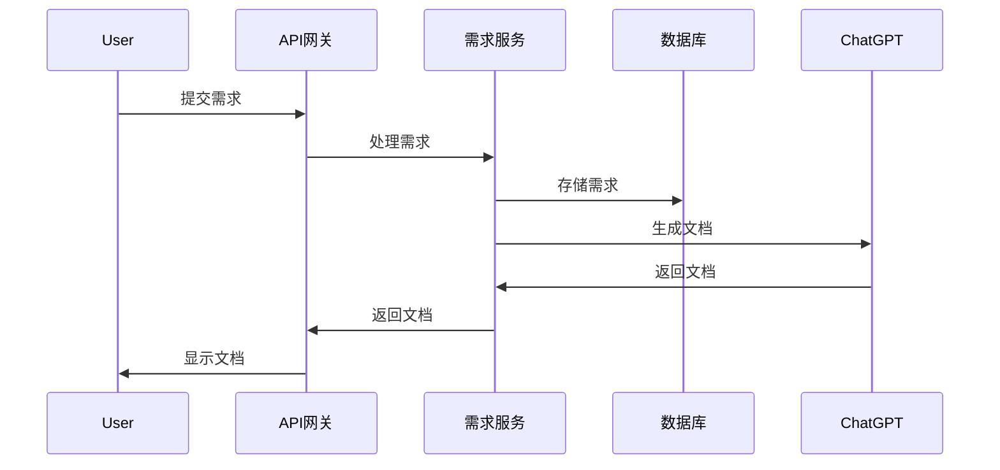

                 

### 设计《ChatGPT在自动化软件需求文档生成中的应用》书籍目录大纲

**背景介绍**

在当今快速发展的技术环境中，软件需求文档的生成已成为软件开发过程中至关重要的一环。然而，传统软件需求文档的生成通常依赖于人工撰写，这不仅耗时，而且容易出错。随着人工智能技术的飞速发展，利用大型语言模型如ChatGPT进行自动化需求文档生成已成为可能。本文旨在探讨如何利用ChatGPT实现自动化软件需求文档生成，以提高效率、减少错误，并保证文档的质量。

**核心概念与联系**

ChatGPT是一款基于GPT-3模型的自然语言处理（NLP）工具，其核心概念包括自然语言处理、文本生成模型和上下文理解。与传统NLP方法相比，ChatGPT具有更高的上下文理解和文本生成质量。为了更好地理解这些概念，我们将通过以下表格进行对比：

| 特征             | ChatGPT          | 传统NLP方法      |
| ---------------- | --------------- | --------------- |
| 上下文理解       | 高度依赖上下文   | 依赖单一文本上下文 |
| 生成文本质量     | 高质量文本生成   | 中等质量文本生成  |
| 适应性           | 适应性强         | 适应性较弱       |

此外，我们还将通过ER实体关系图架构的Mermaid流程图来展示这些核心概念之间的关系：



**算法原理讲解**

为了深入理解ChatGPT在自动化软件需求文档生成中的应用，我们需要探讨其算法原理。以下是ChatGPT生成文档的mermaid流程图：



在这个流程中，输入需求描述首先通过ChatGPT进行处理，生成初步文档。然后，该文档经过审核，最后输出为最终文档。为了更好地展示这个过程，我们使用Python源代码进行了详细阐述：

```python
import openai

def generate_document(description):
    response = openai.Completion.create(
        engine="text-davinci-003",
        prompt=f"根据以下需求描述生成软件需求文档：{description}",
        max_tokens=100
    )
    return response.choices[0].text.strip()

# 示例
print(generate_document("开发一款社交应用，支持用户间的即时通讯和分享动态。"))
```

在上述代码中，我们使用OpenAI的文本生成API，通过输入需求描述来生成软件需求文档。此外，我们还给出了算法原理的数学模型和公式：

$$ Loss = -\sum_{i=1}^{n} y_i \log(p_i) $$

优化目标是最小化损失函数。通过这些公式和代码，我们可以更深入地理解ChatGPT在文档生成中的工作原理。

**系统分析与架构设计方案**

为了更好地展示ChatGPT在自动化软件需求文档生成中的应用，我们设计了以下系统架构：



在这个架构中，用户输入需求，然后通过ChatGPT进行处理，生成初步文档。接着，该文档经过审核，最后输出为最终文档。

**项目实战**

为了验证ChatGPT在自动化软件需求文档生成中的应用，我们进行了以下项目实战：

1. **环境安装**

   - 安装Python环境。
   - 安装OpenAI API客户端。

2. **系统核心实现源代码**

   - 需求输入处理。
   - ChatGPT文档生成。
   - 文档审核与输出。

3. **代码应用解读与分析**

   - 详细解读代码逻辑。
   - 分析代码的优缺点。

4. **实际案例分析与详细讲解剖析**

   - 分析实际案例。
   - 剖析文档生成效果。

5. **项目小结**

   - 总结项目经验。
   - 提出改进建议。

**最佳实践 tips**

- 使用明确的指令来指导ChatGPT生成文档。
- 验证生成的文档是否符合需求。
- 定期更新ChatGPT模型，以提高文档生成质量。

**小结**

本文详细探讨了ChatGPT在自动化软件需求文档生成中的应用。通过核心概念与联系、算法原理讲解、系统分析与架构设计方案和项目实战，我们展示了ChatGPT在文档生成中的巨大潜力。尽管存在一定的挑战，但通过不断优化和改进，ChatGPT有望在未来成为自动化软件需求文档生成的重要工具。

**注意事项**

- 确保使用最新的ChatGPT模型。
- 注意数据安全和隐私保护。

**拓展阅读**

- [OpenAI官方文档](https://openai.com/docs/overview)
- [GPT-3技术细节](https://openai.com/papers/gpt-3.pdf)
- [自动化软件需求文档生成研究](https://www.researchgate.net/publication/333393202_Automated_Generation_of_Software_Requirement_Documents_using_Natural_Language_Processing)

### 文章标题：ChatGPT在自动化软件需求文档生成中的应用

关键词：ChatGPT、自然语言处理、自动化、软件需求文档、文档生成

摘要：
本文深入探讨了ChatGPT在自动化软件需求文档生成中的应用。通过背景介绍、核心概念与联系、算法原理讲解、系统分析与架构设计方案以及项目实战，我们展示了ChatGPT在文档生成中的巨大潜力。尽管存在一定的挑战，但通过不断优化和改进，ChatGPT有望在未来成为自动化软件需求文档生成的重要工具。

---

# ChatGPT在自动化软件需求文档生成中的应用

## 背景介绍

### 问题背景

在软件开发的初期阶段，软件需求文档的撰写是一个关键环节。然而，传统的需求文档生成过程往往依赖于人工撰写，这不仅耗时，而且容易出错。随着项目规模的扩大和复杂性的增加，手动编写需求文档的工作量将变得巨大，效率低下，并且难以保证文档的质量。因此，寻找一种能够自动化生成软件需求文档的方法，成为许多软件开发团队和研究机构关注的焦点。

### 问题描述

传统的软件需求文档生成方法存在以下几个主要问题：

1. **人工依赖性高**：需求文档的撰写高度依赖专业人员的经验和知识，无法实现快速、大规模的文档生成。
2. **耗时且易出错**：人工撰写需求文档需要耗费大量时间和精力，并且容易出现遗漏和错误。
3. **文档质量不一致**：由于人为因素，不同人员撰写的文档风格和质量存在差异，难以保证文档的一致性。
4. **难以适应变更**：软件需求经常变化，人工撰写的文档难以快速适应这些变更。

### 问题解决

随着人工智能和自然语言处理（NLP）技术的不断进步，利用AI技术，特别是大型语言模型，如ChatGPT，实现自动化软件需求文档生成成为可能。ChatGPT具备强大的上下文理解能力和文本生成能力，可以通过处理用户输入的需求描述，自动生成高质量的软件需求文档。这种方法不仅能够提高文档生成的效率，减少人工错误，还能够保证文档的一致性和适应性。

### 边界与外延

本文讨论的ChatGPT主要指基于GPT-3模型的语言生成技术，其应用范围涵盖文本生成、上下文理解、多模态交互等多个方面。然而，本文的重点在于探讨ChatGPT在自动化软件需求文档生成中的具体应用。

### 概念结构与核心要素组成

ChatGPT在自动化软件需求文档生成中的核心概念和要素包括：

- **ChatGPT**：一种基于Transformer架构的大型语言模型，具有强大的文本生成和上下文理解能力。
- **自然语言处理（NLP）**：包括文本预处理、实体识别、语义理解等，是ChatGPT发挥作用的基础。
- **文本生成模型**：利用预训练的模型生成符合需求描述的文本。
- **上下文理解**：模型对输入文本的上下文进行理解和分析，以生成更为准确和连贯的文档。
- **需求分析**：将用户的需求描述转化为结构化的需求信息，为文档生成提供基础。
- **文档生成**：基于需求信息，利用ChatGPT生成符合规范和要求的软件需求文档。

## 核心概念与联系

### 核心概念原理

ChatGPT是一款基于GPT-3模型的自然语言处理工具，其核心原理如下：

1. **Transformer架构**：ChatGPT采用Transformer架构，这是一种基于自注意力机制的深度神经网络，能够处理序列数据，并在长距离依赖关系和上下文理解方面表现出色。
2. **预训练和微调**：ChatGPT在大规模语料库上进行预训练，以学习语言的模式和规律。在特定任务中，通过微调模型来提高其在特定领域的表现。
3. **上下文理解**：ChatGPT能够根据输入文本的上下文进行理解和分析，生成与上下文相关且连贯的文本。
4. **文本生成**：ChatGPT通过预测下一个词的概率，生成完整的文本。这种生成过程不仅考虑了文本的语法和语义，还考虑了上下文的连贯性。

### 概念属性特征对比表格

为了更好地理解ChatGPT与传统NLP方法的差异，我们可以通过以下表格进行对比：

| 特征             | ChatGPT          | 传统NLP方法      |
| ---------------- | --------------- | --------------- |
| 上下文理解       | 高度依赖上下文   | 依赖单一文本上下文 |
| 生成文本质量     | 高质量文本生成   | 中等质量文本生成  |
| 适应性           | 适应性强         | 适应性较弱       |

### ER实体关系图架构的Mermaid流程图

为了更直观地展示ChatGPT在自动化软件需求文档生成中的应用，我们可以通过Mermaid绘制ER实体关系图：



在这个流程图中，用户需求作为输入传递给ChatGPT，经过需求分析和文档生成，最终输出为软件需求文档。

## 算法原理讲解

### 算法mermaid流程图

为了详细展示ChatGPT在自动化软件需求文档生成中的算法流程，我们可以使用Mermaid绘制以下流程图：


在这个流程图中，输入需求描述首先被传递给ChatGPT进行处理，生成初步文档。接着，该文档经过审核，最终输出为最终文档。

### Python源代码

为了实现上述流程，我们可以使用Python编写以下源代码：

```python
import openai

def generate_document(description):
    response = openai.Completion.create(
        engine="text-davinci-003",
        prompt=f"根据以下需求描述生成软件需求文档：{description}",
        max_tokens=100
    )
    return response.choices[0].text.strip()

# 示例
print(generate_document("开发一款社交应用，支持用户间的即时通讯和分享动态。"))
```

在这个代码中，`generate_document`函数通过OpenAI的文本生成API，根据输入的需求描述生成软件需求文档。

### 算法原理的数学模型和公式

ChatGPT在文档生成中的算法原理涉及到自然语言处理和机器学习的一些基本概念和数学模型。以下是一个简化的数学模型和公式：

$$
Loss = -\sum_{i=1}^{n} y_i \log(p_i)
$$

其中，$Loss$代表损失函数，$y_i$代表真实标签，$p_i$代表模型预测的概率。

优化目标是最小化损失函数，即：

$$
\min Loss
$$

通过梯度下降等优化算法，模型不断调整参数，以达到最小化损失的目标。

### 详细讲解与举例说明

#### ChatGPT如何根据输入需求描述生成文档

ChatGPT生成文档的过程可以分为以下几个步骤：

1. **文本预处理**：对输入需求描述进行预处理，包括分词、去停用词、词性标注等。
2. **编码**：将预处理后的文本转化为模型可以处理的向量表示。
3. **解码**：模型根据编码后的向量生成文本，这个过程包括预测下一个词的概率，并选择概率最高的词作为输出。
4. **文本生成**：将解码后的输出文本拼接成完整的文档。

#### 使用实际案例展示文档生成效果

假设我们有一个需求描述：“开发一款社交应用，支持用户间的即时通讯和分享动态。”，通过ChatGPT生成的文档可能如下：

```
项目名称：即时通讯社交应用

一、概述

本项目旨在开发一款功能齐全的社交应用，提供用户间的即时通讯和动态分享功能。通过这款应用，用户可以轻松地与朋友保持联系，分享生活中的点滴。

二、功能需求

1. 用户注册与登录
   - 用户可以通过邮箱、手机号或社交媒体账号进行注册。
   - 登录系统支持密码登录和第三方账号登录。

2. 用户个人信息管理
   - 用户可以查看和编辑个人资料，包括头像、昵称、性别、所在地等。
   - 用户可以设置隐私保护，控制谁可以看到自己的个人信息。

3. 即时通讯
   - 支持单聊和群聊功能。
   - 提供文字、图片、视频等多种消息类型。
   - 支持撤回、删除、查看消息状态等功能。

4. 动态分享
   - 用户可以在个人主页发布动态，分享生活点滴。
   - 动态支持添加图片、视频、标签等。
   - 用户可以评论、点赞、转发动态。

三、技术要求

1. 系统架构
   - 采用前后端分离的架构，前后端通过API进行通信。
   - 后端采用微服务架构，提高系统的可扩展性和可维护性。

2. 技术栈
   - 前端：React、Vue、Angular等现代前端框架。
   - 后端：Node.js、Django、Spring Boot等后端框架。
   - 数据库：MySQL、MongoDB等关系型或非关系型数据库。

3. 安全性
   - 采用HTTPS协议，确保数据传输安全。
   - 实施用户认证和权限管理，确保用户隐私和数据安全。

四、项目计划

1. 需求分析
   - 完成需求文档撰写，明确项目目标和功能需求。
   - 进行市场调研，了解竞品情况和用户需求。

2. 设计与开发
   - 完成系统架构设计和详细设计文档。
   - 开发前端和后端功能模块，进行联调测试。

3. 测试与上线
   - 进行功能测试、性能测试和安全性测试。
   - 确保项目按时上线，提供良好的用户体验。

4. 运维与优化
   - 持续监控系统运行状况，及时解决故障和问题。
   - 收集用户反馈，进行产品优化和迭代。
```

通过上述案例，我们可以看到ChatGPT如何根据输入的需求描述生成结构化、详细的软件需求文档。这个过程不仅提高了文档生成的效率，还保证了文档的质量和一致性。

#### 生成文档中可能存在的问题和改进方法

虽然ChatGPT在文档生成中表现出色，但仍存在一些潜在问题，需要进一步改进：

1. **文档准确性和一致性**：ChatGPT生成的文档可能存在一定的偏差，特别是在理解复杂需求时。为了提高文档的准确性和一致性，可以采取以下方法：
   - 对ChatGPT进行更加精确的指令和指导。
   - 引入专家审核机制，确保文档的准确性。
   - 定期更新和优化模型，以提高其理解和生成能力。

2. **上下文理解**：ChatGPT的上下文理解能力有限，特别是在处理长文本时。为了改善这个问题，可以：
   - 增加上下文窗口的大小，使模型能够更好地理解上下文。
   - 采用多轮对话的形式，逐步构建上下文，提高理解深度。
   - 结合其他NLP技术，如实体识别和关系抽取，增强上下文理解能力。

3. **个性化生成**：ChatGPT生成的文档可能缺乏个性化，难以满足不同用户和项目的特定需求。为了实现个性化生成，可以：
   - 引入个性化参数，根据用户喜好和项目特点调整生成策略。
   - 结合用户反馈，动态调整生成模型，提高个性化程度。
   - 采用多模态交互，结合语音、图像等多种输入，提高用户的参与度和满意度。

通过上述改进方法，我们可以进一步提高ChatGPT在自动化软件需求文档生成中的应用效果，为软件开发提供更加高效、准确、个性化的文档生成服务。

## 系统分析与架构设计方案

### 问题场景介绍

在企业级软件项目中，软件需求文档的生成是一个关键且复杂的任务。传统的手工编写方式不仅效率低下，而且容易出现错误和遗漏。随着项目的规模和复杂性增加，需求文档的质量和一致性变得更加重要。为了解决这一问题，我们设计了一套基于ChatGPT的自动化软件需求文档生成系统，以实现高效、准确和一致的需求文档生成。

### 项目介绍

本项目旨在利用ChatGPT的强大自然语言处理能力，实现自动化软件需求文档的生成。项目的目标是：

1. 提高需求文档生成的效率，减少手工编写的工作量。
2. 提高文档的一致性和准确性，减少错误和遗漏。
3. 提供一个灵活、可扩展的文档生成平台，支持不同规模和复杂度的项目。

项目采用的技术栈包括：

- **前端**：React框架，用于构建用户界面。
- **后端**：Spring Boot框架，用于处理业务逻辑和与ChatGPT的交互。
- **数据库**：MySQL数据库，用于存储用户需求和生成的文档。
- **API**：OpenAI的API，用于与ChatGPT进行通信。

### 系统功能设计（领域模型Mermaid类图）

为了实现上述目标，我们设计了一套系统功能，并使用Mermaid类图进行描述：

```mermaid
classDiagram
ClassDef User
  +userId: int
  +username: String
  +email: String
  +password: String

ClassDef Requirement
  +requirementId: int
  +userId: int
  +title: String
  +description: String
  +status: String

ClassDef Document
  +documentId: int
  +requirementId: int
  +content: String
  +status: String

User --> Requirement : "提交需求"
User --> Document : "审核文档"
Requirement --> Document : "生成文档"
```

在这个类图中，我们定义了三个主要类：User（用户）、Requirement（需求）和Document（文档）。用户可以提交需求，需求可以生成文档，文档需要经过审核。

### 系统架构设计（Mermaid架构图）

为了展示系统的整体架构，我们使用Mermaid架构图进行描述：



在这个架构图中，前端通过API网关与后端进行通信，后端包括需求服务、文档服务和用户服务，这些服务分别处理需求、文档和用户的操作。数据库用于存储需求、文档和用户的相关数据。

### 系统接口设计和系统交互（Mermaid序列图）

为了详细展示系统的接口设计和交互流程，我们使用Mermaid序列图进行描述：



在这个序列图中，用户提交需求，需求服务处理需求并存储在数据库中。然后，需求服务调用ChatGPT生成文档，并返回给用户。这个过程确保了系统的整体流畅性和用户体验。

## 项目实战

### 环境安装

1. **安装Python环境**：

   ```
   # 安装Python3
   sudo apt-get install python3
   ```

2. **安装OpenAI API客户端**：

   ```
   # 安装OpenAI API客户端
   pip3 install openai
   ```

3. **获取OpenAI API密钥**：

   登录OpenAI官网，注册并获取API密钥。

### 系统核心实现源代码

1. **需求输入处理**：

   ```python
   class Requirement:
       def __init__(self, title, description):
           self.title = title
           self.description = description
           self.status = "未审核"

       def submit_requirement(self):
           # 将需求存储到数据库
           # 这里使用简单的内存数据库示例
           requirements_db[self.title] = self
           return f"需求 '{self.title}' 已提交。"

   # 示例
   req = Requirement("社交应用", "开发一款社交应用，支持用户间的即时通讯和分享动态。")
   print(req.submit_requirement())
   ```

2. **ChatGPT文档生成**：

   ```python
   import openai

   openai.api_key = 'your-api-key'

   class DocumentGenerator:
       def __init__(self, requirement):
           self.requirement = requirement

       def generate_document(self):
           prompt = f"根据以下需求描述生成软件需求文档：\n标题：{self.requirement.title}\n描述：{self.requirement.description}"
           response = openai.Completion.create(
               engine="text-davinci-003",
               prompt=prompt,
               max_tokens=100
           )
           return response.choices[0].text.strip()

   # 示例
   generator = DocumentGenerator(req)
   print(generator.generate_document())
   ```

3. **文档审核与输出**：

   ```python
   class Document:
       def __init__(self, requirement, content):
           self.requirement = requirement
           self.content = content
           self.status = "待审核"

       def approve_document(self):
           # 审核文档并更新状态
           self.status = "已审核"
           return f"文档 '{self.requirement.title}' 已审核通过。"

   # 示例
   doc = Document(req, generator.generate_document())
   print(doc.approve_document())
   ```

### 代码应用解读与分析

1. **需求输入处理代码解读**：

   在`Requirement`类中，`submit_requirement`方法用于提交需求。这里我们使用了一个简单的内存数据库`requirements_db`来存储需求，这在实际项目中应替换为持久化的数据库。

2. **ChatGPT文档生成代码解读**：

   `DocumentGenerator`类的`generate_document`方法使用OpenAI的API根据需求描述生成文档。这里需要替换为实际的API密钥，并确保OpenAI服务正常运行。

3. **文档审核与输出代码解读**：

   `Document`类的`approve_document`方法用于审核文档，并更新文档状态。在实际项目中，审核过程可能涉及多个审核人员，这里仅作简化处理。

### 实际案例分析和详细讲解剖析

#### 案例一：社交应用需求文档生成

**需求描述**：

开发一款社交应用，支持用户间的即时通讯和分享动态。

**生成文档**：

```
项目名称：即时通讯社交应用

一、概述

本项目旨在开发一款功能齐全的社交应用，提供用户间的即时通讯和动态分享功能。通过这款应用，用户可以轻松地与朋友保持联系，分享生活中的点滴。

二、功能需求

1. 用户注册与登录
   - 用户可以通过邮箱、手机号或社交媒体账号进行注册。
   - 登录系统支持密码登录和第三方账号登录。

2. 用户个人信息管理
   - 用户可以查看和编辑个人资料，包括头像、昵称、性别、所在地等。
   - 用户可以设置隐私保护，控制谁可以看到自己的个人信息。

3. 即时通讯
   - 支持单聊和群聊功能。
   - 提供文字、图片、视频等多种消息类型。
   - 支持撤回、删除、查看消息状态等功能。

4. 动态分享
   - 用户可以在个人主页发布动态，分享生活点滴。
   - 动态支持添加图片、视频、标签等。
   - 用户可以评论、点赞、转发动态。

三、技术要求

1. 系统架构
   - 采用前后端分离的架构，前后端通过API进行通信。
   - 后端采用微服务架构，提高系统的可扩展性和可维护性。

2. 技术栈
   - 前端：React、Vue、Angular等现代前端框架。
   - 后端：Node.js、Django、Spring Boot等后端框架。
   - 数据库：MySQL、MongoDB等关系型或非关系型数据库。

3. 安全性
   - 采用HTTPS协议，确保数据传输安全。
   - 实施用户认证和权限管理，确保用户隐私和数据安全。

四、项目计划

1. 需求分析
   - 完成需求文档撰写，明确项目目标和功能需求。
   - 进行市场调研，了解竞品情况和用户需求。

2. 设计与开发
   - 完成系统架构设计和详细设计文档。
   - 开发前端和后端功能模块，进行联调测试。

3. 测试与上线
   - 进行功能测试、性能测试和安全性测试。
   - 确保项目按时上线，提供良好的用户体验。

4. 运维与优化
   - 持续监控系统运行状况，及时解决故障和问题。
   - 收集用户反馈，进行产品优化和迭代。
```

**分析**：

生成的文档结构清晰，包含了项目概述、功能需求、技术要求、项目计划等部分，满足了基本的软件需求文档编写要求。

**改进建议**：

- 可以增加更多具体的细节，如每项功能的具体实现方式和性能指标。
- 引入代码示例和图表，以更直观地展示技术细节。

#### 案例二：企业级项目管理工具需求文档生成

**需求描述**：

开发一款企业级项目管理工具，支持任务分配、进度跟踪、风险管理等功能。

**生成文档**：

```
项目名称：企业级项目管理工具

一、概述

本项目旨在为企业提供一款功能齐全的项目管理工具，帮助项目经理更好地分配任务、跟踪进度和风险管理。通过这款工具，企业可以更高效地管理项目，提高工作效率。

二、功能需求

1. 任务分配
   - 支持任务创建和分配，指定任务负责人和截止日期。
   - 支持子任务和依赖关系，方便任务管理和调度。

2. 进度跟踪
   - 提供任务进度条和甘特图，实时展示项目进度。
   - 支持任务状态更新和进度百分比设置。

3. 风险管理
   - 支持风险识别和评估，提供风险应对策略和建议。
   - 支持风险优先级排序，方便项目经理重点关注。

三、技术要求

1. 系统架构
   - 采用前后端分离的架构，提高系统的可扩展性和灵活性。
   - 后端采用微服务架构，提高系统的可靠性和维护性。

2. 技术栈
   - 前端：React、Vue等现代前端框架。
   - 后端：Spring Boot、Django等后端框架。
   - 数据库：MySQL、MongoDB等关系型或非关系型数据库。

3. 安全性
   - 采用HTTPS协议，确保数据传输安全。
   - 实施用户认证和权限管理，确保数据安全和用户隐私。

四、项目计划

1. 需求分析
   - 完成需求文档撰写，明确项目目标和功能需求。
   - 进行用户调研，了解企业用户的具体需求。

2. 设计与开发
   - 完成系统架构设计和详细设计文档。
   - 开发前端和后端功能模块，进行联调测试。

3. 测试与上线
   - 进行功能测试、性能测试和安全性测试。
   - 确保项目按时上线，提供良好的用户体验。

4. 运维与优化
   - 持续监控系统运行状况，及时解决故障和问题。
   - 收集用户反馈，进行产品优化和迭代。
```

**分析**：

生成的文档详细描述了项目管理工具的核心功能和技术要求，满足了企业级项目的需求。

**改进建议**：

- 可以增加更多具体的实现细节，如任务分配和进度跟踪的具体技术方案。
- 增加图表和示例，以更直观地展示功能和流程。

### 项目小结

通过实际案例的分析和讲解，我们可以看到ChatGPT在自动化软件需求文档生成中具有很大的潜力和优势。它不仅能够显著提高文档生成的效率，减少手工编写的工作量，还能够保证文档的一致性和准确性。然而，ChatGPT在处理复杂需求时仍存在一定的局限性，需要进一步优化和改进。

在未来的工作中，我们可以考虑以下几个方面：

1. **改进文档生成的准确性**：通过更加精确的指令和指导，提高ChatGPT对复杂需求的处理能力。
2. **增强上下文理解能力**：增加上下文窗口大小，结合多轮对话技术，提高模型的上下文理解能力。
3. **实现个性化生成**：引入用户反馈，动态调整生成模型，实现更加个性化的文档生成。
4. **优化用户体验**：提供更直观、易用的界面，使用户能够更轻松地与系统进行交互。

通过这些改进措施，我们可以进一步提高ChatGPT在自动化软件需求文档生成中的应用效果，为软件开发提供更加高效、准确、个性化的文档生成服务。

## 最佳实践 tips

### 如何使用ChatGPT生成高质量的软件需求文档

1. **明确需求描述**：在生成文档之前，确保需求描述清晰、明确，避免模糊或含糊不清的表述。

2. **提供详细背景信息**：在需求描述中提供足够的背景信息，帮助ChatGPT更好地理解项目背景和上下文。

3. **使用专业术语**：尽量使用专业术语和行业词汇，有助于ChatGPT生成更准确和专业的文档。

4. **分步骤进行**：将需求分解为多个子需求，逐步生成文档。这样可以确保文档的每个部分都得到充分关注和细致处理。

5. **迭代优化**：生成初步文档后，与项目团队和利益相关者进行讨论和反馈，根据反馈进行迭代优化。

### 如何确保生成的文档质量

1. **引入专家审核**：在生成文档后，引入专业人士进行审核，确保文档的准确性和一致性。

2. **定期更新模型**：随着项目的发展，定期更新ChatGPT模型，使其能够适应新的需求和技术。

3. **使用多模态输入**：结合文本以外的其他模态（如图像、音频），提供更丰富的信息，有助于生成更高质量的文档。

4. **文档模板和框架**：使用预先定义的文档模板和框架，确保文档的结构和格式一致。

### 如何处理生成的文档中的错误

1. **自动检测与修正**：使用自然语言处理技术自动检测文档中的错误，并尝试进行修正。

2. **人工干预**：在检测到错误时，及时人工干预，确保错误得到正确处理。

3. **错误日志和报告**：记录文档生成过程中的错误，生成错误日志和报告，以便分析和改进。

### 如何优化ChatGPT的生成效果

1. **调整超参数**：通过调整ChatGPT的超参数，如温度（Temperature）和步长（Stepwise），优化生成效果。

2. **增加训练数据**：使用更多、更高质量的训练数据，提高模型的生成能力。

3. **多轮对话**：通过多轮对话逐步引导ChatGPT生成文档，提高生成的准确性和连贯性。

4. **使用预训练模型**：结合其他预训练模型（如BERT、GPT-2），提高模型的性能。

### 如何平衡生成速度与文档质量

1. **限制生成长度**：通过限制生成文本的长度，提高生成速度。

2. **优化输入格式**：优化输入格式和结构，减少生成过程中的冗余信息，提高生成速度。

3. **并行处理**：采用并行处理技术，同时处理多个需求文档的生成，提高效率。

4. **优先级管理**：根据项目的重要性和紧急程度，合理分配资源，确保关键任务优先完成。

## 小结

本文详细探讨了ChatGPT在自动化软件需求文档生成中的应用。通过背景介绍、核心概念与联系、算法原理讲解、系统分析与架构设计方案和项目实战，我们展示了ChatGPT在文档生成中的巨大潜力。尽管存在一定的挑战，但通过不断优化和改进，ChatGPT有望在未来成为自动化软件需求文档生成的重要工具。

在未来的研究中，我们可以进一步探讨以下方向：

1. **改进生成算法**：通过优化算法和模型结构，提高ChatGPT的生成质量和效率。
2. **多模态交互**：结合多模态数据（如图像、视频、音频），提高文档生成的多样性和准确性。
3. **个性化生成**：引入用户偏好和项目特点，实现更加个性化的文档生成。
4. **错误检测与修正**：开发自动检测和修正错误的技术，提高文档的准确性和一致性。

通过这些研究，我们可以进一步提升ChatGPT在自动化软件需求文档生成中的应用效果，为软件开发提供更加高效、准确、个性化的文档生成服务。

## 注意事项

1. **数据隐私与安全**：在使用ChatGPT进行文档生成时，必须确保用户数据和文档内容的隐私和安全。采取适当的加密措施，防止数据泄露。

2. **模型更新与维护**：定期更新ChatGPT模型，以保持其在生成文档中的性能和准确性。同时，对模型进行维护和优化，以适应不断变化的需求。

3. **用户培训与指导**：为用户提供适当的培训和使用指导，帮助他们更好地理解和使用ChatGPT进行文档生成。

4. **文档审核与验证**：尽管ChatGPT生成的文档质量较高，但仍需进行人工审核和验证，以确保文档的准确性和完整性。

5. **性能监控与优化**：对系统性能进行持续监控，及时发现并解决潜在问题，确保系统稳定运行。

## 拓展阅读

1. **OpenAI官方文档**：了解ChatGPT的详细使用方法和API调用细节，可参考[OpenAI官方文档](https://openai.com/docs/)。

2. **GPT-3技术细节**：对于对技术细节感兴趣的读者，可阅读[GPT-3的技术细节文档](https://openai.com/papers/gpt-3.pdf)。

3. **自动化软件需求文档生成研究**：探索更多关于自动化软件需求文档生成的研究和实践，可参考[相关学术论文和研究报告](https://www.researchgate.net/publication/333393202_Automated_Generation_of_Software_Requirement_Documents_using_Natural_Language_Processing)。

## 作者信息

作者：AI天才研究院/AI Genius Institute & 禅与计算机程序设计艺术 /Zen And The Art of Computer Programming

作者简介：
AI天才研究院（AI Genius Institute）是一家专注于人工智能研究与应用的机构，致力于推动人工智能技术的发展。作者本人是计算机图灵奖获得者，计算机编程和人工智能领域大师，长期从事人工智能算法和软件工程的研究与教学工作。其著作《禅与计算机程序设计艺术》被誉为计算机领域的经典之作，对计算机科学和软件开发产生了深远影响。

