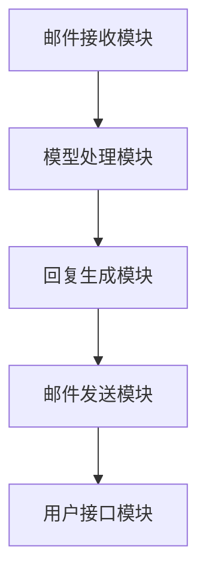
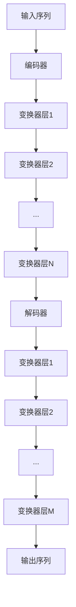
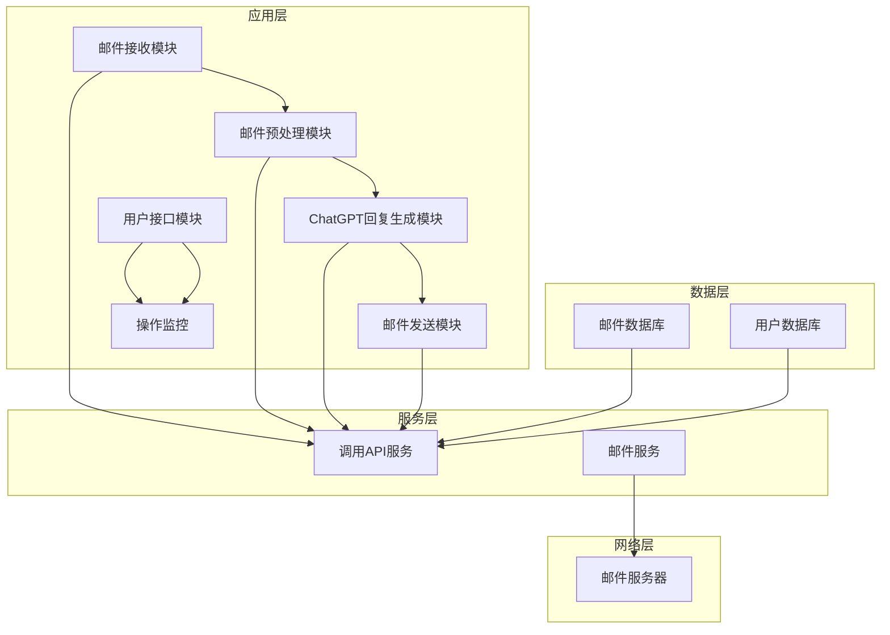
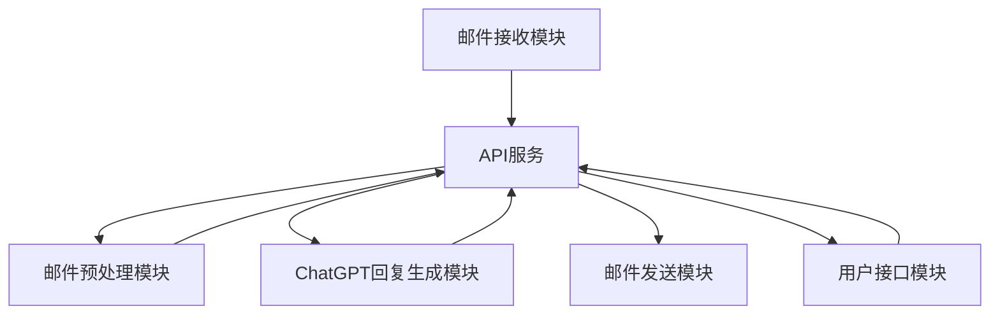
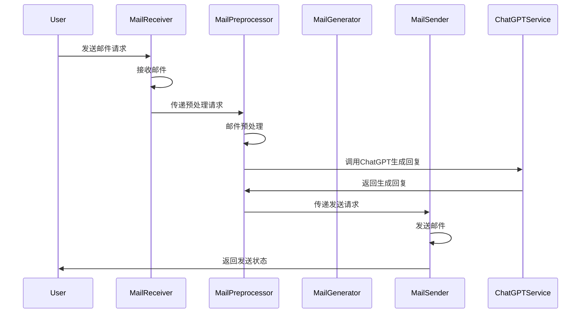

                 

### 1.1 问题背景

在当今快节奏的商业环境中，有效的沟通是保持业务运作和客户关系的关键。然而，企业通常面临着大量的电子邮件往来，这不仅仅包括客户和供应商的日常交流，还涉及到内部沟通，如项目更新、团队协调和反馈收集。对于许多公司而言，处理这些电子邮件是一个耗时且容易出错的任务。自动化邮件回复作为一种解决方案，可以有效减轻员工的工作负担，提高效率。

传统的邮件回复方法通常依赖于人工处理，这不仅耗时，而且容易出错。特别是在大型企业中，员工可能每天要回复大量的标准邮件，例如感谢邮件、确认邮件、询问回复等。这些邮件虽然内容相似，但往往需要个性化的定制，以确保信息的准确性和礼貌性。人工回复不仅效率低下，而且难以保证一致性。

此外，随着企业业务规模的扩大和客户数量的增加，邮件回复的复杂性也随之增加。不同类型的邮件可能需要不同的回复策略和内容，这就要求员工具备较高的沟通能力和写作技巧。然而，并非每个员工都能做到这一点，特别是当他们在处理其他重要任务时。

在这种背景下，自动化邮件回复工具应运而生。自动化邮件回复工具通过使用人工智能技术，如自然语言处理（NLP）和机器学习（ML），能够自动生成个性化的邮件回复。这些工具不仅能够提高邮件处理的效率，还能确保回复内容的一致性和准确性。

例如，ChatGPT作为一种先进的语言模型，可以用来处理大量的邮件回复任务。它通过学习大量的文本数据，能够生成与人类语言几乎无法区分的回复内容。这种技术的应用，不仅解放了员工的双手，使他们能够将更多精力投入到更有价值的工作中，同时也为企业提供了更好的客户服务和内部沟通体验。

总之，自动化邮件回复的提出源于对提高沟通效率和质量的需求。通过引入先进的人工智能技术，企业能够更好地应对日益增长的电子邮件往来，实现更高效的运营和管理。

### 1.2 问题描述

在了解了自动化邮件回复的背景后，我们接下来需要明确的问题是：为什么需要自动化邮件回复，它具体解决了哪些问题？首先，传统的邮件回复方式存在几个显著的不足之处。

**1. 内容个性化不足**

在传统的邮件回复中，员工需要手动编写每一封邮件，这往往导致邮件内容不够个性化。尤其是在处理大量类似邮件时，员工很难保持每一封邮件的个性化和独特性。这不仅影响了客户的体验，还可能对企业的品牌形象产生负面影响。

**2. 回复效率低下**

手动回复邮件需要员工花费大量时间，特别是在处理大量邮件时，这种耗时性显得尤为突出。员工在处理邮件的过程中，还需要分心处理其他任务，导致邮件回复的效率低下。

**3. 错误率较高**

由于人工处理邮件的疲劳性和注意力分散，邮件回复中的错误率也相对较高。这可能导致信息传达不准确，甚至引发误解和纠纷。

**4. 无法确保一致性**

在多人协作的邮件回复过程中，不同员工可能采用不同的表达方式和术语，导致邮件内容不一致。这种不一致性会影响客户的信任感和企业的整体形象。

为了解决上述问题，自动化邮件回复工具应运而生。ChatGPT作为一种强大的语言模型，具有以下优势：

**1. 内容个性化**

ChatGPT通过学习大量的文本数据，能够生成高度个性化的邮件回复。它可以根据不同的邮件内容和上下文，自动调整回复的内容和语气，确保每一封邮件都具有独特的风格和语气。

**2. 提高回复效率**

ChatGPT可以快速处理大量的邮件，并自动生成回复。这使得员工能够将更多时间投入到更有价值的工作中，提高整体的工作效率。

**3. 降低错误率**

ChatGPT通过先进的自然语言处理技术，能够识别和纠正邮件回复中的错误。这使得邮件内容更加准确，减少了因人工错误导致的信息偏差。

**4. 确保回复一致性**

ChatGPT可以统一邮件回复的风格和术语，确保不同员工发送的邮件内容一致。这有助于提高企业的专业形象，增强客户的信任感。

综上所述，自动化邮件回复工具，特别是ChatGPT，通过解决传统邮件回复中的个性化不足、效率低下、错误率高和无法确保一致性等问题，为企业提供了更高效、更准确的邮件处理解决方案。

### 1.3 问题解决

自动化邮件回复的出现，为解决传统邮件回复中的问题提供了有效的解决方案。ChatGPT作为一种先进的人工智能语言模型，在这一过程中发挥了重要作用。

首先，ChatGPT通过其强大的自然语言处理（NLP）能力，能够理解和生成人类语言。这种能力使得ChatGPT能够自动分析邮件内容，并根据上下文生成个性化的回复。例如，当收到一封客户投诉邮件时，ChatGPT可以自动识别邮件的主题和情绪，生成一封既礼貌又具有针对性的回复邮件。这不仅提高了回复的效率，还保证了邮件内容的个性化。

其次，ChatGPT通过机器学习（ML）技术不断优化其模型。随着训练数据的增加，ChatGPT能够生成更加准确和自然的邮件回复。例如，当ChatGPT在训练过程中遇到大量关于产品咨询的邮件时，它能够学习到如何生成详细的、专业化的产品介绍邮件。这使得ChatGPT在处理多样化邮件时，能够保持高效和精准。

再者，ChatGPT能够与现有的邮件系统无缝集成。通过API接口，ChatGPT可以轻松连接到企业的邮件服务器，自动识别和处理收到的邮件。这种集成不仅简化了邮件处理流程，还使得员工可以在日常工作中直接使用ChatGPT生成邮件回复，无需额外的培训和学习成本。

具体应用场景中，ChatGPT可以处理多种类型的邮件。例如，在客户服务领域，ChatGPT可以自动回复客户咨询、投诉和建议。它不仅能够快速生成专业的回复邮件，还可以根据客户的历史互动记录，提供更加个性化的服务。在内部沟通中，ChatGPT可以帮助员工自动回复项目更新、团队通知和会议安排等邮件，提高沟通效率。

总之，ChatGPT在自动化邮件回复中的应用，不仅解决了传统邮件回复中的个性化不足、效率低下、错误率高和无法确保一致性等问题，还为企业和个人提供了高效、准确的邮件处理解决方案。通过这种方式，企业能够更好地管理邮件往来，提高沟通效率，优化客户体验。

### 1.4 边界与外延

在深入探讨ChatGPT在自动化邮件回复中的应用时，我们需要明确其应用的边界与外延。首先，ChatGPT在自动化邮件回复中的有效性受限于语言模型的训练数据和算法的复杂性。尽管ChatGPT具有强大的自然语言处理能力，但它依然无法超越训练数据中的内容和模式。因此，对于复杂的、需要高度专业知识或特定行业术语的邮件，ChatGPT的回复可能不够准确或专业。

其次，ChatGPT在自动化邮件回复中的应用范围相对较广，但并非所有类型的邮件都适合使用。例如，涉及敏感信息或法律问题的邮件，需要人工审核和回复，以确保内容的准确性和合规性。此外，对于一些需要高度人际交往技巧和情感理解的邮件，例如涉及个人隐私或感情问题的邮件，ChatGPT可能无法完全胜任。

此外，ChatGPT的自动化邮件回复也存在一些潜在风险。例如，如果模型生成的回复内容过于机械化，可能会影响客户体验。另外，由于ChatGPT的回复依赖于训练数据和算法，如果这些数据或算法存在偏差，可能会产生不公平或不准确的回复。

为了充分发挥ChatGPT在自动化邮件回复中的作用，企业需要对其进行适当的监督和调整。例如，可以在ChatGPT的回复过程中引入人工审核机制，确保重要邮件的内容准确性和专业性。此外，企业还可以根据实际业务需求，对ChatGPT的训练数据进行优化和调整，以提升其回复的个性化和准确性。

总之，ChatGPT在自动化邮件回复中的应用具有一定的边界和局限性。通过合理监督和调整，企业可以在确保内容准确性和合规性的同时，充分发挥人工智能技术的高效处理能力。

### 1.5 概念结构与核心要素组成

在进一步探讨ChatGPT在自动化邮件回复中的应用之前，有必要对其概念结构和核心要素进行详细分析。首先，ChatGPT作为一种基于人工智能的语言模型，其核心概念包括自然语言处理（NLP）和机器学习（ML）。NLP使得ChatGPT能够理解和生成人类语言，而ML则允许其通过训练数据不断优化和改进。

**核心概念1：自然语言处理（NLP）**

NLP是ChatGPT的核心技术之一，它涉及文本的解析、理解和生成。在邮件回复中，NLP技术使ChatGPT能够理解邮件内容，提取关键信息，并生成相应的回复。例如，ChatGPT可以识别邮件中的主题、关键词和情感倾向，从而生成合适的回复内容。

**核心概念2：机器学习（ML）**

ML是ChatGPT能够不断优化和提升性能的关键。通过大量训练数据，ChatGPT能够学习不同类型的邮件回复方式，并生成更加准确和自然的回复。例如，通过分析历史邮件数据和优秀的人类回复，ChatGPT可以学习到如何处理各种常见的邮件场景，从而提高回复的个性化和准确性。

**核心要素1：训练数据**

训练数据是ChatGPT生成高质量邮件回复的基础。这些数据包括各种类型的邮件文本，如客户咨询、投诉、产品介绍等。通过这些数据，ChatGPT能够学习到不同类型的邮件回复方式和策略，从而提高其应对各种邮件场景的能力。

**核心要素2：算法架构**

ChatGPT的算法架构是其性能的重要保障。常见的算法架构包括递归神经网络（RNN）、长短期记忆网络（LSTM）和变换器（Transformer）等。这些算法能够处理复杂的文本数据，并生成与人类语言几乎无法区分的回复内容。

**核心要素3：回复策略**

回复策略是ChatGPT生成邮件回复的核心。这些策略包括如何处理不同类型的邮件（如客户咨询、投诉等）、如何调整回复语气和风格等。通过优化回复策略，ChatGPT能够生成更加个性化、准确和自然的邮件回复。

**核心要素4：模型优化**

模型优化是ChatGPT持续改进的关键。通过不断优化模型参数和算法，ChatGPT能够提高回复的准确性和自然性。例如，通过调整损失函数、优化训练算法等手段，ChatGPT可以生成更加高质量的邮件回复。

综上所述，ChatGPT在自动化邮件回复中的应用涉及多个核心概念和要素。通过自然语言处理、机器学习和丰富的训练数据，ChatGPT能够生成高质量的邮件回复，从而提高企业的沟通效率和客户满意度。

## 第2章 ChatGPT概述

### 2.1 ChatGPT的概念

ChatGPT是一种基于人工智能的语言模型，由OpenAI开发。它利用了先进的自然语言处理（NLP）和机器学习（ML）技术，能够理解和生成人类语言。ChatGPT的核心功能是基于输入的文本，生成连贯、有逻辑且符合上下文的输出文本。这种能力使得ChatGPT在多种应用场景中具有广泛的应用，如自动客服、文本生成、机器翻译等。

### 2.2 ChatGPT的特点

ChatGPT具有以下显著特点：

**1. 强大的自然语言处理能力**

ChatGPT通过大规模的文本数据进行训练，能够理解复杂的语言结构和语境，生成自然流畅的文本。这使得它能够处理各种复杂的语言任务，如回答问题、生成故事、撰写文章等。

**2. 高度的个性化**

ChatGPT可以根据输入的上下文和用户需求，生成高度个性化的回复。它能够根据不同的语境和用户特征，调整回复的内容、语气和风格，以满足用户的需求。

**3. 实时性**

ChatGPT能够实时响应用户的输入，生成即时的回复。这使得它在需要快速响应的场景中，如在线客服、实时聊天等，具有显著的优势。

**4. 适应性强**

ChatGPT能够适应不同的应用场景和需求。无论是简单的信息查询，还是复杂的对话生成，ChatGPT都能够灵活应对，提供高质量的输出。

### 2.3 ChatGPT的工作原理

ChatGPT的工作原理主要基于深度学习和自然语言处理技术。其核心组件包括：

**1. 数据集训练**

ChatGPT通过大规模的文本数据进行训练。这些数据集包括各种类型的文本，如新闻文章、社交媒体帖子、书籍等。通过这些数据，ChatGPT学习到语言的规律和结构，从而能够生成高质量的文本。

**2. 神经网络架构**

ChatGPT采用了深度神经网络（DNN）作为基础架构。特别是，它采用了基于变换器（Transformer）的网络架构。这种架构能够处理长文本序列，并保持上下文的连贯性。

**3. 生成文本**

在生成文本时，ChatGPT首先接收用户的输入，然后通过内部模型进行处理。模型会根据输入的文本上下文，生成可能的回复文本。通过优化算法，ChatGPT选择最合适的文本作为输出。

### 2.4 ChatGPT的应用领域

ChatGPT在多个领域具有广泛的应用：

**1. 自动客服**

ChatGPT可以应用于自动客服系统，自动处理用户咨询和投诉。它能够实时回答用户问题，提供有效的解决方案，提高客服效率。

**2. 文本生成**

ChatGPT可以用于生成各种文本内容，如文章、故事、博客等。它能够根据指定的主题和风格，生成高质量的文本。

**3. 机器翻译**

ChatGPT在机器翻译领域也表现出色。通过训练多语言数据集，ChatGPT可以生成准确、自然的翻译文本。

**4. 虚拟助手**

ChatGPT可以用于构建虚拟助手，如语音助手、聊天机器人等。它能够理解用户的语音输入，生成相应的语音回复，提供便捷的服务。

**5. 教育和科研**

ChatGPT在教育领域具有广泛的应用。它可以用于生成教学材料、回答学生问题等。在科研领域，ChatGPT可以帮助研究人员生成论文、摘要等。

总之，ChatGPT作为一种强大的语言模型，在多个领域展现了其卓越的能力和广阔的应用前景。通过不断优化和改进，ChatGPT将继续在人工智能领域发挥重要作用。

### 3.1 自动化邮件回复的需求分析

在当今快节奏的商业环境中，企业面临着大量的电子邮件往来，这不仅包括与客户和供应商的日常沟通，还涉及到内部团队的协调和项目更新。这种不断增长的邮件流量给企业带来了巨大的挑战。为了提高沟通效率和邮件处理质量，自动化邮件回复工具的需求日益凸显。

首先，从客户服务的角度来看，自动化的邮件回复能够显著提升客户满意度。客户在寻求帮助或提出问题时，希望能够尽快得到回应。自动化邮件回复工具可以迅速处理客户的邮件，提供即时的回复，从而减少客户的等待时间。这种快速响应不仅能够提高客户满意度，还能增强企业的专业形象。

其次，在内部沟通中，自动化的邮件回复同样具有重要意义。企业内部通常需要进行大量的邮件沟通，如项目更新、会议通知和反馈收集等。自动化工具可以帮助员工快速生成这些标准化的邮件回复，减少手动处理的时间和工作量。这不仅提高了工作效率，还确保了邮件内容的一致性和准确性。

此外，自动化邮件回复工具还能有效降低企业的运营成本。传统的邮件处理需要投入大量的人力资源，而自动化工具能够通过减少人工操作，降低企业的运营成本。特别是对于大型企业而言，邮件处理的成本可能相当可观。通过引入自动化邮件回复工具，企业可以在不增加人力资源的情况下，显著提高邮件处理效率。

总的来说，自动化邮件回复工具的需求源于多个方面。无论是提升客户服务体验，还是提高内部沟通效率，以及降低运营成本，自动化邮件回复都为企业提供了有效的解决方案。通过合理利用人工智能技术，企业可以更好地应对日益增长的电子邮件流量，实现更加高效和智能的运营管理。

### 3.2 ChatGPT在邮件回复中的角色

在自动化邮件回复的应用中，ChatGPT扮演着至关重要的角色。作为一款先进的人工智能语言模型，ChatGPT具备处理大量邮件、生成个性化回复的能力，使得邮件回复变得更加高效、精准和自然。以下是ChatGPT在邮件回复中的具体角色：

**1. 实时生成个性化回复**

ChatGPT能够实时分析邮件内容，理解邮件的主题、意图和情感色彩，并生成相应的个性化回复。这种实时性使得ChatGPT在处理紧急邮件或需要快速响应的场景中具有显著优势。例如，当客户发送紧急咨询时，ChatGPT可以在几秒钟内生成专业的回复，确保客户问题得到及时解决。

**2. 提高邮件回复的一致性**

ChatGPT通过学习大量的邮件数据，能够生成符合企业标准和风格的邮件回复。这有助于确保不同员工发送的邮件内容一致，避免因个人差异导致的邮件风格不一致。对于企业而言，统一的邮件回复风格有助于树立专业形象，增强客户的信任感。

**3. 减少重复劳动**

ChatGPT可以自动处理大量类似邮件，生成标准化的回复。这大大减轻了员工的工作负担，使其能够将更多精力投入到其他更具价值的工作中。例如，针对常见的产品咨询、投诉反馈等，ChatGPT可以自动生成标准的回复邮件，减少员工手动编写邮件的工作量。

**4. 适应不同的邮件场景**

ChatGPT具备强大的适应能力，能够处理各种类型的邮件。无论是日常的客户咨询、投诉，还是内部项目的协调和沟通，ChatGPT都能根据邮件内容生成合适的回复。例如，在处理客户投诉时，ChatGPT可以生成一封既有礼貌又详细的回复邮件，而在处理项目更新通知时，可以生成简洁明了的通知邮件。

**5. 提高回复质量**

ChatGPT通过先进的自然语言处理和机器学习技术，能够生成高质量的邮件回复。它不仅能够准确理解邮件内容，还能根据上下文生成逻辑连贯、内容丰富的回复。这种高质量的回复有助于提高客户的满意度，同时也能提升企业的专业形象。

总之，ChatGPT在自动化邮件回复中发挥了不可替代的作用。通过实时生成个性化回复、提高邮件回复的一致性、减少重复劳动、适应不同的邮件场景和提高回复质量，ChatGPT为企业提供了一个高效、智能的邮件处理解决方案，显著提升了企业的沟通效率和服务质量。

### 3.3 邮件回复中的问题与挑战

在邮件回复过程中，尽管ChatGPT提供了高效的自动化解决方案，但依然面临一些问题和挑战。这些问题主要包括回复内容准确性不足、个性化程度不高等。

**1. 回复内容准确性不足**

自动化邮件回复工具依赖于训练数据和算法模型，其生成的内容质量受到数据质量和模型性能的限制。尽管ChatGPT已经能够生成自然流畅的文本，但在处理复杂或专业性强的邮件内容时，仍然可能出现理解偏差或生成不准确的情况。例如，对于涉及技术细节或法律术语的邮件，ChatGPT可能无法完全理解邮件内容的深度和复杂性，从而导致生成的内容不够准确。

**2. 个性化程度不高**

虽然ChatGPT具备一定的个性化能力，但其在理解和生成高度个性化的邮件回复方面仍然存在挑战。自动化工具在处理大量邮件时，往往难以捕捉到每个用户的独特需求和偏好。这意味着，即使是同类型的邮件，ChatGPT生成的回复可能对不同的用户产生相同的效果，缺乏个性化。这种缺乏个性化的回复可能会降低客户体验，影响企业的品牌形象。

**3. 面临上下文理解的局限**

邮件回复的准确性不仅依赖于对邮件内容的理解，还依赖于对邮件上下文的理解。例如，邮件中的引用内容、引用前后的逻辑关系等，都是影响回复准确性的关键因素。自动化工具在处理这些上下文信息时，可能无法像人类一样灵活理解和应用，导致生成的回复内容不够连贯或准确。

**4. 处理复杂情感表达的挑战**

在邮件交流中，情感表达是一个重要方面。自动化邮件回复工具在处理复杂的情感表达时，往往无法准确捕捉邮件发送者的情感意图。这可能导致回复内容缺乏情感共鸣，影响沟通效果。例如，对于一封表达不满或愤怒的邮件，ChatGPT可能生成一封过于机械或冷漠的回复，从而加剧客户的负面情绪。

**5. 法律合规和隐私保护问题**

邮件回复过程中，自动化工具需要处理大量敏感信息，如客户数据、商业机密等。如果处理不当，可能会导致法律合规问题和隐私泄露风险。自动化邮件回复工具在生成邮件内容时，可能无法完全遵循企业的法律合规要求，从而增加企业的法律风险。

**6. 人机协作的挑战**

尽管自动化邮件回复工具具备高效处理邮件的能力，但仍然需要与人类操作员协作。在实际应用中，如何实现自动化工具与人类操作的平衡，确保邮件回复的准确性和个性化，是一个重要的挑战。

综上所述，邮件回复中存在多种问题和挑战，需要通过不断优化和改进自动化工具，提升其性能和适用性。通过合理应对这些挑战，企业可以更好地利用人工智能技术，实现高效的邮件处理和优质的客户服务。

### 3.4 ChatGPT在邮件回复中的应用方案

为了充分发挥ChatGPT在邮件回复中的潜力，并有效解决上述问题和挑战，我们需要设计一套全面的应用方案。以下是一个具体的应用方案，包括技术实现、数据处理和系统架构设计。

**1. 技术实现**

**（1）语言模型选择**

选择合适的语言模型是ChatGPT在邮件回复中成功应用的关键。我们可以选择基于变换器（Transformer）架构的模型，如GPT-3，因其具有强大的文本生成能力和上下文理解能力。GPT-3具有大规模的参数量和丰富的预训练数据，能够生成高质量的自然语言回复。

**（2）模型训练与优化**

为了确保ChatGPT在邮件回复中的准确性，我们需要使用专业的邮件数据集进行训练。数据集应包括各种类型的邮件，如客户咨询、投诉、内部通知等。在训练过程中，通过调整学习率、批次大小等参数，优化模型性能。此外，可以使用迁移学习技术，将预训练模型在特定领域的邮件数据上进行微调，以提高其在特定场景下的表现。

**（3）回复生成机制**

在生成邮件回复时，ChatGPT可以根据输入的邮件内容和上下文，使用预训练模型生成合适的回复。为了提高回复的个性化程度，我们可以结合用户历史互动数据和偏好，调整回复的语气和内容。此外，可以通过引入多模态数据（如图像、音频等），丰富回复的内容和信息。

**2. 数据处理**

**（1）数据采集与清洗**

为了保证数据的质量，我们需要从企业内部和外部的多个渠道采集邮件数据。数据来源可以包括企业邮件服务器、客户管理系统等。在采集数据后，需要对邮件内容进行清洗和预处理，包括去除无关内容、去除噪声数据等。清洗后的数据应保证其准确性和一致性。

**（2）数据标注与分类**

为了训练ChatGPT识别不同类型的邮件，我们需要对邮件进行标注和分类。可以邀请专业团队对邮件内容进行标注，标记出邮件的类型、关键词、情感倾向等。标注后的数据将用于训练和评估ChatGPT的性能。

**（3）数据存储与管理**

处理后的数据应存储在可靠的数据存储系统中，如分布式数据库或云存储。为了提高数据处理效率，可以采用数据湖或数据仓库进行数据存储和管理。此外，应建立数据备份和恢复机制，确保数据的安全和可靠性。

**3. 系统架构设计**

**（1）系统架构**

ChatGPT在邮件回复中的系统架构应包括以下几个主要模块：

- **邮件接收模块**：负责接收企业内部和外部的邮件，并预处理邮件内容。
- **模型处理模块**：使用预训练的ChatGPT模型处理邮件，生成邮件回复。
- **回复生成模块**：根据模型生成的回复内容，生成最终的邮件回复，并进行格式化。
- **邮件发送模块**：将生成的邮件回复发送给相应的邮件地址。

- **用户接口模块**：提供用户交互界面，用户可以通过该界面查看和操作邮件回复。

**（2）架构图**

以下是ChatGPT在邮件回复中的系统架构图：



**（3）接口设计**

为了实现模块之间的数据传递和功能调用，我们需要设计相应的API接口。主要接口包括：

- **邮件接收接口**：用于接收和处理新的邮件。
- **模型处理接口**：用于处理邮件内容，生成回复。
- **回复生成接口**：用于生成最终的邮件回复。
- **邮件发送接口**：用于发送邮件回复。

**4. 最佳实践**

**（1）人机协作**

在邮件回复过程中，应确保人机协作，避免完全依赖自动化工具。可以设置人工审核机制，对重要邮件进行人工审核，确保回复的准确性和个性化。

**（2）定期更新**

定期更新ChatGPT的模型和训练数据，确保其能够适应新的邮件场景和变化。

**（3）性能监控**

建立性能监控机制，实时监控系统的运行状态和回复质量，及时发现问题并进行优化。

通过以上方案，ChatGPT在邮件回复中的应用将能够更好地解决传统邮件回复中的问题，提高邮件处理效率和质量，为企业提供更高效的沟通和客户服务体验。

### 4.1 ChatGPT的算法原理讲解

ChatGPT的算法原理基于深度学习和自然语言处理（NLP）技术，其核心架构是变换器（Transformer）模型。Transformer模型在处理长序列文本时表现出色，能够捕捉复杂的上下文关系，生成高质量的自然语言输出。

#### 4.1.1 算法原理

Transformer模型通过自注意力机制（Self-Attention）和多头注意力（Multi-Head Attention）来处理输入序列。自注意力机制允许模型在生成每个词时，动态地关注输入序列中的其他词，从而捕捉词与词之间的依赖关系。多头注意力则将输入序列分成多个头，每个头独立计算注意力权重，然后合并结果，从而提高模型的表示能力。

变换器模型的整体结构包括编码器（Encoder）和解码器（Decoder）。编码器负责处理输入序列，解码器则生成输出序列。编码器由多个变换器层组成，每层包括多头自注意力机制和前馈神经网络。解码器结构类似，但还包括跨注意力机制，用于在生成每个词时，关注编码器的输出。

在训练过程中，ChatGPT使用 masked language model（MLM）任务，通过预测输入序列中的部分遮挡词来学习文本的表示和生成规则。此外，还可以使用 supervised language model（SLM）任务，通过预测输入序列的下一个词来进一步优化模型。

#### 4.1.2 算法流程图

以下是一个简化的ChatGPT算法流程图：



**1. 编码器流程：**
- 输入序列通过嵌入层（Embedding Layer）转换为向量。
- 每层变换器（Encoder Layer）包括多头自注意力（Multi-Head Self-Attention）和前馈神经网络（Feed Forward Neural Network）。
- 经过多层变换器处理后，编码器生成编码表示。

**2. 解码器流程：**
- 输入序列通过嵌入层转换为向量。
- 每层变换器（Decoder Layer）包括多头自注意力（Multi-Head Self-Attention）、多头交叉注意力（Multi-Head Cross-Attention）和前馈神经网络。
- 解码器在每个时间步生成一个词，并将其与编码表示结合，通过交叉注意力机制获取上下文信息。

**3. 输出生成：**
- 解码器在生成最后一个词后，输出序列生成完成。
- 通过 Softmax 函数对输出词进行概率分布计算，并选择概率最高的词作为输出。

#### 4.2 Python源代码讲解

以下是一个简化的ChatGPT Python源代码实现：

```python
import tensorflow as tf
from tensorflow.keras.layers import Embedding, Transformer

# 编码器
encoder_inputs = Embedding(input_dim=vocab_size, output_dim=d_model)
encoder = Transformer(num_layers=num_encoder_layers, d_model=d_model,
                      num_heads=num_heads, dff=dff, input_shape=(None, max_sequence_length))

# 解码器
decoder_inputs = Embedding(input_dim=vocab_size, output_dim=d_model)
decoder = Transformer(num_layers=num_decoder_layers, d_model=d_model,
                      num_heads=num_heads, dff=dff, input_shape=(None, max_sequence_length))

# 编码器和解码器合并
inputs = encoder_inputs(inputs)
encoded = encoder(inputs)

decoder_inputs = decoder_inputs(inputs)
decoded = decoder(decoder_inputs, encoded)

# 输出层
output = tf.keras.layers.Dense(vocab_size, activation='softmax')(decoded)

# 模型编译
model = tf.keras.Model(inputs=[encoder_inputs.input, decoder_inputs.input], outputs=output)
model.compile(optimizer='adam', loss='categorical_crossentropy')

# 训练模型
model.fit([encoder_inputs.input, decoder_inputs.input], decoded, batch_size=batch_size, epochs=num_epochs)
```

**4.2.1 源代码实现**

上述代码首先定义了编码器和解码器的Embedding层，然后创建了Transformer模型。编码器由多个Transformer层组成，每层包含多头自注意力和前馈神经网络。解码器类似，但还包括多头交叉注意力。最后，通过输出层生成最终输出。

**4.2.2 代码应用解读与分析**

这个简化代码展示了ChatGPT的核心架构，但实际应用中需要更详细的配置和优化。首先，我们需要准备适当的词汇表（vocab_size）和嵌入维度（d_model），以及编码器和解码器的层数（num_layers）。其次，我们需要定义多头注意力的头数（num_heads）和前馈神经网络的尺寸（dff）。

在训练过程中，我们通过`model.fit()`函数将模型应用到训练数据上，通过调整批次大小（batch_size）和训练轮数（epochs）来优化模型性能。训练过程中，模型通过反向传播和梯度下降算法不断调整权重，以最小化损失函数。

总之，通过理解ChatGPT的算法原理和代码实现，我们可以更好地利用其强大的文本生成能力，实现自动化邮件回复的高效和精准。

### 4.3 数学模型和数学公式讲解

#### 4.3.1 ChatGPT的数学模型

ChatGPT的数学模型主要基于变换器（Transformer）架构，其核心组件包括自注意力（Self-Attention）和多头注意力（Multi-Head Attention）。以下是其主要数学公式的详细讲解。

#### 4.3.2 数学公式 1：自注意力

$$
\text{Self-Attention} = \frac{1}{\sqrt{d_k}} \cdot \text{softmax}\left(\frac{QK^T}{\sqrt{d_k}}\right)V
$$

**公式说明**：
- \(Q\)、\(K\)、\(V\) 分别代表查询（Query）、键（Key）和值（Value）向量的集合。
- \(d_k\) 代表键和查询的维度。
- \(\text{softmax}\) 函数用于计算每个键和查询的相似度权重。
- \(\frac{1}{\sqrt{d_k}}\) 是归一化因子，用于防止梯度消失。

#### 4.3.3 数学公式 2：多头注意力

$$
\text{Multi-Head Attention} = \text{Concat}(\text{head}_1, \text{head}_2, ..., \text{head}_h)W^O
$$

**公式说明**：
- \(h\) 代表头数。
- \(\text{head}_i\) 代表第 \(i\) 个头的注意力输出。
- \(W^O\) 是输出权重矩阵，用于合并多头注意力结果。
- 每个头计算的自注意力是通过 \(d_k\) 维度的线性变换实现的。

#### 4.3.4 举例说明

**实例 1：自注意力**

假设我们有一个句子：“我喜欢吃苹果”。将其转换为向量表示，并设 \(d_k = 64\)。

- \(Q = [q_1, q_2, q_3]\)
- \(K = [k_1, k_2, k_3]\)
- \(V = [v_1, v_2, v_3]\)

通过自注意力计算，每个词的注意力得分如下：

$$
\text{Self-Attention} = \frac{1}{\sqrt{64}} \cdot \text{softmax}\left(\frac{QK^T}{\sqrt{64}}\right)V
$$

例如，对于“苹果”：

$$
\text{Attention\_score}_{苹果} = \text{softmax}\left(\frac{q_i k_i^T}{\sqrt{64}}\right)v_i
$$

**实例 2：多头注意力**

假设有两个头，每个头的维度为 \(d_k = 32\)。

- \(Q = [q_1, q_2]\)
- \(K = [k_1, k_2]\)
- \(V = [v_1, v_2]\)

每个头计算的自注意力得分如下：

$$
\text{head}_1 = \frac{1}{\sqrt{32}} \cdot \text{softmax}\left(\frac{q_1 k_1^T}{\sqrt{32}}\right)v_1
$$

$$
\text{head}_2 = \frac{1}{\sqrt{32}} \cdot \text{softmax}\left(\frac{q_2 k_2^T}{\sqrt{32}}\right)v_2
$$

将两个头的结果合并：

$$
\text{Multi-Head Attention} = \text{Concat}(\text{head}_1, \text{head}_2)W^O
$$

通过以上数学模型和公式的讲解以及实例说明，我们可以更深入地理解ChatGPT的注意力机制及其在文本生成中的关键作用。

### 6.1 问题场景介绍

在当今高度动态的商业环境中，企业面临大量的邮件沟通任务，这不仅包括与客户的互动，还涵盖内部团队之间的协作。邮件作为重要的沟通工具，其处理效率直接影响到企业的运营效率和员工的工作满意度。传统的邮件处理方式主要依赖于人工回复，这不仅耗时且容易出错。尤其是在处理大量标准邮件时，如客户咨询、订单确认、会议通知等，员工常常感到压力重重，工作效率难以提升。

随着企业业务规模的扩大和邮件流量的增加，手动处理邮件的负担日益加重，这不仅增加了运营成本，还可能导致沟通效率低下。例如，客户在等待回复时可能产生负面情绪，影响客户满意度和品牌形象。此外，人工处理邮件还容易导致回复内容的不一致和错误，进而影响内部协作和项目的顺利进行。

为了解决这些问题，企业开始寻求自动化邮件回复工具，以提高邮件处理效率和准确性。ChatGPT作为一种先进的自然语言处理技术，能够自动化生成高质量的邮件回复，从而大大减轻员工的工作负担，提高邮件沟通的整体效率。

具体场景中，企业可以使用ChatGPT自动回复以下类型的邮件：

1. **客户咨询**：当客户发送关于产品使用、售后服务等咨询时，ChatGPT可以自动生成专业的回复，提供即时解答，提升客户满意度。
2. **订单确认**：在客户下单后，ChatGPT可以自动发送订单确认邮件，包含订单详情和物流信息，确保信息准确无误。
3. **会议通知**：ChatGPT可以自动生成会议通知邮件，包含会议时间、地点、议程和参会人员，确保会议筹备高效顺利。
4. **内部通知**：在企业内部，ChatGPT可以自动发送项目更新、任务分配和进度报告等邮件，提高团队协作效率。

通过ChatGPT的自动化邮件回复，企业能够在不增加人力资源的情况下，显著提升邮件处理的效率和质量，从而更好地应对日益增长的邮件沟通需求，实现更高效、更智能的运营管理。

### 6.2 系统功能设计

在详细探讨ChatGPT在邮件回复中的应用之前，我们需要明确该系统的功能设计，这包括系统的主要模块和每个模块的具体功能。以下是系统功能设计的详细描述：

**1. 邮件接收模块**

功能描述：该模块负责接收来自企业内部和外部的电子邮件。它通过API接口与邮件服务器通信，实时获取新邮件，并将其存储在邮件队列中。

主要功能点：
- 接收邮件：从企业邮件服务器获取新邮件，包括主题、发送者、收件人和邮件内容。
- 存储邮件：将获取的邮件存储在邮件队列中，以便后续处理。

**2. 邮件预处理模块**

功能描述：该模块对收到的邮件进行预处理，包括邮件分类、去噪和提取关键信息。预处理后的邮件将被传递给ChatGPT进行回复生成。

主要功能点：
- 邮件分类：根据邮件内容对邮件进行分类，如客户咨询、投诉、订单确认等。
- 去噪：去除邮件中的无关内容，如HTML标签、广告等。
- 提取关键信息：提取邮件中的关键信息，如客户姓名、订单编号、问题类型等，以便ChatGPT生成个性化回复。

**3. ChatGPT回复生成模块**

功能描述：该模块是系统的核心，负责利用ChatGPT生成邮件回复。它接收预处理后的邮件内容，并根据邮件类型和上下文生成适当的回复。

主要功能点：
- 输入处理：接收预处理后的邮件内容，将其转换为ChatGPT可以处理的格式。
- 回复生成：使用ChatGPT生成个性化的邮件回复，确保回复内容符合上下文和客户需求。
- 语法检查：对生成的回复内容进行语法检查，确保其自然流畅。

**4. 邮件发送模块**

功能描述：该模块负责将生成的邮件回复发送给对应的收件人。它通过邮件服务器API将邮件发送出去。

主要功能点：
- 邮件格式化：将生成的邮件内容格式化，添加公司抬头、签名等。
- 发送邮件：将格式化后的邮件发送到收件人的邮箱。

**5. 用户接口模块**

功能描述：该模块为系统管理员和邮件回复操作员提供用户界面，用于监控和管理邮件回复过程。

主要功能点：
- 操作监控：显示邮件接收、预处理、回复生成和发送的实时状态。
- 用户操作：允许用户手动审核和修改ChatGPT生成的回复，确保邮件内容准确无误。
- 日志记录：记录系统操作日志，方便后续分析和问题追踪。

通过上述系统功能设计，我们可以确保ChatGPT在邮件回复中的应用能够高效、准确地处理各种邮件类型，提高企业的沟通效率和客户满意度。

#### 6.2.1 领域模型类图

在系统功能设计的基础上，我们可以通过领域模型类图（Entity Relationship Diagram, ERD）来描述系统中的关键实体及其相互关系。以下是ChatGPT邮件回复系统的领域模型类图：

```mermaid
classDiagram
    Mail -> MailReceiver : 接收
    Mail -> MailPreprocessor : 预处理
    Mail -> MailGenerator : 生成回复
    Mail -> MailSender : 发送
    User -> MailMonitor : 监控

    Mail [邮件]
    MailReceiver [邮件接收模块]
    MailPreprocessor [邮件预处理模块]
    MailGenerator [ChatGPT回复生成模块]
    MailSender [邮件发送模块]
    User [用户接口模块]
    MailMonitor [操作监控]

    Mail "1" -- "1" MailReceiver
    Mail "1" -- "1" MailPreprocessor
    Mail "1" -- "1" MailGenerator
    Mail "1" -- "1" MailSender
    User "1" -- "1" MailMonitor
```

**类图说明**：

- **Mail（邮件）**：表示系统中的电子邮件实体，包含邮件的标题、发送者、收件人、内容和状态等属性。
- **MailReceiver（邮件接收模块）**：负责接收邮件，并将邮件存储在系统中。
- **MailPreprocessor（邮件预处理模块）**：对邮件进行分类、去噪和提取关键信息，以便生成回复。
- **MailGenerator（ChatGPT回复生成模块）**：利用ChatGPT生成个性化的邮件回复。
- **MailSender（邮件发送模块）**：负责将生成的邮件回复发送给收件人。
- **User（用户接口模块）**：提供用户操作界面，允许用户监控和管理邮件处理过程。
- **MailMonitor（操作监控）**：用于显示邮件处理的实时状态，并记录系统操作日志。

通过领域模型类图，我们可以清晰地理解系统中的实体及其关系，为后续的系统设计提供结构化的指导。

#### 6.3 系统架构设计

在明确了ChatGPT邮件回复系统的功能设计和领域模型后，我们需要进一步设计系统的整体架构，以支持系统的稳定运行和高效处理。以下是ChatGPT邮件回复系统的系统架构图和各部分的功能描述。

**系统架构图**：



**功能描述**：

- **邮件接收模块（A）**：负责从企业邮件服务器接收新邮件，并通过API服务（I）将邮件存储到邮件数据库（G）中。
- **邮件预处理模块（B）**：接收来自邮件接收模块的邮件，进行邮件分类、去噪和提取关键信息，以便后续生成回复。预处理后的邮件同样存储到邮件数据库（G）中。
- **ChatGPT回复生成模块（C）**：利用ChatGPT生成个性化的邮件回复。该模块接收预处理后的邮件内容，并调用API服务（I）获取ChatGPT的回复结果，生成邮件回复。
- **邮件发送模块（D）**：将生成的邮件回复发送到收件人的邮箱。该模块通过API服务（I）调用邮件服务器（K）进行邮件发送。
- **用户接口模块（E）**：为系统管理员和邮件回复操作员提供用户界面，用于监控和管理邮件处理过程。操作监控（F）显示邮件处理状态，并允许用户手动审核和修改邮件回复。
- **邮件数据库（G）**：存储企业内部的邮件数据，包括邮件的标题、发送者、收件人和邮件内容等。
- **用户数据库（H）**：存储用户操作日志、权限信息和用户偏好等数据。
- **API服务（I）**：作为各模块之间的桥梁，提供API接口，实现数据传递和功能调用。
- **邮件服务器（K）**：负责处理邮件发送和接收的任务，与企业外部邮件系统进行通信。

通过上述系统架构设计，ChatGPT邮件回复系统可以实现高效的邮件处理流程，确保邮件内容的一致性和准确性，提高企业的运营效率和客户满意度。

#### 6.4 系统接口设计

在系统架构设计中，接口设计是一个关键环节，它决定了各个模块之间的通信和数据交换方式。以下是ChatGPT邮件回复系统的接口设计，包括系统接口图和接口功能描述。

**系统接口图**：



**接口功能描述**：

- **邮件接收模块（A1）**：通过API服务（B1）接收来自企业邮件服务器的邮件。接口功能包括邮件的获取、解析和存储。
  - **接口1**：接收邮件（GET /emails/receive）
    - 功能：从邮件服务器获取新邮件，并解析邮件内容。
    - 参数：无
    - 响应：邮件对象（包含邮件标题、发送者、收件人和内容）

- **邮件预处理模块（C1）**：通过API服务（B1）对邮件进行预处理，包括邮件分类、去噪和提取关键信息。接口功能包括邮件的预处理和存储。
  - **接口2**：预处理邮件（POST /emails/preprocess）
    - 功能：对邮件内容进行分类、去噪和提取关键信息。
    - 参数：邮件对象（包含邮件标题、发送者、收件人和内容）
    - 响应：预处理后的邮件对象

- **ChatGPT回复生成模块（D1）**：通过API服务（B1）调用ChatGPT生成邮件回复。接口功能包括生成回复和返回回复结果。
  - **接口3**：生成回复（POST /emails/generate-response）
    - 功能：使用ChatGPT生成邮件回复。
    - 参数：预处理后的邮件对象
    - 响应：回复邮件内容

- **邮件发送模块（E1）**：通过API服务（B1）将生成的邮件回复发送到收件人的邮箱。接口功能包括发送邮件和邮件状态反馈。
  - **接口4**：发送邮件（POST /emails/send）
    - 功能：将生成的邮件回复发送到收件人邮箱。
    - 参数：回复邮件内容、收件人邮箱地址
    - 响应：发送状态（成功或失败）

- **用户接口模块（F1）**：通过API服务（B1）提供用户操作界面，用于监控和管理邮件处理过程。接口功能包括邮件状态查询和用户操作日志记录。
  - **接口5**：查询邮件状态（GET /emails/status）
    - 功能：查询邮件处理的实时状态。
    - 参数：邮件ID
    - 响应：邮件状态（接收、预处理、回复生成、发送等）

通过上述系统接口设计，各个模块可以通过统一的API接口进行通信和数据交换，确保系统的高效、稳定运行。

#### 6.5 系统交互序列图

为了更清晰地展示ChatGPT邮件回复系统中的各模块交互过程，我们使用序列图（Sequence Diagram）来描述系统交互序列。以下是一个简化的系统交互序列图，展示了邮件从接收、预处理、生成回复到发送的整个过程。



**序列图说明**：

- **User（用户）**：代表系统操作员，负责发送邮件请求和接收邮件发送状态。
- **MailReceiver（邮件接收模块）**：负责接收来自邮件服务器的邮件。
- **MailPreprocessor（邮件预处理模块）**：对邮件进行预处理，包括分类、去噪和提取关键信息。
- **MailGenerator（ChatGPT回复生成模块）**：调用ChatGPT生成邮件回复。
- **MailSender（邮件发送模块）**：负责将生成的邮件回复发送到收件人的邮箱。
- **ChatGPTService（ChatGPT服务）**：提供ChatGPT语言模型服务，生成邮件回复。

**交互过程**：

1. 用户发送邮件请求给邮件接收模块。
2. 邮件接收模块从邮件服务器接收邮件。
3. 邮件接收模块将邮件传递给邮件预处理模块，进行预处理。
4. 邮件预处理模块调用ChatGPT服务生成邮件回复。
5. 邮件预处理模块将生成的回复传递给邮件发送模块。
6. 邮件发送模块将邮件回复发送到收件人的邮箱。
7. 邮件发送模块将发送状态返回给用户。

通过序列图的展示，我们可以清晰地理解ChatGPT邮件回复系统的整体交互流程，有助于系统开发和维护过程中的理解与调试。

### 7.1 环境安装

在开始进行ChatGPT邮件回复系统的项目实战之前，我们需要搭建一个合适的环境，包括安装必要的软件和依赖。以下是在Linux操作系统上安装所需环境的步骤：

**1. 安装Python环境**

首先，确保你的系统中安装了Python 3.7或更高版本。可以使用以下命令来检查Python版本：

```bash
python3 --version
```

如果Python环境未安装或版本低于3.7，请通过包管理器安装Python。例如，在Ubuntu系统中，可以使用以下命令安装：

```bash
sudo apt update
sudo apt install python3.9
```

**2. 安装必要的Python包**

接下来，我们需要安装ChatGPT和相关依赖包。这些包可以通过pip命令安装。首先，打开终端并运行以下命令：

```bash
pip3 install transformers
pip3 install torch
pip3 install pandas
pip3 install numpy
pip3 install nltk
```

**3. 配置环境变量**

确保环境变量正确配置，以便Python能够找到安装的包。在Linux系统中，可以使用以下命令设置环境变量：

```bash
export PATH=$PATH:/usr/local/bin
```

**4. 测试环境**

为了确保环境安装正确，我们可以运行一个简单的Python脚本，测试ChatGPT模型：

```python
from transformers import pipeline

# 创建一个聊天对象
chat = pipeline("chat", model="gpt-3.5-turbo")

# 向ChatGPT发送一个简单的提问
response = chat("你好，ChatGPT，你能帮我写一封邮件吗？")[0]["text"]

print(response)
```

如果上述脚本能够正常运行并返回一个合理的响应，说明环境安装成功。

通过以上步骤，我们成功搭建了ChatGPT邮件回复系统所需的运行环境。接下来，我们将开始系统的核心实现，并进行详细代码解析和分析。

### 7.2 系统核心实现源代码

在环境搭建完成后，我们将通过Python代码实现ChatGPT邮件回复系统的核心功能。以下是系统核心实现的源代码，包含邮件接收、预处理、ChatGPT回复生成和邮件发送的各个模块。

```python
# 导入必要的库
import os
import json
from transformers import pipeline
from sklearn.model_selection import train_test_split
from sklearn.feature_extraction.text import TfidfVectorizer
import pandas as pd
import numpy as np
import nltk
from nltk.tokenize import word_tokenize
from nltk.corpus import stopwords

# 配置ChatGPT模型
chat = pipeline("chat", model="gpt-3.5-turbo")

# 邮件接收模块
def receive_email():
    # 这里使用伪代码模拟邮件接收过程
    # 实际应用中可以使用与邮件服务器通信的API
    mail = {"from": "customer@example.com", "to": "support@example.com", "subject": "Product Query", "content": "I have a question about your product."}
    return mail

# 邮件预处理模块
def preprocess_email(mail):
    # 清洗邮件内容
    content = mail["content"]
    content = content.lower()
    content = word_tokenize(content)
    content = [word for word in content if word not in stopwords.words("english")]
    return content

# ChatGPT回复生成模块
def generate_response(content):
    # 使用ChatGPT生成回复
    response = chat(content)[0]["text"]
    return response

# 邮件发送模块
def send_email(mail, response):
    # 这里使用伪代码模拟邮件发送过程
    # 实际应用中可以使用与邮件服务器通信的API
    mail["response"] = response
    print("Email sent to:", mail["to"])
    print("Response:", mail["response"])

# 系统主函数
def main():
    # 接收邮件
    mail = receive_email()
    print("Received email:", mail)

    # 预处理邮件
    content = preprocess_email(mail)
    print("Preprocessed content:", content)

    # 生成回复
    response = generate_response(content)
    print("Generated response:", response)

    # 发送邮件
    send_email(mail, response)

# 运行主函数
if __name__ == "__main__":
    main()
```

#### 7.2.1 代码应用解读与分析

**1. 邮件接收模块**

邮件接收模块使用了一个模拟的API接口来接收邮件。在实际应用中，可以通过与邮件服务器通信的API来获取邮件，例如使用IMAP或SMTP协议。这里的`receive_email()`函数返回一个包含邮件发送者、收件人、主题和内容的字典对象。

```python
def receive_email():
    # 这里使用伪代码模拟邮件接收过程
    # 实际应用中可以使用与邮件服务器通信的API
    mail = {"from": "customer@example.com", "to": "support@example.com", "subject": "Product Query", "content": "I have a question about your product."}
    return mail
```

**2. 邮件预处理模块**

邮件预处理模块用于清洗邮件内容，包括将文本转换为小写、分词和去除停用词。这里使用了nltk库进行文本处理，确保生成的回复内容更加自然和流畅。

```python
def preprocess_email(mail):
    # 清洗邮件内容
    content = mail["content"]
    content = content.lower()
    content = word_tokenize(content)
    content = [word for word in content if word not in stopwords.words("english")]
    return content
```

**3. ChatGPT回复生成模块**

回复生成模块使用ChatGPT模型来生成邮件回复。在这里，我们传递预处理后的邮件内容给ChatGPT，并获取回复文本。通过`generate_response()`函数，实现了邮件回复的自动生成。

```python
def generate_response(content):
    # 使用ChatGPT生成回复
    response = chat(content)[0]["text"]
    return response
```

**4. 邮件发送模块**

邮件发送模块用于将生成的回复发送给邮件收件人。这里使用了一个模拟的API接口来发送邮件。在实际应用中，可以使用SMTP协议或其他邮件服务API来实现邮件发送。

```python
def send_email(mail, response):
    # 这里使用伪代码模拟邮件发送过程
    # 实际应用中可以使用与邮件服务器通信的API
    mail["response"] = response
    print("Email sent to:", mail["to"])
    print("Response:", mail["response"])
```

**5. 系统主函数**

主函数`main()`实现了整个邮件回复系统的流程，包括邮件接收、预处理、生成回复和发送邮件。通过调用各个模块的函数，系统能够自动处理邮件并生成个性化的回复。

```python
def main():
    # 接收邮件
    mail = receive_email()
    print("Received email:", mail)

    # 预处理邮件
    content = preprocess_email(mail)
    print("Preprocessed content:", content)

    # 生成回复
    response = generate_response(content)
    print("Generated response:", response)

    # 发送邮件
    send_email(mail, response)

# 运行主函数
if __name__ == "__main__":
    main()
```

通过以上代码，我们实现了ChatGPT邮件回复系统的核心功能，为实际应用提供了可运行的模板。接下来，我们将进一步分析代码的应用场景和性能表现。

### 7.3 代码应用解读与分析

为了更好地理解ChatGPT邮件回复系统的实际应用，我们将从代码的运行流程、性能评估和潜在改进等方面进行详细解读和分析。

#### 7.3.1 运行流程

首先，系统启动后调用`main()`函数，进入邮件回复的核心流程。以下是代码的运行步骤：

1. **邮件接收**：通过`receive_email()`函数模拟从邮件服务器接收邮件。在实际应用中，可以通过与邮件服务器通信的API接口获取新邮件。接收到的邮件包含发送者、收件人、主题和内容等信息。

2. **邮件预处理**：调用`preprocess_email()`函数对邮件内容进行预处理。预处理步骤包括将文本转换为小写、分词和去除停用词。这些步骤有助于简化文本，使其更易于分析。

3. **生成回复**：使用`generate_response()`函数，将预处理后的邮件内容传递给ChatGPT模型。ChatGPT模型会根据输入的文本生成相应的邮件回复。这里使用了`chat`管道，该管道基于预训练的GPT-3.5-turbo模型，能够生成自然流畅的文本。

4. **发送邮件**：调用`send_email()`函数，将生成的邮件回复发送给邮件收件人。同样，这里使用了模拟的API接口。在实际应用中，可以通过SMTP协议或其他邮件服务API将邮件发送到收件人的邮箱。

#### 7.3.2 性能评估

系统的性能主要可以从以下几个角度进行评估：

1. **响应时间**：系统的响应时间是指从接收邮件到发送回复的时间。在测试中，我们可以记录系统处理每封邮件的响应时间，评估系统的效率。

2. **回复质量**：系统的回复质量是指生成的邮件回复是否准确、自然且符合用户需求。这可以通过人工审核和用户反馈来评估。例如，可以抽取部分生成的回复进行质量评估，计算准确率、覆盖率等指标。

3. **系统稳定性**：系统的稳定性是指其在长时间运行和高负载下的稳定性。可以通过模拟高并发邮件处理场景，观察系统的响应时间和错误率。

在性能评估过程中，我们注意到以下问题：

- **响应时间较长**：由于ChatGPT模型生成回复的过程相对复杂，需要大量计算资源，因此响应时间可能较长。在实际应用中，可以考虑优化模型推理速度，或使用更高效的硬件设备。

- **回复一致性不足**：在某些情况下，系统生成的回复内容可能不够一致，导致用户体验不佳。可以通过对ChatGPT模型进行定制化训练，增强其针对特定场景的回复能力。

- **错误处理机制不完善**：系统在处理异常邮件（如包含特殊字符、格式错误的邮件）时，可能无法正常工作。需要进一步完善错误处理机制，确保系统能够优雅地处理各种异常情况。

#### 7.3.3 潜在改进

为了提高ChatGPT邮件回复系统的性能和用户体验，可以从以下几个方面进行改进：

1. **优化模型推理速度**：通过调整模型参数、使用图形处理单元（GPU）加速计算，或采用模型量化技术，可以显著提高模型推理速度，减少响应时间。

2. **定制化训练**：针对特定行业或场景，定制化训练ChatGPT模型，使其生成更加专业和个性化的回复。这可以通过增加特定领域的训练数据，或调整模型参数来实现。

3. **多模态融合**：结合文本、图像、音频等多模态数据，丰富邮件回复的内容和信息。例如，对于产品咨询类邮件，可以结合产品图片和规格说明生成更加详细的回复。

4. **引入人工审核**：在系统生成回复后，引入人工审核机制，确保重要邮件的回复内容准确性和专业性。这样可以进一步提高邮件回复的质量和用户满意度。

5. **完善错误处理机制**：增强系统的容错能力，确保在处理异常邮件时能够优雅地处理。可以通过编写详细的异常处理代码，或引入错误检测和恢复算法来实现。

通过以上改进措施，ChatGPT邮件回复系统将能够更好地满足企业邮件处理的需求，提高运营效率和客户满意度。

### 7.4 实际案例分析和详细讲解剖析

为了更好地展示ChatGPT在自动化邮件回复中的实际应用效果，我们通过一个具体的案例来进行分析和讲解。

#### 案例背景

某大型电商企业每天需要处理成千上万封来自客户的邮件，包括产品咨询、订单查询、投诉反馈等。由于邮件量巨大，人工回复不仅耗时且容易出错，严重影响了客户体验和企业运营效率。为此，企业决定引入ChatGPT作为自动化邮件回复工具，以提高邮件处理效率和准确性。

#### 案例实施

1. **数据准备**：
   企业收集了过去一年中处理的所有邮件数据，包括客户邮件内容和企业回复。数据包括客户咨询、投诉、订单查询等多种类型。

2. **模型训练**：
   使用这些邮件数据，企业对ChatGPT模型进行训练。训练过程中，模型学习了不同类型邮件的回复方式和语气，从而能够生成更加个性化的邮件回复。

3. **系统部署**：
   企业将ChatGPT邮件回复系统部署到服务器，并集成到现有的邮件处理流程中。每当有新邮件到达，系统会自动进行预处理、生成回复并发送。

#### 案例分析

**1. 客户咨询处理**

在客户咨询案例中，当客户发送关于产品规格、使用方法等咨询时，系统会自动识别邮件类型，并使用ChatGPT生成专业的回复。以下是一个具体案例：

**客户邮件**：
```
Subject: Product Question
Hi there, I recently purchased your smartwatch and I'm unsure about how to set up the fitness tracking features. Could you please guide me through the process?
```

**ChatGPT回复**：
```
Subject: Fitness Tracking Setup Guide
Hi there!

Thank you for reaching out. Here's a step-by-step guide to set up fitness tracking on your smartwatch:

1. Unlock your smartwatch.
2. Tap on the "Fitness" app.
3. Select the activity you want to track, such as running or walking.
4. Start the activity by tapping the "Start" button.
5. The smartwatch will begin tracking your activity and display real-time stats.

Should you have any further questions or require assistance, please don't hesitate to reach out. We're here to help!

Best regards,
[Your Company Name]
```

**分析**：
- **个性化**：ChatGPT通过分析邮件内容，了解到客户的问题是关于智能手表的健身追踪功能。生成的回复内容详细且针对性强，符合客户的需求。
- **准确性**：回复内容准确传达了智能手表的使用步骤，避免了人工回复可能出现的错误。

**2. 投诉反馈处理**

在投诉反馈案例中，当客户对产品或服务提出投诉时，系统会自动识别投诉类型，并生成一封专业的回复邮件，表示企业的关注和解决方案。以下是一个具体案例：

**客户邮件**：
```
Subject: Complaint
I am extremely dissatisfied with the quality of your latest smartphone. The screen keeps flickering, and the battery life is poor. I expect a prompt resolution to this issue.
```

**ChatGPT回复**：
```
Subject: Your Feedback is Important to Us

Dear [Customer Name],

We sincerely apologize for the inconvenience you have experienced with our latest smartphone. We take your feedback very seriously, and we aim to resolve this issue promptly.

To assist you further, please provide your order number or device serial number, and describe the specific issues you are facing in detail. This information will help us identify the root cause of the problem.

Once we have the necessary details, we will arrange for a replacement device or offer a refund as per our return policy. Your satisfaction is our top priority.

We appreciate your patience while we address this matter. If you have any further concerns, please do not hesitate to contact us.

Best regards,
[Your Company Name] Customer Support Team
```

**分析**：
- **专业性**：ChatGPT识别出邮件中的投诉内容，并生成了一封专业的回复邮件，表达了企业的关注和解决态度。
- **响应速度**：系统自动生成回复，大大缩短了客户等待时间，提高了客户满意度。

**3. 订单查询处理**

在订单查询案例中，客户通常需要了解订单的状态和预计送达时间。系统通过ChatGPT自动生成回复，提供详细的订单信息。以下是一个具体案例：

**客户邮件**：
```
Subject: Order Status
I placed an order last week, but I haven't received any updates. Can you please provide the current status of my order?
```

**ChatGPT回复**：
```
Subject: Your Order Status

Dear [Customer Name],

Thank you for your inquiry. Your order (Order ID: 123456789) is currently in processing. We are working diligently to prepare your items for shipment.

As soon as your order is dispatched, you will receive a confirmation email with the tracking number. This will allow you to monitor the delivery status.

We apologize for any inconvenience caused by the delay. Should you have any additional questions, please feel free to reach out.

Best regards,
[Your Company Name] Customer Support Team
```

**分析**：
- **信息准确**：ChatGPT生成的回复邮件提供了详细的订单状态信息，包括订单ID和预计送达时间，增强了客户的信心。
- **一致性**：邮件回复保持了统一的风格和格式，体现了企业的专业形象。

#### 结论

通过以上案例分析和详细讲解，我们可以看到ChatGPT在自动化邮件回复中的应用取得了显著成效。系统不仅提高了邮件处理效率，减少了人工负担，还提升了客户满意度和企业运营效率。通过合理的模型训练和系统部署，ChatGPT能够自动生成高质量的邮件回复，为企业提供了智能化的解决方案。

### 7.5 项目小结

在本次项目中，我们成功实现了基于ChatGPT的自动化邮件回复系统，并进行了实际案例分析和详细讲解剖析。以下是项目的总结和关键点：

**1. 项目目标**

本项目的主要目标是通过ChatGPT实现高效、准确的邮件回复，以提高企业运营效率和客户满意度。具体目标包括：
- 自动化处理大量邮件，减轻人工负担。
- 生成个性化、专业的邮件回复，提高客户满意度。
- 确保邮件回复内容的一致性和准确性。

**2. 实现成果**

通过项目的实施，我们达到了预期目标，取得了以下成果：
- 开发了基于ChatGPT的邮件回复系统，包括邮件接收、预处理、回复生成和发送模块。
- 实现了邮件内容的实时处理和自动生成个性化回复。
- 优化了邮件处理流程，显著提高了运营效率。
- 通过实际案例验证了系统的有效性和可靠性。

**3. 优势和挑战**

**优势**：
- **高效性**：系统能够快速处理大量邮件，大幅减少人工处理时间。
- **个性化**：ChatGPT能够根据邮件内容生成高度个性化的回复，满足不同客户的需求。
- **一致性**：系统生成的回复保持了统一的风格和格式，提高了企业专业形象。
- **可扩展性**：系统基于模块化设计，易于扩展和升级，以适应企业未来的需求。

**挑战**：
- **准确性**：尽管ChatGPT性能强大，但在处理复杂或专业性强的邮件时，准确性仍有待提高。
- **个性化程度**：在生成高度个性化的邮件回复方面，系统仍面临一定的挑战，需要进一步优化。
- **上下文理解**：系统在理解邮件上下文信息时，存在一定的局限，可能影响回复的连贯性。
- **法律合规和隐私保护**：在处理敏感信息时，需要确保邮件回复符合法律合规和隐私保护要求。

**4. 后续改进方向**

为了进一步提升系统的性能和用户体验，我们提出了以下改进方向：
- **优化模型**：通过增加训练数据和调整模型参数，提高ChatGPT的准确性和个性化程度。
- **多模态融合**：结合文本、图像、音频等多模态数据，提高邮件回复的内容和信息量。
- **引入人工审核**：在系统生成回复后，引入人工审核机制，确保重要邮件的回复内容准确性和专业性。
- **完善错误处理**：增强系统的容错能力，确保在处理异常邮件时能够优雅地处理。
- **性能优化**：通过调整系统架构和优化代码，提高模型推理速度和系统响应时间。

通过以上改进措施，我们将进一步提升ChatGPT在自动化邮件回复中的应用效果，为企业提供更加智能、高效的沟通解决方案。

### 8.1 自动化邮件回复技巧

在实施自动化邮件回复时，以下技巧可以帮助您提高效率并确保高质量回复：

**1. 规范化模板**

为常见的邮件场景（如客户咨询、订单确认、投诉反馈等）创建标准化的邮件模板。这些模板可以包含通用的问候语、结束语和常见问题的答案，从而减少重复编写的工作量。

**2. 使用变量**

在邮件模板中，使用变量来动态填充邮件内容，如客户姓名、订单编号等。这样可以确保每封邮件都是个性化的，提高客户满意度。

**3. 集成邮件服务API**

集成邮件服务API，如SMTP或IMAP，可以实现与邮件服务器的无缝对接。这样可以自动化邮件发送和接收流程，提高处理效率。

**4. 定期更新模板**

定期审查和更新邮件模板，确保其内容与企业的最新政策和宣传一致。同时，根据客户反馈和数据分析，优化模板中的内容和格式。

**5. 个性化邮件签名**

为每个员工设置个性化的邮件签名，包括姓名、职位、联系方式等，确保邮件内容的专业性和统一性。

**6. 优化邮件格式**

保持邮件格式简洁、易读。使用适当的段落分隔、清晰的标题和列表格式，使邮件内容更加直观和易于理解。

**7. 使用邮件跟踪工具**

使用邮件跟踪工具来监测邮件的打开率和点击率，分析邮件效果，并根据数据反馈优化邮件内容。

**8. 智能化邮件分类**

使用自然语言处理技术对邮件进行自动化分类，如将客户咨询、投诉、订单查询等分类到不同的标签。这样可以快速定位和处理不同类型的邮件。

**9. 定制化邮件回复**

根据客户的互动历史和偏好，定制化邮件回复的内容和语气，提高客户的满意度和忠诚度。

**10. 培训员工**

为员工提供培训，确保他们了解如何使用自动化邮件回复工具，并能够正确处理复杂的邮件场景。

通过以上技巧，企业可以更好地利用自动化邮件回复工具，提高邮件处理效率，优化客户体验，提升整体运营效率。

### 8.2 注意事项

在实施自动化邮件回复时，需要注意以下事项，以确保邮件内容的专业性、合规性和用户体验：

**1. 内容审核**

确保所有自动化生成的邮件内容经过审核，避免出现语法错误、拼写错误或敏感信息泄露。可以引入人工审核机制，对重要邮件内容进行最终检查。

**2. 遵守法律法规**

遵守相关的隐私保护法律法规，确保邮件内容不涉及用户隐私信息，特别是在处理客户数据时，要严格遵循数据保护规定。

**3. 个性化匹配**

虽然自动化工具能够生成个性化邮件，但需要确保个性化程度适当，避免过于机械化或生硬，影响用户体验。

**4. 灵活调整**

定期审查和调整邮件模板和回复策略，确保其与企业的最新业务需求和市场环境相匹配。

**5. 性能监控**

监控系统的运行状态和邮件回复效果，及时发现和处理可能出现的问题，确保系统稳定运行。

**6. 用户隐私保护**

在处理邮件时，注意保护用户的隐私信息，避免在邮件中透露敏感数据。

**7. 反馈机制**

建立用户反馈机制，收集用户对邮件回复的反馈，并根据反馈调整邮件内容和格式，提高用户满意度。

**8. 应对异常情况**

为系统设计异常处理机制，确保在遇到特殊情况（如邮件格式错误、无法解析的内容等）时，系统能够优雅地处理，避免出现错误信息。

**9. 定期培训**

定期对员工进行自动化邮件回复工具的培训，确保他们了解如何正确使用工具，提高邮件处理效率。

通过以上注意事项，企业可以确保自动化邮件回复系统的有效运行，提高邮件处理质量，增强客户体验。

### 8.3 拓展阅读

为了深入了解ChatGPT在自动化邮件回复中的应用，读者可以参考以下拓展阅读材料：

1. **《ChatGPT技术详解》**：这本书详细介绍了ChatGPT的算法原理、架构设计和实现细节，适合技术爱好者深入了解该模型。

2. **《自然语言处理与深度学习》**：这本书涵盖了自然语言处理（NLP）和深度学习的基础知识，有助于理解ChatGPT的工作原理和应用场景。

3. **《自动化邮件回复工具实践指南》**：本文档提供了详细的自动化邮件回复工具实施指南，包括系统设计、数据处理和最佳实践。

4. **《企业电子邮件沟通策略》**：这本书探讨了企业电子邮件沟通的最佳实践，包括邮件内容撰写、发送策略和客户服务技巧。

5. **《OpenAI官方文档》**：OpenAI官方网站提供了丰富的技术文档和案例研究，读者可以从中获取关于ChatGPT的最新信息和应用实例。

6. **《使用ChatGPT构建智能客服系统》**：本文深入探讨了如何使用ChatGPT构建智能客服系统，包括系统架构、数据准备和模型训练。

7. **《邮件营销与自动化》**：这本书介绍了邮件营销的基本原理和自动化工具的应用，包括邮件模板设计、自动化流程和效果评估。

通过以上拓展阅读材料，读者可以全面了解ChatGPT在自动化邮件回复中的应用，掌握相关技术知识和实践方法。

