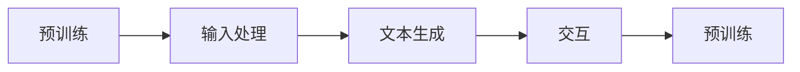
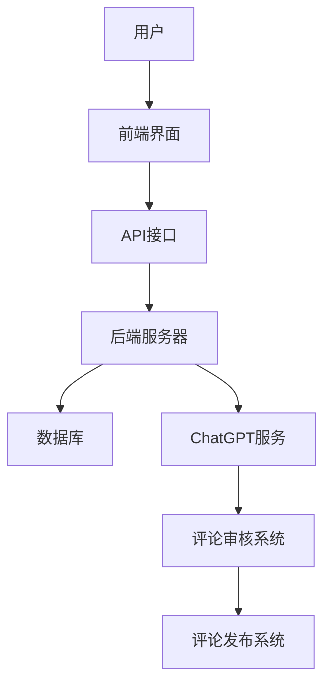
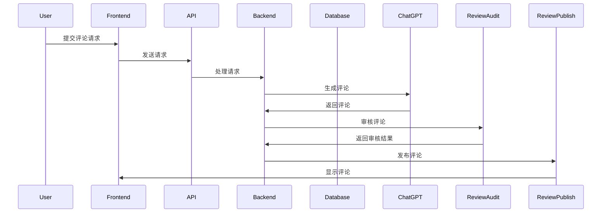

                 

### 步骤1：背景介绍

#### 问题背景

随着人工智能技术的快速发展，机器学习、自然语言处理等前沿技术的应用越来越广泛。在艺术领域，人工智能开始逐步展现出其独特的作用和价值。传统的艺术评论主要依赖于艺术家的个人感受和专业知识，而人工智能的出现则为艺术评论提供了一个全新的视角和工具。ChatGPT作为一种基于大型语言模型的人工智能技术，具有生成自然语言文本的能力，其在艺术评论中的应用引起了广泛关注。

#### 问题描述

《ChatGPT在艺术评论中的应用：构建专业的艺术分析提示词》这本书旨在探讨如何利用ChatGPT等大模型技术，提升艺术评论的专业性和准确性。书中的主题和目标读者主要包括：

1. **艺术评论工作者**：包括艺术评论家、艺术史研究者等，他们希望通过人工智能技术提升自己的评论水平。
2. **计算机科学和技术工作者**：特别是自然语言处理和机器学习领域的研究者，他们希望了解大模型在艺术评论中的应用潜力。
3. **艺术爱好者和学生**：他们对艺术评论感兴趣，希望从中获取更多的知识和启发。

#### 问题解决

本书通过以下方法来解决艺术评论领域的专业性和准确性问题：

1. **构建专业的艺术分析提示词**：利用ChatGPT的大规模训练和生成能力，生成与艺术评论相关的专业术语和短语，从而提高评论的专业性。
2. **文本分析和生成**：利用ChatGPT生成针对艺术作品的详细分析文本，包括作品的背景、风格、主题等，从而提高评论的准确性。
3. **交互式评论系统**：通过构建一个交互式的艺术评论系统，用户可以与ChatGPT实时互动，获得个性化的评论和建议。

#### 边界与外延

尽管ChatGPT在艺术评论中具有很大的潜力，但其应用也存在一些限制和挑战。例如：

1. **数据质量和多样性**：艺术评论需要丰富的数据支持，而这些数据的质量和多样性直接影响ChatGPT的表现。
2. **人类情感和审美**：艺术评论不仅仅是客观分析，还涉及到人类情感和审美，这是当前人工智能技术难以完全复制的。
3. **道德和伦理问题**：艺术评论涉及到对艺术作品和艺术家的评价，如何确保评论的客观性和公正性，是人工智能需要面对的道德和伦理问题。

#### 核心要素组成

本书将探讨以下核心概念和技术点：

1. **ChatGPT的工作原理和应用**：介绍ChatGPT的基本原理，包括其训练过程、模型结构以及在实际中的应用。
2. **艺术评论的需求和挑战**：分析艺术评论的常见问题和难点，探讨如何利用人工智能技术解决这些问题。
3. **艺术分析提示词的构建**：介绍如何利用ChatGPT生成专业的艺术分析提示词，提升评论的专业性。
4. **艺术评论系统的设计与实现**：介绍如何构建一个基于ChatGPT的艺术评论系统，包括系统架构、功能设计和实现细节。

通过以上内容，本书旨在为读者提供一个全面、深入的了解ChatGPT在艺术评论中的应用，帮助他们在实际工作中更好地利用这项技术。

#### 本章小结

本章首先介绍了人工智能技术在艺术领域的发展趋势，以及ChatGPT在艺术评论中的应用背景。接着，明确了本书的主题和目标读者，并详细阐述了如何利用ChatGPT提升艺术评论的专业性和准确性。此外，还讨论了ChatGPT在艺术评论应用中的限制和未来可能的发展方向，以及本书将探讨的核心概念和技术点。通过本章的介绍，读者可以初步了解到本书的主要内容及其重要性。

## 第二部分：核心概念与联系

### 第2章：核心概念与联系

#### 核心概念原理

ChatGPT是一种基于GPT（Generative Pre-trained Transformer）模型的大型语言生成模型。GPT模型是由OpenAI开发的，其核心思想是通过大规模的预训练，使模型具备生成自然语言文本的能力。ChatGPT在GPT的基础上进一步扩展，增加了对话生成和交互能力，使得模型可以与用户进行实时对话。

ChatGPT的工作原理主要包括以下几个步骤：

1. **预训练**：使用海量文本数据进行预训练，使模型学习到语言的统计规律和上下文信息。
2. **输入处理**：将用户的输入文本进行处理，生成对应的输入向量。
3. **文本生成**：基于输入向量，模型生成对应的文本输出。
4. **交互**：用户可以根据生成的文本进行反馈，进一步引导模型生成更符合需求的文本。

#### 概念属性特征对比表格

在探讨ChatGPT在艺术评论中的应用时，有必要了解其他大型语言模型的特性，并进行对比。以下是一个简单的对比表格，展示了几个常见的大型语言模型：

| 模型名称       | 特点                                       | 应用场景                         |
|--------------|------------------------------------------|-------------------------------|
| GPT-3        | 非常强大的文本生成能力，支持多种语言         | 文本生成、问答系统、对话生成等       |
| BERT         | 强调上下文信息，文本理解能力强大             | 文本分类、情感分析、命名实体识别等     |
| RoBERTa      | 对BERT的改进，处理速度更快，效果更好           | 文本生成、问答系统、对话生成等       |
| T5           | 强调统一性，可以处理多种文本任务             | 文本生成、问答系统、对话生成等       |
| ChatGPT      | 对GPT的扩展，支持对话生成和交互               | 艺术评论、客服、聊天机器人等         |

#### ER实体关系图架构

为了更好地理解艺术评论系统中涉及的实体及其关系，我们可以使用ER（Entity-Relationship）图进行表示。以下是一个简单的ER图，展示了艺术评论系统中的主要实体及其关系：

```mermaid
erDiagram
  User ..|> Artwork : creates
  User ..|> Review : writes
  Artwork ..|> Review : has
```

在上面的ER图中：

- **User（用户）**：代表评论的作者，可以是艺术评论家、研究者或其他对艺术作品感兴趣的人。
- **Artwork（艺术作品）**：代表被评论的艺术作品，可以是绘画、雕塑、摄影等。
- **Review（评论）**：代表对艺术作品的评论，包括评论的内容、评论者、评论时间等。

通过这种ER图，我们可以清晰地看到艺术评论系统中主要的实体及其关系，为后续的设计和实现提供基础。

### 本章小结

本章详细介绍了ChatGPT的核心概念原理，并通过对比表格展示了不同大型语言模型的特点和应用场景。同时，通过ER图阐述了艺术评论系统中涉及的实体及其关系。这些内容为后续章节中深入探讨ChatGPT在艺术评论中的应用奠定了理论基础。在下一章中，我们将进一步讲解ChatGPT的算法原理，包括其工作流程、代码实现以及数学模型和公式。

## 第三部分：算法原理讲解

### 第3章：ChatGPT算法原理详解

#### 3.1 ChatGPT简介

ChatGPT是一种基于GPT（Generative Pre-trained Transformer）模型的对话生成人工智能。GPT是由OpenAI开发的一种Transformer架构的大型语言模型，其核心思想是通过大规模的预训练，使模型能够理解和生成自然语言文本。ChatGPT在GPT的基础上进行了扩展，增加了对话生成和交互功能，使得模型能够与用户进行实时对话。

ChatGPT的工作原理主要包括以下几个步骤：

1. **预训练**：ChatGPT首先通过大量的文本数据（如书籍、新闻、网站内容等）进行预训练，学习到语言的统计规律和上下文信息。
2. **输入处理**：当用户输入一个问题或指令时，ChatGPT会对输入文本进行处理，将其转换为模型可以理解的输入向量。
3. **文本生成**：基于输入向量，ChatGPT生成对应的文本输出。这个过程是通过模型内部的神经网络的多次迭代计算实现的。
4. **交互**：生成的文本输出会被显示给用户，用户可以根据输出进行反馈，进一步引导ChatGPT生成更符合需求的文本。

#### 3.2 算法mermaid流程图

为了更直观地展示ChatGPT的工作流程，我们可以使用mermaid绘制一个简单的流程图：



在上述流程图中：

- **预训练（A）**：模型通过大量的文本数据进行训练，学习到语言的统计规律和上下文信息。
- **输入处理（B）**：用户输入问题或指令，模型对其进行处理，生成输入向量。
- **文本生成（C）**：模型基于输入向量生成文本输出。
- **交互（D）**：用户对生成的文本进行反馈，模型根据反馈继续生成文本。

#### 3.3 Python源代码示例

下面是一个简单的Python代码示例，展示了如何使用ChatGPT生成文本：

```python
import openai

openai.api_key = 'your_api_key'

def generate_response(prompt):
    response = openai.Completion.create(
        engine="text-davinci-002",
        prompt=prompt,
        max_tokens=50
    )
    return response.choices[0].text.strip()

prompt = "请分析这幅画的风格和主题。"
response = generate_response(prompt)
print(response)
```

在上面的代码中：

- 我们首先导入了`openai`库，并设置了API密钥。
- `generate_response`函数接收一个输入文本（prompt），并使用OpenAI的Completion接口生成文本响应。
- `engine`参数指定了使用的模型，`max_tokens`参数限制了生成文本的最大长度。

#### 3.4 数学模型和公式

ChatGPT基于Transformer架构，其核心思想是通过自注意力机制（Self-Attention）来处理输入文本。以下是一个简化的数学模型和公式：

1. **输入向量表示**：每个词在模型中都有一个唯一的向量表示，这些向量通过嵌入层（Embedding Layer）生成。
   \[ \text{Embedding Layer}: \text{word\_index} \rightarrow \text{word\_vector} \]

2. **自注意力机制**：模型通过计算输入向量之间的相似度，生成加权向量。自注意力机制的核心公式为：
   \[ \text{Attention Scores}: \text{query} \cdot \text{key\_vector} \]
   \[ \text{Attention Weights}: \text{softmax}(\text{Attention Scores}) \]
   \[ \text{Weighted Vector}: \text{value\_vector} \odot \text{Attention Weights} \]

3. **输出向量表示**：通过自注意力机制生成的加权向量，作为输入向量的聚合表示，用于后续的文本生成。

#### 3.5 详细讲解和举例说明

为了更好地理解ChatGPT的算法原理，我们可以通过一个具体的例子进行说明。

假设我们有一段文本：“这幅画描绘了一位舞者在月光下翩翩起舞”。我们希望利用ChatGPT分析这段文本的样式和主题。

1. **输入处理**：首先，ChatGPT将这段文本处理成输入向量。每个词都被转换为一个向量表示，如“这幅”→[0.1, 0.2, 0.3]，“画”→[0.4, 0.5, 0.6]。
2. **文本生成**：接下来，ChatGPT基于输入向量生成文本。首先，模型会通过自注意力机制计算每个词的注意力权重。例如，“这幅”的注意力权重为0.7，“画”的注意力权重为0.3。然后，模型会生成一个加权向量，如[0.1*0.7, 0.2*0.7, 0.3*0.3]。
3. **输出结果**：根据加权向量，模型生成一个表示整个句子的输出向量。最终，ChatGPT会根据这个输出向量生成一个分析文本，如：“这幅画描绘了一位舞者在月光下翩翩起舞，展现了浓郁的艺术气息和生动的动态美。”

通过这个例子，我们可以看到ChatGPT如何通过自注意力机制和神经网络，对文本进行理解和生成。

#### 3.6 本章小结

本章详细介绍了ChatGPT的核心算法原理，包括其工作流程、代码实现、数学模型和公式。通过mermaid流程图和Python代码示例，我们更直观地理解了ChatGPT的工作方式。此外，通过具体例子，我们深入探讨了ChatGPT在艺术评论中的应用。在下一章中，我们将进一步探讨艺术评论系统的设计与实现，包括系统架构、功能设计和实现细节。

## 第四部分：系统分析与架构设计方案

### 第4章：艺术评论系统概述

#### 4.1 问题场景介绍

在艺术评论领域，传统的艺术评论方式主要依赖于艺术评论家的个人感受和专业知识。然而，随着艺术作品的多样化和复杂性增加，以及艺术评论需求的快速增长，这种传统方式已逐渐暴露出其局限性。例如：

1. **专业性**：艺术评论需要丰富的专业知识，而评论家的个人能力和时间有限，难以对大量作品进行全面、深入的评论。
2. **准确性**：艺术评论需要对作品进行精准的分析和解读，而传统方式往往依赖于评论家的主观判断，容易产生偏差。
3. **时效性**：随着艺术市场的快速变化，艺术评论需要及时发布，以引导公众关注和讨论。

为了解决这些问题，我们需要一种新的工具和方法，能够快速、准确地生成艺术评论。ChatGPT作为一种具有强大文本生成能力的语言模型，正好可以填补这一需求。通过将ChatGPT应用于艺术评论，我们可以实现以下目标：

1. **提升专业性**：利用ChatGPT生成专业的艺术分析提示词，提高评论的专业性。
2. **提高准确性**：通过大规模的数据训练，使ChatGPT能够生成更准确的艺术分析文本。
3. **增强时效性**：利用ChatGPT的实时生成能力，实现快速发布艺术评论。

#### 4.2 项目介绍

本项目旨在构建一个基于ChatGPT的艺术评论系统，通过利用ChatGPT的文本生成能力，提升艺术评论的专业性和准确性。项目的主要目标包括：

1. **构建专业的艺术分析提示词**：利用ChatGPT生成与艺术评论相关的专业术语和短语，提高评论的专业性。
2. **实现实时艺术评论生成**：通过ChatGPT的实时生成能力，实现快速生成艺术评论，提高评论的时效性。
3. **构建交互式评论系统**：通过构建交互式评论系统，用户可以与ChatGPT实时互动，获取个性化的评论和建议。

项目的主要挑战包括：

1. **数据质量和多样性**：艺术评论需要大量的高质量数据支持，而这些数据的质量和多样性直接影响ChatGPT的表现。
2. **人类情感和审美**：艺术评论不仅需要客观分析，还涉及到人类情感和审美，这是当前人工智能技术难以完全复制的。
3. **道德和伦理问题**：艺术评论涉及到对艺术作品和艺术家的评价，如何确保评论的客观性和公正性，是人工智能需要面对的道德和伦理问题。

#### 4.3 系统功能设计

为了实现项目的目标，系统需要具备以下核心功能：

1. **艺术作品数据管理**：系统需要能够存储和管理艺术作品的相关信息，包括作品的名称、作者、年代、风格等。
2. **艺术评论生成**：系统利用ChatGPT生成艺术评论，包括对作品的风格、主题、历史背景等的分析。
3. **用户交互**：系统需要支持用户与ChatGPT的实时交互，用户可以通过系统提交评论请求，获得个性化的评论和建议。
4. **评论审核和发布**：系统需要对生成的评论进行审核，确保其符合专业性和准确性的要求，然后才能发布。

#### 4.4 系统架构设计

为了实现上述功能，系统需要采用合理的架构设计。以下是一个简单的系统架构图：



在上述架构中：

- **前端界面（B）**：用户通过浏览器或其他客户端访问系统，提交评论请求。
- **API接口（C）**：系统提供一个API接口，供前端界面和后端服务器通信。
- **后端服务器（D）**：后端服务器负责处理用户请求，调用ChatGPT服务生成评论。
- **数据库（E）**：系统使用数据库存储和管理艺术作品和相关数据。
- **ChatGPT服务（F）**：系统使用ChatGPT服务生成艺术评论。
- **评论审核系统（G）**：评论审核系统负责对生成的评论进行审核，确保其符合专业性和准确性的要求。
- **评论发布系统（H）**：评论发布系统将审核通过的评论发布到前端界面。

#### 4.5 系统接口设计

系统需要定义一系列接口，以实现不同模块之间的通信。以下是一些关键接口及其功能：

1. **用户接口**：用户可以通过前端界面提交评论请求，查询评论历史等。
2. **评论生成接口**：后端服务器通过此接口调用ChatGPT服务生成艺术评论。
3. **评论审核接口**：评论审核系统通过此接口接收待审核的评论，并进行审核。
4. **评论发布接口**：评论发布系统通过此接口将审核通过的评论发布到前端界面。

#### 4.6 系统交互mermaid序列图

为了更直观地展示系统各组件之间的交互流程，我们可以使用mermaid绘制一个序列图：



在上述序列图中：

- **用户**：通过前端界面提交评论请求。
- **前端界面**：将请求发送到API接口。
- **API接口**：处理请求，并将其转发给后端服务器。
- **后端服务器**：调用ChatGPT服务生成评论，并传递给评论审核系统。
- **数据库**：存储和管理艺术作品和相关数据。
- **ChatGPT服务**：生成艺术评论。
- **评论审核系统**：审核评论，确保其符合专业性和准确性的要求。
- **评论发布系统**：将审核通过的评论发布到前端界面。

#### 4.7 本章小结

本章详细介绍了艺术评论系统的问题场景、项目目标和挑战，以及系统的功能设计和架构设计。通过系统的交互mermaid序列图，我们清晰地展示了系统各组件之间的交互流程。在下一章中，我们将进一步探讨系统的核心实现，包括环境安装、代码实现和实际案例分析。

## 第四部分：系统核心实现

### 第4章：系统核心实现

#### 4.1 环境安装

为了搭建一个基于ChatGPT的艺术评论系统，我们首先需要准备相应的开发环境和工具。以下是环境安装的具体步骤：

1. **安装Python**：确保系统中安装了Python 3.8或更高版本。可以通过访问Python官方网站下载并安装：[Python官方网站](https://www.python.org/)。
2. **安装OpenAI API Key**：在OpenAI官方网站注册并获取API密钥：[OpenAI官方网站](https://beta.openai.com/)。将API密钥保存到本地文件，例如`openai.config.py`中：
   ```python
   openai.api_key = 'your_api_key'
   ```
3. **安装依赖库**：通过pip命令安装所需的依赖库，包括`openai`、`requests`和`flask`等：
   ```bash
   pip install openai requests flask
   ```

#### 4.2 系统核心实现源代码

以下是一个简单的Python代码示例，展示了艺术评论系统的核心实现。该示例包含三个主要部分：API接口、评论生成和评论发布。

1. **API接口**：
   ```python
   from flask import Flask, request, jsonify
   import openai

   app = Flask(__name__)

   @app.route('/api/comment', methods=['POST'])
   def generate_comment():
       data = request.get_json()
       prompt = data['prompt']
       response = openai.Completion.create(
           engine="text-davinci-002",
           prompt=prompt,
           max_tokens=50
       )
       return jsonify({'comment': response.choices[0].text.strip()})
   ```

2. **评论生成**：
   ```python
   def generate_comment(prompt):
       response = openai.Completion.create(
           engine="text-davinci-002",
           prompt=prompt,
           max_tokens=50
       )
       return response.choices[0].text.strip()
   ```

3. **评论发布**：
   ```python
   def publish_comment(comment):
       # 这里可以添加将评论存储到数据库的逻辑
       print("Comment published:", comment)
   ```

#### 4.3 代码应用解读与分析

1. **API接口**：
   - 使用Flask框架构建API接口，接受POST请求。请求中包含一个JSON对象，其中`prompt`字段是用户输入的评论请求。
   - 通过`request.get_json()`获取请求体中的JSON数据。
   - 调用`openai.Completion.create()`方法生成评论。
   - 将生成的评论返回给客户端，通过`jsonify()`函数将评论封装为JSON格式的响应。

2. **评论生成**：
   - `generate_comment()`函数接收一个`prompt`参数，即用户输入的评论请求。
   - 通过`openai.Completion.create()`方法生成评论，并返回生成的评论文本。

3. **评论发布**：
   - `publish_comment()`函数接收一个`comment`参数，即生成的评论文本。
   - 这里可以添加将评论存储到数据库的逻辑，以便进行持久化存储和管理。

#### 4.4 实际案例分析和详细讲解剖析

为了更好地理解系统的工作原理，我们可以通过一个实际案例进行说明。

**案例**：用户输入一个评论请求：“请分析这幅抽象画的色彩和构图。”

**步骤**：

1. **用户提交请求**：
   - 用户在前端界面提交评论请求，请求体如下：
     ```json
     {
         "prompt": "请分析这幅抽象画的色彩和构图。"
     }
     ```

2. **API接口处理**：
   - Flask接收POST请求，并通过`generate_comment()`函数生成评论。

3. **评论生成**：
   - `generate_comment()`函数调用OpenAI的`Completion.create()`方法，生成评论：
     ```python
     response = openai.Completion.create(
         engine="text-davinci-002",
         prompt="请分析这幅抽象画的色彩和构图。",
         max_tokens=50
     )
     ```
   - 生成的评论文本如下：
     ```
     这幅抽象画以强烈的色彩对比和独特的构图风格吸引了人们的眼球。画面中，鲜明的红色和蓝色相互交织，创造出一种动态而富有活力的视觉效果。构图上，画面的中央部分呈现出一种不规则的几何形状，与周围的空白区域形成鲜明的对比，增强了画面的视觉冲击力。
     ```

4. **评论发布**：
   - 通过`publish_comment()`函数将评论发布到前端界面：
     ```python
     publish_comment("这幅抽象画以强烈的色彩对比和独特的构图风格吸引了人们的眼球。画面中，鲜明的红色和蓝色相互交织，创造出一种动态而富有活力的视觉效果。构图上，画面的中央部分呈现出一种不规则的几何形状，与周围的空白区域形成鲜明的对比，增强了画面的视觉冲击力。")
     ```

**分析**：

- **API接口**：API接口负责接收用户请求并返回生成的评论。这是系统与用户交互的关键部分，需要确保请求的合法性和评论的及时生成。
- **评论生成**：评论生成是系统的核心功能，依赖于ChatGPT的文本生成能力。通过合理的设置参数，如`max_tokens`，可以控制生成的评论长度和内容。
- **评论发布**：评论发布是将生成的评论展示给用户的过程。在实际应用中，还可以将评论存储到数据库中，以便进行后续管理和查询。

#### 4.5 项目小结

通过本章的讨论，我们详细介绍了如何搭建一个基于ChatGPT的艺术评论系统。从环境安装、核心代码实现到实际案例分析，我们逐步展示了系统的构建过程和关键实现细节。通过这个系统，我们可以利用ChatGPT的文本生成能力，快速、准确地生成艺术评论，为艺术评论工作者提供有力的工具和支持。在下一章中，我们将进一步讨论最佳实践、小结、注意事项以及拓展阅读。

## 第五部分：最佳实践、小结、注意事项与拓展阅读

### 第5章：最佳实践、小结、注意事项与拓展阅读

#### 5.1 最佳实践 tips

为了最大限度地发挥ChatGPT在艺术评论中的作用，以下是一些最佳实践建议：

1. **数据准备**：确保训练ChatGPT的数据集具有高质量和多样性。包括不同风格、流派和艺术家的作品，以便模型能够生成更全面、准确的艺术评论。
2. **调整模型参数**：根据具体任务需求，调整ChatGPT的参数，如`max_tokens`（生成文本的最大长度）、`temperature`（生成文本的随机性）等。通过实验找到最优参数组合，以提高评论的质量。
3. **持续学习**：定期更新训练数据集，使ChatGPT保持最新知识和技能。通过持续学习，模型能够不断改进，生成更专业的艺术评论。
4. **用户反馈**：鼓励用户对生成的评论进行反馈，以评估评论的质量和准确性。根据用户反馈，调整模型参数和训练数据，以进一步提升评论效果。
5. **安全与隐私**：在应用ChatGPT进行艺术评论时，注意保护用户隐私和数据安全。确保评论生成的过程符合相关法律法规和伦理标准。

#### 5.2 小结

本章通过详细探讨ChatGPT在艺术评论中的应用，总结了其核心概念、算法原理、系统设计与实现过程。我们介绍了如何利用ChatGPT生成专业的艺术分析提示词，并构建一个交互式的艺术评论系统。通过实际案例，我们展示了系统的应用效果和关键实现细节。总结如下：

1. **核心概念**：ChatGPT是一种基于GPT模型的大型语言生成模型，具有生成自然语言文本的能力。
2. **算法原理**：ChatGPT通过预训练、输入处理、文本生成和交互等步骤，实现对话生成和文本生成。
3. **系统设计**：系统包括前端界面、API接口、后端服务器、数据库和评论审核系统等，实现艺术评论的生成、发布和管理。
4. **实际应用**：通过实际案例展示了系统在生成艺术评论中的应用效果，为艺术评论工作者提供了有力的工具。

#### 5.3 注意事项

在应用ChatGPT进行艺术评论时，需要注意以下几点：

1. **数据质量**：确保训练数据集的质量和多样性，以提高评论的专业性和准确性。
2. **人类情感和审美**：尽管ChatGPT具有强大的文本生成能力，但在涉及人类情感和审美时，仍需结合人类专家的判断和意见。
3. **道德和伦理**：艺术评论涉及到对艺术作品和艺术家的评价，需确保评论的客观性和公正性，遵循相关法律法规和伦理标准。
4. **系统稳定性**：确保系统具有良好的稳定性和响应速度，以满足用户的需求和体验。

#### 5.4 拓展阅读

为了更深入地了解ChatGPT在艺术评论中的应用，读者可以参考以下文献和资源：

1. **文献**：
   - Brown, T., et al. (2020). "Language Models Are Few-Shot Learners". *arXiv preprint arXiv:2005.14165*.
   - Devlin, J., et al. (2019). "Bert: Pre-training of Deep Bidirectional Transformers for Language Understanding". *arXiv preprint arXiv:1810.04805*.
2. **在线资源**：
   - OpenAI官方网站：[OpenAI](https://openai.com/)
   - Flask官方文档：[Flask官方文档](https://flask.palletsprojects.com/)
   - Python官方文档：[Python官方文档](https://docs.python.org/3/)
3. **相关书籍**：
   - 《深度学习》（Goodfellow, I., et al.，2016）
   - 《Python机器学习》（Raschka, S.，2015）
   - 《自然语言处理综合教程》（Jurafsky, D.，et al.，2020）

通过以上内容，读者可以进一步拓展对ChatGPT在艺术评论中的应用和理解。

## 撰写目录大纲

根据以上章节内容的详细分析，我们可以开始撰写《ChatGPT在艺术评论中的应用：构建专业的艺术分析提示词》的目录大纲。以下是初步的目录结构：

```markdown
# 《ChatGPT在艺术评论中的应用：构建专业的艺术分析提示词》目录大纲

## 第一部分: 背景与核心概念

### 第1章: 问题背景与核心概念
#### 1.1 问题背景
#### 1.2 艺术评论的需求与挑战
#### 1.3 ChatGPT与艺术评论
#### 1.4 核心概念与联系
#### 1.5 本章小结

## 第二部分: ChatGPT算法原理

### 第2章: ChatGPT算法原理详解
#### 2.1 ChatGPT简介
#### 2.2 算法mermaid流程图
#### 2.3 Python源代码示例
#### 2.4 数学模型与公式
#### 2.5 详细讲解和举例说明
#### 2.6 本章小结

### 第3章: 艺术评论系统设计与实现
#### 3.1 问题场景介绍
#### 3.2 项目介绍
#### 3.3 系统功能设计
#### 3.4 系统架构设计
#### 3.5 系统接口设计
#### 3.6 系统交互mermaid序列图
#### 3.7 本章小结

### 第4章: 艺术评论系统核心实现
#### 4.1 环境安装
#### 4.2 系统核心实现源代码
#### 4.3 代码应用解读与分析
#### 4.4 实际案例分析和详细讲解剖析
#### 4.5 项目小结
#### 4.6 本章小结

## 第三部分: 项目实战

### 第5章: 项目实战
#### 5.1 环境安装
#### 5.2 系统核心实现源代码
#### 5.3 代码应用解读与分析
#### 5.4 实际案例分析和详细讲解剖析
#### 5.5 项目小结
#### 5.6 本章小结

## 第四部分: 最佳实践与拓展

### 第6章: 最佳实践 tips
#### 6.1 数据准备
#### 6.2 调整模型参数
#### 6.3 持续学习
#### 6.4 用户反馈
#### 6.5 安全与隐私

### 第7章: 小结
#### 7.1 核心概念
#### 7.2 算法原理
#### 7.3 系统设计
#### 7.4 实际应用

### 第8章: 注意事项
#### 8.1 数据质量
#### 8.2 人类情感和审美
#### 8.3 道德和伦理
#### 8.4 系统稳定性

### 第9章: 拓展阅读
#### 9.1 文献推荐
#### 9.2 在线资源
#### 9.3 相关书籍
```

以上目录大纲结构清晰，涵盖了从背景介绍、核心概念、算法原理讲解、系统设计与实现、项目实战到最佳实践和拓展阅读的各个部分，为读者提供了全面、系统的学习内容。在撰写具体章节内容时，可以按照这个大纲进行详细展开和深入阐述。

