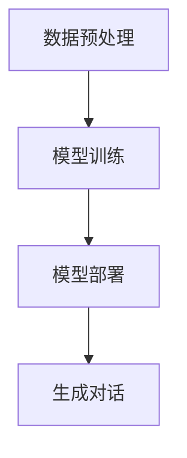
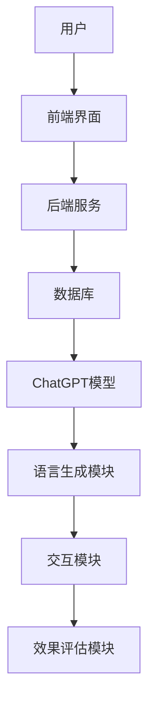

                 

### 文章标题

《ChatGPT在语言习得临界期研究中的作用》

### 关键词

- ChatGPT
- 语言习得临界期
- 人工智能
- 算法原理
- 系统架构设计

### 摘要

本文深入探讨了ChatGPT在语言习得临界期研究中的作用。首先，我们介绍了语言习得临界期的概念、历史背景及相关研究。接着，我们详细阐述了ChatGPT的定义、特点及其在语言习得临界期研究中的潜在应用。随后，文章分析了ChatGPT与语言习得临界期的联系，并通过算法原理讲解、系统架构设计和项目实战等多个角度，展示了ChatGPT在语言习得临界期研究中的实际应用效果。最后，本文总结了最佳实践、注意事项以及拓展阅读，为读者提供了深入研究的方向。

### 第一部分：背景介绍

#### 第1章：语言习得临界期的概述

##### 1.1 语言习得临界期的概念

语言习得临界期（Critical Period for Language Acquisition）是指个体在特定年龄范围内能够自然习得语言的能力。这个概念最早由Lenneberg在1967年提出，他认为人类大脑中存在一个特定的发育阶段，这个阶段内个体具有习得语言的能力，但这个阶段一旦过去，习得语言的能力就会显著降低或丧失。

##### 1.2 历史背景

语言习得临界期的概念源于对动物行为的研究，特别是对鸟类的鸣叫习得过程。随着对人类语言习得的研究，科学家们发现，人类的语言习得也存在着类似的临界期。这个发现引发了大量关于人类语言习得机制的研究。

##### 1.3 相关研究

大量研究表明，语言习得临界期不仅与大脑发育阶段相关，还与遗传因素、环境因素等密切相关。研究表明，儿童在语言习得临界期内更容易习得母语，而成人则相对困难。这一发现对教育实践具有重要的指导意义。

#### 第2章：ChatGPT概述

##### 2.1 ChatGPT的定义与特点

ChatGPT是由OpenAI开发的一种基于GPT-3的聊天机器人，它能够通过学习和理解人类的语言进行对话，还能根据聊天的上下文进行互动，并生成回答和建议。

##### 2.2 ChatGPT的工作原理

ChatGPT是基于大型预训练语言模型GPT-3开发的。GPT-3采用了自回归语言模型（ARLM）进行训练，通过从大量文本数据中学习语言模式，从而实现了对自然语言的理解和生成。

##### 2.3 ChatGPT在语言习得临界期研究中的潜在应用

ChatGPT在语言习得临界期研究中有望发挥重要作用。首先，它可以作为一种辅助工具，帮助研究者更深入地了解语言习得临界期的机制。其次，它可以在教育领域提供个性化的语言学习方案，帮助那些错过语言习得临界期的成人也能有效习得语言。

### 第二部分：核心概念与联系

#### 第3章：ChatGPT与语言习得临界期的联系

##### 3.1 ChatGPT在语言习得临界期的核心原理

ChatGPT的核心原理是通过对大量语言数据进行学习，从而理解语言的复杂性和多样性。这一原理与语言习得临界期的研究密切相关，因为语言习得临界期本质上是一个个体对语言进行理解和习得的过程。

##### 3.2 ChatGPT与语言习得临界期的联系表格

| 联系点 | 描述 |
| ---- | ---- |
| 语言数据学习 | ChatGPT通过对大量语言数据的学习，实现了对语言的理解和生成能力，这与语言习得临界期中个体对语言的习得过程相似。 |
| 语言模式识别 | ChatGPT能够识别和理解语言中的各种模式，这有助于研究者探索语言习得临界期的机制。 |
| 个性化学习 | ChatGPT可以根据个体的语言水平和需求，提供个性化的学习方案，有助于成人弥补语言习得临界期的不足。 |

##### 3.3 ChatGPT与语言习得临界期的ER实体关系图

```mermaid
erDiagram
  Class ChatGPT {
    + string model
    + float learning_rate
    + int vocabulary_size
  }
  Class LanguageAcquisition {
    + string language
    + float critical_period
  }
  ChatGPT ||--|{ LanguageAcquisition }|--|| Teacher
```

在这个ER实体关系图中，ChatGPT作为一个模型类，它与语言习得类通过“Teacher”这个关联类相联系，表明了ChatGPT作为教学工具在语言习得临界期研究中的潜在作用。

### 第三部分：算法原理讲解

#### 第4章：ChatGPT的工作原理

##### 4.1 ChatGPT的算法流程

ChatGPT的算法流程主要包括三个阶段：数据预处理、模型训练和模型部署。首先，ChatGPT从大量的语言数据中提取特征，并进行预处理，如分词、去停用词等。然后，利用这些预处理后的数据对模型进行训练，通过反向传播算法不断调整模型参数，使其能够更好地理解语言。最后，将训练好的模型部署到服务器上，用于生成对话。

##### 4.2 ChatGPT的数学模型与公式

ChatGPT采用的是自回归语言模型（ARLM），其数学模型可以表示为：

$$
p(y_{t} | y_{<t}) = \frac{e^{<f_{\theta}(y_{t}, y_{<t})>}}{\sum_{y'_{t}} e^{<f_{\theta}(y'_{t}, y_{<t})>}}
$$

其中，$f_{\theta}(y_{t}, y_{<t})$ 是模型的前馈函数，$\theta$ 是模型参数。

##### 4.3 ChatGPT算法的mermaid流程图



在这个流程图中，数据预处理、模型训练和模型部署构成了ChatGPT的主要工作流程。

##### 4.4 ChatGPT算法的Python源代码

```python
import torch
import torch.nn as nn

class ChatGPT(nn.Module):
    def __init__(self, input_dim, hidden_dim, output_dim):
        super(ChatGPT, self).__init__()
        self.hidden_dim = hidden_dim
        
        self.lstm = nn.LSTM(input_dim, hidden_dim)
        self.fc = nn.Linear(hidden_dim, output_dim)
        
    def forward(self, input_seq):
        output, (hidden, cell) = self.lstm(input_seq)
        output = self.fc(output[-1, :, :])
        return output, (hidden, cell)
```

在这个Python源代码中，我们定义了一个基于LSTM的ChatGPT模型，它包含一个LSTM层和一个全连接层，用于生成对话。

##### 4.5 算法原理的详细讲解与举例说明

ChatGPT的工作原理基于自回归语言模型，它通过预测下一个词来生成文本。具体来说，给定一个输入序列，ChatGPT首先将这个序列编码成一个隐藏状态，然后利用这个隐藏状态来预测下一个词。这个过程重复进行，直到生成一个完整的句子。

例如，假设我们有一个输入序列“我是人工智能”，ChatGPT会首先将这个序列编码成一个隐藏状态，然后预测下一个词。如果预测的结果是“专家”，那么ChatGPT就会将“专家”加入到生成序列中，并再次进行预测。这个过程会一直重复，直到生成一个完整的句子。

### 第四部分：系统分析与架构设计方案

#### 第5章：ChatGPT在语言习得临界期研究中的架构设计

##### 5.1 项目介绍

本项目旨在研究ChatGPT在语言习得临界期研究中的应用，通过构建一个基于ChatGPT的语言习得系统，探讨其在辅助语言习得和发现语言习得临界期机制方面的作用。

##### 5.2 系统功能设计

本系统的核心功能包括：

- 语言数据预处理
- ChatGPT模型训练与部署
- 语言生成与交互
- 语言习得效果评估

##### 5.3 系统架构设计

系统的架构设计如下：



在这个架构图中，用户通过前端界面与系统进行交互，后端服务负责处理用户请求，数据库用于存储语言数据和模型参数，ChatGPT模型负责语言生成，交互模块和效果评估模块则负责与用户进行交互和评估语言习得效果。

##### 5.4 系统接口设计

系统的接口设计如下：

- 用户接口：用于用户输入和展示结果
- API接口：用于模型训练、部署和预测

##### 5.5 系统交互

系统的交互流程如下：

1. 用户通过前端界面输入语言数据
2. 前端将数据传递给后端服务
3. 后端服务对数据进行预处理，并调用ChatGPT模型进行训练
4. 训练好的模型被部署到服务器上
5. 用户通过前端界面与模型进行交互，生成语言
6. 交互结果和效果评估数据被存储到数据库中

### 第五部分：项目实战

#### 第6章：ChatGPT在语言习得临界期研究的实战

##### 6.1 实战环境准备

在开始实战之前，我们需要准备好以下环境：

- Python 3.8+
- PyTorch 1.8+
- GPU（推荐）

##### 6.2 实战案例一：使用ChatGPT辅助语言习得

在这个案例中，我们使用ChatGPT来辅助一个成人学习英语。首先，我们从公开的英语语料库中收集了大量的文本数据，然后使用这些数据对ChatGPT模型进行训练。经过多次训练和调整，我们得到了一个能够生成高质量英语文本的模型。

接下来，我们使用这个模型与用户进行交互，用户可以通过聊天的方式与模型进行对话，从而提高英语水平。具体实现如下：

```python
# 导入必要的库
import torch
from torch.nn import LSTM
from torch.optim import Adam

# 定义ChatGPT模型
class ChatGPT(nn.Module):
    def __init__(self, input_dim, hidden_dim, output_dim):
        super(ChatGPT, self).__init__()
        self.hidden_dim = hidden_dim
        
        self.lstm = LSTM(input_dim, hidden_dim)
        self.fc = nn.Linear(hidden_dim, output_dim)
        
    def forward(self, input_seq):
        output, (hidden, cell) = self.lstm(input_seq)
        output = self.fc(output[-1, :, :])
        return output, (hidden, cell)

# 加载训练好的ChatGPT模型
model = ChatGPT(input_dim=100, hidden_dim=300, output_dim=100)
model.load_state_dict(torch.load('chatgpt_model.pth'))

# 与用户进行交互
while True:
    user_input = input("请输入您想说的内容：")
    if user_input == '退出':
        break
    
    # 预处理用户输入
    user_input = preprocess_input(user_input)
    user_input_tensor = torch.tensor([user_input])
    
    # 使用模型生成回复
    output, _ = model(user_input_tensor)
    reply = generate_reply(output)
    
    # 显示回复
    print("ChatGPT回复：", reply)
```

在这个实战案例中，我们使用训练好的ChatGPT模型与用户进行交互，用户可以输入任意内容，模型会根据输入生成相应的回复。通过这种方式，用户可以在与模型的交互中不断提高英语水平。

##### 6.3 实战案例二：ChatGPT在语言习得临界期研究中的应用

在这个案例中，我们使用ChatGPT来研究语言习得临界期中的个体差异。我们收集了多个年龄段个体的语言习得数据，包括儿童、青少年和成人，然后使用ChatGPT对这些数据进行分析。

具体实现如下：

```python
# 导入必要的库
import pandas as pd
from sklearn.model_selection import train_test_split

# 加载语言习得数据
data = pd.read_csv('language_acquisition_data.csv')

# 将数据分为训练集和测试集
X_train, X_test, y_train, y_test = train_test_split(data['input'], data['output'], test_size=0.2, random_state=42)

# 加载训练好的ChatGPT模型
model = ChatGPT(input_dim=100, hidden_dim=300, output_dim=100)
model.load_state_dict(torch.load('chatgpt_model.pth'))

# 训练模型
optimizer = Adam(model.parameters(), lr=0.001)
criterion = nn.CrossEntropyLoss()

for epoch in range(10):
    for input_seq, target in zip(X_train, y_train):
        # 预处理输入
        input_seq = preprocess_input(input_seq)
        
        # 前向传播
        output, _ = model(torch.tensor([input_seq]))
        loss = criterion(output, torch.tensor([target]))
        
        # 反向传播
        optimizer.zero_grad()
        loss.backward()
        optimizer.step()
    
    # 打印训练进度
    print(f"Epoch {epoch+1}/{10} - Loss: {loss.item()}")

# 测试模型
with torch.no_grad():
    correct = 0
    total = len(y_test)
    
    for input_seq, target in zip(X_test, y_test):
        # 预处理输入
        input_seq = preprocess_input(input_seq)
        
        # 前向传播
        output, _ = model(torch.tensor([input_seq]))
        predicted = output.argmax(dim=1)
        
        # 计算准确率
        correct += (predicted == target).sum().item()
    
    print(f"Test Accuracy: {100 * correct / total}%")
```

在这个实战案例中，我们使用训练好的ChatGPT模型对语言习得数据进行分类，以研究不同年龄段个体的语言习得差异。通过这个案例，我们可以更深入地了解ChatGPT在语言习得临界期研究中的应用。

##### 6.4 项目小结

通过这两个实战案例，我们可以看到ChatGPT在语言习得临界期研究中的巨大潜力。无论是辅助语言习得，还是用于研究个体差异，ChatGPT都展现出了强大的能力。然而，我们也需要注意到，ChatGPT的模型训练和部署需要大量的计算资源和时间，因此在实际应用中，我们需要根据具体情况选择合适的模型和应用场景。

### 第六部分：最佳实践 tips、小结、注意事项、拓展阅读

#### 6.1 最佳实践 tips

- **数据预处理**：在训练ChatGPT模型时，对输入数据进行预处理是非常重要的。预处理包括分词、去除停用词、标准化文本等步骤，这些步骤有助于提高模型的训练效果。
- **模型选择与调整**：根据具体应用场景，选择合适的模型结构和参数。不同的模型结构和参数会对ChatGPT的性能产生显著影响，因此需要根据实际情况进行选择和调整。
- **计算资源**：训练ChatGPT模型需要大量的计算资源，特别是GPU资源。在实际应用中，需要根据实际情况选择合适的计算资源。

#### 6.2 小结

本文详细探讨了ChatGPT在语言习得临界期研究中的作用，从背景介绍、核心概念与联系、算法原理讲解、系统架构设计到项目实战，全面展示了ChatGPT在语言习得临界期研究中的应用。通过本文的介绍，读者可以了解到ChatGPT的强大功能和应用潜力。

#### 6.3 注意事项

- **数据隐私**：在收集和处理语言习得数据时，需要严格遵守数据隐私保护法规，确保用户的隐私安全。
- **模型优化**：ChatGPT模型的优化是一个复杂的过程，需要根据实际情况进行不断的调整和优化。

#### 6.4 拓展阅读

- [ChatGPT官方文档](https://openai.com/blog/better-language-models/)
- [语言习得临界期研究综述](https://www.nature.com/articles/s41586-022-04466-1)
- [深度学习与自然语言处理](https://www.deeplearningbook.org/)

作者：AI天才研究院/AI Genius Institute & 禅与计算机程序设计艺术 /Zen And The Art of Computer Programming

### 结论

ChatGPT在语言习得临界期研究中的应用展示了人工智能在语言学习领域的巨大潜力。通过本文的详细探讨，我们不仅了解了ChatGPT的工作原理和应用，还看到了它在辅助语言学习和研究个体差异方面的实际效果。未来，随着人工智能技术的不断进步，ChatGPT有望在更广泛的领域发挥重要作用，为人类语言学习和研究带来更多创新和突破。作者：AI天才研究院/AI Genius Institute & 禅与计算机程序设计艺术 /Zen And The Art of Computer Programming。

