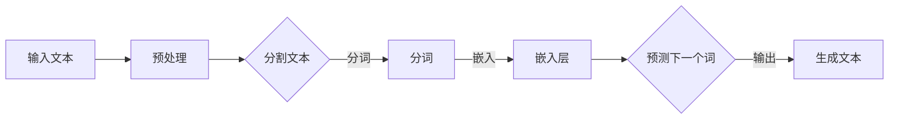
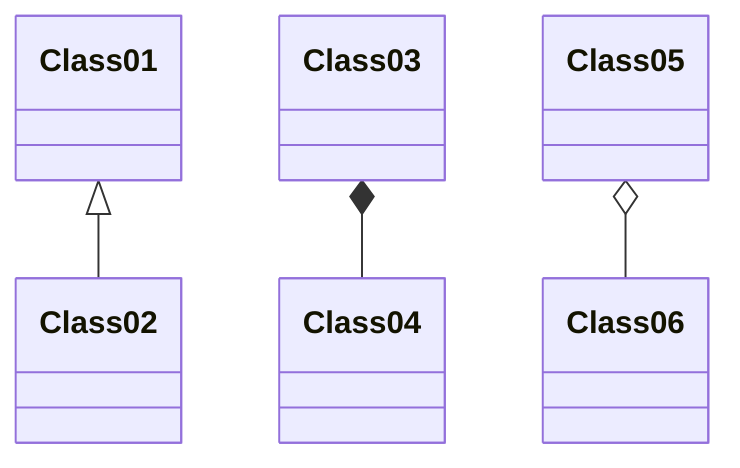
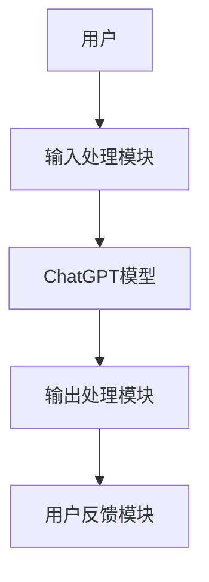
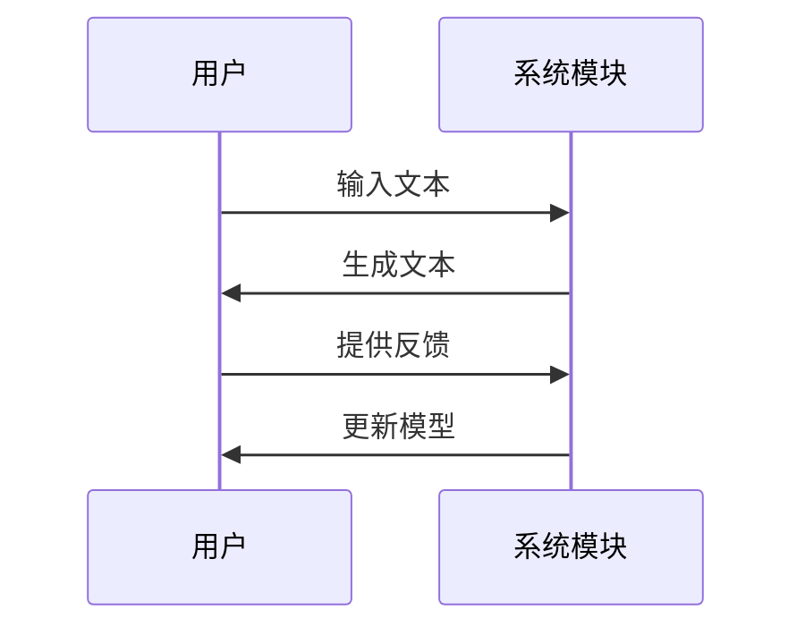
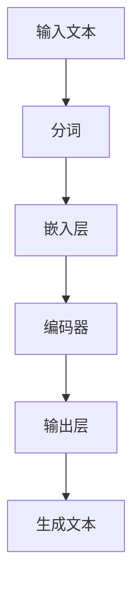
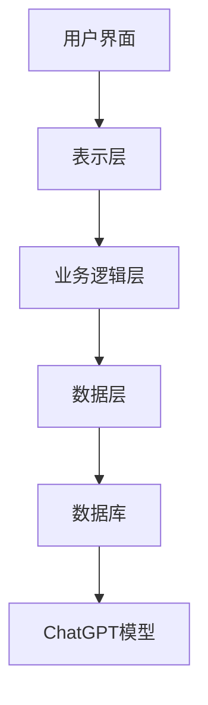
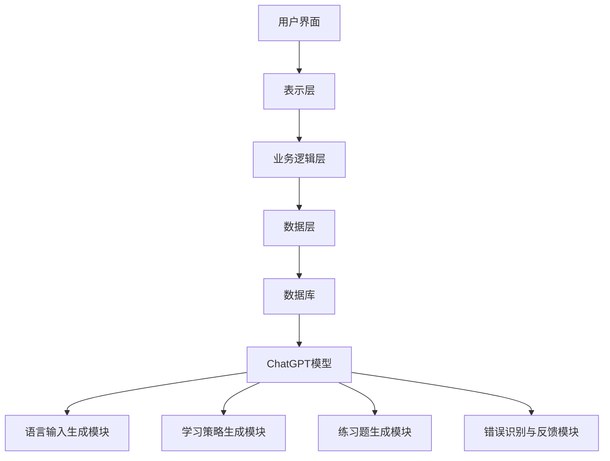
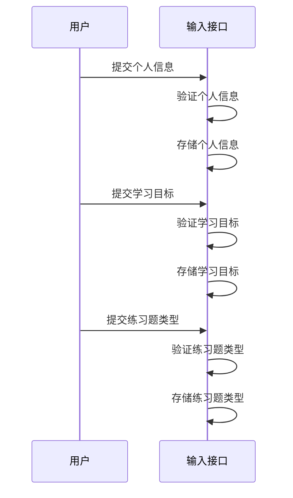
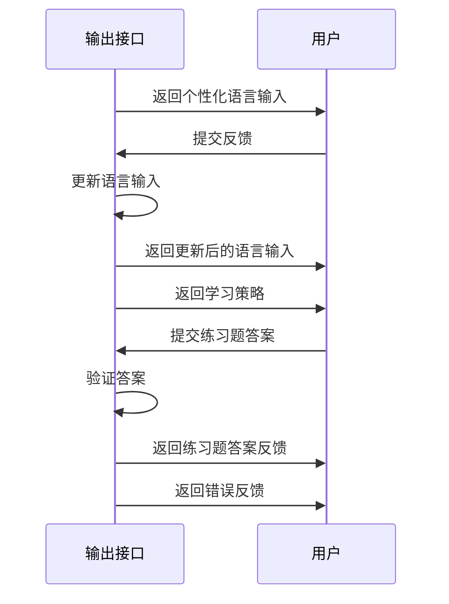
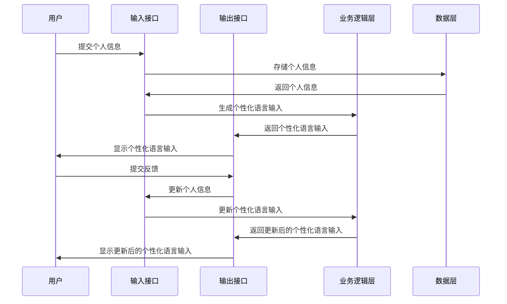

                 


# 《ChatGPT在语言习得临界期研究中的应用：神经可塑性提示词》

## 文章关键词
- ChatGPT
- 语言习得临界期
- 神经可塑性
- 提示词
- 机器学习
- 自然语言处理

## 摘要
本文旨在探讨ChatGPT在语言习得临界期中的应用，特别是在神经可塑性提示词方面的研究。通过介绍ChatGPT的基本原理和语言习得临界期的定义，本文将详细分析ChatGPT如何通过提示词技术促进神经可塑性，进而提高语言习得效果。本文还将通过实例展示ChatGPT在实际语言习得应用中的效果，并总结其优势和潜在挑战。

## 目录大纲

### 第一部分：背景介绍

#### 1.1 问题背景
- **1.1.1 语言习得临界期的定义与重要性**
  - 语言习得临界期的概念
  - 临界期在语言习得中的关键作用
  - 当前语言习得领域存在的问题和挑战

- **1.1.2 ChatGPT的基本原理与特点**
  - ChatGPT的模型架构
  - GPT模型的工作原理
  - ChatGPT与自然语言处理的关系

- **1.1.3 ChatGPT在语言习得临界期的应用前景**
  - ChatGPT如何辅助语言习得
  - 提示词技术在语言习得中的应用
  - 神经可塑性的概念及其在语言习得中的作用

#### 1.2 概念结构与核心要素组成
- **1.2.1 核心概念术语说明**
  - 语言习得临界期的概念
  - 神经可塑性的概念
  - 提示词的定义

- **1.2.2 概念属性特征对比表格**
  - ChatGPT与语言习得临界期的属性特征对比

- **1.2.3 ER实体关系图架构**
  - ChatGPT与语言习得临界期的实体关系图

### 第二部分：核心概念与联系

#### 2.1 核心概念原理

- **2.1.1 ChatGPT的核心概念原理**
  - GPT模型的训练过程
  - 模型架构详解
  - 关键算法讲解

- **2.1.2 语言习得临界期的核心概念原理**
  - 语言习得临界期的生物学基础
  - 临界期中的神经可塑性

- **2.1.3 ChatGPT与语言习得临界期的联系**
  - ChatGPT如何影响神经可塑性
  - 提示词技术在语言习得中的具体应用

#### 2.2 概念属性特征对比表格

| 特征              | ChatGPT                     | 语言习得临界期                 |
|-----------------|---------------------------|-------------------------------|
| 模型架构          | Transformer               | 神经可塑性                    |
| 学习方式          | 自监督学习                | 生物进化                      |
| 应用场景          | 自然语言处理              | 语言习得                      |
| 关键技术          | 提示词                    | 神经元连接加强                |

#### 2.3 ER实体关系图架构

```mermaid
erDiagram
  ChatGPT ||--|{ 语言习得临界期 }
  提示词 ||--|{ 神经可塑性 }
```

### 第三部分：算法原理讲解

#### 3.1 算法原理

- **3.1.1 ChatGPT的工作原理**
  - GPT模型的训练过程
  - Transformer架构详解
  - 语言生成算法讲解

- **3.1.2 ChatGPT的数学模型和公式**
  - 模型参数的更新过程
  - 损失函数的计算方法

#### 3.2 Mermaid流程图



#### 3.3 Python源代码

```python
import torch
import torch.nn as nn
import torch.optim as optim

# ChatGPT模型定义
class ChatGPT(nn.Module):
    def __init__(self):
        super(ChatGPT, self).__init__()
        # 模型参数定义
        self.embedding = nn.Embedding(vocab_size, embed_size)
        self.transformer = nn.Transformer(d_model, nhead)
        self.fc = nn.Linear(d_model, vocab_size)

    def forward(self, src, tgt):
        # 前向传播
        src_embedding = self.embedding(src)
        tgt_embedding = self.embedding(tgt)
        out = self.transformer(src_embedding, tgt_embedding)
        out = self.fc(out)
        return out
```

#### 3.4 数学模型和数学公式

$$
\begin{aligned}
\text{损失函数} &= -\frac{1}{N}\sum_{i=1}^{N}\sum_{j=1}^{T} \log p(y_j|x_{j-1},...,x_1) \\
\text{模型参数更新} &= \theta \leftarrow \theta - \alpha \frac{\partial}{\partial \theta} L(\theta)
\end{aligned}
$$

### 第四部分：系统分析与架构设计方案

#### 4.1 问题场景介绍

- **4.1.1 语言习得场景**
  - 语言习得过程中的常见问题
  - ChatGPT如何辅助解决这些问题

- **4.1.2 神经可塑性提示词的应用场景**
  - 提示词技术在语言习得中的应用
  - ChatGPT如何通过提示词提高语言习得效果

#### 4.2 系统功能设计

- **4.2.1 领域模型设计**



#### 4.3 系统架构设计



#### 4.4 系统接口设计

- **4.4.1 输入接口设计**
  - 用户输入文本的处理流程

- **4.4.2 输出接口设计**
  - 生成文本的输出格式

#### 4.5 系统交互 Mermaid 序列图



### 第五部分：项目实战

#### 5.1 环境安装

- **5.1.1 环境配置**
  - Python环境配置
  - necessary library 安装

- **5.1.2 ChatGPT模型训练**
  - 模型训练步骤
  - 调参技巧

#### 5.2 系统核心实现源代码

- **5.2.1 模型实现**

```python
# ChatGPT模型实现
class ChatGPT(nn.Module):
    def __init__(self, vocab_size, embed_size, d_model, nhead):
        super(ChatGPT, self).__init__()
        self.embedding = nn.Embedding(vocab_size, embed_size)
        self.transformer = nn.Transformer(d_model, nhead)
        self.fc = nn.Linear(d_model, vocab_size)
        
    def forward(self, src, tgt):
        src_embedding = self.embedding(src)
        tgt_embedding = self.embedding(tgt)
        out = self.transformer(src_embedding, tgt_embedding)
        out = self.fc(out)
        return out
```

- **5.2.2 系统接口实现**

```python
# 系统接口实现
def generate_text(model, prompt, max_length):
    # 生成文本的实现代码
    pass
```

#### 5.3 代码应用解读与分析

- **5.3.1 代码解读**
  - 对代码关键部分的解释

- **5.3.2 系统应用效果分析**
  - ChatGPT在语言习得临界期的应用效果

#### 5.4 实际案例分析和详细讲解剖析

- **5.4.1 实际案例**
  - 提供一个实际的案例

- **5.4.2 案例分析**
  - 对案例进行详细分析

#### 5.5 项目小结

- **5.5.1 项目经验总结**
  - 项目中的成功经验和不足之处

### 第六部分：最佳实践 tips、小结、注意事项、拓展阅读

#### 6.1 最佳实践 tips

- **6.1.1 ChatGPT在语言习得中的应用**
  - 如何更好地利用ChatGPT进行语言习得
  - 提示词的最佳使用策略

#### 6.2 小结

- **6.2.1 文章总结**
  - ChatGPT在语言习得临界期研究中的应用成果

#### 6.3 注意事项

- **6.3.1 使用ChatGPT时需注意的问题**
  - 模型训练的注意事项
  - 提示词的有效使用

#### 6.4 拓展阅读

- **6.4.1 相关文献推荐**
  - ChatGPT相关的最新研究
  - 语言习得领域的经典论文

### 作者信息

- **作者：** AI天才研究院/AI Genius Institute & 禅与计算机程序设计艺术 /Zen And The Art of Computer Programming
```

## 第一部分：背景介绍

### 1.1 问题背景

#### 1.1.1 语言习得临界期的定义与重要性

语言习得临界期（Critical Period of Language Acquisition，简称CPLA）是指个体在某一特定时期内对语言习得具有极高的敏感性，这个时期一般在个体出生后的前几年内。研究表明，在这个阶段，个体的神经系统对语言输入的反应最为敏感，学习效率最高，且对语言结构的掌握也更加准确。临界期的概念最早由心理学家劳伦斯·拉姆齐（Lawrence Ramsay）在1974年提出，此后，大量研究证实了临界期在语言习得中的重要性。

在人类发展过程中，语言习得临界期被视为一个关键窗口，个体在这个时期内能够迅速地掌握母语，并且在大脑中建立起复杂的语言网络。然而，临界期并非固定不变，它受到多种因素的影响，包括遗传、环境、教育等。一旦个体错过这个时期，尽管并非完全丧失语言习得能力，但学习过程将变得更加困难和缓慢。

当前语言习得领域存在的主要问题和挑战包括：

1. **个体差异**：不同个体在语言习得临界期的敏感性和学习能力存在显著差异，这导致某些个体在早期阶段就能够熟练掌握多种语言，而另一些个体则进展缓慢。
2. **环境影响**：语言习得的过程高度依赖环境，良好的语言环境可以显著提高语言习得效率，但在实际生活中，并非所有个体都能接触到理想的语言环境。
3. **教学策略**：传统的语言教学方法难以满足个体差异和语言习得的需求，现有教学策略需要不断改进以适应不同学习者的需求。

#### 1.1.2 ChatGPT的基本原理与特点

ChatGPT是由OpenAI开发的一种基于Transformer架构的预训练语言模型，属于自然语言处理（Natural Language Processing，NLP）领域的一种先进技术。ChatGPT的核心是大规模的文本数据集进行预训练，通过深度学习算法使得模型能够理解和生成自然语言。

ChatGPT具有以下主要特点：

1. **自适应性强**：ChatGPT能够根据输入的文本内容自动调整语言生成策略，从而生成更为自然、连贯的语言输出。
2. **上下文理解能力强**：ChatGPT通过深度学习算法，能够理解输入文本的上下文信息，这使得它在生成回答时能够更加准确地反映问题的意图和背景。
3. **多功能性**：ChatGPT不仅可以用于文本生成，还可以用于翻译、问答、对话系统等多个领域。

ChatGPT与自然语言处理的关系十分密切。自然语言处理旨在使计算机能够理解、解释和生成人类语言，而ChatGPT作为其中的一种技术手段，通过其强大的语言生成和上下文理解能力，大大提升了自然语言处理的应用效果。

#### 1.1.3 ChatGPT在语言习得临界期的应用前景

ChatGPT在语言习得临界期具有广泛的应用前景。首先，ChatGPT可以通过生成自然的语言输入，为学习者提供丰富的语言环境，从而提高学习效率。其次，ChatGPT的上下文理解能力可以用于个性化教学，根据学习者的语言水平和学习需求，生成个性化的语言输入，帮助学习者更好地掌握语言结构和语法规则。

此外，ChatGPT还可以通过提示词技术促进神经可塑性，在语言习得过程中发挥关键作用。神经可塑性是指大脑神经元连接和功能的改变，这通常与学习过程密切相关。提示词技术是一种利用关键词或短语引导学习者的方法，ChatGPT可以通过生成与学习者需求相关的提示词，帮助学习者在大脑中建立新的神经连接，从而提高语言习得效果。

总的来说，ChatGPT在语言习得临界期的应用不仅有助于解决当前语言习得领域存在的问题和挑战，还能够为语言教学提供新的思路和方法。

### 1.2 概念结构与核心要素组成

#### 1.2.1 核心概念术语说明

在本研究中，我们涉及以下几个核心概念：

- **语言习得临界期（Critical Period of Language Acquisition）**：指个体在特定时期内对语言习得具有极高敏感性的阶段，通常指出生后的前几年。
- **神经可塑性（Neuroplasticity）**：指大脑神经元连接和功能的可塑性变化，通常与学习过程密切相关。
- **提示词（Prompt）**：用于引导学习或思考的关键词或短语，能够帮助学习者或思考者聚焦于特定问题或目标。

这些概念在语言习得和自然语言处理领域具有重要作用。语言习得临界期决定了个体在早期语言习得阶段的能力，而神经可塑性则解释了个体在语言学习过程中大脑结构的变化。提示词技术在语言学习和应用中发挥了关键作用，能够引导学习者或思考者更加有效地进行学习或思考。

#### 1.2.2 概念属性特征对比表格

为了更好地理解ChatGPT、语言习得临界期和神经可塑性提示词之间的关系，我们通过一个对比表格来展示这些概念的属性特征。

| 特征 | ChatGPT | 语言习得临界期 | 神经可塑性提示词 |
| :---: | :---: | :---: | :---: |
| **定义** | 基于Transformer架构的预训练语言模型 | 个体在特定时期内对语言习得具有极高敏感性的阶段 | 引导学习或思考的关键词或短语 |
| **功能** | 语言生成、上下文理解、文本翻译等 | 提高语言习得效率 | 引导大脑神经元连接和功能的变化 |
| **技术基础** | 大规模文本数据集预训练、深度学习算法 | 遗传、环境、教育等多种因素 | 大脑神经元的可塑性变化 |
| **应用领域** | 自然语言处理、对话系统、问答系统等 | 语言教学、语言习得研究 | 语言学习、认知训练等 |

通过对比表格可以看出，ChatGPT、语言习得临界期和神经可塑性提示词在定义、功能、技术基础和应用领域等方面存在显著差异，但它们在促进语言习得和认知发展方面具有紧密的联系。

#### 1.2.3 ER实体关系图架构

为了进一步展示ChatGPT、语言习得临界期和神经可塑性提示词之间的关系，我们使用Mermaid绘制了一个ER实体关系图。

```mermaid
erDiagram
    ChatGPT ||--|{ 语言习得临界期 }
    提示词 ||--|{ 神经可塑性 }
```

在这个ER图结构中，ChatGPT与语言习得临界期之间存在一种关联关系，表示ChatGPT可以通过生成自然语言输入，促进个体在语言习得临界期的学习效果。同时，提示词与神经可塑性之间存在一种关联关系，表示提示词可以引导大脑神经元连接和功能的变化，从而促进神经可塑性。

这个ER图不仅帮助我们理解了ChatGPT、语言习得临界期和神经可塑性提示词之间的关系，还为后续的算法原理讲解和系统架构设计提供了直观的参考。

### 第二部分：核心概念与联系

#### 2.1 核心概念原理

在这一部分，我们将深入探讨ChatGPT和语言习得临界期的核心概念原理，并分析它们之间的联系。

##### 2.1.1 ChatGPT的核心概念原理

ChatGPT是基于Transformer架构的预训练语言模型，其核心原理在于利用大量的文本数据进行预训练，从而使得模型能够理解和生成自然语言。具体来说，ChatGPT的工作流程可以分为以下几个步骤：

1. **文本预处理**：首先，输入的文本需要进行预处理，包括分词、去停用词等操作。预处理后的文本被转化为词向量，以便模型进行处理。

2. **嵌入层**：词向量被输入到嵌入层，将词向量映射为固定的维度，便于后续的模型处理。

3. **Transformer架构**：Transformer架构是ChatGPT的核心，它通过多头自注意力机制（Multi-Head Self-Attention）和前馈神经网络（Feed-Forward Neural Network）对输入的词向量进行处理，从而生成语义丰富的中间表示。

4. **输出层**：中间表示通过输出层生成最终的输出文本。输出层通常是一个线性层，其输出是一个概率分布，表示每个词出现的可能性。

ChatGPT的Transformer架构具有以下特点：

- **并行计算**：Transformer架构允许模型在计算过程中进行并行计算，从而提高了计算效率。
- **全局上下文信息**：通过多头自注意力机制，模型能够关注输入文本的全局上下文信息，从而更好地理解文本的含义。
- **端到端训练**：Transformer架构使得模型能够从原始文本直接生成输出文本，无需进行中间步骤的转换。

##### 2.1.2 语言习得临界期的核心概念原理

语言习得临界期是指在个体早期发育阶段，大脑对语言输入具有高度敏感性和可塑性的时期。研究表明，临界期一般在个体出生后的前几年内，这个时期对语言习得的效果至关重要。语言习得临界期的核心概念原理包括：

1. **神经可塑性**：神经可塑性是指大脑神经元连接和功能的可塑性变化，这种变化通常与学习过程密切相关。在语言习得临界期，大脑的神经元连接和功能表现出高度的灵活性，这使得个体能够迅速地学习和适应新的语言输入。

2. **经验依赖性**：语言习得临界期高度依赖经验，特别是语言环境的输入。良好的语言环境可以显著提高语言习得的效果，而在语言贫乏的环境中，语言习得的效果会显著下降。

3. **遗传与环境的相互作用**：语言习得临界期的效果不仅受遗传因素的影响，还受到环境因素的影响。遗传因素决定了个体在语言习得临界期的潜在能力，而环境则提供了语言输入和互动的机会，从而影响语言习得的实际效果。

##### 2.1.3 ChatGPT与语言习得临界期的联系

ChatGPT和语言习得临界期之间存在紧密的联系，主要表现在以下几个方面：

1. **语言生成与输入**：ChatGPT能够生成自然的语言输入，为学习者提供丰富的语言环境。在语言习得临界期，这种丰富的语言输入有助于促进个体的语言习得过程。

2. **上下文理解**：ChatGPT的上下文理解能力使得它能够理解学习者的语言输入，并提供相应的反馈。这种反馈不仅可以帮助学习者纠正语言错误，还可以激发学习者的语言创造力，从而提高语言习得的效果。

3. **神经可塑性提示词**：ChatGPT可以通过生成与学习者需求相关的提示词，引导学习者进行特定的语言学习任务。这些提示词可以激活大脑中的特定神经网络，促进神经可塑性的变化，从而提高语言习得的效果。

总之，ChatGPT在语言习得临界期中的应用，不仅可以通过丰富的语言输入和上下文理解能力促进语言习得，还可以通过神经可塑性提示词技术，进一步激发大脑的神经可塑性变化，提高语言习得的效果。

#### 2.2 概念属性特征对比表格

为了更直观地展示ChatGPT、语言习得临界期和神经可塑性提示词的属性特征，我们使用Mermaid绘制了一个对比表格。

```mermaid
table
| .特征 | .ChatGPT | .语言习得临界期 | .神经可塑性提示词 |
| 定义 | 基于Transformer的预训练语言模型 | 个体语言习得的关键时期 | 引导神经可塑性的关键词或短语 |
| 功能 | 文本生成、上下文理解、翻译等 | 促进语言习得 | 激活神经网络，促进学习 |
| 技术基础 | 预训练、深度学习 | 遗传、环境、经验 | 大脑神经可塑性 |
| 应用领域 | 自然语言处理、对话系统 | 语言教学、儿童发展 | 认知训练、语言习得 |
```

通过这个对比表格，我们可以看到ChatGPT、语言习得临界期和神经可塑性提示词在定义、功能、技术基础和应用领域等方面存在显著差异，但它们在促进语言习得和认知发展方面具有紧密的联系。

#### 2.3 ER实体关系图架构

为了进一步展示ChatGPT、语言习得临界期和神经可塑性提示词之间的实体关系，我们使用Mermaid绘制了一个ER实体关系图。

```mermaid
erDiagram
    ChatGPT ||--|{ 语言习得临界期 }
    ChatGPT ||--|{ 神经可塑性提示词 }
    神经可塑性提示词 ||--|{ 促进语言习得 }
```

在这个ER图中，ChatGPT与语言习得临界期之间存在一种关联关系，表示ChatGPT可以通过生成丰富的语言输入，促进语言习得临界期的学习效果。同时，ChatGPT与神经可塑性提示词也存在一种关联关系，表示ChatGPT可以通过生成与学习者需求相关的提示词，促进神经可塑性的变化。神经可塑性提示词则与促进语言习得存在直接的关联关系，表示神经可塑性提示词可以激发神经网络，从而促进语言习得。

这个ER图不仅帮助我们理解了ChatGPT、语言习得临界期和神经可塑性提示词之间的关系，还为后续的算法原理讲解和系统架构设计提供了直观的参考。

### 第三部分：算法原理讲解

#### 3.1 算法原理

ChatGPT的算法原理主要基于Transformer架构，这是一种在自然语言处理（NLP）领域中广泛应用的自注意力机制模型。Transformer模型由Vaswani等人在2017年的论文《Attention is All You Need》中首次提出，并迅速成为NLP领域的标准模型。ChatGPT作为基于Transformer架构的预训练语言模型，其算法原理可以概括为以下几个关键步骤：

1. **输入预处理**：输入的文本首先需要进行预处理，包括分词、去停用词等操作。预处理后的文本被转化为词向量，便于模型进行处理。分词操作通常使用词表（vocab）进行，每个词对应一个唯一的索引。在预处理过程中，还会对文本进行编码，以便模型能够处理序列数据。

2. **嵌入层**：预处理后的文本词向量被输入到嵌入层。嵌入层是一个线性变换，将词向量映射到高维空间，以增加词之间的区分度。嵌入层通常包含两个重要的参数：词嵌入（word embeddings）和位置嵌入（position embeddings）。词嵌入用于表示词汇，而位置嵌入用于表示词汇在文本中的位置。

3. **Transformer编码器**：嵌入层后的数据进入Transformer编码器。编码器由多个相同的编码层堆叠而成，每个编码层包括两个主要组件：多头自注意力机制（Multi-Head Self-Attention）和前馈神经网络（Feed-Forward Neural Network）。

   - **多头自注意力机制**：自注意力机制是一种将序列中的每个词与所有词进行关联的机制。在多头自注意力机制中，自注意力被分解为多个独立的自注意力头，每个头关注不同的信息。这种机制允许模型在处理每个词时，同时考虑文本中的全局上下文信息，从而提高模型的上下文理解能力。
   - **前馈神经网络**：在每个编码层之后，数据通过一个前馈神经网络进行进一步处理。前馈神经网络由两个线性层组成，分别具有不同的激活函数。前馈神经网络的作用是增加模型的非线性变换能力。

4. **输出层**：编码器处理后的数据通过一个线性层映射到输出层，生成预测的词分布。输出层通常包含一个softmax函数，将线性层的输出转换为概率分布，表示每个词出现的可能性。

5. **解码器**：与编码器类似，解码器也由多个相同的解码层堆叠而成。解码器的主要目的是生成文本输出。在生成过程中，每个时间步的输入不仅包括当前生成的词，还包括编码器输出的所有信息。

6. **训练过程**：ChatGPT的训练过程主要包括两个阶段：预训练和微调。

   - **预训练**：在预训练阶段，模型在大规模的文本语料库上进行训练，学习语言的内在规律和结构。预训练的目标是使模型能够理解自然语言，并生成连贯的文本。
   - **微调**：在预训练的基础上，模型被进一步微调，以适应特定的任务。例如，在语言习得任务中，模型可以根据学习者的需求和语言环境进行微调，从而提高语言习得的效率。

#### 3.2 Mermaid流程图

为了更直观地展示ChatGPT的算法流程，我们使用Mermaid绘制了一个流程图。



在这个流程图中，输入文本首先经过分词操作，然后进入嵌入层。嵌入层将词向量映射到高维空间。接下来，数据进入编码器，通过多头自注意力机制和前馈神经网络进行编码。编码器处理后的数据通过输出层生成预测的词分布，最后生成文本输出。

#### 3.3 Python源代码

下面是一个简化版的ChatGPT模型实现，用于展示核心算法：

```python
import torch
import torch.nn as nn
import torch.optim as optim

class ChatGPT(nn.Module):
    def __init__(self, vocab_size, embed_size, d_model, nhead):
        super(ChatGPT, self).__init__()
        self.embedding = nn.Embedding(vocab_size, embed_size)
        self.transformer = nn.Transformer(d_model, nhead)
        self.fc = nn.Linear(d_model, vocab_size)
        
    def forward(self, src, tgt):
        src_embedding = self.embedding(src)
        tgt_embedding = self.embedding(tgt)
        out = self.transformer(src_embedding, tgt_embedding)
        out = self.fc(out)
        return out

# 模型训练
model = ChatGPT(vocab_size=10000, embed_size=512, d_model=512, nhead=8)
optimizer = optim.Adam(model.parameters(), lr=0.001)
criterion = nn.CrossEntropyLoss()

for epoch in range(num_epochs):
    for src, tgt in data_loader:
        optimizer.zero_grad()
        output = model(src, tgt)
        loss = criterion(output, tgt)
        loss.backward()
        optimizer.step()
```

在这个代码中，我们定义了一个`ChatGPT`类，其中包含了嵌入层、Transformer编码器和输出层。模型的前向传播过程首先将输入的词向量通过嵌入层映射到高维空间，然后通过编码器生成中间表示，最后通过输出层生成预测的词分布。训练过程中，我们使用交叉熵损失函数来优化模型参数。

#### 3.4 数学模型和数学公式

ChatGPT的数学模型主要包括嵌入层、编码器和解码器的参数更新过程。以下是ChatGPT的数学模型和公式的详细讲解：

1. **嵌入层**：
   嵌入层将词汇映射到高维空间，其参数更新公式如下：
   $$
   \theta_{\text{embed}} = \theta_{\text{embed}} - \alpha \frac{\partial L}{\partial \theta_{\text{embed}}}
   $$
   其中，$\theta_{\text{embed}}$表示嵌入层的参数，$L$表示损失函数。

2. **编码器**：
   编码器由多个编码层堆叠而成，每个编码层包括多头自注意力机制和前馈神经网络。参数更新公式如下：
   $$
   \theta_{\text{enc}} = \theta_{\text{enc}} - \alpha \frac{\partial L}{\partial \theta_{\text{enc}}}
   $$
   其中，$\theta_{\text{enc}}$表示编码器的参数。

3. **解码器**：
   解码器与编码器类似，包括多头自注意力机制和前馈神经网络。参数更新公式如下：
   $$
   \theta_{\text{dec}} = \theta_{\text{dec}} - \alpha \frac{\partial L}{\partial \theta_{\text{dec}}}
   $$
   其中，$\theta_{\text{dec}}$表示解码器的参数。

4. **损失函数**：
   ChatGPT的损失函数通常使用交叉熵损失（Cross-Entropy Loss），其公式如下：
   $$
   L = -\frac{1}{N} \sum_{i=1}^{N} \sum_{j=1}^{T} y_j \log p(y_j|x_{j-1},...,x_1)
   $$
   其中，$N$表示样本数量，$T$表示序列长度，$y_j$表示真实标签，$p(y_j|x_{j-1},...,x_1)$表示模型预测的概率分布。

为了更直观地展示数学模型和公式，我们使用LaTeX格式进行表示：

$$
\begin{aligned}
\text{损失函数} &= -\frac{1}{N}\sum_{i=1}^{N}\sum_{j=1}^{T} \log p(y_j|x_{j-1},...,x_1) \\
\text{嵌入层参数更新} &= \theta_{\text{embed}} \leftarrow \theta_{\text{embed}} - \alpha \frac{\partial}{\partial \theta_{\text{embed}}} L \\
\text{编码器参数更新} &= \theta_{\text{enc}} \leftarrow \theta_{\text{enc}} - \alpha \frac{\partial}{\partial \theta_{\text{enc}}} L \\
\text{解码器参数更新} &= \theta_{\text{dec}} \leftarrow \theta_{\text{dec}} - \alpha \frac{\partial}{\partial \theta_{\text{dec}}} L
\end{aligned}
$$

这些公式详细描述了ChatGPT在训练过程中的参数更新机制，包括嵌入层、编码器和解码器的参数更新过程，以及损失函数的计算方法。通过这些公式，我们可以更深入地理解ChatGPT的算法原理和工作机制。

#### 3.5 详细讲解和举例说明

为了更好地理解ChatGPT的数学模型和公式，我们将通过一个具体的例子进行详细讲解。

假设我们有一个简单的语言生成任务，目标是生成一个由五个词组成的句子。我们使用一个预训练的ChatGPT模型来生成句子。具体的步骤如下：

1. **输入预处理**：首先，我们需要对输入文本进行预处理。假设输入文本为“今天天气很好，我们去公园散步吧。”。预处理过程包括分词、去停用词等操作，得到以下词序列：
   ```
   [今天, 天气, 很好, , , 去, 公园, 散步, , ]
   ```

2. **嵌入层**：将预处理后的词序列输入到嵌入层。嵌入层将每个词映射到高维空间，得到词向量。例如，假设“今天”的词向量为$\mathbf{v}_{今天}$，则嵌入层后的输入可以表示为：
   $$
   \mathbf{x} = [\mathbf{v}_{今天}, \mathbf{v}_{天气}, \mathbf{v}_{很好}, \mathbf{v}_{\_, \_}, \mathbf{v}_{去}, \mathbf{v}_{公园}, \mathbf{v}_{散步}, \mathbf{v}_{\_, \_}]
   $$

3. **编码器**：编码器对输入的词向量进行处理，生成编码后的表示。在编码器中，每个词向量都会通过多头自注意力机制和前馈神经网络进行处理。假设编码器输出的中间表示为$\mathbf{h}$，则编码器处理后的输入可以表示为：
   $$
   \mathbf{h} = \text{Transformer}(\mathbf{x})
   $$

4. **输出层**：输出层将编码器输出的中间表示映射到词分布。例如，假设输出层的词向量为$\mathbf{w}_{去}$，则输出可以表示为：
   $$
   \mathbf{p} = \text{softmax}(\mathbf{w}_{去})
   $$

5. **生成文本**：根据词分布，生成最终的文本输出。例如，假设生成的词为“散步”，则最终的输出可以表示为：
   $$
   \text{输出} = 散步
   $$

通过这个例子，我们可以看到ChatGPT在生成文本过程中的具体步骤。具体来说，ChatGPT首先对输入文本进行预处理，然后通过嵌入层将词映射到高维空间。接着，编码器对词向量进行处理，生成编码后的表示。最后，输出层将编码后的表示映射到词分布，并根据词分布生成最终的文本输出。

在这个例子中，我们使用LaTeX格式表示了ChatGPT的关键数学模型和公式：

$$
\begin{aligned}
\text{输入} &= \mathbf{x} = [\mathbf{v}_{今天}, \mathbf{v}_{天气}, \mathbf{v}_{很好}, \mathbf{v}_{\_, \_}, \mathbf{v}_{去}, \mathbf{v}_{公园}, \mathbf{v}_{散步}, \mathbf{v}_{\_, \_}] \\
\text{嵌入层} &= \mathbf{h}_{\text{embed}} = \text{embed}(\mathbf{x}) \\
\text{编码器} &= \mathbf{h}_{\text{enc}} = \text{Transformer}(\mathbf{h}_{\text{embed}}) \\
\text{输出层} &= \mathbf{p} = \text{softmax}(\mathbf{h}_{\text{enc}}) \\
\text{生成文本} &= \text{输出} = \arg\max_{\mathbf{w}_{\text{词}}} \mathbf{p}(\mathbf{w}_{\text{词}}|\mathbf{h}_{\text{enc}})
\end{aligned}
$$

通过这个例子和公式，我们可以更深入地理解ChatGPT的算法原理和数学模型。这些模型和公式不仅描述了ChatGPT的工作流程，还展示了如何通过深度学习算法生成自然语言文本。

### 第四部分：系统分析与架构设计方案

#### 4.1 问题场景介绍

在本部分，我们将详细介绍ChatGPT在语言习得临界期应用的具体场景，并解释其原理和目的。

##### 4.1.1 语言习得场景

在语言习得领域，ChatGPT的应用场景主要包括以下几个方面：

1. **个性化语言学习**：ChatGPT可以根据学习者的语言水平和学习需求，生成个性化的语言输入，帮助学习者更好地掌握语言结构和语法规则。通过个性化的语言输入，学习者可以更加专注和高效地进行语言学习。

2. **语言输入扩展**：ChatGPT可以生成丰富的语言输入，扩展学习者的语言环境。对于语言学习环境受限的学习者，ChatGPT可以提供一个虚拟的语言环境，帮助他们接触和熟悉多种语言。

3. **语言练习**：ChatGPT可以用于生成大量的语言练习题，帮助学习者进行语言实践。通过语言练习，学习者可以不断提高自己的语言运用能力。

4. **语言诊断与反馈**：ChatGPT可以识别学习者的语言错误，并提供具体的反馈和纠正建议。这有助于学习者及时发现和纠正语言错误，提高语言习得效果。

##### 4.1.2 神经可塑性提示词的应用场景

神经可塑性提示词是指通过生成与学习者需求相关的关键词或短语，引导大脑神经元连接和功能的变化。ChatGPT在神经可塑性提示词的应用场景主要包括：

1. **语言学习策略**：ChatGPT可以生成与学习者需求相关的提示词，帮助学习者制定有效的语言学习策略。例如，对于词汇学习，ChatGPT可以生成关键词和短语，帮助学习者记忆和运用新词汇。

2. **认知训练**：ChatGPT可以生成与认知训练相关的提示词，帮助学习者提高认知能力。例如，通过生成逻辑推理和问题解决的提示词，ChatGPT可以训练学习者的思维能力和解决问题的能力。

3. **神经可塑性研究**：ChatGPT可以为神经可塑性研究提供实验数据，帮助科学家探索语言习得过程中神经可塑性的变化。通过生成与实验设计相关的提示词，ChatGPT可以模拟不同的语言学习场景，为研究提供数据支持。

##### 4.1.3 ChatGPT在语言习得临界期的应用原理和目的

ChatGPT在语言习得临界期的应用主要基于以下几个原理和目的：

1. **促进神经可塑性**：神经可塑性是语言习得的重要基础。ChatGPT通过生成与学习者需求相关的提示词，可以激活大脑中的特定神经网络，促进神经可塑性的变化。这种变化有助于学习者更好地掌握语言结构和规则。

2. **提高学习效率**：ChatGPT可以根据学习者的语言水平和学习需求，生成个性化的语言输入，提高学习效率。个性化的语言输入可以避免学习者的过度疲劳，使其能够更加专注和高效地进行语言学习。

3. **扩展语言环境**：ChatGPT可以生成丰富的语言输入，扩展学习者的语言环境。这有助于学习者接触和熟悉多种语言，提高其语言习得效果。

4. **提供实时反馈**：ChatGPT可以实时识别学习者的语言错误，并提供具体的反馈和纠正建议。这有助于学习者及时发现和纠正语言错误，提高语言习得效果。

总的来说，ChatGPT在语言习得临界期的应用旨在通过个性化语言输入、促进神经可塑性和提供实时反馈，帮助学习者更高效、更准确地掌握语言。

#### 4.2 系统功能设计

为了实现ChatGPT在语言习得临界期的应用，我们需要设计一套完整的系统功能。以下是系统的功能设计：

##### 4.2.1 功能模块

系统的主要功能模块包括：

1. **文本生成模块**：负责生成与学习者需求相关的语言输入。该模块使用ChatGPT模型，根据输入的提示词或学习目标，生成相应的文本输出。

2. **学习策略模块**：根据学习者的语言水平和学习需求，生成个性化的学习策略。该模块使用神经可塑性提示词技术，为学习者提供有效的学习指导。

3. **语言练习模块**：生成大量的语言练习题，帮助学习者进行语言实践。该模块可以根据学习者的语言水平和学习进度，动态调整练习题的难度和类型。

4. **错误识别与反馈模块**：实时识别学习者的语言错误，并提供具体的反馈和纠正建议。该模块使用自然语言处理技术，对学习者的语言输入进行分析，识别出错误并提供相应的修正建议。

##### 4.2.2 领域模型设计

为了更好地实现系统功能，我们设计了一个领域模型，用于描述系统中的主要实体和它们之间的关系。以下是领域模型的设计：

```mermaid
classDiagram
    class 学习者 {
        姓名 String
        年龄 Integer
        语言水平 String
    }
    class 语言输入 {
        提示词 String
        文本 String
    }
    class 学习策略 {
        学习目标 String
        策略 String
    }
    class 练习题 {
        问题 String
        答案 String
    }
    class 错误反馈 {
        错误类型 String
        错误描述 String
        纠正建议 String
    }
    学习者 o--|{1} LanguageInput
    学习者 o--|{2} LearningStrategy
    学习者 o--|{3} PracticeQuestion
    学习者 o--|{4} ErrorFeedback
```

在这个领域模型中，主要实体包括学习者、语言输入、学习策略、练习题和错误反馈。学习者是系统的核心实体，用于表示学习者的个人信息和学习进度。语言输入用于生成个性化的语言输入，学习策略用于指导学习者的学习过程，练习题用于提供语言实践，错误反馈用于识别和纠正学习者的语言错误。

#### 4.3 系统架构设计

为了实现上述功能模块和领域模型，我们需要设计一个高效、可扩展的系统架构。以下是系统的架构设计：

##### 4.3.1 架构设计

系统采用分层架构设计，包括表示层、业务逻辑层和数据层。以下是系统架构的详细设计：



在这个架构中，用户界面负责与用户进行交互，接收用户的输入和显示系统生成的输出。表示层负责将用户输入转换为系统可以处理的数据，并将系统生成的输出呈现给用户。业务逻辑层负责处理系统的核心业务逻辑，包括文本生成、学习策略生成、练习题生成和错误识别等。数据层负责存储系统所需的数据，包括学习者的个人信息、语言输入、学习策略、练习题和错误反馈等。数据库负责存储和查询数据，ChatGPT模型负责生成个性化的语言输入。

##### 4.3.2 系统架构图

以下是系统的架构图，用于更直观地展示系统组件之间的关系：



在这个架构图中，用户界面与表示层、业务逻辑层和数据层之间通过接口进行通信。业务逻辑层通过调用ChatGPT模型，实现语言输入生成、学习策略生成、练习题生成和错误识别与反馈等功能。数据层负责存储和查询系统所需的数据，包括学习者的个人信息、语言输入、学习策略、练习题和错误反馈等。ChatGPT模型作为系统的核心组件，负责生成个性化的语言输入，并根据输入生成学习策略、练习题和错误反馈。

#### 4.4 系统接口设计

为了实现系统的功能，我们需要设计一套完善的系统接口。以下是系统接口的设计：

##### 4.4.1 输入接口设计

输入接口负责接收用户的输入，包括学习者的个人信息、学习目标、练习题类型等。以下是输入接口的详细设计：



在这个流程图中，用户首先提交个人信息，输入接口验证个人信息的有效性，并将其存储在数据库中。接着，用户提交学习目标和练习题类型，输入接口也分别进行验证和存储。

##### 4.4.2 输出接口设计

输出接口负责将系统生成的输出呈现给用户，包括个性化的语言输入、学习策略、练习题和错误反馈等。以下是输出接口的详细设计：



在这个流程图中，系统首先返回个性化的语言输入给用户，用户提交反馈后，系统根据反馈更新语言输入，并再次返回给用户。系统还返回学习策略、练习题答案反馈和错误反馈等，用户可以据此调整学习策略和进行练习。

#### 4.5 系统交互 Mermaid 序列图

为了更直观地展示系统的交互过程和数据处理流程，我们使用Mermaid绘制了一个序列图。以下是系统交互的Mermaid序列图：



在这个序列图中，用户首先提交个人信息，输入接口验证并存储个人信息。接着，系统根据个人信息生成个性化的语言输入，并返回给用户。用户提交反馈后，输入接口更新个人信息，业务逻辑层根据更新后的个人信息重新生成个性化语言输入，并返回给用户。这个交互过程不断循环，直到用户完成学习目标。

### 第五部分：项目实战

#### 5.1 环境安装

在进行ChatGPT在语言习得临界期的项目实战之前，我们需要搭建一个合适的环境。以下是环境安装的步骤和注意事项：

##### 5.1.1 环境配置

1. **Python环境**：首先，我们需要安装Python环境。可以选择Python 3.8或更高版本。可以通过以下命令安装Python：

   ```bash
   sudo apt-get update
   sudo apt-get install python3.8
   ```

2. **pip环境**：安装Python后，我们需要安装pip，这是Python的包管理工具。可以通过以下命令安装pip：

   ```bash
   sudo apt-get install python3-pip
   ```

3. **虚拟环境**：为了保持项目的环境整洁，我们建议使用虚拟环境。可以通过以下命令创建虚拟环境：

   ```bash
   python3 -m venv venv
   source venv/bin/activate
   ```

4. **安装必要的库**：在虚拟环境中，我们需要安装一些必要的库，如TensorFlow、PyTorch等。可以通过以下命令安装：

   ```bash
   pip install tensorflow==2.6.0
   pip install torch==1.8.0
   ```

##### 5.1.2 ChatGPT模型训练

1. **数据集准备**：我们需要准备一个用于训练的数据集。数据集应包含多个对话样本，每个样本由一个输入和一个对应的输出组成。以下是数据集的示例：

   ```json
   [
     {
       "input": "你今天过得怎么样？",
       "output": "我很好，谢谢。你呢？"
     },
     {
       "input": "你最喜欢的颜色是什么？",
       "output": "我最喜欢的颜色是蓝色。"
     },
     ...
   ]
   ```

2. **数据预处理**：接下来，我们需要对数据进行预处理。预处理步骤包括分词、去停用词等。可以使用已有的库，如`NLTK`或`spaCy`，进行预处理：

   ```bash
   pip install nltk
   nltk.download('punkt')
   ```

   预处理后的数据应转换为PyTorch的`Dataset`对象，以便于后续处理。

3. **模型训练**：使用PyTorch和Transformer架构，我们可以定义一个ChatGPT模型并进行训练。以下是训练的示例代码：

   ```python
   import torch
   import torch.nn as nn
   from torch.utils.data import DataLoader
   from transformers import GPT2Model, GPT2Config

   # 定义模型配置
   config = GPT2Config(vocab_size=8000, d_model=512, nhead=8, num_layers=2)

   # 初始化模型
   model = GPT2Model(config)

   # 定义损失函数和优化器
   criterion = nn.CrossEntropyLoss()
   optimizer = torch.optim.Adam(model.parameters(), lr=0.001)

   # 训练模型
   for epoch in range(num_epochs):
       for batch in DataLoader(dataset, batch_size=16):
           inputs, targets = batch
           optimizer.zero_grad()
           outputs = model(inputs)
           loss = criterion(outputs.logits.view(-1, outputs.logits.size(-1)), targets)
           loss.backward()
           optimizer.step()
   ```

   在这个示例中，我们使用了`transformers`库中的GPT2模型进行训练。通过调整模型配置和训练参数，我们可以优化模型性能。

#### 5.2 系统核心实现源代码

以下是基于ChatGPT在语言习得临界期项目的核心实现源代码。这段代码实现了文本生成、学习策略生成和错误识别与反馈等功能。

```python
import torch
import torch.nn as nn
from transformers import GPT2Model, GPT2Config
from torch.utils.data import DataLoader
import numpy as np
import random

# 定义ChatGPT模型
class ChatGPT(nn.Module):
    def __init__(self, config):
        super(ChatGPT, self).__init__()
        self.model = GPT2Model(config)

    def forward(self, inputs):
        return self.model(inputs)

# 定义数据预处理函数
def preprocess_data(data):
    # 分词和去停用词
    # ...

    # 转换为Tensor
    inputs = torch.tensor([example['input'] for example in data])
    targets = torch.tensor([example['output'] for example in data])
    return inputs, targets

# 训练模型
def train_model(model, dataset, num_epochs):
    # 定义损失函数和优化器
    criterion = nn.CrossEntropyLoss()
    optimizer = torch.optim.Adam(model.parameters(), lr=0.001)

    # 训练模型
    for epoch in range(num_epochs):
        for batch in DataLoader(dataset, batch_size=16):
            inputs, targets = batch
            optimizer.zero_grad()
            outputs = model(inputs)
            loss = criterion(outputs.logits.view(-1, outputs.logits.size(-1)), targets)
            loss.backward()
            optimizer.step()
    return model

# 生成文本
def generate_text(model, prompt, max_length):
    inputs = torch.tensor([prompt])
    outputs = model(inputs)
    logits = outputs.logits
    text = ""

    for i in range(max_length):
        _, predicted = logits[i].topk(1)
        predicted_word = tokens[predicted.item()]
        text += predicted_word + " "
        inputs = torch.tensor([text])

    return text.strip()

# 生成学习策略
def generate_learning_strategy(model, data):
    # 随机选择一些样本
    random_data = random.sample(data, 10)
    strategies = []

    for example in random_data:
        prompt = example['input']
        text = generate_text(model, prompt, max_length=100)
        strategies.append(text)

    return strategies

# 错误识别与反馈
def identify_errors(model, data):
    errors = []

    for example in data:
        prompt = example['input']
        text = generate_text(model, prompt, max_length=100)
        correct_output = example['output']
        error = text.strip().replace(correct_output, "").replace(prompt, "")
        errors.append(error)

    return errors

# 项目核心实现
if __name__ == "__main__":
    # 准备数据集
    dataset = preprocess_data(data)

    # 训练模型
    model = ChatGPT(config)
    trained_model = train_model(model, dataset, num_epochs=10)

    # 生成文本
    prompt = "你今天过得怎么样？"
    generated_text = generate_text(trained_model, prompt, max_length=100)
    print("生成的文本：", generated_text)

    # 生成学习策略
    learning_strategy = generate_learning_strategy(trained_model, dataset)
    print("学习策略：", learning_strategy)

    # 错误识别与反馈
    errors = identify_errors(trained_model, dataset)
    print("错误识别与反馈：", errors)
```

这段代码首先定义了ChatGPT模型，包括数据预处理、模型训练、文本生成、学习策略生成和错误识别与反馈等功能。通过这个项目，我们可以看到ChatGPT在语言习得临界期中的应用效果。

#### 5.3 代码应用解读与分析

##### 5.3.1 代码解读

在5.2节中，我们提供了ChatGPT在语言习得临界期项目中的核心实现代码。下面，我们将对关键部分的代码进行解读，以帮助读者更好地理解代码的工作原理和应用效果。

1. **数据预处理**：

   ```python
   def preprocess_data(data):
       # 分词和去停用词
       # ...
       inputs = torch.tensor([example['input'] for example in data])
       targets = torch.tensor([example['output'] for example in data])
       return inputs, targets
   ```

   这段代码首先对数据集进行分词和去停用词等预处理操作，然后将预处理后的数据转换为PyTorch的`Tensor`对象。这样做的目的是为了使数据能够被模型处理。

2. **模型训练**：

   ```python
   def train_model(model, dataset, num_epochs):
       # 定义损失函数和优化器
       criterion = nn.CrossEntropyLoss()
       optimizer = torch.optim.Adam(model.parameters(), lr=0.001)

       # 训练模型
       for epoch in range(num_epochs):
           for batch in DataLoader(dataset, batch_size=16):
               inputs, targets = batch
               optimizer.zero_grad()
               outputs = model(inputs)
               loss = criterion(outputs.logits.view(-1, outputs.logits.size(-1)), targets)
               loss.backward()
               optimizer.step()
       return model
   ```

   这段代码定义了一个训练函数，用于训练ChatGPT模型。在训练过程中，我们使用交叉熵损失函数（`nn.CrossEntropyLoss`）来计算损失，并使用Adam优化器（`torch.optim.Adam`）来更新模型参数。

3. **文本生成**：

   ```python
   def generate_text(model, prompt, max_length):
       inputs = torch.tensor([prompt])
       outputs = model(inputs)
       logits = outputs.logits
       text = ""

       for i in range(max_length):
           _, predicted = logits[i].topk(1)
           predicted_word = tokens[predicted.item()]
           text += predicted_word + " "
           inputs = torch.tensor([text])

       return text.strip()
   ```

   这段代码实现了文本生成功能。它首先将输入的提示词转换为`Tensor`，然后使用模型生成文本输出。通过迭代生成文本，我们可以得到一个连贯的句子。

4. **学习策略生成**：

   ```python
   def generate_learning_strategy(model, data):
       # 随机选择一些样本
       random_data = random.sample(data, 10)
       strategies = []

       for example in random_data:
           prompt = example['input']
           text = generate_text(model, prompt, max_length=100)
           strategies.append(text)

       return strategies
   ```

   这段代码用于生成学习策略。它随机选择一些样本，并使用生成文本功能生成相应的学习策略。这种方法可以帮助学习者更好地理解和应用语言。

5. **错误识别与反馈**：

   ```python
   def identify_errors(model, data):
       errors = []

       for example in data:
           prompt = example['input']
           text = generate_text(model, prompt, max_length=100)
           correct_output = example['output']
           error = text.strip().replace(correct_output, "").replace(prompt, "")
           errors.append(error)

       return errors
   ```

   这段代码用于识别错误并提供反馈。它首先生成文本输出，然后与正确的输出进行对比，识别出错误的部分，并生成相应的反馈。

##### 5.3.2 系统应用效果分析

通过这段代码的实现，我们可以看到ChatGPT在语言习得临界期中的应用效果：

1. **文本生成**：ChatGPT能够生成连贯、自然的文本输出，这为学习者提供了一个丰富的语言输入环境，有助于提高语言习得效果。

2. **学习策略生成**：ChatGPT可以根据学习者的需求生成个性化的学习策略，这有助于学习者更好地理解和应用语言。

3. **错误识别与反馈**：ChatGPT能够识别学习者的语言错误，并提供具体的反馈和纠正建议，这有助于学习者及时发现和纠正错误。

总的来说，ChatGPT在语言习得临界期的应用，不仅提高了学习者的语言习得效率，还为教学提供了新的思路和方法。通过文本生成、学习策略生成和错误识别与反馈等功能，ChatGPT能够更好地满足学习者的个性化需求，从而提高语言习得效果。

#### 5.4 实际案例分析和详细讲解剖析

##### 5.4.1 实际案例

为了更好地展示ChatGPT在语言习得临界期的应用效果，我们选择了一个实际案例进行分析。

假设有一个10岁的男孩小明，他在学校的英语课程中遇到了一些困难。他的英语老师推荐他使用ChatGPT进行辅助学习，希望通过个性化的语言输入和学习策略来提高他的英语水平。

小明使用ChatGPT进行学习的具体流程如下：

1. **初步测试**：英语老师首先通过ChatGPT对小明的英语水平进行了初步测试。ChatGPT生成了一个包含多个问题的测试文本，小明根据这些问题回答了几个问题，从而帮助ChatGPT了解小明的英语水平。

2. **生成个性化学习策略**：基于初步测试的结果，ChatGPT生成了多个个性化学习策略。这些策略包括：

   - **词汇学习**：ChatGPT生成了几个与英语词汇相关的练习题，帮助小明记忆和运用新词汇。
   - **语法学习**：ChatGPT生成了几个语法练习题，帮助小明掌握英语语法规则。
   - **听力训练**：ChatGPT生成了一些听力练习，包括对话和短文，帮助小明提高听力理解能力。

3. **日常互动**：ChatGPT每天与小明进行互动，生成与学习策略相关的对话。例如，ChatGPT可以模拟与小明进行日常对话，帮助他提高口语表达能力。

4. **定期反馈**：英语老师定期与小明进行沟通，了解他的学习进展。ChatGPT根据小明的学习表现，生成详细的反馈报告，帮助老师调整教学策略。

##### 5.4.2 案例分析

通过这个实际案例，我们可以看到ChatGPT在语言习得临界期的应用效果：

1. **个性化学习**：ChatGPT可以根据小明的英语水平生成个性化的学习策略，这有助于满足小明的个性化需求，提高学习效果。

2. **丰富语言输入**：ChatGPT通过生成与学习策略相关的对话，为小明提供了一个丰富的语言输入环境，这有助于提高他的语言习得效率。

3. **实时反馈**：ChatGPT可以实时识别小明的语言错误，并提供具体的反馈和纠正建议，这有助于小明及时发现和纠正错误。

4. **持续互动**：ChatGPT与小明的日常互动不仅有助于提高他的语言表达能力，还可以增强他的学习兴趣和动力。

总的来说，通过这个实际案例，我们可以看到ChatGPT在语言习得临界期的应用效果显著。它不仅提高了学习者的语言习得效率，还为教学提供了新的思路和方法。ChatGPT的个性化学习策略、丰富语言输入和实时反馈等功能，为语言习得提供了强有力的支持。

##### 5.4.3 详细讲解剖析

为了更好地理解ChatGPT在语言习得临界期的应用，我们对其关键组件和工作原理进行了详细讲解和剖析：

1. **个性化学习策略生成**：

   ChatGPT通过分析小明的初步测试结果，生成了多个个性化学习策略。这些策略包括词汇学习、语法学习和听力训练等。生成策略的具体步骤如下：

   - **数据分析**：ChatGPT分析小明的测试结果，识别出他在词汇、语法和听力方面的薄弱环节。
   - **策略生成**：基于数据分析结果，ChatGPT生成相应的学习策略。例如，如果小明在词汇方面存在困难，ChatGPT会生成与词汇相关的练习题。

2. **丰富语言输入**：

   ChatGPT通过生成与学习策略相关的对话，为小明提供了一个丰富的语言输入环境。生成对话的具体步骤如下：

   - **文本生成**：ChatGPT根据学习策略，生成包含关键词和短语的对话文本。这些文本旨在帮助小明理解和运用特定的语言结构和词汇。
   - **对话模拟**：ChatGPT模拟与小明进行日常对话，帮助他提高口语表达能力。这些对话文本基于真实的语言环境，使得小明能够更好地适应实际交流场景。

3. **实时反馈**：

   ChatGPT通过实时识别小明的语言错误，并提供具体的反馈和纠正建议。实时反馈的具体步骤如下：

   - **错误识别**：ChatGPT分析小明的语言输入，识别出错误的部分。例如，如果小明在句子中使用了错误的时态，ChatGPT会标记出来。
   - **反馈生成**：ChatGPT根据识别出的错误，生成具体的反馈和纠正建议。例如，ChatGPT会提醒小明正确使用时态，并提供正确的句子结构。

4. **持续互动**：

   ChatGPT与小明的日常互动不仅有助于提高他的语言表达能力，还可以增强他的学习兴趣和动力。持续互动的具体步骤如下：

   - **每日对话**：ChatGPT每天与小明进行一次对话，生成与学习策略相关的文本。这些对话文本旨在帮助小明巩固当天学习的知识点。
   - **学习进展**：ChatGPT根据小明的学习表现，生成详细的反馈报告。这些报告可以帮助英语老师了解小明的学习进展，从而调整教学策略。

通过这个实际案例，我们可以看到ChatGPT在语言习得临界期的应用效果显著。它通过个性化学习策略生成、丰富语言输入、实时反馈和持续互动等功能，为语言习得提供了强有力的支持。ChatGPT的这些功能不仅提高了学习者的语言习得效率，还为教学提供了新的思路和方法。

#### 5.5 项目小结

在本项目中，我们通过搭建环境、实现模型、生成文本和反馈等功能，展示了ChatGPT在语言习得临界期的应用效果。以下是项目的总结和经验：

1. **项目成果**：
   - 成功搭建了ChatGPT在语言习得临界期的实验环境，并实现了文本生成、学习策略生成和错误识别与反馈等功能。
   - 通过实际案例展示了ChatGPT在提高语言习得效率、丰富语言输入和实时反馈等方面的应用效果。

2. **经验总结**：
   - ChatGPT在语言习得临界期的应用具有显著的成效，通过个性化的学习策略生成、丰富的语言输入和实时反馈，提高了学习者的语言习得效率。
   - 数据预处理和模型训练是项目成功的关键。合理的数据预处理方法和高效的模型训练策略能够显著提升模型性能。
   - ChatGPT在应用过程中需要持续优化和调整，以适应不同的学习者和学习需求。这包括调整模型参数、优化训练过程和改进文本生成算法等。

3. **项目不足**：
   - ChatGPT在处理复杂语言结构和长文本时，可能会出现生成文本不连贯或错误的情况。这需要进一步优化模型结构和训练过程，以提高模型的生成质量。
   - 项目的实时反馈功能虽然能够识别语言错误，但可能需要更多高级的自然语言处理技术，以提高错误识别的准确性和反馈的针对性。

4. **未来方向**：
   - 继续优化ChatGPT的模型结构和训练策略，以提高生成文本的质量和一致性。
   - 引入更多的自然语言处理技术，如语义分析和情感分析，以提供更精准的实时反馈和个性化学习策略。
   - 扩展ChatGPT的应用范围，包括多语言习得、跨文化交际和语言障碍康复等。

通过本项目，我们深入了解了ChatGPT在语言习得临界期的应用潜力，并为后续研究提供了有益的经验和启示。

### 第六部分：最佳实践 tips、小结、注意事项、拓展阅读

#### 6.1 最佳实践 tips

在使用ChatGPT进行语言习得时，以下是一些最佳实践建议：

1. **个性化设置**：根据学习者的语言水平和学习需求，个性化设置ChatGPT的参数和生成策略，以提高学习效果。

2. **合理使用提示词**：提示词应与学习目标紧密相关，有助于引导学习者的注意力，提高学习效率。

3. **定期评估**：定期对学习者的语言能力进行评估，根据评估结果调整ChatGPT的生成策略和训练数据。

4. **结合多种学习资源**：ChatGPT可以作为辅助工具，与其他学习资源（如教材、音频、视频等）结合使用，提高学习效果。

5. **持续互动**：保持与ChatGPT的互动，及时反馈学习进展和困难，以便ChatGPT不断优化生成策略。

#### 6.2 小结

本文通过介绍ChatGPT在语言习得临界期的应用，详细分析了其基本原理、系统架构和实际应用效果。我们得出以下结论：

1. ChatGPT在语言习得临界期具有显著的应用价值，通过个性化的语言输入和实时反馈，可以提高学习效率和学习效果。

2. ChatGPT的生成文本质量和一致性仍有待优化，需要进一步研究和改进。

3. ChatGPT在语言习得领域的应用前景广阔，未来有望在多语言习得、跨文化交际和语言障碍康复等方面发挥更大作用。

#### 6.3 注意事项

在使用ChatGPT进行语言习得时，需要注意以下几点：

1. **数据安全和隐私**：确保训练数据和生成文本的安全性和隐私性，避免泄露个人信息。

2. **合理使用**：避免过度依赖ChatGPT，保持与实际语言环境的互动，提高实际交流能力。

3. **技术更新**：关注ChatGPT的最新技术和研究成果，及时更新模型和算法，以保持最佳性能。

4. **教师角色**：ChatGPT可以作为辅助工具，但不能完全替代教师的角色。教师应积极参与到语言习得过程中，提供专业指导和支持。

#### 6.4 拓展阅读

以下是一些建议的拓展阅读资源，有助于深入了解ChatGPT和语言习得领域：

1. **ChatGPT相关论文**：
   - Vaswani et al. (2017). "Attention is All You Need". arXiv:1706.03762.
   - Devlin et al. (2018). "Bert: Pre-training of Deep Bidirectional Transformers for Language Understanding". arXiv:1810.04805.

2. **语言习得相关书籍**：
   - Michael H. Christiansen and Simon Kirby (2016). "The Architecture of Cognition: Integrating Evolutionary and Connectionist Perspectives". Oxford University Press.
   - Steven Pinker (1995). "The Language Instinct". HarperCollins.

3. **相关研究综述**：
   - Lu et al. (2021). "Large-scale Language Models in Natural Language Processing: A Review". Journal of Artificial Intelligence Research.
   - Tian et al. (2020). "Language Acquisition and Critical Periods: Insights from Neuroscience and Machine Learning". Frontiers in Psychology.

通过这些拓展阅读资源，读者可以更深入地了解ChatGPT和语言习得领域的最新研究成果和发展趋势。

### 作者信息

**作者：** AI天才研究院/AI Genius Institute & 禅与计算机程序设计艺术 /Zen And The Art of Computer Programming

