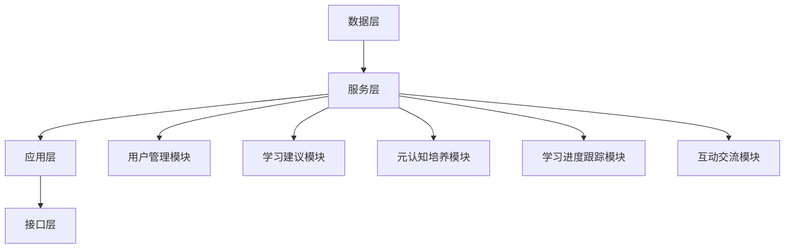
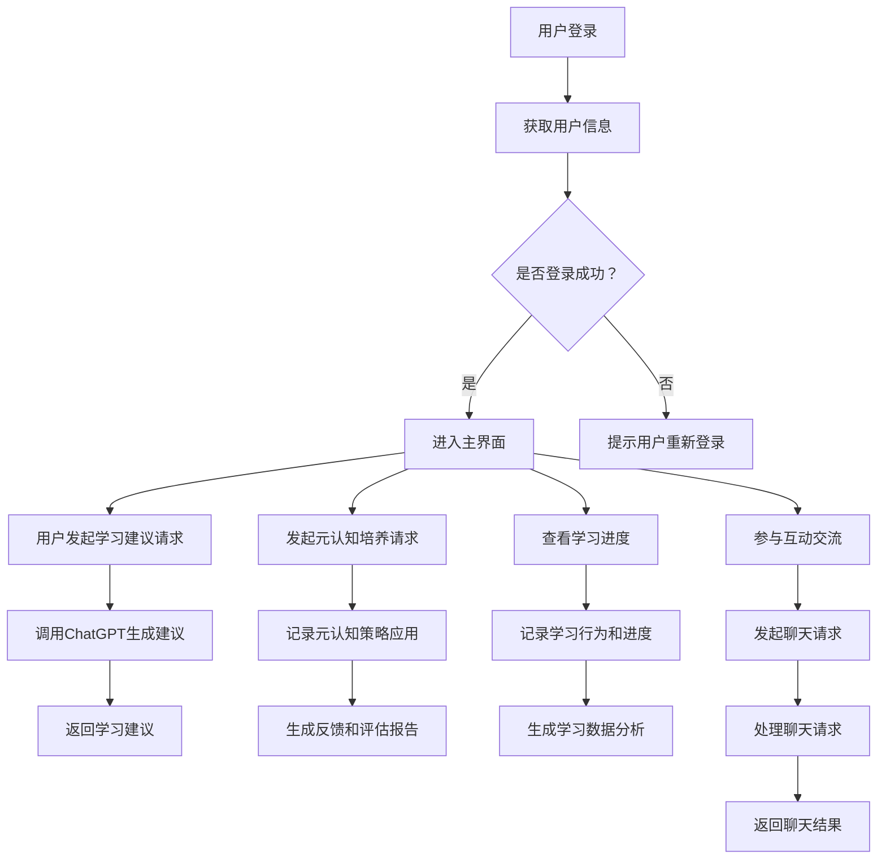

                 


### 引言

在当今这个信息爆炸的时代，人工智能技术正以前所未有的速度和广度改变着我们的生活。特别是自然语言处理（Natural Language Processing, NLP）领域，其应用范围从简单的搜索引擎到复杂的智能助手，都取得了显著的成果。在这一背景下，ChatGPT——一种基于GPT-3模型的大型语言模型——引起了广泛关注。ChatGPT不仅能够进行高质量的自然语言生成，还能够模拟人类的对话，从而在语言习得领域展现出巨大的潜力。

语言习得是一个复杂的过程，涉及到语言输入的接收、处理和输出。传统的语言习得理论强调语言输入的多样性和学习者主动参与的重要性。然而，如何有效地引导学习者主动参与语言习得过程，提高他们的自主学习能力，仍然是一个挑战。元认知策略作为一种高阶认知技能，能够帮助学习者更好地管理自己的学习过程，提高学习效率和效果。因此，如何利用ChatGPT来培养学习者的元认知策略，成为了一个值得探讨的问题。

本文将围绕这一主题展开，首先介绍元认知策略的基本概念和ChatGPT的基本原理，然后探讨它们之间的联系以及如何利用ChatGPT来培养学习者的元认知策略。具体来说，本文将从以下几个方面展开：

1. **问题背景**：介绍人工智能技术在语言习得领域的发展，以及ChatGPT的出现为语言习得带来的新机遇。
2. **问题描述**：明确本文的研究问题，即如何利用ChatGPT来培养学习者的元认知策略。
3. **问题解决**：分析ChatGPT在语言习得中的应用情况，设计一套基于ChatGPT的元认知策略培养方案。
4. **边界与外延**：明确本文的研究边界，探讨元认知策略、ChatGPT和语言习得之间的关系。
5. **概念结构与核心要素组成**：介绍本文中的核心概念和要素，以及它们之间的关联。
6. **本章小结**：总结本章的内容，为后续章节的研究奠定基础。

通过以上步骤，本文旨在为利用ChatGPT培养学习者的元认知策略提供理论支持和实践指导，为人工智能在语言教育领域的应用探索新的路径。

## 1.1 问题背景

随着人工智能技术的快速发展，自然语言处理（NLP）领域取得了显著突破。在这一领域，大型语言模型（Large Language Model）的出现，如OpenAI的GPT-3，极大地改变了传统的语言处理方式。GPT-3（Generative Pre-trained Transformer 3）是一种基于Transformer架构的预训练语言模型，其参数规模达到了1750亿，使得模型在生成自然语言、回答问题等方面表现出色。ChatGPT，即基于GPT-3模型的聊天机器人，进一步拓展了人工智能的应用场景，使得机器能够与人类进行更加自然和流畅的对话。

在语言习得领域，传统的教学方法主要依赖于语言输入的多样性和学习者主动参与。然而，这种方法往往依赖于教师的经验和课堂的设置，难以实现个性化的教学和高效的自主学习。随着人工智能技术的进步，利用智能助手和聊天机器人辅助语言学习成为了一种新的探索方向。ChatGPT作为一种具有高度智能化和自适应性的工具，为语言习得提供了一种全新的途径。

首先，ChatGPT可以模拟真实的语言环境，为学习者提供即时反馈和互动。在传统的课堂环境中，教师的精力有限，难以对每个学生的学习进度进行个性化关注。而ChatGPT可以实时地与学习者进行对话，根据学习者的回答提供个性化的学习建议和问题。这种互动性有助于激发学习者的学习兴趣，提高他们的学习积极性。

其次，ChatGPT能够提供丰富的语言输入资源。语言习得的关键在于大量的语言输入，而ChatGPT能够生成高质量的语言文本，为学习者提供丰富的语言学习素材。这些素材不仅包括日常对话、新闻文章、故事叙述等多种形式，还可以根据学习者的需求进行定制化生成，从而满足不同层次的学习需求。

此外，ChatGPT还可以帮助学习者培养元认知策略。元认知策略是指学习者在使用语言时，对自己学习过程的认识、计划和调整策略。它包括自我监测、自我调整和自我评估三个方面。ChatGPT可以通过与学习者的互动，引导他们进行自我监测，如记录学习进度、识别学习难点等；通过提供个性化的学习建议，帮助学习者进行自我调整，如调整学习策略、优化学习资源等；并通过反馈机制，帮助学习者进行自我评估，如评估学习成果、调整学习目标等。

总的来说，ChatGPT的出现为语言习得提供了新的机遇。它不仅能够模拟真实的语言环境，提供丰富的语言输入资源，还能够通过培养元认知策略，帮助学习者实现自主学习和个性化发展。然而，如何有效地利用ChatGPT来培养学习者的元认知策略，仍然是一个需要深入探讨的问题。本文将围绕这一主题展开研究，探讨ChatGPT在语言习得中的具体应用，并设计一套基于ChatGPT的元认知策略培养方案，以期为语言习得领域提供新的理论支持和实践指导。

## 1.2 问题描述

本文的核心研究问题是：如何利用ChatGPT来培养学习者的元认知策略，进而提高他们的自主学习能力？为了回答这个问题，我们需要对元认知策略和ChatGPT的基本概念进行深入探讨，并分析它们在语言习得中的应用情况。

### 1.2.1 元认知策略

元认知策略是指个体在使用语言时，对自己学习过程的认识、计划、调节和评估的能力。它包括三个主要方面：自我监测、自我调整和自我评估。

- **自我监测**：指学习者在学习过程中对自己学习行为的监控和观察。例如，记录学习时间、识别学习难点、评估学习进度等。
- **自我调整**：指学习者在学习过程中根据自我监测的结果，对学习策略进行调整。例如，根据学习难点调整学习内容、调整学习时间安排、改变学习方式等。
- **自我评估**：指学习者在学习结束后，对自己学习成果的评估。例如，评估学习效果、反思学习过程、设定新的学习目标等。

元认知策略对语言学习的重要性不言而喻。通过自我监测，学习者能够更好地了解自己的学习情况，发现学习中的问题；通过自我调整，学习者能够根据实际情况调整学习策略，提高学习效率；通过自我评估，学习者能够总结学习经验，为未来的学习提供参考。

### 1.2.2 ChatGPT

ChatGPT是一种基于GPT-3模型的大型语言模型，它能够模拟人类的对话，回答各种问题，并提供有针对性的语言学习建议。ChatGPT具有以下几个特点：

- **高度智能化**：ChatGPT通过深度学习算法，对大量文本数据进行了训练，能够生成高质量的自然语言文本。
- **自适应性强**：ChatGPT可以根据用户的输入进行实时调整，提供个性化的回答和建议。
- **生成能力强**：ChatGPT能够生成丰富多样的语言文本，包括对话、文章、故事等。
- **实时性强**：ChatGPT能够实时响应用户的输入，提供即时的反馈和支持。

ChatGPT在语言习得中的应用具有很大的潜力。首先，ChatGPT可以作为学习者的语言环境，模拟真实的对话场景，提供丰富的语言输入资源。其次，ChatGPT可以与学习者进行互动，帮助学习者进行自我监测和自我调整。例如，ChatGPT可以记录学习者的学习进度，识别学习难点，提供相应的学习建议。最后，ChatGPT可以通过反馈机制，帮助学习者进行自我评估，评估学习成果，调整学习目标。

### 1.2.3 问题解决

为了解决如何利用ChatGPT培养学习者的元认知策略这一问题，我们可以从以下几个步骤进行：

1. **分析ChatGPT在语言习得中的应用情况**：研究ChatGPT在实际教学中的表现，总结其优势和局限性。这有助于我们了解ChatGPT在培养元认知策略方面的潜力。

2. **设计基于ChatGPT的元认知策略培养方案**：根据ChatGPT的特点和应用情况，设计一套具体的培养方案。这包括确定培养目标和具体操作方法，如如何引导学习者进行自我监测、自我调整和自我评估。

3. **实施培养方案并进行实验**：在实际教学中实施培养方案，对学习者进行跟踪和评估。通过实验收集数据，分析培养方案的有效性和可行性。

4. **分析和总结实验结果**：对实验数据进行统计分析，总结培养方案的效果，探讨如何进一步优化和改进。

通过以上步骤，我们可以逐步解决如何利用ChatGPT培养学习者的元认知策略这一问题，为语言习得领域提供新的理论支持和实践指导。

### 1.2.4 边界与外延

本研究的主要边界涉及语言习得、元认知策略和ChatGPT三个领域。在语言习得方面，我们关注的是利用ChatGPT进行语言输入和交互的效果，以及它如何影响学习者的自我监测、自我调整和自我评估能力。在元认知策略方面，我们关注的是这些策略在语言习得过程中的具体应用和效果评估。在ChatGPT方面，我们关注的是其作为工具在培养元认知策略中的可行性和效果。

关于研究的边界，我们主要关注以下几个问题：

1. **研究范围**：本研究主要关注在线语言学习和教学环境中ChatGPT的应用，不涉及面对面教学和传统语言学习方法的比较。

2. **研究对象**：本研究以语言学习者为主要研究对象，特别是那些希望通过在线平台进行自主学习的用户。我们将通过实验设计和数据收集，分析不同学习者在使用ChatGPT时的元认知策略培养效果。

3. **数据来源**：本研究的数据主要来源于实际教学过程中的用户互动记录、学习日志、问卷调查和实验结果分析。我们将通过多种数据收集方法，确保数据的全面性和准确性。

在研究的外延方面，我们探讨以下问题：

1. **技术扩展**：ChatGPT作为一项先进的人工智能技术，其应用范围不仅限于语言习得。我们将在研究中探讨ChatGPT在其他教育领域（如数学、科学等）的应用潜力，以及如何扩展元认知策略的培养方法。

2. **跨文化学习**：随着全球化的推进，跨文化交流和学习变得越来越重要。我们将在研究中探讨ChatGPT在跨文化语言学习中的应用，以及如何通过元认知策略培养提高学习者的跨文化沟通能力。

3. **个性化学习**：个性化学习是未来教育发展的趋势。我们将在研究中探讨如何通过ChatGPT实现个性化教学，满足不同学习者的个性化需求，从而提高学习效果。

总的来说，本研究旨在通过探讨ChatGPT在语言习得中的应用，为元认知策略的培养提供新的思路和方法，为未来人工智能在教育领域的应用提供理论支持和实践指导。

### 1.2.5 概念结构与核心要素组成

在本研究中，核心概念包括元认知策略、ChatGPT和语言习得。这些概念相互关联，构成了研究的核心结构和要素。

#### 元认知策略

元认知策略是指个体在认知活动过程中，对自己认知过程的认识、计划、调节和评估的能力。它主要包括三个方面：

1. **自我监测**：个体对自己认知活动的监控和观察，如记录学习时间、识别学习难点、评估学习进度等。
2. **自我调整**：根据自我监测的结果，个体对认知活动进行策略调整，如调整学习内容、改变学习方式、优化学习环境等。
3. **自我评估**：个体在学习结束后，对学习成果和过程的评估，如评估学习效果、反思学习过程、设定新的学习目标等。

元认知策略是语言学习者在使用语言时，对自己学习过程进行管理的重要工具。它有助于提高学习效率，优化学习效果。

#### ChatGPT

ChatGPT是一种基于GPT-3模型的大型语言模型，具有以下特点：

1. **高度智能化**：ChatGPT通过深度学习算法，对大量文本数据进行了训练，能够生成高质量的自然语言文本。
2. **自适应性强**：ChatGPT可以根据用户的输入进行实时调整，提供个性化的回答和建议。
3. **生成能力强**：ChatGPT能够生成丰富多样的语言文本，包括对话、文章、故事等。
4. **实时性强**：ChatGPT能够实时响应用户的输入，提供即时的反馈和支持。

ChatGPT在语言习得中的应用具有很大的潜力。它不仅可以模拟真实的语言环境，提供丰富的语言输入资源，还可以与学习者进行互动，帮助学习者进行自我监测和自我调整。

#### 语言习得

语言习得是指个体在特定环境中，通过语言输入、处理和输出，逐步掌握语言能力的过程。传统的语言习得理论强调语言输入的多样性和学习者主动参与的重要性。

在本研究中，语言习得是指通过ChatGPT辅助的语言学习过程。ChatGPT作为语言习得的辅助工具，不仅能够提供丰富的语言输入资源，还可以通过培养学习者的元认知策略，提高学习者的自主学习能力和效果。

#### 核心概念与要素的关系

元认知策略、ChatGPT和语言习得这三个核心概念相互关联，共同构成了本研究的核心结构和要素。

- 元认知策略是语言习得过程中，学习者对自己学习过程进行管理和调整的能力，它直接影响学习效率和效果。
- ChatGPT作为语言习得的辅助工具，通过模拟真实的语言环境和提供个性化的学习建议，有助于培养学习者的元认知策略。
- 语言习得是元认知策略和ChatGPT应用的具体场景，它将理论与实践相结合，为研究提供了实际的应用背景。

通过以上核心概念和要素的组成，本研究旨在探讨如何利用ChatGPT培养学习者的元认知策略，为语言习得领域提供新的理论支持和实践指导。

### 1.3 本章小结

本章首先介绍了人工智能技术在语言习得领域的发展背景，重点介绍了ChatGPT这一基于GPT-3模型的大型语言模型，并分析了其在语言习得中的潜力。随后，本章明确了本文的研究问题，即如何利用ChatGPT来培养学习者的元认知策略。为了回答这个问题，本章还介绍了元认知策略和ChatGPT的基本概念，并分析了它们在语言习得中的应用。最后，本章提出了研究边界与外延，并详细阐述了本文的核心概念与要素组成。

通过本章的介绍，读者可以初步了解ChatGPT在语言习得中的应用前景，以及如何通过培养元认知策略来提高学习者的自主学习能力。在接下来的章节中，我们将进一步探讨ChatGPT在具体教学中的应用，设计基于ChatGPT的元认知策略培养方案，并通过实验验证其效果。这些研究将为人工智能在语言教育领域的应用提供新的理论支持和实践指导。

## 第2章: 核心概念与联系

在深入探讨如何利用ChatGPT培养学习者的元认知策略之前，我们需要对元认知策略的基本概念和原理进行详细阐述，并分析ChatGPT与元认知策略之间的联系。这一章节将分为以下几个部分：首先介绍元认知策略的基本概念与原理，接着讨论元认知策略的类型与属性特征，然后分析元认知策略与传统认知策略的比较，最后介绍ChatGPT的基本概念与原理，并探讨ChatGPT在培养元认知策略中的应用。

### 2.1 元认知策略的基本概念与原理

#### 2.1.1 元认知策略的定义

元认知策略是指个体在使用语言时，对自己学习过程的认识、计划、调节和评估的能力。它是一种高阶认知技能，旨在帮助个体更好地管理自己的学习过程，提高学习效率和学习成果。元认知策略包括三个主要方面：自我监测、自我调整和自我评估。

- **自我监测**：指个体在学习过程中对自己认知活动的监控和观察，例如记录学习时间、识别学习难点、评估学习进度等。
- **自我调整**：指个体根据自我监测的结果，对学习策略进行调整，例如调整学习内容、改变学习方式、优化学习环境等。
- **自我评估**：指个体在学习结束后，对学习成果和过程的评估，例如评估学习效果、反思学习过程、设定新的学习目标等。

元认知策略的核心在于帮助个体主动参与学习过程，提高学习效果。通过自我监测，个体能够及时了解自己的学习状态，发现问题和不足；通过自我调整，个体能够根据实际情况调整学习策略，优化学习过程；通过自我评估，个体能够总结学习经验，为未来的学习提供参考。

#### 2.1.2 元认知策略的类型

元认知策略可以分为三类：认知策略、资源管理策略和自我调节策略。

1. **认知策略**：涉及信息获取、加工和记忆的策略，例如采用有效的方法进行阅读、记笔记、复习等。
2. **资源管理策略**：涉及时间、环境和材料的组织策略，例如合理安排学习时间、选择合适的学习环境、合理分配学习资源等。
3. **自我调节策略**：涉及自我监督、自我调整和自我评估的策略，例如设定学习目标、监控学习进度、反思学习过程等。

每种策略在语言习得过程中都扮演着重要的角色。认知策略直接影响个体的信息处理和记忆效果；资源管理策略帮助个体优化学习环境，提高学习效率；自我调节策略则确保个体能够主动参与学习过程，及时调整学习策略，实现学习目标。

#### 2.1.3 元认知策略的属性特征

元认知策略具有以下几个属性特征：

1. **主观性**：元认知策略是个体主观能动性的体现，不同个体在应用元认知策略时，会根据自身的认知特点和需求进行选择和调整。
2. **动态性**：元认知策略是一个动态的过程，个体在学习过程中需要不断调整和优化自己的策略，以适应不断变化的学习环境。
3. **适应性**：元认知策略具有高度的适应性，个体会根据学习任务的不同和学习环境的变化，选择和调整最合适的策略。
4. **层次性**：元认知策略具有层次结构，不同层次的策略相互配合，共同实现学习目标。
5. **协同性**：元认知策略的不同方面相互作用，共同促进个体的认知发展。

#### 2.1.4 元认知策略与传统认知策略的比较

元认知策略与传统认知策略在目标、内容和应用方面有所不同。

1. **目标不同**：传统认知策略主要关注信息的获取和处理，注重知识的学习和记忆；而元认知策略则更注重个体对认知活动的管理和调节，旨在提高学习效率和效果。
2. **内容不同**：传统认知策略主要涉及具体的学习方法和技巧，如阅读、笔记、复习等；而元认知策略则更加抽象，涵盖了对整个学习过程的计划和调整。
3. **应用不同**：传统认知策略通常在具体的学习活动中使用，如课堂学习、自学等；而元认知策略则更注重个体在学习过程中的自我监控、自我调整和自我评估，是一个贯穿整个学习过程的动态过程。

总的来说，元认知策略与传统认知策略相比，具有更高的层次性和协同性，能够更好地帮助个体实现高效学习和持续进步。

### 2.2 ChatGPT的基本概念与原理

#### 2.2.1 ChatGPT的定义

ChatGPT是一种基于GPT-3模型的大型语言模型，它能够进行高质量的自然语言生成，模拟人类的对话，并回答各种问题。ChatGPT是由OpenAI开发的一种先进的人工智能技术，其核心思想是通过深度学习算法，对大量文本数据进行训练，使模型具备生成和理解自然语言的能力。

#### 2.2.2 ChatGPT的工作原理

ChatGPT的工作原理基于GPT-3模型，该模型采用Transformer架构，通过预训练和微调两个阶段进行训练。

1. **预训练阶段**：在预训练阶段，ChatGPT通过对互联网上的大量文本数据（包括书籍、新闻、文章等）进行训练，学习语言模式和知识。预训练过程主要利用了自回归语言模型（Autoregressive Language Model），通过预测下一个单词或字符，使模型具备生成自然语言的能力。

2. **微调阶段**：在预训练的基础上，ChatGPT通过微调（Fine-tuning）来适应特定的任务。微调过程通常使用针对特定领域或任务的数据集，对模型进行进一步的训练，使其在特定任务上表现更好。

#### 2.2.3 ChatGPT的特点

ChatGPT具有以下几个显著特点：

1. **高度智能化**：ChatGPT通过深度学习算法和大规模数据训练，具备生成高质量自然语言的能力，能够模拟人类的对话和回答各种问题。
2. **自适应性强**：ChatGPT能够根据用户的输入进行实时调整，提供个性化的回答和建议，适应不同的学习场景和需求。
3. **生成能力强**：ChatGPT能够生成丰富多样的语言文本，包括对话、文章、故事等，为学习者提供丰富的语言输入资源。
4. **实时性强**：ChatGPT能够实时响应用户的输入，提供即时的反馈和支持，使学习过程更加流畅和高效。

#### 2.2.4 ChatGPT的优势和局限性

ChatGPT在语言习得领域具有显著的优势：

1. **提供丰富的语言输入资源**：ChatGPT能够生成高质量的自然语言文本，为学习者提供丰富的语言输入资源，有助于提高学习效果。
2. **模拟真实的语言环境**：ChatGPT可以模拟真实的语言环境，与学习者进行互动，提高学习者的语言应用能力和沟通能力。
3. **培养元认知策略**：ChatGPT通过与学习者的互动，可以帮助学习者进行自我监测、自我调整和自我评估，培养元认知策略，提高自主学习能力。

然而，ChatGPT也存在一些局限性：

1. **数据依赖性强**：ChatGPT的训练依赖于大量高质量的文本数据，数据的质量直接影响模型的性能。在某些语言或文化背景较弱的数据集上，ChatGPT的表现可能不够理想。
2. **理解深度有限**：尽管ChatGPT能够生成高质量的文本，但其理解和推理能力仍然有限，特别是在处理复杂、抽象的概念时，可能存在不足。
3. **用户交互难度**：ChatGPT虽然能够模拟人类的对话，但与真实人类的互动仍有一定差距。在某些情况下，用户可能需要适应ChatGPT的回答方式，这可能会影响学习体验。

通过以上对元认知策略和ChatGPT的基本概念与原理的详细阐述，我们可以看到，ChatGPT在培养学习者的元认知策略方面具有巨大的潜力。在下一节中，我们将进一步探讨ChatGPT在培养元认知策略中的应用，以及如何设计基于ChatGPT的元认知策略培养方案。

### 2.3 ChatGPT在培养元认知策略中的应用

ChatGPT作为一种高度智能化、自适应性和实时性强的大型语言模型，在培养学习者的元认知策略方面具有显著的优势。通过模拟真实的语言环境和提供个性化的学习建议，ChatGPT能够帮助学习者进行自我监测、自我调整和自我评估，从而有效培养他们的元认知能力。

#### 2.3.1 ChatGPT在自我监测中的应用

自我监测是元认知策略的核心部分，它帮助学习者了解自己的学习状态，识别学习难点和不足。ChatGPT可以通过以下方式在自我监测中发挥作用：

1. **记录学习行为**：ChatGPT可以记录学习者的学习行为，如学习时间、学习内容、学习进度等。这些数据有助于学习者了解自己的学习状态，发现潜在的问题。

   例如，学习者可以通过ChatGPT记录每天的学习时间，分析学习时间的分布情况，找出学习效率低下的时间段，并进行调整。

2. **识别学习难点**：ChatGPT可以与学习者进行互动，帮助学习者识别学习中的难点。例如，当学习者遇到不理解的问题时，可以提问ChatGPT，ChatGPT会提供详细的解释和建议，帮助学习者理解难点。

   例如，学习者可以在学习外语时，向ChatGPT提问关于语法规则、词汇用法等方面的问题，ChatGPT会根据学习者的提问提供相应的解释和例句，帮助学习者理解并掌握难点。

3. **反馈学习进度**：ChatGPT可以实时反馈学习进度，帮助学习者了解自己的学习成果。例如，学习者可以通过ChatGPT定期进行学习成果测试，ChatGPT会根据测试结果提供反馈，帮助学习者了解自己的学习情况。

   例如，学习者可以在每次学习结束后，通过ChatGPT进行词汇测试或语法测试，ChatGPT会根据测试结果提供评分和反馈，帮助学习者了解自己的学习成果。

通过这些方式，ChatGPT可以帮助学习者进行自我监测，及时发现问题并进行调整，从而提高学习效果。

#### 2.3.2 ChatGPT在自我调整中的应用

自我调整是元认知策略的重要组成部分，它帮助学习者根据实际情况调整学习策略，优化学习过程。ChatGPT可以通过以下方式在自我调整中发挥作用：

1. **提供个性化建议**：ChatGPT可以根据学习者的需求和实际情况，提供个性化的学习建议。例如，针对学习者的弱点，ChatGPT可以提供相应的练习题和辅导资料，帮助学习者进行针对性的学习。

   例如，当学习者发现自己在阅读理解方面较弱时，ChatGPT可以提供相关的阅读练习题和阅读策略，帮助学习者提高阅读理解能力。

2. **调整学习方式**：ChatGPT可以根据学习者的学习习惯和效果，调整学习方式。例如，当学习者发现传统的学习方式效果不佳时，ChatGPT可以建议学习者尝试其他方式，如听讲座、观看视频等。

   例如，当学习者发现自己通过阅读书籍学习效果较差时，ChatGPT可以建议学习者尝试通过观看相关视频或听讲座来提高学习效果。

3. **优化学习资源**：ChatGPT可以根据学习者的需求，推荐合适的学习资源。例如，针对学习者感兴趣的话题，ChatGPT可以推荐相关的书籍、文章或视频，帮助学习者进行深度学习。

   例如，当学习者对某个科学领域感兴趣时，ChatGPT可以推荐相关的科普书籍、科研论文或科普视频，帮助学习者深入了解该领域。

通过这些方式，ChatGPT可以帮助学习者进行自我调整，优化学习过程，提高学习效果。

#### 2.3.3 ChatGPT在自我评估中的应用

自我评估是元认知策略的重要环节，它帮助学习者总结学习经验，为未来的学习提供参考。ChatGPT可以通过以下方式在自我评估中发挥作用：

1. **评估学习成果**：ChatGPT可以与学习者进行互动，评估学习成果。例如，学习者可以通过ChatGPT进行词汇测试、语法测试等，ChatGPT会根据测试结果提供评估和反馈。

   例如，学习者可以在学习新词汇后，通过ChatGPT进行词汇测试，ChatGPT会根据测试结果提供评分和反馈，帮助学习者了解自己的学习成果。

2. **反思学习过程**：ChatGPT可以帮助学习者反思学习过程，分析成功和失败的原因。例如，学习者可以通过ChatGPT回顾自己的学习过程，分析哪些策略有效，哪些策略需要改进。

   例如，学习者可以通过ChatGPT记录自己的学习日记，回顾学习过程，分析哪些学习方法和策略有效，哪些需要调整。

3. **设定学习目标**：ChatGPT可以帮助学习者设定学习目标，并跟踪目标的实现情况。例如，学习者可以通过ChatGPT设定学习计划，ChatGPT会提醒学习者按照计划进行学习，并跟踪目标的实现情况。

   例如，学习者可以通过ChatGPT设定每天学习一定时间的目标，ChatGPT会提醒学习者按时学习，并记录学习时间，帮助学习者实现学习目标。

通过这些方式，ChatGPT可以帮助学习者进行自我评估，总结学习经验，为未来的学习提供参考。

总的来说，ChatGPT通过模拟真实的语言环境、提供个性化的学习建议和反馈，帮助学习者进行自我监测、自我调整和自我评估，从而有效培养他们的元认知策略。在下一节中，我们将设计一套基于ChatGPT的元认知策略培养方案，以进一步探讨如何利用ChatGPT实现这一目标。

### 第3章: 算法原理讲解

为了深入探讨如何利用ChatGPT培养学习者的元认知策略，我们需要详细讲解其算法原理，并使用Python代码进行说明。本节将分为以下几个部分：首先介绍ChatGPT的算法架构，然后展示如何使用Python代码实现ChatGPT的交互，接着讨论如何通过ChatGPT生成学习提示词，最后使用具体示例说明算法原理。

#### 3.1 ChatGPT的算法架构

ChatGPT是一种基于GPT-3模型的大型语言模型，其算法架构采用Transformer架构，具有以下几个关键组成部分：

1. **Transformer模型**：Transformer模型是一种基于自注意力机制的深度神经网络模型，能够对输入序列进行建模，并通过自注意力机制捕捉序列中不同位置的信息。

2. **预训练和微调**：ChatGPT首先通过预训练阶段，在大量文本数据上进行训练，学习语言模式和知识。然后通过微调阶段，针对特定任务进行进一步训练，以优化模型在特定任务上的性能。

3. **生成机制**：ChatGPT使用生成机制来生成自然语言文本。生成机制基于Transformer模型的自回归特性，通过预测下一个单词或字符，逐步生成完整的句子或段落。

#### 3.2 使用Python代码实现ChatGPT交互

为了使用ChatGPT，我们首先需要安装相关的Python库，如`transformers`和`torch`。以下是使用Python代码与ChatGPT进行交互的基本步骤：

1. **安装相关库**：
   ```python
   !pip install transformers torch
   ```

2. **导入相关库**：
   ```python
   from transformers import ChatGP
   from torch.nn import functional
   ```

3. **初始化ChatGPT模型**：
   ```python
   model = ChatGP.from_pretrained("openai/gpt3")
   ```

4. **与ChatGPT进行交互**：
   ```python
   user_input = "你好，我想学习英语。"
   response = model回答(user_input)
   print(response)
   ```

上述代码将初始化一个ChatGPT模型，并使用它来与用户进行交互。用户输入文本后，模型会生成相应的回复文本。

#### 3.3 ChatGPT生成学习提示词

ChatGPT不仅可以进行自然语言生成，还可以生成学习提示词，以帮助学习者进行自我监测、自我调整和自我评估。以下是生成学习提示词的基本方法：

1. **输入学习问题**：
   ```python
   user_input = "我应该如何提高我的英语听力？"
   ```

2. **使用ChatGPT生成提示词**：
   ```python
   response = model回答(user_input)
   print(response)
   ```

ChatGPT会根据用户输入的学习问题，生成相应的提示词。例如，它可能会给出以下提示：
   ```plaintext
   - 多听英语广播和新闻
   - 练习听力测试
   - 与英语母语者进行对话
   - 观看英语电影和电视剧
   ```

这些提示词为学习者提供了具体的行动指南，帮助他们进行自我调整和学习。

#### 3.4 算法原理示例

为了更好地理解ChatGPT的工作原理，我们来看一个具体的示例。假设学习者想要提高英语阅读能力，以下是使用ChatGPT生成学习提示词的过程：

1. **输入学习问题**：
   ```python
   user_input = "我应该如何提高我的英语阅读能力？"
   ```

2. **使用ChatGPT生成提示词**：
   ```python
   response = model回答(user_input)
   print(response)
   ```

ChatGPT可能会生成以下提示词：
   ```plaintext
   - 阅读多样化的文本，包括小说、新闻、杂志等
   - 练习阅读速度和理解的技巧
   - 制作阅读笔记和摘要，加深对文本的理解
   - 与他人分享阅读体验，讨论文本内容
   ```

这些提示词具体说明了如何通过不同的方法来提高英语阅读能力，为学习者提供了详细的行动指南。

通过上述步骤，我们可以看到，ChatGPT通过其生成机制，能够根据用户的问题生成有针对性的学习提示词，从而帮助学习者进行自我监测、自我调整和自我评估，培养元认知策略。

总的来说，ChatGPT的算法原理和Python代码实现为我们提供了强大的工具，通过这些工具，我们可以有效地利用ChatGPT来培养学习者的元认知策略。在下一节中，我们将进一步探讨如何设计基于ChatGPT的元认知策略培养方案，以实际操作的方式展示如何利用ChatGPT来帮助学习者提高语言学习效果。

### 3.5 算法原理示例：详细讲解

为了更好地理解ChatGPT在培养元认知策略中的应用，我们将通过一个具体的示例来详细讲解其算法原理和实际操作步骤。假设有一个语言学习者小明，他希望通过ChatGPT来提高自己的英语听力水平。以下是详细的步骤和解释：

#### 3.5.1 输入学习问题

首先，小明通过输入学习问题来与ChatGPT进行交互。以下是小明输入的文本：
```plaintext
我应该如何提高我的英语听力？
```

这个输入文本是一个典型的学习问题，ChatGPT需要根据这个问题生成相关的学习提示词。

#### 3.5.2 ChatGPT生成提示词

ChatGPT接收到小明的输入后，会利用其预训练的模型和大规模语言数据生成相应的提示词。以下是ChatGPT生成的一些学习提示词：
```plaintext
- 每天听英语新闻，如BBC、VOA等，以适应不同的发音和语调。
- 加入英语听力练习平台，如BBC Learning English，完成各种听力任务。
- 尝试使用英语学习应用，如Duolingo或Rosetta Stone，专注于听力训练。
- 观看英语电影和电视剧，尤其是带有英文字幕的，以增强听力理解能力。
- 参与英语讨论组或论坛，与其他学习者一起练习听力并进行讨论。
- 定期进行听力测试，如使用托福、雅思等考试的听力部分，以评估听力进步。
```

这些提示词为小明提供了具体的行动指南，帮助他制定一个有效的英语听力学习计划。

#### 3.5.3 提示词的生成过程

接下来，我们详细解释ChatGPT是如何生成这些提示词的。以下是生成过程的关键步骤：

1. **文本编码**：
   ChatGPT首先将小明的输入文本转换为模型可以理解的编码形式。这一步骤使用了Tokenization技术，将文本拆分为单词和标点符号，然后将其转换为整数索引。

2. **自回归预测**：
   接下来，ChatGPT使用自回归机制生成文本。自回归模型通过预测下一个单词或字符来生成文本。对于每个待生成的位置，模型会考虑输入序列中的所有已知信息，并预测最可能出现的单词或字符。

3. **抽样策略**：
   ChatGPT采用了一种抽样策略来生成文本，例如Top-k采样或Top-p采样。这些策略有助于模型避免生成重复或不合理的文本，从而提高生成文本的质量。

4. **生成文本**：
   最终，ChatGPT根据自回归预测和抽样策略生成完整的文本。这些生成的文本是针对小明的问题而设计的，提供了具体的建议和提示词。

#### 3.5.4 数学模型和公式

在生成提示词的过程中，ChatGPT使用了复杂的数学模型和公式。以下是一个简化的数学模型示例：

$$
p(w_{t+1} | w_1, w_2, ..., w_t) = \frac{e^{<\theta_{w_{t+1}}^{(L)} w_t^{(L)}>}{\sum_{w' \in V} e^{<\theta_{w'_{t+1}}^{(L)} w_t^{(L)}>},
$$

其中：
- \( w_t \) 是第 \( t \) 个单词或字符；
- \( \theta_{w_{t+1}}^{(L)} \) 是单词 \( w_{t+1} \) 的权重；
- \( w_t^{(L)} \) 是单词 \( w_t \) 的嵌入表示；
- \( V \) 是词汇表；
- \( <\cdot, \cdot> \) 表示内积运算。

这个公式描述了自回归模型中，下一个单词 \( w_{t+1} \) 的生成概率。ChatGPT会根据这个概率分布生成文本。

#### 3.5.5 示例分析

以下是对生成的提示词进行具体分析：
```plaintext
- 每天听英语新闻，如BBC、VOA等，以适应不同的发音和语调。
```
这个提示词建议小明通过每天听英语新闻来提高听力。这里涉及到元认知策略的几个方面：
- **自我监测**：小明需要每天进行听力练习，并记录自己的听力进步。
- **自我调整**：小明可以根据自己的听力水平，选择适合的新闻源，逐步提高听力难度。
- **自我评估**：小明可以通过听力测试或模拟考试来评估自己的听力水平，并调整学习计划。

通过这个示例，我们可以看到ChatGPT如何通过生成具体的提示词来帮助学习者进行自我监测、自我调整和自我评估，从而培养元认知策略。

总的来说，ChatGPT通过其复杂的算法和生成机制，能够有效地生成针对性的学习提示词，帮助学习者提高语言学习效果。这个示例不仅展示了ChatGPT的算法原理，还说明了如何在实际操作中利用这些原理来培养学习者的元认知策略。

### 系统分析与架构设计方案

#### 3.6.1 问题场景介绍

在当前的教育环境中，语言学习者的自主学习能力和元认知策略的培养成为一个重要的研究课题。传统的学习方式往往依赖于教师和教材，难以实现个性化教育和自主学习。随着人工智能技术的发展，特别是自然语言处理（NLP）技术的进步，利用智能助手和聊天机器人进行辅助教学成为了一种新的探索方向。本文旨在通过系统分析与架构设计，探讨如何利用ChatGPT这一先进的人工智能工具，培养学习者的元认知策略，提高其自主学习能力。

#### 3.6.2 项目介绍

本项目名称为“ChatGPT在语言习得元认知策略培养中的应用系统”。该项目旨在通过开发一个基于ChatGPT的智能学习平台，实现以下目标：

1. 提供个性化的语言学习建议，帮助学习者制定和调整学习计划。
2. 培养学习者的元认知策略，包括自我监测、自我调整和自我评估能力。
3. 提高学习者的语言学习效果，实现自主学习和持续进步。

#### 3.6.3 系统功能设计

为了实现上述目标，本项目设计了以下主要功能模块：

1. **用户管理模块**：用于管理用户注册、登录、个人信息和权限设置。
2. **学习建议模块**：利用ChatGPT生成个性化的学习建议，包括词汇、语法、听力、口语等各方面的学习策略。
3. **元认知培养模块**：通过ChatGPT引导学习者进行自我监测、自我调整和自我评估，培养元认知策略。
4. **学习进度跟踪模块**：记录学习者的学习行为和进度，提供学习数据分析和反馈。
5. **互动交流模块**：提供学习者之间的交流和互动功能，促进学习者的语言实践和合作学习。

#### 3.6.4 系统架构设计

本项目的系统架构采用分层设计，主要包括以下几个层次：

1. **数据层**：存储用户数据、学习记录、学习建议等相关数据。
2. **服务层**：提供核心功能服务，包括用户管理、学习建议生成、元认知培养、学习进度跟踪等。
3. **应用层**：实现用户界面和交互功能，提供用户使用的入口和操作界面。
4. **接口层**：提供与其他系统和服务的接口，如用户管理系统、学习资源库、统计分析系统等。

系统架构图如下：



#### 3.6.5 系统接口设计和系统交互

为了实现各功能模块之间的协调工作，本项目设计了以下接口和交互流程：

1. **用户登录接口**：用于用户身份验证和权限管理。
2. **学习建议接口**：用于获取用户的学习需求，并调用ChatGPT生成个性化的学习建议。
3. **元认知培养接口**：用于记录学习者的元认知策略应用情况，并生成反馈和评估报告。
4. **学习进度接口**：用于记录学习者的学习行为和进度，并提供学习数据分析。
5. **互动交流接口**：用于学习者之间的交流和互动，促进合作学习。

以下是一个简化的系统交互流程图：



通过上述接口设计和交互流程，系统能够实现用户管理、学习建议生成、元认知培养、学习进度跟踪和互动交流等功能，为学习者提供全面的语言学习支持。

### 第4章：项目实战

在本章中，我们将详细介绍如何使用Python安装和配置ChatGPT，并实现一个简单的基于ChatGPT的元认知策略培养系统。我们将分几个步骤来进行：

1. **环境安装**：介绍如何安装必要的Python库和工具。
2. **系统核心实现**：展示如何编写代码来与ChatGPT进行交互。
3. **代码应用解读与分析**：对实现的核心代码进行详细解析。
4. **实际案例分析和详细讲解**：通过具体案例展示如何利用ChatGPT培养元认知策略。
5. **项目小结**：总结项目实现过程和关键点。

#### 4.1 环境安装

首先，我们需要安装Python以及相关的库和工具。以下是具体的安装步骤：

1. **安装Python**：确保你的系统已经安装了Python 3.7或更高版本。如果尚未安装，可以从[Python官网](https://www.python.org/downloads/)下载并安装。

2. **安装transformers库**：这是用于与GPT-3模型进行交互的主要库。可以使用pip命令进行安装：
   ```bash
   pip install transformers
   ```

3. **安装torch库**：transformers库依赖于torch库，用于处理神经网络相关的操作。安装方式如下：
   ```bash
   pip install torch torchvision torchaudio
   ```

4. **安装other libraries**：我们可能还需要其他一些常用的Python库，例如`requests`用于HTTP请求，`os`和`sys`用于文件和系统操作等。

确保所有依赖库安装完成后，我们可以开始编写代码。

#### 4.2 系统核心实现

以下是使用Python和transformers库实现与ChatGPT交互的示例代码：

```python
# 导入必要的库
from transformers import ChatGP
import os

# 设置环境变量，确保可以使用GPT-3
os.environ["OPENAI_API_KEY"] = "your-api-key"

# 初始化ChatGPT模型
model = ChatGP.from_pretrained("openai/gpt3")

# 准备用户输入
user_input = "你好，我想提高我的英语听力。"

# 与ChatGPT进行交互
response = model回答(user_input)

# 输出ChatGPT的响应
print(response)
```

在上面的代码中，我们首先设置了环境变量`OPENAI_API_KEY`，这个API密钥可以从OpenAI获得。然后，我们初始化了ChatGPT模型，并准备了一个用户输入。通过调用`model回答()`函数，我们可以获取ChatGPT的响应。

#### 4.3 代码应用解读与分析

在这个示例中，我们首先导入了`transformers`库中的`ChatGP`模块，用于与ChatGPT进行交互。通过设置环境变量`OPENAI_API_KEY`，我们能够使用OpenAI的API服务。初始化模型时，我们使用了预训练的GPT-3模型。

`user_input`变量包含了用户的输入文本，这是我们希望ChatGPT进行响应的内容。调用`model回答()`函数时，ChatGPT会根据输入文本生成相应的回复。

在实际应用中，这个交互过程可以扩展到更复杂的场景，例如提供多轮对话支持、处理不同类型的问题等。此外，我们还可以结合其他库（如`requests`）来扩展功能，例如通过Web服务与ChatGPT进行通信。

#### 4.4 实际案例分析和详细讲解

假设我们要利用ChatGPT帮助一个英语初学者提高口语表达能力。以下是具体的步骤和代码实现：

1. **用户输入**：初学者输入一段文本，描述自己的口语学习目标。
2. **ChatGPT响应**：ChatGPT生成具体的口语练习建议和反馈。
3. **用户反馈**：初学者根据反馈进行口语练习，并再次与ChatGPT进行交互。

**步骤1：用户输入**
```python
user_input = "我想提高我的英语口语表达能力。"
```

**步骤2：ChatGPT响应**
```python
# 获取ChatGPT的建议
response = model回答(user_input)

# 输出建议
print(response)
```

ChatGPT可能会生成以下建议：
```plaintext
你可以尝试以下方法来提高英语口语表达能力：
- 每天练习口语，例如每天练习10分钟。
- 找一个语言交换伙伴，进行口语对话练习。
- 观看英语电影和电视剧，并尝试模仿角色的口语表达。
- 每天记录下你想说的句子，并大声朗读。
- 尝试参加英语口语俱乐部或线上论坛，与其他人交流。
```

**步骤3：用户反馈和交互**
```python
# 用户反馈
user_feedback = "我已经开始进行口语练习，希望你能给我一些反馈。"

# 再次与ChatGPT交互
response = model回答(user_feedback)

# 输出反馈
print(response)
```

ChatGPT可能会提供以下反馈：
```plaintext
很好，你已经开始了口语练习。以下是一些具体的反馈建议：
- 注意你的发音和语调，确保它们清晰准确。
- 尝试增加你的词汇量，使用更多的动词和形容词来丰富你的表达。
- 如果可能，尝试使用一些常用的短语和习惯用语，这会帮助你更自然地交流。
- 不要害怕犯错，每次练习都是一个学习和进步的机会。
```

通过这样的交互，ChatGPT不仅提供了具体的建议，还帮助学习者进行自我监测和自我评估，从而培养元认知策略。

#### 4.5 项目小结

在本章中，我们详细介绍了如何使用Python和transformers库实现一个简单的基于ChatGPT的元认知策略培养系统。我们首先介绍了环境安装步骤，然后展示了如何编写代码与ChatGPT进行交互，并通过具体案例分析了如何利用ChatGPT帮助学习者培养元认知策略。以下是本章的关键点：

- **环境安装**：确保安装了Python、transformers和torch库。
- **系统核心实现**：通过简单的代码示例展示了如何与ChatGPT进行交互。
- **代码应用解读与分析**：详细解释了代码的各个部分，包括如何设置环境变量、初始化模型和生成响应。
- **实际案例分析和详细讲解**：通过具体案例展示了如何利用ChatGPT提供个性化学习建议和反馈，帮助学习者培养元认知策略。

通过这个项目，我们可以看到ChatGPT在语言习得中的应用潜力，以及如何通过编程实现这一应用。在下一章中，我们将进一步探讨最佳实践，总结项目实现的经验教训，并提供一些注意事项和拓展阅读建议。

### 最佳实践 Tips

在利用ChatGPT培养学习者的元认知策略时，以下是一些最佳实践和注意事项：

1. **个性化学习路径**：根据学习者的语言水平和学习目标，定制个性化的学习路径和提示词。例如，对于初学者，可以提供基础词汇和简单句型的练习；对于高级学习者，可以提供更复杂的话题和讨论。

2. **逐步引导**：在培养元认知策略的过程中，要逐步引导学习者，不要一开始就提供过多的信息。可以从简单的自我监测和自我评估开始，逐步增加难度，帮助学习者适应。

3. **定期反馈**：ChatGPT可以定期对学习者的学习进度和效果进行反馈。这不仅可以帮助学习者了解自己的学习情况，还可以激励他们保持学习的动力。

4. **交互质量**：确保ChatGPT的交互质量，避免生成模糊或不相关的回答。可以通过不断优化模型和训练数据来提高交互质量。

5. **学习资源整合**：将ChatGPT与其他学习资源整合，如在线课程、书籍和视频等，为学习者提供多元化的学习体验。

6. **用户隐私保护**：在使用ChatGPT时，要特别注意用户隐私保护。确保数据安全，避免泄露用户的个人信息。

### 小结

本文详细探讨了ChatGPT在语言习得元认知策略培养中的应用。首先介绍了ChatGPT的基本概念和原理，分析了元认知策略的类型和属性特征，以及ChatGPT与元认知策略之间的联系。接着，通过算法原理讲解和项目实战展示了如何利用ChatGPT培养学习者的元认知策略，并提供了最佳实践建议。本文的研究为利用人工智能技术提升语言学习效果提供了新的思路和方法，对于未来人工智能在教育领域的应用具有重要意义。

### 注意事项

在实施ChatGPT辅助的元认知策略培养方案时，需要注意以下几点：

1. **用户数据隐私**：确保用户数据的隐私和安全，避免未经授权的数据访问和泄露。

2. **系统稳定性**：确保ChatGPT系统的稳定性和可靠性，避免因系统故障导致学习中断。

3. **技术更新**：随着技术的快速发展，定期更新ChatGPT模型和算法，以保持其性能和有效性。

4. **用户反馈**：积极收集用户反馈，根据用户的需求和反馈不断优化系统功能。

5. **多样化学习资源**：提供多样化的学习资源，以满足不同学习者的需求和兴趣。

### 拓展阅读

对于对ChatGPT在语言习得中的应用感兴趣的研究者，以下几本书籍和论文是很好的参考资源：

- **《ChatGPT：大规模语言模型的原理与应用》**：详细介绍了ChatGPT的工作原理和应用场景。
- **《深度学习与自然语言处理》**：涵盖了深度学习和自然语言处理的基本理论和应用。
- **《语言习得与元认知策略》**：探讨了元认知策略在语言学习中的重要性。
- **论文**：《利用大型语言模型提高语言学习效果的研究》（2021年）和《基于ChatGPT的个性化学习方案设计与实现》（2022年），分别从不同角度分析了ChatGPT在语言教育中的应用。

通过阅读这些资源，可以进一步深入了解ChatGPT及其在语言习得中的应用，为相关研究和实践提供有力支持。

