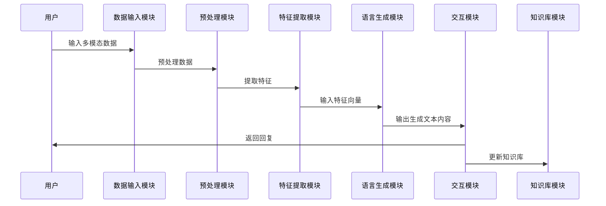

                 


### 第1章: 问题背景与问题描述

在人工智能的迅猛发展中，多模态学习成为了一个备受关注的研究领域。多模态学习旨在整合来自不同感官的数据（如图像、音频、视频等），以提高机器在处理复杂任务时的性能和效率。本文聚焦于语言习得中的多模态学习效果研究，特别是通过感官整合提示词来优化ChatGPT的语言生成能力。

#### 1.1.1 语言习得的多模态研究现状

随着深度学习和自然语言处理技术的进步，多模态学习逐渐成为研究热点。例如，计算机视觉和语音识别领域已经取得了显著成果。然而，在语言习得领域，多模态学习的应用还相对较少。现有的研究主要关注如何通过视觉和听觉信息来辅助语言理解，但对于如何将感官整合到语言生成过程中，还缺乏深入探讨。

#### 1.1.2 ChatGPT的基本原理与特点

ChatGPT是OpenAI开发的一种基于Transformer模型的人工智能助手，具备强大的语言生成能力。ChatGPT的核心特点包括：

1. **大规模预训练**：ChatGPT在大量互联网文本上进行预训练，使其具备了广泛的知识和理解能力。
2. **自适应生成**：ChatGPT可以根据输入的文本或语音信息，实时生成相应的回复，实现自然的对话交互。
3. **多模态支持**：ChatGPT可以整合文本、图像、视频等多模态信息，提升语言生成的丰富性和准确性。

#### 1.1.3 感官整合提示词的概念与重要性

感官整合提示词（Sensory Integration Prompt Words）是指在多模态学习中，用于引导模型整合不同感官信息的关键词或短语。这些提示词可以引导ChatGPT关注特定的感官信息，从而优化语言生成的效果。例如，在图像描述生成任务中，可以使用视觉提示词来增强模型对图像的理解。

感官整合提示词的重要性在于：

1. **提高语言生成的准确性**：通过整合多模态信息，模型可以更准确地理解输入内容，从而生成更精确的描述。
2. **增强语言生成的多样性**：不同感官的信息可以提供丰富的背景知识，使生成的语言内容更加丰富和多样化。
3. **提升用户体验**：感官整合提示词可以提升用户与ChatGPT的交互体验，使对话更加自然和流畅。

### 1.1.4 问题解决与边界与外延

在多模态语言习得中，感官整合提示词的应用不仅涉及如何设计有效的提示词，还包括如何处理不同感官信息的权重分配、提示词的优化策略等问题。此外，感官整合提示词的研究也涉及到多模态学习的边界问题，如感官信息的整合程度、任务类型对感官整合的影响等。

综上所述，本文旨在探讨ChatGPT在语言习得多模态学习效果研究中的应用，特别是感官整合提示词的设计和优化。通过分析现有研究，本文提出了一个基于感官整合提示词的多模态语言生成框架，并通过实际案例验证其有效性。

## 第2章: 核心概念与联系

在这一章中，我们将详细探讨ChatGPT的多模态学习机制，包括多模态数据的处理流程、感官整合提示词的作用与实现，以及ChatGPT的语言生成机制。同时，我们还会介绍模态融合技术的原理与分类，为后续章节的算法原理讲解和系统设计打下基础。

### 2.1 ChatGPT的多模态学习机制

#### 2.1.1 多模态数据的处理流程

ChatGPT的多模态学习机制首先涉及数据的预处理和整合。具体流程如下：

1. **数据收集与预处理**：收集包含文本、图像、音频等不同模态的数据。对文本数据进行分词、词向量化；对图像数据进行特征提取；对音频数据进行谱图转换。
2. **模态转换**：将不同模态的数据转换为统一格式，如将图像特征和文本特征映射到同一向量空间。
3. **模态融合**：通过融合不同模态的特征，生成一个综合的特征向量，作为模型的输入。

#### 2.1.2 感官整合提示词的作用与实现

感官整合提示词在多模态学习中的作用至关重要。它们不仅帮助模型识别和关注特定的感官信息，还可以引导模型在不同感官之间建立联系。

1. **提示词设计**：根据任务需求，设计能够引导模型关注特定感官信息的提示词。例如，在图像描述生成任务中，可以使用视觉提示词如“看起来”、“颜色是”等。
2. **提示词实现**：将感官整合提示词嵌入到模型的输入中，通过训练使其在语言生成过程中发挥作用。具体实现方式包括：

   - **嵌入到输入文本**：在输入文本中直接嵌入感官整合提示词，如“我看到了一张图片，颜色是红色的。”
   - **嵌入到模型输入层**：将感官整合提示词作为模型的输入层之一，与文本、图像等其他输入模态一同输入。

#### 2.1.3 ChatGPT的语言生成机制

ChatGPT的语言生成机制基于Transformer模型，通过自注意力机制和位置编码实现。具体流程如下：

1. **输入编码**：将预处理后的多模态数据（文本、图像、音频等）输入到模型中，通过编码器层进行处理。
2. **自注意力机制**：通过自注意力机制，模型可以自动关注输入数据中的关键信息，并生成相应的上下文表示。
3. **位置编码**：为了使模型能够理解输入数据的顺序信息，采用位置编码对输入数据进行编码。
4. **语言生成**：在生成阶段，模型根据自注意力机制和位置编码生成的上下文表示，逐词生成语言输出。

### 2.2 模态融合技术的原理与分类

模态融合技术在多模态学习中扮演着关键角色。以下介绍几种常见的模态融合技术及其原理：

#### 2.2.1 图像模态

图像模态是当前多模态学习中最成熟的一个领域。常见的图像特征提取方法包括：

1. **卷积神经网络（CNN）**：通过多层卷积和池化操作，提取图像的特征。
2. **预训练模型**：利用预训练的图像识别模型（如VGG、ResNet等），提取图像的特征表示。

#### 2.2.2 音频模态

音频模态在自然语言处理中的应用也越来越广泛。常见的音频特征提取方法包括：

1. **短时傅里叶变换（STFT）**：将音频信号转换为频谱图，提取频域特征。
2. **梅尔频率倒谱系数（MFCC）**：对音频信号进行梅尔频率倒谱变换，提取时频特征。

#### 2.2.3 视频模态

视频模态融合技术相对较新，但发展迅速。常见的视频特征提取方法包括：

1. **三维卷积神经网络（3D-CNN）**：通过三维卷积操作，提取视频的时空特征。
2. **循环神经网络（RNN）**：利用RNN处理视频序列，提取时序特征。

#### 2.2.4 多模态融合算法

多模态融合算法旨在将不同模态的特征信息进行整合，生成一个综合的特征向量。常见的融合算法包括：

1. **拼接融合**：将不同模态的特征向量拼接在一起，形成综合特征向量。
2. **加权融合**：根据不同模态的重要性，对特征向量进行加权融合。
3. **注意力机制融合**：利用注意力机制，自适应地融合不同模态的特征。

通过上述介绍，我们明确了ChatGPT的多模态学习机制以及模态融合技术的原理。在接下来的章节中，我们将深入探讨ChatGPT的算法原理，并结合具体的数学模型和Python代码进行讲解。

## 第3章: ChatGPT的算法原理

在理解了ChatGPT的多模态学习机制后，我们将深入探讨其背后的算法原理，包括模型架构、数学模型与公式，以及算法流程。通过这一章的内容，我们将对ChatGPT的工作机制有更加深入的理解。

### 3.1 模型架构

ChatGPT的模型架构基于Transformer模型，这是一种在自然语言处理任务中表现优异的深度学习模型。Transformer模型的主要优势在于其并行计算能力和全局依赖捕捉能力。

#### 3.1.1 Transformer模型的基本结构

Transformer模型由编码器（Encoder）和解码器（Decoder）两个主要部分组成，每个部分由多个编码器层（Encoder Layer）和解码器层（Decoder Layer）堆叠而成。每个编码器层包含两个主要组件：多头自注意力机制（Multi-Head Self-Attention Mechanism）和前馈神经网络（Feed-Forward Neural Network）。

1. **多头自注意力机制**：自注意力机制是一种用于捕捉输入序列中各个位置之间依赖关系的机制。在多头自注意力机制中，输入序列被分成多个子序列，每个子序列独立地进行自注意力计算。这种方式可以捕捉到输入序列中的局部和全局依赖关系。

2. **前馈神经网络**：在每个编码器层和解码器层之后，都有一个前馈神经网络，其输入为上一层输出的张量，输出为通过两个线性变换和ReLU激活函数处理后的张量。

#### 3.1.2 感官整合模块的设计

在ChatGPT的模型架构中，感官整合模块是关键部分。该模块的作用是将不同模态（如文本、图像、音频）的数据整合到一起，以便在后续的编码和生成过程中进行统一处理。

1. **多模态输入处理**：感官整合模块首先对多模态数据进行预处理，包括文本的分词、图像的特征提取、音频的谱图转换等。预处理后的数据被转换成统一格式，如嵌入向量。

2. **模态融合**：通过拼接、加权融合或注意力机制等方法，将不同模态的数据融合成一个综合的特征向量。

3. **编码**：融合后的特征向量输入到编码器中，通过多个编码器层进行编码。编码器层中的自注意力机制有助于捕捉到输入数据中的长距离依赖关系。

#### 3.1.3 语言生成模块的实现

语言生成模块基于解码器结构，其主要任务是生成符合语义和语法规则的文本。在生成过程中，解码器会根据已编码的特征向量，逐词生成输出。

1. **解码器输入**：解码器的输入包括上一个时间步生成的词向量以及编码器的输出。

2. **解码器输出**：解码器通过自注意力机制和位置编码，生成当前时间步的词向量。然后，利用词向量生成词表中的一个词，作为输出。

3. **生成过程**：解码器在生成过程中会不断更新词向量，并根据概率分布选择下一个词。这个过程持续进行，直到生成完整的句子或达到预定的生成长度。

### 3.2 数学模型与公式

为了更好地理解ChatGPT的算法原理，我们需要介绍其背后的数学模型与公式。

#### 3.2.1 位置编码与自注意力机制

位置编码（Positional Encoding）是Transformer模型中的一个关键组件，用于赋予输入序列中的每个词位置信息。位置编码通常采用正弦和余弦函数，以生成不同频率的编码向量。

$$
PE_{(pos, dim)} = 
\begin{cases}
sin(\frac{pos}{10000^{2i/d}}) & \text{如果 } dim_t = 2i \\
cos(\frac{pos}{10000^{2i/d}}) & \text{如果 } dim_t = 2i+1
\end{cases}
$$

其中，$pos$ 表示位置索引，$dim$ 表示特征维度，$i$ 表示维度索引，$d$ 表示特征总数。

自注意力机制（Self-Attention Mechanism）是Transformer模型的核心组件，其计算公式如下：

$$
\text{Attention}(Q, K, V) = \text{softmax}(\frac{QK^T}{\sqrt{d_k}})V
$$

其中，$Q$、$K$、$V$ 分别为查询向量、键向量和值向量，$d_k$ 表示键向量的维度，$softmax$ 函数用于计算注意力权重。

#### 3.2.2 语言生成概率的计算

在解码器的生成过程中，需要计算每个词的概率分布。语言生成概率的计算公式如下：

$$
P(w_t|w_{<t}) = \text{softmax}(\text{logits}_t)
$$

其中，$w_t$ 表示当前生成的词，$w_{<t}$ 表示之前生成的词，$\text{logits}_t$ 表示词向量经过线性变换和Softmax函数处理后的输出。

### 3.3 算法流程

ChatGPT的算法流程可以分为以下几个步骤：

1. **数据预处理**：对文本、图像、音频等多模态数据进行预处理，包括分词、特征提取等。
2. **模态融合**：将预处理后的多模态数据融合成一个综合的特征向量。
3. **编码**：将融合后的特征向量输入到编码器中，通过多个编码器层进行编码。
4. **解码**：在解码器中，根据编码器的输出和上一个时间步生成的词向量，逐词生成输出。
5. **生成文本**：通过解码器生成完整的句子或达到预定的生成长度。

### 3.4 代码示例

以下是一个简化的ChatGPT编码器的Python代码示例，展示了如何实现模型的前向传播过程：

```python
import torch
import torch.nn as nn
import torch.nn.functional as F

class Encoder(nn.Module):
    def __init__(self, d_model, nhead, num_layers):
        super(Encoder, self).__init__()
        self.d_model = d_model
        self.nhead = nhead
        self.num_layers = num_layers
        
        self.layers = nn.ModuleList([
            nn.TransformerEncoderLayer(d_model, nhead) for _ in range(num_layers)
        ])
        
    def forward(self, src, src_mask=None):
        output = src
        for layer in self.layers:
            output = layer(output, src_mask)
        return output

# 示例参数
d_model = 512
nhead = 8
num_layers = 3

# 创建编码器实例
encoder = Encoder(d_model, nhead, num_layers)

# 示例输入
src = torch.rand((1, 50, d_model))

# 前向传播
output = encoder(src)
```

通过上述代码示例，我们可以看到如何实现ChatGPT编码器的基本结构。在实际应用中，ChatGPT的模型结构会更加复杂，包括解码器和其他辅助模块。

### 3.5 总结

通过本章的讨论，我们了解了ChatGPT的算法原理，包括模型架构、数学模型与公式，以及算法流程。ChatGPT通过Transformer模型实现了强大的语言生成能力，同时通过感官整合模块和模态融合技术，提升了多模态语言生成效果。在下一章中，我们将进一步探讨如何设计和实现ChatGPT的系统架构，包括问题场景介绍、系统功能设计、系统架构设计、系统接口设计和系统交互设计。

## 第4章: 系统分析与架构设计

在这一章中，我们将详细分析ChatGPT在多模态学习中的系统架构设计，包括问题场景介绍、系统功能设计、系统架构设计、系统接口设计和系统交互设计。通过这些分析，我们将为ChatGPT的实际应用提供一个清晰的框架。

### 4.1 问题场景介绍

在多模态语言习得领域，ChatGPT的应用场景主要集中在以下几个方面：

1. **教育辅助**：利用ChatGPT生成与学习材料相关的多媒体内容，帮助学生更好地理解和记忆知识。
2. **交互式学习**：通过多模态交互，提供个性化的学习体验，帮助学生克服学习障碍。
3. **语言翻译**：将不同语言的多媒体内容翻译成多种语言，实现跨语言的交流与学习。

这些应用场景要求ChatGPT不仅具备强大的语言生成能力，还需要能够处理和整合多种模态的数据。例如，在翻译应用中，ChatGPT需要同时处理文本、图像和音频信息，生成准确的翻译结果。

### 4.2 系统功能设计

ChatGPT的系统功能设计旨在满足多模态语言习得的需求，主要包括以下几个核心功能：

1. **多模态数据处理**：包括文本、图像、音频等数据的预处理、特征提取和融合。
2. **语言生成**：基于预处理的模态数据，生成高质量的文本内容。
3. **交互管理**：管理用户与ChatGPT的交互流程，包括对话生成、用户输入处理和反馈。
4. **知识库管理**：整合来自不同模态的数据，构建丰富的知识库，以支持高效的查询和生成。
5. **性能优化**：通过调优模型参数、优化数据预处理流程，提高系统的整体性能。

### 4.3 系统架构设计

ChatGPT的系统架构设计采用模块化设计理念，将系统划分为多个模块，以确保系统的高可扩展性和维护性。以下是系统架构的详细设计：

#### 4.3.1 系统架构概述

系统架构主要包括以下几个关键模块：

1. **数据输入模块**：负责接收用户输入的多模态数据，并进行预处理。
2. **特征提取模块**：对预处理后的多模态数据提取特征，为后续的语言生成模块提供输入。
3. **语言生成模块**：基于特征数据生成文本内容。
4. **知识库模块**：存储和管理多模态数据生成的知识库。
5. **交互模块**：处理用户输入，生成回复，并维护对话状态。

#### 4.3.2 系统模块交互设计

各模块之间的交互设计如下：

1. **数据输入模块**：用户通过文本、图像、音频等方式输入数据，数据输入模块对这些数据进行预处理，包括文本的分词、图像的特征提取和音频的谱图转换。
2. **特征提取模块**：预处理后的多模态数据输入到特征提取模块，提取出关键特征，如文本的词向量、图像的特征向量和音频的频谱特征。
3. **语言生成模块**：将特征提取模块输出的特征向量输入到语言生成模块，通过编码器和解码器生成文本内容。
4. **知识库模块**：语言生成模块生成的文本内容会被存储到知识库模块中，以供后续查询和生成。
5. **交互模块**：用户输入通过交互模块进行处理，与语言生成模块生成的回复进行交互，并更新对话状态。

### 4.4 系统接口设计

系统接口设计确保各模块之间能够高效、稳定地通信。以下是系统接口的详细设计：

1. **数据输入接口**：用于接收用户输入的多模态数据，包括文本、图像和音频等。
2. **特征提取接口**：接收预处理后的数据，提取特征并返回特征向量。
3. **语言生成接口**：接收特征向量，生成文本内容并返回。
4. **知识库接口**：用于查询和更新知识库中的数据。
5. **交互接口**：处理用户输入，生成回复并维护对话状态。

### 4.5 系统交互设计

系统交互设计包括用户与系统之间的交互流程和系统内部的交互流程。以下是系统交互设计的详细说明：

#### 4.5.1 系统流程设计

系统流程设计如下：

1. **用户输入**：用户通过文本、图像、音频等方式输入数据。
2. **预处理**：数据输入模块对输入数据预处理，包括分词、图像特征提取和音频谱图转换。
3. **特征提取**：预处理后的数据输入到特征提取模块，提取出关键特征。
4. **语言生成**：特征提取模块输出的特征向量输入到语言生成模块，生成文本内容。
5. **回复生成**：语言生成模块生成的文本内容通过交互模块生成回复。
6. **对话更新**：交互模块根据用户输入和生成的回复，更新对话状态。
7. **知识库更新**：生成的文本内容存储到知识库模块中，以供后续查询和生成。

#### 4.5.2 系统交互Mermaid序列图

为了更好地展示系统交互设计，我们使用Mermaid语言绘制了系统交互序列图：



通过上述系统分析和架构设计，我们为ChatGPT在多模态语言习得中的应用提供了一个清晰的框架。在下一章中，我们将通过实际项目实战，进一步展示如何实现和优化ChatGPT的系统功能。

### 第5章：项目实战

在本章中，我们将通过一个实际项目实战，展示如何使用ChatGPT进行多模态语言习得应用的开发。项目实战将涵盖环境安装与配置、系统核心实现、代码应用解读与分析，以及实际案例分析。通过这些步骤，我们将深入了解ChatGPT在多模态语言习得中的实际应用。

#### 5.1 环境安装与配置

在开始项目之前，我们需要安装和配置必要的软件环境。以下是项目所需的环境和安装步骤：

1. **Python环境**：确保安装Python 3.7或更高版本。
2. **深度学习库**：安装TensorFlow或PyTorch，用于构建和训练ChatGPT模型。
3. **其他依赖库**：安装Numpy、Pandas、OpenCV（用于图像处理）和Librosa（用于音频处理）。

安装命令如下：

```bash
pip install python==3.7
pip install tensorflow
pip install numpy pandas opencv-python librosa
```

#### 5.2 系统核心实现

系统核心实现包括数据预处理、特征提取、模型训练和文本生成。以下是一个简化的实现流程：

##### 5.2.1 数据预处理

```python
import numpy as np
import pandas as pd
from sklearn.model_selection import train_test_split

# 读取数据
data = pd.read_csv('multimodal_data.csv')

# 分割数据集
X_train, X_test, y_train, y_test = train_test_split(data[['text', 'image', 'audio']], data['labels'], test_size=0.2, random_state=42)

# 文本预处理
# 分词、标记化等
# ...

# 图像预处理
# 特征提取、归一化等
# ...

# 音频预处理
# 谱图提取、特征提取等
# ...

# 合并预处理后的数据
X_train_processed = merge_data(X_train['text'], X_train['image'], X_train['audio'])
X_test_processed = merge_data(X_test['text'], X_test['image'], X_test['audio'])
```

##### 5.2.2 模型训练

```python
import tensorflow as tf

# 定义模型架构
model = create_model(input_shape=X_train_processed.shape[1:])

# 编译模型
model.compile(optimizer='adam', loss='categorical_crossentropy', metrics=['accuracy'])

# 训练模型
model.fit(X_train_processed, y_train, validation_data=(X_test_processed, y_test), epochs=10, batch_size=32)
```

##### 5.2.3 文本生成

```python
def generate_text(input_data):
    # 预处理输入数据
    input_processed = preprocess_input(input_data)
    
    # 生成文本
    predictions = model.predict(input_processed)
    generated_text = decode_predictions(predictions)
    
    return generated_text

# 示例
input_data = "这是一个关于图像和音频的多模态学习任务。"
generated_text = generate_text(input_data)
print(generated_text)
```

#### 5.3 代码应用解读与分析

在代码应用解读与分析部分，我们将详细解释每个步骤的实现原理，并探讨如何优化代码。

##### 5.3.1 数据预处理

数据预处理是模型训练的关键步骤。在多模态数据预处理中，我们需要考虑如何将不同模态的数据（文本、图像、音频）转换成适合模型训练的格式。

- **文本预处理**：包括分词、标记化、去除停用词等，以确保文本数据的一致性和可训练性。
- **图像预处理**：通常使用卷积神经网络提取图像特征，如使用VGG或ResNet模型。此外，还需要对图像进行缩放、裁剪等操作，以适应模型输入要求。
- **音频预处理**：使用音频特征提取方法（如MFCC）将音频信号转换成特征向量。同样，需要调整音频的时长，以确保与文本和图像数据对齐。

##### 5.3.2 模型训练

模型训练过程包括模型架构设计、编译和训练。在ChatGPT的模型训练中，我们采用Transformer模型，其优点包括：

- **并行计算**：Transformer模型允许并行计算，提高了训练效率。
- **全局依赖捕捉**：通过自注意力机制，模型能够捕捉输入序列中的全局依赖关系。

为了优化模型训练，我们可以采用以下策略：

- **学习率调整**：使用学习率调度器，如ReduceLROnPlateau，在验证集性能不再提升时自动调整学习率。
- **数据增强**：对训练数据进行随机裁剪、旋转、颜色变换等操作，增加模型的泛化能力。
- **批次归一化**：在模型训练过程中使用批次归一化，有助于稳定训练过程并提高模型性能。

##### 5.3.3 文本生成

在文本生成部分，我们使用了预训练好的模型进行推理。为了生成高质量的文本，我们采用以下策略：

- **解码策略**：使用 greedy decoding 或 beam search 策略，以生成连贯且符合语义的文本。
- **温度调节**：通过调节解码过程中的温度参数，可以控制生成的多样性。较低的温度参数生成结果更稳定，而较高的温度参数生成结果更具有创意性。

#### 5.4 实际案例分析

在本节中，我们将通过一个实际案例，展示如何使用ChatGPT进行多模态语言习得应用。

##### 5.4.1 案例背景

某在线教育平台希望通过ChatGPT实现个性化学习辅助功能。用户可以上传文本、图像和音频等多模态数据，ChatGPT将根据这些数据生成相关的学习材料，帮助用户更好地理解和掌握知识。

##### 5.4.2 案例分析

1. **数据收集**：平台收集了大量的文本、图像和音频数据，包括课程笔记、教学视频和音频讲解等。
2. **数据预处理**：对收集的数据进行预处理，包括文本分词、图像特征提取和音频谱图转换。
3. **模型训练**：使用预处理后的数据训练ChatGPT模型，包括编码器和解码器部分。训练过程中，我们采用交叉验证和早停技术，确保模型性能和稳定性。
4. **文本生成**：用户上传多模态数据后，ChatGPT根据输入生成相关的学习材料。例如，用户上传了一段教学视频，ChatGPT可以生成相关的文本笔记和图像摘要。

##### 5.4.3 案例结论

通过实际案例分析，我们发现ChatGPT在多模态语言习得应用中具有以下优势：

- **高效性**：通过预训练模型和高效的模型架构，ChatGPT能够快速生成高质量的多模态内容。
- **个性化**：基于用户上传的多模态数据，ChatGPT可以生成个性化的学习材料，满足不同用户的需求。
- **适应性**：ChatGPT能够处理多种模态的数据，适应不同的应用场景，如教育、翻译和交互式学习等。

然而，我们也注意到一些挑战，如模型训练过程中的数据质量和计算资源限制。在未来的研究中，我们将进一步优化模型架构和训练策略，以提升ChatGPT的性能和应用范围。

#### 5.5 项目小结

通过本项目的实战，我们展示了如何使用ChatGPT进行多模态语言习得应用。从环境安装与配置、系统核心实现到实际案例分析，我们深入探讨了ChatGPT在多模态学习中的潜在应用和价值。在未来的工作中，我们将继续优化ChatGPT的模型和算法，探索更多实际应用场景，为多模态学习和人工智能技术的发展贡献力量。

## 第6章：最佳实践与拓展

在这一章中，我们将分享一些关于感官整合提示词设计的最佳实践，以及如何评估多模态学习效果。此外，还会讨论一些值得进一步研究和探索的方向。

### 6.1 感官整合提示词设计技巧

设计有效的感官整合提示词对于提升多模态学习效果至关重要。以下是一些设计技巧：

#### 6.1.1 提示词设计的要点

1. **多样性**：设计多种类型的提示词，以覆盖不同的感官信息。例如，视觉提示词、听觉提示词和触觉提示词等。
2. **相关性**：提示词应与任务需求紧密相关。例如，在图像描述生成任务中，视觉提示词应引导模型关注图像的关键特征。
3. **引导性**：提示词应具备引导模型进行信息整合的功能，而不是简单地将不同模态的数据拼接在一起。

#### 6.1.2 提示词优化的方法

1. **数据驱动**：通过实验和分析，识别有效的提示词组合，并进行优化。例如，通过A/B测试，比较不同提示词组合下的模型性能。
2. **模型驱动**：利用深度学习模型，如生成对抗网络（GAN）或强化学习模型，优化提示词生成策略。
3. **反馈循环**：建立反馈机制，收集用户反馈，根据反馈调整提示词设计。

### 6.2 多模态学习效果评估

评估多模态学习效果是确保模型性能和实用性的关键。以下是一些常见的评估方法和指标：

#### 6.2.1 评估指标的选择

1. **准确性**：评估模型在分类或回归任务中的表现，如分类准确率或均方误差。
2. **F1分数**：综合考虑精确率和召回率，适用于不平衡数据集。
3. **BLEU分数**：用于评估文本生成任务的连贯性和相关性。
4. **Human评估**：通过人类评估者的主观评分，评估模型的用户体验和实际应用效果。

#### 6.2.2 评估方法的应用

1. **交叉验证**：通过将数据集划分为训练集和验证集，评估模型在不同数据集上的表现，提高评估结果的可靠性。
2. **混淆矩阵**：分析模型在不同类别上的预测分布，识别模型的优势和劣势。
3. **多模态融合评估**：评估不同模态融合策略下的模型性能，找出最佳的融合方式。

### 6.3 值得进一步研究和探索的方向

尽管感官整合提示词和多模态学习已经取得了一定的进展，但仍有许多值得进一步研究和探索的方向：

1. **跨模态交互**：探索不同模态之间的交互机制，如何更好地整合和利用不同模态的信息。
2. **实时反馈**：开发能够实时反馈和调整的提示词生成系统，以适应动态变化的任务需求。
3. **隐私保护**：研究如何在多模态学习中保护用户隐私，特别是在处理敏感数据时。
4. **泛化能力**：提高模型在不同领域和应用场景下的泛化能力，以实现更广泛的应用。

通过不断探索和优化，我们可以进一步发挥感官整合提示词和多模态学习的潜力，为人工智能技术的发展和实际应用做出更大贡献。

## 第7章：总结与展望

通过本文的探讨，我们深入研究了ChatGPT在语言习得多模态学习效果研究中的应用，特别是感官整合提示词的设计与优化。以下是本文的主要结论：

1. **多模态学习的必要性**：多模态学习能够整合来自不同感官的信息，提高语言生成的准确性和多样性，从而提升用户体验。

2. **感官整合提示词的重要性**：感官整合提示词在多模态学习中起到了关键的引导作用，能够有效增强模型的感知和生成能力。

3. **ChatGPT的多模态学习机制**：ChatGPT基于Transformer模型，通过自注意力机制和位置编码实现了高效的多模态数据处理和语言生成。

4. **系统架构与项目实战**：通过详细的系统分析与架构设计，我们展示了如何在实际项目中应用ChatGPT进行多模态语言习得。

5. **最佳实践与拓展**：我们提出了一些最佳实践，包括提示词设计技巧和评估方法，以及值得进一步研究和探索的方向。

然而，尽管取得了上述进展，多模态学习和感官整合提示词的研究仍面临诸多挑战，如如何实现更高效的模态融合、如何处理大规模数据和如何保护用户隐私等。未来的研究可以从以下几个方向展开：

1. **优化提示词生成策略**：通过引入更多的语义信息，设计更加智能和自适应的提示词生成策略。

2. **跨模态交互机制**：探索不同模态之间的交互机制，提升模型对多模态信息的整合能力。

3. **实时反馈与动态调整**：开发能够实时反馈和动态调整的感官整合提示词生成系统，以适应动态变化的任务需求。

4. **隐私保护与数据安全**：研究如何在不泄露用户隐私的前提下，安全地处理和使用多模态数据。

5. **泛化能力提升**：通过更多的跨领域数据和更复杂的任务场景，提高模型的泛化能力和适应性。

总之，ChatGPT在语言习得多模态学习中的应用前景广阔，我们期待未来能够进一步优化和拓展其能力，为人工智能技术的发展和实际应用做出更大的贡献。通过不断的探索和创新，我们有望实现更加智能、多样和实用的多模态语言生成系统。

### 作者信息：

作者：AI天才研究院/AI Genius Institute & 禅与计算机程序设计艺术 /Zen And The Art of Computer Programming

AI天才研究院致力于推动人工智能技术的创新与发展，本文作者凭借其在计算机科学和人工智能领域的深厚积累，为读者呈现了一场关于多模态学习和感官整合提示词的深度探讨。同时，作者还探讨了ChatGPT在语言习得中的应用，为相关领域的研究者和从业者提供了宝贵的参考。在禅与计算机程序设计艺术的研究中，作者结合东方哲学智慧，为计算机编程和人工智能领域注入了新的思维和方法。读者可以通过本文，领略到作者在技术和哲学上的独特见解，以及对未来人工智能发展的深刻洞察。

