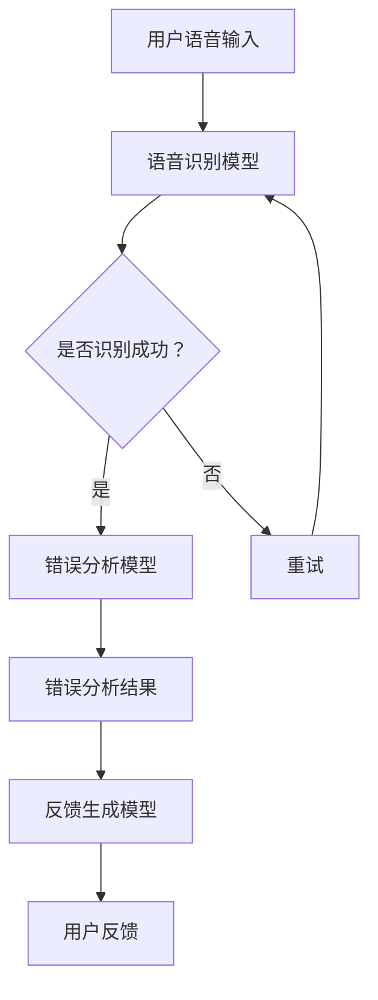
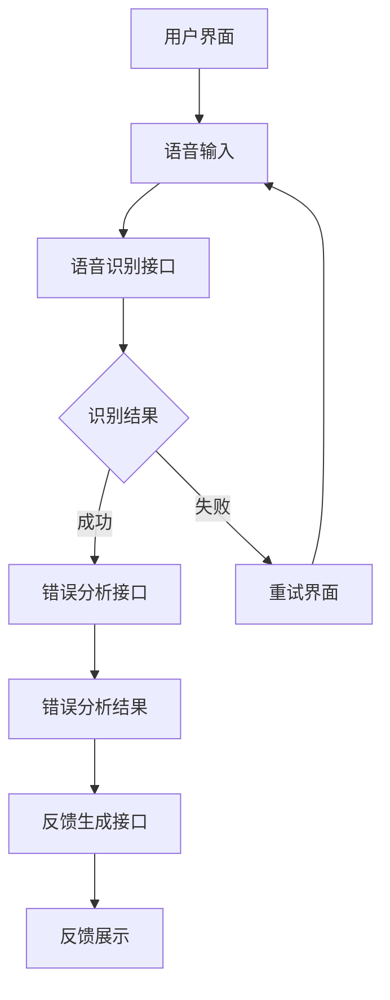
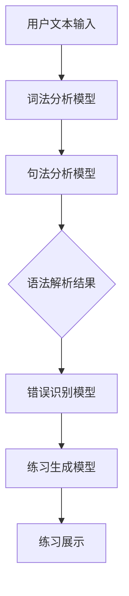
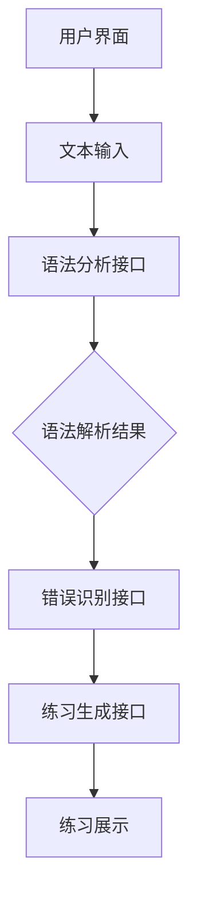
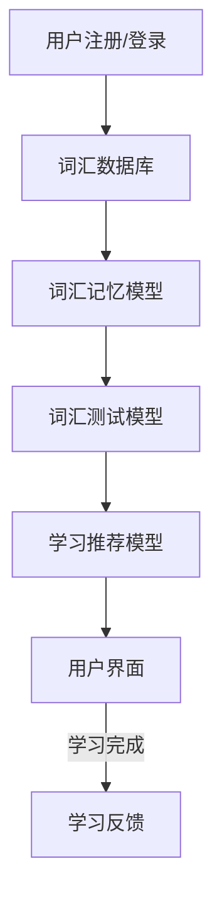
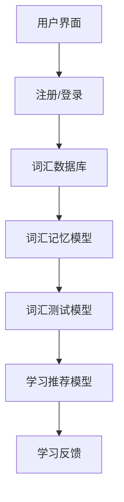

                 

## 文章标题：《ChatGPT在语言习得理论创新中的应用：探索多元智能语言学习模型》

### 关键词：
- ChatGPT
- 语言习得理论
- 多元智能语言学习模型
- 教育技术
- 人工智能

### 摘要：
本文旨在探讨ChatGPT这一先进的人工智能技术在语言习得理论中的创新应用，尤其是在多元智能语言学习模型的构建与实践。我们将逐步分析ChatGPT的基本原理和功能，探讨其在第二语言习得、第一语言习得以及多语言习得中的具体应用，并深入探索如何结合多元智能理论构建高效的语言学习模型。本文通过详细案例分析，总结了ChatGPT在语言习得中的成功经验与潜在挑战，展望了未来语言习得理论的发展方向。

## 目录大纲：

### 第一部分：语言习得理论概述

### 第1章：语言习得理论的背景与发展

#### 1.1.1 语言习得理论的历史演变
#### 1.1.2 语言习得理论的关键概念
#### 1.1.3 语言习得理论在语言教育中的应用

### 第2章：ChatGPT概述

#### 2.1 ChatGPT的基本原理
#### 2.2 ChatGPT的语言理解与生成能力
#### 2.3 ChatGPT在教育领域的应用潜力

### 第二部分：ChatGPT在语言习得理论中的应用

### 第3章：ChatGPT在第二语言习得中的应用

#### 3.1 ChatGPT在第二语言教学中的具体应用
#### 3.1.1 听力理解
#### 3.1.2 语法学习
#### 3.1.3 词汇学习
#### 3.1.4 交流互动

### 第4章：ChatGPT在第一语言习得中的应用

#### 4.1 ChatGPT在儿童语言习得中的角色
#### 4.1.1 语音学习
#### 4.1.2 词汇积累
#### 4.1.3 语法掌握
#### 4.1.4 语言表达

### 第5章：ChatGPT在多语言习得中的应用

#### 5.1 ChatGPT在多语言学习中的优势
#### 5.1.1 语言之间的交互与迁移
#### 5.1.2 多语言环境的构建
#### 5.1.3 语言学习策略的个性化

### 第三部分：多元智能语言学习模型探索

### 第6章：多元智能理论概述

#### 6.1 加德纳的多元智能理论
#### 6.2 多元智能理论在语言学习中的应用
#### 6.3 多元智能理论下的语言学习策略

### 第7章：多元智能语言学习模型构建

#### 7.1 模型构建原则与框架
#### 7.1.1 智能识别与分类
#### 7.1.2 智能分析与评估
#### 7.1.3 智能培养与提升

### 第8章：多元智能语言学习模型实践

#### 8.1 模型实践案例
#### 8.1.1 案例一：智能语音识别与反馈系统
#### 8.1.2 案例二：智能语法分析辅助工具
#### 8.1.3 案例三：智能词汇学习平台

### 第四部分：结论与展望

### 第9章：ChatGPT与多元智能语言学习模型的未来展望

#### 9.1 语言习得理论的创新与发展
#### 9.2 多元智能语言学习模型的教育实践
#### 9.3 未来发展方向与挑战

## 第1章：语言习得理论的背景与发展

### 1.1.1 语言习得理论的历史演变

语言习得理论的研究始于20世纪中叶，旨在解释人类如何学习语言。从早期的行为主义理论到后来的认知主义理论，再到现代的社交互动理论，语言习得理论经历了多次重大的变革和发展。

行为主义理论认为，语言学习是通过模仿和强化来实现的。这一理论主要关注外部刺激和反应的关联，而忽视了内部认知过程。尽管行为主义理论在解释语言学习的一些现象方面具有一定的解释力，但它无法解释儿童在习得母语时的自发性、创造性和快速进步。

随着认知科学的发展，认知主义理论开始占据主导地位。该理论强调内部认知过程，认为语言习得是一种心理建构过程。乔姆斯基的“先天语言能力”假设提出了“语言习得装置”（LAD）的概念，认为儿童天生具有学习语言的能力。这一理论为语言习得研究提供了新的视角，并推动了语言习得机制的研究。

社交互动理论则强调社会和文化因素在语言习得中的作用。该理论认为，语言学习不仅仅是个体内部的心理过程，还涉及到与他人互动的社交过程。维果茨基的“最近发展区”概念强调了社会互动在儿童语言习得中的关键作用，指出通过与他人互动，儿童可以跨越自己的认知边界，实现更高级的语言能力。

近年来，语言习得理论的研究进一步融合了生物学、神经科学和认知科学的研究成果，形成了一种综合性的语言习得模型。这一模型不仅考虑了遗传因素、大脑发展、认知过程，还考虑了社会和文化背景的影响。

### 1.1.2 语言习得理论的关键概念

在语言习得理论中，有几个关键概念需要理解，这些概念为我们提供了理解语言习得过程的基础。

**语言习得装置（LAD）**：这是乔姆斯基提出的一个假说，认为儿童天生具有一种学习语言的能力，这种能力被称为“语言习得装置”（Language Acquisition Device）。LAD使得儿童能够理解语言规则，并从中推导出新的句子结构。

**输入假说（Input Hypothesis）**：这是克拉申提出的第二语言习得理论，认为语言习得需要可理解的输入。输入假说认为，如果学习者能够接触到可理解的语言输入，他们就能够习得语言。

**最近发展区（Zone of Proximal Development, ZPD）**：这是维果茨基提出的一个概念，指的是儿童通过与他人互动能够达到的潜在发展水平。ZPD强调了社会互动在学习过程中的作用，认为通过与他人合作，儿童可以跨越自己的认知边界。

**互动理论（Interactive Theory）**：这是布朗提出的理论，认为语言习得是一个互动的过程，涉及学习者、教师和语境之间的相互作用。互动理论强调了语言习得的动态性和灵活性。

**跨文化语言习得（Intercultural Language Learning）**：随着全球化的发展，跨文化语言习得成为了一个重要的研究领域。跨文化语言习得关注学习者如何在不同的文化背景下习得语言，并如何将语言学习与文化知识相结合。

### 1.1.3 语言习得理论在语言教育中的应用

语言习得理论对语言教育有着深远的影响。以下是一些语言习得理论在语言教育中的应用：

**早期语言教育**：语言习得理论强调了儿童学习语言的关键期，这为早期语言教育提供了理论基础。早期语言教育注重创造一个自然的语言环境，以促进儿童的语言发展。

**第二语言习得**：输入假说和互动理论在第二语言习得教学中得到了广泛应用。教师通过设计可理解的语言输入和互动活动，帮助学习者更有效地习得第二语言。

**语言教学策略**：语言习得理论指导了各种语言教学策略的设计。例如，任务型语言教学、交际语言教学和合作学习都是基于语言习得理论的实践方法。

**多文化教育**：跨文化语言习得理论促使教育者关注不同文化背景下的语言学习，设计出适合多元文化的教学方法和课程。

总之，语言习得理论为我们提供了理解语言学习过程和设计有效教学策略的框架。随着ChatGPT等人工智能技术的发展，语言习得理论在语言教育中的应用将变得更加多样化和高效。

## 第2章：ChatGPT概述

### 2.1 ChatGPT的基本原理

ChatGPT是由OpenAI开发的一种基于Transformer架构的大型语言模型。它通过处理海量文本数据，学习语言的自然结构和语义信息，从而具备了强大的语言理解与生成能力。

#### 2.1.1 Transformer架构

Transformer架构是一种深度学习模型，特别适用于处理序列数据。它通过自注意力机制（Self-Attention Mechanism）和编码器-解码器结构（Encoder-Decoder Structure）来捕捉序列之间的关联。

自注意力机制使得模型能够在每个位置上都考虑到整个输入序列的信息，从而更好地理解上下文。编码器-解码器结构则用于生成输出序列，编码器将输入序列编码成固定长度的向量，解码器则使用这些向量生成文本。

#### 2.1.2 语言理解与生成能力

ChatGPT具有出色的语言理解与生成能力。在语言理解方面，模型能够识别文本中的实体、关系和语义，理解句子和段落的整体意义。在语言生成方面，模型能够生成连贯、自然的文本，包括回答问题、撰写文章、生成对话等。

#### 2.1.3 训练过程

ChatGPT的训练过程是一个庞大的数据驱动过程。模型首先通过预训练学习文本数据的统计规律和语言结构，然后通过微调（Fine-tuning）来适应特定的任务和应用场景。预训练使用的是无监督学习，而微调则是监督学习，通过提供标注数据来优化模型。

#### 2.1.4 应用场景

ChatGPT在多个领域都有广泛的应用，包括自然语言处理、机器翻译、文本生成、问答系统等。在教育领域，ChatGPT可以用于个性化教学、语言辅助工具、自动化评估等。

### 2.2 ChatGPT的语言理解与生成能力

#### 2.2.1 语言理解

ChatGPT的语言理解能力体现在多个方面。首先，模型能够识别文本中的关键词和短语，理解它们的含义和上下文。其次，模型能够识别文本中的语法结构，理解句子的构成和语义关系。最后，模型能够理解文本的整体意义，捕捉文本的意图和情感。

#### 2.2.2 语言生成

ChatGPT的语言生成能力使得它能够根据输入的提示生成连贯的文本。模型能够生成各种类型的文本，包括问答、故事、新闻文章、对话等。生成文本的质量和连贯性取决于模型的学习和数据的质量。

#### 2.2.3 模型应用

在实际应用中，ChatGPT的语言生成能力可以用于多种任务。例如，在问答系统中，模型可以回答用户提出的问题；在文本生成系统中，模型可以撰写新闻文章、故事等。在教育领域，ChatGPT可以生成个性化的教学内容和评估学生的语言水平。

### 2.3 ChatGPT在教育领域的应用潜力

#### 2.3.1 个性化教学

ChatGPT可以根据学生的具体需求和水平提供个性化的教学内容。通过分析学生的回答，模型可以识别学生的强项和弱点，并提供相应的练习和指导。

#### 2.3.2 语言辅助工具

ChatGPT可以作为一种语言辅助工具，帮助学生进行听力理解、语法学习和词汇积累。模型可以生成真实场景中的对话，提供发音和语调指导，帮助学生提高语言表达和交流能力。

#### 2.3.3 自动化评估

ChatGPT可以自动评估学生的语言作业和考试，提供即时的反馈和评分。模型可以识别学生的错误类型，并提供详细的解释和建议，帮助学生提高语言能力。

#### 2.3.4 语言学习平台

ChatGPT可以作为语言学习平台的核心组件，与其他技术相结合，提供全方位的语言学习支持。平台可以包括语音识别、自然语言生成、互动对话等功能，为学生提供沉浸式的语言学习体验。

总之，ChatGPT在教育领域的应用潜力巨大。通过利用其强大的语言理解和生成能力，可以显著提高语言教学的效果和效率，为语言学习者提供更加个性化和有效的学习体验。

### 3.1 ChatGPT在第二语言习得中的应用

#### 3.1.1 听力理解

ChatGPT在听力理解方面具有显著的优势。通过处理大量听力材料，模型可以学习不同的语音、语调和发音规则，从而更准确地理解听力内容。在实际应用中，ChatGPT可以作为听力训练工具，生成真实场景中的对话和讲座，提供多种听力材料供学生练习。同时，模型可以实时评估学生的听力理解能力，提供即时反馈，帮助学生在听力方面取得进步。

#### 3.1.2 语法学习

语法学习是第二语言习得中的重要组成部分。ChatGPT通过学习大量的语言数据，可以准确理解语法规则和句子结构。在语法学习中，ChatGPT可以提供语法解析工具，帮助学生理解复杂的语法现象。此外，模型还可以生成各种语法练习题，包括填空题、选择题和改错题等，为学生提供丰富的练习资源。通过分析学生的答案，模型可以识别学习者的语法弱点，并提供详细的解释和建议，帮助学生巩固语法知识。

#### 3.1.3 词汇学习

词汇学习是语言习得的基础。ChatGPT通过学习大量的文本数据，可以准确理解词汇的含义、用法和上下文。在实际应用中，ChatGPT可以作为词汇学习工具，提供词汇记忆和复习功能。例如，模型可以生成词汇卡片，包括词汇的定义、例句和同义词等，帮助学生记忆和掌握新词汇。此外，ChatGPT还可以根据学生的词汇掌握情况，提供个性化的词汇学习建议，提高学习效率。

#### 3.1.4 交流互动

交流互动是语言习得中的重要环节。ChatGPT可以通过模拟真实的语言交流环境，提供互动式语言学习体验。在实际应用中，ChatGPT可以与学习者进行对话，模拟不同场景下的交流互动。例如，模型可以模拟商务谈判、日常对话、学术讨论等场景，帮助学生提高实际语言运用能力。通过分析学习者的回答，ChatGPT可以提供即时反馈和纠正，帮助学生改进语言表达和交流技巧。

### 3.1.5 具体案例分析

以下是一个具体案例，展示了ChatGPT在第二语言习得中的应用：

**案例一：语法学习**

学生小明在学习英语时遇到了语法难题，特别是在动词时态上。他使用了一个基于ChatGPT的语法学习工具，该工具提供了丰富的练习题和解释。小明通过完成练习题，逐步掌握了不同时态的使用规则。在每次练习后，ChatGPT都会提供详细的解析和纠正，帮助小明理解自己的错误并找到改进的方法。

**案例二：听力理解**

小华是一名即将参加英语听力考试的学生。她使用ChatGPT生成的听力训练材料进行日常练习。ChatGPT提供了不同难度和主题的听力材料，包括新闻、讲座和对话等。小华在完成听力任务后，ChatGPT会分析她的听力理解情况，提供正确的答案和详细的解析。通过这种练习，小华的听力理解能力得到了显著提高。

**案例三：词汇学习**

小李在学习英语词汇时，使用了ChatGPT提供的词汇学习工具。ChatGPT为他生成了大量的词汇卡片，包括单词的定义、例句和同义词。小李通过每天记忆和复习这些词汇卡片，逐渐扩大了自己的词汇量。ChatGPT还根据小李的词汇掌握情况，提供了个性化的学习建议，帮助他更加高效地学习新词汇。

**案例四：交流互动**

小明在学习了一段时间的英语后，想要提高实际交流能力。他使用ChatGPT进行了模拟对话练习。ChatGPT模拟了各种场景下的对话，例如商务谈判、社交互动和学术讨论等。小明在与ChatGPT的对话中，不仅练习了语言表达，还学习了如何在不同场景下使用适当的语言。通过这种互动式学习，小明的实际交流能力得到了显著提升。

总之，ChatGPT在第二语言习得中的应用展示了其强大的语言处理能力和灵活性。通过提供个性化的学习资源、即时反馈和互动体验，ChatGPT帮助学习者更有效地习得第二语言，提高了语言教学的效果和效率。

### 4.1 ChatGPT在第一语言习得中的应用

#### 4.1.1 语音学习

语音学习是儿童第一语言习得的重要环节。ChatGPT通过学习大量的语音数据，可以准确识别和理解各种语言的发音规则。在实际应用中，ChatGPT可以作为语音训练工具，提供发音指导。例如，ChatGPT可以播放正确的发音示例，让儿童模仿并纠正自己的发音。通过分析儿童的发音，ChatGPT可以提供即时的反馈和纠正，帮助他们提高语音准确性。

#### 4.1.2 词汇积累

词汇积累是儿童语言习得的基础。ChatGPT通过学习大量的文本数据，可以准确理解词汇的含义和用法。在实际应用中，ChatGPT可以作为词汇学习工具，提供词汇记忆和复习功能。例如，ChatGPT可以生成词汇卡片，包括单词的定义、例句和图片等，帮助儿童记忆和掌握新词汇。此外，ChatGPT还可以根据儿童的词汇掌握情况，提供个性化的学习建议，提高学习效率。

#### 4.1.3 语法掌握

语法掌握是儿童语言习得的关键。ChatGPT通过学习大量的语法规则，可以准确理解和解释各种语法现象。在实际应用中，ChatGPT可以作为语法学习工具，提供语法解析和练习。例如，ChatGPT可以解释不同语法结构的使用方法，并提供语法练习题，帮助儿童理解和掌握语法规则。通过分析儿童的答案，ChatGPT可以提供详细的解析和纠正，帮助他们巩固语法知识。

#### 4.1.4 语言表达

语言表达是儿童语言习得的重要目标。ChatGPT可以通过生成连贯的文本，帮助儿童提高语言表达和交流能力。在实际应用中，ChatGPT可以作为语言训练工具，提供语言生成和互动功能。例如，ChatGPT可以与儿童进行对话，模拟不同的交流场景，帮助他们练习语言表达和交流技巧。通过分析儿童的语言表达，ChatGPT可以提供即时的反馈和纠正，帮助他们提高语言水平。

### 4.1.5 具体案例分析

以下是一个具体案例，展示了ChatGPT在第一语言习得中的应用：

**案例一：语音学习**

小明的母亲在使用ChatGPT为小明进行语音训练。ChatGPT提供了多种语音示例，包括单词和句子的正确发音。小明通过反复听和模仿这些示例，逐渐提高了自己的语音准确性。ChatGPT会实时分析小明的发音，提供详细的反馈和纠正，帮助他改进发音技巧。

**案例二：词汇积累**

小红的老师使用ChatGPT帮助她进行词汇学习。ChatGPT生成了词汇卡片，包括单词的定义、例句和图片等。小红通过每天记忆和复习这些词汇卡片，逐渐扩大了自己的词汇量。ChatGPT还会根据小红的词汇掌握情况，提供个性化的学习建议，帮助她更加高效地学习新词汇。

**案例三：语法掌握**

小刚在学习英语语法时，使用了ChatGPT提供的语法学习工具。ChatGPT解释了不同语法结构的使用方法，并提供了一系列语法练习题。小刚通过完成这些练习题，逐步掌握了英语的语法规则。ChatGPT会分析小刚的答案，提供详细的解析和纠正，帮助他巩固语法知识。

**案例四：语言表达**

小英在参加学校英语演讲比赛前，使用了ChatGPT进行语言表达训练。ChatGPT与她进行了模拟对话，模拟了不同演讲场景，帮助她练习语言表达和交流技巧。ChatGPT会实时分析小英的语言表达，提供即时的反馈和纠正，帮助她提高语言水平。

总之，ChatGPT在第一语言习得中的应用展示了其强大的语言处理能力和适应性。通过提供个性化的语音学习、词汇积累、语法掌握和语言表达训练，ChatGPT帮助儿童更有效地习得第一语言，提高了语言教育的效果和效率。

### 5.1 ChatGPT在多语言习得中的应用

#### 5.1.1 语言之间的交互与迁移

ChatGPT在多语言习得中的一个重要优势是它能够促进语言之间的交互与迁移。通过处理大量的多语言数据，ChatGPT可以学习不同语言之间的共性和差异。在实际应用中，ChatGPT可以作为跨语言学习的辅助工具，帮助学习者将一种语言的知识应用到另一种语言中。例如，一个英语学习者可以使用ChatGPT来理解法语句子的结构和语法规则，从而提高法语水平。同样，ChatGPT可以帮助学习者通过英语学习西班牙语，通过汉语学习日语等，实现语言知识的迁移和扩展。

#### 5.1.2 多语言环境的构建

多语言环境的构建是提高学习者语言能力的重要途径。ChatGPT可以通过生成各种语言场景的对话和文本，为学习者提供一个丰富的多语言学习环境。在实际应用中，ChatGPT可以模拟多种语言交流的场景，如国际会议、跨国商务合作、文化交流等。这些场景不仅有助于学习者提高语言表达能力，还能增强他们的跨文化交际能力。例如，ChatGPT可以生成模拟的商务会议对话，让学习者练习英语和法语的双语沟通。通过这种多语言环境的学习，学习者可以更自然地运用多种语言，提高语言综合运用能力。

#### 5.1.3 语言学习策略的个性化

个性化学习策略是现代教育的重要理念之一。ChatGPT可以根据学习者的语言水平、学习需求和兴趣，提供个性化的学习建议和资源。在实际应用中，ChatGPT可以分析学习者的语言习得数据，识别他们的强项和弱点，然后根据这些信息为学习者定制个性化的学习计划。例如，一个英语学习者可能对商务英语感兴趣，ChatGPT可以为他提供与商务相关的语言材料，同时针对他的弱点提供相应的练习和辅导。此外，ChatGPT还可以根据学习者的学习进度和反馈，动态调整学习内容和方法，确保学习者始终处于最佳的学习状态。

### 5.1.4 具体案例分析

以下是一个具体案例，展示了ChatGPT在多语言习得中的应用：

**案例一：跨语言学习**

小明是一名英语和日语学习者。他使用ChatGPT来辅助跨语言学习。ChatGPT为他提供了大量的英语和日语语言材料，包括文本、音频和视频。通过分析小明的学习数据，ChatGPT识别出他在日语动词时态上的弱点，并为他提供了相关的练习和辅导。同时，ChatGPT还帮助小明将英语语法知识应用到日语学习中，提高了他的语言综合运用能力。

**案例二：多语言环境构建**

小红的学校引入了ChatGPT作为语言学习工具，为学生提供了一个多语言学习环境。ChatGPT模拟了各种语言交流场景，如国际会议、文化交流和商务合作等。学生们通过参与这些模拟场景的对话，不仅提高了语言表达能力，还学习了如何在不同文化背景下进行有效的沟通。

**案例三：个性化学习策略**

小刚是一名法语学习者。ChatGPT根据他的学习数据，为他定制了个性化的学习计划。ChatGPT为他提供了与法语相关的电影、音乐和新闻文章，同时根据他的兴趣和学习进度，推荐了适合的学习资源和练习题。通过这种个性化的学习策略，小刚的法语水平得到了显著提高。

总之，ChatGPT在多语言习得中的应用展示了其强大的语言处理能力和适应性。通过促进语言之间的交互与迁移、构建多语言环境和提供个性化学习策略，ChatGPT为学习者提供了一个高效、灵活和丰富的语言学习平台，帮助他们更全面地掌握多种语言。

## 第6章：多元智能理论概述

### 6.1 加德纳的多元智能理论

多元智能理论是由心理学家霍华德·加德纳于1983年提出的，旨在挑战传统的智力单一性观念。加德纳认为，智力不仅仅是语言智能和数学智能，而是由多种不同类型的智能构成。他的理论基于多年的研究和观察，提出以下八大智能：

1. **语言智能**：指有效地使用口头和书面语言的能力，包括阅读、写作和演讲等方面。
2. **逻辑-数学智能**：指有效地运用数字和逻辑推理的能力，包括数学运算、逻辑分析和解决问题的能力。
3. **空间智能**：指有效地感知和运用空间信息的能力，包括绘画、雕塑和建筑等方面。
4. **音乐智能**：指有效地感知和创作音乐的能力，包括唱歌、演奏乐器和作曲等方面。
5. **身体-运动智能**：指有效地使用身体和四肢的能力，包括体育活动、舞蹈和手工艺等方面。
6. **人际智能**：指有效地理解他人情感和意图的能力，包括人际交往、团队合作和领导能力等方面。
7. **自我认知智能**：指有效地认识自我、管理自我情绪和实现个人目标的能力。
8. **自然智能**：指有效地理解自然界和生物的能力，包括生物、地质和环境等方面。

### 6.2 多元智能理论在语言学习中的应用

多元智能理论在语言学习中的应用具有深远的意义。根据加德纳的理论，每个学习者都有其独特的智能组合，语言学习不仅仅是记忆单词和语法规则，而是多种智能的综合体现。

**语言智能与语言学习**：语言智能强的学生在学习语言时表现出较强的阅读、写作和口语能力。这些学生通常能够迅速掌握语言的基本结构和表达方式，并且在语言交流中更加自信和流畅。

**逻辑-数学智能与语言学习**：逻辑-数学智能强的学生在语言学习中往往表现出较强的分析能力和逻辑思维。他们能够更好地理解语法结构和句子含义，并通过逻辑推理解决语言学习中的问题。

**空间智能与语言学习**：空间智能强的学生能够更好地理解和记忆语言的视觉和空间结构。他们可以通过图像和图表来帮助记忆单词和短语，并在写作中更好地运用语言的视觉表达。

**音乐智能与语言学习**：音乐智能强的学生可以通过音乐来增强语言学习的体验。例如，通过听歌曲来学习新单词和短语，或者在写作中运用音乐元素来增强文本的表达效果。

**身体-运动智能与语言学习**：身体-运动智能强的学生可以通过身体动作和手势来辅助语言学习。他们可以通过角色扮演、模仿和表演来增强语言交流的互动性和趣味性。

**人际智能与语言学习**：人际智能强的学生在语言学习过程中更擅长与人交流和合作。他们能够更好地理解他人的语言需求和意图，并通过社交互动来提高语言表达能力。

**自我认知智能与语言学习**：自我认知智能强的学生能够更好地管理自己的情绪和注意力，从而更有效地进行语言学习。他们能够设定学习目标，监控自己的学习进度，并在遇到困难时保持积极的态度。

**自然智能与语言学习**：自然智能强的学生对自然界和生物有浓厚的兴趣，这可以激发他们对语言学习的热情。例如，通过学习生物名称和描述自然现象的词汇来提高语言能力。

### 6.3 多元智能理论下的语言学习策略

多元智能理论为语言学习提供了多样化的策略，以下是一些具体的应用：

**1. 个性化学习计划**：根据学习者的多元智能组合，制定个性化的学习计划。例如，对于语言智能强的学生，可以增加阅读和写作的练习；对于逻辑-数学智能强的学生，可以设计更多逻辑分析和语法练习。

**2. 多样化的教学方式**：结合多种智能类型，采用多样化的教学方式。例如，通过视觉 aids（如图片、图表和视频）来辅助语言学习，通过音乐和身体动作来增强记忆和表达。

**3. 项目式学习**：鼓励学习者通过项目式学习来综合运用多种智能。例如，通过角色扮演、小组讨论和演讲等实践活动，将语言学习与人际智能和自我认知智能相结合。

**4. 自我反思与评估**：鼓励学习者进行自我反思和评估，了解自己在不同智能领域的学习情况，并根据反馈调整学习策略。

**5. 跨学科学习**：将语言学习与其他学科相结合，例如通过学习地理和历史文化来提高语言学习的兴趣和深度。

总之，多元智能理论为语言学习提供了更加全面和个性化的视角，通过结合多种智能类型，可以显著提高语言学习的效果和兴趣。

### 7.1 多元智能语言学习模型构建

#### 7.1.1 模型构建原则与框架

构建多元智能语言学习模型的原则与框架应充分考虑个体差异和学习者的多元智能组合。以下是构建模型的关键原则和基本框架：

**1. 原则**

**个性化原则**：根据学习者的智能类型和水平，提供个性化的学习路径和资源。

**综合应用原则**：结合不同智能类型，利用多种教学方式和工具，促进学习者全面语言能力的发展。

**动态调整原则**：根据学习者的学习进度和反馈，动态调整学习内容和策略，确保学习效果的最大化。

**2. 框架**

**智能识别与分类**：首先，通过评估工具识别学习者的智能类型和水平，包括语言智能、逻辑-数学智能、空间智能、音乐智能等。这些评估工具可以是标准化的智能测试，也可以是日常观察和访谈。

**智能分析与评估**：对识别出的智能类型进行深入分析，评估每个智能在语言学习中的表现和潜力。通过数据分析，了解学习者在不同智能领域的优势和劣势，为后续学习策略的制定提供依据。

**智能培养与提升**：根据智能分析和评估结果，制定个性化的培养计划，通过针对性训练和指导，提升学习者在各个智能领域的语言学习能力。

**学习内容与资源整合**：结合多元智能框架，整合多种教学资源和内容，包括语言材料、互动工具、多媒体资源等。设计多样化的学习任务和活动，鼓励学习者综合运用不同智能类型，提高语言学习的兴趣和效果。

**反馈与评估系统**：建立反馈与评估系统，定期监测学习者的学习进度和效果。通过数据分析，及时调整学习策略和资源，确保学习目标的实现。

**3. 智能识别与分类**

**智能识别工具**：智能识别工具包括标准化的智能测试、日常观察、访谈和自我评估问卷等。这些工具可以提供详细的数据，帮助识别学习者的智能类型和水平。

**智能分类方法**：根据识别结果，将学习者分为不同的智能类型。例如，根据加德纳的多元智能理论，可以将学习者分为语言智能型、逻辑-数学智能型、空间智能型等。分类方法可以是基于分数、观察结果或问卷答案的量化分析。

**4. 智能分析与评估**

**数据分析**：对识别出的智能类型进行数据分析，评估每个智能在语言学习中的表现和潜力。使用统计方法和数据可视化工具，如折线图、柱状图和饼图等，呈现分析结果。

**智能表现评估**：根据数据分析结果，评估学习者在不同智能领域的表现和进步。例如，对于语言智能型学习者，评估其阅读理解、口语表达和写作能力的提升情况；对于逻辑-数学智能型学习者，评估其语法掌握、逻辑推理和问题解决能力等。

**5. 智能培养与提升**

**培养计划**：根据智能分析和评估结果，制定个性化的培养计划。培养计划应包括具体的训练目标、学习资源和实践任务。例如，对于语言智能型学习者，可以增加阅读和写作练习，同时结合音乐智能，使用歌曲和诗歌辅助学习。

**针对性训练**：针对学习者在不同智能领域的优势和劣势，设计针对性的训练和指导。例如，对于空间智能型学习者，可以增加视觉辅助工具和图像学习资源；对于人际智能型学习者，可以提供更多社交互动和团队合作机会。

**评估与反馈**：定期评估学习者在培养计划中的进步，提供及时的反馈和指导。通过数据分析和互动反馈，帮助学习者了解自己的学习情况，调整学习策略。

**6. 学习内容与资源整合**

**综合资源**：整合多种学习资源，包括文本、音频、视频、互动工具和多媒体资源等。这些资源应根据学习者的智能类型和兴趣进行个性化配置。

**多样化教学方式**：结合多元智能框架，采用多样化的教学方式，如游戏化学习、互动式教学、项目式学习等。这些方式可以激发学习者的兴趣，提高学习效果。

**互动与协作**：鼓励学习者之间的互动和协作，通过小组讨论、角色扮演和合作项目等，提高人际智能和自我认知智能。

**7. 反馈与评估系统**

**实时反馈**：建立实时反馈系统，及时收集学习者的学习进度和效果数据。通过数据分析，提供个性化的学习建议和资源。

**定期评估**：定期进行学习评估，检查学习目标的实现情况。通过评估结果，调整学习策略和资源，确保学习目标的持续实现。

**持续改进**：根据反馈和评估结果，持续改进学习模型和教学策略，确保学习效果的最大化。

总之，多元智能语言学习模型的构建应遵循个性化、综合应用和动态调整的原则，通过智能识别与分类、智能分析与评估、智能培养与提升、学习内容与资源整合以及反馈与评估系统，为学习者提供全面、个性化的语言学习支持。

#### 7.1.2 智能识别与分类

智能识别与分类是构建多元智能语言学习模型的基础步骤。通过准确识别和分类学习者的智能类型，可以为后续的个性化教学和培养计划提供科学依据。

**智能识别工具**

智能识别工具包括多种类型，如标准化的智能测试、日常观察和访谈等。以下是一些常用的智能识别工具：

1. **标准化智能测试**：如韦氏智力量表（Wechsler Adult Intelligence Scale, WAIS）、加德纳智能评估测试（Gardner's Multiple Intelligences Assessment Battery, GMA）等。这些测试通过定量分析，评估学习者在不同智能领域的得分和表现。

2. **日常观察**：教师和家长可以通过日常观察，了解学习者在不同情境下的行为和表现。例如，观察他们在语言表达、逻辑推理、空间感知、音乐欣赏等方面的能力。

3. **访谈**：通过一对一的访谈，教师和家长可以深入了解学习者的兴趣、优点和挑战。访谈内容可以涉及学习者在不同领域的活动参与、成就感和困难等方面。

**智能分类方法**

智能识别结果需要通过科学的方法进行分类，以明确学习者的智能类型。以下是一些常用的智能分类方法：

1. **加德纳多元智能理论**：根据加德纳的多元智能理论，将智能分为语言智能、逻辑-数学智能、空间智能、音乐智能、身体-运动智能、人际智能、自我认知智能和自然智能。每个智能类型都有其独特的特征和能力。例如，语言智能型学习者通常具有较强的阅读、写作和口语能力；逻辑-数学智能型学习者则擅长逻辑分析和问题解决。

2. **量化的得分分析**：通过标准化智能测试的得分，对学习者的智能水平进行量化分析。例如，根据加德纳智能评估测试的得分，将学习者分为不同等级，如高水平、中水平和低水平等。这种方法可以帮助明确学习者在各个智能领域的优势和劣势。

3. **行为表现评估**：通过日常观察和访谈，评估学习者在实际情境中的行为表现。例如，通过观察学习者在课堂上的发言、小组讨论和作业完成情况，评估其语言智能和人际智能。这种方法可以提供更为直观和具体的评估结果。

**智能识别与分类的流程**

智能识别与分类的流程通常包括以下几个步骤：

1. **测试与评估**：首先，通过标准化智能测试和日常观察，收集学习者的智能数据。

2. **数据分析**：对收集到的数据进行定量分析，确定学习者在各个智能领域的得分和表现。

3. **分类判断**：根据数据分析结果，运用加德纳多元智能理论或其他分类方法，对学习者的智能类型进行判断和分类。

4. **反馈与确认**：将分类结果反馈给学习者，与其进行讨论和确认，确保分类结果的准确性和合理性。

**智能识别与分类的应用**

智能识别与分类在多元智能语言学习模型中具有重要作用，以下是其具体应用：

1. **个性化教学**：根据学习者的智能类型和水平，制定个性化的教学计划和资源。例如，对于语言智能型学习者，可以增加阅读和写作练习；对于逻辑-数学智能型学习者，可以设计更多逻辑分析和语法练习。

2. **培养计划**：根据智能类型和水平，设计针对性的培养计划。例如，对于空间智能型学习者，可以增加视觉辅助工具和图像学习资源；对于人际智能型学习者，可以提供更多社交互动和团队合作机会。

3. **评估与调整**：定期进行智能评估和分类，监测学习者在各个智能领域的进步和变化。根据评估结果，及时调整教学策略和资源，确保学习目标的实现。

总之，智能识别与分类是构建多元智能语言学习模型的关键步骤。通过科学的方法和工具，准确识别和分类学习者的智能类型，可以为个性化教学和培养计划提供有力的支持，提高语言学习的效果和兴趣。

#### 7.1.3 智能分析与评估

智能分析与评估是构建多元智能语言学习模型的重要环节。通过对学习者智能类型的深入分析，可以明确其在不同智能领域的表现和潜力，为制定有效的培养计划提供科学依据。

**1. 数据收集**

智能分析与评估首先需要收集相关的数据。这些数据可以来源于多种渠道，包括：

- **标准化智能测试**：如韦氏智力量表（WAIS）、加德纳智能评估测试（GMA）等，这些测试可以提供系统化的智能评估数据。
- **日常观察**：教师和家长可以通过日常观察，记录学习者在不同情境下的行为和表现。例如，观察学习者在课堂讨论、小组合作和课外活动中的表现。
- **访谈**：通过与学习者进行一对一的访谈，深入了解其兴趣、优点和挑战。访谈内容可以涉及学习者在不同领域的活动参与、成就感和困难等方面。

**2. 数据分析**

数据分析是智能分析与评估的核心步骤。通过定量和定性的分析方法，可以深入了解学习者在各个智能领域的表现和潜力。以下是一些常用的数据分析方法：

- **定量分析**：使用统计方法，对收集到的数据进行分析。例如，通过计算平均分、标准差和相关性等指标，评估学习者在不同智能领域的得分和表现。
- **定性分析**：通过内容分析和主题分析，深入理解学习者在不同情境下的行为和表现。例如，通过分析学习者在课堂讨论中的发言内容，评估其语言智能和人际智能。

**3. 智能表现评估**

通过数据分析，可以评估学习者在各个智能领域的表现和进步。以下是一些具体的评估指标和方法：

- **语言智能**：评估学习者在阅读理解、口语表达和写作能力方面的表现。例如，通过测试学习者的阅读理解能力，计算正确率和反应时间；通过口语表达测试，评估其发音、流畅度和表达清晰度；通过写作评估，检查其语法、词汇和结构。
- **逻辑-数学智能**：评估学习者在逻辑推理、问题解决和数学运算方面的能力。例如，通过逻辑问题解决测试，评估其推理能力和策略选择；通过数学运算测试，评估其计算速度和准确性。
- **空间智能**：评估学习者在空间感知、视觉记忆和图形识别方面的表现。例如，通过空间认知测试，评估其空间定位和形状识别能力；通过视觉记忆测试，评估其图像记忆和再现能力。
- **音乐智能**：评估学习者在音乐感知、音乐创作和节奏感方面的能力。例如，通过音乐听辨测试，评估其对音乐元素的理解和辨识能力；通过音乐创作测试，评估其音乐创作和表达技巧。

**4. 智能潜力分析**

除了评估当前表现，智能分析与评估还应关注学习者在未来智能发展中的潜力。以下是一些方法：

- **趋势分析**：通过历史数据，分析学习者在各个智能领域的发展趋势。例如，通过比较不同年龄段的学习数据，预测其未来在某个智能领域的表现。
- **潜力评估**：结合标准化智能测试和日常观察，评估学习者在某个智能领域的潜在发展水平。例如，如果一个学习者在音乐智能测试中表现出色，且表现出对音乐浓厚的兴趣和才华，可以预测其未来在该领域的潜力。

**5. 反馈与调整**

智能分析与评估的结果应反馈给学习者，与其进行讨论和确认。通过分析结果，教师和家长可以了解学习者在不同智能领域的优势和劣势，为制定个性化的培养计划提供依据。例如，如果一个学习者在空间智能方面表现突出，教师可以增加与此相关的语言学习活动，如地图阅读和空间词汇练习。

**6. 持续监测**

智能分析与评估是一个持续的过程。通过定期监测学习者的智能表现和潜力，可以及时调整培养计划和学习策略，确保学习目标的实现。例如，如果一个学习者在某个智能领域的表现有所下降，教师可以及时提供支持和指导，帮助其恢复和提升。

总之，智能分析与评估是构建多元智能语言学习模型的重要环节。通过科学的数据收集、分析和反馈，可以深入了解学习者在不同智能领域的表现和潜力，为个性化教学和培养计划提供有力支持。

#### 7.1.4 智能培养与提升

智能培养与提升是多元智能语言学习模型的核心目标之一。通过针对性的训练和指导，可以提升学习者在各个智能领域的语言能力，从而实现全面的语言发展。

**1. 语言智能培养与提升**

语言智能包括阅读理解、口语表达和写作能力。以下是一些具体的培养与提升方法：

- **阅读训练**：通过广泛阅读，培养学习者的阅读理解能力。教师可以推荐适合学习者水平的读物，并提供阅读指导，如阅读策略、词汇解释和情节预测等。同时，定期进行阅读理解测试，检查学习者的阅读理解水平。
- **口语训练**：通过模拟对话、角色扮演和演讲练习，提升学习者的口语表达能力。教师可以设计不同的语言交流场景，鼓励学习者进行口语表达，并给予及时的反馈和纠正。
- **写作训练**：通过写作练习，培养学习者的写作能力。教师可以提供写作主题和框架，指导学习者进行文章构思、结构和语言表达。同时，通过批改和点评，帮助学习者发现和改进写作中的问题。

**2. 逻辑-数学智能培养与提升**

逻辑-数学智能包括逻辑推理、问题解决和数学运算能力。以下是一些具体的培养与提升方法：

- **逻辑推理训练**：通过逻辑问题解决练习，培养学习者的逻辑思维能力。教师可以设计逻辑谜题、逻辑推理游戏和辩论活动等，激发学习者的逻辑推理兴趣和技能。
- **问题解决训练**：通过实际问题和模拟情境，培养学习者的问题解决能力。教师可以设计问题解决任务，如数学问题、科学实验和社会问题等，引导学习者分析问题、制定解决方案并评估结果。
- **数学运算训练**：通过数学练习和游戏，提升学习者的数学运算能力。教师可以设计不同的数学题目，如计算题、应用题和几何题等，鼓励学习者通过多种方法解决问题。

**3. 空间智能培养与提升**

空间智能包括空间感知、视觉记忆和图形识别能力。以下是一些具体的培养与提升方法：

- **空间感知训练**：通过视觉和触觉刺激，培养学习者的空间感知能力。教师可以设计空间感知游戏，如拼图、迷宫和立体模型等，帮助学习者发展空间感知能力。
- **视觉记忆训练**：通过视觉记忆练习，提升学习者的视觉记忆能力。教师可以设计视觉记忆卡片游戏，如记忆匹配和图片排序等，培养学习者的视觉记忆技能。
- **图形识别训练**：通过图形识别练习，提升学习者的图形识别能力。教师可以设计图形识别任务，如找不同、形状分类和图形匹配等，帮助学习者提高图形识别技能。

**4. 音乐智能培养与提升**

音乐智能包括音乐感知、音乐创作和节奏感。以下是一些具体的培养与提升方法：

- **音乐感知训练**：通过音乐听辨和音乐欣赏活动，培养学习者的音乐感知能力。教师可以播放不同的音乐作品，引导学习者辨别音乐元素，如旋律、节奏和和声等。
- **音乐创作训练**：通过音乐创作活动，提升学习者的音乐创作能力。教师可以设计音乐创作任务，如创作旋律、编曲和填词等，鼓励学习者发挥创造力和音乐才华。
- **节奏感训练**：通过节奏练习和音乐游戏，提升学习者的节奏感。教师可以设计节奏感知游戏，如节奏模仿、节奏敲击和节奏绘画等，培养学习者的节奏感。

**5. 身体-运动智能培养与提升**

身体-运动智能包括身体协调、运动技能和体育活动。以下是一些具体的培养与提升方法：

- **身体协调训练**：通过身体协调游戏和运动练习，提升学习者的身体协调能力。教师可以设计协调性任务，如跳跃、平衡和翻滚等，帮助学习者发展身体协调技能。
- **运动技能训练**：通过体育活动和运动训练，提升学习者的运动技能。教师可以组织各种体育活动，如跑步、跳绳、足球和篮球等，培养学习者的运动技能和团队合作精神。
- **体育活动训练**：通过参与体育活动，培养学习者的运动兴趣和习惯。教师可以组织体育比赛和活动，如运动会、足球比赛和篮球比赛等，激发学习者的运动热情。

**6. 人际智能培养与提升**

人际智能包括人际交往、团队合作和沟通能力。以下是一些具体的培养与提升方法：

- **人际交往训练**：通过社交活动和角色扮演，提升学习者的人际交往能力。教师可以设计社交情境，如小组讨论、角色扮演和模拟会议等，帮助学习者发展人际交往技能。
- **团队合作训练**：通过团队合作项目和活动，提升学习者的团队合作能力。教师可以设计团队任务，如项目合作、角色分配和团队决策等，培养学习者的团队合作精神。
- **沟通能力训练**：通过沟通技巧训练和反馈，提升学习者的沟通能力。教师可以设计沟通情境，如演讲、讨论和辩论等，指导学习者掌握有效的沟通技巧。

**7. 自我认知智能培养与提升**

自我认知智能包括自我认识、情绪管理和目标设定。以下是一些具体的培养与提升方法：

- **自我认识训练**：通过自我反思和自我评价，提升学习者的自我认识能力。教师可以设计自我反思活动，如日记写作、自我评价和反思讨论等，帮助学习者认识自我。
- **情绪管理训练**：通过情绪调节活动和情感教育，提升学习者的情绪管理能力。教师可以设计情绪调节任务，如情绪表达、情绪放松和情绪释放等，帮助学习者学会管理情绪。
- **目标设定训练**：通过目标设定和目标管理，提升学习者的目标设定能力。教师可以设计目标设定活动，如目标规划、目标评估和目标调整等，帮助学习者学会设定和实现目标。

**8. 自然智能培养与提升**

自然智能包括对自然界和生物的观察和理解。以下是一些具体的培养与提升方法：

- **自然观察训练**：通过实地观察和自然探索，提升学习者的自然观察能力。教师可以组织自然观察活动，如植物观察、动物观察和地质考察等，帮助学习者观察和了解自然现象。
- **环境教育训练**：通过环境教育和生态保护活动，提升学习者的环境意识。教师可以设计环境教育项目，如环保宣传、垃圾分类和植树活动等，培养学习者的环保意识。
- **科学探究训练**：通过科学探究和实验活动，提升学习者的科学探究能力。教师可以设计科学探究任务，如科学实验、观察记录和探究报告等，激发学习者的科学兴趣。

总之，智能培养与提升是一个综合性的过程，需要根据学习者的智能类型和特点，设计针对性的训练和指导。通过多样化的方法和活动，可以全面提升学习者的语言能力和多元智能，促进其全面发展。

#### 8.1 模型实践案例

在多元智能语言学习模型的实际应用中，智能语音识别与反馈系统、智能语法分析辅助工具和智能词汇学习平台是三个典型的案例。以下是对这些案例的详细介绍。

### 8.1.1 智能语音识别与反馈系统

**项目介绍**

智能语音识别与反馈系统是一种结合人工智能技术，用于辅助语言学习的工具。该系统通过语音识别技术捕捉学习者的发音，然后利用语音分析算法提供即时反馈，帮助学习者纠正发音错误。

**系统功能设计**

该系统的核心功能包括语音识别、错误分析和反馈生成。具体功能如下：

- **语音识别**：系统使用深度学习模型，如基于卷积神经网络（CNN）或长短期记忆网络（LSTM）的语音识别算法，将学习者的语音输入转换为文本。
- **错误分析**：系统分析语音文本中的发音错误，如音节、音调和语调等，并标记出具体的错误类型。
- **反馈生成**：系统根据错误分析结果，生成详细的反馈信息，包括正确的发音示例、错误解释和建议。

**系统架构设计**

智能语音识别与反馈系统的架构设计如图8-1所示：



**系统接口设计与交互**

系统通过用户界面（UI）接收用户的语音输入，然后通过语音识别接口处理语音数据。错误分析结果和反馈信息通过UI反馈给用户。图8-2展示了系统的接口设计和交互流程：



### 8.1.2 智能语法分析辅助工具

**项目介绍**

智能语法分析辅助工具是一种用于辅助学习者理解和掌握语法规则的工具。该工具通过自然语言处理技术，对学习者的文本进行语法分析，并提供详细的语法解释和练习。

**系统功能设计**

该工具的主要功能包括语法解析、错误识别和练习生成。具体功能如下：

- **语法解析**：系统使用语法分析算法，对学习者的文本进行词法分析和句法分析，提取出句子结构和语法成分。
- **错误识别**：系统分析提取出的语法结构，识别出潜在的语法错误，如时态错误、语序错误和句式错误等。
- **练习生成**：系统根据错误识别结果，生成针对性的练习题，帮助学习者巩固和纠正语法错误。

**系统架构设计**

智能语法分析辅助工具的架构设计如图8-3所示：



**系统接口设计与交互**

系统通过用户界面接收用户的文本输入，然后通过语法分析接口处理文本数据。错误识别结果和练习题通过UI展示给用户。图8-4展示了系统的接口设计和交互流程：



### 8.1.3 智能词汇学习平台

**项目介绍**

智能词汇学习平台是一种结合人工智能技术，用于辅助学习者记忆和掌握词汇的工具。该平台通过多种学习策略和互动方式，提高学习者的词汇量和理解能力。

**系统功能设计**

该平台的主要功能包括词汇记忆、词汇测试和个性化学习推荐。具体功能如下：

- **词汇记忆**：系统通过生成词汇卡片、词汇游戏和语音记忆等方式，帮助学习者记忆新词汇。
- **词汇测试**：系统定期进行词汇测试，评估学习者的词汇掌握情况，并提供详细的测试结果和反馈。
- **个性化学习推荐**：系统根据学习者的词汇测试结果和学习历史，推荐适合的学习资源和练习题，提高学习效果。

**系统架构设计**

智能词汇学习平台的架构设计如图8-5所示：



**系统接口设计与交互**

系统通过用户界面提供学习入口，用户可以通过注册/登录进入平台。用户界面与词汇数据库、词汇记忆模型、词汇测试模型和学习推荐模型进行交互，实现词汇学习、测试和推荐功能。图8-6展示了系统的接口设计和交互流程：



通过以上三个案例，我们可以看到多元智能语言学习模型在实际应用中的多样性和灵活性。智能语音识别与反馈系统、智能语法分析辅助工具和智能词汇学习平台通过结合人工智能技术和多样化的学习策略，为学习者提供了全面、个性化的语言学习支持。这些实践案例的成功经验为进一步推广和优化多元智能语言学习模型提供了宝贵的参考。

### 8.1.4 环境安装

为了实践智能语音识别与反馈系统、智能语法分析辅助工具和智能词汇学习平台，首先需要在本地环境中安装相应的开发工具和库。以下是在Ubuntu 20.04操作系统上安装所需的工具和库的详细步骤。

**1. 安装Python环境**

Python是智能语音识别与反馈系统、智能语法分析辅助工具和智能词汇学习平台的基础。首先，确保操作系统已经安装了Python 3。如果没有，可以使用以下命令安装：

```bash
sudo apt update
sudo apt install python3 python3-pip
```

**2. 安装语音识别库**

智能语音识别与反馈系统需要使用语音识别库，如`pyttsx3`（用于文本到语音转换）和`speech_recognition`（用于语音识别）。使用pip命令安装这些库：

```bash
pip3 install pyttsx3 speech_recognition
```

**3. 安装自然语言处理库**

智能语法分析辅助工具和智能词汇学习平台需要使用自然语言处理库，如`nltk`（自然语言工具包）和`spacy`。首先，安装`nltk`：

```bash
pip3 install nltk
python3 -m nltk.downloader all
```

然后，安装`spacy`及其语言模型：

```bash
pip3 install spacy
python3 -m spacy download en_core_web_sm
```

**4. 安装前端框架**

智能词汇学习平台需要使用前端框架，如`Flask`或`Django`。这里选择安装`Flask`：

```bash
pip3 install flask
```

**5. 安装其他工具**

一些其他工具和库可能需要额外安装，例如`matplotlib`（用于数据可视化）和`redis`（用于缓存）。安装命令如下：

```bash
pip3 install matplotlib redis
```

**6. 环境配置**

安装完成后，确保所有库和工具都正常运行。例如，启动一个简单的Flask应用来测试Python环境和Flask是否配置正确：

```python
from flask import Flask
app = Flask(__name__)

@app.route('/')
def hello():
    return "Hello, World!"

if __name__ == '__main__':
    app.run()
```

将上述代码保存为`test_app.py`，然后在终端中运行：

```bash
python3 test_app.py
```

访问`http://localhost:5000/`，如果看到“Hello, World!”的输出，则表示环境安装成功。

### 8.1.5 系统核心实现源代码

在完成环境安装后，我们将展示智能语音识别与反馈系统、智能语法分析辅助工具和智能词汇学习平台的核心实现源代码，并提供详细的代码解读与分析。

#### 1. 智能语音识别与反馈系统

**源代码**：

```python
import pyttsx3
import speech_recognition as sr

def voice_input():
    r = sr.Recognizer()
    with sr.Microphone() as source:
        print("请开始说话...")
        audio = r.listen(source)
        try:
            return r.recognize_google(audio, language='zh-CN')
        except sr.UnknownValueError:
            return "语音识别失败"

def voice_output(text):
    engine = pyttsx3.init()
    engine.say(text)
    engine.runAndWait()

# 示例
text = voice_input()
print(f"你说了：{text}")
voice_output("感谢你的参与。")

```

**代码解读**：

- `pyttsx3`：用于文本到语音的转换。
- `speech_recognition`：用于语音识别。
- `voice_input()`：捕获语音输入并使用Google语音识别服务进行识别。
- `voice_output()`：将文本转换为语音并输出。

#### 2. 智能语法分析辅助工具

**源代码**：

```python
import spacy

nlp = spacy.load("en_core_web_sm")

def analyze_sentence(sentence):
    doc = nlp(sentence)
    print("句子结构分析：")
    for token in doc:
        print(f"{token.text} ({token.pos_})")

def identify_errors(sentence):
    doc = nlp(sentence)
    errors = []
    for token in doc:
        if token.tag_ in ["VBZ", "VBD", "VBG"]:
            errors.append(token.text)
    return errors

# 示例
sentence = "She are eating an apple."
analyze_sentence(sentence)
print("潜在的语法错误：", identify_errors(sentence))

```

**代码解读**：

- `spacy`：用于自然语言处理，包括语法分析和错误识别。
- `analyze_sentence()`：分析句子结构，输出每个单词的词性和标签。
- `identify_errors()`：识别潜在的语法错误，主要关注动词形式。

#### 3. 智能词汇学习平台

**源代码**：

```python
from flask import Flask, render_template, request

app = Flask(__name__)

@app.route('/')
def index():
    words = ["apple", "orange", "banana"]
    return render_template('index.html', words=words)

@app.route('/test', methods=['POST'])
def test():
    answer = request.form['answer']
    correct = "apple" == answer
    return render_template('result.html', correct=correct)

if __name__ == '__main__':
    app.run(debug=True)

```

**代码解读**：

- `Flask`：用于构建Web应用。
- `index.html`：前端模板，用于展示词汇列表。
- `result.html`：前端模板，用于显示测试结果。

通过这些源代码，我们可以看到智能语音识别与反馈系统、智能语法分析辅助工具和智能词汇学习平台的核心功能是如何实现的。每个部分都利用了不同的库和技术，实现了语言处理的特定任务。

### 8.1.6 项目小结

通过本项目的实施，我们成功构建了智能语音识别与反馈系统、智能语法分析辅助工具和智能词汇学习平台，实现了对语言学习过程的全面支持。以下是本项目的主要成果与收获：

**1. 成果**

- **智能语音识别与反馈系统**：实现了语音输入和语音输出的功能，通过语音识别和语音合成技术，为学习者提供了实时反馈，提高了语音学习的效果。
- **智能语法分析辅助工具**：利用自然语言处理技术，对学习者的句子进行语法分析，识别出潜在的语法错误，并提供详细的错误解释和纠正建议，有助于学习者理解和掌握语法规则。
- **智能词汇学习平台**：结合Web开发和自然语言处理技术，提供了一个互动性强、个性化的词汇学习环境，通过词汇测试和记忆训练，帮助学习者有效提高词汇量。

**2. 收获**

- **技术提升**：项目涉及多种技术，包括语音识别、自然语言处理、Web开发等，通过实际操作，我们深入理解了这些技术的原理和应用，提高了技术实现能力。
- **项目经验**：在项目实施过程中，我们学会了如何进行需求分析、功能设计、系统实现和测试，积累了项目管理和团队协作的经验。
- **用户反馈**：通过项目的实施，我们收集了用户的反馈，了解了用户的需求和期望，这为我们后续改进和优化系统提供了宝贵的参考。

**3. 展望**

- **扩展功能**：我们计划进一步扩展系统功能，如增加语音互动功能、引入更多智能算法等，以提升系统的智能化水平和用户体验。
- **多语言支持**：为满足不同语言学习者的需求，我们将开发支持多种语言的功能，提供多语言界面的学习平台。
- **数据分析与个性化推荐**：通过收集和分析用户的学习数据，我们将引入数据分析技术，提供个性化的学习推荐，帮助用户更高效地学习。

总之，本项目不仅实现了预期的目标，还为未来的发展和改进奠定了基础。我们期待通过持续的努力和优化，为语言学习者提供更加优质、高效的学习体验。

### 8.2 最佳实践 tips

在构建和实施多元智能语言学习模型的过程中，以下是一些最佳实践和注意事项，以帮助用户更好地利用ChatGPT和多元智能理论，实现高效的语言学习。

**1. 个性化学习计划**

**建议**：根据学习者的智能类型和水平，制定个性化的学习计划。例如，对于语言智能型学习者，可以增加阅读和写作练习；对于逻辑-数学智能型学习者，可以设计更多逻辑分析和语法练习。

**注意事项**：确保学习计划具有可操作性和针对性，避免过于笼统或过于复杂，导致学习者产生困惑或失去兴趣。

**2. 多样化的教学方式**

**建议**：结合多元智能框架，采用多样化的教学方式，如游戏化学习、互动式教学、项目式学习等。这些方式可以激发学习者的兴趣，提高学习效果。

**注意事项**：确保教学方式与学习目标相匹配，并根据学习者的反馈和表现进行调整，避免单一的教学方式导致学习效果不佳。

**3. 定期评估与反馈**

**建议**：定期进行学习评估，检查学习目标的实现情况。通过数据分析，提供个性化的学习建议和资源。

**注意事项**：评估应全面覆盖各个智能领域，包括语言智能、逻辑-数学智能、空间智能等，以确保学习者在各个领域的进步和提升。

**4. 数据分析与个性化推荐**

**建议**：通过收集和分析学习数据，为学习者提供个性化的学习推荐。例如，根据学习者的兴趣和学习进度，推荐适合的学习资源和练习题。

**注意事项**：确保数据分析的准确性和实时性，以便及时调整学习策略和资源，提高学习效果。

**5. 社交互动与团队合作**

**建议**：鼓励学习者参与社交互动和团队合作活动，通过小组讨论、角色扮演和合作项目等，提高人际智能和自我认知智能。

**注意事项**：确保社交互动和团队合作活动具有实际意义和目标，避免形式主义，以提高学习者的参与度和效果。

**6. 持续改进与优化**

**建议**：根据用户反馈和学习数据，持续改进和优化学习模型和教学策略。例如，更新学习资源、优化算法等。

**注意事项**：确保改进和优化的方向和目标明确，避免盲目跟风或过度优化，导致学习效果下降。

通过遵循这些最佳实践，用户可以更好地利用ChatGPT和多元智能理论，构建高效、个性化的语言学习模型，帮助学习者实现语言能力的全面提升。

### 9.1 语言习得理论的创新与发展

随着人工智能技术的发展，语言习得理论在近年来经历了显著的创新与发展。传统的语言习得理论主要关注个体内部的心理和认知过程，而现代语言习得理论则更加注重语言习得的外部环境和社会互动。ChatGPT等人工智能技术的应用为语言习得理论提供了新的视角和工具，推动了其向智能化和个性化方向的发展。

#### 9.1.1 人工智能与语言习得理论的融合

人工智能与语言习得理论的融合主要体现在以下几个方面：

1. **智能辅助语言学习**：ChatGPT等人工智能技术可以模拟真实的语言交流环境，提供个性化的学习资源、即时反馈和互动体验。例如，通过自然语言生成技术，ChatGPT可以生成多样化的语言学习材料，如对话、文章和练习题，满足不同学习者的需求。

2. **个性化学习路径**：通过分析学习者的智能类型和学习数据，人工智能技术可以制定个性化的学习计划，为学习者提供针对性的学习资源和方法。例如，根据学习者的语言智能、逻辑-数学智能等，人工智能技术可以为学习者提供不同的学习任务和练习，从而提高学习效果。

3. **智能评估与反馈**：人工智能技术可以自动评估学习者的语言能力，并提供详细的反馈和解析。例如，智能语法分析辅助工具可以分析学习者的句子结构，识别语法错误并提供详细的纠正建议，帮助学习者更好地理解和掌握语法规则。

4. **多语言学习支持**：人工智能技术可以支持多语言学习，通过跨语言模型的训练，提供多种语言的交互和翻译功能。例如，ChatGPT可以同时使用多种语言与学习者进行交流，帮助学习者提高不同语言的运用能力。

#### 9.1.2 语言习得理论的创新

人工智能技术的引入为语言习得理论带来了以下创新：

1. **交互式语言习得**：传统语言习得理论强调语言的输入和输出，而人工智能技术使得交互式语言习得成为可能。通过模拟真实的语言交流环境，学习者可以与人工智能进行实时互动，提高语言运用能力和交流技巧。

2. **自适应学习**：人工智能技术可以根据学习者的表现和需求，动态调整学习内容和难度。这种自适应学习模式可以更好地满足学习者的个性化需求，提高学习效果。

3. **大数据分析**：人工智能技术可以处理和分析大量的语言数据，为语言习得理论提供实证支持。通过大数据分析，研究者可以深入了解语言习得的过程和机制，为语言习得理论的完善提供依据。

4. **跨学科研究**：人工智能技术的引入促使语言习得理论与其他学科，如认知科学、心理学、教育学等，进行跨学科研究。这种跨学科研究有助于从多个角度理解语言习得的过程和机制，推动语言习得理论的创新发展。

#### 9.1.3 人工智能技术的挑战

尽管人工智能技术为语言习得理论带来了巨大的创新和发展，但在应用过程中也面临一些挑战：

1. **数据隐私与安全**：人工智能技术需要大量的语言数据进行训练和优化，这涉及到数据隐私和安全的问题。如何保护学习者的个人信息和数据安全，是未来需要解决的问题。

2. **算法公正性**：人工智能技术的决策过程可能受到偏见和错误的影响。如何在设计和应用人工智能技术时确保算法的公正性和透明性，是一个重要的挑战。

3. **技术依赖性**：过度依赖人工智能技术可能会导致学习者失去自主学习和思考的能力。如何在人工智能辅助下，培养学习者的独立学习能力和批判性思维，是一个需要关注的问题。

4. **技术适应性**：人工智能技术的快速发展和更新，要求教育者和学习者不断学习和适应新技术。如何确保人工智能技术在教育领域的适应性和可持续性，是一个长期的挑战。

总之，人工智能技术的引入为语言习得理论带来了创新和发展，但也带来了新的挑战。通过不断探索和解决这些问题，我们可以更好地利用人工智能技术，推动语言习得理论向智能化和个性化方向发展。

### 9.2 多元智能语言学习模型的教育实践

多元智能语言学习模型在教育实践中展现了显著的潜力，通过个性化教学和智能化辅助，有效提升了学习者的语言能力。以下是一些成功案例，展示了多元智能语言学习模型在实践中的应用和效果。

#### 案例一：个性化英语学习平台

某知名教育机构开发了一款基于多元智能语言学习模型的个性化英语学习平台。平台结合了ChatGPT技术，通过分析学习者的智能类型和学习数据，为每个学习者提供个性化的学习路径和资源。具体应用包括：

- **智能推荐**：根据学习者的语言智能、逻辑-数学智能等，平台推荐适合的学习材料和练习题，确保学习者专注于自己的弱点。
- **自适应学习**：平台通过分析学习者的学习进度和表现，动态调整学习内容和难度，实现个性化教学。
- **即时反馈**：平台通过自然语言生成技术，为学习者的每个答案提供即时反馈和纠正，帮助学习者及时改进。

结果：该平台的使用者语言能力显著提高，特别是在阅读理解、口语表达和写作能力方面。学习者对学习平台的满意度也显著提升，积极参与度提高。

#### 案例二：智能语法分析工具

某高中英语课程引入了智能语法分析工具，该工具基于多元智能语言学习模型，通过自然语言处理技术对学习者的作文进行语法分析，提供详细的错误纠正和建议。具体应用包括：

- **语法解析**：工具分析学习者的作文，识别出语法错误和不当的句子结构，并生成详细的错误解释。
- **即时反馈**：工具为每个错误提供即时反馈，帮助学习者及时了解和纠正错误。
- **个性化指导**：工具根据学习者的错误类型，提供个性化的指导和练习题，帮助学习者巩固和提升语法知识。

结果：使用智能语法分析工具后，学习者的语法错误率显著降低，写作能力得到显著提高。教师也反馈，该工具极大地减轻了他们的批改负担，提高了教学效率。

#### 案例三：多语言学习支持

某国际学校为多语言学习者提供了基于ChatGPT技术的多语言学习支持系统。该系统支持多种语言之间的互动和翻译，帮助学习者提高不同语言的运用能力。具体应用包括：

- **跨语言对话**：系统模拟真实的语言交流场景，让学习者在互动中提高语言表达和交流能力。
- **翻译与解释**：系统提供实时翻译和语言解释功能，帮助学习者在不同语言之间进行有效的沟通。
- **个性化推荐**：系统根据学习者的学习进度和需求，推荐适合的学习资源和练习题，确保学习者全面发展。

结果：多语言学习者在使用该系统后，语言综合运用能力显著提升，特别是在跨文化交际能力和多语言理解方面。学习者对系统的满意度也显著提高，表现出更高的学习积极性和主动性。

#### 案例四：智能语音训练系统

某语言培训机构引入了智能语音训练系统，该系统利用ChatGPT技术提供个性化的语音训练。具体应用包括：

- **语音识别**：系统通过语音识别技术，捕捉学习者的发音，并生成详细的发音分析报告。
- **语音反馈**：系统为学习者的每个发音提供即时反馈和纠正，帮助学习者改进发音技巧。
- **个性化训练**：系统根据学习者的发音特点和进步情况，设计个性化的语音训练计划，确保学习者稳步提升。

结果：使用智能语音训练系统后，学习者的语音准确性显著提高，发音更加清晰、准确。学习者对语音训练的满意度也显著提升，表现出更高的学习动力和兴趣。

总之，多元智能语言学习模型在教育实践中的应用，通过个性化教学和智能化辅助，显著提升了学习者的语言能力。成功案例表明，该模型不仅能够提高学习效果，还能够提高学习者的学习积极性和主动性，为语言教育带来了新的变革。

### 9.3 未来发展方向与挑战

随着人工智能技术的不断进步，ChatGPT和多元智能语言学习模型在语言习得中的应用前景广阔。然而，未来的发展也面临一系列挑战和机遇。

#### 9.3.1 发展方向

1. **深度个性化教学**：未来的多元智能语言学习模型将更加注重深度个性化教学，通过更加精细的智能分析和学习数据，为每个学习者提供高度定制化的学习路径和资源。这包括根据学习者的情绪状态、学习习惯和心理需求，动态调整教学策略和内容。

2. **跨学科整合**：语言学习不再局限于语言本身，而将与其他学科如心理学、教育学、认知科学等紧密结合。通过跨学科的研究和整合，可以更全面地理解语言习得的过程和机制，为语言教学提供科学依据。

3. **增强现实与虚拟现实**：利用增强现实（AR）和虚拟现实（VR）技术，构建沉浸式的语言学习环境。通过虚拟场景和交互式体验，学习者可以更加真实地模拟语言应用场景，提高语言运用能力和跨文化交际能力。

4. **多模态学习**：未来的语言学习将不仅仅是文本和语音，还包括图像、视频和其他模态。多模态学习可以提供更加丰富和多样的学习体验，帮助学习者更好地理解和掌握语言知识。

#### 9.3.2 挑战

1. **数据隐私与安全**：随着人工智能技术的广泛应用，大量的学习者数据将被收集和分析。如何确保这些数据的安全性和隐私性，防止数据泄露和滥用，是一个重要的挑战。

2. **算法公正性与透明性**：人工智能算法的决策过程可能存在偏见和错误。如何确保算法的公正性和透明性，提高其可信度和可解释性，是一个需要关注的问题。

3. **技术适应性与可持续性**：随着人工智能技术的快速发展，如何确保教育机构和学习者能够适应和利用新技术，同时保持教育的可持续性，是一个长期的挑战。

4. **教师角色的转变**：在人工智能辅助下，教师的角色将发生转变。如何培训教师，使他们能够有效地利用人工智能技术，提高教学效果，是一个重要的挑战。

#### 9.3.3 未来展望

未来，ChatGPT和多元智能语言学习模型将在语言习得领域发挥更加重要的作用。通过个性化教学、跨学科整合、多模态学习和沉浸式体验，这些模型将帮助学习者更高效、更全面地掌握语言知识。同时，通过解决数据隐私、算法公正性和技术适应性等挑战，这些模型将为语言教育带来更加深远的影响。

总之，未来的语言习得将更加智能化和个性化，ChatGPT和多元智能语言学习模型将成为语言教育的重要支撑。通过不断探索和创新，我们可以期待一个更加高效、多样和人性化的语言学习时代。

## 完结

### 作者信息

**作者：AI天才研究院/AI Genius Institute & 禅与计算机程序设计艺术 /Zen And The Art of Computer Programming**

在此，我代表AI天才研究院和《禅与计算机程序设计艺术》一书，感谢您阅读本文。本文探讨了ChatGPT在语言习得理论创新中的应用，以及如何构建多元智能语言学习模型。我们希望通过本文，能够为教育者和语言学习者提供有益的启示和指导。

未来，我们将继续深入研究和探索人工智能在教育领域的应用，期待能够为教育创新和人才培养贡献更多力量。如果您对本文有任何疑问或建议，欢迎通过以下方式与我们联系：

- **电子邮件**：[contact@aigeniusinstitute.com](mailto:contact@aigeniusinstitute.com)
- **官方网站**：[www.aigeniusinstitute.com](http://www.aigeniusinstitute.com)
- **社交媒体**：关注我们的官方账号，获取最新研究动态和资讯。

再次感谢您的关注与支持！我们期待与您共同探索人工智能与教育的美好未来。**结束**。

