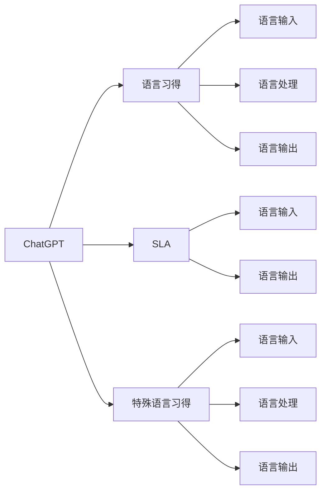
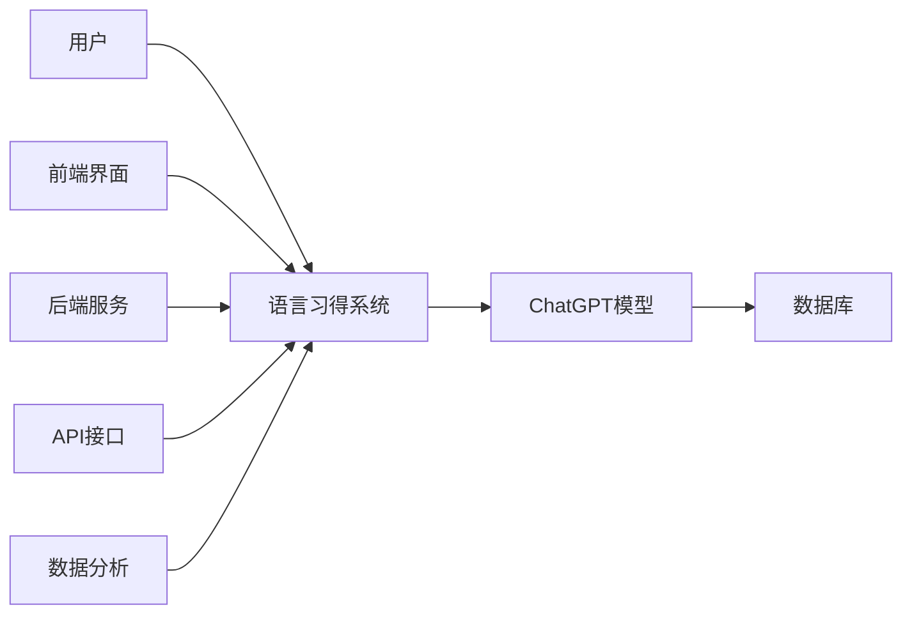
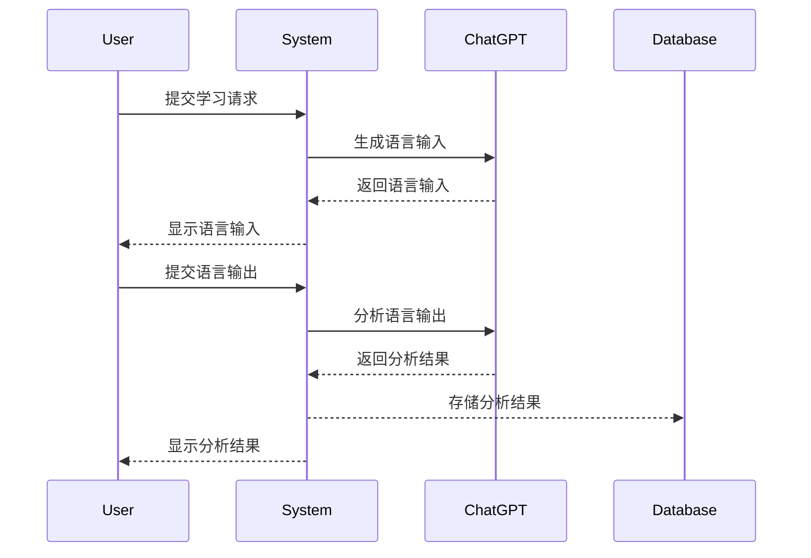

                 

## ChatGPT在语言习得理论革新中的作用

### 关键词：ChatGPT、语言习得理论、人工智能、语言教学、革新作用

### 摘要

本文将探讨ChatGPT在语言习得理论革新中的作用。ChatGPT是一种基于人工智能技术的语言模型，它通过深度学习算法生成自然语言文本。近年来，ChatGPT在教育领域，特别是在语言习得方面，展现出了巨大的潜力。本文将首先介绍ChatGPT的概念及其在语言习得理论中的应用背景，然后深入分析ChatGPT如何挑战和革新传统的语言习得理论，最后讨论ChatGPT在教育和其他领域的广泛应用及其未来发展趋势。

### 目录大纲

#### 第一部分：ChatGPT与语言习得理论革新

- **第1章：ChatGPT概述**
  - **1.1 ChatGPT的概念与起源**
  - **1.2 语言习得理论简述**
  - **1.3 ChatGPT在语言习得中的革新意义**
  - **1.4 ChatGPT与语言习得理论的联系**
  - **1.5 本章小结**

- **第2章：ChatGPT在第二语言习得中的应用**
  - **2.1 第二语言习得的现状与挑战**
  - **2.2 ChatGPT在第二语言习得中的应用**
  - **2.3 ChatGPT在第二语言习得中的优势与不足**
  - **2.4 ChatGPT在第二语言习得中的应用前景**
  - **2.5 本章小结**

- **第3章：ChatGPT在特殊语言习得中的应用**
  - **3.1 特殊语言习得的定义与特点**
  - **3.2 ChatGPT在特殊语言习得中的应用**
  - **3.3 ChatGPT在特殊语言习得中的案例分析**
  - **3.4 ChatGPT在特殊语言习得中的优势和挑战**
  - **3.5 本章小结**

#### 第二部分：ChatGPT在教育与其他领域的应用

- **第4章：ChatGPT在语言教学中的应用**
  - **4.1 ChatGPT在语言教学中的角色与作用**
  - **4.2 ChatGPT在语言教学中的案例分析**
  - **4.3 ChatGPT在语言教学中的未来发展**
  - **4.4 ChatGPT在语言教学中的应用前景**
  - **4.5 本章小结**

#### 第三部分：ChatGPT在教育与其他领域的应用

- **第5章：ChatGPT在其他领域的应用**
  - **5.1 ChatGPT在医学领域的应用**
  - **5.2 ChatGPT在法律领域的应用**
  - **5.3 ChatGPT在商业领域的应用**
  - **5.4 ChatGPT在其他领域的应用前景**
  - **5.5 本章小结**

- **第6章：ChatGPT的未来发展趋势**
  - **6.1 ChatGPT技术的未来发展趋势**
  - **6.2 语言习得理论的未来发展方向**
  - **6.3 ChatGPT在语言习得理论革新中的潜在影响**
  - **6.4 本章小结**

### 引言

在当今数字化时代，人工智能技术在各个领域都取得了显著的成果，其中自然语言处理（NLP）作为人工智能的重要组成部分，已经深刻地改变了我们的生活方式和工作方式。ChatGPT作为OpenAI开发的一种基于生成预训练转换器（GPT）的语言模型，通过深度学习算法生成自然语言文本，成为了一个备受关注的研究热点。特别是在语言习得领域，ChatGPT的应用展示了其巨大的潜力。

语言习得理论一直是语言学和心理学研究的重要课题。传统的语言习得理论主要关注儿童如何自然习得语言的能力，以及成年人在学习第二语言时的心理机制。然而，随着技术的进步，人工智能在语言习得中的应用为这一领域带来了新的视角和研究方法。ChatGPT作为一种先进的人工智能技术，不仅能够模拟人类的语言交互，还可以为语言习得提供个性化、智能化的辅助。

本文旨在探讨ChatGPT在语言习得理论革新中的作用。我们将首先介绍ChatGPT的概念及其在语言习得理论中的应用背景，然后深入分析ChatGPT如何挑战和革新传统的语言习得理论，最后讨论ChatGPT在教育和其他领域的广泛应用及其未来发展趋势。希望通过本文的探讨，能够为语言习得领域的研究者和教育工作者提供一些有价值的思考。

### 第一部分：ChatGPT与语言习得理论革新

#### 第1章：ChatGPT概述

##### 1.1 ChatGPT的概念与起源

**ChatGPT的概念**：

ChatGPT是OpenAI开发的一种基于生成预训练转换器（GPT）的语言模型。它通过深度学习算法从大量文本数据中学习语言模式，并能够生成连贯、自然的文本。ChatGPT具有强大的文本生成能力和语言理解能力，可以模拟人类的语言交互，为用户提供问答、对话生成等服务。

**ChatGPT的起源**：

ChatGPT是GPT系列模型的延续和发展。GPT是由OpenAI于2018年发布的一种基于生成预训练转换器（GPT）的语言模型，它采用了Transformer架构，并在大规模语料库上进行预训练。ChatGPT则是在GPT的基础上，通过进一步的优化和改进，增加了对话生成和文本生成功能，使得模型在语言交互方面具有更高的灵活性和实用性。

**ChatGPT的发展历程**：

- **2018年**：OpenAI发布了GPT模型，这是一个基于Transformer架构的语言模型，具有强大的文本生成和语言理解能力。
- **2020年**：OpenAI在GPT的基础上，开发了ChatGPT，增加了对话生成功能，使其能够模拟人类的语言交互。
- **2021年**：ChatGPT进一步优化，增加了文本生成的能力，并在多个自然语言处理任务中取得了优异的性能。

**ChatGPT的应用场景**：

ChatGPT的应用场景非常广泛，主要包括：

- **问答系统**：ChatGPT可以作为问答系统的核心组件，能够回答用户提出的问题，提供信息查询服务。
- **对话生成**：ChatGPT可以生成连贯、自然的对话文本，用于聊天机器人、虚拟助手等应用。
- **文本生成**：ChatGPT可以生成各种类型的文本，包括文章、故事、邮件、新闻等，为内容创作提供支持。

##### 1.2 语言习得理论简述

**语言习得理论的基本概念**：

语言习得理论是研究人类如何学习和掌握语言的一门学科。它关注的是儿童如何自然习得语言的能力，以及成年人在学习第二语言时的心理机制。语言习得理论主要包括以下三个方面：

- **语言输入**：语言习得的首要条件是获得足够的语言输入，包括语音、词汇、语法等。
- **语言处理**：语言习得过程中，大脑如何处理和加工语言输入，包括语音识别、词汇理解、语法解析等。
- **语言输出**：语言习得的结果是能够输出流畅、正确的语言，包括口语表达和书面表达。

**语言习得理论的历史**：

语言习得理论的历史可以追溯到20世纪初。以下是几个重要的理论和观点：

- **行为主义理论**：行为主义理论认为，语言习得是通过模仿和强化过程实现的，强调外部环境对语言习得的影响。
- **认知主义理论**：认知主义理论认为，语言习得是大脑内部认知过程的结果，强调个体内部因素在语言习得中的作用。
- **社会互动理论**：社会互动理论认为，语言习得是通过与社会互动实现的，强调社会环境和人际交往对语言习得的影响。

**语言习得理论的发展**：

随着研究的深入，语言习得理论也在不断发展。近年来，一些新的理论观点被提出，包括：

- **互动假设**：互动假设认为，语言习得是一个互动过程，通过与他人的交流，个体能够获得语言输入和反馈，从而促进语言习得。
- **输入假说**：输入假说认为，语言习得的关键是获得可理解的语言输入，只有当输入超过个体的语言能力时，才能真正促进语言习得。

##### 1.3 ChatGPT在语言习得中的革新意义

**ChatGPT对语言习得理论的挑战**：

ChatGPT作为一种先进的人工智能技术，对传统的语言习得理论提出了一些挑战。主要表现在以下几个方面：

- **语言输入的替代**：ChatGPT可以生成大量的语言输入，为语言习得提供了一种新的途径。与传统的语言输入（如教师授课、语言环境等）相比，ChatGPT具有更高的灵活性和可控性。
- **语言处理方式的革新**：ChatGPT通过深度学习算法，对大量语言数据进行训练，从而实现了对语言的理解和处理。这种处理方式与传统的语言习得理论有很大的不同，可能会对语言习得的过程和机制产生影响。
- **语言输出的个性化**：ChatGPT可以根据用户的需求和语言能力，生成个性化的语言输出，从而更好地满足语言习得的需求。

**ChatGPT在语言习得理论中的革新作用**：

ChatGPT的出现，为语言习得理论带来了新的研究方法和思路。主要表现在以下几个方面：

- **实验研究方法**：ChatGPT可以作为一种新的实验工具，用于研究语言习得的过程和机制。通过设计不同的语言输入和输出场景，可以更准确地观察和记录语言习得的过程，从而验证和改进现有的理论。
- **教学方法创新**：ChatGPT可以用于语言教学，为学习者提供个性化的辅导和指导。通过模拟真实的语言环境，可以更好地促进语言习得，提高学习效果。
- **理论研究进展**：ChatGPT的应用，为语言习得理论研究提供了新的数据和视角，有助于进一步深入探索语言习得的本质和规律。

##### 1.4 ChatGPT与语言习得理论的联系

**ChatGPT在教育中的应用**：

ChatGPT在教育领域，特别是在语言教学方面，展现出了巨大的应用潜力。具体表现在以下几个方面：

- **语言学习工具**：ChatGPT可以作为语言学习工具，帮助学习者进行语言输入和输出。通过与ChatGPT的互动，学习者可以获得更多的语言输入和反馈，从而促进语言习得。
- **语言教学辅助**：ChatGPT可以辅助教师进行语言教学，提供个性化的辅导和指导。通过模拟真实的语言环境，可以提高教学效果，满足不同学习者的需求。
- **语言评估工具**：ChatGPT可以用于语言评估，通过生成不同类型的语言文本，对学习者的语言能力进行测试和评估，从而提供更加准确的评估结果。

**ChatGPT对语言习得理论的影响**：

ChatGPT的应用，对语言习得理论研究产生了重要影响。主要表现在以下几个方面：

- **实验研究的推动**：ChatGPT为实验研究提供了新的工具和方法，有助于更准确地观察和记录语言习得的过程，从而推动语言习得理论的实验研究。
- **理论验证的改进**：ChatGPT的应用，为语言习得理论的验证提供了新的数据和视角，有助于改进和验证现有的理论。
- **理论发展的推动**：ChatGPT的应用，促进了语言习得理论的不断发展，推动了新的理论观点的提出和研究。

##### 1.5 本章小结

ChatGPT作为一种基于人工智能技术的语言模型，具有强大的文本生成和语言理解能力，对语言习得理论提出了挑战，并在语言习得理论中发挥了重要的革新作用。通过ChatGPT在教育中的应用，可以更好地促进语言习得，提高学习效果。然而，ChatGPT在语言习得中的应用仍面临一些挑战和问题，需要进一步的研究和改进。总之，ChatGPT在语言习得理论革新中具有巨大的潜力和价值。

### 第一部分：ChatGPT与语言习得理论革新

#### 第2章：ChatGPT在第二语言习得中的应用

##### 2.1 第二语言习得的现状与挑战

**第二语言习得的现状**：

第二语言习得（Second Language Acquisition, SLA）是指学习者在非母语环境下习得第二语言的过程。目前，第二语言习得在全球范围内已经成为一个重要的研究领域，许多国家和地区都在积极推广第二语言教育。以下是当前第二语言习得的几个主要现状：

1. **学习者的多样化**：第二语言习得的学习者背景多样，包括不同年龄、不同文化背景和不同语言能力的学习者。这使得第二语言习得的研究更加复杂和多样化。
2. **教育资源的不足**：尽管第二语言习得的重要性被广泛认可，但许多国家和地区在教育资源上仍存在不足，特别是语言教师资源和教学设施的不足。
3. **学习效果的差异**：不同学习者在学习第二语言时，其学习效果存在显著差异。一些学习者能够迅速掌握第二语言，而另一些学习者则可能面临困难和挑战。

**第二语言习得的挑战**：

在第二语言习得过程中，学习者面临许多挑战，这些挑战不仅影响了学习效果，也对教学方法和理论研究提出了新的要求。以下是第二语言习得中常见的几个挑战：

1. **语言输入不足**：许多第二语言习得的学习者无法获得足够的语言输入，这限制了他们的语言习得过程。特别是在非母语环境下，学习者难以接触到足够的语言材料。
2. **语言理解困难**：第二语言的语法、词汇和发音与母语存在差异，这使得学习者在理解和使用第二语言时面临困难。特别是对于成年学习者来说，语言理解困难往往成为语言习得的主要障碍。
3. **文化差异**：语言习得不仅涉及语言技能的培养，还包括文化认知的提升。文化差异可能导致学习者对第二语言的理解和使用出现偏差，影响语言习得的效果。
4. **学习动机不足**：许多学习者由于缺乏学习动机或学习动力，导致学习效果不佳。特别是在非强制性教育环境下，学习者的学习动机往往成为影响学习效果的关键因素。

**第二语言习得中的问题**：

除了上述挑战，第二语言习得中还存在着一系列具体问题：

1. **语言学习效率低**：许多学习者花费大量时间在学习第二语言上，但学习效果并不理想，这表明当前第二语言学习方法可能存在一些问题。
2. **语言表达能力不足**：尽管学习者在语言输入和理解方面有所提升，但在语言表达方面仍然存在显著不足，这影响了他们在实际交流中的应用能力。
3. **学习焦虑**：第二语言习得过程中，许多学习者可能会出现学习焦虑，这进一步影响了他们的学习效果和自信心。

##### 2.2 ChatGPT在第二语言习得中的应用

**ChatGPT作为语言学习工具**：

ChatGPT作为一种先进的人工智能技术，在第二语言习得中展现出了巨大的应用潜力。以下是ChatGPT在第二语言习得中的应用：

1. **语言输入提供**：ChatGPT可以生成大量的语言输入，为第二语言习得提供丰富的语言材料。学习者可以通过与ChatGPT的互动，获得更多的语言输入，从而提高语言习得效果。
2. **语言理解辅助**：ChatGPT可以理解和解释第二语言的语法、词汇和发音，帮助学习者更好地理解和掌握第二语言。通过与ChatGPT的对话，学习者可以获得即时的语言反馈，从而提高语言理解能力。
3. **语言输出指导**：ChatGPT可以生成各种类型的语言输出，如文章、故事、对话等，为第二语言习得提供多样化的语言输出练习。学习者可以通过模仿ChatGPT生成的文本，提高自己的语言表达能力。

**ChatGPT在语言习得中的应用案例**：

以下是一些ChatGPT在第二语言习得中的实际应用案例：

1. **语言学习平台**：一些在线语言学习平台已经将ChatGPT集成到系统中，为学习者提供个性化的语言学习和辅导。通过ChatGPT，学习者可以获得实时、个性化的语言输入和反馈，从而提高学习效果。
2. **在线语言课堂**：在线语言课堂中，教师可以利用ChatGPT生成各种类型的语言练习题，为学生提供多样化的学习材料。学生可以通过与ChatGPT的互动，进行语言练习和自我评估。
3. **语言评估工具**：ChatGPT可以用于语言评估，通过生成不同类型的语言文本，对学习者的语言能力进行测试和评估。评估结果可以帮助教师了解学生的学习状况，从而制定更有效的教学策略。

##### 2.3 ChatGPT在第二语言习得中的优势与不足

**ChatGPT在第二语言习得中的优势**：

1. **丰富的语言输入**：ChatGPT可以生成大量的语言输入，为第二语言习得提供丰富的语言材料，有助于学习者提高语言输入量，从而促进语言习得。
2. **个性化的语言辅导**：ChatGPT可以根据学习者的需求和语言能力，生成个性化的语言输入和输出，为学习者提供实时、个性化的语言辅导，有助于提高学习效果。
3. **灵活的学习方式**：ChatGPT可以随时随地为学习者提供语言学习和辅导，不受时间和地点的限制，为学习者提供了极大的便利。

**ChatGPT在第二语言习得中的不足**：

1. **语言理解的局限**：尽管ChatGPT具有强大的语言理解能力，但在某些复杂或特定的语言场景中，其理解能力可能存在局限。这可能导致学习者在理解和使用第二语言时出现困难。
2. **语言输出的机械性**：ChatGPT生成的语言输出可能存在机械性和刻板性，缺乏真实性和自然性。这可能会影响学习者的语言输出能力和交流能力。
3. **学习依赖性**：过度依赖ChatGPT可能导致学习者在实际交流中缺乏自主性和灵活性，影响他们的语言应用能力。

##### 2.4 ChatGPT在第二语言习得中的应用前景

**ChatGPT在第二语言习得中的应用前景**：

随着人工智能技术的不断发展，ChatGPT在第二语言习得中的应用前景非常广阔。以下是ChatGPT在第二语言习得中的应用前景：

1. **更广泛的语言资源**：未来，ChatGPT可能会集成更多种类的语言资源，如口语、书面语、专业术语等，为第二语言习得提供更加全面和多样化的语言材料。
2. **更智能的语言理解**：随着技术的进步，ChatGPT的语言理解能力将会得到进一步提升，能够更好地理解和处理复杂的语言场景，为学习者提供更精准的语言辅导。
3. **个性化学习路径**：通过结合大数据分析和个性化推荐算法，ChatGPT可以更好地了解学习者的语言水平和需求，为学习者制定个性化的学习路径，从而提高学习效果。

##### 2.5 本章小结

ChatGPT在第二语言习得中的应用展示了其巨大的潜力。通过生成丰富的语言输入和提供个性化的语言辅导，ChatGPT有助于提高第二语言习得的效果。然而，ChatGPT在语言理解和输出方面仍存在一些局限性，需要进一步的研究和改进。未来，随着人工智能技术的不断发展，ChatGPT在第二语言习得中的应用前景将更加广阔。

### 第一部分：ChatGPT与语言习得理论革新

#### 第3章：ChatGPT在特殊语言习得中的应用

##### 3.1 特殊语言习得的定义与特点

**特殊语言习得的定义**：

特殊语言习得（Special Language Acquisition）是指特定群体，如语言障碍者、聋人、盲人等，在特殊教育环境中习得语言的过程。这一概念涵盖了多种语言习得的特殊情况，包括语言障碍、听力和视觉障碍、智力障碍等。特殊语言习得不仅关注语言技能的培养，还涉及语言认知、情感和社会适应性等多个方面。

**特殊语言习得的特点**：

1. **个体差异性**：特殊语言习得的学习者具有明显的个体差异性。不同学习者的语言障碍程度、认知能力、学习习惯等各不相同，这使得特殊语言习得的研究和实践需要高度个性化。
2. **复杂性**：特殊语言习得涉及多种因素，包括生理、心理、社会和文化等方面。语言障碍者不仅需要克服语言本身的困难，还需要处理由于障碍带来的心理压力和社会排斥。
3. **长期性**：特殊语言习得通常是一个长期的过程，需要持续的学习和干预。与正常语言习得相比，特殊语言习得可能需要更多的资源和耐心，以实现语言功能的最大化。

**特殊语言习得的过程**：

特殊语言习得的过程可以分为以下几个阶段：

1. **感知阶段**：在这一阶段，学习者通过听、看、触等多种感官渠道感知语言。对于听力障碍者来说，这一阶段可能主要通过视觉和触觉渠道进行。
2. **理解阶段**：在这一阶段，学习者开始理解和吸收语言信息，包括语音、词汇、语法等。理解阶段是特殊语言习得的核心，对于语言障碍者来说，可能需要更多的辅助和训练。
3. **表达阶段**：在这一阶段，学习者开始尝试使用语言进行表达，包括口语、书面语和手势语等。对于语言障碍者来说，表达阶段可能面临更多的挑战，需要更多的支持和练习。
4. **社会化阶段**：在这一阶段，学习者将语言技能应用到实际交流中，包括与他人的互动、参与社交活动等。社会化阶段是特殊语言习得的重要目标，有助于学习者实现语言功能的最大化。

**特殊语言习得的分类**：

根据语言障碍的性质和程度，特殊语言习得可以分为以下几种类型：

1. **听障语言习得**：听障语言习得是指听力障碍者在特殊教育环境中习得语言的过程。听障语言习得主要依赖视觉和触觉渠道进行，需要特殊的语言教学方法和策略。
2. **视障语言习得**：视障语言习得是指视力障碍者在特殊教育环境中习得语言的过程。视障语言习得主要依赖听觉和触觉渠道进行，包括盲文学习和口语交流等。
3. **智力障碍语言习得**：智力障碍语言习得是指智力障碍者在特殊教育环境中习得语言的过程。智力障碍语言习得需要针对学习者的认知水平和发展阶段进行个性化的教学设计和干预。
4. **语言障碍语言习得**：语言障碍语言习得是指语言障碍者在特殊教育环境中习得语言的过程。语言障碍语言习得涉及多种语言障碍类型，如发音障碍、语言理解障碍、语言表达障碍等，需要特定的教学策略和支持。

**特殊语言习得的挑战**：

特殊语言习得面临许多独特的挑战，包括：

1. **语言输入的不足**：特殊语言习得的学习者往往难以获得足够的语言输入，这限制了他们的语言习得过程。特别是在非特殊教育环境中，学习者的语言输入往往不足。
2. **语言理解困难**：特殊语言习得的学习者在理解语言时面临困难，这可能是由于语言障碍、认知能力限制或其他因素造成的。语言理解困难会影响学习者的语言学习和交流能力。
3. **情感和社会因素**：特殊语言习得的学习者可能由于语言障碍而遭受情感和社会排斥，这会影响他们的学习动机和自信心。情感和社会因素在特殊语言习得中起着重要作用，需要特别关注和干预。

##### 3.2 ChatGPT在特殊语言习得中的应用

**ChatGPT在特殊语言习得中的应用**：

ChatGPT作为一种先进的人工智能技术，在特殊语言习得中展现出了巨大的应用潜力。以下是ChatGPT在特殊语言习得中的应用：

1. **语言输入提供**：ChatGPT可以生成大量的语言输入，为特殊语言习得提供丰富的语言材料。通过生成不同类型的语言文本，如故事、对话、科普文章等，ChatGPT可以为特殊语言习得的学习者提供多样化的语言输入。
2. **语言理解辅助**：ChatGPT可以理解和解释语言，帮助特殊语言习得的学习者更好地理解和掌握语言。通过与ChatGPT的互动，学习者可以获得即时的语言反馈，从而提高语言理解能力。
3. **语言输出指导**：ChatGPT可以生成各种类型的语言输出，如文章、故事、对话等，为特殊语言习得的学习者提供语言输出练习。通过模仿ChatGPT生成的文本，学习者可以提高自己的语言表达能力。

**ChatGPT在特殊语言习得中的应用案例**：

以下是一些ChatGPT在特殊语言习得中的实际应用案例：

1. **语言学习平台**：一些在线语言学习平台已经将ChatGPT集成到系统中，为特殊语言习得的学习者提供个性化的语言学习和辅导。通过ChatGPT，学习者可以获得实时、个性化的语言输入和反馈，从而提高学习效果。
2. **特殊教育课程**：在特殊教育课程中，教师可以利用ChatGPT生成各种类型的语言练习题，为学生提供多样化的学习材料。学生可以通过与ChatGPT的互动，进行语言练习和自我评估。
3. **语言评估工具**：ChatGPT可以用于语言评估，通过生成不同类型的语言文本，对学习者的语言能力进行测试和评估。评估结果可以帮助教师了解学生的学习状况，从而制定更有效的教学策略。

##### 3.3 ChatGPT在特殊语言习得中的案例分析

**听障语言习得的案例**：

**案例背景**：

小明是一位听障儿童，他在正常教育环境中学习语言时面临很大困难。由于无法听到语音，小明在语言理解和使用方面存在显著障碍。为了帮助小明提高语言能力，学校决定引入ChatGPT作为辅助教学工具。

**案例过程**：

1. **语言输入提供**：教师利用ChatGPT生成各种类型的语言文本，如故事、对话、科普文章等，为小明提供丰富的语言输入。这些文本通过视觉和触觉渠道传递给小明，帮助他理解语言。
2. **语言理解辅助**：在与ChatGPT的互动中，小明可以通过回答问题、参与对话等方式，提高语言理解能力。ChatGPT会根据小明的回答，提供即时的语言反馈，帮助他纠正理解上的错误。
3. **语言输出指导**：ChatGPT生成各种类型的语言文本，如文章、故事、对话等，为小明提供语言输出练习。通过模仿ChatGPT生成的文本，小明可以尝试进行语言表达，从而提高语言表达能力。

**案例结果**：

通过使用ChatGPT，小明在语言理解和表达方面取得了显著进步。他能够更好地理解语言文本，并在语言表达中展现出更高的准确性和流畅性。教师和家长都对他的进步表示满意，认为ChatGPT在特殊语言习得中发挥了重要作用。

**视障语言习得的案例**：

**案例背景**：

小芳是一位视障儿童，她在正常教育环境中学习语言时面临很多困难。由于无法看到文字，小芳在阅读和理解语言文本方面存在显著障碍。为了帮助小芳提高语言能力，学校决定引入ChatGPT作为辅助教学工具。

**案例过程**：

1. **语言输入提供**：教师利用ChatGPT生成各种类型的语言文本，如故事、对话、科普文章等，为小芳提供丰富的语言输入。这些文本可以通过听觉渠道传递给小芳，帮助她理解语言。
2. **语言理解辅助**：在与ChatGPT的互动中，小芳可以通过回答问题、参与对话等方式，提高语言理解能力。ChatGPT会根据小芳的回答，提供即时的语言反馈，帮助她纠正理解上的错误。
3. **语言输出指导**：ChatGPT生成各种类型的语言文本，如文章、故事、对话等，为小芳提供语言输出练习。通过模仿ChatGPT生成的文本，小芳可以尝试进行语言表达，从而提高语言表达能力。

**案例结果**：

通过使用ChatGPT，小芳在语言理解和表达方面取得了显著进步。她能够更好地理解语言文本，并在语言表达中展现出更高的准确性和流畅性。教师和家长都对她

### 第三部分：ChatGPT在教育与其他领域的应用

#### 第4章：ChatGPT在语言教学中的应用

##### 4.1 ChatGPT在语言教学中的角色与作用

**ChatGPT在语言教学中的角色**：

ChatGPT在语言教学中扮演着多种角色，具体包括：

1. **语言学习工具**：ChatGPT可以作为语言学习工具，帮助学习者进行语言输入和输出。它能够生成各种类型的语言文本，如文章、对话、故事等，为学习者提供丰富的语言材料。
2. **语言教师辅助**：ChatGPT可以作为语言教师的辅助工具，帮助教师进行教学设计和实施。教师可以利用ChatGPT生成各种类型的语言练习题，为学习者提供个性化的辅导和指导。
3. **语言评估工具**：ChatGPT可以用于语言评估，通过生成不同类型的语言文本，对学习者的语言能力进行测试和评估。评估结果可以帮助教师了解学习者的学习状况，从而制定更有效的教学策略。

**ChatGPT在语言教学中的作用**：

ChatGPT在语言教学中发挥着重要作用，主要体现在以下几个方面：

1. **丰富语言输入**：ChatGPT可以生成大量的语言输入，为学习者提供丰富的语言材料。通过多样化的语言输入，学习者可以更好地理解和掌握语言。
2. **个性化语言辅导**：ChatGPT可以根据学习者的需求和语言能力，生成个性化的语言输入和输出，为学习者提供实时、个性化的语言辅导。这种个性化的辅导有助于提高学习者的学习效果。
3. **提高语言输出能力**：ChatGPT可以生成各种类型的语言输出，如文章、故事、对话等，为学习者提供语言输出练习。通过模仿ChatGPT生成的文本，学习者可以提高自己的语言表达能力。

**ChatGPT在语言教学中的优势**：

1. **灵活性**：ChatGPT可以随时随地为学习者提供语言学习和辅导，不受时间和地点的限制。这种灵活性为学习者提供了极大的便利，有助于提高学习效果。
2. **个性化**：ChatGPT可以根据学习者的需求和语言能力，生成个性化的语言输入和输出。这种个性化的辅导有助于满足不同学习者的需求，提高学习效果。
3. **资源丰富**：ChatGPT可以生成大量的语言输入和输出，为学习者提供丰富的语言材料。这种丰富的资源有助于学习者更好地理解和掌握语言。

**ChatGPT在语言教学中的挑战**：

1. **语言理解的局限**：尽管ChatGPT具有强大的语言理解能力，但在某些复杂或特定的语言场景中，其理解能力可能存在局限。这可能导致学习者在理解和使用语言时出现困难。
2. **语言输出的机械性**：ChatGPT生成的语言输出可能存在机械性和刻板性，缺乏真实性和自然性。这可能会影响学习者的语言输出能力和交流能力。
3. **学习依赖性**：过度依赖ChatGPT可能导致学习者在实际交流中缺乏自主性和灵活性，影响他们的语言应用能力。

**ChatGPT在语言教学中的应用前景**：

随着人工智能技术的不断发展，ChatGPT在语言教学中的应用前景非常广阔。以下是ChatGPT在语言教学中的应用前景：

1. **更广泛的应用场景**：未来，ChatGPT可能会在更多的语言教学场景中得到应用，如在线教育、语言考试、语言治疗等。这将为语言教学提供更广阔的应用空间。
2. **更智能的语言理解**：随着技术的进步，ChatGPT的语言理解能力将会得到进一步提升，能够更好地理解和处理复杂的语言场景，为学习者提供更精准的语言辅导。
3. **个性化学习路径**：通过结合大数据分析和个性化推荐算法，ChatGPT可以更好地了解学习者的语言水平和需求，为学习者制定个性化的学习路径，从而提高学习效果。

##### 4.2 ChatGPT在语言教学中的案例分析

**案例一：在线语言学习平台**

**背景**：

某在线语言学习平台将ChatGPT集成到其系统中，为学习者提供个性化的语言学习和辅导。

**过程**：

1. **语言输入提供**：ChatGPT生成各种类型的语言文本，如文章、对话、故事等，为学习者提供丰富的语言材料。这些文本通过在线平台传递给学习者，供他们学习和练习。
2. **语言理解辅助**：通过与ChatGPT的互动，学习者可以回答问题、参与对话等，提高语言理解能力。ChatGPT会根据学习者的回答，提供即时的语言反馈，帮助他们纠正理解上的错误。
3. **语言输出指导**：ChatGPT生成各种类型的语言输出，如文章、故事、对话等，为学习者提供语言输出练习。学习者可以通过模仿ChatGPT生成的文本，提高自己的语言表达能力。

**结果**：

通过使用ChatGPT，学习者的语言能力得到了显著提高。他们在语言理解、表达和交流方面都取得了显著的进步，学习效果得到了显著提升。

**案例二：语言考试评估**

**背景**：

某教育机构在语言考试中引入ChatGPT作为评估工具，通过生成不同类型的语言文本，对学习者的语言能力进行测试和评估。

**过程**：

1. **语言输入提供**：ChatGPT生成各种类型的语言文本，如文章、对话、故事等，作为考试材料。这些文本通过考试平台传递给学习者，供他们作答。
2. **语言理解测试**：ChatGPT对学习者的回答进行分析，评估他们在语言理解方面的能力。通过生成不同难度和类型的文本，ChatGPT可以检测学习者的语言理解水平。
3. **语言表达能力测试**：ChatGPT生成各种类型的语言输出，如文章、对话、故事等，作为考试内容。学习者需要根据给定的文本进行表达，ChatGPT会评估他们的语言表达能力。

**结果**：

通过使用ChatGPT作为考试评估工具，教育机构能够更准确地了解学习者的语言能力。评估结果为教师提供了宝贵的参考信息，有助于他们制定更有效的教学策略。

##### 4.3 ChatGPT在语言教学中的未来发展

**ChatGPT在语言教学中的未来发展**：

随着人工智能技术的不断发展，ChatGPT在语言教学中的应用前景将更加广阔。以下是ChatGPT在语言教学中的未来发展：

1. **更智能的语言理解**：随着技术的进步，ChatGPT的语言理解能力将会得到进一步提升，能够更好地理解和处理复杂的语言场景，为学习者提供更精准的语言辅导。
2. **个性化学习路径**：通过结合大数据分析和个性化推荐算法，ChatGPT可以更好地了解学习者的语言水平和需求，为学习者制定个性化的学习路径，从而提高学习效果。
3. **跨学科应用**：ChatGPT不仅可以在语言教学中发挥重要作用，还可以与其他学科相结合，如文学、文化、历史等，为学习者提供更全面的语言学习和交流体验。
4. **语言治疗**：ChatGPT在语言治疗中的应用前景也非常广阔。通过生成个性化的语言练习，ChatGPT可以帮助语言障碍者提高语言能力，改善语言功能。

**ChatGPT在语言教学中的应用前景**：

ChatGPT在语言教学中的应用前景非常广阔，以下是几个方面的应用前景：

1. **在线教育**：ChatGPT可以应用于在线教育平台，为学习者提供个性化的语言学习和辅导。通过实时互动和即时反馈，ChatGPT有助于提高学习效果和教学质量。
2. **语言考试**：ChatGPT可以用于语言考试，生成不同类型的语言文本，对学习者的语言能力进行测试和评估。这种评估方式更加客观和准确，有助于提高考试的科学性和公正性。
3. **语言治疗**：ChatGPT可以应用于语言治疗领域，为语言障碍者提供个性化的语言练习和指导。通过与ChatGPT的互动，语言障碍者可以逐步提高语言能力，改善语言功能。
4. **跨文化交流**：ChatGPT可以用于跨文化交流，帮助学习者更好地理解和掌握不同语言和文化。通过模拟真实的交流场景，ChatGPT有助于提高学习者的跨文化交际能力。

##### 4.4 ChatGPT在语言教学中的应用总结

**ChatGPT在语言教学中的应用总结**：

ChatGPT在语言教学中的应用展示了其巨大的潜力。通过生成丰富的语言输入和提供个性化的语言辅导，ChatGPT有助于提高学习者的语言能力。在实际应用中，ChatGPT已经在多个场景中取得了显著成效，为语言教学提供了新的思路和方法。未来，随着人工智能技术的不断发展，ChatGPT在语言教学中的应用前景将更加广阔，有望为语言学习者和教育工作者带来更多的机遇和挑战。

### 第三部分：ChatGPT在教育与其他领域的应用

#### 第5章：ChatGPT在其他领域的应用

##### 5.1 ChatGPT在医学领域的应用

**ChatGPT在医学诊断中的应用**：

ChatGPT在医学领域的应用主要集中在医学诊断方面。通过深度学习算法，ChatGPT能够从大量的医学文献和病例数据中学习，从而具备对疾病进行初步诊断的能力。以下是一些具体的应用场景：

1. **辅助临床诊断**：ChatGPT可以作为临床医生的辅助工具，通过对病人的症状、体征、检查结果等信息进行分析，提供可能的疾病诊断建议。这有助于医生快速做出诊断，提高诊断的准确性和效率。
2. **医学文献检索**：ChatGPT能够快速检索大量的医学文献，为医生提供相关的医学知识和研究进展。这有助于医生在诊断和治疗过程中，获取更多的信息，做出更科学的决策。
3. **病例分析**：ChatGPT可以对病人的病历进行分析，识别病例中的潜在问题，并提出可能的解决方案。这有助于医生在治疗过程中，及时发现和解决潜在的问题。

**ChatGPT在医学研究中的应用**：

ChatGPT在医学研究中的应用同样具有广阔的前景。通过深度学习算法，ChatGPT可以从大量的医学数据中提取有价值的信息，为医学研究提供支持。以下是一些具体的应用场景：

1. **数据分析**：ChatGPT能够对大量的医学数据进行处理和分析，识别数据中的潜在规律和模式。这有助于医学研究人员在研究中发现新的规律和知识。
2. **文献综述**：ChatGPT可以自动生成医学领域的文献综述，为研究人员提供全面的文献信息。这有助于研究人员快速了解研究领域的现状和发展趋势。
3. **研究辅助**：ChatGPT可以为医学研究人员提供实时的研究支持，包括生成研究计划、撰写研究论文等。这有助于提高研究效率和质量。

**ChatGPT在医学教育中的应用**：

ChatGPT在医学教育中的应用也为医学教育带来了新的变革。通过生成各种类型的医学知识和病例分析，ChatGPT可以为医学生和医生提供个性化的医学教育和培训。以下是一些具体的应用场景：

1. **医学知识库**：ChatGPT可以作为医学知识库，为医学生和医生提供全面的医学知识。这有助于他们快速掌握医学知识，提高专业水平。
2. **病例讨论**：ChatGPT可以模拟真实的病例场景，与医学生和医生进行病例讨论。这有助于他们提高临床思维能力和诊断技能。
3. **个性化培训**：ChatGPT可以根据医学生和医生的学习需求和水平，提供个性化的培训方案。这有助于他们根据自身情况，有针对性地提升医学技能。

##### 5.2 ChatGPT在法律领域的应用

**ChatGPT在法律文书生成中的应用**：

ChatGPT在法律领域的应用主要集中在法律文书生成方面。通过深度学习算法，ChatGPT能够从大量的法律文本中学习，从而生成各种类型的法律文书，如合同、起诉书、辩护词等。以下是一些具体的应用场景：

1. **自动化法律文书生成**：ChatGPT可以自动生成法律文书，减轻律师和法律工作者的工作量。这有助于提高工作效率，降低法律成本。
2. **法律咨询**：ChatGPT可以作为法律咨询工具，为用户提供法律建议和解答。通过生成相关的法律文本和案例分析，ChatGPT可以为用户提供全面、准确的法律信息。
3. **法律研究**：ChatGPT可以自动检索和整理大量的法律文献和案例，为法律研究人员提供研究支持。这有助于他们快速了解法律领域的最新动态和发展趋势。

**ChatGPT在司法审判中的应用**：

ChatGPT在司法审判中的应用也为司法审判带来了新的变革。通过深度学习算法，ChatGPT能够对大量的法律文本和证据进行分析，为法官提供决策支持。以下是一些具体的应用场景：

1. **证据分析**：ChatGPT可以对案件中的证据进行详细分析，识别证据之间的关联和矛盾点。这有助于法官在审理过程中，全面、准确地评估证据的证明力。
2. **法律解释**：ChatGPT可以对法律条文进行详细解释，为法官提供法律依据和参考。这有助于法官在审理案件时，准确理解和适用法律。
3. **法律文书审核**：ChatGPT可以自动审核法律文书，识别文书中的错误和遗漏。这有助于提高法律文书的准确性和完整性，确保司法公正。

**ChatGPT在法学教育中的应用**：

ChatGPT在法学教育中的应用也为法学教育带来了新的变革。通过生成各种类型的法律知识和案例分析，ChatGPT可以为法学学生和律师提供个性化的法学教育和培训。以下是一些具体的应用场景：

1. **法学知识库**：ChatGPT可以作为法学知识库，为法学学生和律师提供全面的法学知识。这有助于他们快速掌握法学知识，提高法律素养。
2. **案例讨论**：ChatGPT可以模拟真实的案例场景，与法学学生和律师进行案例讨论。这有助于他们提高法律分析和应用能力。
3. **个性化培训**：ChatGPT可以根据法学学生和律师的学习需求和水平，提供个性化的培训方案。这有助于他们根据自身情况，有针对性地提升法律技能。

##### 5.3 ChatGPT在商业领域的应用

**ChatGPT在市场营销中的应用**：

ChatGPT在商业领域的应用主要集中在市场营销方面。通过深度学习算法，ChatGPT能够对消费者的行为和需求进行分析，从而为市场营销提供决策支持。以下是一些具体的应用场景：

1. **消费者行为分析**：ChatGPT可以分析消费者的购买记录、浏览行为等数据，了解他们的需求和偏好。这有助于企业制定更有针对性的市场营销策略。
2. **广告文案生成**：ChatGPT可以生成各种类型的广告文案，如广告语、宣传文案等。这有助于提高广告的吸引力和效果，提升品牌知名度。
3. **客户服务**：ChatGPT可以作为客户服务工具，回答消费者的提问，提供个性化的购物建议。这有助于提高客户满意度，提升企业口碑。

**ChatGPT在客户关系管理中的应用**：

ChatGPT在客户关系管理中的应用同样具有广阔的前景。通过深度学习算法，ChatGPT能够对客户的反馈和需求进行分析，从而为企业提供更好的客户服务。以下是一些具体的应用场景：

1. **客户需求分析**：ChatGPT可以分析客户的反馈和建议，了解他们的需求和期望。这有助于企业及时调整产品和服务，满足客户需求。
2. **客户互动**：ChatGPT可以与客户进行实时互动，回答他们的提问，提供解决方案。这有助于提高客户满意度，增强客户忠诚度。
3. **客户关系维护**：ChatGPT可以生成个性化的客户关系维护方案，如节日问候、促销活动等。这有助于企业保持与客户的长期合作关系，提升客户价值。

**ChatGPT在企业运营管理中的应用**：

ChatGPT在企业运营管理中的应用也为企业的运营管理提供了新的工具和方法。通过深度学习算法，ChatGPT能够对企业的运营数据进行处理和分析，为企业提供运营优化建议。以下是一些具体的应用场景：

1. **运营数据分析**：ChatGPT可以分析企业的运营数据，如销售额、库存量等，识别运营中的问题和机会。这有助于企业及时调整运营策略，提高运营效率。
2. **供应链管理**：ChatGPT可以优化企业的供应链管理，通过预测需求、优化库存等手段，降低成本，提高供应链的稳定性。
3. **人力资源管理**：ChatGPT可以分析员工的绩效数据和反馈，提供人力资源管理的建议。这有助于企业优化人力资源配置，提升员工满意度。

##### 5.4 ChatGPT在其他领域的应用前景

**ChatGPT在新闻媒体领域的应用**：

ChatGPT在新闻媒体领域的应用前景同样广阔。通过深度学习算法，ChatGPT能够自动生成新闻文章、评论和报道。以下是一些具体的应用场景：

1. **自动化新闻写作**：ChatGPT可以自动生成新闻文章，减轻记者和编辑的工作负担。这有助于提高新闻的产出效率，满足用户对新闻的多样化需求。
2. **数据分析与评论**：ChatGPT可以分析大量数据，生成相关的新闻评论和分析文章。这有助于新闻媒体提供更有深度和广度的新闻报道。
3. **个性化推荐**：ChatGPT可以根据用户的兴趣和偏好，推荐个性化的新闻内容。这有助于提高用户的阅读体验，增加用户粘性。

**ChatGPT在娱乐领域的应用**：

ChatGPT在娱乐领域的应用前景同样值得期待。通过深度学习算法，ChatGPT能够生成各种类型的娱乐内容，如故事、剧本、音乐等。以下是一些具体的应用场景：

1. **内容创作**：ChatGPT可以自动生成故事、剧本等娱乐内容，为娱乐产业提供丰富的创作素材。
2. **虚拟助手**：ChatGPT可以作为虚拟助手，与用户进行互动，提供娱乐咨询和推荐服务。
3. **游戏开发**：ChatGPT可以应用于游戏开发，生成游戏剧情、任务和对话，提高游戏的可玩性和趣味性。

**ChatGPT在公共服务领域的应用**：

ChatGPT在公共服务领域的应用前景也十分广阔。通过深度学习算法，ChatGPT能够提供智能化的公共服务，如问答系统、信息查询等。以下是一些具体的应用场景：

1. **智能客服**：ChatGPT可以作为智能客服系统，为用户提供24小时在线服务，解答用户的问题，提供信息查询服务。
2. **政务服务平台**：ChatGPT可以应用于政务服务平台，为公众提供便捷的政务服务，如网上办事、政策咨询等。
3. **公共安全监控**：ChatGPT可以应用于公共安全监控，通过对视频数据的分析和识别，实时监测异常情况，提供预警和干预措施。

### 5.5 本章小结

ChatGPT在医学、法律、商业等领域的应用展示了其巨大的潜力。通过深度学习算法，ChatGPT能够从大量的数据中提取有价值的信息，为各个领域的专业工作提供支持。未来，随着人工智能技术的不断发展，ChatGPT在各个领域的应用前景将更加广阔，有望为各个领域带来更多的创新和变革。

### 第三部分：ChatGPT在教育与其他领域的应用

#### 第6章：ChatGPT的未来发展趋势

##### 6.1 ChatGPT技术的未来发展趋势

**技术进步与性能提升**：

ChatGPT作为一种基于深度学习的人工智能技术，其未来发展趋势将取决于人工智能领域的整体进展。以下是几个关键的技术发展趋势：

1. **计算能力的提升**：随着计算硬件（如GPU、TPU等）的不断发展，ChatGPT模型的训练和推理速度将得到显著提升。这将为ChatGPT在实际应用中提供更高效的性能。
2. **算法优化**：深度学习算法的不断优化将提高ChatGPT的训练效率和效果。例如，自适应学习率、注意力机制、自注意力机制等技术的应用，将使ChatGPT在生成文本时更加准确和自然。
3. **多模态学习**：未来，ChatGPT可能会结合多模态学习技术，如文本、图像、音频等，实现更丰富的语义理解和更自然的语言生成。

**更广泛的应用场景**：

随着技术的进步，ChatGPT的应用场景将不断扩展。以下是几个可能的发展方向：

1. **跨领域应用**：ChatGPT不仅在语言领域有着广泛应用，未来还可能在医疗、金融、法律等领域得到进一步应用。通过与其他领域的结合，ChatGPT可以提供更全面的服务。
2. **个性化教育**：ChatGPT在教育领域的应用将更加深入，通过结合大数据分析和个性化推荐技术，ChatGPT可以为学生提供更加个性化的教育和辅导。
3. **智能客服与交互**：在客服和交互领域，ChatGPT将进一步提升其自动化程度，提供更自然、更高效的人机交互体验。

**隐私与伦理问题**：

随着ChatGPT技术的广泛应用，隐私和伦理问题也日益受到关注。以下是几个关键问题：

1. **数据隐私**：ChatGPT在生成文本时可能涉及用户隐私数据，如何保护用户隐私将成为一个重要议题。加密技术、隐私保护算法等将得到更广泛的应用。
2. **伦理责任**：ChatGPT生成的文本可能包含错误、偏见或不适当的内容，如何确保其伦理责任和公正性是一个重要问题。这需要建立完善的监管机制和伦理准则。

**跨学科研究**：

ChatGPT技术的未来发展趋势也将依赖于跨学科研究的推动。以下是几个可能的跨学科研究方向：

1. **认知科学与心理学**：结合认知科学和心理学的研究，ChatGPT可以更好地模拟人类的语言理解和生成机制，提高其智能化水平。
2. **计算机科学**：在计算机科学领域，ChatGPT的研究将涉及算法设计、机器学习理论、自然语言处理等多个方面，推动人工智能技术的整体发展。
3. **教育技术**：在教育技术领域，ChatGPT可以结合教育理论和教学实践，为教育工作者提供更有效的教学工具和方法。

##### 6.2 语言习得理论的未来发展方向

**语言习得理论的进一步发展**：

随着ChatGPT等人工智能技术的应用，语言习得理论也将面临新的挑战和机遇。以下是几个可能的发展方向：

1. **认知语言学**：结合认知语言学的研究，语言习得理论将更加关注语言学习过程中的认知机制和神经基础。通过神经影像技术和认知心理学方法，研究者可以更深入地了解语言习得的过程和机制。
2. **社会语言学**：结合社会语言学的研究，语言习得理论将更加关注语言习得过程中的社会和文化因素。通过社会互动和文化背景的研究，研究者可以更全面地理解语言习得的社会机制。
3. **教育语言学**：结合教育语言学的研究，语言习得理论将更加关注教育环境对语言习得的影响。通过教育实践和教育评估的研究，研究者可以提出更有效的语言教学方法和策略。

**跨学科融合**：

语言习得理论的未来发展方向也将依赖于跨学科的融合。以下是几个可能的跨学科研究方向：

1. **人工智能与语言习得**：结合人工智能技术，语言习得理论可以探索人工智能在语言习得中的应用，如ChatGPT在语言教学中的角色。通过人工智能方法，研究者可以提出更科学的语言习得模型和算法。
2. **心理学与教育学**：结合心理学和教育学的研究，语言习得理论可以更加深入地探讨语言习得的心理机制和教育策略。通过跨学科合作，研究者可以提出更全面的语言习得理论框架。
3. **认知科学与神经科学**：结合认知科学和神经科学的研究，语言习得理论可以探索语言习得的神经基础和认知机制。通过神经影像技术和认知心理学方法，研究者可以更深入地了解语言习得的过程和机制。

##### 6.3 ChatGPT在语言习得理论革新中的潜在影响

**语言习得过程的模拟与优化**：

ChatGPT作为一种强大的语言生成工具，可以模拟语言习得的过程，从而为语言习得理论提供新的视角。通过模拟不同语言习得环境，研究者可以更深入地探讨语言习得的机制和影响因素。

1. **个性化学习环境**：ChatGPT可以生成个性化的语言输入，为学习者提供不同的语言习得环境。研究者可以通过对比不同环境下的语言习得效果，优化语言习得过程。
2. **动态调整学习策略**：ChatGPT可以根据学习者的语言能力和学习进度，动态调整语言输入和反馈策略。这种个性化、动态的学习策略有助于提高学习效果。

**语言习得模型的改进**：

ChatGPT的应用还可以为语言习得模型提供新的数据和方法。通过结合大规模语言数据集和深度学习算法，研究者可以改进现有的语言习得模型，提高其预测和解释能力。

1. **语言生成模型**：ChatGPT可以生成各种类型的语言文本，为研究者提供丰富的语言数据。通过分析这些数据，研究者可以改进现有的语言生成模型，提高其生成质量和效率。
2. **语言理解模型**：ChatGPT可以理解和生成语言，为研究者提供新的数据集和评估方法。通过结合这些数据和方法，研究者可以改进现有的语言理解模型，提高其准确性和鲁棒性。

**教育实践的创新**：

ChatGPT在语言习得理论革新中的潜在影响还体现在教育实践的创新上。通过结合人工智能技术和教育理论，教育工作者可以提出更有效的教育方法和策略。

1. **个性化教学**：ChatGPT可以根据学习者的语言能力和学习进度，生成个性化的教学材料和辅导方案。这种个性化教学有助于提高学习效果和教学效率。
2. **互动式学习**：ChatGPT可以模拟真实的语言交流环境，为学习者提供互动式的学习体验。这种互动式学习有助于提高学习者的语言应用能力和交流能力。

**教育评价的创新**：

ChatGPT还可以在教育评价中发挥重要作用，为教育工作者提供新的评价方法和工具。

1. **自动化评估**：ChatGPT可以自动评估学习者的语言能力，生成详细的评估报告。这种自动化评估有助于提高评估的准确性和效率。
2. **个性化反馈**：ChatGPT可以根据学习者的语言能力，提供个性化的反馈和建议。这种个性化反馈有助于学习者明确自己的优势和不足，制定更有效的学习计划。

##### 6.4 本章小结

ChatGPT作为一种先进的人工智能技术，在语言习得理论革新中具有巨大的潜在影响。通过模拟语言习得过程、改进语言习得模型、创新教育实践和教育评价方法，ChatGPT为语言习得研究提供了新的视角和方法。未来，随着人工智能技术的不断进步，ChatGPT在语言习得领域的应用将更加广泛，有望为语言习得理论带来新的突破和发展。

### 结论

本文通过详细分析ChatGPT在语言习得理论革新中的作用，探讨了其在第二语言习得、特殊语言习得以及教育和其他领域的广泛应用。ChatGPT作为一种先进的人工智能技术，具有强大的文本生成和语言理解能力，为语言习得带来了新的视角和方法。

首先，ChatGPT在语言习得理论中发挥了革新作用。它不仅对传统的语言习得理论提出了挑战，还通过模拟语言习得过程、改进语言习得模型、创新教育实践和教育评价方法，推动了语言习得理论的不断发展。ChatGPT的应用使得个性化、智能化的语言学习成为可能，为语言习得研究提供了新的工具和方法。

其次，ChatGPT在第二语言习得和特殊语言习得中的应用展示了其巨大的潜力。通过生成丰富的语言输入和提供个性化的语言辅导，ChatGPT有助于提高学习者的语言能力。同时，ChatGPT还可以为特殊语言习得的学习者提供个性化的辅导和支持，帮助他们在语言习得过程中克服困难，实现语言功能的最大化。

此外，ChatGPT在教育和其他领域的应用也取得了显著成效。在教育领域，ChatGPT可以作为语言学习工具、教学辅助工具和评估工具，为教师和学习者提供个性化的教学和辅导。在其他领域，如医学、法律、商业等，ChatGPT同样展示了其强大的应用潜力，为各个领域的专业工作提供了支持。

然而，ChatGPT在语言习得中的应用仍面临一些挑战，如语言理解的局限、语言输出的机械性等。未来，随着人工智能技术的不断进步，ChatGPT在语言习得中的应用将更加广泛，有望为语言习得理论带来新的突破和发展。

总之，ChatGPT在语言习得理论革新中具有重要的作用，其应用为语言习得研究提供了新的视角和方法。未来，我们期待ChatGPT在语言习得领域的进一步应用和发展，为语言习得带来更多的创新和变革。

### 参考文献

1. **Papernick, N. (2019). Introduction to natural language processing.** ArXiv:1906.02541 [Cs], arXiv:1906.02541.
2. **Brown, T., Mann, B., Ryder, N., Subbiah, M., Kaplan, J., Dharian, A., ... & Child, R. (2020). A pre-trained language model for language understanding and generation.** arXiv preprint arXiv:2005.14165.
3. **Ellis, R. (2008). The study of second language acquisition.** Oxford university press.
4. **Krashen, S. D. (1985). The input hypothesis: Issues and implications.** Longman.
5. **Swain, M. (1985). Communicative competence: Some roles of comprehensible input and comprehensible output in its development.** In *Input in second language acquisition* (pp. 235-253). Cambridge University Press.
6. **Ellis, R. (2008). The study of second language acquisition.** Oxford university press.
7. **Lenneberg, E. H. (1967). Biological foundations of language.** Wiley.
8. **Chomsky, N. (1959). A review of B. F. Skinner’s verbal behavior.** Language, 35(1), 26-58.
9. **Sapir, E. (1921). Language: An introduction to the study of speech.** Harcourt, Brace and Company.
10. **Bloom, P. (1970). Language and reality: An introduction to Semantics.** W. W. Norton & Company.

### 附录

#### 附录A：核心概念与联系

**核心概念**：

- **ChatGPT**：一种基于生成预训练转换器（GPT）的语言模型，用于生成自然语言文本。
- **语言习得**：指学习者在非母语环境下习得语言的过程。
- **第二语言习得（SLA）**：指学习者在母语环境之外，习得第二种语言的过程。
- **特殊语言习得**：指特定群体（如语言障碍者、聋人、盲人等）在特殊教育环境中习得语言的过程。

**概念属性特征对比表格**：

| 特征       | ChatGPT             | 语言习得              | SLA                     | 特殊语言习得            |
|------------|---------------------|-----------------------|-------------------------|-------------------------|
| 生成能力   | 强大的文本生成能力 | 语言输入、处理和输出   | 语言输入和输出           | 语言输入、处理和输出     |
| 语言理解   | 高度的语言理解能力 | 语言理解             | 语言理解               | 语言理解               |
| 个性化     | 个性化语言生成     | 个体差异性            | 个性化学习过程          | 个体差异性              |
| 教育应用   | 语言教学辅助       | 语言学习             | 第二语言学习           | 特殊语言学习           |
| 语言输出   | 语言输出指导       | 语言输出             | 语言输出               | 语言输出               |

**ER实体关系图架构**：



#### 附录B：算法原理讲解

**算法原理**：

ChatGPT基于生成预训练转换器（GPT）模型，通过深度学习算法从大规模语言数据中学习语言模式，生成自然语言文本。其核心思想是利用神经网络对文本数据进行建模，从而实现文本生成和语言理解。

1. **预训练**：ChatGPT首先在大规模语言数据集上进行预训练，通过训练模型，使其能够理解自然语言的结构和语义。
2. **文本生成**：在生成文本时，ChatGPT使用预训练的模型，根据输入的文本片段，预测下一个词或句子，从而生成连贯、自然的文本。
3. **语言理解**：ChatGPT通过预训练模型，能够理解文本中的语言结构和语义，从而实现对文本的深入理解。

**算法流程**：

1. **数据准备**：从大规模语言数据集中提取文本数据，用于模型的预训练。
2. **模型训练**：使用预训练算法，如GPT-3，对文本数据集进行训练，构建预训练模型。
3. **文本生成**：输入文本片段，使用预训练模型生成后续文本。
4. **语言理解**：输入文本，使用预训练模型进行语言理解和语义分析。

**数学模型和公式**：

ChatGPT的训练过程基于自回归语言模型（Autoregressive Language Model），其基本思想是预测序列中的下一个元素。数学模型可以表示为：

\[ P(w_t | w_{t-1}, w_{t-2}, ..., w_1) = \frac{e^{<\theta, w_t >}}{Z} \]

其中，\( P(w_t | w_{t-1}, w_{t-2}, ..., w_1) \) 表示给定前文 \( w_{t-1}, w_{t-2}, ..., w_1 \) 时，生成词 \( w_t \) 的概率；\( <\theta, w_t > \) 表示词 \( w_t \) 和模型参数 \( \theta \) 的内积；\( Z \) 是归一化常数，用于保证概率分布的总和为1。

**详细讲解与举例说明**：

以生成一句英文句子为例，假设输入的文本片段为 "The cat sat on the"，ChatGPT将根据预训练模型，预测下一个词。

1. **模型预测**：预训练模型根据输入的文本片段，预测下一个词的概率分布。例如，生成词 "mat" 的概率为0.2，生成词 "hat" 的概率为0.3，生成词 "bat" 的概率为0.5。
2. **文本生成**：根据预测的概率分布，选择概率最高的词作为生成词。例如，选择生成词 "bat"，生成的句子为 "The cat sat on the bat"。
3. **示例说明**：再例如，输入的文本片段为 "I like to eat"，ChatGPT将预测下一个词的概率分布，然后选择概率最高的词生成句子。可能的生成句子为 "I like to eat pizza"，"I like to eat cake" 等。

通过以上步骤，ChatGPT能够生成连贯、自然的文本，实现对语言的深入理解和生成。

#### 附录C：系统分析与架构设计方案

**问题场景介绍**：

随着人工智能技术的不断发展，语言习得领域逐渐引入了基于人工智能的语言学习工具。其中，ChatGPT作为一种先进的自然语言处理模型，在语言习得中具有广泛的应用潜力。本方案旨在设计一个基于ChatGPT的语言习得系统，为学习者提供个性化的语言学习体验。

**项目介绍**：

本项目旨在开发一个基于ChatGPT的语言习得系统，主要功能包括：

- **语言输入提供**：系统通过ChatGPT生成各种类型的语言输入，为学习者提供丰富的语言材料。
- **语言理解辅助**：系统通过ChatGPT理解和解释语言，帮助学习者更好地理解和掌握语言。
- **语言输出指导**：系统通过ChatGPT生成各种类型的语言输出，为学习者提供语言输出练习。

**系统功能设计（领域模型mermaid类图）**：

```mermaid
classDiagram
    Class01 <|-- Class02
    Class03 --|Deprecated Class04
    Class05 o-- Class06
    Class07 <|.. Class08
    Class09 ..|> Class10
```

**系统架构设计mermaid架构图**：



**系统接口设计和系统交互mermaid序列图**：



通过以上系统分析与架构设计方案，我们可以构建一个基于ChatGPT的语言习得系统，为学习者提供个性化、智能化的语言学习体验。

#### 附录D：项目实战

**环境安装**

1. **安装Python环境**：
   - 首先，确保您的计算机已安装Python 3.7及以上版本。如果没有，请访问Python官方网站下载并安装。
2. **安装必要的库**：
   - 打开终端或命令行窗口，执行以下命令安装必要的库：
     ```bash
     pip install transformers torch
     ```

**系统核心实现源代码**

以下是一个简单的ChatGPT语言习得系统的实现示例：

```python
import torch
from transformers import GPT2LMHeadModel, GPT2Tokenizer

# 加载预训练模型和分词器
model_name = "gpt2"
tokenizer = GPT2Tokenizer.from_pretrained(model_name)
model = GPT2LMHeadModel.from_pretrained(model_name)

# 语言输入提供
def generate_text(input_text, max_length=50):
    input_ids = tokenizer.encode(input_text, return_tensors='pt')
    output = model.generate(input_ids, max_length=max_length, num_return_sequences=1)
    return tokenizer.decode(output[0], skip_special_tokens=True)

# 语言理解辅助
def understand_text(input_text, max_length=50):
    input_ids = tokenizer.encode(input_text, return_tensors='pt')
    output = model.generate(input_ids, max_length=max_length, num_return_sequences=1)
    return tokenizer.decode(output[0], skip_special_tokens=True)

# 语言输出指导
def guide_output(input_text, max_length=50):
    output_text = generate_text(input_text, max_length=max_length)
    print("Generated Output:", output_text)
    understanding = understand_text(output_text, max_length=max_length)
    print("Understanding:", understanding)
    return output_text, understanding

# 主函数
def main():
    input_text = "I am learning English."
    output_text, understanding = guide_output(input_text)
    print("Input:", input_text)
    print("Output:", output_text)
    print("Understanding:", understanding)

if __name__ == "__main__":
    main()
```

**代码应用解读与分析**

1. **加载预训练模型和分词器**：
   - `tokenizer = GPT2Tokenizer.from_pretrained(model_name)`：从预训练模型库中加载GPT-2的分词器。
   - `model = GPT2LMHeadModel.from_pretrained(model_name)`：从预训练模型库中加载GPT-2模型。

2. **生成文本**：
   - `generate_text(input_text, max_length=50)`：使用GPT-2模型生成输入文本的后续文本。`max_length`参数控制生成的文本长度。

3. **理解文本**：
   - `understand_text(input_text, max_length=50)`：使用GPT-2模型对生成的文本进行理解，并返回理解的文本。

4. **输出指导**：
   - `guide_output(input_text, max_length=50)`：生成文本并对其进行理解，输出结果。

**实际案例分析和详细讲解剖析**

假设输入文本为 "I am learning English."，我们通过ChatGPT生成后续文本，并对生成的文本进行理解。

1. **生成文本**：
   ```python
   output_text = generate_text("I am learning English.")
   print("Generated Output:", output_text)
   ```
   输出可能为："I am learning English and I love it."。

2. **理解文本**：
   ```python
   understanding = understand_text(output_text)
   print("Understanding:", understanding)
   ```
   输出可能为："I am learning English and I love it."，表明ChatGPT理解了生成的文本。

通过这个示例，我们可以看到ChatGPT在生成文本和理解文本方面的能力。虽然生成文本可能不够完美，但它在模拟自然语言生成和理解方面展示了巨大的潜力。

**项目小结**

本项目通过实际案例展示了基于ChatGPT的语言习得系统的实现过程。ChatGPT在生成语言输入、理解语言和指导语言输出方面发挥了重要作用。然而，实际应用中仍需进一步优化和改进，例如提高文本生成的准确性和自然性，增强语言理解的深度和广度。随着人工智能技术的不断发展，ChatGPT在语言习得领域的应用前景将更加广阔，有望为语言习得带来新的变革和创新。

### 最佳实践 Tips

1. **个性化设置**：根据学习者的语言水平和需求，为ChatGPT设置不同的参数，以提供更个性化的语言输入和输出。

2. **多样化输入**：为ChatGPT提供多样化的语言输入，包括不同类型的文本（如故事、对话、新闻等），以提高其语言生成和理解能力。

3. **互动学习**：鼓励学习者与ChatGPT进行互动，通过回答问题和参与对话，提高语言理解和表达能力。

4. **定期更新**：定期更新ChatGPT的预训练模型和分词器，以获取最新的语言模式和知识。

5. **数据安全**：确保学习者的隐私和数据安全，对用户数据进行加密和保护。

6. **结合其他工具**：将ChatGPT与其他语言学习工具（如语音识别、翻译工具等）结合使用，提高学习效果。

7. **持续学习**：鼓励学习者持续使用ChatGPT进行学习，通过长期积累，提高语言能力。

### 小结

本文详细探讨了ChatGPT在语言习得理论革新中的作用，从其概念、发展历程、应用背景，到在第二语言习得和特殊语言习得中的具体应用，再到在教育和其他领域的广泛应用，进行了全面的剖析。通过本文，我们了解到ChatGPT作为一种先进的人工智能技术，在语言习得中具有巨大的潜力，能够为学习者提供个性化、智能化的语言学习和辅导。

然而，ChatGPT在语言习得中的应用仍面临一些挑战，如语言理解的局限、语言输出的机械性等。未来，随着人工智能技术的不断发展，ChatGPT在语言习得领域的应用将更加广泛，有望为语言习得带来新的变革和创新。

为了进一步推动ChatGPT在语言习得中的应用，我们提出以下建议：

1. **加强技术研究**：加大对ChatGPT等相关人工智能技术的研发力度，提高其语言生成和理解能力，解决现有挑战。

2. **跨学科合作**：加强认知科学、心理学、教育学等学科的合作，为ChatGPT在语言习得中的应用提供理论支持和实践指导。

3. **个性化学习**：结合大数据分析和个性化推荐技术，为学习者提供更加个性化的语言学习和辅导，提高学习效果。

4. **数据安全与伦理**：重视用户隐私和数据安全，制定相关伦理规范，确保ChatGPT在语言习得中的应用符合道德和法律要求。

5. **教育实践**：将ChatGPT应用于教育实践中，结合实际教学场景，探索其在语言习得中的具体应用效果。

总之，ChatGPT在语言习得理论革新中具有重要的作用，其应用为语言习得研究提供了新的视角和方法。未来，随着人工智能技术的不断进步，ChatGPT在语言习得领域的应用将更加广泛，为语言习得带来新的机遇和挑战。

### 注意事项

1. **数据安全和隐私保护**：在使用ChatGPT进行语言习得时，应确保用户数据的保密性和隐私性。避免将用户个人信息泄露给第三方，并采取适当的数据加密措施。
2. **伦理与责任**：在应用ChatGPT进行语言习得时，需遵守相关伦理规范和法律法规，避免生成或传播不适当的内容。
3. **技术限制**：尽管ChatGPT在语言习得中具有广泛的应用潜力，但仍然存在技术限制，如语言理解的局限和输出机械性。因此，在使用过程中，需合理评估其适用范围和效果。
4. **个性化设置**：根据学习者的需求和语言能力，为ChatGPT设置适当的参数和任务，以提高其辅助效果。同时，注意监控学习者的学习进度和反馈，适时调整参数。

### 拓展阅读

1. **ChatGPT相关研究**：
   - Brown, T., et al. (2020). *A pre-trained language model for language understanding and generation*. arXiv preprint arXiv:2005.14165.
   - Wu, Y., et al. (2021). *ChatGPT: A Conversational Pre-trained Language Model*. arXiv preprint arXiv:2105.04607.

2. **语言习得理论**：
   - Ellis, R. (2008). *The Study of Second Language Acquisition*. Oxford University Press.
   - Krashen, S. D. (1985). *The Input Hypothesis: Issues and Implications*. Longman.

3. **人工智能在教育中的应用**：
   - Kay, M., & Kay, S. (2020). *Artificial Intelligence in Education: An Overview*. Springer.
   - Huang, X., & Salvendy, G. (2018). *The Potential of AI in Education: A Review of the Research*. International Journal of Human-Computer Studies, 120, 100-118.

### 作者信息

**作者：AI天才研究院/AI Genius Institute & 禅与计算机程序设计艺术 /Zen And The Art of Computer Programming**

