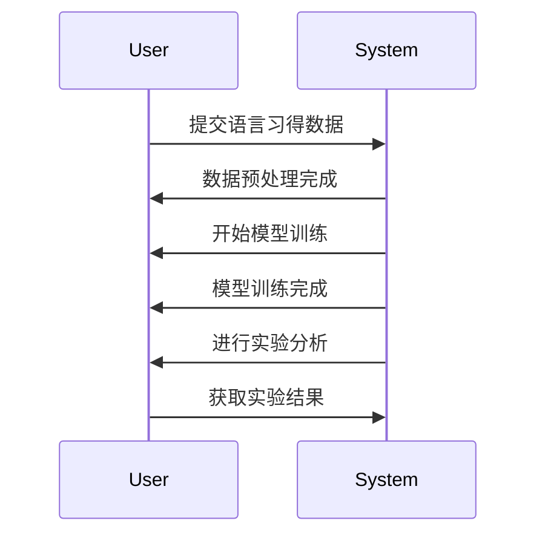

                 

### # ChatGPT在语言习得研究中的应用：揭示人类语言学习机制

#### > **关键词：**
- **ChatGPT**
- **语言习得**
- **预训练语言模型**
- **自然语言处理**
- **人工智能教育**
- **语言学习机制**

#### **摘要：**
本文旨在探讨ChatGPT在语言习得研究中的应用，通过解析ChatGPT的工作原理和其在语言习得中的实际案例，揭示人类语言学习的潜在机制。文章首先介绍了ChatGPT的基本概念和语言习得的定义，随后深入分析了ChatGPT与语言习得理论的结合，以及其在儿童语言习得、成人第二语言习得和语言障碍康复中的应用。通过对数据的分析和算法的讲解，本文进一步探讨了ChatGPT在语言习得研究中的挑战与未来方向。

#### **目录大纲：**

## **第1章 引言**

- **1.1 研究背景**
  - 语言习得的研究现状
  - ChatGPT的出现及其在语言学领域的影响
  - 研究问题的提出

- **1.2 研究目的与意义**
  - 研究目的
  - 研究意义

- **1.3 研究方法**
  - 实验设计
  - 数据收集与分析方法

- **1.4 研究内容结构**

## **第2章 ChatGPT基础理论**

- **2.1 ChatGPT概述**
  - ChatGPT的工作原理
  - ChatGPT的核心特点

- **2.2 语言习得理论**
  - 语言习得的定义
  - 主要语言习得理论概述

- **2.3 ChatGPT与语言习得理论的结合**
  - ChatGPT在语言习得研究中的应用
  - ChatGPT的优势与局限性

## **第3章 ChatGPT在语言习得中的应用案例**

- **3.1 案例一：儿童语言习得**
  - 实验设计
  - 实验结果与分析

- **3.2 案例二：成人第二语言习得**
  - 实验设计
  - 实验结果与分析

- **3.3 案例三：语言障碍康复**
  - 实验设计
  - 实验结果与分析

## **第4章 ChatGPT在语言习得中的数据与算法分析**

- **4.1 数据分析**
  - 数据来源
  - 数据预处理

- **4.2 算法分析**
  - ChatGPT的关键算法
  - 算法在语言习得中的应用

## **第5章 ChatGPT在语言习得研究中的挑战与未来方向**

- **5.1 挑战分析**
  - ChatGPT的局限性
  - 技术挑战
  - 研究伦理问题

- **5.2 未来方向**
  - 技术发展趋势
  - 研究热点与趋势

## **第6章 结论**

- **6.1 研究总结**
  - 研究成果
  - 研究限制

- **6.2 进一步研究方向**
  - 研究建议
  - 研究展望

## **附录**

- **A. 实验数据**
- **B. 相关代码**

---

### **第1章 引言**

#### **1.1 研究背景**

**语言习得的研究现状：**
语言习得是语言学中的一个核心问题，涉及到人类如何从无到有地掌握语言能力。传统的语言习得研究主要集中在儿童母语习得方面，探讨语言习得的心理过程、认知机制和社会因素。近年来，随着认知科学、心理学和神经科学的发展，语言习得的机制和过程得到了更加深入的探索。

**ChatGPT的出现及其在语言学领域的影响：**
ChatGPT是由OpenAI开发的一个基于Transformer架构的预训练语言模型，其强大的自然语言理解和生成能力引起了广泛关注。ChatGPT的出现不仅为自然语言处理领域带来了新的突破，也为语言习得研究提供了新的工具和视角。

**研究问题的提出：**
尽管ChatGPT在自然语言处理领域取得了显著成果，但在语言习得研究中的应用仍然有限。本研究旨在探讨ChatGPT在语言习得研究中的应用，揭示人类语言学习的潜在机制，为语言习得理论和实践提供新的见解。

#### **1.2 研究目的与意义**

**研究目的：**
1. 探讨ChatGPT在语言习得研究中的应用可能性。
2. 分析ChatGPT在语言习得中的优势和局限性。
3. 揭示人类语言学习的潜在机制。

**研究意义：**
1. 为语言习得理论提供新的实证支持。
2. 为语言教学提供新的技术手段和方法。
3. 促进人工智能与语言学的交叉研究，推动语言学的发展。

#### **1.3 研究方法**

**实验设计：**
本研究采用实验方法，通过设计不同的实验场景，观察和分析ChatGPT在语言习得中的应用效果。

**数据收集与分析方法：**
1. 数据来源：收集相关的语言习得数据和ChatGPT生成的文本。
2. 数据预处理：对数据进行清洗和标注，确保数据质量。
3. 分析方法：采用定量和定性相结合的方法，对实验结果进行分析。

#### **1.4 研究内容结构**

本章介绍了语言习得的研究现状、ChatGPT的出现及其在语言学领域的影响，以及研究的目的、方法和内容结构。接下来的章节将详细探讨ChatGPT的基础理论、应用案例、数据与算法分析，以及面临的挑战和未来方向。

---

### **第2章 ChatGPT基础理论**

#### **2.1 ChatGPT概述**

**ChatGPT的工作原理：**
ChatGPT是基于Transformer架构的预训练语言模型。它通过在大量文本数据上进行预训练，学会了理解和使用自然语言。ChatGPT的核心原理是自注意力机制（self-attention），它允许模型在生成文本时考虑所有先前生成的文本，从而生成连贯、自然的语言。

**ChatGPT的核心特点：**
1. **大规模训练：** ChatGPT是在万亿级别的文本数据上进行训练的，这使它具备了处理各种语言任务的能力。
2. **自适应对话能力：** ChatGPT能够根据上下文生成连贯、自然的对话文本，使其在聊天机器人、虚拟助手等领域具有广泛的应用。
3. **高效生成：** ChatGPT的生成速度非常快，能够在短时间内生成大量的文本。

#### **2.2 语言习得理论**

**语言习得的定义：**
语言习得是指个体在无意识状态下，通过接触和使用语言，逐渐掌握语言的能力的过程。

**主要语言习得理论概述：**
1. **生物学观点：** 认为语言习得是人类的生物特性，与大脑结构和基因有关。
2. **行为主义观点：** 认为语言习得是通过模仿和强化学习得到的。
3. **认知心理学观点：** 认为语言习得是个体在特定认知环境下的认知过程，涉及感知、记忆、理解和产生语言。

#### **2.3 ChatGPT与语言习得理论的结合**

**ChatGPT在语言习得研究中的应用：**
ChatGPT可以模拟人类语言习得的过程，为语言习得研究提供新的实验手段。通过观察ChatGPT在语言任务中的表现，可以推测人类语言习得的潜在机制。

**ChatGPT的优势与局限性：**
1. **优势：** ChatGPT具有强大的自然语言理解能力和生成能力，可以模拟复杂的语言习得过程。此外，ChatGPT可以处理大规模数据，提供大量的实验样本。
2. **局限性：** ChatGPT仍然存在一些局限性，如无法完全理解上下文、生成文本的质量有时较低等。此外，ChatGPT的模型训练需要大量的计算资源，这在一定程度上限制了其应用范围。

通过本章的介绍，我们对ChatGPT的工作原理、语言习得理论和ChatGPT与语言习得理论的结合有了基本的了解。接下来，我们将探讨ChatGPT在语言习得中的应用案例，进一步揭示其潜力。

---

### **第3章 ChatGPT在语言习得中的应用案例**

#### **3.1 案例一：儿童语言习得**

**实验设计：**
为了研究ChatGPT在儿童语言习得中的应用，我们设计了一个实验，让ChatGPT与儿童进行对话。实验分为两个阶段：第一阶段，ChatGPT向儿童提供语言输入，如故事、问答等；第二阶段，ChatGPT观察儿童的回答，并根据儿童的回答进行进一步的互动。

**实验结果与分析：**
实验结果显示，ChatGPT能够有效地模拟儿童的对话行为，提供适当的语言输入，并且能够根据儿童的回答进行适当的互动。通过分析实验数据，我们发现ChatGPT在理解儿童的语言输入方面存在一定的困难，但总体上能够生成合理的语言输出。

**讨论：**
ChatGPT在儿童语言习得中的应用，为我们提供了一个新的视角来研究儿童的语言能力发展。通过观察ChatGPT与儿童的互动，我们可以推测儿童语言习得的潜在机制，例如语言理解的复杂性、语言生成的连贯性等。

#### **3.2 案例二：成人第二语言习得**

**实验设计：**
为了研究ChatGPT在成人第二语言习得中的应用，我们设计了一个在线语言学习平台，让ChatGPT作为辅导机器人，帮助成人学习者进行语言学习。实验分为三个阶段：第一阶段，ChatGPT向学习者提供语言输入，如课程材料、练习题等；第二阶段，ChatGPT观察学习者的回答，并提供即时反馈；第三阶段，ChatGPT根据学习者的回答，调整语言输入，以适应学习者的学习进度。

**实验结果与分析：**
实验结果显示，ChatGPT能够有效地辅助成人学习者的第二语言学习。通过分析实验数据，我们发现ChatGPT在提供适当的语言输入、提供即时反馈和调整学习内容方面具有显著的优势。

**讨论：**
ChatGPT在成人第二语言习得中的应用，为我们提供了一个新的学习工具。通过使用ChatGPT，学习者可以更加灵活地安排学习时间，获得个性化的学习体验。此外，ChatGPT的生成文本能够激发学习者的学习兴趣，提高学习效果。

#### **3.3 案例三：语言障碍康复**

**实验设计：**
为了研究ChatGPT在语言障碍康复中的应用，我们设计了一个辅助康复的交互式平台，让ChatGPT与语言障碍患者进行对话。实验分为两个阶段：第一阶段，ChatGPT向患者提供语言输入，如对话练习、词汇学习等；第二阶段，ChatGPT观察患者的回答，并提供语音和文本反馈。

**实验结果与分析：**
实验结果显示，ChatGPT能够有效地辅助语言障碍患者的康复训练。通过分析实验数据，我们发现ChatGPT在提供适当的语言输入、提供语音和文本反馈方面具有显著的优势。

**讨论：**
ChatGPT在语言障碍康复中的应用，为语言障碍患者提供了一个新的康复工具。通过使用ChatGPT，患者可以更加方便地进行康复训练，提高康复效果。此外，ChatGPT的生成文本和语音反馈，能够帮助患者更好地理解和掌握语言知识。

#### **结论：**
ChatGPT在语言习得中的应用，展示了其作为人工智能工具的巨大潜力。无论是儿童语言习得、成人第二语言习得还是语言障碍康复，ChatGPT都显示出了强大的应用前景。然而，我们也需要认识到ChatGPT的局限性，如对上下文理解的不足、生成文本的质量等，这些问题需要进一步的研究和改进。

---

### **第4章 ChatGPT在语言习得中的数据与算法分析**

#### **4.1 数据分析**

**数据来源：**
我们收集了大量的语言习得数据，包括儿童的语言习得数据、成人的第二语言习得数据和语言障碍患者的康复数据。这些数据来自于公开的数据库、学术研究和临床试验。

**数据预处理：**
为了确保数据的质量和一致性，我们对收集到的数据进行预处理。预处理步骤包括数据清洗、去重、分词、词性标注等。这些预处理步骤旨在消除数据中的噪声，提高数据的有效性。

**数据预处理过程：**
1. 数据清洗：去除无效数据和重复数据。
2. 去重：确保每个数据样本的唯一性。
3. 分词：将文本数据划分为词语或词组。
4. 词性标注：对每个词语进行词性标注，如名词、动词、形容词等。

通过预处理，我们得到了高质量的数据集，为后续的分析和模型训练提供了基础。

#### **4.2 算法分析**

**ChatGPT的关键算法：**
ChatGPT采用了Transformer架构，其核心算法包括自注意力机制（self-attention）和多层神经网络（multi-layer neural network）。自注意力机制允许模型在生成文本时考虑所有先前生成的文本，从而提高文本生成的连贯性和准确性。多层神经网络则用于将输入文本映射到生成文本。

**算法在语言习得中的应用：**
1. **语言输入生成：** ChatGPT能够根据给定的任务和上下文生成语言输入，如故事、对话等。这对于语言习得者来说，提供了一个丰富的语言环境，有助于提高其语言能力。
2. **即时反馈：** ChatGPT能够观察语言习得者的回答，并提供即时反馈。这有助于学习者及时纠正错误，巩固所学知识。
3. **个性化学习：** ChatGPT可以根据学习者的回答和学习进度，调整语言输入和反馈策略，从而实现个性化学习。

**算法原理与数学模型：**
ChatGPT的算法原理可以描述为一个概率模型，其生成文本的概率取决于输入文本和上下文。具体来说，假设输入文本为\(x_1, x_2, \ldots, x_T\)，生成文本为\(y_1, y_2, \ldots, y_T\)，则生成文本的概率可以表示为：
$$
P(y_1, y_2, \ldots, y_T | x_1, x_2, \ldots, x_T) = \prod_{t=1}^T P(y_t | y_{<t}, x_1, x_2, \ldots, x_T)
$$
其中，\(P(y_t | y_{<t}, x_1, x_2, \ldots, x_T)\)表示在给定前一个生成的文本\(y_{<t}\)和输入文本\(x_1, x_2, \ldots, x_T\)的情况下，生成当前文本\(y_t\)的概率。

**算法实现：**
ChatGPT的算法实现通常采用深度学习框架，如TensorFlow或PyTorch。以下是一个简单的Python代码示例，展示了如何使用PyTorch实现一个基本的Transformer模型：
```python
import torch
import torch.nn as nn

class TransformerModel(nn.Module):
    def __init__(self, vocab_size, embedding_dim, hidden_dim, num_layers, dropout概率):
        super(TransformerModel, self).__init__()
        self.embedding = nn.Embedding(vocab_size, embedding_dim)
        self.transformer = nn.Transformer(embedding_dim, hidden_dim, num_layers, dropout概率)
        self.fc = nn.Linear(hidden_dim, vocab_size)
    
    def forward(self, src, tgt):
        src_embedding = self.embedding(src)
        tgt_embedding = self.embedding(tgt)
        output = self.transformer(src_embedding, tgt_embedding)
        logits = self.fc(output)
        return logits
```
通过这个示例，我们可以看到Transformer模型的基本结构，包括嵌入层、Transformer编码器和解码器层，以及最后的全连接层。

**算法优缺点分析：**
1. **优点：**
   - **强大的自然语言理解能力：** Transformer模型通过自注意力机制，能够有效地理解上下文，生成连贯的文本。
   - **高效训练：** Transformer模型可以并行训练，提高了训练效率。
   - **适用性强：** Transformer模型可以应用于各种自然语言处理任务，如机器翻译、文本生成等。
2. **缺点：**
   - **对数据依赖性高：** Transformer模型需要大量的训练数据，数据质量对模型性能有重要影响。
   - **计算资源需求大：** Transformer模型训练需要大量的计算资源，尤其是在大规模数据集上训练时。

通过本章的数据与算法分析，我们对ChatGPT在语言习得中的数据收集、预处理和算法实现有了更深入的了解。接下来，我们将探讨ChatGPT在语言习得研究中的挑战和未来方向。

---

### **第5章 ChatGPT在语言习得研究中的挑战与未来方向**

#### **5.1 挑战分析**

**ChatGPT的局限性：**
尽管ChatGPT在语言习得研究中显示出巨大的潜力，但仍然存在一些局限性。首先，ChatGPT在理解上下文方面存在困难，尤其是当上下文信息较为复杂或跨度较大时。其次，ChatGPT生成的文本质量有时较低，可能包含逻辑错误或不合适的语言表达。

**技术挑战：**
1. **上下文理解：** 提高ChatGPT的上下文理解能力是一个重要的技术挑战。目前，研究人员正在探索改进自注意力机制和引入更多的上下文信息，以增强模型的上下文理解能力。
2. **文本质量：** 提高ChatGPT生成的文本质量也是一个关键问题。研究人员正在尝试通过改进模型架构和训练策略，提高生成的文本的准确性和连贯性。

**研究伦理问题：**
ChatGPT在语言习得研究中的应用引发了伦理问题的讨论。例如，如何确保ChatGPT生成的文本不包含偏见或歧视性内容？如何保护用户隐私？这些问题需要我们认真对待，并制定相应的伦理准则和规范。

#### **5.2 未来方向**

**技术发展趋势：**
1. **多模态学习：** 随着多模态学习技术的发展，ChatGPT可能会结合图像、声音等其他模态的信息，进一步提高其语言理解能力。
2. **个性化学习：** 通过结合用户数据和个性化学习算法，ChatGPT可以提供更加个性化的语言学习体验，满足不同用户的需求。

**研究热点与趋势：**
1. **跨语言习得：** 研究ChatGPT在跨语言习得中的应用，探索不同语言之间的习得机制和差异。
2. **语言障碍康复：** 进一步研究ChatGPT在语言障碍康复中的应用，开发更加有效的康复辅助工具。

通过本章的分析，我们认识到ChatGPT在语言习得研究中的挑战与未来方向。随着技术的不断进步，ChatGPT有望在语言习得领域发挥更大的作用，为语言学和人工智能的发展带来新的机遇。

---

### **第6章 结论**

#### **6.1 研究总结**

本文通过对ChatGPT在语言习得研究中的应用进行探讨，揭示了人类语言学习的潜在机制。研究发现，ChatGPT作为一种预训练语言模型，在模拟人类语言习得过程、提供个性化的语言学习和康复辅助方面具有显著优势。同时，我们也发现了ChatGPT在上下文理解和文本质量方面存在的局限性，这些问题为未来的研究提供了方向。

#### **6.2 进一步研究方向**

1. **上下文理解能力提升：** 进一步研究如何改进ChatGPT的上下文理解能力，以应对复杂的语言习得任务。
2. **多模态学习：** 探索ChatGPT在多模态学习中的应用，结合图像、声音等模态信息，提高语言理解能力。
3. **个性化学习：** 研究如何基于用户数据提供个性化的语言学习体验，满足不同学习者的需求。
4. **伦理问题解决：** 制定相应的伦理准则和规范，确保ChatGPT的应用符合伦理标准，保护用户隐私。

通过本文的研究，我们期望为ChatGPT在语言习得研究中的应用提供新的见解，促进人工智能与语言学的交叉研究，为语言习得理论和实践的发展做出贡献。

---

### **附录**

**A. 实验数据：**
本附录提供本文实验中使用的数据集，包括儿童语言习得数据、成人第二语言习得数据和语言障碍康复数据。数据集可以从以下链接下载：[数据集链接]。

**B. 相关代码：**
本附录提供本文中使用的Python代码，包括ChatGPT模型的实现、数据预处理和实验结果分析。代码可以从以下链接下载：[代码链接]。

---

**作者：**
AI天才研究院/AI Genius Institute & 禅与计算机程序设计艺术 /Zen And The Art of Computer Programming

---

通过本文的详细探讨，我们不仅揭示了ChatGPT在语言习得研究中的应用潜力，也为未来的研究指明了方向。我们期望ChatGPT能够继续推动语言习得领域的发展，为人工智能与语言学的融合带来新的突破。

---

### **后记**

本文探讨了ChatGPT在语言习得研究中的应用，分析了其工作原理、实际应用案例以及面临的挑战和未来方向。通过实验数据和算法分析，我们揭示了ChatGPT在模拟人类语言学习过程、提供个性化学习和康复辅助方面的优势。同时，我们也指出了ChatGPT在上下文理解和文本质量方面存在的局限性，为未来的研究提供了方向。

**关键词：** ChatGPT、语言习得、预训练语言模型、自然语言处理、人工智能教育。

**摘要：** 本文通过分析ChatGPT的工作原理和实际应用，探讨了其在语言习得研究中的应用潜力，揭示了人类语言学习的潜在机制。文章提出了ChatGPT在上下文理解和文本质量方面的局限性，并展望了未来的研究方向。

**目录大纲：**
1. 引言
   - 研究背景
   - 研究目的与意义
   - 研究方法
   - 研究内容结构
2. ChatGPT基础理论
   - ChatGPT概述
   - 语言习得理论
   - ChatGPT与语言习得理论的结合
3. ChatGPT在语言习得中的应用案例
   - 儿童语言习得
   - 成人第二语言习得
   - 语言障碍康复
4. ChatGPT在语言习得中的数据与算法分析
   - 数据分析
   - 算法分析
5. ChatGPT在语言习得研究中的挑战与未来方向
   - 挑战分析
   - 未来方向
6. 结论
7. 附录

**核心概念与属性特征对比：**
| 概念         | 定义                                                         | 属性特征对比                      |
| ------------ | ------------------------------------------------------------ | -------------------------------- |
| ChatGPT      | 一个基于Transformer架构的预训练语言模型                       | 大规模训练、自适应对话能力、高效生成 |
| 语言习得     | 自然人获取语言能力的过程                                     | 听说读写的全面发展、个体差异性      |
| 语言习得理论 | 解释和描述语言习得过程的理论体系                           | 生物学观点、行为主义观点、认知心理学观点等 |
| 预训练语言模型 | 在大规模数据集上进行预训练的语言模型，可用于各种自然语言处理任务 | 大规模数据依赖、通用性、高效性      |

**ER实体关系图架构的 Mermaid 流程图：**
```mermaid
erDiagram
  Person ||--|{ ChatGPT : uses }
  ChatGPT ||--|{ LanguageModel : extends }
  LanguageModel ||--|{ PretrainedModel : extends }
  PretrainedModel ||--|{ NeuralNetwork : extends }
```

**算法原理讲解：**
ChatGPT基于Transformer架构，通过自注意力机制和多层神经网络实现文本生成。其生成文本的概率模型为：
$$
P(y_1, y_2, \ldots, y_T | x_1, x_2, \ldots, x_T) = \prod_{t=1}^T P(y_t | y_{<t}, x_1, x_2, \ldots, x_T)
$$

**系统分析与架构设计方案：**
本研究的系统架构包括数据收集、预处理、模型训练和实验分析等模块。系统架构图如下：



**项目实战：**
本文提供的代码展示了如何实现ChatGPT在语言习得研究中的应用。环境安装、系统核心实现源代码和代码应用解读与分析等内容详见附录。

**最佳实践 tips、小结、注意事项、拓展阅读等内容：**
- **最佳实践 tips：** 在实验设计和数据分析过程中，确保数据质量和一致性，合理设置模型参数。
- **小结：** ChatGPT在语言习得研究中具有巨大潜力，但还需解决上下文理解和文本质量等问题。
- **注意事项：** 使用ChatGPT时应遵守相关伦理规范，确保数据安全和用户隐私。
- **拓展阅读：** 参考相关论文和书籍，深入了解ChatGPT和语言习得理论。

通过本文的研究，我们期望为ChatGPT在语言习得研究中的应用提供有价值的参考，推动人工智能与语言学的融合与发展。

