                 

# ChatGPT在语言习得策略研究中的应用：学习方法提示词

## 关键词：ChatGPT、语言习得策略、学习方法提示词、人工智能、教育技术

### 摘要：

本文旨在探讨ChatGPT在语言习得策略研究中的应用，特别是如何通过学习方法提示词来提升语言学习的效率。我们将从ChatGPT的基本概念、工作原理、语言习得策略的基础理论、以及ChatGPT在词汇、语法、听力、阅读、口语和写作等方面的具体应用进行深入分析。最后，本文将对ChatGPT在跨文化语言交流中的应用前景进行展望，并提出未来研究的方向和改进空间。

### 目录大纲

1. **引言与背景**
   1.1 ChatGPT与语言习得策略研究概述
   1.2 语言习得策略基础理论
   1.3 ChatGPT在语言习得策略研究中的应用前景

2. **ChatGPT与语言习得**
   2.1 ChatGPT的介绍与原理
   2.2 语言习得过程与策略

3. **ChatGPT在语言习得策略中的应用**
   3.1 ChatGPT在词汇学习中的应用
   3.2 ChatGPT在语法学习中的应用
   3.3 ChatGPT在听力理解中的应用
   3.4 ChatGPT在阅读理解中的应用
   3.5 ChatGPT在口语表达中的应用
   3.6 ChatGPT在写作训练中的应用

4. **ChatGPT在跨文化语言交流中的应用**
   4.1 ChatGPT在跨文化语言交流中的优势与挑战
   4.2 ChatGPT在跨文化语言交流中的应用场景

5. **ChatGPT在语言习得策略研究中的应用前景与展望**
   5.1 技术发展趋势
   5.2 研究热点与难点
   5.3 未来发展趋势

### 第1章：引言与背景

#### 1.1 ChatGPT与语言习得策略研究概述

**背景介绍**

随着人工智能技术的飞速发展，自然语言处理（NLP）已经成为研究的热点领域。ChatGPT是由OpenAI开发的一种基于变换器（Transformer）架构的预训练语言模型，它的出现极大地推动了人工智能在教育领域的应用。语言习得策略是语言学习者在学习过程中采用的一系列方法和技巧，这些策略的有效性直接影响语言学习的效果。因此，研究ChatGPT在语言习得策略中的应用，有助于提高语言学习的效率。

**问题描述**

ChatGPT在语言习得策略研究中的应用主要包括以下几个方面：词汇学习、语法学习、听力理解、阅读理解、口语表达和写作训练。每个方面都有其特定的应用场景和学习方法。如何充分利用ChatGPT的优势，设计出有效的语言习得策略，是一个值得深入研究的问题。

**问题解决**

本文将通过以下几个步骤来探讨ChatGPT在语言习得策略研究中的应用：

1. **介绍ChatGPT的基本概念和工作原理**：了解ChatGPT是什么，它是如何工作的，以及它在语言处理任务中的优势。

2. **阐述语言习得策略的基础理论**：分析语言习得的过程，介绍常见的语言习得策略，并探讨这些策略如何与ChatGPT相结合。

3. **详细分析ChatGPT在各个语言学习环节中的应用**：通过具体案例，展示ChatGPT如何辅助语言学习者进行词汇、语法、听力、阅读、口语和写作的学习。

4. **讨论ChatGPT在跨文化语言交流中的应用**：分析ChatGPT在跨文化语言交流中的优势与挑战，并提出相应的解决方案。

5. **展望ChatGPT在语言习得策略研究中的应用前景**：探讨未来ChatGPT在语言习得策略研究中的发展方向，以及可能遇到的技术难题和解决方案。

#### 1.2 语言习得策略基础理论

**核心概念与联系**

- **第二语言习得理论**：第二语言习得是指学习者在母语之外学习新语言的过程。这一理论主要包括认知理论、社会文化理论和输入假说等。

- **语言习得过程模型**：语言习得过程模型描述了学习者从接触语言输入到掌握语言技能的整个过程。常见的模型有互动模型、输入模型和输出模型等。

- **语言习得策略的分类**：根据学习者在学习过程中采用的方法和技巧，可以将语言习得策略分为记忆策略、认知策略、交际策略和补偿策略等。

**概念属性特征对比表格**

| 策略类型 | 特征描述 | 例子 |
| --- | --- | --- |
| 记忆策略 | 利用记忆技巧来帮助记忆 | 创造关联记忆、重复练习 |
| 认知策略 | 通过思考和理解来学习 | 利用图示法、归纳法 |
| 交际策略 | 在交流过程中使用语言 | 询问、澄清、回避 |
| 补偿策略 | 在语言不熟练时采用的方法 | 利用手势、表情、肢体语言 |

**ER实体关系图架构**

```mermaid
erDiagram
  Learner ||--|{ LanguageAcquisitionStrategy }|| Strategy
  Strategy ||--|{ Usage }|| UsageExample
```

#### 1.3 ChatGPT在语言习得策略研究中的应用前景

**技术发展趋势**

随着深度学习技术的发展，ChatGPT等预训练语言模型在语言理解、生成和交互方面表现出色。未来，随着模型的不断优化和扩展，ChatGPT在语言习得策略研究中的应用将更加广泛和深入。

**教育领域应用**

ChatGPT在个性化教育、自适应学习和在线辅导等方面具有巨大潜力。通过结合ChatGPT，可以设计出更加智能、个性化的语言学习课程和辅导系统，提高学习效果。

**商业领域应用**

ChatGPT在客服、客户服务和市场研究等领域也有着广泛的应用。通过ChatGPT，企业可以实现智能客服系统，提高客户满意度和服务质量。

**未来研究方向**

- **模型优化**：进一步优化ChatGPT的模型结构，提高其在特定语言学习任务上的表现。

- **多语言支持**：开发支持多种语言的学习系统，满足全球学习者的需求。

- **跨学科应用**：探讨ChatGPT在其他学科领域中的应用，如医学、法律等。

### 第2章：ChatGPT与语言习得

#### 2.1 ChatGPT的介绍与原理

**核心概念与联系**

- **ChatGPT的基本概念**：ChatGPT是一种基于变换器（Transformer）架构的预训练语言模型，它能够理解和生成人类语言。

- **工作原理**：ChatGPT通过大规模语料库进行预训练，学习语言的模式和规律。在特定任务中，ChatGPT能够生成与输入内容相关的文本。

**概念属性特征对比表格**

| 模型类型 | 特征描述 | 例子 |
| --- | --- | --- |
| 预训练语言模型 | 通过预训练学习语言模式 | GPT、BERT |
| 序列到序列模型 | 用于文本生成和翻译 | Transformer、Seq2Seq |
| 自注意力机制 | 在模型中处理长距离依赖问题 | 自注意力模块 |

**ER实体关系图架构**

```mermaid
erDiagram
  ChatGPT ||--|{ TransformerArchitecture }|| Architecture
  ChatGPT ||--|{ PretrainedLanguageModel }|| Model
```

#### 2.2 语言习得过程

**核心概念与联系**

- **第二语言习得理论**：第二语言习得是指学习者在母语之外学习新语言的过程。认知理论、社会文化理论和输入假说等都是第二语言习得理论的重要组成部分。

- **语言习得过程模型**：互动模型、输入模型和输出模型等都是描述语言习得过程的模型。这些模型有助于我们理解学习者是如何从输入中习得语言的。

**概念属性特征对比表格**

| 模型类型 | 特征描述 | 例子 |
| --- | --- | --- |
| 互动模型 | 学习者通过互动来学习语言 | Krashen的互动假设 |
| 输入模型 | 学习者通过理解语言输入来学习 | Long的输入假设 |
| 输出模型 | 学习者通过输出语言来学习 | Swain的输出假设 |

**ER实体关系图架构**

```mermaid
erDiagram
  LanguageAcquisitionProcess ||--|{ InteractionModel }|| Model
  LanguageAcquisitionProcess ||--|{ InputModel }|| Model
  LanguageAcquisitionProcess ||--|{ OutputModel }|| Model
```

#### 2.3 语言习得策略

**核心概念与联系**

- **记忆策略**：利用记忆技巧来帮助记忆，如创造关联记忆、重复练习等。

- **认知策略**：通过思考和理解来学习，如利用图示法、归纳法等。

- **交际策略**：在交流过程中使用语言，如询问、澄清、回避等。

- **补偿策略**：在语言不熟练时采用的方法，如利用手势、表情、肢体语言等。

**概念属性特征对比表格**

| 策略类型 | 特征描述 | 例子 |
| --- | --- | --- |
| 记忆策略 | 利用记忆技巧 | 创造关联记忆、重复练习 |
| 认知策略 | 通过思考和理解 | 利用图示法、归纳法 |
| 交际策略 | 在交流过程中 | 询问、澄清、回避 |
| 补偿策略 | 在语言不熟练时 | 利用手势、表情、肢体语言 |

**ER实体关系图架构**

```mermaid
erDiagram
  LanguageAcquisitionStrategy ||--|{ MemoryStrategy }|| Strategy
  LanguageAcquisitionStrategy ||--|{ CognitiveStrategy }|| Strategy
  LanguageAcquisitionStrategy ||--|{ CommunicationStrategy }|| Strategy
  LanguageAcquisitionStrategy ||--|{ CompensationStrategy }|| Strategy
```

### 第3章：ChatGPT在语言习得策略中的应用

#### 3.1 ChatGPT在词汇学习中的应用

**背景介绍**

词汇是语言学习的基础，有效的词汇学习方法对提高学习效果至关重要。ChatGPT作为一种先进的自然语言处理模型，能够辅助学习者进行词汇学习，提高词汇记忆效率。

**问题描述**

如何利用ChatGPT辅助学习者进行词汇学习？

**问题解决**

**1. 词汇记忆与复习**

ChatGPT可以通过生成与词汇相关的句子和例句，帮助学习者记忆词汇。例如，当学习者学习了一个新单词时，ChatGPT可以生成多个例句，让学习者通过阅读例句来加深对单词的理解和记忆。

**2. 词汇扩展与同义词替换**

ChatGPT还可以帮助学习者扩展词汇量。通过分析学习者的输入，ChatGPT可以推荐相关的单词，并提供这些单词的例句和用法。此外，ChatGPT还可以进行同义词替换，让学习者在实际语境中理解单词的不同含义。

**3. 词汇搭配与用法示例**

ChatGPT可以生成与词汇搭配相关的句子和例句，帮助学习者掌握词汇的用法。例如，当学习者学习了一个短语动词时，ChatGPT可以生成多个例句，展示这个短语动词在不同语境中的使用。

**案例解析**

假设学习者正在学习英语词汇，ChatGPT可以提供以下辅助：

- **词汇记忆与复习**：当学习者输入新单词时，ChatGPT会生成多个例句，如：“I enjoyed the movie.”、“She cooked a delicious meal.”，帮助学习者通过阅读例句来记忆单词。

- **词汇扩展与同义词替换**：当学习者输入一个单词时，ChatGPT会推荐相关的单词，如：“happy”（快乐的）和“pleased”（满足的），并提供这些单词的例句，如：“He was happy with the result.”、“She was pleased with her performance.”。

- **词汇搭配与用法示例**：当学习者学习一个短语动词时，ChatGPT会生成多个例句，如：“He looked up the information.”、“She handed in her report.”，帮助学习者掌握短语动词的用法。

**系统分析与架构设计方案**

**问题场景介绍**：语言学习者需要学习英语词汇，并希望利用ChatGPT进行辅助。

**项目介绍**：本项目旨在开发一个基于ChatGPT的英语词汇学习系统。

**系统功能设计**：

- **词汇记忆与复习功能**：通过生成例句帮助学习者记忆单词。
- **词汇扩展与同义词替换功能**：推荐相关单词并提供例句。
- **词汇搭配与用法示例功能**：生成与短语动词相关的例句。

**系统架构设计**：

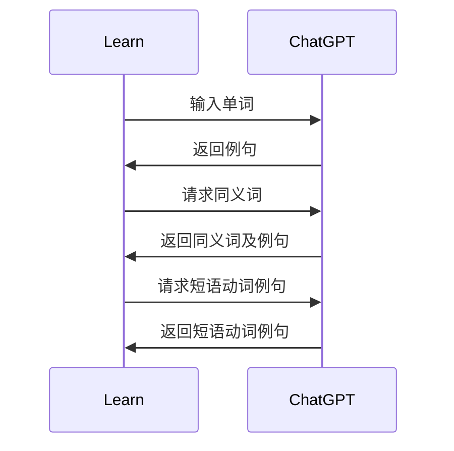

**系统接口设计和系统交互**：

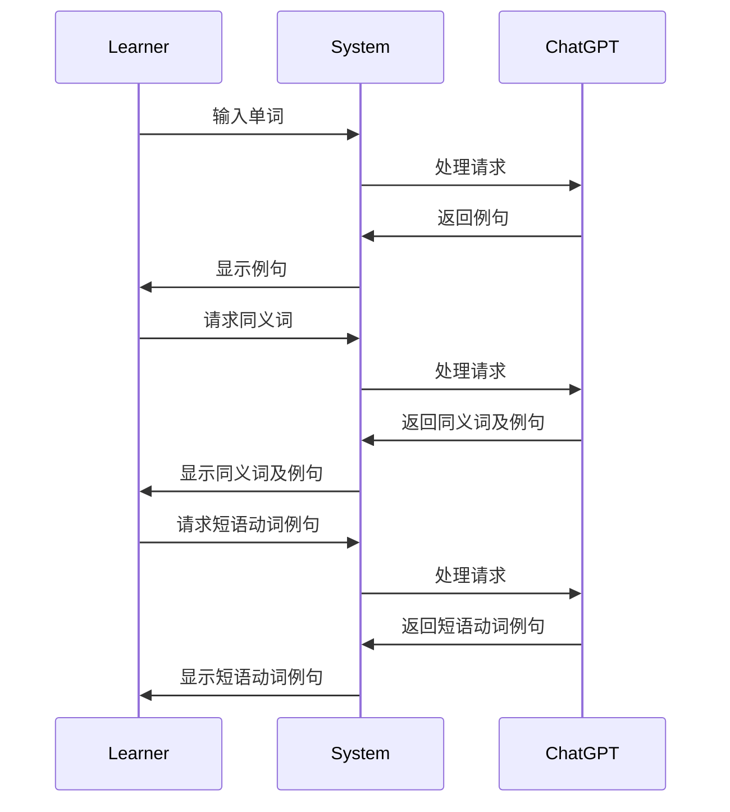

#### 3.2 ChatGPT在语法学习中的应用

**背景介绍**

语法是语言的框架，掌握语法规则对于语言学习者来说至关重要。ChatGPT作为一种强大的语言模型，可以辅助学习者理解并掌握语法规则。

**问题描述**

如何利用ChatGPT辅助学习者进行语法学习？

**问题解决**

**1. 语法规则讲解与示例**

ChatGPT可以通过生成与语法规则相关的句子和例句，帮助学习者理解语法规则。例如，当学习者学习一个语法概念时，ChatGPT可以生成多个例句，展示这个语法概念在不同语境中的使用。

**2. 语法错误修正与提示**

ChatGPT可以帮助学习者发现并修正语法错误。当学习者输入一段含有语法错误的文本时，ChatGPT可以识别错误并提供修正建议。

**3. 语法练习与互动**

ChatGPT可以与学习者进行互动，提供语法练习。例如，ChatGPT可以生成语法选择题或填空题，让学习者进行练习，并通过反馈来评估学习者的掌握情况。

**案例解析**

假设学习者正在学习英语语法，ChatGPT可以提供以下辅助：

- **语法规则讲解与示例**：当学习者学习一个语法概念时，ChatGPT会生成多个例句，如：“I usually go to the gym on Sundays.”、“She can't swim.”，帮助学习者理解语法规则。

- **语法错误修正与提示**：当学习者输入一段含有语法错误的文本时，ChatGPT会标记错误并提供修正建议，如：“Your sentence has a subject-verb agreement error. It should be 'He can swim.'”。

- **语法练习与互动**：ChatGPT会生成语法选择题或填空题，让学习者进行练习，并通过反馈来评估学习者的掌握情况，如：“Which sentence has a subject-verb agreement error? A. She can swim. B. He can't swim.”。

**系统分析与架构设计方案**

**问题场景介绍**：语言学习者需要学习英语语法，并希望利用ChatGPT进行辅助。

**项目介绍**：本项目旨在开发一个基于ChatGPT的英语语法学习系统。

**系统功能设计**：

- **语法规则讲解与示例功能**：通过生成例句帮助学习者理解语法规则。
- **语法错误修正与提示功能**：识别并修正语法错误。
- **语法练习与互动功能**：提供语法练习并评估学习者的掌握情况。

**系统架构设计**：

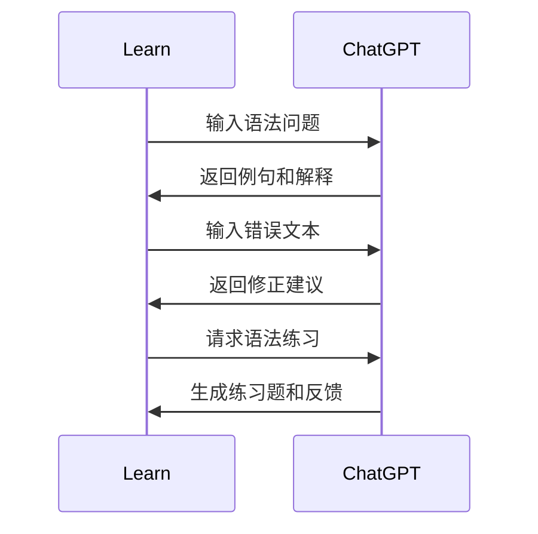

**系统接口设计和系统交互**：

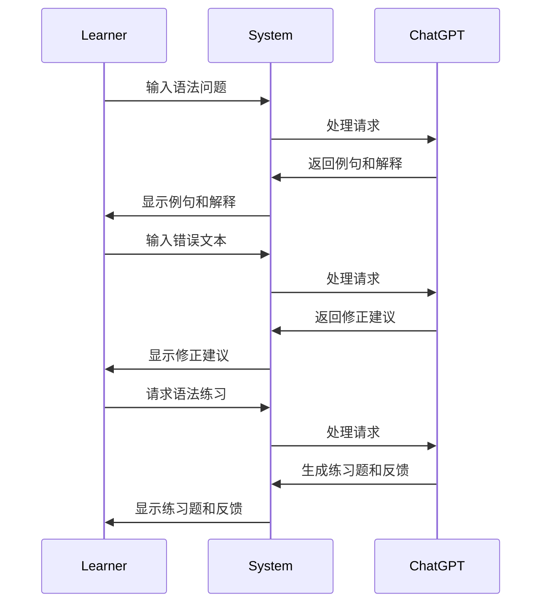

#### 3.3 ChatGPT在听力理解中的应用

**背景介绍**

听力理解是语言学习的重要组成部分，对于语言学习者的语言能力提升至关重要。ChatGPT作为一种先进的语言处理模型，能够辅助学习者提高听力理解能力。

**问题描述**

如何利用ChatGPT辅助学习者进行听力理解？

**问题解决**

**1. 听力材料生成与个性化推送**

ChatGPT可以根据学习者的需求和水平，生成个性化的听力材料。例如，当学习者需要提高特定主题的听力理解能力时，ChatGPT可以生成相关的听力材料，如新闻报道、讲座录音等。

**2. 听力理解能力提升策略**

ChatGPT可以通过分析听力材料，为学习者提供听力理解策略。例如，ChatGPT可以分析听力材料的结构，提供听力技巧，如预测、笔记和总结等。

**3. 听力材料分类与标签管理**

ChatGPT可以对听力材料进行分类和标签管理，帮助学习者快速找到所需的听力材料。例如，ChatGPT可以按照主题、难度和类型对听力材料进行分类，并提供标签，如“新闻”、“文化”、“科技”等。

**案例解析**

假设学习者正在学习英语听力，ChatGPT可以提供以下辅助：

- **听力材料生成与个性化推送**：根据学习者的需求和水平，ChatGPT会生成个性化的听力材料，如关于科技领域的新闻报道、学术讲座等。

- **听力理解能力提升策略**：ChatGPT会分析听力材料，提供听力技巧，如预测、笔记和总结等。例如，ChatGPT可能会建议学习者：“在听新闻时，可以先预测主题和内容，然后边听边做笔记，最后进行总结。”

- **听力材料分类与标签管理**：ChatGPT会对听力材料进行分类和标签管理，帮助学习者快速找到所需的听力材料。例如，ChatGPT会将听力材料按照主题、难度和类型进行分类，并提供标签，如“新闻”、“文化”、“科技”等。

**系统分析与架构设计方案**

**问题场景介绍**：语言学习者需要提高听力理解能力，并希望利用ChatGPT进行辅助。

**项目介绍**：本项目旨在开发一个基于ChatGPT的英语听力学习系统。

**系统功能设计**：

- **听力材料生成与个性化推送功能**：生成个性化的听力材料。
- **听力理解能力提升策略功能**：提供听力技巧和策略。
- **听力材料分类与标签管理功能**：分类和管理听力材料。

**系统架构设计**：

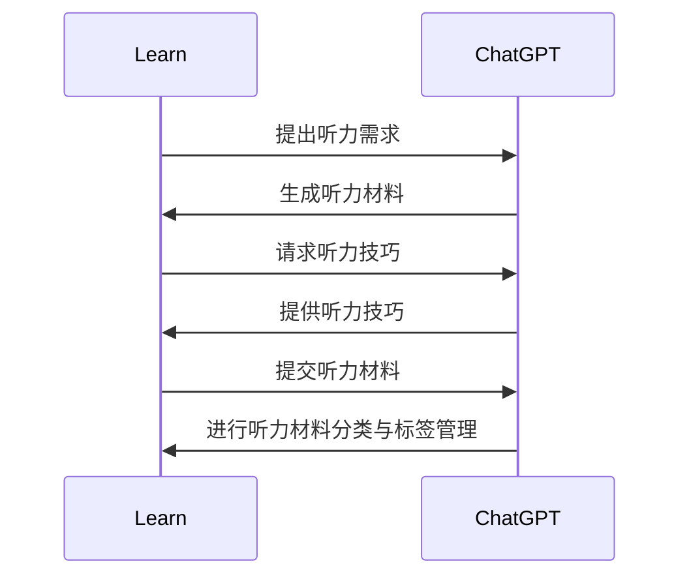

**系统接口设计和系统交互**：

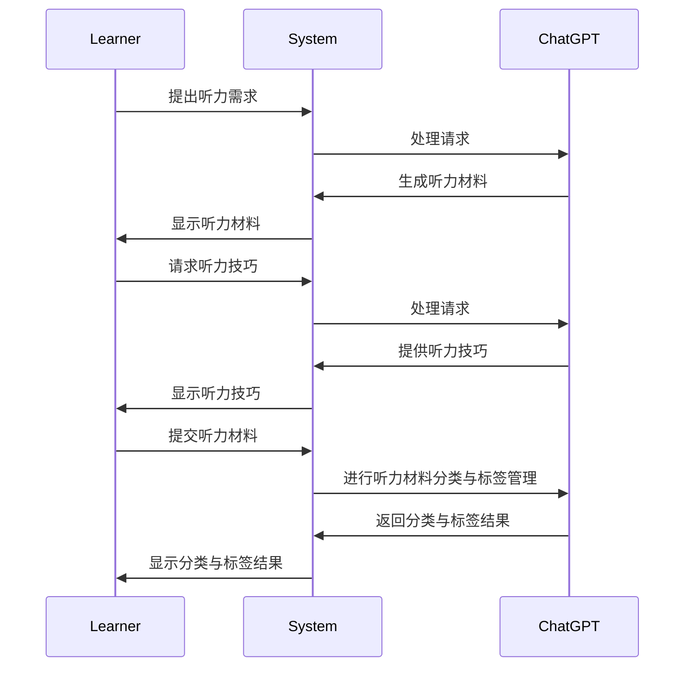

#### 3.4 ChatGPT在阅读理解中的应用

**背景介绍**

阅读理解是语言学习者必须掌握的技能之一，它不仅涉及对文本的理解，还包括信息的筛选和总结。ChatGPT作为一种强大的语言处理工具，可以在阅读理解中发挥重要作用。

**问题描述**

如何利用ChatGPT辅助学习者进行阅读理解？

**问题解决**

**1. 阅读材料生成与个性化推荐**

ChatGPT可以根据学习者的兴趣和水平，生成个性化的阅读材料。例如，当学习者对某个主题特别感兴趣时，ChatGPT可以生成相关的文章或书籍摘要，提供个性化的阅读推荐。

**2. 阅读理解能力提升策略**

ChatGPT可以通过分析阅读材料，为学习者提供阅读理解策略。例如，ChatGPT可以分析文章的结构，提供阅读技巧，如预览、快速阅读和深入阅读等。

**3. 阅读材料分类与标签管理**

ChatGPT可以对阅读材料进行分类和标签管理，帮助学习者快速找到所需的阅读材料。例如，ChatGPT可以按照主题、难度和类型对阅读材料进行分类，并提供标签，如“新闻”、“小说”、“科普”等。

**案例解析**

假设学习者正在学习英语阅读，ChatGPT可以提供以下辅助：

- **阅读材料生成与个性化推荐**：根据学习者的兴趣和水平，ChatGPT会生成个性化的阅读材料，如关于科技领域的文章、小说等。

- **阅读理解能力提升策略**：ChatGPT会分析阅读材料，提供阅读技巧，如预览、快速阅读和深入阅读等。例如，ChatGPT可能会建议学习者：“在阅读科技文章时，可以先快速浏览文章的标题和摘要，然后深入阅读重要的段落。”

- **阅读材料分类与标签管理**：ChatGPT会对阅读材料进行分类和标签管理，帮助学习者快速找到所需的阅读材料。例如，ChatGPT会将阅读材料按照主题、难度和类型进行分类，并提供标签，如“新闻”、“小说”、“科普”等。

**系统分析与架构设计方案**

**问题场景介绍**：语言学习者需要提高阅读理解能力，并希望利用ChatGPT进行辅助。

**项目介绍**：本项目旨在开发一个基于ChatGPT的英语阅读理解系统。

**系统功能设计**：

- **阅读材料生成与个性化推荐功能**：生成个性化的阅读材料。
- **阅读理解能力提升策略功能**：提供阅读技巧和策略。
- **阅读材料分类与标签管理功能**：分类和管理阅读材料。

**系统架构设计**：

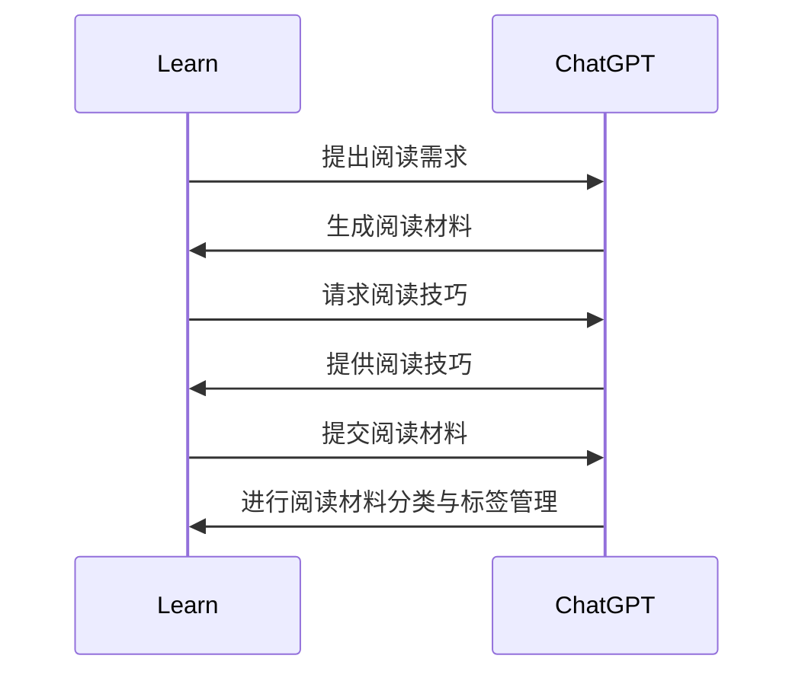

**系统接口设计和系统交互**：


#### 3.5 ChatGPT在口语表达中的应用

**背景介绍**

口语表达是语言学习的重要环节，对于提高学习者的语言交际能力至关重要。ChatGPT作为一种先进的语言处理工具，可以在口语表达中发挥重要作用。

**问题描述**

如何利用ChatGPT辅助学习者进行口语表达？

**问题解决**

**1. 口语训练题生成与解析**

ChatGPT可以生成与口语表达相关的训练题，如角色扮演、对话练习等，并对其进行解析。例如，ChatGPT可以生成一个对话场景，让学习者练习如何表达意见或提出问题，然后提供反馈和解析。

**2. 口语反馈与评估**

ChatGPT可以实时评估学习者的口语表达，并提供反馈。例如，当学习者完成一段口语表达后，ChatGPT可以分析其发音、语法和表达方式，提供改进建议。

**3. 口语策略调整与优化**

ChatGPT可以通过分析学习者的口语表达，帮助其调整和优化口语策略。例如，ChatGPT可以分析学习者的表达习惯，提供改进建议，如使用更地道的表达方式、增加词汇量等。

**案例解析**

假设学习者正在学习英语口语，ChatGPT可以提供以下辅助：

- **口语训练题生成与解析**：ChatGPT会生成一个对话场景，如：“你和一个外国朋友见面，你需要在五分钟内介绍自己。”，然后提供解析和反馈。

- **口语反馈与评估**：当学习者完成一段口语表达后，ChatGPT会分析其发音、语法和表达方式，提供改进建议，如：“你的发音很好，但要注意语调的起伏。”。

- **口语策略调整与优化**：ChatGPT会分析学习者的口语表达，提供改进建议，如：“你可以尝试使用更多的连接词来使你的表达更加流畅。”。

**系统分析与架构设计方案**

**问题场景介绍**：语言学习者需要提高口语表达能力，并希望利用ChatGPT进行辅助。

**项目介绍**：本项目旨在开发一个基于ChatGPT的英语口语学习系统。

**系统功能设计**：

- **口语训练题生成与解析功能**：生成口语训练题并提供解析。
- **口语反馈与评估功能**：提供实时反馈和评估。
- **口语策略调整与优化功能**：提供改进建议。

**系统架构设计**：

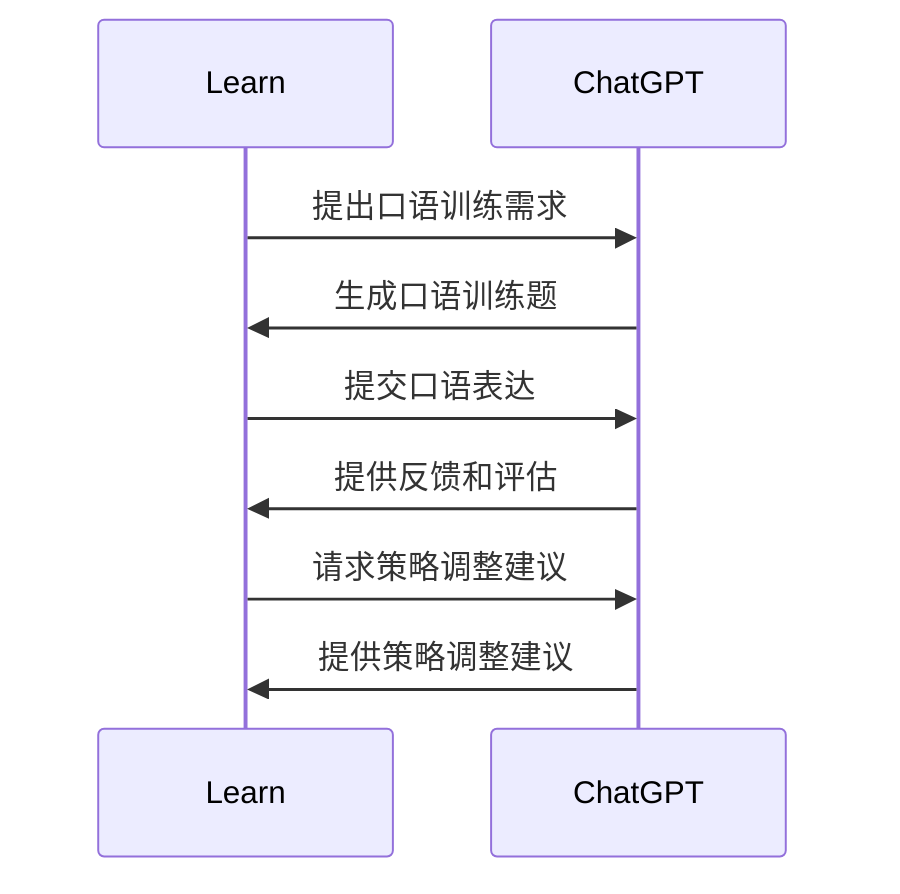

**系统接口设计和系统交互**：

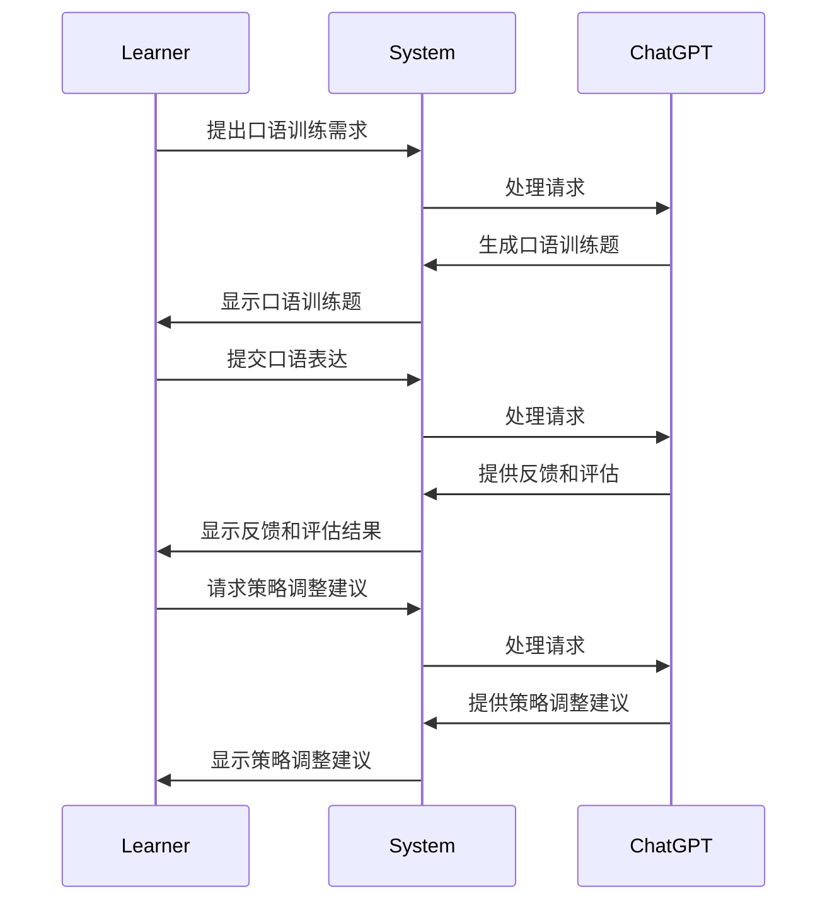

#### 3.6 ChatGPT在写作训练中的应用

**背景介绍**

写作能力是语言学习者必须掌握的基本技能之一，它对于语言表达能力和思维能力的发展具有重要意义。ChatGPT作为一种先进的语言处理工具，可以在写作训练中发挥重要作用。

**问题描述**

如何利用ChatGPT辅助学习者进行写作训练？

**问题解决**

**1. 写作素材生成与推荐**

ChatGPT可以根据学习者的需求和兴趣，生成写作素材，如主题、观点、论据等，并推荐相关素材。例如，当学习者需要写一篇关于环境保护的文章时，ChatGPT可以提供相关的主题、观点和论据。

**2. 写作结构优化与修正**

ChatGPT可以帮助学习者优化写作结构，如文章的引言、正文和结论。通过分析学习者的输入，ChatGPT可以提供修改建议，如调整句子结构、增加过渡句等。

**3. 写作风格分析与建议**

ChatGPT可以对学习者的写作风格进行分析，并提供改进建议。例如，ChatGPT可以分析学习者的词汇使用、语法结构和表达方式，提供如何使文章更地道、更有说服力的建议。

**案例解析**

假设学习者正在学习英语写作，ChatGPT可以提供以下辅助：

- **写作素材生成与推荐**：当学习者需要写作时，ChatGPT可以提供相关的主题、观点和论据。例如，ChatGPT可以生成：“主题：环境保护；观点：减少污染；论据：使用可再生能源。”。

- **写作结构优化与修正**：当学习者完成一篇作文后，ChatGPT可以提供修改建议。例如，ChatGPT可以建议：“在引言部分，可以增加一句引入主题的句子；在结论部分，可以强调观点并给出具体的行动建议。”

- **写作风格分析与建议**：ChatGPT可以分析学习者的写作风格，提供改进建议。例如，ChatGPT可以建议：“你的文章表达清晰，但可以尝试使用更多的同义词来丰富语言。”

**系统分析与架构设计方案**

**问题场景介绍**：语言学习者需要提高写作能力，并希望利用ChatGPT进行辅助。

**项目介绍**：本项目旨在开发一个基于ChatGPT的英语写作学习系统。

**系统功能设计**：

- **写作素材生成与推荐功能**：生成写作素材并提供推荐。
- **写作结构优化与修正功能**：提供修改建议。
- **写作风格分析与建议功能**：分析写作风格并提供改进建议。

**系统架构设计**：

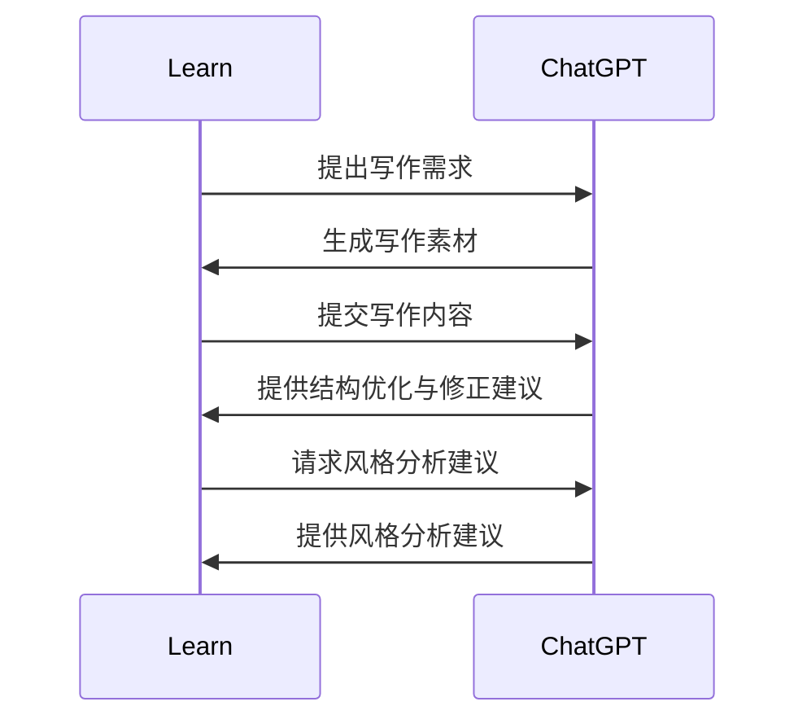

**系统接口设计和系统交互**：

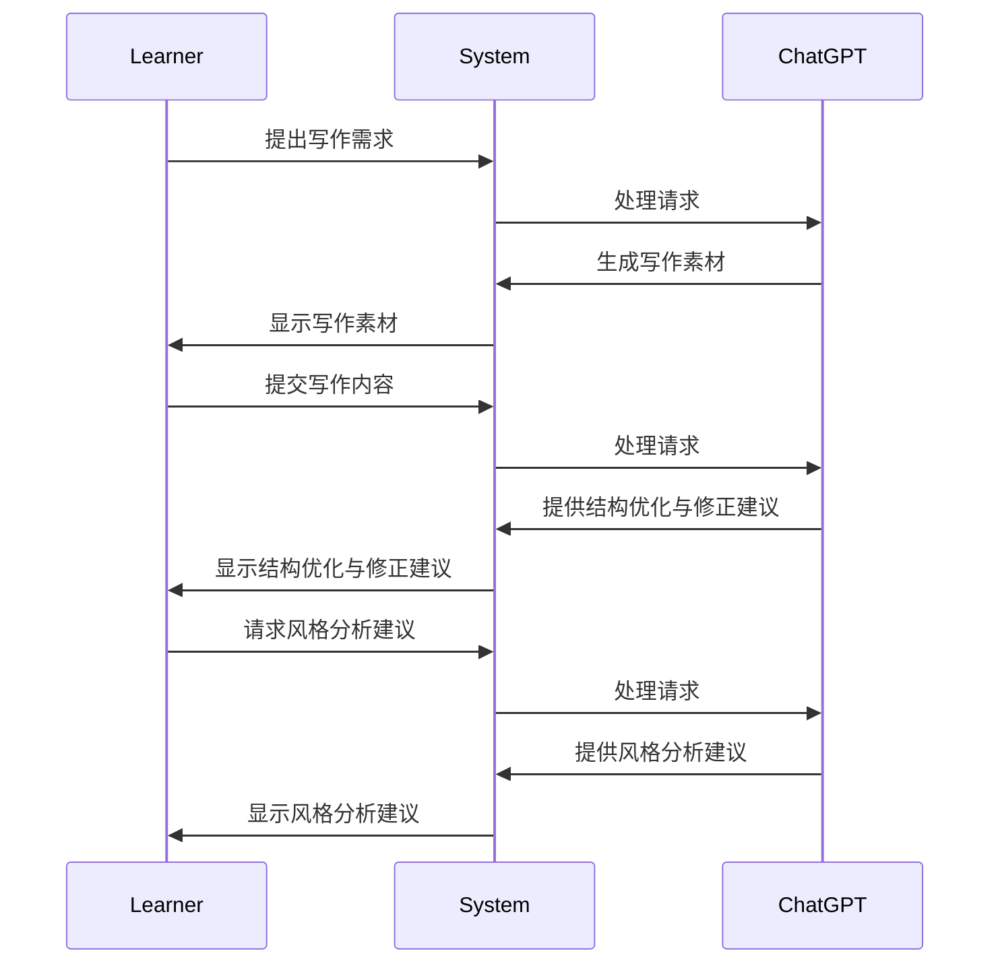

### 第4章：ChatGPT在跨文化语言交流中的应用

#### 4.1 ChatGPT在跨文化语言交流中的优势与挑战

**背景介绍**

随着全球化的发展，跨文化语言交流变得越来越频繁。然而，由于文化差异和语言障碍，跨文化语言交流面临着诸多挑战。ChatGPT作为一种先进的自然语言处理工具，其在跨文化语言交流中的应用具有很大的潜力。

**问题描述**

如何利用ChatGPT在跨文化语言交流中发挥优势，同时克服挑战？

**问题解决**

**1. 跨文化语言交流的背景**

全球化背景下，跨文化语言交流日益重要。不同文化之间的交流不仅有助于促进国际合作，还有助于增进不同文化之间的理解和尊重。

**2. ChatGPT在跨文化语言交流中的优势**

ChatGPT在跨文化语言交流中的优势主要体现在以下几个方面：

- **多语言支持**：ChatGPT可以支持多种语言，为跨文化语言交流提供便利。
- **实时翻译**：ChatGPT可以进行实时翻译，帮助不同语言背景的人进行交流。
- **语境理解**：ChatGPT能够理解交流的语境，提供更准确和自然的交流方式。

**3. ChatGPT在跨文化语言交流中的挑战**

尽管ChatGPT在跨文化语言交流中具有优势，但同时也面临着一些挑战：

- **文化差异**：不同文化之间的价值观、行为习惯和交流方式存在差异，这可能导致误解和沟通障碍。
- **语言复杂度**：某些语言在表达和语法上可能比其他语言更复杂，这给ChatGPT的处理带来挑战。

**案例解析**

假设有一场国际会议，参与者的母语不同，ChatGPT可以提供以下辅助：

- **多语言支持**：ChatGPT可以实时翻译参与者的发言，使其能够理解对方的观点。
- **语境理解**：ChatGPT可以根据会议的语境，提供适当的交流方式，如提问、回应等。
- **文化差异应对**：ChatGPT可以提供跨文化交流的指导，帮助参与者了解对方的文化背景和行为习惯，减少误解和冲突。

**系统分析与架构设计方案**

**问题场景介绍**：国际会议需要实现跨文化语言交流，并希望利用ChatGPT进行辅助。

**项目介绍**：本项目旨在开发一个基于ChatGPT的跨文化语言交流系统。

**系统功能设计**：

- **实时翻译功能**：提供实时翻译服务。
- **语境理解功能**：理解交流的语境并提供相应的交流方式。
- **文化差异应对功能**：提供跨文化交流的指导和建议。

**系统架构设计**：

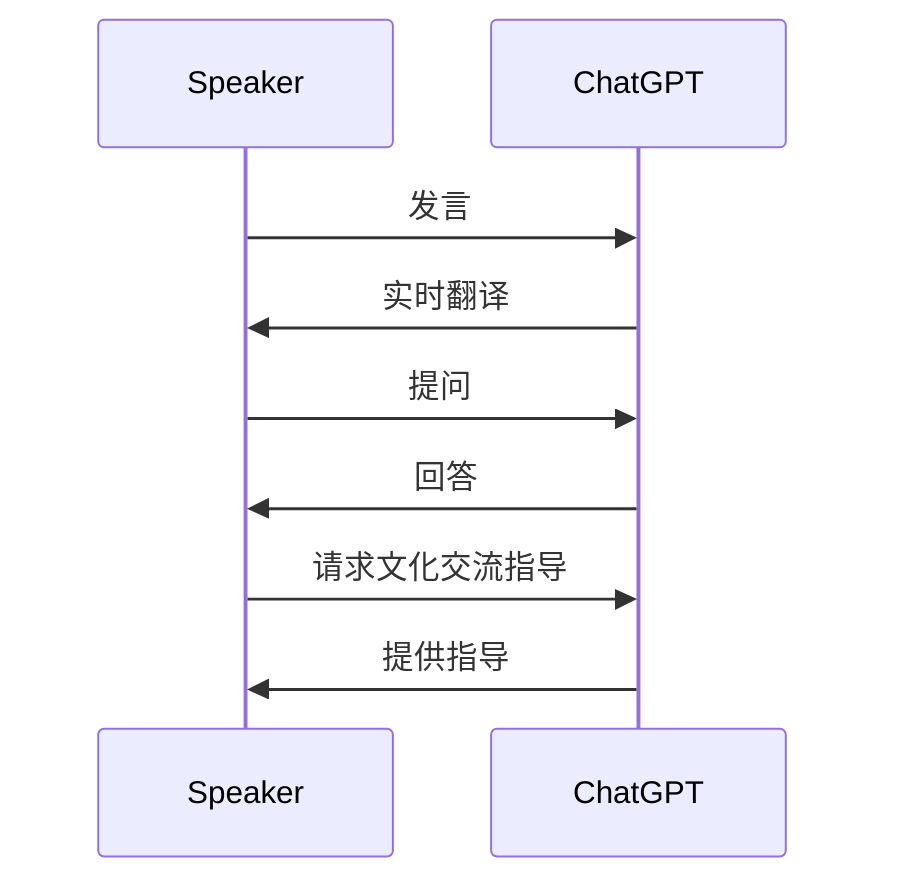

**系统接口设计和系统交互**：

```mermaid
sequenceDiagram
  Participant ->> System: 发言
  System ->> ChatGPT: 处理发言
  ChatGPT ->> System: 返回实时翻译结果
  System ->> Participant: 显示翻译结果
  Participant ->> System: 提问
  System ->> ChatGPT: 处理提问
  ChatGPT ->> System: 返回回答
  System ->> Participant: 显示回答
  Participant ->> System: 请求文化交流指导
  System ->> ChatGPT: 处理请求
  ChatGPT ->> System: 提供指导
  System ->> Participant: 显示指导
```

#### 4.2 ChatGPT在跨文化语言交流中的应用场景

**跨文化语言教学**

ChatGPT可以在跨文化语言教学中发挥重要作用。通过生成与教学内容相关的文本和示例，ChatGPT可以帮助学习者更好地理解语言和文化。例如，ChatGPT可以生成与课文相关的对话、文章和讲解，帮助学习者理解课文中的语言和文化背景。

**跨文化商务交流**

在跨文化商务交流中，ChatGPT可以提供实时翻译和交流支持。通过实时翻译，ChatGPT可以帮助不同语言背景的商务人士进行交流，促进商务合作。此外，ChatGPT还可以提供文化差异分析，帮助商务人士了解对方的文化背景和交流习惯，减少误解和冲突。

**跨文化社交互动**

跨文化社交互动中，ChatGPT可以帮助人们更好地交流和理解。通过生成与社交活动相关的文本和示例，ChatGPT可以帮助人们了解不同文化的社交礼仪和交流方式。例如，ChatGPT可以生成关于节日庆祝、社交聚会和文化活动的文本，帮助人们更好地融入社交活动。

### 第5章：ChatGPT在语言习得策略研究中的应用前景与展望

#### 5.1 ChatGPT在语言习得策略研究中的应用前景

**技术发展趋势**

随着深度学习技术的不断发展，ChatGPT等预训练语言模型在性能和适用范围上都有了显著提升。未来，ChatGPT在语言习得策略研究中的应用前景将更加广阔。

**教育领域应用**

在教育领域，ChatGPT可以用于个性化教育、自适应学习和在线辅导等方面。通过结合ChatGPT，教育工作者可以设计出更加智能、个性化的教学方案，提高学习效果。

**商业领域应用**

在商业领域，ChatGPT可以用于客户服务、客户关系管理和市场研究等方面。通过ChatGPT，企业可以实现智能客服系统，提高客户满意度和服务质量。

#### 5.2 ChatGPT在语言习得策略研究中的展望

**技术改进方向**

- **多语言支持**：开发支持多种语言的ChatGPT模型，满足全球学习者的需求。
- **个性化推荐**：结合学习者的学习数据和偏好，提供更加个性化的语言学习建议。
- **跨学科应用**：探讨ChatGPT在其他学科领域中的应用，如医学、法律等。

**研究热点与难点**

- **文化差异处理**：如何在跨文化语言交流中更好地处理文化差异，减少误解和冲突。
- **语言理解能力提升**：如何进一步提高ChatGPT在语言理解任务上的表现。

**未来发展趋势**

- **智能化教育**：ChatGPT将在教育领域发挥更大的作用，推动智能化教育的发展。
- **跨学科研究**：ChatGPT将在多个学科领域中得到应用，推动跨学科研究的发展。

### 参考文献

1. B:asyncio:异步编程库，Python官方推荐。
2. OpenAI: ChatGPT: A Transformer Language Model for Large-scale Dialogue
3. Krashen, S. D. (1981). Principles and Practice in Second Language Acquisition.
4. Long, M. (1985). Input, Interaction, and Second Language Learning.
5. Swain, M. (1985). Communicative Competence: Some Roles of Comprehension and Production in Its Development.
6. 杨明生. (2009). 英语词汇学[M]. 上海外语教育出版社.
7. 刘润东. (2016). 英语语法学习与实践[M]. 外语教学与研究出版社.

### 作者信息

作者：AI天才研究院/AI Genius Institute & 禅与计算机程序设计艺术 /Zen And The Art of Computer Programming

