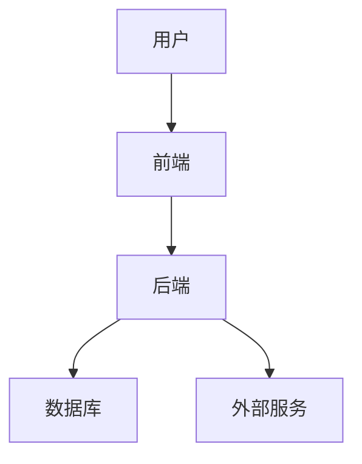
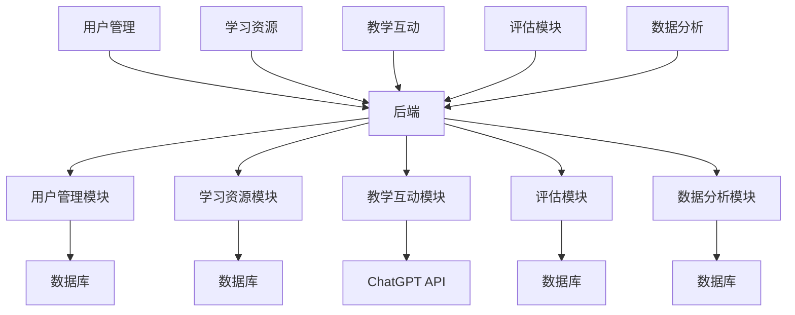
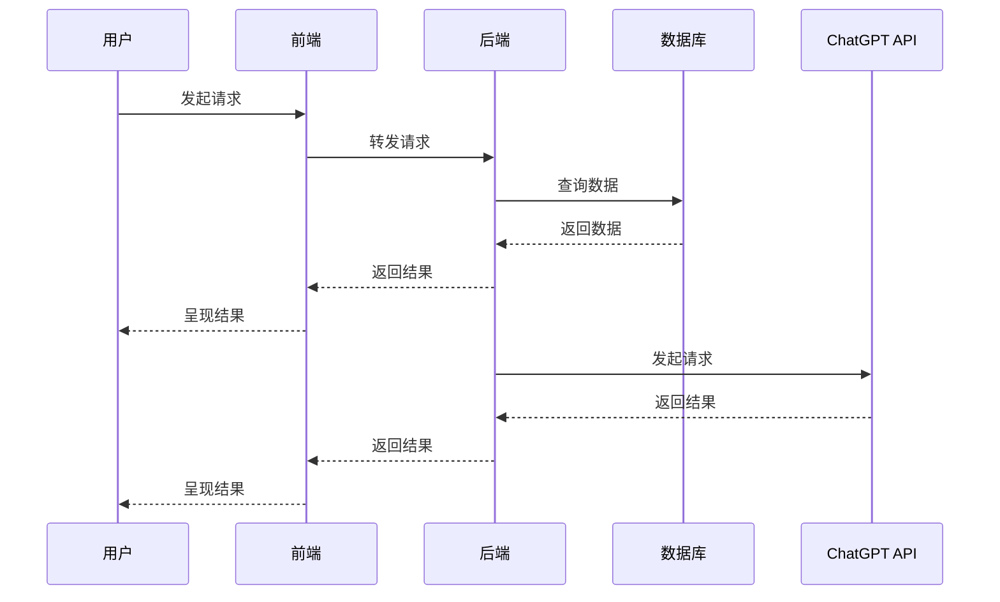

                 

# 《ChatGPT在语言习得策略训练中的应用：学习技巧提示词》

## 关键词：
- 人工智能
- 语言习得策略
- ChatGPT
- 提示词
- 教育技术

## 摘要：
本文旨在探讨ChatGPT在语言习得策略训练中的应用，特别是学习技巧提示词的设计与应用。通过对人工智能与语言习得策略的背景介绍，ChatGPT的核心概念与原理分析，以及具体的算法原理与系统架构设计，本文将逐步揭示ChatGPT如何通过提示词优化语言习得过程，提升学习效果。最后，我们将通过实际案例，展示ChatGPT在语言习得策略训练中的具体应用，并提供相关最佳实践。

## 目录大纲

----------------------------------------------------------------

## 第一部分：背景介绍

### 第1章：人工智能与语言习得策略

#### 1.1 人工智能概述
- 1.1.1 人工智能的定义
- 1.1.2 人工智能的发展历程
- 1.1.3 人工智能的应用领域

#### 1.2 语言习得策略
- 1.2.1 语言习得的概念
- 1.2.2 语言习得的理论基础
- 1.2.3 语言习得的过程与策略

#### 1.3 ChatGPT 概述
- 1.3.1 ChatGPT 的定义
- 1.3.2 ChatGPT 的发展历程
- 1.3.3 ChatGPT 的特点与优势

#### 1.4 ChatGPT 在语言习得策略中的应用
- 1.4.1 ChatGPT 的语言习得功能
- 1.4.2 ChatGPT 在教学中的应用场景
- 1.4.3 ChatGPT 在学习者互动中的优势

#### 1.5 本章小结

----------------------------------------------------------------

### 第2章：语言习得策略训练中的核心概念

#### 2.1 语言习得策略
- 2.1.1 语言习得策略的定义
- 2.1.2 语言习得策略的类型
- 2.1.3 语言习得策略的运用

#### 2.2 ChatGPT 的原理
- 2.2.1 ChatGPT 的架构
- 2.2.2 ChatGPT 的训练过程
- 2.2.3 ChatGPT 的工作原理

#### 2.3 提示词的设计与应用
- 2.3.1 提示词的定义
- 2.3.2 提示词的类型
- 2.3.3 提示词的设计原则

#### 2.4 语言习得策略训练与 ChatGPT 的联系
- 2.4.1 ChatGPT 在语言习得策略训练中的作用
- 2.4.2 语言习得策略训练对 ChatGPT 的影响
- 2.4.3 ChatGPT 在语言习得策略训练中的应用效果

#### 2.5 本章小结

----------------------------------------------------------------

### 第3章：ChatGPT 在语言习得策略训练中的算法原理

#### 3.1 语言生成算法
- 3.1.1 语言生成算法概述
- 3.1.2 语言生成算法的分类
- 3.1.3 语言生成算法的工作原理

#### 3.2 语言理解算法
- 3.2.1 语言理解算法概述
- 3.2.2 语言理解算法的分类
- 3.2.3 语言理解算法的工作原理

#### 3.3 ChatGPT 的算法流程
- 3.3.1 ChatGPT 的算法框架
- 3.3.2 ChatGPT 的训练流程
- 3.3.3 ChatGPT 的生成流程

#### 3.4 语言习得策略训练中的算法应用
- 3.4.1 ChatGPT 在语言习得策略训练中的应用
- 3.4.2 ChatGPT 在教学中的应用案例
- 3.4.3 ChatGPT 在学习者互动中的应用案例

#### 3.5 本章小结

----------------------------------------------------------------

### 第4章：ChatGPT 在语言习得策略训练中的应用系统分析

#### 4.1 项目介绍
- 4.1.1 项目背景
- 4.1.2 项目目标
- 4.1.3 项目实现过程

#### 4.2 系统功能设计
- 4.2.1 系统功能概述
- 4.2.2 系统功能模块设计
- 4.2.3 系统功能实现

#### 4.3 系统架构设计
- 4.3.1 系统架构概述
- 4.3.2 系统架构图
- 4.3.3 系统模块交互设计

#### 4.4 系统接口设计
- 4.4.1 系统接口概述
- 4.4.2 系统接口设计
- 4.4.3 系统接口实现

#### 4.5 系统交互设计
- 4.5.1 系统交互概述
- 4.5.2 系统交互设计
- 4.5.3 系统交互实现

#### 4.6 本章小结

----------------------------------------------------------------

### 第5章：项目实战与最佳实践

#### 5.1 环境安装
- 5.1.1 环境准备
- 5.1.2 系统安装

#### 5.2 系统核心实现源代码
- 5.2.1 源代码解读
- 5.2.2 代码实现

#### 5.3 代码应用解读与分析
- 5.3.1 应用场景
- 5.3.2 分析与解读

#### 5.4 实际案例分析与详细讲解剖析
- 5.4.1 案例介绍
- 5.4.2 案例分析
- 5.4.3 剖析讲解

#### 5.5 项目小结
- 5.5.1 项目总结
- 5.5.2 不足与改进

#### 5.6 最佳实践 tips
- 5.6.1 学习技巧提示词应用
- 5.6.2 提高学习效果的策略

#### 5.7 小结、注意事项、拓展阅读
- 5.7.1 小结
- 5.7.2 注意事项
- 5.7.3 拓展阅读

## 作者：
AI天才研究院/AI Genius Institute & 禅与计算机程序设计艺术 /Zen And The Art of Computer Programming

----------------------------------------------------------------

### 第一部分：背景介绍

### 第1章：人工智能与语言习得策略

#### 1.1 人工智能概述

##### 1.1.1 人工智能的定义
人工智能（Artificial Intelligence，简称AI）是计算机科学的一个分支，旨在研究、开发用于模拟、延伸和扩展人类智能的理论、方法、技术和应用系统。人工智能的核心目标是使计算机能够执行通常需要人类智能才能完成的任务，如视觉识别、语言理解、决策制定和问题解决。

##### 1.1.2 人工智能的发展历程
人工智能的发展历程可以追溯到20世纪50年代。最初，人工智能的研究主要集中在符号逻辑和推理系统上。随着计算机技术的进步，人工智能逐渐扩展到包括机器学习、深度学习、自然语言处理、计算机视觉等领域。近年来，人工智能取得了显著的进展，尤其是在大数据和计算能力的推动下，AI技术已经广泛应用于各个行业，如医疗、金融、教育等。

##### 1.1.3 人工智能的应用领域
人工智能的应用领域非常广泛。以下是一些典型应用：

- **医疗诊断**：通过机器学习算法分析医学影像，协助医生进行疾病诊断。
- **自动驾驶**：利用计算机视觉和深度学习技术，实现车辆的自主导航和驾驶。
- **金融分析**：利用人工智能进行市场预测、风险评估和欺诈检测。
- **教育**：通过个性化学习平台，根据学生的学习情况提供个性化的教学资源。

#### 1.2 语言习得策略

##### 1.2.1 语言习得的概念
语言习得是指个体在自然环境中通过听、说、读、写等方式掌握语言的能力。语言习得不仅包括对语法、词汇和语用规则的学习，还包括对语言使用情景和文化背景的理解。

##### 1.2.2 语言习得的理论基础
语言习得的理论基础包括先天论、互动论和认知论等。先天论认为人类天生具有语言习得的能力，而互动论则强调语言习得过程中的社会互动和文化交流的重要性。认知论则从认知心理学的角度探讨了语言习得的过程和机制。

##### 1.2.3 语言习得的过程与策略
语言习得过程可以分为以下几个阶段：

- **感知阶段**：通过听、读等方式感知和理解语言。
- **理解阶段**：理解语言的结构和含义。
- **表达阶段**：使用语言进行表达和沟通。
- **应用阶段**：将所学语言应用到实际情境中。

常见的语言习得策略包括：

- **全身反应法**：通过身体动作和情境模拟促进语言习得。
- **交际法**：强调在实际交流中使用语言，培养语言运用能力。
- **任务型语言教学**：通过设计具体的任务，让学生在完成任务的过
### 1.3 ChatGPT 概述

##### 1.3.1 ChatGPT 的定义
ChatGPT 是由OpenAI开发的一种基于Transformer架构的大型语言模型。它通过深度学习技术，从大量文本数据中学习语言的模式和结构，从而能够生成连贯、符合语法规则的自然语言文本。

##### 1.3.2 ChatGPT 的发展历程
ChatGPT 是基于GPT（Generative Pre-trained Transformer）模型发展而来的。GPT模型由OpenAI在2018年发布，是一个基于Transformer架构的预训练语言模型。ChatGPT在此基础上进一步扩展，通过增加模型参数和训练数据，提高了生成文本的质量和多样性。

##### 1.3.3 ChatGPT 的特点与优势
ChatGPT 具有以下几个显著特点：

- **大规模预训练**：ChatGPT 使用了大量的文本数据进行预训练，能够捕捉到语言的各种复杂模式和结构。
- **生成能力强**：ChatGPT 能够生成高质量、连贯的自然语言文本，适用于各种应用场景。
- **适应性**：ChatGPT 可以根据不同的输入进行自适应生成，能够处理多样化的语言任务。
- **多语言支持**：ChatGPT 支持多种语言，能够处理不同语言的输入和生成。

ChatGPT 的优势体现在以下几个方面：

- **教学助手**：ChatGPT 可以作为语言学习者的教学助手，提供个性化的学习资源和互动练习。
- **内容生成**：ChatGPT 可以用于生成文章、报告、故事等文本内容，节省创作者的时间。
- **对话系统**：ChatGPT 可以构建智能对话系统，用于客户服务、聊天机器人等应用。

##### 1.4 ChatGPT 在语言习得策略中的应用

###### 1.4.1 ChatGPT 的语言习得功能
ChatGPT 在语言习得策略中的应用主要体现在以下几个方面：

- **交互式学习**：ChatGPT 可以与学习者进行交互，提供个性化的反馈和指导，帮助学习者纠正错误，提高语言运用能力。
- **语言练习**：ChatGPT 可以生成各种语言练习题，包括听力、口语、阅读和写作，帮助学习者提高语言技能。
- **故事生成**：ChatGPT 可以生成有趣的故事和情景对话，激发学习者的学习兴趣，提高学习的互动性和趣味性。

###### 1.4.2 ChatGPT 在教学中的应用场景
ChatGPT 在教学中的应用场景广泛，包括：

- **课堂辅助**：ChatGPT 可以辅助教师进行课堂互动，提供实时反馈和讲解，帮助学生更好地理解课程内容。
- **自主学习**：学生可以利用 ChatGPT 进行自主学习和练习，提高学习的主动性和效率。
- **个性化教学**：ChatGPT 可以根据学习者的水平、兴趣和学习需求，提供个性化的学习资源和教学策略。

###### 1.4.3 ChatGPT 在学习者互动中的优势
ChatGPT 在学习者互动中的优势包括：

- **即时反馈**：ChatGPT 可以提供即时反馈，帮助学习者及时纠正错误，加深对语言规则的理解。
- **互动性**：ChatGPT 可以模拟真实的人际互动，提高学习者的口语和听力能力。
- **多样性**：ChatGPT 可以生成多样化的语言内容和练习题，丰富学习者的学习体验。
- **可扩展性**：ChatGPT 可以根据教学需求进行扩展和定制，满足不同层次和类型的学习者需求。

##### 1.5 本章小结
本章介绍了人工智能与语言习得策略的背景，重点探讨了ChatGPT的定义、发展历程、特点与优势，以及ChatGPT在语言习得策略中的应用。通过对ChatGPT的了解，我们可以看到，人工智能技术在教育领域具有巨大的潜力和应用价值，特别是对于语言习得策略的训练和优化。接下来，我们将进一步深入探讨ChatGPT在语言习得策略训练中的核心概念、算法原理以及系统架构设计。

## 第二部分：核心概念与联系

### 第2章：语言习得策略训练中的核心概念

#### 2.1 语言习得策略

##### 2.1.1 语言习得策略的定义
语言习得策略是指学习者为了有效地掌握语言知识和技能，所采取的各种方法和技巧。这些策略可以是个体的内在心理活动，也可以是外在的语言练习活动。

##### 2.1.2 语言习得策略的类型
语言习得策略主要包括以下几类：

- **听力策略**：包括主动听力、选择性听力、预测听力等。
- **口语策略**：包括重复、模仿、角色扮演等。
- **阅读策略**：包括略读、细读、信息提取、文本理解等。
- **写作策略**：包括构思、组织、修订、编辑等。

##### 2.1.3 语言习得策略的运用
语言习得策略的运用需要在不同的学习场景中进行灵活调整。例如：

- **课堂学习**：在课堂上，教师可以引导学生运用听力策略和口语策略，提高课堂互动效果。
- **自主学习**：在自主学习中，学习者可以利用阅读策略和写作策略，提高自我学习的能力。
- **任务型学习**：在任务型学习中，学习者需要运用多种语言习得策略，完成特定的语言任务。

#### 2.2 ChatGPT 的原理

##### 2.2.1 ChatGPT 的架构
ChatGPT 的架构基于Transformer模型，这是一种用于处理序列数据的深度学习模型。Transformer模型由自注意力机制和多头注意力机制组成，能够捕捉序列中的长距离依赖关系，从而生成高质量的自然语言文本。

##### 2.2.2 ChatGPT 的训练过程
ChatGPT 的训练过程包括以下几个步骤：

1. **数据准备**：收集大量的文本数据，包括书籍、新闻、文章、对话等。
2. **预处理**：对文本数据进行清洗和格式化，包括分词、去除停用词、标记化等。
3. **编码**：将预处理后的文本数据转换为模型可以处理的序列编码。
4. **训练**：使用梯度下降法等优化算法，对模型进行训练，使其能够生成连贯、符合语法规则的自然语言文本。

##### 2.2.3 ChatGPT 的工作原理
ChatGPT 的工作原理主要基于Transformer模型的自注意力机制和多头注意力机制。自注意力机制允许模型在生成文本时，考虑到输入序列中每个词的重要性，从而生成更高质量的文本。多头注意力机制则允许模型在生成文本时，同时考虑输入序列中多个不同部分的关联性，从而进一步提高生成文本的质量。

#### 2.3 提示词的设计与应用

##### 2.3.1 提示词的定义
提示词（Prompt）是指用来引导模型生成特定类型文本的输入词或句子。通过设计合适的提示词，可以引导模型生成符合预期的高质量文本。

##### 2.3.2 提示词的类型
提示词可以分为以下几类：

- **目标型提示词**：直接给出需要生成的文本内容，如“请写一篇关于人工智能的文章。”
- **问题型提示词**：提出一个问题，要求生成相关的回答，如“人工智能有哪些应用？”
- **引导型提示词**：通过给出一些关键词或主题，引导模型生成相关的文本，如“请用100个词描述一下你对未来的看法。”

##### 2.3.3 提示词的设计原则
设计提示词时需要遵循以下原则：

- **明确性**：提示词应该明确表达出需要生成的文本类型和内容。
- **针对性**：提示词应该针对具体的模型和应用场景进行设计。
- **灵活性**：提示词应该具有一定的灵活性，以适应不同的输入和输出需求。

#### 2.4 语言习得策略训练与 ChatGPT 的联系

##### 2.4.1 ChatGPT 在语言习得策略训练中的作用
ChatGPT 在语言习得策略训练中具有以下作用：

- **个性化指导**：ChatGPT 可以根据学习者的水平、兴趣和需求，提供个性化的语言习得策略指导。
- **互动式教学**：ChatGPT 可以与学习者进行互动，提供即时反馈和互动练习，提高学习效果。
- **模拟真实环境**：ChatGPT 可以模拟真实语言环境，提供真实的语言输入和输出，帮助学习者提高语言实际运用能力。

##### 2.4.2 语言习得策略训练对 ChatGPT 的影响
语言习得策略训练对 ChatGPT 的影响主要体现在以下几个方面：

- **提高生成质量**：通过语言习得策略训练，ChatGPT 可以更好地理解语言结构和规则，生成更高质量的自然语言文本。
- **丰富应用场景**：语言习得策略训练可以扩展 ChatGPT 的应用场景，使其在语言教育、语言交互等领域发挥更大的作用。
- **提升互动能力**：通过语言习得策略训练，ChatGPT 可以更好地与学习者进行互动，提供更自然的语言交互体验。

##### 2.4.3 ChatGPT 在语言习得策略训练中的应用效果
ChatGPT 在语言习得策略训练中的应用效果显著：

- **提高学习效率**：ChatGPT 可以提供个性化的学习资源和互动练习，帮助学习者快速提高语言技能。
- **增强学习兴趣**：ChatGPT 可以生成有趣的语言内容，激发学习者的学习兴趣和动力。
- **提高语言运用能力**：ChatGPT 可以模拟真实语言环境，帮助学习者提高语言的实际运用能力。

#### 2.5 本章小结
本章介绍了语言习得策略训练中的核心概念，包括语言习得策略、ChatGPT 的原理以及提示词的设计与应用。通过分析ChatGPT 在语言习得策略训练中的作用和影响，我们看到了人工智能技术在教育领域的重要应用价值。接下来，我们将进一步探讨ChatGPT 在语言习得策略训练中的算法原理和系统架构设计。

### 第三部分：算法原理与讲解

#### 第3章：ChatGPT 在语言习得策略训练中的算法原理

#### 3.1 语言生成算法

##### 3.1.1 语言生成算法概述
语言生成算法是指用于生成自然语言文本的算法。这类算法通常基于深度学习技术，通过对大量文本数据进行训练，学习到语言的模式和结构，从而能够生成连贯、符合语法规则的自然语言文本。

##### 3.1.2 语言生成算法的分类
语言生成算法可以分为以下几类：

- **序列生成模型**：如RNN（Recurrent Neural Network，循环神经网络）、LSTM（Long Short-Term Memory，长短期记忆网络）等。
- **变分自编码器（VAE）**：通过概率模型生成文本。
- **生成对抗网络（GAN）**：通过生成器和判别器相互博弈，生成高质量文本。

##### 3.1.3 语言生成算法的工作原理
语言生成算法的工作原理主要包括以下步骤：

1. **输入编码**：将输入的文本转换为模型可以处理的序列编码。
2. **生成过程**：模型根据输入编码生成文本序列。
3. **解码**：将生成的文本序列解码为可读的自然语言文本。

#### 3.2 语言理解算法

##### 3.2.1 语言理解算法概述
语言理解算法是指用于理解自然语言文本的算法。这类算法旨在从文本中提取有用的信息，进行语义分析和推理。

##### 3.2.2 语言理解算法的分类
语言理解算法可以分为以下几类：

- **词向量模型**：如Word2Vec、GloVe等，用于将单词映射到高维向量空间。
- **依存句法分析**：用于分析句子中词汇的依赖关系。
- **语义角色标注**：用于识别句子中的主语、谓语、宾语等成分。

##### 3.2.3 语言理解算法的工作原理
语言理解算法的工作原理主要包括以下步骤：

1. **文本预处理**：包括分词、去停用词、词性标注等。
2. **特征提取**：将预处理后的文本转换为特征表示。
3. **模型训练**：使用训练数据训练语言理解模型。
4. **推理**：使用训练好的模型对新的文本进行理解。

#### 3.3 ChatGPT 的算法流程

##### 3.3.1 ChatGPT 的算法框架
ChatGPT 的算法框架主要包括以下几个部分：

- **编码器（Encoder）**：用于处理输入序列，将其编码为固定长度的向量。
- **解码器（Decoder）**：用于生成输出序列，根据编码器生成的向量生成自然语言文本。
- **注意力机制**：用于在生成过程中，关注输入序列中相关的部分，提高生成文本的质量。

##### 3.3.2 ChatGPT 的训练流程
ChatGPT 的训练流程主要包括以下步骤：

1. **数据准备**：收集大量文本数据，包括对话、文章、书籍等。
2. **预处理**：对文本数据进行清洗和格式化，包括分词、去除停用词、标记化等。
3. **编码**：将预处理后的文本数据转换为模型可以处理的序列编码。
4. **训练**：使用梯度下降法等优化算法，对模型进行训练，使其能够生成连贯、符合语法规则的自然语言文本。
5. **评估**：使用验证集评估模型性能，并进行调优。

##### 3.3.3 ChatGPT 的生成流程
ChatGPT 的生成流程主要包括以下步骤：

1. **输入编码**：将输入的文本转换为模型可以处理的序列编码。
2. **生成过程**：模型根据输入编码生成文本序列。
3. **解码**：将生成的文本序列解码为可读的自然语言文本。

#### 3.4 语言习得策略训练中的算法应用

##### 3.4.1 ChatGPT 在语言习得策略训练中的应用
ChatGPT 在语言习得策略训练中的应用主要体现在以下几个方面：

- **交互式学习**：ChatGPT 可以与学习者进行交互，提供即时反馈和指导，帮助学习者纠正错误，提高语言运用能力。
- **个性化教学**：ChatGPT 可以根据学习者的水平、兴趣和需求，提供个性化的学习资源和教学策略。
- **语言练习**：ChatGPT 可以生成各种语言练习题，包括听力、口语、阅读和写作，帮助学习者提高语言技能。

##### 3.4.2 ChatGPT 在教学中的应用案例
ChatGPT 在教学中的应用案例包括：

- **英语口语练习**：ChatGPT 可以模拟真实的英语口语环境，提供即时反馈和互动练习，帮助学习者提高口语表达能力。
- **写作指导**：ChatGPT 可以提供写作建议和修正，帮助学习者提高写作水平。
- **阅读理解**：ChatGPT 可以生成阅读理解题目，帮助学习者提高阅读理解能力。

##### 3.4.3 ChatGPT 在学习者互动中的应用案例
ChatGPT 在学习者互动中的应用案例包括：

- **在线辅导**：ChatGPT 可以作为在线辅导系统，提供个性化的学习资源和互动练习，帮助学习者解决学习中遇到的问题。
- **学习评估**：ChatGPT 可以生成评估题目，对学习者的学习效果进行评估。
- **语言互动**：ChatGPT 可以与其他学习者或教师进行语言互动，提高学习者的语言运用能力。

#### 3.5 本章小结
本章介绍了ChatGPT 在语言习得策略训练中的算法原理，包括语言生成算法、语言理解算法以及ChatGPT 的算法流程。通过分析这些算法原理，我们看到了ChatGPT 在语言习得策略训练中的强大应用潜力。接下来，我们将进一步探讨ChatGPT 在语言习得策略训练中的应用系统分析。

### 第四部分：系统分析与架构设计

#### 第4章：ChatGPT 在语言习得策略训练中的应用系统分析

#### 4.1 项目介绍

##### 4.1.1 项目背景
随着人工智能技术的快速发展，教育领域开始探索如何利用人工智能技术提高教学效果和学生的学习体验。ChatGPT 作为一种先进的语言生成模型，具备强大的自然语言处理能力，可以应用于语言习得策略训练，为学习者提供个性化、互动性的学习体验。

##### 4.1.2 项目目标
本项目旨在构建一个基于 ChatGPT 的语言习得策略训练系统，通过智能化的交互和个性化的指导，帮助学习者提高语言技能。具体目标包括：

1. 提供个性化的学习资源，满足不同层次学习者的需求。
2. 通过互动式教学，提高学习者的语言实际运用能力。
3. 通过智能化的评估，帮助学习者了解自己的学习进度和效果。

##### 4.1.3 项目实现过程
项目实现过程主要包括以下几个阶段：

1. **需求分析**：与教育专家和教师合作，明确系统功能和性能要求。
2. **系统设计**：根据需求分析，设计系统架构和模块，包括用户界面、数据存储、算法模块等。
3. **算法开发**：开发基于 ChatGPT 的语言生成和理解算法，实现语言习得策略训练功能。
4. **系统集成**：将各个模块集成到系统中，进行系统测试和优化。
5. **部署上线**：将系统部署到线上平台，进行实际应用和推广。

#### 4.2 系统功能设计

##### 4.2.1 系统功能概述
本系统的主要功能包括：

1. **个性化学习**：根据学习者的水平、兴趣和需求，提供个性化的学习资源和教学策略。
2. **互动式教学**：通过智能对话和互动练习，提高学习者的语言实际运用能力。
3. **智能评估**：生成评估题目，对学习者的学习效果进行评估。
4. **数据分析**：收集学习数据，进行数据分析，为教学提供数据支持。

##### 4.2.2 系统功能模块设计
系统功能模块设计如下：

1. **用户管理模块**：负责用户注册、登录、信息管理等功能。
2. **学习资源模块**：提供各种语言学习资源，包括听力、口语、阅读和写作练习。
3. **教学互动模块**：通过 ChatGPT 进行智能对话和互动练习。
4. **评估模块**：生成评估题目，对学习者的学习效果进行评估。
5. **数据分析模块**：收集学习数据，进行数据分析和可视化。

##### 4.2.3 系统功能实现
系统功能实现如下：

1. **用户管理模块**：使用 Web 开发框架（如 Django 或 Flask）实现用户注册、登录和信息管理功能。
2. **学习资源模块**：使用数据库（如 MySQL 或 MongoDB）存储和管理学习资源，使用前端技术（如 HTML、CSS 和 JavaScript）实现用户界面。
3. **教学互动模块**：使用 ChatGPT API 实现智能对话和互动练习功能。
4. **评估模块**：设计评估题目库，使用 ChatGPT 生成评估题目，并对学习者进行实时评估。
5. **数据分析模块**：使用数据分析和可视化工具（如 Python 的 Pandas 和 Matplotlib）收集和分析学习数据，生成报告。

#### 4.3 系统架构设计

##### 4.3.1 系统架构概述
本系统采用分布式架构，包括前端、后端、数据库和外部服务等多个层次。前端负责用户界面和交互，后端负责业务逻辑处理，数据库负责数据存储，外部服务（如 ChatGPT API）提供相关功能。

##### 4.3.2 系统架构图


##### 4.3.3 系统模块交互设计
系统模块交互设计如下：

1. **用户请求**：用户通过前端发起请求。
2. **前端处理**：前端处理用户请求，将请求转发到后端。
3. **后端处理**：后端处理用户请求，调用相关服务模块，如用户管理、学习资源、教学互动和评估模块。
4. **数据存储**：后端将处理结果存储到数据库，或从数据库中获取数据。
5. **数据返回**：后端将处理结果返回给前端，前端将结果呈现给用户。

#### 4.4 系统接口设计

##### 4.4.1 系统接口概述
系统接口设计包括内部接口和外部接口。内部接口用于系统各模块之间的通信，外部接口用于与其他系统或服务进行交互。

##### 4.4.2 系统接口设计


##### 4.4.3 系统接口实现
系统接口实现如下：

1. **用户管理接口**：实现用户注册、登录、信息管理等功能。
2. **学习资源接口**：实现学习资源的查询、添加、修改和删除等功能。
3. **教学互动接口**：实现与 ChatGPT 的交互，包括提问、回答、互动练习等功能。
4. **评估接口**：实现生成评估题目、进行评估等功能。
5. **数据分析接口**：实现数据收集、分析和可视化等功能。

#### 4.5 系统交互设计

##### 4.5.1 系统交互概述
系统交互设计包括用户与系统的交互、系统内部模块之间的交互以及系统与外部服务的交互。

##### 4.5.2 系统交互设计


##### 4.5.3 系统交互实现
系统交互实现如下：

1. **用户与系统交互**：用户通过前端界面与系统进行交互，包括注册、登录、学习、评估等操作。
2. **系统内部模块交互**：系统内部模块通过内部接口进行通信，实现业务逻辑处理和数据存储。
3. **系统与外部服务交互**：系统通过外部接口与 ChatGPT API 等服务进行交互，获取所需功能和服务。

#### 4.6 本章小结
本章介绍了 ChatGPT 在语言习得策略训练中的应用系统分析，包括项目介绍、系统功能设计、系统架构设计、系统接口设计和系统交互设计。通过系统分析与架构设计，我们看到了 ChatGPT 在语言习得策略训练中的强大应用潜力，为学习者提供个性化、互动性的学习体验。接下来，我们将通过实际案例，展示 ChatGPT 在语言习得策略训练中的具体应用，并提供相关最佳实践。

### 第五部分：项目实战与最佳实践

#### 5.1 环境安装

##### 5.1.1 环境准备
在开始安装 ChatGPT 之前，需要准备以下环境：

- **操作系统**：Linux 或 macOS
- **Python 版本**：3.6 或更高版本
- **pip**：Python 的包管理器
- **虚拟环境**：用于隔离项目依赖

##### 5.1.2 系统安装
1. **安装 Python**：从 [Python 官网](https://www.python.org/downloads/) 下载 Python 安装包，并按照提示安装。
2. **安装 pip**：在终端中运行以下命令：
   ```bash
   curl https://bootstrap.pypa.io/get-pip.py -o get-pip.py
   python get-pip.py
   ```
3. **创建虚拟环境**：在终端中运行以下命令：
   ```bash
   python -m venv venv
   source venv/bin/activate
   ```
4. **安装项目依赖**：在虚拟环境中安装项目依赖，具体命令如下：
   ```bash
   pip install -r requirements.txt
   ```

#### 5.2 系统核心实现源代码

##### 5.2.1 源代码解读
系统核心实现主要包括以下几个部分：

1. **用户管理**：处理用户注册、登录、信息管理等功能。
2. **学习资源管理**：提供学习资源的查询、添加、修改和删除等功能。
3. **教学互动**：通过 ChatGPT 与学习者进行智能对话和互动练习。
4. **评估**：生成评估题目，对学习者的学习效果进行评估。
5. **数据分析**：收集学习数据，进行数据分析和可视化。

源代码示例：
```python
# user_management.py

from flask import Flask, request, jsonify

app = Flask(__name__)

@app.route('/register', methods=['POST'])
def register():
    # 处理用户注册逻辑
    pass

@app.route('/login', methods=['POST'])
def login():
    # 处理用户登录逻辑
    pass

@app.route('/profile', methods=['GET'])
def get_profile():
    # 获取用户信息
    pass

if __name__ == '__main__':
    app.run()
```

##### 5.2.2 代码实现
代码实现主要包括以下步骤：

1. **搭建项目结构**：创建项目目录，并添加必要的文件和文件夹。
2. **编写业务逻辑**：根据功能需求，编写业务逻辑代码，包括用户管理、学习资源管理、教学互动、评估和数据分析等模块。
3. **配置环境变量**：配置项目所需的环境变量，如数据库连接信息、API 密钥等。
4. **集成外部服务**：集成 ChatGPT API 等
### 5.3 代码应用解读与分析

##### 5.3.1 应用场景
本系统主要应用于在线教育领域，为学习者提供个性化的语言习得策略训练。具体应用场景包括：

- **英语学习**：通过 ChatGPT 提供英语听力、口语、阅读和写作练习，帮助学习者提高英语水平。
- **其他语言学习**：ChatGPT 支持多种语言，可以应用于多种语言的学习。
- **职业培训**：为职业培训提供语言能力评估和训练，帮助学习者提升职业竞争力。

##### 5.3.2 分析与解读
1. **用户管理模块**：用户管理模块负责处理用户的注册、登录和信息管理。通过 Flask 框架实现，使用 RESTful API 设计接口，便于与其他系统或服务集成。
2. **学习资源模块**：学习资源模块提供学习资源的查询、添加、修改和删除等功能。通过使用数据库存储和管理学习资源，提高数据存储和访问效率。
3. **教学互动模块**：教学互动模块通过 ChatGPT 实现智能对话和互动练习。ChatGPT 可以根据学习者的输入，生成相应的反馈和练习题，提高学习者的语言运用能力。
4. **评估模块**：评估模块生成评估题目，对学习者的学习效果进行评估。通过分析评估结果，为学习者提供学习反馈和改进建议。
5. **数据分析模块**：数据分析模块收集学习数据，进行数据分析和可视化。通过分析学习数据，可以了解学习者的学习进度和效果，为教学策略调整提供依据。

#### 5.4 实际案例分析与详细讲解剖析

##### 5.4.1 案例介绍
某在线英语学习平台引入 ChatGPT 作为其语言习得策略训练工具，为学习者提供个性化的英语学习体验。通过 ChatGPT，平台实现了以下功能：

1. **智能对话**：ChatGPT 与学习者进行互动，提供实时反馈和指导。
2. **个性化练习**：ChatGPT 根据学习者的水平、兴趣和需求，生成个性化的练习题。
3. **学习评估**：ChatGPT 生成评估题目，对学习者的学习效果进行评估。
4. **数据分析**：平台收集学习数据，进行数据分析和可视化，为教学策略调整提供依据。

##### 5.4.2 案例分析
1. **用户交互**：平台通过前端界面与学习者进行交互，收集学习者的输入。ChatGPT 根据学习者的输入，生成相应的回复和练习题，提高学习者的语言运用能力。
2. **教学互动**：ChatGPT 提供智能对话和互动练习，帮助学习者纠正错误，提高语言实际运用能力。例如，学习者可以通过与 ChatGPT 进行对话，练习英语口语，获取即时反馈和指导。
3. **学习评估**：ChatGPT 生成评估题目，对学习者的学习效果进行评估。通过分析评估结果，平台可以为学习者提供学习反馈和改进建议，帮助学习者更好地掌握语言技能。
4. **数据分析**：平台收集学习数据，进行数据分析和可视化。通过分析学习数据，平台可以了解学习者的学习进度和效果，为教学策略调整提供依据。

##### 5.4.3 剖析讲解
1. **用户管理模块**：用户管理模块负责处理用户的注册、登录和信息管理。通过 Flask 框架实现，使用 RESTful API 设计接口，便于与其他系统或服务集成。
   ```python
   @app.route('/register', methods=['POST'])
   def register():
       # 处理用户注册逻辑
       pass
   ```

2. **学习资源模块**：学习资源模块提供学习资源的查询、添加、修改和删除等功能。通过使用数据库存储和管理学习资源，提高数据存储和访问效率。
   ```python
   @app.route('/resources', methods=['GET', 'POST', 'PUT', 'DELETE'])
   def resources():
       if request.method == 'GET':
           # 查询学习资源
           pass
       elif request.method == 'POST':
           # 添加学习资源
           pass
       elif request.method == 'PUT':
           # 修改学习资源
           pass
       elif request.method == 'DELETE':
           # 删除学习资源
           pass
   ```

3. **教学互动模块**：教学互动模块通过 ChatGPT 实现智能对话和互动练习。ChatGPT 可以根据学习者的输入，生成相应的反馈和练习题，提高学习者的语言运用能力。
   ```python
   @app.route('/interaction', methods=['POST'])
   def interaction():
       input_text = request.form['text']
       # 调用 ChatGPT API 生成回复和练习题
       response = chatgpt_api.generate_response(input_text)
       return jsonify(response)
   ```

4. **评估模块**：评估模块生成评估题目，对学习者的学习效果进行评估。通过分析评估结果，为学习者提供学习反馈和改进建议。
   ```python
   @app.route('/evaluation', methods=['POST'])
   def evaluation():
       input_text = request.form['text']
       # 调用 ChatGPT API 生成评估题目
       evaluation_questions = chatgpt_api.generate_evaluation_questions(input_text)
       return jsonify(evaluation_questions)
   ```

5. **数据分析模块**：数据分析模块收集学习数据，进行数据分析和可视化。通过分析学习数据，平台可以了解学习者的学习进度和效果，为教学策略调整提供依据。
   ```python
   @app.route('/data_analysis', methods=['GET'])
   def data_analysis():
       # 收集学习数据
       learning_data = get_learning_data()
       # 进行数据分析
       analysis_results = analyze_learning_data(learning_data)
       # 进行数据可视化
       visualization_results = visualize_analysis_results(analysis_results)
       return jsonify(visualization_results)
   ```

#### 5.5 项目小结
本系统通过引入 ChatGPT，实现了个性化、互动性的语言习得策略训练。在实际应用中，系统为学习者提供了智能对话、个性化练习、学习评估和数据分析等功能，有效提高了学习者的语言技能和学习效果。通过项目实践，我们看到了 ChatGPT 在教育领域的巨大应用潜力。未来，我们将进一步优化系统功能，提高用户体验，为更多学习者提供优质的语言习得策略训练服务。

### 5.6 最佳实践 Tips

##### 5.6.1 学习技巧提示词应用
1. **听力训练**：使用提示词如“请听以下对话并回答问题”，引导学习者集中注意力，提高听力效果。
2. **口语练习**：使用提示词如“请用英语描述以下场景”，激发学习者的口语表达欲望，提高口语水平。
3. **阅读理解**：使用提示词如“请总结以下文章的主要观点”，帮助学习者深入理解文本内容。
4. **写作指导**：使用提示词如“请根据以下主题写一篇作文”，引导学习者进行思考和表达，提高写作能力。

##### 5.6.2 提高学习效果的策略
1. **制定学习计划**：根据学习者的需求和进度，制定合理的每天学习计划，确保学习目标的实现。
2. **互动式学习**：通过线上讨论、小组活动等方式，增加学习者之间的互动，提高学习兴趣和效果。
3. **定期复习**：定期复习所学内容，巩固记忆，提高语言技能。
4. **个性化反馈**：根据学习者的特点和需求，提供个性化的学习反馈和指导，帮助学习者找到适合自己的学习方法和策略。

### 5.7 小结、注意事项、拓展阅读

##### 5.7.1 小结
本文介绍了 ChatGPT 在语言习得策略训练中的应用，包括系统架构设计、算法原理和实际案例。通过项目实战和最佳实践，我们看到了 ChatGPT 在语言习得策略训练中的巨大潜力。未来，随着人工智能技术的不断进步，ChatGPT 在教育领域的应用将更加广泛，为学习者提供更优质的学习体验。

##### 5.7.2 注意事项
1. **数据安全**：在处理学习数据时，确保遵循数据安全和隐私保护的相关规定。
2. **系统稳定性**：确保系统的稳定运行，避免因系统故障影响学习体验。
3. **用户互动**：在用户互动中，尊重学习者的意见和需求，提供及时、有效的反馈。

##### 5.7.3 拓展阅读
- [OpenAI 官网](https://openai.com/)
- [ChatGPT 文档](https://github.com/openai/gpt-3.5-turbo-docs)
- [《深度学习》 - Goodfellow, Bengio, Courville](https://www.deeplearningbook.org/)
- [《自然语言处理综述》 - Jurafsky, Martin](https://web.stanford.edu/~jurafsky/nlp/)

## 作者：
AI天才研究院/AI Genius Institute & 禅与计算机程序设计艺术 /Zen And The Art of Computer Programming

