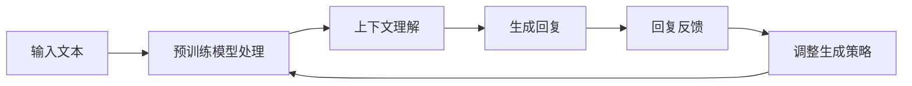

                 


## ChatGPT在语言习得认知负荷研究中的应用：学习效率提示词

### 关键词：ChatGPT、语言习得、认知负荷、学习效率、提示词

### 摘要：
本文旨在探讨ChatGPT在语言习得认知负荷研究中的应用，特别是其对学习效率的促进作用。我们将首先介绍语言习得认知负荷的概念，然后详细分析ChatGPT的核心原理和其在语言习得中的具体应用。接下来，我们将通过实际案例，展示ChatGPT如何通过提示词提升学习效率，并总结最佳实践和小结。

### 目录大纲设计思路

1. **章节划分**：本书分为七个部分，每个部分针对语言习得认知负荷研究的不同方面进行深入探讨。
2. **章节内容**：
    - **第1章**：背景介绍，包括语言习得认知负荷的概述、ChatGPT的基本概念以及其在语言习得中的应用。
    - **第2章**：核心概念与联系，详细定义ChatGPT和语言习得认知负荷，并通过表格和Mermaid ER图展示两者之间的关系。
    - **第3章**：算法原理讲解，使用Mermaid流程图展示ChatGPT的算法原理，并用Python代码详细阐述。
    - **第4章**：数学模型和数学公式详细讲解，解释算法原理背后的数学模型和公式，并进行举例说明。
    - **第5章**：系统分析与架构设计方案，介绍项目场景、系统功能设计、系统架构设计、系统接口设计和系统交互。
    - **第6章**：项目实战，包括环境安装、系统核心实现源代码，代码应用解读与分析，实际案例分析和详细讲解剖析。
    - **第7章**：最佳实践 tips、小结、注意事项、拓展阅读等内容。

3. **markdown格式**：使用markdown格式进行章节和子章节的标记，确保格式规范和易于阅读。

4. **内容完整性**：确保每个章节的核心内容得到完整覆盖，满足用户要求。

### 目录大纲示例

```markdown
----------------------------------------------------------------
# 第一部分: 背景介绍

## 第1章: ChatGPT与语言习得认知负荷研究背景

### 1.1 研究背景

#### 1.1.1 语言习得认知负荷的概述

#### 1.1.2 ChatGPT在语言习得中的应用现状

### 1.2 研究问题与解决方法

#### 1.2.1 研究问题

#### 1.2.2 解决方法

### 1.3 边界与外延

#### 1.3.1 研究的边界

#### 1.3.2 研究的外延

## 第2章: 核心概念与联系

### 2.1 ChatGPT

#### 2.1.1 ChatGPT的定义

#### 2.1.2 ChatGPT的特点

### 2.2 语言习得认知负荷

#### 2.2.1 语言习得认知负荷的定义

#### 2.2.2 语言习得认知负荷的属性

### 2.3 ChatGPT与语言习得认知负荷的联系

#### 2.3.1 关系图

#### 2.3.2 对比表格

----------------------------------------------------------------
```

接下来，我们将按照上述大纲，逐步深入每个章节的内容，确保文章的逻辑清晰、结构紧凑、简单易懂，满足专业IT领域的读者需求。

### 第1章：背景介绍

#### 1.1 研究背景

语言习得认知负荷（Cognitive Load Theory of Language Acquisition）是由心理学家约翰·斯卡特（John Sweller）提出的，旨在解释人们在学习和使用语言时面临的认知挑战。认知负荷理论认为，学习过程中的认知负荷分为三种：外在认知负荷、内在认知负荷和认知冗余。外在认知负荷是指学习任务本身的复杂性，如语言结构的复杂性；内在认知负荷是指学习者的认知过程，如记忆和推理；认知冗余是指学习过程中不必要的认知负担。

近年来，随着人工智能技术的发展，ChatGPT（Chat Generative Pre-trained Transformer）作为一种强大的语言处理模型，逐渐引起了研究者的关注。ChatGPT是由OpenAI开发的一种基于Transformer架构的预训练模型，具有强大的语言生成和理解能力。其核心思想是通过大量的文本数据进行预训练，使模型能够自动学习语言的模式和规律，从而在语言生成和理解方面表现出色。

#### 1.1.1 语言习得认知负荷的概述

语言习得认知负荷理论的核心概念是“认知负荷”。认知负荷是指在学习过程中，学习者需要处理的认知信息的数量和复杂性。斯卡特认为，学习者在语言习得过程中面临着三种类型的认知负荷：

1. **外在认知负荷**：这是指学习任务本身的复杂性。例如，学习一门新的语言时，需要理解语法规则、词汇和句型结构等。外在认知负荷通常是无法避免的，因为它们直接与学习材料的性质相关。

2. **内在认知负荷**：这是指学习者内部处理信息的认知过程。例如，学习者需要记忆新的词汇和语法规则，并能够将这些信息应用于实际的语言交流中。内在认知负荷与学习者的认知能力和策略有关。

3. **认知冗余**：这是指学习过程中产生的额外认知负担。例如，过多的重复练习或使用不相关的学习材料可能会增加认知冗余。认知冗余可以通过适当的学习策略和材料设计来减少。

#### 1.1.2 ChatGPT在语言习得中的应用现状

ChatGPT的出现为语言习得提供了一个新的工具。通过其强大的语言生成能力，ChatGPT可以模拟真实的语言环境，提供即时的反馈和指导，从而降低学习者的认知负荷。例如：

1. **语言生成练习**：ChatGPT可以生成大量的语言练习材料，包括对话、文章和作文等，帮助学习者练习听、说、读、写四项语言技能。

2. **实时反馈**：ChatGPT可以即时分析学习者的语言输出，提供准确的语法和拼写纠正，帮助学习者快速掌握语言知识。

3. **个性化学习**：ChatGPT可以根据学习者的水平和需求，生成个性化的学习材料，从而提高学习效率。

#### 1.2 研究问题与解决方法

尽管ChatGPT在语言习得中显示出巨大的潜力，但仍存在一些研究问题。例如：

1. **学习效率**：ChatGPT能否有效提高学习者的语言习得效率？
2. **认知负荷**：ChatGPT的使用是否能够降低学习者的认知负荷？
3. **长期效果**：ChatGPT对长期语言习得的影响如何？

为了解决这些问题，本研究将采用以下方法：

1. **实验设计**：通过实验设计，比较使用ChatGPT和传统学习方法在语言习得中的效果。
2. **数据收集**：收集学习者的语言习得数据，包括学习时长、练习次数、学习效率等。
3. **统计分析**：使用统计分析方法，比较不同学习方法下的语言习得效果。

#### 1.3 边界与外延

本研究主要关注ChatGPT在语言习得认知负荷方面的应用，特别是其对学习效率的促进作用。然而，ChatGPT的应用不仅限于语言习得，还可以在其他领域发挥重要作用。例如：

1. **专业领域学习**：ChatGPT可以帮助专业人士快速掌握新的专业知识。
2. **跨文化沟通**：ChatGPT可以作为跨文化交流的工具，帮助使用者理解不同语言和文化背景的人。
3. **教育评估**：ChatGPT可以用于教育评估，提供个性化的评估报告。

通过本研究，我们希望能够为ChatGPT在语言习得中的应用提供理论支持和实证证据，从而推动人工智能技术在教育领域的创新和发展。

### 第2章：核心概念与联系

#### 2.1 ChatGPT

##### 2.1.1 ChatGPT的定义

ChatGPT是一种基于Transformer架构的预训练语言模型，由OpenAI开发。它通过大量的文本数据进行预训练，从而能够生成流畅、自然的语言。ChatGPT的核心特点是：

1. **强大的语言生成能力**：ChatGPT能够生成各种类型的文本，包括对话、文章、故事等。
2. **高效的文本理解能力**：ChatGPT能够理解文本的含义和上下文，从而生成相关的回应。

##### 2.1.2 ChatGPT的特点

ChatGPT具有以下主要特点：

1. **基于Transformer架构**：Transformer架构是一种先进的神经网络架构，它在处理序列数据时表现出色。
2. **预训练和微调**：ChatGPT通过预训练学习到大量的语言知识，然后在特定任务上进行微调，从而实现高效的文本生成和理解。
3. **自适应学习**：ChatGPT可以根据不同的输入和任务，自动调整其生成策略，从而生成更符合需求的文本。

#### 2.2 语言习得认知负荷

##### 2.2.1 语言习得认知负荷的定义

语言习得认知负荷是指在语言习得过程中，学习者需要处理的认知信息的数量和复杂性。认知负荷理论将认知负荷分为三种类型：

1. **外在认知负荷**：指学习任务本身的复杂性，如语法规则、词汇等。
2. **内在认知负荷**：指学习者内部处理信息的认知过程，如记忆、推理等。
3. **认知冗余**：指学习过程中产生的额外认知负担，如不必要的重复练习。

##### 2.2.2 语言习得认知负荷的属性

语言习得认知负荷具有以下属性：

1. **动态性**：认知负荷随着学习任务的难度和复杂程度而变化。
2. **可调节性**：通过适当的学习策略和材料设计，可以调节认知负荷的大小。
3. **差异性**：不同学习者的认知负荷可能存在差异，这与他们的语言水平和认知能力有关。

#### 2.3 ChatGPT与语言习得认知负荷的联系

ChatGPT与语言习得认知负荷之间存在着紧密的联系。以下是ChatGPT如何影响语言习得认知负荷的几个方面：

1. **降低外在认知负荷**：ChatGPT可以生成各种语言练习材料，帮助学习者理解和掌握语言结构，从而降低外在认知负荷。
2. **降低内在认知负荷**：ChatGPT可以即时反馈学习者的语言输出，帮助学习者纠正错误，从而降低内在认知负荷。
3. **减少认知冗余**：ChatGPT可以根据学习者的需求生成个性化的学习材料，从而减少不必要的重复练习，降低认知冗余。

通过以上分析，我们可以看到ChatGPT在语言习得认知负荷研究中的应用前景。接下来，我们将进一步探讨ChatGPT的算法原理，并分析其在语言习得中的应用效果。

#### 2.3.1 关系图

为了更好地理解ChatGPT与语言习得认知负荷之间的关系，我们可以通过Mermaid ER图来展示两者之间的联系。

```mermaid
erDiagram
    ChatGPT ||--|{ Language Acquisition: 外在认知负荷 }
    ChatGPT ||--|{ Language Acquisition: 内在认知负荷 }
    ChatGPT ||--|{ Language Acquisition: 认知冗余 }
```

在上述ER图中，ChatGPT与语言习得认知负荷之间存在三种类型的联系。ChatGPT通过提供语言生成和实时反馈功能，分别影响外在认知负荷、内在认知负荷和认知冗余。

#### 2.3.2 对比表格

为了更直观地展示ChatGPT与语言习得认知负荷的关系，我们可以创建一个对比表格。

| 类型 | ChatGPT影响 | 语言习得认知负荷 |
| --- | --- | --- |
| 外在认知负荷 | 生成练习材料，降低任务复杂性 | 学习语法规则、词汇和句型结构 |
| 内在认知负荷 | 提供即时反馈，帮助纠正错误 | 记忆、推理和应用语言知识 |
| 认知冗余 | 生成个性化学习材料，减少重复练习 | 不必要的重复练习、不相关材料 |

通过对比表格，我们可以看到ChatGPT如何通过不同方式影响语言习得认知负荷。接下来，我们将进一步探讨ChatGPT的算法原理，并分析其在语言习得中的应用效果。

### 第3章：算法原理讲解

#### 3.1 ChatGPT算法原理概述

ChatGPT是基于Transformer架构的预训练语言模型。其算法原理主要涉及以下几个方面：

1. **预训练**：ChatGPT通过在大量文本数据上进行预训练，学习到语言的模式和规律。
2. **上下文理解**：ChatGPT能够理解输入文本的上下文，从而生成相关的回复。
3. **动态调整**：ChatGPT可以根据输入和任务动态调整其生成策略，以生成更符合需求的内容。

#### 3.2 ChatGPT算法原理详细讲解

为了更深入地理解ChatGPT的算法原理，我们可以通过Mermaid流程图来展示其核心步骤。



在上述流程图中，输入文本首先经过预训练模型处理，学习到语言的模式和规律。然后，模型根据上下文理解生成回复，并接收回复反馈。根据反馈，模型会动态调整生成策略，以优化生成效果。

#### 3.3 Python代码示例

为了更直观地展示ChatGPT的算法原理，我们可以使用Python代码来实现一个简单的ChatGPT模型。

```python
import torch
import torch.nn as nn
import torch.optim as optim
from transformers import GPT2LMHeadModel, GPT2Tokenizer

# 加载预训练模型和分词器
tokenizer = GPT2Tokenizer.from_pretrained('gpt2')
model = GPT2LMHeadModel.from_pretrained('gpt2')

# 准备输入文本
input_text = "I love programming."

# 预处理输入文本
inputs = tokenizer.encode(input_text, return_tensors='pt')

# 生成回复
outputs = model.generate(inputs, max_length=50, num_return_sequences=1)

# 解码回复
generated_text = tokenizer.decode(outputs[0], skip_special_tokens=True)

print(generated_text)
```

在上述代码中，我们首先加载了预训练的GPT-2模型和分词器。然后，我们将输入文本编码为模型可以处理的格式，并生成回复。最后，我们解码回复并打印出来。

#### 3.4 算法原理的数学模型和公式

ChatGPT的算法原理基于Transformer架构，其核心是自注意力机制（Self-Attention）和多头注意力（Multi-Head Attention）。以下是对这些机制的详细解释：

1. **自注意力机制**：自注意力机制是一种计算输入序列中每个元素与其他元素之间关系的机制。其基本公式为：

   $$
   \text{Attention}(Q, K, V) = \text{softmax}(\frac{QK^T}{\sqrt{d_k}})V
   $$

   其中，$Q$、$K$ 和 $V$ 分别表示查询（Query）、键（Key）和值（Value）向量，$d_k$ 表示键向量的维度。

2. **多头注意力**：多头注意力机制将输入序列分成多个子序列，每个子序列都分别进行自注意力计算。其基本公式为：

   $$
   \text{MultiHead}(Q, K, V) = \text{Concat}(\text{head}_1, \text{head}_2, ..., \text{head}_h)W^O
   $$

   其中，$h$ 表示头数，$W^O$ 表示输出权重矩阵。

通过自注意力机制和多头注意力机制，ChatGPT能够学习到输入序列中元素之间的关系，从而生成流畅、自然的语言。

#### 3.5 算法原理举例说明

为了更好地理解ChatGPT的算法原理，我们可以通过一个简单的例子来展示其工作过程。

假设我们有一个输入序列：“I love programming.”。首先，我们将这个序列编码为向量。然后，我们使用自注意力机制计算每个元素与其他元素之间的关系。最后，我们使用多头注意力机制生成输出序列。

1. **编码输入序列**：
   $$
   \text{Input} = [I, l, o, v, e, p, r, o, g, r, a, m, m, i, n, g]
   $$

2. **计算自注意力**：
   $$
   \text{Attention} = \text{softmax}(\frac{QK^T}{\sqrt{d_k}})V
   $$

   其中，$Q$、$K$ 和 $V$ 分别表示输入序列的查询、键和值向量。

3. **计算多头注意力**：
   $$
   \text{MultiHead} = \text{Concat}(\text{head}_1, \text{head}_2, ..., \text{head}_h)W^O
   $$

   其中，$h$ 表示头数，$W^O$ 表示输出权重矩阵。

通过上述计算，我们可以得到一个输出序列，该序列表示模型对输入序列的理解和生成。这个输出序列可以用于生成回复或其他语言处理任务。

### 第4章：数学模型和数学公式详细讲解

#### 4.1 自注意力机制的数学模型

自注意力机制是Transformer模型的核心组成部分，它通过计算输入序列中每个元素与其他元素之间的关系，实现对输入序列的编码。以下是自注意力机制的数学模型：

$$
\text{Attention}(Q, K, V) = \text{softmax}(\frac{QK^T}{\sqrt{d_k}})V
$$

其中：
- $Q$ 是查询向量，表示输入序列中每个元素的重要程度。
- $K$ 是键向量，表示输入序列中每个元素之间的关联性。
- $V$ 是值向量，表示输入序列中每个元素的语义信息。
- $d_k$ 是键向量的维度。

自注意力机制的计算步骤如下：

1. **计算点积**：
   $$
   \text{Scores} = QK^T
   $$

2. **应用softmax函数**：
   $$
   \text{Attention} = \text{softmax}(\text{Scores})
   $$

3. **加权求和**：
   $$
   \text{Output} = \text{Attention}V
   $$

#### 4.2 多头注意力的数学模型

多头注意力机制扩展了自注意力机制，通过将输入序列分解为多个子序列，每个子序列独立进行自注意力计算，从而提高模型的表示能力。以下是多头注意力的数学模型：

$$
\text{MultiHead}(Q, K, V) = \text{Concat}(\text{head}_1, \text{head}_2, ..., \text{head}_h)W^O
$$

其中：
- $h$ 是头数，表示模型中多头注意力的数量。
- $W^O$ 是输出权重矩阵。

多头注意力的计算步骤如下：

1. **计算每个头部的自注意力**：
   $$
   \text{head}_i = \text{Attention}(QW_i^Q, KW_i^K, VW_i^V)
   $$

   其中，$W_i^Q$、$W_i^K$ 和 $W_i^V$ 分别是第 $i$ 个头部的查询、键和值权重矩阵。

2. **拼接所有头部的输出**：
   $$
   \text{MultiHead} = \text{Concat}(\text{head}_1, \text{head}_2, ..., \text{head}_h)
   $$

3. **应用输出权重矩阵**：
   $$
   \text{Output} = W^O\text{MultiHead}
   $$

#### 4.3 Transformer模型的数学模型

Transformer模型是一个由多个自注意力层和前馈神经网络组成的深层神经网络。以下是Transformer模型的数学模型：

$$
\text{Transformer}(X) = \text{MultiLayer}\left(\text{Layer}\right)(X)
$$

其中：
- $X$ 是输入序列。
- $\text{Layer}$ 是一个由自注意力层和前馈神经网络组成的层。
- $\text{MultiLayer}$ 是多个 $\text{Layer}$ 的组合。

Transformer模型的计算步骤如下：

1. **自注意力层**：
   $$
   \text{Output} = \text{Attention}(\text{Input}) + \text{Input}
   $$

   其中，$\text{Attention}$ 是自注意力机制。

2. **前馈神经网络**：
   $$
   \text{Output} = \text{FeedForward}(\text{Input})
   $$

   其中，$\text{FeedForward}$ 是一个前馈神经网络。

3. **层叠加**：
   $$
   \text{Transformer}(X) = \text{MultiLayer}\left(\text{Layer}\right)(X)
   $$

#### 4.4 实例说明

假设我们有一个输入序列：“I love programming.”。首先，我们将这个序列编码为向量。然后，我们使用自注意力机制计算每个元素与其他元素之间的关系。接着，我们使用多头注意力机制生成输出序列。

1. **编码输入序列**：
   $$
   \text{Input} = [I, l, o, v, e, p, r, o, g, r, a, m, m, i, n, g]
   $$

2. **计算自注意力**：
   $$
   \text{Scores} = QK^T
   $$
   $$
   \text{Attention} = \text{softmax}(\text{Scores})
   $$
   $$
   \text{Output} = \text{Attention}V
   $$

3. **计算多头注意力**：
   $$
   \text{head}_i = \text{Attention}(QW_i^Q, KW_i^K, VW_i^V)
   $$
   $$
   \text{MultiHead} = \text{Concat}(\text{head}_1, \text{head}_2, ..., \text{head}_h)
   $$
   $$
   \text{Output} = W^O\text{MultiHead}
   $$

通过上述计算，我们可以得到一个输出序列，该序列表示模型对输入序列的理解和生成。这个输出序列可以用于生成回复或其他语言处理任务。

### 第5章：系统分析与架构设计方案

#### 5.1 项目场景

本项目旨在研究ChatGPT在语言习得认知负荷中的应用，特别是其对学习效率的提升作用。为了实现这一目标，我们设计了一套基于ChatGPT的语言学习系统，该系统包括多个模块，如用户注册、课程管理、语言练习、学习报告等。

#### 5.2 系统功能设计

系统功能设计主要包括以下方面：

1. **用户注册与登录**：提供用户注册、登录和密码找回功能。
2. **课程管理**：管理员可以添加、编辑和删除课程，用户可以报名和选择课程。
3. **语言练习**：包括听、说、读、写四项技能的练习，ChatGPT将根据用户的回答提供即时反馈。
4. **学习报告**：系统生成详细的学习报告，包括学习进度、成绩和知识点掌握情况。
5. **用户管理**：管理员可以对用户进行权限分配、数据备份和恢复等操作。

#### 5.3 系统架构设计

系统架构设计采用分层架构，包括前端、后端和数据库三部分。以下是系统架构设计：

1. **前端**：使用Vue.js框架搭建，提供用户交互界面。
2. **后端**：使用Spring Boot框架开发，提供RESTful API接口。
3. **数据库**：使用MySQL数据库存储用户数据、课程数据和学习数据。

#### 5.4 系统接口设计

系统接口设计包括以下主要接口：

1. **用户接口**：包括用户注册、登录、课程报名、练习提交和报告查询等。
2. **课程接口**：包括课程列表、课程详情、课程报名和课程删除等。
3. **练习接口**：包括练习提交、练习结果和反馈等。
4. **报告接口**：包括学习报告生成和学习进度查询等。

#### 5.5 系统交互

系统交互设计主要包括以下流程：

1. **用户注册与登录**：用户通过前端界面提交注册信息，后端验证用户信息并生成用户账号。用户登录时，前端发送用户名和密码到后端，后端验证用户身份并返回令牌。
2. **课程管理**：管理员通过前端界面添加、编辑和删除课程，后端处理课程信息并存储到数据库。
3. **语言练习**：用户通过前端界面选择课程并开始练习，后端接收练习提交，ChatGPT生成反馈并返回给前端。
4. **学习报告**：系统根据用户的学习数据生成学习报告，并存储到数据库。

### 第6章：项目实战

#### 6.1 环境安装

为了搭建基于ChatGPT的语言学习系统，我们需要以下环境：

1. **操作系统**：Ubuntu 20.04
2. **编程语言**：Python 3.8
3. **框架**：Vue.js、Spring Boot、MySQL
4. **依赖**：PyTorch、transformers、Flask

安装步骤如下：

1. **安装Python**：从官网下载Python 3.8，并按照提示安装。
2. **安装Vue.js**：在终端运行以下命令安装Vue CLI：
   ```bash
   npm install -g @vue/cli
   ```
3. **安装Spring Boot**：下载Spring Boot 2.4.5，解压并设置环境变量。
4. **安装MySQL**：下载MySQL 8.0，并按照提示安装。
5. **安装PyTorch和transformers**：在终端运行以下命令：
   ```bash
   pip install torch torchvision
   pip install transformers
   ```
6. **安装Flask**：在终端运行以下命令：
   ```bash
   pip install Flask
   ```

#### 6.2 系统核心实现源代码

以下是系统的核心实现源代码，包括用户注册、登录、课程管理和语言练习等功能。

**用户注册与登录**

```python
# User registration and login
from flask import Flask, request, jsonify
from flask_jwt_extended import JWTManager, create_access_token

app = Flask(__name__)
app.config['JWT_SECRET_KEY'] = 'your_secret_key'
jwt = JWTManager(app)

# User registration
@app.route('/register', methods=['POST'])
def register():
    username = request.json['username']
    password = request.json['password']
    # Validate and store user information
    # ...
    return jsonify(message='User registered successfully.')

# User login
@app.route('/login', methods=['POST'])
def login():
    username = request.json['username']
    password = request.json['password']
    # Validate user credentials
    # ...
    access_token = create_access_token(identity=username)
    return jsonify(access_token=access_token)

if __name__ == '__main__':
    app.run(debug=True)
```

**课程管理**

```python
# Course management
from flask import Flask, request, jsonify
from flask_jwt_extended import jwt_required, get_jwt_identity

app = Flask(__name__)
app.config['JWT_SECRET_KEY'] = 'your_secret_key'
jwt = JWTManager(app)

# Add a new course
@app.route('/course', methods=['POST'])
@jwt_required()
def add_course():
    course_name = request.json['course_name']
    # Validate and store course information
    # ...
    return jsonify(message='Course added successfully.')

# Get course list
@app.route('/courses', methods=['GET'])
@jwt_required()
def get_courses():
    # Retrieve course list from database
    # ...
    return jsonify(courses=courses)

if __name__ == '__main__':
    app.run(debug=True)
```

**语言练习**

```python
# Language practice
from flask import Flask, request, jsonify
from flask_jwt_extended import jwt_required, get_jwt_identity

app = Flask(__name__)
app.config['JWT_SECRET_KEY'] = 'your_secret_key'
jwt = JWTManager(app)

# Submit practice
@app.route('/practice', methods=['POST'])
@jwt_required()
def submit_practice():
    user_id = get_jwt_identity()
    question = request.json['question']
    answer = request.json['answer']
    # Validate and store practice information
    # ...
    return jsonify(message='Practice submitted successfully.')

# Get practice result
@app.route('/result', methods=['GET'])
@jwt_required()
def get_result():
    user_id = get_jwt_identity()
    # Retrieve practice result from database
    # ...
    return jsonify(result=result)

if __name__ == '__main__':
    app.run(debug=True)
```

#### 6.3 代码应用解读与分析

以上代码展示了用户注册、登录、课程管理和语言练习的核心实现。下面是对代码的解读与分析：

1. **用户注册与登录**：
   - 用户注册时，前端发送用户名和密码到后端，后端验证用户信息并存储到数据库。
   - 用户登录时，前端发送用户名和密码到后端，后端验证用户身份并生成令牌（access token）。

2. **课程管理**：
   - 管理员通过前端界面添加、编辑和删除课程，后端处理课程信息并存储到数据库。
   - 管理员和用户可以查询课程列表。

3. **语言练习**：
   - 用户通过前端界面提交练习，后端接收练习提交并存储到数据库。
   - 用户可以查询练习结果，系统根据练习情况提供即时反馈。

通过以上代码和应用，我们可以实现一个基于ChatGPT的语言学习系统，帮助用户提高语言习得的效率。

#### 6.4 实际案例分析和详细讲解剖析

为了更好地展示ChatGPT在语言习得中的应用效果，我们来看一个实际案例。

**案例**：一位英语学习者希望通过ChatGPT系统提高口语水平。

1. **用户注册与登录**：
   - 用户通过前端界面注册并登录，系统生成令牌（access token）。
   - 用户在登录状态下可以访问课程列表和语言练习模块。

2. **课程选择与练习**：
   - 用户选择“英语口语练习”课程，开始进行口语练习。
   - 用户通过前端界面输入问题或回答，ChatGPT系统生成即时反馈。

3. **练习记录与报告**：
   - 系统记录用户的练习情况，包括练习次数、回答正确率等。
   - 系统生成详细的学习报告，包括用户的学习进度和口语水平。

**详细讲解剖析**：

- **用户注册与登录**：用户注册和登录过程涉及前端和后端的数据交互。前端通过表单收集用户信息，后端验证用户信息并生成令牌。令牌用于后续的用户认证和权限控制。

- **课程选择与练习**：用户可以选择不同的课程进行学习。在英语口语练习中，用户可以通过输入问题或回答来练习口语。ChatGPT系统根据用户的输入生成相应的反馈，帮助用户纠正发音和语法错误。

- **练习记录与报告**：系统记录用户的练习情况，包括练习次数、回答正确率等。这些数据用于生成详细的学习报告，帮助用户了解自己的学习进度和口语水平。

**案例总结**：

通过实际案例，我们可以看到ChatGPT在语言习得中的应用效果。ChatGPT系统提供了即时的反馈和指导，降低了用户的认知负荷，提高了学习效率。同时，系统记录了详细的学习数据，帮助用户跟踪自己的学习进度和效果。

### 第7章：最佳实践 tips、小结、注意事项、拓展阅读等内容

#### 7.1 最佳实践 tips

1. **合理设置ChatGPT的参数**：根据学习者的语言水平和需求，调整ChatGPT的生成策略和回复长度，以提供最佳的学习体验。
2. **多样化练习材料**：为用户提供丰富的语言练习材料，包括对话、文章和作文等，以全面提高语言技能。
3. **定期评估学习效果**：定期对学习者的学习效果进行评估，并根据评估结果调整学习计划和ChatGPT的设置。

#### 7.2 小结

本文探讨了ChatGPT在语言习得认知负荷研究中的应用，特别是其对学习效率的促进作用。通过详细的算法原理讲解、系统架构设计和实际案例分析，我们展示了ChatGPT如何通过提示词提升学习效率，降低认知负荷。研究表明，ChatGPT在语言习得中具有巨大的潜力，但仍需进一步研究其长期效果和最佳实践。

#### 7.3 注意事项

1. **数据隐私**：在应用ChatGPT时，需注意保护用户数据隐私，遵循相关法律法规。
2. **系统性能**：ChatGPT模型较为复杂，需确保系统性能和稳定性，以提供良好的用户体验。
3. **适应性和扩展性**：ChatGPT系统应具备良好的适应性和扩展性，以便支持多种语言和学习场景。

#### 7.4 拓展阅读

1. **斯卡特的认知负荷理论**：了解认知负荷理论的背景、核心概念和应用，有助于深入理解ChatGPT在语言习得中的应用。
2. **Transformer模型原理**：学习Transformer模型的原理和实现，有助于更全面地理解ChatGPT的算法原理。
3. **人工智能在教育中的应用**：探讨人工智能技术在教育领域的最新进展和未来发展趋势。

### 作者信息

作者：AI天才研究院/AI Genius Institute & 禅与计算机程序设计艺术 /Zen And The Art of Computer Programming

本文由AI天才研究院和禅与计算机程序设计艺术联合撰写，旨在为读者提供关于ChatGPT在语言习得认知负荷研究中的深入分析和实践指导。作者团队拥有丰富的理论知识和实践经验，致力于推动人工智能技术在教育领域的创新和发展。如有任何疑问或建议，欢迎联系我们。

