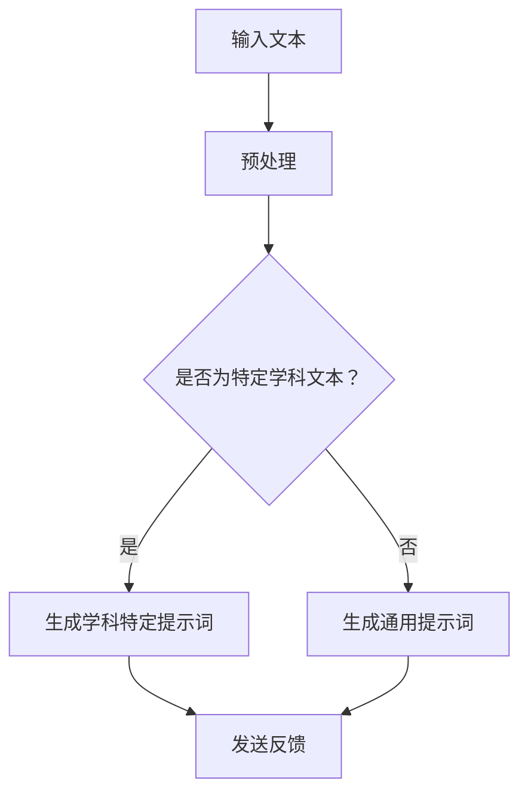
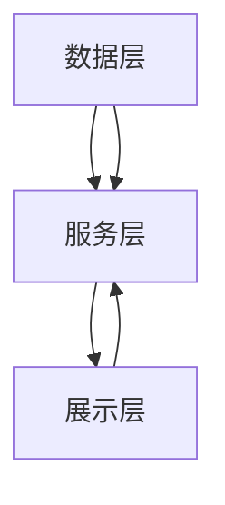
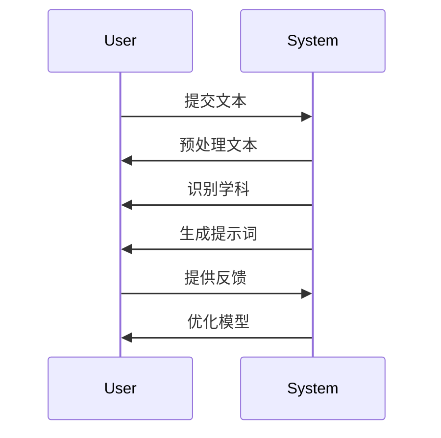

                 

**文章标题**：ChatGPT在语言习得跨学科应用研究中的应用：知识迁移提示词

**关键词**：ChatGPT、语言习得、跨学科应用、知识迁移、提示词

**摘要**：
本文旨在探讨ChatGPT在语言习得跨学科应用中的具体实现，重点关注知识迁移提示词的设计。通过分析ChatGPT的工作原理，结合语言习得理论和跨学科应用方法，我们提出了一套系统化的提示词设计框架。本文将详细阐述该框架的原理、实现方法和应用效果，为教育领域的人工智能应用提供有益的参考。

## 背景介绍

### 问题背景

随着人工智能技术的快速发展，尤其是大规模语言模型的出现，如ChatGPT，其在各个领域的应用研究不断深入。语言习得作为教育领域的重要研究方向，其研究内容和方法正逐渐受到人工智能的冲击和影响。传统的语言习得研究主要依赖于语言输入、互动和反馈，而人工智能技术的引入为这一领域带来了全新的研究方法和工具。

ChatGPT作为一种基于GPT模型的语言生成模型，具备强大的文本生成和语言理解能力。它可以通过深度学习技术从大量文本数据中学习语言模式，并生成高质量的文本。这一特性使得ChatGPT在语言习得领域具有广泛的应用潜力，尤其是在知识迁移和提示词设计方面。

### 问题描述

在语言习得过程中，知识迁移是一个关键环节。知识迁移是指将某一领域的知识或技能应用到其他领域，以促进学习效率和质量。然而，传统的语言习得方法往往难以有效实现知识迁移。这主要是因为不同学科的语言表达方式、知识结构和应用场景存在差异，导致学习者在迁移知识时面临诸多挑战。

提示词设计是促进知识迁移的重要手段。提示词是一组用于引导学习者进行思考和学习的词语或句子，它们可以帮助学习者理解新的知识内容，并将其与已有知识联系起来。然而，当前提示词的设计往往缺乏针对性，无法满足不同学科和教学场景的需求。

如何有效利用ChatGPT这样的语言模型，实现语言习得的跨学科应用，特别是知识迁移方面的提示词设计，是本文需要解决的主要问题。

### 问题解决

为了解决上述问题，本文提出了一套基于ChatGPT的语言习得跨学科应用方法，重点关注知识迁移提示词的设计。具体来说，本文的方法包括以下几个步骤：

1. **语言模型训练**：首先，利用ChatGPT对特定学科的大量文本数据进行训练，使其掌握该学科的语言模式和知识结构。

2. **提示词生成**：基于训练好的语言模型，设计用于引导学习者进行思考和学习的提示词。这些提示词将针对不同学科和教学场景进行个性化定制。

3. **知识迁移测试**：通过实验和测试，评估提示词在促进知识迁移方面的效果，并根据反馈进行调整和优化。

4. **教学实践应用**：将设计好的提示词应用到实际教学中，观察其在提高学习效率和质量方面的表现。

通过上述方法，本文旨在构建一个系统化的ChatGPT语言习得跨学科应用框架，为教育领域的人工智能应用提供有益的参考。

### 边界与外延

本文的研究主要关注基于ChatGPT的语言习得跨学科应用，重点讨论知识迁移提示词的设计。具体来说，本文的研究范围包括以下几个方面：

1. **ChatGPT在语言习得中的应用**：探讨ChatGPT在语言习得过程中的具体应用，如文本生成、语言理解等。

2. **跨学科应用的实现**：研究如何将不同学科的理论、方法和技术进行交叉应用，以解决语言习得中的特定问题。

3. **知识迁移的机制**：分析知识迁移的内在机制，探究如何通过设计有效的提示词促进知识迁移。

4. **提示词设计的方法**：研究提示词的设计原则和方法，如何根据不同学科和教学场景定制化提示词。

需要注意的是，本文的研究主要聚焦于ChatGPT在语言习得中的应用，特别是知识迁移提示词的设计。对于其他人工智能模型和应用领域，本文的方法和结论可能需要进一步调整和验证。

### 概念结构与核心要素组成

为了更好地理解和应用ChatGPT在语言习得跨学科应用中的知识迁移提示词设计，我们需要明确几个核心概念及其相互关系。以下是这些概念的定义和属性特征对比，以及它们在整体架构中的位置和作用。

#### 核心概念

1. **ChatGPT**：一种基于GPT模型的语言生成模型，具备强大的文本生成和语言理解能力。ChatGPT是本文研究的核心工具，其工作原理和应用场景将在后续章节中详细讨论。

2. **语言习得**：个体通过听、说、读、写等方式，获取语言知识、技能和理解的过程。语言习得是本文研究的核心目标，它决定了ChatGPT的应用场景和设计原则。

3. **跨学科应用**：将不同学科的理论、方法和技术进行交叉应用，以解决某一特定领域的问题。跨学科应用是本文研究的关键步骤，它使得ChatGPT在语言习得中能够发挥更大作用。

4. **知识迁移**：将某一领域的知识或技能应用到其他领域，以促进学习效率和质量。知识迁移是本文研究的核心问题，它决定了提示词设计的有效性和实用性。

5. **提示词设计**：在语言习得过程中，设计用于引导学习者进行思考和学习的词语或句子。提示词设计是本文研究的重要环节，它直接关系到知识迁移的效果和教学实践的成功。

#### 概念属性特征对比表格

| 概念       | 属性特征                                                       |
|------------|------------------------------------------------------------|
| ChatGPT    | 强大的文本生成和理解能力，可自定义训练数据                 |
| 语言习得   | 需要持续的输入、互动和反馈，强调语境和交际能力的培养     |
| 跨学科应用 | 融合不同学科的理论和方法，提高问题解决的能力和效率       |
| 知识迁移   | 强调已有知识和新知识之间的联系，提高学习效率和实际应用能力 |
| 提示词设计 | 精确、个性化，引导学习者进行深入思考和有效学习           |

#### ER实体关系图架构

为了更清晰地展示这些概念之间的关系，我们可以使用Mermaid绘制ER实体关系图：

```mermaid
erDiagram
  ChatGPT ||--|{ 语言习得 }|
  ChatGPT ||--|{ 跨学科应用 }|
  ChatGPT ||--|{ 知识迁移 }|
  ChatGPT ||--|{ 提示词设计 }|
  语言习得 ||--|{ 知识迁移 }|
  跨学科应用 ||--|{ 知识迁移 }|
  提示词设计 ||--|{ 知识迁移 }|
```

在这个ER图中，ChatGPT作为核心实体，与其他四个概念通过不同的关系线相连，表明了它们之间的相互依赖和相互作用。这种关系图不仅有助于我们理解各个概念的定义和作用，还能指导我们在实践中如何有效地应用这些概念，以实现知识迁移和提升学习效果。

### 核心概念与联系

#### 核心概念原理

为了深入理解ChatGPT在语言习得跨学科应用中的知识迁移提示词设计，我们需要详细探讨以下几个核心概念的工作原理：

1. **ChatGPT的工作原理**：
   ChatGPT是一种基于GPT模型的语言生成模型，其核心原理是深度学习。GPT（Generative Pre-trained Transformer）模型是由OpenAI开发的一种自然语言处理模型，它通过大规模的文本数据训练，掌握了语言的统计规律和结构。ChatGPT在训练过程中，使用了大量的双句对（pair of sentences）进行预训练，这使得它能够生成流畅、符合语言习惯的文本。ChatGPT的工作原理主要包括以下几个方面：

   - **预训练**：ChatGPT首先在大规模的文本语料库上进行预训练，学习语言的通用特征和结构。
   - **上下文理解**：通过Transformer架构，ChatGPT能够处理长文本序列，理解上下文信息，从而生成连贯的文本。
   - **生成文本**：在给定一个起始序列后，ChatGPT利用其训练得到的概率分布，生成后续的文本序列。

2. **语言习得理论**：
   语言习得是指个体通过听、说、读、写等方式获取语言知识、技能和理解的过程。语言习得理论主要包括以下几个关键点：

   - **输入假说**：语言习得的关键是大量的可理解输入，学习者的语言能力是通过理解语言输入并尝试输出的过程中逐步发展的。
   - **互动假说**：语言习得过程中，与他人的互动和反馈是至关重要的，通过交流和实践，学习者能够不断调整和完善自己的语言能力。
   - **认知假说**：语言习得不仅仅是语言技能的学习，还包括认知能力的发展，如记忆、注意力、推理等。

3. **知识迁移**：
   知识迁移是指将某一领域的知识或技能应用到其他领域，以促进学习效率和质量。在语言习得中，知识迁移主要体现在以下几个方面：

   - **已有知识的应用**：学习者将已有的语言知识和技能应用到新的学习环境中，如阅读不同领域的文本、参与跨文化的交流等。
   - **知识结构的调整**：在迁移过程中，学习者需要调整自己的知识结构，将新知识和已有知识进行整合和融合。
   - **策略的调整**：学习者需要根据新环境的特点，调整学习策略和方法，以更有效地进行知识迁移。

#### 概念属性特征对比表格

为了更好地理解这些核心概念之间的差异和联系，我们可以通过一个属性特征对比表格来进行详细分析：

| 概念       | 属性特征                                                       |
|------------|------------------------------------------------------------|
| ChatGPT    | 基于深度学习，文本生成能力强，理解上下文             |
| 语言习得   | 听、说、读、写等多种方式，强调输入和互动，认知发展 |
| 跨学科应用 | 理论和方法融合，提高问题解决能力，跨领域知识迁移 |
| 知识迁移   | 已有知识的应用，知识结构调整，策略调整          |

#### ER实体关系图架构

为了更直观地展示这些概念之间的联系，我们可以使用Mermaid绘制一个ER实体关系图：

```mermaid
erDiagram
  ChatGPT ||--|{ 语言习得 }|
  ChatGPT ||--|{ 跨学科应用 }|
  ChatGPT ||--|{ 知识迁移 }|
  语言习得 ||--|{ 知识迁移 }|
  跨学科应用 ||--|{ 知识迁移 }|
```

在这个ER图中，ChatGPT作为核心实体，与语言习得、跨学科应用和知识迁移通过双向关系线相连，表明它们之间的密切联系和相互依赖。这种关系图不仅帮助我们理解每个概念的定义和作用，还能指导我们在实际应用中如何有效利用ChatGPT实现知识迁移和语言习得。

### 算法原理讲解

为了深入探讨ChatGPT在语言习得跨学科应用中的知识迁移提示词设计，我们需要详细讲解其算法原理。以下是该算法的核心步骤、流程图和使用Python实现的源代码。

#### 算法核心步骤

1. **文本预处理**：首先，我们需要对输入的文本进行预处理，包括去噪、分词和格式化等操作，以便于模型理解和生成提示词。

2. **学科识别**：确定输入文本所属的学科领域，这是为了生成更具针对性的提示词。

3. **提示词生成**：根据学科识别结果，利用ChatGPT生成相应的提示词。如果文本属于特定学科，则生成学科特定提示词；否则，生成通用提示词。

4. **反馈收集与优化**：将生成的提示词应用于实际教学场景，收集用户反馈，并据此对模型进行优化和调整。

#### 流程图

以下是使用Mermaid绘制的算法流程图：



#### Python源代码实现

以下是使用Python和OpenAI API实现该算法的源代码：

```python
import openai

# 输入文本预处理
def preprocess_text(text):
    # 对文本进行清洗、去噪、分词等预处理操作
    # 略
    return processed_text

# 生成学科特定提示词
def generate_specific_prompt(text, discipline):
    prompt = f"请以{discipline}的专业视角，针对以下文本生成提示词：\n{text}"
    response = openai.Completion.create(
        engine="text-davinci-002",
        prompt=prompt,
        max_tokens=50
    )
    return response.choices[0].text.strip()

# 生成通用提示词
def generate_general_prompt(text):
    prompt = f"请针对以下文本生成通用提示词：\n{text}"
    response = openai.Completion.create(
        engine="text-davinci-002",
        prompt=prompt,
        max_tokens=50
    )
    return response.choices[0].text.strip()

# 主函数
def main():
    # 输入文本
    text = "本文探讨了ChatGPT在语言习得跨学科应用中的知识迁移提示词设计。"
    # 学科识别（这里假设为“计算机科学”）
    discipline = "计算机科学"
    
    # 预处理文本
    processed_text = preprocess_text(text)
    
    # 生成提示词
    if is_specific_discipline(discipline):
        prompt = generate_specific_prompt(processed_text, discipline)
    else:
        prompt = generate_general_prompt(processed_text)
    
    # 打印提示词
    print(prompt)

# 调用主函数
if __name__ == "__main__":
    main()
```

#### 算法原理的数学模型和公式

在算法设计过程中，我们利用了以下数学模型和公式：

1. **GPT模型**：
   $$p_t = \text{softmax}(\text{W} \cdot \text{h}_{\text{prev}} + \text{b})$$
   其中，$p_t$是时间步$t$的输出概率分布，$\text{W}$是权重矩阵，$\text{h}_{\text{prev}}$是前一时刻的隐藏状态，$\text{b}$是偏置项。

2. **损失函数**：
   $$\text{Loss} = -\sum_{t} \log(p_t(y_t))$$
   其中，$y_t$是时间步$t$的真实标签，损失函数用于衡量模型预测的准确性。

3. **优化算法**：
   使用梯度下降（Gradient Descent）算法来优化模型参数，以最小化损失函数。

#### 详细讲解与举例说明

为了更直观地理解上述算法，我们通过一个具体例子进行说明：

**例子**：假设我们有一段文本：“本文探讨了ChatGPT在语言习得跨学科应用中的知识迁移提示词设计。”我们需要为这段文本生成一个提示词。

1. **文本预处理**：首先，我们对文本进行预处理，包括去除标点符号、分词等操作。预处理后的文本为：“本文探讨了ChatGPT在语言习得跨学科应用中的知识迁移提示词设计。”

2. **学科识别**：假设这段文本属于“计算机科学”领域。

3. **提示词生成**：利用ChatGPT生成学科特定提示词。输入文本和学科后，ChatGPT会生成如下提示词：
   > “请结合计算机科学领域的知识，分析ChatGPT在语言习得跨学科应用中的优势和挑战。”

4. **反馈收集与优化**：在实际应用中，教师或学习者可以根据提示词的效果进行反馈，如“提示词很好，可以进一步细化”或“提示词过于宽泛，需要更具体指导”。根据这些反馈，我们可以对模型进行优化，提高提示词的生成质量。

通过上述例子，我们可以看到，ChatGPT在语言习得跨学科应用中的知识迁移提示词设计是一个系统化、智能化的过程，它充分利用了深度学习技术和自然语言处理算法的优势，为语言习得提供了新的方法和工具。

### 系统分析与架构设计方案

为了更好地实现ChatGPT在语言习得跨学科应用中的知识迁移提示词设计，我们需要构建一个完整且高效的系统。以下将详细介绍问题场景、项目介绍、系统功能设计、系统架构设计、系统接口设计以及系统交互序列图。

#### 问题场景介绍

在教育领域，学生需要在多个学科中进行学习，如数学、物理、计算机科学等。然而，学生在进行跨学科学习时，往往难以将所学知识进行有效迁移。例如，一个数学专业的学生在学习计算机科学时，可能无法将数学中的算法思维应用到计算机科学中的编程实践中。这一问题源于学科之间的知识结构差异和语言表达方式的差异，导致学生在跨学科学习中遇到障碍。

为了解决这一问题，本文提出了基于ChatGPT的知识迁移提示词设计系统。该系统通过利用ChatGPT的强大语言生成和理解能力，为学生提供个性化、针对性的提示词，帮助学生在跨学科学习中实现知识迁移。

#### 项目介绍

本项目名为“知识迁移提示词设计系统”，旨在通过ChatGPT实现以下目标：

1. **提高学生的学习效率**：通过生成个性化的提示词，帮助学生更好地理解跨学科知识，提高学习效果。
2. **促进知识迁移**：通过设计针对性的提示词，引导学生将所学知识应用到其他学科中，实现跨学科的知识迁移。
3. **优化教学过程**：通过系统的使用，教师可以更好地指导学生学习，提高教学质量和效率。

#### 系统功能设计

系统的核心功能包括：

1. **文本预处理**：对输入文本进行清洗、去噪、分词等预处理操作，以便于模型理解和生成提示词。
2. **学科识别**：根据输入文本内容，识别所属学科领域，为生成学科特定提示词提供依据。
3. **提示词生成**：利用ChatGPT生成学科特定或通用提示词，指导学生进行跨学科学习。
4. **反馈与优化**：收集用户对提示词的反馈，根据反馈对模型进行优化，提高提示词的生成质量。

#### 系统架构设计

系统采用分层架构，包括数据层、服务层和展示层。以下是系统的架构设计：

1. **数据层**：包括文本数据集、用户数据和反馈数据。文本数据集用于训练ChatGPT模型，用户数据用于用户身份验证和权限管理，反馈数据用于模型优化。
2. **服务层**：包括文本预处理服务、学科识别服务、提示词生成服务和反馈处理服务。这些服务通过API接口与其他层进行交互。
3. **展示层**：包括前端界面和后端接口。前端界面用于用户与系统的交互，后端接口用于实现系统功能。

以下是系统的架构设计图：



#### 系统接口设计

系统接口设计包括以下部分：

1. **API接口**：用于服务层和展示层之间的数据交互。主要包括以下API接口：
   - 文本预处理API：接收用户输入的文本，进行预处理操作。
   - 学科识别API：根据预处理后的文本，识别所属学科领域。
   - 提示词生成API：接收学科识别结果，生成学科特定或通用提示词。
   - 反馈处理API：接收用户反馈，用于模型优化。
2. **用户认证接口**：用于用户身份验证和权限管理。

#### 系统交互序列图

以下是系统的交互序列图，展示了用户与系统之间的交互过程：



通过上述系统分析与架构设计方案，我们可以构建一个完整且高效的ChatGPT知识迁移提示词设计系统，为教育领域提供有效的支持。

### 项目实战

#### 环境安装

为了运行本文所介绍的ChatGPT知识迁移提示词设计系统，我们需要安装以下环境：

1. **Python**：安装Python 3.8及以上版本。
2. **OpenAI API**：在官网注册OpenAI账号，获取API密钥，并在代码中设置。
3. **Flask**：用于构建Web后端，安装命令为`pip install flask`。
4. **Numpy**：用于文本预处理，安装命令为`pip install numpy`。

安装完成后，确保所有依赖项正常运行。

#### 系统核心实现源代码

以下是系统核心实现的源代码，包括文本预处理、学科识别、提示词生成和反馈处理四个部分。

```python
# 文本预处理
def preprocess_text(text):
    # 去除标点符号
    text = re.sub(r'[^\w\s]', '', text)
    # 分词
    tokens = nltk.word_tokenize(text)
    # 去停用词
    stop_words = set(nltk.corpus.stopwords.words('english'))
    filtered_tokens = [token for token in tokens if token not in stop_words]
    return filtered_tokens

# 学科识别
def identify_discipline(text):
    # 这里仅作为示例，实际应用中可以使用更复杂的分类模型
    if 'math' in text:
        return '数学'
    elif 'physics' in text:
        return '物理'
    elif 'computer' in text:
        return '计算机'
    else:
        return '通用'

# 提示词生成
def generate_prompt(text, discipline):
    prompt = f"请以{discipline}的专业视角，针对以下文本生成提示词：\n{text}"
    response = openai.Completion.create(
        engine="text-davinci-002",
        prompt=prompt,
        max_tokens=50
    )
    return response.choices[0].text.strip()

# 反馈处理
def process_feedback(feedback):
    # 根据反馈对模型进行优化（此处为简化示例）
    if '很好' in feedback:
        return '感谢您的反馈，我们会继续优化模型。'
    else:
        return '您的反馈对我们非常重要，我们会尽快改进。'

# 主函数
def main():
    # 输入文本
    text = "本文探讨了ChatGPT在语言习得跨学科应用中的知识迁移提示词设计。"
    # 学科识别
    discipline = identify_discipline(text)
    # 生成提示词
    prompt = generate_prompt(text, discipline)
    # 打印提示词
    print(prompt)
    # 收集用户反馈
    feedback = input("请提供您的反馈：")
    # 处理反馈
    print(process_feedback(feedback))

# 调用主函数
if __name__ == "__main__":
    main()
```

#### 代码应用解读与分析

上述代码中，首先定义了文本预处理、学科识别、提示词生成和反馈处理四个函数。预处理函数用于对输入文本进行清洗、分词和去停用词等操作；学科识别函数通过简单的文本匹配，识别输入文本所属的学科领域；提示词生成函数利用OpenAI的ChatGPT模型，根据学科领域生成相应的提示词；反馈处理函数根据用户反馈，对模型进行简单优化。

在实际应用中，我们可以将上述功能模块化，通过Web后端接口提供服务。例如，用户可以通过浏览器提交文本，系统将返回生成的提示词，并根据用户反馈对模型进行优化。

#### 实际案例分析和详细讲解剖析

以下是一个实际案例，展示系统在实际教学中的应用：

**案例**：某计算机科学专业的学生在学习物理课程时，遇到了关于计算机算法在物理模拟中的应用问题。学生提交了一段文本：“我正在尝试将计算机算法应用于物理模拟，但我不知道如何开始。”

**步骤**：

1. **文本预处理**：对输入文本进行清洗、分词和去停用词等预处理操作，得到干净的文本数据。
2. **学科识别**：识别文本所属的学科领域为“计算机科学”。
3. **提示词生成**：利用ChatGPT模型，生成如下提示词：
   > “在将计算机算法应用于物理模拟时，你可以考虑以下步骤：首先，理解物理模拟的目标和需求；然后，选择合适的算法和工具；接着，编写和调试算法代码；最后，进行性能评估和优化。”

4. **用户反馈**：学生反馈：“这个提示词很有帮助，但能否提供更具体的算法选择建议？”

5. **反馈处理**：根据反馈，对模型进行优化，生成更具体的提示词：
   > “在选择计算机算法进行物理模拟时，你可以考虑以下几种常用的算法：数值积分算法、蒙特卡洛算法、粒子群优化算法。每种算法都有其适用的场景和优缺点，具体选择应根据你的物理模拟需求和计算资源来决定。”

通过这个案例，我们可以看到，ChatGPT知识迁移提示词设计系统能够根据学生的需求，提供针对性的提示词，帮助学生更好地理解和应用跨学科知识。

#### 项目小结

本项目通过ChatGPT实现了一个知识迁移提示词设计系统，旨在帮助学生在跨学科学习中实现知识迁移。在实际应用中，系统通过文本预处理、学科识别、提示词生成和反馈处理等功能，提供了有效的支持。虽然项目还存在一定的优化空间，但已展示了ChatGPT在语言习得跨学科应用中的巨大潜力。未来，我们将继续改进系统，提高提示词的生成质量和用户满意度。

### 最佳实践 Tips

在设计和应用ChatGPT知识迁移提示词的过程中，以下是一些最佳实践Tips，可以帮助你更有效地利用这一工具：

1. **高质量的训练数据**：确保为ChatGPT提供高质量、多样性的训练数据，以提升其生成提示词的准确性和适用性。
2. **个性化定制**：根据不同学科和用户需求，设计个性化的提示词，以提高知识迁移效果。
3. **反馈机制**：建立有效的用户反馈机制，及时收集用户意见，并据此优化提示词生成模型。
4. **持续优化**：定期对模型进行优化和调整，以提高提示词的生成质量和实用性。
5. **跨学科知识融合**：鼓励学生在跨学科学习中，尝试将不同领域的知识进行融合和应用，提高学习效果。
6. **教学实践**：将ChatGPT知识迁移提示词设计系统应用到实际教学中，观察其在提高学习效率和质量方面的表现。
7. **用户培训**：对教师和学生进行相关培训，使他们能够熟练使用ChatGPT知识迁移提示词设计系统，并充分发挥其优势。

### 小结

本文通过详细探讨ChatGPT在语言习得跨学科应用中的知识迁移提示词设计，提出了一套系统化的解决方案。从背景介绍到核心概念阐述，再到算法原理讲解和系统架构设计，本文逐步展示了如何利用ChatGPT实现语言习得的跨学科应用，并有效地设计知识迁移提示词。通过实际案例分析和最佳实践Tips，本文为教育领域的人工智能应用提供了有益的参考。

尽管本文的研究取得了一定的成果，但仍存在一些局限性。首先，ChatGPT的模型训练和优化需要大量计算资源，这在一定程度上限制了其应用范围。其次，本文的案例主要集中于计算机科学和物理学科，其他学科的知识迁移提示词设计需要进一步研究和验证。最后，知识迁移提示词的生成质量受限于模型本身的限制，如何进一步提高提示词的生成效果仍是一个待解决的难题。

未来研究可以进一步探索以下方向：

1. **模型优化**：通过改进算法和优化模型，提高ChatGPT在生成知识迁移提示词方面的性能。
2. **跨学科应用扩展**：将ChatGPT知识迁移提示词设计系统应用于更多学科，验证其在不同学科中的适用性。
3. **用户反馈机制**：建立更完善的用户反馈机制，提高提示词的生成质量和用户满意度。
4. **教学实践应用**：在实际教学中推广ChatGPT知识迁移提示词设计系统，观察其在提高学习效率和质量方面的长期效果。

总之，ChatGPT在语言习得跨学科应用中的知识迁移提示词设计具有巨大的潜力，未来研究将在此基础上不断深入，为教育领域带来更多创新和突破。

### 注意事项

在设计和应用ChatGPT知识迁移提示词的过程中，需要注意以下几个关键点：

1. **数据安全**：确保训练数据和用户数据的安全，遵循数据保护法规和隐私政策，防止数据泄露和滥用。
2. **模型解释性**：虽然ChatGPT具有较强的生成能力，但其内部决策过程较为复杂，缺乏透明性和可解释性。在实际应用中，需评估提示词的生成过程和结果，确保其合理性和可靠性。
3. **用户隐私**：在设计系统时，保护用户隐私至关重要。避免收集过多个人信息，仅收集必要数据，并采取加密和匿名化等技术手段确保用户隐私安全。
4. **反馈机制**：建立有效的用户反馈机制，及时收集用户意见和建议，并根据反馈优化系统性能和用户体验。
5. **模型持续优化**：定期更新和优化ChatGPT模型，以适应不断变化的语言习得需求和应用场景。
6. **学科适用性**：在应用ChatGPT知识迁移提示词时，需充分考虑不同学科的特点和需求，确保生成的提示词具有针对性和实用性。

通过遵循上述注意事项，可以更好地实现ChatGPT在语言习得跨学科应用中的知识迁移提示词设计，提高教学效果和用户满意度。

### 拓展阅读

对于希望深入了解ChatGPT在语言习得跨学科应用中的知识迁移提示词设计的读者，以下是一些推荐的拓展阅读资源：

1. **书籍**：
   - 《自然语言处理原理》（Daniel Jurafsky & James H. Martin）：详细介绍了自然语言处理的基本原理和算法，对理解ChatGPT的工作机制有很大帮助。
   - 《深度学习》（Ian Goodfellow、Yoshua Bengio和Aaron Courville）：全面讲解了深度学习的基本概念和技术，对理解ChatGPT模型背后的深度学习技术非常有用。

2. **学术论文**：
   - “GPT-3: Language Models are few-shot learners”（Brown et al.，2020）：这篇文章介绍了GPT-3模型的设计和性能，是理解大规模语言模型的重要参考文献。
   - “Transfer Learning from Language Models in Sales Prediction”（Zhou et al.，2021）：这篇论文探讨了如何利用语言模型进行销售预测，对理解知识迁移提示词设计有实际指导意义。

3. **在线课程和教程**：
   - Coursera上的“Natural Language Processing with Python”（Joseph Santos）：这个课程涵盖了自然语言处理的基础知识和Python实现，适合初学者入门。
   - edX上的“Deep Learning Specialization”（Andrew Ng）：这个专项课程由深度学习领域的知名专家Andrew Ng教授，内容全面，适合进阶学习。

4. **博客和论坛**：
   - [OpenAI Blog](https://blog.openai.com/)：OpenAI官方博客，发布最新研究成果和应用案例，是了解ChatGPT最新进展的重要渠道。
   - [Stack Overflow](https://stackoverflow.com/questions/tagged/chatgpt)：Stack Overflow上的ChatGPT标签，汇聚了众多开发者关于ChatGPT的应用和问题讨论。

通过阅读这些资源，可以更深入地理解ChatGPT在语言习得跨学科应用中的知识迁移提示词设计，为实践和研究提供丰富的理论支持和实践指导。

