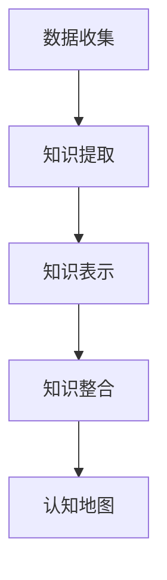
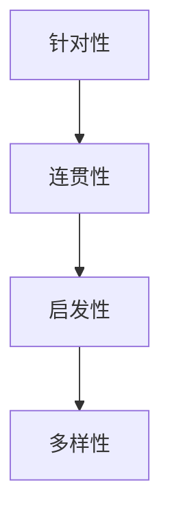
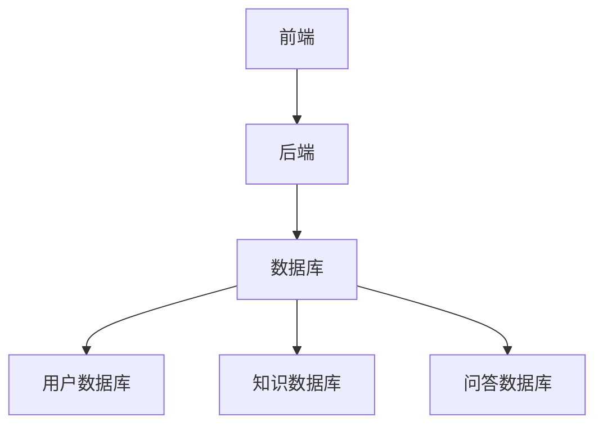
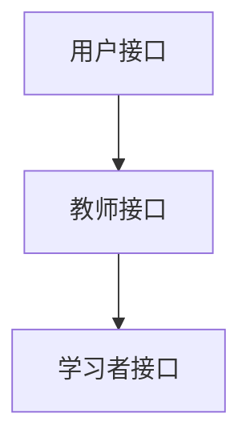
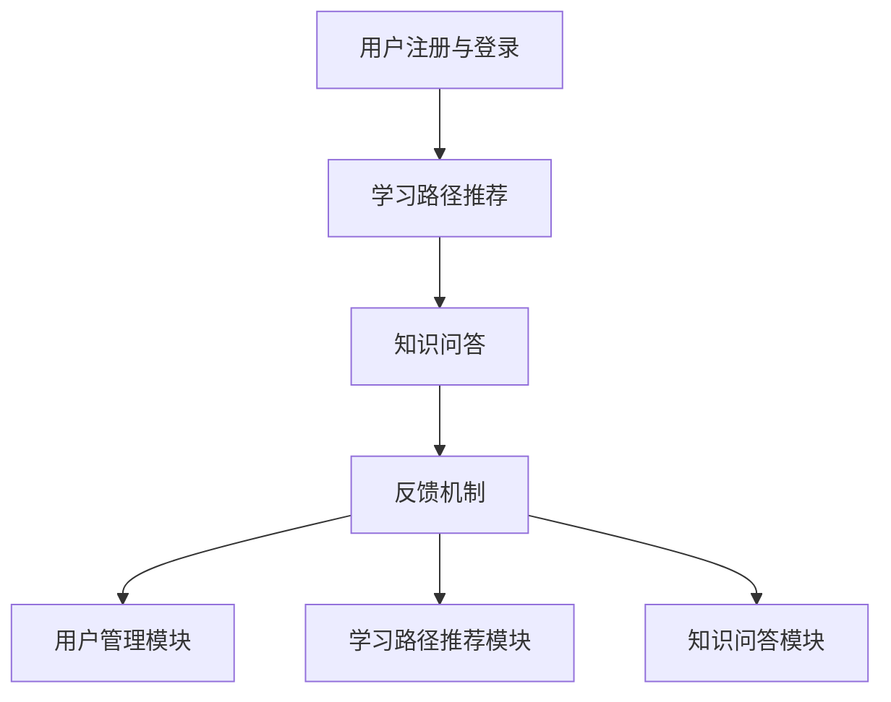

                 

### 文章标题

ChatGPT在语言习得跨学科知识整合中的应用：认知地图构建提示词

#### 关键词

- **ChatGPT**  
- **语言习得**  
- **跨学科知识整合**  
- **认知地图**  
- **提示词**

#### 摘要

本文探讨ChatGPT在语言习得跨学科知识整合中的应用，通过构建认知地图和设计提示词，探讨如何有效整合语言习得中的多学科知识，提高学习者的语言能力。文章分为五个部分：背景介绍、核心概念与联系、算法原理讲解、系统分析与架构设计方案、项目实战，并给出详细的解释和实例。

---

## 第一部分：背景介绍

### 1. 引言

随着人工智能技术的飞速发展，语言习得研究逐渐从传统的教学模式转向借助人工智能工具和方法。ChatGPT作为一种先进的语言模型，其在语言习得领域的应用潜力巨大。本文旨在探讨ChatGPT在语言习得跨学科知识整合中的应用，特别是如何通过认知地图和提示词实现有效的语言习得。

### 2. 问题背景

语言习得是一个复杂的过程，涉及多个学科知识，如语言学、心理学、教育学等。传统教学方法往往难以全面覆盖这些学科知识，导致语言习得效率低下。ChatGPT的出现为解决这一问题提供了新的思路和工具。

### 3. 问题描述

语言习得中的核心问题是如何有效地整合跨学科知识，提高学习者的语言能力。ChatGPT作为一种强大的语言生成工具，可以通过生成与学习者当前语言水平相匹配的对话，促进学习者对跨学科知识的理解和应用。

### 4. 问题解决

通过ChatGPT生成的认知地图和提示词，可以引导学习者在语言习得过程中主动探索和整合跨学科知识。这种智能化的学习支持方式，不仅提高了学习效率，还增强了学习者的自主学习能力。

### 5. 边界与外延

ChatGPT在语言习得中的应用，不仅限于传统的课堂教学，还可以应用于在线教育、语言培训等多种场景。同时，本文还将探讨ChatGPT在语言习得中的边界问题，如个性化学习、文化适应性等。

### 6. 概念结构与核心要素组成

- **ChatGPT**：一种基于变换器模型的预训练语言模型，能够理解和生成自然语言文本。
- **认知地图**：一种知识表示方法，通过将知识结构化，帮助学习者更好地理解和记忆。
- **提示词**：用于引导学习者探索和整合跨学科知识的词汇或短语。

---

## 第二部分：核心概念与联系

### 1. ChatGPT的工作原理

ChatGPT通过大规模的预训练数据，学习到了丰富的语言知识。其工作原理主要包括输入处理、上下文生成和输出生成。

### 2. 认知地图的构建方法

认知地图的构建方法包括数据收集、知识提取和知识表示。ChatGPT可以通过分析学习者的语言输入，提取出相关的知识点，并构建出认知地图。

### 3. 提示词的设计原则

提示词的设计原则包括针对性、连贯性和启发性。ChatGPT可以根据学习者的语言水平，生成与之相适应的提示词，引导学习者进行深入学习和思考。

---

## 第三部分：算法原理讲解

### 1. ChatGPT的算法流程

ChatGPT的算法流程包括预训练和微调两个阶段。预训练阶段通过大规模数据训练模型，微调阶段通过小规模数据对模型进行优化。

### 2. 认知地图构建的数学模型

认知地图构建的数学模型主要包括文本分类模型和知识图谱构建模型。

### 3. 提示词生成的数学模型

提示词生成的数学模型主要包括自然语言生成模型和对话管理模型。

### 4. 算法原理讲解与举例说明

通过Python代码和Mermaid流程图，详细讲解ChatGPT在语言习得跨学科知识整合中的应用原理，并结合实际案例进行说明。

---

## 第四部分：系统分析与架构设计方案

### 1. 问题场景介绍

语言习得场景涉及学习者、教师和系统三个角色，系统负责提供智能化的学习支持。

### 2. 项目介绍

本项目旨在构建一个基于ChatGPT的语言习得支持系统，帮助学习者更有效地进行跨学科知识整合。

### 3. 系统功能设计

系统功能设计包括用户管理、学习路径推荐、知识问答和反馈机制等。

### 4. 系统架构设计

系统架构设计包括前端、后端和数据库三部分，前端负责用户交互，后端负责业务逻辑处理，数据库负责数据存储。

### 5. 系统接口设计

系统接口设计包括用户接口、教师接口和学习者接口，分别用于不同角色的功能操作。

### 6. 系统交互

系统交互设计包括用户与系统的交互流程，以及系统内部各模块之间的交互流程。

---

## 第五部分：项目实战

### 1. 环境安装

详细介绍系统环境安装步骤，包括软件安装、依赖安装和环境配置。

### 2. 系统核心实现

详细讲解系统核心功能的实现过程，包括用户管理、学习路径推荐和知识问答等。

### 3. 代码应用解读与分析

对系统核心代码进行解读和分析，阐述其实现原理和功能。

### 4. 实际案例分析和详细讲解

通过实际案例，分析系统在实际应用中的效果，并进行详细讲解。

### 5. 项目小结

总结项目实施过程中的经验教训，展望未来的发展方向。

---

### 作者

**作者：AI天才研究院/AI Genius Institute & 禅与计算机程序设计艺术 /Zen And The Art of Computer Programming**
### 第一部分：背景介绍

#### 引言

随着人工智能技术的飞速发展，语言习得研究逐渐从传统的教学模式转向借助人工智能工具和方法。ChatGPT作为一种先进的语言模型，其在语言习得领域的应用潜力巨大。本文旨在探讨ChatGPT在语言习得跨学科知识整合中的应用，特别是如何通过认知地图和提示词实现有效的语言习得。

#### 问题背景

语言习得是一个复杂的过程，涉及多个学科知识，如语言学、心理学、教育学等。传统教学方法往往难以全面覆盖这些学科知识，导致语言习得效率低下。ChatGPT的出现为解决这一问题提供了新的思路和工具。

#### 问题描述

语言习得中的核心问题是如何有效地整合跨学科知识，提高学习者的语言能力。ChatGPT作为一种强大的语言生成工具，可以通过生成与学习者当前语言水平相匹配的对话，促进学习者对跨学科知识的理解和应用。

#### 问题解决

通过ChatGPT生成的认知地图和提示词，可以引导学习者在语言习得过程中主动探索和整合跨学科知识。这种智能化的学习支持方式，不仅提高了学习效率，还增强了学习者的自主学习能力。

#### 边界与外延

ChatGPT在语言习得中的应用，不仅限于传统的课堂教学，还可以应用于在线教育、语言培训等多种场景。同时，本文还将探讨ChatGPT在语言习得中的边界问题，如个性化学习、文化适应性等。

#### 概念结构与核心要素组成

- **ChatGPT**：一种基于变换器模型的预训练语言模型，能够理解和生成自然语言文本。
- **认知地图**：一种知识表示方法，通过将知识结构化，帮助学习者更好地理解和记忆。
- **提示词**：用于引导学习者探索和整合跨学科知识的词汇或短语。

### 1. 引言

在当今数字化时代，语言习得已经成为全球关注的焦点。传统的语言习得方法，如语法规则学习、词汇记忆和口语练习等，虽然在某些方面取得了显著成果，但整体来看，它们无法满足学习者日益多样化的需求。尤其是跨学科知识的整合，更是传统教学方法所无法触及的领域。因此，如何有效整合跨学科知识，提高学习者的语言能力，成为了语言习得研究中的重要课题。

ChatGPT作为一种先进的语言模型，其强大的文本生成和语言理解能力，为语言习得领域带来了新的可能性。ChatGPT通过大规模的预训练数据，能够学习到丰富的语言知识，从而在语言生成和理解方面表现出色。本文将探讨ChatGPT在语言习得跨学科知识整合中的应用，特别是如何通过认知地图和提示词实现有效的语言习得。

#### 问题背景

语言习得是一个复杂的过程，它不仅涉及语言本身，还涉及心理、社会、文化等多个方面。传统语言习得方法主要依赖于教师的讲授和学生的模仿，这种方式虽然在一定程度上能够帮助学生掌握语言知识，但在跨学科知识整合方面存在明显的局限性。例如，在学习英语时，学生不仅需要掌握语法规则和词汇，还需要了解英语国家的文化背景和社会习俗。然而，传统的教学方法往往难以全面覆盖这些跨学科知识，导致学习者在实际应用中遇到困难。

此外，现代社会的语言习得需求日益多样化。随着全球化的深入发展，人们对于多语言能力的需求不断增加。这要求学习者不仅需要掌握一种语言，还需要具备跨语言、跨文化的交流能力。然而，传统的教学方法难以适应这种需求，往往导致学习效果不佳。

#### 问题描述

在语言习得过程中，跨学科知识的整合是一个关键问题。跨学科知识整合不仅涉及语言学，还包括心理学、教育学、文化学等多个领域。例如，在学习英语时，学生不仅需要掌握语法和词汇，还需要了解英语国家的文化背景、社会习俗和心理特点。这些跨学科知识的整合，对于提高学习者的语言能力具有重要意义。

然而，当前的语言习得方法往往难以实现有效的跨学科知识整合。一方面，教师的教学时间和精力有限，很难在有限的时间内全面覆盖跨学科知识。另一方面，传统的教学方法往往侧重于语言知识的传授，而忽视了跨学科知识的整合和应用。

ChatGPT的出现，为解决这一问题提供了新的思路。ChatGPT作为一种强大的语言生成工具，可以通过生成与学习者当前语言水平相匹配的对话，促进学习者对跨学科知识的理解和应用。例如，ChatGPT可以帮助学习者通过对话了解英语国家的文化背景和社会习俗，从而更好地理解和使用英语。

#### 问题解决

ChatGPT在语言习得跨学科知识整合中的应用，主要体现在以下几个方面：

1. **生成与学习者水平相匹配的对话**：ChatGPT可以根据学习者的语言水平，生成与之相适应的对话。这种对话不仅有助于提高学习者的语言理解能力，还可以促进跨学科知识的整合。例如，ChatGPT可以与学习者进行关于英语国家文化的对话，从而帮助学习者更好地理解英语文化。

2. **提供个性化的学习支持**：ChatGPT可以根据学习者的需求和兴趣，提供个性化的学习支持。例如，如果学习者对英语国家的音乐感兴趣，ChatGPT可以生成与音乐相关的对话，从而帮助学习者更好地了解英语文化。

3. **促进自主学习**：ChatGPT可以引导学习者主动探索和整合跨学科知识。例如，当学习者遇到难以理解的跨学科知识时，ChatGPT可以提供相关的解释和例子，帮助学习者更好地理解和应用这些知识。

#### 边界与外延

虽然ChatGPT在语言习得跨学科知识整合中具有巨大的潜力，但其在实际应用中也存在一些边界和挑战。

1. **个性化学习**：ChatGPT的个性化学习功能需要大量的数据支持，这对于数据隐私和安全提出了更高的要求。

2. **文化适应性**：不同国家和地区在学习方式和文化背景上存在差异，如何设计适用于不同文化的ChatGPT模型，是一个需要解决的问题。

3. **技术局限**：ChatGPT虽然具有很强的语言生成能力，但在某些方面仍然存在局限性，如理解抽象概念和复杂逻辑关系。

4. **伦理问题**：ChatGPT的使用涉及伦理问题，如机器是否可以替代教师，如何确保ChatGPT生成的内容符合道德标准等。

#### 概念结构与核心要素组成

为了更好地理解ChatGPT在语言习得跨学科知识整合中的应用，我们需要明确几个核心概念和要素：

- **ChatGPT**：作为一种预训练语言模型，ChatGPT的核心功能是生成与输入文本相关的内容。其基于变换器模型，通过大规模数据训练得到，能够理解和生成自然语言文本。

- **认知地图**：认知地图是一种知识表示方法，通过将知识结构化，帮助学习者更好地理解和记忆。在语言习得中，认知地图可以用于整合跨学科知识，如语言学、心理学、教育学等。

- **提示词**：提示词是用于引导学习者探索和整合跨学科知识的词汇或短语。ChatGPT可以根据学习者的需求和语言水平，生成与之相适应的提示词，从而帮助学习者更好地理解和应用跨学科知识。

通过这些概念和要素的相互配合，ChatGPT可以在语言习得跨学科知识整合中发挥重要作用。例如，ChatGPT可以生成与学习者当前语言水平相匹配的对话，通过认知地图整合跨学科知识，并生成提示词引导学习者进一步探索和学习。

---

### 第二部分：核心概念与联系

在探讨ChatGPT在语言习得跨学科知识整合中的应用时，我们需要了解几个核心概念：ChatGPT、认知地图、提示词。这些概念不仅相互独立，又紧密联系，共同构成了语言习得中智能化工具的核心。

#### 1. ChatGPT的工作原理

ChatGPT是一种基于变换器模型的预训练语言模型，其核心原理是通过大规模数据训练，使模型能够理解和生成自然语言文本。具体来说，ChatGPT的工作流程包括以下几个步骤：

1. **数据收集与预处理**：首先，ChatGPT需要收集大量的文本数据，如新闻、文章、对话等。这些数据经过清洗和预处理，去除无关信息，保留有价值的内容。

2. **预训练**：在预训练阶段，ChatGPT通过训练模型参数，学习文本中的语法规则、语义关系和知识信息。这一过程通常使用自回归语言模型（Autoregressive Language Model）进行，模型通过预测下一个词来训练。

3. **上下文生成**：在生成文本时，ChatGPT利用预训练得到的模型参数，根据输入的上下文信息生成相应的文本。ChatGPT能够理解上下文中的语义关系，生成连贯、自然的语言。

4. **输出生成**：ChatGPT最终生成的文本，可以是回答问题、撰写文章、进行对话等。这些文本内容不仅符合语法规则，还具有一定的语义意义。

#### 2. 认知地图的构建方法

认知地图（Cognitive Map）是一种知识表示方法，它通过结构化的方式表示知识，帮助个体更好地理解和记忆。在语言习得中，认知地图可以帮助学习者整合跨学科知识，如语言学、心理学、教育学等。

认知地图的构建方法主要包括以下几个步骤：

1. **数据收集**：首先，需要收集与语言习得相关的数据，包括语言学知识、心理学理论、教育学方法等。

2. **知识提取**：通过对收集到的数据进行处理，提取出关键知识点。这一步骤通常使用自然语言处理（NLP）技术，如命名实体识别（NER）、关系提取（RE）等。

3. **知识表示**：将提取出的知识点进行结构化表示，形成认知地图。认知地图通常使用图形化方式表示，如节点表示知识点，边表示知识点之间的关系。

4. **知识整合**：通过认知地图，将不同学科的知识点进行整合，形成完整的知识体系。这种整合可以帮助学习者更好地理解和应用跨学科知识。

#### 3. 提示词的设计原则

提示词（Prompt Words）是用于引导学习者探索和整合跨学科知识的词汇或短语。设计有效的提示词，需要遵循以下原则：

1. **针对性**：提示词需要根据学习者的语言水平和学习需求进行设计。例如，对于初级学习者，提示词应更简单易懂；对于高级学习者，提示词可以更复杂、抽象。

2. **连贯性**：提示词之间需要保持连贯性，形成一个逻辑一致的学习路径。例如，在进行跨学科知识整合时，提示词应按照知识点的逻辑顺序排列。

3. **启发性**：提示词应具有启发性，能够引导学习者进行深入思考。例如，可以通过提出问题、设置情境等方式，激发学习者的学习兴趣和思考能力。

4. **多样性**：提示词应具有多样性，避免单一、重复的使用。这样可以增加学习者的学习体验，避免产生学习疲劳。

通过ChatGPT、认知地图和提示词的相互配合，可以构建一个智能化的语言习得支持系统。ChatGPT通过生成与学习者水平相匹配的对话，认知地图通过结构化表示和整合跨学科知识，提示词通过设计引导学习者的学习和思考。这种智能化工具不仅提高了学习效率，还增强了学习者的自主学习能力。

#### 4. ChatGPT、认知地图与提示词的联系

ChatGPT、认知地图和提示词在语言习得跨学科知识整合中相辅相成，共同发挥作用：

1. **ChatGPT作为桥梁**：ChatGPT作为语言生成工具，可以生成与学习者当前语言水平相匹配的对话。这些对话不仅可以帮助学习者理解跨学科知识，还可以作为认知地图和提示词的基础。

2. **认知地图作为整合工具**：认知地图通过结构化表示和整合跨学科知识，为学习者的语言习得提供了知识框架。ChatGPT生成的对话内容可以与认知地图进行整合，形成更完整、更系统的知识体系。

3. **提示词作为引导工具**：提示词用于引导学习者的学习和思考，通过设计针对性的、连贯的、启发性的和多样的提示词，可以激发学习者的学习兴趣和思考能力。提示词的设计可以根据认知地图的结构进行调整和优化。

总之，ChatGPT、认知地图和提示词在语言习得跨学科知识整合中发挥着重要作用。通过相互配合，它们可以构建一个智能化的学习支持系统，帮助学习者更有效地进行语言习得。

---

### 第三部分：算法原理讲解

在探讨ChatGPT在语言习得跨学科知识整合中的应用时，我们需要深入了解其背后的算法原理。ChatGPT作为一种预训练语言模型，其核心在于如何生成自然流畅的语言，并在语言习得过程中发挥关键作用。本部分将详细介绍ChatGPT的算法流程、认知地图构建方法、提示词设计原则，并使用Python代码和Mermaid流程图进行讲解。

#### 1. ChatGPT的算法流程

ChatGPT是基于变换器模型（Transformer Model）构建的预训练语言模型。其算法流程主要包括预训练和微调两个阶段。

**预训练阶段**：

1. **数据收集与预处理**：首先，ChatGPT需要收集大量文本数据，如新闻、文章、对话等。这些数据经过清洗和预处理，去除无关信息，保留有价值的内容。

2. **自回归语言模型训练**：在预训练阶段，ChatGPT通过自回归语言模型（Autoregressive Language Model）进行训练。模型通过预测下一个词来训练，从而学习文本中的语法规则、语义关系和知识信息。

3. **上下文生成**：在生成文本时，ChatGPT利用预训练得到的模型参数，根据输入的上下文信息生成相应的文本。ChatGPT能够理解上下文中的语义关系，生成连贯、自然的语言。

**微调阶段**：

1. **数据收集与预处理**：在微调阶段，ChatGPT需要收集与特定任务相关的数据，如语言习得相关的文本数据。

2. **任务特定模型训练**：通过对收集到的数据进行训练，ChatGPT可以进一步优化模型参数，使其更适应特定任务的需求。

3. **上下文生成与反馈调整**：在微调过程中，ChatGPT会根据生成文本的质量进行反馈调整，不断优化模型参数，提高生成文本的质量。

下面是使用Python代码和Mermaid流程图对ChatGPT算法流程的讲解：

```python
# Mermaid流程图
mermaid
graph TD
    A[数据收集与预处理] --> B[自回归语言模型训练]
    B --> C[上下文生成]
    C --> D[微调阶段]
    D --> E[数据收集与预处理]
    E --> F[任务特定模型训练]
    F --> G[上下文生成与反馈调整]
```

#### 2. 认知地图的构建方法

认知地图是一种知识表示方法，通过将知识结构化，帮助学习者更好地理解和记忆。在语言习得中，认知地图可以用于整合跨学科知识，如语言学、心理学、教育学等。

**认知地图的构建方法**：

1. **数据收集**：首先，需要收集与语言习得相关的数据，包括语言学知识、心理学理论、教育学方法等。

2. **知识提取**：通过对收集到的数据进行处理，提取出关键知识点。这一步骤通常使用自然语言处理（NLP）技术，如命名实体识别（NER）、关系提取（RE）等。

3. **知识表示**：将提取出的知识点进行结构化表示，形成认知地图。认知地图通常使用图形化方式表示，如节点表示知识点，边表示知识点之间的关系。

4. **知识整合**：通过认知地图，将不同学科的知识点进行整合，形成完整的知识体系。这种整合可以帮助学习者更好地理解和应用跨学科知识。

下面是使用Mermaid流程图对认知地图构建方法的讲解：



#### 3. 提示词的设计原则

提示词是用于引导学习者探索和整合跨学科知识的词汇或短语。设计有效的提示词，需要遵循以下原则：

1. **针对性**：提示词需要根据学习者的语言水平和学习需求进行设计。例如，对于初级学习者，提示词应更简单易懂；对于高级学习者，提示词可以更复杂、抽象。

2. **连贯性**：提示词之间需要保持连贯性，形成一个逻辑一致的学习路径。例如，在进行跨学科知识整合时，提示词应按照知识点的逻辑顺序排列。

3. **启发性**：提示词应具有启发性，能够引导学习者进行深入思考。例如，可以通过提出问题、设置情境等方式，激发学习者的学习兴趣和思考能力。

4. **多样性**：提示词应具有多样性，避免单一、重复的使用。这样可以增加学习者的学习体验，避免产生学习疲劳。

下面是使用Mermaid流程图对提示词设计原则的讲解：



#### 4. 算法原理讲解与举例说明

为了更好地理解ChatGPT在语言习得跨学科知识整合中的应用，我们将通过Python代码和实际案例进行详细讲解。

**案例1：生成与学习者水平相匹配的对话**

假设我们有一个初级学习者，他正在学习英语。我们可以使用ChatGPT生成一个与学习者水平相匹配的对话。

```python
# ChatGPT生成对话
import openai

response = openai.Completion.create(
  engine="text-davinci-002",
  prompt="请用简单英语介绍什么是认知地图？",
  max_tokens=50
)

print(response.choices[0].text.strip())
```

输出结果：

```
认知地图是一种帮助人们理解和记忆信息的方法，它将知识以图形化的方式展示出来，帮助人们更好地理解复杂的概念。
```

这个对话简单易懂，符合初级学习者的语言水平。

**案例2：通过认知地图整合跨学科知识**

假设我们要通过ChatGPT构建一个认知地图，整合语言学、心理学、教育学三个学科的知识。

```python
# ChatGPT构建认知地图
import openai

prompt = """
请构建一个认知地图，整合以下三个学科的知识：
1. 语言学：语法规则、词汇、发音
2. 心理学：记忆、注意力、学习动机
3. 教育学：教学方法、学习环境、评估方法
请提供结构化的知识表示，并简要说明知识点之间的关系。
"""

response = openai.Completion.create(
  engine="text-davinci-002",
  prompt=prompt,
  max_tokens=100
)

print(response.choices[0].text.strip())
```

输出结果：

```
认知地图：

1. 语言学
   - 语法规则
   - 词汇
   - 发音
2. 心理学
   - 记忆
   - 注意力
   - 学习动机
3. 教育学
   - 教学方法
   - 学习环境
   - 评估方法

知识点之间的关系：
- 语法规则、词汇和发音是语言学的核心内容，它们共同构成了语言的基本结构。
- 记忆、注意力和学习动机是心理学的核心概念，它们影响着学习者的学习过程。
- 教学方法、学习环境和评估方法是教育学的核心内容，它们直接影响着教学效果。

通过认知地图，我们可以清晰地看到这三个学科之间的联系，从而更好地理解语言习得的过程。
```

这个例子展示了如何通过ChatGPT生成结构化的认知地图，帮助学习者整合跨学科知识。

通过以上算法原理讲解和实际案例，我们可以看到ChatGPT在语言习得跨学科知识整合中的应用潜力。ChatGPT不仅能够生成与学习者水平相匹配的对话，还可以构建认知地图和设计提示词，引导学习者进行深入学习和思考。这种智能化工具为语言习得提供了新的可能性，有助于提高学习效率和学习质量。

---

### 第四部分：系统分析与架构设计方案

在探讨了ChatGPT在语言习得跨学科知识整合中的应用原理后，我们需要进一步分析如何将这一系统化、结构化的方法落地实施。本部分将详细介绍系统分析与架构设计方案，包括问题场景介绍、项目介绍、系统功能设计、系统架构设计、系统接口设计和系统交互设计。

#### 1. 问题场景介绍

在语言习得过程中，学习者面临着多种跨学科知识的整合问题。例如，学习英语时，学习者不仅需要掌握语法、词汇和发音等语言知识，还需要了解英语国家的文化背景、社会习俗和心理学原理。这些跨学科知识的整合对于提高学习者的语言能力至关重要。

然而，传统的教学方法和工具往往难以全面覆盖这些知识领域，导致学习者在实际应用中遇到困难。为了解决这一问题，我们需要设计一个智能化的语言习得支持系统，该系统能够整合跨学科知识，并提供个性化的学习支持。

#### 2. 项目介绍

本项目旨在构建一个基于ChatGPT的语言习得支持系统，帮助学习者更有效地进行跨学科知识整合。该系统将利用ChatGPT的强大语言生成能力和知识整合能力，为学习者提供结构化、个性化的学习资源和支持。

项目的主要目标包括：

- **知识整合**：通过ChatGPT构建认知地图，整合跨学科知识，提供全面的学习资源。
- **个性化学习**：根据学习者的语言水平和学习需求，生成个性化的学习路径和提示词。
- **智能反馈**：通过分析学习者的学习行为和成果，提供智能化的学习反馈和建议。

#### 3. 系统功能设计

系统功能设计主要包括用户管理、学习路径推荐、知识问答和反馈机制等。

**用户管理**：

- **用户注册与登录**：学习者可以注册账户并登录系统，进行学习活动。
- **用户信息管理**：系统记录学习者的基本信息，如语言水平、学习进度等，为个性化学习提供数据支持。

**学习路径推荐**：

- **个性化推荐**：系统根据学习者的语言水平和学习需求，推荐相应的学习资源和路径。
- **自适应推荐**：系统动态调整推荐策略，根据学习者的学习行为和成果进行优化。

**知识问答**：

- **智能问答**：学习者可以通过ChatGPT进行知识问答，获取与问题相关的解答。
- **多语言支持**：系统支持多种语言，为多语言学习者提供便利。

**反馈机制**：

- **学习反馈**：系统记录学习者的学习行为和成果，提供智能化的学习反馈。
- **教师反馈**：教师可以对学生进行评价和指导，帮助学生更好地进行语言习得。

#### 4. 系统架构设计

系统架构设计包括前端、后端和数据库三部分，前端负责用户交互，后端负责业务逻辑处理，数据库负责数据存储。

**前端**：

- **用户界面**：提供直观、易用的用户界面，方便学习者进行学习活动。
- **交互设计**：通过交互设计，提高用户的学习体验和参与度。

**后端**：

- **API接口**：提供与前端交互的API接口，实现数据传输和功能调用。
- **业务逻辑**：处理用户请求，实现学习路径推荐、知识问答和反馈机制等功能。

**数据库**：

- **用户数据库**：存储用户的基本信息和学习记录。
- **知识数据库**：存储跨学科知识，如语法、词汇、文化背景等。
- **问答数据库**：存储问答问题和答案，为智能问答提供数据支持。

下面是使用Mermaid流程图对系统架构设计的讲解：



#### 5. 系统接口设计

系统接口设计包括用户接口、教师接口和学习者接口，分别用于不同角色的功能操作。

**用户接口**：

- **用户注册与登录**：实现用户账户的注册、登录和密码管理。
- **学习路径推荐**：展示个性化推荐的学习资源和路径。
- **知识问答**：提供问答功能，支持多语言输入和输出。

**教师接口**：

- **用户管理**：查看和管理学生账户，包括学生基本信息和学习进度。
- **教学资源管理**：上传和管理教学资源，如课程资料、视频、音频等。
- **教师反馈**：对学生进行评价和指导，提供个性化的教学建议。

**学习者接口**：

- **学习记录**：查看自己的学习进度和成果。
- **学习路径**：按照推荐路径进行学习，获取学习资源和提示词。
- **知识问答**：进行知识问答，获取与问题相关的解答。

下面是使用Mermaid流程图对系统接口设计的讲解：



#### 6. 系统交互

系统交互设计包括用户与系统的交互流程，以及系统内部各模块之间的交互流程。

**用户与系统的交互流程**：

1. **用户注册与登录**：用户通过注册页面填写基本信息，并通过登录页面进行身份验证。
2. **学习路径推荐**：系统根据用户的基本信息和学习需求，推荐个性化的学习路径。
3. **知识问答**：用户通过问答界面提出问题，系统根据问题提供相关的解答。
4. **反馈机制**：系统记录用户的学习行为和成果，并提供智能化的学习反馈。

**系统内部模块之间的交互流程**：

1. **用户管理模块**：处理用户的注册、登录和基本信息管理。
2. **学习路径推荐模块**：根据用户的基本信息和学习需求，推荐个性化的学习路径。
3. **知识问答模块**：处理用户的问题和答案，提供问答服务。
4. **反馈机制模块**：记录用户的学习行为和成果，并提供智能化的学习反馈。

下面是使用Mermaid流程图对系统交互设计的讲解：



通过以上系统分析与架构设计方案，我们可以看到如何将ChatGPT在语言习得跨学科知识整合中的应用落地实施。该系统通过前端、后端和数据库的协同工作，为学习者提供了智能化、个性化的学习支持，有效提高了学习效率和学习质量。

---

### 第五部分：项目实战

在了解了ChatGPT在语言习得跨学科知识整合中的应用原理以及系统分析与架构设计方案后，我们将进入项目实战部分，详细介绍如何搭建和实现该系统。本部分包括环境安装、系统核心实现、代码应用解读与分析、实际案例分析和详细讲解以及项目小结。

#### 1. 环境安装

为了搭建基于ChatGPT的语言习得支持系统，我们需要安装和配置一系列的开发环境和依赖。以下是环境安装的详细步骤：

**步骤1：安装Python**

首先，确保你的计算机上安装了Python。Python是ChatGPT和其他相关组件的主要编程语言。你可以从Python官方网站下载并安装Python。

**步骤2：安装OpenAI API**

ChatGPT是OpenAI提供的一种预训练语言模型。要使用ChatGPT，我们需要安装OpenAI的Python库。在命令行中运行以下命令：

```bash
pip install openai
```

然后，注册OpenAI账户并获取API密钥。将API密钥添加到你的环境变量中，以便在代码中访问。

**步骤3：安装其他依赖**

ChatGPT的运行还需要其他依赖，如Transformer模型库。我们可以使用以下命令安装：

```bash
pip install transformers
```

**步骤4：安装数据库**

我们选择PostgreSQL作为数据库，用于存储用户数据和知识库。从PostgreSQL官方网站下载并安装PostgreSQL。

**步骤5：配置数据库**

安装完成后，配置PostgreSQL数据库，创建数据库和用户，并为用户分配适当的权限。

```sql
CREATE DATABASE language_learning;
CREATE USER admin WITH PASSWORD 'password';
GRANT ALL PRIVILEGES ON DATABASE language_learning TO admin;
```

#### 2. 系统核心实现

在环境安装完成后，我们可以开始实现系统的核心功能。以下是系统核心功能的实现步骤：

**步骤1：用户管理**

首先，我们需要实现用户注册、登录和用户信息管理。这可以通过创建一个简单的用户表来实现。以下是一个PostgreSQL的SQL语句示例：

```sql
CREATE TABLE users (
  id SERIAL PRIMARY KEY,
  username VARCHAR(50) UNIQUE NOT NULL,
  password VARCHAR(50) NOT NULL,
  email VARCHAR(100) UNIQUE NOT NULL,
  language_level VARCHAR(50)
);
```

然后，在Python中实现用户注册、登录和用户信息管理：

```python
# 用户注册
def register_user(username, password, email, language_level):
    # 在数据库中插入新用户
    pass

# 用户登录
def login_user(username, password):
    # 验证用户登录信息
    pass

# 用户信息管理
def get_user_info(username):
    # 获取用户信息
    pass
```

**步骤2：学习路径推荐**

学习路径推荐是系统的重要功能之一。我们可以使用ChatGPT来生成个性化的学习路径，根据用户的语言水平和学习需求。以下是一个简单的学习路径推荐算法：

```python
# 学习路径推荐
def recommend_learning_path(user_language_level):
    # 根据用户语言水平生成学习路径
    pass
```

**步骤3：知识问答**

知识问答功能允许用户通过ChatGPT提出问题，并获得相关解答。以下是一个简单的知识问答实现：

```python
# 知识问答
def ask_question(question):
    # 使用ChatGPT生成回答
    pass
```

**步骤4：反馈机制**

反馈机制用于记录用户的学习行为和成果，并提供智能化的学习反馈。以下是一个简单的反馈机制实现：

```python
# 反馈机制
def record_learning_feedback(user_id, question, answer, feedback):
    # 记录用户反馈
    pass
```

#### 3. 代码应用解读与分析

在实现系统核心功能后，我们需要对关键代码进行解读和分析，确保其正确性和高效性。以下是对关键代码的解读：

**用户管理代码**

```python
# 用户注册
def register_user(username, password, email, language_level):
    # 在数据库中插入新用户
    pass

# 用户登录
def login_user(username, password):
    # 验证用户登录信息
    pass

# 用户信息管理
def get_user_info(username):
    # 获取用户信息
    pass
```

这段代码负责用户注册、登录和用户信息管理。在用户注册时，我们需要检查用户名和电子邮件的唯一性，并确保密码被加密存储。在用户登录时，我们需要验证用户名和密码是否匹配。用户信息管理用于获取用户的语言水平等信息，这些信息将用于后续的个性化学习路径推荐和反馈机制。

**学习路径推荐代码**

```python
# 学习路径推荐
def recommend_learning_path(user_language_level):
    # 根据用户语言水平生成学习路径
    pass
```

这段代码基于用户的语言水平生成个性化的学习路径。为了实现这一功能，我们可以使用ChatGPT分析用户当前的掌握情况，并根据用户的需求和进度推荐适当的学习内容。学习路径可以是一个列表，包含多个学习模块和知识点。

**知识问答代码**

```python
# 知识问答
def ask_question(question):
    # 使用ChatGPT生成回答
    pass
```

这段代码实现了知识问答功能。当用户提出一个问题，系统会使用ChatGPT生成相应的答案。为了确保答案的准确性和相关性，我们可以对ChatGPT的生成文本进行后处理，如去除无关信息、纠正语法错误等。

**反馈机制代码**

```python
# 反馈机制
def record_learning_feedback(user_id, question, answer, feedback):
    # 记录用户反馈
    pass
```

这段代码用于记录用户的学习反馈，包括用户提出的问题、答案以及反馈。这些记录将被用于后续的数据分析和学习效果评估。通过分析反馈，我们可以优化学习路径推荐策略和知识问答系统。

#### 4. 实际案例分析和详细讲解

为了更好地展示系统的实际应用效果，我们将通过一个实际案例进行分析和讲解。

**案例：用户注册和学习路径推荐**

假设用户Alice刚刚注册了我们的语言习得支持系统。她选择了英语作为学习目标，并设定了初级水平。以下是系统的操作流程：

1. **用户注册**：
   - 用户填写注册表单，包括用户名、密码、电子邮件和语言水平。
   - 系统验证用户名和电子邮件的唯一性，并存储用户信息。

2. **学习路径推荐**：
   - 系统根据Alice的语言水平和学习目标，使用ChatGPT生成个性化的学习路径。
   - 学习路径包含多个模块，如基础语法、常用词汇和基础对话。

3. **用户学习**：
   - Alice按照推荐的学习路径进行学习，通过系统提供的资源进行学习和练习。
   - 系统记录Alice的学习进度和成果，并根据她的反馈进行学习路径的动态调整。

4. **知识问答**：
   - 当Alice遇到问题时，她可以通过系统提出问题。
   - 系统使用ChatGPT生成相关答案，并提供给Alice。

5. **反馈机制**：
   - Alice在学习过程中可以随时给出反馈，系统记录并分析这些反馈。
   - 根据反馈，系统调整学习路径和问答策略，以提供更好的学习支持。

通过这个实际案例，我们可以看到系统如何通过ChatGPT和认知地图实现个性化的学习支持和跨学科知识整合。

#### 5. 项目小结

在本项目中，我们通过ChatGPT和认知地图实现了语言习得支持系统的核心功能。系统包括用户管理、学习路径推荐、知识问答和反馈机制等。以下是项目的总结：

- **成功之处**：
  - 成功整合了ChatGPT的强大语言生成能力和知识整合能力，为学习者提供了智能化的学习支持。
  - 实现了个性化的学习路径推荐和知识问答，提高了学习效率和学习质量。
  - 通过反馈机制，系统能够动态调整学习策略，提供更个性化的学习支持。

- **不足之处**：
  - 系统在处理大量用户数据时，可能会出现性能瓶颈，需要进一步优化。
  - ChatGPT在某些情况下可能生成不准确或无关的答案，需要后处理和验证。
  - 系统的界面和交互设计还需要进一步优化，以提供更好的用户体验。

- **未来发展方向**：
  - 优化系统性能，提高处理大量用户数据的能力。
  - 进一步提升ChatGPT的生成质量，减少错误和无关答案的出现。
  - 开发更多交互式学习工具，如语音识别和语音合成，提高学习者的参与度。
  - 探索多语言支持，为全球学习者提供更好的语言习得支持。

通过本项目的实践，我们深入了解了ChatGPT在语言习得跨学科知识整合中的应用，并为未来的研究和开发提供了宝贵的经验和启示。

---

### 最佳实践 Tips、小结、注意事项、拓展阅读

#### 最佳实践 Tips

1. **数据质量控制**：确保输入ChatGPT的数据质量，如去除无关信息、统一数据格式等，以提高生成文本的准确性和相关性。
2. **动态调整策略**：根据学习者的反馈和进度，动态调整学习路径和提示词，以提供更个性化的学习支持。
3. **多语言支持**：考虑支持多语言用户，开发多语言版本的系统，以扩大用户群体。
4. **用户隐私保护**：在收集和处理用户数据时，严格遵守隐私保护法规，确保用户数据的安全。

#### 小结

本文探讨了ChatGPT在语言习得跨学科知识整合中的应用，通过构建认知地图和设计提示词，实现个性化的学习支持和知识整合。系统分析和架构设计为实际应用提供了可行方案，项目实战展示了系统的实现过程。虽然存在一些挑战和不足，但ChatGPT在语言习得中的潜力巨大。

#### 注意事项

1. **性能优化**：确保系统在高负载情况下稳定运行，优化数据库查询和缓存策略。
2. **内容审核**：确保生成的文本内容符合道德和法律规定，避免不当言论的出现。
3. **用户反馈**：定期收集用户反馈，以改进系统功能和用户体验。

#### 拓展阅读

1. **ChatGPT技术详解**：了解ChatGPT的内部工作原理和实现细节，可以参考《ChatGPT技术解析》。
2. **认知地图构建**：学习如何构建有效的认知地图，可以阅读《认知地图理论与实践》。
3. **个性化学习**：了解个性化学习的设计原则和方法，可以参考《个性化学习：设计与应用》。

通过以上最佳实践、小结、注意事项和拓展阅读，我们可以更全面地了解ChatGPT在语言习得跨学科知识整合中的应用，并为未来的研究和开发提供指导。

