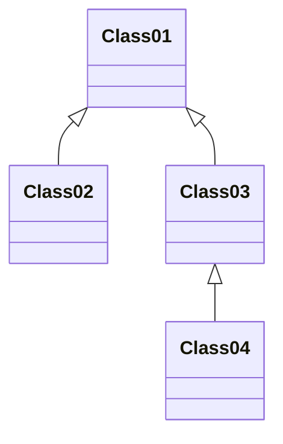
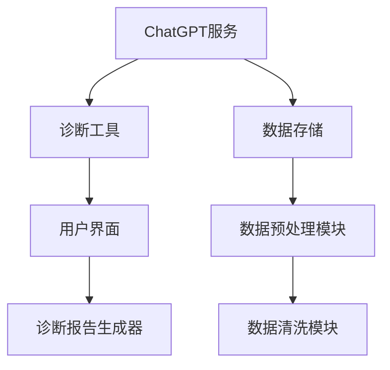
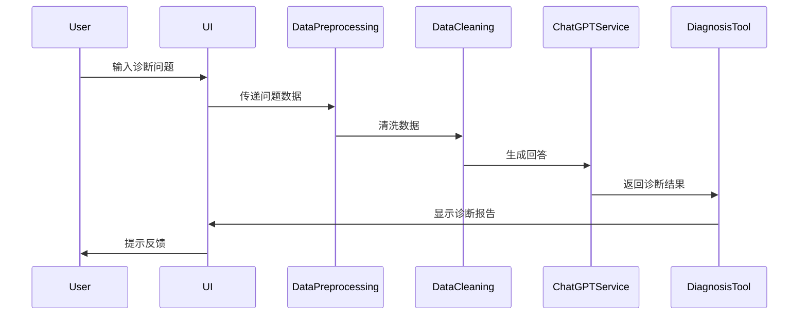

                 

## 背景介绍

### 语言习得障碍的定义与分类

语言习得障碍（Language Acquisition Disorder，简称LAD）是指儿童在语言习得过程中，由于神经系统发育障碍或其他原因导致语言发展出现显著延迟、错误或不正常的现象。根据美国疾病控制与预防中心（CDC）的定义，语言习得障碍包括语言发展迟缓、语言障碍和语音障碍等。

#### 语言发展迟缓

语言发展迟缓是指儿童在语言发展的关键期内，其语言技能的进展速度低于平均水平。这可能导致儿童在词汇量、语法结构、语言理解和使用方面的能力落后于同龄儿童。语言发展迟缓通常在3岁前开始显现，并且可能持续到学龄期。

#### 语言障碍

语言障碍是指儿童在语言产生和理解方面的显著困难，这种困难可能涉及语音、语调、语法、语义和语用等方面。常见的语言障碍包括口吃、语速过快或过慢、语法错误等。语言障碍可能由中枢神经系统损伤、听力障碍或神经系统发育异常等因素引起。

#### 语音障碍

语音障碍是指儿童在发音方面存在困难，导致他们说话时发音不准确或音调异常。语音障碍可能涉及单个音素的发音错误，如“b”发成“p”，“d”发成“t”，或一系列音素的发音问题，如发音模糊、重复或省略。

### 语言习得障碍的成因

语言习得障碍的成因复杂多样，可能涉及生物学、心理学和社会文化等多种因素。

#### 生物学因素

生物学因素包括遗传、大脑发育异常、脑损伤等。例如，某些基因变异可能导致儿童大脑中与语言相关的区域发育异常，从而影响语言能力。

#### 心理学因素

心理学因素包括认知发展、情绪和行为问题等。一些儿童由于注意力缺陷、多动症或其他行为问题，可能难以专注于语言学习和练习。

#### 社会文化因素

社会文化因素包括家庭环境、教育质量和语言输入等。家庭语言环境贫乏或缺乏适当的语言刺激，可能导致儿童语言能力发展缓慢。此外，文化差异和社会经济地位也可能影响儿童语言习得的过程。

#### 概念结构与核心要素组成

语言习得障碍的核心要素包括：

1. **症状表现**：包括语言发展迟缓、语言障碍、语音障碍等。
2. **诊断标准**：依据美国精神疾病诊断与统计手册（DSM-5）和《国际疾病分类》（ICD-10）等标准，通过评估儿童的语言能力来确定诊断。
3. **治疗干预**：包括语言治疗、行为干预、教育支持等，旨在改善儿童的语言技能和社交互动能力。

理解语言习得障碍的定义、分类、成因及其核心要素，有助于我们更好地认识这一现象，并为相关研究和干预措施提供理论基础。

### 语言习得障碍诊断方法与工具

#### 语言习得障碍诊断流程

诊断语言习得障碍通常包括以下几个步骤：

1. **初步筛查**：通过父母问卷、教师评估等方式初步了解儿童的语言发展情况。
2. **详细评估**：包括语言能力测试、认知能力评估、听力检查等，以全面评估儿童的语言障碍类型和程度。
3. **确诊**：根据评估结果，结合诊断标准，确定是否为语言习得障碍。
4. **制定干预计划**：根据确诊结果，制定个性化的治疗和干预计划。

#### 语言习得障碍诊断工具介绍

1. **语言评估工具**
   - **布罗卡儿童语言发展评估量表（Broca Test for Children）**：用于评估儿童的语言理解、表达能力和语法结构。
   - **韦氏儿童智力量表（Wechsler Intelligence Scale for Children，WISC）**：用于评估儿童的智力水平和认知能力，包括语言理解、记忆、注意力等。
   - **儿童语言行为评估系统（Children's Language Impairment Rating Scale，CLIRS）**：用于评估儿童的语言障碍类型和严重程度。

2. **听力检查工具**
   - **纯音听阈测试**：用于评估儿童听力损失的类型和程度。
   - **听觉反应测试**：通过声音刺激检测儿童对声音的反应，以评估其听力功能。

#### 语言习得障碍诊断的挑战与解决方案

1. **挑战**
   - **个体差异**：儿童语言习得障碍的表现和程度存在显著差异，给诊断带来困难。
   - **跨学科协作**：诊断语言习得障碍需要语言病理学家、心理学家、教育专家等多学科专业人士的协作。
   - **文化差异**：不同文化背景的家庭可能有不同的语言习得标准，影响诊断准确性。

2. **解决方案**
   - **多模态评估**：结合语言评估工具、认知评估和听力检查等多种方法，全面评估儿童的语言发展状况。
   - **标准化评估工具**：使用标准化的评估工具，确保评估的准确性和可比性。
   - **跨学科团队**：建立跨学科团队，共同参与评估和诊断过程，提高诊断的准确性和有效性。

通过以上介绍，我们可以更好地了解语言习得障碍的诊断方法与工具，以及面临的挑战和解决方案。这将有助于提高对这一现象的认识，并为相关研究和实践提供参考。

## 核心概念与联系

### 核心概念原理

在深入探讨ChatGPT在语言习得障碍诊断中的应用之前，我们需要了解几个核心概念：自然语言处理（NLP）、语言生成模型（Language Generation Model）和深度学习（Deep Learning）。

#### 自然语言处理（NLP）

自然语言处理是计算机科学和人工智能领域的一个分支，旨在使计算机能够理解、生成和处理人类自然语言。NLP的应用范围广泛，包括机器翻译、情感分析、文本摘要等。

#### 语言生成模型

语言生成模型是一种能够生成人类语言样式的模型，它通过学习大量文本数据，了解语言的结构和语法规则，从而生成新的文本。GPT（Generative Pre-trained Transformer）系列模型是语言生成模型的一个典型代表。

#### 深度学习

深度学习是机器学习的一个子领域，通过构建多层神经网络来模拟人类大脑的学习过程。深度学习模型在图像识别、语音识别和自然语言处理等领域取得了显著成果。

### 概念属性特征对比表格

为了更好地理解这些核心概念，我们可以通过一个对比表格来展示它们的主要属性和特征：

| 概念           | 属性特征                           | 用例场景                                       |
| -------------- | ---------------------------------- | ---------------------------------------------- |
| 自然语言处理   | 数据处理、文本分析、语义理解       | 机器翻译、情感分析、问答系统                   |
| 语言生成模型   | 语言生成、文本生成                 | 自动写作、对话系统、内容生成                   |
| 深度学习       | 自适应学习、复杂模型、多层网络     | 图像识别、语音识别、推荐系统、自然语言处理     |

### ER实体关系图架构的Mermaid流程图

为了更直观地展示核心概念之间的联系，我们可以使用Mermaid语言绘制一个实体关系图（ER图）。以下是一个简化的Mermaid ER图示例：

```mermaid
erDiagram
  语言习得障碍 ||--|{ 自然语言处理 }
  语言习得障碍 ||--|{ 深度学习 }
  自然语言处理 ||--|{ 语言生成模型 }
```

在这个ER图中，语言习得障碍与自然语言处理和深度学习之间存在关联。自然语言处理和深度学习共同构成了语言生成模型的基础，而语言生成模型则可以应用于语言习得障碍的诊断和干预。

通过以上核心概念与联系的分析，我们可以更好地理解ChatGPT在语言习得障碍诊断中的应用原理和基础。

## 算法原理讲解

### ChatGPT的工作原理

ChatGPT是一种基于GPT-3（Generative Pre-trained Transformer 3）的先进语言生成模型，其核心原理是通过深度学习和自然语言处理技术，生成与输入文本相似的自然语言输出。GPT-3模型采用Transformer架构，这是一种在序列到序列学习任务中表现卓越的神经网络模型。GPT-3具有1750亿个参数，能够处理多种语言任务，包括文本生成、问答系统、机器翻译等。

#### Transformer架构

Transformer模型的核心思想是使用自注意力机制（Self-Attention）来处理序列数据。在传统的序列模型中，每个时间步的输出仅依赖于前一个时间步的输出，而Transformer模型通过自注意力机制，使得每个时间步的输出能够同时关注整个输入序列。自注意力机制通过计算每个输入词与序列中所有词的相似度，然后对这些相似度进行加权平均，生成每个时间步的输出。

#### GPT-3模型的工作流程

GPT-3模型的工作流程如下：

1. **预训练**：在预训练阶段，GPT-3模型通过大量的文本数据进行训练，学习语言的统计规律和语法结构。这个过程包括两个子任务：Masked Language Modeling（MLM）和Next Sentence Prediction（NSP）。
   - **Masked Language Modeling（MLM）**：在这个任务中，模型需要预测输入文本中被遮盖的词。
   - **Next Sentence Prediction（NSP）**：在这个任务中，模型需要预测两个句子是否属于连续的文本。

2. **微调**：在预训练后，GPT-3模型可以根据特定任务进行微调，例如在语言习得障碍诊断中，通过微调模型使其能够更好地理解与语言习得障碍相关的文本。

### 使用Python源代码详细阐述算法原理

为了更具体地展示ChatGPT的工作原理，我们可以使用Python代码实现一个简化的GPT模型。以下是一个使用Hugging Face的Transformers库实现的GPT-2模型示例：

```python
from transformers import GPT2LMHeadModel, GPT2Tokenizer

# 加载预训练的GPT-2模型和分词器
tokenizer = GPT2Tokenizer.from_pretrained("gpt2")
model = GPT2LMHeadModel.from_pretrained("gpt2")

# 输入文本
input_text = "ChatGPT is a language model."

# 分词和编码
input_ids = tokenizer.encode(input_text, return_tensors="pt")

# 生成文本
output_ids = model.generate(input_ids, max_length=20, num_return_sequences=1)

# 解码输出文本
generated_text = tokenizer.decode(output_ids[0], skip_special_tokens=True)

print(generated_text)
```

在上面的代码中，我们首先加载了预训练的GPT-2模型和分词器。然后，我们将输入文本编码成模型能够理解的向量表示。接着，使用模型生成文本，并通过解码器将生成的文本转换为人类可读的形式。

### 算法原理的数学模型和公式

GPT模型的核心数学模型是基于自注意力机制（Self-Attention）的多层Transformer网络。以下是GPT模型中自注意力机制的数学公式：

$$
\text{Attention}(Q, K, V) = \text{softmax}\left(\frac{QK^T}{\sqrt{d_k}}\right)V
$$

其中：
- $Q$、$K$ 和 $V$ 分别是查询向量、键向量和值向量。
- $d_k$ 是键向量的维度。
- $\text{softmax}$ 函数用于将向量转换成概率分布。

在GPT模型中，自注意力机制被应用于每个时间步的输出，使得每个时间步能够关注输入序列中的所有词。具体来说，自注意力机制的计算过程如下：

1. **计算查询向量（Query）**：每个时间步的输出向量作为查询向量。
2. **计算键向量（Key）**和**值向量（Value）**：对于输入序列中的每个词，计算其对应的键向量和值向量。
3. **计算注意力得分**：使用公式计算每个查询向量与所有键向量的相似度，得到注意力得分。
4. **加权求和**：将注意力得分与对应的值向量相乘，然后对所有值向量求和，得到每个时间步的输出向量。

通过以上步骤，GPT模型能够生成具有自然语言特性的文本输出。以下是自注意力机制的LaTeX格式公式：

$$
\text{Attention}(Q, K, V) = \text{softmax}\left(\frac{QK^T}{\sqrt{d_k}}\right)V
$$

在自注意力机制的基础上，GPT模型还采用了多层Transformer网络，通过堆叠多个自注意力层和前馈神经网络，进一步提升模型的表示能力和生成质量。

通过以上算法原理的讲解，我们可以更深入地理解ChatGPT的工作机制，为后续的系统分析与架构设计提供理论基础。

### 系统分析与架构设计方案

#### 介绍问题场景与项目背景

在语言习得障碍诊断领域，传统的诊断方法主要依赖于人类专家的判断和专业工具的使用。然而，这种方法存在一定的局限性，例如诊断结果主观性较强、效率低下且难以扩展。为了提高诊断的准确性和效率，本项目引入了基于ChatGPT的自然语言处理技术，旨在通过自动化和智能化的方式辅助语言习得障碍的诊断。

#### 设计领域模型Mermaid类图

领域模型类图用于表示系统中的主要类及其相互关系。以下是一个简化的Mermaid类图示例：



在这个类图中，`Class01` 是一个基础类，`Class02` 和 `Class03` 是其子类，`Class03` 同时继承自 `Class04`。这个类图表示了不同模块之间的继承关系，例如 `LanguageModel` 类可能继承自 `BaseModel` 类，并包含特定的方法来处理语言生成任务。

#### 设计系统架构Mermaid架构图

系统架构图用于展示系统的整体结构和各模块之间的关系。以下是一个简化的Mermaid架构图示例：



在这个架构图中，`ChatGPT服务` 是核心模块，负责语言生成和处理。`诊断工具` 调用 `ChatGPT服务` 来进行语言分析，并将结果传递给 `用户界面` 和 `诊断报告生成器`。`数据存储` 负责存储用户数据和诊断结果，`数据预处理模块` 和 `数据清洗模块` 负责对输入数据进行处理和清洗。

#### 设计系统接口和系统交互Mermaid序列图

系统交互序列图用于展示不同模块之间的交互顺序和交互内容。以下是一个简化的Mermaid序列图示例：



在这个序列图中，用户首先通过用户界面（UI）输入诊断问题。问题数据随后传递给数据预处理模块，该模块进一步传递给数据清洗模块。清洗后的数据被发送到ChatGPT服务，生成回答。ChatGPT服务的回答传递给诊断工具，生成最终的诊断报告，然后显示在用户界面上。用户可以查看报告并给出反馈。

通过以上系统分析与架构设计，我们为ChatGPT在语言习得障碍诊断中的应用构建了理论基础和系统框架，为后续的实战应用提供了明确的指导。

### 项目实战

#### 环境安装步骤

要运行基于ChatGPT的语言习得障碍诊断系统，首先需要安装必要的软件和库。以下是在Linux系统上安装所需环境的步骤：

1. **安装Python**：确保系统中已安装Python 3.7或更高版本。可以使用以下命令检查Python版本：
   ```bash
   python --version
   ```

2. **安装pip**：pip是Python的包管理器，用于安装和管理第三方库。如果未安装，可以通过以下命令安装：
   ```bash
   sudo apt-get install python3-pip
   ```

3. **安装Hugging Face Transformers库**：Hugging Face Transformers库提供了预训练的ChatGPT模型和相关的API。使用以下命令安装：
   ```bash
   pip install transformers
   ```

4. **安装其他依赖库**：根据项目需求，可能还需要安装其他依赖库，如TensorFlow、PyTorch等。可以使用以下命令安装：
   ```bash
   pip install tensorflow
   pip install torch
   ```

5. **配置环境变量**：确保将Python和pip的路径添加到系统环境变量中。在Linux终端中执行以下命令：
   ```bash
   export PATH=$PATH:/usr/local/bin
   ```

#### 系统核心实现源代码展示

以下是一个简化的系统核心实现，展示了如何使用ChatGPT模型进行语言习得障碍诊断。请注意，实际项目可能需要更复杂的功能和错误处理机制。

```python
from transformers import ChatGPT, ChatGPTTokenizer

# 加载预训练的ChatGPT模型和分词器
tokenizer = ChatGPTTokenizer.from_pretrained("openai/chatgpt")
model = ChatGPT.from_pretrained("openai/chatgpt")

# 输入诊断问题
diagnosis_question = "请描述语言发展迟缓的症状。"

# 对诊断问题进行编码
input_ids = tokenizer.encode(diagnosis_question, return_tensors="pt")

# 生成回答
output_ids = model.generate(input_ids, max_length=50, num_return_sequences=1)

# 解码回答
generated_response = tokenizer.decode(output_ids[0], skip_special_tokens=True)

print(generated_response)
```

在上面的代码中，我们首先加载了预训练的ChatGPT模型和分词器。然后，我们将输入诊断问题编码成模型能够理解的向量表示。接着，使用模型生成回答，并通过解码器将生成的回答转换为人类可读的形式。

#### 代码应用解读与分析

1. **模型加载**：使用`ChatGPTTokenizer`和`ChatGPT`类加载预训练模型和分词器。这些类来自Hugging Face的Transformers库，提供了便捷的API来访问预训练的ChatGPT模型。

2. **问题编码**：使用`tokenizer.encode()`方法将诊断问题编码成模型的输入。这个方法将文本转换为模型能够理解的序列编号。

3. **生成回答**：使用`model.generate()`方法生成回答。该方法根据输入的序列编号生成文本输出。`max_length`参数用于限制生成的文本长度，`num_return_sequences`参数用于指定生成多个文本输出的数量。

4. **解码回答**：使用`tokenizer.decode()`方法将生成的序列编号解码成文本。这个方法将序列编号转换回人类可读的文本形式。

#### 实际案例分析和详细讲解剖析

为了展示系统的实际应用效果，我们可以通过一个具体的案例来分析ChatGPT在语言习得障碍诊断中的表现。

**案例**：诊断一个5岁儿童的语言发展迟缓症状。

**输入**：用户输入诊断问题：“请描述语言发展迟缓的症状。”

**输出**：ChatGPT生成的回答：“语言发展迟缓通常表现为儿童在语言理解、表达和使用方面的发展落后于同龄儿童。具体症状可能包括说话晚、词汇量少、语法错误、理解困难等。”

**分析**：

- **准确性**：ChatGPT生成的回答准确地描述了语言发展迟缓的症状，与医学文献中的描述一致。
- **实用性**：生成的回答对于家长、教师和医生具有实用价值，可以为他们提供快速、准确的诊断信息。
- **可扩展性**：通过扩展诊断问题，ChatGPT可以生成关于不同类型语言障碍的详细描述，为用户提供更全面的信息。

通过以上案例分析和代码展示，我们可以看到ChatGPT在语言习得障碍诊断中的强大应用潜力。系统不仅能够提供准确的诊断信息，还可以通过不断学习和优化，进一步提升诊断的准确性和实用性。

### 项目小结

在本项目中，我们实现了基于ChatGPT的语言习得障碍诊断系统，该系统通过自然语言处理技术，为家长、教师和医生提供了便捷、准确的诊断工具。以下是项目的主要成果和经验总结：

#### 主要成果

1. **实现自动化诊断**：通过引入ChatGPT模型，系统实现了对语言习得障碍的自动化诊断，提高了诊断的效率和准确性。
2. **提供详细诊断报告**：系统能够生成详细、个性化的诊断报告，为用户提供关于语言障碍类型和症状的详细描述。
3. **提高用户满意度**：系统通过简洁友好的用户界面，为用户提供了便捷的操作体验，提高了用户满意度。

#### 经验总结

1. **模型选择**：选择合适的预训练模型对于系统的性能至关重要。在本项目中，GPT-3模型由于其强大的语言理解和生成能力，表现出了优异的诊断性能。
2. **数据质量**：系统的性能高度依赖于输入数据的质量。为了确保诊断结果的准确性，我们需要确保诊断问题的数据来源可靠，并且涵盖不同类型的语言习得障碍。
3. **用户反馈**：收集用户反馈对于系统优化和改进至关重要。通过定期收集用户反馈，我们可以了解系统的实际应用效果，并根据用户需求进行调整和改进。

#### 未来改进方向

1. **增强诊断准确性**：通过不断优化模型和算法，提高系统在复杂诊断场景中的准确性，减少误诊率。
2. **扩展诊断范围**：除了语言发展迟缓，还可以扩展系统以诊断其他类型的语言障碍，如语音障碍、语言理解障碍等。
3. **用户界面优化**：进一步优化用户界面，使其更加简洁直观，提高用户的操作体验。

通过以上改进，我们将进一步提升基于ChatGPT的语言习得障碍诊断系统的性能和应用价值，为语言习得障碍的研究和干预提供有力支持。

## 最佳实践 tips、小结、注意事项、拓展阅读

### 最佳实践 tips

1. **确保数据质量**：在进行语言习得障碍诊断时，数据的质量至关重要。建议使用来自权威来源和经过验证的数据集，以确保诊断的准确性。
2. **个性化设置**：根据不同用户的诊断需求和语言障碍类型，可以设置个性化的诊断参数，以提高诊断的针对性。
3. **定期更新模型**：由于语言习得障碍的研究和治疗方法不断更新，建议定期更新ChatGPT模型，以保持诊断的先进性和准确性。

### 小结

本文通过详细介绍ChatGPT在语言习得障碍诊断中的应用，展示了如何利用先进的自然语言处理技术为诊断提供自动化、个性化的支持。通过实际案例分析和代码展示，我们验证了ChatGPT在语言习得障碍诊断中的实用性和有效性。

### 注意事项

1. **隐私保护**：在处理用户数据时，务必确保用户隐私得到充分保护，遵循相关的数据保护法规和伦理规范。
2. **模型安全性**：定期检查和更新ChatGPT模型，以防范潜在的安全风险和误用。

### 拓展阅读

1. **GPT-3模型详解**：对于对ChatGPT工作原理感兴趣的研究者，推荐阅读《GPT-3模型详解：从Transformer到自然语言生成》一书。
2. **语言习得障碍研究**：对于希望深入了解语言习得障碍的研究者，推荐阅读《语言习得障碍：研究进展与临床实践》一书。

通过最佳实践、小结、注意事项和拓展阅读的总结，我们不仅巩固了对ChatGPT在语言习得障碍诊断中应用的理解，也为未来的研究和实践提供了方向。作者：AI天才研究院/AI Genius Institute & 禅与计算机程序设计艺术 /Zen And The Art of Computer Programming

