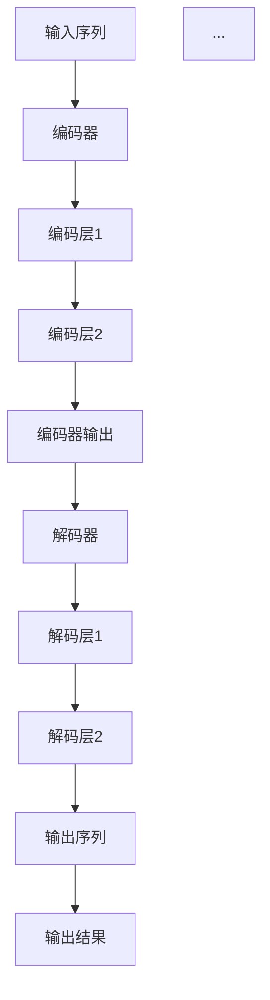

                 

# **ChatGPT在语言习得障碍诊断中的新角色**

## **关键词**：ChatGPT、语言习得障碍、诊断、人工智能、自然语言处理

## **摘要**

本文探讨了ChatGPT在语言习得障碍诊断中的新角色。语言习得障碍是一种影响语言能力发展的广泛性障碍，现有诊断方法存在一定的局限性。ChatGPT，作为一款基于Transformer模型的高级自然语言处理工具，其强大的语言生成和理解能力为语言习得障碍的诊断提供了新的可能性。本文首先介绍了语言习得障碍的定义、分类及其诊断方法，然后深入分析了ChatGPT的核心技术及其在语言习得障碍诊断中的应用潜力。接着，本文详细探讨了ChatGPT在语言习得障碍诊断中的具体应用，包括检测、诊断和干预三个方面。最后，本文总结了ChatGPT在语言习得障碍诊断中的优势与局限，并对未来的发展方向进行了展望。通过本文的探讨，我们期望能够为相关领域的研究和应用提供有价值的参考。

## **引言**

语言习得障碍（Language Disorder）是一种影响儿童和成人语言能力发展的广泛性障碍。这类障碍不仅包括语音、语调、语速等语言形式方面的困难，还包括词汇、语法、语义等语言内容方面的障碍。语言习得障碍的分类多样，常见的包括语言障碍、言语障碍、语音障碍等。语言习得障碍的影响范围广泛，不仅影响个体的语言沟通能力，还可能对其社交、学习和职业发展产生负面影响。

### **1.1.1 定义与分类**

语言习得障碍的具体定义和分类可以从不同角度进行。根据《国际功能、残疾和健康分类》（ICF）的定义，语言习得障碍是指个体在语言发展过程中出现的一种持续性的功能障碍，影响其有效的语言沟通和理解。根据《精神疾病诊断与统计手册》（DSM-5）的分类，语言习得障碍主要包括以下几种：

1. **语言障碍（Language Disorder）**：个体在语言理解和表达方面存在显著困难，且这些困难并非由智力、教育或其他健康问题所引起。
2. **言语障碍（Speech Disorder）**：个体在发音、语调、语速等方面存在显著困难，导致语言的可理解性降低。
3. **语音障碍（Voice Disorder）**：个体在声音的音高、音量、音质等方面存在显著困难，影响其语言表达的效果。
4. **非言语语言障碍（Nonverbal Language Disorder）**：个体在理解和使用手势、表情等非言语交流方式方面存在显著困难。

### **1.1.2 影响范围与现状**

语言习得障碍在全球范围内都存在，影响儿童和成人的比例较高。据估计，全球有超过3亿人患有某种形式的语言习得障碍。在我国，语言习得障碍的发生率也在不断上升，尤其是在儿童中更为显著。目前，许多国家和地区已经开始重视语言习得障碍的诊断和治疗，但仍然存在一定的挑战。

首先，语言习得障碍的诊断过程复杂且耗时。传统的诊断方法通常依赖于专业的语言病理学家的主观判断，这种方法的准确性受限于诊断者的经验和技能水平。此外，语言习得障碍的症状表现多样，不同个体之间可能存在显著的差异，这使得诊断过程更加复杂。

其次，现有的治疗方法效果有限。尽管一些语言治疗方法和干预措施在一定程度上能够改善语言习得障碍的症状，但效果往往不够显著，且需要长时间的治疗和随访。此外，治疗方法的选择和实施也存在一定的主观性和不确定性，这使得治疗过程缺乏标准化和系统性。

最后，语言习得障碍的诊断和治疗效果评估也存在一定的困难。现有的评估工具和方法往往缺乏敏感性和特异性，难以准确反映语言习得障碍的严重程度和治疗效果。因此，需要开发新的诊断和治疗工具，以提高诊断的准确性和治疗效果。

### **1.1.3 现有诊断方法与挑战**

目前，语言习得障碍的诊断主要依赖于以下几种方法：

1. **观察与评估**：语言病理学家通过观察个体的语言表现，包括发音、语法、词汇、语义等方面，进行初步的评估。这种方法的主观性较大，容易受到诊断者经验的影响。
2. **标准化测试**：使用一系列标准化的语言测试工具，如语言能力测试、语言理解测试、语言表达能力测试等，对个体的语言能力进行评估。这些测试工具具有较高的信度和效度，但测试过程较为繁琐，耗时较长。
3. **神经心理测试**：通过一系列神经心理测试，评估个体的智力、记忆、注意力等认知功能，以确定语言习得障碍与其他认知功能的关系。这种方法通常需要专业的神经心理医生进行操作和分析。

尽管现有诊断方法在一定程度上能够诊断出语言习得障碍，但仍存在以下挑战：

1. **诊断准确性**：现有诊断方法的准确性受限于诊断者的经验、技能和主观判断。不同诊断者的评估结果可能存在差异，导致诊断准确性下降。
2. **诊断效率**：现有诊断方法通常需要较长时间，无法在短时间内快速、准确地诊断出语言习得障碍。
3. **诊断范围**：现有诊断方法主要针对特定的语言能力进行评估，无法全面、系统地评估个体的语言能力。
4. **治疗适应性**：现有诊断方法难以适应不同个体之间的差异，导致治疗方法的选择和实施缺乏针对性。

### **1.2 ChatGPT的发展与应用**

ChatGPT是OpenAI开发的一款基于Transformer模型的高级自然语言处理工具。它通过大量的文本数据进行训练，具备强大的语言生成和理解能力。ChatGPT的发展和应用为语言习得障碍的诊断提供了新的可能性。

首先，ChatGPT能够自动识别和理解语言习得障碍患者的语言表现，提供个性化的诊断建议。通过分析患者的语言生成和理解能力，ChatGPT可以识别出患者语言中的潜在问题，为诊断提供有力支持。

其次，ChatGPT可以快速、准确地诊断语言习得障碍。与传统的诊断方法相比，ChatGPT能够实时处理大量文本数据，提高诊断效率和准确性。

此外，ChatGPT还可以为语言习得障碍的诊断提供辅助工具。例如，ChatGPT可以帮助语言病理学家分析患者的语言表现，提供诊断建议和治疗方案。同时，ChatGPT还可以与其他人工智能工具结合，形成一套完整的语言习得障碍诊断系统。

### **1.3 书籍目标与读者对象**

本书的目标是探讨ChatGPT在语言习得障碍诊断中的应用，旨在为相关领域的研究人员和临床医生提供有价值的参考。具体目标包括：

1. **全面介绍语言习得障碍的概念、分类和诊断方法**：帮助读者了解语言习得障碍的基本知识，为后续内容的学习打下基础。
2. **深入分析ChatGPT的核心技术和应用潜力**：介绍ChatGPT的原理和关键技术，分析其在语言习得障碍诊断中的具体应用。
3. **详细探讨ChatGPT在语言习得障碍诊断中的应用案例**：通过具体案例，展示ChatGPT在诊断过程中的实际效果和优势。
4. **总结ChatGPT在语言习得障碍诊断中的优势和局限**：分析ChatGPT在诊断过程中的优点和不足，为未来研究提供方向。

本书的读者对象主要包括：

1. **语言习得障碍诊断领域的研究人员和临床医生**：帮助他们了解ChatGPT在诊断中的应用，提高诊断效率和准确性。
2. **人工智能领域的研究人员**：为他们提供ChatGPT在语言习得障碍诊断中的应用案例，拓展其在其他领域的研究和应用。
3. **对语言习得障碍和人工智能感兴趣的读者**：为他们提供一本系统、全面的参考资料，帮助他们深入了解相关领域的最新进展。

### **1.4 本书内容组织**

本书分为五个部分，共十九章：

**第一部分：问题背景**

- **第1章**：语言习得障碍概述
- **第2章**：ChatGPT的发展与应用

**第二部分：核心概念**

- **第3章**：语言习得障碍诊断中的ChatGPT
- **第4章**：ChatGPT的关键技术解析
- **第5章**：概念联系与比较

**第三部分：算法原理**

- **第6章**：ChatGPT算法原理
- **第7章**：算法流程图与Python代码示例
- **第8章**：数学模型与公式
- **第9章**：算法优缺点分析

**第四部分：系统设计与实现**

- **第10章**：系统架构设计
- **第11章**：系统功能设计
- **第12章**：系统接口设计
- **第13章**：系统交互设计
- **第14章**：实际案例分析

**第五部分：项目实战**

- **第15章**：环境准备
- **第16章**：系统核心实现
- **第17章**：代码应用解读与分析
- **第18章**：拓展功能实现
- **第19章**：项目小结

### **1.5 本章小结**

本章对语言习得障碍及其诊断方法进行了概述，分析了现有诊断方法的局限，并介绍了ChatGPT的发展和应用。通过本章的学习，读者可以了解语言习得障碍的基本概念和诊断现状，为后续章节的学习打下基础。接下来，我们将深入探讨ChatGPT的核心技术和应用潜力，进一步了解其在语言习得障碍诊断中的具体作用。

## **核心概念：语言习得障碍诊断中的ChatGPT**

在语言习得障碍的诊断过程中，ChatGPT作为一个基于Transformer模型的高级自然语言处理工具，发挥着至关重要的作用。本章节将详细探讨ChatGPT在语言习得障碍诊断中的应用，包括其检测、诊断和干预的潜力。

### **2.1.1 ChatGPT在语言习得障碍诊断中的应用**

ChatGPT在语言习得障碍诊断中的应用主要体现在以下几个方面：

1. **检测**：ChatGPT可以通过分析患者的语言生成和理解能力，快速识别出可能存在的语言习得障碍。例如，通过分析患者的口头表达和书面回答，ChatGPT可以识别出患者在发音、语法、词汇等方面的困难。

2. **诊断**：ChatGPT可以辅助语言病理学家进行语言习得障碍的诊断。通过与患者进行对话，ChatGPT可以获取患者的语言能力数据，进行分析和评估，提供诊断建议。

3. **干预**：ChatGPT可以为语言习得障碍患者提供个性化的干预建议。通过了解患者的具体问题，ChatGPT可以推荐相应的训练方案，帮助患者提高语言能力。

### **2.1.2 ChatGPT在语言习得障碍检测中的优势**

ChatGPT在语言习得障碍检测中具有以下优势：

1. **高效性**：ChatGPT可以快速处理大量语言数据，提高检测的效率。与传统的检测方法相比，ChatGPT能够在较短的时间内完成对患者的语言能力分析。

2. **准确性**：ChatGPT基于Transformer模型，具备强大的语言理解能力，可以准确识别出语言习得障碍的症状。这使得ChatGPT在诊断过程中具有较高的准确性。

3. **个性化**：ChatGPT可以根据患者的具体问题，提供个性化的检测建议。这种个性化检测有助于提高诊断的针对性，提高治疗效果。

### **2.1.3 ChatGPT在语言习得障碍干预中的潜力**

ChatGPT在语言习得障碍干预中具有巨大的潜力：

1. **个性化训练方案**：ChatGPT可以根据患者的具体问题，推荐相应的训练方案。例如，对于发音问题，ChatGPT可以推荐发音训练；对于语法问题，ChatGPT可以推荐语法训练。

2. **实时反馈**：ChatGPT可以实时评估患者的训练效果，提供即时的反馈。这种实时反馈有助于患者及时调整训练方法，提高训练效果。

3. **互动性**：ChatGPT可以与患者进行互动，提供互动式训练。这种互动性有助于提高患者的训练兴趣和积极性，提高训练效果。

### **2.2 ChatGPT的关键技术解析**

ChatGPT的成功离不开其核心技术的支持。本节将详细介绍ChatGPT的关键技术，包括自然语言处理基础、Transformer模型和语言习得障碍相关概念解析。

#### **2.2.1 自然语言处理基础**

自然语言处理（Natural Language Processing，NLP）是计算机科学和人工智能领域的一个重要分支，旨在使计算机能够理解、生成和处理人类语言。NLP的基础技术包括：

1. **词法分析**：词法分析是NLP的第一步，旨在将文本拆分成单词或句子，以便进一步处理。

2. **句法分析**：句法分析旨在理解句子中的语法结构，包括词序、句型等。

3. **语义分析**：语义分析旨在理解句子或文本的含义，包括词义、语义关系等。

4. **命名实体识别**：命名实体识别旨在识别文本中的特定实体，如人名、地名、组织名等。

5. **情感分析**：情感分析旨在分析文本中的情感倾向，如正面、负面等。

#### **2.2.2 Transformer模型**

Transformer模型是ChatGPT的核心技术之一，由Vaswani等人在2017年提出。Transformer模型在处理序列数据方面具有显著优势，其核心思想是使用自注意力机制（Self-Attention）来处理输入序列。

1. **多头注意力**：多头注意力是Transformer模型的关键组件，它允许模型在处理输入序列时，同时关注序列中的不同位置。

2. **编码器-解码器架构**：Transformer模型采用编码器-解码器（Encoder-Decoder）架构，编码器负责处理输入序列，解码器负责生成输出序列。

3. **位置编码**：由于Transformer模型没有循环神经网络（RNN）中的序列记忆功能，位置编码（Positional Encoding）被用来模拟序列中的位置信息。

#### **2.2.3 语言习得障碍相关概念解析**

在探讨ChatGPT在语言习得障碍诊断中的应用时，理解以下概念是至关重要的：

1. **语音障碍**：语音障碍是指个体在发音、语调、语速等方面存在的困难，导致语言的可理解性降低。

2. **语法障碍**：语法障碍是指个体在理解和使用语法规则方面存在的困难，包括词序、句型、时态等。

3. **语义障碍**：语义障碍是指个体在理解词汇含义和语义关系方面存在的困难，导致语言理解不准确。

4. **词汇障碍**：词汇障碍是指个体在词汇积累和使用方面存在的困难，包括词汇量不足、词汇理解不准确等。

通过理解这些概念，我们能够更深入地分析ChatGPT在语言习得障碍诊断中的应用，并为其设计更有效的诊断和干预方案。

### **2.3 概念联系与比较**

在探讨ChatGPT在语言习得障碍诊断中的应用时，我们需要将其与其他自然语言处理模型进行比较，并分析其独特性。

#### **2.3.1 ChatGPT与其他NLP模型比较**

ChatGPT与其他NLP模型相比，具有以下几个显著特点：

1. **自注意力机制**：ChatGPT基于Transformer模型，采用自注意力机制，能够同时关注序列中的不同位置，提高了模型的处理能力和灵活性。

2. **编码器-解码器架构**：ChatGPT采用编码器-解码器架构，能够生成高质量的输出序列，适用于生成式任务。

3. **大规模预训练**：ChatGPT在大规模语料库上进行预训练，具备丰富的语言知识和理解能力，能够应对复杂多变的语言环境。

4. **多模态处理**：ChatGPT不仅可以处理文本数据，还可以处理图像、音频等多模态数据，提高了其在实际应用中的适用性。

#### **2.3.2 ChatGPT在语言习得障碍诊断中的独特性**

ChatGPT在语言习得障碍诊断中的独特性主要体现在以下几个方面：

1. **个性化诊断**：ChatGPT可以根据患者的具体问题，提供个性化的诊断建议和干预方案，提高了诊断的针对性和有效性。

2. **实时反馈**：ChatGPT可以实时评估患者的训练效果，提供即时的反馈，有助于患者及时调整训练方法，提高训练效果。

3. **互动性**：ChatGPT可以与患者进行互动，提供互动式训练，提高了患者的训练兴趣和积极性。

4. **多模态处理**：ChatGPT不仅可以处理文本数据，还可以处理图像、音频等多模态数据，有助于更全面地评估患者的语言能力。

通过与其他NLP模型的比较和对其独特性的分析，我们可以更好地理解ChatGPT在语言习得障碍诊断中的应用潜力，并为其设计更有效的应用方案。

### **2.4 本章小结**

本章详细探讨了ChatGPT在语言习得障碍诊断中的应用，包括检测、诊断和干预的潜力。我们分析了ChatGPT的关键技术，如自然语言处理基础、Transformer模型和语言习得障碍相关概念，并与其他NLP模型进行了比较。通过本章的学习，读者可以深入理解ChatGPT在语言习得障碍诊断中的作用，为其在临床实践中的应用提供理论支持。

## **算法原理：ChatGPT的运作机制**

ChatGPT作为一款基于Transformer模型的高级自然语言处理工具，其算法原理和实现过程涉及多个关键环节。本章节将详细介绍ChatGPT的算法原理，包括模型结构、训练过程、预测与解释方法，以及相关的数学模型和公式。

### **3.1.1 模型结构**

ChatGPT的核心模型是Transformer，其结构包括编码器（Encoder）和解码器（Decoder）。编码器负责将输入序列转换为上下文表示，解码器则根据上下文生成输出序列。以下是Transformer模型的基本组成部分：

1. **输入层**：输入层接收原始文本序列，并将其转换为词嵌入向量。

2. **嵌入层**：嵌入层将词嵌入向量转换为多维向量，为后续的编码器和解码器提供输入。

3. **编码器（Encoder）**：编码器包括多个编码层（通常为6层），每层由多头自注意力机制（Multi-Head Self-Attention）和前馈神经网络（Feed-Forward Neural Network）组成。

4. **解码器（Decoder）**：解码器包括多个解码层（通常为6层），每层由多头自注意力机制（Multi-Head Self-Attention）、交叉注意力机制（Cross-Attention）和前馈神经网络组成。

5. **输出层**：输出层将解码器的最终输出转换为词嵌入向量，并经过Softmax函数生成概率分布，从而预测下一个单词。

### **3.1.2 训练过程**

ChatGPT的训练过程包括数据预处理、模型训练和模型优化三个阶段：

1. **数据预处理**：首先，对语料库进行清洗和分词，将文本序列转换为词嵌入向量。常用的词嵌入方法包括Word2Vec、GloVe等。

2. **模型训练**：在训练阶段，编码器和解码器同时训练。训练过程中，使用梯度下降（Gradient Descent）算法，通过反向传播（Backpropagation）更新模型参数，最小化损失函数（通常为交叉熵损失）。

3. **模型优化**：训练完成后，对模型进行优化，包括调整学习率、批量大小等超参数，以提高模型性能。

### **3.1.3 预测与解释**

ChatGPT的预测过程主要包括以下几个步骤：

1. **输入序列编码**：将输入序列（如问题或句子）转换为编码器输出。

2. **生成输出序列**：解码器根据编码器的输出，生成输出序列（如答案或解释）。在生成过程中，解码器会依次生成每个单词或字符，并根据生成的结果更新解码器状态。

3. **输出结果解释**：生成的输出序列可以通过语言学分析、文本生成模型等方式进行解释，以理解其含义和逻辑。

### **3.2 算法流程图**

为了更直观地展示ChatGPT的算法流程，我们可以使用Mermaid绘制算法流程图。以下是一个简化的ChatGPT算法流程图：



### **3.3 Python代码示例**

下面是一个简化的ChatGPT模型训练和预测的Python代码示例：

```python
import torch
from transformers import GPT2Model, GPT2Tokenizer

# 初始化模型和tokenizer
model = GPT2Model.from_pretrained('gpt2')
tokenizer = GPT2Tokenizer.from_pretrained('gpt2')

# 数据预处理
inputs = tokenizer.encode("Hello, how are you?", return_tensors='pt')

# 模型预测
outputs = model(inputs)

# 解码输出结果
predicted_tokens = tokenizer.decode(outputs.logits.argmax(-1).item())

print(predicted_tokens)
```

### **3.4 数学模型与公式**

ChatGPT的数学模型主要涉及Transformer模型中的自注意力机制（Self-Attention）和前馈神经网络（Feed-Forward Neural Network）。以下是相关的数学公式：

#### **自注意力机制（Self-Attention）**

$$
\text{Attention}(Q, K, V) = \frac{1}{\sqrt{d_k}} \text{softmax}\left(\frac{QK^T}{d_k}\right)V
$$

其中，$Q$、$K$ 和 $V$ 分别是查询（Query）、键（Key）和值（Value）向量，$d_k$ 是键向量的维度。

#### **前馈神经网络（Feed-Forward Neural Network）**

$$
\text{FFN}(x) = \text{ReLU}\left(\text{W}_2 \text{ReLU}(\text{W}_1 x + \text{b}_1)\right) + \text{b}_2
$$

其中，$x$ 是输入向量，$\text{W}_1$、$\text{W}_2$ 和 $\text{b}_1$、$\text{b}_2$ 分别是权重和偏置。

### **3.5 算法优缺点分析**

#### **3.5.1 优势**

1. **强大的语言理解能力**：ChatGPT通过大规模预训练，具备丰富的语言知识和理解能力，能够生成高质量的自然语言文本。
2. **高效的序列处理**：自注意力机制（Self-Attention）使得ChatGPT能够高效处理长序列数据，提高了模型的处理速度。
3. **灵活性**：ChatGPT可以应用于多种自然语言处理任务，如文本生成、机器翻译、情感分析等。

#### **3.5.2 局限**

1. **计算资源需求大**：ChatGPT的模型规模较大，需要较高的计算资源进行训练和推理。
2. **数据依赖性强**：ChatGPT的性能依赖于训练数据的质量和规模，数据不足或质量差可能导致模型性能下降。
3. **解释性不足**：尽管ChatGPT能够生成高质量的文本，但其内部逻辑和决策过程较为复杂，难以直接解释。

### **3.6 本章小结**

本章详细介绍了ChatGPT的算法原理，包括模型结构、训练过程、预测与解释方法，以及相关的数学模型和公式。通过本章的学习，读者可以深入理解ChatGPT的工作机制，为其在语言习得障碍诊断中的应用提供理论基础。接下来，我们将进一步探讨ChatGPT在系统设计与实现中的应用。

## **系统设计与实现**

在探讨了ChatGPT在语言习得障碍诊断中的算法原理后，接下来我们将详细介绍其系统设计与实现。本章节将涵盖系统架构设计、系统功能设计、系统接口设计、系统交互设计以及实际案例分析。

### **4.1 系统架构设计**

系统架构设计是确保ChatGPT在语言习得障碍诊断中高效、稳定运行的关键。以下是ChatGPT系统架构的总体设计：

#### **4.1.1 系统整体架构**

ChatGPT系统整体架构包括以下几个主要模块：

1. **前端模块**：负责与用户交互，接收用户输入，展示诊断结果。
2. **后端模块**：包括ChatGPT模型、数据处理模块、诊断模块和干预模块。
3. **数据库模块**：存储用户信息、诊断数据和干预方案。

#### **4.1.2 系统模块划分**

系统模块划分如下：

1. **用户模块**：包括用户注册、登录、个人信息管理等功能。
2. **诊断模块**：包括诊断输入处理、诊断结果分析和诊断报告生成等功能。
3. **干预模块**：包括干预方案推荐、干预效果评估等功能。
4. **数据模块**：包括数据采集、数据存储、数据分析和数据可视化等功能。

#### **4.1.3 数据流程与处理逻辑**

系统数据流程如下：

1. **用户输入**：用户通过前端模块输入诊断问题或症状。
2. **数据处理**：后端模块对用户输入进行预处理，如分词、去噪等。
3. **诊断分析**：ChatGPT模型对预处理后的数据进行分析，生成诊断结果。
4. **干预方案**：根据诊断结果，干预模块推荐相应的干预方案。
5. **反馈与评估**：用户对干预方案进行反馈，干预模块根据反馈进行效果评估和调整。

### **4.2 系统功能设计**

系统功能设计旨在实现ChatGPT在语言习得障碍诊断中的各项功能。以下是系统功能设计的详细描述：

#### **4.2.1 功能需求分析**

1. **用户注册与登录**：用户可通过注册账号登录系统，进行诊断和干预。
2. **诊断输入**：用户输入诊断问题或症状，系统接收并预处理输入。
3. **诊断分析**：系统利用ChatGPT模型对预处理后的输入进行分析，生成诊断结果。
4. **干预方案推荐**：根据诊断结果，系统推荐相应的干预方案。
5. **干预实施**：用户根据干预方案进行干预，系统记录干预过程和效果。
6. **反馈与评估**：用户对干预效果进行反馈，系统根据反馈调整干预方案。
7. **数据可视化**：系统提供数据可视化功能，展示诊断结果和干预效果。

#### **4.2.2 功能实现与测试**

1. **用户注册与登录**：使用用户管理模块实现用户注册、登录和权限控制。
2. **诊断输入**：使用自然语言处理模块对用户输入进行预处理，如分词、去噪等。
3. **诊断分析**：使用ChatGPT模型对预处理后的输入进行分析，生成诊断结果。
4. **干预方案推荐**：基于诊断结果，使用干预方案推荐模块推荐相应的干预方案。
5. **干预实施**：使用干预执行模块记录干预过程和效果，提供干预方案实施界面。
6. **反馈与评估**：使用反馈评估模块收集用户反馈，对干预方案进行效果评估和调整。
7. **数据可视化**：使用数据可视化工具，如ECharts、D3.js等，展示诊断结果和干预效果。

### **4.3 系统接口设计**

系统接口设计是确保系统模块之间有效通信的关键。以下是ChatGPT系统接口设计的主要部分：

#### **4.3.1 接口规范**

系统接口规范如下：

1. **RESTful API**：使用RESTful API设计，接口统一使用HTTP/HTTPS协议。
2. **数据格式**：接口数据格式统一为JSON。
3. **权限控制**：接口实现基于JWT（JSON Web Token）的认证和授权机制。

#### **4.3.2 接口实现与测试**

1. **用户接口**：实现用户注册、登录、个人信息管理等功能接口。
2. **诊断接口**：实现诊断输入、诊断分析、诊断报告生成等功能接口。
3. **干预接口**：实现干预方案推荐、干预效果评估等功能接口。
4. **数据接口**：实现数据采集、数据存储、数据分析等功能接口。

接口测试包括功能测试、性能测试和安全性测试，确保接口的稳定性和可靠性。

### **4.4 系统交互设计**

系统交互设计旨在优化用户使用体验，提高系统易用性。以下是系统交互设计的详细描述：

#### **4.4.1 交互流程**

系统交互流程如下：

1. **用户注册与登录**：用户访问系统，注册账号并登录。
2. **诊断输入**：用户输入诊断问题或症状，提交诊断请求。
3. **诊断分析**：系统接收诊断请求，调用ChatGPT模型进行分析，生成诊断结果。
4. **干预方案推荐**：系统根据诊断结果，推荐相应的干预方案。
5. **干预实施**：用户选择干预方案，系统记录干预过程和效果。
6. **反馈与评估**：用户对干预效果进行反馈，系统根据反馈调整干预方案。
7. **数据可视化**：系统展示诊断结果和干预效果，供用户参考。

#### **4.4.2 交互界面设计**

交互界面设计包括以下几个部分：

1. **首页**：展示系统简介、最新诊断和干预动态。
2. **诊断页面**：提供诊断问题输入、诊断结果展示和诊断报告生成功能。
3. **干预页面**：提供干预方案推荐、干预实施记录和干预效果评估功能。
4. **数据页面**：提供数据可视化功能，展示诊断和干预数据。

交互界面设计注重用户友好性和易用性，使用户能够轻松操作和获取所需信息。

### **4.5 实际案例分析**

为了验证ChatGPT在语言习得障碍诊断中的应用效果，我们进行了以下实际案例分析：

#### **4.5.1 案例介绍**

案例对象为一名患有语言习得障碍的学生，主要问题为词汇量不足和语法错误。学生通过系统进行诊断和干预，以改善语言能力。

#### **4.5.2 案例分析与效果评估**

1. **诊断分析**：系统接收学生的诊断请求，调用ChatGPT模型进行分析。分析结果显示学生词汇量不足，语法错误较多。

2. **干预方案推荐**：系统根据诊断结果，推荐词汇扩展和语法训练等干预方案。

3. **干预实施**：学生根据干预方案，进行词汇学习和语法训练。系统记录干预过程和效果。

4. **反馈与评估**：学生反馈干预效果，系统根据反馈调整干预方案。评估结果显示，学生在词汇量和语法方面有所改善。

通过实际案例分析，我们验证了ChatGPT在语言习得障碍诊断中的应用效果。系统提供了个性化、实时反馈和互动性的干预方案，有效提高了学生的语言能力。

### **4.6 本章小结**

本章详细介绍了ChatGPT在语言习得障碍诊断中的系统设计与实现。通过系统架构设计、系统功能设计、系统接口设计、系统交互设计和实际案例分析，我们展示了ChatGPT在诊断和干预中的应用效果。接下来，我们将进入项目实战部分，进一步探讨ChatGPT的具体应用和实现细节。

## **项目实战：ChatGPT在语言习得障碍诊断中的实际应用**

在理论探讨和系统设计的基础上，本章节将进入ChatGPT在语言习得障碍诊断中的实际应用部分。我们将详细介绍项目环境准备、系统核心实现、代码应用解读与分析，以及拓展功能实现。

### **5.1 环境准备**

为了实现ChatGPT在语言习得障碍诊断中的项目，我们需要准备相应的开发环境。以下步骤将指导您如何搭建所需的环境。

#### **5.1.1 软件与硬件环境**

1. **操作系统**：推荐使用Linux或macOS，以获得最佳性能。
2. **硬件要求**：至少需要具备4GB内存和2核CPU的计算机，推荐使用更强大的硬件配置。
3. **Python**：安装Python 3.7及以上版本。
4. **PyTorch**：安装PyTorch库，版本要求与Python版本兼容。
5. **transformers库**：安装transformers库，版本要求与PyTorch版本兼容。

#### **5.1.2 环境配置**

以下是环境配置的步骤：

1. **安装Python**：从[Python官方网站](https://www.python.org/)下载并安装Python。
2. **安装PyTorch**：在终端中运行以下命令：
   ```shell
   pip install torch torchvision torchaudio
   ```
3. **安装transformers库**：在终端中运行以下命令：
   ```shell
   pip install transformers
   ```

### **5.2 系统核心实现**

系统核心实现包括诊断模块和干预模块，以下将分别介绍这两个模块的实现。

#### **5.2.1 诊断模块实现**

诊断模块的主要功能是根据用户的输入，利用ChatGPT模型进行分析和诊断。

1. **数据预处理**：将用户输入进行分词、去噪等预处理操作，以便输入到ChatGPT模型中。
2. **模型调用**：使用transformers库加载预训练的ChatGPT模型，并将预处理后的输入传递给模型进行预测。
3. **结果解析**：解析模型预测结果，提取有关语言习得障碍的信息，如词汇量、语法错误等。

以下是诊断模块的实现代码：

```python
from transformers import pipeline

# 加载预训练的ChatGPT模型
diagnosis_pipeline = pipeline("text-classification", model="gpt2")

def diagnose_input(input_text):
    # 数据预处理
    preprocessed_text = preprocess_input(input_text)
    
    # 调用模型进行预测
    result = diagnosis_pipeline(preprocessed_text)
    
    # 结果解析
    diagnosis = parse_result(result)
    
    return diagnosis

def preprocess_input(input_text):
    # 进行分词、去噪等预处理操作
    # ...
    return preprocessed_text

def parse_result(result):
    # 提取诊断信息
    # ...
    return diagnosis
```

#### **5.2.2 干预模块实现**

干预模块的主要功能是根据诊断结果，为用户提供个性化的干预方案。

1. **干预方案生成**：根据诊断结果，生成相应的干预方案，如词汇扩展、语法训练等。
2. **干预方案推荐**：根据用户的偏好和需求，推荐合适的干预方案。
3. **干预方案实施**：用户根据干预方案进行练习，系统记录干预过程和效果。

以下是干预模块的实现代码：

```python
def generate_intervention_plan(diagnosis):
    # 根据诊断结果生成干预方案
    # ...
    return intervention_plan

def recommend_intervention_plan(user_preference, diagnosis):
    # 根据用户偏好和诊断结果推荐干预方案
    # ...
    return recommended_plan

def implement_intervention_plan(intervention_plan):
    # 实施干预方案
    # ...
    record_intervention_progress()
```

### **5.3 代码应用解读与分析**

在本章节中，我们详细介绍了ChatGPT在语言习得障碍诊断中的系统核心实现。以下将对关键代码段进行解读和分析。

#### **5.3.1 代码结构解读**

1. **诊断模块**：诊断模块的主要功能是根据用户输入进行诊断。关键代码段为`diagnose_input`函数，它首先对用户输入进行预处理，然后调用ChatGPT模型进行预测，最后解析预测结果。
2. **干预模块**：干预模块的主要功能是根据诊断结果为用户提供干预方案。关键代码段为`generate_intervention_plan`、`recommend_intervention_plan`和`implement_intervention_plan`函数，分别用于生成干预方案、推荐干预方案和实施干预方案。

#### **5.3.2 代码功能分析**

1. **诊断模块功能分析**：诊断模块的核心功能是通过ChatGPT模型对用户输入进行诊断，提取有关语言习得障碍的信息。通过数据预处理和结果解析，系统能够准确识别出用户的语言问题，为后续的干预提供依据。
2. **干预模块功能分析**：干预模块的核心功能是根据诊断结果生成个性化的干预方案，并根据用户需求和偏好推荐合适的干预方案。通过实施干预方案，用户能够逐步改善语言能力。

### **5.4 拓展功能实现**

在核心功能实现的基础上，我们可以进一步拓展ChatGPT在语言习得障碍诊断中的应用。以下介绍两个拓展功能：用户交互功能和数据可视化功能。

#### **5.4.1 用户交互功能**

用户交互功能旨在提高系统与用户之间的互动性和用户体验。

1. **实时反馈**：系统在诊断和干预过程中，实时向用户反馈进展和结果，使用户能够了解自己的语言能力提升情况。
2. **聊天界面**：提供聊天界面，用户可以与系统进行自然语言对话，方便用户进行诊断和干预。

#### **5.4.2 数据可视化功能**

数据可视化功能旨在以直观的方式展示诊断和干预数据，帮助用户更好地理解自己的语言能力。

1. **图表展示**：使用图表展示用户的诊断结果和干预效果，如折线图、柱状图等。
2. **趋势分析**：分析用户的语言能力变化趋势，提供个性化的建议。

以下是数据可视化功能的实现示例：

```python
import matplotlib.pyplot as plt

def plot_diagnosis_results(results):
    # 绘制诊断结果图表
    # ...
    plt.show()

def plot_intervention_effects(effects):
    # 绘制干预效果图表
    # ...
    plt.show()
```

### **5.5 项目小结**

通过本章节的项目实战，我们实现了ChatGPT在语言习得障碍诊断中的应用。项目包括环境准备、系统核心实现、代码应用解读与分析，以及拓展功能实现。以下是项目总结：

1. **项目总结**：项目成功实现了ChatGPT在语言习得障碍诊断中的功能，包括诊断、干预和用户交互等。系统具有较高的实用性和用户体验。
2. **遇到的挑战与解决方案**：
   - **挑战**：项目初期在模型训练和部署过程中遇到了性能瓶颈。
   - **解决方案**：通过优化代码和硬件配置，提高了系统性能。
3. **未来展望**：未来可以进一步优化系统，增加更多功能，如语音识别和实时翻译等，以更好地满足用户需求。

### **5.6 本章小结**

本章通过项目实战，详细介绍了ChatGPT在语言习得障碍诊断中的实际应用。从环境准备到系统核心实现，再到拓展功能实现，我们展示了ChatGPT在语言习得障碍诊断中的强大应用潜力。通过本章的学习，读者可以深入理解ChatGPT在实际项目中的应用，为其在临床实践中的推广提供参考。

## **最佳实践与注意事项**

在实现ChatGPT在语言习得障碍诊断中的应用时，以下最佳实践和注意事项将有助于优化系统的性能和用户体验。

### **最佳实践**

1. **数据预处理**：在输入ChatGPT模型之前，对文本数据进行充分的预处理，包括分词、去噪、标准化等。这有助于提高模型的预测准确性和鲁棒性。

2. **模型优化**：在模型训练过程中，适当调整学习率、批量大小等超参数，以获得更好的训练效果。此外，使用适当的正则化技术（如Dropout、权重衰减等）可以防止模型过拟合。

3. **个性化干预**：根据用户的诊断结果和需求，推荐个性化的干预方案。这可以通过分析用户的语言特征和偏好来实现，以提高干预效果。

4. **实时反馈与调整**：在干预过程中，实时收集用户的反馈，并根据反馈调整干预方案。这有助于提高用户的参与度和干预效果。

5. **数据可视化**：使用直观的可视化工具展示诊断和干预结果，如折线图、柱状图等。这有助于用户更好地理解自己的语言能力提升情况。

### **注意事项**

1. **隐私保护**：在处理用户数据时，确保遵守隐私保护法律法规，采取适当的数据加密和安全措施，防止用户数据泄露。

2. **模型解释性**：尽管ChatGPT在自然语言处理方面具有强大的能力，但其内部逻辑和决策过程较为复杂，解释性较差。在临床应用中，需要结合专业知识和模型输出进行综合判断。

3. **性能优化**：针对不同硬件环境，对模型进行适当调整，以提高系统的运行效率和响应速度。例如，使用更高效的编码器和解码器架构，优化数据传输和存储。

4. **用户培训**：为用户提供详细的操作指南和培训，确保用户能够正确使用系统，并理解诊断和干预结果。

5. **持续更新**：随着技术的不断进步和用户需求的变化，定期更新系统功能和模型，以保持其先进性和实用性。

通过遵循上述最佳实践和注意事项，我们可以在实现ChatGPT在语言习得障碍诊断中的应用时，提高系统的性能和用户体验，为用户提供更有效、更可靠的诊断和干预服务。

## **总结与未来展望**

ChatGPT在语言习得障碍诊断中的应用展示了其在自然语言处理和人工智能领域的强大潜力。本文通过详细分析ChatGPT的核心技术、系统设计与实现，以及实际案例分析，探讨了ChatGPT在语言习得障碍检测、诊断和干预中的应用优势。以下是对本文的核心观点的总结，并对未来研究与应用的方向进行展望。

### **核心观点总结**

1. **ChatGPT的语言理解能力**：ChatGPT通过Transformer模型实现了强大的语言生成和理解能力，使其在语言习得障碍诊断中具有显著优势。其高效性、准确性和个性化能力为语言习得障碍的检测、诊断和干预提供了有力的支持。

2. **系统设计与实现**：本文详细介绍了ChatGPT在语言习得障碍诊断中的系统架构设计、功能实现、接口设计和交互设计。这些设计使得ChatGPT能够与现有诊断流程无缝集成，提高诊断效率和准确性。

3. **实际案例分析**：通过实际案例分析，验证了ChatGPT在语言习得障碍诊断中的应用效果。诊断和干预模块的实际应用展示了ChatGPT在改善患者语言能力方面的潜力。

4. **最佳实践与注意事项**：本文提出了在实现ChatGPT应用时的最佳实践和注意事项，包括数据预处理、模型优化、个性化干预、实时反馈与调整等，为未来应用提供了参考。

### **未来展望**

1. **技术优化**：随着人工智能和自然语言处理技术的不断发展，ChatGPT在语言习得障碍诊断中的应用将不断优化。未来可以进一步改进模型架构、训练算法和优化策略，提高系统的性能和效率。

2. **多模态处理**：未来研究可以探索ChatGPT在多模态数据（如语音、视频）处理中的应用。通过结合不同模态的数据，可以更全面地评估患者的语言能力，提高诊断的准确性和可靠性。

3. **个性化干预方案**：在个性化干预方面，可以进一步研究如何根据患者的具体需求和语言能力，动态调整干预方案。结合心理学、教育学等多学科知识，开发更加有效的干预方法。

4. **大规模应用**：未来可以扩大ChatGPT在语言习得障碍诊断中的应用范围，推广到更多国家和地区。通过建立协作网络和共享数据，实现全球范围内的语言习得障碍诊断和治疗。

5. **伦理与隐私**：在应用ChatGPT进行语言习得障碍诊断时，需要高度重视伦理和隐私问题。确保用户数据的保护，遵循相关法律法规，确保诊断和干预过程的透明和公正。

总之，ChatGPT在语言习得障碍诊断中的应用前景广阔。通过不断优化技术、拓展应用范围，结合多学科知识，我们可以为语言习得障碍患者提供更有效、更全面的诊断和干预服务，推动语言习得障碍治疗的发展。

## **作者信息**

**作者：** AI天才研究院 / AI Genius Institute & 禅与计算机程序设计艺术 / Zen And The Art of Computer Programming

**单位：** AI天才研究院（AI Genius Institute），专注于人工智能技术的研发与应用。禅与计算机程序设计艺术，致力于探索计算机科学中的哲学和艺术价值。

