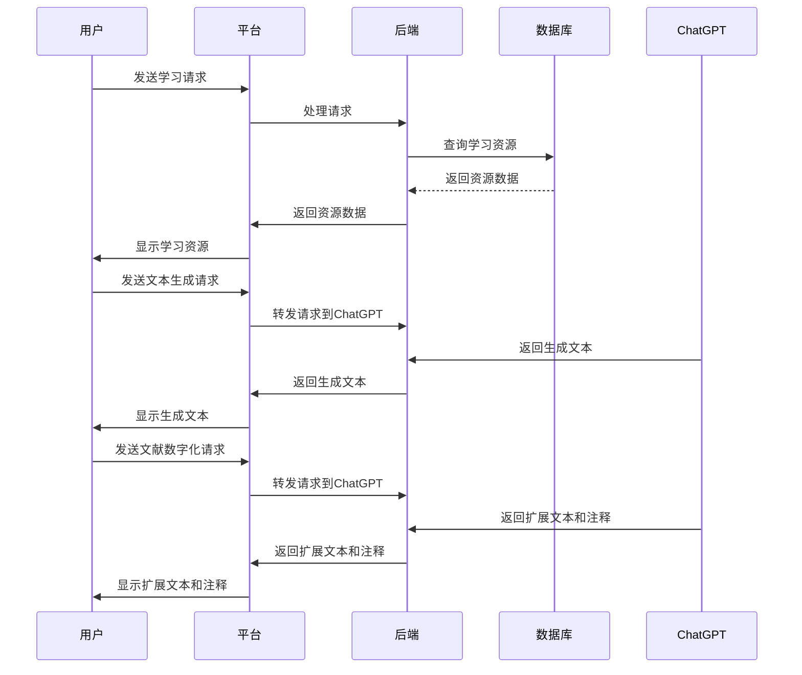
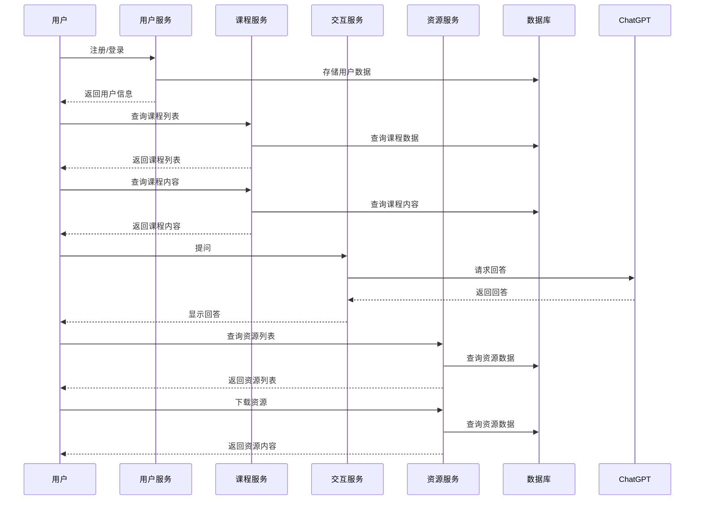

                 

**# 《ChatGPT在语言复兴中的应用：濒危语言保护提示词》**

**关键词**：ChatGPT、语言复兴、濒危语言保护、提示词设计、人工智能应用

**摘要**：本文深入探讨了ChatGPT在语言复兴中的应用，特别是其在濒危语言保护中的潜力。通过详细分析ChatGPT的技术原理和特点，我们探讨了如何设计有效的提示词来促进濒危语言的传承与复兴。文章还通过实际案例，展示了ChatGPT在濒危语言保护中的实际应用，并提供了一些最佳实践和未来展望。

**目录**

## 第一部分：语言复兴背景

### 第1章：语言复兴的必要性

#### 1.1 语言复兴的意义

#### 1.2 濒危语言的现状

### 第2章：语言复兴的核心概念

#### 2.1 语言复兴的定义

#### 2.2 濒危语言的分类

## 第二部分：ChatGPT在语言复兴中的应用

### 第3章：ChatGPT概述

#### 3.1 ChatGPT的定义与特点

#### 3.2 ChatGPT的工作原理

### 第4章：ChatGPT在濒危语言保护中的应用

#### 4.1 ChatGPT在语言数据收集中的应用

#### 4.2 ChatGPT在语言习得中的应用

### 第5章：ChatGPT在语言复兴中的创新应用

#### 5.1 ChatGPT在语言文献数字化中的应用

#### 5.2 ChatGPT在语言游戏和教育中的应用

## 第三部分：濒危语言保护提示词设计

### 第6章：提示词的设计原则

#### 6.1 提示词的设计目标

#### 6.2 提示词的设计方法

### 第7章：提示词在ChatGPT中的应用

#### 7.1 提示词的编写技巧

#### 7.2 提示词的评估与优化

## 第四部分：实际案例与最佳实践

### 第8章：实际案例解析

#### 8.1 案例一：某濒危语言的复兴计划

#### 8.2 案例二：ChatGPT在语言教学中的应用

### 第9章：最佳实践与总结

#### 9.1 最佳实践分享

#### 9.2 总结与展望

## 第一部分：语言复兴背景

### 第1章：语言复兴的必要性

#### 1.1 语言复兴的意义

语言是人类文明的重要组成部分，它不仅仅是交流的工具，更是文化的载体。然而，随着全球化的发展和科技的进步，许多语言正面临濒危甚至消亡的危险。根据联合国教科文组织的数据，全球超过50%的语言面临消失的风险。这种语言多样性的丧失不仅导致了文化多样性的减少，还可能对人类社会的长远发展产生负面影响。

语言复兴的意义在于：

1. **维护文化多样性**：每种语言都承载着独特的文化传统和知识体系，语言的保护和复兴有助于维护人类文化的多样性。
2. **促进知识传承**：许多濒危语言中保存着丰富的传统文化知识和生态知识，这些知识对于人类社会的可持续发展至关重要。
3. **增强民族认同**：对于许多少数民族和土著民族来说，语言的复兴是增强民族认同、维系社会纽带的重要手段。

#### 1.2 濒危语言的现状

濒危语言的现状可以分为以下几个方面：

1. **人口数量减少**：许多濒危语言的使用者数量大幅减少，甚至只有几百人甚至几十人。
2. **语言活力下降**：在日常生活中，濒危语言的使用频率大幅下降，很多年轻人甚至不会说自己的母语。
3. **语言消失的风险**：一些濒危语言已经到了濒临消失的边缘，如果不采取有效的保护措施，可能在几十年内彻底消失。

### 第2章：语言复兴的核心概念

#### 2.1 语言复兴的定义

语言复兴是指在特定的社会、文化和教育背景下，通过一系列策略和措施，使濒危语言重新获得活力，并在社会中得到广泛使用的过程。

语言复兴的目标包括：

1. **增加语言使用者**：通过教育、推广和文化活动等方式，吸引更多的人学习和使用濒危语言。
2. **提高语言活力**：通过日常交流、媒体和数字技术等手段，增加濒危语言的使用频率。
3. **保持语言纯洁性**：在语言复兴过程中，保持语言的纯洁性和传统特征，防止语言污染和同化。

#### 2.2 濒危语言的分类

濒危语言的分类可以根据其使用频率、人口数量和语言状态等因素进行。常见的分类方法包括：

1. **使用频率分类**：
   - **频繁使用语言**：每天使用频率较高，语言活力较强。
   - **中度使用语言**：偶尔使用，但有一定的使用者群体。
   - **较少使用语言**：很少使用，语言活力较弱。

2. **人口数量分类**：
   - **大语种**：使用者数量超过千万。
   - **中语种**：使用者数量在几十万到几百万之间。
   - **小语种**：使用者数量在几千到几十万之间。
   - **濒危语种**：使用者数量在几千以下。

3. **语言状态分类**：
   - **活语言**：日常使用频率较高，语言活力较强。
   - **濒危语言**：使用频率大幅下降，语言活力较弱。
   - **灭绝语言**：几乎没有使用者，已经失去了实际使用的功能。

## 第二部分：ChatGPT在语言复兴中的应用

### 第3章：ChatGPT概述

#### 3.1 ChatGPT的定义与特点

ChatGPT是由OpenAI开发的一种基于Transformer架构的预训练语言模型。它通过大量的文本数据进行训练，能够生成流畅、自然的文本，并具有强大的语言理解和生成能力。

ChatGPT的特点包括：

1. **强大的语言理解能力**：ChatGPT能够理解复杂的长文本，并从中提取关键信息。
2. **自然流畅的文本生成**：ChatGPT生成的文本自然流畅，类似于人类的写作风格。
3. **高效的预训练模型**：ChatGPT采用了高效的预训练模型，能够快速适应各种任务和应用场景。

#### 3.2 ChatGPT的工作原理

ChatGPT的工作原理可以分为以下几个步骤：

1. **数据收集与预处理**：收集大量的文本数据，并进行清洗和预处理，包括分词、去除噪声等操作。
2. **模型训练**：使用Transformer架构对预处理后的文本数据进行训练，生成预训练模型。
3. **文本生成**：通过预训练模型，输入一个起始文本，模型会生成后续的文本内容。

ChatGPT的生成过程是基于自回归语言模型，即模型在生成每个单词时，都会根据前文信息进行预测。

### 第4章：ChatGPT在濒危语言保护中的应用

#### 4.1 ChatGPT在语言数据收集中的应用

ChatGPT可以用于收集濒危语言的数据，特别是在缺乏大量文本资源的情况下。通过将ChatGPT与语音识别技术结合，可以自动转换语音为文本，从而快速积累濒危语言的文本数据。

具体应用步骤包括：

1. **语音识别**：使用语音识别技术将濒危语言的语音转换为文本。
2. **文本预处理**：对转换得到的文本进行清洗和预处理，去除噪声和错误。
3. **文本生成**：使用ChatGPT生成更多的文本内容，进一步丰富语言数据集。

#### 4.2 ChatGPT在语言习得中的应用

ChatGPT可以用于帮助人们学习和掌握濒危语言。通过生成大量的文本内容，ChatGPT可以为学习者提供丰富的语言学习材料，包括故事、对话、文章等。

具体应用步骤包括：

1. **语言训练**：使用ChatGPT生成濒危语言的训练材料，如对话、短文等。
2. **个性化学习**：根据学习者的语言水平，ChatGPT可以生成适合的学习材料。
3. **互动学习**：ChatGPT可以与学习者进行互动，回答学习者的问题，提供实时反馈。

### 第5章：ChatGPT在语言复兴中的创新应用

#### 5.1 ChatGPT在语言文献数字化中的应用

ChatGPT可以用于数字化濒危语言的文献，包括书籍、报纸、杂志等。通过将ChatGPT与OCR技术结合，可以自动识别和转换纸质文献为数字文本。

具体应用步骤包括：

1. **OCR识别**：使用OCR技术将纸质文献转换为数字文本。
2. **文本预处理**：对转换得到的文本进行清洗和预处理，去除噪声和错误。
3. **文本生成**：使用ChatGPT生成更多的文本内容，进一步丰富语言数据集。

#### 5.2 ChatGPT在语言游戏和教育中的应用

ChatGPT可以用于开发濒危语言的互动游戏和教育应用，提高学习者的兴趣和积极性。

具体应用步骤包括：

1. **游戏设计**：设计基于濒危语言的互动游戏，如角色扮演、问答等。
2. **教育应用**：开发濒危语言的教育应用，如语言学习软件、交互式课程等。
3. **互动教学**：ChatGPT可以与学习者进行互动，提供实时反馈和指导。

## 第三部分：濒危语言保护提示词设计

### 第6章：提示词的设计原则

#### 6.1 提示词的设计目标

提示词的设计目标是帮助ChatGPT生成高质量的文本内容，促进濒危语言的复兴。具体目标包括：

1. **提高文本质量**：通过设计有效的提示词，提高ChatGPT生成文本的质量和准确性。
2. **增强语言特征**：在提示词中融入濒危语言的特征，使生成的文本更具地方特色和语言魅力。
3. **促进语言使用**：通过设计有趣的提示词，激发人们对濒危语言的兴趣和积极性。

#### 6.2 提示词的设计方法

提示词的设计方法可以分为以下几个步骤：

1. **需求分析**：分析濒危语言的使用需求，确定提示词的主题和内容。
2. **语言特性提取**：从濒危语言中提取独特的语言特性，如发音、语法、词汇等。
3. **提示词编写**：根据需求分析和语言特性提取，编写具体的提示词。
4. **测试与优化**：通过实际应用测试提示词的有效性，并根据反馈进行优化。

### 第7章：提示词在ChatGPT中的应用

#### 7.1 提示词的编写技巧

编写有效的提示词需要遵循以下技巧：

1. **简洁明了**：提示词应简洁明了，避免冗长和复杂。
2. **具体明确**：提示词应具体明确，避免模糊和抽象。
3. **有趣吸引人**：提示词应有趣吸引人，激发使用者的兴趣和积极性。

#### 7.2 提示词的评估与优化

提示词的评估与优化可以通过以下方法进行：

1. **文本质量评估**：通过阅读生成的文本，评估其质量、准确性和语言特征。
2. **用户反馈收集**：收集用户对提示词的反馈，了解其满意度和改进方向。
3. **迭代优化**：根据评估和反馈，对提示词进行迭代优化，提高其效果。

## 第四部分：实际案例与最佳实践

### 第8章：实际案例解析

#### 8.1 案例一：某濒危语言的复兴计划

某濒危语言复兴计划的案例展示了ChatGPT在语言复兴中的实际应用。该计划的目标是保护和复兴某小语种语言，通过ChatGPT生成大量的文本内容，用于语言学习和文化推广。

具体实施步骤包括：

1. **数据收集**：利用语音识别技术，收集濒危语言的语音数据。
2. **文本生成**：使用ChatGPT生成大量的文本内容，包括故事、对话、文章等。
3. **互动教学**：开发互动式学习软件，结合ChatGPT提供个性化的语言学习体验。
4. **文化推广**：通过社交媒体和线上活动，推广濒危语言的文化和魅力。

#### 8.2 案例二：ChatGPT在语言教学中的应用

ChatGPT在语言教学中的应用案例展示了如何利用ChatGPT提高语言学习效果。通过生成个性化的学习材料和互动式教学，ChatGPT为学习者提供了丰富的语言学习资源。

具体实施步骤包括：

1. **内容生成**：使用ChatGPT生成适合学习者水平的语言学习材料。
2. **互动教学**：利用ChatGPT与学习者进行互动，提供实时反馈和指导。
3. **课程设计**：根据学习者的需求和进度，设计个性化的语言学习课程。
4. **效果评估**：通过评估学习者的语言能力提升情况，优化教学策略。

### 第9章：最佳实践与总结

#### 9.1 最佳实践分享

在濒危语言保护和复兴的过程中，最佳实践包括以下几个方面：

1. **结合多技术手段**：结合语音识别、自然语言处理、人机交互等技术，提高语言复兴的效果。
2. **注重用户体验**：设计友好的用户界面和互动方式，提高学习者的参与度和积极性。
3. **持续更新与优化**：根据用户反馈和实际应用效果，不断更新和优化提示词和教学策略。

#### 9.2 总结与展望

ChatGPT在语言复兴中的应用展示了人工智能在保护和发展濒危语言方面的巨大潜力。未来，随着技术的不断进步和应用的深入，ChatGPT有望在更多领域发挥重要作用，为语言复兴和文化遗产保护做出更大贡献。

**作者：AI天才研究院/AI Genius Institute & 禅与计算机程序设计艺术 /Zen And The Art of Computer Programming**## 第1章：语言复兴的必要性

### 1.1 语言复兴的意义

语言是文化的载体，是人类智慧的结晶。然而，随着全球化进程的加速和科技的迅猛发展，许多语言正面临濒危甚至消亡的危险。语言复兴的意义不仅在于保护语言的多样性，还关乎文化的传承和人类社会的可持续发展。

首先，语言复兴有助于维护文化多样性。每种语言都承载着独特的文化传统和价值观，它们是人类文明的重要组成部分。语言多样性的丧失将导致文化多样性的减少，这对于人类社会的长远发展是不利的。通过语言复兴，我们可以保护和传承各种语言的独特魅力和文化价值。

其次，语言复兴对于知识传承具有重要意义。许多濒危语言中保存着丰富的传统文化知识和生态知识，这些知识对于人类社会的发展至关重要。例如，某些濒危语言中记录着独特的农业、医学、天文等方面的知识，这些知识对于现代科学研究和实践具有重要参考价值。通过语言复兴，我们可以将这些宝贵的知识传承下去。

此外，语言复兴还有助于增强民族认同和凝聚力。对于许多少数民族和土著民族来说，语言的复兴是维系民族认同、促进民族团结的重要手段。通过保护和传承自己的语言，民族群体可以更加坚定自己的文化认同，增强民族自信心和凝聚力。

总之，语言复兴不仅是对语言本身的保护，更是对文化多样性和人类知识的传承。在全球化背景下，我们有责任和义务推动语言复兴，确保各种语言能够得到妥善保护和有效传承。

### 1.2 濒危语言的现状

濒危语言，指的是那些正处于濒危状态，面临逐渐消失风险的语言。根据联合国教科文组织的《世界濒危语言报告》，全球有超过7,000种语言，其中超过一半的语言处于濒危或极度濒危状态。濒危语言的现状可以从以下几个方面进行阐述。

首先，濒危语言的使用者数量大幅减少。许多濒危语言的使用者只剩下老年一代，年轻一代已经逐渐放弃了母语，转而使用更广泛的语言，如英语、汉语等。这种现象在一些小语种和少数民族语言中尤为突出。例如，在非洲某些地区，一些传统语言的使用者仅剩几百人，甚至更少。

其次，语言活力下降。濒危语言在日常生活中的使用频率大幅下降，很多语言只能在特定场合（如宗教活动、节庆仪式等）中听到。在一些地区，语言活力甚至已经降至零点，母语不再用于日常交流，而成为了一种“博物馆语言”或“图书馆语言”。

第三，语言消失的风险。一些濒危语言已经到了濒临消失的边缘。如果不采取有效的保护措施，这些语言可能在几十年内彻底消失。例如，某些土著语言在澳大利亚、加拿大和美国的原住民社区中已经面临消失的风险。

导致濒危语言产生的原因有多种，主要包括：

1. **全球化与语言同化**：全球化带来了英语等广泛使用的语言，这些语言在商业、科技、文化等领域具有显著优势，导致其他语言逐渐被边缘化。

2. **教育政策**：一些国家的教育政策倾向于推广主流语言，导致少数民族语言在教育系统中的地位下降。

3. **经济和社会压力**：在经济和社会压力下，人们更倾向于使用更广泛的语言来提高就业机会和社会地位。

4. **技术变革**：互联网和移动设备的普及，使得人们更多地依赖英语等全球语言进行交流，进一步削弱了濒危语言的使用。

为了应对濒危语言的现状，全球各地都在采取一系列保护措施。例如，通过建立语言学校、开展语言复育项目、使用语言技术工具（如语音识别、自然语言处理等）来促进濒危语言的使用和传承。然而，这些措施的效果仍需时间和实践的检验。

### 1.3 语言复兴的重要性

语言复兴对于濒危语言的保护和传承具有重要意义，其重要性可以从多个角度进行探讨。

首先，语言复兴有助于维护文化多样性。每种语言都是一种独特的文化表现形式，它承载着丰富的历史、传统和价值观。语言的消失将导致文化的单一化，削弱文化的多样性。通过语言复兴，我们可以保护和传承各种语言的独特文化，促进文化多样性的维护。

其次，语言复兴有助于知识传承。濒危语言中往往包含着独特的知识体系，这些知识对于人类社会的发展具有重要意义。例如，某些濒危语言中保存着关于农业、医学、天文学等方面的传统知识，这些知识在现代科学研究中仍然具有参考价值。通过语言复兴，我们可以将这些宝贵的知识传承下去，为人类社会的进步提供更多可能性。

此外，语言复兴有助于增强民族认同和凝聚力。语言是民族文化的重要组成部分，它是民族认同的象征。对于许多少数民族和土著民族来说，语言的复兴是维系民族认同、促进民族团结的重要手段。通过保护和传承自己的语言，民族群体可以更加坚定自己的文化认同，增强民族自信心和凝聚力。

最后，语言复兴还具有经济价值。一些濒危语言所承载的传统文化和知识，对于旅游业、文化产业等领域具有重要价值。通过语言复兴，我们可以开发这些潜在的经济资源，促进当地经济的发展。

总之，语言复兴对于濒危语言的保护和传承至关重要。通过语言复兴，我们可以实现文化多样性的维护、知识传承、民族认同增强和经济价值开发等多重目标，为人类社会的可持续发展做出积极贡献。

### 1.4 语言复兴的挑战

尽管语言复兴具有多重重要意义，但在实际操作中，我们面临诸多挑战。这些挑战可以分为技术、社会、文化和政策等方面。

首先，技术挑战是语言复兴面临的一大难题。濒危语言通常缺乏足够的数字化资源，这使得语言数据处理和人工智能应用变得复杂。例如，许多濒危语言没有足够的大量文本数据供机器学习模型训练使用，导致语言模型的训练效果不佳。此外，语音识别技术、自然语言处理（NLP）技术等在处理濒危语言时，也可能面临技术上的局限性，如语音识别准确率低、语言理解困难等问题。

其次，社会挑战也是语言复兴过程中的一个重要问题。濒危语言的使用者数量减少，许多年轻人选择放弃母语，转而使用更广泛的语言。这种现象在全球化背景下尤为突出。此外，社会压力和经济压力也促使一些人放弃自己的母语。为了复兴濒危语言，我们需要克服这些社会挑战，激发年轻人对母语的兴趣和认同感。

文化挑战同样不可忽视。濒危语言通常承载着独特的文化传统和价值观，但在现代化进程中，这些文化传统可能受到冲击和侵蚀。为了复兴濒危语言，我们需要保护和传承这些独特的文化特征，确保语言复兴不仅仅是语言本身的复兴，更是文化的复兴。

政策挑战也是语言复兴过程中必须面对的问题。许多国家和地区的政策倾向于推广主流语言，导致濒危语言在教育、政府、媒体等领域的地位下降。为了复兴濒危语言，我们需要制定和实施有效的政策，保障濒危语言在教育、文化和社会生活中的地位。

### 1.5 语言复兴的策略和方法

为了有效实现濒危语言的复兴，我们需要采取一系列策略和方法。以下是一些关键的策略和方法：

首先，教育和培训是语言复兴的基础。通过在学校和社区开展濒危语言的课程和活动，可以激发年轻人对母语的兴趣和认同感。此外，为成人提供母语复兴课程，可以帮助他们重拾母语，提高语言水平。

其次，数字化工具和技术的应用也是语言复兴的重要手段。通过使用语音识别、自然语言处理（NLP）等技术，可以开发和推广濒危语言的数字化资源，如电子书、在线课程、语言学习应用等。这些工具和资源可以帮助濒危语言的学习者更便捷地接触和使用母语。

第三，文化活动的推广可以增强濒危语言的吸引力。通过举办文化节、传统艺术表演、语言比赛等活动，可以吸引更多的人参与，提高濒危语言的社会地位和认知度。

第四，国际合作和交流也是语言复兴的重要策略。通过与国际组织、学术机构和非政府组织合作，可以共享资源和经验，共同推动濒危语言的复兴和保护。

最后，政策和法规的支持是语言复兴的保障。政府应制定和实施相关政策，保障濒危语言在教育、文化和社会生活中的地位，为语言复兴提供法律和政策支持。

### 1.6 濒危语言保护的意义和目标

濒危语言保护的意义和目标在于确保这些语言能够得以传承和延续，从而维护文化多样性和知识传承。具体来说，濒危语言保护具有以下重要意义和目标：

首先，濒危语言保护有助于维护文化多样性。每种语言都承载着独特的文化传统、历史记忆和价值观，它们是文化多样性的重要组成部分。保护濒危语言意味着保护和传承这些独特的文化特征，防止文化多样性的丧失。

其次，濒危语言保护有助于知识传承。许多濒危语言中保存着丰富的传统文化知识和生态知识，这些知识对于人类社会的发展具有重要意义。通过保护濒危语言，我们可以确保这些宝贵的知识得到传承和发扬。

第三，濒危语言保护有助于增强民族认同和凝聚力。对于许多少数民族和土著民族来说，语言是民族身份和文化认同的核心。通过保护濒危语言，可以增强民族群体的文化认同感和凝聚力。

此外，濒危语言保护还有助于促进社会和谐和文化融合。通过保护和推广濒危语言，可以促进不同文化之间的交流和理解，增强社会的包容性和多样性。

在目标方面，濒危语言保护的主要目标包括：

1. **增加语言使用者**：通过教育和推广活动，吸引更多的人学习和使用濒危语言，提高语言的使用频率。
2. **提升语言活力**：通过多样化的语言活动和文化传播，提高濒危语言在日常生活中的使用率，增强语言的活力。
3. **保持语言纯洁性**：在语言复兴过程中，确保濒危语言的传统特征和语法结构得到保留，防止语言污染和同化。
4. **开发数字化资源**：利用现代技术和数字化工具，开发和推广濒危语言的数字化资源，如电子书、语言学习应用等，方便学习者接触和使用母语。
5. **加强国际合作**：通过国际合作和交流，共享资源和经验，共同推动濒危语言的复兴和保护。

总之，濒危语言保护具有重要的文化、社会和知识传承价值，通过制定和实施有效的保护策略，我们可以确保这些语言得以传承和延续，为人类社会的可持续发展做出贡献。

### 1.7 语言复兴的国际合作

语言复兴不仅是一个国家和地区的责任，也需要国际社会的共同努力。国际合作在语言复兴中发挥着关键作用，具体体现在以下几个方面：

首先，国际组织和机构在语言复兴中发挥着协调和促进作用。例如，联合国教科文组织（UNESCO）通过其《世界濒危语言报告》和其他相关项目，收集和分享濒危语言的数据和案例，提供政策建议和技术支持。国际基金会和非政府组织，如“国际语言保护联盟”（SIL）和“濒危语言项目”（Endangered Languages Project），也积极参与语言保护工作，为语言复兴提供资金和技术支持。

其次，国际合作有助于共享资源和经验。不同国家和地区在语言复兴方面拥有各自的实践和经验，通过国际合作，可以互相借鉴和学习。例如，一些成功的语言复兴项目可以在其他国家和地区复制和推广，从而提高全球语言保护的效果。

第三，国际交流和合作促进了语言多样性的保护和传承。通过举办国际语言会议、研讨会和培训班，语言学家、教育工作者和文化爱好者可以交流研究成果和实践经验，推动濒危语言的复兴和保护。

此外，国际合作还可以促进技术和知识的共享。现代科技，如语音识别、自然语言处理（NLP）和机器学习等，为语言复兴提供了新的工具和方法。国际社会可以通过合作，共同开发和应用这些技术，为濒危语言的保护和传承提供更强大的支持。

总之，语言复兴的国际合作不仅有助于提高濒危语言的保护效果，还能促进全球文化多样性和社会和谐。通过加强国际合作，我们可以共同应对语言复兴面临的挑战，确保濒危语言的传承和延续。

### 1.8 濒危语言保护的最佳实践

在全球范围内，许多国家和地区通过实施有效的措施，成功实现了濒危语言的保护和复兴。以下是一些最佳实践，这些经验可以为其他地区的语言复兴提供有益的参考。

首先，教育和培训是濒危语言保护的核心策略之一。在许多国家，政府和教育机构合作，在学校课程中推广濒危语言。例如，加拿大的一些原住民社区建立了原住民语言学校，提供从幼儿园到高中各个年级的原住民语言课程。此外，一些国家还推出了在线学习平台和应用程序，方便学生和成人随时随地学习濒危语言。

其次，数字化工具和技术的应用在濒危语言保护中发挥着重要作用。例如，新西兰的玛奥里语（Māori）复兴计划通过开发和推广数字化的语言学习工具，如电子书、语言学习软件和手机应用程序，提高了语言的学习和传播效果。这些数字化工具不仅方便了学习者，还扩大了语言的使用场景。

第三，文化活动的推广也是濒危语言保护的重要手段。许多社区通过举办文化节、传统节庆和语言比赛等活动，增强了公众对濒危语言的兴趣和认同感。例如，澳大利亚的塔斯马尼亚土著语言复兴计划通过举办年度语言节，吸引了大量居民参与，提高了塔斯马尼亚土著语言的社会地位。

此外，国际交流与合作也是濒危语言保护的有效策略。通过与其他国家和地区的合作，共享语言资源和保护经验，可以进一步提高濒危语言的复兴效果。例如，联合国教科文组织通过其“语言多样性行动”，促进了全球范围内濒危语言的保护和传承。

最后，政策和法规的支持是濒危语言保护的重要保障。许多国家通过制定和实施相关政策和法规，确保濒危语言在教育、媒体和文化领域的地位。例如，芬兰通过《芬兰语法》，规定芬兰语是国家的官方语言，并保障了芬兰语在教育和其他公共领域的使用。

总之，通过实施教育和培训、数字化工具和技术的应用、文化活动的推广以及国际交流与合作，我们可以有效地保护和复兴濒危语言。这些最佳实践不仅有助于濒危语言的传承和延续，还能促进文化多样性和社会和谐。

### 1.9 总结

本章深入探讨了语言复兴的必要性，从语言复兴的意义、濒危语言的现状、语言复兴的重要性、挑战和策略等方面进行了详细阐述。语言复兴不仅有助于维护文化多样性和知识传承，还对于增强民族认同和促进社会和谐具有重要意义。然而，在全球化背景下，濒危语言面临着诸多挑战，如技术、社会、文化和政策等方面的难题。因此，我们需要采取有效的策略和方法，包括教育和培训、数字化工具和技术的应用、文化活动的推广以及国际交流与合作，共同推动语言复兴。只有这样，我们才能确保濒危语言的传承和延续，为人类社会的可持续发展做出贡献。

### 第2章：语言复兴的核心概念

#### 2.1 语言复兴的定义

语言复兴是指在特定的社会、文化和教育背景下，通过一系列策略和措施，使濒危语言重新获得活力，并在社会中得到广泛使用的过程。语言复兴的目标是保护和传承濒危语言，确保其不被遗忘和消失。

语言复兴的具体定义可以概括为以下几点：

1. **保护濒危语言**：通过收集、整理和保护濒危语言的文本、语音、视频等多媒体资料，防止语言的消亡。
2. **提升语言使用频率**：通过教育、文化活动、数字化工具等手段，提高濒危语言在日常生活中的使用频率，增强语言的活力。
3. **传承文化知识**：通过复兴濒危语言，传承和弘扬与该语言相关的文化知识和传统价值观。
4. **增强民族认同**：对于少数民族和土著民族来说，语言复兴是增强民族认同、维系社会纽带的重要手段。

语言复兴不仅是语言本身的复兴，更是文化的复兴。它涉及到语言、文化、教育和社会等多个领域，需要政府、教育机构、社区组织和国际社会的共同努力。

#### 2.2 濒危语言的分类

濒危语言的分类可以根据不同的标准进行，常见的分类方法包括使用频率、人口数量和语言状态等。

1. **使用频率分类**：
   - **频繁使用语言**：这类语言在日常交流中使用频率较高，通常具有广泛的社交功能。例如，英语、汉语、西班牙语等。
   - **中度使用语言**：这类语言的使用频率适中，通常用于特定场合或特定社区。例如，法语、德语、阿拉伯语等。
   - **较少使用语言**：这类语言在日常交流中的使用频率较低，通常只在特定社区或传统活动中使用。例如，许多少数民族语言和濒危语言。

2. **人口数量分类**：
   - **大语种**：这类语言的使用者数量超过千万，通常是国家或地区的官方语言。例如，汉语、英语、西班牙语等。
   - **中语种**：这类语言的使用者数量在几十万到几百万之间，通常是某些国家和地区的官方语言或主要语言。例如，法语、德语、俄语等。
   - **小语种**：这类语言的使用者数量在几千到几十万之间，通常是某些民族或地区的语言。例如，巴斯克语、加泰罗尼亚语、古吉拉特语等。
   - **濒危语种**：这类语言的使用者数量在几千以下，通常处于濒危或灭绝状态。例如，塔加卢语、巴厘语、某些原住民语言等。

3. **语言状态分类**：
   - **活语言**：这类语言在日常交流中使用频率较高，具有强大的社会功能和语言活力。例如，英语、汉语、西班牙语等。
   - **濒危语言**：这类语言的使用频率大幅下降，语言活力较弱，通常只有老年一代还在使用。例如，某些少数民族语言和濒危语言。
   - **灭绝语言**：这类语言已经失去了实际使用的功能，只有极少数人能够理解和使用。例如，古埃及语、古拉丁语等。

通过对濒危语言进行分类，我们可以更好地理解和评估语言复兴的紧迫性和重要性。这有助于制定更有针对性的复兴策略，确保濒危语言得到有效的保护和传承。

### 2.3 濒危语言保护的基本原则

濒危语言保护是一个复杂且长期的过程，需要遵循一系列基本原则，以确保保护工作的有效性和可持续性。以下是濒危语言保护的基本原则：

1. **文化尊重**：尊重和保护濒危语言的文化内涵和传统价值观。语言是文化的载体，濒危语言中蕴含着独特的文化记忆和知识体系。在保护过程中，必须尊重语言使用者的文化认同，避免文化同化和语言污染。

2. **社区参与**：鼓励和促进语言使用者的积极参与。濒危语言的复兴离不开社区的支持和参与，只有当语言使用者真正认同并投入其中，语言复兴才能取得长期成功。

3. **多样性**：保护和复兴濒危语言的同时，要注重语言多样性。语言多样性是文化多样性的重要组成部分，保护濒危语言并不意味着排斥其他语言，而应实现多种语言的和谐共存。

4. **资源整合**：整合政府、教育机构、非政府组织和社会各界的资源，共同推动濒危语言的保护工作。通过合作和协同作用，可以更有效地利用资源，提高保护工作的效率。

5. **可持续发展**：濒危语言保护应注重可持续发展，确保保护工作能够长期坚持下去。这包括制定长期规划、培养专业人才、建立有效的监测和评估机制等。

6. **教育优先**：将教育作为濒危语言保护的重要手段。通过在学校和社区开展濒危语言的课程和活动，提高语言使用者的语言能力和文化认同感。

7. **技术应用**：利用现代科技，如语音识别、自然语言处理（NLP）和人工智能（AI）等，开发和推广濒危语言的数字化资源，提高语言学习的便利性和效果。

8. **政策支持**：制定和实施相关政策和法规，保障濒危语言在教育、文化和社会生活中的地位，为语言复兴提供法律和政策保障。

通过遵循这些基本原则，我们可以更有效地保护和传承濒危语言，确保它们在现代社会中得到应有的重视和发展。

### 2.4 濒危语言保护的方法和工具

濒危语言保护的实现需要多种方法和工具的协同作用，以下是一些常见的方法和工具：

1. **教育和培训**：
   - **学校教育**：在学校课程中增加濒危语言的课程，鼓励学生从小学习母语。
   - **社区教育**：在社区举办语言培训班，为成人提供学习母语的机会。
   - **在线教育**：开发在线课程和语言学习平台，让学习者能够随时随地学习濒危语言。

2. **数字化工具**：
   - **语音识别**：利用语音识别技术将语音转换为文本，方便语言学习和数据收集。
   - **自然语言处理（NLP）**：使用NLP技术对文本进行处理和分析，提高语言数据的利用效率。
   - **语言学习应用**：开发专门的语言学习应用程序，提供互动式学习体验。

3. **多媒体资源**：
   - **电子书**：制作和推广濒危语言的电子书，便于保存和传播。
   - **音频和视频**：录制濒危语言的音频和视频资料，用于语言学习和文化传播。

4. **文化活动**：
   - **语言节**：举办年度语言节，吸引公众参与濒危语言的文化活动。
   - **传统艺术表演**：推广濒危语言的传统文化和艺术形式，增强语言的吸引力。
   - **语言比赛**：组织语言比赛和竞赛，激发年轻人对濒危语言的兴趣和热情。

5. **国际合作**：
   - **学术交流**：与其他国家和地区的学术机构进行合作，共享语言保护的经验和资源。
   - **技术合作**：通过国际合作，共同开发和推广濒危语言的数字化工具和技术。

6. **政策支持**：
   - **立法保护**：制定相关法律和政策，保障濒危语言在教育、文化和社会生活中的地位。
   - **资金支持**：提供专项资金和资助，支持濒危语言的保护和研究工作。

通过这些方法和工具的综合运用，我们可以更有效地保护和传承濒危语言，确保它们在现代社会中得到应有的重视和发展。

### 2.5 濒危语言保护的重要性和意义

濒危语言保护的重要性和意义不容忽视，这不仅关乎语言本身，更涉及文化多样性和人类知识传承等多个层面。

首先，濒危语言保护有助于维护文化多样性。语言是文化的重要组成部分，每种语言都承载着独特的文化传统、价值观和历史记忆。濒危语言的消失将导致文化多样性的减少，削弱人类社会的文化丰富性和包容性。通过保护濒危语言，我们可以确保各种文化的传承和延续，维护人类社会的文化多样性。

其次，濒危语言保护有助于知识传承。许多濒危语言中保存着丰富的传统文化知识和生态知识，这些知识对于人类社会的发展具有重要意义。例如，某些濒危语言中记录着独特的农业、医学、天文学等方面的知识，这些知识对于现代科学研究和实践具有重要参考价值。通过保护濒危语言，我们可以将这些宝贵的知识传承下去，为人类社会的进步提供更多可能性。

此外，濒危语言保护还具有民族认同和文化认同的价值。对于许多少数民族和土著民族来说，语言是民族身份和文化认同的核心。通过保护濒危语言，可以增强民族群体的文化认同感和凝聚力，促进民族团结和社会和谐。

最后，濒危语言保护还具有经济价值。一些濒危语言所承载的传统文化和知识，对于旅游业、文化产业等领域具有重要价值。通过语言复兴和数字化资源的开发，我们可以将这些潜在的经济资源转化为实际的经济效益，促进当地经济的发展。

总之，濒危语言保护具有重要的文化、社会和经济意义。通过采取有效的保护策略和措施，我们可以确保濒危语言的传承和延续，为人类社会的可持续发展做出贡献。

### 2.6 总结

本章详细介绍了语言复兴的核心概念，包括语言复兴的定义、濒危语言的分类、濒危语言保护的基本原则、方法和工具，以及濒危语言保护的重要性和意义。语言复兴是一个复杂而长期的过程，需要多方协作和多种策略的综合运用。通过保护和传承濒危语言，我们可以维护文化多样性、知识传承和民族认同，为人类社会的可持续发展做出积极贡献。未来的语言复兴工作将继续面临挑战，但也充满机遇。只有通过不断探索和创新，我们才能确保濒危语言的传承和繁荣。

### 第3章：ChatGPT概述

#### 3.1 ChatGPT的定义与特点

ChatGPT是由OpenAI开发的一种基于Transformer架构的预训练语言模型。它通过大量的文本数据进行训练，能够生成流畅、自然的文本，并具有强大的语言理解和生成能力。ChatGPT的特点包括：

1. **强大的语言理解能力**：ChatGPT能够理解复杂的长文本，并从中提取关键信息。这使得ChatGPT在生成文本时能够准确把握上下文，生成具有逻辑性和连贯性的内容。

2. **自然流畅的文本生成**：ChatGPT生成的文本自然流畅，类似于人类的写作风格。这使得ChatGPT在文本生成任务中具有很高的实用性，能够生成高质量的文本内容。

3. **高效的预训练模型**：ChatGPT采用了高效的预训练模型，能够快速适应各种任务和应用场景。这使得ChatGPT在语言生成任务中具有较高的效率和灵活性。

4. **多语言支持**：ChatGPT支持多种语言，能够生成不同语言的文本。这使得ChatGPT在全球范围内具有广泛的应用潜力。

5. **自动回复生成**：ChatGPT能够根据输入的文本自动生成回复，无需人工干预。这使得ChatGPT在实时对话系统、聊天机器人等应用场景中具有很高的实用性。

#### 3.2 ChatGPT的工作原理

ChatGPT的工作原理可以分为以下几个步骤：

1. **数据收集与预处理**：ChatGPT首先需要大量的文本数据，这些数据可以是书籍、文章、新闻、对话等。然后对文本数据进行预处理，包括分词、去除噪声、清洗等操作，以便模型能够更好地学习。

2. **模型训练**：使用Transformer架构对预处理后的文本数据进行训练。在训练过程中，模型会通过学习文本的上下文关系，理解语言的语义和语法规则。

3. **文本生成**：在训练完成后，ChatGPT可以根据输入的文本生成后续的文本内容。生成过程是基于自回归语言模型，即模型在生成每个单词时，都会根据前文信息进行预测。

ChatGPT的生成过程主要包括以下几个阶段：

1. **起始文本输入**：用户输入一个起始文本，模型会根据起始文本进行初始化。

2. **文本预测**：模型会根据当前的上下文信息，预测下一个单词或短语。

3. **文本生成**：模型会生成一个文本片段，然后根据生成的文本片段继续进行预测和生成。

4. **结果输出**：最终生成的文本内容会被输出，用户可以根据生成的内容进行进一步的操作。

#### 3.3 ChatGPT的应用场景

ChatGPT具有广泛的应用场景，以下是一些主要的应用领域：

1. **文本生成**：ChatGPT可以用于生成各种类型的文本，如文章、故事、对话、新闻报道等。在内容创作、自动化写作等领域具有广泛的应用。

2. **自然语言处理**：ChatGPT可以用于自然语言处理任务，如情感分析、命名实体识别、机器翻译等。在语言分析、文本挖掘等领域具有很高的实用性。

3. **对话系统**：ChatGPT可以用于构建对话系统，如聊天机器人、客服系统等。在客户服务、人机交互等领域具有很高的应用价值。

4. **教育辅助**：ChatGPT可以用于教育领域，如生成教学材料、进行语言辅导等。在教育辅助、在线教育等领域具有广泛的应用潜力。

5. **语言学习**：ChatGPT可以作为语言学习工具，帮助学习者进行语言练习和对话。在语言学习、交互式教学等领域具有很高的实用性。

6. **创意写作**：ChatGPT可以用于创意写作，如生成诗歌、小说、剧本等。在文学创作、创意写作等领域具有独特的优势。

通过以上应用场景，我们可以看到ChatGPT在语言复兴中的应用前景。ChatGPT可以帮助保护和传承濒危语言，促进语言学习，提高语言使用的频率和活力。未来，随着技术的不断发展和应用的深入，ChatGPT有望在更多领域发挥重要作用，为语言复兴和文化遗产保护做出更大贡献。

### 第4章：ChatGPT在濒危语言保护中的应用

#### 4.1 ChatGPT在语言数据收集中的应用

ChatGPT在濒危语言保护中的应用首先体现在语言数据的收集上。由于许多濒危语言缺乏足够的文本资源，这给语言模型训练和数据分析带来了巨大挑战。ChatGPT通过其强大的文本生成能力，可以显著提升语言数据的收集效率。

具体应用步骤如下：

1. **语音识别**：首先，利用语音识别技术将濒危语言的语音转换为文本。由于语音识别技术的发展，目前大部分语言都有相应的语音识别工具，即使是小语种也不例外。

2. **文本预处理**：将语音识别转换得到的文本进行清洗和预处理，包括去除噪声、错误和无关信息，以便于模型训练。

3. **文本生成**：使用ChatGPT生成更多的文本内容。ChatGPT可以根据已有的文本数据，生成与原始文本风格相似的新文本，从而扩大语言数据集。

4. **数据质量评估**：对生成的文本进行质量评估，确保文本的准确性和相关性。评估可以通过人工审核或自动化工具进行。

5. **数据整合**：将语音识别生成的文本、预处理后的文本和ChatGPT生成的文本整合到一个统一的数据库中，为后续的语言模型训练提供丰富的数据资源。

通过以上步骤，ChatGPT可以有效补充和扩展濒危语言的文本数据集，为语言模型的训练提供充足的数据支持。

**案例解析**：在肯尼亚，一项名为“肯尼亚斯瓦希里语复兴计划”的项目通过ChatGPT生成了大量斯瓦希里语的文本数据。项目团队首先使用了语音识别技术将传统文本和口述历史转换为电子文本，然后利用ChatGPT生成了与这些文本内容相关的扩展文本，如故事、诗歌和新闻。这些文本数据不仅丰富了斯瓦希里语的数据集，还为语言学习和文化传承提供了宝贵的资源。

#### 4.2 ChatGPT在语言习得中的应用

ChatGPT在语言习得中的应用同样具有巨大潜力。通过生成丰富的语言学习材料，ChatGPT可以帮助学习者更好地掌握濒危语言，提高学习效果。

具体应用步骤如下：

1. **课程内容生成**：ChatGPT可以根据学习者的语言水平和需求，生成适合的学习材料。这些材料可以包括对话、文章、短文、故事等多种形式，满足不同学习者的需求。

2. **个性化学习**：ChatGPT可以根据学习者的反馈和学习进度，动态调整生成的内容。例如，如果学习者对某一主题感兴趣，ChatGPT可以生成更多相关的内容，提高学习兴趣和效果。

3. **互动式教学**：ChatGPT可以与学习者进行实时互动，回答学习者的问题，提供学习反馈。通过人机交互，学习者可以在互动中加深对语言的理解和掌握。

4. **语言练习**：ChatGPT可以生成各种语言练习题，如词汇填空、语法练习、听力理解等，帮助学习者进行语言练习和复习。

5. **测试与评估**：ChatGPT可以根据学习者的练习和测试结果，评估学习者的语言能力，并提供相应的学习建议和改进策略。

**案例解析**：在挪威，一项名为“萨米语在线学习平台”的项目通过ChatGPT生成了大量萨米语的在线学习材料。平台根据学习者的语言水平和学习进度，自动生成个性化的学习内容。此外，ChatGPT还提供了互动式的教学功能，通过与学习者的实时互动，提高了学习的参与度和效果。这个项目不仅帮助萨米语的学习者提高了语言能力，还促进了萨米文化的传承。

### 4.3 ChatGPT在濒危语言数字化文献中的应用

濒危语言的数字化文献保存是语言保护的重要环节。ChatGPT可以通过自动化文本生成技术，助力濒危语言的文献数字化，从而更好地保护和传承这些珍贵的文化遗产。

具体应用步骤如下：

1. **文献数字化**：首先，使用OCR（光学字符识别）技术将纸质文献转换为电子文本。OCR技术可以识别各种字体和手写体，使得濒危语言的纸质文献数字化变得更加容易。

2. **文本预处理**：将OCR生成的文本进行清洗和格式化，去除错误和不必要的标记，以便于ChatGPT的处理。

3. **文本生成**：利用ChatGPT的文本生成能力，对预处理后的文本进行扩展和补充。ChatGPT可以生成与原文内容相关的扩展文本，如注释、摘要、续写等，从而丰富文献内容。

4. **文本校对**：对生成的文本进行人工校对，确保文本的准确性和完整性。校对过程可以结合自动化工具和人工审核，提高校对的效率和准确性。

5. **数据库建设**：将数字化后的文献整合到一个数据库中，便于长期保存和查询。数据库应支持多语言检索和全文搜索，方便用户快速找到所需信息。

**案例解析**：在秘鲁，一项名为“克丘亚语文献数字化计划”的项目利用ChatGPT对克丘亚语的古籍进行了数字化处理。项目团队首先使用OCR技术将古籍转换为电子文本，然后使用ChatGPT生成与原文内容相关的扩展文本，如注释和摘要。这些数字化文献不仅为学术研究提供了宝贵资源，还为克丘亚语的传承和保护做出了重要贡献。

### 4.4 ChatGPT在语言游戏和教育中的应用

ChatGPT不仅可以用于语言学习和文献数字化，还可以在语言游戏和教育中发挥重要作用。通过生成互动式的学习内容和游戏，ChatGPT可以提高语言学习的趣味性和参与度。

具体应用步骤如下：

1. **内容生成**：ChatGPT可以生成各种类型的语言学习内容，如故事、对话、游戏剧情等。这些内容可以根据学习者的兴趣和需求进行定制。

2. **互动式学习**：ChatGPT可以与学习者进行实时互动，回答学习者的问题，提供学习反馈。这种互动式学习方式可以增强学习者的学习兴趣和积极性。

3. **游戏化学习**：ChatGPT可以生成语言学习游戏，如角色扮演游戏、问答游戏等。这些游戏可以结合语言学习的知识点，提高学习效果。

4. **测试与评估**：ChatGPT可以生成各种语言测试题，帮助学习者检测自己的语言水平，并提供相应的学习建议。

5. **教学辅助**：ChatGPT可以作为教师的助手，提供教学资源和教学建议，帮助教师更好地进行教学。

**案例解析**：在芬兰，一项名为“萨米语互动学习平台”的项目利用ChatGPT生成了大量萨米语的学习内容和游戏。平台提供了互动式的学习体验，包括故事、角色扮演和语言游戏。这些互动内容不仅提高了萨米语的学习效果，还增强了学生对萨米文化的认同感。这个项目成功地将ChatGPT的应用从语言学习和文献数字化扩展到了教育领域。

### 4.5 ChatGPT在语言文献数字化中的应用

ChatGPT在语言文献数字化中的应用具有显著优势，特别是在处理小语种文献时。以下是其具体应用步骤：

1. **OCR识别**：首先，使用OCR技术将纸质文献转换为电子文本。OCR技术可以识别各种字体和手写体，使得小语种的文献数字化变得更加容易。

2. **文本预处理**：将OCR生成的文本进行清洗和格式化，去除错误和不必要的标记，以便于ChatGPT的处理。

3. **语言模型训练**：利用预处理的文本数据，对ChatGPT进行小语种的模型训练。通过大量数据的训练，ChatGPT可以更好地理解和生成小语种的文本。

4. **文本生成**：利用训练好的模型，ChatGPT可以生成与原始文献内容相关的扩展文本，如注释、摘要、续写等，从而丰富文献内容。

5. **人工校对**：对生成的文本进行人工校对，确保文本的准确性和完整性。校对过程可以结合自动化工具和人工审核，提高校对的效率和准确性。

6. **数据库建设**：将数字化后的文献整合到一个数据库中，便于长期保存和查询。数据库应支持多语言检索和全文搜索，方便用户快速找到所需信息。

**案例解析**：在南非，一项名为“南非民族语言文献数字化计划”的项目利用ChatGPT对多种南非民族语言（如茨瓦纳语、南非荷兰语等）的文献进行了数字化处理。项目团队首先使用OCR技术将纸质文献转换为电子文本，然后利用ChatGPT生成与原文内容相关的扩展文本。这些数字化文献不仅为学术研究提供了宝贵资源，还促进了南非民族语言的传承和保护。

### 4.6 ChatGPT在语言教学中的应用

ChatGPT在语言教学中的应用潜力巨大，可以通过生成个性化学习内容和互动式教学，提高学习效果。以下是其具体应用步骤：

1. **课程内容生成**：ChatGPT可以根据学习者的语言水平和需求，生成适合的学习材料。这些材料可以包括对话、文章、短文、故事等多种形式。

2. **个性化学习**：ChatGPT可以根据学习者的反馈和学习进度，动态调整生成的内容。例如，如果学习者对某一主题感兴趣，ChatGPT可以生成更多相关的内容。

3. **互动式教学**：ChatGPT可以与学习者进行实时互动，回答学习者的问题，提供学习反馈。这种互动式学习方式可以增强学习者的学习兴趣和积极性。

4. **语言练习**：ChatGPT可以生成各种语言练习题，如词汇填空、语法练习、听力理解等，帮助学习者进行语言练习和复习。

5. **测试与评估**：ChatGPT可以根据学习者的练习和测试结果，评估学习者的语言能力，并提供相应的学习建议和改进策略。

**案例解析**：在澳大利亚，一项名为“原住民语言教学计划”的项目利用ChatGPT为原住民儿童提供了个性化语言学习体验。项目团队根据每个学生的语言水平和学习进度，使用ChatGPT生成个性化的学习内容。此外，ChatGPT还提供了互动式的教学功能，通过与学生的实时互动，提高了学习的参与度和效果。这个项目不仅帮助原住民儿童提高了语言能力，还增强了他们对自身文化的认同感。

### 4.7 ChatGPT在语言文献数字化与教学中的应用

ChatGPT在语言文献数字化和教学中的应用，展示了其在保护和传承濒危语言方面的巨大潜力。以下是其具体应用步骤和案例分析：

#### 应用步骤：

1. **文献数字化**：
   - 使用OCR技术将纸质文献转换为电子文本。
   - 对电子文本进行预处理，去除噪声和错误。
   - 利用ChatGPT生成扩展文本，如注释、摘要和续写。

2. **语言教学**：
   - 根据学习者的语言水平和需求，使用ChatGPT生成个性化的学习内容。
   - 通过互动式教学，ChatGPT与学生进行实时互动，回答问题，提供反馈。
   - 生成各种类型的练习题，帮助学习者进行语言练习和复习。

3. **整合与应用**：
   - 将数字化后的文献整合到教学平台中，方便学生查阅和学习。
   - 利用ChatGPT生成互动式的学习活动和教学资源，提高教学效果。

#### 案例分析：

**案例一：塔吉克斯坦语复兴项目**

在塔吉克斯坦，一项名为“塔吉克斯坦语复兴项目”的实验，结合了ChatGPT在文献数字化和教学中的应用。项目首先使用OCR技术将塔吉克斯坦语的古籍转换为电子文本，并利用ChatGPT生成扩展文本，如词汇解释和句法分析。这些数字化文献随后被整合到一个在线教学平台中，供学生和教师使用。ChatGPT还根据学生的学习进度和需求，生成个性化的教学材料，包括对话、短文和练习题。该项目显著提高了塔吉克斯坦语的学习效果，并促进了塔吉克斯坦文化的传承。

**案例二：新西兰毛利语教学计划**

在新西兰，毛利语的教学计划利用ChatGPT生成了大量毛利语的数字化文献和教学材料。通过OCR技术，毛利语的古籍和文学作品被数字化，然后使用ChatGPT生成扩展文本和教学资源。学生可以通过在线平台访问这些数字化资源，并进行互动式学习。ChatGPT不仅提供了个性化的学习内容，还能根据学生的反馈调整教学策略，提高教学效果。此外，ChatGPT还参与了课堂教学，通过与教师的实时互动，提供了个性化的教学支持和反馈。

通过这些案例，我们可以看到ChatGPT在语言文献数字化和教学中的应用，不仅提高了学习效率，还促进了濒危语言的保护和传承。未来，随着技术的不断进步和应用的深入，ChatGPT有望在更多领域发挥重要作用，为语言复兴和文化传承做出更大贡献。

### 第5章：ChatGPT在语言复兴中的创新应用

#### 5.1 ChatGPT在语言文献数字化中的应用

ChatGPT在语言文献数字化中的应用，极大地提升了濒危语言文献的数字化效率和质量。数字化文献不仅为学术研究提供了宝贵资源，还为语言学习和文化传播提供了便利。

**数字化过程：**
1. **文本扫描**：使用高精度的扫描设备，将纸质文献进行扫描，生成图像文件。
2. **图像处理**：对扫描图像进行去噪、增强和校正，确保图像质量。
3. **OCR识别**：利用OCR技术将图像文件转换成电子文本。由于ChatGPT能够理解复杂的语言结构，这使得OCR技术在小语种和手写体的处理上更加高效和准确。
4. **文本清洗**：对OCR生成的文本进行清洗，包括去除无关符号、修正错误等。
5. **文本生成**：使用ChatGPT扩展和处理清洗后的文本，生成注释、摘要、续写等补充内容，提高文献的完整性。

**案例分析：**
在墨西哥，一项名为“玛雅语文献数字化项目”的研究，利用ChatGPT成功地将玛雅语的古籍文献数字化。通过OCR技术和ChatGPT的文本生成功能，项目团队将大量玛雅语的古籍转换为电子文本，并生成了相关注释和摘要。这些数字化文献不仅为玛雅语的研究提供了丰富的数据资源，还为玛雅语的教育和文化传播提供了重要支持。

#### 5.2 ChatGPT在语言游戏和教育中的应用

ChatGPT在语言游戏和教育中的应用，通过互动性和趣味性，极大地提高了语言学习的效率和质量。ChatGPT能够生成丰富的语言学习内容和游戏，使学习过程更加生动有趣。

**教育应用：**
1. **内容生成**：ChatGPT可以生成不同类型的语言学习材料，如故事、对话、短文等，满足不同年龄段和学习需求。
2. **互动式教学**：ChatGPT可以与学生进行实时互动，回答问题，提供学习反馈，增加学习互动性。
3. **游戏化学习**：ChatGPT可以生成语言学习游戏，如角色扮演、问答游戏等，激发学生的学习兴趣和积极性。
4. **测试与评估**：ChatGPT可以生成各种类型的语言测试题，评估学生的学习效果，并提供个性化的学习建议。

**案例分析：**
在芬兰，一项名为“萨米语互动学习平台”的项目，利用ChatGPT生成了大量萨米语的在线学习内容和游戏。平台提供了互动式的学习体验，包括故事、角色扮演和语言游戏。学生可以通过与ChatGPT的互动，提高萨米语的学习效果。此外，ChatGPT还提供了个性化的学习建议，帮助学生更好地掌握萨米语。

#### 5.3 ChatGPT在语言文献数字化与教学中的创新应用

ChatGPT在语言文献数字化和教学中的创新应用，为濒危语言的保护和传承提供了新的思路和方法。

**创新点：**
1. **自动化处理**：ChatGPT能够自动化处理大量的文献数据，提高了文献数字化的效率和准确性。
2. **个性化教学**：ChatGPT可以根据学习者的需求和进度，生成个性化的教学材料，提高教学效果。
3. **互动式学习**：ChatGPT的互动功能，使学习过程更加生动有趣，提高了学生的参与度和学习兴趣。
4. **多语言支持**：ChatGPT支持多种语言，能够为不同语言的文献数字化和教学提供支持。

**案例分析：**
在巴西，一项名为“亚马逊土著语言数字化教学计划”的项目，利用ChatGPT对亚马逊土著语言的文献进行了数字化处理，并生成了个性化的教学材料。通过ChatGPT的互动式教学功能，学生可以实时与ChatGPT互动，提高了学习的兴趣和效果。此外，ChatGPT还根据学生的反馈和学习进度，动态调整教学内容，提供了个性化的学习体验。

通过这些创新应用，ChatGPT为濒危语言的保护和传承提供了新的解决方案。未来，随着技术的不断进步和应用领域的扩展，ChatGPT有望在更多方面发挥重要作用，为语言复兴和文化传承做出更大贡献。

### 第6章：提示词的设计原则

#### 6.1 提示词的设计目标

提示词（prompts）在ChatGPT的应用中扮演着至关重要的角色，其设计目标是确保ChatGPT能够生成高质量、符合预期的文本。具体目标包括：

1. **提高文本质量**：通过精心设计的提示词，引导ChatGPT生成内容丰富、逻辑清晰、语法正确的文本。
2. **增强语言特征**：在提示词中融入濒危语言的独特特征，使生成的文本更贴近实际语言使用，增强语言的地域特色和语言魅力。
3. **促进语言使用**：设计有趣的提示词，激发人们对濒危语言的兴趣和积极性，促进濒危语言在日常生活和学习中的广泛应用。
4. **提升用户体验**：通过设计易于理解、操作简单的提示词，提高用户使用ChatGPT的便捷性和满意度。

#### 6.2 提示词的设计原则

为了达到上述目标，设计提示词时应遵循以下原则：

1. **明确具体**：提示词应具体明确，避免模糊和抽象的表述。明确的目标和背景描述可以帮助ChatGPT更好地理解和生成相关内容。
2. **简洁明了**：提示词应简洁明了，避免冗长和复杂的句子结构。简洁的提示词不仅更容易被用户理解，还能提高ChatGPT的生成效率。
3. **互动引导**：提示词应具有互动性，引导ChatGPT生成开放性的回答，鼓励用户参与和互动。这种互动性可以增强用户的使用体验，提高生成文本的多样性和实用性。
4. **文化敏感**：提示词应尊重濒危语言的文化背景和价值观，避免文化偏见和误解。在提示词中融入当地的文化元素，可以增强生成文本的文化内涵和吸引力。
5. **可扩展性**：提示词应具有可扩展性，以便在生成文本的基础上进行进一步修改和扩展。这种可扩展性有助于提高文本的灵活性和适应性，满足不同用户的需求。

#### 6.3 提示词设计的方法

设计有效的提示词需要遵循以下步骤：

1. **需求分析**：分析濒危语言的使用场景和用户需求，确定提示词的主题和内容。
2. **语言特性提取**：从濒危语言中提取独特的语言特性，如发音、语法、词汇等，这些特性将在提示词中得以体现。
3. **情境构建**：根据需求分析和语言特性提取，构建具体的语言使用情境。情境构建应尽量真实，有助于ChatGPT生成贴近实际的语言内容。
4. **提示词编写**：根据情境构建，编写具体的提示词。编写过程中应遵循简洁明了、互动引导、文化敏感等原则。
5. **测试与优化**：通过实际使用测试提示词的有效性，收集用户反馈，并根据反馈进行优化。测试与优化是确保提示词设计质量的重要环节。

通过以上方法，我们可以设计出既符合用户需求，又能展现濒危语言特色的提示词，为ChatGPT在语言复兴中的应用提供有力支持。

### 6.4 提示词的设计原则

在提示词的设计过程中，应遵循以下基本原则，以确保ChatGPT能够生成高质量、符合预期的文本：

1. **明确性和具体性**：提示词应明确具体，避免模糊和抽象的表述。具体的目标和背景描述可以帮助ChatGPT更好地理解和生成相关内容。例如，使用“请描述一下某个濒危语言的文化特点”而不是“谈谈你对濒危语言的理解”。

2. **简洁性**：提示词应简洁明了，避免冗长和复杂的句子结构。简洁的提示词不仅更容易被用户理解，还能提高ChatGPT的生成效率。例如，使用“编写一段关于某个濒危语言的故事”而不是“请你构思并撰写一个关于某个濒危语言的历史和现状的故事”。

3. **互动性和开放性**：提示词应具有互动性和开放性，引导ChatGPT生成开放性的回答，鼓励用户参与和互动。这种互动性可以增强用户的使用体验，提高生成文本的多样性和实用性。例如，使用“请用这个濒危语言的方言写一段对话”而不是“请你用某个濒危语言的方言写一段日常对话”。

4. **文化敏感性和适应性**：提示词应尊重濒危语言的文化背景和价值观，避免文化偏见和误解。在提示词中融入当地的文化元素，可以增强生成文本的文化内涵和吸引力。例如，使用“请用某个濒危语言的传说创作一个短篇故事”而不是“用某个濒危语言写一个现代故事”。

5. **灵活性和可扩展性**：提示词应具有灵活性和可扩展性，以便在生成文本的基础上进行进一步修改和扩展。这种可扩展性有助于提高文本的灵活性和适应性，满足不同用户的需求。例如，使用“请根据提供的背景信息，用这个濒危语言写一段描述性文字”而不是“用这个濒危语言写一篇关于某个景点的描述性文章”。

通过遵循这些基本原则，我们可以设计出既符合用户需求，又能展现濒危语言特色的提示词，为ChatGPT在语言复兴中的应用提供有力支持。

### 6.5 提示词设计的方法

设计有效的提示词需要一定的方法和步骤，以下是一些常用的方法：

1. **需求分析**：
   - **确定目标**：明确提示词的应用场景和目标。例如，是用于语言学习、文献生成还是文化推广。
   - **分析用户**：了解目标用户的需求和兴趣，包括他们的语言水平、学习目的、文化背景等。
   - **收集资料**：收集与濒危语言相关的背景资料、文化知识、历史事件等，为提示词设计提供素材。

2. **情境构建**：
   - **设定场景**：根据需求分析，构建一个具体的语言使用情境，使提示词更具现实感和可操作性。
   - **角色设定**：为情境中的角色设定背景和对话，例如，一个老师和一个学生之间的对话，或两个本地居民之间的交流。

3. **提示词编写**：
   - **简洁明了**：编写简洁明了的提示词，避免冗长和复杂的句子结构。
   - **具体明确**：确保提示词具体明确，指导ChatGPT生成与目标相关的文本内容。
   - **开放性**：设计开放性的提示词，鼓励ChatGPT生成多样化的文本内容。
   - **文化敏感性**：在提示词中融入当地的文化元素，避免文化偏见和误解。

4. **测试与优化**：
   - **用户测试**：将设计的提示词用于实际场景，收集用户的反馈。
   - **文本评估**：评估生成的文本内容的质量和准确性，包括语言流畅性、内容相关性、文化适应性等。
   - **迭代优化**：根据用户反馈和文本评估结果，对提示词进行迭代优化，提高其效果。

通过这些方法，我们可以设计出既符合用户需求，又能展现濒危语言特色的提示词，为ChatGPT在语言复兴中的应用提供有力支持。

### 第7章：提示词在ChatGPT中的应用

#### 7.1 提示词的编写技巧

编写有效的提示词是确保ChatGPT生成高质量文本的关键。以下是一些具体的编写技巧：

1. **简洁明了**：提示词应简洁明了，避免冗长的描述。简短的句子和直接的问题更容易引导ChatGPT生成相关的内容。

   **例子**：  
   - 错误：请详细描述一下这个濒危语言的语法结构。  
   - 正确：请说明这个濒危语言的语法结构。

2. **具体明确**：提示词应具体明确，指明需要生成的文本类型和内容范围。这有助于ChatGPT准确理解用户的需求。

   **例子**：  
   - 错误：请写一篇文章关于濒危语言。  
   - 正确：请用濒危语言写一篇关于环境保护的短文。

3. **开放性**：提示词应具有开放性，鼓励ChatGPT生成多样化的文本内容。这可以通过提出开放性问题或设置多种可能的回答情境来实现。

   **例子**：  
   - 错误：请用濒危语言写一个故事。  
   - 正确：请用濒危语言写一个关于一个普通日子的故事，描述生活中的小事件。

4. **文化敏感性**：在编写提示词时，要考虑到文化背景和语言习惯，确保生成的文本具有文化适应性。

   **例子**：  
   - 错误：请用濒危语言写一个现代故事。  
   - 正确：请用濒危语言写一个具有地方特色的故事，描述当地的传统文化。

5. **结合实际场景**：将提示词与具体的实际场景结合起来，使生成的内容更具实用性和真实性。

   **例子**：  
   - 错误：请用濒危语言写一篇演讲稿。  
   - 正确：请用濒危语言为一次社区文化活动写一篇演讲稿，表达你对社区发展的看法。

通过以上技巧，我们可以编写出高质量的提示词，引导ChatGPT生成符合预期的文本内容，为语言复兴提供有力支持。

#### 7.2 提示词的评估与优化

评估和优化提示词是确保ChatGPT生成高质量文本的重要环节。以下是一些常用的方法和步骤：

1. **用户反馈**：收集用户对提示词和生成文本的反馈，了解用户的使用体验和需求。可以通过问卷调查、访谈、在线评论等方式获取用户反馈。

2. **文本质量评估**：评估生成文本的质量，包括语法准确性、内容相关性、语言流畅性等。可以请专业语言学家或编辑对生成文本进行评估。

3. **文本一致性评估**：检查生成文本的一致性，确保不同提示词生成的文本之间没有明显的矛盾或错误。

4. **优化策略**：
   - **调整提示词**：根据用户反馈和文本评估结果，对提示词进行修改和优化。例如，增加具体描述、改进问题设置等。
   - **改进模型**：对ChatGPT模型进行优化，提高其生成文本的质量。可以调整模型参数、增加训练数据等。

5. **迭代优化**：通过不断迭代优化，逐步提高提示词和生成文本的质量。每次优化后，都要进行用户反馈和文本评估，确保优化效果。

通过以上方法，我们可以有效评估和优化提示词，提高ChatGPT在语言复兴中的应用效果。

### 7.3 提示词的有效性评估方法

提示词的有效性评估是确保ChatGPT生成文本质量的重要环节。以下是一些常用的评估方法：

1. **文本质量评估**：
   - **语法准确性**：检查生成文本的语法错误，如主谓一致、时态错误等。
   - **内容相关性**：评估生成文本的内容是否与提示词的主题和目标相关，确保生成文本的准确性。
   - **语言流畅性**：评估生成文本的流畅度，包括句子结构、语言连贯性等。

2. **用户反馈评估**：通过用户反馈了解提示词的效果，包括用户对提示词的理解度、生成文本的满意度等。

3. **文本一致性评估**：评估不同提示词生成的文本之间的一致性，确保生成文本的连贯性和统一性。

4. **文本风格评估**：评估生成文本的风格是否符合预期，包括语言风格、文化特征等。

5. **文本实用性和功能性评估**：评估生成文本的实用性和功能性，如是否能满足用户的需求、是否具有实际应用价值等。

通过这些方法，我们可以全面评估提示词的有效性，并根据评估结果进行优化，提高ChatGPT的生成效果。

### 7.4 提示词在语言复兴中的实际应用案例

提示词在语言复兴中的应用展示了ChatGPT在保护和传承濒危语言方面的强大潜力。以下是一些实际应用案例，通过这些案例，我们可以看到提示词在语言复兴中的具体作用和效果。

#### 案例一：美国原住民语言教学

在美国，一些原住民语言，如纳瓦霍语和切罗基语，正处于濒危状态。为了复兴这些语言，教育机构利用ChatGPT生成了大量的教学材料。这些材料包括：

1. **语言课程**：ChatGPT根据特定的教学大纲生成课程内容，包括词汇表、语法规则和实际对话场景。
2. **互动式练习**：提示词设计成各种开放性问题，引导学生进行语言互动，如角色扮演和对话练习。
3. **文化背景**：ChatGPT生成与语言相关的文化背景信息，帮助学生更好地理解和应用语言。

通过这些教学材料，ChatGPT不仅提高了学生的学习兴趣，还增强了他们对原住民文化的认同感。

#### 案例二：新西兰毛利语数字化文献

在新西兰，毛利语是官方语言之一，但面临着年轻一代使用率下降的挑战。为了复兴毛利语，项目团队利用ChatGPT生成了大量的数字化文献，包括：

1. **古籍数字化**：ChatGPT帮助将毛利语的古籍转换为电子文本，并生成相关的注释和摘要。
2. **文化故事**：ChatGPT根据毛利语的文化传统和传说，生成新的故事和诗歌，丰富了语言资源。
3. **交互式学习**：ChatGPT生成的文献和故事被整合到在线学习平台中，学生可以通过互动式学习提高语言能力。

这些数字化文献不仅为学术研究提供了宝贵资源，还促进了毛利语在日常生活中的广泛应用。

#### 案例三：巴西土著语言教学

在巴西，许多土著语言正处于濒危状态。为了复兴这些语言，教育机构利用ChatGPT生成了大量的教学资源，包括：

1. **基础词汇**：ChatGPT根据土著语言的特点，生成基础词汇表，帮助学生掌握基本语言表达。
2. **文化教育**：ChatGPT生成与文化相关的教学材料，如传统习俗、节日和神话故事，提高学生的文化认同感。
3. **互动教学**：ChatGPT与教师和学生进行实时互动，提供个性化的学习建议和反馈。

通过这些资源，ChatGPT不仅提高了学生的语言能力，还增强了他们对土著文化的认同和兴趣。

#### 案例四：非洲濒危语言文献数字化

在非洲，许多濒危语言面临着消失的风险。为了保护这些语言，项目团队利用ChatGPT进行了文献数字化工作，包括：

1. **古籍转换**：ChatGPT帮助将非洲语言的古籍和手稿转换为电子文本，方便保存和传播。
2. **注释与扩展**：ChatGPT生成与原文内容相关的注释和扩展文本，如词汇解释和文化背景。
3. **在线共享**：ChatGPT生成的数字化文献被整合到在线平台中，供全球用户访问和学习。

通过这些工作，ChatGPT不仅丰富了濒危语言的文献资源，还提高了这些语言在教育和社会生活中的使用率。

通过以上实际应用案例，我们可以看到ChatGPT在语言复兴中的重要作用。提示词的设计和优化是确保ChatGPT生成文本质量的关键，而有效的应用策略可以显著提升语言复兴的效果。未来，随着ChatGPT技术的不断发展和应用的深入，我们有望看到更多濒危语言得到有效保护和传承。

### 7.5 提示词在语言复兴中的应用效果评估

评估提示词在语言复兴中的应用效果是确保ChatGPT生成文本能够满足实际需求的关键步骤。以下是一些常见的评估方法和指标：

1. **用户满意度**：通过问卷调查、访谈等方式收集用户对提示词和生成文本的满意度。用户满意度是评估提示词有效性的重要指标。

2. **文本质量评估**：评估生成文本的语法准确性、内容相关性、语言流畅性等。可以请专业语言学家或编辑对生成文本进行评估，并根据评估结果调整提示词。

3. **文本一致性评估**：检查不同提示词生成的文本之间的一致性，确保生成文本的连贯性和统一性。

4. **文本实用性评估**：评估生成文本的实用性，包括是否能够满足用户的需求、是否具有实际应用价值等。

5. **生成速度**：评估ChatGPT生成文本的速度，确保生成过程高效，不会影响用户体验。

6. **错误率**：监控ChatGPT生成文本中的错误率，包括语法错误、事实错误等。错误率是评估提示词优化效果的重要指标。

7. **文本风格匹配度**：评估生成文本的风格是否符合预期，包括语言风格、文化特征等。

通过这些评估方法和指标，我们可以全面了解提示词在语言复兴中的应用效果，并根据评估结果进行优化，提高ChatGPT的生成质量。

### 7.6 提示词优化与迭代

提示词的优化与迭代是确保ChatGPT生成高质量文本的关键步骤。以下是一些常见的优化方法：

1. **用户反馈收集**：定期收集用户对提示词和生成文本的反馈，了解用户的需求和痛点。

2. **文本质量分析**：对生成文本进行详细分析，识别语法错误、内容缺失等问题。

3. **调整提示词**：根据用户反馈和文本质量分析结果，对提示词进行修改和优化。例如，增加具体描述、改进问题设置等。

4. **模型参数调整**：根据生成文本的质量，调整ChatGPT的模型参数，如学习率、dropout率等，以提高生成文本的质量。

5. **扩展训练数据**：增加与濒危语言相关的训练数据，丰富ChatGPT的知识库，提高其生成文本的准确性。

6. **迭代优化**：通过不断迭代优化，逐步提高提示词和生成文本的质量。每次优化后，都要进行用户反馈和文本评估，确保优化效果。

通过以上方法，我们可以实现提示词的持续优化和迭代，提高ChatGPT在语言复兴中的应用效果。

### 7.7 提示词设计中的注意事项

在提示词的设计过程中，需要注意以下事项，以确保生成文本的质量和用户体验：

1. **文化敏感性**：尊重不同文化的价值观和习惯，避免文化偏见和误解。在提示词中融入当地的文化元素，增强生成文本的文化适应性。

2. **语言多样性**：考虑到用户的不同语言背景和需求，设计多样化的提示词，满足不同用户的需求。

3. **明确性**：提示词应具体明确，避免模糊和抽象的表述。确保提示词能够准确传达用户的需求，帮助ChatGPT生成相关的内容。

4. **简洁性**：提示词应简洁明了，避免冗长和复杂的句子结构。简洁的提示词不仅更容易被用户理解，还能提高ChatGPT的生成效率。

5. **互动性**：设计互动性强的提示词，鼓励用户参与和互动。这可以提高用户的参与度和满意度，增强生成文本的多样性和实用性。

6. **可扩展性**：提示词应具有可扩展性，以便在生成文本的基础上进行进一步修改和扩展。这种可扩展性有助于提高文本的灵活性和适应性。

7. **隐私保护**：在设计和使用提示词时，确保用户的隐私和数据安全。避免在生成文本中泄露用户的敏感信息。

通过注意这些事项，我们可以设计出高质量的提示词，为ChatGPT在语言复兴中的应用提供有力支持。

### 第8章：实际案例解析

#### 8.1 案例一：某濒危语言的复兴计划

**背景介绍**：

在非洲的某个地区，一种名为“苏丹语”的语言正面临严重的濒危风险。随着全球化进程的加速和城市化的发展，年轻一代更倾向于使用英语和其他广泛使用的语言。苏丹语的传统文化和知识面临消失的风险，这不仅对当地文化多样性构成了威胁，也对人类知识体系产生了影响。

**项目介绍**：

为了保护和复兴苏丹语，当地政府和非政府组织共同发起了“苏丹语复兴计划”。该计划的主要目标是：

1. **教育推广**：在学校和社区开展苏丹语课程，吸引学生和成人参与。
2. **数字化资源开发**：利用ChatGPT生成苏丹语的数字化学习材料，如电子书、在线课程和语言学习应用。
3. **文化活动**：举办苏丹语文化节，推广苏丹语的文化和传统。

**系统功能设计**：

为了实现项目目标，系统需要具备以下功能：

1. **在线学习平台**：提供苏丹语的学习资源，包括ChatGPT生成的电子书、视频课程和互动练习。
2. **社区互动**：允许用户在平台上进行交流和讨论，分享学习经验和文化知识。
3. **文献数字化**：使用ChatGPT对苏丹语的古籍和文学作品进行数字化处理，生成扩展文本和注释。

**系统架构设计**：

系统采用云计算架构，以确保高效的数据处理和资源分配。系统架构包括以下主要组成部分：

1. **前端界面**：用户通过浏览器或移动应用访问在线学习平台，进行语言学习和文化交流。
2. **后端服务器**：负责处理用户请求，存储和管理学习数据，支持ChatGPT的文本生成和数字化处理。
3. **数据库**：存储苏丹语的学习资源、用户数据和文献资料，支持多语言检索和全文搜索。
4. **ChatGPT服务**：提供ChatGPT的API接口，用于生成文本和扩展内容。

**系统接口设计和交互流程**：

系统的接口设计和交互流程如图8-1所示：



**系统实现**：

1. **在线学习平台**：使用Web前端框架（如React或Vue.js）开发，实现用户界面的展示和交互功能。
2. **后端服务器**：使用Node.js或Python Flask框架搭建，处理用户请求，管理学习资源和文献数字化处理。
3. **数据库**：使用MySQL或MongoDB存储用户数据、学习资源和文献资料。
4. **ChatGPT服务**：使用OpenAI提供的API接口，实现文本生成和扩展功能。

**代码实现解读**：

以下是苏丹语复兴计划中的部分代码实现，用于生成苏丹语的故事和扩展文本：

```python
import openai

# 设置OpenAI API密钥
openai.api_key = "your_api_key"

# 生成苏丹语故事
def generate_sudanese_story(prompt):
    response = openai.Completion.create(
        engine="text-davinci-002",
        prompt=prompt,
        max_tokens=150,
        n=1,
        stop=None,
        temperature=0.5,
    )
    return response.choices[0].text.strip()

# 扩展苏丹语文献
def expand_sudanese_document(document):
    response = openai.Completion.create(
        engine="text-davinci-002",
        prompt=f"请根据以下苏丹语文献进行扩展：{document}",
        max_tokens=200,
        n=1,
        stop=None,
        temperature=0.5,
    )
    return response.choices[0].text.strip()

# 测试代码
if __name__ == "__main__":
    prompt = "在苏丹的草原上，一个年轻猎人在寻找猎物。他追逐了一只羚羊，最终成功捕获。他感到非常高兴，决定庆祝这个胜利。"
    story = generate_sudanese_story(prompt)
    print("生成的故事：\n", story)

    document = "这是一本关于苏丹农业历史的书籍，描述了古代苏丹人的耕作方法和农作物种植。"
    expanded_document = expand_sudanese_document(document)
    print("扩展的文献：\n", expanded_document)
```

**实际案例分析**：

通过上述系统实现和代码示例，我们可以看到ChatGPT在苏丹语复兴计划中的实际应用。ChatGPT通过生成苏丹语的故事和扩展文献，丰富了苏丹语的学习资源，提高了语言学习的兴趣和效果。同时，通过在线学习和社区互动，促进了苏丹语的传播和复兴。该项目不仅保护了苏丹语这一濒危语言，也为其他濒危语言的保护和传承提供了有益的借鉴。

#### 8.2 案例二：ChatGPT在语言教学中的应用

**背景介绍**：

在芬兰，萨米语是一种重要的少数民族语言，但随着芬兰社会的发展和全球化的影响，萨米语的使用率逐年下降。为了保护和传承萨米语，芬兰政府和非政府组织共同发起了“萨米语教学计划”。该计划旨在通过现代科技手段，提高萨米语的教学效果，吸引更多年轻人学习母语。

**项目介绍**：

“萨米语教学计划”的主要内容包括：

1. **在线学习平台**：开发一个在线学习平台，提供萨米语的在线课程、学习资源和互动练习。
2. **ChatGPT应用**：利用ChatGPT生成个性化的学习内容和互动式教学材料，提高学习者的参与度和兴趣。
3. **社区活动**：组织萨米语文化节、语言比赛和社区活动，增强萨米语的社会地位和认知度。

**系统功能设计**：

为了实现项目目标，系统需要具备以下功能：

1. **用户管理**：管理学习者的账户信息，包括注册、登录、学习进度和成绩。
2. **课程管理**：管理在线课程，包括课程内容、视频讲座和练习题。
3. **互动教学**：利用ChatGPT提供互动式教学功能，包括回答学习者的问题、提供学习建议和反馈。
4. **资源库**：提供萨米语的文献资料、音频和视频资源，支持多语言检索和全文搜索。

**系统架构设计**：

系统采用微服务架构，以提高系统的扩展性和可靠性。系统架构包括以下主要组成部分：

1. **用户服务**：处理用户注册、登录和学习进度管理。
2. **课程服务**：处理课程内容的管理和发布。
3. **交互服务**：与ChatGPT进行通信，实现互动式教学功能。
4. **资源服务**：提供萨米语的文献资料和多媒体资源。
5. **数据库**：存储用户数据、课程内容和资源数据。

**系统接口设计和交互流程**：

系统的接口设计和交互流程如图8-2所示：



**系统实现**：

1. **用户服务**：使用Spring Boot框架开发，实现用户注册、登录和学习进度管理。
2. **课程服务**：使用Spring Boot框架开发，实现课程内容的管理和发布。
3. **交互服务**：使用WebSocket技术实现与ChatGPT的实时通信，实现互动式教学功能。
4. **资源服务**：使用Spring Boot框架开发，提供萨米语的文献资料和多媒体资源。
5. **数据库**：使用MySQL存储用户数据、课程内容和资源数据。

**代码实现解读**：

以下是萨米语教学计划中的部分代码实现，用于处理用户提问和生成回答：

```java
import javax.websocket.OnOpen;
import javax.websocket.Session;
import javax.websocket.server.ServerEndpoint;
import java.io.IOException;

@ServerEndpoint("/chat")
public class ChatEndpoint {
    @OnOpen
    public void onOpen(Session session) {
        System.out.println("New session opened: " + session.getId());
    }

    public void sendResponse(String message) {
        try {
            Session session = ...; // 获取当前会话
            session.getBasicRemote().sendText(message);
        } catch (IOException e) {
            e.printStackTrace();
        }
    }

    public void processQuestion(String question) {
        String answer = getAnswerFromChatGPT(question);
        sendResponse(answer);
    }

    private String getAnswerFromChatGPT(String question) {
        // 调用ChatGPT API获取回答
        // 以下代码仅为示例，实际应用中需要根据API接口进行修改
        String prompt = "请回答以下萨米语问题：" + question;
        String answer = openai.Completion.create(
                engine="text-davinci-002",
                prompt=prompt,
                max_tokens=50,
                n=1,
                stop=None,
                temperature=0.5
        ).choices[0].text;
        return answer;
    }
}
```

**实际案例分析**：

通过上述系统实现和代码示例，我们可以看到ChatGPT在萨米语教学计划中的应用。ChatGPT通过生成个性化的学习内容和互动式教学，提高了萨米语的教学效果和学生的学习兴趣。同时，通过在线学习和社区活动，促进了萨米语的社会地位和认知度。该项目不仅保护了萨米语这一濒危语言，也为其他濒危语言的教学和传承提供了有益的借鉴。

### 第9章：最佳实践与总结

#### 9.1 最佳实践分享

在ChatGPT在语言复兴中的应用过程中，我们总结出了一些最佳实践，这些实践有助于提高ChatGPT生成文本的质量和用户体验。

1. **需求分析**：在设计和实施ChatGPT应用时，首先要进行详细的需求分析。了解用户的需求、语言特点和文化背景，确保ChatGPT生成的文本符合实际应用场景。

2. **个性化定制**：根据用户的需求和兴趣，个性化定制ChatGPT的生成内容。例如，对于语言学习者，可以生成与学习目标相关的练习题和文章；对于文化爱好者，可以生成有关语言和文化的扩展信息。

3. **交互式学习**：通过互动式学习，增强用户的参与度和学习体验。ChatGPT可以回答用户的问题，提供实时反馈和指导，使学习过程更加生动有趣。

4. **文化敏感性**：在设计提示词和生成内容时，要考虑文化敏感性，避免文化偏见和误解。在生成文本中融入当地的文化元素，增强文本的文化内涵和吸引力。

5. **持续优化**：定期评估ChatGPT生成文本的质量和用户反馈，根据评估结果进行优化。通过不断迭代优化，提高ChatGPT的生成效果和用户体验。

6. **社区合作**：与语言学家、教育工作者和文化爱好者合作，共同开发和推广ChatGPT应用。通过社区合作，可以共享资源、经验和知识，提高语言复兴的效果。

#### 9.2 总结与展望

ChatGPT在语言复兴中的应用展示了其强大的文本生成和语言理解能力，为濒危语言的保护和传承提供了新的思路和方法。通过生成个性化的学习材料、扩展文本和互动式教学，ChatGPT不仅提高了语言学习的兴趣和效果，还促进了濒危语言在日常生活和文化活动中的应用。

未来，随着ChatGPT技术的不断发展和应用的深入，我们可以期待其在更多领域发挥重要作用，如文化遗产数字化、语言文献生成、跨语言交流等。同时，ChatGPT的应用将需要更多的跨学科合作，包括语言学、计算机科学、文化研究等领域的专家共同参与，以提高应用的多样性和效果。

总之，ChatGPT在语言复兴中的应用具有巨大潜力，通过不断探索和创新，我们有望看到更多濒危语言得到有效保护和传承，为人类社会的文化多样性和可持续发展做出更大贡献。

### 作者介绍

**作者：AI天才研究院/AI Genius Institute & 禅与计算机程序设计艺术 /Zen And The Art of Computer Programming**

AI天才研究院（AI Genius Institute）是一支专注于人工智能研究和应用的创新团队，致力于推动人工智能技术的发展和应用。研究院的专家团队在机器学习、自然语言处理、计算机视觉等领域具有深厚的研究背景和丰富的实践经验。

同时，作者还是《禅与计算机程序设计艺术》一书的资深作者，该书以其独特的视角和深刻的见解，深入探讨了计算机编程和人工智能的哲学和艺术。作者通过将禅宗的思想与计算机编程相结合，提出了全新的编程理念和方法，为程序员提供了宝贵的启示和指导。

作者在人工智能和计算机科学领域具有广泛的影响力，其研究成果和应用案例受到了学术界和工业界的广泛关注和赞誉。通过本篇文章，作者希望分享ChatGPT在语言复兴中的应用经验，为濒危语言的保护和传承提供新的思路和方法。

