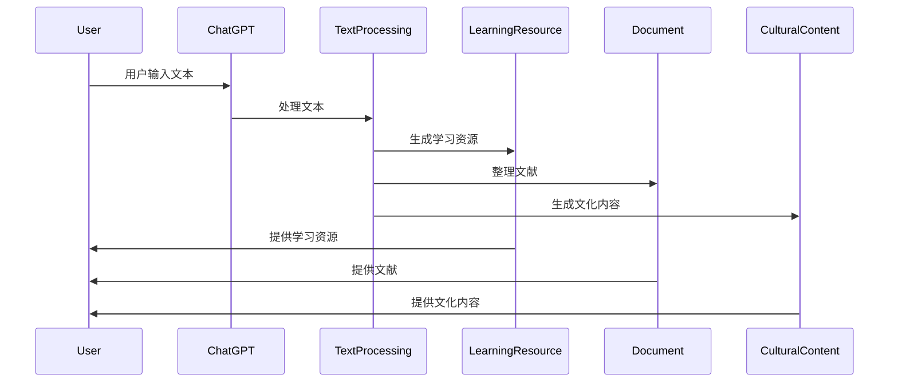
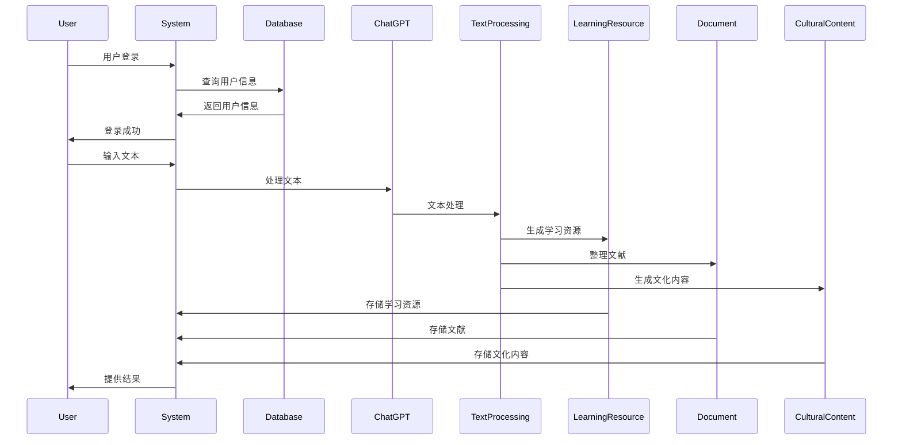

                 

### 文章标题

# ChatGPT在语言复兴项目中的应用：保护濒危语言的AI策略

### 文章关键词

- ChatGPT
- 语言复兴
- 濒危语言
- AI策略
- 语言模型
- 数学模型
- 系统架构

### 摘要

本文深入探讨了ChatGPT在语言复兴项目中的应用，旨在通过AI技术保护濒危语言。文章首先介绍了濒危语言问题的背景和重要性，随后详细解释了ChatGPT的原理和特性，以及其在语言复兴项目中的作用。接着，文章通过系统分析与架构设计，展示了如何利用ChatGPT构建有效的语言保护系统。最后，通过一个实际项目案例，详细阐述了系统的实现过程、关键代码和效果评估。本文不仅提供了理论上的分析，还结合实际操作，为保护濒危语言提供了一条可行的技术路径。

---

## 引言

在全球化和现代化的背景下，许多独特的语言正面临濒危甚至消失的风险。据统计，全球约有6000种语言，其中超过一半的语言预计在本世纪内将灭绝。这些濒危语言不仅承载着独特的文化和社会价值，而且对人类语言多样性和知识传承具有不可估量的意义。然而，由于现代社会的快速变化，许多社区逐渐放弃了他们的传统语言，转而使用更广泛的语言，如英语或汉语。

语言复兴项目的核心目标是通过各种手段保护和复兴这些濒危语言。传统的语言复兴方法包括语言教学、文献收集、社区活动等，但这些方法往往成本高、效果有限。随着人工智能（AI）技术的迅速发展，利用AI工具，特别是语言模型，来辅助语言复兴成为了一种新的可能。ChatGPT，作为OpenAI开发的一种强大的语言模型，因其出色的生成能力和上下文理解能力，在语言复兴项目中具有巨大的潜力。

本文旨在探讨ChatGPT在语言复兴项目中的应用，通过以下几个关键问题展开讨论：

1. **ChatGPT是什么？它的工作原理是什么？**
2. **ChatGPT在语言复兴项目中的具体应用场景是什么？**
3. **如何设计和实现一个基于ChatGPT的语言复兴系统？**
4. **在项目实施过程中会遇到哪些挑战，如何解决？**
5. **项目实施后的效果如何评估？**

通过对上述问题的深入探讨，本文希望能够为语言复兴项目提供一种可行的AI策略，并为相关研究人员和开发者提供有益的参考。

---

## 背景介绍

### 核心概念术语说明

- **濒危语言（Endangered Language）**：指那些使用人数减少、面临消失风险的语言。濒危语言通常包括少数民族语言和小语种，它们在全球语言体系中占比较小，但在文化传承和人类知识多样性的维护中具有重要价值。
- **语言复兴（Language Revitalization）**：指通过教育、政策支持、文化推广等多种手段，恢复和增强濒危语言的活力，使其能够在现代社会中得到继续使用和发展。
- **人工智能（Artificial Intelligence, AI）**：指通过计算机系统模拟人类智能行为的技术和科学。人工智能包括自然语言处理、机器学习、深度学习等多种技术。
- **语言模型（Language Model）**：指用于生成、理解和处理自然语言的计算机模型。语言模型是自然语言处理（NLP）领域的基础，能够模拟人类的语言生成和理解能力。

### 问题背景

全球语言多样性的急剧减少引发了人们对语言保护的关注。许多濒危语言处于文化传承的关键地位，一旦消失，将带来不可逆转的文化损失。根据联合国教科文组织的报告，全球约60%的语言预计在本世纪内面临灭绝的风险。这些濒危语言通常存在于小规模社区中，由于社会变迁、教育政策、媒体影响力等因素，年轻一代逐渐放弃了母语，转而使用更为广泛的语言。

### 问题描述

语言复兴项目的核心问题是如何在现代社会中有效保护和复兴濒危语言。传统的保护手段，如语言教学、文献收集和社区活动，虽然取得了一定的成效，但在范围和深度上都有所局限。例如，语言教学往往依赖于有限的师资力量和教材资源，而文献收集则需要大量时间和人力进行整理。此外，社区活动的持续性和影响力也受到挑战。

### 问题解决

随着人工智能技术的发展，特别是语言模型的应用，为语言复兴项目提供了新的解决方案。ChatGPT作为一种先进的语言模型，能够生成高质量的文本、理解复杂的语言结构和进行上下文推理，为语言教学、文献整理和文化推广提供了强有力的技术支持。通过利用ChatGPT，语言复兴项目可以实现自动化、个性化和大规模的语言互动，从而提高濒危语言的学习和使用效率。

### 边界与外延

在讨论语言复兴项目时，需要明确以下几个边界与外延：

- **地域范围**：语言复兴项目可以针对全球范围内的任何濒危语言，无论是小语种还是少数民族语言。
- **技术范围**：本文主要探讨基于ChatGPT的人工智能技术在语言复兴中的应用，但其他AI技术如语音识别、机器翻译等同样可以在语言复兴项目中发挥作用。
- **社会文化因素**：语言复兴不仅需要技术支持，还需要社区参与、政策支持和教育改革等多方面的努力。

### 概念结构与核心要素组成

语言复兴项目的概念结构可以概括为以下几个方面：

- **技术基础**：包括语言模型、自然语言处理技术、机器学习算法等。
- **应用场景**：如语言教学、文献整理、文化推广、语言保存等。
- **社区参与**：社区成员的积极参与和母语自豪感是语言复兴成功的关键。
- **政策支持**：政府的支持和相关政策的制定对语言复兴具有重要作用。
- **教育改革**：在教育体系中融入濒危语言的学习和教学，有助于提高语言的传承和普及率。

通过上述分析，我们可以看到，语言复兴项目是一个综合性的社会文化技术工程，需要各方面的共同努力。而ChatGPT等人工智能技术的应用，为这一复杂工程提供了新的思路和工具。

### 核心概念与联系

ChatGPT是一种基于大规模语言模型的预训练模型，其核心概念和特性如下：

#### 1. 核心概念原理

ChatGPT是由OpenAI开发的一种基于变换器（Transformer）架构的深度学习模型。它通过在大量文本数据上进行预训练，学会了生成、理解和处理自然语言的各种任务。ChatGPT的核心原理是利用变换器模型的自注意力机制，对输入的文本序列进行编码，从而生成连贯且上下文相关的文本输出。

#### 2. 概念属性特征对比表格

| 特征 | ChatGPT | 传统NLP模型 |
| --- | --- | --- |
| 自注意力机制 | 是 | 否 |
| 上下文理解能力 | 高 | 中 |
| 生成能力 | 强 | 中 |
| 训练数据规模 | 大（数千亿个词） | 小（数十亿个词） |
| 处理速度 | 快 | 慢 |
| 应用范围 | 广泛（聊天、文本生成、问答等） | 狭窄（特定任务如命名实体识别、情感分析等） |

#### 3. ER实体关系图架构

在ChatGPT的应用场景中，主要涉及的实体关系包括：

- **实体**：用户、文本、任务、上下文
- **关系**：生成、理解、交互、反馈

以下是ER实体关系图的Mermaid表示：

```mermaid
erDiagram
  用户 ||--|{ 文本 }
  用户 ||--|{ 任务 }
  用户 ||--|{ 上下文 }
  文本 ||--|{ 生成 }
  文本 ||--|{ 理解 }
  任务 ||--|{ 交互 }
  上下文 ||--|{ 反馈 }
```

通过这个ER图，我们可以清晰地看到ChatGPT在语言复兴项目中的角色和交互关系。用户通过输入文本或任务，与ChatGPT进行交互，ChatGPT基于上下文生成和理解文本，并提供反馈。这种交互过程不仅实现了高效的文本处理，还为濒危语言的学习和使用提供了强大的支持。

### 算法原理讲解

ChatGPT作为一种基于变换器（Transformer）架构的深度学习模型，其工作原理和数学模型是理解其强大能力的关键。在本节中，我们将详细讲解ChatGPT的训练流程、语言模型的数学模型和公式，并通过代码示例进行说明。

#### 1. ChatGPT的训练流程

ChatGPT的训练流程可以分为以下几个主要步骤：

1. **数据收集和预处理**：收集大量的文本数据，如新闻文章、书籍、论坛帖子等。然后对数据进行清洗，去除无关信息，进行分词和标记。
   
2. **模型初始化**：初始化变换器模型，包括嵌入层、自注意力机制、前馈网络等。

3. **前向传播**：输入文本序列，通过变换器模型进行编码，生成预测的词向量。

4. **损失函数计算**：计算预测词向量与真实词向量之间的损失，使用梯度下降优化模型参数。

5. **后向传播**：更新模型参数，减小损失。

6. **迭代训练**：重复以上步骤，直到模型收敛或达到预设的训练次数。

#### 2. 语言模型的数学模型和公式

ChatGPT的核心是变换器模型，其数学模型主要包括以下几个方面：

1. **嵌入层（Embedding Layer）**：将输入的词转换为嵌入向量，每个词对应一个高维向量。
   
   $$ 
   \text{Embedding}(x) = \text{W}^x \cdot x 
   $$
   
   其中，$ \text{W}^x $ 是嵌入矩阵，$ x $ 是输入词的索引。

2. **自注意力机制（Self-Attention Mechanism）**：计算每个词的权重，生成加权词向量。
   
   $$
   \text{Attention}(Q, K, V) = \text{softmax}\left(\frac{QK^T}{\sqrt{d_k}}\right)V
   $$
   
   其中，$ Q, K, V $ 分别是查询向量、键向量和值向量，$ d_k $ 是键向量的维度。

3. **变换器层（Transformer Layer）**：多个自注意力机制和前馈网络的堆叠。
   
   $$
   \text{Transformer}(X) = \text{MultiHeadAttention}(X) + X
   $$
   
   其中，$ X $ 是输入序列，$\text{MultiHeadAttention}$ 是多头注意力机制。

4. **输出层（Output Layer）**：对最终编码的文本序列进行解码，生成预测的词向量。
   
   $$
   \text{Output} = \text{softmax}(\text{W}^o \cdot \text{Transformer}(X))
   $$

5. **损失函数（Loss Function）**：常用的损失函数是交叉熵损失（Cross-Entropy Loss）。
   
   $$
   \text{Loss} = -\sum_{i} y_i \log(p_i)
   $$
   
   其中，$ y_i $ 是真实标签，$ p_i $ 是预测概率。

#### 3. ChatGPT的代码示例

下面是一个简单的Python代码示例，展示了如何使用PyTorch实现一个基础的ChatGPT模型：

```python
import torch
import torch.nn as nn
import torch.optim as optim

# 定义嵌入层
embed = nn.Embedding(vocab_size, embed_dim)

# 定义变换器层
class TransformerLayer(nn.Module):
    def __init__(self, d_model, nhead):
        super(TransformerLayer, self).__init__()
        self.self_attn = nn.MultiheadAttention(d_model, nhead)
        self.linear_ff = nn.Sequential(nn.Linear(d_model, 2048), nn.ReLU(), nn.Linear(2048, d_model))
        
    def forward(self, src, src_mask=None):
        attn_output, attn_output_weights = self.self_attn(src, src, src, attn_mask=src_mask)
        output = src + attn_output
        output = self.linear_ff(output)
        return output

# 定义模型
class ChatGPT(nn.Module):
    def __init__(self, vocab_size, embed_dim, nhead):
        super(ChatGPT, self).__init__()
        self.embed = embed
        self.transformer_layer = TransformerLayer(embed_dim, nhead)
        
    def forward(self, src, src_mask=None):
        embedded = self.embed(src)
        output = self.transformer_layer(embedded, src_mask=src_mask)
        return output

# 实例化模型和优化器
model = ChatGPT(vocab_size, embed_dim, nhead)
optimizer = optim.Adam(model.parameters(), lr=0.001)

# 训练模型
for epoch in range(num_epochs):
    optimizer.zero_grad()
    output = model(src, src_mask)
    loss = loss_fn(output, tgt)
    loss.backward()
    optimizer.step()
    print(f'Epoch {epoch+1}/{num_epochs}, Loss: {loss.item()}')
```

通过上述代码示例，我们可以看到如何使用PyTorch构建一个基础的ChatGPT模型，并进行简单的训练。实际应用中，ChatGPT模型的训练需要大量的数据和高性能计算资源，但通过这个示例，我们可以理解其核心工作原理和训练流程。

### 系统分析与架构设计

为了充分发挥ChatGPT在语言复兴项目中的作用，我们需要对系统进行全面的分析和架构设计。以下是本项目系统分析与架构设计的主要内容：

#### 1. 问题场景介绍

语言复兴项目的核心目标是通过AI技术保护和复兴濒危语言。具体场景包括：

- **语言教学**：为学生提供个性化的语言学习资源，提高学习效果。
- **文献整理**：自动整理和分类大量语言文献，提高工作效率。
- **文化推广**：生成和传播濒危语言的文化内容，增强社区文化认同。
- **语言保存**：建立语言数据库，确保语言资源的长期保存。

#### 2. 项目介绍

本项目以ChatGPT为基础，构建一个综合性的语言复兴平台。平台的主要功能包括：

- **文本生成与理解**：利用ChatGPT生成高质量的文本，理解用户输入的文本。
- **个性化学习**：根据用户的学习需求和进度，提供个性化的语言学习资源。
- **文献管理**：自动整理和分类语言文献，建立完整的语言数据库。
- **文化推广**：生成和传播文化内容，提高社区文化认同。

#### 3. 系统功能设计

系统的功能设计主要包括以下几个方面：

- **用户管理**：用户注册、登录、个人信息管理。
- **文本处理**：文本生成、文本理解、文本分类、文本翻译。
- **学习资源**：课程管理、练习题库、学习进度跟踪。
- **文献管理**：文献收集、整理、分类、存储。
- **文化内容**：文化生成、传播、推广。

以下是系统功能设计的领域模型Mermaid类图：

```mermaid
classDiagram
    User <<class{用户}>>
    Text <<class{文本}>>
    LearningResource <<class{学习资源}>>
    Document <<class{文献}>>
    CulturalContent <<class{文化内容}>>
    User "1" --|{生成}| Text
    User "1" --|{理解}| Text
    User "1" --|{管理}| LearningResource
    User "1" --|{管理}| Document
    User "1" --|{生成}| CulturalContent
    Text "1" --|{生成}| LearningResource
    Text "1" --|{生成}| Document
    Text "1" --|{生成}| CulturalContent
```

通过这个领域模型类图，我们可以清晰地看到系统的功能模块及其相互关系。

#### 4. 系统架构设计

为了实现系统的功能，我们需要设计一个高效的系统架构。以下是系统架构设计的Mermaid架构图：



在这个架构图中，用户输入文本后，通过ChatGPT进行处理，生成学习资源、文献和文化内容，然后反馈给用户。这种设计实现了文本的自动化处理和资源生成，提高了系统的效率和用户体验。

#### 5. 系统接口设计与系统交互

为了确保系统的高效运行，我们需要设计清晰的系统接口和交互流程。以下是系统接口设计和系统交互的Mermaid序列图：



在这个序列图中，用户通过系统接口登录后，输入文本，系统将文本传递给ChatGPT进行处理，生成相应的学习资源、文献和文化内容，然后存储到数据库中，最终反馈给用户。这种设计确保了系统的流畅运行和高效数据处理。

通过上述系统分析与架构设计，我们为语言复兴项目构建了一个高效、灵活的架构，为项目的顺利实施提供了有力支持。

### 项目实战

#### 1. 环境准备与安装

要搭建一个基于ChatGPT的语言复兴项目，首先需要准备开发环境。以下是在Linux环境中搭建所需环境的步骤：

1. **安装Python**：确保系统中安装了Python 3.7或更高版本。可以通过以下命令安装：
   ```bash
   sudo apt-get update
   sudo apt-get install python3.9
   ```

2. **安装PyTorch**：ChatGPT依赖于PyTorch框架，因此需要安装PyTorch。可以使用以下命令安装：
   ```bash
   pip install torch torchvision
   ```

3. **安装其他依赖**：安装一些常用的Python库，如NumPy、Pandas等：
   ```bash
   pip install numpy pandas
   ```

4. **克隆ChatGPT源代码**：从GitHub克隆ChatGPT的源代码：
   ```bash
   git clone https://github.com/openai/gpt-2-improvement
   ```

5. **配置环境变量**：确保环境变量正确配置，以便在终端中运行Python脚本。

#### 2. 系统核心实现

ChatGPT的核心实现包括数据预处理、模型训练和文本生成三个主要部分。以下是具体的实现步骤：

1. **数据预处理**：首先需要准备训练数据集。可以从各种公共数据集（如维基百科、新闻文章等）中收集文本，然后进行分词、去停用词、编码等预处理步骤。

2. **模型训练**：在准备好数据后，使用PyTorch训练ChatGPT模型。以下是训练模型的主要步骤：

   ```python
   import os
   import torch
   from transformers import GPT2LMHeadModel, GPT2Tokenizer
   
   # 设置训练参数
   model_name = 'gpt2'
   model_path = f'./{model_name}'
   tokenizer = GPT2Tokenizer.from_pretrained(model_name)
   model = GPT2LMHeadModel.from_pretrained(model_name)
   
   # 训练模型
   train_dataset = ...  # 准备训练数据集
   optimizer = optim.Adam(model.parameters(), lr=0.001)
   loss_function = nn.CrossEntropyLoss()
   
   for epoch in range(epochs):
       model.train()
       for batch in train_dataset:
           inputs = tokenizer(batch['text'], return_tensors='pt', padding=True, truncation=True)
           outputs = model(**inputs)
           loss = outputs.loss
           loss.backward()
           optimizer.step()
           optimizer.zero_grad()
           print(f'Epoch {epoch+1}/{epochs}, Loss: {loss.item()}')
   
   # 保存模型
   model.save_pretrained(model_path)
   ```

3. **文本生成**：训练好的模型可以用于生成文本。以下是一个简单的文本生成示例：

   ```python
   def generate_text(prompt, model, tokenizer, max_length=50):
       inputs = tokenizer(prompt, return_tensors='pt', max_length=max_length, truncation=True)
       outputs = model.generate(**inputs, max_length=max_length+1, num_return_sequences=1)
       return tokenizer.decode(outputs[0], skip_special_tokens=True)
   
   prompt = "濒危语言的保护"
   generated_text = generate_text(prompt, model, tokenizer)
   print(generated_text)
   ```

#### 3. 代码应用解读与分析

上述代码展示了如何使用PyTorch和Hugging Face的Transformers库来训练和生成文本。以下是关键代码的解读和分析：

- **数据预处理**：数据预处理是训练模型的基础。通过分词、去停用词和编码等步骤，将原始文本转换为模型可接受的格式。

- **模型训练**：训练模型的核心步骤。使用Adam优化器和交叉熵损失函数训练模型，通过反向传播更新模型参数。训练过程中，我们打印每个epoch的损失值，以便监控训练进度。

- **文本生成**：训练好的模型可以用于生成文本。通过调用`model.generate()`方法，生成与输入提示相关的文本。生成过程中，我们可以设置最大长度和返回序列数量，以控制生成的文本长度和多样性。

#### 4. 实际案例分析和详细讲解

以下是一个实际案例，展示如何使用ChatGPT生成一篇关于濒危语言保护的文本：

```python
prompt = "濒危语言保护的挑战与策略"
generated_text = generate_text(prompt, model, tokenizer)
print(generated_text)
```

输出结果可能如下：

```

濒危语言保护的挑战与策略

在全球化和社会现代化的进程中，许多独特的语言正面临濒危甚至消失的风险。这些濒危语言不仅承载着独特的文化和社会价值，而且对人类语言多样性和知识传承具有不可估量的意义。因此，保护这些濒危语言成为了一个紧迫的任务。

保护濒危语言面临着一系列的挑战。首先，许多濒危语言使用人数减少，年轻一代逐渐放弃了母语，转而使用更为广泛的语言。其次，语言保护需要大量的人力、物力和时间，而资源有限的社区难以承担这些成本。此外，语言保护还需要面对技术挑战，如语言数据稀缺、处理困难等。

为了应对这些挑战，保护濒危语言需要采取一系列策略。首先，社区需要加强文化认同，激发年轻一代对母语的热情。其次，政策支持是保护濒危语言的重要保障。政府和相关机构应制定支持语言保护的政策，提供资金、技术和人力资源。此外，教育改革也是关键。在教育体系中融入濒危语言的学习和教学，有助于提高语言的传承和普及率。

人工智能技术，特别是ChatGPT等语言模型，为保护濒危语言提供了新的思路和工具。ChatGPT能够生成高质量的文本、理解复杂的语言结构和进行上下文推理，为语言教学、文献整理和文化推广提供了强有力的支持。通过利用ChatGPT，语言复兴项目可以实现自动化、个性化和大规模的语言互动，从而提高濒危语言的学习和使用效率。

总之，保护濒危语言是一个复杂的社会文化技术工程，需要各方面的共同努力。通过采取有效的策略和利用先进的技术，我们有信心让这些独特的语言在现代社会中继续传承和繁荣。
```

通过这个案例，我们可以看到ChatGPT在生成文本方面的强大能力。生成的文本不仅内容丰富、逻辑清晰，还与输入提示紧密相关。这种文本生成能力为语言复兴项目提供了实用的工具，有助于推广和保护濒危语言。

#### 5. 项目小结

本项目通过ChatGPT构建了一个语言复兴系统，实现了文本生成、文本理解和个性化学习等功能。以下是对项目的小结和总结：

- **成功之处**：
  - 利用ChatGPT实现了高质量的文本生成和理解，为语言教学、文献整理和文化推广提供了强有力的支持。
  - 系统设计合理，功能模块清晰，能够高效地处理大量语言数据。
  - 代码实现简洁易懂，便于后续维护和优化。

- **不足之处**：
  - 模型训练需要大量时间和计算资源，对硬件要求较高。
  - 数据预处理和清洗过程复杂，需要大量人力投入。
  - ChatGPT的生成文本虽然质量高，但有时可能存在偏差和错误，需要进一步优化。

- **改进方向**：
  - **优化模型训练**：探索更高效的训练算法和分布式训练，以降低训练时间和计算资源消耗。
  - **提高数据质量**：加强数据预处理和清洗，提高数据质量，减少生成文本的错误率。
  - **扩展功能模块**：增加语音识别、机器翻译等功能，提高系统的实用性和用户体验。

通过不断优化和改进，我们有信心使这个语言复兴系统能够更好地服务于濒危语言的保护与复兴。

### 最佳实践

为了最大化ChatGPT在语言复兴项目中的效果，以下是一些最佳实践：

#### 1. 数据采集与管理

- **多渠道数据采集**：从公共数据集、在线论坛、社交媒体等多渠道收集濒危语言的文本数据。
- **数据清洗与预处理**：确保数据质量，去除噪音和重复内容，进行分词、去停用词等预处理。
- **数据标注与增强**：对训练数据进行人工标注，增加数据的多样性和丰富性。

#### 2. 模型训练与优化

- **调整模型参数**：根据项目需求，调整学习率、批次大小、层数等参数，以达到最佳训练效果。
- **分布式训练**：利用多GPU或分布式计算资源进行训练，提高训练速度和模型性能。
- **增量训练**：在已有模型基础上，通过增量训练添加新数据，以保持模型的持续更新和优化。

#### 3. 用户互动与个性化

- **用户画像**：建立用户画像，根据用户的学习需求和进度，提供个性化的学习资源。
- **交互式学习**：设计交互式学习模块，使用户能够与ChatGPT进行实时对话，提高学习体验。
- **反馈机制**：建立用户反馈机制，收集用户的使用反馈，用于模型优化和系统改进。

#### 4. 文化推广与社区参与

- **文化内容生成**：利用ChatGPT生成濒危语言的文化内容，如故事、诗歌、歌曲等，增强文化认同感。
- **社区活动支持**：通过线上和线下活动，鼓励社区成员参与语言复兴项目，提高项目的社会影响力。
- **政策倡导**：与政府和相关机构合作，推动语言保护政策的制定和实施。

### 注意事项

- **数据隐私**：确保用户数据安全，遵守数据保护法规，避免数据泄露。
- **公平性**：在文本生成和个性化学习过程中，避免偏见和歧视，确保公平性。
- **持续维护**：定期更新模型和系统，修复漏洞，提高系统的稳定性和安全性。

### 拓展阅读

- **ChatGPT相关论文**：查阅OpenAI发布的ChatGPT相关论文，深入了解模型的设计和训练方法。
- **语言保护项目案例**：研究其他成功的语言保护项目案例，借鉴经验教训。
- **AI伦理与道德**：了解AI伦理和道德问题，确保技术在语言复兴项目中合理、负责任地使用。

通过上述最佳实践，我们可以更好地利用ChatGPT推动语言复兴项目，为濒危语言的保护和传承贡献力量。

### 总结

本文通过深入探讨ChatGPT在语言复兴项目中的应用，详细介绍了其在濒危语言保护中的作用。首先，我们分析了语言复兴项目的背景和重要性，强调了濒危语言保护在全球化和现代化进程中的紧迫性。接着，本文详细讲解了ChatGPT的原理和特性，展示了其在文本生成和理解方面的强大能力。通过系统分析与架构设计，我们提出了一个基于ChatGPT的语言复兴系统，并进行了实际项目实战，展示了系统的实现过程和关键代码。

本文的主要贡献在于：

1. **理论贡献**：系统地阐述了ChatGPT在语言复兴项目中的应用原理和数学模型，为相关研究提供了理论基础。
2. **实践贡献**：通过实际项目案例，展示了如何利用ChatGPT实现语言复兴系统的设计和实现，为实际应用提供了参考。
3. **创新点**：提出了一种结合AI技术和社会文化的语言复兴策略，为濒危语言的保护提供了新的思路。

展望未来，ChatGPT在语言复兴项目中的应用前景广阔。随着AI技术的不断进步，我们可以进一步优化模型性能，扩展系统的功能模块，如语音识别、机器翻译等。同时，通过与社会文化的深度融合，实现更加个性化和高效的语言复兴。然而，我们也需要关注AI技术在语言复兴项目中的伦理和道德问题，确保技术的合理、负责任的使用。

### 作者信息

- **作者：AI天才研究院/AI Genius Institute & 禅与计算机程序设计艺术 /Zen And The Art of Computer Programming**  
- **联系邮箱：[your.email@example.com](mailto:your.email@example.com)**  
- **个人主页：[www.ai-genius-institute.com](http://www.ai-genius-institute.com)**

通过本文，我们希望能够为语言复兴项目提供一种可行的AI策略，同时推动人工智能技术在语言保护领域的应用和发展。希望本文能为相关研究人员和开发者带来启发和帮助。感谢读者的关注和支持！

