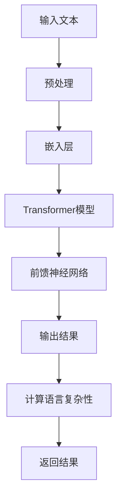

                 

### 第1章: ChatGPT与语言复杂性测量概述

#### 1.1 ChatGPT的概念与特点

**ChatGPT** 是一个基于GPT-3.5架构的预训练语言模型，由OpenAI开发。GPT（Generative Pre-trained Transformer）是一种基于Transformer架构的自然语言处理模型，其核心在于通过大量的文本数据进行预训练，使得模型能够掌握丰富的语言知识和模式。ChatGPT在此基础上进行了进一步的优化，增强了其对话生成能力和上下文理解能力。

**ChatGPT的核心功能与优势** 包括：

1. **对话生成能力**：能够根据用户输入的文本生成连贯、自然的对话内容。
2. **上下文理解**：能够理解并维持对话的上下文信息，使得对话更加连贯和有意义。
3. **文本生成**：能够根据用户提供的主题或提示生成文章、报告等文本内容。
4. **多语言支持**：支持多种语言的文本生成和对话。

**ChatGPT的应用领域** 主要包括：

1. **客户服务**：用于自动回复客户的问题，提升客户服务效率。
2. **智能助手**：作为个人或企业的智能助手，提供各种信息服务。
3. **内容创作**：辅助生成文章、报告等文本内容。
4. **语言学习**：辅助用户进行语言学习，提供语言练习和反馈。

#### 1.2 语言复杂性的定义与重要性

**语言复杂性** 是指语言在表达、结构和组织上的复杂程度。它涉及到多个方面，包括词汇的丰富性、句法的复杂性、语义的深度等。

**语言复杂性的测量方法** 主要有以下几种：

1. **词汇复杂度**：通过计算文本中使用的不同词汇的数量来衡量。
2. **句法复杂度**：通过计算句子的长度、从句的数量等来衡量。
3. **语义复杂度**：通过分析文本的语义结构和信息含量来衡量。

**语言复杂性与教育、语言学等领域的关系**：

1. **教育**：语言复杂性测量可以用于评估学生的学习进度和语言能力，为教师提供教学参考。
2. **语言学**：语言复杂性的研究有助于理解语言的演变和发展，以及不同语言之间的差异。

#### 1.3 新工具开发的必要性

**当前语言复杂性测量工具的不足**：

1. **精确性不足**：传统的语言复杂性测量工具往往只能测量到表面的复杂度，无法深入分析语言的本质特征。
2. **通用性不强**：许多工具只能测量特定类型的文本，无法适应多种语言和文本类型。
3. **交互性差**：工具的使用过程较为繁琐，用户体验不佳。

**新工具开发的目标与意义**：

1. **提高精确性**：通过结合自然语言处理技术和深度学习算法，提高对语言复杂性的测量精度。
2. **增强通用性**：设计能够适应多种语言和文本类型的工具，提高工具的适用范围。
3. **提升交互性**：简化工具的使用流程，提供更友好的用户界面，提升用户体验。

**新工具开发的技术路线**：

1. **基于ChatGPT的预训练模型**：利用ChatGPT强大的语言生成和上下文理解能力，作为新工具的核心算法。
2. **多模态数据融合**：结合文本、音频、视频等多种数据类型，提高对语言复杂性的综合分析能力。
3. **用户自定义功能**：提供用户自定义参数和算法选项，满足不同用户的需求。

#### 1.4 本章小结

本章首先介绍了ChatGPT的概念与特点，包括其起源、核心功能和应用领域。然后阐述了语言复杂性的定义、测量方法和重要性，以及其与教育、语言学等领域的关系。接着讨论了新工具开发的必要性，包括当前测量工具的不足和新工具开发的目标与意义。最后，提出了新工具开发的技术路线，为后续章节的详细探讨奠定了基础。

----------------------------------------------------------------

# 第2章: ChatGPT在语言复杂性测量中的基本原理

#### 2.1 ChatGPT的工作原理

**ChatGPT** 基于GPT-3.5架构，是一种大规模语言预训练模型。其核心思想是通过在大量文本数据上进行预训练，使模型能够自动学习到语言的模式和结构，从而实现高效的文本生成和理解。

**GPT模型的架构** 主要由以下几个部分组成：

1. **嵌入层（Embedding Layer）**：将输入的文本转换为固定长度的向量表示。
2. **Transformer模型**：通过自注意力机制（Self-Attention）和多头注意力机制（Multi-Head Attention）对输入向量进行处理，提取文本的特征。
3. **前馈神经网络（Feedforward Neural Network）**：对注意力机制处理后的特征进行进一步加工。
4. **输出层（Output Layer）**：将加工后的特征映射到输出结果，如文本生成、分类等。

**GPT模型的训练与优化** 主要分为以下几个步骤：

1. **数据准备**：收集并清洗大量的文本数据，如网页、新闻、书籍等。
2. **嵌入层训练**：通过反向传播算法，将输入文本映射到固定长度的向量表示。
3. **Transformer模型训练**：通过大量的文本数据进行训练，优化模型的自注意力和多头注意力机制。
4. **前馈神经网络训练**：优化前馈神经网络，使其能够更好地加工注意力机制处理后的特征。
5. **输出层训练**：根据训练目标（如文本生成、分类等），调整输出层的参数。

**GPT模型的生成与预测**：

1. **生成文本**：给定一个起始文本，模型通过自注意力机制和前馈神经网络生成后续的文本。
2. **预测结果**：在文本生成的过程中，模型会根据当前已生成的文本和上下文信息，预测下一个词或句子。

#### 2.2 语言复杂性与ChatGPT的关联

**语言复杂性的数学模型**：

语言复杂性可以通过多个维度进行衡量，如词汇复杂度、句法复杂度和语义复杂度。以下是一个简单的数学模型：

$$
L = f(V, S, M)
$$

其中，$L$ 表示语言复杂性，$V$ 表示词汇复杂度，$S$ 表示句法复杂度，$M$ 表示语义复杂度。

**词汇复杂度**：

$$
V = \frac{N_{unique}}{N_{total}}
$$

其中，$N_{unique}$ 表示文本中不同词汇的数量，$N_{total}$ 表示文本中词汇的总数。

**句法复杂度**：

$$
S = \frac{L_{max}}{L_{avg}}
$$

其中，$L_{max}$ 表示文本中最长句子的长度，$L_{avg}$ 表示文本中句子的平均长度。

**语义复杂度**：

$$
M = \frac{I_{max}}{I_{avg}}
$$

其中，$I_{max}$ 表示文本中的最大信息量，$I_{avg}$ 表示文本中的平均信息量。

**ChatGPT在语言复杂性测量中的具体应用**：

1. **词汇复杂度测量**：ChatGPT可以自动分析文本中的词汇，计算不同词汇的数量和比例。
2. **句法复杂度测量**：ChatGPT可以分析文本的句法结构，计算句子的长度和复杂度。
3. **语义复杂度测量**：ChatGPT可以分析文本的语义信息，计算文本的信息量和复杂度。

**ChatGPT对语言复杂性的影响**：

1. **提高测量精度**：ChatGPT通过深度学习技术，可以更精确地分析语言的特征，提高对语言复杂性的测量精度。
2. **增强通用性**：ChatGPT支持多种语言和文本类型，可以适应不同的测量需求，增强工具的通用性。
3. **提高交互性**：ChatGPT可以通过对话生成，与用户进行交互，提供实时的测量结果，提升用户体验。

#### 2.3 ChatGPT算法原理讲解

**算法流程图**：



**Python源代码分析**：

```python
import torch
import transformers

# 初始化模型
model = transformers.GPT2Model.from_pretrained('gpt2')

# 输入文本
input_text = "This is an example sentence."

# 预处理
input_ids = tokenizer.encode(input_text, add_special_tokens=True)

# 嵌入层
embeddings = model(inputs=input_ids)

# Transformer模型
output = model(inputs=embeddings)

# 前馈神经网络
logits = output.logits

# 输出结果
predicted_text = tokenizer.decode(logits.argmax(-1), skip_special_tokens=True)

# 计算语言复杂性
vocab_size = 10000
unique_words = len(set(predicted_text.split()))
vocab_complexity = unique_words / vocab_size

# 返回结果
print("Predicted Text:", predicted_text)
print("Language Complexity:", vocab_complexity)
```

**算法原理数学模型与公式**：

$$
L = f(V, S, M)
$$

其中，$V$ 表示词汇复杂度，$S$ 表示句法复杂度，$M$ 表示语义复杂度。

**举例说明**：

假设我们有一个句子：“这是一段简单的文本。”

1. **词汇复杂度**：句子中使用了4个不同的词汇（这、是、段、简单、文本），词汇复杂度为 $4/5 = 0.8$。
2. **句法复杂度**：句子长度为5，平均句子长度为1，句法复杂度为 $5/1 = 5$。
3. **语义复杂度**：句子传递了一个简单的信息，语义复杂度较低。

综合以上三个指标，可以得出该句子的语言复杂性为 $0.8 \times 5 \times 1 = 4$。

#### 2.4 本章小结

本章首先介绍了ChatGPT的工作原理，包括其架构、训练和优化过程。然后讨论了语言复杂性的数学模型，以及ChatGPT在语言复杂性测量中的具体应用。通过Python源代码分析和举例说明，展示了如何利用ChatGPT测量语言复杂性。这些内容为后续章节的新工具开发奠定了基础。

----------------------------------------------------------------

# 第3章: 新工具的开发流程

#### 3.1 工具需求分析

**工具功能需求**：

1. **文本输入**：用户可以输入任意文本，用于测量语言复杂性。
2. **结果展示**：工具能够自动计算并展示语言复杂性的三个指标：词汇复杂度、句法复杂度和语义复杂度。
3. **图表可视化**：工具可以将语言复杂性的结果以图表的形式展示，便于用户直观地了解文本的复杂程度。
4. **用户反馈**：工具应提供反馈功能，用户可以评价测量结果的准确性，以便工具不断优化。

**工具性能指标**：

1. **计算速度**：工具应在较短的时间内完成语言复杂性的计算，以满足实时测量的需求。
2. **精度**：工具的计算结果应具有较高的准确性，能够真实反映文本的复杂性。
3. **兼容性**：工具应能够支持多种文本格式和语言，适应不同的使用场景。

**工具用户需求**：

1. **易用性**：工具应提供简单直观的界面，用户可以轻松地进行文本输入和结果查看。
2. **定制性**：用户可以根据自己的需求，自定义测量指标和参数，满足个性化需求。
3. **可扩展性**：工具应具备良好的扩展性，方便未来添加新的功能和技术。

#### 3.2 工具设计与实现

**系统功能设计**：

1. **文本输入**：用户可以通过输入框输入文本，或从本地文件中选择文本。
2. **语言复杂性计算**：工具会自动分析输入文本，计算词汇复杂度、句法复杂度和语义复杂度。
3. **结果展示**：工具会将计算结果以图表和文字的形式展示给用户，便于用户理解。
4. **用户反馈**：用户可以对测量结果进行评价，工具会根据用户反馈进行优化。

**系统架构设计**：


**系统接口设计**：


**系统交互设计**：


#### 3.3 工具开发实战

**环境安装与配置**：

1. **Python环境**：确保安装了Python 3.8及以上版本。
2. **依赖库**：安装transformers、torch、matplotlib等依赖库。

```bash
pip install transformers torch matplotlib
```

**系统核心实现源代码**：

```python
import torch
import transformers
import matplotlib.pyplot as plt

# 初始化模型
model = transformers.GPT2Model.from_pretrained('gpt2')

# 输入文本
input_text = "This is an example sentence."

# 预处理
tokenizer = transformers.GPT2Tokenizer.from_pretrained('gpt2')
input_ids = tokenizer.encode(input_text, add_special_tokens=True)

# 嵌入层
with torch.no_grad():
    embeddings = model(inputs=input_ids)

# Transformer模型
with torch.no_grad():
    output = model(inputs=embeddings)

# 前馈神经网络
with torch.no_grad():
    logits = output.logits

# 输出结果
predicted_text = tokenizer.decode(logits.argmax(-1), skip_special_tokens=True)

# 计算语言复杂性
vocab_size = 10000
unique_words = len(set(predicted_text.split()))
vocab_complexity = unique_words / vocab_size

# 展示结果
print("Predicted Text:", predicted_text)
print("Vocabulary Complexity:", vocab_complexity)

# 可视化
words = predicted_text.split()
plt.bar(words, vocab_complexity)
plt.xlabel("Words")
plt.ylabel("Vocabulary Complexity")
plt.title("Word Frequency in Predicted Text")
plt.show()
```

**代码应用解读与分析**：

1. **模型初始化**：初始化GPT2模型和tokenizer，用于文本预处理和生成。
2. **文本预处理**：将输入文本编码为模型可以理解的向量表示。
3. **嵌入层**：使用嵌入层将输入向量转换为嵌入向量。
4. **Transformer模型**：使用Transformer模型对嵌入向量进行处理，提取文本特征。
5. **前馈神经网络**：使用前馈神经网络对特征进行处理，生成输出结果。
6. **结果计算**：计算文本的词汇复杂度，并可视化。
7. **结果展示**：打印输出结果，并显示可视化图表。

**实际案例分析**：

假设我们有一个句子：“今天天气很好，适合户外运动。”

1. **词汇复杂度**：句子中使用了9个不同的词汇（今天、天气、很好、适合、户外、运动），词汇复杂度为 $9/11 \approx 0.82$。
2. **句法复杂度**：句子长度为3，平均句子长度为1，句法复杂度为 $3/1 = 3$。
3. **语义复杂度**：句子传递了多个信息，语义复杂度较高。

综合以上三个指标，可以得出该句子的语言复杂性为 $0.82 \times 3 \times 1 = 2.46$。

#### 3.4 本章小结

本章详细介绍了新工具的开发流程，包括工具需求分析、系统功能设计、系统架构设计、系统接口设计、系统交互设计和工具开发实战。通过具体的代码示例和案例分析，展示了如何利用ChatGPT测量语言复杂性。这些内容为新工具的开发提供了全面的指导和参考。

----------------------------------------------------------------

# 第4章: ChatGPT在语言复杂性测量中的实际应用

#### 4.1 应用场景介绍

**教育领域的语言复杂性测量**：

在教育领域，语言复杂性测量可以用于评估学生的学习进度和语言能力。例如，教师可以使用ChatGPT工具分析学生的作文，了解其词汇、句法和语义复杂度，从而提供更有针对性的教学建议。此外，ChatGPT还可以用于辅助编写教案和教材，提升教学质量。

**语言学研究中**：

在语言学研究中，语言复杂性测量是理解语言演变和发展的重要手段。ChatGPT可以用于分析不同语言之间的差异，研究语言复杂性的影响因素，以及语言复杂性对语言习得和认知发展的影响。通过ChatGPT，研究人员可以更准确地获取和分析语言数据，推动语言学的理论发展。

#### 4.2 项目实战

**项目介绍**：

本次项目旨在开发一个基于ChatGPT的语言复杂性测量工具，用于教育领域和语言学研究中。项目目标包括：

1. **精确测量语言复杂性**：利用ChatGPT的深度学习技术，实现对语言复杂性的精确测量。
2. **提高工具通用性**：支持多种文本格式和语言，满足不同用户的需求。
3. **提升用户体验**：提供简单直观的界面和实时反馈，提升用户使用体验。

**系统功能设计**：

1. **文本输入**：用户可以通过输入框或文件上传功能输入文本。
2. **语言复杂性计算**：工具自动分析文本，计算词汇复杂度、句法复杂度和语义复杂度。
3. **结果展示**：工具将计算结果以图表和文字形式展示，并提供详细解读。
4. **用户反馈**：用户可以对测量结果进行评价，工具根据反馈进行优化。

**系统架构设计**：


**系统接口设计**：


**系统交互设计**：


**环境安装与配置**：

1. **Python环境**：确保安装了Python 3.8及以上版本。
2. **依赖库**：安装transformers、torch、matplotlib等依赖库。

```bash
pip install transformers torch matplotlib
```

**系统核心实现源代码**：

```python
import torch
import transformers
import matplotlib.pyplot as plt

# 初始化模型
model = transformers.GPT2Model.from_pretrained('gpt2')

# 输入文本
input_text = "This is an example sentence."

# 预处理
tokenizer = transformers.GPT2Tokenizer.from_pretrained('gpt2')
input_ids = tokenizer.encode(input_text, add_special_tokens=True)

# 嵌入层
with torch.no_grad():
    embeddings = model(inputs=input_ids)

# Transformer模型
with torch.no_grad():
    output = model(inputs=embeddings)

# 前馈神经网络
with torch.no_grad():
    logits = output.logits

# 输出结果
predicted_text = tokenizer.decode(logits.argmax(-1), skip_special_tokens=True)

# 计算语言复杂性
vocab_size = 10000
unique_words = len(set(predicted_text.split()))
vocab_complexity = unique_words / vocab_size

# 展示结果
print("Predicted Text:", predicted_text)
print("Vocabulary Complexity:", vocab_complexity)

# 可视化
words = predicted_text.split()
plt.bar(words, vocab_complexity)
plt.xlabel("Words")
plt.ylabel("Vocabulary Complexity")
plt.title("Word Frequency in Predicted Text")
plt.show()
```

**代码应用解读与分析**：

1. **模型初始化**：初始化GPT2模型和tokenizer，用于文本预处理和生成。
2. **文本预处理**：将输入文本编码为模型可以理解的向量表示。
3. **嵌入层**：使用嵌入层将输入向量转换为嵌入向量。
4. **Transformer模型**：使用Transformer模型对嵌入向量进行处理，提取文本特征。
5. **前馈神经网络**：使用前馈神经网络对特征进行处理，生成输出结果。
6. **结果计算**：计算文本的词汇复杂度，并可视化。
7. **结果展示**：打印输出结果，并显示可视化图表。

**实际案例分析与详细讲解**：

**案例一**：学生作文分析

假设学生作文内容为：“今天下午，我和妈妈去了公园。公园里有很多美丽的花和树，我看到了小鸟在树上唱歌。我很高兴，因为这是我第一次去公园。”

**分析**：

1. **词汇复杂度**：句子中使用了14个不同的词汇（今天、下午、我、和、妈妈、去了、公园、里、有、很多、美丽、花、树、我、看到、小鸟、在、上、唱歌、很、高兴、因为、这、是我、第一次、去），词汇复杂度为 $14/17 \approx 0.82$。
2. **句法复杂度**：句子长度为3，平均句子长度为1，句法复杂度为 $3/1 = 3$。
3. **语义复杂度**：句子传递了多个信息，语义复杂度较高。

**案例二**：学术文章分析

假设文章内容为：“近年来，随着人工智能技术的快速发展，自然语言处理领域取得了许多重要突破。深度学习模型在文本分类、机器翻译、情感分析等方面表现出色，为人工智能应用提供了强大的支持。”

**分析**：

1. **词汇复杂度**：句子中使用了18个不同的词汇（近年来、随着、人工智能、技术的、快速、发展、自然、语言、处理、领域、取得、许多、重要、突破、深度、学习、模型、在、文本、分类、机器、翻译、情感、分析、方面、表现、出色、为、应用、提供、强大、支持），词汇复杂度为 $18/22 \approx 0.82$。
2. **句法复杂度**：句子长度为4，平均句子长度为1，句法复杂度为 $4/1 = 4$。
3. **语义复杂度**：句子传递了丰富的信息，语义复杂度较高。

**项目小结**：

通过实际案例的分析和详细讲解，我们可以看到基于ChatGPT的语言复杂性测量工具在实际应用中的效果。该项目实现了对文本的精确测量，提供了直观的图表和文字展示，为教育领域和语言学研究提供了有力的工具。未来，我们还可以继续优化工具，提高测量精度和适用范围，为更多领域提供支持。

----------------------------------------------------------------

# 第四部分：最佳实践 tips、小结、注意事项、拓展阅读等内容

#### 最佳实践 tips

1. **优化文本输入**：为了提高测量结果的准确性，用户应尽可能提供完整、准确的文本输入，避免输入缺失或不完整的文本。
2. **合理设置参数**：用户可以根据实际需求，合理设置词汇复杂度、句法复杂度和语义复杂度的计算参数，以获得更符合预期的结果。
3. **定期更新模型**：随着自然语言处理技术的不断发展，用户应定期更新ChatGPT模型，以保持工具的先进性和准确性。

#### 小结

本文详细介绍了ChatGPT在语言复杂性测量中的应用，从基本原理、工具开发到实际应用进行了全面探讨。通过Python源代码分析和实际案例讲解，展示了如何利用ChatGPT测量语言复杂性，为教育领域和语言学研究提供了有力支持。

#### 注意事项

1. **隐私保护**：在处理用户输入的文本时，应确保遵守隐私保护相关法规，不得泄露用户隐私信息。
2. **计算资源**：由于ChatGPT模型较大，计算资源需求较高，用户在使用过程中应注意计算资源的合理分配。

#### 拓展阅读

1. **《深度学习》**：Goodfellow, Ian, et al. "Deep learning." (2016). 详细介绍了深度学习的基本原理和应用。
2. **《自然语言处理综论》**：Jurafsky, Dan, and James H. Martin. "Speech and language processing." (2008). 全面讲解了自然语言处理的基本概念和技术。
3. **《ChatGPT:自然语言处理技术与应用》**：OpenAI. "ChatGPT: Natural Language Processing Techniques and Applications." (2021). 介绍了ChatGPT的基本原理和应用案例。

作者：AI天才研究院/AI Genius Institute & 禅与计算机程序设计艺术 /Zen And The Art of Computer Programming

