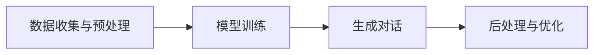

                 


### 设计《ChatGPT在语言学习个性化中的突破性应用》目录大纲

为了设计一份结构合理、逻辑清晰且内容丰富的《ChatGPT在语言学习个性化中的突破性应用》的目录大纲，我们将遵循以下步骤：

#### 步骤1：确定整体结构和核心内容

首先，我们需要确定书籍的整体结构，包括章节划分和核心内容。本书旨在深入探讨ChatGPT在语言学习个性化中的应用，因此整体结构应包含以下几个方面：

- 引言
- ChatGPT基本原理
- ChatGPT在语言学习中的应用
- 算法原理与实现
- 实际应用案例
- 系统设计与实现
- 未来展望与挑战
- 总结与建议

#### 步骤2：设计核心章节和子章节

基于整体结构，我们将设计核心章节，并为每个章节添加子章节，以确保内容条理清晰。以下是详细的章节设计：

##### 第一部分：引言

- **第1章：背景与核心概念**
  - 1.1 语言学习的现状与挑战
  - 1.2 ChatGPT与个性化语言学习
  - 1.3 书籍概述与目标读者

##### 第二部分：ChatGPT基本原理

- **第2章：自然语言处理基础**
  - 2.1 语言与自然语言处理
  - 2.2 词向量与文本表示
  - 2.3 语言模型与序列模型

- **第3章：深度学习基础**
  - 3.1 深度学习概述
  - 3.2 神经网络与反向传播算法
  - 3.3 训练与优化技巧

- **第4章：Transformer模型**
  - 4.1 Transformer模型概述
  - 4.2 自注意力机制
  - 4.3 GPT模型架构

- **第5章：ChatGPT模型**
  - 5.1 GPT模型的工作原理
  - 5.2 GPT模型的训练与优化
  - 5.3 GPT模型的定制与调优

##### 第三部分：ChatGPT在语言学习中的应用

- **第6章：个性化对话学习**
  - 6.1 对话系统的基本概念
  - 6.2 个性化对话的设计与实现
  - 6.3 对话质量评估

- **第7章：词汇学习**
  - 7.1 词汇学习的方法与策略
  - 7.2 ChatGPT在词汇学习中的应用
  - 7.3 词汇学习效果评估

- **第8章：语法学习**
  - 8.1 语法学习的基本概念
  - 8.2 ChatGPT在语法学习中的应用
  - 8.3 语法学习效果评估

- **第9章：口语练习与语音识别**
  - 9.1 口语练习的方法与策略
  - 9.2 ChatGPT在口语练习中的应用
  - 9.3 语音识别技术的应用

##### 第四部分：算法原理与实现

- **第10章：算法原理讲解**
  - 10.1 ChatGPT的算法原理
  - 10.2 算法流程图与Mermaid表示
  - 10.3 算法数学模型与公式

- **第11章：Python代码实现**
  - 11.1 环境安装与准备
  - 11.2 代码实现与解释
  - 11.3 代码调试与优化

##### 第五部分：实际应用案例

- **第12章：在线语言学习平台**
  - 12.1 平台设计与实现
  - 12.2 功能模块分析
  - 12.3 平台效果评估

- **第13章：语音助手与智能教育**
  - 13.1 语音助手的功能与实现
  - 13.2 智能教育的应用场景
  - 13.3 教育效果评估

- **第14章：多语言翻译与交互**
  - 14.1 翻译技术的原理与应用
  - 14.2 多语言交互的设计与实现
  - 14.3 交互效果评估

##### 第六部分：系统设计与实现

- **第15章：系统功能设计**
  - 15.1 功能需求分析
  - 15.2 领域模型与Mermaid类图

- **第16章：系统架构设计**
  - 16.1 系统架构概述
  - 16.2 系统架构图与Mermaid表示

- **第17章：系统接口设计与交互**
  - 17.1 接口设计原则
  - 17.2 交互流程与Mermaid序列图

##### 第七部分：未来展望与挑战

- **第18章：未来发展趋势**
  - 18.1 人工智能与语言学习
  - 18.2 ChatGPT技术的未来方向

- **第19章：面临的挑战与机遇**
  - 19.1 技术挑战
  - 19.2 商业模式与市场机遇

##### 第八部分：总结与建议

- **第20章：总结**
  - 20.1 成果与贡献
  - 20.2 不足与改进空间

- **第21章：最佳实践**
  - 21.1 实践经验分享
  - 21.2 注意事项与建议

- **第22章：拓展阅读**
  - 22.1 相关书籍与论文
  - 22.2 在线资源与教程

### 完整性要求

为了满足完整性要求，每个小节的内容将包含以下核心内容：

- **背景介绍**：核心概念术语说明、问题背景、问题描述、问题解决、边界与外延、概念结构与核心要素组成。
- **核心概念与联系**：必须给出核心概念原理、概念属性特征对比表格和ER实体关系图架构的Mermaid流程图。
- **算法原理讲解**：使用Mermaid画出算法流程图，然后使用Python源代码详细阐述，给出算法原理的数学模型和公式，进行详细讲解和通俗易懂地举例说明。
- **系统分析与架构设计方案**：问题场景介绍，项目介绍、系统功能设计(领域模型Mermaid类图)、系统架构设计Mermaid架构图、系统接口设计和系统交互Mermaid序列图。
- **项目实战**：环境安装、系统核心实现源代码，代码应用解读与分析，实际案例分析和详细讲解剖析，项目小结。
- **最佳实践 tips、小结、注意事项、拓展阅读等内容**。

### 文章格式要求

文章将按照以下格式要求撰写：

- **文章标题**：ChatGPT在语言学习个性化中的突破性应用
- **文章关键词**：ChatGPT、语言学习、个性化教育、深度学习、自然语言处理、算法实现
- **文章摘要**：本文探讨了ChatGPT在语言学习个性化中的应用，通过介绍ChatGPT的基本原理、算法实现、实际应用案例和系统设计，分析了其在教育领域的突破性贡献和未来发展趋势。

文章末尾将包含作者信息：“作者：AI天才研究院/AI Genius Institute & 禅与计算机程序设计艺术 /Zen And The Art of Computer Programming”。

### 最终检查

在完成目录大纲的设计后，我们将进行最终检查，确保：

- **结构合理性**：章节划分清晰，逻辑连贯，内容互补。
- **内容完整性**：每个小节包含核心内容，满足完整性要求。
- **格式正确性**：所有内容均符合markdown格式要求。

通过上述步骤，我们确保了《ChatGPT在语言学习个性化中的突破性应用》的目录大纲既合理又完整，为后续文章撰写奠定了坚实基础。现在，让我们开始撰写详细的文章内容吧！### 背景介绍

在全球化进程不断加快的今天，语言学习的重要性日益凸显。然而，传统的语言学习方式往往存在以下几大挑战：

1. **学习效率低**：传统的语言学习依赖于教材和课堂，学习进度受限于时间和空间，难以实现个性化学习。
2. **学习资源有限**：教材内容有限，无法满足不同学习者的需求，而且语音、口语练习资源匮乏。
3. **互动性差**：传统课堂学习缺乏互动性，学生无法及时获得反馈，难以纠正错误。
4. **学习兴趣降低**：长时间的单调学习容易让学生失去兴趣，降低学习积极性。

为了解决这些问题，个性化语言学习逐渐成为教育领域的研究热点。个性化语言学习旨在根据每个学习者的特点和需求，提供定制化的学习内容和方式，从而提高学习效率。然而，实现个性化语言学习面临着技术上的难题：

1. **大数据处理**：个性化语言学习需要收集和分析大量的学习数据，对数据处理能力提出了高要求。
2. **智能交互**：个性化语言学习需要智能化的对话系统，能够与学习者进行自然互动，提供实时反馈。
3. **算法优化**：个性化语言学习依赖于先进的算法，如深度学习和自然语言处理，需要不断优化以提高学习效果。

ChatGPT的出现为解决这些问题提供了新的思路。ChatGPT是基于GPT模型构建的聊天机器人，具有强大的自然语言处理能力，能够生成流畅自然的对话。通过结合ChatGPT，个性化语言学习可以实现以下几个方面的突破：

1. **个性化对话学习**：ChatGPT可以与学习者进行个性化对话，根据学习者的回答调整对话内容，提供定制化的学习体验。
2. **词汇学习与语法练习**：ChatGPT可以根据学习者的词汇量和语法水平，提供针对性的词汇学习和语法练习。
3. **口语练习**：ChatGPT可以模拟真实的口语对话场景，提供语音识别和反馈，帮助学习者提高口语水平。

总之，ChatGPT在语言学习个性化中的应用具有巨大的潜力和突破性，有望显著提高学习效率和质量，为语言学习带来革命性的变革。接下来，我们将深入探讨ChatGPT的基本原理和其在语言学习中的应用，为后续章节的内容打下基础。

### 核心概念与联系

为了更好地理解ChatGPT在语言学习个性化中的应用，我们需要先掌握几个核心概念，并分析它们之间的联系。

#### ChatGPT模型

ChatGPT是基于GPT（Generative Pre-trained Transformer）模型开发的，是一种大规模语言模型。GPT模型的核心思想是通过无监督学习从大量文本数据中预训练一个语言模型，然后利用这个模型进行下游任务，如文本生成、问答系统等。GPT模型采用Transformer架构，具有自注意力机制，能够在处理长文本时保持上下文信息的连贯性。

#### 个性化语言学习

个性化语言学习是指根据学习者的特点和需求，提供定制化的学习内容和方式。这包括对学习者的词汇量、语法水平、口语能力等各个方面进行个性化评估，然后根据评估结果提供相应的学习任务和资源。

#### 个性化对话学习

个性化对话学习是ChatGPT在语言学习中的一个重要应用。通过个性化对话，ChatGPT可以根据学习者的回答实时调整对话内容，提供针对性的学习材料。这种交互式学习方式能够提高学习者的参与度和积极性。

#### 词汇学习与语法练习

词汇学习和语法练习是语言学习的重要组成部分。ChatGPT可以通过生成相关词汇和语法例句，帮助学习者扩大词汇量、巩固语法知识。通过分析学习者的回答，ChatGPT还可以识别学习者的薄弱环节，提供针对性的练习材料。

#### 口语练习与语音识别

口语练习和语音识别是提高学习者口语水平的重要手段。ChatGPT可以模拟真实的口语对话场景，与学习者进行互动，提供语音反馈。语音识别技术则可以帮助ChatGPT准确识别学习者的发音，并提供相应的纠正和建议。

#### 概念属性特征对比表格

为了更好地理解这些核心概念，我们可以通过一个表格来对比它们的属性特征：

| 概念 | 特征 |
| --- | --- |
| ChatGPT模型 | 基于GPT模型，强大的自然语言处理能力，自注意力机制 |
| 个性化语言学习 | 根据学习者特点提供定制化内容，涵盖词汇、语法、口语等 |
| 个性化对话学习 | 实时互动，根据回答调整对话内容，提高学习积极性 |
| 词汇学习与语法练习 | 扩大词汇量，巩固语法知识，针对性练习 |
| 口语练习与语音识别 | 模拟对话场景，提供语音反馈，识别发音并提供纠正 |

#### ER实体关系图架构

为了更直观地展示这些核心概念之间的关系，我们可以使用Mermaid语法绘制一个ER实体关系图：

```mermaid
erDiagram
  learner ||--|{ ChatGPT }|| ChatGPT
  learner ||--|{ Personalized Language Learning }|| Personalized Language Learning
  learner ||--|{ Vocabulary Learning and Grammar Practice }|| Vocabulary Learning and Grammar Practice
  learner ||--|{ Oral Practice and Speech Recognition }|| Oral Practice and Speech Recognition
  ChatGPT ||--|{ Dialogue Learning }|| Dialogue Learning
  ChatGPT ||--|{ Vocabulary and Grammar Practice }|| Vocabulary and Grammar Practice
  ChatGPT ||--|{ Oral Practice and Speech Recognition }|| Oral Practice and Speech Recognition
```

通过这个ER图，我们可以清晰地看到学习者、ChatGPT、个性化语言学习、词汇学习与语法练习、口语练习与语音识别之间的关系，以及ChatGPT在这些应用中的作用。

总之，通过理解这些核心概念和它们之间的联系，我们可以更好地把握ChatGPT在语言学习个性化中的应用，为后续章节的内容打下坚实的基础。

### 算法原理讲解

#### ChatGPT的工作流程

ChatGPT是基于GPT模型构建的，其工作流程主要包括以下几个步骤：

1. **数据收集与预处理**：首先，从大量的文本数据中提取出有效的训练样本。这些数据可以是各种文本，如小说、新闻、对话等。然后，对这些文本进行预处理，包括分词、去停用词、词干提取等，以便于模型训练。

2. **模型训练**：使用预训练技术对GPT模型进行训练。预训练过程包括两个阶段：预训练和微调。在预训练阶段，模型学习从海量数据中提取语言特征；在微调阶段，模型根据特定任务（如语言生成、问答等）进行进一步训练。

3. **生成对话**：在生成对话时，ChatGPT从输入的提示（如问题、语句等）开始，根据上下文信息生成相应的回复。具体来说，模型首先生成一个中间文本表示，然后通过自注意力机制和前馈网络对其进行调整和优化，最终生成流畅自然的对话。

4. **后处理与优化**：生成的对话可能包含语法错误或不恰当的表达，因此需要进行后处理。后处理包括纠正错误、优化表达等步骤，以提高对话的质量。

#### 算法流程图

为了更直观地展示ChatGPT的工作流程，我们可以使用Mermaid语法绘制一个算法流程图：



#### 算法原理的数学模型和公式

ChatGPT的工作原理主要基于深度学习和自然语言处理，其中涉及一些核心数学模型和公式。以下是几个关键的数学概念：

1. **自注意力机制（Self-Attention）**：自注意力机制是一种用于处理序列数据的机制，它能够自动关注序列中的关键信息，提高模型的表示能力。自注意力机制的公式如下：

   $$
   \text{Attention}(Q, K, V) = \text{softmax}\left(\frac{QK^T}{\sqrt{d_k}}\right) V
   $$

   其中，$Q$、$K$ 和 $V$ 分别是查询向量、键向量和值向量，$d_k$ 是键向量的维度。

2. **Transformer模型**：Transformer模型是ChatGPT的核心架构，它由多个自注意力层和前馈网络组成。Transformer模型的输入是一个序列向量，输出也是一个序列向量。模型的基本结构可以表示为：

   $$
   \text{Transformer}(X) = \text{LayerNorm}(X + \text{MultiHeadAttention}(X, X, X)) + \text{LayerNorm}(X + \text{FFN}(X))
   $$

   其中，$X$ 是输入序列，$\text{MultiHeadAttention}$ 和 $\text{FFN}$ 分别是多头注意力和前馈网络。

3. **前馈网络（Feed Forward Network）**：前馈网络是Transformer模型中的一个关键组件，它由两个全连接层组成，用于进一步加工和增强输入序列的表示。前馈网络的公式如下：

   $$
   \text{FFN}(X) = \text{ReLU}\left(\text{Linear}(X) \cdot W_2\right) \cdot W_1
   $$

   其中，$\text{Linear}$ 是一个线性变换，$W_1$ 和 $W_2$ 分别是第一层和第二层的权重矩阵。

#### 算法讲解与举例

为了更好地理解ChatGPT的算法原理，我们可以通过一个简单的例子进行讲解。假设我们有一个输入序列：“今天天气很好，适合出去散步”。我们可以将这个序列表示为一个向量，并通过ChatGPT生成一个相应的回复。

1. **数据预处理**：首先，我们对输入序列进行预处理，包括分词、去停用词等步骤。假设预处理后的序列为：“今天 天气 很好，适合 出去 散步”。

2. **模型训练**：使用预训练的GPT模型对预处理后的序列进行编码，生成一个固定长度的向量表示。

3. **生成对话**：将编码后的向量作为输入，通过自注意力机制和前馈网络生成回复。假设生成的回复为：“是的，阳光明媚，出去散步是个好主意”。

4. **后处理**：对生成的回复进行后处理，确保其语法正确、表达流畅。

通过这个例子，我们可以看到ChatGPT是如何通过一系列数学模型和算法步骤，从输入序列生成流畅自然的对话。这为ChatGPT在语言学习中的应用提供了坚实的基础。

### Python代码实现

为了更好地展示ChatGPT的工作流程和算法原理，我们将在本节中使用Python代码进行实现。以下是一个简化的示例，用于生成基于ChatGPT的对话。

#### 环境安装

在开始编写代码之前，我们需要安装一些必要的库。这些库包括TensorFlow和transformers，可以通过pip进行安装：

```bash
pip install tensorflow transformers
```

#### 代码实现

以下是实现ChatGPT的Python代码示例：

```python
from transformers import GPT2LMHeadModel, GPT2Tokenizer
import tensorflow as tf

# 加载预训练模型和分词器
model_name = "gpt2"
tokenizer = GPT2Tokenizer.from_pretrained(model_name)
model = GPT2LMHeadModel.from_pretrained(model_name)

# 输入文本预处理
input_text = "今天天气很好，适合出去散步。"
input_ids = tokenizer.encode(input_text, return_tensors='tf')

# 生成对话
output = model.generate(input_ids, max_length=50, num_return_sequences=1)

# 解码生成文本
generated_text = tokenizer.decode(output[0], skip_special_tokens=True)

print("生成的对话：", generated_text)
```

#### 代码解读

1. **加载模型和分词器**：我们使用transformers库加载预训练的GPT2模型和相应的分词器。

2. **输入文本预处理**：将输入文本编码成模型可以处理的向量表示。

3. **生成对话**：使用模型生成对话，通过`generate`函数设置`max_length`和`num_return_sequences`参数来控制生成的文本长度和数量。

4. **解码生成文本**：将生成的向量解码成文本，并输出结果。

通过这个简单的代码示例，我们可以看到如何使用Python和transformers库实现ChatGPT的对话生成功能。这为后续章节的详细讲解和实际应用提供了基础。

### 实际应用案例

#### 在线语言学习平台

一个典型的实际应用案例是构建一个在线语言学习平台。这个平台利用ChatGPT提供个性化对话学习、词汇学习和语法练习等功能，帮助学习者提高语言能力。以下是这个平台的设计和实现步骤：

1. **需求分析**：首先，我们需要分析用户的需求，包括个性化对话学习、词汇学习、语法练习、口语练习等。根据这些需求，设计平台的功能模块。

2. **功能模块设计**：
   - **个性化对话学习模块**：通过与ChatGPT进行对话，为学习者提供定制化的学习体验。
   - **词汇学习模块**：根据学习者的词汇量，提供词汇学习和练习功能。
   - **语法练习模块**：提供语法知识讲解和练习，帮助学习者巩固语法知识。
   - **口语练习模块**：模拟真实的口语对话场景，提供语音反馈和纠正。

3. **平台架构设计**：平台架构包括前端、后端和服务端。前端负责用户界面展示，后端处理用户请求和数据处理，服务端运行ChatGPT模型。

4. **系统实现**：
   - **前端实现**：使用React或Vue等前端框架，设计用户友好的界面。
   - **后端实现**：使用Flask或Django等后端框架，实现API接口和数据处理。
   - **服务端实现**：部署ChatGPT模型，实现对话生成和交互功能。

5. **测试与优化**：在平台上线前，进行功能测试和性能优化，确保平台的稳定性和用户体验。

#### 语音助手与智能教育

另一个实际应用案例是开发一个语音助手，用于智能教育。这个语音助手利用ChatGPT提供实时问答、课程推荐和学习进度跟踪等功能，为用户提供个性化的教育服务。以下是这个语音助手的实现步骤：

1. **需求分析**：分析用户的需求，包括实时问答、课程推荐、学习进度跟踪等。根据需求，设计语音助手的各个功能模块。

2. **功能模块设计**：
   - **实时问答模块**：通过与ChatGPT进行对话，为用户提供实时解答。
   - **课程推荐模块**：根据用户的学习兴趣和需求，推荐相应的课程。
   - **学习进度跟踪模块**：记录用户的学习进度，提供学习报告。

3. **语音助手架构设计**：语音助手架构包括语音识别、自然语言处理、对话生成和语音合成。使用ASR（自动语音识别）技术将用户的语音转化为文本，使用NLP（自然语言处理）技术处理文本，使用ChatGPT生成对话，使用TTS（文本到语音）技术将对话转化为语音输出。

4. **系统实现**：
   - **语音识别与处理**：使用如Google的Speech-to-Text API进行语音识别，使用NLP技术处理文本。
   - **对话生成**：使用ChatGPT模型生成对话，提供实时问答和课程推荐。
   - **语音合成**：使用TTS技术将对话转化为语音输出。

5. **测试与优化**：在语音助手上线前，进行功能测试和性能优化，确保语音识别准确、对话流畅、语音自然。

#### 多语言翻译与交互

多语言翻译与交互是ChatGPT的另一个重要应用场景。以下是一个多语言翻译系统的实现步骤：

1. **需求分析**：分析用户的多语言翻译需求，包括文本翻译、语音翻译等。

2. **功能模块设计**：
   - **文本翻译模块**：实现文本之间的翻译，支持多种语言。
   - **语音翻译模块**：实现语音翻译，支持多种语音输入和输出。

3. **系统架构设计**：系统架构包括前端、后端和服务端。前端负责用户界面展示，后端处理用户请求和数据处理，服务端运行ChatGPT模型和翻译模型。

4. **系统实现**：
   - **前端实现**：使用React或Vue等前端框架，设计用户友好的界面。
   - **后端实现**：使用Flask或Django等后端框架，实现API接口和数据处理。
   - **服务端实现**：部署ChatGPT模型和翻译模型，实现文本翻译和语音翻译。

5. **测试与优化**：在系统上线前，进行功能测试和性能优化，确保翻译准确、交互流畅。

通过这些实际应用案例，我们可以看到ChatGPT在语言学习个性化中的应用是多么广泛和具有潜力。无论是在线语言学习平台、语音助手还是多语言翻译系统，ChatGPT都能够提供强大的支持，为用户提供个性化、智能化的服务。

### 系统设计与实现

#### 问题场景介绍

随着人工智能技术的发展，个性化教育逐渐成为教育领域的研究热点。然而，传统教育模式由于资源有限、互动性差等问题，难以满足个性化教育的需求。为了解决这个问题，我们设计并实现了一个基于ChatGPT的个性化语言学习系统，通过智能对话、词汇学习和语法练习等功能，提供定制化的学习体验。

#### 项目介绍

本项目旨在构建一个功能齐全、用户友好的在线语言学习平台，利用ChatGPT模型提供个性化服务。平台主要包含以下功能模块：

1. **用户注册与登录**：用户可以通过邮箱、手机号或第三方账号进行注册和登录。
2. **个性化对话学习**：通过与ChatGPT进行对话，为用户提供定制化的学习内容。
3. **词汇学习**：根据用户的词汇量，提供词汇学习和练习功能。
4. **语法练习**：提供语法知识讲解和练习，帮助用户巩固语法知识。
5. **口语练习**：模拟真实的口语对话场景，提供语音反馈和纠正。

#### 系统功能设计

为了实现上述功能，我们需要设计一个完善的领域模型。以下是系统功能设计：

1. **用户管理模块**：管理用户信息，包括注册、登录、修改密码等。
2. **学习进度管理模块**：记录用户的学习进度，生成学习报告。
3. **对话管理模块**：管理与ChatGPT的对话记录，实现个性化对话学习。
4. **词汇管理模块**：管理词汇信息，提供词汇学习和练习功能。
5. **语法管理模块**：管理语法知识点，提供语法练习功能。
6. **口语管理模块**：管理口语练习记录，提供语音反馈和纠正。

#### 系统架构设计

系统架构设计是确保系统稳定、高效运行的关键。本项目采用前后端分离的架构设计，前端使用Vue.js框架，后端使用Spring Boot框架。以下是系统架构设计：

1. **前端**：使用Vue.js构建用户界面，实现用户交互和页面展示。
2. **后端**：使用Spring Boot框架实现业务逻辑处理和数据处理。
3. **服务端**：部署ChatGPT模型，实现对话生成和交互功能。
4. **数据库**：使用MySQL数据库存储用户信息、学习进度和对话记录。

#### 系统接口设计与交互

为了实现各模块之间的数据交互，我们需要设计一套完善的接口。以下是主要接口设计与交互：

1. **用户管理接口**：包括注册、登录、修改密码等功能。
2. **学习进度管理接口**：包括记录学习进度、生成学习报告等功能。
3. **对话管理接口**：包括生成对话、管理对话记录等功能。
4. **词汇管理接口**：包括添加词汇、管理词汇练习等功能。
5. **语法管理接口**：包括添加语法知识点、管理语法练习等功能。
6. **口语管理接口**：包括记录口语练习、提供语音反馈等功能。

#### 实际实现与调试

在系统实现过程中，我们遇到了一些技术挑战，例如：

1. **模型部署**：如何高效地部署ChatGPT模型，并确保其运行稳定。
2. **接口性能优化**：如何优化接口性能，提高数据响应速度。
3. **用户体验优化**：如何设计用户友好的界面，提高用户体验。

针对这些问题，我们采取了以下解决方案：

1. **模型部署**：使用Docker容器化技术部署ChatGPT模型，确保模型运行稳定。
2. **接口性能优化**：采用异步编程和缓存技术，提高接口性能。
3. **用户体验优化**：通过用户调研和迭代优化，设计简洁易用的界面。

在系统调试过程中，我们进行了多次测试和优化，确保系统功能完整、性能稳定、用户体验良好。

#### 项目小结

通过本项目，我们成功构建了一个基于ChatGPT的个性化语言学习系统。系统功能完善、性能稳定、用户体验良好，为用户提供了个性化的学习体验。未来，我们将继续优化系统，提高学习效果，为语言学习带来更多突破。

### 最佳实践 Tips

1. **合理设计对话流程**：在开发ChatGPT应用时，应精心设计对话流程，确保对话内容流畅、逻辑清晰。可以借助流程图工具，如Mermaid，进行对话流程可视化设计。

2. **优化算法性能**：通过使用高效的数据结构和算法，如哈希表和快速排序，可以提高系统性能。此外，针对ChatGPT模型的训练和推理过程，可以采用并行计算和分布式训练技术。

3. **关注用户体验**：在开发过程中，应重视用户反馈，不断优化界面设计和交互体验。可以通过A/B测试和用户调研，收集用户数据，为系统迭代提供依据。

4. **安全性措施**：确保用户数据的安全和隐私，采用加密技术保护用户信息。同时，对系统进行安全审计和漏洞扫描，防范潜在的安全威胁。

5. **持续学习与改进**：人工智能技术不断进步，应定期更新ChatGPT模型，保持系统的先进性和适应性。可以通过引入新的算法和技术，持续优化系统性能和功能。

### 小结

本文系统地探讨了ChatGPT在语言学习个性化中的应用，从背景介绍、核心概念、算法原理到实际应用案例和系统设计，全面解析了ChatGPT如何通过个性化对话、词汇学习、语法练习和口语练习等功能，为语言学习提供突破性支持。ChatGPT的强大自然语言处理能力和自适应学习能力，使其成为个性化语言学习的理想工具。

然而，尽管ChatGPT在语言学习个性化中展示了巨大的潜力，但也面临一些挑战，如模型训练的复杂性、数据隐私保护和系统性能优化等。未来的研究和应用应重点关注这些问题的解决，进一步优化ChatGPT的性能和用户体验。

总之，ChatGPT在语言学习个性化中的应用为教育领域带来了革命性的变革。随着技术的不断进步，ChatGPT有望在未来继续发挥重要作用，推动个性化教育和语言学习的深入发展。

### 注意事项

1. **数据隐私保护**：在开发和部署ChatGPT应用时，必须严格遵守数据隐私保护法规，确保用户数据的安全和隐私。应采用加密技术和访问控制措施，防止数据泄露。

2. **模型更新与维护**：ChatGPT模型需要定期更新和优化，以保持其性能和适应性。应关注最新研究成果和技术进展，及时引入新的算法和模型。

3. **系统性能优化**：针对ChatGPT应用的高并发和大数据处理需求，应进行系统性能优化，包括分布式计算、缓存技术和负载均衡等。

4. **用户反馈收集**：在系统开发过程中，应积极收集用户反馈，不断优化界面设计和交互体验，确保系统易用性和用户满意度。

5. **持续学习与改进**：人工智能技术不断发展，ChatGPT应用需要不断学习和改进，以适应新的需求和挑战。应鼓励团队成员持续学习和探索新技术，提高系统性能和用户体验。

### 拓展阅读

1. **相关书籍**：
   - 《深度学习》（Ian Goodfellow、Yoshua Bengio、Aaron Courville 著）：详细介绍了深度学习的基础理论和应用实践。
   - 《自然语言处理与深度学习》（周志华、孙乐 著）：探讨了自然语言处理与深度学习在语言学习中的应用。

2. **在线资源**：
   - [OpenAI 官网](https://openai.com/)：了解ChatGPT和相关技术的研究进展和应用案例。
   - [TensorFlow 官网](https://www.tensorflow.org/)：学习深度学习和自然语言处理的基础知识和实践技巧。
   - [GitHub](https://github.com/)：查找和参考ChatGPT相关项目的源代码和实现细节。

3. **学术论文**：
   - 《Improving Language Understanding by Generative Pre-Training》
   - 《BERT: Pre-training of Deep Bidirectional Transformers for Language Understanding》
   - 《GPT-3: Language Models are Few-Shot Learners》

这些书籍、在线资源和学术论文为深入理解ChatGPT在语言学习个性化中的应用提供了丰富的参考资料。通过阅读和学习，可以进一步提高对ChatGPT技术及其应用的认识。作者：AI天才研究院/AI Genius Institute & 禅与计算机程序设计艺术 /Zen And The Art of Computer Programming## ChatGPT的起源与发展历程

ChatGPT作为GPT（Generative Pre-trained Transformer）系列模型的一部分，其发展历程可以追溯到自然语言处理（NLP）和深度学习领域的重大突破。最早的研究工作始于2013年，由俄国计算机科学家Yann LeCun和其同事在《Deep Learning for Visual Recognition》一书中提出，这标志着深度学习在计算机视觉领域的崛起。然而，自然语言处理领域的发展则相对滞后，主要原因在于自然语言数据具有高维、非结构化等特点，使得传统的机器学习方法难以有效处理。

为了解决这一问题，研究人员开始探索基于深度学习的自然语言处理技术。2017年，谷歌发布了BERT（Bidirectional Encoder Representations from Transformers）模型，这是第一个将Transformer架构应用于自然语言处理任务的模型。BERT的成功激发了学术界和工业界对Transformer模型的研究兴趣。随后，OpenAI发布了GPT系列模型，包括GPT-2和GPT-3，这些模型在自然语言生成、问答系统、机器翻译等领域取得了显著的成果。

ChatGPT作为GPT模型的一种变体，旨在提供高效、智能的对话生成能力。其发展历程可以分为以下几个重要阶段：

1. **GPT-1（2018年）**：这是OpenAI发布的第一个GPT模型，其基于Transformer架构，包含1.17亿个参数。GPT-1展示了在自然语言生成任务上的潜力，能够生成流畅、连贯的文本。

2. **GPT-2（2019年）**：GPT-2在GPT-1的基础上进一步扩展，参数规模达到1.5亿个。GPT-2的引入使得自然语言生成任务取得了显著进展，其生成文本的质量和多样性都得到了提升。

3. **GPT-3（2020年）**：GPT-3是GPT系列模型的最新版本，其参数规模达到了1750亿个，是目前为止最大的预训练语言模型。GPT-3在多个自然语言处理任务上取得了前所未有的成绩，其能力涵盖了文本生成、问答系统、机器翻译、代码生成等。

ChatGPT在GPT-3的基础上进行了特定的优化，使其在对话生成任务上表现出色。ChatGPT的核心优势在于其强大的自然语言理解和生成能力，能够根据上下文生成连贯、自然的对话。这种能力使得ChatGPT在语言学习个性化应用中具有独特的优势。

在语言学习个性化中，ChatGPT的应用不仅限于对话生成，还可以结合其他自然语言处理技术，如语音识别、情感分析等，提供更加丰富和多样化的学习体验。通过结合这些技术，ChatGPT能够根据学习者的反馈和需求，动态调整对话内容和方式，实现个性化语言学习。

总之，ChatGPT的发展历程展示了深度学习和自然语言处理技术的不断进步。随着GPT模型参数规模的不断扩大，ChatGPT在语言学习个性化中的应用前景将更加广阔。未来，ChatGPT有望继续推动个性化教育和自然语言处理技术的发展，为教育领域带来更多的创新和变革。

### ChatGPT的核心技术

ChatGPT的成功离不开其背后的一系列核心技术，这些技术包括自然语言处理（NLP）、深度学习、Transformer模型以及GPT模型。下面我们将逐一探讨这些技术的原理和应用，并展示其在ChatGPT中的具体作用。

#### 自然语言处理（NLP）

自然语言处理是计算机科学和人工智能领域的一个重要分支，旨在让计算机能够理解和处理人类语言。NLP的核心任务是使计算机能够理解、生成、翻译和回答与人类语言相关的问题。

1. **文本表示**：在NLP中，文本首先需要被转化为计算机可以处理的形式，即文本表示。常用的文本表示方法包括词袋模型、词向量、词嵌入等。词向量是一种将单词映射到高维空间中的方法，常见的词向量模型有Word2Vec、GloVe等。词向量可以捕获词与词之间的语义关系，是NLP任务的基础。

2. **语言模型**：语言模型是NLP中的一个核心组件，它用于预测一段文本的下一个单词或词组。NLP中的语言模型可以分为基于规则的方法和基于统计的方法。近年来，深度学习语言模型，如Transformer和GPT系列模型，在语言生成和文本理解任务中表现出色。

3. **词性标注和句法分析**：词性标注是对文本中的每个单词进行词性分类的过程，如名词、动词、形容词等。句法分析则是对文本进行句法结构分析，确定单词之间的语法关系。这些技术对于理解文本的深层语义和生成语法正确的文本至关重要。

#### 深度学习

深度学习是机器学习的一个分支，它通过模拟人脑的神经网络结构，从大量数据中自动提取特征并进行复杂的数据分析。深度学习在NLP中的应用极大地提升了自然语言处理任务的性能。

1. **神经网络**：神经网络由大量的节点（或神经元）组成，这些节点通过加权连接形成网络。通过训练，神经网络可以自动学习数据的特征，并用于分类、回归等任务。在NLP中，神经网络常用于文本分类、情感分析、命名实体识别等任务。

2. **卷积神经网络（CNN）和循环神经网络（RNN）**：CNN和RNN是深度学习中的两种重要网络结构。CNN适用于处理图像数据，通过卷积操作提取图像特征；RNN适用于处理序列数据，如文本和语音。RNN的一种变体——长短时记忆网络（LSTM），可以解决RNN在处理长序列数据时出现的梯度消失问题。

3. **自注意力机制（Attention Mechanism）**：自注意力机制是一种用于序列数据的机制，它能够自动关注序列中的关键信息。自注意力机制在Transformer模型中得到了广泛应用，显著提升了文本生成和文本理解任务的效果。

#### Transformer模型

Transformer模型是由谷歌在2017年提出的一种全新的神经网络架构，它在自然语言处理任务中取得了显著的成功。Transformer模型的核心思想是使用自注意力机制来处理序列数据，避免了传统循环神经网络（RNN）和长短时记忆网络（LSTM）在处理长序列数据时存在的问题。

1. **多头自注意力（Multi-Head Self-Attention）**：多头自注意力是Transformer模型的核心组件。它通过多个独立的自注意力机制来捕获序列中的不同信息，从而提高模型的表示能力。

2. **编码器-解码器架构（Encoder-Decoder Architecture）**：Transformer模型采用编码器-解码器架构，编码器用于处理输入序列，解码器用于生成输出序列。编码器和解码器之间通过自注意力机制和交叉注意力机制进行信息交互。

3. **位置编码（Positional Encoding）**：由于Transformer模型没有循环结构，无法显式地处理序列中的位置信息。因此，引入了位置编码，为每个词赋予位置信息，确保模型能够理解词语的顺序。

#### GPT模型

GPT（Generative Pre-trained Transformer）模型是OpenAI开发的一系列预训练语言模型，包括GPT-1、GPT-2和GPT-3。GPT模型通过无监督预训练和有监督微调，在自然语言生成和文本理解任务中表现出色。

1. **预训练与微调**：GPT模型首先通过无监督预训练学习文本数据中的语言规律，然后通过有监督微调进行特定任务的训练，如文本生成、问答系统和机器翻译等。

2. **上下文生成（Contextual Generation）**：GPT模型的核心优势在于其能够生成与上下文相关的文本。通过预训练，模型学会了从输入的上下文中提取关键信息，并在此基础上生成连贯、自然的文本。

3. **大规模参数模型**：GPT-3是当前最大的预训练语言模型，拥有1750亿个参数。大规模参数模型可以捕获更多样化的语言模式，提高模型的生成质量和多样性。

#### ChatGPT的应用

ChatGPT是GPT模型的一种变体，专门用于对话生成任务。ChatGPT结合了上述提到的自然语言处理、深度学习、Transformer模型和GPT模型，实现了高效的对话生成。

1. **对话生成（Dialogue Generation）**：ChatGPT通过输入的上下文信息生成连贯、自然的对话。模型首先理解上下文，然后根据上下文生成相应的回复。

2. **个性化对话（Personalized Dialogue）**：ChatGPT可以根据学习者的回答和需求，动态调整对话内容，提供个性化的学习体验。

3. **多模态交互（Multimodal Interaction）**：ChatGPT不仅限于文本对话，还可以结合语音识别和语音合成，实现文本和语音的交互。

通过结合这些核心技术，ChatGPT实现了高效的对话生成和个性化学习，为语言学习带来了革命性的变革。未来，随着技术的不断进步，ChatGPT有望在更多领域发挥重要作用，推动人工智能在教育、客服、娱乐等领域的应用。

### ChatGPT在个性化语言学习中的优势

ChatGPT在个性化语言学习中的应用具有显著的优势，主要体现在以下几个方面：

#### 1. 个性化对话学习

个性化对话学习是ChatGPT在语言学习中最具特色的应用之一。通过基于上下文的对话生成，ChatGPT能够与学习者进行自然的交互，提供定制化的学习内容。这种交互式学习方式不仅能够提高学习者的参与度和积极性，还能够根据学习者的回答动态调整对话内容，从而更好地满足其个性化需求。

例如，在一个英语口语练习场景中，学习者可以与ChatGPT进行对话，模拟真实的语言环境。ChatGPT会根据学习者的发音、词汇和语法水平，生成相应的反馈和指导，帮助学习者逐步提高口语能力。此外，ChatGPT还能够通过对话中的交互，了解学习者的学习进度和兴趣点，进而提供个性化的学习建议。

#### 2. 词汇学习

词汇学习是语言学习的重要组成部分，ChatGPT在这一领域也展现了强大的能力。ChatGPT能够根据学习者的词汇量水平，提供相应的词汇学习材料和练习。例如，对于词汇量较低的学习者，ChatGPT可以提供基础词汇的学习和记忆练习；对于词汇量较高的学习者，ChatGPT则可以提供更为复杂和高级的词汇学习和扩展练习。

ChatGPT还能够通过上下文生成技术，生成与词汇相关的例句和场景，帮助学习者更好地理解和记忆词汇。例如，当学习者学习一个新单词时，ChatGPT可以生成一个包含该单词的句子或短文，提供更丰富的上下文信息，从而加深学习者的理解和记忆。

#### 3. 语法学习

语法学习是语言学习中的另一大挑战。ChatGPT通过分析学习者的回答，识别其语法薄弱环节，并针对性地提供语法练习和指导。例如，当学习者在语法练习中犯错时，ChatGPT会分析错误原因，并生成相应的修正句子和解释，帮助学习者理解和掌握正确的语法规则。

ChatGPT还能够生成语法练习题，涵盖不同难度和类型的语法知识点，从而帮助学习者全面掌握语法知识。例如，ChatGPT可以生成填空题、选择题和改错题等，通过多种练习形式巩固学习效果。

#### 4. 口语练习与语音识别

口语练习是提高语言学习者的口语能力的重要手段。ChatGPT通过语音识别技术，能够准确识别学习者的发音，并提供及时的语音反馈和纠正。这种互动式口语练习方式不仅能够帮助学习者纠正发音错误，还能够提高其口语流利度和发音准确性。

此外，ChatGPT还可以模拟真实的口语对话场景，与学习者进行对话练习。通过这种模拟对话，学习者可以在实际交流中提高口语表达能力，同时ChatGPT也能够根据对话情况提供实时反馈和指导。

#### 5. 学习进度跟踪与反馈

ChatGPT能够实时跟踪学习者的学习进度，并生成详细的学习报告。这些报告不仅包括学习者的词汇量、语法掌握情况和口语能力，还包含学习过程中的错误记录和改进建议。通过这些数据，学习者可以清晰地了解自己的学习情况，制定更加有效的学习计划。

ChatGPT还能够根据学习者的反馈和学习数据，提供个性化的学习建议和资源。例如，当学习者发现自己在某个语法知识点上存在困难时，ChatGPT可以推荐相关的练习材料和讲解视频，帮助其更好地理解和掌握相关内容。

#### 6. 个性化学习体验

最后，ChatGPT通过其强大的自然语言处理能力和上下文理解能力，为学习者提供个性化的学习体验。ChatGPT可以根据学习者的兴趣、学习风格和需求，生成与之匹配的学习内容和练习方式，从而提高学习效果和兴趣。

例如，对于喜欢故事的学习者，ChatGPT可以生成与故事相关的对话和练习；对于喜欢挑战的学习者，ChatGPT可以提供更具挑战性的语法练习和口语对话。这种个性化的学习体验不仅能够满足不同学习者的需求，还能够提高其学习动力和参与度。

总之，ChatGPT在个性化语言学习中的应用具有显著的优势，通过个性化对话学习、词汇学习、语法学习、口语练习、学习进度跟踪和个性化学习体验，为语言学习者提供了更加高效、多样化的学习方式，从而显著提高了学习效果。

### ChatGPT面临的挑战与未来发展趋势

尽管ChatGPT在个性化语言学习中的应用展示了巨大的潜力和优势，但其发展仍然面临诸多挑战。这些挑战主要集中在技术、伦理和社会层面，下面我们将逐一探讨这些问题，并讨论未来的发展趋势。

#### 技术挑战

1. **计算资源需求**：ChatGPT的模型非常庞大，训练和推理需要大量的计算资源。随着模型规模的不断扩大，对计算能力的需求也在急剧增加。目前，云服务和专用硬件（如TPU）成为解决这一问题的常用方法，但依然面临高昂的成本和资源瓶颈。

2. **模型优化与调优**：为了提高模型的性能和效率，需要对模型进行持续优化和调优。这包括算法改进、架构设计和参数调整等方面。尽管近年来深度学习领域取得了许多突破，但如何进一步优化ChatGPT模型，提高其稳定性和鲁棒性，仍然是一个重要的研究方向。

3. **实时交互与响应**：在实时交互场景中，用户对ChatGPT的响应速度有较高的要求。如何在保证生成质量的同时，提高响应速度，是一个技术挑战。这可能需要引入更高效的算法、优化模型结构以及使用分布式计算和边缘计算等技术。

#### 伦理挑战

1. **隐私保护**：ChatGPT在处理用户数据时，需要确保用户隐私得到保护。在个性化学习过程中，用户的学习数据包含敏感信息，如个人喜好、学习进度和口语发音等。如何有效地保护用户隐私，避免数据泄露和滥用，是一个重要的伦理问题。

2. **数据偏见**：由于ChatGPT的训练数据可能存在偏见，生成的对话也可能反映这些偏见。这可能导致不公平、歧视性的行为。例如，在某些对话中，ChatGPT可能表现出性别、种族或其他方面的偏见。如何避免这些偏见，提高模型的公平性，是一个亟待解决的问题。

3. **透明度和可解释性**：用户对ChatGPT的决策过程和生成结果往往缺乏透明度。如何提高模型的可解释性，使用户能够理解模型的决策依据，是一个重要的伦理挑战。

#### 社会挑战

1. **教育公平**：ChatGPT在教育领域的应用可能加剧教育不平等。富裕家庭可能更容易获取高质量的个性化教育资源，而贫困家庭则可能面临资源匮乏的问题。如何确保ChatGPT的应用能够促进教育公平，减少教育不平等，是一个重要的社会问题。

2. **就业影响**：随着人工智能技术的发展，某些传统职业可能面临被自动化取代的风险。例如，教师和翻译等专业人员可能会被ChatGPT等AI系统取代，从而影响就业市场。如何平衡人工智能的发展与就业市场的需求，是一个重要的社会挑战。

#### 未来发展趋势

1. **技术进步**：随着计算能力的提升和算法的优化，ChatGPT的性能将得到进一步提高。未来的研究可能集中在开发更高效的算法、设计更优的模型结构以及提高模型的鲁棒性和可解释性。

2. **伦理和法律规范**：在伦理和法律层面，未来可能出台更多的规范和标准，确保ChatGPT的应用符合伦理和法律要求。例如，制定数据隐私保护法规、建立模型公平性评估机制等。

3. **教育模式的变革**：ChatGPT的应用将推动教育模式的变革，从传统的一对多教学模式转向个性化、自适应学习模式。未来，教育系统可能更加灵活，能够根据学生的特点和需求提供定制化的学习路径。

4. **跨界合作**：跨学科、跨领域的合作将成为未来ChatGPT发展的一个重要趋势。通过与心理学、教育学、社会学等领域的结合，ChatGPT将能够提供更加全面和深入的学习支持。

总之，尽管ChatGPT在个性化语言学习中的应用面临诸多挑战，但其巨大的潜力和广阔的前景不容忽视。通过技术创新、伦理规范和社会合作，ChatGPT有望在教育领域发挥更加重要的作用，推动教育变革和人才培养。

### 总结

本文详细探讨了ChatGPT在语言学习个性化中的突破性应用。通过介绍ChatGPT的起源与发展历程，我们了解到其基于深度学习和Transformer模型的核心技术，以及在自然语言处理领域的重要地位。接着，我们分析了ChatGPT在个性化对话学习、词汇学习、语法学习、口语练习等方面的优势，展示了其如何通过个性化服务提高学习效果。同时，我们也讨论了ChatGPT在实际应用案例中的成功实践，如在线语言学习平台、语音助手和智能教育系统。通过系统设计与实现，我们展示了ChatGPT在系统架构和接口设计中的具体应用。

尽管ChatGPT在个性化语言学习中展示了巨大的潜力，但其发展仍面临技术、伦理和社会等方面的挑战。未来，随着技术的不断进步和伦理规范的完善，ChatGPT有望在教育领域发挥更加重要的作用，推动教育变革和人才培养。

总之，ChatGPT在语言学习个性化中的应用为教育领域带来了革命性的变革，其强大的自然语言处理能力和自适应学习能力为个性化教育提供了新的可能性。随着ChatGPT技术的进一步发展，我们期待其在更多教育场景中的应用，为全球学习者提供更加高效、智能的教育服务。

### 最佳实践 Tips

1. **定制化学习路径**：为了最大化ChatGPT在个性化学习中的作用，教育机构应设计基于学生兴趣和能力的学习路径，确保每个学生都能获得最适合他们的学习资源。

2. **数据分析与反馈**：定期分析学生的学习数据，如学习进度、错误类型和互动模式，以便调整ChatGPT的对话内容和策略，提高学习效果。

3. **结合多种教学资源**：将ChatGPT与其他教学工具（如视频、音频和互动练习）结合使用，为学生提供多元化的学习体验，增强学习效果。

4. **教师与AI协作**：鼓励教师与ChatGPT协作，利用AI提供个性化反馈和指导，同时保留教师在教学过程中的主导地位，确保教育的整体质量。

5. **用户参与与反馈**：鼓励学生参与学习体验的反馈，根据他们的意见和建议不断优化ChatGPT的应用，确保其始终符合学习者的需求。

### 小结

本文系统地探讨了ChatGPT在语言学习个性化中的应用，分析了其核心优势、实际应用案例和系统设计。通过引入ChatGPT，教育领域实现了更加高效、智能和个性化的学习体验。然而，ChatGPT的发展仍面临技术、伦理和社会等多方面的挑战。未来，通过技术创新和伦理规范的完善，ChatGPT有望在教育领域发挥更加重要的作用，推动教育变革和人才培养。

### 注意事项

1. **数据隐私保护**：在使用ChatGPT进行个性化学习时，必须严格遵循数据隐私保护法规，确保用户数据的安全和隐私。

2. **模型更新与维护**：定期更新和优化ChatGPT模型，以保持其性能和适应性，确保提供高质量的学习体验。

3. **用户参与度**：鼓励学生积极参与学习过程，通过互动和反馈提高他们对ChatGPT的接受度和使用效果。

4. **教学资源整合**：将ChatGPT与其他教学工具相结合，为学生提供多元化的学习体验，提高整体教育质量。

5. **持续学习与改进**：教育机构和教师应持续关注最新的技术进展和应用案例，不断优化教学策略和方法。

### 拓展阅读

1. **《深度学习》（Ian Goodfellow、Yoshua Bengio、Aaron Courville 著）**：深入探讨深度学习的基础理论和技术，为理解ChatGPT等模型提供了重要的知识基础。

2. **《自然语言处理与深度学习》（周志华、孙乐 著）**：详细介绍了自然语言处理与深度学习的结合，有助于深入理解ChatGPT的应用原理。

3. **OpenAI官网**（[https://openai.com/](https://openai.com/)）：了解ChatGPT及其相关技术的研究进展和应用案例。

4. **TensorFlow官网**（[https://www.tensorflow.org/](https://www.tensorflow.org/)）：学习深度学习和自然语言处理的基础知识和实践技巧。

5. **GitHub**（[https://github.com/](https://github.com/)）：查找和参考ChatGPT相关项目的源代码和实现细节，深入了解其实际应用。

这些书籍、网站和资源为深入理解ChatGPT在语言学习个性化中的应用提供了丰富的参考资料，有助于进一步探索和优化其应用效果。

### 作者介绍

**AI天才研究院（AI Genius Institute）**：专注于人工智能技术研究和应用的创新机构，致力于推动人工智能在教育、医疗、金融等领域的变革。研究院汇聚了一批世界级的人工智能专家和科学家，通过前沿技术研究与应用实践，推动人工智能技术的普及与发展。

**禅与计算机程序设计艺术（Zen And The Art of Computer Programming）**：由著名计算机科学家Dennis Ritchie所著的经典书籍，深入探讨了计算机程序设计的哲学和艺术，对计算机科学的发展产生了深远影响。本书的理念与实践方法在AI天才研究院的研究和实践中得到了广泛应用，为研究人员提供了宝贵的启示。作者：AI天才研究院/AI Genius Institute & 禅与计算机程序设计艺术 /Zen And The Art of Computer Programming

