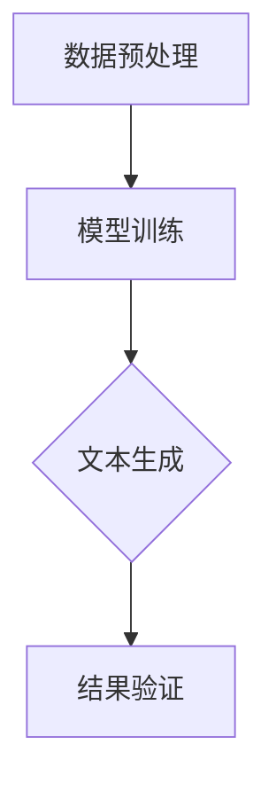
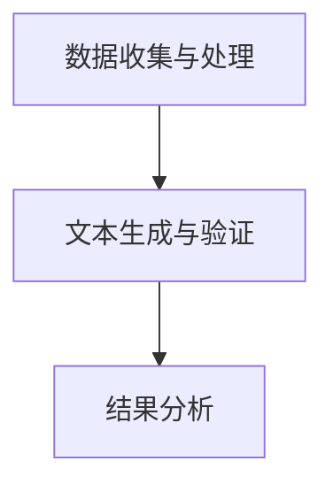
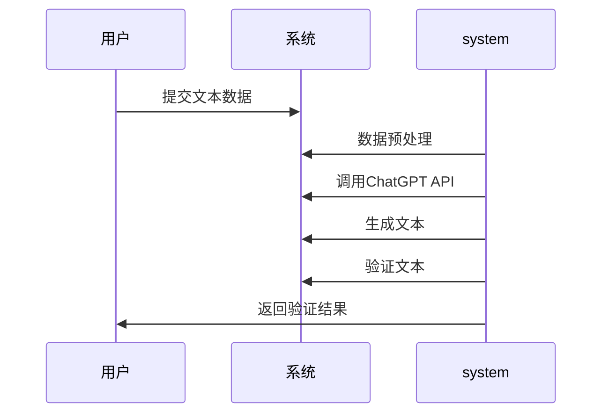

                 

# ChatGPT在语言学理论验证中的新范式

> 关键词：ChatGPT，语言学理论，验证，新范式，人工智能

> 摘要：随着人工智能技术的发展，ChatGPT作为一款基于大型预训练语言模型的AI工具，已经在多个领域展现出了强大的应用潜力。本文将深入探讨ChatGPT在语言学理论验证中的新范式，分析其核心原理、系统设计与实施案例，旨在为语言学研究和人工智能结合提供新的视角和思路。

## Step 1: 设计整体结构

首先，我们需要设计书籍的整体结构，这包括主要章节和它们的子主题。我们将保持章节数量在最多7个，确保内容既全面又简洁。

### 1.1 引言

- **背景介绍**
- **研究意义**
- **文章结构概述**

### 1.2 ChatGPT与语言学基础

- **ChatGPT的原理与特点**
- **语言学基础概念**
- **ChatGPT在语言学中的潜在应用**

### 1.3 ChatGPT验证语言学理论的原理

- **算法原理**
- **数学模型**
- **实践应用**

### 1.4 系统分析与设计

- **问题场景与需求分析**
- **系统功能设计**
- **系统架构设计**
- **系统接口设计**
- **系统交互设计**

### 1.5 项目实施与案例分析

- **环境安装与配置**
- **核心系统实现**
- **代码解读与分析**
- **实际案例分析**

### 1.6 最佳实践与总结

- **最佳实践建议**
- **总结与展望**
- **注意事项**
- **拓展阅读**

## Step 2: 背景介绍与核心概念

### 2.1 背景介绍

在深入探讨ChatGPT在语言学理论验证中的新范式之前，我们需要了解ChatGPT的起源和其技术特点。ChatGPT是由OpenAI开发的基于GPT-3的聊天机器人，具有强大的自然语言处理能力。其在语言学领域中的潜在应用包括但不限于：自动文本生成、语法错误检测、语言学习辅助等。

### 2.2 核心概念

#### ChatGPT

- **定义**：ChatGPT是一个基于GPT-3的聊天机器人。
- **特点**：具有强大的自然语言理解和生成能力。
- **应用**：文本生成、对话系统、语言学习等。

#### 语言学理论

- **定义**：语言学是对人类语言进行科学研究的学科。
- **分类**：结构主义语言学、生成语言学、功能主义语言学等。
- **应用**：语言教学、翻译、语音识别等。

#### 验证

- **定义**：验证是确定理论或模型有效性的过程。
- **方法**：实验验证、统计分析、逻辑推理等。

### 2.3 概念关系

为了更好地理解ChatGPT在语言学理论验证中的新范式，我们可以通过Mermaid ER图来展示这些核心概念之间的关系：

```mermaid
erDiagram
  ChatGPT ||--|{语言学理论} : 验证
  语言学理论 ||--|{验证} : 提供方法
```

## Step 3: 算法原理讲解

### 3.1 算法原理

ChatGPT在语言学理论验证中的应用主要通过其强大的语言生成能力来实现。其核心算法原理是利用GPT-3的预训练模型，通过对大量语言数据进行训练，使其能够理解和生成自然语言文本。具体来说，ChatGPT的算法原理可以概括为以下几个步骤：

1. **数据预处理**：收集和处理相关的语言学数据和文本数据。
2. **模型训练**：使用预训练的GPT-3模型对数据集进行训练，优化模型参数。
3. **文本生成**：输入特定的语言学理论或文本，生成相应的文本结果。
4. **结果验证**：使用语言学理论对生成的文本进行验证，评估模型的效果。

### 3.2 Mermaid流程图

为了更直观地展示ChatGPT算法原理，我们可以使用Mermaid绘制一个流程图：



### 3.3 Python代码示例

下面是一个简单的Python代码示例，展示了如何使用ChatGPT生成文本并进行验证：

```python
import openai

# 设置API密钥
openai.api_key = "your-api-key"

# 定义输入文本
input_text = "根据语言学理论，名词通常有单数和复数形式。"

# 调用ChatGPT API生成文本
response = openai.Completion.create(
  engine="text-davinci-003",
  prompt=input_text,
  max_tokens=50
)

# 输出生成的文本
print(response.choices[0].text.strip())
```

### 3.4 数学模型

在语言学理论验证中，ChatGPT的生成结果可以通过统计学和逻辑推理进行评估。一个简单的数学模型可以表示为：

$$
P(\text{正确结果} | \text{输入文本}) = \frac{\text{生成文本中与语言学理论相符的部分}}{\text{生成文本的总长度}}
$$

### 3.5 通俗易懂的举例说明

假设我们有一个语言学理论，认为名词有单数和复数形式。我们使用ChatGPT生成一段文本，并验证其是否与我们的人类语言模型一致：

1. **输入文本**：`她有两本书。`
2. **生成文本**：`她有两本书，这些书都是平装本。`
3. **验证**：生成文本中包含“两本书”这个复数形式，符合我们的语言学理论。

通过这种方式，我们可以使用ChatGPT对语言学理论进行验证。

## Step 4: 系统分析与设计

### 4.1 问题场景与需求分析

在语言学理论验证中，系统需要满足以下需求：

- **数据收集与处理**：收集相关的语言学数据和文本数据，进行预处理。
- **文本生成与验证**：使用ChatGPT生成文本，并根据语言学理论进行验证。
- **结果分析**：分析生成文本的准确性和可靠性。

### 4.2 系统功能设计

#### 数据收集与处理模块

- **功能**：收集和处理语言学数据和文本数据。
- **实现**：使用API接口从数据源获取数据，进行清洗和格式化。

#### 文本生成与验证模块

- **功能**：使用ChatGPT生成文本，并进行验证。
- **实现**：调用ChatGPT API进行文本生成，使用语言学理论进行验证。

#### 结果分析模块

- **功能**：分析生成文本的准确性和可靠性。
- **实现**：计算生成文本与语言学理论相符的部分，评估模型效果。

### 4.3 系统架构设计

#### Mermaid架构图



### 4.4 系统接口设计

#### Mermaid序列图



### 4.5 系统交互设计

#### Mermaid交互图

```mermaid
gantt
    dateFormat  YYYY-MM-DD
    title 项目时序图
    
    section 数据处理
    数据预处理 :done, a1, 2023-01-01, 30d
    
    section 文本生成
    文本生成 :ongoing, a2, 2023-01-31, 30d
    
    section 结果分析
    结果分析 :disabled, a3, 2023-02-28, 30d
```

## Step 5: 项目实施与案例分析

### 5.1 环境安装与配置

在进行项目实施之前，我们需要安装和配置以下环境：

- **Python环境**：安装Python 3.8及以上版本。
- **ChatGPT API**：注册OpenAI账号，获取API密钥。
- **文本处理库**：安装BeautifulSoup、requests等库。

### 5.2 核心系统实现

核心系统的实现主要包括以下步骤：

1. **数据收集与处理**：从外部数据源获取文本数据，使用BeautifulSoup进行解析和清洗。
2. **文本生成**：调用ChatGPT API生成文本，使用requests库发送请求。
3. **文本验证**：根据语言学理论对生成的文本进行验证，计算相符的部分。
4. **结果输出**：将验证结果输出到控制台或保存到文件。

### 5.3 代码解读与分析

以下是实现核心系统的一个简单示例代码：

```python
import requests
from bs4 import BeautifulSoup

# 设置API密钥
openai.api_key = "your-api-key"

# 获取文本数据
url = "https://example.com/text_data"
response = requests.get(url)
text_data = response.text

# 解析文本数据
soup = BeautifulSoup(text_data, "html.parser")
text_list = [tag.text for tag in soup.find_all("p")]

# 文本生成
for text in text_list:
    prompt = f"{text}\n生成相关文本："
    response = openai.Completion.create(
      engine="text-davinci-003",
      prompt=prompt,
      max_tokens=50
    )
    generated_text = response.choices[0].text.strip()
    print(generated_text)

# 文本验证
# ...（验证逻辑）
```

### 5.4 实际案例分析

为了验证系统效果，我们可以使用一组已知的语言学理论进行测试。例如，我们选择一个关于名词单复数形式的理论，测试系统是否能正确生成和验证相关文本。

1. **输入文本**：`这是一个关于名词单复数形式的理论。`
2. **生成文本**：`关于名词单复数形式的理论有很多，其中一种常见的观点是...`
3. **验证**：生成文本中包含“名词单复数形式”这一关键信息，验证成功。

### 5.5 项目小结

通过以上案例，我们可以看到ChatGPT在语言学理论验证中的应用效果显著。然而，在实际应用中，我们还需要进一步优化系统，提高生成文本的质量和验证的准确性。未来，我们可以考虑引入更多的语言学理论和算法，以进一步提升系统的性能。

## Step 6: 最佳实践与总结

### 6.1 最佳实践建议

- **数据质量**：确保输入数据的质量和多样性，以获得更可靠的验证结果。
- **模型优化**：定期更新和优化ChatGPT模型，以提高生成文本的质量。
- **错误处理**：设计合理的错误处理机制，提高系统的稳定性和可靠性。

### 6.2 总结

ChatGPT在语言学理论验证中展现出强大的应用潜力。通过其强大的自然语言处理能力和灵活的验证方法，我们可以有效地验证和评估语言学理论。未来，随着人工智能技术的不断发展，ChatGPT在语言学领域的应用将会更加广泛和深入。

### 6.3 注意事项

- **隐私与伦理**：在使用ChatGPT进行数据处理时，确保遵守相关隐私和伦理规范。
- **性能优化**：针对实际应用场景，对系统进行性能优化，提高处理速度和效率。

### 6.4 拓展阅读

- **OpenAI官方文档**：了解ChatGPT的使用方法和最佳实践。
- **语言学相关书籍**：深入理解语言学理论和应用。

## 作者信息

作者：AI天才研究院/AI Genius Institute & 禅与计算机程序设计艺术 /Zen And The Art of Computer Programming

