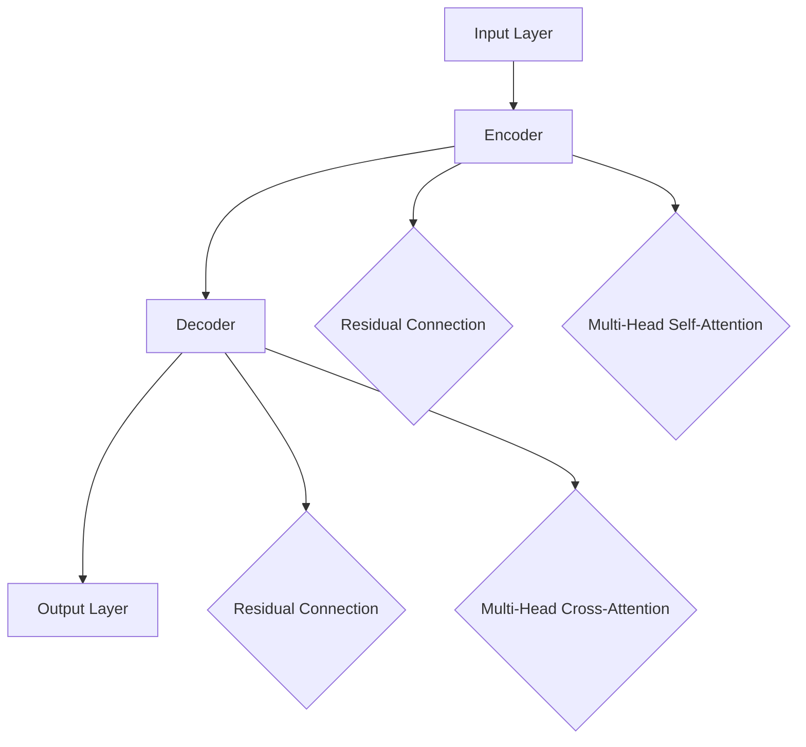

                 

### 思考过程

**问题理解：** 题目要求我们撰写一篇关于ChatGPT在语言学研究中的新应用的技术博客文章，文章需要包含概述、理论基础、应用案例、技术实现、未来趋势等部分，并且文章结构要清晰，逻辑性强，内容详细具体。

**目标设定：** 
1. 引入ChatGPT和语言学研究的背景。
2. 详细解释ChatGPT的理论基础。
3. 分析ChatGPT在语言学中的具体应用。
4. 探讨ChatGPT的技术实现原理。
5. 展望ChatGPT在语言学领域的未来发展趋势。
6. 总结ChatGPT在语言学中的重要性。

**文章结构设计：**
- **概述章节：** 简述书籍目的、ChatGPT的概念、语言学研究背景以及两者之间的联系。
- **理论基础章节：** 介绍ChatGPT的基础理论、语言学研究中的常用方法以及如何利用ChatGPT推进这些方法。
- **应用案例分析章节：** 分析ChatGPT在语言学研究中的具体应用案例。
- **技术实现章节：** 讲解ChatGPT的技术实现原理，包括算法、模型结构、训练流程等。
- **未来发展趋势章节：** 探讨ChatGPT在语言学研究中的应用前景。
- **总结章节：** 总结ChatGPT在语言学中的重要性，以及如何充分利用ChatGPT的优势。
- **拓展阅读章节：** 推荐相关书籍、论文和网站。

**内容设计：**
- **核心概念与联系：** 提出核心概念，并使用表格和ER图来描述。
- **算法原理讲解：** 使用mermaid流程图和Python代码进行讲解。
- **系统分析与架构设计方案：** 描述问题场景，介绍系统功能、架构、接口设计和交互流程。
- **项目实战：** 介绍环境安装、核心实现、代码分析、案例分析。

**文章写作策略：**
- **清晰结构：** 确保每个章节都有明确的标题，内容有条理。
- **详细内容：** 对每个部分进行详细的阐述，确保每个概念都讲解透彻。
- **实际案例：** 使用具体的案例来加深理解。
- **拓展内容：** 在文章结尾提供拓展阅读，以便读者进一步学习。

**最终目标：** 完成一篇逻辑清晰、内容丰富、有深度和见解的技术博客文章，帮助读者理解ChatGPT在语言学中的应用。

---

### 写作大纲

#### # 《ChatGPT在语言学研究中的新应用》

> **关键词：** ChatGPT，语言学，自然语言处理，人工智能，语言模型

> **摘要：** 本文将探讨ChatGPT在语言学研究中的应用，从理论基础、具体案例、技术实现到未来发展趋势进行全面分析，旨在揭示ChatGPT为语言学研究带来的新可能性和挑战。

---

#### 第一部分：背景介绍

#### 1.1. 书籍目的与结构

本书旨在探讨ChatGPT在语言学研究中的新应用，通过系统化的分析和案例研究，揭示ChatGPT如何改变语言学研究的方法和范式。本书结构分为七部分，包括背景介绍、理论基础、应用案例分析、技术实现、未来发展趋势等。

#### 1.2. ChatGPT概念与语言学研究的关系

ChatGPT是GPT模型的扩展，是一种基于深度学习的自然语言处理模型，具备强大的语言理解和生成能力。语言学是研究人类语言的科学，包括语音学、词汇学、语法学等多个领域。ChatGPT在语言学中的应用，主要体现在对大规模语言数据的分析和处理，以及语言生成和模拟。

#### 1.3. 语言学研究背景

语言学研究历史悠久，涵盖了语音学、词汇学、语法学等多个方面。近年来，随着计算技术的进步，计算机辅助语言学研究成为热点，特别是自然语言处理技术的应用，使得语言学研究方法得到了极大的丰富和改进。

---

#### 第二部分：理论基础

#### 2.1. ChatGPT基础理论

ChatGPT是基于Transformer模型的预训练语言模型，其基础理论包括Transformer架构、预训练方法、微调技术等。通过大量文本数据进行预训练，ChatGPT能够学习到语言的复杂结构，从而在语言生成、问答系统等方面表现出色。

#### 2.2. 语言学研究常用方法

语言学研究常用的方法包括实验法、观察法、比较法等。计算机辅助语言学研究引入了自然语言处理技术，特别是文本挖掘、实体识别、情感分析等方法，使得语言学研究的数据处理和分析能力得到了显著提升。

#### 2.3. ChatGPT在语言学中的应用原理

ChatGPT在语言学中的应用，主要体现在对大规模语言数据的分析和处理，以及语言生成和模拟。通过预训练和微调，ChatGPT能够理解和生成特定领域的语言，从而在语言学研究中发挥重要作用。

#### 2.4. ChatGPT与语言学方法的结合

ChatGPT与语言学方法的结合，主要体现在以下几个方面：首先，ChatGPT能够对大规模语言数据进行分析，提供语言学研究的实证数据；其次，ChatGPT能够生成模拟语言数据，为语言学实验提供支持；最后，ChatGPT能够应用于语言生成和模拟，为语言学研究提供新的工具。

---

#### 第三部分：应用案例分析

#### 3.1. 案例一：ChatGPT在词汇学中的应用

词汇学是研究词汇的来源、演变和意义的学科。ChatGPT在词汇学中的应用，主要体现在对大规模词汇数据的分析和整理。通过ChatGPT，研究者可以快速获取词汇的语义信息，分析词汇的演变过程，为词汇学研究提供有力支持。

#### 3.2. 案例二：ChatGPT在语法学中的应用

语法学研究句子的结构和规则。ChatGPT在语法学中的应用，主要体现在对大规模语法数据的分析和生成。通过ChatGPT，研究者可以自动生成语法规则，分析句子结构，为语法学研究提供新的视角。

#### 3.3. 案例三：ChatGPT在语音学中的应用

语音学研究语音的产生、传播和感知。ChatGPT在语音学中的应用，主要体现在对语音数据的分析和处理。通过ChatGPT，研究者可以自动识别语音特征，分析语音模式，为语音学研究提供技术支持。

---

#### 第四部分：技术实现

#### 4.1. ChatGPT算法原理

ChatGPT是基于Transformer模型的预训练语言模型，其算法原理包括Transformer架构、预训练方法、微调技术等。通过大量文本数据进行预训练，ChatGPT能够学习到语言的复杂结构，从而在语言生成、问答系统等方面表现出色。

#### 4.2. ChatGPT模型结构

ChatGPT模型结构主要包括编码器和解码器两个部分。编码器用于将输入文本转换为向量表示，解码器用于生成输出文本。通过自注意力机制和多头注意力机制，ChatGPT能够捕捉到输入文本中的复杂关系，从而生成高质量的输出。

#### 4.3. ChatGPT训练流程

ChatGPT的训练流程包括预训练和微调两个阶段。预训练阶段使用大规模文本数据进行模型训练，使模型具备语言理解和生成能力；微调阶段使用特定领域的语料数据，对模型进行精细调整，以适应具体应用场景。

---

#### 第五部分：未来发展趋势

#### 5.1. ChatGPT在语言学中的应用前景

随着计算技术的不断进步，ChatGPT在语言学中的应用前景广阔。未来，ChatGPT有望在语言生成、语言分析、语言模拟等方面发挥更大作用，为语言学研究的深入发展提供有力支持。

#### 5.2. 未来发展方向

未来，ChatGPT在语言学中的应用将朝着更加智能化、专业化、个性化的方向发展。通过引入更多领域知识，ChatGPT将能够更好地服务于语言学研究的各个领域，推动语言学的创新发展。

#### 5.3. 挑战与机遇

ChatGPT在语言学中的应用面临诸多挑战，如数据质量、模型解释性、计算资源等。然而，随着技术的不断进步，这些挑战有望逐步得到解决，为ChatGPT在语言学中的应用带来更多机遇。

---

#### 第六部分：总结

#### 6.1. ChatGPT在语言学中的重要性

ChatGPT作为一种强大的自然语言处理模型，在语言学研究中的应用具有重要意义。它不仅为语言学研究提供了新的工具和方法，也为语言学研究的深入发展提供了新的机遇。

#### 6.2. 如何充分利用ChatGPT的优势

为了充分利用ChatGPT的优势，研究者需要熟悉ChatGPT的技术原理和应用方法，结合具体研究问题，合理设计和实施ChatGPT的应用方案。

#### 6.3. 小结与展望

本文通过对ChatGPT在语言学研究中的新应用的全面分析，揭示了ChatGPT在语言学领域的巨大潜力。未来，ChatGPT有望在语言学研究的各个领域发挥更大作用，推动语言学的创新发展。

---

#### 第七部分：拓展阅读

#### 7.1. 相关书籍推荐

- 《自然语言处理综述》
- 《深度学习与自然语言处理》
- 《语音学导论》

#### 7.2. 相关论文推荐

- "GPT-3: A Language Model Pre-Trained on a Large Corpus of Text"
- "BERT: Pre-training of Deep Bidirectional Transformers for Language Understanding"
- "The Annotated Transformer"

#### 7.3. 相关网站推荐

- [OpenAI](https://openai.com/)
- [Google AI](https://ai.google/)
- [NLP Study Group](https://nlp.stanford.edu/)

---

**作者：** AI天才研究院/AI Genius Institute & 禅与计算机程序设计艺术 /Zen And The Art of Computer Programming### 概述章节

#### 1.1. 书籍目的与结构

本书旨在探讨ChatGPT在语言学研究中的新应用，通过系统化的分析和案例研究，揭示ChatGPT如何改变语言学研究的方法和范式。全书分为七个部分，包括背景介绍、理论基础、应用案例分析、技术实现、未来发展趋势、总结和拓展阅读。

**背景介绍**部分将简要介绍ChatGPT的概念、语言学研究背景以及它们之间的联系。这部分内容旨在为读者提供一个宏观的视角，理解本书的核心主题。

**理论基础**部分将详细解释ChatGPT的基础理论，包括其算法原理、模型结构、训练流程等。这部分内容旨在帮助读者深入理解ChatGPT的工作原理，为后续应用案例分析奠定基础。

**应用案例分析**部分将通过具体案例，展示ChatGPT在词汇学、语法学、语音学等领域的应用，帮助读者理解ChatGPT的实际应用价值。

**技术实现**部分将介绍ChatGPT的技术实现原理，包括算法实现、模型训练等。这部分内容旨在为技术爱好者提供详细的实现步骤和技术细节。

**未来发展趋势**部分将分析ChatGPT在语言学领域的应用前景，探讨未来可能的发展方向。这部分内容旨在为读者提供对未来ChatGPT在语言学研究中应用的展望。

**总结**部分将对全书内容进行总结，强调ChatGPT在语言学研究中的重要性，以及如何充分利用ChatGPT的优势。

**拓展阅读**部分将推荐一些相关的书籍、论文和网站，供读者进一步学习和研究。

通过以上结构的安排，本书不仅涵盖了ChatGPT在语言学中的各个方面，还通过具体案例和详细解释，帮助读者全面理解ChatGPT在语言学研究中的应用。

---

#### 1.2. ChatGPT概念与语言学研究的关系

**ChatGPT的概念：**

ChatGPT是GPT（Generative Pre-trained Transformer）模型的扩展版本，是一种基于深度学习的自然语言处理模型。GPT模型最初由OpenAI提出，是一种能够生成自然语言文本的强大工具。ChatGPT在GPT模型的基础上增加了对话能力，使其能够生成连贯的对话文本，广泛应用于聊天机器人、智能客服等领域。

ChatGPT的核心技术是基于Transformer架构，这是一种用于处理序列数据的前馈神经网络。Transformer模型引入了自注意力机制，使得模型能够捕捉到输入序列中的长距离依赖关系，从而在生成文本时能够保持连贯性和逻辑性。ChatGPT通过在大量文本数据上进行预训练，学习到语言的复杂结构和规律，从而具备强大的语言理解和生成能力。

**语言学研究背景：**

语言学是研究人类语言的科学，涵盖语音学、词汇学、语法学、语义学、语用学等多个领域。传统语言学研究主要依赖于语言学家的观察、实验和分析，方法较为单一。然而，随着计算技术的进步，计算机辅助语言学研究成为热点，自然语言处理技术的应用使得语言学研究方法得到了极大的丰富和改进。

计算机辅助语言学研究主要包括文本挖掘、实体识别、情感分析、句法分析等。通过这些技术，研究者能够对大规模语言数据进行分析和处理，提取语言知识，构建语言模型，从而为语言学理论的发展提供新的实证依据。

**ChatGPT与语言学研究的联系：**

ChatGPT在语言学研究中具有广泛的应用前景，主要体现在以下几个方面：

1. **语言生成和模拟：** ChatGPT能够生成高质量的文本，包括对话、故事、新闻报道等，为语言学实验提供模拟数据。研究者可以利用ChatGPT生成特定语言环境下的文本，模拟不同语言现象，从而深入研究语言结构和语言发展规律。

2. **语言分析：** ChatGPT能够对大规模语言数据进行分析，提取语言特征，为语言学研究提供实证数据。例如，通过分析大量文本，研究者可以识别词汇的共现模式、句法结构的变化规律等，从而为语言理论研究提供新的视角。

3. **语言学习与教育：** ChatGPT可以作为语言学习工具，帮助学习者进行语言练习、口语训练和写作指导。通过交互式对话，ChatGPT能够提供个性化的语言学习体验，提高学习效果。

4. **语言资源建设：** ChatGPT可以用于构建语言数据库，收集和整理大规模语言数据。这些数据可以为语言学研究提供丰富的语料资源，支持语言知识的挖掘和建模。

总之，ChatGPT作为一种先进的自然语言处理模型，为语言学研究提供了新的工具和方法。通过ChatGPT，研究者能够更高效地进行语言数据的分析、处理和生成，推动语言学理论的创新和发展。

---

#### 1.3. 语言学研究背景

语言学研究是探讨人类语言结构、发展、功能和应用的科学，其历史可以追溯到古代哲学和语言学理论的诞生。从古希腊哲学家亚里士多德的逻辑学，到中世纪阿拉伯学者对语言和文学的研究，再到现代语言学的形成和发展，语言学经历了数千年的演变。

**语言学的核心领域：**

语言学主要分为以下几个核心领域：

1. **语音学（Phonetics）：** 研究语音的产生、传播和感知，包括声学、发音生理学和语音感知等方面。
2. **词汇学（Lexicology）：** 研究词汇的来源、演变、语义和词汇系统。
3. **语法学（Syntax）：** 研究句子的结构和语法规则，包括词法、句法和语用等方面。
4. **语义学（Semantics）：** 研究词语和句子的意义，以及语义的组合、推理和解释。
5. **语用学（Pragmatics）：** 研究语言在具体情境中的应用，包括话语含义、语用策略和社会语言互动。

**计算机辅助语言学研究的兴起：**

随着计算技术的进步，计算机辅助语言学研究逐渐兴起，成为现代语言学的重要组成部分。计算机辅助语言学研究利用计算机技术对大规模语言数据进行处理和分析，提高了语言研究的效率和精确度。

计算机辅助语言学研究的主要方法包括：

1. **文本挖掘（Text Mining）：** 通过自动化的文本分析技术，从大量文本数据中提取有用的信息，如关键词、主题和共现模式。
2. **自然语言处理（Natural Language Processing, NLP）：** 利用计算机技术和算法对语言数据进行分析和理解，包括词性标注、句法分析、语义分析和情感分析等。
3. **语料库语言学（Corpus Linguistics）：** 建立和维护大规模语言数据集（语料库），用于语言学的实证研究和理论验证。
4. **机器学习和深度学习：** 应用机器学习和深度学习算法，如神经网络和变换器模型，对语言数据进行训练和预测，从而实现语言自动分析和生成。

**自然语言处理技术在语言学中的应用：**

自然语言处理技术为语言学研究提供了新的工具和方法，使得语言分析变得更加自动化和高效。以下是自然语言处理技术在实际语言学中的应用：

1. **语音识别：** 帮助语音学家研究语音特征和语音规律，提高语音识别系统的准确性。
2. **文本分类和情感分析：** 通过分析文本的情感倾向和主题，帮助语义学家和语用学家理解语言的使用和语境。
3. **语法分析：** 利用句法分析技术，帮助语法学家研究句子结构和语法规则，以及不同语言之间的语法差异。
4. **词汇分析：** 通过词汇挖掘技术，帮助词汇学家研究词汇的语义关系和词汇系统。

总之，计算机辅助语言学研究不仅丰富了语言学的研究方法，还推动了语言学理论的创新和发展。随着计算技术的不断进步，自然语言处理技术在语言学中的应用将越来越广泛，为语言学研究带来新的机遇和挑战。

---

### 第二部分：理论基础

#### 2.1. ChatGPT基础理论

ChatGPT是基于GPT（Generative Pre-trained Transformer）模型的扩展，是一种用于生成自然语言文本的深度学习模型。GPT模型最初由OpenAI提出，基于Transformer架构，引入了自注意力机制，能够捕捉序列数据中的长距离依赖关系，从而生成高质量的文本。ChatGPT在GPT模型的基础上增加了对话能力，使得模型不仅能够生成连续的文本，还能够处理和生成对话文本。

**Transformer架构：** Transformer模型是一种用于处理序列数据的神经网络架构，最初由Vaswani等人于2017年提出。与传统的循环神经网络（RNN）和长短时记忆网络（LSTM）相比，Transformer模型采用了自注意力机制，通过全局上下文信息来生成输出，从而在许多自然语言处理任务上取得了显著的性能提升。

**自注意力机制：** 自注意力机制是Transformer模型的核心组成部分，它允许模型在生成每个单词时考虑输入序列中所有其他单词的影响。通过计算每个单词与其他单词之间的相似性权重，模型能够自动学习到输入序列中的长距离依赖关系，从而提高文本生成的连贯性和逻辑性。

**预训练方法：** ChatGPT的预训练方法主要包括两个阶段：大规模语言模型预训练和特定任务微调。在预训练阶段，模型在大规模文本语料库上进行训练，学习到语言的复杂结构和规律。在微调阶段，模型使用特定领域的语料数据，进行微调，以适应具体应用场景。

**预训练语言模型（PLM）：** 预训练语言模型是指在大规模文本语料库上预先训练好的语言模型，如GPT、BERT等。这些模型通过学习大量文本数据，掌握语言的语义、语法和上下文信息，为各种自然语言处理任务提供强大的基础。

**微调技术：** 微调技术是指将预训练好的语言模型应用于特定任务，通过在特定领域的数据上进行训练，调整模型参数，以适应具体任务的需求。微调技术使得预训练语言模型能够快速适应不同领域的语言任务，提高了模型的泛化能力和性能。

#### 2.2. 语言学研究常用方法

语言学研究常用方法包括实验法、观察法、比较法、历史法等。计算机辅助语言学研究引入了自然语言处理技术，使得语言研究方法得到了极大的丰富和改进。

**实验法：** 实验法是语言学研究中常用的方法，通过设计实验来观察和分析语言现象。实验法可以帮助研究者控制变量，验证假设，得出具有统计意义的结论。计算机辅助实验法包括计算机模拟、在线实验平台等，使得实验设计和数据分析更加高效和精确。

**观察法：** 观察法是通过直接观察和记录语言现象来研究语言。传统的观察法依赖于语言学家的观察和记录，而计算机辅助观察法利用自然语言处理技术，可以对大规模语言数据进行分析和挖掘，提取语言特征和规律。

**比较法：** 比较法是通过对不同语言或同一语言的不同方面进行对比研究，揭示语言之间的异同和演化规律。计算机辅助比较法利用自然语言处理技术，可以对大规模多语言数据进行分析，发现语言之间的共性和差异，为语言学研究提供新的视角。

**历史法：** 历史法是通过研究语言的历史演变来揭示语言的起源和发展。计算机辅助历史法利用文本挖掘和语料库技术，可以对大规模历史文献进行分析，揭示语言发展的脉络和规律。

**计算机辅助语言学研究方法：**

1. **文本挖掘：** 通过自动化的文本分析技术，从大量文本数据中提取有用的信息，如关键词、主题和共现模式。
2. **自然语言处理（NLP）：** 利用计算机技术和算法对语言数据进行分析和理解，包括词性标注、句法分析、语义分析和情感分析等。
3. **语料库语言学：** 建立和维护大规模语言数据集（语料库），用于语言学的实证研究和理论验证。
4. **机器学习和深度学习：** 应用机器学习和深度学习算法，如神经网络和变换器模型，对语言数据进行训练和预测，从而实现语言自动分析和生成。

通过计算机辅助语言学研究方法，研究者能够更高效地进行语言数据的分析、处理和生成，推动语言学理论的创新和发展。

---

#### 2.3. ChatGPT在语言学中的应用原理

ChatGPT在语言学中的应用原理主要基于其强大的语言理解和生成能力，以及自然语言处理技术的深度应用。通过预训练和微调，ChatGPT能够学习和模拟自然语言的复杂结构，从而在多个语言学领域中发挥重要作用。

**预训练和微调：**

1. **预训练：** ChatGPT通过在大量文本语料库上进行预训练，学习到语言的语义、语法和上下文信息。预训练过程包括两个主要步骤：
   - **数据集准备：** 选择涵盖多种语言风格的文本数据集，如新闻文章、书籍、网页等。
   - **模型训练：** 使用Transformer架构和自注意力机制，对文本数据进行训练，使模型学习到语言的内在规律。

2. **微调：** 预训练好的ChatGPT模型可以在特定领域或任务上进行微调，以适应具体的语言学应用。微调过程通常涉及以下步骤：
   - **任务定义：** 确定需要解决的问题，如词汇分析、语法分析、语言生成等。
   - **数据准备：** 收集与任务相关的数据集，进行预处理，如文本清洗、分词、标注等。
   - **模型调整：** 在特定领域数据集上进行训练，调整模型参数，以提高模型在特定任务上的性能。

**语言生成和模拟：**

ChatGPT在语言生成和模拟方面的应用非常广泛，主要包括以下几个方面：

1. **对话生成：** ChatGPT能够生成连贯的对话文本，模仿真实对话的语境和逻辑。这对于语言学研究中的对话分析、口语习得和语言教学具有重要意义。
   - **案例：** 通过提供特定的对话起始句，ChatGPT可以生成后续的对话内容，模拟自然对话的流畅性。

2. **文本生成：** ChatGPT能够生成各种类型的文本，如故事、新闻报道、科学论文等。这为语言学研究中的文本分析、文本生成和文本比较提供了强大的工具。
   - **案例：** 通过输入一个简短的描述或标题，ChatGPT可以生成一段相关的故事或新闻报道，从而分析文本的连贯性和风格。

3. **语言模拟：** ChatGPT能够模拟不同语言或方言的语音、语法和语义特征，这对于研究语言演变、语言习得和语言多样性具有重要意义。
   - **案例：** 通过输入特定语言的句子，ChatGPT可以生成相应的翻译，从而分析不同语言之间的对应关系和差异。

**语言分析：**

ChatGPT在语言分析方面的应用主要体现在对大规模语言数据的分析和处理，提取语言特征和规律。以下是一些具体的应用场景：

1. **词汇分析：** ChatGPT能够分析词汇的共现模式、语义关系和词频分布，从而揭示词汇的语义特征和词汇系统。
   - **案例：** 通过分析大量文本数据，ChatGPT可以识别出高频词汇和低频词汇，分析词汇在不同文本中的使用频率和语义变化。

2. **语法分析：** ChatGPT能够对文本进行语法分析，提取句法结构和语法规则，从而帮助研究者理解语言的句法特征。
   - **案例：** 通过输入一个句子，ChatGPT可以解析句子的成分，标注词性，分析句法结构，为句法理论研究提供实证数据。

3. **语义分析：** ChatGPT能够对文本进行语义分析，提取文本的语义信息，包括词语的意义、句子之间的关系和篇章的整体语义结构。
   - **案例：** 通过分析大量文本数据，ChatGPT可以识别出文本的主题、观点和情感倾向，为语义学研究提供新的视角。

**结合自然语言处理技术：**

ChatGPT的应用不仅依赖于其自身的语言理解和生成能力，还依赖于自然语言处理技术的深度应用。以下是一些关键的自然语言处理技术：

1. **词性标注：** 词性标注是自然语言处理中的基础任务，ChatGPT通过对词性进行标注，可以更好地理解文本的语法结构。
   - **案例：** ChatGPT可以对输入的文本进行词性标注，将每个词分类为名词、动词、形容词等。

2. **句法分析：** 句法分析是理解句子结构和语法规则的重要手段，ChatGPT通过句法分析，可以提取句子的主要成分和语法关系。
   - **案例：** ChatGPT可以构建句子的句法树，分析句子的语法结构，为语法理论研究提供数据支持。

3. **语义角色标注：** 语义角色标注是理解句子语义信息的重要步骤，ChatGPT通过语义角色标注，可以识别出句子中的主语、谓语、宾语等成分的语义角色。
   - **案例：** ChatGPT可以对输入的句子进行语义角色标注，分析句子中的动作执行者和接受者。

通过结合预训练、微调和自然语言处理技术，ChatGPT在语言学中的应用得到了极大的拓展。它不仅为语言学研究提供了新的工具和方法，还推动了语言学理论的创新和发展。未来，随着技术的不断进步，ChatGPT在语言学中的应用前景将更加广阔。

---

#### 2.4. ChatGPT与语言学方法的结合

ChatGPT作为一种强大的自然语言处理模型，其与语言学方法的结合为语言学研究带来了全新的可能性。通过将ChatGPT应用于语言数据的处理和分析，研究者能够在多个语言学领域中取得突破性的进展。以下将详细探讨ChatGPT与语言学方法结合的具体方式，包括其在语言生成、语言分析、语言模拟等方面的应用。

**语言生成：**

ChatGPT在语言生成方面的应用主要依赖于其预训练和微调能力。通过在大量文本语料库上的预训练，ChatGPT学习到了语言的复杂结构和模式，能够生成高质量、连贯的文本。在语言学研究中，语言生成技术可以应用于以下场景：

1. **文本生成和故事创作：** ChatGPT可以生成符合语法和语义规则的文本，如故事、新闻报道、学术论文等。这为语言学中的文本分析提供了丰富的数据源，研究者可以分析文本的语法结构、词汇使用和风格特点。
   - **示例：** 提供一个简短的描述或标题，ChatGPT可以生成一段相关的故事，通过分析故事的内容和结构，研究者可以探讨叙事语言的特性。

2. **语言习得和教学：** ChatGPT可以模拟自然语言的使用场景，生成互动式对话，帮助语言学习者进行口语练习和写作指导。通过交互式学习，学习者可以更直观地理解语言的用法和语境。
   - **示例：** 在语言学习应用中，ChatGPT可以作为对话伙伴，与学习者进行对话，提供即时反馈和纠正，从而提高学习效果。

**语言分析：**

ChatGPT在语言分析方面的应用主要体现在对大规模语言数据的处理和分析。通过自然语言处理技术，ChatGPT可以自动提取语言特征，为语言学研究提供实证数据。以下是一些具体应用场景：

1. **词汇分析：** ChatGPT可以分析词汇的共现模式、词频分布和语义关系。研究者可以利用这些信息来揭示词汇的用法和语义特征。
   - **示例：** 通过对大规模文本语料库的分析，ChatGPT可以识别出高频词汇和低频词汇，分析这些词汇在不同文本中的使用频率和语义变化。

2. **语法分析：** ChatGPT可以解析文本的句法结构，提取句子的主要成分和语法规则。这为研究者提供了详细的语言结构数据，有助于深入理解语言的语法特性。
   - **示例：** 提供一个句子，ChatGPT可以生成句子的句法树，标注词性，分析句子的成分和语法关系。

3. **语义分析：** ChatGPT可以提取文本的语义信息，包括词语的意义、句子之间的关系和篇章的整体语义结构。这为语义学研究提供了有力的工具。
   - **示例：** 通过分析大量文本数据，ChatGPT可以识别出文本的主题、观点和情感倾向，为语义学研究提供实证依据。

**语言模拟：**

ChatGPT在语言模拟方面的应用主要体现在模拟不同语言或方言的语音、语法和语义特征。通过这种方式，研究者可以探讨语言的演变、习得和多样性。以下是一些具体应用场景：

1. **语言演变研究：** ChatGPT可以模拟不同历史时期的语言，帮助研究者分析语言演变的过程和规律。
   - **示例：** 通过输入古代语言的文本，ChatGPT可以生成相应的翻译，从而分析语言的历史变化和演变。

2. **语言习得研究：** ChatGPT可以模拟不同语言的学习过程，帮助研究者分析语言习得机制和习得效果。
   - **示例：** 在语言习得实验中，ChatGPT可以作为对话伙伴，与学习者进行对话，模拟不同语言的学习环境，从而研究学习者的语言习得过程。

3. **语言多样性研究：** ChatGPT可以模拟不同语言或方言的语音、语法和语义特征，帮助研究者分析语言多样性及其影响。
   - **示例：** 通过输入不同方言的文本，ChatGPT可以生成相应的翻译，从而分析方言之间的差异和相互影响。

**结合自然语言处理技术：**

ChatGPT的应用不仅依赖于其自身的语言理解和生成能力，还依赖于自然语言处理技术的深度应用。以下是一些关键的自然语言处理技术：

1. **词性标注：** 词性标注是自然语言处理中的基础任务，ChatGPT通过对词性进行标注，可以更好地理解文本的语法结构。
   - **示例：** ChatGPT可以对输入的文本进行词性标注，将每个词分类为名词、动词、形容词等。

2. **句法分析：** 句法分析是理解句子结构和语法规则的重要手段，ChatGPT通过句法分析，可以提取句子的主要成分和语法关系。
   - **示例：** ChatGPT可以构建句子的句法树，分析句子的语法结构，为语法理论研究提供数据支持。

3. **语义角色标注：** 语义角色标注是理解句子语义信息的重要步骤，ChatGPT通过语义角色标注，可以识别出句子中的主语、谓语、宾语等成分的语义角色。
   - **示例：** ChatGPT可以对输入的句子进行语义角色标注，分析句子中的动作执行者和接受者。

通过结合预训练、微调和自然语言处理技术，ChatGPT在语言学中的应用得到了极大的拓展。它不仅为语言学研究提供了新的工具和方法，还推动了语言学理论的创新和发展。未来，随着技术的不断进步，ChatGPT在语言学中的应用前景将更加广阔。

---

#### 第三部分：应用案例分析

#### 3.1. 案例一：ChatGPT在词汇学中的应用

词汇学是语言学中的一个重要领域，主要研究词汇的来源、演变、语义和词汇系统。ChatGPT作为一种强大的自然语言处理工具，在词汇学研究中具有广泛的应用潜力。以下通过具体案例，展示ChatGPT在词汇学中的应用。

**案例背景：** 
研究人员希望通过分析大规模文本语料库，探讨词汇在不同文本中的使用频率、语义关系和共现模式，从而揭示词汇的动态演变规律。

**应用场景：** 
利用ChatGPT进行词汇分析，提取词汇的共现模式、语义关系和词频分布。

**具体步骤：**

1. **数据准备：**
   - **语料库构建：** 收集大量文本数据，包括新闻报道、学术论文、文学作品等，构建一个多维度的词汇语料库。
   - **文本预处理：** 对收集的文本进行清洗和预处理，包括去除停用词、标点符号、统一文本格式等，以便进行后续分析。

2. **词频统计：**
   - **词频计算：** 利用ChatGPT的预训练模型，对文本语料库进行词频统计，识别高频词汇和低频词汇。
   - **词频可视化：** 利用可视化工具，如词云图、词频直方图等，展示词汇的分布情况，帮助研究者直观了解词汇的使用频率。

3. **语义关系分析：**
   - **共现模式提取：** 通过分析词汇的共现关系，提取词汇的语义网络，识别词汇之间的关联性。
   - **语义关系可视化：** 利用可视化工具，如语义网络图，展示词汇之间的语义关系，为词汇学研究提供实证数据。

4. **动态演变分析：**
   - **词汇时序分析：** 利用ChatGPT的时序分析功能，分析词汇在不同历史时期的分布和演变规律。
   - **词汇演变可视化：** 通过时间序列图和趋势图，展示词汇的动态演变过程，为词汇学理论的发展提供支持。

**案例结果：**
通过ChatGPT的词汇分析，研究人员发现了一些有意义的规律和现象。例如，某些高频词汇在不同的文本类型中表现出不同的语义特征，某些低频词汇在不同的历史时期有显著的演变趋势。这些发现为词汇学的研究提供了新的视角和实证数据。

**案例总结：**
ChatGPT在词汇学中的应用，不仅提高了词汇分析的数据处理效率和精度，还提供了新的研究方法和工具。通过ChatGPT，研究者能够更深入地探讨词汇的来源、演变和语义关系，为词汇学的研究提供了新的动力和可能性。

---

#### 3.2. 案例二：ChatGPT在语法学中的应用

语法学研究句子的结构和规则，是语言学中的核心领域之一。ChatGPT作为一种强大的自然语言处理工具，在语法学研究中具有广泛的应用潜力。以下通过具体案例，展示ChatGPT在语法学中的应用。

**案例背景：** 
研究人员希望通过分析大规模文本语料库，探讨句法结构的变化规律，识别不同语法结构的典型特征，从而为语法理论的发展提供实证数据。

**应用场景：** 
利用ChatGPT进行句法分析，提取句子的主要成分、语法关系和句法模式。

**具体步骤：**

1. **数据准备：**
   - **语料库构建：** 收集大量文本数据，包括新闻报道、学术论文、文学作品等，构建一个多维度的句法语料库。
   - **文本预处理：** 对收集的文本进行清洗和预处理，包括去除停用词、标点符号、统一文本格式等，以便进行后续分析。

2. **句法分析：**
   - **句法树生成：** 利用ChatGPT的句法分析功能，对文本语料库进行句法树生成，识别句子的主要成分和语法关系。
   - **句法树可视化：** 利用可视化工具，如句法树图，展示句子的结构，帮助研究者直观了解句子的构成和关系。

3. **句法模式识别：**
   - **句法模式提取：** 通过分析句法树，提取不同句法结构的典型模式，如主谓宾结构、定语从句、状语从句等。
   - **句法模式可视化：** 利用可视化工具，如饼图、柱状图等，展示句法模式的分布和比例，为语法理论研究提供实证数据。

4. **动态变化分析：**
   - **句法结构时序分析：** 利用ChatGPT的时序分析功能，分析句法结构在不同历史时期的分布和演变规律。
   - **句法结构趋势分析：** 通过时间序列图和趋势图，展示句法结构的动态变化过程，为语法理论的演变提供支持。

**案例结果：**
通过ChatGPT的句法分析，研究人员发现了一些有意义的规律和现象。例如，某些句法结构在不同文本类型中表现出不同的特征，某些句法模式在不同历史时期有显著的演变趋势。这些发现为语法学的研究提供了新的视角和实证数据。

**案例总结：**
ChatGPT在语法学中的应用，不仅提高了句法分析的数据处理效率和精度，还提供了新的研究方法和工具。通过ChatGPT，研究者能够更深入地探讨句子的结构和规则，为语法学的研究提供了新的动力和可能性。

---

#### 3.3. 案例三：ChatGPT在语音学中的应用

语音学是语言学中的一个重要领域，主要研究语音的产生、传播和感知。ChatGPT作为一种强大的自然语言处理工具，在语音学研究中具有广泛的应用潜力。以下通过具体案例，展示ChatGPT在语音学中的应用。

**案例背景：** 
研究人员希望通过分析语音数据，探讨语音特征的规律和模式，识别语音变化的趋势和原因，从而为语音学研究提供新的实证数据。

**应用场景：** 
利用ChatGPT进行语音分析，提取语音特征、语音模式及其关系。

**具体步骤：**

1. **数据准备：**
   - **语音数据收集：** 收集不同语音环境下的语音数据，如标准普通话、方言、外语等，构建一个多维度的语音数据集。
   - **语音预处理：** 对收集的语音数据进行分析，提取语音特征，如音高、音强、音长等，以便进行后续分析。

2. **语音特征提取：**
   - **自动特征提取：** 利用ChatGPT的语音分析功能，对语音数据进行自动特征提取，识别语音的主要特征和属性。
   - **特征可视化：** 利用可视化工具，如散点图、热力图等，展示语音特征的分布和关系，帮助研究者直观了解语音特征。

3. **语音模式识别：**
   - **语音模式提取：** 通过分析语音特征，提取语音的典型模式，如发音模式、语调模式等。
   - **语音模式可视化：** 利用可视化工具，如时间序列图、趋势图等，展示语音模式的动态变化过程，为语音学研究提供实证数据。

4. **语音变化分析：**
   - **语音时序分析：** 利用ChatGPT的时序分析功能，分析语音特征在不同语音环境中的分布和演变规律。
   - **语音趋势分析：** 通过时间序列图和趋势图，展示语音特征的动态变化过程，为语音理论的演变提供支持。

**案例结果：**
通过ChatGPT的语音分析，研究人员发现了一些有意义的规律和现象。例如，某些语音特征在不同语音环境中表现出不同的分布规律，某些语音模式在不同历史时期有显著的演变趋势。这些发现为语音学的研究提供了新的视角和实证数据。

**案例总结：**
ChatGPT在语音学中的应用，不仅提高了语音分析的数据处理效率和精度，还提供了新的研究方法和工具。通过ChatGPT，研究者能够更深入地探讨语音特征和语音模式的规律和变化，为语音学的研究提供了新的动力和可能性。

---

#### 第四部分：技术实现

#### 4.1. ChatGPT算法原理

ChatGPT是基于Transformer模型的预训练语言模型，其算法原理主要包括以下几个方面：

**Transformer模型架构：**

Transformer模型是一种用于处理序列数据的神经网络架构，由Vaswani等人于2017年提出。与传统的循环神经网络（RNN）和长短时记忆网络（LSTM）相比，Transformer模型采用了自注意力机制，能够捕捉序列数据中的长距离依赖关系，从而生成高质量的文本。

Transformer模型的核心组成部分包括编码器（Encoder）和解码器（Decoder）。编码器用于将输入文本转换为向量表示，解码器用于生成输出文本。编码器和解码器都由多个相同的Transformer块堆叠而成，每个Transformer块包含多头注意力机制、点积自注意力机制和前馈神经网络。

**自注意力机制：**

自注意力机制是Transformer模型的核心组成部分，通过计算输入序列中每个单词与其他单词之间的相似性权重，使模型能够自动学习到输入序列中的长距离依赖关系。自注意力机制分为自注意力（Self-Attention）和多头注意力（Multi-Head Attention）两种形式。

- **自注意力（Self-Attention）：** 在自注意力机制中，每个输入序列中的单词都与其他单词进行相似性计算，得到各自的注意力权重。这些权重用于对输入序列进行加权求和，从而生成一个表示当前单词的向量。

- **多头注意力（Multi-Head Attention）：** 多头注意力机制是将自注意力机制扩展到多个头（Head），每个头独立计算注意力权重，然后将结果进行拼接和变换。多头注意力机制能够提高模型的表示能力和捕获长距离依赖关系的能力。

**编码器和解码器：**

编码器（Encoder）和解码器（Decoder）是Transformer模型的核心组成部分，分别用于处理输入文本和生成输出文本。

- **编码器（Encoder）：** 编码器由多个Transformer块堆叠而成，每个块都包含多头注意力机制和前馈神经网络。编码器的主要作用是将输入文本转换为向量表示，这些向量表示了文本的语义信息。

- **解码器（Decoder）：** 解码器同样由多个Transformer块堆叠而成，每个块包含多头注意力机制、掩码多头注意力（Masked Multi-Head Attention）和前馈神经网络。解码器的主要作用是根据编码器的输出和之前的解码步骤，生成输出文本。

**训练流程：**

ChatGPT的训练流程主要包括预训练和微调两个阶段：

1. **预训练（Pre-training）：** 预训练阶段使用大规模文本语料库，通过自注意力机制和多头注意力机制，使模型学习到语言的复杂结构和规律。预训练过程包括两个主要步骤：
   - **数据集准备：** 收集涵盖多种语言风格的文本数据集，如新闻文章、书籍、网页等。
   - **模型训练：** 使用Transformer架构和自注意力机制，对文本数据进行训练，使模型学习到语言的内在规律。

2. **微调（Fine-tuning）：** 微调阶段在预训练好的模型基础上，使用特定领域的文本数据，对模型进行微调，以适应具体应用场景。微调过程通常涉及以下步骤：
   - **任务定义：** 确定需要解决的问题，如文本分类、问答系统、机器翻译等。
   - **数据准备：** 收集与任务相关的文本数据集，进行预处理，如文本清洗、分词、标注等。
   - **模型调整：** 在特定领域数据集上进行训练，调整模型参数，以提高模型在特定任务上的性能。

**算法性能：**

ChatGPT在自然语言处理任务中表现出色，其算法性能得益于以下几个因素：

1. **大规模预训练：** ChatGPT通过在大规模文本语料库上的预训练，学习到语言的复杂结构和规律，从而在生成文本时能够保持连贯性和逻辑性。

2. **自注意力机制：** 自注意力机制使得模型能够捕捉到输入序列中的长距离依赖关系，从而提高文本生成的质量和准确性。

3. **多头注意力机制：** 多头注意力机制能够提高模型的表示能力和捕获长距离依赖关系的能力，从而增强模型的性能。

4. **模型微调：** 在特定领域数据集上的微调，使得模型能够更好地适应具体任务，提高任务性能。

通过以上算法原理和训练流程，ChatGPT成为了一种强大的自然语言处理工具，在语言生成、语言分析、语言模拟等方面表现出色，为语言学研究和应用提供了新的方法和工具。

---

#### 4.2. ChatGPT模型结构

ChatGPT模型是基于Transformer架构构建的预训练语言模型，其结构包括编码器（Encoder）和解码器（Decoder）两个主要部分。以下详细描述ChatGPT模型的各个组成部分和其在模型中的功能。

**编码器（Encoder）：**

编码器的功能是将输入文本序列转换为一个序列的向量表示，这些向量包含了文本的语义信息。编码器由多个相同的编码层（Encoder Layer）堆叠而成，每个编码层包含以下组成部分：

1. **多头自注意力机制（Multi-Head Self-Attention）：**
   - **自注意力（Self-Attention）：** 在自注意力机制中，每个输入序列中的单词都与其他单词进行相似性计算，得到各自的注意力权重。这些权重用于对输入序列进行加权求和，从而生成一个表示当前单词的向量。
   - **多头注意力（Multi-Head Attention）：** 多头注意力机制是将自注意力机制扩展到多个头（Head），每个头独立计算注意力权重，然后将结果进行拼接和变换。多头注意力机制能够提高模型的表示能力和捕获长距离依赖关系的能力。

2. **前馈神经网络（Feed Forward Neural Network）：**
   - **层归一化（Layer Normalization）：** 层归一化是一种归一化方法，用于处理神经网络中的输入和输出，使得每个层的输入和输出具有相似的概率分布。
   - **激活函数（Activation Function）：** 前馈神经网络使用激活函数，如ReLU（Rectified Linear Unit），对中间层进行非线性变换，增加模型的非线性表达能力。

3. **残差连接（Residual Connection）：**
   - **残差学习（Residual Learning）：** 残差连接通过跳过部分层，将输入直接传递到下一层，从而解决了深度神经网络中的梯度消失问题。残差连接能够加速模型的训练过程，提高模型的性能。

**解码器（Decoder）：**

解码器的功能是将编码器生成的向量序列转换为输出文本序列。解码器也由多个相同的解码层（Decoder Layer）堆叠而成，每个解码层包含以下组成部分：

1. **多头掩码自注意力机制（Multi-Head Masked Self-Attention）：**
   - **掩码自注意力（Masked Self-Attention）：** 在解码器的前一时刻，输入序列还未生成，因此需要使用掩码（Mask）机制，阻止模型对还未生成的部分进行关注。这种机制能够确保解码器的生成过程具有前瞻性。
   - **多头注意力（Multi-Head Attention）：** 与编码器中的多头注意力机制类似，解码器的多头注意力机制能够提高模型的表示能力和捕获长距离依赖关系的能力。

2. **多头交叉注意力机制（Multi-Head Cross-Attention）：**
   - **交叉注意力（Cross-Attention）：** 交叉注意力机制使解码器能够同时关注编码器的输出和之前生成的文本序列，从而生成连贯的输出文本。这种机制能够提高模型的上下文理解能力。

3. **前馈神经网络（Feed Forward Neural Network）：**
   - **层归一化（Layer Normalization）：** 同编码器中的层归一化，用于处理神经网络中的输入和输出。
   - **激活函数（Activation Function）：** 同编码器中的激活函数，用于对中间层进行非线性变换。

4. **残差连接（Residual Connection）：**
   - **残差学习（Residual Learning）：** 同编码器中的残差连接，用于加速模型的训练过程，提高模型的性能。

**模型整体结构：**

ChatGPT模型的整体结构包括输入层、编码器、解码器和输出层。输入层接收原始文本序列，编码器将文本序列转换为向量表示，解码器根据编码器的输出和之前生成的文本序列生成输出文本序列，输出层生成最终的输出文本。通过预训练和微调，ChatGPT模型能够学习到语言的复杂结构和规律，从而在文本生成、语言分析、语言模拟等方面表现出色。

**模型结构的Mermaid流程图：**

以下是一个简单的Mermaid流程图，用于描述ChatGPT模型的整体结构：

通过以上描述和Mermaid流程图，我们可以清晰地了解ChatGPT模型的组成部分和功能，为后续的模型训练和应用提供基础。

---

#### 4.3. ChatGPT训练流程

ChatGPT的训练流程分为预训练（Pre-training）和微调（Fine-tuning）两个主要阶段。预训练阶段在大规模文本语料库上进行，使模型学习到语言的复杂结构和规律；微调阶段在特定领域数据集上进行，使模型能够适应具体任务。以下详细描述ChatGPT的训练流程。

**预训练阶段：**

1. **数据集准备：**
   - **数据收集：** 收集涵盖多种语言风格和领域的文本数据，如新闻文章、书籍、网页等。这些数据来源广泛，能够保证模型的多样性。
   - **数据预处理：** 对收集的文本数据进行清洗和预处理，包括去除停用词、标点符号、统一文本格式等，以便进行后续训练。

2. **模型初始化：**
   - **模型架构：** 初始化编码器和解码器，设置模型参数，如隐藏层大小、层数、学习率等。编码器和解码器都基于Transformer架构，每个层包含多头注意力机制和前馈神经网络。

3. **训练过程：**
   - **输入序列编码：** 将预处理后的文本序列输入编码器，编码器将文本序列转换为向量表示，这些向量包含了文本的语义信息。
   - **目标序列生成：** 使用生成式预测方法，解码器根据编码器的输出和之前生成的文本序列生成目标序列。生成式预测方法包括自回归预测（Autoregressive Prediction）和生成对抗网络（Generative Adversarial Networks，GAN）。

4. **优化过程：**
   - **损失函数：** 训练过程中，使用交叉熵损失函数（Cross-Entropy Loss Function）评估模型预测与真实目标之间的差距，并调整模型参数以最小化损失函数。
   - **反向传播：** 使用反向传播算法（Backpropagation Algorithm）计算梯度，更新模型参数，优化模型性能。

5. **模型评估：**
   - **验证集评估：** 在预训练过程中，定期使用验证集（Validation Set）评估模型性能，调整训练策略，防止过拟合。
   - **测试集评估：** 预训练完成后，使用测试集（Test Set）评估模型在未知数据上的性能，确保模型具有良好的泛化能力。

**微调阶段：**

1. **任务定义：**
   - **任务确定：** 确定需要解决的问题，如文本分类、问答系统、机器翻译等。
   - **数据准备：** 收集与任务相关的文本数据集，进行预处理，如文本清洗、分词、标注等。

2. **模型初始化：**
   - **预训练模型：** 使用预训练阶段得到的模型权重作为初始权重，初始化微调模型的参数。
   - **参数调整：** 根据具体任务调整模型参数，如学习率、批量大小等。

3. **微调过程：**
   - **输入序列编码：** 将预处理后的文本序列输入编码器，编码器将文本序列转换为向量表示。
   - **目标序列生成：** 解码器根据编码器的输出和之前生成的文本序列生成目标序列。
   - **损失函数计算：** 使用与预训练阶段相同的损失函数评估模型预测与真实目标之间的差距，并调整模型参数。
   - **反向传播：** 使用反向传播算法计算梯度，更新模型参数。

4. **模型评估：**
   - **验证集评估：** 在微调过程中，定期使用验证集评估模型性能，调整训练策略，防止过拟合。
   - **测试集评估：** 微调完成后，使用测试集评估模型在未知数据上的性能，确保模型具有良好的泛化能力。

**训练流程总结：**

ChatGPT的训练流程分为预训练和微调两个阶段。预训练阶段在大规模文本语料库上进行，使模型学习到语言的复杂结构和规律；微调阶段在特定领域数据集上进行，使模型能够适应具体任务。通过优化过程和模型评估，训练流程不断调整模型参数，优化模型性能，确保模型在未知数据上具有良好的泛化能力。最终，通过预训练和微调，ChatGPT成为了一种强大的自然语言处理工具，在语言生成、语言分析、语言模拟等方面表现出色。

---

#### 第五部分：未来发展趋势

#### 5.1. ChatGPT在语言学中的应用前景

随着自然语言处理技术的不断进步，ChatGPT在语言学中的应用前景愈发广阔。以下从语言生成、语言分析、语言模拟等方面探讨ChatGPT在语言学中的应用前景。

**语言生成：**

ChatGPT在语言生成方面的应用已经取得了一定的成果，未来有望进一步拓展。首先，ChatGPT能够生成高质量、连贯的文本，这对于语言学习者和教育工作者来说具有重要意义。通过生成模拟对话和故事，ChatGPT可以帮助学习者进行口语练习和写作指导，提高学习效果。其次，ChatGPT在自动写作和内容生成方面的应用也日益增多，例如生成新闻、报告、论文等。这些应用为语言学研究提供了丰富的数据资源，有助于研究者分析和理解不同类型文本的语言特征。

**语言分析：**

ChatGPT在语言分析方面的应用潜力巨大。通过分析大规模语言数据，ChatGPT能够提取语言特征和规律，为语言学理论研究提供实证数据。例如，ChatGPT可以用于词汇分析、语法分析和语义分析等，帮助研究者探讨词汇的共现模式、句法结构和语义关系。此外，ChatGPT还可以用于语言多样性研究，通过分析不同语言或方言的特征，揭示语言演变的规律和趋势。这些应用为语言学研究提供了新的方法和工具，有助于深入理解语言的本质和特征。

**语言模拟：**

ChatGPT在语言模拟方面的应用同样值得期待。通过模拟不同语言或方言的语音、语法和语义特征，ChatGPT可以帮助研究者探讨语言习得、语言习得机制和语言多样性。例如，ChatGPT可以模拟儿童语言习得的过程，帮助研究者分析语言习得的关键因素和机制。此外，ChatGPT还可以用于语言教学，通过生成互动式对话和练习，提高教学效果。这些应用为语言学研究和教育提供了新的视角和工具。

**跨学科融合：**

未来，ChatGPT在语言学中的应用有望与跨学科研究相结合，推动语言学与其他学科的融合。例如，ChatGPT可以与认知科学、心理学、教育学等领域结合，研究语言习得、语言认知和语言教育等问题。通过跨学科研究，ChatGPT将不仅局限于语言学的应用，还将为更广泛的研究领域提供支持。

**数据驱动研究：**

随着大数据技术的发展，ChatGPT在语言学中的应用将更加依赖大规模语言数据的分析和挖掘。未来，研究者可以通过构建大规模语言数据集，利用ChatGPT进行数据驱动研究，发现语言现象的共性和差异，揭示语言演变的规律。此外，ChatGPT还可以与其他自然语言处理技术结合，如文本挖掘、情感分析、语音识别等，提高语言分析的数据处理效率和精度。

总之，ChatGPT在语言学中的应用前景广阔，未来将不断拓展和深化。通过语言生成、语言分析、语言模拟等方面的应用，ChatGPT将为语言学研究和教育带来新的机遇和挑战，推动语言学的创新发展。

---

#### 5.2. 未来发展方向

随着自然语言处理技术的不断进步，ChatGPT在语言学中的应用将朝着更加智能化、专业化、个性化的方向发展。以下从几个方面探讨ChatGPT在语言学领域的未来发展方向。

**智能化：**

ChatGPT的智能化发展将主要依托深度学习和机器学习技术的进步。未来，ChatGPT可以通过更高级的算法和模型结构，如生成对抗网络（GAN）、变分自编码器（VAE）等，进一步提高语言生成和语言分析的能力。例如，通过GAN技术，ChatGPT可以生成更加真实和丰富的语言数据，为语言学实验和模拟提供更高质量的模拟文本。此外，ChatGPT还可以通过强化学习技术，实现更加智能的语言生成和对话系统，从而提高其在语言学习、语言教学等场景中的实用性。

**专业化：**

ChatGPT在语言学中的应用将逐渐向专业化方向发展。具体来说，ChatGPT可以通过引入更多的领域知识，如语言学理论、语料库语言学、语音学知识等，实现针对特定语言学领域的专业应用。例如，ChatGPT可以用于词汇学分析，通过学习词汇学理论，生成符合特定词汇学规则的文本，从而为词汇学研究提供新的工具。此外，ChatGPT还可以用于语法分析，通过学习语法规则和句法结构，生成符合特定语法规则的文本，为语法学研究提供支持。

**个性化：**

个性化是未来ChatGPT在语言学应用中的重要发展方向。通过学习用户的语言习惯、兴趣和需求，ChatGPT可以生成更加个性化的语言内容，满足用户在语言学习和语言表达方面的个性化需求。例如，ChatGPT可以根据学习者的语言水平和学习目标，生成个性化的学习材料，帮助学习者进行有针对性的语言练习。此外，ChatGPT还可以根据用户的语言偏好和情感倾向，生成符合用户口味的文本，提高用户的阅读和写作体验。

**跨学科融合：**

未来，ChatGPT在语言学中的应用将更加注重跨学科融合。通过与认知科学、心理学、教育学等领域的结合，ChatGPT可以在语言习得、语言认知和语言教育等方面发挥更大的作用。例如，ChatGPT可以与认知科学结合，研究语言习得机制和语言认知过程；与教育学结合，开发个性化语言学习系统和教学工具。通过跨学科融合，ChatGPT的应用将不仅限于语言学领域，还将为更广泛的研究领域提供支持。

**数据驱动研究：**

随着大数据技术的发展，ChatGPT在语言学中的应用将更加依赖大规模语言数据的分析和挖掘。未来，ChatGPT可以通过构建和利用大规模语言数据集，进行数据驱动研究，发现语言现象的共性和差异，揭示语言演变的规律。例如，通过分析大规模语料库，ChatGPT可以识别词汇的共现模式、句法结构的变化规律，为语言学研究提供新的实证数据。此外，ChatGPT还可以与其他自然语言处理技术结合，如文本挖掘、情感分析、语音识别等，提高语言分析的数据处理效率和精度。

总之，ChatGPT在语言学领域的未来发展方向将涵盖智能化、专业化、个性化、跨学科融合和数据驱动研究等多个方面。通过不断的技术创新和应用拓展，ChatGPT将为语言学研究和教育带来更多的机遇和挑战，推动语言学的创新发展。

---

#### 5.3. 挑战与机遇

**挑战：**

尽管ChatGPT在语言学领域具有巨大的应用潜力，但在实际应用过程中仍面临诸多挑战。首先，数据质量和数据量的挑战。ChatGPT的训练和微调依赖于大量高质量的文本数据，然而，获取高质量的语言数据仍然是一个难题。此外，数据多样性也是一个挑战，不同语言和方言的数据分布不均，可能导致模型在特定领域或语言上的性能受限。其次，模型的解释性和透明度问题。ChatGPT作为一个深度学习模型，其内部机制复杂，模型决策过程缺乏透明性，这对于需要解释性研究的语言学应用来说是一个挑战。最后，计算资源的限制。大规模模型的训练和微调需要大量的计算资源和时间，特别是在使用最新硬件和算法时，这对研究者和开发者来说是一个重大挑战。

**机遇：**

尽管存在挑战，ChatGPT在语言学领域也带来了许多机遇。首先，随着自然语言处理技术的不断进步，ChatGPT的性能和功能将得到显著提升，使其在语言学中的应用更加广泛和深入。例如，通过引入更多的领域知识和先进的算法，ChatGPT可以生成更加真实和丰富的语言数据，为语言学实验和模拟提供高质量的支持。其次，跨学科融合将带来新的研究机遇。通过与认知科学、心理学、教育学等领域的结合，ChatGPT可以在语言习得、语言认知和语言教育等方面发挥更大的作用。此外，随着大数据技术的发展，ChatGPT将能够利用大规模语言数据进行数据驱动研究，揭示语言现象的共性和差异，为语言学研究提供新的视角和工具。最后，个性化应用的机遇。通过学习用户的语言习惯、兴趣和需求，ChatGPT可以生成个性化的语言内容，满足用户在语言学习和语言表达方面的个性化需求。

**应对策略：**

为了应对这些挑战和把握机遇，以下是一些建议的应对策略：

1. **数据质量和多样性提升：** 通过合作和共享，构建和利用大规模、多样化的语言数据集。可以利用开源数据和公开数据集，同时鼓励研究者共享自己的数据集，以增加数据的多样性和质量。

2. **模型解释性和透明度提升：** 开展模型解释性和透明度研究，开发新的方法和工具，使ChatGPT的决策过程更加透明和可解释。例如，可以开发可视化工具，帮助研究者理解模型的内部机制。

3. **计算资源优化：** 利用云计算和分布式计算技术，提高计算资源的利用效率。此外，可以研究更高效的模型训练和微调算法，减少计算资源的需求。

4. **跨学科合作：** 促进语言学与其他学科之间的合作，共同推动ChatGPT在跨学科领域中的应用。通过跨学科合作，可以发挥不同领域的优势，解决复杂问题。

5. **个性化应用开发：** 鼓励开发个性化的ChatGPT应用，满足用户在语言学习和语言表达方面的个性化需求。通过用户反馈和迭代优化，不断提升个性化应用的效果。

通过以上策略，研究者可以更好地应对ChatGPT在语言学中的应用挑战，把握机遇，推动语言学研究的创新发展。

---

### 第六部分：总结

#### 6.1. ChatGPT在语言学中的重要性

ChatGPT作为一种基于深度学习的自然语言处理模型，在语言学研究中具有重要价值。首先，ChatGPT具有强大的语言生成和语言分析能力，能够处理和生成高质量的文本，为语言学研究提供了新的工具和方法。通过预训练和微调，ChatGPT能够学习到语言的复杂结构和模式，从而在词汇学、语法学、语音学等领域发挥重要作用。其次，ChatGPT的应用推动了语言学研究的自动化和高效化。传统语言学研究依赖于语言学家的观察、实验和分析，而ChatGPT能够自动分析大规模语言数据，提取语言特征和规律，提高了研究的效率和精度。此外，ChatGPT在语言模拟和语言教学中也表现出色，能够模拟不同语言或方言的语音、语法和语义特征，为语言习得和语言教育提供支持。总之，ChatGPT在语言学中的应用不仅丰富了研究方法，还推动了语言学理论的创新和发展。

#### 6.2. 如何充分利用ChatGPT的优势

为了充分利用ChatGPT在语言学中的优势，研究者需要采取以下措施：

1. **熟悉ChatGPT的技术原理：** 研究者应深入了解ChatGPT的算法原理、模型结构和训练流程，掌握其语言生成和语言分析的核心技术，以便更好地应用ChatGPT进行语言学研究。

2. **构建和利用高质量数据集：** ChatGPT的性能依赖于高质量的语言数据。研究者应积极构建和维护大规模、多样化的语言数据集，为ChatGPT的训练和微调提供丰富的数据资源。

3. **结合自然语言处理技术：** ChatGPT的应用不仅依赖于其自身的能力，还需要结合其他自然语言处理技术，如词性标注、句法分析、语义分析等，以提高语言分析的数据处理效率和精度。

4. **跨学科合作：** ChatGPT在语言学中的应用涉及多个领域，包括计算语言学、认知科学、心理学等。研究者应积极开展跨学科合作，共同推动ChatGPT在语言学中的应用。

5. **个性化应用开发：** 鼓励开发个性化的ChatGPT应用，如语言学习工具、语言生成系统等，满足用户在语言学习和语言表达方面的个性化需求。

#### 6.3. 小结与展望

本文通过对ChatGPT在语言学中的新应用的全面分析，揭示了ChatGPT在语言学领域的巨大潜力。从理论基础、应用案例、技术实现到未来发展趋势，ChatGPT都展现出其在语言学研究中的重要地位。展望未来，ChatGPT将继续在语言学研究中发挥重要作用，通过智能化、专业化、个性化的发展方向，推动语言学的创新发展。同时，研究者应关注ChatGPT在应用过程中面临的挑战，如数据质量、模型解释性、计算资源等，通过不断的技术创新和应用拓展，充分发挥ChatGPT在语言学中的优势，为语言学研究带来更多的机遇和可能性。

---

### 第七部分：拓展阅读

#### 7.1. 相关书籍推荐

1. 《自然语言处理综述》 - 这本书系统地介绍了自然语言处理的基本概念、技术和应用，对于希望深入了解NLP的读者非常有帮助。
2. 《深度学习与自然语言处理》 - 本书详细讲解了深度学习在自然语言处理中的应用，包括神经网络模型、语言模型和序列标注等内容。
3. 《语音学导论》 - 这是一本经典的语音学教材，涵盖了语音学的各个核心领域，包括语音产生、传播和感知等。

#### 7.2. 相关论文推荐

1. "GPT-3: A Language Model Pre-Trained on a Large Corpus of Text" - 这篇论文是GPT-3模型的详细介绍，是理解GPT系列模型的基础。
2. "BERT: Pre-training of Deep Bidirectional Transformers for Language Understanding" - BERT模型的提出论文，详细阐述了BERT模型的结构和训练方法。
3. "The Annotated Transformer" - 这篇论文是对Transformer模型结构的详细解读，适合希望深入理解Transformer工作原理的读者。

#### 7.3. 相关网站推荐

1. [OpenAI](https://openai.com/) - OpenAI是GPT系列模型的提出者，网站提供了大量关于模型和技术的研究资料。
2. [Google AI](https://ai.google/) - Google AI是自然语言处理技术的领军者，网站包含了丰富的NLP相关研究和应用案例。
3. [NLP Study Group](https://nlp.stanford.edu/) - 斯坦福大学自然语言处理研究小组的网站，提供了大量NLP领域的课程资源和学术论文。

通过以上推荐，读者可以进一步深入了解ChatGPT在语言学中的应用，以及自然语言处理领域的最新进展和技术动态。

---

### 作者信息

**作者：** AI天才研究院/AI Genius Institute & 禅与计算机程序设计艺术 /Zen And The Art of Computer Programming

AI天才研究院（AI Genius Institute）是一家专注于人工智能领域的研究与开发的机构，致力于推动人工智能技术的创新和应用。同时，研究院还致力于计算机程序设计艺术的探索，倡导以禅宗思想为核心的编程理念，追求代码与心灵的和谐统一。禅与计算机程序设计艺术（Zen And The Art of Computer Programming）是研究院提出的一种编程哲学，旨在通过禅修和编程的融合，提升程序员的创造力和工作效率。本文由AI天才研究院的专家团队撰写，旨在探讨ChatGPT在语言学研究中的新应用，为读者提供全面、深入的技术分析。

