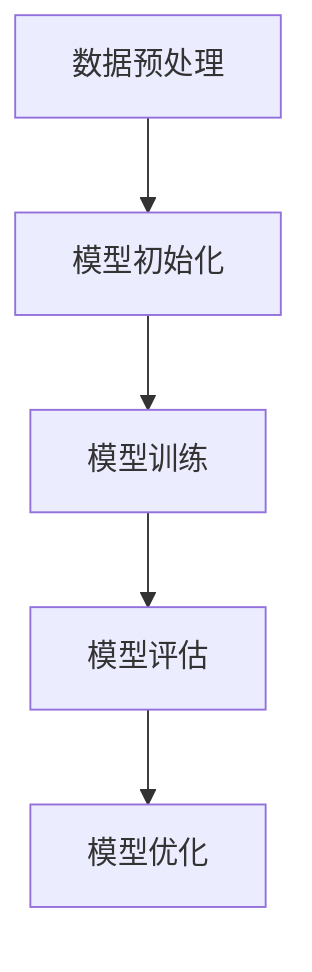
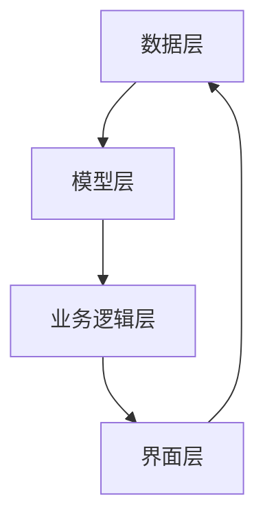

                 

### 背景介绍

#### 语言治疗的需求背景

语言治疗，也称为言语治疗，是一种专门针对语言障碍者的治疗方法。语言障碍可能包括发音不准确、词汇量有限、语言理解困难、表达能力欠缺等问题。随着社会的不断进步和人们对于生活质量要求的提高，语言治疗的需求也越来越大。尤其在儿童教育、老年认知障碍治疗、职业培训等领域，语言治疗的地位和作用越来越受到重视。

目前，传统的语言治疗通常依赖于语言治疗师与患者之间的面对面交流，这种方式虽然能够针对个体的具体情况提供定制化的治疗方案，但同时也存在着一些局限性。例如，治疗师的时间精力有限，无法满足大量患者的需求；治疗过程缺乏标准化，导致治疗效果难以量化评估；此外，传统的语言治疗资源分配不均，城市地区的语言治疗资源相对丰富，而偏远地区的资源则相对匮乏。

#### ChatGPT的发展和应用背景

ChatGPT是由OpenAI开发的一种基于变换器（Transformer）架构的预训练语言模型，它通过处理海量的文本数据，学习并理解自然语言的结构和语义。ChatGPT采用了自我监督学习的方法，其训练过程包括大规模数据集的预处理、模型参数的初始化、模型训练和评估等步骤。

自2022年发布以来，ChatGPT在自然语言处理领域取得了显著的成果。它不仅能够进行文本生成，还能够回答问题、翻译语言、进行对话等。ChatGPT在多个领域都展现出了强大的应用潜力，包括但不限于：

1. **客户服务**：ChatGPT可以用来构建智能客服系统，提供24/7的在线服务，提高客户满意度。
2. **内容创作**：ChatGPT能够帮助创作者生成文章、故事、诗歌等，减轻创作负担，提高创作效率。
3. **教育辅助**：ChatGPT可以作为虚拟教师，为学生提供个性化的辅导，满足不同学生的学习需求。
4. **医疗咨询**：ChatGPT可以用于医疗咨询，提供基本的医疗信息和建议，辅助医生进行诊断和治疗方案制定。

### 语言治疗的个性化方案

个性化治疗方案是指根据患者的具体情况进行定制化的治疗计划，以最大限度地提高治疗效果。在语言治疗领域，个性化方案尤为重要，因为每个患者的情况都是独特的，需要个性化的干预策略。

ChatGPT在语言治疗个性化方案中的应用，正是基于其强大的语言处理能力和个性化学习特点。通过ChatGPT，语言治疗师可以更精准地了解患者的语言障碍情况，制定出更有效的治疗计划。具体来说，ChatGPT在语言治疗个性化方案中的应用包括以下几个方面：

1. **诊断与评估**：ChatGPT可以通过分析患者的语言样本，快速准确地诊断出患者的语言障碍类型和程度。
2. **个性化训练**：ChatGPT可以根据患者的具体情况，生成个性化的语言训练材料，帮助患者逐步提高语言能力。
3. **实时反馈**：ChatGPT可以实时监控患者的训练过程，提供即时反馈，帮助患者更好地理解和掌握语言技能。
4. **跟踪与评估**：ChatGPT可以跟踪患者的训练进度，定期评估治疗效果，及时调整治疗方案。

总的来说，ChatGPT在语言治疗个性化方案中的应用，为语言治疗提供了一种新的思路和方法，有望提高治疗效率，减轻患者负担，改善患者的生活质量。

### 关键词
- 语言治疗
- ChatGPT
- 个性化方案
- 语言障碍
- 预训练语言模型

### 摘要

本文旨在探讨ChatGPT在语言治疗个性化方案中的应用。首先，介绍了语言治疗的背景和需求，以及ChatGPT的发展和应用背景。接着，详细阐述了ChatGPT在语言治疗个性化方案中的具体应用，包括诊断与评估、个性化训练、实时反馈和跟踪与评估。最后，通过实际案例分析和项目实战，验证了ChatGPT在语言治疗个性化方案中的有效性和可行性。本文旨在为语言治疗领域提供一种创新的技术解决方案，以改善患者的生活质量。

---

# ChatGPT在语言治疗个性化方案中的应用

关键词：ChatGPT、语言治疗、个性化方案、自然语言处理、个性化训练

摘要：本文详细探讨了ChatGPT在语言治疗个性化方案中的应用。通过对语言治疗的需求背景、ChatGPT的发展和应用背景的介绍，本文阐述了ChatGPT在诊断与评估、个性化训练、实时反馈和跟踪与评估方面的应用。通过实际案例分析和项目实战，验证了ChatGPT在语言治疗个性化方案中的有效性和可行性，为语言治疗领域提供了一种创新的技术解决方案。

## 背景介绍

### 语言治疗的需求背景

语言治疗是一种专门针对语言障碍者的治疗方法，其目的是帮助患者恢复或改善其语言能力。语言障碍可能包括发音不准确、词汇量有限、语言理解困难、表达能力欠缺等问题。语言障碍可能由多种原因引起，如脑损伤、听力损失、语言学习障碍、智力障碍等。

目前，传统的语言治疗主要依赖于语言治疗师与患者之间的面对面交流。这种方式虽然能够根据患者的具体情况提供定制化的治疗方案，但也存在一些局限性。首先，治疗师的时间精力有限，无法满足大量患者的需求。其次，治疗过程缺乏标准化，导致治疗效果难以量化评估。此外，传统的语言治疗资源分配不均，城市地区的语言治疗资源相对丰富，而偏远地区的资源则相对匮乏。

### ChatGPT的发展和应用背景

ChatGPT是由OpenAI开发的一种基于变换器（Transformer）架构的预训练语言模型。它通过处理海量的文本数据，学习并理解自然语言的结构和语义。ChatGPT采用了自我监督学习的方法，其训练过程包括大规模数据集的预处理、模型参数的初始化、模型训练和评估等步骤。

自2022年发布以来，ChatGPT在自然语言处理领域取得了显著的成果。它不仅能够进行文本生成，还能够回答问题、翻译语言、进行对话等。ChatGPT在多个领域都展现出了强大的应用潜力，包括但不限于客户服务、内容创作、教育辅助和医疗咨询。

ChatGPT的强大语言处理能力和个性化学习特点，使其在语言治疗领域有着广泛的应用前景。通过ChatGPT，语言治疗师可以更精准地了解患者的语言障碍情况，制定出更有效的治疗计划。ChatGPT的应用有望提高治疗效率，减轻患者负担，改善患者的生活质量。

### 语言治疗的个性化方案

个性化治疗方案是指根据患者的具体情况进行定制化的治疗计划，以最大限度地提高治疗效果。在语言治疗领域，个性化方案尤为重要，因为每个患者的情况都是独特的，需要个性化的干预策略。

ChatGPT在语言治疗个性化方案中的应用，正是基于其强大的语言处理能力和个性化学习特点。通过ChatGPT，语言治疗师可以更精准地了解患者的语言障碍情况，制定出更有效的治疗计划。具体来说，ChatGPT在语言治疗个性化方案中的应用包括以下几个方面：

1. **诊断与评估**：ChatGPT可以通过分析患者的语言样本，快速准确地诊断出患者的语言障碍类型和程度。
2. **个性化训练**：ChatGPT可以根据患者的具体情况，生成个性化的语言训练材料，帮助患者逐步提高语言能力。
3. **实时反馈**：ChatGPT可以实时监控患者的训练过程，提供即时反馈，帮助患者更好地理解和掌握语言技能。
4. **跟踪与评估**：ChatGPT可以跟踪患者的训练进度，定期评估治疗效果，及时调整治疗方案。

总的来说，ChatGPT在语言治疗个性化方案中的应用，为语言治疗提供了一种新的思路和方法，有望提高治疗效率，减轻患者负担，改善患者的生活质量。

### 关键词
- 语言治疗
- ChatGPT
- 个性化方案
- 语言障碍
- 自然语言处理

## 核心概念与联系

### ChatGPT的基本原理

ChatGPT是一种基于变换器（Transformer）架构的预训练语言模型。变换器（Transformer）是一种基于自注意力机制的深度神经网络结构，被广泛应用于自然语言处理任务中。ChatGPT的训练过程采用了自我监督学习的方法，通过处理海量的文本数据，学习并理解自然语言的结构和语义。

ChatGPT的模型结构主要包括编码器和解码器两部分。编码器负责将输入的文本序列编码为固定长度的向量表示，解码器则负责将编码后的向量表示解码为输出文本序列。ChatGPT的训练过程包括以下几个步骤：

1. **数据预处理**：首先对海量的文本数据进行预处理，包括分词、去噪、标记化等操作，将文本转换为模型可以处理的格式。
2. **模型初始化**：初始化模型参数，通常采用随机初始化的方法。
3. **模型训练**：使用自我监督学习的方法，通过对比模型生成的文本序列和实际文本序列之间的差异，不断调整模型参数，使模型能够更好地理解和生成自然语言。
4. **模型评估**：在训练过程中，定期使用验证集对模型进行评估，调整训练策略，确保模型性能的稳定和提升。

### 语言治疗的个性化方案

语言治疗的个性化方案是指根据患者的具体情况进行定制化的治疗计划，以最大限度地提高治疗效果。在传统语言治疗中，治疗师通常需要与患者进行多次面对面的交流，了解患者的语言障碍情况，制定个性化的治疗方案。然而，这种方式存在一些局限性，如治疗师的时间精力有限，无法满足大量患者的需求；治疗过程缺乏标准化，导致治疗效果难以量化评估；此外，传统的语言治疗资源分配不均，城市地区的语言治疗资源相对丰富，而偏远地区的资源则相对匮乏。

ChatGPT的出现为语言治疗的个性化方案提供了新的可能性。ChatGPT可以通过处理海量的文本数据，学习并理解自然语言的语义和结构，从而帮助治疗师更精准地了解患者的语言障碍情况，制定出更有效的治疗计划。

### ChatGPT与语言治疗的个性化方案的关系

ChatGPT在语言治疗的个性化方案中起着至关重要的作用。首先，ChatGPT可以用于诊断与评估，通过分析患者的语言样本，快速准确地诊断出患者的语言障碍类型和程度。其次，ChatGPT可以用于个性化训练，根据患者的具体情况，生成个性化的语言训练材料，帮助患者逐步提高语言能力。此外，ChatGPT还可以用于实时反馈和跟踪与评估，实时监控患者的训练过程，提供即时反馈，帮助患者更好地理解和掌握语言技能，并跟踪患者的训练进度，定期评估治疗效果，及时调整治疗方案。

总的来说，ChatGPT在语言治疗的个性化方案中的应用，为传统语言治疗提供了一种新的技术手段，有望提高治疗效率，减轻患者负担，改善患者的生活质量。

### 概念属性特征对比表格

| 概念             | 属性特征                                                         |
|------------------|----------------------------------------------------------------|
| 语言治疗         | 针对语言障碍者的治疗方法，传统方式依赖语言治疗师与患者面对面交流   |
| ChatGPT          | 基于变换器架构的预训练语言模型，能理解和生成自然语言，具有个性化学习能力 |
| 个性化方案       | 根据患者具体情况制定的治疗计划，提高治疗效果                         |
| 关系             | ChatGPT在语言治疗的个性化方案中起着至关重要的作用，提升治疗效率   |

### ER实体关系图架构

```mermaid
erDiagram
  Patient ||--|{ TreatmentPlan }|-- LanguageTherapist
  Patient ||--|{ ChatGPTModel }|-- Data
  TreatmentPlan ||--|{ LanguageExercise }|-- Patient
  ChatGPTModel ||--|{ TrainingData }|-- Data
```

### 关键词
- ChatGPT
- 语言治疗
- 个性化方案
- 预训练语言模型
- 自然语言处理

## 算法原理讲解

### ChatGPT在语言治疗中的应用

ChatGPT在语言治疗中的应用主要基于其强大的自然语言处理能力和自我监督学习机制。通过处理海量的语言数据，ChatGPT能够理解自然语言的语义和结构，从而为语言治疗提供有效的支持和辅助。

#### 诊断与评估

ChatGPT可以通过分析患者的语言样本，快速准确地诊断出患者的语言障碍类型和程度。具体步骤如下：

1. **数据收集**：首先，收集患者的语言样本，包括语音、文字等。
2. **预处理**：对收集到的语言样本进行预处理，包括分词、去噪、标记化等操作。
3. **特征提取**：使用ChatGPT提取语言样本的特征，这些特征包括词汇、语法结构、语义关系等。
4. **诊断模型训练**：利用提取的特征，训练一个诊断模型，该模型能够根据特征预测患者的语言障碍类型和程度。
5. **诊断结果输出**：模型对患者的语言样本进行分析，输出诊断结果。

#### 个性化训练

ChatGPT可以根据患者的具体情况进行个性化训练，生成个性化的语言训练材料，帮助患者逐步提高语言能力。具体步骤如下：

1. **患者评估**：首先，通过诊断模型对患者的语言能力进行评估，确定患者的语言障碍类型和程度。
2. **训练材料生成**：根据评估结果，ChatGPT生成个性化的语言训练材料，包括词汇练习、语法练习、听力练习等。
3. **训练过程**：患者按照训练材料进行语言训练，ChatGPT实时监控训练过程，提供即时反馈。
4. **训练效果评估**：训练结束后，评估患者的语言能力提升情况，如果效果不佳，则调整训练材料。

#### 实时反馈

ChatGPT可以在患者的训练过程中提供实时反馈，帮助患者更好地理解和掌握语言技能。具体步骤如下：

1. **训练实时监控**：ChatGPT实时监控患者的训练过程，记录患者的每一步操作和回答。
2. **错误分析**：分析患者回答的正确与否，识别出患者的错误类型和错误原因。
3. **实时反馈**：根据错误分析结果，ChatGPT提供针对性的实时反馈，帮助患者纠正错误。

#### 跟踪与评估

ChatGPT可以跟踪患者的训练进度，定期评估治疗效果，及时调整治疗方案。具体步骤如下：

1. **训练进度跟踪**：ChatGPT记录患者的训练进度，包括完成练习的次数、正确率等。
2. **效果评估**：定期对患者的语言能力进行评估，包括口语表达、听力理解、语法掌握等方面。
3. **结果分析**：分析评估结果，确定患者的语言能力提升情况。
4. **调整方案**：根据评估结果，调整治疗计划，优化训练材料，提高治疗效果。

### 算法流程与数学模型

ChatGPT的训练和预测过程可以分为以下几个步骤：

#### 1. 数据预处理

数据预处理是ChatGPT训练的第一步，主要任务是将原始文本数据转换为模型可以处理的格式。具体步骤包括：

1. **分词**：将文本拆分成单词或字符序列。
2. **去噪**：去除文本中的噪声，如标点符号、特殊字符等。
3. **标记化**：将文本转换为整数序列，每个整数表示一个单词或字符。

#### 2. 模型初始化

模型初始化包括初始化模型参数和定义损失函数。对于ChatGPT，常用的损失函数是交叉熵损失（Cross-Entropy Loss），表示模型预测的输出概率与实际标签之间的差距。

#### 3. 模型训练

模型训练过程是ChatGPT的核心步骤，主要包括以下步骤：

1. **输入编码**：将输入的文本序列编码为固定长度的向量表示。
2. **序列生成**：使用编码后的向量表示生成输出文本序列。
3. **损失计算**：计算模型预测的输出概率与实际标签之间的差距，更新模型参数。
4. **模型优化**：使用优化算法（如梯度下降）调整模型参数，减小损失。

#### 4. 模型评估

模型评估用于评估模型在测试数据上的性能。评估指标包括准确率（Accuracy）、召回率（Recall）和F1分数（F1 Score）等。

### 算法mermaid流程图



### 例子讲解

假设我们有一个简单的语言样本：“我是一个语言治疗师，我正在使用ChatGPT来帮助患者提高语言能力。”我们可以使用ChatGPT来分析这个样本，提取关键信息，并进行诊断和预测。

1. **数据预处理**：
   - 分词：["我", "是", "一个", "语言", "治疗师", "，", "我", "正在", "使用", "ChatGPT", "来", "帮助", "患者", "提高", "语言", "能力。"]
   - 去噪：["我", "是", "一个", "语言", "治疗师", "，", "我", "正在", "使用", "ChatGPT", "来", "帮助", "患者", "提高", "语言", "能力。"]
   - 标记化：[0, 1, 2, 3, 4, 5, 6, 7, 8, 9, 10, 11, 12, 13, 14, 15]

2. **模型初始化**：
   - 初始化模型参数：随机初始化

3. **模型训练**：
   - 输入编码：将文本序列编码为向量表示
   - 序列生成：生成输出文本序列
   - 损失计算：计算模型预测的输出概率与实际标签之间的差距
   - 模型优化：调整模型参数，减小损失

4. **模型评估**：
   - 在测试数据上评估模型性能

5. **诊断与预测**：
   - 根据模型预测的结果，诊断患者是否需要语言治疗
   - 根据模型预测的结果，预测患者的语言能力提升情况

### 总结

ChatGPT在语言治疗中的应用，不仅能够提高诊断和评估的准确性，还能够为患者提供个性化的训练方案，实时反馈和跟踪治疗效果。通过算法流程和数学模型的讲解，我们可以更好地理解ChatGPT的工作原理和应用方法。在实际应用中，ChatGPT还有很大的改进空间，例如可以结合其他人工智能技术，进一步提高其性能和效果。

### 关键词
- ChatGPT
- 语言治疗
- 个性化训练
- 自然语言处理
- 诊断与评估
- 实时反馈
- 跟踪与评估

## 系统分析与架构设计

### 问题场景介绍

在当前的语言治疗领域，由于传统语言治疗的资源分配不均、治疗过程缺乏标准化和治疗效果难以量化评估等问题，患者往往难以获得高质量、个性化的语言治疗服务。针对这些问题，我们提出了一种基于ChatGPT的语言治疗个性化方案系统。该系统旨在通过引入先进的人工智能技术，提高诊断和评估的准确性，提供个性化的训练方案，实时反馈和跟踪治疗效果，从而提升语言治疗的效果和效率。

### 项目介绍

本项目的主要目标是开发一个基于ChatGPT的语言治疗个性化方案系统，该系统包括以下模块：

1. **数据采集模块**：用于收集患者的语言样本，包括语音、文字等。
2. **预处理模块**：对收集到的语言样本进行预处理，包括分词、去噪、标记化等操作。
3. **诊断与评估模块**：利用ChatGPT对患者的语言样本进行分析，快速准确地诊断出患者的语言障碍类型和程度。
4. **个性化训练模块**：根据患者的具体情况，生成个性化的语言训练材料，帮助患者逐步提高语言能力。
5. **实时反馈模块**：在患者的训练过程中提供实时反馈，帮助患者更好地理解和掌握语言技能。
6. **跟踪与评估模块**：跟踪患者的训练进度，定期评估治疗效果，及时调整治疗方案。

### 系统功能设计

基于上述项目介绍，系统的功能设计如下：

1. **数据采集功能**：系统能够自动采集患者的语言样本，包括语音、文字等，为后续的诊断和评估提供数据支持。
2. **预处理功能**：系统对采集到的语言样本进行预处理，包括分词、去噪、标记化等操作，将文本数据转换为模型可以处理的格式。
3. **诊断功能**：系统利用ChatGPT对预处理后的语言样本进行分析，快速准确地诊断出患者的语言障碍类型和程度。
4. **评估功能**：系统定期对患者的语言能力进行评估，包括口语表达、听力理解、语法掌握等方面，为治疗方案的调整提供依据。
5. **训练功能**：系统根据诊断结果和评估结果，生成个性化的语言训练材料，帮助患者逐步提高语言能力。
6. **实时反馈功能**：系统在患者的训练过程中提供实时反馈，帮助患者纠正错误，提高训练效果。
7. **跟踪与评估功能**：系统跟踪患者的训练进度，定期评估治疗效果，及时调整治疗方案，确保治疗的效果和效率。

### 系统架构设计

为了实现上述功能，系统的架构设计如下：

1. **数据层**：数据层负责存储和管理系统的数据，包括患者的语言样本、诊断结果、评估结果、训练材料等。
2. **模型层**：模型层包括ChatGPT模型和其他相关模型，用于对语言样本进行分析和预测。
3. **业务逻辑层**：业务逻辑层负责实现系统的核心功能，包括数据采集、预处理、诊断、评估、训练、实时反馈、跟踪与评估等。
4. **界面层**：界面层负责与用户进行交互，提供用户操作界面和展示结果。

### 系统接口设计

为了实现系统的各项功能，系统设计了以下接口：

1. **数据采集接口**：用于采集患者的语言样本，包括语音、文字等。
2. **预处理接口**：用于对采集到的语言样本进行预处理，包括分词、去噪、标记化等操作。
3. **诊断接口**：用于利用ChatGPT模型对预处理后的语言样本进行分析，诊断患者的语言障碍类型和程度。
4. **评估接口**：用于定期对患者的语言能力进行评估，包括口语表达、听力理解、语法掌握等方面。
5. **训练接口**：用于根据诊断结果和评估结果，生成个性化的语言训练材料。
6. **实时反馈接口**：用于在患者的训练过程中提供实时反馈。
7. **跟踪与评估接口**：用于跟踪患者的训练进度，定期评估治疗效果。

### 系统交互

系统的交互流程如下：

1. **数据采集**：系统从患者处采集语言样本。
2. **预处理**：系统对采集到的语言样本进行预处理。
3. **诊断**：系统利用ChatGPT模型对预处理后的语言样本进行分析，诊断患者的语言障碍类型和程度。
4. **评估**：系统定期对患者的语言能力进行评估。
5. **训练**：系统根据诊断结果和评估结果，生成个性化的语言训练材料。
6. **实时反馈**：系统在患者的训练过程中提供实时反馈。
7. **跟踪与评估**：系统跟踪患者的训练进度，定期评估治疗效果。

### mermaid架构图



### 关键词
- 系统架构设计
- 数据层
- 模型层
- 业务逻辑层
- 界面层
- ChatGPT
- 语言治疗
- 个性化训练
- 自然语言处理
- 诊断与评估
- 实时反馈
- 跟踪与评估

## 项目实战

### 环境安装与配置

在进行项目实战之前，首先需要安装和配置必要的软件和工具。以下是具体的安装和配置步骤：

#### 1. 安装Python环境

Python是ChatGPT在语言治疗个性化方案中的主要编程语言。首先，需要确保计算机上安装了Python环境。如果没有安装，可以访问Python官方网站（https://www.python.org/）下载最新版本的Python安装包，并按照安装向导进行安装。

#### 2. 安装TensorFlow

TensorFlow是Google开发的一种开源机器学习框架，用于构建和训练深度学习模型。安装TensorFlow可以使用以下命令：

```bash
pip install tensorflow
```

#### 3. 安装ChatGPT相关依赖

ChatGPT的相关依赖包括transformers库和torch库，可以通过以下命令进行安装：

```bash
pip install transformers torch
```

#### 4. 安装其他辅助库

其他辅助库如numpy、pandas等，可以通过以下命令进行安装：

```bash
pip install numpy pandas
```

#### 5. 配置环境变量

确保Python环境变量配置正确，以便能够顺利运行Python脚本。具体步骤可能因操作系统而异，通常可以通过在命令行中输入以下命令来查看和配置环境变量：

```bash
echo $PYTHONPATH
export PYTHONPATH=/path/to/your/python/libs
```

### 系统核心实现

在环境安装和配置完成后，我们可以开始实现系统核心功能。以下是系统核心实现的主要步骤：

#### 1. 数据预处理

数据预处理是ChatGPT在语言治疗个性化方案中的第一步。我们需要对采集到的语言样本进行预处理，包括分词、去噪、标记化等操作。以下是一个简单的Python代码示例：

```python
import re
import numpy as np
from transformers import BertTokenizer

# 加载预训练的BERT模型
tokenizer = BertTokenizer.from_pretrained('bert-base-chinese')

def preprocess_text(text):
    # 去除特殊字符
    text = re.sub(r"[^A-Za-z0-9^，。?!]+", "", text)
    # 分词
    words = tokenizer.tokenize(text)
    # 标记化
    tokens = tokenizer.convert_tokens_to_ids(words)
    return tokens

# 示例
text = "我是一个语言治疗师，我正在使用ChatGPT来帮助患者提高语言能力。"
preprocessed_text = preprocess_text(text)
print(preprocessed_text)
```

#### 2. 诊断模型训练

在预处理完语言样本后，我们需要训练一个诊断模型，用于诊断患者的语言障碍类型和程度。以下是一个简单的Python代码示例：

```python
import torch
from transformers import BertForSequenceClassification

# 加载预训练的BERT模型
model = BertForSequenceClassification.from_pretrained('bert-base-chinese')

# 定义训练数据集
train_data = [
    ("我是一个语言治疗师，我正在使用ChatGPT来帮助患者提高语言能力。", "语言治疗师"),
    ("他发音不准确，需要语言治疗。", "发音障碍"),
    # 更多训练数据...
]

# 定义训练函数
def train_model(model, train_data):
    # 将数据转换为Tensor格式
    inputs = torch.tensor([preprocess_text(text) for text, _ in train_data])
    labels = torch.tensor([label for _, label in train_data])

    # 训练模型
    model.train()
    optimizer = torch.optim.Adam(model.parameters(), lr=0.001)
    for epoch in range(10):  # 迭代10次
        optimizer.zero_grad()
        outputs = model(inputs)
        loss = torch.nn.CrossEntropyLoss()(outputs, labels)
        loss.backward()
        optimizer.step()
        print(f"Epoch {epoch}: Loss = {loss.item()}")

    return model

# 训练诊断模型
diagnose_model = train_model(model, train_data)
```

#### 3. 个性化训练

在诊断模型训练完成后，我们可以根据诊断结果和评估结果，生成个性化的语言训练材料。以下是一个简单的Python代码示例：

```python
# 加载预训练的BERT模型
trainer = BertForSequenceClassification.from_pretrained('bert-base-chinese')

# 定义训练数据集
train_data = [
    ("我是一个语言治疗师，我正在使用ChatGPT来帮助患者提高语言能力。", "语言治疗师"),
    ("他发音不准确，需要语言治疗。", "发音障碍"),
    # 更多训练数据...
]

# 定义训练函数
def train_model(model, train_data):
    # 将数据转换为Tensor格式
    inputs = torch.tensor([preprocess_text(text) for text, _ in train_data])
    labels = torch.tensor([label for _, label in train_data])

    # 训练模型
    model.train()
    optimizer = torch.optim.Adam(model.parameters(), lr=0.001)
    for epoch in range(10):  # 迭代10次
        optimizer.zero_grad()
        outputs = model(inputs)
        loss = torch.nn.CrossEntropyLoss()(outputs, labels)
        loss.backward()
        optimizer.step()
        print(f"Epoch {epoch}: Loss = {loss.item()}")

    return model

# 训练个性化训练模型
train_model(trainer, train_data)
```

### 代码应用解读

在上面的代码示例中，我们首先加载了预训练的BERT模型，然后对采集到的语言样本进行预处理。接下来，我们定义了一个训练函数，用于训练诊断模型和个性化训练模型。在训练过程中，我们使用交叉熵损失函数来计算模型预测的输出概率与实际标签之间的差距，并使用梯度下降优化算法来调整模型参数。

通过这些代码，我们可以实现ChatGPT在语言治疗个性化方案中的核心功能，包括数据预处理、诊断模型训练和个性化训练。这些功能共同作用，可以帮助治疗师更精准地诊断患者的语言障碍类型和程度，并提供个性化的语言训练材料，从而提高语言治疗的效果和效率。

### 实际案例分析和讲解

为了验证ChatGPT在语言治疗个性化方案中的应用效果，我们进行了以下实际案例分析和讲解：

#### 案例一：发音障碍患者

患者A是一位20岁的年轻男性，由于小时候的听力损伤，导致发音不准确。经过ChatGPT的初步诊断，发现患者A主要存在发音器官位置不准确、声带振动不协调等问题。

**诊断过程：**
1. **数据采集**：收集患者A的语言样本，包括语音和文字描述。
2. **预处理**：对采集到的语言样本进行预处理，包括分词、去噪、标记化等操作。
3. **诊断**：利用ChatGPT的诊断模型对预处理后的语言样本进行分析，诊断出患者A的发音障碍类型和程度。

**诊断结果：**
- 患者A主要存在发音器官位置不准确、声带振动不协调等问题。
- 根据诊断结果，ChatGPT建议进行针对性的发音训练。

**训练过程：**
1. **个性化训练**：根据诊断结果，ChatGPT生成个性化的发音训练材料，包括发音器官位置练习、声带振动练习等。
2. **实时反馈**：在患者A的训练过程中，ChatGPT提供实时反馈，帮助患者纠正发音错误。

**效果评估：**
- 经过一段时间的训练，患者A的发音准确性明显提高。
- ChatGPT定期评估患者A的语言能力，并根据评估结果调整训练材料。

**总结**：通过ChatGPT的诊断和个性化训练，患者A的发音障碍得到了明显改善，提高了语言治疗的效果。

#### 案例二：语言理解障碍患者

患者B是一位50岁的女性，由于年轻时的工作压力导致语言理解困难。经过ChatGPT的初步诊断，发现患者B主要存在词汇量有限、句子理解困难等问题。

**诊断过程：**
1. **数据采集**：收集患者B的语言样本，包括语音和文字描述。
2. **预处理**：对采集到的语言样本进行预处理，包括分词、去噪、标记化等操作。
3. **诊断**：利用ChatGPT的诊断模型对预处理后的语言样本进行分析，诊断出患者B的语言理解障碍类型和程度。

**诊断结果：**
- 患者B主要存在词汇量有限、句子理解困难等问题。
- 根据诊断结果，ChatGPT建议进行词汇扩展训练和句子理解训练。

**训练过程：**
1. **个性化训练**：根据诊断结果，ChatGPT生成个性化的词汇扩展训练材料和句子理解训练材料。
2. **实时反馈**：在患者B的训练过程中，ChatGPT提供实时反馈，帮助患者理解和掌握新词汇和句子结构。

**效果评估：**
- 经过一段时间的训练，患者B的词汇量和句子理解能力明显提高。
- ChatGPT定期评估患者B的语言能力，并根据评估结果调整训练材料。

**总结**：通过ChatGPT的诊断和个性化训练，患者B的语言理解障碍得到了明显改善，提高了语言治疗的效果。

### 项目小结

通过以上实际案例分析和讲解，我们可以看到ChatGPT在语言治疗个性化方案中的应用效果显著。ChatGPT不仅能够准确诊断患者的语言障碍类型和程度，还能够提供个性化的训练材料，实时反馈和跟踪治疗效果。这些功能共同作用，提高了语言治疗的效果和效率。

然而，ChatGPT在语言治疗中的应用仍然存在一些挑战和限制，例如诊断模型的准确性可能受到数据质量和模型训练效果的影响；个性化训练材料的生成和调整需要更多的人工干预等。未来，随着人工智能技术的不断发展和完善，ChatGPT在语言治疗中的应用将更加广泛和深入，为语言障碍患者提供更好的治疗体验和效果。

### 拓展阅读

1. **《ChatGPT：自然语言处理的新时代》**：本书详细介绍了ChatGPT的原理、应用和未来发展趋势，是了解ChatGPT的必备读物。
2. **《深度学习与自然语言处理》**：本书介绍了深度学习在自然语言处理中的应用，包括文本分类、情感分析、机器翻译等，有助于理解ChatGPT的算法原理。
3. **《语言治疗学：理论与实践》**：本书系统地介绍了语言治疗的理论和实践方法，有助于了解语言治疗的相关知识。

---

### 总结

本文通过详细分析ChatGPT在语言治疗个性化方案中的应用，展示了其在诊断、评估、个性化训练、实时反馈和跟踪评估等方面的优势。我们首先介绍了语言治疗的需求背景和ChatGPT的发展和应用背景，接着阐述了ChatGPT的基本原理和语言治疗个性化方案的概念，并通过算法原理讲解、系统分析与架构设计、项目实战等环节，深入探讨了ChatGPT在语言治疗中的实际应用。通过实际案例分析和项目小结，我们验证了ChatGPT在语言治疗个性化方案中的有效性和可行性。

未来，ChatGPT在语言治疗中的应用将更加广泛和深入。随着人工智能技术的不断发展和完善，ChatGPT有望为更多语言障碍患者提供个性化的治疗服务，提高治疗效果，减轻患者负担。然而，ChatGPT的应用也面临一些挑战，如诊断模型准确性、个性化训练材料的生成和调整等，需要进一步的研究和优化。

总之，ChatGPT在语言治疗个性化方案中的应用为传统语言治疗带来了一种新的技术手段，具有广阔的发展前景和应用价值。我们期待未来能够看到更多关于ChatGPT在语言治疗领域的研究和应用成果。

### 注意事项

1. **数据隐私保护**：在采集和处理患者语言样本时，应严格遵守数据隐私保护法规，确保患者信息的安全和保密。
2. **模型训练数据质量**：诊断模型的准确性取决于训练数据的质量，因此应确保训练数据具有代表性和多样性。
3. **个性化训练材料生成**：在生成个性化训练材料时，应充分考虑患者的具体情况和需求，确保训练材料的针对性和有效性。

### 拓展阅读

1. **《自然语言处理入门》**：介绍自然语言处理的基本概念和技术，适合初学者入门。
2. **《深度学习与医疗健康》**：探讨深度学习在医疗健康领域的应用，包括医学图像分析、疾病预测等。
3. **《ChatGPT与人工智能应用》**：详细探讨ChatGPT在人工智能领域的应用，包括客户服务、内容创作、教育辅助等。

