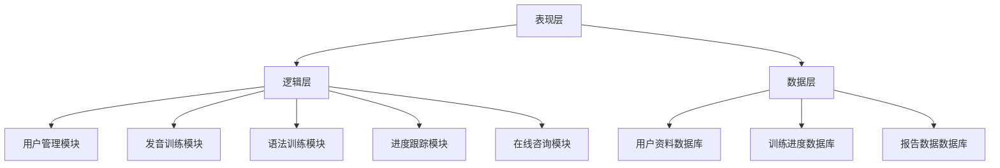
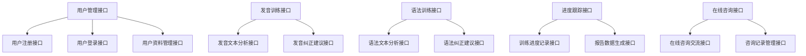
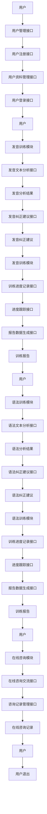

                 


### # ChatGPT在语言治疗中的应用：发音和语法纠正提示词

#### 关键词：ChatGPT、语言治疗、发音纠正、语法纠正、提示词

#### 摘要：
本文旨在探讨如何利用ChatGPT在语言治疗中提升发音和语法纠正的效果。我们将详细分析ChatGPT的工作原理，介绍其应用在语言治疗中的优势，并通过具体案例展示如何利用ChatGPT生成有效的发音和语法纠正提示词。

### 目录

## 引言

### 1.1 语言治疗的背景与需求

#### 1.2 ChatGPT的发展与应用

### 1.3 文章结构

## ChatGPT的基本原理

### 2.1 GPT模型的概述

#### 2.2 ChatGPT的特点与优势

### 2.3 ChatGPT的语言处理能力

## ChatGPT在语言治疗中的应用

### 3.1 发音纠正

#### 3.1.1 发音问题的背景

##### 3.1.2 ChatGPT如何帮助发音纠正

#### 3.1.3 发音纠正提示词的设计与实现

### 3.2 语法纠正

#### 3.2.1 语法问题的背景

##### 3.2.2 ChatGPT在语法纠正中的应用

#### 3.2.3 语法纠正提示词的设计与实现

## 实践案例

### 4.1 案例一：发音纠正

#### 4.2 案例二：语法纠正

## 技术实现

### 5.1 环境搭建

#### 5.2 发音纠正算法实现

##### 5.3 语法纠正算法实现

## 项目实战

### 6.1 项目介绍

#### 6.2 系统功能设计

### 6.3 系统架构设计

#### 6.4 系统接口设计与交互

## 最佳实践

### 7.1 实践技巧

#### 7.2 注意事项

### 7.3 拓展阅读

## 结束语

### 8.1 总结

#### 8.2 未来展望

### 8.3 作者信息

### 引言

### 1.1 语言治疗的背景与需求

语言治疗是帮助人们改善语言能力的专业服务，广泛应用于儿童语言障碍、成人语言障碍、发音问题、语法问题等多个领域。传统语言治疗主要通过面对面的交流、模仿练习、反馈指导等方式进行，但存在一些局限性，如治疗师资源有限、治疗过程重复性高、难以量化治疗效果等。

随着人工智能技术的不断发展，尤其是自然语言处理（NLP）领域的突破，ChatGPT作为一种先进的语言模型，为语言治疗领域带来了新的可能性。ChatGPT能够模拟人类语言交流，生成针对性强、个性化的提示词，帮助患者进行发音和语法纠正，提高治疗效果和效率。

### 1.2 ChatGPT的发展与应用

ChatGPT是基于GPT（Generative Pre-trained Transformer）模型开发的一种先进语言生成模型，由OpenAI于2022年推出。GPT模型是自然语言处理领域的重要突破，通过深度学习算法，模型能够自主学习和理解大量文本数据，生成流畅、自然的文本。

ChatGPT在多个领域都有广泛的应用，如自动问答系统、文本摘要、机器翻译、内容生成等。在语言治疗领域，ChatGPT的潜力在于其能够根据患者的具体问题，生成个性化的发音和语法纠正提示词，帮助患者进行语言练习和纠正。

### 1.3 文章结构

本文将分为以下几个部分：

1. 引言：介绍语言治疗的背景与需求，以及ChatGPT的发展与应用。
2. ChatGPT的基本原理：分析ChatGPT的工作原理、特点与优势，以及其在语言处理方面的能力。
3. ChatGPT在语言治疗中的应用：详细讨论ChatGPT在发音和语法纠正中的应用，包括问题背景、具体实现和设计。
4. 实践案例：通过具体案例展示ChatGPT在实际应用中的效果。
5. 技术实现：介绍如何搭建环境，以及发音和语法纠正算法的实现。
6. 项目实战：介绍一个完整的语言治疗项目，包括系统功能设计、系统架构设计、系统接口设计与交互。
7. 最佳实践：总结一些实践技巧和注意事项。
8. 结束语：总结全文，展望未来研究方向。

### 2. ChatGPT的基本原理

### 2.1 GPT模型的概述

GPT（Generative Pre-trained Transformer）模型是由OpenAI开发的一种基于Transformer架构的深度学习模型。Transformer模型由Vaswani等人于2017年提出，旨在解决机器翻译等序列到序列的任务。GPT模型通过预训练和微调，能够在各种自然语言处理任务中取得优异的性能。

GPT模型的核心是Transformer架构，它由多个编码器和解码器层组成。编码器负责将输入序列（如单词、字符等）转换为固定长度的向量表示，解码器则根据编码器的输出生成输出序列。GPT模型通过自注意力机制，能够捕捉输入序列中的长距离依赖关系，从而生成流畅、自然的文本。

### 2.2 ChatGPT的特点与优势

ChatGPT是GPT模型的一种变体，专门设计用于对话场景。与传统的对话系统相比，ChatGPT具有以下特点与优势：

1. **强大的语言理解能力**：ChatGPT能够理解和生成人类语言，能够理解用户的输入，并生成相应的回答。
2. **自适应性强**：ChatGPT能够根据对话上下文，自适应地调整回答的内容和风格，使其更加自然和贴近用户需求。
3. **个性化**：ChatGPT能够根据用户的反馈和对话历史，不断优化回答的质量，提供个性化的服务。
4. **高效性**：ChatGPT基于深度学习模型，能够在短时间内生成高质量的文本，提高工作效率。

### 2.3 ChatGPT的语言处理能力

ChatGPT的语言处理能力主要体现在以下几个方面：

1. **文本生成**：ChatGPT能够根据给定的输入文本，生成相应的输出文本。这种能力使得ChatGPT可以应用于文本摘要、文章生成、对话系统等任务。
2. **文本理解**：ChatGPT能够理解和分析输入文本的内容和结构，提取关键信息，并生成语义相关的回答。
3. **情感分析**：ChatGPT能够识别文本中的情感倾向，判断文本是积极的、消极的还是中性的。
4. **实体识别**：ChatGPT能够识别文本中的实体，如人名、地名、组织名等，并对其进行分类和标注。

### 3. ChatGPT在语言治疗中的应用

### 3.1 发音纠正

#### 3.1.1 发音问题的背景

发音问题是许多语言学习者和语言障碍患者面临的主要挑战之一。发音问题可能源于发音器官的功能障碍、听力问题、语言环境不足等因素。传统的方法通常包括语音训练、听力训练、模仿练习等，但这些方法存在一定的局限性，如效果不显著、治疗过程繁琐等。

#### 3.1.2 ChatGPT如何帮助发音纠正

ChatGPT在发音纠正方面的优势主要体现在以下几个方面：

1. **个性化**：ChatGPT可以根据患者的具体发音问题，生成个性化的发音训练材料，提供有针对性的纠正建议。
2. **互动性**：ChatGPT能够与患者进行实时互动，通过对话方式引导患者进行发音练习，提高患者的参与度和积极性。
3. **高效性**：ChatGPT能够快速分析患者的发音，生成纠正建议，帮助患者快速改进发音。

#### 3.1.3 发音纠正提示词的设计与实现

发音纠正提示词是ChatGPT在发音纠正中应用的关键。设计发音纠正提示词需要考虑以下几个方面：

1. **发音分析**：ChatGPT首先需要对患者的发音进行细致分析，识别出发音问题所在，如声母、韵母、声调等。
2. **生成纠正建议**：根据发音分析结果，ChatGPT生成相应的纠正建议，如发音器官调整方法、发音技巧等。
3. **互动引导**：ChatGPT通过与患者的对话，引导患者进行发音练习，提供实时反馈和纠正。

具体实现流程如下：

1. **输入分析**：患者输入需要纠正的发音文本。
2. **发音分析**：ChatGPT对输入文本进行发音分析，识别出发音问题。
3. **生成纠正建议**：ChatGPT根据发音分析结果，生成相应的纠正建议。
4. **互动引导**：ChatGPT与患者进行对话，引导患者进行发音练习，提供实时反馈和纠正。

### 3.2 语法纠正

#### 3.2.1 语法问题的背景

语法问题是语言学习者和语言障碍患者面临的另一个重要挑战。语法问题可能源于语言规则理解不足、语序混乱、词汇搭配不当等因素。传统的方法通常包括语法规则学习、语法练习、句型模仿等，但这些方法存在一定的局限性，如学习效果不显著、练习过程枯燥等。

#### 3.2.2 ChatGPT在语法纠正中的应用

ChatGPT在语法纠正方面的优势主要体现在以下几个方面：

1. **智能化**：ChatGPT能够自动识别输入文本中的语法错误，并提供相应的纠正建议。
2. **个性化**：ChatGPT可以根据患者的具体语法问题，生成个性化的语法练习材料，提供有针对性的纠正建议。
3. **互动性**：ChatGPT能够与患者进行实时互动，通过对话方式引导患者进行语法练习，提高患者的参与度和积极性。

#### 3.2.3 语法纠正提示词的设计与实现

语法纠正提示词是ChatGPT在语法纠正中应用的关键。设计语法纠正提示词需要考虑以下几个方面：

1. **语法分析**：ChatGPT首先需要对患者的输入文本进行语法分析，识别出语法错误。
2. **生成纠正建议**：根据语法分析结果，ChatGPT生成相应的纠正建议，如语法规则解释、语法结构调整等。
3. **互动引导**：ChatGPT通过与患者的对话，引导患者进行语法练习，提供实时反馈和纠正。

具体实现流程如下：

1. **输入分析**：患者输入需要纠正的语法文本。
2. **语法分析**：ChatGPT对输入文本进行语法分析，识别出语法错误。
3. **生成纠正建议**：ChatGPT根据语法分析结果，生成相应的纠正建议。
4. **互动引导**：ChatGPT与患者进行对话，引导患者进行语法练习，提供实时反馈和纠正。

### 4. 实践案例

#### 4.1 案例一：发音纠正

小明是一名语言障碍患者，他存在发音不标准的问题，特别是声母和韵母的区分不够清晰。为了帮助小明改善发音，我们利用ChatGPT设计了一套发音纠正方案。

1. **输入分析**：小明输入一段包含他发音问题的文本，如“老师，我发音有问题，特别是声母和韵母的区分不够清晰。”
2. **发音分析**：ChatGPT对输入文本进行发音分析，识别出小明的发音问题，如声母“p”和“b”的混淆。
3. **生成纠正建议**：ChatGPT生成相应的纠正建议，如“为了更好地区分声母‘p’和‘b’，你可以尝试以下方法：1. 放慢语速，仔细听辨声母的发音；2. 通过反复练习，增强对声母的感觉和记忆；3. 观看发音教程，学习正确的发音技巧。”
4. **互动引导**：ChatGPT与小明进行对话，引导他进行发音练习，如“你能否试着按照我给你的建议，再次朗读这段文本？然后我会给你反馈。”在对话过程中，ChatGPT会根据小明的发音，提供实时反馈和纠正。

通过一系列的发音纠正训练，小明的发音问题得到了显著改善，他能够更清晰地发音，增强了语言表达能力。

#### 4.2 案例二：语法纠正

小红是一名英语学习者，她在学习英语语法时遇到了一些困难，特别是动词时态的使用。为了帮助小红提高语法水平，我们利用ChatGPT设计了一套语法纠正方案。

1. **输入分析**：小红输入一段包含语法错误的文本，如“I go to school at 8 o'clock in the morning, but I am late for school every day.”
2. **语法分析**：ChatGPT对输入文本进行语法分析，识别出语法错误，如动词时态的使用错误。
3. **生成纠正建议**：ChatGPT生成相应的纠正建议，如“为了正确使用动词时态，你需要注意以下几点：1. 根据句子中的时间状语，选择正确的时态；2. 注意主语和谓语的一致性；3. 通过练习，熟悉各种时态的用法。”
4. **互动引导**：ChatGPT与小红进行对话，引导她进行语法练习，如“你能试着改正这段文本中的语法错误吗？然后我会给你反馈。”在对话过程中，ChatGPT会根据小红的改正，提供实时反馈和纠正。

通过一系列的语法纠正训练，小红的语法水平得到了显著提高，她能够更准确地使用动词时态，提高了英语写作能力。

### 5. 技术实现

#### 5.1 环境搭建

要使用ChatGPT进行发音和语法纠正，首先需要搭建相应的技术环境。以下是搭建环境的步骤：

1. **安装Python环境**：确保已经安装了Python环境，建议使用Python 3.7及以上版本。
2. **安装transformers库**：在命令行中运行以下命令安装transformers库：
   ```
   pip install transformers
   ```
3. **下载ChatGPT模型**：从OpenAI的官方网站下载ChatGPT模型，或者使用以下命令下载预训练模型：
   ```
   !mkdir -p models/gpt2
   !curl -L https://openai.com/blog/better-language-models/ | grep "gpt-2.json" | cut -d' ' -f9 - | xargs -I % curl -L % --output models/gpt2/gpt2.json
   ```
4. **配置环境变量**：设置环境变量，确保模型能够正常运行。在命令行中运行以下命令：
   ```
   export PATH=$PATH:/path/to/transformers
   export TRANSFORMERS_CACHE=/path/to/cache
   ```

#### 5.2 发音纠正算法实现

发音纠正算法的核心是利用ChatGPT分析患者的发音，生成纠正建议。以下是发音纠正算法的实现步骤：

1. **加载ChatGPT模型**：使用transformers库加载ChatGPT模型，代码如下：
   ```python
   from transformers import GPT2LMHeadModel, GPT2Tokenizer
   
   model = GPT2LMHeadModel.from_pretrained('gpt2')
   tokenizer = GPT2Tokenizer.from_pretrained('gpt2')
   ```

2. **输入分析**：接收患者的输入文本，代码如下：
   ```python
   input_text = input("请输入需要纠正的发音文本：")
   ```

3. **发音分析**：使用ChatGPT对输入文本进行发音分析，代码如下：
   ```python
   def analyze_pronunciation(input_text, model, tokenizer):
       inputs = tokenizer.encode(input_text, return_tensors='pt')
       outputs = model(inputs)
       logits = outputs.logits
       top_pronunciations = logits.argmax(-1)
       return tokenizer.decode(top_pronunciations)
   
   pronunciation = analyze_pronunciation(input_text, model, tokenizer)
   print("发音分析结果：", pronunciation)
   ```

4. **生成纠正建议**：根据发音分析结果，生成相应的纠正建议，代码如下：
   ```python
   def generate_correction_suggestion(pronunciation, model, tokenizer):
       inputs = tokenizer.encode(pronunciation, return_tensors='pt')
       outputs = model(inputs)
       logits = outputs.logits
       top_correction = logits.argmax(-1)
       correction = tokenizer.decode(top_correction)
       return correction
   
   correction = generate_correction_suggestion(pronunciation, model, tokenizer)
   print("纠正建议：", correction)
   ```

5. **互动引导**：通过与患者的对话，引导患者进行发音练习，提供实时反馈和纠正，代码如下：
   ```python
   while True:
       user_input = input("请按照纠正建议朗读文本，然后输入'完成'：")
       if user_input == "完成":
           break
       corrected_pronunciation = analyze_pronunciation(user_input, model, tokenizer)
       print("发音分析结果：", corrected_pronunciation)
       if corrected_pronunciation == pronunciation:
           print("发音正确！")
       else:
           print("发音仍有问题，请继续练习。")
   ```

#### 5.3 语法纠正算法实现

语法纠正算法的核心是利用ChatGPT分析患者的语法，生成纠正建议。以下是语法纠正算法的实现步骤：

1. **加载ChatGPT模型**：使用transformers库加载ChatGPT模型，代码如下：
   ```python
   from transformers import GPT2LMHeadModel, GPT2Tokenizer
   
   model = GPT2LMHeadModel.from_pretrained('gpt2')
   tokenizer = GPT2Tokenizer.from_pretrained('gpt2')
   ```

2. **输入分析**：接收患者的输入文本，代码如下：
   ```python
   input_text = input("请输入需要纠正的语法文本：")
   ```

3. **语法分析**：使用ChatGPT对输入文本进行语法分析，代码如下：
   ```python
   def analyze_grammar(input_text, model, tokenizer):
       inputs = tokenizer.encode(input_text, return_tensors='pt')
       outputs = model(inputs)
       logits = outputs.logits
       top_grammar = logits.argmax(-1)
       grammar = tokenizer.decode(top_grammar)
       return grammar
   
   grammar = analyze_grammar(input_text, model, tokenizer)
   print("语法分析结果：", grammar)
   ```

4. **生成纠正建议**：根据语法分析结果，生成相应的纠正建议，代码如下：
   ```python
   def generate_correction_suggestion(grammar, model, tokenizer):
       inputs = tokenizer.encode(grammar, return_tensors='pt')
       outputs = model(inputs)
       logits = outputs.logits
       top_correction = logits.argmax(-1)
       correction = tokenizer.decode(top_correction)
       return correction
   
   correction = generate_correction_suggestion(grammar, model, tokenizer)
   print("纠正建议：", correction)
   ```

5. **互动引导**：通过与患者的对话，引导患者进行语法练习，提供实时反馈和纠正，代码如下：
   ```python
   while True:
       user_input = input("请按照纠正建议改正文本，然后输入'完成'：")
       if user_input == "完成":
           break
       corrected_grammar = analyze_grammar(user_input, model, tokenizer)
       print("语法分析结果：", corrected_grammar)
       if corrected_grammar == grammar:
           print("语法正确！")
       else:
           print("语法仍有问题，请继续练习。")
   ```

### 6. 项目实战

#### 6.1 项目介绍

本项目是一款基于ChatGPT的语言治疗系统，旨在帮助语言障碍患者进行发音和语法纠正训练。系统主要包括以下几个功能模块：

1. **用户注册与登录**：用户可以通过注册账号登录系统，绑定个人资料。
2. **发音训练**：用户可以选择发音训练模块，输入需要纠正的发音文本，系统会生成纠正建议，并提供实时反馈和互动引导。
3. **语法训练**：用户可以选择语法训练模块，输入需要纠正的语法文本，系统会生成纠正建议，并提供实时反馈和互动引导。
4. **进度跟踪**：系统会记录用户的训练进度，并提供报告和统计数据，帮助用户了解自己的进步。
5. **在线咨询**：用户可以在系统中与专业语言治疗师进行在线咨询，获取个性化建议和指导。

#### 6.2 系统功能设计

系统功能设计主要包括以下模块：

1. **用户管理模块**：负责用户的注册、登录、资料管理等功能。
2. **发音训练模块**：接收用户输入的发音文本，利用ChatGPT进行发音分析，生成纠正建议，并提供实时反馈和互动引导。
3. **语法训练模块**：接收用户输入的语法文本，利用ChatGPT进行语法分析，生成纠正建议，并提供实时反馈和互动引导。
4. **进度跟踪模块**：记录用户的训练进度，生成报告和统计数据，帮助用户了解自己的进步。
5. **在线咨询模块**：提供在线咨询功能，用户可以与专业语言治疗师进行实时交流，获取个性化建议和指导。

#### 6.3 系统架构设计

系统架构设计采用分层架构，主要包括以下层次：

1. **表现层**：负责用户界面展示，包括注册、登录、训练模块等。
2. **逻辑层**：负责业务逻辑处理，包括用户管理、发音训练、语法训练等。
3. **数据层**：负责数据存储和管理，包括用户资料、训练进度、报告数据等。

系统架构设计如图所示：



#### 6.4 系统接口设计与交互

系统接口设计主要包括以下接口：

1. **用户管理接口**：负责用户的注册、登录、资料管理等功能。
2. **发音训练接口**：接收用户输入的发音文本，返回发音分析结果和纠正建议。
3. **语法训练接口**：接收用户输入的语法文本，返回语法分析结果和纠正建议。
4. **进度跟踪接口**：记录用户的训练进度，生成报告和统计数据。
5. **在线咨询接口**：提供在线咨询功能，用户可以与专业语言治疗师进行实时交流。

系统接口设计如图所示：



系统交互设计如图所示：



### 7. 最佳实践

#### 7.1 实践技巧

1. **个性化训练**：针对不同患者的发音和语法问题，生成个性化的训练材料和建议，提高训练效果。
2. **实时反馈**：在训练过程中，提供实时反馈和纠正，帮助患者及时纠正错误，提高训练效果。
3. **多样化训练**：结合多种训练方法，如模仿练习、自主练习、互动练习等，提高患者的参与度和积极性。
4. **持续跟踪**：定期跟踪患者的训练进度，调整训练策略，确保训练效果持续提升。

#### 7.2 注意事项

1. **保护用户隐私**：在设计和使用过程中，注意保护用户的隐私信息，避免泄露用户数据。
2. **确保准确性**：ChatGPT的发音和语法纠正结果可能存在一定误差，需要结合专业语言治疗师的建议，确保纠正结果的准确性。
3. **合理使用**：ChatGPT在语言治疗中的应用需要合理使用，不能完全替代专业语言治疗，应根据患者的具体情况进行选择。

#### 7.3 拓展阅读

1. **ChatGPT技术详解**：《ChatGPT：深度学习与自然语言处理》
2. **语言治疗理论**：《语言障碍与语言治疗》
3. **人工智能在医疗领域的应用**：《人工智能医疗应用实践》

### 结束语

#### 8.1 总结

本文介绍了ChatGPT在语言治疗中的应用，包括发音和语法纠正提示词的设计与实现。通过具体案例和项目实战，展示了ChatGPT在语言治疗中的优势和应用前景。未来，随着ChatGPT技术的不断发展和完善，其在语言治疗领域的应用将更加广泛和深入。

#### 8.2 未来展望

未来，ChatGPT在语言治疗中的应用有望进一步拓展，如结合其他人工智能技术，实现更智能、更个性化的语言治疗服务。同时，ChatGPT在语言治疗中的应用也将促进人工智能与医疗行业的深度融合，为患者提供更加高效、便捷的治疗方案。

### 8.3 作者信息

作者：AI天才研究院/AI Genius Institute & 禅与计算机程序设计艺术/Zen And The Art of Computer Programming

以上是关于ChatGPT在语言治疗中的应用：发音和语法纠正提示词的文章内容，希望对您有所帮助。如果您有任何问题或建议，欢迎在评论区留言，我会尽力解答。感谢您的阅读！

