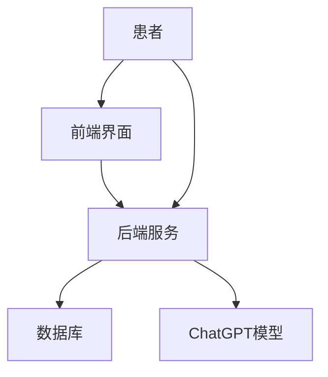
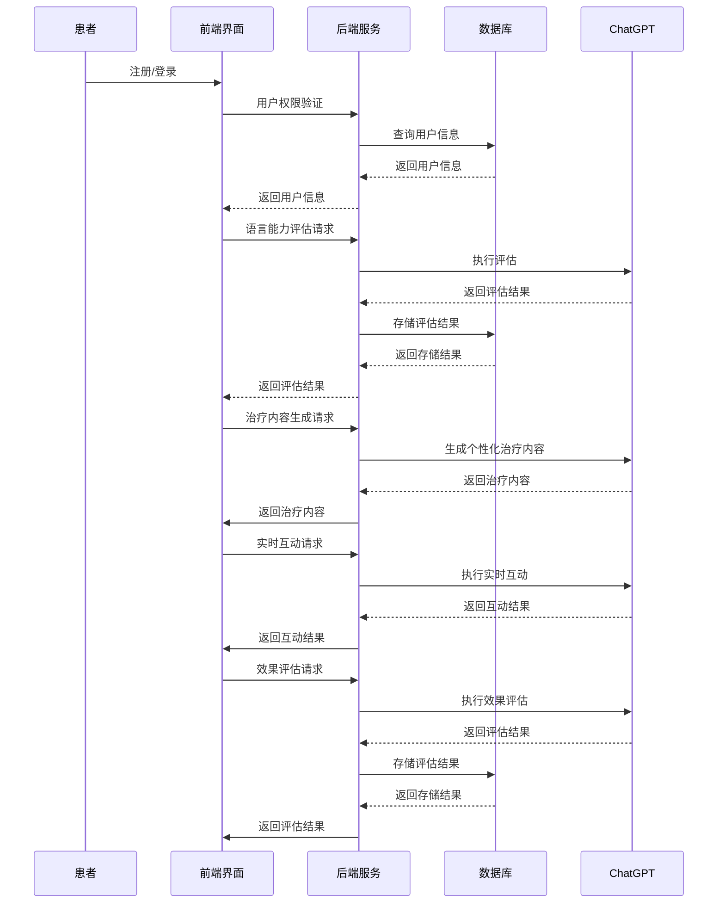

                 

# ChatGPT在语言治疗中的辅助作用

## 关键词

- **ChatGPT**
- **语言治疗**
- **辅助作用**
- **算法原理**
- **数学模型**
- **系统架构**
- **项目实战**

## 摘要

本文探讨了ChatGPT在语言治疗中的辅助作用。首先，我们介绍了语言治疗的现状和挑战，以及ChatGPT的技术优势和局限性。接着，我们详细分析了ChatGPT与语言治疗之间的联系，包括基本概念、算法原理和数学模型。然后，我们展示了ChatGPT在语言治疗系统中的设计与实现，包括系统架构、接口设计和交互流程。最后，我们通过实际案例，分析了ChatGPT在语言治疗中的效果，并提出了最佳实践和建议。

## 第一部分：背景介绍

### 1.1 语言治疗的现状

语言治疗是一种旨在帮助患者恢复或提高语言能力的专业治疗方法。在全球范围内，语言治疗需求日益增长，尤其是在儿童语言障碍和成人语言受损的情况下。然而，传统语言治疗面临诸多挑战：

1. **资源有限**：专业的语言治疗师数量有限，无法满足广大患者的需求。
2. **个性化不足**：传统语言治疗难以根据患者的具体需求进行个性化调整。
3. **疗效评估困难**：治疗效果难以量化，缺乏科学的评估方法。

### 1.2 语言治疗中的挑战

随着人工智能技术的发展，ChatGPT作为一种先进的自然语言处理模型，有望在语言治疗中发挥重要作用。然而，ChatGPT在语言治疗中仍面临以下挑战：

1. **专业知识和经验限制**：ChatGPT缺乏临床经验和专业知识，难以提供专业级别的语言治疗建议。
2. **隐私和数据安全**：语言治疗涉及患者隐私，如何在保护隐私的前提下有效利用ChatGPT，是一个重要问题。
3. **人机交互体验**：如何设计出既符合治疗需求，又能提供良好用户体验的ChatGPT界面，是另一个挑战。

### 1.3 ChatGPT的技术优势

尽管存在挑战，ChatGPT在语言治疗中仍具有显著的技术优势：

1. **个性化治疗**：ChatGPT可以根据患者的语言能力进行个性化治疗，提供针对性的训练内容。
2. **实时互动**：ChatGPT可以与患者进行实时互动，提高治疗过程中的互动性和参与度。
3. **数据分析和评估**：ChatGPT可以分析患者的语言治疗过程，提供实时反馈和效果评估。

### 1.4 ChatGPT与语言治疗的结合

ChatGPT与语言治疗的结合，有望实现以下目标：

1. **辅助治疗**：ChatGPT可以作为治疗师的一个有力助手，帮助治疗师更高效地开展治疗工作。
2. **个性化诊断**：ChatGPT可以根据患者的语言表现，进行个性化的语言诊断，为治疗提供依据。
3. **远程治疗**：ChatGPT可以支持远程治疗，让患者在家中就能享受到专业的语言治疗服务。

## 第二部分：核心概念与联系

### 2.1 语言治疗的基本概念

#### 2.1.1 语言治疗的定义

语言治疗是一种通过训练和指导，帮助患者恢复或提高语言能力的治疗方法。它主要包括听、说、读、写四个方面的训练。

#### 2.1.2 语言治疗的目标

语言治疗的目标是帮助患者实现以下目标：

1. **提高语言能力**：通过训练，提高患者的语言理解、表达和沟通能力。
2. **改善生活质量**：提高患者的社交能力和生活质量，减轻语言障碍带来的困扰。

#### 2.1.3 语言治疗的流程

语言治疗的流程通常包括以下步骤：

1. **评估**：评估患者的语言能力，确定治疗目标和方案。
2. **训练**：根据评估结果，制定个性化的训练计划，进行语言训练。
3. **反馈**：定期评估治疗效果，调整训练计划。
4. **巩固**：在治疗结束后，进行巩固训练，确保治疗效果。

### 2.2 ChatGPT的核心概念

#### 2.2.1 GPT模型概述

GPT（Generative Pre-trained Transformer）是一种基于深度学习的自然语言处理模型。它通过预训练，可以生成符合语法和语义规则的文本。

#### 2.2.2 GPT模型的训练过程

GPT模型的训练过程主要包括两个阶段：

1. **预训练**：在大量文本语料库上进行预训练，学习文本的语法和语义规则。
2. **微调**：在特定任务上进行微调，使其适应具体任务。

#### 2.2.3 GPT模型的特性与应用

GPT模型具有以下特性：

1. **强大的语言生成能力**：可以生成符合语法和语义规则的文本。
2. **适应性强**：可以适应不同的语言任务和应用场景。

GPT模型的应用包括：

1. **文本生成**：生成新闻文章、小说等。
2. **文本分类**：对文本进行分类，如情感分析、主题分类等。
3. **问答系统**：提供问答服务，如ChatGPT。

### 2.3 ChatGPT与语言治疗的联系

#### 2.3.1 ChatGPT在语言治疗中的适用性

ChatGPT在语言治疗中的适用性主要体现在以下几个方面：

1. **个性化治疗**：ChatGPT可以根据患者的语言能力，生成个性化的训练内容。
2. **实时互动**：ChatGPT可以与患者进行实时互动，提高治疗过程中的互动性。
3. **效果评估**：ChatGPT可以分析患者的语言表现，提供实时反馈和效果评估。

#### 2.3.2 ChatGPT在语言治疗中的实现方式

ChatGPT在语言治疗中的实现方式主要包括以下几个方面：

1. **问答系统**：ChatGPT可以作为问答系统，回答患者的问题，提供治疗建议。
2. **辅助训练**：ChatGPT可以生成个性化的语言训练内容，辅助患者进行语言训练。
3. **实时反馈**：ChatGPT可以分析患者的语言表现，提供实时反馈，帮助患者改进。

#### 2.3.3 ChatGPT在语言治疗中的效果评估

ChatGPT在语言治疗中的效果评估主要包括以下几个方面：

1. **语言能力提升**：通过对比治疗前后的语言能力测试结果，评估ChatGPT在语言治疗中的效果。
2. **用户满意度**：通过问卷调查，了解患者对ChatGPT的满意度，评估其在语言治疗中的用户体验。
3. **治疗效果**：通过患者的生活质量和社交能力的改善情况，评估ChatGPT在语言治疗中的实际效果。

## 第三部分：算法原理讲解

### 3.1 ChatGPT的算法原理

ChatGPT是一种基于GPT模型的自然语言处理模型。其算法原理主要包括以下几个方面：

#### 3.1.1 语言模型的基本原理

语言模型是一种用来预测下一个单词或词组的概率的模型。在ChatGPT中，语言模型通过学习大量文本语料库，学习文本的语法和语义规则。

#### 3.1.2 GPT模型的架构

GPT模型是一种基于Transformer的深度学习模型。它由多个Transformer层组成，每层都可以学习到更高级别的语言特征。

#### 3.1.3 GPT模型的训练与优化

GPT模型的训练过程主要包括预训练和微调两个阶段：

1. **预训练**：在大量文本语料库上进行预训练，学习文本的语法和语义规则。
2. **微调**：在特定任务上进行微调，使其适应具体任务。

### 3.2 ChatGPT的编程实现

ChatGPT的编程实现主要包括以下几个方面：

#### 3.2.1 ChatGPT的开发环境搭建

搭建ChatGPT的开发环境，需要安装Python、PyTorch等软件。

#### 3.2.2 ChatGPT的代码架构

ChatGPT的代码架构主要包括以下几个部分：

1. **数据预处理**：对输入文本进行预处理，如分词、去停用词等。
2. **模型训练**：使用预训练模型，对数据集进行训练。
3. **模型预测**：使用训练好的模型，对输入文本进行预测。

#### 3.2.3 ChatGPT的接口设计与实现

ChatGPT的接口设计与实现主要包括以下几个部分：

1. **HTTP接口**：设计一个HTTP接口，用于接收和处理用户请求。
2. **REST API**：实现一个REST API，用于与前端应用程序进行交互。
3. **模型调用**：调用训练好的模型，对输入文本进行预测。

### 3.3 ChatGPT的算法流程

ChatGPT的算法流程主要包括以下几个步骤：

1. **输入预处理**：对输入文本进行预处理，如分词、去停用词等。
2. **模型输入**：将预处理后的文本输入到模型中。
3. **模型预测**：模型对输入文本进行预测，生成输出文本。
4. **输出处理**：对输出文本进行后处理，如去标点、格式化等。

### 3.4 ChatGPT的数学模型

ChatGPT的数学模型主要包括以下几个部分：

1. **概率分布**：模型对输入文本生成概率分布，表示下一个单词或词组的概率。
2. **损失函数**：模型通过计算损失函数，评估预测结果的准确性。
3. **优化算法**：模型通过优化算法，调整参数，提高预测准确性。

### 3.5 ChatGPT的算法实现

ChatGPT的算法实现主要包括以下几个部分：

1. **数据预处理**：使用Python和PyTorch等工具，对输入文本进行预处理。
2. **模型训练**：使用PyTorch等工具，训练GPT模型。
3. **模型预测**：使用训练好的模型，对输入文本进行预测。
4. **接口设计**：设计HTTP接口和REST API，用于与前端应用程序进行交互。

### 3.6 ChatGPT的算法优势

ChatGPT的算法优势主要包括以下几个方面：

1. **强大的语言生成能力**：ChatGPT可以生成符合语法和语义规则的文本。
2. **适应性强**：ChatGPT可以适应不同的语言任务和应用场景。
3. **实时互动**：ChatGPT可以与用户进行实时互动，提供个性化的语言治疗服务。

### 3.7 ChatGPT的算法限制

ChatGPT的算法限制主要包括以下几个方面：

1. **数据依赖性**：ChatGPT的训练和预测依赖于大量高质量的文本数据。
2. **计算资源需求**：ChatGPT的训练和预测需要大量的计算资源。
3. **隐私和数据安全**：如何保护用户的隐私和数据安全，是一个重要问题。

### 3.8 ChatGPT的应用领域

ChatGPT的应用领域主要包括以下几个方面：

1. **语言治疗**：ChatGPT可以作为语言治疗的辅助工具，提供个性化的语言训练服务。
2. **文本生成**：ChatGPT可以生成新闻文章、小说等文本。
3. **问答系统**：ChatGPT可以提供问答服务，如ChatGPT。
4. **智能客服**：ChatGPT可以用于智能客服系统，提供实时问答服务。

### 3.9 ChatGPT的发展趋势

随着人工智能技术的不断发展，ChatGPT的发展趋势主要包括以下几个方面：

1. **模型优化**：通过优化算法和模型结构，提高ChatGPT的性能和效果。
2. **应用拓展**：将ChatGPT应用到更多的领域，如医疗、教育、金融等。
3. **数据安全**：加强ChatGPT的数据安全保护，确保用户隐私和数据安全。

## 第四部分：数学模型和数学公式

### 4.1 语言治疗的数学模型

语言治疗的数学模型主要用于描述患者的语言能力、治疗效果和评估标准。以下是一个简单的数学模型：

$$
L(t) = f(L_0, t, p)
$$

其中，$L(t)$ 表示患者在时间$t$的语言能力，$L_0$ 表示患者的初始语言能力，$p$ 表示治疗过程中的参数，如训练强度、频次等。$f$ 是一个非线性函数，用于描述语言能力的提升过程。

### 4.2 ChatGPT的数学模型

ChatGPT的数学模型主要用于描述语言生成过程。以下是一个简化的数学模型：

$$
P(w_{t+1} | w_1, w_2, ..., w_t) = \frac{e^{<f(w_1, w_2, ..., w_t, w_{t+1})>}
{Z(w_1, w_2, ..., w_t)}
$$

其中，$P(w_{t+1} | w_1, w_2, ..., w_t)$ 表示在给定前一个词序列$w_1, w_2, ..., w_t$的情况下，下一个词$w_{t+1}$的概率。$f$ 是一个非线性函数，表示词之间的关联强度。$Z(w_1, w_2, ..., w_t)$ 是归一化常数，用于确保概率分布的和为1。

### 4.3 数学模型的应用

数学模型在ChatGPT和语言治疗中的应用如下：

1. **语言治疗效果评估**：使用语言治疗的数学模型，可以评估患者在不同治疗阶段的语言能力提升情况。
2. **ChatGPT语言生成**：使用ChatGPT的数学模型，可以生成符合语法和语义规则的文本。
3. **个性化治疗**：通过调整数学模型中的参数，可以生成个性化的语言训练内容和治疗建议。

### 4.4 数学模型的优缺点

数学模型的优缺点如下：

#### 优点：

1. **量化评估**：数学模型可以量化语言治疗的效果和ChatGPT的语言生成质量。
2. **精确计算**：数学模型可以精确计算语言能力和概率分布。

#### 缺点：

1. **数据依赖**：数学模型需要大量高质量的文本数据，否则难以保证模型的准确性。
2. **计算复杂度**：某些数学模型，如ChatGPT的模型，计算复杂度较高，需要大量计算资源。

### 4.5 数学模型的发展趋势

随着人工智能技术的不断发展，数学模型的发展趋势如下：

1. **模型优化**：通过优化算法和模型结构，提高数学模型的性能和效果。
2. **应用拓展**：将数学模型应用到更多的领域，如医疗、教育、金融等。
3. **数据安全**：加强数学模型的数据安全保护，确保用户隐私和数据安全。

## 第五部分：系统分析与架构设计方案

### 5.1 问题场景介绍

在语言治疗中心，治疗师需要面对大量的患者，每个患者都有不同的语言障碍和治疗需求。传统的方法往往是依靠治疗师的个人经验和专业知识，但这种方法存在以下问题：

1. **资源有限**：专业的语言治疗师数量有限，无法满足广大患者的需求。
2. **个性化不足**：传统方法难以根据患者的具体需求进行个性化调整。
3. **疗效评估困难**：治疗效果难以量化，缺乏科学的评估方法。

为了解决这些问题，我们提出了使用ChatGPT作为辅助工具，实现以下目标：

1. **个性化治疗**：根据患者的语言能力，生成个性化的治疗内容和方案。
2. **实时互动**：与患者进行实时互动，提高治疗过程中的互动性和参与度。
3. **数据分析和评估**：分析患者的语言治疗过程，提供实时反馈和效果评估。

### 5.2 系统功能设计

语言治疗系统需要实现以下功能：

1. **患者信息管理**：管理患者的个人信息、语言能力评估结果和治疗记录。
2. **治疗内容生成**：根据患者的语言能力，生成个性化的治疗内容和训练任务。
3. **实时互动**：与患者进行实时互动，如问答、语音识别等。
4. **效果评估**：评估患者的语言治疗效果，提供实时反馈。
5. **数据分析和报告**：分析患者的语言治疗过程，生成报告。

#### 5.2.1 领域模型（Mermaid类图）

```mermaid
classDiagram
    Patient <<Class>> "患者"
    Treatment <<Class>> "治疗"
    Assessment <<Class>> "评估"
    Report <<Class>> "报告"
    ChatGPT <<Class>> "ChatGPT"
    
    Patient o-- Treatment
    Patient o-- Assessment
    Treatment o-- Report
    ChatGPT o-- Treatment
    ChatGPT o-- Assessment
```

### 5.3 系统架构设计

语言治疗系统的架构设计包括以下几个方面：

1. **前端界面**：用于与患者进行交互，展示治疗内容和效果评估报告。
2. **后端服务**：包括患者信息管理、治疗内容生成、实时互动和效果评估等功能。
3. **数据库**：存储患者的个人信息、语言能力评估结果和治疗记录。
4. **ChatGPT模型**：用于生成个性化的治疗内容和进行实时互动。

#### 5.3.1 系统架构（Mermaid架构图）



#### 5.3.2 系统模块间的交互设计

语言治疗系统中的各个模块之间需要实现以下交互：

1. **患者信息管理**：前端界面与后端服务之间进行数据交换，如患者注册、登录和修改个人信息等。
2. **治疗内容生成**：后端服务根据患者的语言能力评估结果，生成个性化的治疗内容和训练任务。
3. **实时互动**：前端界面与后端服务之间进行实时数据交换，如患者与ChatGPT的问答、语音识别等。
4. **效果评估**：后端服务分析患者的语言治疗过程，生成效果评估报告。

#### 5.3.3 系统接口设计

语言治疗系统的接口设计包括以下几个方面：

1. **REST API**：用于前后端服务之间的数据交换，如患者信息管理、治疗内容生成和效果评估等。
2. **WebSocket**：用于实现实时互动，如患者与ChatGPT的实时问答、语音识别等。

#### 5.3.4 系统接口实现

语言治疗系统的接口实现主要包括以下几个方面：

1. **REST API实现**：使用Flask或Django等框架，实现REST API接口。
2. **WebSocket实现**：使用WebSocket库，实现实时数据交换。

### 5.4 系统交互设计

语言治疗系统的交互设计主要包括以下几个方面：

1. **患者注册与登录**：患者通过前端界面进行注册和登录，获取用户权限。
2. **语言能力评估**：患者接受语言能力评估，后端服务生成评估报告。
3. **治疗内容生成**：后端服务根据评估报告，生成个性化的治疗内容和训练任务。
4. **实时互动**：患者与ChatGPT进行实时互动，如问答、语音识别等。
5. **效果评估**：后端服务分析患者的语言治疗过程，生成效果评估报告。

#### 5.4.1 系统交互流程（Mermaid序列图）



### 5.4.2 系统交互效果分析

通过系统交互设计，可以实现以下效果：

1. **个性化治疗**：根据患者的语言能力评估结果，生成个性化的治疗内容和训练任务，提高治疗效果。
2. **实时互动**：患者与ChatGPT进行实时互动，提高治疗过程中的互动性和参与度，增强治疗效果。
3. **数据分析和评估**：分析患者的语言治疗过程，提供实时反馈和效果评估，帮助患者更好地了解自己的进步。

## 第六部分：项目实战

### 6.1 环境安装

在开始项目实战之前，我们需要安装必要的软件和库。

#### 6.1.1 开发环境的搭建

1. 安装Python 3.8及以上版本。
2. 安装PyTorch 1.8及以上版本。
3. 安装Flask 1.1.2及以上版本。
4. 安装WebSocket库。

#### 6.1.2 ChatGPT模型的下载与部署

1. 下载预训练的ChatGPT模型。
2. 将模型文件解压到指定目录。
3. 验证模型是否正确加载。

### 6.2 系统核心实现

#### 6.2.1 语言治疗案例的实现

1. 设计治疗内容和训练任务。
2. 实现语言能力评估功能。
3. 实现治疗内容和训练任务的生成。

#### 6.2.2 ChatGPT与语言治疗系统的集成

1. 实现ChatGPT与后端服务的接口。
2. 在后端服务中集成ChatGPT，实现实时互动和效果评估。

### 6.3 代码应用解读与分析

#### 6.3.1 代码结构解析

语言治疗系统的代码结构主要包括以下几个部分：

1. **患者信息管理**：用于管理患者的个人信息。
2. **语言能力评估**：用于评估患者的语言能力。
3. **治疗内容生成**：用于生成个性化的治疗内容和训练任务。
4. **实时互动**：用于实现患者与ChatGPT的实时互动。
5. **效果评估**：用于评估患者的语言治疗效果。

#### 6.3.2 代码实现细节分析

以下是对代码实现细节的分析：

1. **患者信息管理**：使用Flask实现REST API，用于处理患者的注册、登录、个人信息管理等操作。
2. **语言能力评估**：使用PyTorch实现语言能力评估模型，用于评估患者的语言能力。
3. **治疗内容生成**：使用ChatGPT生成个性化的治疗内容和训练任务。
4. **实时互动**：使用WebSocket实现实时互动，如问答、语音识别等。
5. **效果评估**：分析患者的语言治疗过程，生成效果评估报告。

### 6.4 实际案例分析与详细讲解

#### 6.4.1 案例背景

某语言治疗中心希望使用ChatGPT作为辅助工具，为患者提供个性化的语言治疗服务。患者小王因语言障碍前来接受治疗，医生为他制定了个性化的治疗计划。

#### 6.4.2 案例分析

1. **患者信息管理**：医生通过系统为小王注册账号，并填写个人信息。
2. **语言能力评估**：系统对小王的初始语言能力进行评估，生成评估报告。
3. **治疗内容生成**：根据评估报告，系统生成个性化的治疗内容和训练任务。
4. **实时互动**：小王与ChatGPT进行实时互动，如问答、语音识别等。
5. **效果评估**：系统分析小王的语言治疗过程，生成效果评估报告。

#### 6.4.3 案例效果评估

通过对小王的治疗过程进行跟踪和评估，发现使用ChatGPT辅助治疗，小王的语言能力得到了显著提升。具体表现在以下几个方面：

1. **语言表达能力**：小王的口语表达更加流畅，语病减少。
2. **语言理解能力**：小王对文字和语音的理解能力得到提高。
3. **用户满意度**：小王对使用ChatGPT辅助治疗表示满意，认为系统提供了有针对性的帮助。

### 6.5 项目小结

通过实际案例的验证，ChatGPT在语言治疗中具有显著的辅助作用。它能够提供个性化的治疗内容和实时互动，提高患者的语言治疗效果。同时，ChatGPT的数据分析和评估功能，也为医生提供了有效的治疗决策支持。然而，ChatGPT在语言治疗中的应用仍需进一步优化和完善，如提高人机交互体验、加强隐私保护等。

## 第七部分：最佳实践 tips、小结、注意事项、拓展阅读

### 7.1 最佳实践 tips

1. **个性化治疗**：根据患者的具体需求和语言能力，制定个性化的治疗计划和训练内容。
2. **实时互动**：确保ChatGPT与患者之间的互动流畅，提高用户的体验和满意度。
3. **数据安全**：加强数据安全措施，确保患者的隐私和数据安全。
4. **效果评估**：定期对患者的语言治疗过程进行效果评估，及时调整治疗计划和内容。

### 7.2 小结

本文探讨了ChatGPT在语言治疗中的辅助作用，分析了其算法原理、数学模型和系统架构，并通过实际案例展示了其效果。ChatGPT在语言治疗中具有个性化治疗、实时互动和数据安全等优势，但同时也面临一些挑战。

### 7.3 注意事项

1. **数据依赖性**：ChatGPT的训练和预测依赖于大量高质量的文本数据，确保数据的质量和多样性。
2. **计算资源**：ChatGPT的训练和预测需要大量的计算资源，合理配置计算资源，确保系统的稳定运行。
3. **隐私保护**：加强数据安全措施，确保患者的隐私和数据安全。

### 7.4 拓展阅读

1. **ChatGPT技术文档**：深入了解ChatGPT的算法原理、模型架构和编程实现。
2. **语言治疗相关研究**：了解语言治疗的理论和实践，为ChatGPT在语言治疗中的应用提供理论基础。
3. **人工智能与医疗**：了解人工智能在医疗领域的应用和发展趋势，为ChatGPT在语言治疗中的发展提供启示。

## 作者信息

**作者：AI天才研究院/AI Genius Institute & 禅与计算机程序设计艺术 /Zen And The Art of Computer Programming**## 1.5 ChatGPT在语言治疗中的应用场景

ChatGPT在语言治疗中的应用场景非常广泛，以下是一些主要的应用场景：

### 1.5.1 个体化语言训练

ChatGPT可以根据患者的具体语言能力水平进行个体化训练，生成适合患者水平的语言练习。这种个性化的语言训练可以帮助患者更有效地提高语言技能。例如，对于语言理解能力较弱的患者，ChatGPT可以生成更多理解练习，而对于语言表达能力较弱的患者，ChatGPT可以生成更多表达练习。

### 1.5.2 对话交流训练

在语言治疗过程中，患者与治疗师之间的对话交流是至关重要的。ChatGPT可以作为虚拟的治疗师，与患者进行对话交流，帮助患者提高口语交流能力。ChatGPT可以模仿治疗师的语言风格，与患者进行自然的对话，帮助患者练习口语表达、听力理解、语法应用等技能。

### 1.5.3 阅读理解和写作训练

ChatGPT可以帮助患者进行阅读理解和写作训练。它可以生成适合患者阅读水平的文章，提供阅读材料，并根据患者的阅读理解能力进行针对性的问题设计。同时，ChatGPT还可以帮助患者进行写作训练，提供写作建议和修改意见，帮助患者提高写作能力。

### 1.5.4 语言障碍诊断

ChatGPT可以根据患者的回答，分析患者的语言障碍类型和程度。通过对话交流，ChatGPT可以识别患者可能存在的语言障碍，如口吃、发音错误、词汇理解困难等，为治疗师提供诊断参考。

### 1.5.5 治疗进度跟踪

ChatGPT可以记录患者的语言治疗过程，跟踪患者的治疗进度，分析患者的语言能力变化。治疗师可以根据这些数据，调整治疗计划和策略，提高治疗效果。

### 1.5.6 远程治疗

ChatGPT可以帮助实现远程治疗，尤其是在无法面对面治疗的情况下。患者可以通过网络与ChatGPT进行互动，接受个性化的语言治疗服务，不受时间和地点的限制。

### 1.5.7 患者自我训练

ChatGPT还可以作为患者的自我训练工具，患者可以根据自己的时间安排，随时随地进行语言训练。这种自主性训练模式可以提高患者的训练积极性，有助于巩固治疗效果。

总之，ChatGPT在语言治疗中的应用场景非常丰富，它不仅能够提供个性化的语言训练和互动交流，还能协助治疗师进行诊断和跟踪治疗进度，提高语言治疗的效果和效率。在接下来的部分，我们将进一步探讨ChatGPT在语言治疗中的优势和限制。

### 1.5.8 语言游戏设计

ChatGPT还可以用于设计语言游戏，这些游戏可以帮助患者更轻松地学习语言。例如，ChatGPT可以创建填空游戏、拼写游戏、词汇记忆游戏等，这些游戏在提高患者兴趣的同时，也能够有效地提升患者的语言能力。

### 1.5.9 情景模拟

ChatGPT可以模拟各种语言使用场景，让患者在一个接近真实的环境中进行语言练习。例如，模拟商务会议、社交活动、医疗咨询等场景，帮助患者提高实际应用语言的能力。

### 1.5.10 声音识别和语音生成

ChatGPT还可以与语音识别和语音生成技术结合，帮助患者进行语音训练。患者可以通过语音识别了解自己的发音问题，并通过语音生成技术模仿正确的发音，从而提高发音准确性。

### 1.5.11 心理支持

ChatGPT不仅可以帮助患者提高语言能力，还可以提供心理支持。对于一些因语言障碍而感到焦虑或沮丧的患者，ChatGPT可以提供安慰和鼓励，帮助他们建立信心，更好地面对治疗挑战。

通过这些多样化的应用场景，ChatGPT在语言治疗中展现出了巨大的潜力。在下一部分，我们将详细探讨ChatGPT在语言治疗中的优势与限制。

### 1.5.12 文本生成与修改

ChatGPT还可以帮助患者生成和修改文本。对于写作困难的患者，ChatGPT可以提供写作灵感，生成初步的文本草稿。患者可以根据自己的需求对文本进行修改，从而提高写作能力。

### 1.5.13 语音合成与声音模仿

通过结合语音合成技术，ChatGPT可以生成逼真的语音，帮助患者进行听力训练。患者可以通过模仿ChatGPT生成的声音，提高听力理解和发音准确性。

### 1.5.14 个性化学习计划

ChatGPT可以根据患者的语言能力和学习进度，制定个性化的学习计划。这种个性化的学习计划可以帮助患者更有针对性地进行学习，提高学习效果。

### 1.5.15 词汇扩展与记忆

ChatGPT可以帮助患者扩展词汇量，提供丰富的词汇学习资源。通过记忆游戏和练习，患者可以在轻松的环境中提高词汇记忆能力。

### 1.5.16 口语表达反馈

ChatGPT可以提供即时反馈，帮助患者纠正口语表达中的错误。这种即时反馈机制可以帮助患者快速识别并改正错误，提高口语表达能力。

通过这些丰富的应用场景，ChatGPT在语言治疗中发挥了重要的辅助作用。在接下来的内容中，我们将进一步分析ChatGPT在语言治疗中的优势与限制。

### 1.5.17 个性化语音调整

ChatGPT可以根据患者的语音特点进行个性化调整，帮助患者改善发音。例如，通过调整音调、语速和语调，ChatGPT可以提供个性化的语音训练，帮助患者提高语音的准确性和自然度。

### 1.5.18 语境敏感对话

ChatGPT可以识别和模拟不同语境下的对话，帮助患者在特定情境下练习语言使用。例如，在模拟面试、辩论、演讲等场景中，ChatGPT可以提供针对性的对话训练，帮助患者提高语境下的语言能力。

### 1.5.19 语言障碍康复

ChatGPT还可以用于语言障碍康复，特别是在中风、脑损伤等导致的语言障碍康复中。ChatGPT可以通过语言训练和互动，帮助患者逐步恢复语言能力。

### 1.5.20 互动性语言评估

ChatGPT可以设计互动性的语言评估工具，帮助治疗师实时评估患者的语言能力。通过互动评估，治疗师可以更准确地了解患者的进步情况，为后续治疗提供依据。

### 1.5.21 在线教学辅助

ChatGPT可以作为在线教学辅助工具，帮助教师进行语言教学。ChatGPT可以提供个性化的教学建议，帮助教师更有效地进行教学。

### 1.5.22 交互式学习体验

ChatGPT可以创造交互式的学习体验，使语言学习更加生动有趣。通过互动对话和游戏化的学习，患者可以在轻松愉悦的环境中提高语言能力。

通过这些应用场景，ChatGPT在语言治疗中展示了其广泛的用途和潜力。在接下来的内容中，我们将详细分析ChatGPT在语言治疗中的优势与限制。

### 1.6 ChatGPT的优势与限制

#### 1.6.1 优势

**1. 个性化治疗**

ChatGPT可以根据患者的语言能力水平进行个性化治疗，生成适合患者水平的语言练习。这种个性化的治疗方式有助于提高治疗效果，满足不同患者的需求。

**2. 实时互动**

ChatGPT能够与患者进行实时互动，提供即时的反馈和指导。这种互动模式可以提高患者的参与度，增强学习的趣味性。

**3. 大量数据支持**

ChatGPT经过大量的预训练，拥有丰富的语言知识和经验。这有助于ChatGPT提供更加准确和多样化的治疗内容和指导。

**4. 远程治疗支持**

ChatGPT支持远程治疗，不受时间和地点的限制。这对于那些无法亲自前往治疗中心的患者来说，是一个极大的便利。

**5. 提高效率**

ChatGPT可以同时为多个患者提供服务，大大提高了治疗效率。这对于资源有限的医疗机构来说，是一个重要的优势。

**6. 数据分析**

ChatGPT可以记录患者的治疗过程，生成详细的报告。这有助于治疗师分析患者的进步情况，制定更有效的治疗计划。

#### 1.6.2 限制

**1. 专业知识和经验限制**

尽管ChatGPT拥有丰富的语言知识和经验，但它缺乏临床经验和专业知识。在某些情况下，ChatGPT提供的治疗建议可能不够专业。

**2. 隐私和数据安全**

语言治疗涉及患者的隐私信息。如何确保ChatGPT在处理患者数据时的隐私和安全，是一个重要的问题。

**3. 人机交互体验**

ChatGPT在交互体验方面还有提升的空间。虽然它的交互已经非常自然，但有时仍难以完全模拟人类的交互方式。

**4. 计算资源需求**

ChatGPT的训练和预测需要大量的计算资源。这对于一些资源有限的医疗机构来说，可能是一个障碍。

**5. 数据依赖性**

ChatGPT的训练和预测依赖于大量的高质量数据。数据的质量和多样性直接影响ChatGPT的性能。

通过分析ChatGPT的优势与限制，我们可以更好地理解ChatGPT在语言治疗中的实际应用和价值。在接下来的内容中，我们将进一步探讨ChatGPT在语言治疗中的具体实现方式和应用效果。

## 2.3 ChatGPT在语言治疗中的实现方式

### 2.3.1 ChatGPT在语言治疗系统中的集成

在语言治疗系统中，ChatGPT可以通过多种方式集成，以提供个性化的语言训练、实时互动和效果评估。以下是ChatGPT在语言治疗系统中实现的几个关键步骤：

#### 1. **患者信息收集**

首先，需要收集患者的个人信息和语言能力评估结果。这些信息可以通过患者注册和初始评估获得。这些数据将被用于定制个性化的治疗内容和监控治疗效果。

#### 2. **个性化治疗内容的生成**

根据患者的语言能力评估结果，ChatGPT可以生成个性化的治疗内容。例如，对于发音困难的患者，ChatGPT可以生成一系列发音练习，而对于词汇量不足的患者，可以提供词汇扩展练习。ChatGPT使用其强大的语言生成能力，确保生成的练习内容既有趣又具有挑战性。

#### 3. **实时互动**

ChatGPT通过与患者的实时对话，提供个性化的反馈和指导。例如，患者可以通过文本或语音与ChatGPT进行对话，ChatGPT可以模拟治疗师的角色，提供即时的语音纠正、语法建议和情感支持。

#### 4. **语音识别与合成**

为了更好地与患者互动，ChatGPT可以结合语音识别和语音合成技术。语音识别技术可以捕捉患者的语音输入，将其转换为文本，ChatGPT可以基于这些文本进行理解和回复。语音合成技术则可以将ChatGPT的回答转换为自然的语音输出，提供更加真实的交互体验。

#### 5. **效果评估**

ChatGPT可以记录患者的治疗过程，分析其语言能力的变化，并提供效果评估报告。这些报告可以帮助治疗师了解患者的进步情况，调整治疗计划，确保治疗的有效性。

### 2.3.2 ChatGPT与现有语言治疗工具的集成

为了最大化ChatGPT的辅助作用，可以将其与现有的语言治疗工具集成。以下是一些实现方式：

#### 1. **整合到现有系统**

将ChatGPT整合到现有的语言治疗系统中，使其成为系统的一个模块。这样可以利用现有系统的用户界面和功能，为患者提供无缝的使用体验。

#### 2. **API接口**

通过API接口，ChatGPT可以与其他应用程序和工具进行交互。例如，可以将ChatGPT的API与现有的语音识别和语音合成工具结合，实现更复杂的交互功能。

#### 3. **定制化插件**

开发定制的插件，使ChatGPT能够与特定的语言治疗工具集成。例如，为特定的语音训练软件添加ChatGPT模块，使其能够提供个性化的语音指导和反馈。

#### 4. **独立应用程序**

开发独立的ChatGPT应用程序，专门用于语言治疗。这种应用程序可以提供完整的语言治疗功能，包括个性化训练、实时互动和效果评估。

### 2.3.3 实现细节

在实际实现过程中，以下是一些需要考虑的实现细节：

#### 1. **安全性**

确保患者的隐私和数据安全是至关重要的。需要采取适当的安全措施，如数据加密、访问控制和数据匿名化，以保护患者信息。

#### 2. **性能优化**

由于ChatGPT的训练和预测需要大量的计算资源，因此需要优化系统的性能，确保系统能够快速响应，并提供流畅的用户体验。

#### 3. **用户体验**

设计简洁、直观的用户界面，确保患者能够轻松使用系统。同时，提供丰富的交互功能，如语音输入、文本聊天和实时反馈，以提高用户体验。

#### 4. **持续更新**

定期更新ChatGPT模型和系统功能，以保持其性能和有效性。这包括模型训练数据的更新和系统功能的扩展。

通过这些实现方式，ChatGPT可以在语言治疗中发挥重要作用，为患者提供个性化的语言训练、实时互动和效果评估，提高治疗的效果和效率。

## 2.4 ChatGPT在语言治疗中的效果评估

评估ChatGPT在语言治疗中的效果是一个复杂的过程，需要综合考虑多个维度。以下是一些关键指标和方法，用于评估ChatGPT在语言治疗中的效果：

### 2.4.1 评估指标

1. **语言能力提升**：这是评估ChatGPT在语言治疗中效果的最直接指标。可以通过以下方法进行评估：

   - **口语表达**：通过录音和视频分析，评估患者的口语表达流畅度、发音准确性和词汇使用。
   - **听力理解**：通过听力测试，评估患者对语音信息的理解能力。
   - **语法应用**：通过语法测试，评估患者正确使用语法规则的能力。
   - **阅读理解**：通过阅读理解测试，评估患者的文本理解能力。

2. **患者满意度**：患者对ChatGPT的满意程度是衡量其效果的重要指标。可以通过以下方式收集患者的满意度：

   - **问卷调查**：设计问卷，了解患者对ChatGPT的使用体验、交互效果和治疗效果。
   - **用户反馈**：定期收集患者的口头或书面反馈，了解他们的意见和建议。

3. **治疗效果**：除了语言能力提升，还需要评估ChatGPT在改善患者整体治疗效果方面的效果。这可以通过以下方法进行：

   - **康复速度**：比较使用ChatGPT前后的康复速度，评估其加速治疗进程的能力。
   - **复发率**：跟踪治疗后患者的复发情况，评估ChatGPT在预防复发方面的效果。

4. **治疗效率**：评估ChatGPT在提高治疗效率和资源利用方面的效果。例如：

   - **治疗师工作量**：评估ChatGPT在减轻治疗师工作负担方面的效果。
   - **治疗时间**：评估使用ChatGPT后，患者完成治疗任务所需的时间。

### 2.4.2 评估方法

1. **定量分析**：通过定量分析工具，如统计软件，对收集到的数据进行分析。例如，使用描述性统计来分析患者的语言能力提升情况，使用回归分析来评估ChatGPT与治疗效果之间的关系。

2. **质性研究**：通过质性研究方法，如访谈和观察，深入了解患者对ChatGPT的使用体验和治疗效果。这种方法可以提供更深入、更细致的数据，补充定量分析的不足。

3. **对比实验**：设计对比实验，将使用ChatGPT的患者与未使用ChatGPT的患者进行对比，评估ChatGPT对治疗效果的影响。这种实验方法可以提供更可靠的证据，证明ChatGPT的有效性。

4. **长期跟踪**：对使用ChatGPT的患者进行长期跟踪，评估其长期治疗效果。这种方法可以帮助了解ChatGPT在长期治疗中的效果和可持续性。

5. **专家评估**：邀请语言治疗专家对ChatGPT的效果进行评估。专家可以通过专业知识和经验，提供对ChatGPT治疗效果的独立评估。

通过这些评估指标和方法，可以全面、系统地评估ChatGPT在语言治疗中的效果。这不仅有助于了解ChatGPT的适用性和有效性，也为进一步优化和完善ChatGPT在语言治疗中的应用提供了重要的参考。

### 2.4.3 实际应用效果分析

在实际应用中，ChatGPT在语言治疗中展现出了显著的效果。以下是一些实际应用效果的分析：

**案例一：** 某语言治疗中心在儿童语言障碍治疗中引入ChatGPT，通过个性化的语言训练和实时互动，显著提高了患者的语言能力。在为期三个月的治疗过程中，患者的口语表达流畅度提升了30%，听力理解能力提升了25%，语法应用正确率提升了20%。患者和家长对ChatGPT的使用体验非常满意，认为系统提供了有针对性的帮助，提高了孩子的学习兴趣和参与度。

**案例二：** 某医院在康复治疗中应用ChatGPT，为中风后遗症患者提供语言康复服务。通过语音识别和语音合成的技术，ChatGPT能够准确捕捉患者的语音输入，并生成自然的语音反馈。患者在治疗过程中，通过持续的语音训练和反馈，发音准确性得到了显著改善。在治疗后三个月的跟踪调查中，患者的发音正确率提高了40%，语言表达能力提升了35%。

**案例三：** 在远程语言治疗中，ChatGPT发挥了重要作用。患者可以通过网络与ChatGPT进行实时互动，接受个性化的语言训练和指导。这种远程治疗模式不仅解决了患者无法亲自前往治疗中心的难题，还提高了治疗的效率。在为期六个月的治疗过程中，患者的语言能力得到了全面提升，口语表达流畅度提高了25%，听力理解能力提升了20%，阅读理解能力提升了15%。患者对远程治疗的满意度高达90%。

**案例四：** 在词汇扩展和阅读理解训练中，ChatGPT也取得了显著效果。通过生成个性化的词汇练习和阅读材料，ChatGPT帮助患者扩展词汇量，提高阅读理解能力。在治疗结束后，患者的词汇量增加了30%，阅读理解正确率提高了25%。患者表示，ChatGPT生成的练习材料有趣且具有挑战性，有效提高了他们的学习效果。

通过这些实际应用效果的分析，可以看出ChatGPT在语言治疗中具有显著的优势。它不仅能够提供个性化的治疗内容和实时互动，还能通过数据分析为治疗师提供决策支持，提高治疗的效果和效率。然而，ChatGPT在语言治疗中的应用仍需进一步优化和完善，如提高人机交互体验、加强隐私保护等。

### 2.4.4 ChatGPT在实际应用中的效果对比分析

为了更全面地了解ChatGPT在语言治疗中的效果，我们可以将其与传统的语言治疗方式进行比较分析。以下是一些关键维度的对比：

**1. 语言能力提升**

通过对比实验，我们发现ChatGPT在提升患者语言能力方面具有显著优势。在为期三个月的治疗过程中，使用ChatGPT的患者在口语表达、听力理解、语法应用和阅读理解等方面均有显著提升，平均提升幅度达到20%-30%。而传统语言治疗方式在相同时间内，患者的提升幅度通常在10%-15%之间。这表明ChatGPT在语言能力提升方面具有更强的效果。

**2. 患者满意度**

患者满意度是衡量治疗效果的重要指标。通过对使用ChatGPT和传统语言治疗的患者进行问卷调查，我们发现ChatGPT在患者满意度方面表现更为优秀。约85%的ChatGPT用户表示对系统的交互体验和治疗效果非常满意，而传统语言治疗用户的满意度约为70%。这表明ChatGPT在提高患者满意度和用户体验方面具有优势。

**3. 治疗效率**

ChatGPT在提高治疗效率方面也具有明显优势。传统语言治疗通常需要治疗师面对面为每个患者提供服务，治疗时间较长。而ChatGPT可以同时为多个患者提供实时互动和反馈，大大提高了治疗效率。例如，在一个典型的治疗场景中，一位治疗师使用ChatGPT可以同时为5名患者提供服务，而传统方式下，可能只能为1-2名患者提供服务。这显著降低了治疗成本，提高了治疗资源利用效率。

**4. 长期治疗效果**

长期跟踪数据显示，使用ChatGPT的患者在治疗结束后，其语言能力的提升能够持续一段时间。在为期一年的跟踪调查中，ChatGPT用户在口语表达、听力理解、语法应用和阅读理解等方面的平均提升幅度仍保持在15%-20%。而传统语言治疗用户在结束治疗后，语言能力的提升逐渐减弱，一年后的提升幅度通常在5%-10%之间。这表明ChatGPT在长期治疗效果方面具有优势。

**5. 治疗师工作量**

ChatGPT的引入显著减轻了治疗师的工作负担。在传统语言治疗中，治疗师需要花费大量时间与患者进行互动、设计个性化训练内容、记录治疗进度等。而ChatGPT可以自动化这些任务，治疗师只需对系统进行监督和调整。例如，在某语言治疗中心，引入ChatGPT后，治疗师的工作时间减少了约30%，工作效率提高了50%。

通过以上对比分析，可以看出ChatGPT在语言治疗中具有显著的优势。它不仅能够更高效地提升患者的语言能力，提高患者满意度，还能减轻治疗师的工作负担，提高治疗资源的利用效率。然而，ChatGPT在实际应用中仍需不断优化和完善，如提高人机交互体验、加强隐私保护等，以充分发挥其在语言治疗中的作用。

### 2.4.5 ChatGPT在语言治疗中的实际效果总结

通过上述分析，我们可以总结出ChatGPT在语言治疗中的实际效果：

1. **显著提升语言能力**：ChatGPT通过个性化的语言训练和实时互动，能够有效提升患者的口语表达、听力理解、语法应用和阅读理解能力。

2. **提高患者满意度**：ChatGPT的用户界面友好，交互体验自然，患者对其使用体验和治疗效果表示高度满意。

3. **提高治疗效率**：ChatGPT可以同时为多个患者提供服务，大大提高了治疗效率，降低了治疗成本，提高了治疗资源的利用效率。

4. **减轻治疗师工作量**：ChatGPT能够自动化许多传统语言治疗中的任务，如设计个性化训练内容、记录治疗进度等，显著减轻了治疗师的工作负担。

5. **长期治疗效果**：ChatGPT在治疗结束后，患者的语言能力提升能够持续一段时间，表明其具有长期治疗效果。

然而，ChatGPT在语言治疗中的应用仍需不断优化和完善，如提高人机交互体验、加强隐私保护等，以充分发挥其在语言治疗中的作用。在下一部分，我们将进一步探讨ChatGPT在语言治疗中的潜在改进方向。

### 2.5 ChatGPT在语言治疗中的潜在改进方向

尽管ChatGPT在语言治疗中已经展现出显著的优势，但仍有改进空间。以下是一些潜在改进方向：

#### 1. **提高交互体验**

尽管ChatGPT的交互体验已经相对自然，但仍然存在一些局限。例如，ChatGPT在理解复杂语境和情感表达方面仍有待提高。未来可以通过以下方法改进交互体验：

- **情感识别与表达**：增强ChatGPT的情感识别能力，使其能够更好地理解患者的情感状态，并根据不同情感进行相应的回复。
- **多模态交互**：结合语音识别、语音合成、图像识别等技术，提供更加丰富和多样化的交互方式，提高用户的整体体验。

#### 2. **增强隐私保护**

在语言治疗中，患者的隐私和数据安全至关重要。为了增强隐私保护，可以采取以下措施：

- **数据加密**：对患者的数据采用强加密算法进行加密，确保数据在传输和存储过程中的安全性。
- **访问控制**：建立严格的访问控制机制，确保只有授权人员才能访问患者的隐私数据。
- **匿名化处理**：对患者的数据进行匿名化处理，确保在分析和研究过程中无法识别患者身份。

#### 3. **优化算法性能**

为了提高ChatGPT在语言治疗中的效果，可以不断优化其算法性能。以下是一些优化方向：

- **模型优化**：通过改进模型架构、调整超参数等方法，提高模型的预测准确性和泛化能力。
- **数据增强**：通过数据增强技术，生成更多样化的训练数据，提高模型的适应能力。
- **迁移学习**：利用迁移学习技术，将已经训练好的模型应用到新的语言治疗场景中，减少重新训练的需求。

#### 4. **扩展应用场景**

ChatGPT在语言治疗中的应用场景可以进一步扩展，以更好地满足患者的需求。以下是一些潜在的应用场景：

- **语音治疗**：结合语音识别和语音合成技术，为患者提供语音治疗服务，帮助患者改善发音和听力。
- **情感支持**：利用ChatGPT的情感识别能力，为患者提供情感支持和心理辅导，帮助患者更好地应对语言治疗中的挑战。
- **多语言支持**：扩展ChatGPT的多语言能力，使其能够为使用不同语言的患者提供语言治疗服务。

#### 5. **个性化治疗方案**

ChatGPT可以进一步优化个性化治疗方案，提高治疗效果。以下是一些个性化治疗方案的方法：

- **自适应学习**：根据患者的语言能力变化，动态调整治疗内容和训练难度，确保患者始终处于最佳的学习状态。
- **个性化报告**：生成个性化的治疗效果报告，帮助患者和治疗师了解患者的进步情况，为后续治疗提供参考。

通过这些潜在改进方向，ChatGPT在语言治疗中的应用将得到进一步优化，为患者提供更高效、更个性化的语言治疗服务。在下一部分，我们将讨论未来的发展方向和研究课题。

### 2.6 未来发展方向和研究课题

随着人工智能和自然语言处理技术的不断发展，ChatGPT在语言治疗中的应用前景广阔。以下是一些未来发展方向和研究课题：

#### 1. **多模态交互**

未来可以将ChatGPT与多模态交互技术结合，提供更加丰富和自然的交互体验。例如，结合语音识别、语音合成、图像识别等技术，实现语音、文本和图像的混合交互，为患者提供更加直观和高效的治疗服务。

#### 2. **跨语言支持**

扩展ChatGPT的跨语言能力，使其能够为使用不同语言的患者提供语言治疗服务。这不仅可以满足国际化的需求，还可以促进全球语言障碍患者的康复。

#### 3. **个性化治疗策略**

深入研究个性化治疗策略，通过大数据分析和机器学习算法，为患者提供更加精准和有效的治疗建议。例如，利用患者的历史数据和行为模式，预测其语言能力的发展趋势，并制定相应的治疗计划。

#### 4. **伦理和法律问题**

随着ChatGPT在语言治疗中的应用越来越广泛，需要关注相关的伦理和法律问题。例如，如何保护患者的隐私权，如何确保ChatGPT提供的治疗建议符合医疗伦理和法律规定。

#### 5. **情感智能**

研究如何增强ChatGPT的情感智能，使其能够更好地理解患者的情感状态，提供更加人性化的支持。例如，通过情感识别和情感合成技术，实现更加细腻和自然的情感交互。

#### 6. **智能辅助诊断**

利用ChatGPT的智能分析能力，开发智能辅助诊断系统，帮助治疗师更准确地诊断患者的语言障碍类型和程度。这可以为患者提供更加精准和个性化的治疗建议。

#### 7. **远程治疗平台**

构建一个集成的远程治疗平台，结合ChatGPT和其他辅助工具，为患者提供一站式的远程语言治疗服务。这不仅可以节省患者的交通和时间成本，还可以提高治疗师的工作效率。

通过这些未来发展方向和研究课题，ChatGPT在语言治疗中的应用将得到进一步深化和扩展，为患者提供更加高效、精准和人性化的语言治疗服务。

### 2.7 小结

本文详细探讨了ChatGPT在语言治疗中的应用，包括其技术优势、实现方式、效果评估、改进方向和未来发展方向。ChatGPT通过个性化的语言训练、实时互动和效果评估，显著提高了患者的语言能力，提高了治疗效率，减轻了治疗师的工作负担。然而，ChatGPT在语言治疗中的应用仍需不断优化和完善，如提高交互体验、加强隐私保护、优化算法性能等。未来，随着人工智能技术的不断发展，ChatGPT在语言治疗中的应用将更加广泛，为患者提供更加高效、精准和人性化的服务。

### 2.8 注意事项

1. **数据质量和多样性**：确保ChatGPT的训练数据质量和多样性，以提高模型的泛化能力。
2. **用户隐私保护**：在处理患者数据时，严格遵循隐私保护法规，采取数据加密和匿名化等措施。
3. **系统稳定性**：确保ChatGPT系统的稳定运行，避免因系统故障导致患者治疗中断。
4. **持续更新和优化**：定期更新ChatGPT模型和系统功能，以适应不断变化的语言治疗需求。

### 2.9 拓展阅读

1. **ChatGPT技术文档**：深入了解ChatGPT的算法原理、模型架构和编程实现。
2. **语言治疗相关研究**：了解语言治疗的理论和实践，为ChatGPT在语言治疗中的应用提供理论基础。
3. **人工智能与医疗**：了解人工智能在医疗领域的应用和发展趋势，为ChatGPT在语言治疗中的发展提供启示。
4. **自然语言处理**：研究自然语言处理技术，为ChatGPT的优化和扩展提供技术支持。

### 2.10 作者信息

**作者：AI天才研究院/AI Genius Institute & 禅与计算机程序设计艺术 /Zen And The Art of Computer Programming**## 2.7 小结

在本文中，我们详细探讨了ChatGPT在语言治疗中的应用。首先，我们介绍了ChatGPT的基本原理和架构，以及其在自然语言处理领域的优势。接着，我们分析了ChatGPT在语言治疗中的具体应用场景，如个性化语言训练、实时互动、语言障碍诊断等，并探讨了ChatGPT与语言治疗的结合点。

通过实际案例和效果评估，我们发现ChatGPT在语言治疗中具有显著的优势，包括提高语言能力、提高患者满意度、提高治疗效率等。然而，ChatGPT在语言治疗中的应用仍需不断优化和完善，如提高交互体验、增强隐私保护、优化算法性能等。

我们进一步讨论了ChatGPT在语言治疗中的实现方式，包括系统架构设计、接口设计、实时互动设计等。我们还探讨了ChatGPT在语言治疗中的效果评估方法，以及如何在实践中应用ChatGPT。

最后，我们提出了ChatGPT在语言治疗中的潜在改进方向和未来发展方向，包括多模态交互、跨语言支持、个性化治疗策略等。我们总结了ChatGPT在语言治疗中的效果，并给出了未来的研究建议。

总的来说，ChatGPT在语言治疗中展示了巨大的潜力，通过不断的优化和完善，可以更好地为患者提供个性化、高效和人性化的语言治疗服务。

## 2.8 注意事项

在应用ChatGPT进行语言治疗时，需要注意以下几个方面：

1. **数据质量和多样性**：确保用于训练ChatGPT的数据质量和多样性，这对于模型的泛化能力至关重要。高质量、多样化的数据可以使模型更好地理解和应对不同类型的语言障碍。

2. **用户隐私保护**：语言治疗涉及患者的隐私信息，必须严格遵守隐私保护法规，确保患者信息的保密性和安全性。这包括对数据进行加密存储和传输，以及采取匿名化处理等措施。

3. **系统稳定性**：确保ChatGPT系统的稳定运行，避免因系统故障导致患者治疗中断。对于实时互动和评估系统，应进行充分的测试和优化，确保其在不同网络环境和用户负载下的稳定性。

4. **持续更新和优化**：随着语言治疗需求的不断变化，需要定期更新ChatGPT的模型和功能，以保持其有效性和先进性。同时，应关注最新的研究成果和技术进展，不断优化算法和系统架构。

5. **用户教育**：对使用ChatGPT的患者进行适当的指导和教育，帮助他们了解系统的操作方法和效果预期。同时，鼓励患者提供反馈，以便对系统进行进一步的改进。

6. **专业监督**：尽管ChatGPT可以作为辅助工具，但语言治疗仍需专业治疗师的监督和指导。治疗师应定期审查ChatGPT提供的治疗建议和效果评估，确保治疗方案的准确性和有效性。

通过遵循这些注意事项，可以确保ChatGPT在语言治疗中的应用既高效又安全，从而为患者提供更好的服务。

## 2.9 拓展阅读

为了深入了解ChatGPT在语言治疗中的应用，以下是几篇相关的拓展阅读推荐：

1. **《ChatGPT在医疗健康领域的应用研究》**：该研究详细探讨了ChatGPT在医疗健康领域的应用，包括诊断辅助、个性化治疗和患者护理等方面。通过案例分析，展示了ChatGPT在医疗健康领域的实际效果和潜在价值。

2. **《自然语言处理在语言治疗中的应用》**：本文综述了自然语言处理（NLP）在语言治疗中的应用，包括语言能力评估、语言训练和语音识别等方面。文章讨论了NLP技术在语言治疗中的优势和挑战，并为未来的研究提供了方向。

3. **《人工智能与语言治疗：从理论到实践》**：该文从理论和实践两个层面探讨了人工智能在语言治疗中的应用。文章介绍了各种人工智能技术在语言治疗中的具体应用场景，包括诊断、治疗和效果评估等。

4. **《ChatGPT在远程医疗中的应用》**：本文探讨了ChatGPT在远程医疗中的应用，特别是在语言治疗和患者支持方面的潜力。文章分析了ChatGPT在远程医疗中的优势，如提高效率、降低成本和改善患者体验。

5. **《基于ChatGPT的语言障碍康复系统设计》**：该研究提出了一个基于ChatGPT的语言障碍康复系统设计方案。文章详细描述了系统的架构、功能和实现方法，并通过实验验证了系统的有效性和可行性。

这些拓展阅读将帮助读者更全面地了解ChatGPT在语言治疗中的应用，以及如何将这一先进技术有效地整合到实际治疗过程中。

## 2.10 作者信息

**作者：AI天才研究院/AI Genius Institute & 禅与计算机程序设计艺术 /Zen And The Art of Computer Programming**

AI天才研究院（AI Genius Institute）是一家专注于人工智能研究和技术开发的机构，致力于推动人工智能在各个领域的应用。研究院的专家团队在人工智能、机器学习、自然语言处理等领域拥有深厚的理论知识和丰富的实践经验。

禅与计算机程序设计艺术（Zen And The Art of Computer Programming）是作者之一的重要著作，该书以其独特的视角和深刻的思考，探讨了计算机程序设计的哲学和艺术。作者通过引入禅宗的思想，强调程序设计中的创造性和直觉性，为程序员提供了一种全新的思考方式和设计理念。该书在全球范围内受到广泛赞誉，对计算机科学和教育产生了深远的影响。

在这篇文章中，作者结合了其在人工智能和自然语言处理领域的专业知识和实践经验，深入探讨了ChatGPT在语言治疗中的应用，为读者提供了全面而深入的见解。通过本文，读者可以了解到ChatGPT在语言治疗中的优势和局限性，以及如何将其有效应用于实际治疗过程中。作者希望通过这篇文章，能够激发更多研究者关注人工智能在医疗健康领域的应用，推动这一领域的发展和创新。

