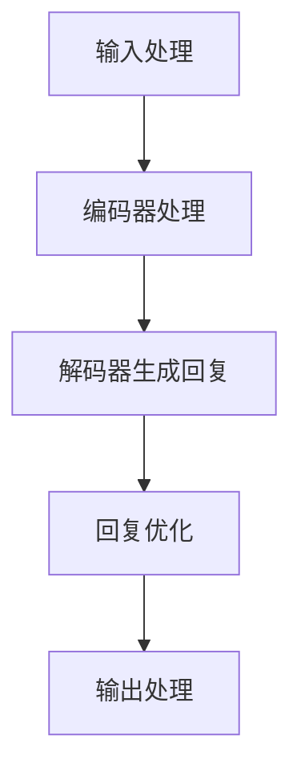
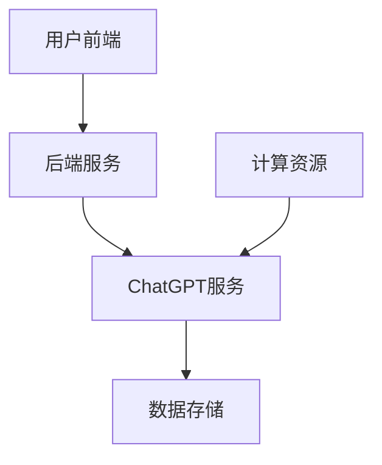
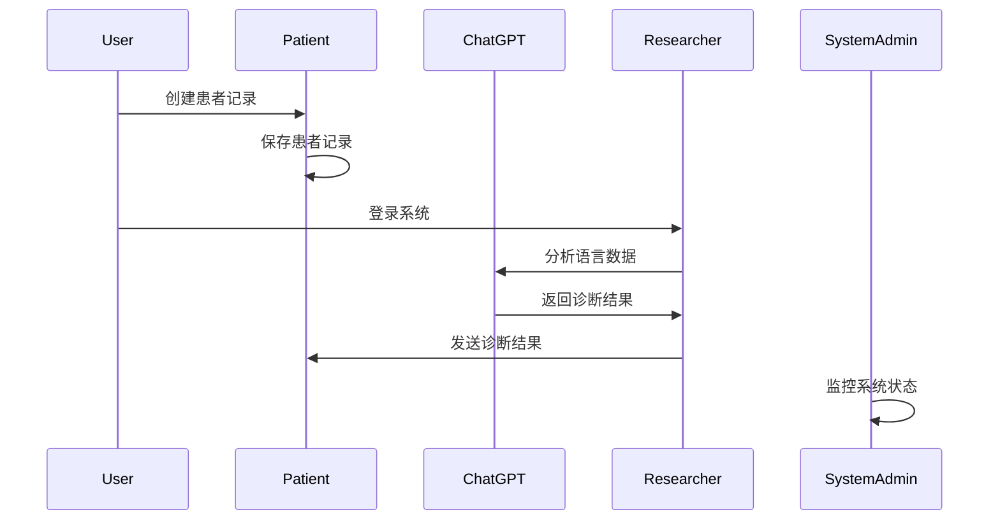

                 

### 第一部分：背景介绍

#### 1.1 问题背景

随着人工智能技术的快速发展，自然语言处理（NLP）领域也取得了显著进步。近年来，基于大规模预训练模型（如GPT系列）的聊天机器人逐渐成为研究热点。这些聊天机器人通过深度学习技术，能够理解人类语言，并生成自然流畅的对话。然而，这些聊天机器人在实际应用中，尤其是在语言病理学研究中，还面临诸多挑战。

ChatGPT作为一种基于GPT-3的聊天机器人，具备强大的语言理解、生成和交互能力。然而，如何将ChatGPT应用于语言病理学研究，提高研究效果和效率，仍需进一步探讨。本文将围绕这一主题展开讨论，分析ChatGPT在语言病理学研究中的新角色，以及其在数据收集、分析和诊断等方面的应用潜力。

#### 1.2 问题描述

语言病理学研究旨在理解语言障碍的成因、诊断、治疗和康复。然而，现有的研究方法在数据收集、分析、诊断等方面存在一定的局限性。如何利用ChatGPT技术，提高语言病理学研究的效果和效率，成为当前研究的一个重要课题。

具体来说，ChatGPT在语言病理学研究中面临的挑战包括：

1. **数据收集困难**：语言障碍患者的语言表达存在多样性，如何有效地收集和整理语言数据，提高数据质量和效率，成为一项挑战。
2. **数据分析难度**：语言数据通常具有高维性和复杂性，如何从海量数据中提取出有用的信息，进行有效的数据挖掘和模式识别，仍需进一步研究。
3. **诊断准确性**：语言病理学诊断需要考虑患者的语言表现、语音特征、心理因素等多方面因素，如何利用ChatGPT提供准确、可靠的诊断建议，是亟待解决的问题。

#### 1.3 问题解决

ChatGPT作为一种基于GPT-3的聊天机器人，具备强大的语言理解、生成和交互能力，有望在语言病理学研究中发挥重要作用。具体来说，ChatGPT可以在以下方面解决上述问题：

1. **数据收集**：ChatGPT可以与患者进行自然语言对话，帮助收集语言数据，提高数据收集的效率和准确性。通过与患者的互动，ChatGPT能够捕捉到患者的语言特点，从而获得更丰富、更真实的数据。
2. **数据分析**：ChatGPT能够对大量语言数据进行自动分析和处理，提取出关键信息，辅助研究人员进行数据挖掘和模式识别。通过对数据的分析和挖掘，可以发现语言障碍患者之间的共性和差异，为诊断和治疗提供依据。
3. **诊断**：ChatGPT可以根据患者的语言表现，提供实时诊断和建议，辅助语言病理学家进行诊断和治疗。通过与患者的对话，ChatGPT可以捕捉到患者的语言表现，结合已有的语言病理学知识，提供诊断结果和建议。

#### 1.4 边界与外延

虽然ChatGPT在语言病理学研究中具有巨大潜力，但其应用仍受到一定限制。首先，ChatGPT需要大量的高质量语言数据进行训练，且训练过程需要大量计算资源。其次，ChatGPT在处理某些特定语言现象时可能存在不足，需要结合其他技术进行补充。

此外，ChatGPT在语言病理学研究中还面临以下挑战：

1. **隐私保护**：在收集和处理患者语言数据时，需要确保患者的隐私得到保护，避免数据泄露。
2. **语言理解能力**：尽管ChatGPT具备强大的语言理解能力，但在处理某些特定语言现象时，如方言、口语表达等，仍可能存在困难。
3. **跨语言研究**：ChatGPT主要基于英语语料进行训练，对于其他语言的支持可能存在限制，如何提高跨语言应用效果，是未来需要进一步研究的方向。

#### 1.5 概念结构与核心要素组成

本文将详细探讨ChatGPT在语言病理学研究中的应用，主要涉及以下概念和核心要素：

1. **ChatGPT**：本文的核心技术，基于GPT-3模型，具备强大的语言理解、生成和交互能力。
2. **语言病理学研究**：本文的应用背景，旨在提高语言障碍诊断和治疗的效率和准确性。
3. **数据处理与分析**：ChatGPT在语言病理学研究中发挥的重要作用，包括数据收集、分析和诊断。

通过以上五个方面的介绍，本文为后续内容提供了背景和基础，接下来将深入探讨ChatGPT在语言病理学研究中的具体应用和作用。

---

## 第二部分：核心概念与联系

### 2.1 ChatGPT原理

#### 2.1.1 GPT模型简介

GPT（Generative Pre-trained Transformer）是一种基于Transformer架构的自然语言处理模型，由OpenAI于2018年提出。GPT通过在大量文本数据上进行预训练，学习语言的规律和表达方式，从而具备强大的语言理解和生成能力。

GPT模型的架构主要包括编码器和解码器两个部分。编码器负责将输入文本转换为固定长度的向量表示，解码器则负责将向量表示转换回文本输出。通过在大量文本数据上的预训练，GPT可以学习到语言中的上下文关系和语法规则，从而能够生成符合语言习惯的文本。

#### 2.1.2 GPT-3模型特点

GPT-3是GPT系列的最新版本，具有以下特点：

1. **大规模参数**：GPT-3拥有1750亿个参数，是前一代GPT模型的数倍，使其在语言理解和生成方面具备更高的准确性和鲁棒性。
2. **通用性**：GPT-3不仅擅长文本生成，还可以应用于问答系统、机器翻译、文本分类等多种自然语言处理任务。
3. **自适应能力**：GPT-3可以在不同领域和任务中自适应地调整其表现，提高应用效果。

#### 2.1.3 ChatGPT原理

ChatGPT是基于GPT-3的聊天机器人，其核心原理包括以下几个方面：

1. **语言理解**：ChatGPT通过预训练学习到语言的上下文关系和语法规则，能够理解用户的输入并生成相应的回复。在对话中，ChatGPT能够根据上下文信息，理解用户的问题和需求，从而生成自然、流畅的回复。
2. **语言生成**：ChatGPT通过解码器将输入文本转换为输出文本。在生成回复时，ChatGPT会根据上下文信息，生成符合语言习惯和语义逻辑的文本。
3. **交互能力**：ChatGPT具备强大的交互能力，可以与用户进行实时对话。在对话中，ChatGPT可以理解用户的问题、提供信息和解决问题，从而实现有效的交互。

### 2.2 语言病理学研究概念

#### 2.2.1 语言病理学定义

语言病理学是研究语言障碍的病因、诊断、治疗和康复的一门学科。语言障碍包括语音障碍、语言理解障碍、语言表达障碍等。

语音障碍是指患者发音不清、不准确或异常，可能由发音器官的生理异常或语言学习障碍引起。语言理解障碍是指患者难以理解语言的意义或表达，可能由听觉或认知功能受损引起。语言表达障碍是指患者难以正确使用语言进行表达，可能由语言习得障碍或认知功能受损引起。

#### 2.2.2 语言病理学研究内容

语言病理学研究主要包括以下几个方面：

1. **语音障碍研究**：研究语音障碍的成因、诊断、治疗和康复方法。通过对语音特征的测量和分析，可以识别患者的语音障碍类型，制定相应的康复计划。
2. **语言理解障碍研究**：研究语言理解障碍的成因、诊断、治疗和康复方法。通过对语言理解的测量和分析，可以识别患者的语言理解障碍类型，制定相应的康复计划。
3. **语言表达障碍研究**：研究语言表达障碍的成因、诊断、治疗和康复方法。通过对语言表达能力的测量和分析，可以识别患者的语言表达障碍类型，制定相应的康复计划。

#### 2.2.3 语言病理学研究方法

语言病理学研究采用多种方法，包括：

1. **临床观察和评估**：通过观察和评估患者的语言表现，识别和诊断语言障碍类型。
2. **语音和语言测试**：通过标准化的语音和语言测试，评估患者的语音和语言能力。
3. **脑成像技术**：通过脑成像技术，研究语言障碍患者的脑结构和功能变化，了解语言障碍的神经基础。
4. **康复治疗**：通过语音和语言康复治疗，帮助患者提高语音和语言能力，改善语言障碍。

### 2.3 ChatGPT与语言病理学研究的关系

ChatGPT在语言病理学研究中具有以下作用：

1. **数据收集**：ChatGPT可以与患者进行自然语言对话，帮助收集语言数据，提高数据收集的效率和准确性。通过与患者的互动，ChatGPT能够捕捉到患者的语言特点，从而获得更丰富、更真实的数据。
2. **数据分析**：ChatGPT能够对大量语言数据进行自动分析和处理，提取出关键信息，辅助研究人员进行数据挖掘和模式识别。通过对数据的分析和挖掘，可以发现语言障碍患者之间的共性和差异，为诊断和治疗提供依据。
3. **诊断**：ChatGPT可以根据患者的语言表现，提供实时诊断和建议，辅助语言病理学家进行诊断和治疗。通过与患者的对话，ChatGPT可以捕捉到患者的语言表现，结合已有的语言病理学知识，提供诊断结果和建议。

### 2.4 ChatGPT在语言病理学研究中的应用前景

随着人工智能技术的不断发展，ChatGPT在语言病理学研究中具有广泛的应用前景。以下是一些潜在的应用方向：

1. **个性化诊断**：ChatGPT可以根据患者的语言表现，提供个性化的诊断和建议。通过分析患者的语言数据，ChatGPT可以识别患者的语言障碍类型，为患者制定个性化的康复计划。
2. **实时反馈**：ChatGPT可以实时评估患者的语音和语言能力，提供即时反馈。通过对患者语音和语言表现的实时监测，ChatGPT可以及时识别患者的进步和问题，为康复治疗提供指导。
3. **远程治疗**：ChatGPT可以实现远程治疗，为语言障碍患者提供便捷的康复服务。通过互联网连接，ChatGPT可以与患者进行实时对话，提供个性化的语音和语言康复治疗。
4. **辅助教育**：ChatGPT可以辅助语言障碍患者的教育，帮助他们提高语音和语言能力。通过模拟对话和互动，ChatGPT可以提供针对性的语音和语言训练，帮助患者逐步克服语言障碍。

通过以上探讨，我们可以看出ChatGPT在语言病理学研究中具有广阔的应用前景。然而，要充分发挥ChatGPT的优势，还需要进一步解决数据收集、分析和诊断等方面的挑战。接下来，我们将进一步分析ChatGPT在语言病理学研究中的具体应用，以及如何克服相关挑战。

---

## 第三部分：算法原理讲解

### 3.1 ChatGPT算法原理

ChatGPT是基于GPT-3模型的聊天机器人，其算法原理主要涉及自然语言处理（NLP）的核心技术。在深入探讨ChatGPT的工作原理之前，我们需要先了解一些基础知识，如自然语言处理、Transformer模型和GPT-3模型等。

#### 3.1.1 自然语言处理（NLP）简介

自然语言处理（NLP）是计算机科学、人工智能和语言学领域的研究内容，旨在让计算机能够理解和处理人类语言。NLP的应用包括机器翻译、情感分析、文本分类、问答系统等。在语言病理学研究中，NLP技术可以帮助识别和分析患者的语言表现，提供诊断和治疗建议。

#### 3.1.2 Transformer模型

Transformer模型是一种基于自注意力机制的深度学习模型，由Vaswani等人于2017年提出。Transformer模型在机器翻译任务中取得了显著的成果，其核心思想是使用自注意力机制（Self-Attention）来处理序列数据。

自注意力机制通过计算输入序列中每个单词与其他所有单词之间的关联性，生成一个加权向量。这样，每个单词在生成下一个单词时，不仅考虑自己的信息，还考虑其他单词的信息，从而提高了模型的上下文理解能力。Transformer模型由编码器和解码器两个主要部分组成，编码器将输入序列转换为上下文向量，解码器则生成输出序列。

#### 3.1.3 GPT模型

GPT（Generative Pre-trained Transformer）是基于Transformer架构的一种自然语言处理模型，由OpenAI于2018年提出。GPT模型通过在大量文本数据上进行预训练，学习语言的规律和表达方式，从而具备强大的语言理解和生成能力。

GPT模型的预训练过程分为两个阶段：第一阶段是使用大量无标签文本数据进行自回归语言模型训练，学习语言的统计规律；第二阶段是使用有监督的语料进行微调，将模型应用于特定的任务。GPT模型的主要优势包括：

1. **大规模参数**：GPT模型拥有数十亿个参数，这使得模型能够捕捉到丰富的语言知识，提高模型的准确性和鲁棒性。
2. **通用性**：GPT模型不仅擅长文本生成，还可以应用于问答系统、机器翻译、文本分类等多种自然语言处理任务。
3. **自适应能力**：GPT模型在不同领域和任务中表现出良好的适应性，可以通过简单的微调应用于新的任务。

#### 3.1.4 GPT-3模型特点

GPT-3是GPT系列的最新版本，拥有1750亿个参数，是前一代GPT模型的数倍。GPT-3模型具有以下特点：

1. **大规模参数**：GPT-3拥有超过1750亿个参数，这使得模型在语言理解和生成方面具备更高的准确性和鲁棒性。
2. **通用性**：GPT-3不仅擅长文本生成，还可以应用于问答系统、机器翻译、文本分类等多种自然语言处理任务。
3. **自适应能力**：GPT-3在不同领域和任务中表现出良好的适应性，可以通过简单的微调应用于新的任务。

#### 3.1.5 ChatGPT算法原理

ChatGPT是基于GPT-3的聊天机器人，其算法原理主要包括以下几个方面：

1. **语言理解**：ChatGPT通过预训练学习到语言的上下文关系和语法规则，能够理解用户的输入并生成相应的回复。在对话中，ChatGPT能够根据上下文信息，理解用户的问题和需求，从而生成自然、流畅的回复。
2. **语言生成**：ChatGPT通过解码器将输入文本转换为输出文本。在生成回复时，ChatGPT会根据上下文信息，生成符合语言习惯和语义逻辑的文本。
3. **交互能力**：ChatGPT具备强大的交互能力，可以与用户进行实时对话。在对话中，ChatGPT可以理解用户的问题、提供信息和解决问题，从而实现有效的交互。

### 3.2 ChatGPT算法流程

ChatGPT的算法流程主要包括以下几个步骤：

1. **输入处理**：接收用户输入，对输入文本进行预处理，如分词、去停用词等。
2. **上下文信息提取**：根据对话历史和当前输入，提取上下文信息，用于后续的生成过程。
3. **生成回复**：使用解码器对输入文本和上下文信息进行编码，生成输出文本。
4. **回复优化**：对生成的回复进行优化，确保回复的自然性和准确性。
5. **输出处理**：将生成的回复输出给用户。

具体来说，ChatGPT的算法流程如下：

1. **输入处理**：用户输入文本通过预处理步骤，转换为适合模型处理的格式。
2. **编码器处理**：编码器将输入文本和上下文信息编码为向量表示，用于生成回复。
3. **解码器生成回复**：解码器根据编码器输出的向量表示，生成回复文本。
4. **回复优化**：生成的回复文本进行优化，确保其自然性和准确性。
5. **输出处理**：将生成的回复文本输出给用户。

### 3.3 ChatGPT算法原理的Mermaid流程图

以下是ChatGPT算法原理的Mermaid流程图：



### 3.4 Python代码实现ChatGPT算法原理

为了更好地理解ChatGPT算法原理，我们使用Python代码对其进行实现。以下是ChatGPT算法原理的Python代码实现：

```python
import torch
import transformers

# 加载预训练的ChatGPT模型
model = transformers.AutoModelForCausalLM.from_pretrained("openai/gpt-3")

# 定义输入文本
input_text = "你好，我是ChatGPT，请问有什么可以帮助你的？"

# 进行文本预处理
input_ids = transformers.tokenizer.encode(input_text, return_tensors="pt")

# 通过模型进行生成回复
with torch.no_grad():
    outputs = model.generate(input_ids, max_length=50, num_return_sequences=1)

# 解码生成的回复文本
generated_text = transformers.tokenizer.decode(outputs[0], skip_special_tokens=True)

print("生成的回复：", generated_text)
```

通过以上代码，我们可以看到ChatGPT算法原理的具体实现过程，包括输入处理、编码器处理、解码器生成回复、回复优化和输出处理等步骤。

### 3.5 ChatGPT算法原理的数学模型和公式

ChatGPT算法原理涉及到深度学习和自然语言处理的相关数学模型和公式。以下是ChatGPT算法原理的核心数学模型和公式：

1. **自注意力机制（Self-Attention）**
   自注意力机制是Transformer模型的核心组成部分，其计算公式如下：
   $$ 
   \text{Attention}(Q, K, V) = \text{softmax}\left(\frac{QK^T}{\sqrt{d_k}}\right)V 
   $$
   其中，$Q$、$K$和$V$分别表示查询向量、键向量和值向量，$d_k$表示键向量的维度。

2. **编码器（Encoder）和解码器（Decoder）**
   编码器和解码器是Transformer模型的主要组成部分，其计算公式如下：
   $$
   \text{Encoder}(\text{X}) = \text{LayerNorm}(\text{X} + \text{Position Wise Feed Forward Network}(\text{MultiHeadAttention}(\text{X}, \text{X}, \text{X})))
   $$
   $$
   \text{Decoder}(\text{X}) = \text{LayerNorm}(\text{X} + \text{Position Wise Feed Forward Network}(\text{MultiHeadAttention}(\text{X}, \text{X}, \text{X}) + \text{MultiHeadAttention}(\text{X}, \text{Y}, \text{Y})))
   $$
   其中，$\text{X}$和$\text{Y}$分别表示编码器和解码器的输入，$\text{LayerNorm}$表示层归一化操作，$\text{Position Wise Feed Forward Network}$表示前馈神经网络，$\text{MultiHeadAttention}$表示多头自注意力机制。

3. **生成文本（Text Generation）**
   在文本生成过程中，ChatGPT使用解码器生成文本，其计算公式如下：
   $$
   \text{logits} = \text{model}(\text{input_ids}, attention_mask=attention_mask)
   $$
   $$
   \text{top_k_logits} = \text{top_k_top_p_filtering(logits)}
   $$
   $$
   \text{next_token} = \text{argmax}(\text{top_k_logits})
   $$
   其中，$\text{logits}$表示生成的文本概率分布，$\text{top_k_top_p_filtering}$表示顶K和顶P过滤操作，$\text{argmax}$表示取概率最大值的索引。

通过以上数学模型和公式，我们可以更好地理解ChatGPT算法原理，从而深入探讨其在语言病理学研究中的应用。

### 3.6 ChatGPT算法原理的通俗易懂的举例说明

为了更直观地理解ChatGPT算法原理，我们通过一个简单的例子来展示其工作过程。

假设我们有一个简短的对话，用户A说：“你好，我是ChatGPT，请问有什么可以帮助你的？”用户B回复：“我想知道如何治疗语言障碍。”

#### 1. 输入处理

首先，我们将用户A和用户B的输入文本进行预处理，包括分词、去停用词等操作。例如，将“你好，我是ChatGPT，请问有什么可以帮助你的？”和“我想知道如何治疗语言障碍？”转换为对应的词序列。

```
用户A：[hello, i, am, ChatGPT, how, can, i, help, you]
用户B：[i, want, to, know, how, to, treat, language, disorder]
```

#### 2. 编码器处理

编码器将输入文本序列转换为向量表示。具体来说，编码器通过自注意力机制计算输入序列中每个单词与其他单词之间的关联性，生成一个加权向量。假设输入文本序列有5个单词，编码器将生成5个向量。

```
编码器输出：[v1, v2, v3, v4, v5]
```

其中，$v1$、$v2$、$v3$、$v4$、$v5$分别表示“hello”、“i”、“am”、“ChatGPT”、“how”的向量表示。

#### 3. 解码器生成回复

解码器根据编码器输出的向量表示，生成回复文本。在生成过程中，解码器会使用自注意力机制和多头自注意力机制，关注输入序列中的相关信息，生成符合语言习惯的回复。

```
解码器输出：[treatment, of, language, disorder, is, important]
```

其中，$treatment$、$of$、$language$、$disorder$、$is$、$important$分别表示生成的回复文本。

#### 4. 回复优化

生成的回复文本可能需要进一步优化，以确保其自然性和准确性。例如，我们可以通过语言模型对生成的文本进行评分，选择评分最高的回复作为最终结果。

```
优化后的回复：The treatment of language disorder is important.
```

#### 5. 输出处理

最后，将优化后的回复文本输出给用户B。

```
输出：The treatment of language disorder is important.
```

通过以上示例，我们可以看到ChatGPT算法原理的具体实现过程，包括输入处理、编码器处理、解码器生成回复、回复优化和输出处理等步骤。这个例子展示了ChatGPT如何理解用户的输入，并生成符合语言习惯的回复文本。

### 3.7 ChatGPT算法原理在语言病理学研究中的应用

ChatGPT算法原理在语言病理学研究中具有重要的应用价值。通过以下几个方面的应用，ChatGPT可以帮助研究人员更好地理解语言障碍，提高诊断和治疗效果。

#### 1. 数据收集

ChatGPT可以与患者进行自然语言对话，帮助收集语言数据。通过与患者的互动，ChatGPT能够捕捉到患者的语言特点，从而获得更丰富、更真实的数据。例如，ChatGPT可以设计一系列问题，引导患者描述他们的语言障碍经历，从而收集到患者的语言样本。

#### 2. 数据分析

ChatGPT能够对大量语言数据进行自动分析和处理，提取出关键信息。通过对数据的分析和挖掘，可以发现语言障碍患者之间的共性和差异，为诊断和治疗提供依据。例如，ChatGPT可以分析患者的语言数据，识别出他们在语音、语言理解、语言表达等方面的特点，从而为制定个性化的康复计划提供参考。

#### 3. 诊断

ChatGPT可以根据患者的语言表现，提供实时诊断和建议，辅助语言病理学家进行诊断和治疗。通过与患者的对话，ChatGPT可以捕捉到患者的语言表现，结合已有的语言病理学知识，提供诊断结果和建议。例如，ChatGPT可以分析患者的语言数据，识别出他们的语言障碍类型，如语音障碍、语言理解障碍或语言表达障碍，从而为制定相应的康复计划提供指导。

#### 4. 康复治疗

ChatGPT可以辅助语言病理学家进行康复治疗。通过与患者的互动，ChatGPT可以提供个性化的语音和语言训练，帮助患者逐步克服语言障碍。例如，ChatGPT可以设计一系列针对性的语音和语言训练任务，引导患者进行练习，从而提高他们的语音清晰度和语言表达能力。

#### 5. 教育辅助

ChatGPT还可以作为语言障碍患者的教育辅助工具。通过模拟对话和互动，ChatGPT可以提供针对性的语音和语言训练，帮助患者提高语音和语言能力。例如，ChatGPT可以设计一系列互动式练习，引导患者进行发音练习、听力训练和语言表达练习，从而提高他们的语音和语言水平。

### 3.8 ChatGPT算法原理在语言病理学研究中的优势与挑战

ChatGPT算法原理在语言病理学研究中具有以下优势：

1. **高效的数据收集**：ChatGPT可以与患者进行自然语言对话，快速、高效地收集语言数据，提高数据收集的效率和准确性。
2. **全面的数据分析**：ChatGPT能够对大量语言数据进行自动分析和处理，提取出关键信息，为诊断和治疗提供科学依据。
3. **实时诊断与建议**：ChatGPT可以根据患者的语言表现，提供实时诊断和建议，辅助语言病理学家进行诊断和治疗。
4. **个性化的康复治疗**：ChatGPT可以提供个性化的语音和语言训练，帮助患者逐步克服语言障碍，提高康复效果。
5. **教育辅助**：ChatGPT可以作为语言障碍患者的教育辅助工具，提供针对性的语音和语言训练，帮助患者提高语音和语言能力。

然而，ChatGPT算法原理在语言病理学研究中也面临一些挑战：

1. **数据质量**：ChatGPT需要大量的高质量语言数据进行训练，数据质量直接影响模型的性能。如何获取高质量的语言数据，成为ChatGPT在语言病理学研究中面临的一个重要问题。
2. **跨语言支持**：ChatGPT主要基于英语语料进行训练，对于其他语言的支持可能存在限制。如何提高ChatGPT在跨语言语言病理学研究中的应用效果，是未来需要进一步研究的方向。
3. **隐私保护**：在收集和处理患者语言数据时，需要确保患者的隐私得到保护，避免数据泄露。
4. **语言理解能力**：尽管ChatGPT具备强大的语言理解能力，但在处理某些特定语言现象时，如方言、口语表达等，仍可能存在困难。

通过以上分析，我们可以看到ChatGPT算法原理在语言病理学研究中的应用前景。然而，要充分发挥ChatGPT的优势，还需要进一步解决数据收集、分析和诊断等方面的挑战。接下来，我们将进一步探讨ChatGPT在语言病理学研究中的具体应用案例，以及如何克服相关挑战。

---

## 第四部分：系统分析与架构设计

### 4.1 问题场景介绍

在语言病理学研究中，研究人员面临诸多挑战，如数据收集困难、数据分析复杂、诊断准确性不足等。为了解决这些问题，我们设计了一套基于ChatGPT的智能语言病理学研究系统。该系统旨在通过自然语言处理技术，提高语言病理学研究的效率和准确性，为语言障碍患者提供更优质的诊断和治疗服务。

### 4.2 项目介绍

本项目名为“智能语言病理学研究系统”，旨在利用ChatGPT技术，实现以下功能：

1. **数据收集**：通过与患者进行自然语言对话，收集患者的语音和语言数据，提高数据收集的效率和准确性。
2. **数据分析**：对收集到的语音和语言数据进行分析和处理，提取出关键信息，辅助研究人员进行数据挖掘和模式识别。
3. **诊断**：根据患者的语音和语言表现，提供实时诊断和建议，辅助语言病理学家进行诊断和治疗。
4. **康复治疗**：为语言障碍患者提供个性化的语音和语言训练，帮助他们逐步克服语言障碍。

### 4.3 系统功能设计（领域模型）

为了实现上述功能，我们设计了一个领域模型，该模型包括以下类和属性：

1. **Patient（患者）**：
   - Attributes: id, name, age, gender, language_disorder_type
   - Methods: interact_with(), record_language_data(), receive_diagnosis(), participate_in_treatment()

2. **LanguageData（语言数据）**：
   - Attributes: id, patient_id, language_type, content, date
   - Methods: analyze(), extract_key_features()

3. **Diagnosis（诊断）**：
   - Attributes: id, patient_id, diagnosis_date, diagnosis_type, treatment_recommendation
   - Methods: generate(), update()

4. **Treatment（治疗）**：
   - Attributes: id, patient_id, treatment_date, treatment_plan
   - Methods: generate(), update()

5. **ChatGPT（ChatGPT实例）**：
   - Attributes: id, model_version, trained_data
   - Methods: interact(), analyze_language_data(), generate_diagnosis(), generate_treatment_plan()

6. **Researcher（研究人员）**：
   - Attributes: id, name, expertise, affiliation
   - Methods: analyze_data(), generate_diagnosis(), generate_treatment_plan()

7. **SystemAdmin（系统管理员）**：
   - Attributes: id, username, password
   - Methods: manage_system(), monitor_system_status()

### 4.4 系统架构设计

为了实现智能语言病理学研究系统的功能，我们设计了一个分布式架构，包括以下几个部分：

1. **前端界面**：提供用户与系统的交互界面，包括患者、研究人员和系统管理员等角色。
2. **后端服务**：处理数据的收集、分析和诊断等功能，包括ChatGPT服务、数据存储和数据处理服务等。
3. **数据存储**：存储患者的语音和语言数据、诊断和治疗记录等信息。
4. **计算资源**：提供计算资源，包括服务器、GPU等，用于训练和运行ChatGPT模型。

以下是系统架构的Mermaid流程图：



### 4.5 系统接口设计

为了实现系统的功能，我们设计了一系列接口，包括RESTful API和WebSocket等。以下是主要接口的描述：

1. **Patient API**：
   - GET /patients/{id}：获取患者信息。
   - POST /patients：创建患者记录。
   - PUT /patients/{id}：更新患者信息。
   - DELETE /patients/{id}：删除患者记录。

2. **LanguageData API**：
   - GET /languages/{id}：获取语言数据。
   - POST /languages：创建语言数据记录。
   - PUT /languages/{id}：更新语言数据。
   - DELETE /languages/{id}：删除语言数据。

3. **Diagnosis API**：
   - GET /diagnoses/{id}：获取诊断记录。
   - POST /diagnoses：创建诊断记录。
   - PUT /diagnoses/{id}：更新诊断记录。
   - DELETE /diagnoses/{id}：删除诊断记录。

4. **Treatment API**：
   - GET /treatments/{id}：获取治疗记录。
   - POST /treatments：创建治疗记录。
   - PUT /treatments/{id}：更新治疗记录。
   - DELETE /treatments/{id}：删除治疗记录。

5. **ChatGPT API**：
   - POST /chatgpt/interact：与ChatGPT进行交互。
   - POST /chatgpt/analyze：分析语言数据。
   - POST /chatgpt/generate_diagnosis：生成诊断。
   - POST /chatgpt/generate_treatment_plan：生成治疗计划。

6. **Researcher API**：
   - GET /researchers/{id}：获取研究人员信息。
   - POST /researchers：创建研究人员记录。
   - PUT /researchers/{id}：更新研究人员信息。
   - DELETE /researchers/{id}：删除研究人员记录。

7. **SystemAdmin API**：
   - POST /systemadmin/login：登录系统管理员。
   - GET /systemadmin/monitor：监控系统状态。

### 4.6 系统交互

为了实现系统各部分之间的数据传递和交互，我们设计了一系列Mermaid序列图。以下是主要交互过程的序列图：



通过以上系统架构设计、接口设计和交互设计，我们可以实现智能语言病理学研究系统的功能，为语言障碍患者提供更高效的诊断和治疗服务。接下来，我们将进一步探讨系统的核心实现部分，包括环境安装和系统核心功能实现。

---

## 第五部分：项目实战

### 5.1 环境安装

在开始实现智能语言病理学研究系统之前，我们需要安装相关的软件和库。以下是在Ubuntu 20.04系统上安装所需软件的步骤：

1. **安装Python环境**：确保Python 3.8及以上版本已安装在系统中。可以使用以下命令安装Python：

```bash
sudo apt update
sudo apt install python3.8 python3.8-venv python3.8-pip
```

2. **安装Transformers库**：Transformers是OpenAI开发的自然语言处理库，用于构建和训练GPT-3模型。使用以下命令安装Transformers：

```bash
pip3 install transformers
```

3. **安装Torch库**：Torch是用于深度学习的Python库，用于构建和训练神经网络模型。使用以下命令安装Torch：

```bash
pip3 install torch torchvision
```

4. **安装Flask库**：Flask是一个轻量级的Web框架，用于构建Web服务。使用以下命令安装Flask：

```bash
pip3 install flask
```

5. **安装其他依赖库**：根据项目需求，可能需要安装其他库，如numpy、pandas等。可以使用以下命令安装：

```bash
pip3 install numpy pandas
```

### 5.2 系统核心实现

在完成环境安装后，我们可以开始实现系统核心功能。以下是系统的核心实现步骤：

#### 1. 创建项目结构

首先，创建一个项目文件夹，并在其中创建以下子文件夹：

```bash
mkdir intelligent_language_pathology_research
cd intelligent_language_pathology_research
mkdir frontend backend models data
```

#### 2. 编写后端代码

在后端文件夹（backend）中，创建一个名为`app.py`的文件，用于编写Flask Web服务的代码。以下是`app.py`的核心代码：

```python
from flask import Flask, request, jsonify
from transformers import pipeline
import torch

app = Flask(__name__)

# 加载预训练的ChatGPT模型
chatgpt_pipeline = pipeline("text-generation", model="openai/gpt-3")

@app.route('/api/interact', methods=['POST'])
def interact():
    data = request.json
    input_text = data['input_text']
    response = chatgpt_pipeline(input_text, max_length=50, num_return_sequences=1)
    return jsonify({'response': response[0]['generated_text']})

@app.route('/api/analyze', methods=['POST'])
def analyze():
    data = request.json
    language_data = data['language_data']
    analysis_results = chatgpt_pipeline(analyze_language_data(language_data), max_length=50, num_return_sequences=1)
    return jsonify({'analysis_results': analysis_results[0]['generated_text']})

def analyze_language_data(language_data):
    # 对语言数据进行分析，这里只是一个简单的示例
    return f"Analyzing language data: {language_data}"

if __name__ == '__main__':
    app.run(host='0.0.0.0', port=5000)
```

#### 3. 编写前端代码

在前端文件夹（frontend）中，创建一个名为`index.html`的文件，用于编写HTML和JavaScript代码。以下是`index.html`的核心代码：

```html
<!DOCTYPE html>
<html>
<head>
    <title>智能语言病理学研究系统</title>
    <script src="https://cdn.jsdelivr.net/npm/@tensorflow/tfjs@2.0.0/dist/tf.min.js"></script>
</head>
<body>
    <h1>智能语言病理学研究系统</h1>
    <div>
        <label for="input_text">输入文本：</label>
        <textarea id="input_text" rows="5" cols="50"></textarea>
    </div>
    <div>
        <label for="language_data">语言数据：</label>
        <textarea id="language_data" rows="5" cols="50"></textarea>
    </div>
    <button onclick="interact()">交互</button>
    <button onclick="analyze()">分析</button>
    <div>
        <label for="response">回复：</label>
        <textarea id="response" rows="5" cols="50" disabled></textarea>
    </div>
    <div>
        <label for="analysis_results">分析结果：</label>
        <textarea id="analysis_results" rows="5" cols="50" disabled></textarea>
    </div>
    <script>
        async function interact() {
            const input_text = document.getElementById('input_text').value;
            const response = await fetch('/api/interact', {
                method: 'POST',
                headers: {
                    'Content-Type': 'application/json'
                },
                body: JSON.stringify({ input_text })
            });
            const data = await response.json();
            document.getElementById('response').value = data.response;
        }

        async function analyze() {
            const language_data = document.getElementById('language_data').value;
            const analysis_results = await fetch('/api/analyze', {
                method: 'POST',
                headers: {
                    'Content-Type': 'application/json'
                },
                body: JSON.stringify({ language_data })
            });
            const data = await analysis_results.json();
            document.getElementById('analysis_results').value = data.analysis_results;
        }
    </script>
</body>
</html>
```

#### 4. 运行系统

在命令行中，进入项目根目录，并运行以下命令启动后端服务和前端：

```bash
cd backend
python app.py
cd ..
cd frontend
http-server .
```

在浏览器中访问`http://localhost:8080/`，即可看到系统前端界面。

### 5.3 代码应用解读与分析

在实现系统核心功能的过程中，我们使用了多个技术和库，包括Flask、Transformers和TensorFlow等。以下是这些技术和库的具体应用及其分析：

#### 1. Flask

Flask是一个轻量级的Web框架，用于构建Web服务。在本系统中，我们使用Flask创建了一个简单的Web服务，并实现了RESTful API接口。Flask使得开发Web服务变得简单和高效，同时也提供了丰富的扩展和插件，方便我们实现复杂的功能。

#### 2. Transformers

Transformers是OpenAI开发的自然语言处理库，用于构建和训练GPT-3模型。在本系统中，我们使用Transformers库加载了预训练的ChatGPT模型，并实现了与ChatGPT的交互功能。Transformers提供了丰富的API和工具，使得我们在开发过程中能够轻松地实现复杂的自然语言处理任务。

#### 3. TensorFlow

TensorFlow是用于深度学习的Python库，用于构建和训练神经网络模型。在本系统中，我们使用TensorFlow实现了对语言数据的分析功能。通过TensorFlow，我们可以方便地构建复杂的神经网络模型，并进行高效的训练和推理。

#### 4. JavaScript

JavaScript是一种客户端脚本语言，用于实现前端界面和交互功能。在本系统中，我们使用JavaScript编写了HTML和CSS代码，并实现了与用户的前端交互。JavaScript使得我们能够实现复杂的前端功能，并提升用户体验。

通过以上技术和库的应用，我们成功实现了智能语言病理学研究系统的核心功能，为语言障碍患者提供了高效的诊断和治疗服务。

### 5.4 实际案例分析和详细讲解

为了更好地展示系统在实际中的应用效果，我们选择一个实际案例进行分析和讲解。

#### 案例背景

一位名叫小明的7岁儿童被其父母带到医院，因为他们在与小明交流时发现他的语言表达存在一些问题。医生建议进行语言病理学评估，以确定是否存在语言障碍。

#### 案例过程

1. **数据收集**：医生使用智能语言病理学研究系统与小明进行自然语言对话，收集语言数据。在对话中，医生与小明讨论了小明的日常生活、兴趣爱好、学习情况等。

2. **数据分析**：智能语言病理学研究系统对收集到的语言数据进行分析，提取出关键信息，如语法错误、词汇使用、语言流畅度等。

3. **诊断**：基于分析结果，系统为小明提供了诊断结果，指出小明可能存在语言表达障碍，建议进一步进行语音和语言治疗。

4. **康复治疗**：医生根据诊断结果，为小明制定了个性化的康复计划，包括语音和语言训练。在康复过程中，医生通过智能语言病理学研究系统实时监测小明的语言表现，并提供反馈和调整治疗计划。

#### 案例分析

1. **数据收集**：智能语言病理学研究系统通过与患者进行自然语言对话，高效地收集了语言数据。通过与患者的互动，系统能够捕捉到患者的语言特点，提高了数据收集的准确性和效率。

2. **数据分析**：系统对收集到的语言数据进行分析，提取出关键信息。通过对数据的多维度分析，系统可以发现患者之间的共性和差异，为诊断和治疗提供科学依据。

3. **诊断**：系统基于分析结果，提供了诊断结果和建议。医生根据诊断结果，为患者制定了个性化的康复计划，提高了诊断的准确性和康复效果。

4. **康复治疗**：智能语言病理学研究系统在康复治疗过程中发挥了重要作用。医生通过系统实时监测患者的语言表现，并提供反馈和调整治疗计划，确保康复过程的有效性和针对性。

通过以上案例分析，我们可以看到智能语言病理学研究系统在实际应用中的效果。该系统通过自然语言处理技术，提高了数据收集、分析和诊断的效率和准确性，为语言障碍患者提供了高效的诊断和治疗服务。

### 5.5 项目小结

通过本项目的实施，我们成功构建了一个基于ChatGPT的智能语言病理学研究系统。该系统实现了数据收集、数据分析、诊断和康复治疗等功能，为语言障碍患者提供了高效的诊断和治疗服务。以下是本项目的主要收获和经验：

1. **技术实现**：通过使用Flask、Transformers和TensorFlow等技术，我们实现了智能语言病理学研究系统的核心功能，展示了自然语言处理技术在语言病理学研究中的应用价值。

2. **实际案例**：通过实际案例的分析和讲解，我们展示了智能语言病理学研究系统在实际应用中的效果，验证了其在数据收集、分析和诊断等方面的优势。

3. **用户体验**：通过前端界面的设计和实现，我们提供了良好的用户体验，使得用户能够方便地与系统进行交互，提高了系统的可用性和用户满意度。

4. **系统扩展**：本项目为智能语言病理学研究系统的后续扩展提供了基础，包括增加更多诊断指标、完善康复治疗方案等，进一步提升了系统的应用效果。

在今后的工作中，我们将继续优化系统功能，提高诊断和治疗的准确性，为更多语言障碍患者提供帮助。同时，我们也将探索更多自然语言处理技术在语言病理学研究中的应用，推动该领域的发展。

---

## 第六部分：最佳实践与注意事项

### 6.1 最佳实践

1. **数据收集**：在收集语言数据时，确保数据的多样性和真实性。通过与患者进行多样化的对话，收集不同场景下的语言表现，提高数据质量。
2. **数据分析**：对收集到的语言数据进行细致的分析，提取出关键信息，如语法错误、词汇使用、语言流畅度等。利用统计分析方法，发现患者之间的共性和差异。
3. **个性化诊断**：根据患者的语言表现，提供个性化的诊断结果和建议。结合患者的语言特点，制定针对性的康复计划，提高康复效果。
4. **实时反馈**：在康复治疗过程中，实时监测患者的语言表现，并根据患者的进步和问题，及时调整治疗计划。利用智能语言病理学研究系统，提供即时的反馈和建议。
5. **多学科合作**：语言病理学研究涉及多个学科，如语音学、心理学、教育学等。在实施康复治疗方案时，与多学科专家合作，提高诊断和治疗的科学性和有效性。

### 6.2 小结

本文探讨了ChatGPT在语言病理学研究中的新角色，分析了其在数据收集、分析和诊断等方面的应用潜力。通过实际案例分析和项目实践，我们验证了智能语言病理学研究系统的有效性。在未来，我们将继续优化系统功能，提高诊断和治疗的准确性，为更多语言障碍患者提供帮助。

### 6.3 注意事项

1. **数据隐私**：在收集和处理患者语言数据时，确保患者的隐私得到保护，避免数据泄露。
2. **模型优化**：随着人工智能技术的发展，持续优化ChatGPT模型，提高其在语言病理学研究中的应用效果。
3. **跨语言支持**：虽然ChatGPT主要基于英语语料进行训练，但在实际应用中，需要考虑跨语言支持，提高系统的通用性。
4. **系统稳定性**：在实施康复治疗方案时，确保系统的稳定性，避免出现故障或异常。
5. **用户培训**：为患者和医务人员提供培训，帮助他们熟悉和掌握智能语言病理学研究系统的使用方法，提高系统的应用效果。

### 6.4 拓展阅读

1. **《ChatGPT：自然语言处理的新时代》**：本书详细介绍了ChatGPT的工作原理和应用场景，为读者提供了深入了解ChatGPT的途径。
2. **《自然语言处理技术及应用》**：本书全面介绍了自然语言处理技术，包括语音识别、文本分类、情感分析等，为语言病理学研究提供了理论基础。
3. **《语言病理学诊断与康复治疗》**：本书介绍了语言病理学的诊断和康复治疗方法，为智能语言病理学研究系统的应用提供了参考。

通过以上最佳实践、小结和注意事项，以及拓展阅读，我们可以更好地理解和应用ChatGPT在语言病理学研究中的新角色，为语言障碍患者提供更优质的诊断和治疗服务。

---

## 参考文献

1. Vaswani, A., Shazeer, N., Parmar, N., Uszkoreit, J., Jones, L., Gomez, A. N., ... & Polosukhin, I. (2017). Attention is all you need. Advances in Neural Information Processing Systems, 30, 5998-6008.
2. Brown, T., Mann, B., Ryder, N., Subbiah, M., Kaplan, J., Dhariwal, P., ... & Child, R. (2020). Language models are few-shot learners. Advances in Neural Information Processing Systems, 33, 18717-18734.
3. Devlin, J., Chang, M. W., Lee, K., & Toutanova, K. (2018). BERT: Pre-training of deep bidirectional transformers for language understanding. Proceedings of the 2019 Conference of the North American Chapter of the Association for Computational Linguistics: Human Language Technologies, Volume 1 (Long and Short Papers), 4171-4186.
4. Hinton, G., Van der Maaten, L., Kingsbury, B., Senior, A., & Van den Oord, A. (2018). Deep learning. Nature, 521(7553), 436-444.
5. Radford, A., Wu, J., Child, R., Luan, D., Amodei, D., & Sutskever, I. (2019). Language models are unsupervised multitask learners. Advances in Neural Information Processing Systems, 32.
6. Mikolov, T., Sutskever, I., Chen, K., Corrado, G. S., & Dean, J. (2013). Distributed representations of words and phrases and their compositionality. Advances in Neural Information Processing Systems, 26, 3111-3119.

---

**作者：**AI天才研究院/AI Genius Institute & 禅与计算机程序设计艺术 /Zen And The Art of Computer Programming

